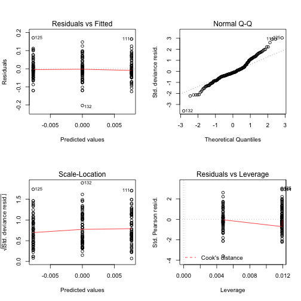
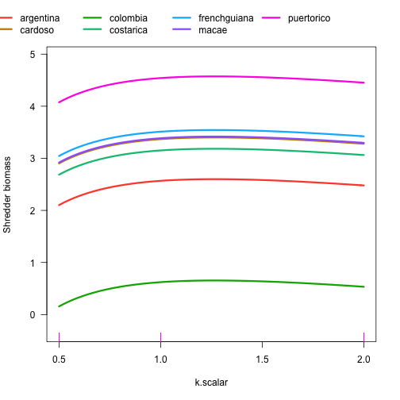
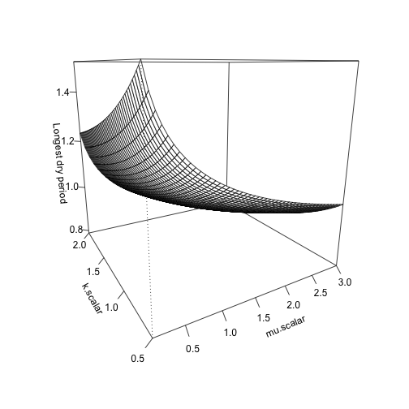

```r
#import fulldata from 01_accessing_data.R

# setwd("C:/Users/Diane/Dropbox/BWG Drought Experiment/Paper 1_thresholds")


library(lme4)
library(lmerTest)
library(MASS)
library(vcd)
library(fitdistrplus)
library(car)
library(knitr)
library(visreg)
library(vegan)
library(dplyr)
library(ggplot2)
library(RColorBrewer)
library(tidyr)
library(Hmisc)
library(quantreg)
library(MuMIn)
library(readr)
library(tibble)

agreement <- Agreement::agreement

fulldata<-read.csv("../00_BWGrainfall_data/Data/BWG_wide_functional_groups_ibuttons.csv")
```

```
## Warning in file(file, "rt"): cannot open file '../00_BWGrainfall_data/Data/
## BWG_wide_functional_groups_ibuttons.csv': No such file or directory
```

```
## Error in file(file, "rt"): cannot open the connection
```

```r
sim<-read.csv("Data/simblank.csv", row.names=1)
```

```
## Warning in file(file, "rt"): cannot open file 'Data/simblank.csv': No such
## file or directory
```

```
## Error in file(file, "rt"): cannot open the connection
```

```r
invert_traits<-read.csv("../00_BWGrainfall_data/Data/BWG_final_invertebrate_traits.csv")
```

```
## Warning in file(file, "rt"): cannot open file '../00_BWGrainfall_data/Data/
## BWG_final_invertebrate_traits.csv': No such file or directory
```

```
## Error in file(file, "rt"): cannot open the connection
```

```r
#need to use package agreement function agreement to do Lin's concordance and partition acuracy and precision
#Lawrence Lin, A. S Hedayat, Bikas Sinha, Min Yang. Journal of the American Statistical Associa-
#tion. March 1, 2002, 97(457): 257-270

#=====don't skip!making new variables========
#cardoso has an "engulfing" monopelopia (Diptera 175) - switch to piercing - this has now been done
#macae had a grazer, this has now been corrected


#======Dsquared function====
Dsquared <- function(model = NULL, 
                     obs = NULL, 
                     pred = NULL, 
                     family = NULL, # needed only when 'model' not provided
                     adjust = FALSE, 
                     npar = NULL) { # needed only when 'model' not provided
  # version 1.4 (31 Aug 2015)
  
  model.provided <- ifelse(is.null(model), FALSE, TRUE)
  
  if (model.provided) {
    if (!("glm" %in% class(model))) stop ("'model' must be of class 'glm'.")
    if (!is.null(pred)) message("Argument 'pred' ignored in favour of 'model'.")
    if (!is.null(obs)) message("Argument 'obs' ignored in favour of 'model'.")
    obs <- model$y
    pred <- model$fitted.values
    
  } else { # if model not provided
    if (is.null(obs) | is.null(pred)) stop ("You must provide either 'obs' and 'pred', or a 'model' object of class 'glm'.")
    if (length(obs) != length(pred)) stop ("'obs' and 'pred' must be of the same length (and in the same order).")
    if (is.null(family)) stop ("With 'obs' and 'pred' arguments (rather than a model object), you must also specify one of two model family options: 'binomial' or 'poisson' (in quotes).")
    else if (!is.character(family)) stop ("Argument 'family' must be provided as character (i.e. in quotes: 'binomial' or 'poisson').")
    else if (length(family) != 1 | !(family %in% c("binomial", "poisson"))) stop ("'family' must be either 'binomial' or 'poisson' (in quotes).")
    
    if (family == "binomial") {
      if (any(!(obs %in% c(0, 1)) | pred < 0 | pred > 1)) stop ("'binomial' family implies that 'obs' data should be binary (with values 0 or 1) and 'pred' data should be bounded between 0 and 1.")
      link <- log(pred / (1 - pred))  # logit
    }  # end if binomial
    
    else if (family == "poisson") {
      if (any(obs %%1 != 0)) stop ("'poisson' family implies that 'obs' data should consist of whole numbers.")
      link <- log(pred)
    }  # end if poisson
    
    model <- glm(obs ~ link, family = family)
  }  # end if model not provided
  
  D2 <- (model$null.deviance - model$deviance) / model$null.deviance
  
  if (adjust) {
    if (model.provided) {
      n <- length(model$y)
      #p <- length(model$coefficients)
      p <- attributes(logLik(model))$df
    } else {
      if (is.null(npar)) stop ("Adjusted D-squared from 'obs' and 'pred' values (rather than a model object) requires specifying the number of parameters in the underlying model ('npar').")
      n <- length(na.omit(obs))
      p <- npar
    }  # end if model.provided else
    
    D2 <- 1 - ((n - 1) / (n - p)) * (1 - D2)
  }  # end if adjust
  
  return (D2)
}

#==========multisite model comparisons

aic.lmx<-function(y, family, dataset)
{
  m0<-glm(y~log(maxvol)+site, family=family, data = dataset)
  m1<-glm(y~log(maxvol)+site+log(mu.scalar), family=family, data = dataset)
  m2<-glm(y~log(maxvol)+site+log(k.scalar), family=family, data = dataset)
  m3<-glm(y~log(maxvol)+site+log(mu.scalar)+I(log(mu.scalar)^2), family=family, data = dataset)
  m4<-glm(y~log(maxvol)+site+log(k.scalar)+I(log(k.scalar)^2), family=family, data = dataset)
  m5<-glm(y~log(maxvol)+site*log(mu.scalar), family=family, data = dataset)
  m6<-glm(y~log(maxvol)+site*log(k.scalar), family=family, data = dataset)
  m7<-glm(y~log(maxvol)+site*(log(mu.scalar)+I(log(mu.scalar)^2)), family=family, data = dataset)
  m8<-glm(y~log(maxvol)+site*(log(k.scalar)+I(log(k.scalar)^2)), family=family, data = dataset)
  m9<-glm(y~log(maxvol)+site+log(mu.scalar)*log(k.scalar), family=family, data = dataset)
  m10<-glm(y~log(maxvol)+site+log(mu.scalar)*(log(k.scalar)+I(log(k.scalar)^2)), family=family, data = dataset)
  m11<-glm(y~log(maxvol)+site+log(k.scalar)*(log(mu.scalar)+I(log(mu.scalar)^2)), family=family, data = dataset)
  m12<-glm(y~log(maxvol)+site+(log(k.scalar)+I(log(k.scalar)^2))*(log(mu.scalar)+I(log(mu.scalar)^2)), family=family, data = dataset)
  m13<-glm(y~log(maxvol)+site*log(mu.scalar)*log(k.scalar), family=family, data = dataset)
  m14<-glm(y~log(maxvol)+site*log(mu.scalar)*(log(k.scalar)+I(log(k.scalar)^2)), family=family, data = dataset)
  m15<-glm(y~log(maxvol)+site*log(k.scalar)*(log(mu.scalar)+I(log(mu.scalar)^2)), family=family, data = dataset)
  m16<-glm(y~log(maxvol)+site*(log(k.scalar)+I(log(k.scalar)^2))*(log(mu.scalar)+I(log(mu.scalar)^2)), family=family, data = dataset)
  aic.mod<-c(m0$aic, m1$aic, m2$aic, m3$aic, m4$aic, m5$aic, m6$aic, m7$aic, m8$aic, m9$aic, m10$aic,m11$aic, m12$aic, m13$aic, m14$aic, m15$aic, m16$aic)
   print(aicset<-model.sel(m0, m1, m2, m3, m4, m5, m6, m7, m8, m9, m10, m11, m12, m13, m14, m15, m16))
}

aic.lmxnb<-function(y, dataset)
{
  m0<-glm.nb(y~log(maxvol)+site, data = dataset)
  m1<-glm.nb(y~log(maxvol)+site+log(mu.scalar), data = dataset)
  m2<-glm.nb(y~log(maxvol)+site+log(k.scalar), data = dataset)
  m3<-glm.nb(y~log(maxvol)+site+log(mu.scalar)+I(log(mu.scalar)^2), data = dataset)
  m4<-glm.nb(y~log(maxvol)+site+log(k.scalar)+I(log(k.scalar)^2), data = dataset)
  m5<-glm.nb(y~log(maxvol)+site*log(mu.scalar),  data = dataset)
  m6<-glm.nb(y~log(maxvol)+site*log(k.scalar), data = dataset)
  m7<-glm.nb(y~log(maxvol)+site*(log(mu.scalar)+I(log(mu.scalar)^2)), data = dataset)
  m8<-glm.nb(y~log(maxvol)+site*(log(k.scalar)+I(log(k.scalar)^2)), data = dataset)
  m9<-glm.nb(y~log(maxvol)+site+log(mu.scalar)*log(k.scalar),  data = dataset)
  m10<-glm.nb(y~log(maxvol)+site+log(mu.scalar)*(log(k.scalar)+I(log(k.scalar)^2)), data = dataset)
  m11<-glm.nb(y~log(maxvol)+site+log(k.scalar)*(log(mu.scalar)+I(log(mu.scalar)^2)), data = dataset)
  m12<-glm.nb(y~log(maxvol)+site+(log(k.scalar)+I(log(k.scalar)^2))*(log(mu.scalar)+I(log(mu.scalar)^2)), data = dataset)
  m13<-glm.nb(y~log(maxvol)+site*log(mu.scalar)*log(k.scalar),  data = dataset)
  m14<-glm.nb(y~log(maxvol)+site*log(mu.scalar)*(log(k.scalar)+I(log(k.scalar)^2)), data = dataset)
  m15<-glm.nb(y~log(maxvol)+site*log(k.scalar)*(log(mu.scalar)+I(log(mu.scalar)^2)), data = dataset)
  m16<-glm.nb(y~log(maxvol)+site*(log(k.scalar)+I(log(k.scalar)^2))*(log(mu.scalar)+I(log(mu.scalar)^2)), data = dataset)
  print(aicset<-model.sel(m0, m1, m2, m3, m4, m5, m6, m7, m8, m9, m10, m11, m12, m13, m14, m15, m16))
}

aic.lmxnb.init<-function(y,init.theta, dataset)
{
  m0<-glm.nb(y~log(maxvol)+site, init.theta=init.theta, data = dataset)
  m1<-glm.nb(y~log(maxvol)+site+log(mu.scalar),init.theta=init.theta, data = dataset)
  m2<-glm.nb(y~log(maxvol)+site+log(k.scalar),init.theta=init.theta, data = dataset)
  m3<-glm.nb(y~log(maxvol)+site+log(mu.scalar)+I(log(mu.scalar)^2), init.theta=init.theta,data = dataset)
  m4<-glm.nb(y~log(maxvol)+site+log(k.scalar)+I(log(k.scalar)^2), init.theta=init.theta,data = dataset)
  m5<-glm.nb(y~log(maxvol)+site*log(mu.scalar), init.theta=init.theta, data = dataset)
  m6<-glm.nb(y~log(maxvol)+site*log(k.scalar), init.theta=init.theta,data = dataset)
  m7<-glm.nb(y~log(maxvol)+site*(log(mu.scalar)+I(log(mu.scalar)^2)), init.theta=init.theta,data = dataset)
  m8<-glm.nb(y~log(maxvol)+site*(log(k.scalar)+I(log(k.scalar)^2)), init.theta=init.theta,data = dataset)
  m9<-glm.nb(y~log(maxvol)+site+log(mu.scalar)*log(k.scalar), init.theta=init.theta, data = dataset)
  m10<-glm.nb(y~log(maxvol)+site+log(mu.scalar)*(log(k.scalar)+I(log(k.scalar)^2)), init.theta=init.theta,data = dataset)
  m11<-glm.nb(y~log(maxvol)+site+log(k.scalar)*(log(mu.scalar)+I(log(mu.scalar)^2)), init.theta=init.theta,data = dataset)
  m12<-glm.nb(y~log(maxvol)+site+(log(k.scalar)+I(log(k.scalar)^2))*(log(mu.scalar)+I(log(mu.scalar)^2)), init.theta=init.theta,data = dataset)
  m13<-glm.nb(y~log(maxvol)+site*log(mu.scalar)*log(k.scalar),init.theta=init.theta,  data = dataset)
  m14<-glm.nb(y~log(maxvol)+site*log(mu.scalar)*(log(k.scalar)+I(log(k.scalar)^2)), init.theta=init.theta,data = dataset)
  m15<-glm.nb(y~log(maxvol)+site*log(k.scalar)*(log(mu.scalar)+I(log(mu.scalar)^2)), init.theta=init.theta,data = dataset)
  m16<-glm.nb(y~log(maxvol)+site*(log(k.scalar)+I(log(k.scalar)^2))*(log(mu.scalar)+I(log(mu.scalar)^2)), init.theta=init.theta,data = dataset)
  print(aicset<-model.sel(m0, m1, m2, m3, m4, m5, m6, m7, m8, m9, m10, m11, m12, m13, m14, m15, m16))
}

aic.lmxnb.add<-function(y, dataset)
{
  m0<-glm.nb(y~log(maxvol)+site, data = dataset)
  m1<-glm.nb(y~log(maxvol)+site+log(mu.scalar), data = dataset)
  m2<-glm.nb(y~log(maxvol)+site+log(k.scalar), data = dataset)
  m3<-glm.nb(y~log(maxvol)+site+log(mu.scalar)+I(log(mu.scalar)^2), data = dataset)
  m4<-glm.nb(y~log(maxvol)+site+log(k.scalar)+I(log(k.scalar)^2), data = dataset)
  m9<-glm.nb(y~log(maxvol)+site+log(mu.scalar)*log(k.scalar),  data = dataset)
  m10<-glm.nb(y~log(maxvol)+site+log(mu.scalar)*(log(k.scalar)+I(log(k.scalar)^2)), data = dataset)
  m11<-glm.nb(y~log(maxvol)+site+log(k.scalar)*(log(mu.scalar)+I(log(mu.scalar)^2)), data = dataset)
  m12<-glm.nb(y~log(maxvol)+site+(log(k.scalar)+I(log(k.scalar)^2))*(log(mu.scalar)+I(log(mu.scalar)^2)), data = dataset)
  print(aicset<-model.sel(m0, m1, m2, m3, m4, m9, m10, m11, m12))
}

aic.lmx.add<-function(y, family, dataset)
{
  m0<-glm(y~log(maxvol)+site, family=family, data = dataset)
  m1<-glm(y~log(maxvol)+site+log(mu.scalar), family=family,data = dataset)
  m2<-glm(y~log(maxvol)+site+log(k.scalar),family=family, data = dataset)
  m3<-glm(y~log(maxvol)+site+log(mu.scalar)+I(log(mu.scalar)^2), family=family,data = dataset)
  m4<-glm(y~log(maxvol)+site+log(k.scalar)+I(log(k.scalar)^2), family=family,data = dataset)
  m9<-glm(y~log(maxvol)+site+log(mu.scalar)*log(k.scalar),family=family,data = dataset)
  m10<-glm(y~log(maxvol)+site+log(mu.scalar)*(log(k.scalar)+I(log(k.scalar)^2)), family=family,data = dataset)
  m11<-glm(y~log(maxvol)+site+log(k.scalar)*(log(mu.scalar)+I(log(mu.scalar)^2)), family=family,data = dataset)
  m12<-glm(y~log(maxvol)+site+(log(k.scalar)+I(log(k.scalar)^2))*(log(mu.scalar)+I(log(mu.scalar)^2)), family=family,data = dataset)
  print(aicset<-model.sel(m0, m1, m2, m3, m4, m9, m10, m11, m12))
}

aic.hydro<-function(y, formula, family, dataset)
{
  m0<-glm(formula, family=family, data = dataset)
  m1<-glm(y~log(maxvol)+site+cv.depth, family=family, data = dataset)
  m2<-glm(y~log(maxvol)+site+prop.overflow.days, family=family, data = dataset)
  m3<-glm(y~log(maxvol)+site+prop.driedout.days, family=family, data = dataset)
  m4<-glm(y~log(maxvol)+site+mean.depth, family=family, data = dataset)
  m5<-glm(y~log(maxvol)+site+long_dry, family=family, data = dataset)
  m6<-glm(y~log(maxvol)+site+last_wet, family=family, data = dataset)
  m7<-glm(y~log(maxvol)+site+change_cv_temp, family=family, data = dataset)
  m8<-glm(y~log(maxvol)+site+change_mean_temp, family=family, data = dataset)
  m17<-glm(y~log(maxvol)+site*cv.depth, family=family, data = dataset)
  m18<-glm(y~log(maxvol)+site*prop.overflow.days, family=family, data = dataset)
  m19<-glm(y~log(maxvol)+site*prop.driedout.days, family=family, data = dataset)
  m20<-glm(y~log(maxvol)+site*mean.depth, family=family, data = dataset)
  m21<-glm(y~log(maxvol)+site*long_dry, family=family, data = dataset)
  m22<-glm(y~log(maxvol)+site*last_wet, family=family, data = dataset)
  m23<-glm(y~log(maxvol)+site*change_cv_temp, family=family, data = dataset)
  m24<-glm(y~log(maxvol)+site*change_mean_temp, family=family, data = dataset)
  print(aicset<-model.sel(m0, m1, m2, m3, m4, m5, m6, m7, m8, m17,m18,m19,m20,m21,m22,m23,m24))
}

aic.hydro.add<-function(y, family, dataset)
{
  m0<-glm(y~log(maxvol)+site, family=family, data = dataset)
  m1<-glm(y~log(maxvol)+site+cv.depth, family=family, data = dataset)
  m2<-glm(y~log(maxvol)+site+prop.overflow.days, family=family, data = dataset)
  m3<-glm(y~log(maxvol)+site+prop.driedout.days, family=family, data = dataset)
  m4<-glm(y~log(maxvol)+site+mean.depth, family=family, data = dataset)
  m5<-glm(y~log(maxvol)+site+long_dry, family=family, data = dataset)
  m6<-glm(y~log(maxvol)+site+last_wet, family=family, data = dataset)
  print(aicset<-model.sel(m0, m1, m2, m3, m4, m5, m6))
}

aic.hydro.nb<-function(y, formula, dataset)
{
  m0<-glm.nb(formula,data = dataset)
  m1<-glm.nb(y~log(maxvol)+site+cv.depth,  data = dataset)
  m2<-glm.nb(y~log(maxvol)+site+prop.overflow.days, data = dataset)
  m3<-glm.nb(y~log(maxvol)+site+prop.driedout.days,  data = dataset)
  m4<-glm.nb(y~log(maxvol)+site+mean.depth,  data = dataset)
  m5<-glm.nb(y~log(maxvol)+site+long_dry,  data = dataset)
  m6<-glm.nb(y~log(maxvol)+site+last_wet,  data = dataset)
  m7<-glm.nb(y~log(maxvol)+site+change_cv_temp,  data = dataset)
  m8<-glm.nb(y~log(maxvol)+site+change_mean_temp,  data = dataset)
  m17<-glm.nb(y~log(maxvol)+site*cv.depth,  data = dataset)
  m18<-glm.nb(y~log(maxvol)+site*prop.overflow.days, data = dataset)
  m19<-glm.nb(y~log(maxvol)+site*prop.driedout.days,  data = dataset)
  m20<-glm.nb(y~log(maxvol)+site*mean.depth,  data = dataset)
  m21<-glm.nb(y~log(maxvol)+site*long_dry,  data = dataset)
  m22<-glm.nb(y~log(maxvol)+site*last_wet,  data = dataset)
  m23<-glm.nb(y~log(maxvol)+site*change_cv_temp,  data = dataset)
  m24<-glm.nb(y~log(maxvol)+site*change_mean_temp,  data = dataset)
  print(aicset<-model.sel(m0, m1, m2, m3, m4, m5, m6, m7, m8,m17,m18,m19,m20,m21,m22,m23,m24))
}

aic.hydro.nb.add<-function(y, dataset)
{
  m0<-glm.nb(y~log(maxvol)+site,  data = dataset)
  m1<-glm.nb(y~log(maxvol)+site+cv.depth,  data = dataset)
  m2<-glm.nb(y~log(maxvol)+site+prop.overflow.days, data = dataset)
  m3<-glm.nb(y~log(maxvol)+site+prop.driedout.days,  data = dataset)
  m4<-glm.nb(y~log(maxvol)+site+mean.depth,  data = dataset)
  m5<-glm.nb(y~log(maxvol)+site+long_dry,  data = dataset)
  m6<-glm.nb(y~log(maxvol)+site+last_wet,  data = dataset)
  print(aicset<-model.sel(m0, m1, m2, m3, m4, m5, m6))
}

aic.site<-function(y, family, dataset)
{
  m0<-glm(y~log(maxvol), family=family, data = dataset)
  m1<-glm(y~log(maxvol)+log(mu.scalar), family=family, data = dataset)
  m2<-glm(y~log(maxvol)+log(k.scalar), family=family, data = dataset)
  m3<-glm(y~log(maxvol)+log(mu.scalar)+I(log(mu.scalar)^2), family=family, data = dataset)
  m4<-glm(y~log(maxvol)+log(k.scalar)+I(log(k.scalar)^2), family=family, data = dataset)
  m9<-glm(y~log(maxvol)+log(mu.scalar)*log(k.scalar), family=family, data = dataset)
  m10<-glm(y~log(maxvol)+log(mu.scalar)*(log(k.scalar)+I(log(k.scalar)^2)), family=family, data = dataset)
  m11<-glm(y~log(maxvol)+log(k.scalar)*(log(mu.scalar)+I(log(mu.scalar)^2)), family=family, data = dataset)
  m12<-glm(y~log(maxvol)+(log(k.scalar)+I(log(k.scalar)^2))*(log(mu.scalar)+I(log(mu.scalar)^2)), family=family, data = dataset)
  print(aicset<-model.sel(m0, m1, m2, m3, m4, m9, m10, m11, m12))
}

aic.sitenb<-function(y, dataset)
{
  m0<-glm.nb(y~log(maxvol), data = dataset)
  m1<-glm.nb(y~log(maxvol)+log(mu.scalar), data = dataset)
  m2<-glm.nb(y~log(maxvol)+log(k.scalar), data = dataset)
  m3<-glm.nb(y~log(maxvol)+log(mu.scalar)+I(log(mu.scalar)^2), data = dataset)
  m4<-glm.nb(y~log(maxvol)+log(k.scalar)+I(log(k.scalar)^2), data = dataset)
  m9<-glm.nb(y~log(maxvol)+log(mu.scalar)*log(k.scalar), data = dataset)
  m10<-glm.nb(y~log(maxvol)+log(mu.scalar)*(log(k.scalar)+I(log(k.scalar)^2)), data = dataset)
  m11<-glm.nb(y~log(maxvol)+log(k.scalar)*(log(mu.scalar)+I(log(mu.scalar)^2)), data = dataset)
  m12<-glm.nb(y~log(maxvol)+(log(k.scalar)+I(log(k.scalar)^2))*(log(mu.scalar)+I(log(mu.scalar)^2)), data = dataset)
  print(aicset<-model.sel(m0, m1, m2, m3, m4, m9, m10, m11, m12))
}


aic.site.hydro.nb<-function(y, dataset)
{
  m0<-glm.nb(y~log(maxvol),  data = dataset)
  m1<-glm.nb(y~log(maxvol)+cv.depth,  data = dataset)
  m2<-glm.nb(y~log(maxvol)+prop.overflow.days, data = dataset)
  m3<-glm.nb(y~log(maxvol)+prop.driedout.days,  data = dataset)
  m4<-glm.nb(y~log(maxvol)+mean.depth,  data = dataset)
  m5<-glm.nb(y~log(maxvol)+long_dry,  data = dataset)
  m6<-glm.nb(y~log(maxvol)+last_wet,  data = dataset)
  print(aicset<-model.sel(m0, m1, m2, m3, m4, m5, m6))
}

aic.site.hydro<-function(y, family, dataset)
{
  m0<-glm(y~log(maxvol),  family=family, data = dataset)
  m1<-glm(y~log(maxvol)+cv.depth,  family=family, data = dataset)
  m2<-glm(y~log(maxvol)+prop.overflow.days, family=family,data = dataset)
  m3<-glm(y~log(maxvol)+prop.driedout.days,  family=family,data = dataset)
  m4<-glm(y~log(maxvol)+mean.depth, family=family, data = dataset)
  m5<-glm(y~log(maxvol)+long_dry,  family=family,data = dataset)
  m6<-glm(y~log(maxvol)+last_wet,  family=family,data = dataset)
  print(aicset<-model.sel(m1, m2, m3, m4, m5, m6))
}

#rule: type 3 if sig interactions, type 2 if just sig main effects. Start with type 2 (most power), if sig int switch to type 3

#useful check for NAs

datacheck<-function(a)
  {
  sum(length(which((a)>0)))
}
tapply(fulldata$Odonata_bio, fulldata$site, datacheck)
```

```
##    argentina      cardoso     colombia    costarica frenchguiana 
##            0           26            4            8            2 
##        macae   puertorico 
##           18            0
```

```r
#===creation of custom datasets===================

fulldata$site<-as.factor(fulldata$site)
fulldata$mu.scalar.2<-fulldata$mu.scalar^2
fulldata$k.scalar.2<-fulldata$k.scalar^2
fulldata$intended.mu.2<-fulldata$intended.mu^2
fulldata$intended.k.2<-fulldata$intended.k^2
fulldata$change.k<-abs(log(fulldata$k.scalar))
fulldata$change.mu<-abs(log(fulldata$mu.scalar))

fulldata$bacteria.per.nl.final<-(fulldata$bacteria.per.ml.final/1000000)

# predator_biomass is the sum of predator_engulfer_total_biomass and
# predator_piercer_total_biomass. Check:
with(fulldata,
     stopifnot(all.equal(predator_biomass, 
                         predator_engulfer_total_biomass + 
                           predator_piercer_total_biomass)))

# prey_biomass is the sum of prey_scraper_total_biomass,
# prey_gatherer_total_biomass, prey_shredder_total_biomass and
# prey_piercer_total_biomass and prey_filter.feeder_total_biomass
with(fulldata,
     # Stop everything if prey_biomass does not equal the sum of these columns
     stopifnot(all.equal(prey_biomass, 
                         prey_scraper_total_biomass + 
                           prey_gatherer_total_biomass +
                           prey_shredder_total_biomass +
                           prey_piercer_total_biomass + 
                           prey_filter.feeder_total_biomass)))


# detritivore_total_biomass is a separate thing from total_prey_biomass. This is
# ONLY the scrapers, gatherers and shredders
fulldata$detritivore_total_biomass <- with(fulldata, prey_scraper_total_biomass + 
                                             prey_gatherer_total_biomass +
                                             prey_shredder_total_biomass)


fulldata$PDratio <- with(fulldata, predator_biomass / detritivore_total_biomass)

# This next line seems unnecessary now -- we have this number as prey_biomass.
# This includes also prey which are piercing (Cecidomyiidae) 

# fulldata$totalbio <- fulldata$predator_bio + fulldata$detritivore_bio + fulldata$filter.feeder_bio

# fulldata <- 

full_data_temp_trophic <- fulldata %>% 
  # Separating taxonomic groups by their trophic position
  mutate(detChiron_bio           = Chironomidae_bio - Tanypodinae_bio,
         predCerato_bio          = Bezzia_bio + Sphaeromias_bio + Stilobezzia_bio + Culicoides_bio,
         detCerato_bio           = Ceratopogonidae_bio - predCerato_bio,
         TipulidaeLimoniidae_bio = Tipulidae_bio + Limoniidae_bio,
         filtCulicidae           = Culex_bio + Wyeomyia_bio + Anopheles_bio) %>% 
  # deriving environmental data
  mutate(exposure = prop.driedout.days * mean_temp,
         # How does temperature vary from a the site average? This is equivalent
         # to subtracting the site mean from mean_temp
         change_mean_temp = resid(glm(mean_temp~site, family=gaussian, data=fulldata, na.action=na.exclude)),
         change_cv_temp = resid(glm(cv_mean_temp~site, family=gaussian, data=fulldata, na.action=na.exclude)))

# dropping NAs in mean_temp would drop.. 30 bromeliads?!
full_data_temp_trophic %>% 
  filter(is.na(mean_temp))
```

```
##     site_brom.id     site  trt.name mu.scalar k.scalar intended.mu
## 1  cardoso_DEC17  cardoso   mu3k0.5       3.0      0.5       22.67
## 2  cardoso_DEC36  cardoso   mu0.1k1       0.1      1.0        0.76
## 3  cardoso_DEC54  cardoso   mu0.2k1       0.2      1.0        1.51
##    intended.k temporal.block maxvol leaf.number mean.diam catchment.area
## 1        0.10              a   1015          33   96.0000             NA
## 2        0.19              a   1150          35  106.0000             NA
## 3        0.19              a   1225          38  105.0000             NA
##    turbidity.initial oxygen.percent.initial oxygen.conc.initial ph.initial
## 1              43.67                     NA                  NA        5.0
## 2              55.46                     NA                  NA        5.0
## 3              56.16                     NA                  NA        5.6
##    chlorophyll.initial bacteria.per.ml..initial amoeba.per.ml.initial
## 1             -5.21016                248828.21                    NA
## 2             -1.39536                337122.10                    NA
## 3             -3.12324               3298980.51                    NA
##    algae.per.ml.initial ciliates.per.ml.initial flagellates.per.ml.initial
## 1                    NA                      NA                         NA
## 2                    NA                      NA                         NA
## 3                    NA                      NA                         NA
##    rotifers.per.ml.initial leafpack1.species1.mass.initial
## 1                       NA                           232.8
## 2                       NA                           178.4
## 3                       NA                           227.2
##    leafpack2.species1.mass.initial leafpack1.species2.mass.initial
## 1                            216.7                              NA
## 2                            211.5                              NA
## 3                            232.8                              NA
##    leafpack2.species2.mass.initial  co2.final methane.final
## 1                               NA         NA            NA
## 2                               NA         NA            NA
## 3                               NA         NA            NA
##    turbidity.final oxygen.percent.final oxygen.conc.final ph.final
## 1           246.90                   NA                NA 5.300000
## 2           750.00                   NA                NA 4.866667
## 3           327.00                   NA                NA 4.533333
##    chlorophyll.final bacteria.per.ml.final amoeba.per.ml.final
## 1           56.83440             2977911.8                  NA
## 2          414.73200             7504980.0                  NA
## 3          131.33520             5771209.2                  NA
##    algae.per.ml.final ciliates.per.ml.final flagellates.per.ml.final
## 1                  NA                    NA                       NA
## 2                  NA                    NA                       NA
## 3                  NA                    NA                       NA
##    rotifers.per.ml.final leafpack1.species1.mass.final
## 1                     NA                         185.0
## 2                     NA                         142.9
## 3                     NA                         175.9
##    leafpack2.species1.mass.final leafpack1.species2.mass.final
## 1                          160.4                            NA
## 2                          158.8                            NA
## 3                          144.8                            NA
##    leafpack2.species2.mass.final water.volume.final fpom.final
## 1                             NA              527.0   310.8696
## 2                             NA              566.0   242.0000
## 3                             NA              506.5   264.0000
##    n15.bromeliad.final final.bromeliad.percentn final.bromeliad.percentc
## 1           5.26276965                0.6867388                       NA
## 2          14.92548502                0.6623788                       NA
## 3          33.20094345                0.5370105                       NA
##     species1  species2    decomp sample_size_species mean.depth max.depth
## 1  0.2325663        NA 0.2325663                   1         NA        NA
## 2  0.2240818        NA 0.2240818                   1         NA        NA
## 3  0.3018996        NA 0.3018996                   1         NA        NA
##    min.depth amplitude net_fluc tot_fluc sd.depth cv.depth   wetness
## 1         NA        NA       NA       NA       NA       NA        NA
## 2         NA        NA       NA       NA       NA       NA        NA
## 3         NA        NA       NA       NA       NA       NA        NA
##    prop.overflow.days prop.driedout.days long_dry long_wet n_driedout
## 1                  NA                 NA       NA       NA         NA
## 2                  NA                 NA       NA       NA         NA
## 3                  NA                 NA       NA       NA         NA
##    n_overflow last_dry last_wet NA_NA_total_abundance NA_NA_total_biomass
## 1          NA       NA       NA                     4          0.22784810
## 2          NA       NA       NA                     1          0.09333333
## 3          NA       NA       NA                     1          0.09333333
##    NA_NA_total_taxa predator_engulfer_total_abundance
## 1                 1                                14
## 2                 1                                57
## 3                 1                                47
##    predator_engulfer_total_biomass predator_engulfer_total_taxa
## 1                        1.6811491                            4
## 2                        7.9858182                            5
## 3                        7.5820963                            5
##    predator_piercer_total_abundance predator_piercer_total_biomass
## 1                                77                      0.5384615
## 2                               144                      1.0034615
## 3                               242                      1.8632051
##    predator_piercer_total_taxa prey_filter.feeder_total_abundance
## 1                            2                                 30
## 2                            3                                 21
## 3                            4                                 14
##    prey_filter.feeder_total_biomass prey_filter.feeder_total_taxa
## 1                          3.562500                             3
## 2                          2.493750                             2
## 3                          1.742647                             4
##    prey_gatherer_total_abundance prey_gatherer_total_biomass
## 1                            347                   12.450200
## 2                            398                   15.965676
## 3                            260                    8.937647
##    prey_gatherer_total_taxa prey_piercer_total_abundance
## 1                        12                            0
## 2                        14                            0
## 3                        12                            0
##    prey_piercer_total_biomass prey_piercer_total_taxa
## 1                  0.00000000                       0
## 2                  0.00000000                       0
## 3                  0.00000000                       0
##    prey_scraper_total_abundance prey_scraper_total_biomass
## 1                            43                19.35000000
## 2                            62                27.90000000
## 3                            15                 6.75000000
##    prey_scraper_total_taxa prey_shredder_total_abundance
## 1                        1                             6
## 2                        2                             7
## 3                        1                            12
##    prey_shredder_total_biomass prey_shredder_total_taxa predator_biomass
## 1                   3.22526316                        2         2.219611
## 2                   3.76280702                        1         8.989280
## 3                   6.45052632                        1         9.445301
##    prey_biomass predator_abundance prey_abundance Coleoptera_bio
## 1     38.587963                 91            426     19.3500000
## 2     50.122233                201            488     27.9000000
## 3     23.880820                289            301      6.8500000
##    Diptera_bio Ephemeroptera_bio Haplotaxida_bio Lepidoptera_bio
## 1    18.411145         0.0000000      1.93670886               0
## 2    25.933856         0.0000000      0.17088608               0
## 3    20.819185         0.0000000      1.02531646               0
##    Odonata_bio  ord_NA_bio Podocopida_bio Trichoptera_bio Hirudinea_bio
## 1    0.4297205  0.90784810     0.00000000            0.00     0.6800000
## 2    4.5201040  0.68000000     0.00000000            0.00     0.6800000
## 3    4.2716201  0.45333333     0.00000000            0.00     0.4533333
##    Neoptera_bio Oligochaeta_bio Palaeoptera_bio Podocopa_bio
## 1     37.761145      1.93670886       0.4297205   0.00000000
## 2     53.833856      0.17088608       4.5201040   0.00000000
## 3     27.669185      1.02531646       4.2716201   0.00000000
##    subclass_NA_bio Aeolosomatidae_bio Anisopodidae_bio Calamoceratidae_bio
## 1       0.22784810                  0        0.0000000                0.00
## 2       0.00000000                  0        0.0000000                0.00
## 3       0.00000000                  0        0.0000000                0.00
##    Candonidae_bio Cecidomyiidae_bio Ceratopogonidae_bio Chironomidae_bio
## 1               0        0.00000000         0.291794872         9.360920
## 2               0        0.00000000         0.046794872        16.230076
## 3               0        0.00000000         0.339102564         8.495433
##    Coenagrionidae_bio Corethrellidae_bio Culicidae_bio Curculionidae_bio
## 1           0.4297205         0.57142857      3.562500                 0
## 2           3.8494997         2.78571429      2.493750                 0
## 3           4.2716201         2.85714286      1.742647                 0
##    Dolichopodidae_bio Dytiscidae_bio Elateridae_bio Elmidae_bio
## 1                   0      0.0000000       0.000000           0
## 2                   0      0.0000000       0.000000           0
## 3                   0      0.0000000       0.000000           0
##    Empididae_bio Enchytraeoidae_bio Ephydridae_bio family_NA_bio
## 1     0.00000000                  0      0.6240000    0.90784810
## 2     0.02500000                  0      0.2106667    1.44393760
## 3     0.02500000                  0      0.8160000    0.54666667
##    Hydrophilidae_bio Lampyridae_bio Limnocytheridae_bio Limoniidae_bio
## 1                0.0            0.0          0.00000000     2.15017544
## 2                0.0            0.0          0.00000000     3.76280702
## 3                0.0            0.1          0.00000000     6.45052632
##    Muscidae_bio Naididae_bio Periscelididae_bio Phoridae_bio
## 1             0   1.93670886                  0   0.00000000
## 2             0   0.17088608                  0   0.00000000
## 3             0   1.02531646                  0   0.00000000
##    Pseudostigmatidae_bio Psychodidae_bio Ptilodactylidae_bio
## 1                      0      0.02857143               0.000
## 2                      0      0.28571429               0.000
## 3                      0      0.00000000               0.000
##    Scatopsidae_bio Sciaridae_bio Scirtidae_bio Sphaeroceridae_bio
## 1           0.0000          0.00   19.35000000                  0
## 2           0.0000          0.00   27.90000000                  0
## 3           0.0000          0.00    6.75000000                  0
##    Stratiomyidae_bio Syrphidae_bio Tabanidae_bio Tipulidae_bio
## 1         0.74666667        0.0000           0.0    1.07508772
## 2         0.00000000        0.0000           0.0    0.00000000
## 3         0.00000000        0.0000           0.0    0.00000000
##    Anophelinae_bio Calamoceratinae_bio Candoninae_bio Ceratopogoninae_bio
## 1        0.0000000                0.00              0          0.03846154
## 2        0.0000000                0.00              0          0.03846154
## 3        0.3176471                0.00              0          0.21153846
##    Chioneinae_bio Chironominae_bio Copelatinae_bio Corethrellinae_bio
## 1      0.00000000         8.426753            0.00         0.57142857
## 2      0.00000000        14.974719            0.00         2.78571429
## 3      0.00000000         6.441385            0.00         2.85714286
##    Culicinae_bio Dasyheleniae_bio Eristalinae_bio Forcipomyiinae_bio
## 1       3.562500                0          0.0000        0.253333333
## 2       2.493750                0          0.0000        0.008333333
## 3       1.425000                0          0.0000        0.127564103
##    Hermetiinae_bio Limoniinae_bio Naidinae_bio Orthocladiinae_bio
## 1                0      2.1501754       0.0000          0.4341667
## 2                0      3.7628070       0.0000          0.3153571
## 3                0      6.4505263       0.0000          0.5273810
##    Pristininae_bio Psychodinae_bio Sphaeridiinae_bio subfamily_NA_bio
## 1                0          0.0000               0.0       25.0986033
## 2                0          0.0000               0.0       33.8857043
## 3                0          0.0000               0.0       13.5346032
##    Tabaninae_bio Tanypodinae_bio Timiriaseviinae_bio Tipulinae_bio
## 1            0.0       0.5000000          0.00000000    0.00000000
## 2            0.0       0.9400000          0.00000000    0.00000000
## 3            0.0       1.5266667          0.00000000    0.00000000
##    Aelosoma_bio Anopheles_bio Atrichopogon_bio Aulophorus_bio Bezzia_bio
## 1             0     0.0000000      0.253333333              0 0.03846154
## 2             0     0.0000000      0.008333333              0 0.03846154
## 3             0     0.3176471      0.127564103              0 0.21153846
##    Bromeliagrion_bio Candonopsis_bio Cheilotrichia_bio Chironomus_bio
## 1                  0               0        0.00000000      1.4657143
## 2                  0               0        0.00000000      4.1600000
## 3                  0               0        0.00000000      5.1028571
##    Contacyphon_bio Copelatus_bio Corethrella_bio Corynoneura_bio Culex_bio
## 1                0          0.00      0.57142857       0.2428571  3.562500
## 2                0          0.00      2.78571429       0.2714286  2.493750
## 3                0          0.00      2.85714286       0.3857143  1.425000
##    Culicoides_bio Dero_bio Elpidium_bio Eristalis_bio Forcipomyia_bio
## 1      0.00000000   0.0000   0.00000000        0.0000         0.00000
## 2      0.00000000   0.0000   0.00000000        0.0000         0.00000
## 3      0.00000000   0.0000   0.00000000        0.0000         0.00000
##    genus_NA_bio Haemagogus_bio Harnischia_bio Hermetia_bio Larsia_bio
## 1     24.823049              0    0.000000000            0   0.000000
## 2     30.048705              0    0.000000000            0   0.000000
## 3      9.404650              0    0.000000000            0   0.000000
##    Leptagrion_bio Limnophyes_bio Mecistogaster_bio Monopelopia_bio
## 1       0.4297205    0.037142857                 0       0.5000000
## 2       3.8494997    0.031428571                 0       0.9400000
## 3       4.2716201    0.000000000                 0       1.5266667
##    Pericoma_bio Phylloicus_bio Polypedilum_bio Pristina_bio
## 1        0.0000           0.00       6.8229437            0
## 2        0.0000           0.00      10.6718615            0
## 3        0.0000           0.00       1.3147186            0
##    Sphaeromias_bio Stenochironomus_bio Stibasoma_bio Stilobezzia_bio
## 1                0         0.000000000           0.0               0
## 2                0         0.000000000           0.0               0
## 3                0         0.000000000           0.0               0
##    Tanytarsus_bio Tipula_bio Toxorhynchites_bio Trentepohlia_bio
## 1     0.138095238 0.00000000                  0        2.1501754
## 2     0.142857143 0.00000000                  0        3.7628070
## 3     0.023809524 0.00000000                  0        6.4505263
##    Wyeomyia_bio cv_max_temp cv_mean_temp cv_min_temp max_temp mean_temp
## 1     0.0000000          NA           NA          NA       NA        NA
## 2     0.0000000          NA           NA          NA       NA        NA
## 3     0.0000000          NA           NA          NA       NA        NA
##    min_temp sd_max_temp sd_mean_temp sd_min_temp mu.scalar.2 k.scalar.2
## 1        NA          NA           NA          NA        9.00       0.25
## 2        NA          NA           NA          NA        0.01       1.00
## 3        NA          NA           NA          NA        0.04       1.00
##    intended.mu.2 intended.k.2  change.k change.mu bacteria.per.nl.final
## 1       513.9289       0.0100 0.6931472 1.0986123             2.9779118
## 2         0.5776       0.0361 0.0000000 2.3025851             7.5049800
## 3         2.2801       0.0361 0.0000000 1.6094379             5.7712092
##    detritivore_total_biomass    PDratio detChiron_bio predCerato_bio
## 1                  35.025463 0.06337134      8.860920     0.03846154
## 2                  47.628483 0.18873748     15.290076     0.03846154
## 3                  22.138173 0.42665225      6.968766     0.21153846
##    detCerato_bio TipulidaeLimoniidae_bio filtCulicidae exposure
## 1    0.253333333              3.22526316      3.562500       NA
## 2    0.008333333              3.76280702      2.493750       NA
## 3    0.127564103              6.45052632      1.742647       NA
##    change_mean_temp change_cv_temp shredder_bio filter.feeder_bio
## 1                NA             NA   3.22526316          3.562500
## 2                NA             NA   3.76280702          2.493750
## 3                NA             NA   6.45052632          1.742647
##    scraper_bio gatherer_bio engulfer_bio piercer_bio  totalbio
## 1  19.35000000    12.450200    1.6811491  0.00000000 40.807574
## 2  27.90000000    15.965676    7.9858182  0.00000000 59.111513
## 3   6.75000000     8.937647    7.5820963  0.00000000 33.326122
##     resid.decomp   resid.shr resid.scraper      resid.tb resid.ff.hydro
## 1  -0.0035969884  0.10631221   0.201349970 -0.1264158209     0.10631221
## 2  -0.0143029844  0.29295578   0.517816695  0.2959836320     0.29295578
## 3   0.0608534911  0.98905191  -1.115647527 -0.6595539793     0.98905191
##    resid.sc.hydro resid.tb.hydro scaled.n15.bromeliad.final sqrt.decomp
## 1     0.201349970  -0.1264158209                  1.3208169   0.4822513
## 2     0.517816695   0.2959836320                  1.4442118   0.4733728
## 3    -1.115647527  -0.6595539793                  1.5715176   0.5494539
##    log.co2.final engulfer.sens.num engulfer.sens.denom engulfer.sens.index
## 1             NA                 0           1.6811491                   0
## 2             NA                 0           7.3152140                   0
## 3             NA                 0           7.5820963                   0
##    gatherer.sens.num gatherer.sens.denom gatherer.sens.index
## 1                  0           12.450200                   0
## 2                  0           15.965676                   0
## 3                  0            8.937647                   0
##    piercer.sens.num piercer.sens.denom piercer.sens.index all.sens.num
## 1                 0          0.5384615                  0            0
## 2                 0          1.0034615                  0            0
## 3                 0          1.7632051                  0            0
##    all.sens.denom all.sens.index
## 1       40.807574              0
## 2       58.440909              0
## 3       33.226122              0
##  [ reached getOption("max.print") -- omitted 32 rows ]
```

```r
full_data_temp_trophic %>% 
  group_by(site) %>% 
  count
```

```
## # A tibble: 7 × 2
##           site     n
##         <fctr> <int>
## 1    argentina    30
## 2      cardoso    30
## 3     colombia    30
## 4    costarica    30
## 5 frenchguiana    30
## 6        macae    30
## 7   puertorico    30
```

```r
# renaming fulldata to match downstream analysis ---------------------------------------------------

## from here, rename things just to permit the script to run!
fulldata <- full_data_temp_trophic %>% ungroup %>% as.data.frame

# creating new columns that match names to old ones
fulldata <- fulldata %>% 
  mutate(shredder_bio       = prey_shredder_total_biomass,
         filter.feeder_bio  = prey_filter.feeder_total_biomass,
         scraper_bio        = prey_scraper_total_biomass,
         gatherer_bio       = prey_gatherer_total_biomass,
         engulfer_bio       = predator_engulfer_total_biomass,
         piercer_bio        = prey_piercer_total_biomass,
         totalbio           = prey_biomass + predator_biomass) # Is that the right equation?? does it leave out NA

# Continue DS analysis ----------------------------------------------------


temptruedata<-filter(fulldata, mean_temp%nin%NA)
temphydrotruedata<-filter(temptruedata, cv.depth%nin%NA)
noleakydatatemp<-filter(temptruedata, site_brom.id%nin%c("macae_B24", "macae_B22", "macae_B9", "macae_B2", "macae_B11", "macae_B41", "argentina_15"))
noleakydata<-filter(fulldata, site_brom.id%nin%c("macae_B24", "macae_B22", "macae_B9", "macae_B2", "macae_B11", "macae_B41", "argentina_15"))


nocadata<-subset(fulldata,site!="cardoso")
nocadata$resid.driedout<-resid(glm(sqrt(prop.driedout.days)~maxvol+site*log(mu.scalar)*log(k.scalar), family=gaussian, data=nocadata))
nocadata$resid.overflow<-resid(glm(sqrt(prop.overflow.days)~maxvol+site*log(mu.scalar)*log(k.scalar), family=gaussian, data=nocadata))
nocadata$resid.cvdepth<-resid(glm(log(cv.depth)~maxvol+site*log(mu.scalar)*log(k.scalar), family=gaussian, data=nocadata))

ardata<-subset(fulldata,site=="argentina")
cadata<-subset(fulldata,site=="cardoso")
codata<-subset(fulldata,site=="colombia")
crdata<-subset(fulldata,site=="costarica")
fgdata<-subset(fulldata,site=="frenchguiana")
madata<-subset(fulldata,site=="macae")
prdata<-subset(fulldata,site=="puertorico")


noargdata<-subset(fulldata,site!="argentina")
noargmacdata<-subset(noargdata,site!="macae")
noargcodata<-subset(noargdata,site!="colombia" )
noargcadata<-subset(noargdata,site!="cardoso" )
noargprdata<-subset(noargdata,site!="puertorico" )
noargcaprdata<-subset(noargcadata,site!="puertorico" )
noargcocrdata<-subset(noargcodata,site!="costarica" )
nocodata<-subset(fulldata,site!="colombia")
nocoprdata<-subset(nocodata,site!="puertorico")
nofgdata<-subset(fulldata,site!="frenchguiana")
nocafgdata<-subset(nocadata,site!="frenchguiana")
nocacodata<-subset(nocadata,site!="colombia")
nocaprdata<-subset(nocadata,site!="puertorico")
nocacoprdata<-subset(nocacodata,site!="puertorico")
nococrdata<-subset(nocodata,site!="costarica")
nococrprdata<-subset(nococrdata,site!="puertorico")
nocacocrdata<-subset(nocacodata,site!="costarica")
noprdata<-subset(fulldata,site!="puertorico")
nomadata<-subset(fulldata,site!="macae")
noargcacodata<-subset(nocacodata,site!="argentina" )

camadata<-rbind(cadata, madata)
cafgmadata<-rbind(cadata, fgdata, madata)
camaprdata<-rbind(cadata, madata, prdata)
argcacodata<-rbind(ardata, cadata, codata)
cocrdata<-rbind(codata, crdata)
argcrdata<-rbind(ardata, crdata)
cafgdata<-rbind(cadata, fgdata)
cacrmadata<-rbind(cadata, crdata, madata)
maprdata<-rbind(madata, prdata)

nococr140data<-nococrdata[-140,]#working, corrects filter feeders
no67185data<-fulldata[-(c(67,185)),] #working
noargco13data<-noargcodata[-c(13, 127, 129),]
no126data<-fulldata[-126,]#working
noargco123data<-noargcodata[-123,]
noargco123datatemp<-filter(noargco123data, mean_temp%nin%NA)

nocaco170173<-nocacodata[-c(113,110),]
target<-c("67","61","66","68","90","79","61")
nocafgdata<-rownames_to_column(nocafgdata, "row")
nocafgclean<-filter(nocafgdata, row%nin%target)

###==lets make this flow

#an AICc approach

response<-as.vector(c("Decomposition", "Nitrogen uptake", "CO2 flux", "Shredder", "Filter feeder", "Scraper", "Gatherer", "Engulfer", "Piercer", "Bacterial density", "Total Invertebrates"))
aic.percent<-as.data.frame(response)

#decomp - rain
aic.lmx(sqrt(fulldata$decomp), gaussian, fulldata) #m2, m0, m9
```

```
## Model selection table 
##      (Int) log(mxv) sit log(mu.scl) log(k.scl) log(mu.scl)^2 log(k.scl)^2
## m2  0.6241  0.01828   +               0.011420                           
## m0  0.6451  0.01463   +                                                  
## m9  0.6271  0.01782   +    0.001070   0.008479                           
## m4  0.6243  0.01807   +               0.011400                  0.0033000
## m3  0.6531  0.01416   +   -0.004861                -0.005473             
## m1  0.6441  0.01485   +    0.001013                                      
## m11 0.6370  0.01696   +   -0.004775   0.007221     -0.005443             
## m10 0.6275  0.01770   +    0.004578   0.008467                  0.0006586
## m5  0.6366  0.01643   +    0.007292                                      
## m12 0.6249  0.01795   +    0.005983   0.007349      0.001306    0.0198000
## m6  0.6525  0.01335   +               0.012500                           
## m7  0.6490  0.01649   +   -0.007767                -0.014070             
## m8  0.6323  0.01737   +               0.012610                 -0.0091760
## m13 0.6615  0.01209   +    0.006987   0.010130                           
## m14 0.6211  0.02000   +    0.015920   0.010460                 -0.0157000
## m15 0.6643  0.01385   +   -0.008001   0.023890     -0.014110             
## m16 0.5944  0.02751   +   -0.002535   0.026010     -0.017960   -0.0278700
##     log(mu.scl):sit log(k.scl):sit I(log(mu.scl)^2):sit
## m2                                                     
## m0                                                     
## m9                                                     
## m4                                                     
## m3                                                     
## m1                                                     
## m11                                                    
## m10                                                    
## m5                +                                    
## m12                                                    
## m6                               +                     
## m7                +                                   +
## m8                               +                     
## m13               +              +                     
## m14               +              +                     
## m15               +              +                    +
## m16               +              +                    +
##     I(log(k.scl)^2):sit log(k.scl):log(mu.scl) log(k.scl)^2):log(mu.scl
## m2                                                                     
## m0                                                                     
## m9                                   -0.011820                         
## m4                                                                     
## m3                                                                     
## m1                                                                     
## m11                                  -0.010460                         
## m10                                  -0.011830                 -0.01096
## m5                                                                     
## m12                                  -0.010480                 -0.03349
## m6                                                                     
## m7                                                                     
## m8                    +                                                
## m13                                  -0.009569                         
## m14                   +              -0.009052                 -0.02614
## m15                                  -0.025540                         
## m16                   +              -0.026450                 -0.01329
##     log(mu.scl)^2):log(k.scl log(k.scl)^2):I(log(mu.scl)^2
## m2                                                        
## m0                                                        
## m9                                                        
## m4                                                        
## m3                                                        
## m1                                                        
## m11                 0.001284                              
## m10                                                       
## m5                                                        
## m12                 0.001255                      -0.02104
## m6                                                        
## m7                                                        
## m8                                                        
## m13                                                       
## m14                                                       
## m15                -0.015030                              
## m16                -0.016710                       0.01275
##     log(k.scl):log(mu.scl):sit I(log(k.scl)^2):log(mu.scl):sit
## m2                                                            
## m0                                                            
## m9                                                            
## m4                                                            
## m3                                                            
## m1                                                            
## m11                                                           
## m10                                                           
## m5                                                            
## m12                                                           
## m6                                                            
## m7                                                            
## m8                                                            
## m13                          +                                
## m14                          +                               +
## m15                          +                                
## m16                          +                               +
##     I(log(mu.scl)^2):log(k.scl):sit I(log(k.scl)^2):I(log(mu.scl)^2):sit
## m2                                                                      
## m0                                                                      
## m9                                                                      
## m4                                                                      
## m3                                                                      
## m1                                                                      
## m11                                                                     
## m10                                                                     
## m5                                                                      
## m12                                                                     
## m6                                                                      
## m7                                                                      
## m8                                                                      
## m13                                                                     
## m14                                                                     
## m15                               +                                     
## m16                               +                                    +
##     df  logLik   AICc delta weight
## m2  10 305.593 -590.1  0.00  0.278
## m0   9 304.268 -589.6  0.44  0.222
## m9  12 307.290 -589.0  1.08  0.161
## m4  11 305.611 -587.9  2.19  0.093
## m3  11 305.429 -587.5  2.56  0.077
## m1  10 304.305 -587.5  2.57  0.077
## m11 14 308.452 -586.8  3.33  0.053
## m10 14 307.539 -584.9  5.16  0.021
## m5  16 309.138 -583.5  6.62  0.010
## m12 17 309.589 -582.0  8.09  0.005
## m6  16 307.747 -580.7  9.40  0.003
## m7  23 314.379 -576.8 13.26  0.000
## m8  23 313.952 -576.0 14.11  0.000
## m13 30 320.546 -570.7 19.38  0.000
## m14 44 329.751 -547.5 42.58  0.000
## m15 44 329.450 -546.9 43.18  0.000
## m16 65 342.630 -495.7 94.40  0.000
## Models ranked by AICc(x)
```

```r
#m2<-glm(sqrt(decomp)~log(maxvol)+site+log(k.scalar), family = gaussian, data = fulldata) confirms k not sig
bestdecomp<-glm(sqrt(decomp)~log(maxvol)+site, family=gaussian, data=fulldata)
fulldata$resid.decomp<-resid(glm(sqrt(decomp)~log(maxvol)+site,data=fulldata, na.action=na.exclude))
bestdecomp.r<-glm(resid.decomp~log(k.scalar), family=gaussian, data = fulldata)
par(mfrow=c(2,2)); plot(bestdecomp.r)
```



```r
aic.percent$draintrue[aic.percent$response=="Decomposition"]<-Dsquared(bestdecomp.r, adjust=TRUE)#0
aic.percent$drainfalse[aic.percent$response=="Decomposition"]<-Dsquared(bestdecomp.r, adjust=FALSE)#0
aic.percent$raintype[aic.percent$response=="Decomposition"]<-"ns"

#n15 - rain
aic.lmx((no126data$n15.bromeliad.final+4)^0.125, gaussian, no126data)#m8 = site x k +k2
```

```
## Model selection table 
##     (Int)  log(mxv) sit log(mu.scl) log(k.scl) log(mu.scl)^2 log(k.scl)^2
## m8  1.861 -0.051950   +                0.06526                  -0.144700
## m5  1.545 -0.003448   +   0.0398400                                      
## m0  1.572 -0.009963   +                                                  
## m2  1.594 -0.013660   +               -0.01148                           
## m6  1.667 -0.026460   +                0.06594                           
## m1  1.573 -0.010150   +  -0.0008423                                      
## m4  1.592 -0.011820   +               -0.01125                  -0.028790
## m3  1.566 -0.009570   +   0.0038960                 0.004419             
## m9  1.596 -0.014140   +  -0.0009091   -0.01266                           
## m11 1.598 -0.015040   +   0.0036750   -0.02426      0.004292             
## m10 1.595 -0.012200   +   0.0025480   -0.01240                  -0.031360
## m7  1.544 -0.002645   +   0.0356900                -0.003921             
## m13 1.616 -0.015920   +   0.0389600    0.07236                           
## m12 1.580 -0.011640   +   0.0168600   -0.02379      0.013350    -0.005642
## m14 1.769 -0.033890   +   0.0473300    0.07159                  -0.152900
## m15 1.614 -0.014830   +   0.0346100    0.05514     -0.004128             
## m16 1.739 -0.027290   +   0.0383300    0.05321     -0.009049    -0.166800
##     log(mu.scl):sit log(k.scl):sit I(log(mu.scl)^2):sit
## m8                               +                     
## m5                +                                    
## m0                                                     
## m2                                                     
## m6                               +                     
## m1                                                     
## m4                                                     
## m3                                                     
## m9                                                     
## m11                                                    
## m10                                                    
## m7                +                                   +
## m13               +              +                     
## m12                                                    
## m14               +              +                     
## m15               +              +                    +
## m16               +              +                    +
##     I(log(k.scl)^2):sit log(k.scl):log(mu.scl) log(k.scl)^2):log(mu.scl
## m8                    +                                                
## m5                                                                     
## m0                                                                     
## m2                                                                     
## m6                                                                     
## m1                                                                     
## m4                                                                     
## m3                                                                     
## m9                                   -0.004588                         
## m11                                   0.008856                         
## m10                                  -0.004545                 -0.01070
## m7                                                                     
## m13                                   0.025040                         
## m12                                   0.008793                 -0.04083
## m14                   +               0.023870                 -0.03009
## m15                                   0.045400                         
## m16                   +               0.046230                 -0.01505
##     log(mu.scl)^2):log(k.scl log(k.scl)^2):I(log(mu.scl)^2
## m8                                                        
## m5                                                        
## m0                                                        
## m2                                                        
## m6                                                        
## m1                                                        
## m4                                                        
## m3                                                        
## m9                                                        
## m11                  0.01258                              
## m10                                                       
## m7                                                        
## m13                                                       
## m12                  0.01247                      -0.02816
## m14                                                       
## m15                  0.01895                              
## m16                  0.02048                       0.01470
##     log(k.scl):log(mu.scl):sit I(log(k.scl)^2):log(mu.scl):sit
## m8                                                            
## m5                                                            
## m0                                                            
## m2                                                            
## m6                                                            
## m1                                                            
## m4                                                            
## m3                                                            
## m9                                                            
## m11                                                           
## m10                                                           
## m7                                                            
## m13                          +                                
## m12                                                           
## m14                          +                               +
## m15                          +                                
## m16                          +                               +
##     I(log(mu.scl)^2):log(k.scl):sit I(log(k.scl)^2):I(log(mu.scl)^2):sit
## m8                                                                      
## m5                                                                      
## m0                                                                      
## m2                                                                      
## m6                                                                      
## m1                                                                      
## m4                                                                      
## m3                                                                      
## m9                                                                      
## m11                                                                     
## m10                                                                     
## m7                                                                      
## m13                                                                     
## m12                                                                     
## m14                                                                     
## m15                               +                                     
## m16                               +                                    +
##     df  logLik   AICc delta weight
## m8  23 202.097 -352.2  0.00  0.593
## m5  16 192.109 -349.4  2.84  0.143
## m0   9 183.740 -348.6  3.65  0.096
## m2  10 184.163 -347.2  5.01  0.048
## m6  16 190.866 -346.9  5.33  0.041
## m1  10 183.749 -346.4  5.84  0.032
## m4  11 184.604 -345.9  6.36  0.025
## m3  11 183.981 -344.6  7.60  0.013
## m9  12 184.251 -342.9  9.32  0.006
## m11 14 185.082 -340.0 12.23  0.001
## m10 14 184.759 -339.4 12.87  0.001
## m7  23 194.134 -336.3 15.93  0.000
## m13 30 203.023 -335.6 16.63  0.000
## m12 17 186.081 -335.0 17.27  0.000
## m14 44 222.685 -333.2 19.00  0.000
## m15 44 206.615 -301.1 51.14  0.000
## m16 65 230.625 -271.2 80.98  0.000
## Models ranked by AICc(x)
```

```r
bestnit<-glm((n15.bromeliad.final+4)^0.125~log(maxvol)+site*(log(k.scalar)+I(log(k.scalar)^2)), family=gaussian, data = no126data)
#k and k2 sig, but not in macae and french guiana
no126data$resid.nit<-resid(glm((n15.bromeliad.final+4)^0.125~log(maxvol)+site,data=no126data, na.action=na.exclude))
aic.percent$draintrue[aic.percent$response=="Nitrogen uptake"]<-Dsquared(glm(resid.nit~site*(log(k.scalar)+I(log(k.scalar)^2)),family=gaussian, no126data), adjust=TRUE) #0.05186261
aic.percent$drainfalse[aic.percent$response=="Nitrogen uptake"]<-Dsquared(glm(resid.nit~site*(log(k.scalar)+I(log(k.scalar)^2)),family=gaussian, no126data), adjust=FALSE) #0.05186261
aic.percent$raintype[aic.percent$response=="Nitrogen uptake"]<-"contingent"

#co2 - rain
aic.lmx(log(nocaprdata$co2.final), gaussian, nocaprdata)#m0, m4, m1
```

```
## Model selection table 
##         (Int) log(mxv) sit log(mu.scl) log(k.scl) log(mu.scl)^2
## m0   0.248000  0.03339   +                                     
## m4   0.396700  0.02244   +               -0.02365              
## m1   0.261400  0.03028   +   -0.018220                         
## m2   0.299700  0.02442   +               -0.02329              
## m3   0.155900  0.04170   +    0.030380                  0.04394
## m9   0.283700  0.02643   +   -0.018070   -0.01484              
## m10  0.475200  0.01124   +    0.047620   -0.01592              
## m5   0.277800  0.02719   +   -0.023920                         
## m11  0.223600  0.02995   +    0.030080   -0.06804       0.04397
## m6   0.185000  0.04431   +               -0.06768              
## m12  0.458800  0.01188   +    0.062660   -0.07081       0.01386
## m7   0.219400  0.03426   +   -0.002525                  0.01952
## m8   0.309600  0.02916   +               -0.06809              
## m13  0.039040  0.06872   +   -0.021000   -0.05760              
## m14  0.264900  0.03747   +    0.012610   -0.05893              
## m15 -0.005796  0.07332   +    0.000934   -0.04531       0.02018
## m16  0.416100  0.02072   +   -0.054050   -0.05345      -0.06062
##     log(k.scl)^2 log(mu.scl):sit log(k.scl):sit I(log(mu.scl)^2):sit
## m0                                                                  
## m4       -0.2671                                                    
## m1                                                                  
## m2                                                                  
## m3                                                                  
## m9                                                                  
## m10      -0.3218                                                    
## m5                             +                                    
## m11                                                                 
## m6                                            +                     
## m12      -0.4025                                                    
## m7                             +                                   +
## m8       -0.1164                              +                     
## m13                            +              +                     
## m14      -0.1442               +              +                     
## m15                            +              +                    +
## m16      -0.3703               +              +                    +
##     I(log(k.scl)^2):sit log(k.scl):log(mu.scl) log(k.scl)^2):log(mu.scl
## m0                                                                     
## m4                                                                     
## m1                                                                     
## m2                                                                     
## m3                                                                     
## m9                                     0.03234                         
## m10                                    0.03159                 -0.19430
## m5                                                                     
## m11                                    0.09191                         
## m6                                                                     
## m12                                    0.09193                 -0.09827
## m7                                                                     
## m8                    +                                                
## m13                                    0.03854                         
## m14                   +                0.03650                 -0.11180
## m15                                    0.02462                         
## m16                   +                0.02813                  0.15710
##     log(mu.scl)^2):log(k.scl log(k.scl)^2):I(log(mu.scl)^2
## m0                                                        
## m4                                                        
## m1                                                        
## m2                                                        
## m3                                                        
## m9                                                        
## m10                                                       
## m5                                                        
## m11                 0.054980                              
## m6                                                        
## m12                 0.056030                        0.0891
## m7                                                        
## m8                                                        
## m13                                                       
## m14                                                       
## m15                -0.013270                              
## m16                -0.006796                        0.2495
##     log(k.scl):log(mu.scl):sit I(log(k.scl)^2):log(mu.scl):sit
## m0                                                            
## m4                                                            
## m1                                                            
## m2                                                            
## m3                                                            
## m9                                                            
## m10                                                           
## m5                                                            
## m11                                                           
## m6                                                            
## m12                                                           
## m7                                                            
## m8                                                            
## m13                          +                                
## m14                          +                               +
## m15                          +                                
## m16                          +                               +
##     I(log(mu.scl)^2):log(k.scl):sit I(log(k.scl)^2):I(log(mu.scl)^2):sit
## m0                                                                      
## m4                                                                      
## m1                                                                      
## m2                                                                      
## m3                                                                      
## m9                                                                      
## m10                                                                     
## m5                                                                      
## m11                                                                     
## m6                                                                      
## m12                                                                     
## m7                                                                      
## m8                                                                      
## m13                                                                     
## m14                                                                     
## m15                               +                                     
## m16                               +                                    +
##     df  logLik  AICc delta weight
## m0   7 -71.324 157.5  0.00  0.389
## m4   9 -69.903 159.3  1.72  0.165
## m1   8 -71.172 159.5  1.96  0.146
## m2   8 -71.256 159.7  2.13  0.134
## m3   9 -70.279 160.0  2.47  0.113
## m9  10 -70.946 163.7  6.14  0.018
## m10 12 -68.735 164.0  6.51  0.015
## m5  12 -69.238 165.1  7.52  0.009
## m11 12 -69.575 165.7  8.19  0.006
## m6  12 -70.830 168.2 10.70  0.002
## m12 15 -67.130 168.3 10.79  0.002
## m7  17 -67.391 174.1 16.52  0.000
## m8  17 -69.281 177.8 20.30  0.000
## m13 22 -67.076 187.3 29.73  0.000
## m14 31 -63.596 208.6 51.10  0.000
## m15 32 -64.178 213.3 55.73  0.000
## m16 45 -58.682 254.4 96.87  0.000
## Models ranked by AICc(x)
```

```r
bestco2<-glm(log(co2.final)~log(maxvol)+site, gaussian, nocaprdata)
nocaprdata$resid.co2<-resid(glm(log(nocaprdata$co2.final)~log(maxvol)+site,data=nocaprdata, na.action=na.exclude))
aic.percent$draintrue[aic.percent$response=="CO2 flux"]<-Dsquared(glm(resid.co2~(log(k.scalar)+I(log(k.scalar)^2)),family=gaussian, nocaprdata), adjust=TRUE) #0
aic.percent$drainfalse[aic.percent$response=="CO2 flux"]<-Dsquared(glm(resid.co2~(log(k.scalar)+I(log(k.scalar)^2)),family=gaussian, nocaprdata), adjust=FALSE) #0
aic.percent$raintype[aic.percent$response=="CO2 flux"]<-"ns"

#shredder - rain
aic.lmxnb(round(fulldata$shredder_bio*10), fulldata)#m4 (k+k2) m2
```

```
## Model selection table 
##     (Int) log(mxv) sit log(mu.scl) log(k.scl) log(mu.scl)^2 log(k.scl)^2
## m4  1.630  0.16120   +                0.27230                    -0.5773
## m2  1.531  0.15020   +                0.27070                           
## m0  1.931  0.07928   +                                                  
## m9  1.664  0.12220   +    -0.07234    0.28610                           
## m10 1.721  0.13800   +    -0.12050    0.28780                    -0.5251
## m1  2.056  0.05323   +    -0.07023                                      
## m3  2.106  0.05337   +    -0.11470                 -0.04132             
## m11 1.711  0.12320   +    -0.11910    0.30080      -0.04350             
## m12 1.971  0.11450   +    -0.27020    0.29400      -0.12800      -0.7432
## m6  1.054  0.23250   +                0.03067                           
## m5  2.238  0.01958   +    -0.10920                                      
## m7  2.044 -0.01266   +     0.31450                  0.36230             
## m8  1.518  0.20820   +                0.03169                    -1.1180
## m13 1.536  0.14220   +    -0.09844    0.07819                           
## m15 1.289  0.11830   +     0.33790    0.23020       0.36800             
## m14 2.388  0.04840   +    -0.10430    0.08044                    -1.0900
## m16 1.481  0.18010   +     0.15030    0.24330       0.18250      -2.0350
##     log(mu.scl):sit log(k.scl):sit I(log(mu.scl)^2):sit
## m4                                                     
## m2                                                     
## m0                                                     
## m9                                                     
## m10                                                    
## m1                                                     
## m3                                                     
## m11                                                    
## m12                                                    
## m6                               +                     
## m5                +                                    
## m7                +                                   +
## m8                               +                     
## m13               +              +                     
## m15               +              +                    +
## m14               +              +                     
## m16               +              +                    +
##     I(log(k.scl)^2):sit log(k.scl):log(mu.scl) log(k.scl)^2):log(mu.scl
## m4                                                                     
## m2                                                                     
## m0                                                                     
## m9                                     0.06498                         
## m10                                    0.06403                 0.164900
## m1                                                                     
## m3                                                                     
## m11                                    0.04839                         
## m12                                    0.05531                 0.476000
## m6                                                                     
## m5                                                                     
## m7                                                                     
## m8                    +                                                
## m13                                    0.11320                         
## m15                                   -0.10780                         
## m14                   +                0.11390                -0.006466
## m16                   +               -0.14320                 0.695500
##     log(mu.scl)^2):log(k.scl log(k.scl)^2):I(log(mu.scl)^2
## m4                                                        
## m2                                                        
## m0                                                        
## m9                                                        
## m10                                                       
## m1                                                        
## m3                                                        
## m11                -0.014970                              
## m12                -0.008782                        0.2677
## m6                                                        
## m5                                                        
## m7                                                        
## m8                                                        
## m13                                                       
## m15                -0.129600                              
## m14                                                       
## m16                -0.138400                        0.7172
##     log(k.scl):log(mu.scl):sit I(log(k.scl)^2):log(mu.scl):sit
## m4                                                            
## m2                                                            
## m0                                                            
## m9                                                            
## m10                                                           
## m1                                                            
## m3                                                            
## m11                                                           
## m12                                                           
## m6                                                            
## m5                                                            
## m7                                                            
## m8                                                            
## m13                          +                                
## m15                          +                                
## m14                          +                               +
## m16                          +                               +
##     I(log(mu.scl)^2):log(k.scl):sit I(log(k.scl)^2):I(log(mu.scl)^2):sit
## m4                                                                      
## m2                                                                      
## m0                                                                      
## m9                                                                      
## m10                                                                     
## m1                                                                      
## m3                                                                      
## m11                                                                     
## m12                                                                     
## m6                                                                      
## m5                                                                      
## m7                                                                      
## m8                                                                      
## m13                                                                     
## m15                               +                                     
## m14                                                                     
## m16                               +                                    +
##         family init.theta df   logLik   AICc  delta weight
## m4  NB(1.2825)       1.28 11 -820.586 1664.5   0.00  0.567
## m2   NB(1.251)       1.25 10 -822.660 1666.4   1.92  0.217
## m0  NB(1.2209)       1.22  9 -825.070 1669.0   4.53  0.059
## m9  NB(1.2584)       1.26 12 -821.867 1669.3   4.81  0.051
## m10 NB(1.2919)       1.29 14 -819.682 1669.5   5.01  0.046
## m1  NB(1.2264)       1.23 10 -824.475 1670.1   5.55  0.035
## m3  NB(1.2306)       1.23 11 -824.268 1671.9   7.36  0.014
## m11  NB(1.263)       1.26 14 -821.624 1673.4   8.90  0.007
## m12 NB(1.3015)        1.3 17 -819.023 1675.2  10.73  0.003
## m6  NB(1.2617)       1.26 16 -821.758 1678.3  13.83  0.001
## m5  NB(1.2454)       1.25 16 -822.934 1680.7  16.18  0.000
## m7   NB(1.326)       1.33 23 -817.211 1686.4  21.85  0.000
## m8  NB(1.3094)       1.31 23 -818.462 1688.9  24.35  0.000
## m13 NB(1.3042)        1.3 30 -818.413 1707.2  42.71  0.000
## m15 NB(1.4281)       1.43 44 -809.501 1731.0  66.50  0.000
## m14 NB(1.3857)       1.39 44 -812.992 1738.0  73.48  0.000
## m16 NB(1.6521)       1.65 65 -796.229 1782.0 117.54  0.000
## Abbreviations:
## family: NB(1.2209) = 'Negative Binomial(1.2209)', 
##         NB(1.2264) = 'Negative Binomial(1.2264)', 
##         NB(1.2306) = 'Negative Binomial(1.2306)', 
##         NB(1.2454) = 'Negative Binomial(1.2454)', 
##         NB(1.251) = 'Negative Binomial(1.251)', 
##         NB(1.2584) = 'Negative Binomial(1.2584)', 
##         NB(1.2617) = 'Negative Binomial(1.2617)', 
##         NB(1.263) = 'Negative Binomial(1.263)', 
##         NB(1.2825) = 'Negative Binomial(1.2825)', 
##         NB(1.2919) = 'Negative Binomial(1.2919)', 
##         NB(1.3015) = 'Negative Binomial(1.3015)', 
##         NB(1.3042) = 'Negative Binomial(1.3042)', 
##         NB(1.3094) = 'Negative Binomial(1.3094)', 
##         NB(1.326) = 'Negative Binomial(1.326)', 
##         NB(1.3857) = 'Negative Binomial(1.3857)', 
##         NB(1.4281) = 'Negative Binomial(1.4281)', 
##         NB(1.6521) = 'Negative Binomial(1.6521)'
## Models ranked by AICc(x)
```

```r
bestsh<-glm.nb(round(shredder_bio*10)~log(maxvol)+site+log(k.scalar)+I(log(k.scalar)^2), data = fulldata)#yes both k and k2 very sig
aic.lmx(round(fulldata$shredder_bio*10), family=negative.binomial(theta = 1.6521), fulldata)#m4 (k+k2)
```

```
## Model selection table 
##     (Int)  log(mxv) sit log(mu.scl) log(k.scl) log(mu.scl)^2 log(k.scl)^2
## m4  1.646  0.158500   +                0.27000                    -0.5833
## m2  1.527  0.150700   +                0.26790                           
## m10 1.725  0.137700   +    -0.11800    0.28480                    -0.5315
## m9  1.640  0.126400   +    -0.06957    0.28270                           
## m0  1.906  0.083750   +                                                  
## m1  2.021  0.059560   +    -0.06724                                      
## m3  2.092  0.056580   +    -0.11500                  -0.0444             
## m11 1.715  0.123300   +    -0.11960    0.28950       -0.0466             
## m12 1.989  0.112200   +    -0.26820    0.28430       -0.1287      -0.7434
## m6  1.076  0.228500   +                0.03080                           
## m5  2.194  0.027170   +    -0.10940                                      
## m7  2.000 -0.004542   +     0.31090                   0.3594             
## m8  1.544  0.203400   +                0.03195                    -1.1160
## m13 1.519  0.145200   +    -0.09889    0.07830                           
## m15 1.308  0.115600   +     0.33350    0.22630        0.3650             
## m14 2.391  0.047800   +    -0.10460    0.08083                    -1.0900
## m16 1.482  0.180100   +     0.15030    0.24330        0.1825      -2.0350
##     log(mu.scl):sit log(k.scl):sit I(log(mu.scl)^2):sit
## m4                                                     
## m2                                                     
## m10                                                    
## m9                                                     
## m0                                                     
## m1                                                     
## m3                                                     
## m11                                                    
## m12                                                    
## m6                               +                     
## m5                +                                    
## m7                +                                   +
## m8                               +                     
## m13               +              +                     
## m15               +              +                    +
## m14               +              +                     
## m16               +              +                    +
##     I(log(k.scl)^2):sit log(k.scl):log(mu.scl) log(k.scl)^2):log(mu.scl
## m4                                                                     
## m2                                                                     
## m10                                    0.06162                 0.164700
## m9                                     0.06261                         
## m0                                                                     
## m1                                                                     
## m3                                                                     
## m11                                    0.05450                         
## m12                                    0.06048                 0.469100
## m6                                                                     
## m5                                                                     
## m7                                                                     
## m8                    +                                                
## m13                                    0.11400                         
## m15                                   -0.10310                         
## m14                   +                0.11470                -0.007264
## m16                   +               -0.14320                 0.695600
##     log(mu.scl)^2):log(k.scl log(k.scl)^2):I(log(mu.scl)^2
## m4                                                        
## m2                                                        
## m10                                                       
## m9                                                        
## m0                                                        
## m1                                                        
## m3                                                        
## m11                -0.006360                              
## m12                -0.001182                        0.2612
## m6                                                        
## m5                                                        
## m7                                                        
## m8                                                        
## m13                                                       
## m15                -0.126700                              
## m14                                                       
## m16                -0.138400                        0.7172
##     log(k.scl):log(mu.scl):sit I(log(k.scl)^2):log(mu.scl):sit
## m4                                                            
## m2                                                            
## m10                                                           
## m9                                                            
## m0                                                            
## m1                                                            
## m3                                                            
## m11                                                           
## m12                                                           
## m6                                                            
## m5                                                            
## m7                                                            
## m8                                                            
## m13                          +                                
## m15                          +                                
## m14                          +                               +
## m16                          +                               +
##     I(log(mu.scl)^2):log(k.scl):sit I(log(k.scl)^2):I(log(mu.scl)^2):sit
## m4                                                                      
## m2                                                                      
## m10                                                                     
## m9                                                                      
## m0                                                                      
## m1                                                                      
## m3                                                                      
## m11                                                                     
## m12                                                                     
## m6                                                                      
## m5                                                                      
## m7                                                                      
## m8                                                                      
## m13                                                                     
## m15                               +                                     
## m14                                                                     
## m16                               +                                    +
##     df   logLik   AICc  delta weight
## m4  10 -823.323 1667.8   0.00  0.700
## m2   9 -826.022 1670.9   3.19  0.142
## m10 13 -822.261 1672.4   4.63  0.069
## m9  11 -825.089 1673.5   5.76  0.039
## m0   8 -829.100 1674.9   7.17  0.019
## m1   9 -828.386 1675.7   7.92  0.013
## m3  10 -828.073 1677.3   9.50  0.006
## m11 13 -824.742 1677.3   9.59  0.006
## m12 16 -821.432 1677.7   9.93  0.005
## m6  15 -824.904 1682.3  14.53  0.000
## m5  15 -826.427 1685.3  17.58  0.000
## m7  22 -819.249 1687.9  20.16  0.000
## m8  22 -820.749 1690.9  23.16  0.000
## m13 29 -820.800 1709.3  41.52  0.000
## m15 43 -810.367 1729.5  61.78  0.000
## m14 43 -814.263 1737.3  69.57  0.000
## m16 64 -796.229 1777.8 110.09  0.000
## Models ranked by AICc(x)
```

```r
fulldata$resid.shr<-resid(glm.nb(round(shredder_bio*10)~log(maxvol)+site, data=fulldata, na.action=na.exclude))
aic.percent$draintrue[aic.percent$response=="Shredder"]<-Dsquared(glm(resid.shr~log(k.scalar)+I(log(k.scalar)^2),family=gaussian, fulldata), adjust=TRUE) #0.0467
aic.percent$drainfalse[aic.percent$response=="Shredder"]<-Dsquared(glm(resid.shr~log(k.scalar)+I(log(k.scalar)^2),family=gaussian, fulldata), adjust=FALSE) #0.0467
aic.percent$raintype[aic.percent$response=="Shredder"]<-"general"

#filter feeder- rain
aic.lmxnb(round(nococr140data$filter.feeder_bio*100), nococr140data)#m7 = site x mu+mu2
```

```
## Warning: glm.fit: algorithm did not converge
```

```
## Model selection table 
##       (Int) log(mxv) sit log(mu.scl) log(k.scl) log(mu.scl)^2 log(k.scl)^2
## m7   -4.700   1.3930   +     0.78020                 -1.12700             
## m5   -4.920   1.3200   +     1.17300                                      
## m13  -8.774   1.9290   +     1.34300     1.5540                           
## m2   -3.444   1.0600   +                 0.3152                           
## m0   -2.476   0.9074   +                                                  
## m4   -3.419   1.0770   +                 0.3192                   -0.40800
## m6   -4.394   1.2040   +                 1.2480                           
## m1   -2.437   0.8968   +     0.09017                                      
## m9   -3.602   1.0840   +     0.10560     0.2876                           
## m3   -2.017   0.8383   +    -0.02022                 -0.10150             
## m12  -4.945   1.2910   +     0.49030     0.4292       0.23480      0.48260
## m11  -3.175   1.0220   +     0.01104     0.3796      -0.08853             
## m10  -3.764   1.1350   +     0.19240     0.2872                   -0.46160
## m15  -7.782   1.8590   +     1.08800     1.6160      -1.07500             
## m8   -5.954   1.5240   +                 1.3240                   -1.03500
## m14 -10.250   2.1690   +     1.99500     1.5400                    0.01124
## m16  -8.987   2.0390   +     2.07300     1.7230      -1.14000      0.33040
##     log(mu.scl):sit log(k.scl):sit I(log(mu.scl)^2):sit
## m7                +                                   +
## m5                +                                    
## m13               +              +                     
## m2                                                     
## m0                                                     
## m4                                                     
## m6                               +                     
## m1                                                     
## m9                                                     
## m3                                                     
## m12                                                    
## m11                                                    
## m10                                                    
## m15               +              +                    +
## m8                               +                     
## m14               +              +                     
## m16               +              +                    +
##     I(log(k.scl)^2):sit log(k.scl):log(mu.scl) log(k.scl)^2):log(mu.scl
## m7                                                                     
## m5                                                                     
## m13                                     0.1523                         
## m2                                                                     
## m0                                                                     
## m4                                                                     
## m6                                                                     
## m1                                                                     
## m9                                     -0.1649                         
## m3                                                                     
## m12                                    -0.3441                  -1.5620
## m11                                    -0.3265                         
## m10                                    -0.1797                  -0.3511
## m15                                    -0.4872                         
## m8                    +                                                
## m14                   +                 0.1378                  -2.0670
## m16                   +                -0.4079                  -3.0940
##     log(mu.scl)^2):log(k.scl log(k.scl)^2):I(log(mu.scl)^2
## m7                                                        
## m5                                                        
## m13                                                       
## m2                                                        
## m0                                                        
## m4                                                        
## m6                                                        
## m1                                                        
## m9                                                        
## m3                                                        
## m12                  -0.1801                       -1.0870
## m11                  -0.1561                              
## m10                                                       
## m15                  -0.3561                              
## m8                                                        
## m14                                                       
## m16                  -0.5500                       -0.2197
##     log(k.scl):log(mu.scl):sit I(log(k.scl)^2):log(mu.scl):sit
## m7                                                            
## m5                                                            
## m13                          +                                
## m2                                                            
## m0                                                            
## m4                                                            
## m6                                                            
## m1                                                            
## m9                                                            
## m3                                                            
## m12                                                           
## m11                                                           
## m10                                                           
## m15                          +                                
## m8                                                            
## m14                          +                               +
## m16                          +                               +
##     I(log(mu.scl)^2):log(k.scl):sit I(log(k.scl)^2):I(log(mu.scl)^2):sit
## m7                                                                      
## m5                                                                      
## m13                                                                     
## m2                                                                      
## m0                                                                      
## m4                                                                      
## m6                                                                      
## m1                                                                      
## m9                                                                      
## m3                                                                      
## m12                                                                     
## m11                                                                     
## m10                                                                     
## m15                               +                                     
## m8                                                                      
## m14                                                                     
## m16                               +                                    +
##         family init.theta df   logLik   AICc delta weight
## m7  NB(0.8795)       0.88 17 -747.270 1533.2  0.00  0.914
## m5  NB(0.7991)      0.799 12 -756.210 1538.7  5.50  0.058
## m13 NB(0.9276)      0.928 22 -744.781 1541.6  8.38  0.014
## m2  NB(0.7275)      0.728  8 -763.676 1544.4 11.17  0.003
## m0  NB(0.7134)      0.713  7 -765.115 1545.0 11.81  0.002
## m4  NB(0.7321)      0.732  9 -763.228 1545.8 12.54  0.002
## m6  NB(0.7667)      0.767 12 -759.864 1546.0 12.81  0.002
## m1   NB(0.717)      0.717  8 -764.729 1546.5 13.28  0.001
## m9  NB(0.7374)      0.737 10 -762.678 1547.0 13.74  0.001
## m3  NB(0.7234)      0.723  9 -764.108 1547.5 14.30  0.001
## m12 NB(0.8005)        0.8 15 -756.983 1547.6 14.36  0.001
## m11 NB(0.7464)      0.746 12 -761.859 1550.0 16.80  0.000
## m10 NB(0.7457)      0.746 12 -761.899 1550.1 16.88  0.000
## m15 NB(1.0533)       1.05 32 -734.328 1550.9 17.65  0.000
## m8  NB(0.8012)      0.801 17 -756.709 1552.1 18.88  0.000
## m14 NB(1.0251)       1.03 32 -737.850 1557.9 24.70  0.000
## m16 NB(1.3407)       1.34 47 -718.176 1575.0 41.81  0.000
## Abbreviations:
## family: NB(0.7134) = 'Negative Binomial(0.7134)', 
##         NB(0.717) = 'Negative Binomial(0.717)', 
##         NB(0.7234) = 'Negative Binomial(0.7234)', 
##         NB(0.7275) = 'Negative Binomial(0.7275)', 
##         NB(0.7321) = 'Negative Binomial(0.7321)', 
##         NB(0.7374) = 'Negative Binomial(0.7374)', 
##         NB(0.7457) = 'Negative Binomial(0.7457)', 
##         NB(0.7464) = 'Negative Binomial(0.7464)', 
##         NB(0.7667) = 'Negative Binomial(0.7667)', 
##         NB(0.7991) = 'Negative Binomial(0.7991)', 
##         NB(0.8005) = 'Negative Binomial(0.8005)', 
##         NB(0.8012) = 'Negative Binomial(0.8012)', 
##         NB(0.8795) = 'Negative Binomial(0.8795)', 
##         NB(0.9276) = 'Negative Binomial(0.9276)', 
##         NB(1.0251) = 'Negative Binomial(1.0251)', 
##         NB(1.0533) = 'Negative Binomial(1.0533)', 
##         NB(1.3407) = 'Negative Binomial(1.3407)'
## Models ranked by AICc(x)
```

```r
aic.lmx(round(nococr140data$filter.feeder_bio*100), family=negative.binomial(theta = 1.3407), nococr140data)#m7
```

```
## Model selection table 
##      (Int) log(mxv) sit log(mu.scl) log(k.scl) log(mu.scl)^2 log(k.scl)^2
## m7  -4.455   1.3450   +    0.746200                 -1.05200             
## m13 -8.321   1.8540   +    1.272000     1.5120                           
## m15 -7.535   1.8140   +    1.052000     1.6090      -1.02100             
## m5  -4.607   1.2670   +    1.087000                                      
## m14 -9.901   2.1120   +    1.933000     1.5090                    0.01242
## m12 -4.772   1.2640   +    0.479300     0.4165       0.23060      0.47230
## m6  -4.174   1.1680   +                 1.2170                           
## m8  -5.639   1.4690   +                 1.2920                   -0.98050
## m2  -3.329   1.0420   +                 0.3066                           
## m16 -8.986   2.0390   +    2.073000     1.7230      -1.14000      0.33050
## m4  -3.288   1.0560   +                 0.3099                   -0.40090
## m9  -3.477   1.0640   +    0.100100     0.2767                           
## m11 -3.054   1.0030   +    0.005052     0.3702      -0.08885             
## m0  -2.415   0.8971   +                                                  
## m10 -3.623   1.1130   +    0.187900     0.2757                   -0.45820
## m3  -1.963   0.8296   +   -0.023600                 -0.10080             
## m1  -2.381   0.8877   +    0.086180                                      
##     log(mu.scl):sit log(k.scl):sit I(log(mu.scl)^2):sit
## m7                +                                   +
## m13               +              +                     
## m15               +              +                    +
## m5                +                                    
## m14               +              +                     
## m12                                                    
## m6                               +                     
## m8                               +                     
## m2                                                     
## m16               +              +                    +
## m4                                                     
## m9                                                     
## m11                                                    
## m0                                                     
## m10                                                    
## m3                                                     
## m1                                                     
##     I(log(k.scl)^2):sit log(k.scl):log(mu.scl) log(k.scl)^2):log(mu.scl
## m7                                                                     
## m13                                     0.1278                         
## m15                                    -0.4765                         
## m5                                                                     
## m14                   +                 0.1295                  -2.0270
## m12                                    -0.3459                  -1.5480
## m6                                                                     
## m8                    +                                                
## m2                                                                     
## m16                   +                -0.4079                  -3.0940
## m4                                                                     
## m9                                     -0.1650                         
## m11                                    -0.3276                         
## m0                                                                     
## m10                                    -0.1797                  -0.3518
## m3                                                                     
## m1                                                                     
##     log(mu.scl)^2):log(k.scl log(k.scl)^2):I(log(mu.scl)^2
## m7                                                        
## m13                                                       
## m15                  -0.3833                              
## m5                                                        
## m14                                                       
## m12                  -0.1799                       -1.0720
## m6                                                        
## m8                                                        
## m2                                                        
## m16                  -0.5499                       -0.2197
## m4                                                        
## m9                                                        
## m11                  -0.1566                              
## m0                                                        
## m10                                                       
## m3                                                        
## m1                                                        
##     log(k.scl):log(mu.scl):sit I(log(k.scl)^2):log(mu.scl):sit
## m7                                                            
## m13                          +                                
## m15                          +                                
## m5                                                            
## m14                          +                               +
## m12                                                           
## m6                                                            
## m8                                                            
## m2                                                            
## m16                          +                               +
## m4                                                            
## m9                                                            
## m11                                                           
## m0                                                            
## m10                                                           
## m3                                                            
## m1                                                            
##     I(log(mu.scl)^2):log(k.scl):sit I(log(k.scl)^2):I(log(mu.scl)^2):sit
## m7                                                                      
## m13                                                                     
## m15                               +                                     
## m5                                                                      
## m14                                                                     
## m12                                                                     
## m6                                                                      
## m8                                                                      
## m2                                                                      
## m16                               +                                    +
## m4                                                                      
## m9                                                                      
## m11                                                                     
## m0                                                                      
## m10                                                                     
## m3                                                                      
## m1                                                                      
##     df   logLik   AICc delta weight
## m7  16 -753.517 1543.2  0.00  0.903
## m13 21 -749.367 1548.0  4.85  0.080
## m15 31 -736.186 1551.3  8.17  0.015
## m5  11 -765.902 1555.7 12.58  0.002
## m14 31 -740.154 1559.3 16.11  0.000
## m12 14 -766.425 1564.0 20.83  0.000
## m6  11 -771.300 1566.5 23.37  0.000
## m8  16 -766.165 1568.5 25.30  0.000
## m2   7 -777.769 1570.3 27.18  0.000
## m16 46 -718.176 1570.7 27.59  0.000
## m4   8 -776.985 1571.0 27.84  0.000
## m9   9 -776.061 1571.4 28.26  0.000
## m11 11 -774.584 1573.1 29.94  0.000
## m0   6 -780.289 1573.2 30.01  0.000
## m10 11 -774.684 1573.3 30.14  0.000
## m3   8 -778.506 1574.0 30.89  0.000
## m1   7 -779.631 1574.1 30.90  0.000
## Models ranked by AICc(x)
```

```r
bestff<-glm(round(filter.feeder_bio*100)~log(maxvol)+site*(log(mu.scalar)+I(log(mu.scalar)^2)), data = nococr140data)
betterff<-glm(round(filter.feeder_bio*100)~log(maxvol)+site*log(mu.scalar)+I(log(mu.scalar)^2), data = nococr140data)
#looks like the effects of mu are entirely driven by cardoso...
nococr140data$resid.ff<-resid(glm.nb(round(filter.feeder_bio*100)~log(maxvol)+site, data=nococr140data, na.action=na.exclude))
aic.percent$draintrue[aic.percent$response=="Filter feeder"]<-Dsquared(glm(resid.ff~site*(log(mu.scalar)+I(log(mu.scalar)^2)),family=gaussian, nococr140data), adjust=TRUE) #0.1385931
aic.percent$drainfalse[aic.percent$response=="Filter feeder"]<-Dsquared(glm(resid.ff~site*(log(mu.scalar)+I(log(mu.scalar)^2)),family=gaussian, nococr140data), adjust=FALSE) #0.1385931
aic.percent$raintype[aic.percent$response=="Filter feeder"]<-"contingent"
```

```r
#scraper - rain --------------
aic.lmxnb(round(fulldata$scraper_bio*10), fulldata)#m8 = site x k+k2
```

```
## Warning in glm.nb(y ~ log(maxvol) + site * log(mu.scalar) *
## log(k.scalar), : alternation limit reached
```

```
## Model selection table 
##      (Int) log(mxv) sit log(mu.scl) log(k.scl) log(mu.scl)^2 log(k.scl)^2
## m8  -3.801   1.0840   +                 0.7997                     1.0850
## m6  -4.658   1.2970   +                 0.8100                           
## m2  -3.663   1.1380   +                 0.1853                           
## m0  -3.180   1.0620   +                                                  
## m4  -3.653   1.1200   +                 0.1856                     0.2484
## m1  -3.220   1.0690   +    0.009076                                      
## m9  -3.690   1.1430   +    0.009830     0.2154                           
## m3  -3.217   1.0640   +    0.042810                  0.03090             
## m10 -3.590   1.1110   +    0.108500     0.2171                     0.1922
## m11 -3.706   1.1410   +    0.040150     0.1930       0.02794             
## m5  -3.239   1.0750   +    0.070990                                      
## m12 -3.588   1.1070   +    0.132500     0.1931       0.02062       0.1679
## m13 -4.078   1.2000   +    0.095980     0.8142                           
## m7  -2.819   1.0050   +    0.043150                 -0.01889             
## m14 -3.398   1.0080   +    0.861400     0.8012                     1.1510
## m15 -3.879   1.1730   +    0.025720     0.7220      -0.05454             
## m16 -2.856   0.9588   +    0.468600     0.6763      -0.38680       0.6545
##     log(mu.scl):sit log(k.scl):sit I(log(mu.scl)^2):sit
## m8                               +                     
## m6                               +                     
## m2                                                     
## m0                                                     
## m4                                                     
## m1                                                     
## m9                                                     
## m3                                                     
## m10                                                    
## m11                                                    
## m5                +                                    
## m12                                                    
## m13               +              +                     
## m7                +                                   +
## m14               +              +                     
## m15               +              +                    +
## m16               +              +                    +
##     I(log(k.scl)^2):sit log(k.scl):log(mu.scl) log(k.scl)^2):log(mu.scl
## m8                    +                                                
## m6                                                                     
## m2                                                                     
## m0                                                                     
## m4                                                                     
## m1                                                                     
## m9                                    0.097920                         
## m3                                                                     
## m10                                   0.102600                  -0.3035
## m11                                   0.124200                         
## m5                                                                     
## m12                                   0.129100                  -0.2803
## m13                                   0.006869                         
## m7                                                                     
## m14                   +               0.008739                  -1.8800
## m15                                   0.148800                         
## m16                   +               0.170100                  -1.1500
##     log(mu.scl)^2):log(k.scl log(k.scl)^2):I(log(mu.scl)^2
## m8                                                        
## m6                                                        
## m2                                                        
## m0                                                        
## m4                                                        
## m1                                                        
## m9                                                        
## m3                                                        
## m10                                                       
## m11                  0.02410                              
## m5                                                        
## m12                  0.02524                       0.02668
## m13                                                       
## m7                                                        
## m14                                                       
## m15                  0.11400                              
## m16                  0.14420                       0.74710
##     log(k.scl):log(mu.scl):sit I(log(k.scl)^2):log(mu.scl):sit
## m8                                                            
## m6                                                            
## m2                                                            
## m0                                                            
## m4                                                            
## m1                                                            
## m9                                                            
## m3                                                            
## m10                                                           
## m11                                                           
## m5                                                            
## m12                                                           
## m13                          +                                
## m7                                                            
## m14                          +                               +
## m15                          +                                
## m16                          +                               +
##     I(log(mu.scl)^2):log(k.scl):sit I(log(k.scl)^2):I(log(mu.scl)^2):sit
## m8                                                                      
## m6                                                                      
## m2                                                                      
## m0                                                                      
## m4                                                                      
## m1                                                                      
## m9                                                                      
## m3                                                                      
## m10                                                                     
## m11                                                                     
## m5                                                                      
## m12                                                                     
## m13                                                                     
## m7                                                                      
## m14                                                                     
## m15                               +                                     
## m16                               +                                    +
##         family init.theta df   logLik   AICc delta weight
## m8   NB(1.834)       1.83 23 -929.168 1910.3  0.00  0.924
## m6  NB(1.6317)       1.63 16 -941.054 1916.9  6.66  0.033
## m2  NB(1.5158)       1.52 10 -948.680 1918.5  8.20  0.015
## m0  NB(1.4955)        1.5  9 -950.188 1919.3  9.00  0.010
## m4  NB(1.5199)       1.52 11 -948.247 1919.8  9.56  0.008
## m1  NB(1.4957)        1.5 10 -950.175 1921.5 11.18  0.003
## m9  NB(1.5233)       1.52 12 -948.128 1921.8 11.57  0.003
## m3  NB(1.4988)        1.5 11 -950.011 1923.4 13.09  0.001
## m10 NB(1.5388)       1.54 14 -946.880 1923.9 13.64  0.001
## m11 NB(1.5264)       1.53 14 -947.954 1926.1 15.79  0.000
## m5  NB(1.5269)       1.53 16 -947.860 1930.5 20.27  0.000
## m12 NB(1.5422)       1.54 17 -946.684 1930.6 20.28  0.000
## m13 NB(1.7851)       1.79 30 -932.388 1935.2 24.90  0.000
## m7  NB(1.5889)       1.59 23 -943.772 1939.5 29.21  0.000
## m14 NB(2.1084)       2.11 44 -915.038 1942.1 31.80  0.000
## m15 NB(1.8715)       1.87 44 -927.661 1967.3 57.05  0.000
## m16  NB(2.387)       2.39 65 -902.448 1994.5 84.21  0.000
## Abbreviations:
## family: NB(1.4955) = 'Negative Binomial(1.4955)', 
##         NB(1.4957) = 'Negative Binomial(1.4957)', 
##         NB(1.4988) = 'Negative Binomial(1.4988)', 
##         NB(1.5158) = 'Negative Binomial(1.5158)', 
##         NB(1.5199) = 'Negative Binomial(1.5199)', 
##         NB(1.5233) = 'Negative Binomial(1.5233)', 
##         NB(1.5264) = 'Negative Binomial(1.5264)', 
##         NB(1.5269) = 'Negative Binomial(1.5269)', 
##         NB(1.5388) = 'Negative Binomial(1.5388)', 
##         NB(1.5422) = 'Negative Binomial(1.5422)', 
##         NB(1.5889) = 'Negative Binomial(1.5889)', 
##         NB(1.6317) = 'Negative Binomial(1.6317)', 
##         NB(1.7851) = 'Negative Binomial(1.7851)', 
##         NB(1.834) = 'Negative Binomial(1.834)', 
##         NB(1.8715) = 'Negative Binomial(1.8715)', 
##         NB(2.1084) = 'Negative Binomial(2.1084)', 
##         NB(2.387) = 'Negative Binomial(2.387)'
## Models ranked by AICc(x)
```

```r
aic.lmx(round(fulldata$scraper_bio*10), family=negative.binomial(theta = 2.3887), fulldata)#m8
```

```
## Model selection table 
##      (Int) log(mxv) sit log(mu.scl) log(k.scl) log(mu.scl)^2 log(k.scl)^2
## m8  -3.791   1.0820   +                 0.7996                     1.0930
## m6  -4.608   1.2880   +                 0.8144                           
## m2  -3.640   1.1350   +                 0.1813                           
## m4  -3.631   1.1180   +                 0.1815                     0.2256
## m0  -3.165   1.0600   +                                                  
## m14 -3.366   1.0030   +    0.852100     0.8006                     1.1520
## m13 -4.000   1.1870   +    0.097190     0.8160                           
## m9  -3.657   1.1380   +    0.010220     0.2102                           
## m10 -3.553   1.1070   +    0.106300     0.2114                     0.1705
## m1  -3.206   1.0670   +    0.009406                                      
## m3  -3.203   1.0610   +    0.045630                  0.03325             
## m11 -3.671   1.1360   +    0.043240     0.1904       0.03044             
## m12 -3.559   1.1030   +    0.137500     0.1902       0.02691       0.1567
## m5  -3.175   1.0640   +    0.069330                                      
## m7  -2.776   0.9978   +    0.042220                 -0.01867             
## m15 -3.816   1.1620   +    0.026440     0.7228      -0.05550             
## m16 -2.856   0.9588   +    0.468500     0.6763      -0.38680       0.6544
##     log(mu.scl):sit log(k.scl):sit I(log(mu.scl)^2):sit
## m8                               +                     
## m6                               +                     
## m2                                                     
## m4                                                     
## m0                                                     
## m14               +              +                     
## m13               +              +                     
## m9                                                     
## m10                                                    
## m1                                                     
## m3                                                     
## m11                                                    
## m12                                                    
## m5                +                                    
## m7                +                                   +
## m15               +              +                    +
## m16               +              +                    +
##     I(log(k.scl)^2):sit log(k.scl):log(mu.scl) log(k.scl)^2):log(mu.scl
## m8                    +                                                
## m6                                                                     
## m2                                                                     
## m4                                                                     
## m0                                                                     
## m14                   +              0.0071020                  -1.8600
## m13                                 -0.0005556                         
## m9                                   0.0957700                         
## m10                                  0.1001000                  -0.2974
## m1                                                                     
## m3                                                                     
## m11                                  0.1186000                         
## m12                                  0.1234000                  -0.2870
## m5                                                                     
## m7                                                                     
## m15                                  0.1425000                         
## m16                   +              0.1701000                  -1.1490
##     log(mu.scl)^2):log(k.scl log(k.scl)^2):I(log(mu.scl)^2
## m8                                                        
## m6                                                        
## m2                                                        
## m4                                                        
## m0                                                        
## m14                                                       
## m13                                                       
## m9                                                        
## m10                                                       
## m1                                                        
## m3                                                        
## m11                  0.02113                              
## m12                  0.02238                       0.01538
## m5                                                        
## m7                                                        
## m15                  0.11500                              
## m16                  0.14420                       0.74720
##     log(k.scl):log(mu.scl):sit I(log(k.scl)^2):log(mu.scl):sit
## m8                                                            
## m6                                                            
## m2                                                            
## m4                                                            
## m0                                                            
## m14                          +                               +
## m13                          +                                
## m9                                                            
## m10                                                           
## m1                                                            
## m3                                                            
## m11                                                           
## m12                                                           
## m5                                                            
## m7                                                            
## m15                          +                                
## m16                          +                               +
##     I(log(mu.scl)^2):log(k.scl):sit I(log(k.scl)^2):I(log(mu.scl)^2):sit
## m8                                                                      
## m6                                                                      
## m2                                                                      
## m4                                                                      
## m0                                                                      
## m14                                                                     
## m13                                                                     
## m9                                                                      
## m10                                                                     
## m1                                                                      
## m3                                                                      
## m11                                                                     
## m12                                                                     
## m5                                                                      
## m7                                                                      
## m15                               +                                     
## m16                               +                                    +
##     df   logLik   AICc delta weight
## m8  22 -932.402 1914.2  0.00  0.999
## m6  15 -948.223 1928.9 14.70  0.001
## m2   9 -959.340 1937.6 23.36  0.000
## m4  10 -958.792 1938.7 24.47  0.000
## m0   8 -961.547 1939.8 25.60  0.000
## m14 43 -915.707 1940.2 25.99  0.000
## m13 29 -936.322 1940.3 26.10  0.000
## m9  11 -958.536 1940.4 26.19  0.000
## m10 13 -956.807 1941.5 27.26  0.000
## m1   9 -961.526 1942.0 27.74  0.000
## m3  10 -961.234 1943.6 29.36  0.000
## m11 13 -958.248 1944.4 30.14  0.000
## m12 16 -956.489 1947.8 33.58  0.000
## m5  15 -958.121 1948.7 34.50  0.000
## m7  22 -952.086 1953.6 39.37  0.000
## m15 43 -930.350 1969.5 55.28  0.000
## m16 64 -902.448 1990.3 76.06  0.000
## Models ranked by AICc(x)
```

```r
bestsc<-glm.nb(round(scraper_bio*10)~log(maxvol)+site*(log(k.scalar)+I(log(k.scalar)^2)), data = fulldata)
#scrapers all go down as k does, curve mainly due to PR
Dsquared(bestsc, adjust=TRUE)#0.60
```

```
## [1] 0.6026472
```

```r
fulldata$resid.scraper<-resid(glm.nb(round(scraper_bio*10)~log(maxvol)+site, data=fulldata, na.action=na.exclude))
aic.percent$draintrue[aic.percent$response=="Scraper"]<-Dsquared(glm(resid.scraper~site*(log(k.scalar)+I(log(k.scalar)^2)),family=gaussian, fulldata), adjust=TRUE) #0.09918389
aic.percent$drainfalse[aic.percent$response=="Scraper"]<-Dsquared(glm(resid.scraper~site*(log(k.scalar)+I(log(k.scalar)^2)),family=gaussian, fulldata), adjust=FALSE) #
aic.percent$raintype[aic.percent$response=="Scraper"]<-"contingent"

#gatherer - rain
aic.lmxnb(round(no67185data$gatherer_bio*10), no67185data)#no convergence with x 100, but with x 10 get m8 = site x k+k2
```

```
## Warning: glm.fit: algorithm did not converge

## Warning: alternation limit reached
```

```
## Model selection table 
##       (Int) log(mxv) sit log(mu.scl) log(k.scl) log(mu.scl)^2 log(k.scl)^2
## m8  -1.6660   1.0980   +                0.47650                    -3.6630
## m4  -1.8600   1.0080   +                0.22940                    -0.5777
## m1  -1.3770   0.9068   +     -0.1284                                      
## m3  -1.3170   0.9024   +     -0.2152                 -0.08524             
## m2  -1.6930   0.9662   +                0.22070                           
## m10 -2.0000   1.0070   +     -0.3053    0.24190                    -0.3859
## m0  -1.3710   0.9128   +                                                  
## m9  -1.7220   0.9634   +     -0.1313    0.22940                           
## m12 -1.7650   0.9838   +     -0.5717    0.15440      -0.26950      -0.8820
## m7   0.3442   0.7164   +     -0.6346                 -0.85930             
## m11 -1.6110   0.9496   +     -0.2277    0.13570      -0.09488             
## m14 -2.1580   1.0970   +     -1.0950    0.26020                    -2.9060
## m5  -0.8605   0.8151   +     -0.2059                                      
## m6  -2.4210   1.0900   +                0.47050                           
## m13 -1.7740   0.9629   +     -0.2702    0.19670                           
## m15 -0.5242   0.8628   +     -0.7618    0.06018      -0.94520             
## m16 -2.0110   1.2210   +     -1.7100    0.29140      -1.40400      -4.5200
##     log(mu.scl):sit log(k.scl):sit I(log(mu.scl)^2):sit
## m8                               +                     
## m4                                                     
## m1                                                     
## m3                                                     
## m2                                                     
## m10                                                    
## m0                                                     
## m9                                                     
## m12                                                    
## m7                +                                   +
## m11                                                    
## m14               +              +                     
## m5                +                                    
## m6                               +                     
## m13               +              +                     
## m15               +              +                    +
## m16               +              +                    +
##     I(log(k.scl)^2):sit log(k.scl):log(mu.scl) log(k.scl)^2):log(mu.scl
## m8                    +                                                
## m4                                                                     
## m1                                                                     
## m3                                                                     
## m2                                                                     
## m10                                    0.02802                   0.5559
## m0                                                                     
## m9                                     0.02783                         
## m12                                    0.14150                   1.1110
## m7                                                                     
## m11                                    0.13000                         
## m14                   +                0.48960                   3.9810
## m5                                                                     
## m6                                                                     
## m13                                    0.68740                         
## m15                                    0.92220                         
## m16                   +                0.54340                   5.0750
##     log(mu.scl)^2):log(k.scl log(k.scl)^2):I(log(mu.scl)^2
## m8                                                        
## m4                                                        
## m1                                                        
## m3                                                        
## m2                                                        
## m10                                                       
## m0                                                        
## m9                                                        
## m12                  0.10230                        0.5428
## m7                                                        
## m11                  0.10350                              
## m14                                                       
## m5                                                        
## m6                                                        
## m13                                                       
## m15                  0.16950                              
## m16                  0.00363                        2.7090
##     log(k.scl):log(mu.scl):sit I(log(k.scl)^2):log(mu.scl):sit
## m8                                                            
## m4                                                            
## m1                                                            
## m3                                                            
## m2                                                            
## m10                                                           
## m0                                                            
## m9                                                            
## m12                                                           
## m7                                                            
## m11                                                           
## m14                          +                               +
## m5                                                            
## m6                                                            
## m13                          +                                
## m15                          +                                
## m16                          +                               +
##     I(log(mu.scl)^2):log(k.scl):sit I(log(k.scl)^2):I(log(mu.scl)^2):sit
## m8                                                                      
## m4                                                                      
## m1                                                                      
## m3                                                                      
## m2                                                                      
## m10                                                                     
## m0                                                                      
## m9                                                                      
## m12                                                                     
## m7                                                                      
## m11                                                                     
## m14                                                                     
## m5                                                                      
## m6                                                                      
## m13                                                                     
## m15                               +                                     
## m16                               +                                    +
##         family init.theta df   logLik   AICc delta weight
## m8  NB(1.2911)       1.29 23 -902.112 1856.2  0.00  0.830
## m4  NB(1.0776)       1.08 11 -919.749 1862.8  6.62  0.030
## m1  NB(1.0655)       1.07 10 -920.972 1863.1  6.84  0.027
## m3  NB(1.0735)       1.07 11 -920.157 1863.7  7.44  0.020
## m2   NB(1.062)       1.06 10 -921.291 1863.7  7.48  0.020
## m10 NB(1.1081)       1.11 14 -916.770 1863.7  7.49  0.020
## m0  NB(1.0486)       1.05  9 -922.654 1864.2  7.99  0.015
## m9  NB(1.0801)       1.08 12 -919.516 1864.6  8.41  0.012
## m12 NB(1.1389)       1.14 17 -913.717 1864.7  8.43  0.012
## m7  NB(1.2127)       1.21 23 -907.000 1866.0  9.78  0.006
## m11 NB(1.0941)       1.09 14 -918.159 1866.5 10.27  0.005
## m14 NB(1.6297)       1.63 44 -878.659 1869.6 13.39  0.001
## m5  NB(1.0954)        1.1 16 -917.831 1870.5 14.29  0.001
## m6  NB(1.0888)       1.09 16 -918.819 1872.5 16.26  0.000
## m13 NB(1.1588)       1.16 30 -911.934 1894.4 38.15  0.000
## m15 NB(1.3359)       1.34 44 -896.915 1906.1 49.90  0.000
## m16 NB(2.0236)       2.02 65 -858.552 1907.5 51.30  0.000
## Abbreviations:
## family: NB(1.0486) = 'Negative Binomial(1.0486)', 
##         NB(1.062) = 'Negative Binomial(1.062)', 
##         NB(1.0655) = 'Negative Binomial(1.0655)', 
##         NB(1.0735) = 'Negative Binomial(1.0735)', 
##         NB(1.0776) = 'Negative Binomial(1.0776)', 
##         NB(1.0801) = 'Negative Binomial(1.0801)', 
##         NB(1.0888) = 'Negative Binomial(1.0888)', 
##         NB(1.0941) = 'Negative Binomial(1.0941)', 
##         NB(1.0954) = 'Negative Binomial(1.0954)', 
##         NB(1.1081) = 'Negative Binomial(1.1081)', 
##         NB(1.1389) = 'Negative Binomial(1.1389)', 
##         NB(1.1588) = 'Negative Binomial(1.1588)', 
##         NB(1.2127) = 'Negative Binomial(1.2127)', 
##         NB(1.2911) = 'Negative Binomial(1.2911)', 
##         NB(1.3359) = 'Negative Binomial(1.3359)', 
##         NB(1.6297) = 'Negative Binomial(1.6297)', 
##         NB(2.0236) = 'Negative Binomial(2.0236)'
## Models ranked by AICc(x)
```

```r
aic.lmx(round(no67185data$gatherer_bio*10),family=negative.binomial(theta = 2.1662), no67185data)# m8 m14
```

```
## Warning: glm.fit: algorithm did not converge
```

```
## Model selection table 
##        (Int) log(mxv) sit log(mu.scl) log(k.scl) log(mu.scl)^2
## m14 -2.29700   1.1220   +     -1.0780    0.25930              
## m8  -1.94600   1.1450   +                0.47750              
## m7   0.03333   0.7671   +     -0.6299                 -0.84030
## m16 -2.03700   1.2250   +     -1.7130    0.28590      -1.40300
## m12 -1.92300   1.0110   +     -0.5662    0.14900      -0.26070
## m10 -2.21100   1.0440   +     -0.3018    0.23900              
## m4  -2.12100   1.0540   +                0.22780              
## m11 -1.88500   0.9970   +     -0.2275    0.13310      -0.09380
## m9  -2.01700   1.0140   +     -0.1305    0.22840              
## m3  -1.60700   0.9523   +     -0.2143                 -0.08455
## m1  -1.67700   0.9584   +     -0.1272                         
## m2  -1.99400   1.0180   +                0.21920              
## m5  -1.19900   0.8737   +     -0.1953                         
## m0  -1.67600   0.9651   +                                     
## m6  -2.75800   1.1470   +                0.46490              
## m15 -0.90400   0.9240   +     -0.7595    0.05726      -0.91930
## m13 -2.17100   1.0320   +     -0.2534    0.23980              
##     log(k.scl)^2 log(mu.scl):sit log(k.scl):sit I(log(mu.scl)^2):sit
## m14      -2.9170               +              +                     
## m8       -3.6490                              +                     
## m7                             +                                   +
## m16      -4.5210               +              +                    +
## m12      -0.8526                                                    
## m10      -0.3830                                                    
## m4       -0.5806                                                    
## m11                                                                 
## m9                                                                  
## m3                                                                  
## m1                                                                  
## m2                                                                  
## m5                             +                                    
## m0                                                                  
## m6                                            +                     
## m15                            +              +                    +
## m13                            +              +                     
##     I(log(k.scl)^2):sit log(k.scl):log(mu.scl) log(k.scl)^2):log(mu.scl
## m14                   +                0.48890                   3.9420
## m8                    +                                                
## m7                                                                     
## m16                   +                0.54610                   5.0850
## m12                                    0.14110                   1.0950
## m10                                    0.02625                   0.5516
## m4                                                                     
## m11                                    0.13260                         
## m9                                     0.02643                         
## m3                                                                     
## m1                                                                     
## m2                                                                     
## m5                                                                     
## m0                                                                     
## m6                                                                     
## m15                                    0.92280                         
## m13                                    0.63020                         
##     log(mu.scl)^2):log(k.scl log(k.scl)^2):I(log(mu.scl)^2
## m14                                                       
## m8                                                        
## m7                                                        
## m16                 0.008682                        2.7140
## m12                 0.103500                        0.5214
## m10                                                       
## m4                                                        
## m11                 0.105000                              
## m9                                                        
## m3                                                        
## m1                                                        
## m2                                                        
## m5                                                        
## m0                                                        
## m6                                                        
## m15                 0.203000                              
## m13                                                       
##     log(k.scl):log(mu.scl):sit I(log(k.scl)^2):log(mu.scl):sit
## m14                          +                               +
## m8                                                            
## m7                                                            
## m16                          +                               +
## m12                                                           
## m10                                                           
## m4                                                            
## m11                                                           
## m9                                                            
## m3                                                            
## m1                                                            
## m2                                                            
## m5                                                            
## m0                                                            
## m6                                                            
## m15                          +                                
## m13                          +                                
##     I(log(mu.scl)^2):log(k.scl):sit I(log(k.scl)^2):I(log(mu.scl)^2):sit
## m14                                                                     
## m8                                                                      
## m7                                                                      
## m16                               +                                    +
## m12                                                                     
## m10                                                                     
## m4                                                                      
## m11                                                                     
## m9                                                                      
## m3                                                                      
## m1                                                                      
## m2                                                                      
## m5                                                                      
## m0                                                                      
## m6                                                                      
## m15                               +                                     
## m13                                                                     
##     df   logLik   AICc delta weight
## m14 43 -882.265 1873.6  0.00  0.966
## m8  22 -915.400 1880.3  6.67  0.034
## m7  22 -924.758 1899.0 25.38  0.000
## m16 64 -858.734 1903.7 30.05  0.000
## m12 16 -936.134 1907.1 33.51  0.000
## m10 13 -941.478 1910.8 37.23  0.000
## m4  10 -947.022 1915.2 41.56  0.000
## m11 13 -944.129 1916.1 42.53  0.000
## m9  11 -946.657 1916.7 43.06  0.000
## m3  10 -947.879 1916.9 43.27  0.000
## m1   9 -949.413 1917.7 44.13  0.000
## m2   9 -950.023 1919.0 45.35  0.000
## m5  15 -943.774 1920.0 46.45  0.000
## m0   8 -952.622 1922.0 48.37  0.000
## m6  15 -945.179 1922.9 49.26  0.000
## m15 43 -908.595 1926.3 52.66  0.000
## m13 29 -933.125 1934.0 60.42  0.000
## Models ranked by AICc(x)
```

```r
bestga<-glm.nb(round(gatherer_bio*10)~log(maxvol)+site*(log(k.scalar)+I(log(k.scalar)^2)), data = no67185data)
#conting only in k2; for each site same direction effect of k2
betterga<-glm.nb(round(gatherer_bio*10)~log(maxvol)+site*(I(log(k.scalar)^2)), data = no67185data)
no67185data$resid.ga<-resid(glm.nb(round(gatherer_bio*10)~log(maxvol)+site, data=no67185data, na.action=na.exclude))
aic.percent$draintrue[aic.percent$response=="Gatherer"]<-Dsquared(glm(resid.ga~site*(log(k.scalar)+I(log(k.scalar)^2)),family=gaussian, no67185data), adjust=TRUE) #0.06993203
aic.percent$drainfalse[aic.percent$response=="Gatherer"]<-Dsquared(glm(resid.ga~site*(log(k.scalar)+I(log(k.scalar)^2)),family=gaussian, no67185data), adjust=FALSE) #0.06993203
aic.percent$raintype[aic.percent$response=="Gatherer"]<-"contingent"

#engulfer - rain
aic.lmxnb(round(noargco13data$engulfer_bio*100), noargco13data)# m0 m3 m1...NO RAINFALL EFFECT
```

```
## Warning: glm.fit: algorithm did not converge
```

```
## Model selection table 
##     (Int) log(mxv) sit log(mu.scl) log(k.scl) log(mu.scl)^2 log(k.scl)^2
## m0  5.069   0.1753   +                                                  
## m3  4.817   0.2332   +    -0.31890                  -0.2132             
## m1  4.846   0.2014   +    -0.09045                                      
## m2  5.030   0.1810   +                0.01474                           
## m4  5.407   0.1333   +                0.01075                   -0.14290
## m6  3.905   0.3435   +               -0.01793                           
## m9  4.953   0.1864   +    -0.09046    0.06434                           
## m11 4.905   0.2205   +    -0.31930    0.06872       -0.2119             
## m5  5.167   0.1461   +    -0.27940                                      
## m10 5.568   0.1080   +    -0.03980    0.05566                   -0.20440
## m7  4.802   0.2206   +    -0.46390                  -0.1751             
## m12 5.344   0.1612   +    -0.27050    0.06056       -0.1718     -0.06218
## m8  5.282   0.1389   +               -0.02780                    0.12730
## m13 3.409   0.3999   +    -0.28140   -0.02603                           
## m15 4.454   0.2712   +    -0.47830   -0.17920       -0.1796             
## m14 5.289   0.0995   +    -0.56950   -0.03970                    0.55430
## m16 8.732  -0.3522   +    -1.07900   -0.10500       -0.4240      0.10320
##     log(mu.scl):sit log(k.scl):sit I(log(mu.scl)^2):sit
## m0                                                     
## m3                                                     
## m1                                                     
## m2                                                     
## m4                                                     
## m6                               +                     
## m9                                                     
## m11                                                    
## m5                +                                    
## m10                                                    
## m7                +                                   +
## m12                                                    
## m8                               +                     
## m13               +              +                     
## m15               +              +                    +
## m14               +              +                     
## m16               +              +                    +
##     I(log(k.scl)^2):sit log(k.scl):log(mu.scl) log(k.scl)^2):log(mu.scl
## m0                                                                     
## m3                                                                     
## m1                                                                     
## m2                                                                     
## m4                                                                     
## m6                                                                     
## m9                                    0.115200                         
## m11                                   0.093180                         
## m5                                                                     
## m10                                   0.115500                  -0.1582
## m7                                                                     
## m12                                   0.096500                  -0.1367
## m8                    +                                                
## m13                                  -0.003995                         
## m15                                   0.172800                         
## m14                   +              -0.014740                   0.8120
## m16                   +               0.064510                   1.6370
##     log(mu.scl)^2):log(k.scl log(k.scl)^2):I(log(mu.scl)^2
## m0                                                        
## m3                                                        
## m1                                                        
## m2                                                        
## m4                                                        
## m6                                                        
## m9                                                        
## m11                -0.004946                              
## m5                                                        
## m10                                                       
## m7                                                        
## m12                -0.001868                       -0.1257
## m8                                                        
## m13                                                       
## m15                 0.154000                              
## m14                                                       
## m16                 0.054900                        0.6502
##     log(k.scl):log(mu.scl):sit I(log(k.scl)^2):log(mu.scl):sit
## m0                                                            
## m3                                                            
## m1                                                            
## m2                                                            
## m4                                                            
## m6                                                            
## m9                                                            
## m11                                                           
## m5                                                            
## m10                                                           
## m7                                                            
## m12                                                           
## m8                                                            
## m13                          +                                
## m15                          +                                
## m14                          +                               +
## m16                          +                               +
##     I(log(mu.scl)^2):log(k.scl):sit I(log(k.scl)^2):I(log(mu.scl)^2):sit
## m0                                                                      
## m3                                                                      
## m1                                                                      
## m2                                                                      
## m4                                                                      
## m6                                                                      
## m9                                                                      
## m11                                                                     
## m5                                                                      
## m10                                                                     
## m7                                                                      
## m12                                                                     
## m8                                                                      
## m13                                                                     
## m15                               +                                     
## m14                                                                     
## m16                               +                                    +
##         family init.theta df   logLik   AICc delta weight
## m0   NB(0.452)      0.452  7 -733.802 1482.4  0.00  0.377
## m3  NB(0.4636)      0.464  9 -732.032 1483.4  0.97  0.232
## m1  NB(0.4535)      0.454  8 -733.563 1484.2  1.76  0.156
## m2  NB(0.4521)      0.452  8 -733.800 1484.6  2.23  0.123
## m4  NB(0.4523)      0.452  9 -733.769 1486.9  4.44  0.041
## m6  NB(0.4745)      0.474 12 -730.403 1487.1  4.72  0.036
## m9  NB(0.4544)      0.454 10 -733.435 1488.5  6.08  0.018
## m11 NB(0.4644)      0.464 12 -731.913 1490.2  7.74  0.008
## m5  NB(0.4624)      0.462 12 -732.190 1490.7  8.30  0.006
## m10 NB(0.4548)      0.455 12 -733.361 1493.1 10.64  0.002
## m7  NB(0.4879)      0.488 17 -728.309 1495.4 12.95  0.001
## m12 NB(0.4649)      0.465 15 -731.834 1497.3 14.92  0.000
## m8  NB(0.4817)      0.482 17 -729.373 1497.5 15.08  0.000
## m13 NB(0.4927)      0.493 22 -727.748 1507.7 25.25  0.000
## m15 NB(0.5541)      0.554 32 -719.032 1520.6 38.18  0.000
## m14 NB(0.5255)      0.525 32 -723.045 1528.6 46.21  0.000
## m16 NB(0.6766)      0.677 47 -702.746 1545.1 62.66  0.000
## Abbreviations:
## family: NB(0.452) = 'Negative Binomial(0.452)', 
##         NB(0.4521) = 'Negative Binomial(0.4521)', 
##         NB(0.4523) = 'Negative Binomial(0.4523)', 
##         NB(0.4535) = 'Negative Binomial(0.4535)', 
##         NB(0.4544) = 'Negative Binomial(0.4544)', 
##         NB(0.4548) = 'Negative Binomial(0.4548)', 
##         NB(0.4624) = 'Negative Binomial(0.4624)', 
##         NB(0.4636) = 'Negative Binomial(0.4636)', 
##         NB(0.4644) = 'Negative Binomial(0.4644)', 
##         NB(0.4649) = 'Negative Binomial(0.4649)', 
##         NB(0.4745) = 'Negative Binomial(0.4745)', 
##         NB(0.4817) = 'Negative Binomial(0.4817)', 
##         NB(0.4879) = 'Negative Binomial(0.4879)', 
##         NB(0.4927) = 'Negative Binomial(0.4927)', 
##         NB(0.5255) = 'Negative Binomial(0.5255)', 
##         NB(0.5541) = 'Negative Binomial(0.5541)', 
##         NB(0.6766) = 'Negative Binomial(0.6766)'
## Models ranked by AICc(x)
```

```r
aic.lmx(round(noargco13data$engulfer_bio*100), family=negative.binomial(theta = 0.6766), noargco13data)#m3 m0
```

```
## Warning: glm.fit: algorithm did not converge
```

```
## Model selection table 
##     (Int) log(mxv) sit log(mu.scl) log(k.scl) log(mu.scl)^2 log(k.scl)^2
## m3  4.849  0.22860   +    -0.31940                  -0.2137             
## m0  5.095  0.17160   +                                                  
## m6  3.931  0.33980   +               -0.01809                           
## m1  4.879  0.19660   +    -0.09009                                      
## m2  5.054  0.17750   +                0.01561                           
## m4  5.431  0.12980   +                0.01166                   -0.14370
## m9  4.980  0.18250   +    -0.09023    0.06504                           
## m11 4.929  0.21710   +    -0.32010    0.06893       -0.2125             
## m5  5.179  0.14430   +    -0.27940                                      
## m7  4.786  0.22290   +    -0.46390                  -0.1751             
## m10 5.587  0.10540   +    -0.04025    0.05657                   -0.20400
## m8  5.305  0.13560   +               -0.02792                    0.12660
## m12 5.361  0.15890   +    -0.27320    0.06108       -0.1736     -0.06454
## m13 3.438  0.39560   +    -0.28130   -0.02620                           
## m15 4.394  0.28000   +    -0.47840   -0.17980       -0.1797             
## m14 5.305  0.09732   +    -0.56940   -0.03976                    0.55390
## m16 8.733 -0.35240   +    -1.07900   -0.10500       -0.4240      0.10330
##     log(mu.scl):sit log(k.scl):sit I(log(mu.scl)^2):sit
## m3                                                     
## m0                                                     
## m6                               +                     
## m1                                                     
## m2                                                     
## m4                                                     
## m9                                                     
## m11                                                    
## m5                +                                    
## m7                +                                   +
## m10                                                    
## m8                               +                     
## m12                                                    
## m13               +              +                     
## m15               +              +                    +
## m14               +              +                     
## m16               +              +                    +
##     I(log(k.scl)^2):sit log(k.scl):log(mu.scl) log(k.scl)^2):log(mu.scl
## m3                                                                     
## m0                                                                     
## m6                                                                     
## m1                                                                     
## m2                                                                     
## m4                                                                     
## m9                                    0.115100                         
## m11                                   0.094270                         
## m5                                                                     
## m7                                                                     
## m10                                   0.115500                  -0.1561
## m8                    +                                                
## m12                                   0.097520                  -0.1313
## m13                                  -0.004014                         
## m15                                   0.173800                         
## m14                   +              -0.014730                   0.8119
## m16                   +               0.064500                   1.6370
##     log(mu.scl)^2):log(k.scl log(k.scl)^2):I(log(mu.scl)^2
## m3                                                        
## m0                                                        
## m6                                                        
## m1                                                        
## m2                                                        
## m4                                                        
## m9                                                        
## m11                -0.004133                              
## m5                                                        
## m7                                                        
## m10                                                       
## m8                                                        
## m12                -0.001123                       -0.1219
## m13                                                       
## m15                 0.155100                              
## m14                                                       
## m16                 0.054890                        0.6502
##     log(k.scl):log(mu.scl):sit I(log(k.scl)^2):log(mu.scl):sit
## m3                                                            
## m0                                                            
## m6                                                            
## m1                                                            
## m2                                                            
## m4                                                            
## m9                                                            
## m11                                                           
## m5                                                            
## m7                                                            
## m10                                                           
## m8                                                            
## m12                                                           
## m13                          +                                
## m15                          +                                
## m14                          +                               +
## m16                          +                               +
##     I(log(mu.scl)^2):log(k.scl):sit I(log(k.scl)^2):I(log(mu.scl)^2):sit
## m3                                                                      
## m0                                                                      
## m6                                                                      
## m1                                                                      
## m2                                                                      
## m4                                                                      
## m9                                                                      
## m11                                                                     
## m5                                                                      
## m7                                                                      
## m10                                                                     
## m8                                                                      
## m12                                                                     
## m13                                                                     
## m15                               +                                     
## m14                                                                     
## m16                               +                                    +
##     df   logLik   AICc delta weight
## m3   8 -737.338 1491.7  0.00  0.364
## m0   6 -739.948 1492.5  0.78  0.247
## m6  11 -735.008 1494.0  2.25  0.118
## m1   7 -739.596 1494.0  2.28  0.116
## m2   7 -739.945 1494.7  2.98  0.082
## m4   8 -739.898 1496.8  5.12  0.028
## m9   9 -739.406 1498.1  6.41  0.015
## m11 11 -737.163 1498.3  6.56  0.014
## m5  11 -737.583 1499.1  7.40  0.009
## m7  16 -732.166 1500.5  8.80  0.004
## m10 11 -739.297 1502.5 10.83  0.002
## m8  16 -733.552 1503.3 11.57  0.001
## m12 14 -737.052 1505.3 13.57  0.000
## m13 21 -731.343 1512.1 20.36  0.000
## m15 31 -720.373 1520.0 28.28  0.000
## m14 31 -725.246 1529.7 38.02  0.000
## m16 46 -702.746 1540.7 49.01  0.000
## Models ranked by AICc(x)
```

```r
noargco13data$resid.en<-resid(glm.nb(round(noargco13data$engulfer_bio*100)~log(maxvol)+site, data=noargco13data, na.action=na.exclude))
aic.percent$draintrue[aic.percent$response=="Engulfer"]<-Dsquared(glm(resid.en~(log(mu.scalar)+I(log(mu.scalar)^2)),family=gaussian, noargco13data), adjust=TRUE) #0
aic.percent$drainfalse[aic.percent$response=="Engulfer"]<-Dsquared(glm(resid.en~(log(mu.scalar)+I(log(mu.scalar)^2)),family=gaussian, noargco13data), adjust=FALSE) 
aic.percent$raintype[aic.percent$response=="Engulfer"]<-"ns"

#piercer - rain -----------
aic.lmxnb(round(nococrprdata$piercer_bio*10), nococrprdata) #m6 m1 m2 m0...only one where sig conting, but m0 in top set
```

```
## Warning in theta.ml(Y, mu, sum(w), w, limit = control$maxit, trace =
## control$trace > : iteration limit reached
```

```
## Warning in sqrt(1/i): NaNs produced
```

```
## Warning in theta.ml(Y, mu, sum(w), w, limit = control$maxit, trace =
## control$trace > : iteration limit reached
```

```
## Warning in sqrt(1/i): NaNs produced
```

```
## Warning in theta.ml(Y, mu, sum(w), w, limit = control$maxit, trace =
## control$trace > : iteration limit reached
```

```
## Warning in sqrt(1/i): NaNs produced
```

```
## Warning in theta.ml(Y, mu, sum(w), w, limit = control$maxit, trace =
## control$trace > : iteration limit reached
```

```
## Warning in sqrt(1/i): NaNs produced
```

```
## Warning: glm.fit: fitted rates numerically 0 occurred
```

```
## Warning in theta.ml(Y, mu, sum(w), w, limit = control$maxit, trace =
## control$trace > : iteration limit reached
```

```
## Warning in sqrt(1/i): NaNs produced
```

```
## Warning in theta.ml(Y, mu, sum(w), w, limit = control$maxit, trace =
## control$trace > : iteration limit reached
```

```
## Warning in sqrt(1/i): NaNs produced
```

```
## Warning in theta.ml(Y, mu, sum(w), w, limit = control$maxit, trace =
## control$trace > : iteration limit reached
```

```
## Warning in sqrt(1/i): NaNs produced
```

```
## Warning in theta.ml(Y, mu, sum(w), w, limit = control$maxit, trace =
## control$trace > : iteration limit reached
```

```
## Warning in sqrt(1/i): NaNs produced
```

```
## Warning: glm.fit: fitted rates numerically 0 occurred
```

```
## Warning in theta.ml(Y, mu, sum(w), w, limit = control$maxit, trace =
## control$trace > : iteration limit reached
```

```
## Warning in sqrt(1/i): NaNs produced
```

```
## Warning in theta.ml(Y, mu, sum(w), w, limit = control$maxit, trace =
## control$trace > : iteration limit reached
```

```
## Warning in sqrt(1/i): NaNs produced
```

```
## Warning in theta.ml(Y, mu, sum(w), w, limit = control$maxit, trace =
## control$trace > : iteration limit reached
```

```
## Warning in sqrt(1/i): NaNs produced
```

```
## Warning in theta.ml(Y, mu, sum(w), w, limit = control$maxit, trace =
## control$trace > : iteration limit reached
```

```
## Warning in sqrt(1/i): NaNs produced
```

```
## Warning: glm.fit: fitted rates numerically 0 occurred
```

```
## Warning in theta.ml(Y, mu, sum(w), w, limit = control$maxit, trace =
## control$trace > : iteration limit reached
```

```
## Warning in sqrt(1/i): NaNs produced
```

```
## Warning in theta.ml(Y, mu, sum(w), w, limit = control$maxit, trace =
## control$trace > : iteration limit reached
```

```
## Warning in sqrt(1/i): NaNs produced
```

```
## Warning in theta.ml(Y, mu, sum(w), w, limit = control$maxit, trace =
## control$trace > : iteration limit reached
```

```
## Warning in sqrt(1/i): NaNs produced
```

```
## Warning in theta.ml(Y, mu, sum(w), w, limit = control$maxit, trace =
## control$trace > : iteration limit reached
```

```
## Warning in sqrt(1/i): NaNs produced
```

```
## Warning in theta.ml(Y, mu, sum(w), w, limit = control$maxit, trace =
## control$trace > : iteration limit reached
```

```
## Warning in sqrt(1/i): NaNs produced
```

```
## Warning in theta.ml(Y, mu, sum(w), w, limit = control$maxit, trace =
## control$trace > : iteration limit reached
```

```
## Warning in sqrt(1/i): NaNs produced
```

```
## Warning: glm.fit: fitted rates numerically 0 occurred
```

```
## Warning in theta.ml(Y, mu, sum(w), w, limit = control$maxit, trace =
## control$trace > : iteration limit reached
```

```
## Warning in sqrt(1/i): NaNs produced
```

```
## Warning in theta.ml(Y, mu, sum(w), w, limit = control$maxit, trace =
## control$trace > : iteration limit reached
```

```
## Warning in sqrt(1/i): NaNs produced
```

```
## Warning: glm.fit: fitted rates numerically 0 occurred
```

```
## Warning in theta.ml(Y, mu, sum(w), w, limit = control$maxit, trace =
## control$trace > : iteration limit reached
```

```
## Warning in sqrt(1/i): NaNs produced
```

```
## Warning in theta.ml(Y, mu, sum(w), w, limit = control$maxit, trace =
## control$trace > : iteration limit reached
```

```
## Warning in sqrt(1/i): NaNs produced
```

```
## Warning: glm.fit: fitted rates numerically 0 occurred
```

```
## Warning in glm.nb(y ~ log(maxvol) + site + log(k.scalar) * (log(mu.scalar)
## + : alternation limit reached
```

```
## Warning: glm.fit: fitted rates numerically 0 occurred
```

```
## Warning in glm.nb(y ~ log(maxvol) + site + (log(k.scalar) +
## I(log(k.scalar)^2)) * : alternation limit reached
```

```
## Warning: glm.fit: fitted rates numerically 0 occurred
```

```
## Warning in theta.ml(Y, mu, sum(w), w, limit = control$maxit, trace =
## control$trace > : iteration limit reached
```

```
## Warning in sqrt(1/i): NaNs produced
```

```
## Warning in theta.ml(Y, mu, sum(w), w, limit = control$maxit, trace =
## control$trace > : iteration limit reached
```

```
## Warning in sqrt(1/i): NaNs produced
```

```
## Warning in theta.ml(Y, mu, sum(w), w, limit = control$maxit, trace =
## control$trace > : iteration limit reached
```

```
## Warning in sqrt(1/i): NaNs produced
```

```
## Warning in theta.ml(Y, mu, sum(w), w, limit = control$maxit, trace =
## control$trace > : iteration limit reached
```

```
## Warning in sqrt(1/i): NaNs produced
```

```
## Warning: glm.fit: fitted rates numerically 0 occurred
```

```
## Warning in glm.nb(y ~ log(maxvol) + site * log(k.scalar) * (log(mu.scalar)
## + : alternation limit reached
```

```
## Warning in glm.nb(y ~ log(maxvol) + site * (log(k.scalar) +
## I(log(k.scalar)^2)) * : alternation limit reached
```

```
## Model selection table 
##      (Int) log(mxv) sit log(mu.scl) log(k.scl) log(mu.scl)^2 log(k.scl)^2
## m2  -40.66  -0.3646   +             -28.710000                           
## m4  -42.02  -0.3646   +             -15.350000                   22.09000
## m0  -21.47  -0.3180   +                                                  
## m9  -39.52  -0.5613   +    -0.01460 -28.740000                           
## m1  -21.49  -0.3108   +     0.12570                                      
## m3  -10.93  -2.0180   +    -0.49360                -1.390000             
## m6  -21.20  -0.3646   +              -0.009348                           
## m11 -76.94   2.7160   +     0.02878 -42.710000     -0.057520             
## m10 -40.89  -0.5613   +    -0.01216 -15.380000                   22.10000
## m5  -21.52  -0.3108   +    -0.02181                                      
## m12 -79.05   2.7160   +     0.04313 -22.680000     -0.029220     32.52000
## m8  -21.21  -0.3646   +              -0.009112                    0.01479
## m7  -11.79  -2.0180   +    -0.14690                -0.007612             
## m13 -20.08  -0.5613   +    -0.03982  -0.021540                           
## m15 -52.70   2.7160   +     0.23060   0.511400      0.039600             
## m14 -20.09  -0.5613   +    -0.05798  -0.021000                    0.03260
## m16 -52.61   2.7160   +     0.31950   0.375700      0.032830     -0.26170
##     log(mu.scl):sit log(k.scl):sit I(log(mu.scl)^2):sit
## m2                                                     
## m4                                                     
## m0                                                     
## m9                                                     
## m1                                                     
## m3                                                     
## m6                               +                     
## m11                                                    
## m10                                                    
## m5                +                                    
## m12                                                    
## m8                               +                     
## m7                +                                   +
## m13               +              +                     
## m15               +              +                    +
## m14               +              +                     
## m16               +              +                    +
##     I(log(k.scl)^2):sit log(k.scl):log(mu.scl) log(k.scl)^2):log(mu.scl
## m2                                                                     
## m4                                                                     
## m0                                                                     
## m9                                    -0.22010                         
## m1                                                                     
## m3                                                                     
## m6                                                                     
## m11                                    0.99970                         
## m10                                   -0.09781                  0.17130
## m5                                                                     
## m12                                    0.65660                 -0.52480
## m8                    +                                                
## m7                                                                     
## m13                                   -0.03468                         
## m15                                   -0.24960                         
## m14                   +               -0.03389                  0.05664
## m16                   +               -0.07533                 -0.22900
##     log(mu.scl)^2):log(k.scl log(k.scl)^2):I(log(mu.scl)^2
## m2                                                        
## m4                                                        
## m0                                                        
## m9                                                        
## m1                                                        
## m3                                                        
## m6                                                        
## m11                   1.9470                              
## m10                                                       
## m5                                                        
## m12                   1.1540                      -1.20300
## m8                                                        
## m7                                                        
## m13                                                       
## m15                  -0.4033                              
## m14                                                       
## m16                  -0.2786                       0.03376
##     log(k.scl):log(mu.scl):sit I(log(k.scl)^2):log(mu.scl):sit
## m2                                                            
## m4                                                            
## m0                                                            
## m9                                                            
## m1                                                            
## m3                                                            
## m6                                                            
## m11                                                           
## m10                                                           
## m5                                                            
## m12                                                           
## m8                                                            
## m7                                                            
## m13                          +                                
## m15                          +                                
## m14                          +                               +
## m16                          +                               +
##     I(log(mu.scl)^2):log(k.scl):sit I(log(k.scl)^2):I(log(mu.scl)^2):sit
## m2                                                                      
## m4                                                                      
## m0                                                                      
## m9                                                                      
## m1                                                                      
## m3                                                                      
## m6                                                                      
## m11                                                                     
## m10                                                                     
## m5                                                                      
## m12                                                                     
## m8                                                                      
## m7                                                                      
## m13                                                                     
## m15                               +                                     
## m14                                                                     
## m16                               +                                    +
##           family init.theta df  logLik  AICc delta weight
## m2  NB(32488.04)      32500  7  -7.302  29.6  0.00  0.598
## m4  NB(32488.11)      32500  8  -7.302  31.9  2.30  0.189
## m0   NB(43775.7)      43800  6 -10.598  33.9  4.33  0.068
## m9  NB(28419.54)      28400  9  -7.274  34.2  4.58  0.061
## m1  NB(318888.7)     319000  7 -10.573  36.1  6.54  0.023
## m3  NB(18845.81)      18800  8  -9.549  36.4  6.79  0.020
## m6     NB(32489)      32500 10  -7.302  36.6  7.02  0.018
## m11    NB(0.879)      0.879 11  -6.160  36.8  7.16  0.017
## m10 NB(28419.47)      28400 11  -7.274  39.0  9.39  0.005
## m5    NB(317979)     318000 10 -10.573  43.2 13.56  0.001
## m12    NB(0.879)      0.879 14  -6.160  44.3 14.71  0.000
## m8  NB(32488.91)      32500 14  -7.302  46.6 17.00  0.000
## m7   NB(18845.7)      18800 14  -9.549  51.1 21.49  0.000
## m13 NB(28419.88)      28400 18  -7.274  57.3 27.72  0.000
## m15    NB(0.879)      0.879 26  -6.160  79.4 49.81  0.000
## m14 NB(28419.56)      28400 26  -7.274  81.6 52.04  0.000
## m16    NB(0.879)      0.879 38  -6.160 124.9 95.31  0.000
## Abbreviations:
## family: NB(0.879) = 'Negative Binomial(0.879)', 
##         NB(18845.7) = 'Negative Binomial(18845.7)', 
##         NB(18845.81) = 'Negative Binomial(18845.81)', 
##         NB(28419.47) = 'Negative Binomial(28419.47)', 
##         NB(28419.54) = 'Negative Binomial(28419.54)', 
##         NB(28419.56) = 'Negative Binomial(28419.56)', 
##         NB(28419.88) = 'Negative Binomial(28419.88)', 
##         NB(317979) = 'Negative Binomial(317979)', 
##         NB(318888.7) = 'Negative Binomial(318888.7)', 
##         NB(32488.04) = 'Negative Binomial(32488.04)', 
##         NB(32488.11) = 'Negative Binomial(32488.11)', 
##         NB(32488.91) = 'Negative Binomial(32488.91)', 
##         NB(32489) = 'Negative Binomial(32489)', 
##         NB(43775.7) = 'Negative Binomial(43775.7)'
## Models ranked by AICc(x)
```

```r
aic.lmx(round(nococrprdata$piercer_bio*10), family=negative.binomial(theta = 0.5644), nococrprdata)#m6 = site x k
```

```
## Model selection table 
##      (Int) log(mxv) sit log(mu.scl) log(k.scl) log(mu.scl)^2 log(k.scl)^2
## m2  -38.96  -0.4924   +              -28.04000                           
## m4  -40.35  -0.4924   +              -15.03000                   21.61000
## m0  -19.70  -0.3639   +                                                  
## m9  -36.59  -0.9056   +    -0.01654  -28.08000                           
## m1  -19.48  -0.3969   +     0.14160                                      
## m3  -10.29  -2.0370   +    -0.39640                -1.494000             
## m6  -19.96  -0.4924   +               -0.01200                           
## m11 -65.24   3.5400   +     0.03007  -30.83000     -0.042640             
## m10 -37.97  -0.9056   +    -0.02222  -15.07000                   21.60000
## m5  -19.51  -0.3969   +    -0.02782                                      
## m12 -64.65   3.5400   +     0.05678  -15.80000     -0.039320     22.49000
## m8  -19.96  -0.4924   +               -0.01200                    0.01855
## m7  -11.18  -2.0370   +    -0.14640                -0.006129             
## m13 -17.61  -0.9056   +    -0.06470   -0.03163                           
## m15 -44.58   3.5400   +     0.40840    0.67920      0.160100             
## m14 -17.62  -0.9056   +    -0.09278   -0.03138                    0.04345
## m16 -43.36   3.5400   +     0.50780    0.67410      0.107600     -0.70280
##     log(mu.scl):sit log(k.scl):sit I(log(mu.scl)^2):sit
## m2                                                     
## m4                                                     
## m0                                                     
## m9                                                     
## m1                                                     
## m3                                                     
## m6                               +                     
## m11                                                    
## m10                                                    
## m5                +                                    
## m12                                                    
## m8                               +                     
## m7                +                                   +
## m13               +              +                     
## m15               +              +                    +
## m14               +              +                     
## m16               +              +                    +
##     I(log(k.scl)^2):sit log(k.scl):log(mu.scl) log(k.scl)^2):log(mu.scl
## m2                                                                     
## m4                                                                     
## m0                                                                     
## m9                                    -0.29800                         
## m1                                                                     
## m3                                                                     
## m6                                                                     
## m11                                    1.06300                         
## m10                                   -0.13180                  0.25160
## m5                                                                     
## m12                                    0.74940                 -0.50850
## m8                    +                                                
## m7                                                                     
## m13                                   -0.05279                         
## m15                                   -0.17060                         
## m14                   +               -0.05153                  0.08805
## m16                   +               -0.17040                 -0.28380
##     log(mu.scl)^2):log(k.scl log(k.scl)^2):I(log(mu.scl)^2
## m2                                                        
## m4                                                        
## m0                                                        
## m9                                                        
## m1                                                        
## m3                                                        
## m6                                                        
## m11                   2.1240                              
## m10                                                       
## m5                                                        
## m12                   1.2790                       -1.2270
## m8                                                        
## m7                                                        
## m13                                                       
## m15                  -0.4472                              
## m14                                                       
## m16                  -0.4434                        0.1924
##     log(k.scl):log(mu.scl):sit I(log(k.scl)^2):log(mu.scl):sit
## m2                                                            
## m4                                                            
## m0                                                            
## m9                                                            
## m1                                                            
## m3                                                            
## m6                                                            
## m11                                                           
## m10                                                           
## m5                                                            
## m12                                                           
## m8                                                            
## m7                                                            
## m13                          +                                
## m15                          +                                
## m14                          +                               +
## m16                          +                               +
##     I(log(mu.scl)^2):log(k.scl):sit I(log(k.scl)^2):I(log(mu.scl)^2):sit
## m2                                                                      
## m4                                                                      
## m0                                                                      
## m9                                                                      
## m1                                                                      
## m3                                                                      
## m6                                                                      
## m11                                                                     
## m10                                                                     
## m5                                                                      
## m12                                                                     
## m8                                                                      
## m7                                                                      
## m13                                                                     
## m15                               +                                     
## m14                                                                     
## m16                               +                                    +
##     df logLik  AICc delta weight
## m2   6 -6.968  26.7  0.00  0.564
## m4   7 -6.968  28.9  2.26  0.182
## m0   5 -9.830  30.2  3.51  0.098
## m9   8 -6.941  31.2  4.50  0.059
## m1   6 -9.805  32.4  5.68  0.033
## m3   7 -8.905  32.8  6.13  0.026
## m6   9 -6.968  33.6  6.89  0.018
## m11 10 -6.179  34.4  7.70  0.012
## m10 10 -6.941  35.9  9.22  0.006
## m5   9 -9.805  39.2 12.57  0.001
## m12 13 -6.179  41.8 15.11  0.000
## m8  13 -6.968  43.4 16.69  0.000
## m7  13 -8.905  47.2 20.57  0.000
## m13 17 -6.941  53.9 27.20  0.000
## m15 25 -6.179  76.2 49.51  0.000
## m14 25 -6.941  77.7 51.03  0.000
## m16 37 -6.179 120.6 93.97  0.000
## Models ranked by AICc(x)
```

```r
bestpi<-glm.nb(round(piercer_bio*10)~log(maxvol)+site*log(k.scalar), data = nococrprdata)
```

```
## Warning: glm.fit: fitted rates numerically 0 occurred
```

```
## Warning in theta.ml(Y, mu, sum(w), w, limit = control$maxit, trace =
## control$trace > : iteration limit reached
```

```
## Warning in sqrt(1/i): NaNs produced
```

```
## Warning in theta.ml(Y, mu, sum(w), w, limit = control$maxit, trace =
## control$trace > : iteration limit reached
```

```
## Warning in sqrt(1/i): NaNs produced
```

```r
Anova(m6, type=3) #sig site * logk effect p=0.049
```

```
## Error in Anova(m6, type = 3): object 'm6' not found
```

```r
nococrprdata$resid.pi<-resid(glm.nb(round(nococrprdata$piercer_bio*10)~log(maxvol)+site, data=nococrprdata, na.action=na.exclude))
```

```
## Warning in theta.ml(Y, mu, sum(w), w, limit = control$maxit, trace =
## control$trace > : iteration limit reached

## Warning in theta.ml(Y, mu, sum(w), w, limit = control$maxit, trace =
## control$trace > : NaNs produced
```

```
## Warning in theta.ml(Y, mu, sum(w), w, limit = control$maxit, trace =
## control$trace > : iteration limit reached
```

```
## Warning in sqrt(1/i): NaNs produced
```

```r
aic.percent$draintrue[aic.percent$response=="Piercer"]<-Dsquared(glm(resid.pi~site*log(k.scalar),family=gaussian, nococrprdata), adjust=TRUE) #0.06042827
aic.percent$drainfalse[aic.percent$response=="Piercer"]<-Dsquared(glm(resid.pi~site*log(k.scalar),family=gaussian, nococrprdata), adjust=FALSE) 
aic.percent$raintype[aic.percent$response=="Piercer"]<-"contingent"

#bacteria - rain ---------------
aic.lmxnb(round(noargco123data$bacteria.per.nl.final*100), noargco123data) #m1 m5 ...mu or site x mu
```

```
## Model selection table 
##      (Int) log(mxv) sit log(mu.scl) log(k.scl) log(mu.scl)^2 log(k.scl)^2
## m1  2.0670   0.5898   +    -0.14170                                      
## m5  1.3130   0.6931   +    -0.26340                                      
## m3  2.0160   0.5950   +    -0.12200                  0.01901             
## m9  1.9460   0.6073   +    -0.14040    0.03419                           
## m7  1.6880   0.6525   +    -0.37180                 -0.10800             
## m0  2.0050   0.6078   +                                                  
## m12 0.9864   0.7182   +     0.14720   -0.05584       0.19180      0.55250
## m11 1.9090   0.6113   +    -0.12580   -0.04567       0.01179             
## m10 1.5990   0.6553   +    -0.08181    0.03510                    0.02475
## m2  1.8440   0.6309   +                0.04944                           
## m4  1.7070   0.6471   +                0.04932                    0.07926
## m8  1.4730   0.6945   +                0.04725                   -0.22240
## m6  2.1930   0.5807   +                0.05143                           
## m13 1.9300   0.6040   +    -0.25970   -0.02907                           
## m14 0.7767   0.7906   +    -0.08952   -0.03826                   -0.50880
## m15 1.9280   0.6189   +    -0.37940   -0.03874      -0.11820             
## m16 1.7680   0.6451   +    -0.06747   -0.03156       0.02351     -0.09999
##     log(mu.scl):sit log(k.scl):sit I(log(mu.scl)^2):sit
## m1                                                     
## m5                +                                    
## m3                                                     
## m9                                                     
## m7                +                                   +
## m0                                                     
## m12                                                    
## m11                                                    
## m10                                                    
## m2                                                     
## m4                                                     
## m8                               +                     
## m6                               +                     
## m13               +              +                     
## m14               +              +                     
## m15               +              +                    +
## m16               +              +                    +
##     I(log(k.scl)^2):sit log(k.scl):log(mu.scl) log(k.scl)^2):log(mu.scl
## m1                                                                     
## m5                                                                     
## m3                                                                     
## m9                                   -0.008066                         
## m7                                                                     
## m0                                                                     
## m12                                   0.081070                  -0.8066
## m11                                   0.076980                         
## m10                                  -0.001849                  -0.2018
## m2                                                                     
## m4                                                                     
## m8                    +                                                
## m6                                                                     
## m13                                  -0.130800                         
## m14                   +              -0.131800                  -0.6177
## m15                                  -0.151200                         
## m16                   +              -0.186200                  -1.1060
##     log(mu.scl)^2):log(k.scl log(k.scl)^2):I(log(mu.scl)^2
## m1                                                        
## m5                                                        
## m3                                                        
## m9                                                        
## m7                                                        
## m0                                                        
## m12                 0.103000                       -0.5556
## m11                 0.091070                              
## m10                                                       
## m2                                                        
## m4                                                        
## m8                                                        
## m6                                                        
## m13                                                       
## m14                                                       
## m15                 0.001436                              
## m16                -0.014540                       -0.5034
##     log(k.scl):log(mu.scl):sit I(log(k.scl)^2):log(mu.scl):sit
## m1                                                            
## m5                                                            
## m3                                                            
## m9                                                            
## m7                                                            
## m0                                                            
## m12                                                           
## m11                                                           
## m10                                                           
## m2                                                            
## m4                                                            
## m8                                                            
## m6                                                            
## m13                          +                                
## m14                          +                               +
## m15                          +                                
## m16                          +                               +
##     I(log(mu.scl)^2):log(k.scl):sit I(log(k.scl)^2):I(log(mu.scl)^2):sit
## m1                                                                      
## m5                                                                      
## m3                                                                      
## m9                                                                      
## m7                                                                      
## m0                                                                      
## m12                                                                     
## m11                                                                     
## m10                                                                     
## m2                                                                      
## m4                                                                      
## m8                                                                      
## m6                                                                      
## m13                                                                     
## m14                                                                     
## m15                               +                                     
## m16                               +                                    +
##         family init.theta df    logLik   AICc delta weight
## m1  NB(2.6407)       2.64  8 -1085.730 2188.5  0.00  0.477
## m5  NB(2.7703)       2.77 12 -1081.904 2190.2  1.66  0.208
## m3  NB(2.6431)       2.64  9 -1085.657 2190.7  2.13  0.164
## m9  NB(2.6434)       2.64 10 -1085.650 2193.0  4.43  0.052
## m7  NB(2.9334)       2.93 17 -1077.356 2193.6  5.04  0.038
## m0  NB(2.5054)       2.51  7 -1089.954 2194.7  6.20  0.021
## m12 NB(2.7928)       2.79 15 -1081.232 2196.2  7.69  0.010
## m11 NB(2.6625)       2.66 12 -1085.075 2196.5  8.00  0.009
## m10 NB(2.6602)       2.66 12 -1085.143 2196.7  8.14  0.008
## m2  NB(2.5095)       2.51  8 -1089.819 2196.7  8.18  0.008
## m4  NB(2.5113)       2.51  9 -1089.764 2198.9 10.34  0.003
## m8  NB(2.8148)       2.81 17 -1080.629 2200.1 11.59  0.001
## m6  NB(2.5256)       2.53 12 -1089.308 2205.0 16.47  0.000
## m13 NB(2.8362)       2.84 22 -1080.038 2212.4 23.91  0.000
## m14 NB(3.2891)       3.29 32 -1068.352 2219.7 31.20  0.000
## m15 NB(3.1061)       3.11 32 -1072.831 2228.7 40.16  0.000
## m16 NB(4.2431)       4.24 47 -1048.617 2238.2 49.71  0.000
## Abbreviations:
## family: NB(2.5054) = 'Negative Binomial(2.5054)', 
##         NB(2.5095) = 'Negative Binomial(2.5095)', 
##         NB(2.5113) = 'Negative Binomial(2.5113)', 
##         NB(2.5256) = 'Negative Binomial(2.5256)', 
##         NB(2.6407) = 'Negative Binomial(2.6407)', 
##         NB(2.6431) = 'Negative Binomial(2.6431)', 
##         NB(2.6434) = 'Negative Binomial(2.6434)', 
##         NB(2.6602) = 'Negative Binomial(2.6602)', 
##         NB(2.6625) = 'Negative Binomial(2.6625)', 
##         NB(2.7703) = 'Negative Binomial(2.7703)', 
##         NB(2.7928) = 'Negative Binomial(2.7928)', 
##         NB(2.8148) = 'Negative Binomial(2.8148)', 
##         NB(2.8362) = 'Negative Binomial(2.8362)', 
##         NB(2.9334) = 'Negative Binomial(2.9334)', 
##         NB(3.1061) = 'Negative Binomial(3.1061)', 
##         NB(3.2891) = 'Negative Binomial(3.2891)', 
##         NB(4.2431) = 'Negative Binomial(4.2431)'
## Models ranked by AICc(x)
```

```r
aic.lmx(round(noargco123data$bacteria.per.nl.final*100), family=negative.binomial(theta = 4.2431), noargco123data) #m7 m5...both site x mu
```

```
## Model selection table 
##      (Int) log(mxv) sit log(mu.scl) log(k.scl) log(mu.scl)^2 log(k.scl)^2
## m7  1.6940   0.6517   +    -0.37170                 -0.10800             
## m5  1.3220   0.6918   +    -0.26320                                      
## m1  2.0750   0.5887   +    -0.14170                                      
## m3  2.0240   0.5939   +    -0.12220                  0.01891             
## m12 0.9942   0.7171   +     0.14640   -0.05581       0.19120      0.55210
## m9  1.9540   0.6061   +    -0.14050    0.03425                           
## m8  1.4810   0.6934   +                0.04742                   -0.22250
## m11 1.9180   0.6100   +    -0.12590   -0.04569       0.01169             
## m10 1.6060   0.6543   +    -0.08189    0.03516                    0.02598
## m0  2.0150   0.6064   +                                                  
## m2  1.8540   0.6294   +                0.04937                           
## m14 0.7835   0.7896   +    -0.08953   -0.03803                   -0.50850
## m4  1.7150   0.6460   +                0.04924                    0.08061
## m13 1.9400   0.6026   +    -0.25950   -0.02872                           
## m6  2.2040   0.5791   +                0.05162                           
## m15 1.9330   0.6182   +    -0.37930   -0.03857      -0.11820             
## m16 1.7670   0.6452   +    -0.06747   -0.03157       0.02351     -0.10000
##     log(mu.scl):sit log(k.scl):sit I(log(mu.scl)^2):sit
## m7                +                                   +
## m5                +                                    
## m1                                                     
## m3                                                     
## m12                                                    
## m9                                                     
## m8                               +                     
## m11                                                    
## m10                                                    
## m0                                                     
## m2                                                     
## m14               +              +                     
## m4                                                     
## m13               +              +                     
## m6                               +                     
## m15               +              +                    +
## m16               +              +                    +
##     I(log(k.scl)^2):sit log(k.scl):log(mu.scl) log(k.scl)^2):log(mu.scl
## m7                                                                     
## m5                                                                     
## m1                                                                     
## m3                                                                     
## m12                                   0.081400                  -0.8047
## m9                                   -0.007814                         
## m8                    +                                                
## m11                                   0.077310                         
## m10                                  -0.001606                  -0.2015
## m0                                                                     
## m2                                                                     
## m14                   +              -0.131700                  -0.6171
## m4                                                                     
## m13                                  -0.130600                         
## m6                                                                     
## m15                                  -0.150900                         
## m16                   +              -0.186200                  -1.1060
##     log(mu.scl)^2):log(k.scl log(k.scl)^2):I(log(mu.scl)^2
## m7                                                        
## m5                                                        
## m1                                                        
## m3                                                        
## m12                 0.103000                       -0.5541
## m9                                                        
## m8                                                        
## m11                 0.091110                              
## m10                                                       
## m0                                                        
## m2                                                        
## m14                                                       
## m4                                                        
## m13                                                       
## m6                                                        
## m15                 0.001566                              
## m16                -0.014530                       -0.5034
##     log(k.scl):log(mu.scl):sit I(log(k.scl)^2):log(mu.scl):sit
## m7                                                            
## m5                                                            
## m1                                                            
## m3                                                            
## m12                                                           
## m9                                                            
## m8                                                            
## m11                                                           
## m10                                                           
## m0                                                            
## m2                                                            
## m14                          +                               +
## m4                                                            
## m13                          +                                
## m6                                                            
## m15                          +                                
## m16                          +                               +
##     I(log(mu.scl)^2):log(k.scl):sit I(log(k.scl)^2):I(log(mu.scl)^2):sit
## m7                                                                      
## m5                                                                      
## m1                                                                      
## m3                                                                      
## m12                                                                     
## m9                                                                      
## m8                                                                      
## m11                                                                     
## m10                                                                     
## m0                                                                      
## m2                                                                      
## m14                                                                     
## m4                                                                      
## m13                                                                     
## m6                                                                      
## m15                               +                                     
## m16                               +                                    +
##     df    logLik   AICc delta weight
## m7  16 -1083.351 2203.0  0.00  0.555
## m5  11 -1090.099 2204.2  1.21  0.303
## m1   7 -1096.084 2207.0  4.01  0.075
## m3   8 -1095.967 2209.0  6.02  0.027
## m12 14 -1089.099 2209.5  6.47  0.022
## m9   9 -1095.956 2211.3  8.27  0.009
## m8  16 -1088.173 2212.6  9.64  0.004
## m11 11 -1095.038 2214.1 11.09  0.002
## m10 11 -1095.146 2214.3 11.31  0.002
## m0   6 -1103.036 2218.7 15.70  0.000
## m2   7 -1102.810 2220.4 17.46  0.000
## m14 31 -1071.070 2221.9 18.87  0.000
## m4   8 -1102.714 2222.5 19.51  0.000
## m13 21 -1087.278 2224.1 21.15  0.000
## m6  11 -1101.947 2227.9 24.91  0.000
## m15 31 -1077.009 2233.7 30.75  0.000
## m16 46 -1048.617 2233.8 30.83  0.000
## Models ranked by AICc(x)
```

```r
m5<-glm.nb(round(bacteria.per.nl.final*100)~log(maxvol)+site*log(mu.scalar),  data = noargco123data)
m1<-glm.nb(round(bacteria.per.nl.final*100)~log(maxvol)+site+log(mu.scalar),  data = noargco123data)
anova(m1,m5, test="Chisq")#not sig different fit, and site:log mu not sig in m5, so m1 best
```

```
## Likelihood ratio tests of Negative Binomial Models
## 
## Response: round(bacteria.per.nl.final * 100)
##                                 Model    theta Resid. df    2 x log-lik.
## 1 log(maxvol) + site + log(mu.scalar) 2.640749       137       -2171.461
## 2 log(maxvol) + site * log(mu.scalar) 2.770277       133       -2163.808
##     Test    df LR stat.   Pr(Chi)
## 1                                
## 2 1 vs 2     4 7.652818 0.1051564
```

```r
bestba<-glm.nb(round(bacteria.per.nl.final*100)~log(maxvol)+site+log(mu.scalar),  data = noargco123data)
visreg(bestba, "mu.scalar", by = "site")
```


```r
noargco123data$resid.ba<-resid(glm.nb(round(bacteria.per.nl.final*100)~log(maxvol)+site, data=noargco123data, na.action=na.exclude))
aic.percent$draintrue[aic.percent$response=="Bacterial density"]<-Dsquared(glm(resid.ba~log(mu.scalar),family=gaussian, noargco123data), adjust=TRUE) #0.0346
aic.percent$drainfalse[aic.percent$response=="Bacterial density"]<-Dsquared(glm(resid.ba~log(mu.scalar),family=gaussian, noargco123data), adjust=FALSE)
aic.percent$raintype[aic.percent$response=="Bacterial density"]<-"general"

#total bio - rain ------------------
aic.lmxnb(round(fulldata$totalbio*10), fulldata)#m0 m1...NO RAINFALL EFFECT 
```

```
## Model selection table 
##          (Int) log(mxv) sit log(mu.scl) log(k.scl) log(mu.scl)^2
## m0  -0.0478500   0.8689   +                                     
## m1   0.0049660   0.8578   +    -0.03733                         
## m2   0.0007142   0.8602   +               -0.03256              
## m3   0.0545100   0.8557   +    -0.09147                 -0.05016
## m4   0.0232100   0.8653   +               -0.03210              
## m9   0.0688700   0.8464   +    -0.03777   -0.02133              
## m10  0.0355600   0.8571   +    -0.10810   -0.02098              
## m6  -0.3367000   0.9174   +               -0.24850              
## m11  0.1271000   0.8426   +    -0.09131   -0.05643      -0.04969
## m5  -0.0404700   0.8634   +    -0.08543                         
## m12  0.0615400   0.8578   +    -0.14930   -0.05495      -0.03886
## m8   0.5377000   0.8103   +               -0.24220              
## m7   0.1386000   0.8578   +    -0.21370                 -0.16440
## m13 -0.3309000   0.9125   +    -0.07899   -0.23650              
## m14  0.0889400   0.8772   +    -0.18500   -0.23660              
## m15 -0.0614600   0.8929   +    -0.19380   -0.41860      -0.17230
## m16  0.2925000   0.8957   +    -0.44390   -0.38920      -0.38990
##     log(k.scl)^2 log(mu.scl):sit log(k.scl):sit I(log(mu.scl)^2):sit
## m0                                                                  
## m1                                                                  
## m2                                                                  
## m3                                                                  
## m4      -0.18550                                                    
## m9                                                                  
## m10     -0.11480                                                    
## m6                                            +                     
## m11                                                                 
## m5                             +                                    
## m12     -0.08395                                                    
## m8      -0.85460                              +                     
## m7                             +                                   +
## m13                            +              +                     
## m14     -0.74170               +              +                     
## m15                            +              +                    +
## m16     -1.39300               +              +                    +
##     I(log(k.scl)^2):sit log(k.scl):log(mu.scl) log(k.scl)^2):log(mu.scl
## m0                                                                     
## m1                                                                     
## m2                                                                     
## m3                                                                     
## m4                                                                     
## m9                                     0.05376                         
## m10                                    0.05208                   0.2306
## m6                                                                     
## m11                                    0.09548                         
## m5                                                                     
## m12                                    0.09499                   0.1881
## m8                    +                                                
## m7                                                                     
## m13                                    0.04280                         
## m14                   +                0.03473                   0.3150
## m15                                    0.11140                         
## m16                   +                0.17570                   0.9443
##     log(mu.scl)^2):log(k.scl log(k.scl)^2):I(log(mu.scl)^2
## m0                                                        
## m1                                                        
## m2                                                        
## m3                                                        
## m4                                                        
## m9                                                        
## m10                                                       
## m6                                                        
## m11                  0.04058                              
## m5                                                        
## m12                  0.04026                      -0.03766
## m8                                                        
## m7                                                        
## m13                                                       
## m14                                                       
## m15                  0.17000                              
## m16                  0.15660                       0.82520
##     log(k.scl):log(mu.scl):sit I(log(k.scl)^2):log(mu.scl):sit
## m0                                                            
## m1                                                            
## m2                                                            
## m3                                                            
## m4                                                            
## m9                                                            
## m10                                                           
## m6                                                            
## m11                                                           
## m5                                                            
## m12                                                           
## m8                                                            
## m7                                                            
## m13                          +                                
## m14                          +                               +
## m15                          +                                
## m16                          +                               +
##     I(log(mu.scl)^2):log(k.scl):sit I(log(k.scl)^2):I(log(mu.scl)^2):sit
## m0                                                                      
## m1                                                                      
## m2                                                                      
## m3                                                                      
## m4                                                                      
## m9                                                                      
## m10                                                                     
## m6                                                                      
## m11                                                                     
## m5                                                                      
## m12                                                                     
## m8                                                                      
## m7                                                                      
## m13                                                                     
## m14                                                                     
## m15                               +                                     
## m16                               +                                    +
##         family init.theta df    logLik   AICc  delta weight
## m0  NB(2.5231)       2.52  9 -1254.518 2527.9   0.00  0.397
## m1  NB(2.5318)       2.53 10 -1254.138 2529.4   1.44  0.193
## m2   NB(2.525)       2.52 10 -1254.435 2530.0   2.04  0.143
## m3  NB(2.5488)       2.55 11 -1253.379 2530.1   2.15  0.135
## m4  NB(2.5355)       2.54 11 -1253.978 2531.3   3.35  0.074
## m9   NB(2.539)       2.54 12 -1253.817 2533.2   5.28  0.028
## m10 NB(2.5655)       2.57 14 -1252.633 2535.4   7.48  0.009
## m6   NB(2.617)       2.62 16 -1250.365 2535.5   7.61  0.009
## m11 NB(2.5594)       2.56 14 -1252.910 2536.0   8.04  0.007
## m5  NB(2.5931)       2.59 16 -1251.437 2537.7   9.76  0.003
## m12 NB(2.5878)       2.59 17 -1251.654 2540.5  12.56  0.001
## m8  NB(2.7566)       2.76 23 -1244.494 2540.9  12.99  0.001
## m7  NB(2.6637)       2.66 23 -1248.438 2548.8  20.88  0.000
## m13 NB(2.7363)       2.74 30 -1245.394 2561.2  33.24  0.000
## m14 NB(2.9599)       2.96 44 -1236.385 2584.8  56.83  0.000
## m15 NB(2.8421)       2.84 44 -1241.162 2594.3  66.39  0.000
## m16 NB(3.2386)       3.24 65 -1226.286 2642.2 114.22  0.000
## Abbreviations:
## family: NB(2.5231) = 'Negative Binomial(2.5231)', 
##         NB(2.525) = 'Negative Binomial(2.525)', 
##         NB(2.5318) = 'Negative Binomial(2.5318)', 
##         NB(2.5355) = 'Negative Binomial(2.5355)', 
##         NB(2.539) = 'Negative Binomial(2.539)', 
##         NB(2.5488) = 'Negative Binomial(2.5488)', 
##         NB(2.5594) = 'Negative Binomial(2.5594)', 
##         NB(2.5655) = 'Negative Binomial(2.5655)', 
##         NB(2.5878) = 'Negative Binomial(2.5878)', 
##         NB(2.5931) = 'Negative Binomial(2.5931)', 
##         NB(2.617) = 'Negative Binomial(2.617)', 
##         NB(2.6637) = 'Negative Binomial(2.6637)', 
##         NB(2.7363) = 'Negative Binomial(2.7363)', 
##         NB(2.7566) = 'Negative Binomial(2.7566)', 
##         NB(2.8421) = 'Negative Binomial(2.8421)', 
##         NB(2.9599) = 'Negative Binomial(2.9599)', 
##         NB(3.2386) = 'Negative Binomial(3.2386)'
## Models ranked by AICc(x)
```

```r
aic.lmx(round(fulldata$totalbio*10), family=negative.binomial(theta = 3.2386), fulldata) #mo m1 m3 m2
```

```
## Model selection table 
##        (Int) log(mxv) sit log(mu.scl) log(k.scl) log(mu.scl)^2
## m0  -0.03629   0.8669   +                                     
## m1   0.01680   0.8558   +    -0.03744                         
## m3   0.06625   0.8537   +    -0.09158                 -0.05015
## m2   0.01225   0.8582   +               -0.03266              
## m4   0.03446   0.8634   +               -0.03222              
## m9   0.08062   0.8443   +    -0.03787   -0.02139              
## m6  -0.32570   0.9155   +               -0.24780              
## m10  0.04779   0.8551   +    -0.10790   -0.02105              
## m11  0.13850   0.8406   +    -0.09141   -0.05641      -0.04968
## m5  -0.03067   0.8617   +    -0.08566                         
## m8   0.54630   0.8089   +               -0.24190              
## m12  0.07319   0.8558   +    -0.14900   -0.05494      -0.03871
## m7   0.14880   0.8561   +    -0.21450                 -0.16470
## m13 -0.32160   0.9109   +    -0.07923   -0.23600              
## m14  0.09884   0.8755   +    -0.18510   -0.23630              
## m15 -0.05272   0.8914   +    -0.19440   -0.41770      -0.17240
## m16  0.29220   0.8958   +    -0.44390   -0.38920      -0.38990
##     log(k.scl)^2 log(mu.scl):sit log(k.scl):sit I(log(mu.scl)^2):sit
## m0                                                                  
## m1                                                                  
## m3                                                                  
## m2                                                                  
## m4      -0.18610                                                    
## m9                                                                  
## m6                                            +                     
## m10     -0.11570                                                    
## m11                                                                 
## m5                             +                                    
## m8      -0.85530                              +                     
## m12     -0.08448                                                    
## m7                             +                                   +
## m13                            +              +                     
## m14     -0.74220               +              +                     
## m15                            +              +                    +
## m16     -1.39300               +              +                    +
##     I(log(k.scl)^2):sit log(k.scl):log(mu.scl) log(k.scl)^2):log(mu.scl
## m0                                                                     
## m1                                                                     
## m3                                                                     
## m2                                                                     
## m4                                                                     
## m9                                     0.05376                         
## m6                                                                     
## m10                                    0.05212                   0.2296
## m11                                    0.09544                         
## m5                                                                     
## m8                    +                                                
## m12                                    0.09497                   0.1868
## m7                                                                     
## m13                                    0.04265                         
## m14                   +                0.03460                   0.3147
## m15                                    0.11140                         
## m16                   +                0.17570                   0.9443
##     log(mu.scl)^2):log(k.scl log(k.scl)^2):I(log(mu.scl)^2
## m0                                                        
## m1                                                        
## m3                                                        
## m2                                                        
## m4                                                        
## m9                                                        
## m6                                                        
## m10                                                       
## m11                  0.04051                              
## m5                                                        
## m8                                                        
## m12                  0.04019                      -0.03806
## m7                                                        
## m13                                                       
## m14                                                       
## m15                  0.16980                              
## m16                  0.15660                       0.82520
##     log(k.scl):log(mu.scl):sit I(log(k.scl)^2):log(mu.scl):sit
## m0                                                            
## m1                                                            
## m3                                                            
## m2                                                            
## m4                                                            
## m9                                                            
## m6                                                            
## m10                                                           
## m11                                                           
## m5                                                            
## m8                                                            
## m12                                                           
## m7                                                            
## m13                          +                                
## m14                          +                               +
## m15                          +                                
## m16                          +                               +
##     I(log(mu.scl)^2):log(k.scl):sit I(log(k.scl)^2):I(log(mu.scl)^2):sit
## m0                                                                      
## m1                                                                      
## m3                                                                      
## m2                                                                      
## m4                                                                      
## m9                                                                      
## m6                                                                      
## m10                                                                     
## m11                                                                     
## m5                                                                      
## m8                                                                      
## m12                                                                     
## m7                                                                      
## m13                                                                     
## m14                                                                     
## m15                               +                                     
## m16                               +                                    +
##     df    logLik   AICc  delta weight
## m0   8 -1258.230 2533.2   0.00  0.346
## m1   9 -1257.741 2534.4   1.21  0.189
## m3  10 -1256.778 2534.7   1.49  0.165
## m2   9 -1258.123 2535.1   1.97  0.129
## m4  10 -1257.536 2536.2   3.00  0.077
## m9  11 -1257.332 2538.0   4.82  0.031
## m6  15 -1253.025 2538.5   5.35  0.024
## m10 13 -1255.840 2539.5   6.36  0.014
## m11 13 -1256.186 2540.2   7.05  0.010
## m5  15 -1254.341 2541.2   7.98  0.006
## m8  22 -1245.980 2541.4   8.19  0.006
## m12 16 -1254.615 2544.0  10.87  0.002
## m7  22 -1250.654 2550.7  17.54  0.000
## m13 29 -1247.022 2561.7  28.54  0.000
## m14 43 -1236.835 2582.5  49.29  0.000
## m15 43 -1242.122 2593.0  59.86  0.000
## m16 64 -1226.286 2638.0 104.77  0.000
## Models ranked by AICc(x)
```

```r
besttb<-glm.nb(round(totalbio*10)~log(maxvol)+site,  data = fulldata)
fulldata$resid.tb<-resid(glm.nb(round(totalbio*10)~log(maxvol)+site, data=fulldata, na.action=na.exclude))
aic.percent$draintrue[aic.percent$response=="Total Invertebrates"]<-Dsquared(glm(resid.tb~log(mu.scalar),family=gaussian, fulldata), adjust=TRUE) #0
aic.percent$drainfalse[aic.percent$response=="Total Invertebrates"]<-Dsquared(glm(resid.tb~log(mu.scalar),family=gaussian, fulldata), adjust=FALSE) #0
aic.percent$raintype[aic.percent$response=="Total Invertebrates"]<-"ns"

#plots ---------------
visreg(bestnit, "k.scalar", by="site", ylab="Nitrogen uptake", overlay=TRUE, partial=FALSE, band=FALSE)
```


```r
visreg(bestsh, "k.scalar", by="site", ylab="Shredder biomass", overlay=TRUE, partial=FALSE, band=FALSE)
```



```r
visreg(bestff, "mu.scalar", by="site", ylab="Filter feeder biomass",overlay=TRUE, partial=FALSE, band=FALSE)
```


```r
visreg(betterff, "mu.scalar", by="site", ylab="Filter feeder biomass",overlay=TRUE, partial=FALSE, band=FALSE)
```


```r
visreg(bestsc, "k.scalar", by="site", ylab="Scraper biomass",overlay=TRUE, partial=FALSE, band=FALSE)
```


```r
visreg(bestga, "k.scalar", by="site", ylab="Gatherer biomass",overlay=TRUE, partial=FALSE, band=FALSE)
```


```r
visreg(betterga, "k.scalar", by="site", ylab="Gatherer biomass", overlay=TRUE, partial=FALSE, band=FALSE)
```


```r
visreg(bestpi, "k.scalar", by="site", ylab="Piercer biomass",overlay=TRUE, partial=FALSE, band=FALSE)
```


```r
visreg(bestba, "mu.scalar", by="site", ylab="Bacterial biomass",overlay=TRUE, partial=FALSE, band=FALSE)
```


```r
#===best Hydrology models-------------------------

#decomp- hydro
fulldatatemp<-filter(fulldata, mean_temp%nin%NA)%>%filter(cv_mean_temp%nin%NA)%>%
  filter(cv.depth%nin%NA)%>%filter(long_dry%nin%NA)%>%filter(last_wet%nin%NA)%>%
  filter(prop.overflow.days%nin%NA)%>%filter(prop.driedout.days%nin%NA)
aic.hydro(sqrt(fulldatatemp$decomp), sqrt(fulldatatemp$decomp)~log(fulldatatemp$maxvol)+fulldatatemp$site, gaussian, fulldatatemp)
```

```
## Warning in model.sel.default(m0, m1, m2, m3, m4, m5, m6, m7, m8, m17,
## m18, : response differs between models
```

```
## Model selection table 
##      (Int) fll$sit log(fll$mxv)     cv.dpt log(mxv) sit prp.ovr.dys
## m3  0.7171                                 0.005995   +            
## m5  0.6955                                 0.008681   +            
## m22 0.6748                                 0.011380   +            
## m23 0.6310                                 0.017080   +            
## m6  0.6713                                 0.012650   +            
## m17 0.6438                      -6.946e-06 0.014990   +            
## m19 0.6792                                 0.010780   +            
## m4  0.6874                                 0.004481   +            
## m1  0.6905                      -1.344e-04 0.009172   +            
## m0  0.6553       +      0.01288                                    
## m7  0.6635                                 0.011450   +            
## m21 0.6696                                 0.012140   +            
## m2  0.6564                                 0.012300   +     0.01996
## m8  0.6552                                 0.012890   +            
## m24 0.6822                                 0.008208   +            
## m20 0.6180                                 0.015630   +            
## m18 0.6665                                 0.011390   +    -0.02346
##     prp.drd.dys   men.dpt   lng_dry    lst_wet chn_cv_tmp chn_men_tmp
## m3     -0.07976                                                      
## m5                        -0.002556                                  
## m22                                 -0.0004333                       
## m23                                              0.009758            
## m6                                  -0.0005875                       
## m17                                                                  
## m19    -0.04258                                                      
## m4              0.0004895                                            
## m1                                                                   
## m0                                                                   
## m7                                               0.004223            
## m21                       -0.001606                                  
## m2                                                                   
## m8                                                         -0.0000274
## m24                                                         0.0041790
## m20             0.0006445                                            
## m18                                                                  
##     cv.dpt:sit prp.ovr.dys:sit prp.drd.dys:sit men.dpt:sit lng_dry:sit
## m3                                                                    
## m5                                                                    
## m22                                                                   
## m23                                                                   
## m6                                                                    
## m17          +                                                        
## m19                                          +                        
## m4                                                                    
## m1                                                                    
## m0                                                                    
## m7                                                                    
## m21                                                                  +
## m2                                                                    
## m8                                                                    
## m24                                                                   
## m20                                                      +            
## m18                          +                                        
##     lst_wet:sit chn_cv_tmp:sit chn_men_tmp:sit df  logLik   AICc delta
## m3                                              9 245.867 -472.6  0.00
## m5                                              9 245.691 -472.3  0.35
## m22           +                                14 250.570 -470.5  2.13
## m23                          +                 14 249.558 -468.5  4.15
## m6                                              9 243.273 -467.5  5.19
## m17                                            14 249.002 -467.4  5.26
## m19                                            14 248.604 -466.6  6.06
## m4                                              9 242.701 -466.3  6.33
## m1                                              9 242.613 -466.1  6.51
## m0                                              8 241.380 -465.9  6.75
## m7                                              9 241.977 -464.9  7.78
## m21                                            14 247.538 -464.5  8.19
## m2                                              9 241.473 -463.9  8.79
## m8                                              9 241.380 -463.7  8.97
## m24                                          + 14 245.966 -461.3 11.34
## m20                                            14 244.971 -459.3 13.33
## m18                                            14 243.690 -456.8 15.89
##     weight
## m3   0.373
## m5   0.312
## m22  0.129
## m23  0.047
## m6   0.028
## m17  0.027
## m19  0.018
## m4   0.016
## m1   0.014
## m0   0.013
## m7   0.008
## m21  0.006
## m2   0.005
## m8   0.004
## m24  0.001
## m20  0.000
## m18  0.000
## Models ranked by AICc(x)
```

```r
#m3 m22
bestmoddecomp<-glm(sqrt(decomp)~log(maxvol)+site+prop.driedout.days, family=gaussian, data = nocadata)#m3
nextmoddecomp<-glm(sqrt(decomp)~log(maxvol)+site*last_wet, family=gaussian, data = fulldata)#divergent effects ma, pr, cr
visreg(bestmoddecomp, "prop.driedout.days", by="site", ylab="Decomposition", overlay=TRUE, partial=FALSE, band=FALSE)
```


```r
nocadata$resid.decomp.hydro<-resid(glm(sqrt(decomp)~log(maxvol)+site,data=nocadata, na.action=na.exclude))
aic.percent$dhydrotrue[aic.percent$response=="Decomposition"]<-Dsquared(glm(resid.decomp.hydro~prop.driedout.days,family=gaussian, nocadata), adjust=TRUE) #0.02556
aic.percent$dhydrofalse[aic.percent$response=="Decomposition"]<-Dsquared(glm(resid.decomp.hydro~prop.driedout.days,family=gaussian, nocadata), adjust=FALSE)
aic.percent$hydrotype[aic.percent$response=="Decomposition"]<-"general"
aic.percent$bestmodel[aic.percent$response=="Decomposition"]<-"hydrology"

#nitrogen - hydro---------------------------
no126datatemp<-filter(no126data, mean_temp%nin%NA)%>%filter(cv_mean_temp%nin%NA)%>%
  filter(cv.depth%nin%NA)%>%filter(long_dry%nin%NA)%>%filter(last_wet%nin%NA)%>%
  filter(prop.overflow.days%nin%NA)%>%filter(prop.driedout.days%nin%NA)
aic.hydro((no126datatemp$n15.bromeliad.final+4)^0.125, (no126datatemp$n15.bromeliad.final+4)^0.125~log(no126datatemp$maxvol)+no126datatemp$site*(log(no126datatemp$mu.scalar)+I(log(no126datatemp$mu.scalar)^2)), gaussian, no126datatemp)
```

```
## Warning in model.sel.default(m0, m1, m2, m3, m4, m5, m6, m7, m8, m17,
## m18, : response differs between models
```

```
## Model selection table 
##     (Int) log(n12$mxv) log(n12$mu.scl) log(n12$mu.scl)^2 n12$sit
## m21 1.626                                                       
## m20 1.500                                                       
## m19 1.675                                                       
## m1  1.661                                                       
## m3  1.652                                                       
## m6  1.605                                                       
## m5  1.632                                                       
## m2  1.620                                                       
## m4  1.626                                                       
## m8  1.618                                                       
## m7  1.618                                                       
## m18 1.564                                                       
## m17 1.610                                                       
## m22 1.647                                                       
## m0  1.600     -0.01249         0.03482         -0.004088       +
## m24 1.571                                                       
## m23 1.596                                                       
##     log(n12$mu.scl):n12$sit I(log(n12$mu.scl)^2):n12$sit     cv.dpt
## m21                                                                
## m20                                                                
## m19                                                                
## m1                                                       -0.0001658
## m3                                                                 
## m6                                                                 
## m5                                                                 
## m2                                                                 
## m4                                                                 
## m8                                                                 
## m7                                                                 
## m18                                                                
## m17                                                      -0.0002792
## m22                                                                
## m0                        +                            +           
## m24                                                                
## m23                                                                
##      log(mxv) sit prp.ovr.dys prp.drd.dys   men.dpt    lng_dry    lst_wet
## m21 -0.010740   +                                   -0.0079200           
## m20 -0.013040   +                         0.0027130                      
## m19 -0.017540   +                -0.21320                                
## m1  -0.022350   +                                                        
## m3  -0.021670   +                -0.04501                                
## m6  -0.017600   +                                               0.0004596
## m5  -0.019340   +                                   -0.0009513           
## m2  -0.019180   +     0.04847                                            
## m4  -0.020080   +                         0.0001343                      
## m8  -0.017880   +                                                        
## m7  -0.017830   +                                                        
## m18 -0.017370   +     0.45410                                            
## m17 -0.011490   +                                                        
## m22 -0.016220   +                                              -0.0015500
## m0                                                                       
## m24 -0.009705   +                                                        
## m23 -0.014040   +                                                        
##     chn_cv_tmp chn_men_tmp cv.dpt:sit prp.ovr.dys:sit prp.drd.dys:sit
## m21                                                                  
## m20                                                                  
## m19                                                                 +
## m1                                                                   
## m3                                                                   
## m6                                                                   
## m5                                                                   
## m2                                                                   
## m4                                                                   
## m8               0.0002202                                           
## m7   0.0001738                                                       
## m18                                                 +                
## m17                                 +                                
## m22                                                                  
## m0                                                                   
## m24              0.0007984                                           
## m23  0.0013310                                                       
##     men.dpt:sit lng_dry:sit lst_wet:sit chn_cv_tmp:sit chn_men_tmp:sit df
## m21                       +                                            14
## m20           +                                                        14
## m19                                                                    14
## m1                                                                      9
## m3                                                                      9
## m6                                                                      9
## m5                                                                      9
## m2                                                                      9
## m4                                                                      9
## m8                                                                      9
## m7                                                                      9
## m18                                                                    14
## m17                                                                    14
## m22                                   +                                14
## m0                                                                     20
## m24                                                                  + 14
## m23                                                  +                 14
##      logLik   AICc delta weight
## m21 165.229 -299.8  0.00  0.234
## m20 164.704 -298.8  1.05  0.139
## m19 164.551 -298.5  1.36  0.119
## m1  158.512 -297.9  1.89  0.091
## m3  158.328 -297.6  2.26  0.076
## m6  158.231 -297.4  2.45  0.069
## m5  158.011 -296.9  2.89  0.055
## m2  157.999 -296.9  2.92  0.054
## m4  157.823 -296.5  3.27  0.046
## m8  157.798 -296.5  3.32  0.045
## m7  157.785 -296.5  3.34  0.044
## m18 162.174 -293.7  6.11  0.011
## m17 161.848 -293.1  6.76  0.008
## m22 161.522 -292.4  7.41  0.006
## m0  168.104 -290.7  9.10  0.002
## m24 159.816 -289.0 10.83  0.001
## m23 159.495 -288.3 11.47  0.001
## Models ranked by AICc(x)
```

```r
#bestmodel is long_dry*site (m21) followed by m8 (site+change_mean_temp)
bestmodN2<-glm((n15.bromeliad.final+4)^0.125~log(maxvol)+site*long_dry, family=gaussian, data = no126datatemp)
visreg(bestmodN2, "long_dry", by="site")#driven mainly by neg effect in argentina vs tiny positive effect macae, pr; other sites have hardly any variance in longest dry
```


```r
visreg(bestmodN2, "long_dry", by="site",ylab="Nitrogen uptake", overlay=FALSE, partial=TRUE, band=FALSE)
```


```r
Anova(bestmodN2, type=2)#most sites increase N uptake with long dry, only FG and one other goes down
```

```
## Analysis of Deviance Table (Type II tests)
## 
## Response: (n15.bromeliad.final + 4)^0.125
##               LR Chisq Df Pr(>Chisq)    
## log(maxvol)      0.206  1    0.64962    
## site           254.502  5    < 2e-16 ***
## long_dry         0.456  1    0.49947    
## site:long_dry   13.927  5    0.01608 *  
## ---
## Signif. codes:  0 '***' 0.001 '**' 0.01 '*' 0.05 '.' 0.1 ' ' 1
```

```r
nextbestmodN<-glm((n15.bromeliad.final+4)^0.125~log(maxvol)+site+(change_mean_temp), family=gaussian, data = no126datatemp)
visreg(nextbestmodN, "change_mean_temp", by="site",ylab="Nitrogen uptake", overlay=TRUE, partial=FALSE, band=FALSE)
```


```r
Anova(nextbestmodN, type=2)# but change mean temp is p=0.06, so not great
```

```
## Analysis of Deviance Table (Type II tests)
## 
## Response: (n15.bromeliad.final + 4)^0.125
##                  LR Chisq Df Pr(>Chisq)    
## log(maxvol)         0.591  1     0.4422    
## site              240.844  5     <2e-16 ***
## change_mean_temp    0.026  1     0.8720    
## ---
## Signif. codes:  0 '***' 0.001 '**' 0.01 '*' 0.05 '.' 0.1 ' ' 1
```

```r
no126data$resid.nit.hydro<-resid(glm((n15.bromeliad.final+4)^0.125~log(maxvol)+site,data=no126data, na.action=na.exclude))
aic.percent$dhydrotrue[aic.percent$response=="Nitrogen uptake"]<-Dsquared(glm(resid.nit.hydro~site*long_dry,family=gaussian, no126data), adjust=TRUE) #0.0269
aic.percent$dhydrofalse[aic.percent$response=="Nitrogen uptake"]<-Dsquared(glm(resid.nit.hydro~site*long_dry,family=gaussian, no126data), adjust=FALSE)
aic.percent$hydrotype[aic.percent$response=="Nitrogen uptake"]<-"contingent"
aic.percent$bestmodel[aic.percent$response=="Nitrogen uptake"]<-"hydrology"

#co2 - hydro-----------------------
nocaprdatatemp<-filter(nocaprdata, mean_temp%nin%NA)%>%filter(cv_mean_temp%nin%NA)%>%
  filter(cv.depth%nin%NA)%>%filter(long_dry%nin%NA)%>%filter(last_wet%nin%NA)%>%
  filter(prop.overflow.days%nin%NA)%>%filter(prop.driedout.days%nin%NA)
aic.hydro(log(nocaprdatatemp$co2.final), log(nocaprdatatemp$co2.final)~log(nocaprdatatemp$maxvol)+nocaprdatatemp$site, gaussian, nocaprdatatemp)
```

```
## Warning in model.sel.default(m0, m1, m2, m3, m4, m5, m6, m7, m8, m17,
## m18, : response differs between models
```

```
## Model selection table 
##       (Int) log(ncp$mxv) ncp$sit     cv.dpt log(mxv) sit prp.ovr.dys
## m0  0.24900      0.03322       +                                    
## m6  0.28000                                  0.03608   +            
## m7  0.18170                                  0.04488   +            
## m4  0.31800                                  0.01453   +            
## m3  0.32320                                  0.02507   +            
## m2  0.23630                                  0.03852   +     -0.1591
## m8  0.23840                                  0.03505   +            
## m1  0.30000                      -1.819e-04  0.02762   +            
## m5  0.23660                                  0.03416   +            
## m23 0.29780                                  0.02474   +            
## m21 0.05183                                  0.05736   +            
## m24 0.23610                                  0.03545   +            
## m22 0.26840                                  0.02494   +            
## m20 0.35050                                  0.03322   +            
## m19 0.28920                                  0.01932   +            
## m17 0.20950                      -6.230e-06  0.04016   +            
## m18 0.23900                                  0.04216   +     -0.3691
##     prp.drd.dys   men.dpt  lng_dry   lst_wet chn_cv_tmp chn_men_tmp
## m0                                                                 
## m6                                 -0.001901                       
## m7                                            -0.020820            
## m4               0.001162                                          
## m3      -0.0983                                                    
## m2                                                                 
## m8                                                        -0.002492
## m1                                                                 
## m5                        0.001108                                 
## m23                                           -0.003022            
## m21                       0.009259                                 
## m24                                                       -0.001394
## m22                                 0.001129                       
## m20             -0.003050                                          
## m19      0.1438                                                    
## m17                                                                
## m18                                                                
##     cv.dpt:sit prp.ovr.dys:sit prp.drd.dys:sit men.dpt:sit lng_dry:sit
## m0                                                                    
## m6                                                                    
## m7                                                                    
## m4                                                                    
## m3                                                                    
## m2                                                                    
## m8                                                                    
## m1                                                                    
## m5                                                                    
## m23                                                                   
## m21                                                                  +
## m24                                                                   
## m22                                                                   
## m20                                                      +            
## m19                                          +                        
## m17          +                                                        
## m18                          +                                        
##     lst_wet:sit chn_cv_tmp:sit chn_men_tmp:sit df  logLik  AICc delta
## m0                                              7 -67.062 149.0  0.00
## m6                                              8 -66.728 150.6  1.60
## m7                                              8 -66.742 150.7  1.63
## m4                                              8 -66.940 151.1  2.03
## m3                                              8 -66.946 151.1  2.04
## m2                                              8 -66.951 151.1  2.05
## m8                                              8 -66.960 151.1  2.07
## m1                                              8 -67.016 151.2  2.18
## m5                                              8 -67.054 151.3  2.25
## m23                          +                 12 -63.318 153.3  4.25
## m21                                            11 -65.017 154.3  5.22
## m24                                          + 12 -64.264 155.2  6.14
## m22           +                                12 -65.754 158.2  9.12
## m20                                            12 -65.938 158.5  9.49
## m19                                            12 -66.011 158.7  9.63
## m17                                            12 -66.412 159.5 10.43
## m18                                            12 -66.733 160.1 11.08
##     weight
## m0   0.234
## m6   0.105
## m7   0.104
## m4   0.085
## m3   0.085
## m2   0.084
## m8   0.083
## m1   0.079
## m5   0.076
## m23  0.028
## m21  0.017
## m24  0.011
## m22  0.002
## m20  0.002
## m19  0.002
## m17  0.001
## m18  0.001
## Models ranked by AICc(x)
```

```r
#m7 m0
bestmodco2<-glm(log(co2.final)~log(maxvol)+site+change_cv_temp, family=gaussian, data = nocaprdata)
visreg(bestmodco2, "change_cv_temp", by="site",ylab="CO2 flux", overlay=TRUE, partial=FALSE, band=FALSE)
```


```r
Anova(bestmodco2, type=2)#marginal effect of cv temp
```

```
## Analysis of Deviance Table (Type II tests)
## 
## Response: log(co2.final)
##                LR Chisq Df Pr(>Chisq)    
## log(maxvol)        0.14  1     0.7119    
## site            1065.91  4     <2e-16 ***
## change_cv_temp     0.61  1     0.4357    
## ---
## Signif. codes:  0 '***' 0.001 '**' 0.01 '*' 0.05 '.' 0.1 ' ' 1
```

```r
#co2 flux goes down as temperatures become more variable, but not that different from null model!
nocaprdatatemp$resid.co2.hydro<-resid(glm(log(co2.final)~log(maxvol)+site,data=nocaprdatatemp, na.action=na.exclude))
aic.percent$dhydrotrue[aic.percent$response=="CO2 flux"]<-Dsquared(glm(resid.co2.hydro~change_cv_temp,family=gaussian, nocaprdatatemp), adjust=TRUE) #0.0127
aic.percent$dhydrofalse[aic.percent$response=="CO2 flux"]<-Dsquared(glm(resid.co2.hydro~change_cv_temp,family=gaussian, nocaprdatatemp), adjust=FALSE) #0.0127
aic.percent$hydrotype[aic.percent$response=="CO2 flux"]<-"general"
aic.percent$bestmodel[aic.percent$response=="CO2 flux"]<-"hydrology"

#filter feeder - hydro ---------------------------
nococr140datatemp<-filter(nococr140data, mean_temp%nin%NA)%>%filter(cv_mean_temp%nin%NA)%>%
  filter(cv.depth%nin%NA)%>%filter(long_dry%nin%NA)%>%filter(last_wet%nin%NA)%>%
  filter(prop.overflow.days%nin%NA)%>%filter(prop.driedout.days%nin%NA)


nococrleaky140data<-filter(nococr140data, site_brom.id%nin%c("macae_B24", "macae_B22", "macae_B9", "macae_B2", "macae_B11", "macae_B41", "argentina_15"))
nococrleaky140data<-filter(nococr140data, site_brom.id%nin%c("costarica_26", "macae_B22", "macae_B9", "macae_B2", "macae_B41", "argentina_15"))
#new leaky still selects m1 as best
aic.hydro.nb(round(nococr140datatemp$filter.feeder_bio*100),round(nococr140datatemp$filter.feeder_bio*100)~log(nococr140datatemp$maxvol)+nococr140datatemp$site*(log(nococr140datatemp$mu.scalar)+I(log(nococr140datatemp$mu.scalar)^2)),nococr140datatemp)
```

```
## Warning in glm.nb(y ~ log(maxvol) + site + cv.depth, data = dataset):
## alternation limit reached

## Warning in glm.nb(y ~ log(maxvol) + site + cv.depth, data = dataset):
## response differs between models
```

```
## Model selection table 
##       (Int) log(n14$mxv) log(n14$mu.scl) log(n14$mu.scl)^2 n14$sit
## m17  1.5010                                                       
## m19  0.1171                                                       
## m21  1.3040                                                       
## m1  -1.2280                                                       
## m3  -1.7780                                                       
## m20 -1.7930                                                       
## m0  -5.5820        1.546          0.8111            -1.162       +
## m5  -2.1620                                                       
## m4  -2.0570                                                       
## m6  -3.0830                                                       
## m7  -3.1690                                                       
## m22 -3.5640                                                       
## m2  -2.9460                                                       
## m8  -3.0270                                                       
## m23 -2.7940                                                       
## m24 -3.1750                                                       
## m18 -3.5420                                                       
##     log(n14$mu.scl):n14$sit I(log(n14$mu.scl)^2):n14$sit   cv.dpt log(mxv)
## m17                                                      -0.04172   0.7010
## m19                                                                 0.7122
## m21                                                                 0.4904
## m1                                                       -0.01382   0.8411
## m3                                                                  0.8759
## m20                                                                 0.3894
## m0                        +                            +                  
## m5                                                                  0.8997
## m4                                                                  0.6724
## m6                                                                  1.0790
## m7                                                                  1.0010
## m22                                                                 1.2750
## m2                                                                  0.9490
## m8                                                                  1.0000
## m23                                                                 0.9198
## m24                                                                 0.9960
## m18                                                                 0.9848
##     sit prp.ovr.dys prp.drd.dys men.dpt lng_dry  lst_wet chn_cv_tmp
## m17   +                                                            
## m19   +                  -7.931                                    
## m21   +                                 -0.2991                    
## m1    +                                                            
## m3    +                  -3.264                                    
## m20   +                         0.06029                            
## m0                                                                 
## m5    +                                 -0.0693                    
## m4    +                         0.02272                            
## m6    +                                         -0.02008           
## m7    +                                                      0.2883
## m22   +                                         -0.04907           
## m2    +       1.761                                                
## m8    +                                                            
## m23   +                                                      0.4897
## m24   +                                                            
## m18   +       4.995                                                
##     chn_men_tmp cv.dpt:sit prp.ovr.dys:sit prp.drd.dys:sit men.dpt:sit
## m17                      +                                            
## m19                                                      +            
## m21                                                                   
## m1                                                                    
## m3                                                                    
## m20                                                                  +
## m0                                                                    
## m5                                                                    
## m4                                                                    
## m6                                                                    
## m7                                                                    
## m22                                                                   
## m2                                                                    
## m8      0.01324                                                       
## m23                                                                   
## m24     0.19030                                                       
## m18                                      +                            
##     lng_dry:sit lst_wet:sit chn_cv_tmp:sit chn_men_tmp:sit     family
## m17                                                        NB(0.8561)
## m19                                                        NB(0.8405)
## m21           +                                            NB(0.7783)
## m1                                                         NB(0.7208)
## m3                                                         NB(0.7159)
## m20                                                        NB(0.7263)
## m0                                                         NB(0.7541)
## m5                                                          NB(0.672)
## m4                                                         NB(0.6706)
## m6                                                         NB(0.6425)
## m7                                                         NB(0.6316)
## m22                       +                                NB(0.6704)
## m2                                                         NB(0.6238)
## m8                                                         NB(0.6158)
## m23                                      +                 NB(0.6446)
## m24                                                      + NB(0.6442)
## m18                                                          NB(0.63)
##     init.theta df   logLik   AICc delta weight
## m17      0.856 10 -542.379 1106.8  0.00  0.808
## m19      0.841 10 -543.828 1109.7  2.90  0.190
## m21      0.778 10 -548.648 1119.4 12.54  0.002
## m1       0.721  7 -553.998 1123.0 16.20  0.000
## m3       0.716  7 -554.668 1124.4 17.54  0.000
## m20      0.726 10 -554.125 1130.3 23.49  0.000
## m0       0.754 14 -549.520 1131.1 24.30  0.000
## m5       0.672  7 -558.429 1131.9 25.06  0.000
## m4       0.671  7 -558.678 1132.4 25.56  0.000
## m6       0.643  7 -560.971 1137.0 30.15  0.000
## m7       0.632  7 -561.450 1137.9 31.10  0.000
## m22       0.67 10 -558.589 1139.2 32.42  0.000
## m2       0.624  7 -562.610 1140.2 33.43  0.000
## m8       0.616  7 -563.304 1141.6 34.81  0.000
## m23      0.645 10 -559.887 1141.8 35.02  0.000
## m24      0.644 10 -560.010 1142.1 35.26  0.000
## m18       0.63 10 -562.065 1146.2 39.37  0.000
## Abbreviations:
## family: NB(0.6158) = 'Negative Binomial(0.6158)', 
##         NB(0.6238) = 'Negative Binomial(0.6238)', 
##         NB(0.63) = 'Negative Binomial(0.63)', 
##         NB(0.6316) = 'Negative Binomial(0.6316)', 
##         NB(0.6425) = 'Negative Binomial(0.6425)', 
##         NB(0.6442) = 'Negative Binomial(0.6442)', 
##         NB(0.6446) = 'Negative Binomial(0.6446)', 
##         NB(0.6704) = 'Negative Binomial(0.6704)', 
##         NB(0.6706) = 'Negative Binomial(0.6706)', 
##         NB(0.672) = 'Negative Binomial(0.672)', 
##         NB(0.7159) = 'Negative Binomial(0.7159)', 
##         NB(0.7208) = 'Negative Binomial(0.7208)', 
##         NB(0.7263) = 'Negative Binomial(0.7263)', 
##         NB(0.7541) = 'Negative Binomial(0.7541)', 
##         NB(0.7783) = 'Negative Binomial(0.7783)', 
##         NB(0.8405) = 'Negative Binomial(0.8405)', 
##         NB(0.8561) = 'Negative Binomial(0.8561)'
## Models ranked by AICc(x)
```

```r
#best model is m17, m26, m19: cv.depth*site, exposure*site, proportion driedoput days*site, 
#note that if we remove th 6 leaky bromeliads in macae (and argentina cv.depthoutlier), then site+cv.depth is the best model
# aic.hydro.nb(round(nococrleaky140datatemp$filter.feeder_bio*100),round(nococrleaky140datatemp$filter.feeder_bio*100)~log(nococrleaky140datatemp$maxvol)+nococrleaky140datatemp$site*(log(nococrleaky140datatemp$mu.scalar)+I(log(nococrleaky140datatemp$mu.scalar)^2)),nococrleaky140datatemp)
bestmodff<-glm.nb(round(filter.feeder_bio*100)~log(maxvol)+site*cv.depth,  data = nococr140datatemp)
par(mfrow=c(1,1)); visreg(bestmodff, "cv.depth", by="site", ylab="Filter feeder biomass", overlay=TRUE, partial=FALSE, band=FALSE)
```


```r
Anova(bestmodff, type=2) #aic=957.1595
```

```
## Analysis of Deviance Table (Type II tests)
## 
## Response: round(filter.feeder_bio * 100)
##               LR Chisq Df Pr(>Chisq)    
## log(maxvol)     1.9658  1    0.16089    
## site           10.4594  3    0.01504 *  
## cv.depth       23.7502  1  1.097e-06 ***
## site:cv.depth  24.7576  3  1.735e-05 ***
## ---
## Signif. codes:  0 '***' 0.001 '**' 0.01 '*' 0.05 '.' 0.1 ' ' 1
```

```r
tapply(fulldata$cv.depth, fulldata$site, max)
```

```
##    argentina      cardoso     colombia    costarica frenchguiana 
##    670.82039           NA     91.45157    118.30951     66.55870 
##        macae   puertorico 
##    178.65466    180.31614
```

```r
nextbestmodff<-glm.nb(round(filter.feeder_bio*100)~log(maxvol)+site*exposure,  data = nococr140datatemp)#aic=-959.661 
visreg(nextbestmodff, "exposure", by="site", ylab="Filter feeder biomass", overlay=TRUE, partial=FALSE, band=FALSE)
```


```r
nococr140data$resid.ff.hydro<-resid(glm.nb(round(nococr140data$filter.feeder_bio*100)~log(maxvol)+site,data=nococr140data, na.action=na.exclude))
aic.percent$dhydrotrue[aic.percent$response=="Filter feeder"]<-Dsquared(glm(resid.ff.hydro~site*cv.depth,family=gaussian, nococr140data), adjust=TRUE) #0.1954
aic.percent$dhydrofalse[aic.percent$response=="Filter feeder"]<-Dsquared(glm(resid.ff.hydro~site*cv.depth,family=gaussian, nococr140data), adjust=FALSE) #0.1954
aic.percent$hydrotype[aic.percent$response=="Filter feeder"]<-"contingent"
aic.percent$bestmodel[aic.percent$response=="Filter feeder"]<-"hydrology"

plot(sqrt(fulldata$filter.feeder_bio)~log(fulldata$cv.depth))
```


```r
bestmodff<-glm.nb(round(filter.feeder_bio*100)~log(maxvol)+site*(log(cv.depth)+prop.driedout.days),  data = nococr140data)
par(mfrow=c(1,1)); visreg(bestmodff, "prop.driedout.days", by="site", ylab="Filter feeder biomass", overlay=TRUE, partial=TRUE, band=FALSE)
```


```r
par(mfrow=c(1,1)); visreg(bestmodff, "cv.depth", by="site", ylab="Filter feeder biomass", overlay=TRUE, partial=TRUE, band=FALSE)
```


```r
bestmodff<-glm.nb(round(filter.feeder_bio*100)~log(maxvol)+site*cv.depth,  data = nococr140data)
bestmodff<-glm.nb(round(Culex*100)~log(maxvol)+site*cv.depth,  data = nococr140data)
```

```
## Error in eval(expr, envir, enclos): object 'Culex' not found
```

```r
nococr140data$per.Wyeomyia<-ifelse(nococr140data$Culicidae_bio>0,nococr140data$Wyeomyia/nococr140data$Culicidae_bio, NA)
tapply(nococrleaky140data$cv.depth, nococrleaky140data$site, max)
```

```
##    argentina      cardoso     colombia    costarica frenchguiana 
##     227.6321           NA           NA           NA      66.5587 
##        macae   puertorico 
##     178.6547     180.3161
```

```r
bestmodff<-glm.nb(round(filter.feeder_bio*100)~log(maxvol)+site*cv.depth+per.Wyeomyia,  data = nococr140data)
Anova(bestmodff)
```

```
## Analysis of Deviance Table (Type II tests)
## 
## Response: round(filter.feeder_bio * 100)
##               LR Chisq Df Pr(>Chisq)  
## log(maxvol)     0.0002  1    0.98896  
## site           11.2754  3    0.01033 *
## cv.depth        3.2871  1    0.06983 .
## per.Wyeomyia    5.0680  1    0.02437 *
## site:cv.depth   6.5963  3    0.08594 .
## ---
## Signif. codes:  0 '***' 0.001 '**' 0.01 '*' 0.05 '.' 0.1 ' ' 1
```

```r
plot(madata$prop.driedout.days~madata$cv.depth)
```


```r
par(mfrow=c(1,1)); visreg(bestmodff, "per.Wyeomyia", by="site",ylab="Filter feeder biomass", overlay=TRUE, partial=TRUE, band=FALSE)
```


```r
View(madata%>%select(cv.depth, filter.feeder_bio, site_brom.id))#the outlier macae are all where 1 out of the 3 leaves is zero, but rest fine
View(nococr140data%>%select(cv.depth, filter.feeder_bio, site_brom.id))
bestmodff<-glm.nb(round(filter.feeder_bio*100)~log(maxvol)+site*cv.depth+per.Wyeomyia,  data = nococr140data)
#and now site x cv.depth has disappeared!
bestmodff<-glm.nb(round(filter.feeder_bio*100)~log(maxvol)+site+cv.depth+per.Wyeomyia,  data = nococr140data)
summary(bestmodff); Dsquared(bestmodff, adjust=TRUE); Anova(bestmodff) #tested for cv.depth x per.Wyemyia int, not sig
```

```
## 
## Call:
## glm.nb(formula = round(filter.feeder_bio * 100) ~ log(maxvol) + 
##     site + cv.depth + per.Wyeomyia, data = nococr140data, init.theta = 1.976072519, 
##     link = log)
## 
## Deviance Residuals: 
##     Min       1Q   Median       3Q      Max  
## -2.3282  -0.9778  -0.1173   0.4185   2.3377  
## 
## Coefficients:
##                   Estimate Std. Error z value Pr(>|z|)   
## (Intercept)       2.247245   2.133658   1.053   0.2922   
## log(maxvol)       0.272608   0.356530   0.765   0.4445   
## sitefrenchguiana -0.441258   0.347095  -1.271   0.2036   
## sitemacae         1.236785   0.430918   2.870   0.0041 **
## sitepuertorico    0.233400   0.273799   0.852   0.3940   
## cv.depth         -0.004967   0.003102  -1.601   0.1094   
## per.Wyeomyia      0.561183   0.250877   2.237   0.0253 * 
## ---
## Signif. codes:  0 '***' 0.001 '**' 0.01 '*' 0.05 '.' 0.1 ' ' 1
## 
## (Dispersion parameter for Negative Binomial(1.9761) family taken to be 1)
## 
##     Null deviance: 213.23  on 95  degrees of freedom
## Residual deviance: 104.20  on 89  degrees of freedom
##   (53 observations deleted due to missingness)
## AIC: 993.5
## 
## Number of Fisher Scoring iterations: 1
## 
## 
##               Theta:  1.976 
##           Std. Err.:  0.283 
## 
##  2 x log-likelihood:  -977.496
```

```
## [1] 0.4724648
```

```
## Analysis of Deviance Table (Type II tests)
## 
## Response: round(filter.feeder_bio * 100)
##              LR Chisq Df Pr(>Chisq)  
## log(maxvol)    0.6109  1    0.43444  
## site          10.6050  3    0.01407 *
## cv.depth       3.0969  1    0.07844 .
## per.Wyeomyia   3.6571  1    0.05583 .
## ---
## Signif. codes:  0 '***' 0.001 '**' 0.01 '*' 0.05 '.' 0.1 ' ' 1
```

```r
#aha, if per.Wyeomyia->NA where no mosquitoes, then lose that data from model 
#but even so, per wyeomyia and cv depth both still very sig, pretty robust model

#explored extensively other version of filter feeder hydro model, site x cv.depth still best (non-convergent models removed)
aic.filter<-function(y, dataset)
{
  m1<-glm.nb(y~log(maxvol)+site+cv.depth, data = dataset)
  m2<-glm.nb(y~log(maxvol)+site+cv.depth+per.Wyeomyia, data=dataset)
  m3<-glm.nb(y~log(maxvol)+site+cv.depth+I(cv.depth^2), data = dataset)
  m4<-glm.nb(y~log(maxvol)+site+log(cv.depth), data = dataset)
  m5<-glm.nb(y~log(maxvol)+site+prop.driedout.days, data = dataset)
  m6<-glm.nb(y~log(maxvol)+site+prop.driedout.days+cv.depth, data = dataset) 
  m8<-glm.nb(y~log(maxvol)+site+sqrt(prop.driedout.days)+log(cv.depth),  data = dataset) 
  m11<-glm.nb(y~log(maxvol)+site*cv.depth,  data = dataset)
  m12<-glm.nb(y~log(maxvol)+site*(cv.depth+per.Wyeomyia), data=dataset)
  m14<-glm.nb(y~log(maxvol)+site*log(cv.depth), data = dataset)
  m15<-glm.nb(y~log(maxvol)+site*prop.driedout.days, data = dataset)
  m16<-glm.nb(y~log(maxvol)+site*(prop.driedout.days+cv.depth),data = dataset) 
  m18<-glm.nb(y~log(maxvol)+site*(sqrt(prop.driedout.days)+log(cv.depth)), data = dataset) 
  m19<-glm.nb(y~log(maxvol)+site*(log(cv.depth)+prop.driedout.days), data = dataset) 
  print(aicset<-model.sel(m1,m2, m3, m4, m5, m6, m8, m11, m12, m14, m15, m16, m18,m19))
}
aic.filter(round(nococr140data$filter.feeder_bio*100),nococr140data) #the general per.Wyeomyia selected
```

```
## Warning in glm.nb(y ~ log(maxvol) + site + cv.depth, data = dataset):
## alternation limit reached
```

```
## Warning: glm.fit: algorithm did not converge
```

```
## Warning in glm.nb(y ~ log(maxvol) + site + cv.depth + I(cv.depth^2), data =
## dataset): alternation limit reached
```

```
## Warning in glm.nb(y ~ log(maxvol) + site + prop.driedout.days + cv.depth, :
## alternation limit reached
```

```
## Warning in model.sel.default(m1, m2, m3, m4, m5, m6, m8, m11, m12, m14, :
## models are not all fitted to the same data
```

```
## Model selection table 
##       (Int)     cv.dpt log(mxv) sit per.Wym   cv.dpt^2 log(cv.dpt)
## m12  3.7490  0.0006211  -0.0387   +  1.5730                       
## m2   2.2470 -0.0049670   0.2726   +  0.5612                       
## m11  1.5040 -0.0416400   0.6996   +                               
## m19 -2.6070              0.6008   +                         0.9222
## m15  0.1200              0.7112   +                               
## m16  2.0520 -0.0485600   0.6360   +                               
## m1  -1.2350 -0.0136900   0.8410   +                               
## m14  9.4080              0.6805   +                        -2.5580
## m5  -1.7810              0.8757   +                               
## m3  -1.6100 -0.0087660   0.8738   +         -2.652e-05            
## m6  -1.3440 -0.0096720   0.8429   +                               
## m18  9.9460              0.6164   +                        -2.6150
## m4   1.6670              0.7333   +                        -0.7782
## m8   0.7884              0.7299   +                        -0.4734
##     prp.drd.dys sqr(prp.drd.dys) cv.dpt:sit per.Wym:sit log(cv.dpt):sit
## m12                                       +           +                
## m2                                                                     
## m11                                       +                            
## m19     -10.260                                                       +
## m15      -7.916                                                        
## m16       1.560                           +                            
## m1                                                                     
## m14                                                                   +
## m5       -3.239                                                        
## m3                                                                     
## m6       -0.952                                                        
## m18                       0.1811                                      +
## m4                                                                     
## m8                       -0.9259                                       
##     prp.drd.dys:sit sit:sqr(prp.drd.dys)     family init.theta df   logLik
## m12                                      NB(2.3949)       2.39 13 -479.268
## m2                                       NB(1.9761)       1.98  8 -488.748
## m11                                      NB(0.8662)      0.866 10 -548.563
## m19               +                      NB(0.9388)      0.939 14 -544.079
## m15               +                      NB(0.8505)      0.851 10 -550.019
## m16               +                      NB(0.9244)      0.924 14 -545.235
## m1                                       NB(0.7284)      0.728  7 -560.354
## m14                                      NB(0.7675)      0.768 10 -556.851
## m5                                       NB(0.7237)      0.724  7 -561.019
## m3                                       NB(0.7283)      0.728  8 -560.254
## m6                                       NB(0.7293)      0.729  8 -560.297
## m18                                    + NB(0.8018)      0.802 14 -554.521
## m4                                        NB(0.697)      0.697  7 -563.459
## m8                                       NB(0.7003)        0.7  8 -563.213
##       AICc  delta weight
## m12  989.0   0.00  0.956
## m2   995.2   6.18  0.044
## m11 1119.2 130.19  0.000
## m19 1120.2 131.22  0.000
## m15 1122.1 133.10  0.000
## m16 1122.5 133.53  0.000
## m1  1135.7 146.74  0.000
## m14 1135.7 146.76  0.000
## m5  1137.0 148.07  0.000
## m3  1137.8 148.84  0.000
## m6  1137.9 148.93  0.000
## m18 1141.1 152.10  0.000
## m4  1141.9 152.95  0.000
## m8  1143.7 154.76  0.000
## Abbreviations:
## family: NB(0.697) = 'Negative Binomial(0.697)', 
##         NB(0.7003) = 'Negative Binomial(0.7003)', 
##         NB(0.7237) = 'Negative Binomial(0.7237)', 
##         NB(0.7283) = 'Negative Binomial(0.7283)', 
##         NB(0.7284) = 'Negative Binomial(0.7284)', 
##         NB(0.7293) = 'Negative Binomial(0.7293)', 
##         NB(0.7675) = 'Negative Binomial(0.7675)', 
##         NB(0.8018) = 'Negative Binomial(0.8018)', 
##         NB(0.8505) = 'Negative Binomial(0.8505)', 
##         NB(0.8662) = 'Negative Binomial(0.8662)', 
##         NB(0.9244) = 'Negative Binomial(0.9244)', 
##         NB(0.9388) = 'Negative Binomial(0.9388)', 
##         NB(1.9761) = 'Negative Binomial(1.9761)', 
##         NB(2.3949) = 'Negative Binomial(2.3949)'
## Models ranked by AICc(x)
```

```r
#shredder - hydro -------------------
aic.hydro.nb(round(fulldatatemp$shredder_bio*10), round(fulldatatemp$shredder_bio*10)~log(fulldatatemp$maxvol)+fulldatatemp$site+log(fulldatatemp$k.scalar)+I(log(fulldatatemp$k.scalar)^2), fulldatatemp)
```

```
## Warning in model.sel.default(m0, m1, m2, m3, m4, m5, m6, m7, m8, m17,
## m18, : response differs between models
```

```
## Model selection table 
##     (Int) fll$sit log(fll$k.scl) log(fll$k.scl)^2 log(fll$mxv)    cv.dpt
## m0  1.205       +         0.2818          -0.6104        0.237          
## m2  1.617                                                               
## m8  1.695                                                               
## m4  1.095                                                               
## m7  1.667                                                               
## m6  1.618                                                               
## m1  1.755                                                      -0.000799
## m5  1.536                                                               
## m3  1.623                                                               
## m23 1.183                                                               
## m22 1.923                                                               
## m18 1.782                                                               
## m20 2.038                                                               
## m24 1.311                                                               
## m19 1.410                                                               
## m21 1.442                                                               
## m17 1.898                                                      -0.000241
##     log(mxv) sit prp.ovr.dys prp.drd.dys   men.dpt  lng_dry   lst_wet
## m0                                                                   
## m2   0.16080   +     -1.3650                                         
## m8   0.12190   +                                                     
## m4   0.25760   +                         -0.006433                   
## m7   0.12610   +                                                     
## m6   0.14210   +                                            -0.002009
## m1   0.12460   +                                                     
## m5   0.14330   +                                   0.004066          
## m3   0.13530   +                -0.03993                             
## m23  0.20990   +                                                     
## m22  0.13890   +                                            -0.014010
## m18  0.11950   +     -0.7314                                         
## m20  0.15320   +                         -0.017550                   
## m24  0.18730   +                                                     
## m19  0.11850   +                 0.98050                             
## m21  0.11930   +                                   0.039280          
## m17  0.08938   +                                                     
##     chn_cv_tmp chn_men_tmp cv.dpt:sit prp.ovr.dys:sit prp.drd.dys:sit
## m0                                                                   
## m2                                                                   
## m8                 0.01509                                           
## m4                                                                   
## m7     0.02570                                                       
## m6                                                                   
## m1                                                                   
## m5                                                                   
## m3                                                                   
## m23   -0.01157                                                       
## m22                                                                  
## m18                                                 +                
## m20                                                                  
## m24               -0.01034                                           
## m19                                                                 +
## m21                                                                  
## m17                                 +                                
##     men.dpt:sit lng_dry:sit lst_wet:sit chn_cv_tmp:sit chn_men_tmp:sit
## m0                                                                    
## m2                                                                    
## m8                                                                    
## m4                                                                    
## m7                                                                    
## m6                                                                    
## m1                                                                    
## m5                                                                    
## m3                                                                    
## m23                                                  +                
## m22                                   +                               
## m18                                                                   
## m20           +                                                       
## m24                                                                  +
## m19                                                                   
## m21                       +                                           
## m17                                                                   
##         family init.theta df   logLik   AICc delta weight
## m0  NB(1.2108)       1.21 10 -680.799 1382.9  0.00  0.497
## m2  NB(1.1759)       1.18  9 -683.066 1385.2  2.28  0.159
## m8  NB(1.1619)       1.16  9 -683.883 1386.9  3.92  0.070
## m4  NB(1.1633)       1.16  9 -683.901 1386.9  3.95  0.069
## m7  NB(1.1524)       1.15  9 -684.484 1388.1  5.12  0.038
## m6  NB(1.1501)       1.15  9 -684.511 1388.1  5.17  0.037
## m1  NB(1.1511)       1.15  9 -684.515 1388.1  5.18  0.037
## m5   NB(1.151)       1.15  9 -684.553 1388.2  5.26  0.036
## m3  NB(1.1505)       1.15  9 -684.587 1388.3  5.33  0.035
## m23 NB(1.2185)       1.22 14 -680.154 1390.9  7.99  0.009
## m22 NB(1.2008)        1.2 14 -680.701 1392.0  9.09  0.005
## m18 NB(1.2021)        1.2 14 -681.257 1393.1 10.20  0.003
## m20 NB(1.1946)       1.19 14 -681.582 1393.8 10.85  0.002
## m24 NB(1.1956)        1.2 14 -681.782 1394.2 11.25  0.002
## m19  NB(1.177)       1.18 14 -682.802 1396.2 13.29  0.001
## m21 NB(1.1686)       1.17 14 -683.330 1397.3 14.35  0.000
## m17 NB(1.1583)       1.16 14 -683.993 1398.6 15.67  0.000
## Abbreviations:
## family: NB(1.1501) = 'Negative Binomial(1.1501)', 
##         NB(1.1505) = 'Negative Binomial(1.1505)', 
##         NB(1.151) = 'Negative Binomial(1.151)', 
##         NB(1.1511) = 'Negative Binomial(1.1511)', 
##         NB(1.1524) = 'Negative Binomial(1.1524)', 
##         NB(1.1583) = 'Negative Binomial(1.1583)', 
##         NB(1.1619) = 'Negative Binomial(1.1619)', 
##         NB(1.1633) = 'Negative Binomial(1.1633)', 
##         NB(1.1686) = 'Negative Binomial(1.1686)', 
##         NB(1.1759) = 'Negative Binomial(1.1759)', 
##         NB(1.177) = 'Negative Binomial(1.177)', 
##         NB(1.1946) = 'Negative Binomial(1.1946)', 
##         NB(1.1956) = 'Negative Binomial(1.1956)', 
##         NB(1.2008) = 'Negative Binomial(1.2008)', 
##         NB(1.2021) = 'Negative Binomial(1.2021)', 
##         NB(1.2108) = 'Negative Binomial(1.2108)', 
##         NB(1.2185) = 'Negative Binomial(1.2185)'
## Models ranked by AICc(x)
```

```r
#original rainfall model (m0) best
bestmodsh<-glm.nb(round(shredder_bio*10)~log(maxvol)+site+log(k.scalar)+I(log(k.scalar)^2), data = fulldata)
fulldata$resid.ff.hydro<-resid(glm.nb(round(shredder_bio*10)~log(maxvol)+site,data=fulldata, na.action=na.exclude))
aic.percent$dhydrotrue[aic.percent$response=="Shredder"]<-Dsquared(glm(resid.ff.hydro~change_mean_temp,family=gaussian, fulldata), adjust=TRUE) #0
aic.percent$dhydrofalse[aic.percent$response=="Shredder"]<-Dsquared(glm(resid.ff.hydro~change_mean_temp,family=gaussian, fulldata), adjust=FALSE) #0
aic.percent$hydrotype[aic.percent$response=="Shredder"]<-"ns"
aic.percent$bestmodel[aic.percent$response=="Shredder"]<-"rain"


#scraper - hydro -------------------
noleakydatatemp<-filter(fulldatatemp, site_brom.id%nin%c("macae_B24", "macae_B22", "macae_B9", "macae_B2", "macae_B11", "macae_B41", "argentina_15"))

aic.hydro.nb(round(fulldatatemp$scraper_bio*10), round(fulldatatemp$scraper_bio*10)~log(fulldatatemp$maxvol)+fulldatatemp$site*(log(fulldatatemp$k.scalar)+I(log(fulldatatemp$k.scalar)^2)), fulldatatemp)
```

```
## Warning in model.sel.default(m0, m1, m2, m3, m4, m5, m6, m7, m8, m17,
## m18, : response differs between models
```

```
## Model selection table 
##      (Int) fll$sit log(fll$k.scl) log(fll$k.scl)^2 log(fll$mxv)
## m19 -2.729                                                     
## m5  -2.867                                                     
## m22 -3.498                                                     
## m17 -3.623                                                     
## m3  -2.803                                                     
## m6  -2.637                                                     
## m0  -4.042       +         0.7999             1.07        1.127
## m21 -2.459                                                     
## m24 -2.262                                                     
## m1  -2.796                                                     
## m4  -2.868                                                     
## m7  -3.388                                                     
## m23 -3.910                                                     
## m8  -3.427                                                     
## m2  -3.313                                                     
## m18 -4.119                                                     
## m20 -2.989                                                     
##     fll$sit:log(fll$k.scl) fll$sit:I(log(fll$k.scl)^2)    cv.dpt log(mxv)
## m19                                                                1.0230
## m5                                                                 1.0520
## m22                                                                1.2030
## m17                                                    -0.001661   1.1650
## m3                                                                 1.0510
## m6                                                                 1.0120
## m0                       +                           +                   
## m21                                                                0.9875
## m24                                                                0.8793
## m1                                                     -0.002630   1.0390
## m4                                                                 0.9544
## m7                                                                 1.0860
## m23                                                                1.1650
## m8                                                                 1.1020
## m2                                                                 1.0720
## m18                                                                1.1230
## m20                                                                0.9995
##     sit prp.ovr.dys prp.drd.dys  men.dpt  lng_dry  lst_wet chn_cv_tmp
## m19   +                 -0.8867                                      
## m5    +                                  -0.04577                    
## m22   +                                           -0.02184           
## m17   +                                                              
## m3    +                 -1.2020                                      
## m6    +                                           -0.01133           
## m0                                                                   
## m21   +                                  -0.05129                    
## m24   +                                                              
## m1    +                                                              
## m4    +                         0.009309                             
## m7    +                                                        0.1339
## m23   +                                                        0.2950
## m8    +                                                              
## m2    +      0.5526                                                  
## m18   +      4.7870                                                  
## m20   +                         0.005044                             
##     chn_men_tmp cv.dpt:sit prp.ovr.dys:sit prp.drd.dys:sit men.dpt:sit
## m19                                                      +            
## m5                                                                    
## m22                                                                   
## m17                      +                                            
## m3                                                                    
## m6                                                                    
## m0                                                                    
## m21                                                                   
## m24     0.13720                                                       
## m1                                                                    
## m4                                                                    
## m7                                                                    
## m23                                                                   
## m8      0.01191                                                       
## m2                                                                    
## m18                                      +                            
## m20                                                                  +
##     lng_dry:sit lst_wet:sit chn_cv_tmp:sit chn_men_tmp:sit     family
## m19                                                        NB(1.5472)
## m5                                                         NB(1.4426)
## m22                       +                                NB(1.5314)
## m17                                                        NB(1.5285)
## m3                                                         NB(1.4254)
## m6                                                         NB(1.4143)
## m0                                                         NB(1.6406)
## m21           +                                            NB(1.4942)
## m24                                                      + NB(1.4753)
## m1                                                         NB(1.3948)
## m4                                                         NB(1.3924)
## m7                                                          NB(1.376)
## m23                                      +                 NB(1.4539)
## m8                                                          NB(1.367)
## m2                                                         NB(1.3667)
## m18                                                        NB(1.4329)
## m20                                                        NB(1.4257)
##     init.theta df   logLik   AICc delta weight
## m19       1.55 14 -740.236 1511.1  0.00  0.387
## m5        1.44  9 -746.693 1512.5  1.38  0.194
## m22       1.53 14 -741.373 1513.4  2.27  0.124
## m17       1.53 14 -741.388 1513.4  2.30  0.122
## m3        1.43  9 -747.898 1514.9  3.79  0.058
## m6        1.41  9 -748.577 1516.2  5.15  0.029
## m0        1.64 20 -735.651 1516.8  5.66  0.023
## m21       1.49 14 -743.229 1517.1  5.99  0.019
## m24       1.48 14 -743.658 1517.9  6.84  0.013
## m1        1.39  9 -749.694 1518.5  7.38  0.010
## m4        1.39  9 -749.814 1518.7  7.62  0.009
## m7        1.38  9 -750.471 1520.0  8.94  0.004
## m23       1.45 14 -744.878 1520.4  9.28  0.004
## m8        1.37  9 -751.269 1521.6 10.53  0.002
## m2        1.37  9 -751.371 1521.8 10.73  0.002
## m18       1.43 14 -747.160 1524.9 13.85  0.000
## m20       1.43 14 -747.712 1526.0 14.95  0.000
## Abbreviations:
## family: NB(1.3667) = 'Negative Binomial(1.3667)', 
##         NB(1.367) = 'Negative Binomial(1.367)', 
##         NB(1.376) = 'Negative Binomial(1.376)', 
##         NB(1.3924) = 'Negative Binomial(1.3924)', 
##         NB(1.3948) = 'Negative Binomial(1.3948)', 
##         NB(1.4143) = 'Negative Binomial(1.4143)', 
##         NB(1.4254) = 'Negative Binomial(1.4254)', 
##         NB(1.4257) = 'Negative Binomial(1.4257)', 
##         NB(1.4329) = 'Negative Binomial(1.4329)', 
##         NB(1.4426) = 'Negative Binomial(1.4426)', 
##         NB(1.4539) = 'Negative Binomial(1.4539)', 
##         NB(1.4753) = 'Negative Binomial(1.4753)', 
##         NB(1.4942) = 'Negative Binomial(1.4942)', 
##         NB(1.5285) = 'Negative Binomial(1.5285)', 
##         NB(1.5314) = 'Negative Binomial(1.5314)', 
##         NB(1.5472) = 'Negative Binomial(1.5472)', 
##         NB(1.6406) = 'Negative Binomial(1.6406)'
## Models ranked by AICc(x)
```

```r
#m19 m26 m5
aic.hydro.nb(round(noleakydatatemp$scraper_bio*10), round(noleakydatatemp$scraper_bio*10)~log(noleakydatatemp$maxvol)+noleakydatatemp$site*(log(noleakydatatemp$k.scalar)+I(log(noleakydatatemp$k.scalar)^2)), noleakydatatemp)
```

```
## Warning in model.sel.default(m0, m1, m2, m3, m4, m5, m6, m7, m8, m17,
## m18, : response differs between models
```

```
## Model selection table 
##      (Int) log(nlk$k.scl) log(nlk$k.scl)^2 log(nlk$mxv) nlk$sit
## m5  -2.677                                                     
## m19 -2.851                                                     
## m17 -3.644                                                     
## m22 -3.662                                                     
## m3  -2.883                                                     
## m21 -2.579                                                     
## m1  -2.442                                                     
## m0  -4.173         0.7839            1.088         1.15       +
## m24 -2.324                                                     
## m6  -2.838                                                     
## m7  -3.440                                                     
## m23 -3.978                                                     
## m4  -3.010                                                     
## m8  -3.487                                                     
## m2  -3.383                                                     
## m18 -4.242                                                     
## m20 -3.038                                                     
##     log(nlk$k.scl):nlk$sit I(log(nlk$k.scl)^2):nlk$sit    cv.dpt log(mxv)
## m5                                                                 1.0450
## m19                                                                1.0410
## m17                                                    -0.003657   1.1960
## m22                                                                1.2370
## m3                                                                 1.0700
## m21                                                                1.0110
## m1                                                     -0.006364   1.0280
## m0                       +                           +                   
## m24                                                                0.8937
## m6                                                                 1.0410
## m7                                                                 1.0980
## m23                                                                1.1800
## m4                                                                 0.9899
## m8                                                                 1.1150
## m2                                                                 1.0900
## m18                                                                1.1490
## m20                                                                1.0250
##     sit prp.ovr.dys prp.drd.dys  men.dpt  lng_dry   lst_wet chn_cv_tmp
## m5    +                                  -0.07258                     
## m19   +                 -0.8078                                       
## m17   +                                                               
## m22   +                                           -0.023510           
## m3    +                 -1.3200                                       
## m21   +                                  -0.05519                     
## m1    +                                                               
## m0                                                                    
## m24   +                                                               
## m6    +                                           -0.009552           
## m7    +                                                         0.1410
## m23   +                                                         0.2974
## m4    +                         0.007771                              
## m8    +                                                               
## m2    +      0.4518                                                   
## m18   +      4.5920                                                   
## m20   +                         0.002628                              
##     chn_men_tmp cv.dpt:sit prp.ovr.dys:sit prp.drd.dys:sit men.dpt:sit
## m5                                                                    
## m19                                                      +            
## m17                      +                                            
## m22                                                                   
## m3                                                                    
## m21                                                                   
## m1                                                                    
## m0                                                                    
## m24     0.13810                                                       
## m6                                                                    
## m7                                                                    
## m23                                                                   
## m4                                                                    
## m8      0.01199                                                       
## m2                                                                    
## m18                                      +                            
## m20                                                                  +
##     lng_dry:sit lst_wet:sit chn_cv_tmp:sit chn_men_tmp:sit     family
## m5                                                         NB(1.5032)
## m19                                                        NB(1.5702)
## m17                                                        NB(1.5506)
## m22                       +                                NB(1.5405)
## m3                                                         NB(1.4409)
## m21           +                                            NB(1.5255)
## m1                                                         NB(1.4261)
## m0                                                         NB(1.6756)
## m24                                                      + NB(1.5018)
## m6                                                         NB(1.4145)
## m7                                                         NB(1.3962)
## m23                                      +                 NB(1.4817)
## m4                                                         NB(1.3973)
## m8                                                         NB(1.3848)
## m2                                                         NB(1.3825)
## m18                                                        NB(1.4557)
## m20                                                        NB(1.4379)
##     init.theta df   logLik   AICc delta weight
## m5         1.5  9 -716.540 1452.2  0.00  0.784
## m19       1.57 14 -712.746 1456.2  4.02  0.105
## m17       1.55 14 -713.841 1458.4  6.21  0.035
## m22       1.54 14 -714.506 1459.8  7.54  0.018
## m3        1.44  9 -720.411 1460.0  7.74  0.016
## m21       1.53 14 -715.135 1461.0  8.80  0.010
## m1        1.43  9 -721.130 1461.4  9.18  0.008
## m0        1.68 20 -707.925 1461.6  9.34  0.007
## m24        1.5 14 -715.686 1462.1  9.90  0.006
## m6        1.41  9 -721.834 1462.8 10.59  0.004
## m7         1.4  9 -722.458 1464.1 11.84  0.002
## m23       1.48 14 -716.752 1464.2 12.03  0.002
## m4         1.4  9 -722.764 1464.7 12.45  0.002
## m8        1.38  9 -723.389 1465.9 13.70  0.001
## m2        1.38  9 -723.604 1466.3 14.13  0.001
## m18       1.46 14 -719.267 1469.3 17.06  0.000
## m20       1.44 14 -720.360 1471.5 19.24  0.000
## Abbreviations:
## family: NB(1.3825) = 'Negative Binomial(1.3825)', 
##         NB(1.3848) = 'Negative Binomial(1.3848)', 
##         NB(1.3962) = 'Negative Binomial(1.3962)', 
##         NB(1.3973) = 'Negative Binomial(1.3973)', 
##         NB(1.4145) = 'Negative Binomial(1.4145)', 
##         NB(1.4261) = 'Negative Binomial(1.4261)', 
##         NB(1.4379) = 'Negative Binomial(1.4379)', 
##         NB(1.4409) = 'Negative Binomial(1.4409)', 
##         NB(1.4557) = 'Negative Binomial(1.4557)', 
##         NB(1.4817) = 'Negative Binomial(1.4817)', 
##         NB(1.5018) = 'Negative Binomial(1.5018)', 
##         NB(1.5032) = 'Negative Binomial(1.5032)', 
##         NB(1.5255) = 'Negative Binomial(1.5255)', 
##         NB(1.5405) = 'Negative Binomial(1.5405)', 
##         NB(1.5506) = 'Negative Binomial(1.5506)', 
##         NB(1.5702) = 'Negative Binomial(1.5702)', 
##         NB(1.6756) = 'Negative Binomial(1.6756)'
## Models ranked by AICc(x)
```

```r
#but if remove "leaky" data, then m5 (site+long_dry) is best and only model, still with new leaky
bestmodsc<-glm.nb(round(scraper_bio*10)~log(maxvol)+site*prop.driedout.days,  data = fulldata)
secondbestmodsc<-glm.nb(round(scraper_bio*10)~log(maxvol)+site*exposure,  data = fulldata)
nextmodsc<-glm.nb(round(scraper_bio*10)~log(maxvol)+site+long_dry,  data = fulldata)#preferred as hydro variable more sig, even though aic slightly higher
visreg(bestmodsc, "prop.driedout.days", by="site")#driven especially by puerto rico, a bit macae
```


```r
visreg(secondbestmodsc, "exposure", by="site")#almost same
```


```r
visreg(nextmodsc, "long_dry", by="site", ylab="Scraper biomass", overlay=TRUE, partial=FALSE, band=FALSE)
```


```r
fulldata$resid.sc.hydro<-resid(glm.nb(round(scraper_bio*10)~log(maxvol)+site,data=fulldata, na.action=na.exclude))
aic.percent$dhydrotrue[aic.percent$response=="Scraper"]<-Dsquared(glm(resid.sc.hydro~site*prop.driedout.days,family=gaussian, fulldata), adjust=TRUE) #0.0765
aic.percent$dhydrofalse[aic.percent$response=="Scraper"]<-Dsquared(glm(resid.sc.hydro~site*prop.driedout.days,family=gaussian, fulldata), adjust=FALSE)
aic.percent$hydrotype[aic.percent$response=="Scraper"]<-"contingent"
aic.percent$bestmodel[aic.percent$response=="Scraper"]<-"hydrology"


#gatherer - hydro -------------------

no67185datatemp<-filter(no67185data, mean_temp%nin%NA)%>%filter(cv_mean_temp%nin%NA)%>%
  filter(cv.depth%nin%NA)%>%filter(long_dry%nin%NA)%>%filter(last_wet%nin%NA)%>%
  filter(prop.overflow.days%nin%NA)%>%filter(prop.driedout.days%nin%NA)
no67185leakydatatemp<-filter(no67185data, mean_temp%nin%NA)%>%filter(cv_mean_temp%nin%NA)%>%
  filter(cv.depth%nin%NA)%>%filter(long_dry%nin%NA)%>%filter(last_wet%nin%NA)%>%
  filter(prop.overflow.days%nin%NA)%>%filter(prop.driedout.days%nin%NA)%>%
  filter(site_brom.id%nin%c("macae_B24", "macae_B22", "macae_B9", "macae_B2", "macae_B11", "macae_B41", "argentina_15"))

aic.hydro.nb(round(no67185datatemp$gatherer_bio*10), round(no67185datatemp$gatherer_bio*10)~log(no67185datatemp$maxvol)+no67185datatemp$site*(I(log(no67185datatemp$k.scalar)^2)), no67185datatemp)
```

```
## Warning in model.sel.default(m0, m1, m2, m3, m4, m5, m6, m7, m8, m17,
## m18, : response differs between models
```

```
## Model selection table 
##       (Int) log(n67$k.scl)^2 log(n67$mxv) n67$sit
## m0  -0.6354           -3.624       0.9232       +
## m1  -1.3420                                      
## m6  -2.2010                                      
## m8  -2.7790                                      
## m3  -1.9710                                      
## m7  -2.7520                                      
## m2  -2.4650                                      
## m22 -1.6500                                      
## m5  -2.3510                                      
## m4  -2.3680                                      
## m17 -1.1450                                      
## m19 -1.3900                                      
## m23 -2.8520                                      
## m18 -1.8670                                      
## m24 -2.7170                                      
## m20 -2.6310                                      
## m21 -2.1270                                      
##     I(log(n67$k.scl)^2):n67$sit    cv.dpt log(mxv) sit prp.ovr.dys
## m0                            +                                   
## m1                              -0.004932   0.9730   +            
## m6                                          1.1020   +            
## m8                                          1.1510   +            
## m3                                          1.0390   +            
## m7                                          1.1480   +            
## m2                                          1.0890   +      0.6117
## m22                                         1.1930   +            
## m5                                          1.0940   +            
## m4                                          1.0720   +            
## m17                             -0.006625   0.9649   +            
## m19                                         1.0010   +            
## m23                                         1.1640   +            
## m18                                         1.0310   +     -1.8940
## m24                                         1.1400   +            
## m20                                         1.0690   +            
## m21                                         1.0460   +            
##     prp.drd.dys  men.dpt   lng_dry  lst_wet chn_cv_tmp chn_men_tmp
## m0                                                                
## m1                                                                
## m6                                 -0.01326                       
## m8                                                        -0.03115
## m3      -0.6721                                                   
## m7                                            -0.05649            
## m2                                                                
## m22                                -0.06048                       
## m5                       -0.012690                                
## m4              0.001885                                          
## m17                                                               
## m19     -2.1570                                                   
## m23                                           -0.04027            
## m18                                                               
## m24                                                       -0.02848
## m20             0.010130                                          
## m21                      -0.003922                                
##     cv.dpt:sit prp.ovr.dys:sit prp.drd.dys:sit men.dpt:sit lng_dry:sit
## m0                                                                    
## m1                                                                    
## m6                                                                    
## m8                                                                    
## m3                                                                    
## m7                                                                    
## m2                                                                    
## m22                                                                   
## m5                                                                    
## m4                                                                    
## m17          +                                                        
## m19                                          +                        
## m23                                                                   
## m18                          +                                        
## m24                                                                   
## m20                                                      +            
## m21                                                                  +
##     lst_wet:sit chn_cv_tmp:sit chn_men_tmp:sit     family init.theta df
## m0                                             NB(1.0889)       1.09 14
## m1                                             NB(0.9773)      0.977  9
## m6                                             NB(0.9751)      0.975  9
## m8                                             NB(0.9582)      0.958  9
## m3                                             NB(0.9555)      0.956  9
## m7                                             NB(0.9501)       0.95  9
## m2                                             NB(0.9502)       0.95  9
## m22           +                                NB(1.0135)       1.01 14
## m5                                             NB(0.9477)      0.948  9
## m4                                             NB(0.9473)      0.947  9
## m17                                            NB(0.9924)      0.992 14
## m19                                            NB(0.9784)      0.978 14
## m23                          +                 NB(0.9633)      0.963 14
## m18                                            NB(0.9697)       0.97 14
## m24                                          +  NB(0.964)      0.964 14
## m20                                            NB(0.9541)      0.954 14
## m21                                            NB(0.9521)      0.952 14
##       logLik   AICc delta weight
## m0  -712.271 1455.2  0.00  0.890
## m1  -721.075 1461.2  6.07  0.043
## m6  -721.311 1461.7  6.54  0.034
## m8  -722.427 1464.0  8.77  0.011
## m3  -723.070 1465.2 10.06  0.006
## m7  -723.567 1466.2 11.05  0.004
## m2  -723.697 1466.5 11.31  0.003
## m22 -717.940 1466.5 11.34  0.003
## m5  -723.757 1466.6 11.43  0.003
## m4  -723.898 1466.9 11.71  0.003
## m17 -719.472 1469.6 14.40  0.001
## m19 -721.032 1472.7 17.52  0.000
## m23 -721.829 1474.3 19.12  0.000
## m18 -721.853 1474.3 19.16  0.000
## m24 -721.896 1474.4 19.25  0.000
## m20 -722.890 1476.4 21.24  0.000
## m21 -723.004 1476.6 21.47  0.000
## Abbreviations:
## family: NB(0.9473) = 'Negative Binomial(0.9473)', 
##         NB(0.9477) = 'Negative Binomial(0.9477)', 
##         NB(0.9501) = 'Negative Binomial(0.9501)', 
##         NB(0.9502) = 'Negative Binomial(0.9502)', 
##         NB(0.9521) = 'Negative Binomial(0.9521)', 
##         NB(0.9541) = 'Negative Binomial(0.9541)', 
##         NB(0.9555) = 'Negative Binomial(0.9555)', 
##         NB(0.9582) = 'Negative Binomial(0.9582)', 
##         NB(0.9633) = 'Negative Binomial(0.9633)', 
##         NB(0.964) = 'Negative Binomial(0.964)', 
##         NB(0.9697) = 'Negative Binomial(0.9697)', 
##         NB(0.9751) = 'Negative Binomial(0.9751)', 
##         NB(0.9773) = 'Negative Binomial(0.9773)', 
##         NB(0.9784) = 'Negative Binomial(0.9784)', 
##         NB(0.9924) = 'Negative Binomial(0.9924)', 
##         NB(1.0135) = 'Negative Binomial(1.0135)', 
##         NB(1.0889) = 'Negative Binomial(1.0889)'
## Models ranked by AICc(x)
```

```r
bestmodga<-glm.nb(round(gatherer_bio*10)~log(maxvol)+site*(I(log(k.scalar)^2)), data = no67185data)
#best is not hydro
aic.hydro.nb(round(no67185leakydatatemp$gatherer_bio*10), round(no67185leakydatatemp$gatherer_bio*10)~log(no67185leakydatatemp$maxvol)+no67185leakydatatemp$site*(I(log(no67185leakydatatemp$k.scalar)^2)), no67185leakydatatemp)
```

```
## Warning: glm.fit: algorithm did not converge
```

```
## Warning in glm.nb(y ~ log(maxvol) + site * prop.overflow.days, data =
## dataset): alternation limit reached
```

```
## Warning in model.sel.default(m0, m1, m2, m3, m4, m5, m6, m7, m8, m17,
## m18, : response differs between models
```

```
## Model selection table 
##       (Int) log(n67$k.scl)^2 log(n67$mxv) n67$sit
## m0  -0.6589           -3.524       0.9272       +
## m6  -2.1870                                      
## m1  -1.1590                                      
## m8  -2.7340                                      
## m3  -1.8780                                      
## m7  -2.6960                                      
## m5  -2.1940                                      
## m2  -2.4270                                      
## m4  -2.3580                                      
## m22 -1.8140                                      
## m17 -1.0710                                      
## m18 -1.7090                                      
## m23 -2.7930                                      
## m24 -2.6810                                      
## m19 -1.6310                                      
## m21 -2.3880                                      
## m20 -2.4370                                      
##     I(log(n67$k.scl)^2):n67$sit    cv.dpt log(mxv) sit prp.ovr.dys
## m0                            +                                   
## m6                                          1.0990   +            
## m1                              -0.005867   0.9559   +            
## m8                                          1.1480   +            
## m3                                          1.0300   +            
## m7                                          1.1430   +            
## m5                                          1.0810   +            
## m2                                          1.0900   +      0.5208
## m4                                          1.0780   +            
## m22                                         1.1870   +            
## m17                             -0.008332   0.9749   +            
## m18                                         1.0180   +     -2.3390
## m23                                         1.1600   +            
## m24                                         1.1390   +            
## m19                                         1.0270   +            
## m21                                         1.0460   +            
## m20                                         1.0890   +            
##     prp.drd.dys  men.dpt  lng_dry  lst_wet chn_cv_tmp chn_men_tmp
## m0                                                               
## m6                                -0.01184                       
## m1                                                               
## m8                                                       -0.03101
## m3      -0.7217                                                  
## m7                                           -0.05333            
## m5                       -0.02118                                
## m2                                                               
## m4              0.001425                                         
## m22                               -0.05150                       
## m17                                                              
## m18                                                              
## m23                                          -0.03682            
## m24                                                      -0.02675
## m19     -1.7170                                                  
## m21                       0.04552                                
## m20             0.001885                                         
##     cv.dpt:sit prp.ovr.dys:sit prp.drd.dys:sit men.dpt:sit lng_dry:sit
## m0                                                                    
## m6                                                                    
## m1                                                                    
## m8                                                                    
## m3                                                                    
## m7                                                                    
## m5                                                                    
## m2                                                                    
## m4                                                                    
## m22                                                                   
## m17          +                                                        
## m18                          +                                        
## m23                                                                   
## m24                                                                   
## m19                                          +                        
## m21                                                                  +
## m20                                                      +            
##     lst_wet:sit chn_cv_tmp:sit chn_men_tmp:sit     family init.theta df
## m0                                             NB(1.0796)       1.08 14
## m6                                             NB(0.9639)      0.964  9
## m1                                              NB(0.961)      0.961  9
## m8                                              NB(0.955)      0.955  9
## m3                                             NB(0.9513)      0.951  9
## m7                                             NB(0.9465)      0.946  9
## m5                                             NB(0.9443)      0.944  9
## m2                                             NB(0.9461)      0.946  9
## m4                                             NB(0.9436)      0.944  9
## m22           +                                NB(0.9901)       0.99 14
## m17                                            NB(0.9701)       0.97 14
## m18                                            NB(0.9689)      0.969 14
## m23                          +                 NB(0.9602)       0.96 14
## m24                                          + NB(0.9582)      0.958 14
## m19                                            NB(0.9611)      0.961 14
## m21                                            NB(0.9528)      0.953 14
## m20                                            NB(0.9506)      0.951 14
##       logLik   AICc delta weight
## m0  -680.639 1392.0  0.00  0.859
## m6  -689.513 1398.2  6.13  0.040
## m1  -689.865 1398.9  6.84  0.028
## m8  -689.895 1398.9  6.90  0.027
## m3  -690.614 1400.4  8.33  0.013
## m7  -691.052 1401.2  9.21  0.009
## m5  -691.125 1401.4  9.36  0.008
## m2  -691.204 1401.6  9.51  0.007
## m4  -691.365 1401.9  9.84  0.006
## m22 -687.375 1405.5 13.47  0.001
## m17 -688.819 1408.4 16.36  0.000
## m18 -689.161 1409.1 17.05  0.000
## m23 -689.309 1409.4 17.34  0.000
## m24 -689.609 1410.0 17.94  0.000
## m19 -689.811 1410.4 18.35  0.000
## m21 -690.125 1411.0 18.97  0.000
## m20 -690.391 1411.5 19.50  0.000
## Abbreviations:
## family: NB(0.9436) = 'Negative Binomial(0.9436)', 
##         NB(0.9443) = 'Negative Binomial(0.9443)', 
##         NB(0.9461) = 'Negative Binomial(0.9461)', 
##         NB(0.9465) = 'Negative Binomial(0.9465)', 
##         NB(0.9506) = 'Negative Binomial(0.9506)', 
##         NB(0.9513) = 'Negative Binomial(0.9513)', 
##         NB(0.9528) = 'Negative Binomial(0.9528)', 
##         NB(0.955) = 'Negative Binomial(0.955)', 
##         NB(0.9582) = 'Negative Binomial(0.9582)', 
##         NB(0.9602) = 'Negative Binomial(0.9602)', 
##         NB(0.961) = 'Negative Binomial(0.961)', 
##         NB(0.9611) = 'Negative Binomial(0.9611)', 
##         NB(0.9639) = 'Negative Binomial(0.9639)', 
##         NB(0.9689) = 'Negative Binomial(0.9689)', 
##         NB(0.9701) = 'Negative Binomial(0.9701)', 
##         NB(0.9901) = 'Negative Binomial(0.9901)', 
##         NB(1.0796) = 'Negative Binomial(1.0796)'
## Models ranked by AICc(x)
```

```r
#even with leaky brom removed, best is not hydro
no67185data$resid.ga.hydro<-resid(glm.nb(round(gatherer_bio*10)~log(maxvol)+site,data=no67185data, na.action=na.exclude))
aic.percent$dhydrotrue[aic.percent$response=="Gatherer"]<-Dsquared(glm(resid.ga.hydro~site*prop.overflow.days,family=gaussian, no67185data), adjust=TRUE)
aic.percent$dhydrofalse[aic.percent$response=="Gatherer"]<-Dsquared(glm(resid.ga.hydro~site*prop.overflow.days,family=gaussian, no67185data), adjust=FALSE)
aic.percent$hydrotype[aic.percent$response=="Gatherer"]<-"ns"
aic.percent$bestmodel[aic.percent$response=="Gatherer"]<-"rain"

#engulfer - hydro ------------------
noargco13datatemp<-filter(noargco13data, mean_temp%nin%NA)%>%filter(cv_mean_temp%nin%NA)%>%
  filter(cv.depth%nin%NA)%>%filter(long_dry%nin%NA)%>%filter(last_wet%nin%NA)%>%
  filter(prop.overflow.days%nin%NA)%>%filter(prop.driedout.days%nin%NA)
aic.hydro.nb(round(noargco13datatemp$engulfer_bio*100), round(noargco13datatemp$engulfer_bio*100)~log(noargco13datatemp$maxvol)+noargco13datatemp$site, noargco13datatemp)
```

```
## Warning: glm.fit: algorithm did not converge
```

```
## Warning: glm.fit: algorithm did not converge

## Warning: glm.fit: algorithm did not converge

## Warning: glm.fit: algorithm did not converge

## Warning: glm.fit: algorithm did not converge

## Warning: glm.fit: algorithm did not converge

## Warning: glm.fit: algorithm did not converge

## Warning: glm.fit: algorithm did not converge

## Warning: glm.fit: algorithm did not converge

## Warning: glm.fit: algorithm did not converge

## Warning: glm.fit: algorithm did not converge

## Warning: glm.fit: algorithm did not converge

## Warning: glm.fit: algorithm did not converge

## Warning: glm.fit: algorithm did not converge

## Warning: glm.fit: algorithm did not converge

## Warning: glm.fit: algorithm did not converge

## Warning: glm.fit: algorithm did not converge

## Warning: glm.fit: algorithm did not converge

## Warning: glm.fit: algorithm did not converge

## Warning: glm.fit: algorithm did not converge

## Warning: glm.fit: algorithm did not converge

## Warning: glm.fit: algorithm did not converge

## Warning: glm.fit: algorithm did not converge

## Warning: glm.fit: algorithm did not converge

## Warning: glm.fit: algorithm did not converge
```

```
## Warning in glm.nb(y ~ log(maxvol) + site * mean.depth, data = dataset):
## alternation limit reached
```

```
## Warning in model.sel.default(m0, m1, m2, m3, m4, m5, m6, m7, m8, m17,
## m18, : response differs between models
```

```
## Model selection table 
##      (Int) log(n13$mxv) n13$sit    cv.dpt log(mxv) sit prp.ovr.dys
## m0   2.439       0.3279       +                                   
## m4   5.549                                -0.32040   +            
## m8   3.766                                 0.07157   +            
## m24  3.968                                 0.03027   +            
## m3   3.357                                 0.16720   +            
## m2   2.858                                 0.22030   +      0.6950
## m1   3.426                      -0.002548  0.16460   +            
## m7   2.790                                 0.26070   +            
## m6   2.289                                 0.35260   +            
## m5   2.589                                 0.29950   +            
## m23  3.061                                 0.20380   +            
## m21  3.538                                 0.13630   +            
## m19  2.700                                 0.33000   +            
## m17  5.219                      -0.005816 -0.14530   +            
## m18  3.975                                 0.01292   +      0.4798
## m22  2.391                                 0.35370   +            
## m20 11.020                                -1.30000   +            
##     prp.drd.dys   men.dpt   lng_dry   lst_wet chn_cv_tmp chn_men_tmp
## m0                                                                  
## m4               0.013170                                           
## m8                                                          -0.03349
## m24                                                         -1.09700
## m3      -0.5562                                                     
## m2                                                                  
## m1                                                                  
## m7                                                -0.072            
## m6                                   0.001683                       
## m5                        -0.002128                                 
## m23                                                1.424            
## m21                       -0.080760                                 
## m19     -1.6410                                                     
## m17                                                                 
## m18                                                                 
## m22                                 -0.005860                       
## m20             -0.007263                                           
##     cv.dpt:sit prp.ovr.dys:sit prp.drd.dys:sit men.dpt:sit lng_dry:sit
## m0                                                                    
## m4                                                                    
## m8                                                                    
## m24                                                                   
## m3                                                                    
## m2                                                                    
## m1                                                                    
## m7                                                                    
## m6                                                                    
## m5                                                                    
## m23                                                                   
## m21                                                                  +
## m19                                          +                        
## m17          +                                                        
## m18                          +                                        
## m22                                                                   
## m20                                                      +            
##     lst_wet:sit chn_cv_tmp:sit chn_men_tmp:sit     family init.theta df
## m0                                             NB(0.3398)       0.34  6
## m4                                             NB(0.3454)      0.345  7
## m8                                             NB(0.3443)      0.344  7
## m24                                          + NB(0.3649)      0.365 10
## m3                                             NB(0.3406)      0.341  7
## m2                                             NB(0.3404)       0.34  7
## m1                                             NB(0.3404)       0.34  7
## m7                                             NB(0.3399)       0.34  7
## m6                                             NB(0.3399)       0.34  7
## m5                                             NB(0.3398)       0.34  7
## m23                          +                 NB(0.3512)      0.351 10
## m21                                            NB(0.3427)      0.343 10
## m19                                            NB(0.3427)      0.343 10
## m17                                            NB(0.3426)      0.343 10
## m18                                            NB(0.3426)      0.343 10
## m22           +                                NB(0.3415)      0.341 10
## m20                                            NB(0.3408)      0.336 10
##       logLik   AICc delta weight
## m0  -502.897 1018.6  0.00  0.195
## m4  -501.995 1019.0  0.46  0.155
## m8  -502.171 1019.4  0.81  0.130
## m24 -499.014 1020.1  1.55  0.090
## m3  -502.771 1020.6  2.01  0.071
## m2  -502.797 1020.6  2.07  0.070
## m1  -502.798 1020.6  2.07  0.069
## m7  -502.870 1020.8  2.21  0.065
## m6  -502.887 1020.8  2.24  0.064
## m5  -502.893 1020.8  2.26  0.063
## m23 -501.064 1024.2  5.65  0.012
## m21 -502.408 1026.9  8.33  0.003
## m19 -502.427 1026.9  8.37  0.003
## m17 -502.433 1026.9  8.39  0.003
## m18 -502.445 1027.0  8.41  0.003
## m22 -502.626 1027.3  8.77  0.002
## m20 -502.731 1027.5  8.98  0.002
## Abbreviations:
## family: NB(0.3398) = 'Negative Binomial(0.3398)', 
##         NB(0.3399) = 'Negative Binomial(0.3399)', 
##         NB(0.3404) = 'Negative Binomial(0.3404)', 
##         NB(0.3406) = 'Negative Binomial(0.3406)', 
##         NB(0.3408) = 'Negative Binomial(0.3408)', 
##         NB(0.3415) = 'Negative Binomial(0.3415)', 
##         NB(0.3426) = 'Negative Binomial(0.3426)', 
##         NB(0.3427) = 'Negative Binomial(0.3427)', 
##         NB(0.3443) = 'Negative Binomial(0.3443)', 
##         NB(0.3454) = 'Negative Binomial(0.3454)', 
##         NB(0.3512) = 'Negative Binomial(0.3512)', 
##         NB(0.3649) = 'Negative Binomial(0.3649)'
## Models ranked by AICc(x)
```

```r
#m0 m7 the cv mean temp mode doesnt have any sig terms, so stick with null
bestmoden<-glm.nb(round(engulfer_bio*100)~log(maxvol)+site,  data = noargco13datatemp)
noargco13data$resid.en.hydro<-resid(glm.nb(round(noargco13data$engulfer_bio*100)~log(maxvol)+site,data=noargco13data, na.action=na.exclude))
aic.percent$dhydrotrue[aic.percent$response=="Engulfer"]<-Dsquared(glm(resid.en.hydro~change_cv_temp,family=gaussian, noargco13data), adjust=TRUE) #0
aic.percent$dhydrofalse[aic.percent$response=="Engulfer"]<-Dsquared(glm(resid.en.hydro~change_cv_temp,family=gaussian, noargco13data), adjust=FALSE) #0
aic.percent$hydrotype[aic.percent$response=="Engulfer"]<-"ns"
aic.percent$bestmodel[aic.percent$response=="Engulfer"]<-"neither"

#piercer-hydro -----------------
nococrprdatatemp<-filter(nococrprdata, mean_temp%nin%NA)%>%filter(cv_mean_temp%nin%NA)%>%
  filter(cv.depth%nin%NA)%>%filter(long_dry%nin%NA)%>%filter(last_wet%nin%NA)%>%
  filter(prop.overflow.days%nin%NA)%>%filter(prop.driedout.days%nin%NA)
nococrprleakydatatemp<-filter(nococrprdata, mean_temp%nin%NA)%>%filter(cv_mean_temp%nin%NA)%>%
  filter(cv.depth%nin%NA)%>%filter(long_dry%nin%NA)%>%filter(last_wet%nin%NA)%>%
  filter(prop.overflow.days%nin%NA)%>%filter(prop.driedout.days%nin%NA)%>%
  filter(site_brom.id%nin%c("macae_B24", "macae_B22", "macae_B9", "macae_B2", "macae_B11", "macae_B41", "argentina_15"))

aic.hydro.nb(round(nococrprdatatemp$piercer_bio*10), round(nococrprdatatemp$piercer_bio*10)~log(nococrprdatatemp$maxvol)+nococrprdatatemp$site*(log(nococrprdatatemp$k.scalar)), nococrprdatatemp)
```

```
## Error in while ((it <- it + 1) < limit && abs(del) > eps) {: missing value where TRUE/FALSE needed
```

```r
#m18 m6 driven by macae, but only 3 sites..m18 contingent whereas m6 general
aic.hydro.nb(round(nococrprleakydatatemp$piercer_bio*10), round(nococrprleakydatatemp$piercer_bio*10)~log(nococrprleakydatatemp$maxvol)+nococrprleakydatatemp$site*(log(nococrprleakydatatemp$k.scalar)), nococrprleakydatatemp)
```

```
## Error in while ((it <- it + 1) < limit && abs(del) > eps) {: missing value where TRUE/FALSE needed
```

```r
#still m18 m6
bestmodpi<-glm.nb(round(piercer_bio*10)~log(maxvol)+site*prop.overflow.days, data = nococrprdata)
```

```
## Error in while ((it <- it + 1) < limit && abs(del) > eps) {: missing value where TRUE/FALSE needed
```

```r
visreg(bestmodpi, "prop.overflow.days", by="site",ylab="Piercer biomass", overlay=TRUE, partial=FALSE, band=FALSE)
```

```
## Error in setupF(fit, xvar, parent.frame()): object 'bestmodpi' not found
```

```r
nococrprdata$resid.pi.hydro<-resid(glm.nb(round(piercer_bio*10)~log(maxvol)+site,data=nococrprdata, na.action=na.exclude))
```

```
## Warning in theta.ml(Y, mu, sum(w), w, limit = control$maxit, trace =
## control$trace > : iteration limit reached
```

```
## Warning in sqrt(1/i): NaNs produced
```

```
## Warning in theta.ml(Y, mu, sum(w), w, limit = control$maxit, trace =
## control$trace > : iteration limit reached
```

```
## Warning in sqrt(1/i): NaNs produced
```

```r
aic.percent$dhydrotrue[aic.percent$response=="Piercer"]<-Dsquared(glm(resid.pi.hydro~site*prop.overflow.days,family=gaussian, nococrprdata), adjust=TRUE) #0.0742
aic.percent$dhydrofalse[aic.percent$response=="Piercer"]<-Dsquared(glm(resid.pi.hydro~site*prop.overflow.days,family=gaussian, nococrprdata), adjust=FALSE)
aic.percent$hydrotype[aic.percent$response=="Piercer"]<-"contingent"
aic.percent$bestmodel[aic.percent$response=="Piercer"]<-"hydrology"


#bacteria - hydro ---------------
noargco123datatemp<-filter(noargco123data, mean_temp%nin%NA)%>%filter(cv_mean_temp%nin%NA)%>%
  filter(cv.depth%nin%NA)%>%filter(long_dry%nin%NA)%>%filter(last_wet%nin%NA)%>%
  filter(prop.overflow.days%nin%NA)%>%filter(prop.driedout.days%nin%NA)
aic.hydro.nb(round(noargco123datatemp$bacteria.per.nl.final*100), round(noargco123datatemp$bacteria.per.nl.final*100)~log(noargco123datatemp$maxvol)+noargco123datatemp$site+(log(noargco123datatemp$mu.scalar)), noargco123datatemp)
```

```
## Warning in model.sel.default(m0, m1, m2, m3, m4, m5, m6, m7, m8, m17,
## m18, : response differs between models
```

```
## Model selection table 
##     (Int) log(n12$mxv) log(n12$mu.scl) n12$sit     cv.dpt log(mxv) sit
## m0  2.341       0.6261         -0.1116       +                        
## m6  1.869                                                   0.7026   +
## m7  2.338                                                   0.6307   +
## m4  1.843                                                   0.7425   +
## m22 1.414                                                   0.7805   +
## m2  2.223                                                   0.6381   +
## m3  1.952                                                   0.6959   +
## m19 1.120                                                   0.8551   +
## m5  2.161                                                   0.6651   +
## m8  2.215                                                   0.6555   +
## m1  2.217                                      -5.830e-05   0.6559   +
## m21 1.990                                                   0.7249   +
## m20 1.207                                                   0.8380   +
## m17 1.430                                      -1.851e-05   0.8064   +
## m18 2.074                                                   0.6359   +
## m23 2.427                                                   0.6123   +
## m24 2.268                                                   0.6452   +
##     prp.ovr.dys prp.drd.dys   men.dpt   lng_dry  lst_wet chn_cv_tmp
## m0                                                                 
## m6                                              0.006008           
## m7                                                         -0.09087
## m4                          -0.004097                              
## m22                                             0.009165           
## m2        0.378                                                    
## m3                   0.2459                                        
## m19                  0.2614                                        
## m5                                     0.003421                    
## m8                                                                 
## m1                                                                 
## m21                                   -0.098440                    
## m20                          0.002987                              
## m17                                                                
## m18       1.159                                                    
## m23                                                        -0.32600
## m24                                                                
##     chn_men_tmp cv.dpt:sit prp.ovr.dys:sit prp.drd.dys:sit men.dpt:sit
## m0                                                                    
## m6                                                                    
## m7                                                                    
## m4                                                                    
## m22                                                                   
## m2                                                                    
## m3                                                                    
## m19                                                      +            
## m5                                                                    
## m8    -0.001314                                                       
## m1                                                                    
## m21                                                                   
## m20                                                                  +
## m17                      +                                            
## m18                                      +                            
## m23                                                                   
## m24   -0.588400                                                       
##     lng_dry:sit lst_wet:sit chn_cv_tmp:sit chn_men_tmp:sit     family
## m0                                                         NB(2.5895)
## m6                                                         NB(2.5519)
## m7                                                         NB(2.5246)
## m4                                                         NB(2.5229)
## m22                       +                                NB(2.6634)
## m2                                                         NB(2.5169)
## m3                                                         NB(2.5118)
## m19                                                        NB(2.6554)
## m5                                                         NB(2.5052)
## m8                                                         NB(2.5049)
## m1                                                         NB(2.5046)
## m21           +                                            NB(2.6412)
## m20                                                        NB(2.6003)
## m17                                                        NB(2.5869)
## m18                                                        NB(2.5539)
## m23                                      +                 NB(2.5507)
## m24                                                      + NB(2.5327)
##     init.theta df   logLik   AICc delta weight
## m0        2.59  7 -868.355 1751.8  0.00  0.334
## m6        2.55  7 -869.267 1753.6  1.82  0.134
## m7        2.52  7 -869.952 1755.0  3.19  0.068
## m4        2.52  7 -869.995 1755.1  3.28  0.065
## m22       2.66 10 -866.576 1755.3  3.53  0.057
## m2        2.52  7 -870.142 1755.4  3.57  0.056
## m3        2.51  7 -870.274 1755.6  3.84  0.049
## m19       2.66 10 -866.768 1755.7  3.92  0.047
## m5        2.51  7 -870.439 1755.9  4.17  0.042
## m8         2.5  7 -870.448 1756.0  4.19  0.041
## m1         2.5  7 -870.457 1756.0  4.20  0.041
## m21       2.64 10 -867.103 1756.4  4.59  0.034
## m20        2.6 10 -868.088 1758.3  6.56  0.013
## m17       2.59 10 -868.412 1759.0  7.21  0.009
## m18       2.55 10 -869.223 1760.6  8.83  0.004
## m23       2.55 10 -869.300 1760.8  8.98  0.004
## m24       2.53 10 -869.749 1761.7  9.88  0.002
## Abbreviations:
## family: NB(2.5046) = 'Negative Binomial(2.5046)', 
##         NB(2.5049) = 'Negative Binomial(2.5049)', 
##         NB(2.5052) = 'Negative Binomial(2.5052)', 
##         NB(2.5118) = 'Negative Binomial(2.5118)', 
##         NB(2.5169) = 'Negative Binomial(2.5169)', 
##         NB(2.5229) = 'Negative Binomial(2.5229)', 
##         NB(2.5246) = 'Negative Binomial(2.5246)', 
##         NB(2.5327) = 'Negative Binomial(2.5327)', 
##         NB(2.5507) = 'Negative Binomial(2.5507)', 
##         NB(2.5519) = 'Negative Binomial(2.5519)', 
##         NB(2.5539) = 'Negative Binomial(2.5539)', 
##         NB(2.5869) = 'Negative Binomial(2.5869)', 
##         NB(2.5895) = 'Negative Binomial(2.5895)', 
##         NB(2.6003) = 'Negative Binomial(2.6003)', 
##         NB(2.6412) = 'Negative Binomial(2.6412)', 
##         NB(2.6554) = 'Negative Binomial(2.6554)', 
##         NB(2.6634) = 'Negative Binomial(2.6634)'
## Models ranked by AICc(x)
```

```r
#m7 m0 m6 m2 m19 m5 m1...agian, m7 seems like a spurious model driven by between site differences, nor is term sig
bestmodba<-glm.nb(round(bacteria.per.nl.final*100)~log(maxvol)+site+log(mu.scalar),  data = noargco123data)
noargco123data$resid.ba.hydro<-resid(glm.nb(round(piercer_bio*10)~log(maxvol)+site,data=noargco123data, na.action=na.exclude))
```

```
## Warning in theta.ml(Y, mu, sum(w), w, limit = control$maxit, trace =
## control$trace > : iteration limit reached

## Warning in theta.ml(Y, mu, sum(w), w, limit = control$maxit, trace =
## control$trace > : NaNs produced
```

```
## Warning in theta.ml(Y, mu, sum(w), w, limit = control$maxit, trace =
## control$trace > : iteration limit reached
```

```
## Warning in sqrt(1/i): NaNs produced
```

```r
aic.percent$dhydrotrue[aic.percent$response=="Bacterial density"]<-Dsquared(glm(resid.ba.hydro~change_cv_temp,family=gaussian, noargco123data), adjust=TRUE) #0.0742
aic.percent$dhydrofalse[aic.percent$response=="Bacterial density"]<-Dsquared(glm(resid.ba.hydro~change_cv_temp,family=gaussian, noargco123data), adjust=FALSE) #0.0742
aic.percent$hydrotype[aic.percent$response=="Bacterial density"]<-"ns"
aic.percent$bestmodel[aic.percent$response=="Bacterial density"]<-"rain"

#totalbio - hydro
aic.hydro.nb(round(fulldatatemp$totalbio*10), round(fulldatatemp$totalbio*10)~log(fulldatatemp$maxvol)+fulldatatemp$site, fulldatatemp)
```

```
## Warning in model.sel.default(m0, m1, m2, m3, m4, m5, m6, m7, m8, m17,
## m18, : response differs between models
```

```
## Model selection table 
##        (Int) fll$sit log(fll$mxv)    cv.dpt log(mxv) sit prp.ovr.dys
## m1  -0.02467                      -0.002696   0.9052   +            
## m0  -0.56230       +       0.9578                                   
## m3  -0.37090                                  0.9375   +            
## m6  -0.44840                                  0.9507   +            
## m17  0.45060                      -0.004175   0.8474   +            
## m8  -0.56360                                  0.9579   +            
## m7  -0.53560                                  0.9531   +            
## m2  -0.54870                                  0.9532   +      0.1373
## m5  -0.58690                                  0.9600   +            
## m4  -0.56870                                  0.9595   +            
## m18 -0.25620                                  0.9559   +     -2.8090
## m20  0.12080                                  0.8322   +            
## m19  0.00862                                  0.8931   +            
## m21 -0.17590                                  0.9056   +            
## m24 -0.27010                                  0.9071   +            
## m22 -0.40020                                  0.9462   +            
## m23 -0.69840                                  0.9812   +            
##     prp.drd.dys    men.dpt   lng_dry   lst_wet chn_cv_tmp chn_men_tmp
## m1                                                                   
## m0                                                                   
## m3      -0.2905                                                      
## m6                                   -0.002930                       
## m17                                                                  
## m8                                                           0.005573
## m7                                                0.01454            
## m2                                                                   
## m5                          0.002037                                 
## m4              -9.512e-05                                           
## m18                                                                  
## m20              1.305e-03                                           
## m19     -0.7506                                                      
## m21                        -0.013680                                 
## m24                                                          0.009137
## m22                                  -0.003821                       
## m23                                               0.01516            
##     cv.dpt:sit prp.ovr.dys:sit prp.drd.dys:sit men.dpt:sit lng_dry:sit
## m1                                                                    
## m0                                                                    
## m3                                                                    
## m6                                                                    
## m17          +                                                        
## m8                                                                    
## m7                                                                    
## m2                                                                    
## m5                                                                    
## m4                                                                    
## m18                          +                                        
## m20                                                      +            
## m19                                          +                        
## m21                                                                  +
## m24                                                                   
## m22                                                                   
## m23                                                                   
##     lst_wet:sit chn_cv_tmp:sit chn_men_tmp:sit     family init.theta df
## m1                                              NB(2.502)        2.5  9
## m0                                             NB(2.4423)       2.44  8
## m3                                             NB(2.4541)       2.45  9
## m6                                             NB(2.4519)       2.45  9
## m17                                            NB(2.5971)        2.6 14
## m8                                             NB(2.4473)       2.45  9
## m7                                             NB(2.4438)       2.44  9
## m2                                             NB(2.4434)       2.44  9
## m5                                             NB(2.4429)       2.44  9
## m4                                             NB(2.4423)       2.44  9
## m18                                            NB(2.5789)       2.58 14
## m20                                            NB(2.5274)       2.53 14
## m19                                            NB(2.5206)       2.52 14
## m21                                            NB(2.5042)        2.5 14
## m24                                          + NB(2.5043)        2.5 14
## m22           +                                 NB(2.504)        2.5 14
## m23                          +                 NB(2.4827)       2.48 14
##        logLik   AICc delta weight
## m1  -1013.172 2045.4  0.00  0.449
## m0  -1015.566 2048.0  2.57  0.124
## m3  -1015.101 2049.3  3.86  0.065
## m6  -1015.195 2049.5  4.05  0.059
## m17 -1009.550 2049.7  4.29  0.052
## m8  -1015.371 2049.8  4.40  0.050
## m7  -1015.510 2050.1  4.68  0.043
## m2  -1015.526 2050.1  4.71  0.043
## m5  -1015.543 2050.2  4.74  0.042
## m4  -1015.566 2050.2  4.79  0.041
## m18 -1010.463 2051.6  6.12  0.021
## m20 -1012.324 2055.3  9.84  0.003
## m19 -1012.574 2055.8 10.34  0.003
## m21 -1013.181 2057.0 11.55  0.001
## m24 -1013.208 2057.0 11.61  0.001
## m22 -1013.212 2057.0 11.62  0.001
## m23 -1013.984 2058.6 13.16  0.001
## Abbreviations:
## family: NB(2.4423) = 'Negative Binomial(2.4423)', 
##         NB(2.4429) = 'Negative Binomial(2.4429)', 
##         NB(2.4434) = 'Negative Binomial(2.4434)', 
##         NB(2.4438) = 'Negative Binomial(2.4438)', 
##         NB(2.4473) = 'Negative Binomial(2.4473)', 
##         NB(2.4519) = 'Negative Binomial(2.4519)', 
##         NB(2.4541) = 'Negative Binomial(2.4541)', 
##         NB(2.4827) = 'Negative Binomial(2.4827)', 
##         NB(2.502) = 'Negative Binomial(2.502)', 
##         NB(2.504) = 'Negative Binomial(2.504)', 
##         NB(2.5042) = 'Negative Binomial(2.5042)', 
##         NB(2.5043) = 'Negative Binomial(2.5043)', 
##         NB(2.5206) = 'Negative Binomial(2.5206)', 
##         NB(2.5274) = 'Negative Binomial(2.5274)', 
##         NB(2.5789) = 'Negative Binomial(2.5789)', 
##         NB(2.5971) = 'Negative Binomial(2.5971)'
## Models ranked by AICc(x)
```

```r
besttb<-glm.nb(round(totalbio*10)~log(maxvol)+site,  data = fulldata)
#m1, but this seems spurious, driven by one extreme value in argentina (if remove this site effect lost), so accept null
bestmodtb<-glm.nb(round(totalbio*10)~log(maxvol)+site,  data = fulldata)
fulldata$resid.tb.hydro<-resid(glm.nb(round(totalbio*10)~log(maxvol)+site,data=fulldata, na.action=na.exclude))
aic.percent$dhydrotrue[aic.percent$response=="Total Invertebrates"]<-Dsquared(glm(resid.tb.hydro~cv.depth,family=gaussian, fulldata), adjust=TRUE) #0
aic.percent$dhydrofalse[aic.percent$response=="Total Invertebrates"]<-Dsquared(glm(resid.tb.hydro~cv.depth,family=gaussian, fulldata), adjust=FALSE)
aic.percent$hydrotype[aic.percent$response=="Total Invertebrates"]<-"general"
aic.percent$bestmodel[aic.percent$response=="Total Invertebrates"]<-"hydrology"

#overall figure

dodge <- position_dodge(width = 0.9)
aic.percent$response <- factor(aic.percent$response, levels = c(response<-as.vector(c("CO2 flux","Decomposition", "Nitrogen uptake", "Bacterial density", "Total Invertebrates","Engulfer","Shredder", "Piercer","Gatherer","Scraper", "Filter feeder"))))

ggplot(data = aic.percent, aes(x = response, y = draintrue))+
  geom_bar(data=aic.percent, aes(y=draintrue,x=response, fill=raintype), stat="identity", width = 0.75)+
  labs(title = "Effect of rainfall on ecosystem responses", 
       y = "Proportion residual deviance explained by rainfall (adj. for number of parameters)", x = "Response type")+
  theme(axis.text.x=element_text(angle=90,hjust=1,vjust=0.5))
```


```r
ggplot(data = aic.percent, aes(x = response, y = dhydrotrue))+
  geom_bar(data=aic.percent, aes(y=dhydrotrue,x=response, fill=hydrotype), stat="identity", width = 0.75)+
  labs(title = "Effect of hydrology on ecosystem responses", 
       y = "Proportion residual deviance explained by hydrology (adj. for number of parameters)", x = "Response type")+
  theme(axis.text.x=element_text(angle=90,hjust=1,vjust=0.5))
```


```r
#===concordance
library(Agreement)

preds<-c(12,2,3,5,4,5,6,7,3)
a<-c(2,5,3,1,7,8,11,12)
obs<-log(round(a)+0.001)

preds<-rnorm(30)
obs<-rnorm(30)

xx<-as.vector(predobs$preds)
```

```
## Error in as.vector(predobs$preds): object 'predobs' not found
```

```r
yy<-as.vector(predobs$obs)
```

```
## Error in as.vector(predobs$obs): object 'predobs' not found
```

```r
sc.agr<-agreement(x=xx, y=yy, error="const",TDI_a = 1, target="random")
```

```
## Error in agreement(x = xx, y = yy, error = "const", TDI_a = 1, target = "random"): object 'yy' not found
```

```r
kendall.global(predobs)
```

```
## Error in as.matrix(Y): object 'predobs' not found
```

```r
W<-kendall.global(predobs)
```

```
## Error in as.matrix(Y): object 'predobs' not found
```

```r
Sp<-cor(predobs, use="pairwise.complete.obs", method="spearman") 
```

```
## Error in is.data.frame(x): object 'predobs' not found
```

```r
fulldata$scaled.n15.bromeliad.final<-(fulldata$n15.bromeliad.final+4)^0.125
fulldata$sqrt.decomp<-sqrt(fulldata$decomp)
fulldata$log.co2.final<-log(fulldata$co2.final)

singlesite.concord.hydro("filter.feeder_bio", fulldata, "puertorico", "argentina", 100, 2, "gaussian")
```

```
## Model selection table 
##      (Int)   cv.dpt log(mxv) prp.ovr.dys prp.drd.dys men.dpt  lng_dry
## m4  1.5710           -0.4340                         0.04978         
## m1 -0.4805 -0.01073   0.3112                                         
## m3 -0.6190            0.2890                  -2.024                 
## m2 -2.1120            0.3869       3.159                             
## m5 -1.3330            0.3847                                 -0.02993
## m6 -1.5860            0.4440                                         
##     lst_wet df  logLik  AICc delta weight
## m4           4 -39.890  89.4  0.00  0.996
## m1           4 -46.572 102.7 13.36  0.001
## m3           4 -46.823 103.2 13.87  0.001
## m2           4 -47.434 104.5 15.09  0.001
## m5           4 -47.585 104.8 15.39  0.000
## m6 -0.01986  4 -47.650 104.9 15.52  0.000
## Models ranked by AICc(x)
```

```
##      a                   reference    target                 
## [1,] "filter.feeder_bio" "puertorico" "argentina" "hydro" "1"
##                                                                 
## [1,] "0.143837846721124" "0.516703571149646" "0.278375948517425"
##                                             
## [1,] "0.779055762977237" "0.560031835939925"
```

```r
sites<-c("puertorico","argentina", "macae", "frenchguiana")
multisite.concord.hydro("scaled.n15.bromeliad.final", fulldata, sites, "argentina", 100, 2, "gaussian")
```

```
## Model selection table 
##    (Int) log(mxv) sit    cv.dpt prp.ovr.dys prp.drd.dys    men.dpt
## m0 1.269 0.003700   +                                             
## m6 1.242 0.007945   +                                             
## m4 1.226 0.016090   +                                   -0.0004974
## m1 1.251 0.006461   + 0.0001149                                   
## m5 1.256 0.006001   +                                             
## m2 1.272 0.002473   +                0.0119                       
## m3 1.270 0.003484   +                          -0.00237           
##      lng_dry   lst_wet df logLik   AICc delta weight
## m0                      5 75.575 -140.4  0.00  0.313
## m6           0.0006775  6 75.993 -139.0  1.46  0.151
## m4                      6 75.844 -138.7  1.76  0.130
## m1                      6 75.626 -138.2  2.20  0.104
## m5 0.0005263            6 75.623 -138.2  2.20  0.104
## m2                      6 75.582 -138.2  2.28  0.100
## m3                      6 75.575 -138.1  2.30  0.099
## Models ranked by AICc(x)
```

```
##      a                                       target              nsites
## [1,] "scaled.n15.bromeliad.final" "fulldata" "argentina" "hydro" "3"   
##                                   
## [1,] "NA" "NA" "NA" "NA" "NA" "NA"
```

```r
singlesite.concord<-function(a, dataset, reference, target, scalar, deltalimit, family) 
{
  b<-filter(dataset, site%in%reference)
  c<-filter(dataset, site%in%target)
  summ<-cbind(a, reference, target, "rain", 1 ,"NA", "NA", "NA", "NA", "NA", "NA")

  try({
    if (family=="nb") {
      correction<-mean(log(round(c[,a]*scalar)+0.001))-mean(log(round(b[,a]*scalar)+0.001))
      obs<-log(round(c[,a]*scalar)+0.001)
      nbset<-aic.sitenb(round(b[,a]*scalar), b)  #set of nb models
      newtheta<-as.numeric(as.vector(levels(nbset[1]$init.theta))[as.numeric(nbset[1]$init.theta)]) #what is theta of best nb model? theta differs between nb models so can't average
      allsc<-aic.site(round(b[,a]*scalar),negative.binomial(theta=newtheta), b) #rerun AIC with fixed theta
    }
    else{
      correction<-mean(c[,a])-mean(b[,a])
      obs<-c[,a]   
      allsc<-aic.site((b[,a]),gaussian, b)
        }
    sc.ests<-get.models(allsc, subset= delta == 0); preds<- as.vector(sapply(sc.ests, predict, newdata = c))+correction#default to top model if only one
    try({
      sc.ests<-model.avg(allsc, subset= delta < deltalimit, revised.var = TRUE, fit = TRUE)#try because wont run if only one model within deltalimit
      preds<-as.vector(predict(sc.ests,c, full = TRUE))+correction
      })  
  sc.agr<-agreement(x=preds, y=obs, error="const",TDI_a = 1, target="random") #tdi is bogus, just to get CCC output 
  predobs<-as.matrix(cbind(preds,obs))
  W<-kendall.global(predobs)
  Sp<-cor(predobs, use="pairwise.complete.obs", method="spearman")
  summ<-cbind(a, reference, target, "rain", 1 ,sc.agr$Estimate$CCC[1], sc.agr$Estimate$Precision[1], sc.agr$Estimate$Accuracy[1], W$Concordance_analysis[1], Sp[2])
  })
  
return(summ)
}


singlesite.concord.hydro<-function(a, dataset, reference, target, scalar, deltalimit, family) 
{
  b<-filter(dataset, site%in%reference)
  c<-filter(dataset, site%in%target)
  summ<-cbind(a, reference, target, "hydro", 1 ,"NA", "NA", "NA", "NA", "NA", "NA")
  try({
    if (family=="nb") {
      correction<-mean(log(c[,a]*scalar+0.001))-mean(log(b[,a]*scalar+0.001))
      obs<-log(round(c[,a]*scalar)+0.001)
      nbset<-aic.site.hydro.nb(round(b[,a]*scalar), b)  #set of nb models
      newtheta<-as.numeric(as.vector(levels(nbset[1]$init.theta))[as.numeric(nbset[1]$init.theta)]) #what is theta of best nb model? theta differs between nb models so can't average
    allsc<-aic.site.hydro(round(b[,a]*scalar),negative.binomial(theta=newtheta), b) #rerun AIC with fixed theta
    }
    else{
      correction<-mean(c[,a])-mean(b[,a])
      obs<-c[,a]   
      allsc<-aic.site.hydro(b[,a],gaussian, b)
        }
    sc.ests<-get.models(allsc, subset= delta == 0); preds<- as.vector(sapply(sc.ests, predict, newdata = c))+correction#default to top model if only one
    try({
        sc.ests<-model.avg(allsc, subset= delta < deltalimit, revised.var = TRUE, fit = TRUE)#try because wont run if only one model within deltalimit
        preds<-as.vector(predict(sc.ests,c, full = TRUE))+correction
        })  
  sc.agr<-agreement(x=preds, y=log(round(c[,a]*scalar)+0.001), error="const",TDI_a = 1, target="random") #tdi is bogus, just to get CCC output 
  predobs<-as.matrix(cbind(preds, log(round(c[,a]*scalar)+0.001)))
  W<-kendall.global(predobs)
  Sp<-cor(predobs, use="pairwise.complete.obs", method="spearman")
  summ<-cbind(a, reference, target, "hydro", 1 ,sc.agr$Estimate$CCC[1], sc.agr$Estimate$Precision[1], sc.agr$Estimate$Accuracy[1], W$Concordance_analysis[1], Sp[2])
  })
  return(summ)
}


multisite.concord<-function(a, dataset, sites, target, scalar, deltalimit, family) #a is variable in quotes, target is site name in quotes
{
  b<-filter(dataset, site%in%sites)%>%filter(site%nin%target)
  c<-filter(dataset, site%in%target)
  nsites<-nrow(distinct(select(b, site)))
  predmatrix<-cbind(c["maxvol"], c["k.scalar"],c["mu.scalar"])
  predmatrix[,a]<-c[,a]
  nr<-nrow(c)
  predmatrix$site<-rep(b[,"site"][1], nr)
  summ<-cbind(a, deparse(substitute(dataset)), target, "rain", nsites ,"NA", "NA", "NA", "NA", "NA", "NA")
  try({
    if (family=="nb") 
      {
      correction<-mean(log(c[,a]*scalar+0.001))-mean(log(b[1:nr,a]*scalar+0.001))
      obs<-log(round(c[,a]*scalar)+0.001)
      nbset<-aic.lmxnb.add(round(b[,a]*scalar), b)  #set of nb models
      newtheta<-as.numeric(as.vector(levels(nbset[1]$init.theta))[as.numeric(nbset[1]$init.theta)])
      allsc<-aic.lmx.add(round(b[,a]*scalar),negative.binomial(theta=newtheta), b) #rerun AIC with fixed theta
      }
    else
      {
      correction<-mean(c[,a])-mean(b[1:nr,a])
      obs<-c[,a]   
      allsc<-aic.lmx.add(b[,a],gaussian, b)
      }
      sc.ests<-get.models(allsc, subset= delta == 0)
  preds<- as.vector(sapply(sc.ests, predict, newdata = predmatrix))
  try({
    sc.ests<-model.avg(allsc, subset= delta < deltalimit, revised.var = TRUE, fit = TRUE)#now get average parameter estimates from plausible set
    preds<-as.vector(predict(sc.ests,predmatrix, full = TRUE))+correction
    }) 
  predobs<-as.matrix(cbind(preds, obs))
  sc.agr$Estimate$CCC[1]<-"NA"
  sc.agr$Estimate$Precision[1]<- cor(predobs, use="pairwise.complete.obs", method="pearson")[2]
  sc.agr$Estimate$Accuracy[1]<-"NA"
  try({sc.agr<-agreement(x=preds, y=obs, error="const",TDI_a = 1, target="random")
  })
  W<-kendall.global(predobs)
  Sp<-cor(predobs, use="pairwise.complete.obs", method="spearman") 
  summ<-cbind(a, deparse(substitute(dataset)), target, "rain", nsites, sc.agr$Estimate$CCC[1], sc.agr$Estimate$Precision[1], sc.agr$Estimate$Accuracy[1], W$Concordance_analysis[1], Sp[2])
  })
  return(summ)
  }


multisite.concord.hydro<-function(a, dataset, sites, target, scalar, deltalimit, family) #a is variable in quotes, target is site name in quotes
  {
    b<-filter(dataset, site%in%sites)%>%filter(site%nin%target)
    c<-filter(dataset, site%in%target)
    nsites<-nrow(distinct(select(b, site)))
    predmatrix<-cbind(c["maxvol"], c["cv.depth"],c["prop.driedout.days"],c["prop.overflow.days"],c["mean.depth"], c["long_dry"], c["last_wet"])
    predmatrix[,a]<-c[,a]
    nr<-nrow(c)
    predmatrix$site<-rep(b[,"site"][1], nr)
    summ<-cbind(a, deparse(substitute(dataset)), target, "hydro", nsites ,"NA", "NA", "NA", "NA", "NA", "NA")
    try({
      if (family=="nb") 
      {
        correction<-mean(log(c[,a]*scalar+0.001))-mean(log(b[1:nr,a]*scalar+0.001))
        obs<-log(round(c[,a]*scalar)+0.001)
        nbset<-aic.hydro.nb.add(round(b[,a]*scalar), b)  #set of nb models
        newtheta<-as.numeric(as.vector(levels(nbset[1]$init.theta))[as.numeric(nbset[1]$init.theta)])
        allsc<-aic.hydro.add(round(b[,a]*scalar),negative.binomial(theta=newtheta), b) #rerun AIC with fixed theta
      }
      else
      {
        correction<-mean(c[,a])-mean(b[1:nr,a])
        obs<-c[,a]   
        allsc<-aic.hydro.add(b[,a],gaussian, b)
      }
    sc.ests<-get.models(allsc, subset= delta == 0)
    preds<- as.vector(sapply(sc.ests, predict, newdata = predmatrix))+correction
    try({    
    sc.ests<-model.avg(allsc, subset= delta < deltalimit, revised.var = TRUE, fit = TRUE)#now get average parameter estimates from plausible set
    preds<-as.vector(predict(sc.ests,predmatrix, full = TRUE))+correction
    })
    predobs<-as.matrix(cbind(preds, obs))
    sc.agr$Estimate$CCC[1]<-"NA"
    sc.agr$Estimate$Precision[1]<- cor(predobs, use="pairwise.complete.obs", method="pearson")[2]
    sc.agr$Estimate$Accuracy[1]<-"NA"
      try({sc.agr<-agreement(x=preds, y=obs, error="const",TDI_a = 1, target="random")
      })
    W<-kendall.global(predobs)
    Sp<-cor(predobs, use="pairwise.complete.obs", method="spearman") 
    summ<-cbind(a, deparse(substitute(dataset)), target, "hydro", nsites, sc.agr$Estimate$CCC[1], sc.agr$Estimate$Precision[1], sc.agr$Estimate$Accuracy[1], W$Concordance_analysis[1], Sp[2])
    })
    return(summ)
}

multicombo<-function(sites1, response, dataset, scalar, deltalimit, family){
  comb1<-combn(sites1, 1)
  comb2<-ncol(comb1)
  outr<-data.frame(Response=numeric(), Reference= numeric(), Target =numeric(), Model=numeric(), Sites=numeric(), CCC=numeric(),Precision=numeric(),Accuracy=numeric(), Kendall=numeric(), Spearman=numeric())
  outh<-data.frame(Response=numeric(), Reference= numeric(), Target =numeric(), Model=numeric(), Sites=numeric(), CCC=numeric(),Precision=numeric(),Accuracy=numeric(), Kendall=numeric(), Spearman=numeric())
  
  for (i in 1:comb2) 
  {
    outr[i,]<- multisite.concord(response, dataset, sites1, comb1[1,i],  scalar, deltalimit, family)
    outh[i,]<- multisite.concord.hydro(response, dataset, sites1, comb1[1,i],  scalar, deltalimit, family)
  }
  out<-rbind(outr, outh)
  return(out)
}


multimachine<-function(response, dataset, sites, scalar, deltalimit, family)
{
  for (f in 3:length(sites))
  {
    k<-nrow(concord.out)
    siter<-combn(sites,f)#must be higherthan 3
    for (g in 1:ncol(siter))
    {
      output<- multicombo(siter[,g], response, dataset, scalar, deltalimit, family)
      concord.out<-rbind(concord.out, output)
    }
  }
  return(concord.out)}


concord.magic<-function(sites, response, dataset, scalar, deltalimit, family)
{
  concord.out<-data.frame(Response=numeric(), Reference= numeric(), Target =numeric(), Model=numeric(), Sites=numeric(), CCC=numeric(),Precision=numeric(),Accuracy=numeric(), Kendall=numeric(), Spearman=numeric())
  combin<-combn(sites, 2)
  combos<-ncol(combin)
  i<-0
  for (i in 1:combos) 
  {
    concord.out[i,]<- singlesite.concord(response, dataset, combin[1,i], combin[2,i], scalar, deltalimit, family)
  }
  j<-nrow(concord.out); i<-0
  for (i in 1:combos) 
  {
    concord.out[j+i,]<- singlesite.concord.hydro(response, dataset, combin[1,i], combin[2,i], scalar, deltalimit, family)
  }
  multiout<-multimachine(response, dataset, sites, scalar, deltalimit, family)
  concord.out<-rbind(concord.out, multiout)
  concord.out$Reference<-as.factor(concord.out$Reference)
  concord.out$Target<-as.factor(concord.out$Target)
  concord.out$Model<-as.factor(concord.out$Model)
  concord.out$Sites<-as.numeric(concord.out$Sites)
  concord.out$CCC<-as.numeric(concord.out$CCC)
  concord.out$Kendall<-as.numeric(concord.out$Kendall)
  concord.out$Spearman<-as.numeric(concord.out$Spearman)
  concord.out$Precision<-as.numeric(concord.out$Precision)
  concord.out$Accuracy<-as.numeric(concord.out$Accuracy)
  return(concord.out)
}
#

sites<-c("puertorico","argentina", "macae", "frenchguiana")
concord.out1<-data.frame(Response=numeric(), Reference= numeric(), Target =numeric(), Model=numeric(), Sites=numeric(), CCC=numeric(),Precision=numeric(),Accuracy=numeric(), Kendall=numeric(), Spearman=numeric())
concord.out1<-concord.magic(sites, "filter.feeder_bio", fulldata, 100, 2, "nb")
```

```
## Warning: glm.fit: algorithm did not converge
```

```
## Model selection table 
##       (Int) log(mxv) log(mu.scl) log(k.scl) log(mu.scl)^2 log(k.scl)^2
## m4   -6.480    1.955                 0.6122                     -2.996
## m0   -3.409    1.312                                                  
## m2   -4.111    1.427                 0.5793                           
## m1   -4.202    1.452      0.2082                                      
## m3   -6.113    1.761      0.3818                   0.1200             
## m10  -7.478    2.131      0.2138     0.6161                     -3.004
## m9   -4.645    1.522      0.2412     0.5839                           
## m11  -5.905    1.722      0.3945     0.4144        0.1020             
## m12 -11.160    2.682      0.9676     0.2736        0.4837       -1.272
##     log(k.scl):log(mu.scl) log(k.scl)^2):log(mu.scl
## m4                                                 
## m0                                                 
## m2                                                 
## m1                                                 
## m3                                                 
## m10                -0.3663                   0.3816
## m9                 -0.3352                         
## m11                -0.1485                         
## m12                -0.2375                  -1.6880
##     log(mu.scl)^2):log(k.scl log(k.scl)^2):I(log(mu.scl)^2     family
## m4                                                         NB(0.5117)
## m0                                                         NB(0.4034)
## m2                                                         NB(0.4117)
## m1                                                          NB(0.411)
## m3                                                          NB(0.413)
## m10                                                        NB(0.5421)
## m9                                                         NB(0.4235)
## m11                   0.2834                               NB(0.4268)
## m12                   0.4983                        -2.037 NB(0.6076)
##     init.theta df   logLik  AICc delta weight
## m4       0.512  5 -146.230 305.0  0.00  0.555
## m0       0.403  3 -149.861 306.6  1.69  0.239
## m2       0.412  4 -149.540 308.7  3.72  0.086
## m1       0.411  4 -149.567 308.7  3.78  0.084
## m3       0.413  5 -149.491 311.5  6.52  0.021
## m10      0.542  8 -145.371 313.6  8.64  0.007
## m9       0.423  6 -149.092 313.8  8.88  0.007
## m11      0.427  8 -148.962 320.8 15.82  0.000
## m12      0.608 11 -143.438 323.5 18.58  0.000
## Abbreviations:
## family: NB(0.4034) = 'Negative Binomial(0.4034)', 
##         NB(0.411) = 'Negative Binomial(0.411)', 
##         NB(0.4117) = 'Negative Binomial(0.4117)', 
##         NB(0.413) = 'Negative Binomial(0.413)', 
##         NB(0.4235) = 'Negative Binomial(0.4235)', 
##         NB(0.4268) = 'Negative Binomial(0.4268)', 
##         NB(0.5117) = 'Negative Binomial(0.5117)', 
##         NB(0.5421) = 'Negative Binomial(0.5421)', 
##         NB(0.6076) = 'Negative Binomial(0.6076)'
## Models ranked by AICc(x)
```

```
## Warning: glm.fit: algorithm did not converge
```

```
## Model selection table 
##       (Int) log(mxv) log(mu.scl) log(k.scl) log(mu.scl)^2 log(k.scl)^2
## m4   -6.479    1.955                 0.6122                     -2.995
## m0   -3.403    1.310                                                  
## m2   -4.105    1.426                 0.5783                           
## m1   -4.195    1.451      0.2083                                      
## m3   -6.097    1.758      0.3813                   0.1196             
## m10  -7.485    2.132      0.2139     0.6162                     -3.004
## m9   -4.641    1.522      0.2412     0.5828                           
## m11  -5.926    1.726      0.3949     0.4176        0.1025             
## m12 -11.120    2.676      0.9660     0.2619        0.4828       -1.258
##     log(k.scl):log(mu.scl) log(k.scl)^2):log(mu.scl
## m4                                                 
## m0                                                 
## m2                                                 
## m1                                                 
## m3                                                 
## m10                -0.3669                   0.3827
## m9                 -0.3339                         
## m11                -0.1475                         
## m12                -0.2370                  -1.6840
##     log(mu.scl)^2):log(k.scl log(k.scl)^2):I(log(mu.scl)^2 df   logLik
## m4                                                          4 -146.230
## m0                                                          2 -150.334
## m2                                                          3 -149.931
## m1                                                          3 -149.965
## m3                                                          4 -149.870
## m10                                                         7 -145.394
## m9                                                          5 -149.384
## m11                   0.2763                                7 -149.228
## m12                   0.5125                        -2.055 10 -143.634
##      AICc delta weight
## m4  302.1  0.00  0.685
## m0  305.1  3.05  0.149
## m2  306.8  4.73  0.064
## m1  306.9  4.79  0.062
## m3  309.3  7.28  0.018
## m10 309.9  7.82  0.014
## m9  311.3  9.21  0.007
## m11 317.5 15.49  0.000
## m12 318.8 16.79  0.000
## Models ranked by AICc(x)
```

```
## Warning: glm.fit: algorithm did not converge
```

```
## Model selection table 
##       (Int) log(mxv) log(mu.scl) log(k.scl) log(mu.scl)^2 log(k.scl)^2
## m4   -6.480    1.955                 0.6122                     -2.996
## m0   -3.409    1.312                                                  
## m2   -4.111    1.427                 0.5793                           
## m1   -4.202    1.452      0.2082                                      
## m3   -6.113    1.761      0.3818                   0.1200             
## m10  -7.478    2.131      0.2138     0.6161                     -3.004
## m9   -4.645    1.522      0.2412     0.5839                           
## m11  -5.905    1.722      0.3945     0.4144        0.1020             
## m12 -11.160    2.682      0.9676     0.2736        0.4837       -1.272
##     log(k.scl):log(mu.scl) log(k.scl)^2):log(mu.scl
## m4                                                 
## m0                                                 
## m2                                                 
## m1                                                 
## m3                                                 
## m10                -0.3663                   0.3816
## m9                 -0.3352                         
## m11                -0.1485                         
## m12                -0.2375                  -1.6880
##     log(mu.scl)^2):log(k.scl log(k.scl)^2):I(log(mu.scl)^2     family
## m4                                                         NB(0.5117)
## m0                                                         NB(0.4034)
## m2                                                         NB(0.4117)
## m1                                                          NB(0.411)
## m3                                                          NB(0.413)
## m10                                                        NB(0.5421)
## m9                                                         NB(0.4235)
## m11                   0.2834                               NB(0.4268)
## m12                   0.4983                        -2.037 NB(0.6076)
##     init.theta df   logLik  AICc delta weight
## m4       0.512  5 -146.230 305.0  0.00  0.555
## m0       0.403  3 -149.861 306.6  1.69  0.239
## m2       0.412  4 -149.540 308.7  3.72  0.086
## m1       0.411  4 -149.567 308.7  3.78  0.084
## m3       0.413  5 -149.491 311.5  6.52  0.021
## m10      0.542  8 -145.371 313.6  8.64  0.007
## m9       0.423  6 -149.092 313.8  8.88  0.007
## m11      0.427  8 -148.962 320.8 15.82  0.000
## m12      0.608 11 -143.438 323.5 18.58  0.000
## Abbreviations:
## family: NB(0.4034) = 'Negative Binomial(0.4034)', 
##         NB(0.411) = 'Negative Binomial(0.411)', 
##         NB(0.4117) = 'Negative Binomial(0.4117)', 
##         NB(0.413) = 'Negative Binomial(0.413)', 
##         NB(0.4235) = 'Negative Binomial(0.4235)', 
##         NB(0.4268) = 'Negative Binomial(0.4268)', 
##         NB(0.5117) = 'Negative Binomial(0.5117)', 
##         NB(0.5421) = 'Negative Binomial(0.5421)', 
##         NB(0.6076) = 'Negative Binomial(0.6076)'
## Models ranked by AICc(x)
```

```
## Warning: glm.fit: algorithm did not converge
```

```
## Model selection table 
##       (Int) log(mxv) log(mu.scl) log(k.scl) log(mu.scl)^2 log(k.scl)^2
## m4   -6.479    1.955                 0.6122                     -2.995
## m0   -3.403    1.310                                                  
## m2   -4.105    1.426                 0.5783                           
## m1   -4.195    1.451      0.2083                                      
## m3   -6.097    1.758      0.3813                   0.1196             
## m10  -7.485    2.132      0.2139     0.6162                     -3.004
## m9   -4.641    1.522      0.2412     0.5828                           
## m11  -5.926    1.726      0.3949     0.4176        0.1025             
## m12 -11.120    2.676      0.9660     0.2619        0.4828       -1.258
##     log(k.scl):log(mu.scl) log(k.scl)^2):log(mu.scl
## m4                                                 
## m0                                                 
## m2                                                 
## m1                                                 
## m3                                                 
## m10                -0.3669                   0.3827
## m9                 -0.3339                         
## m11                -0.1475                         
## m12                -0.2370                  -1.6840
##     log(mu.scl)^2):log(k.scl log(k.scl)^2):I(log(mu.scl)^2 df   logLik
## m4                                                          4 -146.230
## m0                                                          2 -150.334
## m2                                                          3 -149.931
## m1                                                          3 -149.965
## m3                                                          4 -149.870
## m10                                                         7 -145.394
## m9                                                          5 -149.384
## m11                   0.2763                                7 -149.228
## m12                   0.5125                        -2.055 10 -143.634
##      AICc delta weight
## m4  302.1  0.00  0.685
## m0  305.1  3.05  0.149
## m2  306.8  4.73  0.064
## m1  306.9  4.79  0.062
## m3  309.3  7.28  0.018
## m10 309.9  7.82  0.014
## m9  311.3  9.21  0.007
## m11 317.5 15.49  0.000
## m12 318.8 16.79  0.000
## Models ranked by AICc(x)
```

```
## Warning: glm.fit: algorithm did not converge
```

```
## Model selection table 
##       (Int) log(mxv) log(mu.scl) log(k.scl) log(mu.scl)^2 log(k.scl)^2
## m4   -6.480    1.955                 0.6122                     -2.996
## m0   -3.409    1.312                                                  
## m2   -4.111    1.427                 0.5793                           
## m1   -4.202    1.452      0.2082                                      
## m3   -6.113    1.761      0.3818                   0.1200             
## m10  -7.478    2.131      0.2138     0.6161                     -3.004
## m9   -4.645    1.522      0.2412     0.5839                           
## m11  -5.905    1.722      0.3945     0.4144        0.1020             
## m12 -11.160    2.682      0.9676     0.2736        0.4837       -1.272
##     log(k.scl):log(mu.scl) log(k.scl)^2):log(mu.scl
## m4                                                 
## m0                                                 
## m2                                                 
## m1                                                 
## m3                                                 
## m10                -0.3663                   0.3816
## m9                 -0.3352                         
## m11                -0.1485                         
## m12                -0.2375                  -1.6880
##     log(mu.scl)^2):log(k.scl log(k.scl)^2):I(log(mu.scl)^2     family
## m4                                                         NB(0.5117)
## m0                                                         NB(0.4034)
## m2                                                         NB(0.4117)
## m1                                                          NB(0.411)
## m3                                                          NB(0.413)
## m10                                                        NB(0.5421)
## m9                                                         NB(0.4235)
## m11                   0.2834                               NB(0.4268)
## m12                   0.4983                        -2.037 NB(0.6076)
##     init.theta df   logLik  AICc delta weight
## m4       0.512  5 -146.230 305.0  0.00  0.555
## m0       0.403  3 -149.861 306.6  1.69  0.239
## m2       0.412  4 -149.540 308.7  3.72  0.086
## m1       0.411  4 -149.567 308.7  3.78  0.084
## m3       0.413  5 -149.491 311.5  6.52  0.021
## m10      0.542  8 -145.371 313.6  8.64  0.007
## m9       0.423  6 -149.092 313.8  8.88  0.007
## m11      0.427  8 -148.962 320.8 15.82  0.000
## m12      0.608 11 -143.438 323.5 18.58  0.000
## Abbreviations:
## family: NB(0.4034) = 'Negative Binomial(0.4034)', 
##         NB(0.411) = 'Negative Binomial(0.411)', 
##         NB(0.4117) = 'Negative Binomial(0.4117)', 
##         NB(0.413) = 'Negative Binomial(0.413)', 
##         NB(0.4235) = 'Negative Binomial(0.4235)', 
##         NB(0.4268) = 'Negative Binomial(0.4268)', 
##         NB(0.5117) = 'Negative Binomial(0.5117)', 
##         NB(0.5421) = 'Negative Binomial(0.5421)', 
##         NB(0.6076) = 'Negative Binomial(0.6076)'
## Models ranked by AICc(x)
```

```
## Warning: glm.fit: algorithm did not converge
```

```
## Model selection table 
##       (Int) log(mxv) log(mu.scl) log(k.scl) log(mu.scl)^2 log(k.scl)^2
## m4   -6.479    1.955                 0.6122                     -2.995
## m0   -3.403    1.310                                                  
## m2   -4.105    1.426                 0.5783                           
## m1   -4.195    1.451      0.2083                                      
## m3   -6.097    1.758      0.3813                   0.1196             
## m10  -7.485    2.132      0.2139     0.6162                     -3.004
## m9   -4.641    1.522      0.2412     0.5828                           
## m11  -5.926    1.726      0.3949     0.4176        0.1025             
## m12 -11.120    2.676      0.9660     0.2619        0.4828       -1.258
##     log(k.scl):log(mu.scl) log(k.scl)^2):log(mu.scl
## m4                                                 
## m0                                                 
## m2                                                 
## m1                                                 
## m3                                                 
## m10                -0.3669                   0.3827
## m9                 -0.3339                         
## m11                -0.1475                         
## m12                -0.2370                  -1.6840
##     log(mu.scl)^2):log(k.scl log(k.scl)^2):I(log(mu.scl)^2 df   logLik
## m4                                                          4 -146.230
## m0                                                          2 -150.334
## m2                                                          3 -149.931
## m1                                                          3 -149.965
## m3                                                          4 -149.870
## m10                                                         7 -145.394
## m9                                                          5 -149.384
## m11                   0.2763                                7 -149.228
## m12                   0.5125                        -2.055 10 -143.634
##      AICc delta weight
## m4  302.1  0.00  0.685
## m0  305.1  3.05  0.149
## m2  306.8  4.73  0.064
## m1  306.9  4.79  0.062
## m3  309.3  7.28  0.018
## m10 309.9  7.82  0.014
## m9  311.3  9.21  0.007
## m11 317.5 15.49  0.000
## m12 318.8 16.79  0.000
## Models ranked by AICc(x)
```

```
## Warning in theta.ml(Y, mu, sum(w), w, limit = control$maxit, trace =
## control$trace > : iteration limit reached

## Warning in theta.ml(Y, mu, sum(w), w, limit = control$maxit, trace =
## control$trace > : NaNs produced
```

```
## Warning in theta.ml(Y, mu, sum(w), w, limit = control$maxit, trace =
## control$trace > : iteration limit reached
```

```
## Warning in sqrt(1/i): NaNs produced
```

```
## Warning in theta.ml(Y, mu, sum(w), w, limit = control$maxit, trace =
## control$trace > : iteration limit reached
```

```
## Warning in sqrt(1/i): NaNs produced
```

```
## Warning in theta.ml(Y, mu, sum(w), w, limit = control$maxit, trace =
## control$trace > : iteration limit reached
```

```
## Warning in sqrt(1/i): NaNs produced
```

```
## Warning in theta.ml(Y, mu, sum(w), w, limit = control$maxit, trace =
## control$trace > : iteration limit reached
```

```
## Warning in sqrt(1/i): NaNs produced
```

```
## Warning in theta.ml(Y, mu, sum(w), w, limit = control$maxit, trace =
## control$trace > : iteration limit reached
```

```
## Warning in sqrt(1/i): NaNs produced
```

```
## Warning in theta.ml(Y, mu, sum(w), w, limit = control$maxit, trace =
## control$trace > : iteration limit reached
```

```
## Warning in sqrt(1/i): NaNs produced
```

```
## Warning in theta.ml(Y, mu, sum(w), w, limit = control$maxit, trace =
## control$trace > : iteration limit reached
```

```
## Warning in sqrt(1/i): NaNs produced
```

```
## Warning in theta.ml(Y, mu, sum(w), w, limit = control$maxit, trace =
## control$trace > : iteration limit reached
```

```
## Warning in sqrt(1/i): NaNs produced
```

```
## Warning in theta.ml(Y, mu, sum(w), w, limit = control$maxit, trace =
## control$trace > : iteration limit reached
```

```
## Warning in sqrt(1/i): NaNs produced
```

```
## Warning in theta.ml(Y, mu, sum(w), w, limit = control$maxit, trace =
## control$trace > : iteration limit reached
```

```
## Warning in sqrt(1/i): NaNs produced
```

```
## Warning in theta.ml(Y, mu, sum(w), w, limit = control$maxit, trace =
## control$trace > : iteration limit reached
```

```
## Warning in sqrt(1/i): NaNs produced
```

```
## Warning in theta.ml(Y, mu, sum(w), w, limit = control$maxit, trace =
## control$trace > : iteration limit reached
```

```
## Warning in sqrt(1/i): NaNs produced
```

```
## Warning in theta.ml(Y, mu, sum(w), w, limit = control$maxit, trace =
## control$trace > : iteration limit reached
```

```
## Warning in sqrt(1/i): NaNs produced
```

```
## Warning in theta.ml(Y, mu, sum(w), w, limit = control$maxit, trace =
## control$trace > : iteration limit reached
```

```
## Warning in sqrt(1/i): NaNs produced
```

```
## Warning in theta.ml(Y, mu, sum(w), w, limit = control$maxit, trace =
## control$trace > : iteration limit reached
```

```
## Warning in sqrt(1/i): NaNs produced
```

```
## Warning in theta.ml(Y, mu, sum(w), w, limit = control$maxit, trace =
## control$trace > : iteration limit reached
```

```
## Warning in sqrt(1/i): NaNs produced
```

```
## Warning in theta.ml(Y, mu, sum(w), w, limit = control$maxit, trace =
## control$trace > : iteration limit reached
```

```
## Warning in sqrt(1/i): NaNs produced
```

```
## Warning in theta.ml(Y, mu, sum(w), w, limit = control$maxit, trace =
## control$trace > : iteration limit reached
```

```
## Warning in sqrt(1/i): NaNs produced
```

```
## Warning in theta.ml(Y, mu, sum(w), w, limit = control$maxit, trace =
## control$trace > : iteration limit reached
```

```
## Warning in sqrt(1/i): NaNs produced
```

```
## Warning in theta.ml(Y, mu, sum(w), w, limit = control$maxit, trace =
## control$trace > : iteration limit reached
```

```
## Warning in sqrt(1/i): NaNs produced
```

```
## Warning in theta.ml(Y, mu, sum(w), w, limit = control$maxit, trace =
## control$trace > : iteration limit reached
```

```
## Warning in sqrt(1/i): NaNs produced
```

```
## Warning in theta.ml(Y, mu, sum(w), w, limit = control$maxit, trace =
## control$trace > : iteration limit reached
```

```
## Warning in sqrt(1/i): NaNs produced
```

```
## Warning in theta.ml(Y, mu, sum(w), w, limit = control$maxit, trace =
## control$trace > : iteration limit reached
```

```
## Warning in sqrt(1/i): NaNs produced
```

```
## Warning in theta.ml(Y, mu, sum(w), w, limit = control$maxit, trace =
## control$trace > : iteration limit reached
```

```
## Warning in sqrt(1/i): NaNs produced
```

```
## Warning in theta.ml(Y, mu, sum(w), w, limit = control$maxit, trace =
## control$trace > : iteration limit reached
```

```
## Warning in sqrt(1/i): NaNs produced
```

```
## Warning in theta.ml(Y, mu, sum(w), w, limit = control$maxit, trace =
## control$trace > : iteration limit reached
```

```
## Warning in sqrt(1/i): NaNs produced
```

```
## Warning in theta.ml(Y, mu, sum(w), w, limit = control$maxit, trace =
## control$trace > : iteration limit reached
```

```
## Warning in sqrt(1/i): NaNs produced
```

```
## Warning in glm.nb(y ~ log(maxvol) + log(mu.scalar), data = dataset):
## alternation limit reached
```

```
## Warning in theta.ml(Y, mu, sum(w), w, limit = control$maxit, trace =
## control$trace > : iteration limit reached
```

```
## Warning in sqrt(1/i): NaNs produced
```

```
## Warning in theta.ml(Y, mu, sum(w), w, limit = control$maxit, trace =
## control$trace > : iteration limit reached
```

```
## Warning in sqrt(1/i): NaNs produced
```

```
## Warning in theta.ml(Y, mu, sum(w), w, limit = control$maxit, trace =
## control$trace > : iteration limit reached
```

```
## Warning in sqrt(1/i): NaNs produced
```

```
## Warning in theta.ml(Y, mu, sum(w), w, limit = control$maxit, trace =
## control$trace > : iteration limit reached
```

```
## Warning in sqrt(1/i): NaNs produced
```

```
## Warning in theta.ml(Y, mu, sum(w), w, limit = control$maxit, trace =
## control$trace > : iteration limit reached
```

```
## Warning in sqrt(1/i): NaNs produced
```

```
## Warning in theta.ml(Y, mu, sum(w), w, limit = control$maxit, trace =
## control$trace > : iteration limit reached
```

```
## Warning in sqrt(1/i): NaNs produced
```

```
## Warning in theta.ml(Y, mu, sum(w), w, limit = control$maxit, trace =
## control$trace > : iteration limit reached
```

```
## Warning in sqrt(1/i): NaNs produced
```

```
## Warning in theta.ml(Y, mu, sum(w), w, limit = control$maxit, trace =
## control$trace > : iteration limit reached
```

```
## Warning in sqrt(1/i): NaNs produced
```

```
## Warning in theta.ml(Y, mu, sum(w), w, limit = control$maxit, trace =
## control$trace > : iteration limit reached
```

```
## Warning in sqrt(1/i): NaNs produced
```

```
## Warning in theta.ml(Y, mu, sum(w), w, limit = control$maxit, trace =
## control$trace > : iteration limit reached
```

```
## Warning in sqrt(1/i): NaNs produced
```

```
## Warning in theta.ml(Y, mu, sum(w), w, limit = control$maxit, trace =
## control$trace > : iteration limit reached
```

```
## Warning in sqrt(1/i): NaNs produced
```

```
## Warning in theta.ml(Y, mu, sum(w), w, limit = control$maxit, trace =
## control$trace > : iteration limit reached
```

```
## Warning in sqrt(1/i): NaNs produced
```

```
## Warning in theta.ml(Y, mu, sum(w), w, limit = control$maxit, trace =
## control$trace > : iteration limit reached
```

```
## Warning in sqrt(1/i): NaNs produced
```

```
## Warning in theta.ml(Y, mu, sum(w), w, limit = control$maxit, trace =
## control$trace > : iteration limit reached
```

```
## Warning in sqrt(1/i): NaNs produced
```

```
## Warning in theta.ml(Y, mu, sum(w), w, limit = control$maxit, trace =
## control$trace > : iteration limit reached
```

```
## Warning in sqrt(1/i): NaNs produced
```

```
## Warning in theta.ml(Y, mu, sum(w), w, limit = control$maxit, trace =
## control$trace > : iteration limit reached
```

```
## Warning in sqrt(1/i): NaNs produced
```

```
## Warning in theta.ml(Y, mu, sum(w), w, limit = control$maxit, trace =
## control$trace > : iteration limit reached
```

```
## Warning in sqrt(1/i): NaNs produced
```

```
## Warning in theta.ml(Y, mu, sum(w), w, limit = control$maxit, trace =
## control$trace > : iteration limit reached
```

```
## Warning in sqrt(1/i): NaNs produced
```

```
## Warning in theta.ml(Y, mu, sum(w), w, limit = control$maxit, trace =
## control$trace > : iteration limit reached
```

```
## Warning in sqrt(1/i): NaNs produced
```

```
## Warning in theta.ml(Y, mu, sum(w), w, limit = control$maxit, trace =
## control$trace > : iteration limit reached
```

```
## Warning in sqrt(1/i): NaNs produced
```

```
## Warning in theta.ml(Y, mu, sum(w), w, limit = control$maxit, trace =
## control$trace > : iteration limit reached
```

```
## Warning in sqrt(1/i): NaNs produced
```

```
## Warning in theta.ml(Y, mu, sum(w), w, limit = control$maxit, trace =
## control$trace > : iteration limit reached
```

```
## Warning in sqrt(1/i): NaNs produced
```

```
## Warning in theta.ml(Y, mu, sum(w), w, limit = control$maxit, trace =
## control$trace > : iteration limit reached
```

```
## Warning in sqrt(1/i): NaNs produced
```

```
## Warning in theta.ml(Y, mu, sum(w), w, limit = control$maxit, trace =
## control$trace > : iteration limit reached
```

```
## Warning in sqrt(1/i): NaNs produced
```

```
## Warning in theta.ml(Y, mu, sum(w), w, limit = control$maxit, trace =
## control$trace > : iteration limit reached
```

```
## Warning in sqrt(1/i): NaNs produced
```

```
## Warning in theta.ml(Y, mu, sum(w), w, limit = control$maxit, trace =
## control$trace > : iteration limit reached
```

```
## Warning in sqrt(1/i): NaNs produced
```

```
## Warning in theta.ml(Y, mu, sum(w), w, limit = control$maxit, trace =
## control$trace > : iteration limit reached
```

```
## Warning in sqrt(1/i): NaNs produced
```

```
## Warning in theta.ml(Y, mu, sum(w), w, limit = control$maxit, trace =
## control$trace > : iteration limit reached
```

```
## Warning in sqrt(1/i): NaNs produced
```

```
## Warning in glm.nb(y ~ log(maxvol) + log(mu.scalar) + I(log(mu.scalar)^2), :
## alternation limit reached
```

```
## Warning in theta.ml(Y, mu, sum(w), w, limit = control$maxit, trace =
## control$trace > : iteration limit reached
```

```
## Warning in sqrt(1/i): NaNs produced
```

```
## Warning in theta.ml(Y, mu, sum(w), w, limit = control$maxit, trace =
## control$trace > : iteration limit reached
```

```
## Warning in sqrt(1/i): NaNs produced
```

```
## Warning in theta.ml(Y, mu, sum(w), w, limit = control$maxit, trace =
## control$trace > : iteration limit reached
```

```
## Warning in sqrt(1/i): NaNs produced
```

```
## Warning in theta.ml(Y, mu, sum(w), w, limit = control$maxit, trace =
## control$trace > : iteration limit reached
```

```
## Warning in sqrt(1/i): NaNs produced
```

```
## Warning in theta.ml(Y, mu, sum(w), w, limit = control$maxit, trace =
## control$trace > : iteration limit reached
```

```
## Warning in sqrt(1/i): NaNs produced
```

```
## Warning in theta.ml(Y, mu, sum(w), w, limit = control$maxit, trace =
## control$trace > : iteration limit reached
```

```
## Warning in sqrt(1/i): NaNs produced
```

```
## Warning in theta.ml(Y, mu, sum(w), w, limit = control$maxit, trace =
## control$trace > : iteration limit reached
```

```
## Warning in sqrt(1/i): NaNs produced
```

```
## Warning in theta.ml(Y, mu, sum(w), w, limit = control$maxit, trace =
## control$trace > : iteration limit reached
```

```
## Warning in sqrt(1/i): NaNs produced
```

```
## Warning in theta.ml(Y, mu, sum(w), w, limit = control$maxit, trace =
## control$trace > : iteration limit reached
```

```
## Warning in sqrt(1/i): NaNs produced
```

```
## Warning in theta.ml(Y, mu, sum(w), w, limit = control$maxit, trace =
## control$trace > : iteration limit reached
```

```
## Warning in sqrt(1/i): NaNs produced
```

```
## Warning in theta.ml(Y, mu, sum(w), w, limit = control$maxit, trace =
## control$trace > : iteration limit reached
```

```
## Warning in sqrt(1/i): NaNs produced
```

```
## Warning in theta.ml(Y, mu, sum(w), w, limit = control$maxit, trace =
## control$trace > : iteration limit reached
```

```
## Warning in sqrt(1/i): NaNs produced
```

```
## Warning in theta.ml(Y, mu, sum(w), w, limit = control$maxit, trace =
## control$trace > : iteration limit reached
```

```
## Warning in sqrt(1/i): NaNs produced
```

```
## Warning in theta.ml(Y, mu, sum(w), w, limit = control$maxit, trace =
## control$trace > : iteration limit reached
```

```
## Warning in sqrt(1/i): NaNs produced
```

```
## Warning in theta.ml(Y, mu, sum(w), w, limit = control$maxit, trace =
## control$trace > : iteration limit reached
```

```
## Warning in sqrt(1/i): NaNs produced
```

```
## Warning in theta.ml(Y, mu, sum(w), w, limit = control$maxit, trace =
## control$trace > : iteration limit reached
```

```
## Warning in sqrt(1/i): NaNs produced
```

```
## Warning in theta.ml(Y, mu, sum(w), w, limit = control$maxit, trace =
## control$trace > : iteration limit reached
```

```
## Warning in sqrt(1/i): NaNs produced
```

```
## Warning in theta.ml(Y, mu, sum(w), w, limit = control$maxit, trace =
## control$trace > : iteration limit reached
```

```
## Warning in sqrt(1/i): NaNs produced
```

```
## Warning in theta.ml(Y, mu, sum(w), w, limit = control$maxit, trace =
## control$trace > : iteration limit reached
```

```
## Warning in sqrt(1/i): NaNs produced
```

```
## Warning in theta.ml(Y, mu, sum(w), w, limit = control$maxit, trace =
## control$trace > : iteration limit reached
```

```
## Warning in sqrt(1/i): NaNs produced
```

```
## Warning in theta.ml(Y, mu, sum(w), w, limit = control$maxit, trace =
## control$trace > : iteration limit reached
```

```
## Warning in sqrt(1/i): NaNs produced
```

```
## Warning in theta.ml(Y, mu, sum(w), w, limit = control$maxit, trace =
## control$trace > : iteration limit reached
```

```
## Warning in sqrt(1/i): NaNs produced
```

```
## Warning in theta.ml(Y, mu, sum(w), w, limit = control$maxit, trace =
## control$trace > : iteration limit reached
```

```
## Warning in sqrt(1/i): NaNs produced
```

```
## Warning in theta.ml(Y, mu, sum(w), w, limit = control$maxit, trace =
## control$trace > : iteration limit reached
```

```
## Warning in sqrt(1/i): NaNs produced
```

```
## Warning in theta.ml(Y, mu, sum(w), w, limit = control$maxit, trace =
## control$trace > : iteration limit reached
```

```
## Warning in sqrt(1/i): NaNs produced
```

```
## Warning in theta.ml(Y, mu, sum(w), w, limit = control$maxit, trace =
## control$trace > : iteration limit reached
```

```
## Warning in sqrt(1/i): NaNs produced
```

```
## Warning in theta.ml(Y, mu, sum(w), w, limit = control$maxit, trace =
## control$trace > : iteration limit reached
```

```
## Warning in sqrt(1/i): NaNs produced
```

```
## Warning in theta.ml(Y, mu, sum(w), w, limit = control$maxit, trace =
## control$trace > : iteration limit reached
```

```
## Warning in sqrt(1/i): NaNs produced
```

```
## Warning in glm.nb(y ~ log(maxvol) + log(mu.scalar) * log(k.scalar), data =
## dataset): alternation limit reached
```

```
## Warning in theta.ml(Y, mu, sum(w), w, limit = control$maxit, trace =
## control$trace > : iteration limit reached
```

```
## Warning in sqrt(1/i): NaNs produced
```

```
## Warning in theta.ml(Y, mu, sum(w), w, limit = control$maxit, trace =
## control$trace > : iteration limit reached
```

```
## Warning in sqrt(1/i): NaNs produced
```

```
## Warning in theta.ml(Y, mu, sum(w), w, limit = control$maxit, trace =
## control$trace > : iteration limit reached
```

```
## Warning in sqrt(1/i): NaNs produced
```

```
## Warning in theta.ml(Y, mu, sum(w), w, limit = control$maxit, trace =
## control$trace > : iteration limit reached
```

```
## Warning in sqrt(1/i): NaNs produced
```

```
## Warning in theta.ml(Y, mu, sum(w), w, limit = control$maxit, trace =
## control$trace > : iteration limit reached
```

```
## Warning in sqrt(1/i): NaNs produced
```

```
## Warning in theta.ml(Y, mu, sum(w), w, limit = control$maxit, trace =
## control$trace > : iteration limit reached
```

```
## Warning in sqrt(1/i): NaNs produced
```

```
## Warning in theta.ml(Y, mu, sum(w), w, limit = control$maxit, trace =
## control$trace > : iteration limit reached
```

```
## Warning in sqrt(1/i): NaNs produced
```

```
## Warning in theta.ml(Y, mu, sum(w), w, limit = control$maxit, trace =
## control$trace > : iteration limit reached
```

```
## Warning in sqrt(1/i): NaNs produced
```

```
## Warning in theta.ml(Y, mu, sum(w), w, limit = control$maxit, trace =
## control$trace > : iteration limit reached
```

```
## Warning in sqrt(1/i): NaNs produced
```

```
## Warning in theta.ml(Y, mu, sum(w), w, limit = control$maxit, trace =
## control$trace > : iteration limit reached
```

```
## Warning in sqrt(1/i): NaNs produced
```

```
## Warning in theta.ml(Y, mu, sum(w), w, limit = control$maxit, trace =
## control$trace > : iteration limit reached
```

```
## Warning in sqrt(1/i): NaNs produced
```

```
## Warning in theta.ml(Y, mu, sum(w), w, limit = control$maxit, trace =
## control$trace > : iteration limit reached
```

```
## Warning in sqrt(1/i): NaNs produced
```

```
## Warning in theta.ml(Y, mu, sum(w), w, limit = control$maxit, trace =
## control$trace > : iteration limit reached
```

```
## Warning in sqrt(1/i): NaNs produced
```

```
## Warning in theta.ml(Y, mu, sum(w), w, limit = control$maxit, trace =
## control$trace > : iteration limit reached
```

```
## Warning in sqrt(1/i): NaNs produced
```

```
## Warning in theta.ml(Y, mu, sum(w), w, limit = control$maxit, trace =
## control$trace > : iteration limit reached
```

```
## Warning in sqrt(1/i): NaNs produced
```

```
## Warning in theta.ml(Y, mu, sum(w), w, limit = control$maxit, trace =
## control$trace > : iteration limit reached
```

```
## Warning in sqrt(1/i): NaNs produced
```

```
## Warning in theta.ml(Y, mu, sum(w), w, limit = control$maxit, trace =
## control$trace > : iteration limit reached
```

```
## Warning in sqrt(1/i): NaNs produced
```

```
## Warning in theta.ml(Y, mu, sum(w), w, limit = control$maxit, trace =
## control$trace > : iteration limit reached
```

```
## Warning in sqrt(1/i): NaNs produced
```

```
## Warning in theta.ml(Y, mu, sum(w), w, limit = control$maxit, trace =
## control$trace > : iteration limit reached
```

```
## Warning in sqrt(1/i): NaNs produced
```

```
## Warning in theta.ml(Y, mu, sum(w), w, limit = control$maxit, trace =
## control$trace > : iteration limit reached
```

```
## Warning in sqrt(1/i): NaNs produced
```

```
## Warning in theta.ml(Y, mu, sum(w), w, limit = control$maxit, trace =
## control$trace > : iteration limit reached
```

```
## Warning in sqrt(1/i): NaNs produced
```

```
## Warning in theta.ml(Y, mu, sum(w), w, limit = control$maxit, trace =
## control$trace > : iteration limit reached
```

```
## Warning in sqrt(1/i): NaNs produced
```

```
## Warning in theta.ml(Y, mu, sum(w), w, limit = control$maxit, trace =
## control$trace > : iteration limit reached
```

```
## Warning in sqrt(1/i): NaNs produced
```

```
## Warning in theta.ml(Y, mu, sum(w), w, limit = control$maxit, trace =
## control$trace > : iteration limit reached
```

```
## Warning in sqrt(1/i): NaNs produced
```

```
## Warning in theta.ml(Y, mu, sum(w), w, limit = control$maxit, trace =
## control$trace > : iteration limit reached
```

```
## Warning in sqrt(1/i): NaNs produced
```

```
## Warning in theta.ml(Y, mu, sum(w), w, limit = control$maxit, trace =
## control$trace > : iteration limit reached
```

```
## Warning in sqrt(1/i): NaNs produced
```

```
## Warning in glm.nb(y ~ log(maxvol) + log(mu.scalar) * (log(k.scalar) +
## I(log(k.scalar)^2)), : alternation limit reached
```

```
## Warning in theta.ml(Y, mu, sum(w), w, limit = control$maxit, trace =
## control$trace > : iteration limit reached
```

```
## Warning in sqrt(1/i): NaNs produced
```

```
## Warning in theta.ml(Y, mu, sum(w), w, limit = control$maxit, trace =
## control$trace > : iteration limit reached
```

```
## Warning in sqrt(1/i): NaNs produced
```

```
## Warning in theta.ml(Y, mu, sum(w), w, limit = control$maxit, trace =
## control$trace > : iteration limit reached
```

```
## Warning in sqrt(1/i): NaNs produced
```

```
## Warning in theta.ml(Y, mu, sum(w), w, limit = control$maxit, trace =
## control$trace > : iteration limit reached
```

```
## Warning in sqrt(1/i): NaNs produced
```

```
## Warning in theta.ml(Y, mu, sum(w), w, limit = control$maxit, trace =
## control$trace > : iteration limit reached
```

```
## Warning in sqrt(1/i): NaNs produced
```

```
## Warning in theta.ml(Y, mu, sum(w), w, limit = control$maxit, trace =
## control$trace > : iteration limit reached
```

```
## Warning in sqrt(1/i): NaNs produced
```

```
## Warning in theta.ml(Y, mu, sum(w), w, limit = control$maxit, trace =
## control$trace > : iteration limit reached
```

```
## Warning in sqrt(1/i): NaNs produced
```

```
## Warning in theta.ml(Y, mu, sum(w), w, limit = control$maxit, trace =
## control$trace > : iteration limit reached
```

```
## Warning in sqrt(1/i): NaNs produced
```

```
## Warning in theta.ml(Y, mu, sum(w), w, limit = control$maxit, trace =
## control$trace > : iteration limit reached
```

```
## Warning in sqrt(1/i): NaNs produced
```

```
## Warning in theta.ml(Y, mu, sum(w), w, limit = control$maxit, trace =
## control$trace > : iteration limit reached
```

```
## Warning in sqrt(1/i): NaNs produced
```

```
## Warning in theta.ml(Y, mu, sum(w), w, limit = control$maxit, trace =
## control$trace > : iteration limit reached
```

```
## Warning in sqrt(1/i): NaNs produced
```

```
## Warning in theta.ml(Y, mu, sum(w), w, limit = control$maxit, trace =
## control$trace > : iteration limit reached
```

```
## Warning in sqrt(1/i): NaNs produced
```

```
## Warning in theta.ml(Y, mu, sum(w), w, limit = control$maxit, trace =
## control$trace > : iteration limit reached
```

```
## Warning in sqrt(1/i): NaNs produced
```

```
## Warning in theta.ml(Y, mu, sum(w), w, limit = control$maxit, trace =
## control$trace > : iteration limit reached
```

```
## Warning in sqrt(1/i): NaNs produced
```

```
## Warning in theta.ml(Y, mu, sum(w), w, limit = control$maxit, trace =
## control$trace > : iteration limit reached
```

```
## Warning in sqrt(1/i): NaNs produced
```

```
## Warning in theta.ml(Y, mu, sum(w), w, limit = control$maxit, trace =
## control$trace > : iteration limit reached
```

```
## Warning in sqrt(1/i): NaNs produced
```

```
## Warning in theta.ml(Y, mu, sum(w), w, limit = control$maxit, trace =
## control$trace > : iteration limit reached
```

```
## Warning in sqrt(1/i): NaNs produced
```

```
## Warning in theta.ml(Y, mu, sum(w), w, limit = control$maxit, trace =
## control$trace > : iteration limit reached
```

```
## Warning in sqrt(1/i): NaNs produced
```

```
## Warning in theta.ml(Y, mu, sum(w), w, limit = control$maxit, trace =
## control$trace > : iteration limit reached
```

```
## Warning in sqrt(1/i): NaNs produced
```

```
## Warning in theta.ml(Y, mu, sum(w), w, limit = control$maxit, trace =
## control$trace > : iteration limit reached
```

```
## Warning in sqrt(1/i): NaNs produced
```

```
## Warning in theta.ml(Y, mu, sum(w), w, limit = control$maxit, trace =
## control$trace > : iteration limit reached
```

```
## Warning in sqrt(1/i): NaNs produced
```

```
## Warning in theta.ml(Y, mu, sum(w), w, limit = control$maxit, trace =
## control$trace > : iteration limit reached
```

```
## Warning in sqrt(1/i): NaNs produced
```

```
## Warning in theta.ml(Y, mu, sum(w), w, limit = control$maxit, trace =
## control$trace > : iteration limit reached
```

```
## Warning in sqrt(1/i): NaNs produced
```

```
## Warning in theta.ml(Y, mu, sum(w), w, limit = control$maxit, trace =
## control$trace > : iteration limit reached
```

```
## Warning in sqrt(1/i): NaNs produced
```

```
## Warning in theta.ml(Y, mu, sum(w), w, limit = control$maxit, trace =
## control$trace > : iteration limit reached
```

```
## Warning in sqrt(1/i): NaNs produced
```

```
## Warning in theta.ml(Y, mu, sum(w), w, limit = control$maxit, trace =
## control$trace > : iteration limit reached
```

```
## Warning in sqrt(1/i): NaNs produced
```

```
## Warning in glm.nb(y ~ log(maxvol) + log(k.scalar) * (log(mu.scalar) +
## I(log(mu.scalar)^2)), : alternation limit reached
```

```
## Warning in theta.ml(Y, mu, sum(w), w, limit = control$maxit, trace =
## control$trace > : iteration limit reached
```

```
## Warning in sqrt(1/i): NaNs produced
```

```
## Warning in theta.ml(Y, mu, sum(w), w, limit = control$maxit, trace =
## control$trace > : iteration limit reached
```

```
## Warning in sqrt(1/i): NaNs produced
```

```
## Model selection table 
##       (Int) log(mxv) log(mu.scl) log(k.scl) log(mu.scl)^2 log(k.scl)^2
## m12 -13.850   2.8630      1.9610     1.7590       -0.6523     -0.05067
## m11 -11.840   2.5120      0.9250     1.7730       -0.3521             
## m10 -12.680   2.6250      1.5590     1.2550                   -0.23330
## m9  -10.890   2.3120      0.9722     1.2410                           
## m3   -5.238   1.4390      0.5988                  -0.5130             
## m1   -6.602   1.6170      0.6857                                      
## m4   -3.568   1.1000                 1.0350                   -0.53090
## m2   -3.506   1.0630                 0.9483                           
## m0   -2.418   0.8989                                                  
##     log(k.scl):log(mu.scl) log(k.scl)^2):log(mu.scl
## m12                -0.4408                   -3.048
## m11                -0.7487                         
## m10                -0.1794                   -1.906
## m9                 -0.5574                         
## m3                                                 
## m1                                                 
## m4                                                 
## m2                                                 
## m0                                                 
##     log(mu.scl)^2):log(k.scl log(k.scl)^2):I(log(mu.scl)^2       family
## m12                  -0.7346                        0.2422 NB(969478.1)
## m11                  -0.7636                                 NB(680159)
## m10                                                        NB(291138.5)
## m9                                                         NB(423948.2)
## m3                                                           NB(203505)
## m1                                                         NB(114439.7)
## m4                                                         NB(309596.7)
## m2                                                         NB(264000.4)
## m0                                                         NB(177812.9)
##     init.theta df   logLik  AICc  delta weight
## m12     969000 11 -199.121 434.9   0.00      1
## m11     680000  8 -241.942 506.7  71.83      0
## m10     291000  8 -266.905 556.7 121.76      0
## m9      424000  6 -294.678 605.0 170.10      0
## m3      204000  5 -358.968 730.4 295.53      0
## m1      114000  4 -384.912 779.4 344.52      0
## m4      310000  5 -403.339 819.2 384.27      0
## m2      264000  4 -406.279 822.2 387.25      0
## m0      178000  3 -470.932 948.8 513.88      0
## Abbreviations:
## family: NB(114439.7) = 'Negative Binomial(114439.7)', 
##         NB(177812.9) = 'Negative Binomial(177812.9)', 
##         NB(203505) = 'Negative Binomial(203505)', 
##         NB(264000.4) = 'Negative Binomial(264000.4)', 
##         NB(291138.5) = 'Negative Binomial(291138.5)', 
##         NB(309596.7) = 'Negative Binomial(309596.7)', 
##         NB(423948.2) = 'Negative Binomial(423948.2)', 
##         NB(680159) = 'Negative Binomial(680159)', 
##         NB(969478.1) = 'Negative Binomial(969478.1)'
## Models ranked by AICc(x) 
## Model selection table 
##       (Int) log(mxv) log(mu.scl) log(k.scl) log(mu.scl)^2 log(k.scl)^2
## m12 -13.850   2.8630      1.9610     1.7590       -0.6523     -0.05067
## m11 -11.840   2.5120      0.9250     1.7730       -0.3521             
## m10 -12.680   2.6250      1.5590     1.2550                   -0.23330
## m9  -10.890   2.3120      0.9722     1.2410                           
## m3   -5.238   1.4390      0.5987                  -0.5129             
## m1   -6.601   1.6170      0.6857                                      
## m4   -3.568   1.1000                 1.0350                   -0.53090
## m2   -3.506   1.0630                 0.9483                           
## m0   -2.418   0.8989                                                  
##     log(k.scl):log(mu.scl) log(k.scl)^2):log(mu.scl
## m12                -0.4408                   -3.048
## m11                -0.7487                         
## m10                -0.1794                   -1.906
## m9                 -0.5575                         
## m3                                                 
## m1                                                 
## m4                                                 
## m2                                                 
## m0                                                 
##     log(mu.scl)^2):log(k.scl log(k.scl)^2):I(log(mu.scl)^2 df   logLik
## m12                  -0.7346                        0.2422 10 -199.121
## m11                  -0.7636                                7 -241.944
## m10                                                         7 -266.915
## m9                                                          5 -294.684
## m3                                                          4 -358.991
## m1                                                          3 -384.957
## m4                                                          4 -403.352
## m2                                                          3 -406.295
## m0                                                          2 -470.963
##      AICc  delta weight
## m12 429.8   0.00      1
## m11 503.0  73.16      0
## m10 552.9 123.10      0
## m9  601.9 172.05      0
## m3  727.6 297.76      0
## m1  776.8 347.02      0
## m4  816.3 386.48      0
## m2  819.5 389.69      0
## m0  946.4 516.55      0
## Models ranked by AICc(x)
```

```
## Warning in theta.ml(Y, mu, sum(w), w, limit = control$maxit, trace =
## control$trace > : iteration limit reached

## Warning in theta.ml(Y, mu, sum(w), w, limit = control$maxit, trace =
## control$trace > : NaNs produced
```

```
## Warning in theta.ml(Y, mu, sum(w), w, limit = control$maxit, trace =
## control$trace > : iteration limit reached
```

```
## Warning in sqrt(1/i): NaNs produced
```

```
## Warning in theta.ml(Y, mu, sum(w), w, limit = control$maxit, trace =
## control$trace > : iteration limit reached
```

```
## Warning in sqrt(1/i): NaNs produced
```

```
## Warning in theta.ml(Y, mu, sum(w), w, limit = control$maxit, trace =
## control$trace > : iteration limit reached
```

```
## Warning in sqrt(1/i): NaNs produced
```

```
## Warning in theta.ml(Y, mu, sum(w), w, limit = control$maxit, trace =
## control$trace > : iteration limit reached
```

```
## Warning in sqrt(1/i): NaNs produced
```

```
## Warning in theta.ml(Y, mu, sum(w), w, limit = control$maxit, trace =
## control$trace > : iteration limit reached
```

```
## Warning in sqrt(1/i): NaNs produced
```

```
## Warning in theta.ml(Y, mu, sum(w), w, limit = control$maxit, trace =
## control$trace > : iteration limit reached
```

```
## Warning in sqrt(1/i): NaNs produced
```

```
## Warning in theta.ml(Y, mu, sum(w), w, limit = control$maxit, trace =
## control$trace > : iteration limit reached
```

```
## Warning in sqrt(1/i): NaNs produced
```

```
## Warning in theta.ml(Y, mu, sum(w), w, limit = control$maxit, trace =
## control$trace > : iteration limit reached
```

```
## Warning in sqrt(1/i): NaNs produced
```

```
## Warning in theta.ml(Y, mu, sum(w), w, limit = control$maxit, trace =
## control$trace > : iteration limit reached
```

```
## Warning in sqrt(1/i): NaNs produced
```

```
## Warning in theta.ml(Y, mu, sum(w), w, limit = control$maxit, trace =
## control$trace > : iteration limit reached
```

```
## Warning in sqrt(1/i): NaNs produced
```

```
## Warning in theta.ml(Y, mu, sum(w), w, limit = control$maxit, trace =
## control$trace > : iteration limit reached
```

```
## Warning in sqrt(1/i): NaNs produced
```

```
## Warning in theta.ml(Y, mu, sum(w), w, limit = control$maxit, trace =
## control$trace > : iteration limit reached
```

```
## Warning in sqrt(1/i): NaNs produced
```

```
## Warning in theta.ml(Y, mu, sum(w), w, limit = control$maxit, trace =
## control$trace > : iteration limit reached
```

```
## Warning in sqrt(1/i): NaNs produced
```

```
## Warning in theta.ml(Y, mu, sum(w), w, limit = control$maxit, trace =
## control$trace > : iteration limit reached
```

```
## Warning in sqrt(1/i): NaNs produced
```

```
## Warning in theta.ml(Y, mu, sum(w), w, limit = control$maxit, trace =
## control$trace > : iteration limit reached
```

```
## Warning in sqrt(1/i): NaNs produced
```

```
## Warning in theta.ml(Y, mu, sum(w), w, limit = control$maxit, trace =
## control$trace > : iteration limit reached
```

```
## Warning in sqrt(1/i): NaNs produced
```

```
## Warning in theta.ml(Y, mu, sum(w), w, limit = control$maxit, trace =
## control$trace > : iteration limit reached
```

```
## Warning in sqrt(1/i): NaNs produced
```

```
## Warning in theta.ml(Y, mu, sum(w), w, limit = control$maxit, trace =
## control$trace > : iteration limit reached
```

```
## Warning in sqrt(1/i): NaNs produced
```

```
## Warning in theta.ml(Y, mu, sum(w), w, limit = control$maxit, trace =
## control$trace > : iteration limit reached
```

```
## Warning in sqrt(1/i): NaNs produced
```

```
## Warning in theta.ml(Y, mu, sum(w), w, limit = control$maxit, trace =
## control$trace > : iteration limit reached
```

```
## Warning in sqrt(1/i): NaNs produced
```

```
## Warning in theta.ml(Y, mu, sum(w), w, limit = control$maxit, trace =
## control$trace > : iteration limit reached
```

```
## Warning in sqrt(1/i): NaNs produced
```

```
## Warning in theta.ml(Y, mu, sum(w), w, limit = control$maxit, trace =
## control$trace > : iteration limit reached
```

```
## Warning in sqrt(1/i): NaNs produced
```

```
## Warning in theta.ml(Y, mu, sum(w), w, limit = control$maxit, trace =
## control$trace > : iteration limit reached
```

```
## Warning in sqrt(1/i): NaNs produced
```

```
## Warning in theta.ml(Y, mu, sum(w), w, limit = control$maxit, trace =
## control$trace > : iteration limit reached
```

```
## Warning in sqrt(1/i): NaNs produced
```

```
## Warning in theta.ml(Y, mu, sum(w), w, limit = control$maxit, trace =
## control$trace > : iteration limit reached
```

```
## Warning in sqrt(1/i): NaNs produced
```

```
## Warning in theta.ml(Y, mu, sum(w), w, limit = control$maxit, trace =
## control$trace > : iteration limit reached
```

```
## Warning in sqrt(1/i): NaNs produced
```

```
## Warning in theta.ml(Y, mu, sum(w), w, limit = control$maxit, trace =
## control$trace > : iteration limit reached
```

```
## Warning in sqrt(1/i): NaNs produced
```

```
## Warning in glm.nb(y ~ log(maxvol) + log(mu.scalar), data = dataset):
## alternation limit reached
```

```
## Warning in theta.ml(Y, mu, sum(w), w, limit = control$maxit, trace =
## control$trace > : iteration limit reached
```

```
## Warning in sqrt(1/i): NaNs produced
```

```
## Warning in theta.ml(Y, mu, sum(w), w, limit = control$maxit, trace =
## control$trace > : iteration limit reached
```

```
## Warning in sqrt(1/i): NaNs produced
```

```
## Warning in theta.ml(Y, mu, sum(w), w, limit = control$maxit, trace =
## control$trace > : iteration limit reached
```

```
## Warning in sqrt(1/i): NaNs produced
```

```
## Warning in theta.ml(Y, mu, sum(w), w, limit = control$maxit, trace =
## control$trace > : iteration limit reached
```

```
## Warning in sqrt(1/i): NaNs produced
```

```
## Warning in theta.ml(Y, mu, sum(w), w, limit = control$maxit, trace =
## control$trace > : iteration limit reached
```

```
## Warning in sqrt(1/i): NaNs produced
```

```
## Warning in theta.ml(Y, mu, sum(w), w, limit = control$maxit, trace =
## control$trace > : iteration limit reached
```

```
## Warning in sqrt(1/i): NaNs produced
```

```
## Warning in theta.ml(Y, mu, sum(w), w, limit = control$maxit, trace =
## control$trace > : iteration limit reached
```

```
## Warning in sqrt(1/i): NaNs produced
```

```
## Warning in theta.ml(Y, mu, sum(w), w, limit = control$maxit, trace =
## control$trace > : iteration limit reached
```

```
## Warning in sqrt(1/i): NaNs produced
```

```
## Warning in theta.ml(Y, mu, sum(w), w, limit = control$maxit, trace =
## control$trace > : iteration limit reached
```

```
## Warning in sqrt(1/i): NaNs produced
```

```
## Warning in theta.ml(Y, mu, sum(w), w, limit = control$maxit, trace =
## control$trace > : iteration limit reached
```

```
## Warning in sqrt(1/i): NaNs produced
```

```
## Warning in theta.ml(Y, mu, sum(w), w, limit = control$maxit, trace =
## control$trace > : iteration limit reached
```

```
## Warning in sqrt(1/i): NaNs produced
```

```
## Warning in theta.ml(Y, mu, sum(w), w, limit = control$maxit, trace =
## control$trace > : iteration limit reached
```

```
## Warning in sqrt(1/i): NaNs produced
```

```
## Warning in theta.ml(Y, mu, sum(w), w, limit = control$maxit, trace =
## control$trace > : iteration limit reached
```

```
## Warning in sqrt(1/i): NaNs produced
```

```
## Warning in theta.ml(Y, mu, sum(w), w, limit = control$maxit, trace =
## control$trace > : iteration limit reached
```

```
## Warning in sqrt(1/i): NaNs produced
```

```
## Warning in theta.ml(Y, mu, sum(w), w, limit = control$maxit, trace =
## control$trace > : iteration limit reached
```

```
## Warning in sqrt(1/i): NaNs produced
```

```
## Warning in theta.ml(Y, mu, sum(w), w, limit = control$maxit, trace =
## control$trace > : iteration limit reached
```

```
## Warning in sqrt(1/i): NaNs produced
```

```
## Warning in theta.ml(Y, mu, sum(w), w, limit = control$maxit, trace =
## control$trace > : iteration limit reached
```

```
## Warning in sqrt(1/i): NaNs produced
```

```
## Warning in theta.ml(Y, mu, sum(w), w, limit = control$maxit, trace =
## control$trace > : iteration limit reached
```

```
## Warning in sqrt(1/i): NaNs produced
```

```
## Warning in theta.ml(Y, mu, sum(w), w, limit = control$maxit, trace =
## control$trace > : iteration limit reached
```

```
## Warning in sqrt(1/i): NaNs produced
```

```
## Warning in theta.ml(Y, mu, sum(w), w, limit = control$maxit, trace =
## control$trace > : iteration limit reached
```

```
## Warning in sqrt(1/i): NaNs produced
```

```
## Warning in theta.ml(Y, mu, sum(w), w, limit = control$maxit, trace =
## control$trace > : iteration limit reached
```

```
## Warning in sqrt(1/i): NaNs produced
```

```
## Warning in theta.ml(Y, mu, sum(w), w, limit = control$maxit, trace =
## control$trace > : iteration limit reached
```

```
## Warning in sqrt(1/i): NaNs produced
```

```
## Warning in theta.ml(Y, mu, sum(w), w, limit = control$maxit, trace =
## control$trace > : iteration limit reached
```

```
## Warning in sqrt(1/i): NaNs produced
```

```
## Warning in theta.ml(Y, mu, sum(w), w, limit = control$maxit, trace =
## control$trace > : iteration limit reached
```

```
## Warning in sqrt(1/i): NaNs produced
```

```
## Warning in theta.ml(Y, mu, sum(w), w, limit = control$maxit, trace =
## control$trace > : iteration limit reached
```

```
## Warning in sqrt(1/i): NaNs produced
```

```
## Warning in theta.ml(Y, mu, sum(w), w, limit = control$maxit, trace =
## control$trace > : iteration limit reached
```

```
## Warning in sqrt(1/i): NaNs produced
```

```
## Warning in theta.ml(Y, mu, sum(w), w, limit = control$maxit, trace =
## control$trace > : iteration limit reached
```

```
## Warning in sqrt(1/i): NaNs produced
```

```
## Warning in theta.ml(Y, mu, sum(w), w, limit = control$maxit, trace =
## control$trace > : iteration limit reached
```

```
## Warning in sqrt(1/i): NaNs produced
```

```
## Warning in glm.nb(y ~ log(maxvol) + log(mu.scalar) + I(log(mu.scalar)^2), :
## alternation limit reached
```

```
## Warning in theta.ml(Y, mu, sum(w), w, limit = control$maxit, trace =
## control$trace > : iteration limit reached
```

```
## Warning in sqrt(1/i): NaNs produced
```

```
## Warning in theta.ml(Y, mu, sum(w), w, limit = control$maxit, trace =
## control$trace > : iteration limit reached
```

```
## Warning in sqrt(1/i): NaNs produced
```

```
## Warning in theta.ml(Y, mu, sum(w), w, limit = control$maxit, trace =
## control$trace > : iteration limit reached
```

```
## Warning in sqrt(1/i): NaNs produced
```

```
## Warning in theta.ml(Y, mu, sum(w), w, limit = control$maxit, trace =
## control$trace > : iteration limit reached
```

```
## Warning in sqrt(1/i): NaNs produced
```

```
## Warning in theta.ml(Y, mu, sum(w), w, limit = control$maxit, trace =
## control$trace > : iteration limit reached
```

```
## Warning in sqrt(1/i): NaNs produced
```

```
## Warning in theta.ml(Y, mu, sum(w), w, limit = control$maxit, trace =
## control$trace > : iteration limit reached
```

```
## Warning in sqrt(1/i): NaNs produced
```

```
## Warning in theta.ml(Y, mu, sum(w), w, limit = control$maxit, trace =
## control$trace > : iteration limit reached
```

```
## Warning in sqrt(1/i): NaNs produced
```

```
## Warning in theta.ml(Y, mu, sum(w), w, limit = control$maxit, trace =
## control$trace > : iteration limit reached
```

```
## Warning in sqrt(1/i): NaNs produced
```

```
## Warning in theta.ml(Y, mu, sum(w), w, limit = control$maxit, trace =
## control$trace > : iteration limit reached
```

```
## Warning in sqrt(1/i): NaNs produced
```

```
## Warning in theta.ml(Y, mu, sum(w), w, limit = control$maxit, trace =
## control$trace > : iteration limit reached
```

```
## Warning in sqrt(1/i): NaNs produced
```

```
## Warning in theta.ml(Y, mu, sum(w), w, limit = control$maxit, trace =
## control$trace > : iteration limit reached
```

```
## Warning in sqrt(1/i): NaNs produced
```

```
## Warning in theta.ml(Y, mu, sum(w), w, limit = control$maxit, trace =
## control$trace > : iteration limit reached
```

```
## Warning in sqrt(1/i): NaNs produced
```

```
## Warning in theta.ml(Y, mu, sum(w), w, limit = control$maxit, trace =
## control$trace > : iteration limit reached
```

```
## Warning in sqrt(1/i): NaNs produced
```

```
## Warning in theta.ml(Y, mu, sum(w), w, limit = control$maxit, trace =
## control$trace > : iteration limit reached
```

```
## Warning in sqrt(1/i): NaNs produced
```

```
## Warning in theta.ml(Y, mu, sum(w), w, limit = control$maxit, trace =
## control$trace > : iteration limit reached
```

```
## Warning in sqrt(1/i): NaNs produced
```

```
## Warning in theta.ml(Y, mu, sum(w), w, limit = control$maxit, trace =
## control$trace > : iteration limit reached
```

```
## Warning in sqrt(1/i): NaNs produced
```

```
## Warning in theta.ml(Y, mu, sum(w), w, limit = control$maxit, trace =
## control$trace > : iteration limit reached
```

```
## Warning in sqrt(1/i): NaNs produced
```

```
## Warning in theta.ml(Y, mu, sum(w), w, limit = control$maxit, trace =
## control$trace > : iteration limit reached
```

```
## Warning in sqrt(1/i): NaNs produced
```

```
## Warning in theta.ml(Y, mu, sum(w), w, limit = control$maxit, trace =
## control$trace > : iteration limit reached
```

```
## Warning in sqrt(1/i): NaNs produced
```

```
## Warning in theta.ml(Y, mu, sum(w), w, limit = control$maxit, trace =
## control$trace > : iteration limit reached
```

```
## Warning in sqrt(1/i): NaNs produced
```

```
## Warning in theta.ml(Y, mu, sum(w), w, limit = control$maxit, trace =
## control$trace > : iteration limit reached
```

```
## Warning in sqrt(1/i): NaNs produced
```

```
## Warning in theta.ml(Y, mu, sum(w), w, limit = control$maxit, trace =
## control$trace > : iteration limit reached
```

```
## Warning in sqrt(1/i): NaNs produced
```

```
## Warning in theta.ml(Y, mu, sum(w), w, limit = control$maxit, trace =
## control$trace > : iteration limit reached
```

```
## Warning in sqrt(1/i): NaNs produced
```

```
## Warning in theta.ml(Y, mu, sum(w), w, limit = control$maxit, trace =
## control$trace > : iteration limit reached
```

```
## Warning in sqrt(1/i): NaNs produced
```

```
## Warning in theta.ml(Y, mu, sum(w), w, limit = control$maxit, trace =
## control$trace > : iteration limit reached
```

```
## Warning in sqrt(1/i): NaNs produced
```

```
## Warning in theta.ml(Y, mu, sum(w), w, limit = control$maxit, trace =
## control$trace > : iteration limit reached
```

```
## Warning in sqrt(1/i): NaNs produced
```

```
## Warning in theta.ml(Y, mu, sum(w), w, limit = control$maxit, trace =
## control$trace > : iteration limit reached
```

```
## Warning in sqrt(1/i): NaNs produced
```

```
## Warning in theta.ml(Y, mu, sum(w), w, limit = control$maxit, trace =
## control$trace > : iteration limit reached
```

```
## Warning in sqrt(1/i): NaNs produced
```

```
## Warning in glm.nb(y ~ log(maxvol) + log(mu.scalar) * log(k.scalar), data =
## dataset): alternation limit reached
```

```
## Warning in theta.ml(Y, mu, sum(w), w, limit = control$maxit, trace =
## control$trace > : iteration limit reached
```

```
## Warning in sqrt(1/i): NaNs produced
```

```
## Warning in theta.ml(Y, mu, sum(w), w, limit = control$maxit, trace =
## control$trace > : iteration limit reached
```

```
## Warning in sqrt(1/i): NaNs produced
```

```
## Warning in theta.ml(Y, mu, sum(w), w, limit = control$maxit, trace =
## control$trace > : iteration limit reached
```

```
## Warning in sqrt(1/i): NaNs produced
```

```
## Warning in theta.ml(Y, mu, sum(w), w, limit = control$maxit, trace =
## control$trace > : iteration limit reached
```

```
## Warning in sqrt(1/i): NaNs produced
```

```
## Warning in theta.ml(Y, mu, sum(w), w, limit = control$maxit, trace =
## control$trace > : iteration limit reached
```

```
## Warning in sqrt(1/i): NaNs produced
```

```
## Warning in theta.ml(Y, mu, sum(w), w, limit = control$maxit, trace =
## control$trace > : iteration limit reached
```

```
## Warning in sqrt(1/i): NaNs produced
```

```
## Warning in theta.ml(Y, mu, sum(w), w, limit = control$maxit, trace =
## control$trace > : iteration limit reached
```

```
## Warning in sqrt(1/i): NaNs produced
```

```
## Warning in theta.ml(Y, mu, sum(w), w, limit = control$maxit, trace =
## control$trace > : iteration limit reached
```

```
## Warning in sqrt(1/i): NaNs produced
```

```
## Warning in theta.ml(Y, mu, sum(w), w, limit = control$maxit, trace =
## control$trace > : iteration limit reached
```

```
## Warning in sqrt(1/i): NaNs produced
```

```
## Warning in theta.ml(Y, mu, sum(w), w, limit = control$maxit, trace =
## control$trace > : iteration limit reached
```

```
## Warning in sqrt(1/i): NaNs produced
```

```
## Warning in theta.ml(Y, mu, sum(w), w, limit = control$maxit, trace =
## control$trace > : iteration limit reached
```

```
## Warning in sqrt(1/i): NaNs produced
```

```
## Warning in theta.ml(Y, mu, sum(w), w, limit = control$maxit, trace =
## control$trace > : iteration limit reached
```

```
## Warning in sqrt(1/i): NaNs produced
```

```
## Warning in theta.ml(Y, mu, sum(w), w, limit = control$maxit, trace =
## control$trace > : iteration limit reached
```

```
## Warning in sqrt(1/i): NaNs produced
```

```
## Warning in theta.ml(Y, mu, sum(w), w, limit = control$maxit, trace =
## control$trace > : iteration limit reached
```

```
## Warning in sqrt(1/i): NaNs produced
```

```
## Warning in theta.ml(Y, mu, sum(w), w, limit = control$maxit, trace =
## control$trace > : iteration limit reached
```

```
## Warning in sqrt(1/i): NaNs produced
```

```
## Warning in theta.ml(Y, mu, sum(w), w, limit = control$maxit, trace =
## control$trace > : iteration limit reached
```

```
## Warning in sqrt(1/i): NaNs produced
```

```
## Warning in theta.ml(Y, mu, sum(w), w, limit = control$maxit, trace =
## control$trace > : iteration limit reached
```

```
## Warning in sqrt(1/i): NaNs produced
```

```
## Warning in theta.ml(Y, mu, sum(w), w, limit = control$maxit, trace =
## control$trace > : iteration limit reached
```

```
## Warning in sqrt(1/i): NaNs produced
```

```
## Warning in theta.ml(Y, mu, sum(w), w, limit = control$maxit, trace =
## control$trace > : iteration limit reached
```

```
## Warning in sqrt(1/i): NaNs produced
```

```
## Warning in theta.ml(Y, mu, sum(w), w, limit = control$maxit, trace =
## control$trace > : iteration limit reached
```

```
## Warning in sqrt(1/i): NaNs produced
```

```
## Warning in theta.ml(Y, mu, sum(w), w, limit = control$maxit, trace =
## control$trace > : iteration limit reached
```

```
## Warning in sqrt(1/i): NaNs produced
```

```
## Warning in theta.ml(Y, mu, sum(w), w, limit = control$maxit, trace =
## control$trace > : iteration limit reached
```

```
## Warning in sqrt(1/i): NaNs produced
```

```
## Warning in theta.ml(Y, mu, sum(w), w, limit = control$maxit, trace =
## control$trace > : iteration limit reached
```

```
## Warning in sqrt(1/i): NaNs produced
```

```
## Warning in theta.ml(Y, mu, sum(w), w, limit = control$maxit, trace =
## control$trace > : iteration limit reached
```

```
## Warning in sqrt(1/i): NaNs produced
```

```
## Warning in theta.ml(Y, mu, sum(w), w, limit = control$maxit, trace =
## control$trace > : iteration limit reached
```

```
## Warning in sqrt(1/i): NaNs produced
```

```
## Warning in theta.ml(Y, mu, sum(w), w, limit = control$maxit, trace =
## control$trace > : iteration limit reached
```

```
## Warning in sqrt(1/i): NaNs produced
```

```
## Warning in glm.nb(y ~ log(maxvol) + log(mu.scalar) * (log(k.scalar) +
## I(log(k.scalar)^2)), : alternation limit reached
```

```
## Warning in theta.ml(Y, mu, sum(w), w, limit = control$maxit, trace =
## control$trace > : iteration limit reached
```

```
## Warning in sqrt(1/i): NaNs produced
```

```
## Warning in theta.ml(Y, mu, sum(w), w, limit = control$maxit, trace =
## control$trace > : iteration limit reached
```

```
## Warning in sqrt(1/i): NaNs produced
```

```
## Warning in theta.ml(Y, mu, sum(w), w, limit = control$maxit, trace =
## control$trace > : iteration limit reached
```

```
## Warning in sqrt(1/i): NaNs produced
```

```
## Warning in theta.ml(Y, mu, sum(w), w, limit = control$maxit, trace =
## control$trace > : iteration limit reached
```

```
## Warning in sqrt(1/i): NaNs produced
```

```
## Warning in theta.ml(Y, mu, sum(w), w, limit = control$maxit, trace =
## control$trace > : iteration limit reached
```

```
## Warning in sqrt(1/i): NaNs produced
```

```
## Warning in theta.ml(Y, mu, sum(w), w, limit = control$maxit, trace =
## control$trace > : iteration limit reached
```

```
## Warning in sqrt(1/i): NaNs produced
```

```
## Warning in theta.ml(Y, mu, sum(w), w, limit = control$maxit, trace =
## control$trace > : iteration limit reached
```

```
## Warning in sqrt(1/i): NaNs produced
```

```
## Warning in theta.ml(Y, mu, sum(w), w, limit = control$maxit, trace =
## control$trace > : iteration limit reached
```

```
## Warning in sqrt(1/i): NaNs produced
```

```
## Warning in theta.ml(Y, mu, sum(w), w, limit = control$maxit, trace =
## control$trace > : iteration limit reached
```

```
## Warning in sqrt(1/i): NaNs produced
```

```
## Warning in theta.ml(Y, mu, sum(w), w, limit = control$maxit, trace =
## control$trace > : iteration limit reached
```

```
## Warning in sqrt(1/i): NaNs produced
```

```
## Warning in theta.ml(Y, mu, sum(w), w, limit = control$maxit, trace =
## control$trace > : iteration limit reached
```

```
## Warning in sqrt(1/i): NaNs produced
```

```
## Warning in theta.ml(Y, mu, sum(w), w, limit = control$maxit, trace =
## control$trace > : iteration limit reached
```

```
## Warning in sqrt(1/i): NaNs produced
```

```
## Warning in theta.ml(Y, mu, sum(w), w, limit = control$maxit, trace =
## control$trace > : iteration limit reached
```

```
## Warning in sqrt(1/i): NaNs produced
```

```
## Warning in theta.ml(Y, mu, sum(w), w, limit = control$maxit, trace =
## control$trace > : iteration limit reached
```

```
## Warning in sqrt(1/i): NaNs produced
```

```
## Warning in theta.ml(Y, mu, sum(w), w, limit = control$maxit, trace =
## control$trace > : iteration limit reached
```

```
## Warning in sqrt(1/i): NaNs produced
```

```
## Warning in theta.ml(Y, mu, sum(w), w, limit = control$maxit, trace =
## control$trace > : iteration limit reached
```

```
## Warning in sqrt(1/i): NaNs produced
```

```
## Warning in theta.ml(Y, mu, sum(w), w, limit = control$maxit, trace =
## control$trace > : iteration limit reached
```

```
## Warning in sqrt(1/i): NaNs produced
```

```
## Warning in theta.ml(Y, mu, sum(w), w, limit = control$maxit, trace =
## control$trace > : iteration limit reached
```

```
## Warning in sqrt(1/i): NaNs produced
```

```
## Warning in theta.ml(Y, mu, sum(w), w, limit = control$maxit, trace =
## control$trace > : iteration limit reached
```

```
## Warning in sqrt(1/i): NaNs produced
```

```
## Warning in theta.ml(Y, mu, sum(w), w, limit = control$maxit, trace =
## control$trace > : iteration limit reached
```

```
## Warning in sqrt(1/i): NaNs produced
```

```
## Warning in theta.ml(Y, mu, sum(w), w, limit = control$maxit, trace =
## control$trace > : iteration limit reached
```

```
## Warning in sqrt(1/i): NaNs produced
```

```
## Warning in theta.ml(Y, mu, sum(w), w, limit = control$maxit, trace =
## control$trace > : iteration limit reached
```

```
## Warning in sqrt(1/i): NaNs produced
```

```
## Warning in theta.ml(Y, mu, sum(w), w, limit = control$maxit, trace =
## control$trace > : iteration limit reached
```

```
## Warning in sqrt(1/i): NaNs produced
```

```
## Warning in theta.ml(Y, mu, sum(w), w, limit = control$maxit, trace =
## control$trace > : iteration limit reached
```

```
## Warning in sqrt(1/i): NaNs produced
```

```
## Warning in theta.ml(Y, mu, sum(w), w, limit = control$maxit, trace =
## control$trace > : iteration limit reached
```

```
## Warning in sqrt(1/i): NaNs produced
```

```
## Warning in theta.ml(Y, mu, sum(w), w, limit = control$maxit, trace =
## control$trace > : iteration limit reached
```

```
## Warning in sqrt(1/i): NaNs produced
```

```
## Warning in glm.nb(y ~ log(maxvol) + log(k.scalar) * (log(mu.scalar) +
## I(log(mu.scalar)^2)), : alternation limit reached
```

```
## Warning in theta.ml(Y, mu, sum(w), w, limit = control$maxit, trace =
## control$trace > : iteration limit reached
```

```
## Warning in sqrt(1/i): NaNs produced
```

```
## Warning in theta.ml(Y, mu, sum(w), w, limit = control$maxit, trace =
## control$trace > : iteration limit reached
```

```
## Warning in sqrt(1/i): NaNs produced
```

```
## Model selection table 
##       (Int) log(mxv) log(mu.scl) log(k.scl) log(mu.scl)^2 log(k.scl)^2
## m12 -13.850   2.8630      1.9610     1.7590       -0.6523     -0.05067
## m11 -11.840   2.5120      0.9250     1.7730       -0.3521             
## m10 -12.680   2.6250      1.5590     1.2550                   -0.23330
## m9  -10.890   2.3120      0.9722     1.2410                           
## m3   -5.238   1.4390      0.5988                  -0.5130             
## m1   -6.602   1.6170      0.6857                                      
## m4   -3.568   1.1000                 1.0350                   -0.53090
## m2   -3.506   1.0630                 0.9483                           
## m0   -2.418   0.8989                                                  
##     log(k.scl):log(mu.scl) log(k.scl)^2):log(mu.scl
## m12                -0.4408                   -3.048
## m11                -0.7487                         
## m10                -0.1794                   -1.906
## m9                 -0.5574                         
## m3                                                 
## m1                                                 
## m4                                                 
## m2                                                 
## m0                                                 
##     log(mu.scl)^2):log(k.scl log(k.scl)^2):I(log(mu.scl)^2       family
## m12                  -0.7346                        0.2422 NB(969478.1)
## m11                  -0.7636                                 NB(680159)
## m10                                                        NB(291138.5)
## m9                                                         NB(423948.2)
## m3                                                           NB(203505)
## m1                                                         NB(114439.7)
## m4                                                         NB(309596.7)
## m2                                                         NB(264000.4)
## m0                                                         NB(177812.9)
##     init.theta df   logLik  AICc  delta weight
## m12     969000 11 -199.121 434.9   0.00      1
## m11     680000  8 -241.942 506.7  71.83      0
## m10     291000  8 -266.905 556.7 121.76      0
## m9      424000  6 -294.678 605.0 170.10      0
## m3      204000  5 -358.968 730.4 295.53      0
## m1      114000  4 -384.912 779.4 344.52      0
## m4      310000  5 -403.339 819.2 384.27      0
## m2      264000  4 -406.279 822.2 387.25      0
## m0      178000  3 -470.932 948.8 513.88      0
## Abbreviations:
## family: NB(114439.7) = 'Negative Binomial(114439.7)', 
##         NB(177812.9) = 'Negative Binomial(177812.9)', 
##         NB(203505) = 'Negative Binomial(203505)', 
##         NB(264000.4) = 'Negative Binomial(264000.4)', 
##         NB(291138.5) = 'Negative Binomial(291138.5)', 
##         NB(309596.7) = 'Negative Binomial(309596.7)', 
##         NB(423948.2) = 'Negative Binomial(423948.2)', 
##         NB(680159) = 'Negative Binomial(680159)', 
##         NB(969478.1) = 'Negative Binomial(969478.1)'
## Models ranked by AICc(x) 
## Model selection table 
##       (Int) log(mxv) log(mu.scl) log(k.scl) log(mu.scl)^2 log(k.scl)^2
## m12 -13.850   2.8630      1.9610     1.7590       -0.6523     -0.05067
## m11 -11.840   2.5120      0.9250     1.7730       -0.3521             
## m10 -12.680   2.6250      1.5590     1.2550                   -0.23330
## m9  -10.890   2.3120      0.9722     1.2410                           
## m3   -5.238   1.4390      0.5987                  -0.5129             
## m1   -6.601   1.6170      0.6857                                      
## m4   -3.568   1.1000                 1.0350                   -0.53090
## m2   -3.506   1.0630                 0.9483                           
## m0   -2.418   0.8989                                                  
##     log(k.scl):log(mu.scl) log(k.scl)^2):log(mu.scl
## m12                -0.4408                   -3.048
## m11                -0.7487                         
## m10                -0.1794                   -1.906
## m9                 -0.5575                         
## m3                                                 
## m1                                                 
## m4                                                 
## m2                                                 
## m0                                                 
##     log(mu.scl)^2):log(k.scl log(k.scl)^2):I(log(mu.scl)^2 df   logLik
## m12                  -0.7346                        0.2422 10 -199.121
## m11                  -0.7636                                7 -241.944
## m10                                                         7 -266.915
## m9                                                          5 -294.684
## m3                                                          4 -358.991
## m1                                                          3 -384.957
## m4                                                          4 -403.352
## m2                                                          3 -406.295
## m0                                                          2 -470.963
##      AICc  delta weight
## m12 429.8   0.00      1
## m11 503.0  73.16      0
## m10 552.9 123.10      0
## m9  601.9 172.05      0
## m3  727.6 297.76      0
## m1  776.8 347.02      0
## m4  816.3 386.48      0
## m2  819.5 389.69      0
## m0  946.4 516.55      0
## Models ranked by AICc(x) 
## Model selection table 
##     (Int) log(mxv) log(mu.scl) log(k.scl) log(mu.scl)^2 log(k.scl)^2
## m0  14.39   -1.331                                                  
## m1  14.84   -1.392     0.09134                                      
## m2  13.16   -1.152               -0.09349                           
## m3  15.37   -1.465     0.05680                 -0.03351             
## m4  14.16   -1.284               -0.08670                    -0.2926
## m9  13.66   -1.223     0.08965   -0.09171                           
## m10 14.77   -1.368     0.16240   -0.08578                    -0.3298
## m11 16.10   -1.569     0.04264    0.02953      -0.04956             
## m12 13.01   -1.142     0.33540    0.01992       0.18380       0.3873
##     log(k.scl):log(mu.scl) log(k.scl)^2):log(mu.scl
## m0                                                 
## m1                                                 
## m2                                                 
## m3                                                 
## m4                                                 
## m9                -0.01137                         
## m10               -0.01740                  -0.2642
## m11               -0.16760                         
## m12               -0.18660                  -1.0460
##     log(mu.scl)^2):log(k.scl log(k.scl)^2):I(log(mu.scl)^2     family
## m0                                                         NB(3.6086)
## m1                                                         NB(3.7188)
## m2                                                         NB(3.6381)
## m3                                                         NB(3.7346)
## m4                                                         NB(3.6925)
## m9                                                         NB(3.7473)
## m10                                                        NB(3.8519)
## m11                  -0.1425                               NB(3.8415)
## m12                  -0.1574                       -0.7668 NB(4.5122)
##     init.theta df   logLik  AICc delta weight
## m0        3.61  3 -176.904 360.7  0.00  0.516
## m1        3.72  4 -176.430 362.5  1.73  0.217
## m2        3.64  4 -176.776 363.2  2.42  0.154
## m3        3.73  5 -176.362 365.2  4.49  0.055
## m4        3.69  5 -176.543 365.6  4.86  0.046
## m9        3.75  6 -176.310 368.3  7.54  0.012
## m10       3.85  8 -175.879 374.6 13.88  0.000
## m11       3.84  8 -175.905 374.7 13.94  0.000
## m12       4.51 11 -173.381 383.4 22.70  0.000
## Abbreviations:
## family: NB(3.6086) = 'Negative Binomial(3.6086)', 
##         NB(3.6381) = 'Negative Binomial(3.6381)', 
##         NB(3.6925) = 'Negative Binomial(3.6925)', 
##         NB(3.7188) = 'Negative Binomial(3.7188)', 
##         NB(3.7346) = 'Negative Binomial(3.7346)', 
##         NB(3.7473) = 'Negative Binomial(3.7473)', 
##         NB(3.8415) = 'Negative Binomial(3.8415)', 
##         NB(3.8519) = 'Negative Binomial(3.8519)', 
##         NB(4.5122) = 'Negative Binomial(4.5122)'
## Models ranked by AICc(x) 
## Model selection table 
##     (Int) log(mxv) log(mu.scl) log(k.scl) log(mu.scl)^2 log(k.scl)^2
## m0  14.39   -1.331                                                  
## m1  14.84   -1.393     0.09133                                      
## m2  13.16   -1.152               -0.09349                           
## m3  15.37   -1.465     0.05678                 -0.03352             
## m4  14.16   -1.284               -0.08668                    -0.2925
## m9  13.67   -1.223     0.08964   -0.09170                           
## m10 14.77   -1.369     0.16230   -0.08576                    -0.3297
## m11 16.11   -1.570     0.04258    0.02965      -0.04961             
## m12 13.05   -1.148     0.33510    0.02062       0.18360       0.3870
##     log(k.scl):log(mu.scl) log(k.scl)^2):log(mu.scl
## m0                                                 
## m1                                                 
## m2                                                 
## m3                                                 
## m4                                                 
## m9                -0.01139                         
## m10               -0.01745                  -0.2642
## m11               -0.16780                         
## m12               -0.18740                  -1.0460
##     log(mu.scl)^2):log(k.scl log(k.scl)^2):I(log(mu.scl)^2 df   logLik
## m0                                                          2 -176.904
## m1                                                          3 -176.437
## m2                                                          3 -176.777
## m3                                                          4 -176.371
## m4                                                          4 -176.547
## m9                                                          5 -176.321
## m10                                                         7 -175.911
## m11                  -0.1427                                7 -175.934
## m12                  -0.1580                       -0.7668 10 -173.736
##      AICc delta weight
## m0  358.3  0.00  0.484
## m1  359.8  1.54  0.224
## m2  360.5  2.22  0.159
## m3  362.3  4.09  0.063
## m4  362.7  4.44  0.053
## m9  365.1  6.89  0.015
## m10 370.9 12.66  0.001
## m11 371.0 12.71  0.001
## m12 379.1 20.80  0.000
## Models ranked by AICc(x) 
## Model selection table 
##       (Int) log(mxv)   cv.dpt prp.ovr.dys prp.drd.dys men.dpt lng_dry
## m3 -0.30690   0.9191                           -7.808                
## m1  0.61090   0.9000 -0.03703                                        
## m5  3.43700   0.2513                                          -0.1801
## m4  0.06434   0.3631                                  0.05072        
## m6 -2.73800   1.2830                                                 
## m0 -3.40900   1.3120                                                 
## m2 -1.54500   0.8175                5.047                            
##     lst_wet     family init.theta df   logLik  AICc delta weight
## m3          NB(0.6465)      0.647  4 -142.288 294.2  0.00  0.503
## m1           NB(0.635)      0.635  4 -142.628 294.9  0.68  0.358
## m5          NB(0.5667)      0.567  4 -143.876 297.4  3.18  0.103
## m4          NB(0.5557)      0.556  4 -145.036 299.7  5.50  0.032
## m6 -0.04529 NB(0.4514)      0.451  4 -148.090 305.8 11.60  0.002
## m0          NB(0.4034)      0.403  3 -149.861 306.6 12.47  0.001
## m2          NB(0.4363)      0.436  4 -148.629 306.9 12.68  0.001
## Abbreviations:
## family: NB(0.4034) = 'Negative Binomial(0.4034)', 
##         NB(0.4363) = 'Negative Binomial(0.4363)', 
##         NB(0.4514) = 'Negative Binomial(0.4514)', 
##         NB(0.5557) = 'Negative Binomial(0.5557)', 
##         NB(0.5667) = 'Negative Binomial(0.5667)', 
##         NB(0.635) = 'Negative Binomial(0.635)', 
##         NB(0.6465) = 'Negative Binomial(0.6465)'
## Models ranked by AICc(x) 
## Model selection table 
##       (Int)   cv.dpt log(mxv) prp.ovr.dys prp.drd.dys men.dpt lng_dry
## m3 -0.30620            0.9189                  -7.807                
## m1  0.61790 -0.03699   0.8984                                        
## m5  3.40100            0.2563                                 -0.1784
## m4  0.08811            0.3597                         0.05063        
## m6 -2.69500            1.2750                                        
## m2 -1.53300            0.8155       5.042                            
##     lst_wet df   logLik  AICc delta weight
## m3           3 -142.288 291.5  0.00  0.514
## m1           3 -142.630 292.2  0.68  0.365
## m5           3 -144.009 294.9  3.44  0.092
## m4           3 -145.202 297.3  5.83  0.028
## m6 -0.04512  3 -149.152 305.2 13.73  0.001
## m2           3 -149.924 306.8 15.27  0.000
## Models ranked by AICc(x) 
## Model selection table 
##       (Int) log(mxv)   cv.dpt prp.ovr.dys prp.drd.dys men.dpt lng_dry
## m3 -0.30690   0.9191                           -7.808                
## m1  0.61090   0.9000 -0.03703                                        
## m5  3.43700   0.2513                                          -0.1801
## m4  0.06434   0.3631                                  0.05072        
## m6 -2.73800   1.2830                                                 
## m0 -3.40900   1.3120                                                 
## m2 -1.54500   0.8175                5.047                            
##     lst_wet     family init.theta df   logLik  AICc delta weight
## m3          NB(0.6465)      0.647  4 -142.288 294.2  0.00  0.503
## m1           NB(0.635)      0.635  4 -142.628 294.9  0.68  0.358
## m5          NB(0.5667)      0.567  4 -143.876 297.4  3.18  0.103
## m4          NB(0.5557)      0.556  4 -145.036 299.7  5.50  0.032
## m6 -0.04529 NB(0.4514)      0.451  4 -148.090 305.8 11.60  0.002
## m0          NB(0.4034)      0.403  3 -149.861 306.6 12.47  0.001
## m2          NB(0.4363)      0.436  4 -148.629 306.9 12.68  0.001
## Abbreviations:
## family: NB(0.4034) = 'Negative Binomial(0.4034)', 
##         NB(0.4363) = 'Negative Binomial(0.4363)', 
##         NB(0.4514) = 'Negative Binomial(0.4514)', 
##         NB(0.5557) = 'Negative Binomial(0.5557)', 
##         NB(0.5667) = 'Negative Binomial(0.5667)', 
##         NB(0.635) = 'Negative Binomial(0.635)', 
##         NB(0.6465) = 'Negative Binomial(0.6465)'
## Models ranked by AICc(x) 
## Model selection table 
##       (Int)   cv.dpt log(mxv) prp.ovr.dys prp.drd.dys men.dpt lng_dry
## m3 -0.30620            0.9189                  -7.807                
## m1  0.61790 -0.03699   0.8984                                        
## m5  3.40100            0.2563                                 -0.1784
## m4  0.08811            0.3597                         0.05063        
## m6 -2.69500            1.2750                                        
## m2 -1.53300            0.8155       5.042                            
##     lst_wet df   logLik  AICc delta weight
## m3           3 -142.288 291.5  0.00  0.514
## m1           3 -142.630 292.2  0.68  0.365
## m5           3 -144.009 294.9  3.44  0.092
## m4           3 -145.202 297.3  5.83  0.028
## m6 -0.04512  3 -149.152 305.2 13.73  0.001
## m2           3 -149.924 306.8 15.27  0.000
## Models ranked by AICc(x) 
## Model selection table 
##       (Int) log(mxv)   cv.dpt prp.ovr.dys prp.drd.dys men.dpt lng_dry
## m3 -0.30690   0.9191                           -7.808                
## m1  0.61090   0.9000 -0.03703                                        
## m5  3.43700   0.2513                                          -0.1801
## m4  0.06434   0.3631                                  0.05072        
## m6 -2.73800   1.2830                                                 
## m0 -3.40900   1.3120                                                 
## m2 -1.54500   0.8175                5.047                            
##     lst_wet     family init.theta df   logLik  AICc delta weight
## m3          NB(0.6465)      0.647  4 -142.288 294.2  0.00  0.503
## m1           NB(0.635)      0.635  4 -142.628 294.9  0.68  0.358
## m5          NB(0.5667)      0.567  4 -143.876 297.4  3.18  0.103
## m4          NB(0.5557)      0.556  4 -145.036 299.7  5.50  0.032
## m6 -0.04529 NB(0.4514)      0.451  4 -148.090 305.8 11.60  0.002
## m0          NB(0.4034)      0.403  3 -149.861 306.6 12.47  0.001
## m2          NB(0.4363)      0.436  4 -148.629 306.9 12.68  0.001
## Abbreviations:
## family: NB(0.4034) = 'Negative Binomial(0.4034)', 
##         NB(0.4363) = 'Negative Binomial(0.4363)', 
##         NB(0.4514) = 'Negative Binomial(0.4514)', 
##         NB(0.5557) = 'Negative Binomial(0.5557)', 
##         NB(0.5667) = 'Negative Binomial(0.5667)', 
##         NB(0.635) = 'Negative Binomial(0.635)', 
##         NB(0.6465) = 'Negative Binomial(0.6465)'
## Models ranked by AICc(x) 
## Model selection table 
##       (Int)   cv.dpt log(mxv) prp.ovr.dys prp.drd.dys men.dpt lng_dry
## m3 -0.30620            0.9189                  -7.807                
## m1  0.61790 -0.03699   0.8984                                        
## m5  3.40100            0.2563                                 -0.1784
## m4  0.08811            0.3597                         0.05063        
## m6 -2.69500            1.2750                                        
## m2 -1.53300            0.8155       5.042                            
##     lst_wet df   logLik  AICc delta weight
## m3           3 -142.288 291.5  0.00  0.514
## m1           3 -142.630 292.2  0.68  0.365
## m5           3 -144.009 294.9  3.44  0.092
## m4           3 -145.202 297.3  5.83  0.028
## m6 -0.04512  3 -149.152 305.2 13.73  0.001
## m2           3 -149.924 306.8 15.27  0.000
## Models ranked by AICc(x)
```

```
## Warning in theta.ml(Y, mu, sum(w), w, limit = control$maxit, trace =
## control$trace > : iteration limit reached

## Warning in theta.ml(Y, mu, sum(w), w, limit = control$maxit, trace =
## control$trace > : NaNs produced
```

```
## Warning in theta.ml(Y, mu, sum(w), w, limit = control$maxit, trace =
## control$trace > : iteration limit reached
```

```
## Warning in sqrt(1/i): NaNs produced
```

```
## Warning in theta.ml(Y, mu, sum(w), w, limit = control$maxit, trace =
## control$trace > : iteration limit reached
```

```
## Warning in sqrt(1/i): NaNs produced
```

```
## Warning in theta.ml(Y, mu, sum(w), w, limit = control$maxit, trace =
## control$trace > : iteration limit reached
```

```
## Warning in sqrt(1/i): NaNs produced
```

```
## Warning in theta.ml(Y, mu, sum(w), w, limit = control$maxit, trace =
## control$trace > : iteration limit reached
```

```
## Warning in sqrt(1/i): NaNs produced
```

```
## Warning in theta.ml(Y, mu, sum(w), w, limit = control$maxit, trace =
## control$trace > : iteration limit reached
```

```
## Warning in sqrt(1/i): NaNs produced
```

```
## Warning in theta.ml(Y, mu, sum(w), w, limit = control$maxit, trace =
## control$trace > : iteration limit reached
```

```
## Warning in sqrt(1/i): NaNs produced
```

```
## Warning in theta.ml(Y, mu, sum(w), w, limit = control$maxit, trace =
## control$trace > : iteration limit reached
```

```
## Warning in sqrt(1/i): NaNs produced
```

```
## Warning in theta.ml(Y, mu, sum(w), w, limit = control$maxit, trace =
## control$trace > : iteration limit reached
```

```
## Warning in sqrt(1/i): NaNs produced
```

```
## Warning in theta.ml(Y, mu, sum(w), w, limit = control$maxit, trace =
## control$trace > : iteration limit reached
```

```
## Warning in sqrt(1/i): NaNs produced
```

```
## Warning in theta.ml(Y, mu, sum(w), w, limit = control$maxit, trace =
## control$trace > : iteration limit reached
```

```
## Warning in sqrt(1/i): NaNs produced
```

```
## Warning in theta.ml(Y, mu, sum(w), w, limit = control$maxit, trace =
## control$trace > : iteration limit reached
```

```
## Warning in sqrt(1/i): NaNs produced
```

```
## Warning in theta.ml(Y, mu, sum(w), w, limit = control$maxit, trace =
## control$trace > : iteration limit reached
```

```
## Warning in sqrt(1/i): NaNs produced
```

```
## Warning in theta.ml(Y, mu, sum(w), w, limit = control$maxit, trace =
## control$trace > : iteration limit reached
```

```
## Warning in sqrt(1/i): NaNs produced
```

```
## Warning in theta.ml(Y, mu, sum(w), w, limit = control$maxit, trace =
## control$trace > : iteration limit reached
```

```
## Warning in sqrt(1/i): NaNs produced
```

```
## Warning in theta.ml(Y, mu, sum(w), w, limit = control$maxit, trace =
## control$trace > : iteration limit reached
```

```
## Warning in sqrt(1/i): NaNs produced
```

```
## Warning in theta.ml(Y, mu, sum(w), w, limit = control$maxit, trace =
## control$trace > : iteration limit reached
```

```
## Warning in sqrt(1/i): NaNs produced
```

```
## Warning in theta.ml(Y, mu, sum(w), w, limit = control$maxit, trace =
## control$trace > : iteration limit reached
```

```
## Warning in sqrt(1/i): NaNs produced
```

```
## Warning in theta.ml(Y, mu, sum(w), w, limit = control$maxit, trace =
## control$trace > : iteration limit reached
```

```
## Warning in sqrt(1/i): NaNs produced
```

```
## Warning in theta.ml(Y, mu, sum(w), w, limit = control$maxit, trace =
## control$trace > : iteration limit reached
```

```
## Warning in sqrt(1/i): NaNs produced
```

```
## Warning in theta.ml(Y, mu, sum(w), w, limit = control$maxit, trace =
## control$trace > : iteration limit reached
```

```
## Warning in sqrt(1/i): NaNs produced
```

```
## Warning in theta.ml(Y, mu, sum(w), w, limit = control$maxit, trace =
## control$trace > : iteration limit reached
```

```
## Warning in sqrt(1/i): NaNs produced
```

```
## Warning in theta.ml(Y, mu, sum(w), w, limit = control$maxit, trace =
## control$trace > : iteration limit reached
```

```
## Warning in sqrt(1/i): NaNs produced
```

```
## Warning in theta.ml(Y, mu, sum(w), w, limit = control$maxit, trace =
## control$trace > : iteration limit reached
```

```
## Warning in sqrt(1/i): NaNs produced
```

```
## Warning in theta.ml(Y, mu, sum(w), w, limit = control$maxit, trace =
## control$trace > : iteration limit reached
```

```
## Warning in sqrt(1/i): NaNs produced
```

```
## Warning in theta.ml(Y, mu, sum(w), w, limit = control$maxit, trace =
## control$trace > : iteration limit reached
```

```
## Warning in sqrt(1/i): NaNs produced
```

```
## Warning in theta.ml(Y, mu, sum(w), w, limit = control$maxit, trace =
## control$trace > : iteration limit reached
```

```
## Warning in sqrt(1/i): NaNs produced
```

```
## Warning in theta.ml(Y, mu, sum(w), w, limit = control$maxit, trace =
## control$trace > : iteration limit reached
```

```
## Warning in sqrt(1/i): NaNs produced
```

```
## Warning in glm.nb(y ~ log(maxvol) + cv.depth, data = dataset): alternation
## limit reached
```

```
## Warning in theta.ml(Y, mu, sum(w), w, limit = control$maxit, trace =
## control$trace > : iteration limit reached
```

```
## Warning in sqrt(1/i): NaNs produced
```

```
## Warning in theta.ml(Y, mu, sum(w), w, limit = control$maxit, trace =
## control$trace > : iteration limit reached
```

```
## Warning in sqrt(1/i): NaNs produced
```

```
## Warning in theta.ml(Y, mu, sum(w), w, limit = control$maxit, trace =
## control$trace > : iteration limit reached
```

```
## Warning in sqrt(1/i): NaNs produced
```

```
## Warning in theta.ml(Y, mu, sum(w), w, limit = control$maxit, trace =
## control$trace > : iteration limit reached
```

```
## Warning in sqrt(1/i): NaNs produced
```

```
## Warning in theta.ml(Y, mu, sum(w), w, limit = control$maxit, trace =
## control$trace > : iteration limit reached
```

```
## Warning in sqrt(1/i): NaNs produced
```

```
## Warning in theta.ml(Y, mu, sum(w), w, limit = control$maxit, trace =
## control$trace > : iteration limit reached
```

```
## Warning in sqrt(1/i): NaNs produced
```

```
## Warning in theta.ml(Y, mu, sum(w), w, limit = control$maxit, trace =
## control$trace > : iteration limit reached
```

```
## Warning in sqrt(1/i): NaNs produced
```

```
## Warning in theta.ml(Y, mu, sum(w), w, limit = control$maxit, trace =
## control$trace > : iteration limit reached
```

```
## Warning in sqrt(1/i): NaNs produced
```

```
## Warning in theta.ml(Y, mu, sum(w), w, limit = control$maxit, trace =
## control$trace > : iteration limit reached
```

```
## Warning in sqrt(1/i): NaNs produced
```

```
## Warning in theta.ml(Y, mu, sum(w), w, limit = control$maxit, trace =
## control$trace > : iteration limit reached
```

```
## Warning in sqrt(1/i): NaNs produced
```

```
## Warning in theta.ml(Y, mu, sum(w), w, limit = control$maxit, trace =
## control$trace > : iteration limit reached
```

```
## Warning in sqrt(1/i): NaNs produced
```

```
## Warning in theta.ml(Y, mu, sum(w), w, limit = control$maxit, trace =
## control$trace > : iteration limit reached
```

```
## Warning in sqrt(1/i): NaNs produced
```

```
## Warning in theta.ml(Y, mu, sum(w), w, limit = control$maxit, trace =
## control$trace > : iteration limit reached
```

```
## Warning in sqrt(1/i): NaNs produced
```

```
## Warning in theta.ml(Y, mu, sum(w), w, limit = control$maxit, trace =
## control$trace > : iteration limit reached
```

```
## Warning in sqrt(1/i): NaNs produced
```

```
## Warning in theta.ml(Y, mu, sum(w), w, limit = control$maxit, trace =
## control$trace > : iteration limit reached
```

```
## Warning in sqrt(1/i): NaNs produced
```

```
## Warning in theta.ml(Y, mu, sum(w), w, limit = control$maxit, trace =
## control$trace > : iteration limit reached
```

```
## Warning in sqrt(1/i): NaNs produced
```

```
## Warning in theta.ml(Y, mu, sum(w), w, limit = control$maxit, trace =
## control$trace > : iteration limit reached
```

```
## Warning in sqrt(1/i): NaNs produced
```

```
## Warning in theta.ml(Y, mu, sum(w), w, limit = control$maxit, trace =
## control$trace > : iteration limit reached
```

```
## Warning in sqrt(1/i): NaNs produced
```

```
## Warning in theta.ml(Y, mu, sum(w), w, limit = control$maxit, trace =
## control$trace > : iteration limit reached
```

```
## Warning in sqrt(1/i): NaNs produced
```

```
## Warning in theta.ml(Y, mu, sum(w), w, limit = control$maxit, trace =
## control$trace > : iteration limit reached
```

```
## Warning in sqrt(1/i): NaNs produced
```

```
## Warning in theta.ml(Y, mu, sum(w), w, limit = control$maxit, trace =
## control$trace > : iteration limit reached
```

```
## Warning in sqrt(1/i): NaNs produced
```

```
## Warning in theta.ml(Y, mu, sum(w), w, limit = control$maxit, trace =
## control$trace > : iteration limit reached
```

```
## Warning in sqrt(1/i): NaNs produced
```

```
## Warning in theta.ml(Y, mu, sum(w), w, limit = control$maxit, trace =
## control$trace > : iteration limit reached
```

```
## Warning in sqrt(1/i): NaNs produced
```

```
## Warning in theta.ml(Y, mu, sum(w), w, limit = control$maxit, trace =
## control$trace > : iteration limit reached
```

```
## Warning in sqrt(1/i): NaNs produced
```

```
## Warning in theta.ml(Y, mu, sum(w), w, limit = control$maxit, trace =
## control$trace > : iteration limit reached
```

```
## Warning in sqrt(1/i): NaNs produced
```

```
## Warning in theta.ml(Y, mu, sum(w), w, limit = control$maxit, trace =
## control$trace > : iteration limit reached
```

```
## Warning in sqrt(1/i): NaNs produced
```

```
## Warning in theta.ml(Y, mu, sum(w), w, limit = control$maxit, trace =
## control$trace > : iteration limit reached
```

```
## Warning in sqrt(1/i): NaNs produced
```

```
## Warning in theta.ml(Y, mu, sum(w), w, limit = control$maxit, trace =
## control$trace > : iteration limit reached
```

```
## Warning in sqrt(1/i): NaNs produced
```

```
## Warning in glm.nb(y ~ log(maxvol) + mean.depth, data = dataset):
## alternation limit reached
```

```
## Warning in theta.ml(Y, mu, sum(w), w, limit = control$maxit, trace =
## control$trace > : iteration limit reached
```

```
## Warning in sqrt(1/i): NaNs produced
```

```
## Warning in theta.ml(Y, mu, sum(w), w, limit = control$maxit, trace =
## control$trace > : iteration limit reached
```

```
## Warning in sqrt(1/i): NaNs produced
```

```
## Warning in theta.ml(Y, mu, sum(w), w, limit = control$maxit, trace =
## control$trace > : iteration limit reached
```

```
## Warning in sqrt(1/i): NaNs produced
```

```
## Warning in theta.ml(Y, mu, sum(w), w, limit = control$maxit, trace =
## control$trace > : iteration limit reached
```

```
## Warning in sqrt(1/i): NaNs produced
```

```
## Warning in theta.ml(Y, mu, sum(w), w, limit = control$maxit, trace =
## control$trace > : iteration limit reached
```

```
## Warning in sqrt(1/i): NaNs produced
```

```
## Warning in theta.ml(Y, mu, sum(w), w, limit = control$maxit, trace =
## control$trace > : iteration limit reached
```

```
## Warning in sqrt(1/i): NaNs produced
```

```
## Warning in theta.ml(Y, mu, sum(w), w, limit = control$maxit, trace =
## control$trace > : iteration limit reached
```

```
## Warning in sqrt(1/i): NaNs produced
```

```
## Warning in theta.ml(Y, mu, sum(w), w, limit = control$maxit, trace =
## control$trace > : iteration limit reached
```

```
## Warning in sqrt(1/i): NaNs produced
```

```
## Warning in theta.ml(Y, mu, sum(w), w, limit = control$maxit, trace =
## control$trace > : iteration limit reached
```

```
## Warning in sqrt(1/i): NaNs produced
```

```
## Warning in theta.ml(Y, mu, sum(w), w, limit = control$maxit, trace =
## control$trace > : iteration limit reached
```

```
## Warning in sqrt(1/i): NaNs produced
```

```
## Warning in theta.ml(Y, mu, sum(w), w, limit = control$maxit, trace =
## control$trace > : iteration limit reached
```

```
## Warning in sqrt(1/i): NaNs produced
```

```
## Warning in theta.ml(Y, mu, sum(w), w, limit = control$maxit, trace =
## control$trace > : iteration limit reached
```

```
## Warning in sqrt(1/i): NaNs produced
```

```
## Warning in theta.ml(Y, mu, sum(w), w, limit = control$maxit, trace =
## control$trace > : iteration limit reached
```

```
## Warning in sqrt(1/i): NaNs produced
```

```
## Warning in theta.ml(Y, mu, sum(w), w, limit = control$maxit, trace =
## control$trace > : iteration limit reached
```

```
## Warning in sqrt(1/i): NaNs produced
```

```
## Warning in theta.ml(Y, mu, sum(w), w, limit = control$maxit, trace =
## control$trace > : iteration limit reached
```

```
## Warning in sqrt(1/i): NaNs produced
```

```
## Warning in theta.ml(Y, mu, sum(w), w, limit = control$maxit, trace =
## control$trace > : iteration limit reached
```

```
## Warning in sqrt(1/i): NaNs produced
```

```
## Warning in theta.ml(Y, mu, sum(w), w, limit = control$maxit, trace =
## control$trace > : iteration limit reached
```

```
## Warning in sqrt(1/i): NaNs produced
```

```
## Warning in theta.ml(Y, mu, sum(w), w, limit = control$maxit, trace =
## control$trace > : iteration limit reached
```

```
## Warning in sqrt(1/i): NaNs produced
```

```
## Warning in theta.ml(Y, mu, sum(w), w, limit = control$maxit, trace =
## control$trace > : iteration limit reached
```

```
## Warning in sqrt(1/i): NaNs produced
```

```
## Warning in theta.ml(Y, mu, sum(w), w, limit = control$maxit, trace =
## control$trace > : iteration limit reached
```

```
## Warning in sqrt(1/i): NaNs produced
```

```
## Warning in theta.ml(Y, mu, sum(w), w, limit = control$maxit, trace =
## control$trace > : iteration limit reached
```

```
## Warning in sqrt(1/i): NaNs produced
```

```
## Warning in theta.ml(Y, mu, sum(w), w, limit = control$maxit, trace =
## control$trace > : iteration limit reached
```

```
## Warning in sqrt(1/i): NaNs produced
```

```
## Warning in theta.ml(Y, mu, sum(w), w, limit = control$maxit, trace =
## control$trace > : iteration limit reached
```

```
## Warning in sqrt(1/i): NaNs produced
```

```
## Warning in theta.ml(Y, mu, sum(w), w, limit = control$maxit, trace =
## control$trace > : iteration limit reached
```

```
## Warning in sqrt(1/i): NaNs produced
```

```
## Warning in theta.ml(Y, mu, sum(w), w, limit = control$maxit, trace =
## control$trace > : iteration limit reached
```

```
## Warning in sqrt(1/i): NaNs produced
```

```
## Warning in theta.ml(Y, mu, sum(w), w, limit = control$maxit, trace =
## control$trace > : iteration limit reached
```

```
## Warning in sqrt(1/i): NaNs produced
```

```
## Warning in glm.nb(y ~ log(maxvol) + last_wet, data = dataset): alternation
## limit reached
```

```
## Model selection table 
##      (Int) log(mxv)   cv.dpt prp.ovr.dys prp.drd.dys men.dpt lng_dry
## m3  3.1430   0.2456                           -9.643                
## m5  1.8010   0.4425                                          -0.3452
## m1  0.8680   0.5762 -0.02076                                        
## m4 -0.4797   0.3471                                  0.03235        
## m6 -6.3420   1.7430                                                 
## m2 -3.6220   1.0270                3.731                            
## m0 -2.4180   0.8989                                                 
##     lst_wet       family init.theta df   logLik  AICc  delta weight
## m3            NB(0.2452)      0.245  4  -86.809 183.2   0.00   0.85
## m5            NB(0.2103)       0.21  4  -88.547 186.7   3.48   0.15
## m1          NB(193937.3)     194000  4 -344.664 698.9 515.71   0.00
## m4          NB(197097.4)     197000  4 -388.957 787.5 604.30   0.00
## m6 -0.04489 NB(125101.8)     125000  4 -392.766 795.1 611.91   0.00
## m2          NB(174595.5)     175000  4 -449.478 908.6 725.34   0.00
## m0          NB(177812.9)     178000  3 -470.932 948.8 765.57   0.00
## Abbreviations:
## family: NB(0.2103) = 'Negative Binomial(0.2103)', 
##         NB(0.2452) = 'Negative Binomial(0.2452)', 
##         NB(125101.8) = 'Negative Binomial(125101.8)', 
##         NB(174595.5) = 'Negative Binomial(174595.5)', 
##         NB(177812.9) = 'Negative Binomial(177812.9)', 
##         NB(193937.3) = 'Negative Binomial(193937.3)', 
##         NB(197097.4) = 'Negative Binomial(197097.4)'
## Models ranked by AICc(x) 
## Model selection table 
##       (Int)   cv.dpt log(mxv) prp.ovr.dys prp.drd.dys men.dpt lng_dry
## m1   1.9510 -0.05016  0.72080                                        
## m3   3.1420           0.24570                  -9.643                
## m5   1.6700           0.46040                                 -0.3396
## m4   0.3576          -0.03315                         0.06827        
## m6 -12.1700           2.81400                                        
## m2  -6.1920           1.44100       5.096                            
##     lst_wet df  logLik  AICc delta weight
## m1           3 -86.061 179.0  0.00  0.629
## m3           3 -86.809 180.5  1.50  0.298
## m5           3 -88.655 184.2  5.19  0.047
## m4           3 -89.818 186.6  7.51  0.015
## m6 -0.06175  3 -90.318 187.6  8.51  0.009
## m2           3 -91.658 190.2 11.19  0.002
## Models ranked by AICc(x)
```

```
## Warning in theta.ml(Y, mu, sum(w), w, limit = control$maxit, trace =
## control$trace > : iteration limit reached
```

```
## Warning in sqrt(1/i): NaNs produced
```

```
## Warning in theta.ml(Y, mu, sum(w), w, limit = control$maxit, trace =
## control$trace > : iteration limit reached
```

```
## Warning in sqrt(1/i): NaNs produced
```

```
## Warning in theta.ml(Y, mu, sum(w), w, limit = control$maxit, trace =
## control$trace > : iteration limit reached
```

```
## Warning in sqrt(1/i): NaNs produced
```

```
## Warning in theta.ml(Y, mu, sum(w), w, limit = control$maxit, trace =
## control$trace > : iteration limit reached
```

```
## Warning in sqrt(1/i): NaNs produced
```

```
## Warning in theta.ml(Y, mu, sum(w), w, limit = control$maxit, trace =
## control$trace > : iteration limit reached
```

```
## Warning in sqrt(1/i): NaNs produced
```

```
## Warning in theta.ml(Y, mu, sum(w), w, limit = control$maxit, trace =
## control$trace > : iteration limit reached
```

```
## Warning in sqrt(1/i): NaNs produced
```

```
## Warning in theta.ml(Y, mu, sum(w), w, limit = control$maxit, trace =
## control$trace > : iteration limit reached
```

```
## Warning in sqrt(1/i): NaNs produced
```

```
## Warning in theta.ml(Y, mu, sum(w), w, limit = control$maxit, trace =
## control$trace > : iteration limit reached
```

```
## Warning in sqrt(1/i): NaNs produced
```

```
## Warning in theta.ml(Y, mu, sum(w), w, limit = control$maxit, trace =
## control$trace > : iteration limit reached
```

```
## Warning in sqrt(1/i): NaNs produced
```

```
## Warning in theta.ml(Y, mu, sum(w), w, limit = control$maxit, trace =
## control$trace > : iteration limit reached
```

```
## Warning in sqrt(1/i): NaNs produced
```

```
## Warning in theta.ml(Y, mu, sum(w), w, limit = control$maxit, trace =
## control$trace > : iteration limit reached
```

```
## Warning in sqrt(1/i): NaNs produced
```

```
## Warning in theta.ml(Y, mu, sum(w), w, limit = control$maxit, trace =
## control$trace > : iteration limit reached
```

```
## Warning in sqrt(1/i): NaNs produced
```

```
## Warning in theta.ml(Y, mu, sum(w), w, limit = control$maxit, trace =
## control$trace > : iteration limit reached
```

```
## Warning in sqrt(1/i): NaNs produced
```

```
## Warning in theta.ml(Y, mu, sum(w), w, limit = control$maxit, trace =
## control$trace > : iteration limit reached
```

```
## Warning in sqrt(1/i): NaNs produced
```

```
## Warning in theta.ml(Y, mu, sum(w), w, limit = control$maxit, trace =
## control$trace > : iteration limit reached
```

```
## Warning in sqrt(1/i): NaNs produced
```

```
## Warning in theta.ml(Y, mu, sum(w), w, limit = control$maxit, trace =
## control$trace > : iteration limit reached
```

```
## Warning in sqrt(1/i): NaNs produced
```

```
## Warning in theta.ml(Y, mu, sum(w), w, limit = control$maxit, trace =
## control$trace > : iteration limit reached
```

```
## Warning in sqrt(1/i): NaNs produced
```

```
## Warning in theta.ml(Y, mu, sum(w), w, limit = control$maxit, trace =
## control$trace > : iteration limit reached
```

```
## Warning in sqrt(1/i): NaNs produced
```

```
## Warning in theta.ml(Y, mu, sum(w), w, limit = control$maxit, trace =
## control$trace > : iteration limit reached
```

```
## Warning in sqrt(1/i): NaNs produced
```

```
## Warning in theta.ml(Y, mu, sum(w), w, limit = control$maxit, trace =
## control$trace > : iteration limit reached
```

```
## Warning in sqrt(1/i): NaNs produced
```

```
## Warning in theta.ml(Y, mu, sum(w), w, limit = control$maxit, trace =
## control$trace > : iteration limit reached
```

```
## Warning in sqrt(1/i): NaNs produced
```

```
## Warning in theta.ml(Y, mu, sum(w), w, limit = control$maxit, trace =
## control$trace > : iteration limit reached
```

```
## Warning in sqrt(1/i): NaNs produced
```

```
## Warning in theta.ml(Y, mu, sum(w), w, limit = control$maxit, trace =
## control$trace > : iteration limit reached
```

```
## Warning in sqrt(1/i): NaNs produced
```

```
## Warning in theta.ml(Y, mu, sum(w), w, limit = control$maxit, trace =
## control$trace > : iteration limit reached
```

```
## Warning in sqrt(1/i): NaNs produced
```

```
## Warning in theta.ml(Y, mu, sum(w), w, limit = control$maxit, trace =
## control$trace > : iteration limit reached
```

```
## Warning in sqrt(1/i): NaNs produced
```

```
## Warning in theta.ml(Y, mu, sum(w), w, limit = control$maxit, trace =
## control$trace > : iteration limit reached
```

```
## Warning in sqrt(1/i): NaNs produced
```

```
## Warning in theta.ml(Y, mu, sum(w), w, limit = control$maxit, trace =
## control$trace > : iteration limit reached
```

```
## Warning in sqrt(1/i): NaNs produced
```

```
## Warning in theta.ml(Y, mu, sum(w), w, limit = control$maxit, trace =
## control$trace > : iteration limit reached
```

```
## Warning in sqrt(1/i): NaNs produced
```

```
## Warning in glm.nb(y ~ log(maxvol) + cv.depth, data = dataset): alternation
## limit reached
```

```
## Warning in theta.ml(Y, mu, sum(w), w, limit = control$maxit, trace =
## control$trace > : iteration limit reached
```

```
## Warning in sqrt(1/i): NaNs produced
```

```
## Warning in theta.ml(Y, mu, sum(w), w, limit = control$maxit, trace =
## control$trace > : iteration limit reached
```

```
## Warning in sqrt(1/i): NaNs produced
```

```
## Warning in theta.ml(Y, mu, sum(w), w, limit = control$maxit, trace =
## control$trace > : iteration limit reached
```

```
## Warning in sqrt(1/i): NaNs produced
```

```
## Warning in theta.ml(Y, mu, sum(w), w, limit = control$maxit, trace =
## control$trace > : iteration limit reached
```

```
## Warning in sqrt(1/i): NaNs produced
```

```
## Warning in theta.ml(Y, mu, sum(w), w, limit = control$maxit, trace =
## control$trace > : iteration limit reached
```

```
## Warning in sqrt(1/i): NaNs produced
```

```
## Warning in theta.ml(Y, mu, sum(w), w, limit = control$maxit, trace =
## control$trace > : iteration limit reached
```

```
## Warning in sqrt(1/i): NaNs produced
```

```
## Warning in theta.ml(Y, mu, sum(w), w, limit = control$maxit, trace =
## control$trace > : iteration limit reached
```

```
## Warning in sqrt(1/i): NaNs produced
```

```
## Warning in theta.ml(Y, mu, sum(w), w, limit = control$maxit, trace =
## control$trace > : iteration limit reached
```

```
## Warning in sqrt(1/i): NaNs produced
```

```
## Warning in theta.ml(Y, mu, sum(w), w, limit = control$maxit, trace =
## control$trace > : iteration limit reached
```

```
## Warning in sqrt(1/i): NaNs produced
```

```
## Warning in theta.ml(Y, mu, sum(w), w, limit = control$maxit, trace =
## control$trace > : iteration limit reached
```

```
## Warning in sqrt(1/i): NaNs produced
```

```
## Warning in theta.ml(Y, mu, sum(w), w, limit = control$maxit, trace =
## control$trace > : iteration limit reached
```

```
## Warning in sqrt(1/i): NaNs produced
```

```
## Warning in theta.ml(Y, mu, sum(w), w, limit = control$maxit, trace =
## control$trace > : iteration limit reached
```

```
## Warning in sqrt(1/i): NaNs produced
```

```
## Warning in theta.ml(Y, mu, sum(w), w, limit = control$maxit, trace =
## control$trace > : iteration limit reached
```

```
## Warning in sqrt(1/i): NaNs produced
```

```
## Warning in theta.ml(Y, mu, sum(w), w, limit = control$maxit, trace =
## control$trace > : iteration limit reached
```

```
## Warning in sqrt(1/i): NaNs produced
```

```
## Warning in theta.ml(Y, mu, sum(w), w, limit = control$maxit, trace =
## control$trace > : iteration limit reached
```

```
## Warning in sqrt(1/i): NaNs produced
```

```
## Warning in theta.ml(Y, mu, sum(w), w, limit = control$maxit, trace =
## control$trace > : iteration limit reached
```

```
## Warning in sqrt(1/i): NaNs produced
```

```
## Warning in theta.ml(Y, mu, sum(w), w, limit = control$maxit, trace =
## control$trace > : iteration limit reached
```

```
## Warning in sqrt(1/i): NaNs produced
```

```
## Warning in theta.ml(Y, mu, sum(w), w, limit = control$maxit, trace =
## control$trace > : iteration limit reached
```

```
## Warning in sqrt(1/i): NaNs produced
```

```
## Warning in theta.ml(Y, mu, sum(w), w, limit = control$maxit, trace =
## control$trace > : iteration limit reached
```

```
## Warning in sqrt(1/i): NaNs produced
```

```
## Warning in theta.ml(Y, mu, sum(w), w, limit = control$maxit, trace =
## control$trace > : iteration limit reached
```

```
## Warning in sqrt(1/i): NaNs produced
```

```
## Warning in theta.ml(Y, mu, sum(w), w, limit = control$maxit, trace =
## control$trace > : iteration limit reached
```

```
## Warning in sqrt(1/i): NaNs produced
```

```
## Warning in theta.ml(Y, mu, sum(w), w, limit = control$maxit, trace =
## control$trace > : iteration limit reached
```

```
## Warning in sqrt(1/i): NaNs produced
```

```
## Warning in theta.ml(Y, mu, sum(w), w, limit = control$maxit, trace =
## control$trace > : iteration limit reached
```

```
## Warning in sqrt(1/i): NaNs produced
```

```
## Warning in theta.ml(Y, mu, sum(w), w, limit = control$maxit, trace =
## control$trace > : iteration limit reached
```

```
## Warning in sqrt(1/i): NaNs produced
```

```
## Warning in theta.ml(Y, mu, sum(w), w, limit = control$maxit, trace =
## control$trace > : iteration limit reached
```

```
## Warning in sqrt(1/i): NaNs produced
```

```
## Warning in theta.ml(Y, mu, sum(w), w, limit = control$maxit, trace =
## control$trace > : iteration limit reached
```

```
## Warning in sqrt(1/i): NaNs produced
```

```
## Warning in theta.ml(Y, mu, sum(w), w, limit = control$maxit, trace =
## control$trace > : iteration limit reached
```

```
## Warning in sqrt(1/i): NaNs produced
```

```
## Warning in theta.ml(Y, mu, sum(w), w, limit = control$maxit, trace =
## control$trace > : iteration limit reached
```

```
## Warning in sqrt(1/i): NaNs produced
```

```
## Warning in glm.nb(y ~ log(maxvol) + mean.depth, data = dataset):
## alternation limit reached
```

```
## Warning in theta.ml(Y, mu, sum(w), w, limit = control$maxit, trace =
## control$trace > : iteration limit reached
```

```
## Warning in sqrt(1/i): NaNs produced
```

```
## Warning in theta.ml(Y, mu, sum(w), w, limit = control$maxit, trace =
## control$trace > : iteration limit reached
```

```
## Warning in sqrt(1/i): NaNs produced
```

```
## Warning in theta.ml(Y, mu, sum(w), w, limit = control$maxit, trace =
## control$trace > : iteration limit reached
```

```
## Warning in sqrt(1/i): NaNs produced
```

```
## Warning in theta.ml(Y, mu, sum(w), w, limit = control$maxit, trace =
## control$trace > : iteration limit reached
```

```
## Warning in sqrt(1/i): NaNs produced
```

```
## Warning in theta.ml(Y, mu, sum(w), w, limit = control$maxit, trace =
## control$trace > : iteration limit reached
```

```
## Warning in sqrt(1/i): NaNs produced
```

```
## Warning in theta.ml(Y, mu, sum(w), w, limit = control$maxit, trace =
## control$trace > : iteration limit reached
```

```
## Warning in sqrt(1/i): NaNs produced
```

```
## Warning in theta.ml(Y, mu, sum(w), w, limit = control$maxit, trace =
## control$trace > : iteration limit reached
```

```
## Warning in sqrt(1/i): NaNs produced
```

```
## Warning in theta.ml(Y, mu, sum(w), w, limit = control$maxit, trace =
## control$trace > : iteration limit reached
```

```
## Warning in sqrt(1/i): NaNs produced
```

```
## Warning in theta.ml(Y, mu, sum(w), w, limit = control$maxit, trace =
## control$trace > : iteration limit reached
```

```
## Warning in sqrt(1/i): NaNs produced
```

```
## Warning in theta.ml(Y, mu, sum(w), w, limit = control$maxit, trace =
## control$trace > : iteration limit reached
```

```
## Warning in sqrt(1/i): NaNs produced
```

```
## Warning in theta.ml(Y, mu, sum(w), w, limit = control$maxit, trace =
## control$trace > : iteration limit reached
```

```
## Warning in sqrt(1/i): NaNs produced
```

```
## Warning in theta.ml(Y, mu, sum(w), w, limit = control$maxit, trace =
## control$trace > : iteration limit reached
```

```
## Warning in sqrt(1/i): NaNs produced
```

```
## Warning in theta.ml(Y, mu, sum(w), w, limit = control$maxit, trace =
## control$trace > : iteration limit reached
```

```
## Warning in sqrt(1/i): NaNs produced
```

```
## Warning in theta.ml(Y, mu, sum(w), w, limit = control$maxit, trace =
## control$trace > : iteration limit reached
```

```
## Warning in sqrt(1/i): NaNs produced
```

```
## Warning in theta.ml(Y, mu, sum(w), w, limit = control$maxit, trace =
## control$trace > : iteration limit reached
```

```
## Warning in sqrt(1/i): NaNs produced
```

```
## Warning in theta.ml(Y, mu, sum(w), w, limit = control$maxit, trace =
## control$trace > : iteration limit reached
```

```
## Warning in sqrt(1/i): NaNs produced
```

```
## Warning in theta.ml(Y, mu, sum(w), w, limit = control$maxit, trace =
## control$trace > : iteration limit reached
```

```
## Warning in sqrt(1/i): NaNs produced
```

```
## Warning in theta.ml(Y, mu, sum(w), w, limit = control$maxit, trace =
## control$trace > : iteration limit reached
```

```
## Warning in sqrt(1/i): NaNs produced
```

```
## Warning in theta.ml(Y, mu, sum(w), w, limit = control$maxit, trace =
## control$trace > : iteration limit reached
```

```
## Warning in sqrt(1/i): NaNs produced
```

```
## Warning in theta.ml(Y, mu, sum(w), w, limit = control$maxit, trace =
## control$trace > : iteration limit reached
```

```
## Warning in sqrt(1/i): NaNs produced
```

```
## Warning in theta.ml(Y, mu, sum(w), w, limit = control$maxit, trace =
## control$trace > : iteration limit reached
```

```
## Warning in sqrt(1/i): NaNs produced
```

```
## Warning in theta.ml(Y, mu, sum(w), w, limit = control$maxit, trace =
## control$trace > : iteration limit reached
```

```
## Warning in sqrt(1/i): NaNs produced
```

```
## Warning in theta.ml(Y, mu, sum(w), w, limit = control$maxit, trace =
## control$trace > : iteration limit reached
```

```
## Warning in sqrt(1/i): NaNs produced
```

```
## Warning in theta.ml(Y, mu, sum(w), w, limit = control$maxit, trace =
## control$trace > : iteration limit reached
```

```
## Warning in sqrt(1/i): NaNs produced
```

```
## Warning in theta.ml(Y, mu, sum(w), w, limit = control$maxit, trace =
## control$trace > : iteration limit reached
```

```
## Warning in sqrt(1/i): NaNs produced
```

```
## Warning in theta.ml(Y, mu, sum(w), w, limit = control$maxit, trace =
## control$trace > : iteration limit reached
```

```
## Warning in sqrt(1/i): NaNs produced
```

```
## Warning in glm.nb(y ~ log(maxvol) + last_wet, data = dataset): alternation
## limit reached
```

```
## Model selection table 
##      (Int) log(mxv)   cv.dpt prp.ovr.dys prp.drd.dys men.dpt lng_dry
## m3  3.1430   0.2456                           -9.643                
## m5  1.8010   0.4425                                          -0.3452
## m1  0.8680   0.5762 -0.02076                                        
## m4 -0.4797   0.3471                                  0.03235        
## m6 -6.3420   1.7430                                                 
## m2 -3.6220   1.0270                3.731                            
## m0 -2.4180   0.8989                                                 
##     lst_wet       family init.theta df   logLik  AICc  delta weight
## m3            NB(0.2452)      0.245  4  -86.809 183.2   0.00   0.85
## m5            NB(0.2103)       0.21  4  -88.547 186.7   3.48   0.15
## m1          NB(193937.3)     194000  4 -344.664 698.9 515.71   0.00
## m4          NB(197097.4)     197000  4 -388.957 787.5 604.30   0.00
## m6 -0.04489 NB(125101.8)     125000  4 -392.766 795.1 611.91   0.00
## m2          NB(174595.5)     175000  4 -449.478 908.6 725.34   0.00
## m0          NB(177812.9)     178000  3 -470.932 948.8 765.57   0.00
## Abbreviations:
## family: NB(0.2103) = 'Negative Binomial(0.2103)', 
##         NB(0.2452) = 'Negative Binomial(0.2452)', 
##         NB(125101.8) = 'Negative Binomial(125101.8)', 
##         NB(174595.5) = 'Negative Binomial(174595.5)', 
##         NB(177812.9) = 'Negative Binomial(177812.9)', 
##         NB(193937.3) = 'Negative Binomial(193937.3)', 
##         NB(197097.4) = 'Negative Binomial(197097.4)'
## Models ranked by AICc(x) 
## Model selection table 
##       (Int)   cv.dpt log(mxv) prp.ovr.dys prp.drd.dys men.dpt lng_dry
## m1   1.9510 -0.05016  0.72080                                        
## m3   3.1420           0.24570                  -9.643                
## m5   1.6700           0.46040                                 -0.3396
## m4   0.3576          -0.03315                         0.06827        
## m6 -12.1700           2.81400                                        
## m2  -6.1920           1.44100       5.096                            
##     lst_wet df  logLik  AICc delta weight
## m1           3 -86.061 179.0  0.00  0.629
## m3           3 -86.809 180.5  1.50  0.298
## m5           3 -88.655 184.2  5.19  0.047
## m4           3 -89.818 186.6  7.51  0.015
## m6 -0.06175  3 -90.318 187.6  8.51  0.009
## m2           3 -91.658 190.2 11.19  0.002
## Models ranked by AICc(x) 
## Model selection table 
##    (Int) log(mxv)    cv.dpt prp.ovr.dys prp.drd.dys  men.dpt   lng_dry
## m0 14.39   -1.331                                                     
## m4 13.12   -1.210                                   0.006571          
## m6 14.10   -1.274                                                     
## m1 13.92   -1.255 -0.001172                                           
## m2 14.44   -1.346                0.9702                               
## m5 14.32   -1.319                                            -0.002674
## m3 14.43   -1.337                           0.04553                   
##      lst_wet     family init.theta df   logLik  AICc delta weight
## m0           NB(3.6086)       3.61  3 -176.904 360.7  0.00  0.304
## m4           NB(3.8915)       3.89  4 -175.721 361.0  0.31  0.260
## m6 -0.003354 NB(3.6628)       3.66  4 -176.667 362.9  2.20  0.101
## m1           NB(3.6305)       3.63  4 -176.809 363.2  2.49  0.088
## m2           NB(3.6277)       3.63  4 -176.820 363.2  2.51  0.087
## m5           NB(3.6114)       3.61  4 -176.892 363.4  2.65  0.081
## m3           NB(3.6091)       3.61  4 -176.902 363.4  2.67  0.080
## Abbreviations:
## family: NB(3.6086) = 'Negative Binomial(3.6086)', 
##         NB(3.6091) = 'Negative Binomial(3.6091)', 
##         NB(3.6114) = 'Negative Binomial(3.6114)', 
##         NB(3.6277) = 'Negative Binomial(3.6277)', 
##         NB(3.6305) = 'Negative Binomial(3.6305)', 
##         NB(3.6628) = 'Negative Binomial(3.6628)', 
##         NB(3.8915) = 'Negative Binomial(3.8915)'
## Models ranked by AICc(x) 
## Model selection table 
##    (Int)    cv.dpt log(mxv) prp.ovr.dys prp.drd.dys  men.dpt   lng_dry
## m4 13.13             -1.210                         0.006568          
## m6 14.10             -1.274                                           
## m1 13.92 -0.001171   -1.255                                           
## m2 14.44             -1.346      0.9702                               
## m5 14.32             -1.319                                  -0.002674
## m3 14.43             -1.337                 0.04552                   
##      lst_wet df   logLik  AICc delta weight
## m4            3 -175.763 358.4  0.00  0.364
## m6 -0.003354  3 -176.669 360.3  1.81  0.147
## m1            3 -176.809 360.5  2.09  0.128
## m2            3 -176.820 360.6  2.11  0.126
## m5            3 -176.892 360.7  2.26  0.118
## m3            3 -176.902 360.7  2.28  0.117
## Models ranked by AICc(x)
```

```
## Error in nrow(concord.out): object 'concord.out' not found
```

```r
sites<-c("puertorico","argentina", "macae", "frenchguiana", "costarica", "colombia") 
concord.out2<-concord.magic(sites, "scraper_bio", nocadata, 100, 2, "nb")#works fine now save 2 models
```

```
## Model selection table 
##         (Int) log(mxv) log(mu.scl) log(k.scl) log(mu.scl)^2 log(k.scl)^2
## m0   3.112000   0.5057                                                  
## m1   1.570000   0.7742      0.1568                                      
## m4  -0.001833   1.1110              -0.013620                    -1.4760
## m2   3.239000   0.4839              -0.063110                           
## m3   0.390600   0.9621      0.2772                  0.09098             
## m9   1.735000   0.7453      0.1612  -0.061460                           
## m10 -3.051000   1.6520      0.3023   0.009347                    -1.7350
## m11  1.036000   0.8549      0.2450  -0.125000       0.06460             
## m12 -8.351000   2.4940      0.9790   0.045340       0.47220      -0.9645
##     log(k.scl):log(mu.scl) log(k.scl)^2):log(mu.scl
## m0                                                 
## m1                                                 
## m4                                                 
## m2                                                 
## m3                                                 
## m9                -0.18610                         
## m10               -0.16790                  -0.2703
## m11               -0.07851                         
## m12               -0.16010                  -1.6990
##     log(mu.scl)^2):log(k.scl log(k.scl)^2):I(log(mu.scl)^2     family
## m0                                                         NB(1.2186)
## m1                                                         NB(1.2479)
## m4                                                          NB(1.346)
## m2                                                         NB(1.2198)
## m3                                                         NB(1.2577)
## m9                                                         NB(1.2598)
## m10                                                        NB(1.4371)
## m11                  0.08792                               NB(1.2696)
## m12                  0.01427                        -1.057 NB(1.5443)
##     init.theta df   logLik  AICc delta weight
## m0        1.22  3 -211.709 430.3  0.00  0.457
## m1        1.25  4 -211.273 432.1  1.81  0.185
## m4        1.35  5 -209.903 432.3  1.96  0.171
## m2        1.22  4 -211.691 433.0  2.64  0.122
## m3        1.26  5 -211.131 434.8  4.42  0.050
## m9        1.26  6 -211.101 437.9  7.51  0.011
## m10       1.44  8 -208.729 440.3  9.97  0.003
## m11       1.27  8 -210.961 444.8 14.44  0.000
## m12       1.54 11 -207.455 451.6 21.24  0.000
## Abbreviations:
## family: NB(1.2186) = 'Negative Binomial(1.2186)', 
##         NB(1.2198) = 'Negative Binomial(1.2198)', 
##         NB(1.2479) = 'Negative Binomial(1.2479)', 
##         NB(1.2577) = 'Negative Binomial(1.2577)', 
##         NB(1.2598) = 'Negative Binomial(1.2598)', 
##         NB(1.2696) = 'Negative Binomial(1.2696)', 
##         NB(1.346) = 'Negative Binomial(1.346)', 
##         NB(1.4371) = 'Negative Binomial(1.4371)', 
##         NB(1.5443) = 'Negative Binomial(1.5443)'
## Models ranked by AICc(x) 
## Model selection table 
##         (Int) log(mxv) log(mu.scl) log(k.scl) log(mu.scl)^2 log(k.scl)^2
## m0   3.112000   0.5057                                                  
## m1   1.570000   0.7742      0.1568                                      
## m4  -0.004181   1.1120              -0.013580                    -1.4760
## m2   3.239000   0.4839              -0.063130                           
## m3   0.389700   0.9623      0.2772                  0.09101             
## m9   1.735000   0.7453      0.1612  -0.061480                           
## m10 -3.059000   1.6530      0.3025   0.009465                    -1.7360
## m11  1.035000   0.8551      0.2451  -0.125000       0.06465             
## m12 -8.376000   2.4980      0.9805   0.045930       0.47280      -0.9655
##     log(k.scl):log(mu.scl) log(k.scl)^2):log(mu.scl
## m0                                                 
## m1                                                 
## m4                                                 
## m2                                                 
## m3                                                 
## m9                -0.18620                         
## m10               -0.16780                  -0.2704
## m11               -0.07852                         
## m12               -0.16040                  -1.7010
##     log(mu.scl)^2):log(k.scl log(k.scl)^2):I(log(mu.scl)^2 df   logLik
## m0                                                          2 -211.709
## m1                                                          3 -211.278
## m4                                                          4 -209.987
## m2                                                          3 -211.691
## m3                                                          4 -211.140
## m9                                                          5 -211.110
## m10                                                         7 -208.956
## m11                  0.08787                                7 -210.975
## m12                  0.01388                        -1.059 10 -207.910
##      AICc delta weight
## m0  427.9  0.00  0.427
## m1  429.5  1.62  0.190
## m4  429.6  1.71  0.181
## m2  430.3  2.44  0.126
## m3  431.9  4.02  0.057
## m9  434.7  6.86  0.014
## m10 437.0  9.14  0.004
## m11 441.0 13.18  0.001
## m12 447.4 19.54  0.000
## Models ranked by AICc(x) 
## Model selection table 
##         (Int) log(mxv) log(mu.scl) log(k.scl) log(mu.scl)^2 log(k.scl)^2
## m0   3.112000   0.5057                                                  
## m1   1.570000   0.7742      0.1568                                      
## m4  -0.001833   1.1110              -0.013620                    -1.4760
## m2   3.239000   0.4839              -0.063110                           
## m3   0.390600   0.9621      0.2772                  0.09098             
## m9   1.735000   0.7453      0.1612  -0.061460                           
## m10 -3.051000   1.6520      0.3023   0.009347                    -1.7350
## m11  1.036000   0.8549      0.2450  -0.125000       0.06460             
## m12 -8.351000   2.4940      0.9790   0.045340       0.47220      -0.9645
##     log(k.scl):log(mu.scl) log(k.scl)^2):log(mu.scl
## m0                                                 
## m1                                                 
## m4                                                 
## m2                                                 
## m3                                                 
## m9                -0.18610                         
## m10               -0.16790                  -0.2703
## m11               -0.07851                         
## m12               -0.16010                  -1.6990
##     log(mu.scl)^2):log(k.scl log(k.scl)^2):I(log(mu.scl)^2     family
## m0                                                         NB(1.2186)
## m1                                                         NB(1.2479)
## m4                                                          NB(1.346)
## m2                                                         NB(1.2198)
## m3                                                         NB(1.2577)
## m9                                                         NB(1.2598)
## m10                                                        NB(1.4371)
## m11                  0.08792                               NB(1.2696)
## m12                  0.01427                        -1.057 NB(1.5443)
##     init.theta df   logLik  AICc delta weight
## m0        1.22  3 -211.709 430.3  0.00  0.457
## m1        1.25  4 -211.273 432.1  1.81  0.185
## m4        1.35  5 -209.903 432.3  1.96  0.171
## m2        1.22  4 -211.691 433.0  2.64  0.122
## m3        1.26  5 -211.131 434.8  4.42  0.050
## m9        1.26  6 -211.101 437.9  7.51  0.011
## m10       1.44  8 -208.729 440.3  9.97  0.003
## m11       1.27  8 -210.961 444.8 14.44  0.000
## m12       1.54 11 -207.455 451.6 21.24  0.000
## Abbreviations:
## family: NB(1.2186) = 'Negative Binomial(1.2186)', 
##         NB(1.2198) = 'Negative Binomial(1.2198)', 
##         NB(1.2479) = 'Negative Binomial(1.2479)', 
##         NB(1.2577) = 'Negative Binomial(1.2577)', 
##         NB(1.2598) = 'Negative Binomial(1.2598)', 
##         NB(1.2696) = 'Negative Binomial(1.2696)', 
##         NB(1.346) = 'Negative Binomial(1.346)', 
##         NB(1.4371) = 'Negative Binomial(1.4371)', 
##         NB(1.5443) = 'Negative Binomial(1.5443)'
## Models ranked by AICc(x) 
## Model selection table 
##         (Int) log(mxv) log(mu.scl) log(k.scl) log(mu.scl)^2 log(k.scl)^2
## m0   3.112000   0.5057                                                  
## m1   1.570000   0.7742      0.1568                                      
## m4  -0.004181   1.1120              -0.013580                    -1.4760
## m2   3.239000   0.4839              -0.063130                           
## m3   0.389700   0.9623      0.2772                  0.09101             
## m9   1.735000   0.7453      0.1612  -0.061480                           
## m10 -3.059000   1.6530      0.3025   0.009465                    -1.7360
## m11  1.035000   0.8551      0.2451  -0.125000       0.06465             
## m12 -8.376000   2.4980      0.9805   0.045930       0.47280      -0.9655
##     log(k.scl):log(mu.scl) log(k.scl)^2):log(mu.scl
## m0                                                 
## m1                                                 
## m4                                                 
## m2                                                 
## m3                                                 
## m9                -0.18620                         
## m10               -0.16780                  -0.2704
## m11               -0.07852                         
## m12               -0.16040                  -1.7010
##     log(mu.scl)^2):log(k.scl log(k.scl)^2):I(log(mu.scl)^2 df   logLik
## m0                                                          2 -211.709
## m1                                                          3 -211.278
## m4                                                          4 -209.987
## m2                                                          3 -211.691
## m3                                                          4 -211.140
## m9                                                          5 -211.110
## m10                                                         7 -208.956
## m11                  0.08787                                7 -210.975
## m12                  0.01388                        -1.059 10 -207.910
##      AICc delta weight
## m0  427.9  0.00  0.427
## m1  429.5  1.62  0.190
## m4  429.6  1.71  0.181
## m2  430.3  2.44  0.126
## m3  431.9  4.02  0.057
## m9  434.7  6.86  0.014
## m10 437.0  9.14  0.004
## m11 441.0 13.18  0.001
## m12 447.4 19.54  0.000
## Models ranked by AICc(x) 
## Model selection table 
##         (Int) log(mxv) log(mu.scl) log(k.scl) log(mu.scl)^2 log(k.scl)^2
## m0   3.112000   0.5057                                                  
## m1   1.570000   0.7742      0.1568                                      
## m4  -0.001833   1.1110              -0.013620                    -1.4760
## m2   3.239000   0.4839              -0.063110                           
## m3   0.390600   0.9621      0.2772                  0.09098             
## m9   1.735000   0.7453      0.1612  -0.061460                           
## m10 -3.051000   1.6520      0.3023   0.009347                    -1.7350
## m11  1.036000   0.8549      0.2450  -0.125000       0.06460             
## m12 -8.351000   2.4940      0.9790   0.045340       0.47220      -0.9645
##     log(k.scl):log(mu.scl) log(k.scl)^2):log(mu.scl
## m0                                                 
## m1                                                 
## m4                                                 
## m2                                                 
## m3                                                 
## m9                -0.18610                         
## m10               -0.16790                  -0.2703
## m11               -0.07851                         
## m12               -0.16010                  -1.6990
##     log(mu.scl)^2):log(k.scl log(k.scl)^2):I(log(mu.scl)^2     family
## m0                                                         NB(1.2186)
## m1                                                         NB(1.2479)
## m4                                                          NB(1.346)
## m2                                                         NB(1.2198)
## m3                                                         NB(1.2577)
## m9                                                         NB(1.2598)
## m10                                                        NB(1.4371)
## m11                  0.08792                               NB(1.2696)
## m12                  0.01427                        -1.057 NB(1.5443)
##     init.theta df   logLik  AICc delta weight
## m0        1.22  3 -211.709 430.3  0.00  0.457
## m1        1.25  4 -211.273 432.1  1.81  0.185
## m4        1.35  5 -209.903 432.3  1.96  0.171
## m2        1.22  4 -211.691 433.0  2.64  0.122
## m3        1.26  5 -211.131 434.8  4.42  0.050
## m9        1.26  6 -211.101 437.9  7.51  0.011
## m10       1.44  8 -208.729 440.3  9.97  0.003
## m11       1.27  8 -210.961 444.8 14.44  0.000
## m12       1.54 11 -207.455 451.6 21.24  0.000
## Abbreviations:
## family: NB(1.2186) = 'Negative Binomial(1.2186)', 
##         NB(1.2198) = 'Negative Binomial(1.2198)', 
##         NB(1.2479) = 'Negative Binomial(1.2479)', 
##         NB(1.2577) = 'Negative Binomial(1.2577)', 
##         NB(1.2598) = 'Negative Binomial(1.2598)', 
##         NB(1.2696) = 'Negative Binomial(1.2696)', 
##         NB(1.346) = 'Negative Binomial(1.346)', 
##         NB(1.4371) = 'Negative Binomial(1.4371)', 
##         NB(1.5443) = 'Negative Binomial(1.5443)'
## Models ranked by AICc(x) 
## Model selection table 
##         (Int) log(mxv) log(mu.scl) log(k.scl) log(mu.scl)^2 log(k.scl)^2
## m0   3.112000   0.5057                                                  
## m1   1.570000   0.7742      0.1568                                      
## m4  -0.004181   1.1120              -0.013580                    -1.4760
## m2   3.239000   0.4839              -0.063130                           
## m3   0.389700   0.9623      0.2772                  0.09101             
## m9   1.735000   0.7453      0.1612  -0.061480                           
## m10 -3.059000   1.6530      0.3025   0.009465                    -1.7360
## m11  1.035000   0.8551      0.2451  -0.125000       0.06465             
## m12 -8.376000   2.4980      0.9805   0.045930       0.47280      -0.9655
##     log(k.scl):log(mu.scl) log(k.scl)^2):log(mu.scl
## m0                                                 
## m1                                                 
## m4                                                 
## m2                                                 
## m3                                                 
## m9                -0.18620                         
## m10               -0.16780                  -0.2704
## m11               -0.07852                         
## m12               -0.16040                  -1.7010
##     log(mu.scl)^2):log(k.scl log(k.scl)^2):I(log(mu.scl)^2 df   logLik
## m0                                                          2 -211.709
## m1                                                          3 -211.278
## m4                                                          4 -209.987
## m2                                                          3 -211.691
## m3                                                          4 -211.140
## m9                                                          5 -211.110
## m10                                                         7 -208.956
## m11                  0.08787                                7 -210.975
## m12                  0.01388                        -1.059 10 -207.910
##      AICc delta weight
## m0  427.9  0.00  0.427
## m1  429.5  1.62  0.190
## m4  429.6  1.71  0.181
## m2  430.3  2.44  0.126
## m3  431.9  4.02  0.057
## m9  434.7  6.86  0.014
## m10 437.0  9.14  0.004
## m11 441.0 13.18  0.001
## m12 447.4 19.54  0.000
## Models ranked by AICc(x) 
## Model selection table 
##         (Int) log(mxv) log(mu.scl) log(k.scl) log(mu.scl)^2 log(k.scl)^2
## m0   3.112000   0.5057                                                  
## m1   1.570000   0.7742      0.1568                                      
## m4  -0.001833   1.1110              -0.013620                    -1.4760
## m2   3.239000   0.4839              -0.063110                           
## m3   0.390600   0.9621      0.2772                  0.09098             
## m9   1.735000   0.7453      0.1612  -0.061460                           
## m10 -3.051000   1.6520      0.3023   0.009347                    -1.7350
## m11  1.036000   0.8549      0.2450  -0.125000       0.06460             
## m12 -8.351000   2.4940      0.9790   0.045340       0.47220      -0.9645
##     log(k.scl):log(mu.scl) log(k.scl)^2):log(mu.scl
## m0                                                 
## m1                                                 
## m4                                                 
## m2                                                 
## m3                                                 
## m9                -0.18610                         
## m10               -0.16790                  -0.2703
## m11               -0.07851                         
## m12               -0.16010                  -1.6990
##     log(mu.scl)^2):log(k.scl log(k.scl)^2):I(log(mu.scl)^2     family
## m0                                                         NB(1.2186)
## m1                                                         NB(1.2479)
## m4                                                          NB(1.346)
## m2                                                         NB(1.2198)
## m3                                                         NB(1.2577)
## m9                                                         NB(1.2598)
## m10                                                        NB(1.4371)
## m11                  0.08792                               NB(1.2696)
## m12                  0.01427                        -1.057 NB(1.5443)
##     init.theta df   logLik  AICc delta weight
## m0        1.22  3 -211.709 430.3  0.00  0.457
## m1        1.25  4 -211.273 432.1  1.81  0.185
## m4        1.35  5 -209.903 432.3  1.96  0.171
## m2        1.22  4 -211.691 433.0  2.64  0.122
## m3        1.26  5 -211.131 434.8  4.42  0.050
## m9        1.26  6 -211.101 437.9  7.51  0.011
## m10       1.44  8 -208.729 440.3  9.97  0.003
## m11       1.27  8 -210.961 444.8 14.44  0.000
## m12       1.54 11 -207.455 451.6 21.24  0.000
## Abbreviations:
## family: NB(1.2186) = 'Negative Binomial(1.2186)', 
##         NB(1.2198) = 'Negative Binomial(1.2198)', 
##         NB(1.2479) = 'Negative Binomial(1.2479)', 
##         NB(1.2577) = 'Negative Binomial(1.2577)', 
##         NB(1.2598) = 'Negative Binomial(1.2598)', 
##         NB(1.2696) = 'Negative Binomial(1.2696)', 
##         NB(1.346) = 'Negative Binomial(1.346)', 
##         NB(1.4371) = 'Negative Binomial(1.4371)', 
##         NB(1.5443) = 'Negative Binomial(1.5443)'
## Models ranked by AICc(x) 
## Model selection table 
##         (Int) log(mxv) log(mu.scl) log(k.scl) log(mu.scl)^2 log(k.scl)^2
## m0   3.112000   0.5057                                                  
## m1   1.570000   0.7742      0.1568                                      
## m4  -0.004181   1.1120              -0.013580                    -1.4760
## m2   3.239000   0.4839              -0.063130                           
## m3   0.389700   0.9623      0.2772                  0.09101             
## m9   1.735000   0.7453      0.1612  -0.061480                           
## m10 -3.059000   1.6530      0.3025   0.009465                    -1.7360
## m11  1.035000   0.8551      0.2451  -0.125000       0.06465             
## m12 -8.376000   2.4980      0.9805   0.045930       0.47280      -0.9655
##     log(k.scl):log(mu.scl) log(k.scl)^2):log(mu.scl
## m0                                                 
## m1                                                 
## m4                                                 
## m2                                                 
## m3                                                 
## m9                -0.18620                         
## m10               -0.16780                  -0.2704
## m11               -0.07852                         
## m12               -0.16040                  -1.7010
##     log(mu.scl)^2):log(k.scl log(k.scl)^2):I(log(mu.scl)^2 df   logLik
## m0                                                          2 -211.709
## m1                                                          3 -211.278
## m4                                                          4 -209.987
## m2                                                          3 -211.691
## m3                                                          4 -211.140
## m9                                                          5 -211.110
## m10                                                         7 -208.956
## m11                  0.08787                                7 -210.975
## m12                  0.01388                        -1.059 10 -207.910
##      AICc delta weight
## m0  427.9  0.00  0.427
## m1  429.5  1.62  0.190
## m4  429.6  1.71  0.181
## m2  430.3  2.44  0.126
## m3  431.9  4.02  0.057
## m9  434.7  6.86  0.014
## m10 437.0  9.14  0.004
## m11 441.0 13.18  0.001
## m12 447.4 19.54  0.000
## Models ranked by AICc(x) 
## Model selection table 
##         (Int) log(mxv) log(mu.scl) log(k.scl) log(mu.scl)^2 log(k.scl)^2
## m0   3.112000   0.5057                                                  
## m1   1.570000   0.7742      0.1568                                      
## m4  -0.001833   1.1110              -0.013620                    -1.4760
## m2   3.239000   0.4839              -0.063110                           
## m3   0.390600   0.9621      0.2772                  0.09098             
## m9   1.735000   0.7453      0.1612  -0.061460                           
## m10 -3.051000   1.6520      0.3023   0.009347                    -1.7350
## m11  1.036000   0.8549      0.2450  -0.125000       0.06460             
## m12 -8.351000   2.4940      0.9790   0.045340       0.47220      -0.9645
##     log(k.scl):log(mu.scl) log(k.scl)^2):log(mu.scl
## m0                                                 
## m1                                                 
## m4                                                 
## m2                                                 
## m3                                                 
## m9                -0.18610                         
## m10               -0.16790                  -0.2703
## m11               -0.07851                         
## m12               -0.16010                  -1.6990
##     log(mu.scl)^2):log(k.scl log(k.scl)^2):I(log(mu.scl)^2     family
## m0                                                         NB(1.2186)
## m1                                                         NB(1.2479)
## m4                                                          NB(1.346)
## m2                                                         NB(1.2198)
## m3                                                         NB(1.2577)
## m9                                                         NB(1.2598)
## m10                                                        NB(1.4371)
## m11                  0.08792                               NB(1.2696)
## m12                  0.01427                        -1.057 NB(1.5443)
##     init.theta df   logLik  AICc delta weight
## m0        1.22  3 -211.709 430.3  0.00  0.457
## m1        1.25  4 -211.273 432.1  1.81  0.185
## m4        1.35  5 -209.903 432.3  1.96  0.171
## m2        1.22  4 -211.691 433.0  2.64  0.122
## m3        1.26  5 -211.131 434.8  4.42  0.050
## m9        1.26  6 -211.101 437.9  7.51  0.011
## m10       1.44  8 -208.729 440.3  9.97  0.003
## m11       1.27  8 -210.961 444.8 14.44  0.000
## m12       1.54 11 -207.455 451.6 21.24  0.000
## Abbreviations:
## family: NB(1.2186) = 'Negative Binomial(1.2186)', 
##         NB(1.2198) = 'Negative Binomial(1.2198)', 
##         NB(1.2479) = 'Negative Binomial(1.2479)', 
##         NB(1.2577) = 'Negative Binomial(1.2577)', 
##         NB(1.2598) = 'Negative Binomial(1.2598)', 
##         NB(1.2696) = 'Negative Binomial(1.2696)', 
##         NB(1.346) = 'Negative Binomial(1.346)', 
##         NB(1.4371) = 'Negative Binomial(1.4371)', 
##         NB(1.5443) = 'Negative Binomial(1.5443)'
## Models ranked by AICc(x) 
## Model selection table 
##         (Int) log(mxv) log(mu.scl) log(k.scl) log(mu.scl)^2 log(k.scl)^2
## m0   3.112000   0.5057                                                  
## m1   1.570000   0.7742      0.1568                                      
## m4  -0.004181   1.1120              -0.013580                    -1.4760
## m2   3.239000   0.4839              -0.063130                           
## m3   0.389700   0.9623      0.2772                  0.09101             
## m9   1.735000   0.7453      0.1612  -0.061480                           
## m10 -3.059000   1.6530      0.3025   0.009465                    -1.7360
## m11  1.035000   0.8551      0.2451  -0.125000       0.06465             
## m12 -8.376000   2.4980      0.9805   0.045930       0.47280      -0.9655
##     log(k.scl):log(mu.scl) log(k.scl)^2):log(mu.scl
## m0                                                 
## m1                                                 
## m4                                                 
## m2                                                 
## m3                                                 
## m9                -0.18620                         
## m10               -0.16780                  -0.2704
## m11               -0.07852                         
## m12               -0.16040                  -1.7010
##     log(mu.scl)^2):log(k.scl log(k.scl)^2):I(log(mu.scl)^2 df   logLik
## m0                                                          2 -211.709
## m1                                                          3 -211.278
## m4                                                          4 -209.987
## m2                                                          3 -211.691
## m3                                                          4 -211.140
## m9                                                          5 -211.110
## m10                                                         7 -208.956
## m11                  0.08787                                7 -210.975
## m12                  0.01388                        -1.059 10 -207.910
##      AICc delta weight
## m0  427.9  0.00  0.427
## m1  429.5  1.62  0.190
## m4  429.6  1.71  0.181
## m2  430.3  2.44  0.126
## m3  431.9  4.02  0.057
## m9  434.7  6.86  0.014
## m10 437.0  9.14  0.004
## m11 441.0 13.18  0.001
## m12 447.4 19.54  0.000
## Models ranked by AICc(x) 
## Model selection table 
##      (Int) log(mxv) log(mu.scl) log(k.scl) log(mu.scl)^2 log(k.scl)^2
## m2  -3.928    1.569                 0.8042                           
## m0  -4.508    1.689                                                  
## m4  -2.919    1.337                 0.8053                     0.9706
## m1  -5.862    1.929     0.14290                                      
## m9  -5.022    1.762     0.11350     0.8299                           
## m10 -7.717    2.161     1.23300     0.8354                     0.9902
## m3  -5.838    1.927     0.12080                 -0.01864             
## m11 -4.653    1.705     0.04658     0.7618      -0.04919             
## m12 -6.932    2.058     0.77310     0.7557      -0.29270       0.5907
##     log(k.scl):log(mu.scl) log(k.scl)^2):log(mu.scl
## m2                                                 
## m0                                                 
## m4                                                 
## m1                                                 
## m9                  0.1007                         
## m10                 0.1525                   -2.608
## m3                                                 
## m11                 0.2062                         
## m12                 0.2447                   -1.668
##     log(mu.scl)^2):log(k.scl log(k.scl)^2):I(log(mu.scl)^2     family
## m2                                                         NB(0.7018)
## m0                                                         NB(0.6203)
## m4                                                           NB(0.72)
## m1                                                         NB(0.6262)
## m9                                                         NB(0.7085)
## m10                                                        NB(0.8599)
## m3                                                         NB(0.6263)
## m11                  0.08367                               NB(0.7106)
## m12                  0.08971                        0.6076 NB(0.8785)
##     init.theta df   logLik  AICc delta weight
## m2       0.702  4 -182.554 374.7  0.00  0.490
## m0        0.62  3 -184.783 376.5  1.78  0.201
## m4        0.72  5 -182.105 376.7  2.00  0.180
## m1       0.626  4 -184.610 378.8  4.11  0.063
## m9       0.709  6 -182.385 380.4  5.72  0.028
## m10       0.86  8 -178.992 380.8  6.13  0.023
## m3       0.626  5 -184.607 381.7  7.01  0.015
## m11      0.711  8 -182.333 387.5 12.82  0.001
## m12      0.878 11 -178.657 394.0 19.27  0.000
## Abbreviations:
## family: NB(0.6203) = 'Negative Binomial(0.6203)', 
##         NB(0.6262) = 'Negative Binomial(0.6262)', 
##         NB(0.6263) = 'Negative Binomial(0.6263)', 
##         NB(0.7018) = 'Negative Binomial(0.7018)', 
##         NB(0.7085) = 'Negative Binomial(0.7085)', 
##         NB(0.7106) = 'Negative Binomial(0.7106)', 
##         NB(0.72) = 'Negative Binomial(0.72)', 
##         NB(0.8599) = 'Negative Binomial(0.8599)', 
##         NB(0.8785) = 'Negative Binomial(0.8785)'
## Models ranked by AICc(x) 
## Model selection table 
##      (Int) log(mxv) log(mu.scl) log(k.scl) log(mu.scl)^2 log(k.scl)^2
## m2  -3.927    1.569                 0.8042                           
## m4  -2.920    1.337                 0.8053                     0.9705
## m0  -4.506    1.689                                                  
## m1  -5.860    1.928     0.14290                                      
## m9  -5.022    1.762     0.11350     0.8299                           
## m10 -7.740    2.165     1.23600     0.8353                     0.9906
## m3  -5.836    1.927     0.12080                 -0.01862             
## m11 -4.653    1.705     0.04658     0.7618      -0.04918             
## m12 -6.954    2.062     0.77670     0.7557      -0.29040       0.5937
##     log(k.scl):log(mu.scl) log(k.scl)^2):log(mu.scl
## m2                                                 
## m4                                                 
## m0                                                 
## m1                                                 
## m9                  0.1007                         
## m10                 0.1529                   -2.613
## m3                                                 
## m11                 0.2062                         
## m12                 0.2450                   -1.675
##     log(mu.scl)^2):log(k.scl log(k.scl)^2):I(log(mu.scl)^2 df   logLik
## m2                                                          3 -182.554
## m4                                                          4 -182.110
## m0                                                          2 -184.928
## m1                                                          3 -184.732
## m9                                                          5 -182.386
## m10                                                         7 -179.321
## m3                                                          4 -184.729
## m11                  0.08363                                7 -182.334
## m12                  0.08964                        0.6031 10 -179.053
##      AICc delta weight
## m2  372.0  0.00  0.498
## m4  373.8  1.79  0.204
## m0  374.3  2.27  0.160
## m1  376.4  4.36  0.056
## m9  377.3  5.24  0.036
## m10 377.7  5.70  0.029
## m3  379.1  7.03  0.015
## m11 383.8 11.73  0.001
## m12 389.7 17.65  0.000
## Models ranked by AICc(x) 
## Model selection table 
##      (Int) log(mxv) log(mu.scl) log(k.scl) log(mu.scl)^2 log(k.scl)^2
## m2  -3.928    1.569                 0.8042                           
## m0  -4.508    1.689                                                  
## m4  -2.919    1.337                 0.8053                     0.9706
## m1  -5.862    1.929     0.14290                                      
## m9  -5.022    1.762     0.11350     0.8299                           
## m10 -7.717    2.161     1.23300     0.8354                     0.9902
## m3  -5.838    1.927     0.12080                 -0.01864             
## m11 -4.653    1.705     0.04658     0.7618      -0.04919             
## m12 -6.932    2.058     0.77310     0.7557      -0.29270       0.5907
##     log(k.scl):log(mu.scl) log(k.scl)^2):log(mu.scl
## m2                                                 
## m0                                                 
## m4                                                 
## m1                                                 
## m9                  0.1007                         
## m10                 0.1525                   -2.608
## m3                                                 
## m11                 0.2062                         
## m12                 0.2447                   -1.668
##     log(mu.scl)^2):log(k.scl log(k.scl)^2):I(log(mu.scl)^2     family
## m2                                                         NB(0.7018)
## m0                                                         NB(0.6203)
## m4                                                           NB(0.72)
## m1                                                         NB(0.6262)
## m9                                                         NB(0.7085)
## m10                                                        NB(0.8599)
## m3                                                         NB(0.6263)
## m11                  0.08367                               NB(0.7106)
## m12                  0.08971                        0.6076 NB(0.8785)
##     init.theta df   logLik  AICc delta weight
## m2       0.702  4 -182.554 374.7  0.00  0.490
## m0        0.62  3 -184.783 376.5  1.78  0.201
## m4        0.72  5 -182.105 376.7  2.00  0.180
## m1       0.626  4 -184.610 378.8  4.11  0.063
## m9       0.709  6 -182.385 380.4  5.72  0.028
## m10       0.86  8 -178.992 380.8  6.13  0.023
## m3       0.626  5 -184.607 381.7  7.01  0.015
## m11      0.711  8 -182.333 387.5 12.82  0.001
## m12      0.878 11 -178.657 394.0 19.27  0.000
## Abbreviations:
## family: NB(0.6203) = 'Negative Binomial(0.6203)', 
##         NB(0.6262) = 'Negative Binomial(0.6262)', 
##         NB(0.6263) = 'Negative Binomial(0.6263)', 
##         NB(0.7018) = 'Negative Binomial(0.7018)', 
##         NB(0.7085) = 'Negative Binomial(0.7085)', 
##         NB(0.7106) = 'Negative Binomial(0.7106)', 
##         NB(0.72) = 'Negative Binomial(0.72)', 
##         NB(0.8599) = 'Negative Binomial(0.8599)', 
##         NB(0.8785) = 'Negative Binomial(0.8785)'
## Models ranked by AICc(x) 
## Model selection table 
##      (Int) log(mxv) log(mu.scl) log(k.scl) log(mu.scl)^2 log(k.scl)^2
## m2  -3.927    1.569                 0.8042                           
## m4  -2.920    1.337                 0.8053                     0.9705
## m0  -4.506    1.689                                                  
## m1  -5.860    1.928     0.14290                                      
## m9  -5.022    1.762     0.11350     0.8299                           
## m10 -7.740    2.165     1.23600     0.8353                     0.9906
## m3  -5.836    1.927     0.12080                 -0.01862             
## m11 -4.653    1.705     0.04658     0.7618      -0.04918             
## m12 -6.954    2.062     0.77670     0.7557      -0.29040       0.5937
##     log(k.scl):log(mu.scl) log(k.scl)^2):log(mu.scl
## m2                                                 
## m4                                                 
## m0                                                 
## m1                                                 
## m9                  0.1007                         
## m10                 0.1529                   -2.613
## m3                                                 
## m11                 0.2062                         
## m12                 0.2450                   -1.675
##     log(mu.scl)^2):log(k.scl log(k.scl)^2):I(log(mu.scl)^2 df   logLik
## m2                                                          3 -182.554
## m4                                                          4 -182.110
## m0                                                          2 -184.928
## m1                                                          3 -184.732
## m9                                                          5 -182.386
## m10                                                         7 -179.321
## m3                                                          4 -184.729
## m11                  0.08363                                7 -182.334
## m12                  0.08964                        0.6031 10 -179.053
##      AICc delta weight
## m2  372.0  0.00  0.498
## m4  373.8  1.79  0.204
## m0  374.3  2.27  0.160
## m1  376.4  4.36  0.056
## m9  377.3  5.24  0.036
## m10 377.7  5.70  0.029
## m3  379.1  7.03  0.015
## m11 383.8 11.73  0.001
## m12 389.7 17.65  0.000
## Models ranked by AICc(x) 
## Model selection table 
##      (Int) log(mxv) log(mu.scl) log(k.scl) log(mu.scl)^2 log(k.scl)^2
## m2  -3.928    1.569                 0.8042                           
## m0  -4.508    1.689                                                  
## m4  -2.919    1.337                 0.8053                     0.9706
## m1  -5.862    1.929     0.14290                                      
## m9  -5.022    1.762     0.11350     0.8299                           
## m10 -7.717    2.161     1.23300     0.8354                     0.9902
## m3  -5.838    1.927     0.12080                 -0.01864             
## m11 -4.653    1.705     0.04658     0.7618      -0.04919             
## m12 -6.932    2.058     0.77310     0.7557      -0.29270       0.5907
##     log(k.scl):log(mu.scl) log(k.scl)^2):log(mu.scl
## m2                                                 
## m0                                                 
## m4                                                 
## m1                                                 
## m9                  0.1007                         
## m10                 0.1525                   -2.608
## m3                                                 
## m11                 0.2062                         
## m12                 0.2447                   -1.668
##     log(mu.scl)^2):log(k.scl log(k.scl)^2):I(log(mu.scl)^2     family
## m2                                                         NB(0.7018)
## m0                                                         NB(0.6203)
## m4                                                           NB(0.72)
## m1                                                         NB(0.6262)
## m9                                                         NB(0.7085)
## m10                                                        NB(0.8599)
## m3                                                         NB(0.6263)
## m11                  0.08367                               NB(0.7106)
## m12                  0.08971                        0.6076 NB(0.8785)
##     init.theta df   logLik  AICc delta weight
## m2       0.702  4 -182.554 374.7  0.00  0.490
## m0        0.62  3 -184.783 376.5  1.78  0.201
## m4        0.72  5 -182.105 376.7  2.00  0.180
## m1       0.626  4 -184.610 378.8  4.11  0.063
## m9       0.709  6 -182.385 380.4  5.72  0.028
## m10       0.86  8 -178.992 380.8  6.13  0.023
## m3       0.626  5 -184.607 381.7  7.01  0.015
## m11      0.711  8 -182.333 387.5 12.82  0.001
## m12      0.878 11 -178.657 394.0 19.27  0.000
## Abbreviations:
## family: NB(0.6203) = 'Negative Binomial(0.6203)', 
##         NB(0.6262) = 'Negative Binomial(0.6262)', 
##         NB(0.6263) = 'Negative Binomial(0.6263)', 
##         NB(0.7018) = 'Negative Binomial(0.7018)', 
##         NB(0.7085) = 'Negative Binomial(0.7085)', 
##         NB(0.7106) = 'Negative Binomial(0.7106)', 
##         NB(0.72) = 'Negative Binomial(0.72)', 
##         NB(0.8599) = 'Negative Binomial(0.8599)', 
##         NB(0.8785) = 'Negative Binomial(0.8785)'
## Models ranked by AICc(x) 
## Model selection table 
##      (Int) log(mxv) log(mu.scl) log(k.scl) log(mu.scl)^2 log(k.scl)^2
## m2  -3.927    1.569                 0.8042                           
## m4  -2.920    1.337                 0.8053                     0.9705
## m0  -4.506    1.689                                                  
## m1  -5.860    1.928     0.14290                                      
## m9  -5.022    1.762     0.11350     0.8299                           
## m10 -7.740    2.165     1.23600     0.8353                     0.9906
## m3  -5.836    1.927     0.12080                 -0.01862             
## m11 -4.653    1.705     0.04658     0.7618      -0.04918             
## m12 -6.954    2.062     0.77670     0.7557      -0.29040       0.5937
##     log(k.scl):log(mu.scl) log(k.scl)^2):log(mu.scl
## m2                                                 
## m4                                                 
## m0                                                 
## m1                                                 
## m9                  0.1007                         
## m10                 0.1529                   -2.613
## m3                                                 
## m11                 0.2062                         
## m12                 0.2450                   -1.675
##     log(mu.scl)^2):log(k.scl log(k.scl)^2):I(log(mu.scl)^2 df   logLik
## m2                                                          3 -182.554
## m4                                                          4 -182.110
## m0                                                          2 -184.928
## m1                                                          3 -184.732
## m9                                                          5 -182.386
## m10                                                         7 -179.321
## m3                                                          4 -184.729
## m11                  0.08363                                7 -182.334
## m12                  0.08964                        0.6031 10 -179.053
##      AICc delta weight
## m2  372.0  0.00  0.498
## m4  373.8  1.79  0.204
## m0  374.3  2.27  0.160
## m1  376.4  4.36  0.056
## m9  377.3  5.24  0.036
## m10 377.7  5.70  0.029
## m3  379.1  7.03  0.015
## m11 383.8 11.73  0.001
## m12 389.7 17.65  0.000
## Models ranked by AICc(x) 
## Model selection table 
##      (Int) log(mxv) log(mu.scl) log(k.scl) log(mu.scl)^2 log(k.scl)^2
## m2  -3.928    1.569                 0.8042                           
## m0  -4.508    1.689                                                  
## m4  -2.919    1.337                 0.8053                     0.9706
## m1  -5.862    1.929     0.14290                                      
## m9  -5.022    1.762     0.11350     0.8299                           
## m10 -7.717    2.161     1.23300     0.8354                     0.9902
## m3  -5.838    1.927     0.12080                 -0.01864             
## m11 -4.653    1.705     0.04658     0.7618      -0.04919             
## m12 -6.932    2.058     0.77310     0.7557      -0.29270       0.5907
##     log(k.scl):log(mu.scl) log(k.scl)^2):log(mu.scl
## m2                                                 
## m0                                                 
## m4                                                 
## m1                                                 
## m9                  0.1007                         
## m10                 0.1525                   -2.608
## m3                                                 
## m11                 0.2062                         
## m12                 0.2447                   -1.668
##     log(mu.scl)^2):log(k.scl log(k.scl)^2):I(log(mu.scl)^2     family
## m2                                                         NB(0.7018)
## m0                                                         NB(0.6203)
## m4                                                           NB(0.72)
## m1                                                         NB(0.6262)
## m9                                                         NB(0.7085)
## m10                                                        NB(0.8599)
## m3                                                         NB(0.6263)
## m11                  0.08367                               NB(0.7106)
## m12                  0.08971                        0.6076 NB(0.8785)
##     init.theta df   logLik  AICc delta weight
## m2       0.702  4 -182.554 374.7  0.00  0.490
## m0        0.62  3 -184.783 376.5  1.78  0.201
## m4        0.72  5 -182.105 376.7  2.00  0.180
## m1       0.626  4 -184.610 378.8  4.11  0.063
## m9       0.709  6 -182.385 380.4  5.72  0.028
## m10       0.86  8 -178.992 380.8  6.13  0.023
## m3       0.626  5 -184.607 381.7  7.01  0.015
## m11      0.711  8 -182.333 387.5 12.82  0.001
## m12      0.878 11 -178.657 394.0 19.27  0.000
## Abbreviations:
## family: NB(0.6203) = 'Negative Binomial(0.6203)', 
##         NB(0.6262) = 'Negative Binomial(0.6262)', 
##         NB(0.6263) = 'Negative Binomial(0.6263)', 
##         NB(0.7018) = 'Negative Binomial(0.7018)', 
##         NB(0.7085) = 'Negative Binomial(0.7085)', 
##         NB(0.7106) = 'Negative Binomial(0.7106)', 
##         NB(0.72) = 'Negative Binomial(0.72)', 
##         NB(0.8599) = 'Negative Binomial(0.8599)', 
##         NB(0.8785) = 'Negative Binomial(0.8785)'
## Models ranked by AICc(x) 
## Model selection table 
##      (Int) log(mxv) log(mu.scl) log(k.scl) log(mu.scl)^2 log(k.scl)^2
## m2  -3.927    1.569                 0.8042                           
## m4  -2.920    1.337                 0.8053                     0.9705
## m0  -4.506    1.689                                                  
## m1  -5.860    1.928     0.14290                                      
## m9  -5.022    1.762     0.11350     0.8299                           
## m10 -7.740    2.165     1.23600     0.8353                     0.9906
## m3  -5.836    1.927     0.12080                 -0.01862             
## m11 -4.653    1.705     0.04658     0.7618      -0.04918             
## m12 -6.954    2.062     0.77670     0.7557      -0.29040       0.5937
##     log(k.scl):log(mu.scl) log(k.scl)^2):log(mu.scl
## m2                                                 
## m4                                                 
## m0                                                 
## m1                                                 
## m9                  0.1007                         
## m10                 0.1529                   -2.613
## m3                                                 
## m11                 0.2062                         
## m12                 0.2450                   -1.675
##     log(mu.scl)^2):log(k.scl log(k.scl)^2):I(log(mu.scl)^2 df   logLik
## m2                                                          3 -182.554
## m4                                                          4 -182.110
## m0                                                          2 -184.928
## m1                                                          3 -184.732
## m9                                                          5 -182.386
## m10                                                         7 -179.321
## m3                                                          4 -184.729
## m11                  0.08363                                7 -182.334
## m12                  0.08964                        0.6031 10 -179.053
##      AICc delta weight
## m2  372.0  0.00  0.498
## m4  373.8  1.79  0.204
## m0  374.3  2.27  0.160
## m1  376.4  4.36  0.056
## m9  377.3  5.24  0.036
## m10 377.7  5.70  0.029
## m3  379.1  7.03  0.015
## m11 383.8 11.73  0.001
## m12 389.7 17.65  0.000
## Models ranked by AICc(x) 
## Model selection table 
##     (Int) log(mxv) log(mu.scl) log(k.scl) log(mu.scl)^2 log(k.scl)^2
## m0  17.18   -1.651                                                  
## m1  18.17   -1.793     0.04836                                      
## m2  18.05   -1.777                0.04946                           
## m3  18.43   -1.827     0.02240                 -0.02788             
## m4  18.29   -1.809                0.05174                   -0.09294
## m9  22.02   -2.352     0.09093    0.15890                           
## m11 23.42   -2.552     0.06307    0.37020      -0.03465             
## m10 22.46   -2.408     0.11040    0.16210                   -0.17500
## m12 21.88   -2.334     0.18410    0.33650       0.07449      0.10760
##     log(k.scl):log(mu.scl) log(k.scl)^2):log(mu.scl
## m0                                                 
## m1                                                 
## m2                                                 
## m3                                                 
## m4                                                 
## m9                  0.3369                         
## m11                 0.1189                         
## m10                 0.3351                 -0.06348
## m12                 0.1249                 -0.39250
##     log(mu.scl)^2):log(k.scl log(k.scl)^2):I(log(mu.scl)^2     family
## m0                                                         NB(2.2352)
## m1                                                         NB(2.2453)
## m2                                                         NB(2.2379)
## m3                                                         NB(2.2495)
## m4                                                         NB(2.2398)
## m9                                                         NB(2.4013)
## m11                  -0.2396                               NB(2.5332)
## m10                                                        NB(2.4093)
## m12                  -0.2217                       -0.3402 NB(2.5862)
##     init.theta df   logLik  AICc delta weight
## m0        2.24  3 -199.129 405.2  0.00  0.578
## m1        2.25  4 -199.052 407.7  2.52  0.164
## m2        2.24  4 -199.108 407.8  2.63  0.155
## m3        2.25  5 -199.021 410.5  5.36  0.040
## m4        2.24  5 -199.094 410.7  5.51  0.037
## m9         2.4  6 -197.911 411.5  6.29  0.025
## m11       2.53  8 -197.012 416.9 11.70  0.002
## m10       2.41  8 -197.856 418.6 13.39  0.001
## m12       2.59 11 -196.668 430.0 24.82  0.000
## Abbreviations:
## family: NB(2.2352) = 'Negative Binomial(2.2352)', 
##         NB(2.2379) = 'Negative Binomial(2.2379)', 
##         NB(2.2398) = 'Negative Binomial(2.2398)', 
##         NB(2.2453) = 'Negative Binomial(2.2453)', 
##         NB(2.2495) = 'Negative Binomial(2.2495)', 
##         NB(2.4013) = 'Negative Binomial(2.4013)', 
##         NB(2.4093) = 'Negative Binomial(2.4093)', 
##         NB(2.5332) = 'Negative Binomial(2.5332)', 
##         NB(2.5862) = 'Negative Binomial(2.5862)'
## Models ranked by AICc(x) 
## Model selection table 
##     (Int) log(mxv) log(mu.scl) log(k.scl) log(mu.scl)^2 log(k.scl)^2
## m0  17.18   -1.651                                                  
## m1  18.17   -1.794     0.04837                                      
## m2  18.05   -1.777                0.04943                           
## m3  18.43   -1.827     0.02241                 -0.02788             
## m4  18.29   -1.808                0.05172                   -0.09296
## m9  22.02   -2.353     0.09096    0.15890                           
## m11 23.44   -2.554     0.06315    0.37040      -0.03462             
## m10 22.47   -2.409     0.11040    0.16220                   -0.17490
## m12 21.89   -2.336     0.18410    0.33670       0.07447      0.10770
##     log(k.scl):log(mu.scl) log(k.scl)^2):log(mu.scl
## m0                                                 
## m1                                                 
## m2                                                 
## m3                                                 
## m4                                                 
## m9                  0.3369                         
## m11                 0.1191                         
## m10                 0.3352                 -0.06337
## m12                 0.1251                 -0.39220
##     log(mu.scl)^2):log(k.scl log(k.scl)^2):I(log(mu.scl)^2 df   logLik
## m0                                                          2 -199.129
## m1                                                          3 -199.052
## m2                                                          3 -199.108
## m3                                                          4 -199.021
## m4                                                          4 -199.094
## m9                                                          5 -197.950
## m11                  -0.2396                                7 -197.133
## m10                                                         7 -197.900
## m12                  -0.2217                       -0.3401 10 -196.832
##      AICc delta weight
## m0  402.7  0.00  0.544
## m1  405.0  2.32  0.170
## m2  405.1  2.44  0.161
## m3  407.6  4.94  0.046
## m4  407.8  5.08  0.043
## m9  408.4  5.70  0.032
## m11 413.4 10.65  0.003
## m10 414.9 12.19  0.001
## m12 425.2 22.54  0.000
## Models ranked by AICc(x) 
## Model selection table 
##     (Int) log(mxv) log(mu.scl) log(k.scl) log(mu.scl)^2 log(k.scl)^2
## m0  17.18   -1.651                                                  
## m1  18.17   -1.793     0.04836                                      
## m2  18.05   -1.777                0.04946                           
## m3  18.43   -1.827     0.02240                 -0.02788             
## m4  18.29   -1.809                0.05174                   -0.09294
## m9  22.02   -2.352     0.09093    0.15890                           
## m11 23.42   -2.552     0.06307    0.37020      -0.03465             
## m10 22.46   -2.408     0.11040    0.16210                   -0.17500
## m12 21.88   -2.334     0.18410    0.33650       0.07449      0.10760
##     log(k.scl):log(mu.scl) log(k.scl)^2):log(mu.scl
## m0                                                 
## m1                                                 
## m2                                                 
## m3                                                 
## m4                                                 
## m9                  0.3369                         
## m11                 0.1189                         
## m10                 0.3351                 -0.06348
## m12                 0.1249                 -0.39250
##     log(mu.scl)^2):log(k.scl log(k.scl)^2):I(log(mu.scl)^2     family
## m0                                                         NB(2.2352)
## m1                                                         NB(2.2453)
## m2                                                         NB(2.2379)
## m3                                                         NB(2.2495)
## m4                                                         NB(2.2398)
## m9                                                         NB(2.4013)
## m11                  -0.2396                               NB(2.5332)
## m10                                                        NB(2.4093)
## m12                  -0.2217                       -0.3402 NB(2.5862)
##     init.theta df   logLik  AICc delta weight
## m0        2.24  3 -199.129 405.2  0.00  0.578
## m1        2.25  4 -199.052 407.7  2.52  0.164
## m2        2.24  4 -199.108 407.8  2.63  0.155
## m3        2.25  5 -199.021 410.5  5.36  0.040
## m4        2.24  5 -199.094 410.7  5.51  0.037
## m9         2.4  6 -197.911 411.5  6.29  0.025
## m11       2.53  8 -197.012 416.9 11.70  0.002
## m10       2.41  8 -197.856 418.6 13.39  0.001
## m12       2.59 11 -196.668 430.0 24.82  0.000
## Abbreviations:
## family: NB(2.2352) = 'Negative Binomial(2.2352)', 
##         NB(2.2379) = 'Negative Binomial(2.2379)', 
##         NB(2.2398) = 'Negative Binomial(2.2398)', 
##         NB(2.2453) = 'Negative Binomial(2.2453)', 
##         NB(2.2495) = 'Negative Binomial(2.2495)', 
##         NB(2.4013) = 'Negative Binomial(2.4013)', 
##         NB(2.4093) = 'Negative Binomial(2.4093)', 
##         NB(2.5332) = 'Negative Binomial(2.5332)', 
##         NB(2.5862) = 'Negative Binomial(2.5862)'
## Models ranked by AICc(x) 
## Model selection table 
##     (Int) log(mxv) log(mu.scl) log(k.scl) log(mu.scl)^2 log(k.scl)^2
## m0  17.18   -1.651                                                  
## m1  18.17   -1.794     0.04837                                      
## m2  18.05   -1.777                0.04943                           
## m3  18.43   -1.827     0.02241                 -0.02788             
## m4  18.29   -1.808                0.05172                   -0.09296
## m9  22.02   -2.353     0.09096    0.15890                           
## m11 23.44   -2.554     0.06315    0.37040      -0.03462             
## m10 22.47   -2.409     0.11040    0.16220                   -0.17490
## m12 21.89   -2.336     0.18410    0.33670       0.07447      0.10770
##     log(k.scl):log(mu.scl) log(k.scl)^2):log(mu.scl
## m0                                                 
## m1                                                 
## m2                                                 
## m3                                                 
## m4                                                 
## m9                  0.3369                         
## m11                 0.1191                         
## m10                 0.3352                 -0.06337
## m12                 0.1251                 -0.39220
##     log(mu.scl)^2):log(k.scl log(k.scl)^2):I(log(mu.scl)^2 df   logLik
## m0                                                          2 -199.129
## m1                                                          3 -199.052
## m2                                                          3 -199.108
## m3                                                          4 -199.021
## m4                                                          4 -199.094
## m9                                                          5 -197.950
## m11                  -0.2396                                7 -197.133
## m10                                                         7 -197.900
## m12                  -0.2217                       -0.3401 10 -196.832
##      AICc delta weight
## m0  402.7  0.00  0.544
## m1  405.0  2.32  0.170
## m2  405.1  2.44  0.161
## m3  407.6  4.94  0.046
## m4  407.8  5.08  0.043
## m9  408.4  5.70  0.032
## m11 413.4 10.65  0.003
## m10 414.9 12.19  0.001
## m12 425.2 22.54  0.000
## Models ranked by AICc(x) 
## Model selection table 
##     (Int) log(mxv) log(mu.scl) log(k.scl) log(mu.scl)^2 log(k.scl)^2
## m0  17.18   -1.651                                                  
## m1  18.17   -1.793     0.04836                                      
## m2  18.05   -1.777                0.04946                           
## m3  18.43   -1.827     0.02240                 -0.02788             
## m4  18.29   -1.809                0.05174                   -0.09294
## m9  22.02   -2.352     0.09093    0.15890                           
## m11 23.42   -2.552     0.06307    0.37020      -0.03465             
## m10 22.46   -2.408     0.11040    0.16210                   -0.17500
## m12 21.88   -2.334     0.18410    0.33650       0.07449      0.10760
##     log(k.scl):log(mu.scl) log(k.scl)^2):log(mu.scl
## m0                                                 
## m1                                                 
## m2                                                 
## m3                                                 
## m4                                                 
## m9                  0.3369                         
## m11                 0.1189                         
## m10                 0.3351                 -0.06348
## m12                 0.1249                 -0.39250
##     log(mu.scl)^2):log(k.scl log(k.scl)^2):I(log(mu.scl)^2     family
## m0                                                         NB(2.2352)
## m1                                                         NB(2.2453)
## m2                                                         NB(2.2379)
## m3                                                         NB(2.2495)
## m4                                                         NB(2.2398)
## m9                                                         NB(2.4013)
## m11                  -0.2396                               NB(2.5332)
## m10                                                        NB(2.4093)
## m12                  -0.2217                       -0.3402 NB(2.5862)
##     init.theta df   logLik  AICc delta weight
## m0        2.24  3 -199.129 405.2  0.00  0.578
## m1        2.25  4 -199.052 407.7  2.52  0.164
## m2        2.24  4 -199.108 407.8  2.63  0.155
## m3        2.25  5 -199.021 410.5  5.36  0.040
## m4        2.24  5 -199.094 410.7  5.51  0.037
## m9         2.4  6 -197.911 411.5  6.29  0.025
## m11       2.53  8 -197.012 416.9 11.70  0.002
## m10       2.41  8 -197.856 418.6 13.39  0.001
## m12       2.59 11 -196.668 430.0 24.82  0.000
## Abbreviations:
## family: NB(2.2352) = 'Negative Binomial(2.2352)', 
##         NB(2.2379) = 'Negative Binomial(2.2379)', 
##         NB(2.2398) = 'Negative Binomial(2.2398)', 
##         NB(2.2453) = 'Negative Binomial(2.2453)', 
##         NB(2.2495) = 'Negative Binomial(2.2495)', 
##         NB(2.4013) = 'Negative Binomial(2.4013)', 
##         NB(2.4093) = 'Negative Binomial(2.4093)', 
##         NB(2.5332) = 'Negative Binomial(2.5332)', 
##         NB(2.5862) = 'Negative Binomial(2.5862)'
## Models ranked by AICc(x) 
## Model selection table 
##     (Int) log(mxv) log(mu.scl) log(k.scl) log(mu.scl)^2 log(k.scl)^2
## m0  17.18   -1.651                                                  
## m1  18.17   -1.794     0.04837                                      
## m2  18.05   -1.777                0.04943                           
## m3  18.43   -1.827     0.02241                 -0.02788             
## m4  18.29   -1.808                0.05172                   -0.09296
## m9  22.02   -2.353     0.09096    0.15890                           
## m11 23.44   -2.554     0.06315    0.37040      -0.03462             
## m10 22.47   -2.409     0.11040    0.16220                   -0.17490
## m12 21.89   -2.336     0.18410    0.33670       0.07447      0.10770
##     log(k.scl):log(mu.scl) log(k.scl)^2):log(mu.scl
## m0                                                 
## m1                                                 
## m2                                                 
## m3                                                 
## m4                                                 
## m9                  0.3369                         
## m11                 0.1191                         
## m10                 0.3352                 -0.06337
## m12                 0.1251                 -0.39220
##     log(mu.scl)^2):log(k.scl log(k.scl)^2):I(log(mu.scl)^2 df   logLik
## m0                                                          2 -199.129
## m1                                                          3 -199.052
## m2                                                          3 -199.108
## m3                                                          4 -199.021
## m4                                                          4 -199.094
## m9                                                          5 -197.950
## m11                  -0.2396                                7 -197.133
## m10                                                         7 -197.900
## m12                  -0.2217                       -0.3401 10 -196.832
##      AICc delta weight
## m0  402.7  0.00  0.544
## m1  405.0  2.32  0.170
## m2  405.1  2.44  0.161
## m3  407.6  4.94  0.046
## m4  407.8  5.08  0.043
## m9  408.4  5.70  0.032
## m11 413.4 10.65  0.003
## m10 414.9 12.19  0.001
## m12 425.2 22.54  0.000
## Models ranked by AICc(x) 
## Model selection table 
##     (Int) log(mxv) log(mu.scl) log(k.scl) log(mu.scl)^2 log(k.scl)^2
## m0  3.341   0.6655                                                  
## m1  3.736   0.5961     0.10370                                      
## m2  2.404   0.8376                 0.2046                           
## m4  3.196   0.7156                 0.1820                    -0.4256
## m3  3.692   0.5939     0.17410                  0.06079             
## m9  3.031   0.7249     0.09785     0.1968                           
## m10 3.666   0.6323     0.04671     0.1811                    -0.4300
## m11 3.011   0.7190     0.16110     0.2867       0.05421             
## m12 3.675   0.6082     0.20900     0.2803       0.13060      -0.1693
##     log(k.scl):log(mu.scl) log(k.scl)^2):log(mu.scl
## m0                                                 
## m1                                                 
## m2                                                 
## m4                                                 
## m3                                                 
## m9                 0.13030                         
## m10                0.13900                   0.2023
## m11                0.02743                         
## m12                0.01629                  -0.1480
##     log(mu.scl)^2):log(k.scl log(k.scl)^2):I(log(mu.scl)^2     family
## m0                                                         NB(3.1657)
## m1                                                         NB(3.2803)
## m2                                                         NB(3.2646)
## m4                                                          NB(3.351)
## m3                                                         NB(3.3246)
## m9                                                         NB(3.4139)
## m10                                                        NB(3.5742)
## m11                 -0.09877                               NB(3.4971)
## m12                 -0.11430                       -0.2888 NB(3.7207)
##     init.theta df   logLik  AICc delta weight
## m0        3.17  3 -230.221 467.4  0.00  0.445
## m1        3.28  4 -229.636 468.9  1.51  0.209
## m2        3.26  4 -229.715 469.0  1.66  0.194
## m4        3.35  5 -229.287 471.1  3.71  0.070
## m3        3.32  5 -229.416 471.3  3.97  0.061
## m9        3.41  6 -228.983 473.6  6.25  0.020
## m10       3.57  8 -228.235 479.3 11.96  0.001
## m11        3.5  8 -228.589 480.0 12.67  0.001
## m12       3.72 11 -227.581 491.8 24.47  0.000
## Abbreviations:
## family: NB(3.1657) = 'Negative Binomial(3.1657)', 
##         NB(3.2646) = 'Negative Binomial(3.2646)', 
##         NB(3.2803) = 'Negative Binomial(3.2803)', 
##         NB(3.3246) = 'Negative Binomial(3.3246)', 
##         NB(3.351) = 'Negative Binomial(3.351)', 
##         NB(3.4139) = 'Negative Binomial(3.4139)', 
##         NB(3.4971) = 'Negative Binomial(3.4971)', 
##         NB(3.5742) = 'Negative Binomial(3.5742)', 
##         NB(3.7207) = 'Negative Binomial(3.7207)'
## Models ranked by AICc(x) 
## Model selection table 
##     (Int) log(mxv) log(mu.scl) log(k.scl) log(mu.scl)^2 log(k.scl)^2
## m0  3.341   0.6655                                                  
## m1  3.736   0.5961     0.10370                                      
## m2  2.404   0.8376                 0.2046                           
## m4  3.197   0.7156                 0.1820                    -0.4256
## m3  3.692   0.5939     0.17410                  0.06079             
## m9  3.031   0.7249     0.09785     0.1968                           
## m10 3.666   0.6323     0.04671     0.1811                    -0.4300
## m11 3.011   0.7190     0.16110     0.2867       0.05421             
## m12 3.675   0.6082     0.20900     0.2804       0.13060      -0.1692
##     log(k.scl):log(mu.scl) log(k.scl)^2):log(mu.scl
## m0                                                 
## m1                                                 
## m2                                                 
## m4                                                 
## m3                                                 
## m9                 0.13030                         
## m10                0.13900                   0.2023
## m11                0.02743                         
## m12                0.01628                  -0.1481
##     log(mu.scl)^2):log(k.scl log(k.scl)^2):I(log(mu.scl)^2 df   logLik
## m0                                                          2 -230.221
## m1                                                          3 -229.646
## m2                                                          3 -229.722
## m4                                                          4 -229.312
## m3                                                          4 -229.435
## m9                                                          5 -229.027
## m10                                                         7 -228.347
## m11                 -0.09877                                7 -228.665
## m12                 -0.11430                       -0.2888 10 -227.779
##      AICc delta weight
## m0  464.9  0.00  0.414
## m1  466.2  1.33  0.213
## m2  466.4  1.48  0.198
## m4  468.2  3.34  0.078
## m3  468.5  3.58  0.069
## m9  470.6  5.67  0.024
## m10 475.8 10.90  0.002
## m11 476.4 11.54  0.001
## m12 487.1 22.25  0.000
## Models ranked by AICc(x) 
## Model selection table 
##     (Int) log(mxv) log(mu.scl) log(k.scl) log(mu.scl)^2 log(k.scl)^2
## m0  3.341   0.6655                                                  
## m1  3.736   0.5961     0.10370                                      
## m2  2.404   0.8376                 0.2046                           
## m4  3.196   0.7156                 0.1820                    -0.4256
## m3  3.692   0.5939     0.17410                  0.06079             
## m9  3.031   0.7249     0.09785     0.1968                           
## m10 3.666   0.6323     0.04671     0.1811                    -0.4300
## m11 3.011   0.7190     0.16110     0.2867       0.05421             
## m12 3.675   0.6082     0.20900     0.2803       0.13060      -0.1693
##     log(k.scl):log(mu.scl) log(k.scl)^2):log(mu.scl
## m0                                                 
## m1                                                 
## m2                                                 
## m4                                                 
## m3                                                 
## m9                 0.13030                         
## m10                0.13900                   0.2023
## m11                0.02743                         
## m12                0.01629                  -0.1480
##     log(mu.scl)^2):log(k.scl log(k.scl)^2):I(log(mu.scl)^2     family
## m0                                                         NB(3.1657)
## m1                                                         NB(3.2803)
## m2                                                         NB(3.2646)
## m4                                                          NB(3.351)
## m3                                                         NB(3.3246)
## m9                                                         NB(3.4139)
## m10                                                        NB(3.5742)
## m11                 -0.09877                               NB(3.4971)
## m12                 -0.11430                       -0.2888 NB(3.7207)
##     init.theta df   logLik  AICc delta weight
## m0        3.17  3 -230.221 467.4  0.00  0.445
## m1        3.28  4 -229.636 468.9  1.51  0.209
## m2        3.26  4 -229.715 469.0  1.66  0.194
## m4        3.35  5 -229.287 471.1  3.71  0.070
## m3        3.32  5 -229.416 471.3  3.97  0.061
## m9        3.41  6 -228.983 473.6  6.25  0.020
## m10       3.57  8 -228.235 479.3 11.96  0.001
## m11        3.5  8 -228.589 480.0 12.67  0.001
## m12       3.72 11 -227.581 491.8 24.47  0.000
## Abbreviations:
## family: NB(3.1657) = 'Negative Binomial(3.1657)', 
##         NB(3.2646) = 'Negative Binomial(3.2646)', 
##         NB(3.2803) = 'Negative Binomial(3.2803)', 
##         NB(3.3246) = 'Negative Binomial(3.3246)', 
##         NB(3.351) = 'Negative Binomial(3.351)', 
##         NB(3.4139) = 'Negative Binomial(3.4139)', 
##         NB(3.4971) = 'Negative Binomial(3.4971)', 
##         NB(3.5742) = 'Negative Binomial(3.5742)', 
##         NB(3.7207) = 'Negative Binomial(3.7207)'
## Models ranked by AICc(x) 
## Model selection table 
##     (Int) log(mxv) log(mu.scl) log(k.scl) log(mu.scl)^2 log(k.scl)^2
## m0  3.341   0.6655                                                  
## m1  3.736   0.5961     0.10370                                      
## m2  2.404   0.8376                 0.2046                           
## m4  3.197   0.7156                 0.1820                    -0.4256
## m3  3.692   0.5939     0.17410                  0.06079             
## m9  3.031   0.7249     0.09785     0.1968                           
## m10 3.666   0.6323     0.04671     0.1811                    -0.4300
## m11 3.011   0.7190     0.16110     0.2867       0.05421             
## m12 3.675   0.6082     0.20900     0.2804       0.13060      -0.1692
##     log(k.scl):log(mu.scl) log(k.scl)^2):log(mu.scl
## m0                                                 
## m1                                                 
## m2                                                 
## m4                                                 
## m3                                                 
## m9                 0.13030                         
## m10                0.13900                   0.2023
## m11                0.02743                         
## m12                0.01628                  -0.1481
##     log(mu.scl)^2):log(k.scl log(k.scl)^2):I(log(mu.scl)^2 df   logLik
## m0                                                          2 -230.221
## m1                                                          3 -229.646
## m2                                                          3 -229.722
## m4                                                          4 -229.312
## m3                                                          4 -229.435
## m9                                                          5 -229.027
## m10                                                         7 -228.347
## m11                 -0.09877                                7 -228.665
## m12                 -0.11430                       -0.2888 10 -227.779
##      AICc delta weight
## m0  464.9  0.00  0.414
## m1  466.2  1.33  0.213
## m2  466.4  1.48  0.198
## m4  468.2  3.34  0.078
## m3  468.5  3.58  0.069
## m9  470.6  5.67  0.024
## m10 475.8 10.90  0.002
## m11 476.4 11.54  0.001
## m12 487.1 22.25  0.000
## Models ranked by AICc(x) 
## Model selection table 
##      (Int) log(mxv) log(mu.scl) log(k.scl) log(mu.scl)^2 log(k.scl)^2
## m0  -4.087    1.578                                                  
## m1  -4.358    1.611     -0.2741                                      
## m3  -4.305    1.631     -0.5126                  -0.2069             
## m2  -4.153    1.591              -0.023200                           
## m4  -3.911    1.475              -0.016420                     1.0260
## m9  -5.006    1.736     -0.2750   0.007379                           
## m12 -7.433    2.223     -1.6700   0.024060       -1.0540       0.2233
## m11 -4.577    1.684     -0.5138  -0.031980       -0.2077             
## m10 -4.215    1.511     -0.3719   0.002815                     1.0610
##     log(k.scl):log(mu.scl) log(k.scl)^2):log(mu.scl
## m0                                                 
## m1                                                 
## m3                                                 
## m2                                                 
## m4                                                 
## m9                 0.08088                         
## m12                0.13560                   2.7460
## m11                0.10770                         
## m10                0.04747                   0.2277
##     log(mu.scl)^2):log(k.scl log(k.scl)^2):I(log(mu.scl)^2     family
## m0                                                         NB(1.1672)
## m1                                                         NB(1.2554)
## m3                                                         NB(1.3436)
## m2                                                         NB(1.1674)
## m4                                                         NB(1.2328)
## m9                                                          NB(1.258)
## m12                 -0.01059                         2.047 NB(2.0235)
## m11                  0.04327                               NB(1.3475)
## m10                                                         NB(1.331)
##     init.theta df   logLik  AICc delta weight
## m0        1.17  3 -151.610 310.1  0.00  0.340
## m1        1.26  4 -150.413 310.4  0.28  0.295
## m3        1.34  5 -149.322 311.1  1.00  0.206
## m2        1.17  4 -151.607 312.8  2.67  0.089
## m4        1.23  5 -150.724 313.9  3.81  0.051
## m9        1.26  6 -150.378 316.4  6.27  0.015
## m12       2.02 11 -142.175 321.0 10.87  0.001
## m11       1.35  8 -149.274 321.4 11.26  0.001
## m10       1.33  8 -149.466 321.8 11.65  0.001
## Abbreviations:
## family: NB(1.1672) = 'Negative Binomial(1.1672)', 
##         NB(1.1674) = 'Negative Binomial(1.1674)', 
##         NB(1.2328) = 'Negative Binomial(1.2328)', 
##         NB(1.2554) = 'Negative Binomial(1.2554)', 
##         NB(1.258) = 'Negative Binomial(1.258)', 
##         NB(1.331) = 'Negative Binomial(1.331)', 
##         NB(1.3436) = 'Negative Binomial(1.3436)', 
##         NB(1.3475) = 'Negative Binomial(1.3475)', 
##         NB(2.0235) = 'Negative Binomial(2.0235)'
## Models ranked by AICc(x) 
## Model selection table 
##      (Int) log(mxv) log(mu.scl) log(k.scl) log(mu.scl)^2 log(k.scl)^2
## m0  -4.087    1.578                                                  
## m1  -4.363    1.612     -0.2744                                      
## m3  -4.322    1.634     -0.5132                  -0.2070             
## m2  -4.152    1.591              -0.023220                           
## m4  -3.911    1.475              -0.016520                     1.0260
## m9  -5.013    1.738     -0.2752   0.007349                           
## m11 -4.614    1.691     -0.5145  -0.031460       -0.2078             
## m10 -4.225    1.513     -0.3762   0.002751                     1.0640
## m12 -7.976    2.330     -1.7390   0.032300       -1.0900       0.2025
##     log(k.scl):log(mu.scl) log(k.scl)^2):log(mu.scl
## m0                                                 
## m1                                                 
## m3                                                 
## m2                                                 
## m4                                                 
## m9                 0.08111                         
## m11                0.10800                         
## m10                0.04770                   0.2366
## m12                0.14060                   2.8890
##     log(mu.scl)^2):log(k.scl log(k.scl)^2):I(log(mu.scl)^2 df   logLik
## m0                                                          2 -151.610
## m1                                                          3 -150.451
## m3                                                          4 -149.465
## m2                                                          3 -151.607
## m4                                                          4 -150.746
## m9                                                          5 -150.419
## m11                  0.04252                                7 -149.422
## m10                                                         7 -149.590
## m12                 -0.02024                         2.124 10 -144.102
##      AICc delta weight
## m0  307.7  0.00  0.321
## m1  307.8  0.16  0.296
## m3  308.5  0.86  0.208
## m2  310.1  2.47  0.093
## m4  311.1  3.43  0.058
## m9  313.3  5.67  0.019
## m11 317.9 10.27  0.002
## m10 318.3 10.61  0.002
## m12 319.8 12.12  0.001
## Models ranked by AICc(x) 
## Model selection table 
##    (Int) log(mxv)   cv.dpt prp.ovr.dys prp.drd.dys men.dpt  lng_dry
## m1 3.894  0.57010 -0.02447                                         
## m3 4.021  0.44880                           -4.764                 
## m5 6.279  0.03329                                          -0.09525
## m6 1.774  0.83170                                                  
## m4 3.345  0.24940                                  0.03446         
## m2 2.759  0.44200                3.685                             
## m0 3.112  0.50570                                                  
##    lst_wet     family init.theta df   logLik  AICc delta weight
## m1         NB(2.3496)       2.35  4 -200.201 410.0  0.00  0.543
## m3         NB(2.3183)       2.32  4 -200.464 410.5  0.53  0.417
## m5          NB(1.988)       1.99  4 -202.964 415.5  5.53  0.034
## m6 -0.0512 NB(1.8048)        1.8  4 -204.735 419.1  9.07  0.006
## m4         NB(1.5004)        1.5  4 -207.966 425.5 15.53  0.000
## m2         NB(1.3551)       1.36  4 -209.783 429.2 19.16  0.000
## m0         NB(1.2186)       1.22  3 -211.709 430.3 20.34  0.000
## Abbreviations:
## family: NB(1.2186) = 'Negative Binomial(1.2186)', 
##         NB(1.3551) = 'Negative Binomial(1.3551)', 
##         NB(1.5004) = 'Negative Binomial(1.5004)', 
##         NB(1.8048) = 'Negative Binomial(1.8048)', 
##         NB(1.988) = 'Negative Binomial(1.988)', 
##         NB(2.3183) = 'Negative Binomial(2.3183)', 
##         NB(2.3496) = 'Negative Binomial(2.3496)'
## Models ranked by AICc(x) 
## Model selection table 
##    (Int)   cv.dpt log(mxv) prp.ovr.dys prp.drd.dys men.dpt  lng_dry
## m1 3.895 -0.02447  0.57010                                         
## m3 4.022           0.44860                  -4.763                 
## m5 6.268           0.03512                                 -0.09511
## m6 1.790           0.82880                                         
## m4 3.355           0.24820                          0.0344         
## m2 2.764           0.44130       3.681                             
##     lst_wet df   logLik  AICc delta weight
## m1           3 -200.201 407.3  0.00  0.549
## m3           3 -200.466 407.9  0.53  0.421
## m5           3 -203.210 413.3  6.02  0.027
## m6 -0.05109  3 -205.367 417.7 10.33  0.003
## m4           3 -209.957 426.8 19.51  0.000
## m2           3 -212.937 432.8 25.47  0.000
## Models ranked by AICc(x) 
## Model selection table 
##    (Int) log(mxv)   cv.dpt prp.ovr.dys prp.drd.dys men.dpt  lng_dry
## m1 3.894  0.57010 -0.02447                                         
## m3 4.021  0.44880                           -4.764                 
## m5 6.279  0.03329                                          -0.09525
## m6 1.774  0.83170                                                  
## m4 3.345  0.24940                                  0.03446         
## m2 2.759  0.44200                3.685                             
## m0 3.112  0.50570                                                  
##    lst_wet     family init.theta df   logLik  AICc delta weight
## m1         NB(2.3496)       2.35  4 -200.201 410.0  0.00  0.543
## m3         NB(2.3183)       2.32  4 -200.464 410.5  0.53  0.417
## m5          NB(1.988)       1.99  4 -202.964 415.5  5.53  0.034
## m6 -0.0512 NB(1.8048)        1.8  4 -204.735 419.1  9.07  0.006
## m4         NB(1.5004)        1.5  4 -207.966 425.5 15.53  0.000
## m2         NB(1.3551)       1.36  4 -209.783 429.2 19.16  0.000
## m0         NB(1.2186)       1.22  3 -211.709 430.3 20.34  0.000
## Abbreviations:
## family: NB(1.2186) = 'Negative Binomial(1.2186)', 
##         NB(1.3551) = 'Negative Binomial(1.3551)', 
##         NB(1.5004) = 'Negative Binomial(1.5004)', 
##         NB(1.8048) = 'Negative Binomial(1.8048)', 
##         NB(1.988) = 'Negative Binomial(1.988)', 
##         NB(2.3183) = 'Negative Binomial(2.3183)', 
##         NB(2.3496) = 'Negative Binomial(2.3496)'
## Models ranked by AICc(x) 
## Model selection table 
##    (Int)   cv.dpt log(mxv) prp.ovr.dys prp.drd.dys men.dpt  lng_dry
## m1 3.895 -0.02447  0.57010                                         
## m3 4.022           0.44860                  -4.763                 
## m5 6.268           0.03512                                 -0.09511
## m6 1.790           0.82880                                         
## m4 3.355           0.24820                          0.0344         
## m2 2.764           0.44130       3.681                             
##     lst_wet df   logLik  AICc delta weight
## m1           3 -200.201 407.3  0.00  0.549
## m3           3 -200.466 407.9  0.53  0.421
## m5           3 -203.210 413.3  6.02  0.027
## m6 -0.05109  3 -205.367 417.7 10.33  0.003
## m4           3 -209.957 426.8 19.51  0.000
## m2           3 -212.937 432.8 25.47  0.000
## Models ranked by AICc(x) 
## Model selection table 
##    (Int) log(mxv)   cv.dpt prp.ovr.dys prp.drd.dys men.dpt  lng_dry
## m1 3.894  0.57010 -0.02447                                         
## m3 4.021  0.44880                           -4.764                 
## m5 6.279  0.03329                                          -0.09525
## m6 1.774  0.83170                                                  
## m4 3.345  0.24940                                  0.03446         
## m2 2.759  0.44200                3.685                             
## m0 3.112  0.50570                                                  
##    lst_wet     family init.theta df   logLik  AICc delta weight
## m1         NB(2.3496)       2.35  4 -200.201 410.0  0.00  0.543
## m3         NB(2.3183)       2.32  4 -200.464 410.5  0.53  0.417
## m5          NB(1.988)       1.99  4 -202.964 415.5  5.53  0.034
## m6 -0.0512 NB(1.8048)        1.8  4 -204.735 419.1  9.07  0.006
## m4         NB(1.5004)        1.5  4 -207.966 425.5 15.53  0.000
## m2         NB(1.3551)       1.36  4 -209.783 429.2 19.16  0.000
## m0         NB(1.2186)       1.22  3 -211.709 430.3 20.34  0.000
## Abbreviations:
## family: NB(1.2186) = 'Negative Binomial(1.2186)', 
##         NB(1.3551) = 'Negative Binomial(1.3551)', 
##         NB(1.5004) = 'Negative Binomial(1.5004)', 
##         NB(1.8048) = 'Negative Binomial(1.8048)', 
##         NB(1.988) = 'Negative Binomial(1.988)', 
##         NB(2.3183) = 'Negative Binomial(2.3183)', 
##         NB(2.3496) = 'Negative Binomial(2.3496)'
## Models ranked by AICc(x) 
## Model selection table 
##    (Int)   cv.dpt log(mxv) prp.ovr.dys prp.drd.dys men.dpt  lng_dry
## m1 3.895 -0.02447  0.57010                                         
## m3 4.022           0.44860                  -4.763                 
## m5 6.268           0.03512                                 -0.09511
## m6 1.790           0.82880                                         
## m4 3.355           0.24820                          0.0344         
## m2 2.764           0.44130       3.681                             
##     lst_wet df   logLik  AICc delta weight
## m1           3 -200.201 407.3  0.00  0.549
## m3           3 -200.466 407.9  0.53  0.421
## m5           3 -203.210 413.3  6.02  0.027
## m6 -0.05109  3 -205.367 417.7 10.33  0.003
## m4           3 -209.957 426.8 19.51  0.000
## m2           3 -212.937 432.8 25.47  0.000
## Models ranked by AICc(x) 
## Model selection table 
##    (Int) log(mxv)   cv.dpt prp.ovr.dys prp.drd.dys men.dpt  lng_dry
## m1 3.894  0.57010 -0.02447                                         
## m3 4.021  0.44880                           -4.764                 
## m5 6.279  0.03329                                          -0.09525
## m6 1.774  0.83170                                                  
## m4 3.345  0.24940                                  0.03446         
## m2 2.759  0.44200                3.685                             
## m0 3.112  0.50570                                                  
##    lst_wet     family init.theta df   logLik  AICc delta weight
## m1         NB(2.3496)       2.35  4 -200.201 410.0  0.00  0.543
## m3         NB(2.3183)       2.32  4 -200.464 410.5  0.53  0.417
## m5          NB(1.988)       1.99  4 -202.964 415.5  5.53  0.034
## m6 -0.0512 NB(1.8048)        1.8  4 -204.735 419.1  9.07  0.006
## m4         NB(1.5004)        1.5  4 -207.966 425.5 15.53  0.000
## m2         NB(1.3551)       1.36  4 -209.783 429.2 19.16  0.000
## m0         NB(1.2186)       1.22  3 -211.709 430.3 20.34  0.000
## Abbreviations:
## family: NB(1.2186) = 'Negative Binomial(1.2186)', 
##         NB(1.3551) = 'Negative Binomial(1.3551)', 
##         NB(1.5004) = 'Negative Binomial(1.5004)', 
##         NB(1.8048) = 'Negative Binomial(1.8048)', 
##         NB(1.988) = 'Negative Binomial(1.988)', 
##         NB(2.3183) = 'Negative Binomial(2.3183)', 
##         NB(2.3496) = 'Negative Binomial(2.3496)'
## Models ranked by AICc(x) 
## Model selection table 
##    (Int)   cv.dpt log(mxv) prp.ovr.dys prp.drd.dys men.dpt  lng_dry
## m1 3.895 -0.02447  0.57010                                         
## m3 4.022           0.44860                  -4.763                 
## m5 6.268           0.03512                                 -0.09511
## m6 1.790           0.82880                                         
## m4 3.355           0.24820                          0.0344         
## m2 2.764           0.44130       3.681                             
##     lst_wet df   logLik  AICc delta weight
## m1           3 -200.201 407.3  0.00  0.549
## m3           3 -200.466 407.9  0.53  0.421
## m5           3 -203.210 413.3  6.02  0.027
## m6 -0.05109  3 -205.367 417.7 10.33  0.003
## m4           3 -209.957 426.8 19.51  0.000
## m2           3 -212.937 432.8 25.47  0.000
## Models ranked by AICc(x) 
## Model selection table 
##    (Int) log(mxv)   cv.dpt prp.ovr.dys prp.drd.dys men.dpt  lng_dry
## m1 3.894  0.57010 -0.02447                                         
## m3 4.021  0.44880                           -4.764                 
## m5 6.279  0.03329                                          -0.09525
## m6 1.774  0.83170                                                  
## m4 3.345  0.24940                                  0.03446         
## m2 2.759  0.44200                3.685                             
## m0 3.112  0.50570                                                  
##    lst_wet     family init.theta df   logLik  AICc delta weight
## m1         NB(2.3496)       2.35  4 -200.201 410.0  0.00  0.543
## m3         NB(2.3183)       2.32  4 -200.464 410.5  0.53  0.417
## m5          NB(1.988)       1.99  4 -202.964 415.5  5.53  0.034
## m6 -0.0512 NB(1.8048)        1.8  4 -204.735 419.1  9.07  0.006
## m4         NB(1.5004)        1.5  4 -207.966 425.5 15.53  0.000
## m2         NB(1.3551)       1.36  4 -209.783 429.2 19.16  0.000
## m0         NB(1.2186)       1.22  3 -211.709 430.3 20.34  0.000
## Abbreviations:
## family: NB(1.2186) = 'Negative Binomial(1.2186)', 
##         NB(1.3551) = 'Negative Binomial(1.3551)', 
##         NB(1.5004) = 'Negative Binomial(1.5004)', 
##         NB(1.8048) = 'Negative Binomial(1.8048)', 
##         NB(1.988) = 'Negative Binomial(1.988)', 
##         NB(2.3183) = 'Negative Binomial(2.3183)', 
##         NB(2.3496) = 'Negative Binomial(2.3496)'
## Models ranked by AICc(x) 
## Model selection table 
##    (Int)   cv.dpt log(mxv) prp.ovr.dys prp.drd.dys men.dpt  lng_dry
## m1 3.895 -0.02447  0.57010                                         
## m3 4.022           0.44860                  -4.763                 
## m5 6.268           0.03512                                 -0.09511
## m6 1.790           0.82880                                         
## m4 3.355           0.24820                          0.0344         
## m2 2.764           0.44130       3.681                             
##     lst_wet df   logLik  AICc delta weight
## m1           3 -200.201 407.3  0.00  0.549
## m3           3 -200.466 407.9  0.53  0.421
## m5           3 -203.210 413.3  6.02  0.027
## m6 -0.05109  3 -205.367 417.7 10.33  0.003
## m4           3 -209.957 426.8 19.51  0.000
## m2           3 -212.937 432.8 25.47  0.000
## Models ranked by AICc(x) 
## Model selection table 
##     (Int) log(mxv)    cv.dpt prp.ovr.dys prp.drd.dys men.dpt  lng_dry
## m0 -4.508    1.689                                                   
## m6 -5.520    1.959                                                   
## m2 -3.606    1.434                  4.69                             
## m5 -3.826    1.617                                           -0.04691
## m3 -4.005    1.640                           -0.8627                 
## m1 -3.551    1.547 -0.001422                                         
## m4 -4.297    1.640                                   0.00216         
##     lst_wet     family init.theta df   logLik  AICc delta weight
## m0          NB(0.6203)       0.62  3 -184.783 376.5  0.00  0.266
## m6 -0.02405 NB(0.6581)      0.658  4 -183.706 377.0  0.52  0.205
## m2          NB(0.6471)      0.647  4 -184.011 377.6  1.13  0.151
## m5          NB(0.6389)      0.639  4 -184.244 378.1  1.60  0.120
## m3          NB(0.6328)      0.633  4 -184.417 378.4  1.94  0.101
## m1          NB(0.6277)      0.628  4 -184.566 378.7  2.24  0.087
## m4          NB(0.6206)      0.621  4 -184.774 379.1  2.66  0.070
## Abbreviations:
## family: NB(0.6203) = 'Negative Binomial(0.6203)', 
##         NB(0.6206) = 'Negative Binomial(0.6206)', 
##         NB(0.6277) = 'Negative Binomial(0.6277)', 
##         NB(0.6328) = 'Negative Binomial(0.6328)', 
##         NB(0.6389) = 'Negative Binomial(0.6389)', 
##         NB(0.6471) = 'Negative Binomial(0.6471)', 
##         NB(0.6581) = 'Negative Binomial(0.6581)'
## Models ranked by AICc(x) 
## Model selection table 
##     (Int)    cv.dpt log(mxv) prp.ovr.dys prp.drd.dys  men.dpt  lng_dry
## m6 -5.519              1.959                                          
## m2 -3.605              1.434        4.69                              
## m5 -3.826              1.617                                  -0.04691
## m3 -4.006              1.641                 -0.8628                  
## m1 -3.551 -0.001422    1.547                                          
## m4 -4.296              1.640                         0.002161         
##     lst_wet df   logLik  AICc delta weight
## m6 -0.02404  3 -183.738 374.4  0.00  0.275
## m2           3 -184.028 375.0  0.58  0.205
## m5           3 -184.252 375.4  1.03  0.164
## m3           3 -184.421 375.8  1.37  0.139
## m1           3 -184.567 376.1  1.66  0.120
## m4           3 -184.774 376.5  2.07  0.097
## Models ranked by AICc(x) 
## Model selection table 
##     (Int) log(mxv)    cv.dpt prp.ovr.dys prp.drd.dys men.dpt  lng_dry
## m0 -4.508    1.689                                                   
## m6 -5.520    1.959                                                   
## m2 -3.606    1.434                  4.69                             
## m5 -3.826    1.617                                           -0.04691
## m3 -4.005    1.640                           -0.8627                 
## m1 -3.551    1.547 -0.001422                                         
## m4 -4.297    1.640                                   0.00216         
##     lst_wet     family init.theta df   logLik  AICc delta weight
## m0          NB(0.6203)       0.62  3 -184.783 376.5  0.00  0.266
## m6 -0.02405 NB(0.6581)      0.658  4 -183.706 377.0  0.52  0.205
## m2          NB(0.6471)      0.647  4 -184.011 377.6  1.13  0.151
## m5          NB(0.6389)      0.639  4 -184.244 378.1  1.60  0.120
## m3          NB(0.6328)      0.633  4 -184.417 378.4  1.94  0.101
## m1          NB(0.6277)      0.628  4 -184.566 378.7  2.24  0.087
## m4          NB(0.6206)      0.621  4 -184.774 379.1  2.66  0.070
## Abbreviations:
## family: NB(0.6203) = 'Negative Binomial(0.6203)', 
##         NB(0.6206) = 'Negative Binomial(0.6206)', 
##         NB(0.6277) = 'Negative Binomial(0.6277)', 
##         NB(0.6328) = 'Negative Binomial(0.6328)', 
##         NB(0.6389) = 'Negative Binomial(0.6389)', 
##         NB(0.6471) = 'Negative Binomial(0.6471)', 
##         NB(0.6581) = 'Negative Binomial(0.6581)'
## Models ranked by AICc(x) 
## Model selection table 
##     (Int)    cv.dpt log(mxv) prp.ovr.dys prp.drd.dys  men.dpt  lng_dry
## m6 -5.519              1.959                                          
## m2 -3.605              1.434        4.69                              
## m5 -3.826              1.617                                  -0.04691
## m3 -4.006              1.641                 -0.8628                  
## m1 -3.551 -0.001422    1.547                                          
## m4 -4.296              1.640                         0.002161         
##     lst_wet df   logLik  AICc delta weight
## m6 -0.02404  3 -183.738 374.4  0.00  0.275
## m2           3 -184.028 375.0  0.58  0.205
## m5           3 -184.252 375.4  1.03  0.164
## m3           3 -184.421 375.8  1.37  0.139
## m1           3 -184.567 376.1  1.66  0.120
## m4           3 -184.774 376.5  2.07  0.097
## Models ranked by AICc(x) 
## Model selection table 
##     (Int) log(mxv)    cv.dpt prp.ovr.dys prp.drd.dys men.dpt  lng_dry
## m0 -4.508    1.689                                                   
## m6 -5.520    1.959                                                   
## m2 -3.606    1.434                  4.69                             
## m5 -3.826    1.617                                           -0.04691
## m3 -4.005    1.640                           -0.8627                 
## m1 -3.551    1.547 -0.001422                                         
## m4 -4.297    1.640                                   0.00216         
##     lst_wet     family init.theta df   logLik  AICc delta weight
## m0          NB(0.6203)       0.62  3 -184.783 376.5  0.00  0.266
## m6 -0.02405 NB(0.6581)      0.658  4 -183.706 377.0  0.52  0.205
## m2          NB(0.6471)      0.647  4 -184.011 377.6  1.13  0.151
## m5          NB(0.6389)      0.639  4 -184.244 378.1  1.60  0.120
## m3          NB(0.6328)      0.633  4 -184.417 378.4  1.94  0.101
## m1          NB(0.6277)      0.628  4 -184.566 378.7  2.24  0.087
## m4          NB(0.6206)      0.621  4 -184.774 379.1  2.66  0.070
## Abbreviations:
## family: NB(0.6203) = 'Negative Binomial(0.6203)', 
##         NB(0.6206) = 'Negative Binomial(0.6206)', 
##         NB(0.6277) = 'Negative Binomial(0.6277)', 
##         NB(0.6328) = 'Negative Binomial(0.6328)', 
##         NB(0.6389) = 'Negative Binomial(0.6389)', 
##         NB(0.6471) = 'Negative Binomial(0.6471)', 
##         NB(0.6581) = 'Negative Binomial(0.6581)'
## Models ranked by AICc(x) 
## Model selection table 
##     (Int)    cv.dpt log(mxv) prp.ovr.dys prp.drd.dys  men.dpt  lng_dry
## m6 -5.519              1.959                                          
## m2 -3.605              1.434        4.69                              
## m5 -3.826              1.617                                  -0.04691
## m3 -4.006              1.641                 -0.8628                  
## m1 -3.551 -0.001422    1.547                                          
## m4 -4.296              1.640                         0.002161         
##     lst_wet df   logLik  AICc delta weight
## m6 -0.02404  3 -183.738 374.4  0.00  0.275
## m2           3 -184.028 375.0  0.58  0.205
## m5           3 -184.252 375.4  1.03  0.164
## m3           3 -184.421 375.8  1.37  0.139
## m1           3 -184.567 376.1  1.66  0.120
## m4           3 -184.774 376.5  2.07  0.097
## Models ranked by AICc(x) 
## Model selection table 
##     (Int) log(mxv)    cv.dpt prp.ovr.dys prp.drd.dys men.dpt  lng_dry
## m0 -4.508    1.689                                                   
## m6 -5.520    1.959                                                   
## m2 -3.606    1.434                  4.69                             
## m5 -3.826    1.617                                           -0.04691
## m3 -4.005    1.640                           -0.8627                 
## m1 -3.551    1.547 -0.001422                                         
## m4 -4.297    1.640                                   0.00216         
##     lst_wet     family init.theta df   logLik  AICc delta weight
## m0          NB(0.6203)       0.62  3 -184.783 376.5  0.00  0.266
## m6 -0.02405 NB(0.6581)      0.658  4 -183.706 377.0  0.52  0.205
## m2          NB(0.6471)      0.647  4 -184.011 377.6  1.13  0.151
## m5          NB(0.6389)      0.639  4 -184.244 378.1  1.60  0.120
## m3          NB(0.6328)      0.633  4 -184.417 378.4  1.94  0.101
## m1          NB(0.6277)      0.628  4 -184.566 378.7  2.24  0.087
## m4          NB(0.6206)      0.621  4 -184.774 379.1  2.66  0.070
## Abbreviations:
## family: NB(0.6203) = 'Negative Binomial(0.6203)', 
##         NB(0.6206) = 'Negative Binomial(0.6206)', 
##         NB(0.6277) = 'Negative Binomial(0.6277)', 
##         NB(0.6328) = 'Negative Binomial(0.6328)', 
##         NB(0.6389) = 'Negative Binomial(0.6389)', 
##         NB(0.6471) = 'Negative Binomial(0.6471)', 
##         NB(0.6581) = 'Negative Binomial(0.6581)'
## Models ranked by AICc(x) 
## Model selection table 
##     (Int)    cv.dpt log(mxv) prp.ovr.dys prp.drd.dys  men.dpt  lng_dry
## m6 -5.519              1.959                                          
## m2 -3.605              1.434        4.69                              
## m5 -3.826              1.617                                  -0.04691
## m3 -4.006              1.641                 -0.8628                  
## m1 -3.551 -0.001422    1.547                                          
## m4 -4.296              1.640                         0.002161         
##     lst_wet df   logLik  AICc delta weight
## m6 -0.02404  3 -183.738 374.4  0.00  0.275
## m2           3 -184.028 375.0  0.58  0.205
## m5           3 -184.252 375.4  1.03  0.164
## m3           3 -184.421 375.8  1.37  0.139
## m1           3 -184.567 376.1  1.66  0.120
## m4           3 -184.774 376.5  2.07  0.097
## Models ranked by AICc(x) 
## Model selection table 
##    (Int) log(mxv)    cv.dpt prp.ovr.dys prp.drd.dys  men.dpt  lng_dry
## m6 17.77   -1.693                                                    
## m0 17.18   -1.651                                                    
## m4 17.83   -1.835                                   0.009407         
## m1 17.06   -1.615 -0.003578                                          
## m3 17.11   -1.637                           -0.7095                  
## m5 17.14   -1.644                                            -0.00981
## m2 17.75   -1.744                0.9793                              
##     lst_wet     family init.theta df   logLik  AICc delta weight
## m6 -0.01075 NB(2.4766)       2.48  4 -197.397 404.4  0.00  0.319
## m0          NB(2.2352)       2.24  3 -199.129 405.2  0.79  0.215
## m4          NB(2.3807)       2.38  4 -198.060 405.7  1.33  0.164
## m1          NB(2.3107)       2.31  4 -198.566 406.7  2.34  0.099
## m3          NB(2.2814)       2.28  4 -198.782 407.2  2.77  0.080
## m5          NB(2.2505)       2.25  4 -199.014 407.6  3.23  0.063
## m2          NB(2.2406)       2.24  4 -199.088 407.8  3.38  0.059
## Abbreviations:
## family: NB(2.2352) = 'Negative Binomial(2.2352)', 
##         NB(2.2406) = 'Negative Binomial(2.2406)', 
##         NB(2.2505) = 'Negative Binomial(2.2505)', 
##         NB(2.2814) = 'Negative Binomial(2.2814)', 
##         NB(2.3107) = 'Negative Binomial(2.3107)', 
##         NB(2.3807) = 'Negative Binomial(2.3807)', 
##         NB(2.4766) = 'Negative Binomial(2.4766)'
## Models ranked by AICc(x) 
## Model selection table 
##    (Int)    cv.dpt log(mxv) prp.ovr.dys prp.drd.dys  men.dpt   lng_dry
## m6 17.77             -1.693                                           
## m4 17.83             -1.835                         0.009406          
## m1 17.05 -0.003578   -1.614                                           
## m3 17.11             -1.637                 -0.7096                   
## m5 17.14             -1.643                                  -0.009813
## m2 17.75             -1.743      0.9783                               
##     lst_wet df   logLik  AICc delta weight
## m6 -0.01075  3 -197.397 401.7  0.00  0.418
## m4           3 -198.074 403.1  1.35  0.212
## m1           3 -198.609 404.1  2.43  0.124
## m3           3 -198.842 404.6  2.89  0.099
## m5           3 -199.095 405.1  3.40  0.076
## m2           3 -199.177 405.3  3.56  0.070
## Models ranked by AICc(x) 
## Model selection table 
##    (Int) log(mxv)    cv.dpt prp.ovr.dys prp.drd.dys  men.dpt  lng_dry
## m6 17.77   -1.693                                                    
## m0 17.18   -1.651                                                    
## m4 17.83   -1.835                                   0.009407         
## m1 17.06   -1.615 -0.003578                                          
## m3 17.11   -1.637                           -0.7095                  
## m5 17.14   -1.644                                            -0.00981
## m2 17.75   -1.744                0.9793                              
##     lst_wet     family init.theta df   logLik  AICc delta weight
## m6 -0.01075 NB(2.4766)       2.48  4 -197.397 404.4  0.00  0.319
## m0          NB(2.2352)       2.24  3 -199.129 405.2  0.79  0.215
## m4          NB(2.3807)       2.38  4 -198.060 405.7  1.33  0.164
## m1          NB(2.3107)       2.31  4 -198.566 406.7  2.34  0.099
## m3          NB(2.2814)       2.28  4 -198.782 407.2  2.77  0.080
## m5          NB(2.2505)       2.25  4 -199.014 407.6  3.23  0.063
## m2          NB(2.2406)       2.24  4 -199.088 407.8  3.38  0.059
## Abbreviations:
## family: NB(2.2352) = 'Negative Binomial(2.2352)', 
##         NB(2.2406) = 'Negative Binomial(2.2406)', 
##         NB(2.2505) = 'Negative Binomial(2.2505)', 
##         NB(2.2814) = 'Negative Binomial(2.2814)', 
##         NB(2.3107) = 'Negative Binomial(2.3107)', 
##         NB(2.3807) = 'Negative Binomial(2.3807)', 
##         NB(2.4766) = 'Negative Binomial(2.4766)'
## Models ranked by AICc(x) 
## Model selection table 
##    (Int)    cv.dpt log(mxv) prp.ovr.dys prp.drd.dys  men.dpt   lng_dry
## m6 17.77             -1.693                                           
## m4 17.83             -1.835                         0.009406          
## m1 17.05 -0.003578   -1.614                                           
## m3 17.11             -1.637                 -0.7096                   
## m5 17.14             -1.643                                  -0.009813
## m2 17.75             -1.743      0.9783                               
##     lst_wet df   logLik  AICc delta weight
## m6 -0.01075  3 -197.397 401.7  0.00  0.418
## m4           3 -198.074 403.1  1.35  0.212
## m1           3 -198.609 404.1  2.43  0.124
## m3           3 -198.842 404.6  2.89  0.099
## m5           3 -199.095 405.1  3.40  0.076
## m2           3 -199.177 405.3  3.56  0.070
## Models ranked by AICc(x) 
## Model selection table 
##    (Int) log(mxv)    cv.dpt prp.ovr.dys prp.drd.dys  men.dpt  lng_dry
## m6 17.77   -1.693                                                    
## m0 17.18   -1.651                                                    
## m4 17.83   -1.835                                   0.009407         
## m1 17.06   -1.615 -0.003578                                          
## m3 17.11   -1.637                           -0.7095                  
## m5 17.14   -1.644                                            -0.00981
## m2 17.75   -1.744                0.9793                              
##     lst_wet     family init.theta df   logLik  AICc delta weight
## m6 -0.01075 NB(2.4766)       2.48  4 -197.397 404.4  0.00  0.319
## m0          NB(2.2352)       2.24  3 -199.129 405.2  0.79  0.215
## m4          NB(2.3807)       2.38  4 -198.060 405.7  1.33  0.164
## m1          NB(2.3107)       2.31  4 -198.566 406.7  2.34  0.099
## m3          NB(2.2814)       2.28  4 -198.782 407.2  2.77  0.080
## m5          NB(2.2505)       2.25  4 -199.014 407.6  3.23  0.063
## m2          NB(2.2406)       2.24  4 -199.088 407.8  3.38  0.059
## Abbreviations:
## family: NB(2.2352) = 'Negative Binomial(2.2352)', 
##         NB(2.2406) = 'Negative Binomial(2.2406)', 
##         NB(2.2505) = 'Negative Binomial(2.2505)', 
##         NB(2.2814) = 'Negative Binomial(2.2814)', 
##         NB(2.3107) = 'Negative Binomial(2.3107)', 
##         NB(2.3807) = 'Negative Binomial(2.3807)', 
##         NB(2.4766) = 'Negative Binomial(2.4766)'
## Models ranked by AICc(x) 
## Model selection table 
##    (Int)    cv.dpt log(mxv) prp.ovr.dys prp.drd.dys  men.dpt   lng_dry
## m6 17.77             -1.693                                           
## m4 17.83             -1.835                         0.009406          
## m1 17.05 -0.003578   -1.614                                           
## m3 17.11             -1.637                 -0.7096                   
## m5 17.14             -1.643                                  -0.009813
## m2 17.75             -1.743      0.9783                               
##     lst_wet df   logLik  AICc delta weight
## m6 -0.01075  3 -197.397 401.7  0.00  0.418
## m4           3 -198.074 403.1  1.35  0.212
## m1           3 -198.609 404.1  2.43  0.124
## m3           3 -198.842 404.6  2.89  0.099
## m5           3 -199.095 405.1  3.40  0.076
## m2           3 -199.177 405.3  3.56  0.070
## Models ranked by AICc(x) 
## Model selection table 
##    (Int) log(mxv)    cv.dpt prp.ovr.dys prp.drd.dys men.dpt  lng_dry
## m4 5.557   0.1038                                   0.01645         
## m0 3.341   0.6655                                                   
## m3 4.012   0.5491                            -2.188                 
## m5 3.920   0.5666                                           -0.04555
## m1 4.580   0.4671 -0.006584                                         
## m6 3.828   0.5841                                                   
## m2 3.594   0.6052                0.2897                             
##     lst_wet     family init.theta df   logLik  AICc delta weight
## m4          NB(3.4633)       3.46  4 -228.748 467.1  0.00  0.291
## m0          NB(3.1657)       3.17  3 -230.221 467.4  0.27  0.254
## m3           NB(3.251)       3.25  4 -229.783 469.2  2.07  0.103
## m5          NB(3.2463)       3.25  4 -229.807 469.2  2.12  0.101
## m1          NB(3.2282)       3.23  4 -229.899 469.4  2.30  0.092
## m6 -0.01021 NB(3.2113)       3.21  4 -229.985 469.6  2.47  0.084
## m2          NB(3.1889)       3.19  4 -230.100 469.8  2.70  0.075
## Abbreviations:
## family: NB(3.1657) = 'Negative Binomial(3.1657)', 
##         NB(3.1889) = 'Negative Binomial(3.1889)', 
##         NB(3.2113) = 'Negative Binomial(3.2113)', 
##         NB(3.2282) = 'Negative Binomial(3.2282)', 
##         NB(3.2463) = 'Negative Binomial(3.2463)', 
##         NB(3.251) = 'Negative Binomial(3.251)', 
##         NB(3.4633) = 'Negative Binomial(3.4633)'
## Models ranked by AICc(x) 
## Model selection table 
##    (Int)    cv.dpt log(mxv) prp.ovr.dys prp.drd.dys men.dpt  lng_dry
## m4 5.557             0.1038                         0.01645         
## m3 4.012             0.5491                  -2.188                 
## m5 3.920             0.5666                                 -0.04555
## m1 4.580 -0.006584   0.4671                                         
## m6 3.828             0.5841                                         
## m2 3.594             0.6052      0.2897                             
##     lst_wet df   logLik  AICc delta weight
## m4           3 -228.748 464.4  0.00  0.399
## m3           3 -229.815 466.6  2.13  0.137
## m5           3 -229.841 466.6  2.19  0.134
## m1           3 -229.939 466.8  2.38  0.121
## m6 -0.01021  3 -230.032 467.0  2.57  0.111
## m2           3 -230.156 467.2  2.82  0.098
## Models ranked by AICc(x) 
## Model selection table 
##    (Int) log(mxv)    cv.dpt prp.ovr.dys prp.drd.dys men.dpt  lng_dry
## m4 5.557   0.1038                                   0.01645         
## m0 3.341   0.6655                                                   
## m3 4.012   0.5491                            -2.188                 
## m5 3.920   0.5666                                           -0.04555
## m1 4.580   0.4671 -0.006584                                         
## m6 3.828   0.5841                                                   
## m2 3.594   0.6052                0.2897                             
##     lst_wet     family init.theta df   logLik  AICc delta weight
## m4          NB(3.4633)       3.46  4 -228.748 467.1  0.00  0.291
## m0          NB(3.1657)       3.17  3 -230.221 467.4  0.27  0.254
## m3           NB(3.251)       3.25  4 -229.783 469.2  2.07  0.103
## m5          NB(3.2463)       3.25  4 -229.807 469.2  2.12  0.101
## m1          NB(3.2282)       3.23  4 -229.899 469.4  2.30  0.092
## m6 -0.01021 NB(3.2113)       3.21  4 -229.985 469.6  2.47  0.084
## m2          NB(3.1889)       3.19  4 -230.100 469.8  2.70  0.075
## Abbreviations:
## family: NB(3.1657) = 'Negative Binomial(3.1657)', 
##         NB(3.1889) = 'Negative Binomial(3.1889)', 
##         NB(3.2113) = 'Negative Binomial(3.2113)', 
##         NB(3.2282) = 'Negative Binomial(3.2282)', 
##         NB(3.2463) = 'Negative Binomial(3.2463)', 
##         NB(3.251) = 'Negative Binomial(3.251)', 
##         NB(3.4633) = 'Negative Binomial(3.4633)'
## Models ranked by AICc(x) 
## Model selection table 
##    (Int)    cv.dpt log(mxv) prp.ovr.dys prp.drd.dys men.dpt  lng_dry
## m4 5.557             0.1038                         0.01645         
## m3 4.012             0.5491                  -2.188                 
## m5 3.920             0.5666                                 -0.04555
## m1 4.580 -0.006584   0.4671                                         
## m6 3.828             0.5841                                         
## m2 3.594             0.6052      0.2897                             
##     lst_wet df   logLik  AICc delta weight
## m4           3 -228.748 464.4  0.00  0.399
## m3           3 -229.815 466.6  2.13  0.137
## m5           3 -229.841 466.6  2.19  0.134
## m1           3 -229.939 466.8  2.38  0.121
## m6 -0.01021  3 -230.032 467.0  2.57  0.111
## m2           3 -230.156 467.2  2.82  0.098
## Models ranked by AICc(x) 
## Model selection table 
##     (Int) log(mxv)   cv.dpt prp.ovr.dys prp.drd.dys  men.dpt lng_dry
## m0 -4.087    1.578                                                  
## m6 -4.183    1.630                                                  
## m2 -2.735    1.357               -1.111                             
## m4 -4.771    1.753                                  -0.01176        
## m1 -4.732    1.664 0.003251                                         
## m3 -4.522    1.653                           0.2273                 
## m5 -4.292    1.614                                           0.01443
##     lst_wet     family init.theta df   logLik  AICc delta weight
## m0          NB(1.1672)       1.17  3 -151.610 310.1  0.00  0.352
## m6 -0.01178 NB(1.1988)        1.2  4 -151.169 311.9  1.79  0.143
## m2          NB(1.1794)       1.18  4 -151.447 312.5  2.35  0.109
## m4          NB(1.1778)       1.18  4 -151.466 312.5  2.39  0.107
## m1          NB(1.1744)       1.17  4 -151.515 312.6  2.49  0.101
## m3          NB(1.1698)       1.17  4 -151.576 312.8  2.61  0.095
## m5          NB(1.1677)       1.17  4 -151.604 312.8  2.66  0.093
## Abbreviations:
## family: NB(1.1672) = 'Negative Binomial(1.1672)', 
##         NB(1.1677) = 'Negative Binomial(1.1677)', 
##         NB(1.1698) = 'Negative Binomial(1.1698)', 
##         NB(1.1744) = 'Negative Binomial(1.1744)', 
##         NB(1.1778) = 'Negative Binomial(1.1778)', 
##         NB(1.1794) = 'Negative Binomial(1.1794)', 
##         NB(1.1988) = 'Negative Binomial(1.1988)'
## Models ranked by AICc(x) 
## Model selection table 
##     (Int)   cv.dpt log(mxv) prp.ovr.dys prp.drd.dys  men.dpt lng_dry
## m6 -4.183             1.630                                         
## m2 -2.734             1.357      -1.111                             
## m4 -4.770             1.753                         -0.01176        
## m1 -4.732 0.003251    1.664                                         
## m3 -4.522             1.653                  0.2273                 
## m5 -4.292             1.614                                  0.01443
##     lst_wet df   logLik  AICc delta weight
## m6 -0.01178  3 -151.174 309.3  0.00  0.220
## m2           3 -151.448 309.8  0.55  0.168
## m4           3 -151.466 309.9  0.58  0.165
## m1           3 -151.515 310.0  0.68  0.157
## m3           3 -151.576 310.1  0.80  0.147
## m5           3 -151.604 310.1  0.86  0.143
## Models ranked by AICc(x)
```

```
## Error in nrow(concord.out): object 'concord.out' not found
```

```r
sites<-c("puertorico","argentina", "macae", "frenchguiana", "costarica", "colombia") 
concord.out3<-concord.magic(sites, "shredder_bio", nocadata, 100, 2, "nb")#works fine now save 2 models
```

```
## Model selection table 
##     (Int) log(mxv) log(mu.scl) log(k.scl) log(mu.scl)^2 log(k.scl)^2
## m0  4.814   0.3203                                                  
## m2  4.577   0.3567                 0.4036                           
## m1  4.582   0.3619     0.04829                                      
## m4  4.500   0.3941                 0.4044                    -0.4569
## m3  4.780   0.3307     0.02673                 -0.01809             
## m9  4.491   0.3734     0.08333     0.3785                           
## m10 4.993   0.3083    -0.02215     0.3705                    -0.3876
## m11 6.000   0.1300     0.01105     0.1648      -0.09858             
## m12 4.190   0.4190     0.16510    -0.1548       0.15910       0.8790
##     log(k.scl):log(mu.scl) log(k.scl)^2):log(mu.scl
## m0                                                 
## m2                                                 
## m1                                                 
## m4                                                 
## m3                                                 
## m9                 -0.2399                         
## m10                -0.2746                   0.4539
## m11                -0.1124                         
## m12                -0.1452                  -0.4141
##     log(mu.scl)^2):log(k.scl log(k.scl)^2):I(log(mu.scl)^2     family
## m0                                                          NB(0.958)
## m2                                                         NB(0.9966)
## m1                                                         NB(0.9599)
## m4                                                         NB(1.0059)
## m3                                                         NB(0.9601)
## m9                                                         NB(1.0125)
## m10                                                        NB(1.0346)
## m11                   0.2963                                NB(1.033)
## m12                   0.6313                        -1.473 NB(1.2332)
##     init.theta df   logLik  AICc delta weight
## m0       0.958  3 -230.574 468.1  0.00  0.489
## m2       0.997  4 -229.872 469.3  1.27  0.258
## m1        0.96  4 -230.539 470.7  2.61  0.133
## m4        1.01  5 -229.709 471.9  3.85  0.071
## m3        0.96  5 -230.533 473.6  5.50  0.031
## m9        1.01  6 -229.593 474.8  6.77  0.017
## m10       1.03  8 -229.215 481.3 13.22  0.001
## m11       1.03  8 -229.238 481.3 13.26  0.001
## m12       1.23 11 -226.026 488.7 20.65  0.000
## Abbreviations:
## family: NB(0.958) = 'Negative Binomial(0.958)', 
##         NB(0.9599) = 'Negative Binomial(0.9599)', 
##         NB(0.9601) = 'Negative Binomial(0.9601)', 
##         NB(0.9966) = 'Negative Binomial(0.9966)', 
##         NB(1.0059) = 'Negative Binomial(1.0059)', 
##         NB(1.0125) = 'Negative Binomial(1.0125)', 
##         NB(1.033) = 'Negative Binomial(1.033)', 
##         NB(1.0346) = 'Negative Binomial(1.0346)', 
##         NB(1.2332) = 'Negative Binomial(1.2332)'
## Models ranked by AICc(x) 
## Model selection table 
##     (Int) log(mxv) log(mu.scl) log(k.scl) log(mu.scl)^2 log(k.scl)^2
## m0  4.814   0.3202                                                  
## m2  4.577   0.3567                 0.4036                           
## m1  4.582   0.3619     0.04829                                      
## m4  4.500   0.3941                 0.4044                    -0.4569
## m3  4.780   0.3307     0.02672                 -0.01810             
## m9  4.491   0.3734     0.08334     0.3785                           
## m10 4.994   0.3081    -0.02219     0.3705                    -0.3875
## m11 6.000   0.1299     0.01104     0.1647      -0.09861             
## m12 4.231   0.4123     0.16300    -0.1664       0.15790       0.8932
##     log(k.scl):log(mu.scl) log(k.scl)^2):log(mu.scl
## m0                                                 
## m2                                                 
## m1                                                 
## m4                                                 
## m3                                                 
## m9                 -0.2400                         
## m10                -0.2746                   0.4541
## m11                -0.1124                         
## m12                -0.1440                  -0.4112
##     log(mu.scl)^2):log(k.scl log(k.scl)^2):I(log(mu.scl)^2 df   logLik
## m0                                                          2 -230.574
## m2                                                          3 -229.886
## m1                                                          3 -230.539
## m4                                                          4 -229.730
## m3                                                          4 -230.534
## m9                                                          5 -229.620
## m10                                                         7 -229.266
## m11                   0.2964                                7 -229.287
## m12                   0.6434                        -1.487 10 -226.535
##      AICc delta weight
## m0  465.6  0.00  0.458
## m2  466.7  1.10  0.264
## m1  468.0  2.41  0.137
## m4  469.1  3.47  0.081
## m3  470.7  5.08  0.036
## m9  471.7  6.15  0.021
## m10 477.6 12.03  0.001
## m11 477.7 12.07  0.001
## m12 484.6 19.06  0.000
## Models ranked by AICc(x) 
## Model selection table 
##     (Int) log(mxv) log(mu.scl) log(k.scl) log(mu.scl)^2 log(k.scl)^2
## m0  4.814   0.3203                                                  
## m2  4.577   0.3567                 0.4036                           
## m1  4.582   0.3619     0.04829                                      
## m4  4.500   0.3941                 0.4044                    -0.4569
## m3  4.780   0.3307     0.02673                 -0.01809             
## m9  4.491   0.3734     0.08333     0.3785                           
## m10 4.993   0.3083    -0.02215     0.3705                    -0.3876
## m11 6.000   0.1300     0.01105     0.1648      -0.09858             
## m12 4.190   0.4190     0.16510    -0.1548       0.15910       0.8790
##     log(k.scl):log(mu.scl) log(k.scl)^2):log(mu.scl
## m0                                                 
## m2                                                 
## m1                                                 
## m4                                                 
## m3                                                 
## m9                 -0.2399                         
## m10                -0.2746                   0.4539
## m11                -0.1124                         
## m12                -0.1452                  -0.4141
##     log(mu.scl)^2):log(k.scl log(k.scl)^2):I(log(mu.scl)^2     family
## m0                                                          NB(0.958)
## m2                                                         NB(0.9966)
## m1                                                         NB(0.9599)
## m4                                                         NB(1.0059)
## m3                                                         NB(0.9601)
## m9                                                         NB(1.0125)
## m10                                                        NB(1.0346)
## m11                   0.2963                                NB(1.033)
## m12                   0.6313                        -1.473 NB(1.2332)
##     init.theta df   logLik  AICc delta weight
## m0       0.958  3 -230.574 468.1  0.00  0.489
## m2       0.997  4 -229.872 469.3  1.27  0.258
## m1        0.96  4 -230.539 470.7  2.61  0.133
## m4        1.01  5 -229.709 471.9  3.85  0.071
## m3        0.96  5 -230.533 473.6  5.50  0.031
## m9        1.01  6 -229.593 474.8  6.77  0.017
## m10       1.03  8 -229.215 481.3 13.22  0.001
## m11       1.03  8 -229.238 481.3 13.26  0.001
## m12       1.23 11 -226.026 488.7 20.65  0.000
## Abbreviations:
## family: NB(0.958) = 'Negative Binomial(0.958)', 
##         NB(0.9599) = 'Negative Binomial(0.9599)', 
##         NB(0.9601) = 'Negative Binomial(0.9601)', 
##         NB(0.9966) = 'Negative Binomial(0.9966)', 
##         NB(1.0059) = 'Negative Binomial(1.0059)', 
##         NB(1.0125) = 'Negative Binomial(1.0125)', 
##         NB(1.033) = 'Negative Binomial(1.033)', 
##         NB(1.0346) = 'Negative Binomial(1.0346)', 
##         NB(1.2332) = 'Negative Binomial(1.2332)'
## Models ranked by AICc(x) 
## Model selection table 
##     (Int) log(mxv) log(mu.scl) log(k.scl) log(mu.scl)^2 log(k.scl)^2
## m0  4.814   0.3202                                                  
## m2  4.577   0.3567                 0.4036                           
## m1  4.582   0.3619     0.04829                                      
## m4  4.500   0.3941                 0.4044                    -0.4569
## m3  4.780   0.3307     0.02672                 -0.01810             
## m9  4.491   0.3734     0.08334     0.3785                           
## m10 4.994   0.3081    -0.02219     0.3705                    -0.3875
## m11 6.000   0.1299     0.01104     0.1647      -0.09861             
## m12 4.231   0.4123     0.16300    -0.1664       0.15790       0.8932
##     log(k.scl):log(mu.scl) log(k.scl)^2):log(mu.scl
## m0                                                 
## m2                                                 
## m1                                                 
## m4                                                 
## m3                                                 
## m9                 -0.2400                         
## m10                -0.2746                   0.4541
## m11                -0.1124                         
## m12                -0.1440                  -0.4112
##     log(mu.scl)^2):log(k.scl log(k.scl)^2):I(log(mu.scl)^2 df   logLik
## m0                                                          2 -230.574
## m2                                                          3 -229.886
## m1                                                          3 -230.539
## m4                                                          4 -229.730
## m3                                                          4 -230.534
## m9                                                          5 -229.620
## m10                                                         7 -229.266
## m11                   0.2964                                7 -229.287
## m12                   0.6434                        -1.487 10 -226.535
##      AICc delta weight
## m0  465.6  0.00  0.458
## m2  466.7  1.10  0.264
## m1  468.0  2.41  0.137
## m4  469.1  3.47  0.081
## m3  470.7  5.08  0.036
## m9  471.7  6.15  0.021
## m10 477.6 12.03  0.001
## m11 477.7 12.07  0.001
## m12 484.6 19.06  0.000
## Models ranked by AICc(x) 
## Model selection table 
##     (Int) log(mxv) log(mu.scl) log(k.scl) log(mu.scl)^2 log(k.scl)^2
## m0  4.814   0.3203                                                  
## m2  4.577   0.3567                 0.4036                           
## m1  4.582   0.3619     0.04829                                      
## m4  4.500   0.3941                 0.4044                    -0.4569
## m3  4.780   0.3307     0.02673                 -0.01809             
## m9  4.491   0.3734     0.08333     0.3785                           
## m10 4.993   0.3083    -0.02215     0.3705                    -0.3876
## m11 6.000   0.1300     0.01105     0.1648      -0.09858             
## m12 4.190   0.4190     0.16510    -0.1548       0.15910       0.8790
##     log(k.scl):log(mu.scl) log(k.scl)^2):log(mu.scl
## m0                                                 
## m2                                                 
## m1                                                 
## m4                                                 
## m3                                                 
## m9                 -0.2399                         
## m10                -0.2746                   0.4539
## m11                -0.1124                         
## m12                -0.1452                  -0.4141
##     log(mu.scl)^2):log(k.scl log(k.scl)^2):I(log(mu.scl)^2     family
## m0                                                          NB(0.958)
## m2                                                         NB(0.9966)
## m1                                                         NB(0.9599)
## m4                                                         NB(1.0059)
## m3                                                         NB(0.9601)
## m9                                                         NB(1.0125)
## m10                                                        NB(1.0346)
## m11                   0.2963                                NB(1.033)
## m12                   0.6313                        -1.473 NB(1.2332)
##     init.theta df   logLik  AICc delta weight
## m0       0.958  3 -230.574 468.1  0.00  0.489
## m2       0.997  4 -229.872 469.3  1.27  0.258
## m1        0.96  4 -230.539 470.7  2.61  0.133
## m4        1.01  5 -229.709 471.9  3.85  0.071
## m3        0.96  5 -230.533 473.6  5.50  0.031
## m9        1.01  6 -229.593 474.8  6.77  0.017
## m10       1.03  8 -229.215 481.3 13.22  0.001
## m11       1.03  8 -229.238 481.3 13.26  0.001
## m12       1.23 11 -226.026 488.7 20.65  0.000
## Abbreviations:
## family: NB(0.958) = 'Negative Binomial(0.958)', 
##         NB(0.9599) = 'Negative Binomial(0.9599)', 
##         NB(0.9601) = 'Negative Binomial(0.9601)', 
##         NB(0.9966) = 'Negative Binomial(0.9966)', 
##         NB(1.0059) = 'Negative Binomial(1.0059)', 
##         NB(1.0125) = 'Negative Binomial(1.0125)', 
##         NB(1.033) = 'Negative Binomial(1.033)', 
##         NB(1.0346) = 'Negative Binomial(1.0346)', 
##         NB(1.2332) = 'Negative Binomial(1.2332)'
## Models ranked by AICc(x) 
## Model selection table 
##     (Int) log(mxv) log(mu.scl) log(k.scl) log(mu.scl)^2 log(k.scl)^2
## m0  4.814   0.3202                                                  
## m2  4.577   0.3567                 0.4036                           
## m1  4.582   0.3619     0.04829                                      
## m4  4.500   0.3941                 0.4044                    -0.4569
## m3  4.780   0.3307     0.02672                 -0.01810             
## m9  4.491   0.3734     0.08334     0.3785                           
## m10 4.994   0.3081    -0.02219     0.3705                    -0.3875
## m11 6.000   0.1299     0.01104     0.1647      -0.09861             
## m12 4.231   0.4123     0.16300    -0.1664       0.15790       0.8932
##     log(k.scl):log(mu.scl) log(k.scl)^2):log(mu.scl
## m0                                                 
## m2                                                 
## m1                                                 
## m4                                                 
## m3                                                 
## m9                 -0.2400                         
## m10                -0.2746                   0.4541
## m11                -0.1124                         
## m12                -0.1440                  -0.4112
##     log(mu.scl)^2):log(k.scl log(k.scl)^2):I(log(mu.scl)^2 df   logLik
## m0                                                          2 -230.574
## m2                                                          3 -229.886
## m1                                                          3 -230.539
## m4                                                          4 -229.730
## m3                                                          4 -230.534
## m9                                                          5 -229.620
## m10                                                         7 -229.266
## m11                   0.2964                                7 -229.287
## m12                   0.6434                        -1.487 10 -226.535
##      AICc delta weight
## m0  465.6  0.00  0.458
## m2  466.7  1.10  0.264
## m1  468.0  2.41  0.137
## m4  469.1  3.47  0.081
## m3  470.7  5.08  0.036
## m9  471.7  6.15  0.021
## m10 477.6 12.03  0.001
## m11 477.7 12.07  0.001
## m12 484.6 19.06  0.000
## Models ranked by AICc(x) 
## Model selection table 
##     (Int) log(mxv) log(mu.scl) log(k.scl) log(mu.scl)^2 log(k.scl)^2
## m0  4.814   0.3203                                                  
## m2  4.577   0.3567                 0.4036                           
## m1  4.582   0.3619     0.04829                                      
## m4  4.500   0.3941                 0.4044                    -0.4569
## m3  4.780   0.3307     0.02673                 -0.01809             
## m9  4.491   0.3734     0.08333     0.3785                           
## m10 4.993   0.3083    -0.02215     0.3705                    -0.3876
## m11 6.000   0.1300     0.01105     0.1648      -0.09858             
## m12 4.190   0.4190     0.16510    -0.1548       0.15910       0.8790
##     log(k.scl):log(mu.scl) log(k.scl)^2):log(mu.scl
## m0                                                 
## m2                                                 
## m1                                                 
## m4                                                 
## m3                                                 
## m9                 -0.2399                         
## m10                -0.2746                   0.4539
## m11                -0.1124                         
## m12                -0.1452                  -0.4141
##     log(mu.scl)^2):log(k.scl log(k.scl)^2):I(log(mu.scl)^2     family
## m0                                                          NB(0.958)
## m2                                                         NB(0.9966)
## m1                                                         NB(0.9599)
## m4                                                         NB(1.0059)
## m3                                                         NB(0.9601)
## m9                                                         NB(1.0125)
## m10                                                        NB(1.0346)
## m11                   0.2963                                NB(1.033)
## m12                   0.6313                        -1.473 NB(1.2332)
##     init.theta df   logLik  AICc delta weight
## m0       0.958  3 -230.574 468.1  0.00  0.489
## m2       0.997  4 -229.872 469.3  1.27  0.258
## m1        0.96  4 -230.539 470.7  2.61  0.133
## m4        1.01  5 -229.709 471.9  3.85  0.071
## m3        0.96  5 -230.533 473.6  5.50  0.031
## m9        1.01  6 -229.593 474.8  6.77  0.017
## m10       1.03  8 -229.215 481.3 13.22  0.001
## m11       1.03  8 -229.238 481.3 13.26  0.001
## m12       1.23 11 -226.026 488.7 20.65  0.000
## Abbreviations:
## family: NB(0.958) = 'Negative Binomial(0.958)', 
##         NB(0.9599) = 'Negative Binomial(0.9599)', 
##         NB(0.9601) = 'Negative Binomial(0.9601)', 
##         NB(0.9966) = 'Negative Binomial(0.9966)', 
##         NB(1.0059) = 'Negative Binomial(1.0059)', 
##         NB(1.0125) = 'Negative Binomial(1.0125)', 
##         NB(1.033) = 'Negative Binomial(1.033)', 
##         NB(1.0346) = 'Negative Binomial(1.0346)', 
##         NB(1.2332) = 'Negative Binomial(1.2332)'
## Models ranked by AICc(x) 
## Model selection table 
##     (Int) log(mxv) log(mu.scl) log(k.scl) log(mu.scl)^2 log(k.scl)^2
## m0  4.814   0.3202                                                  
## m2  4.577   0.3567                 0.4036                           
## m1  4.582   0.3619     0.04829                                      
## m4  4.500   0.3941                 0.4044                    -0.4569
## m3  4.780   0.3307     0.02672                 -0.01810             
## m9  4.491   0.3734     0.08334     0.3785                           
## m10 4.994   0.3081    -0.02219     0.3705                    -0.3875
## m11 6.000   0.1299     0.01104     0.1647      -0.09861             
## m12 4.231   0.4123     0.16300    -0.1664       0.15790       0.8932
##     log(k.scl):log(mu.scl) log(k.scl)^2):log(mu.scl
## m0                                                 
## m2                                                 
## m1                                                 
## m4                                                 
## m3                                                 
## m9                 -0.2400                         
## m10                -0.2746                   0.4541
## m11                -0.1124                         
## m12                -0.1440                  -0.4112
##     log(mu.scl)^2):log(k.scl log(k.scl)^2):I(log(mu.scl)^2 df   logLik
## m0                                                          2 -230.574
## m2                                                          3 -229.886
## m1                                                          3 -230.539
## m4                                                          4 -229.730
## m3                                                          4 -230.534
## m9                                                          5 -229.620
## m10                                                         7 -229.266
## m11                   0.2964                                7 -229.287
## m12                   0.6434                        -1.487 10 -226.535
##      AICc delta weight
## m0  465.6  0.00  0.458
## m2  466.7  1.10  0.264
## m1  468.0  2.41  0.137
## m4  469.1  3.47  0.081
## m3  470.7  5.08  0.036
## m9  471.7  6.15  0.021
## m10 477.6 12.03  0.001
## m11 477.7 12.07  0.001
## m12 484.6 19.06  0.000
## Models ranked by AICc(x) 
## Model selection table 
##     (Int) log(mxv) log(mu.scl) log(k.scl) log(mu.scl)^2 log(k.scl)^2
## m0  4.814   0.3203                                                  
## m2  4.577   0.3567                 0.4036                           
## m1  4.582   0.3619     0.04829                                      
## m4  4.500   0.3941                 0.4044                    -0.4569
## m3  4.780   0.3307     0.02673                 -0.01809             
## m9  4.491   0.3734     0.08333     0.3785                           
## m10 4.993   0.3083    -0.02215     0.3705                    -0.3876
## m11 6.000   0.1300     0.01105     0.1648      -0.09858             
## m12 4.190   0.4190     0.16510    -0.1548       0.15910       0.8790
##     log(k.scl):log(mu.scl) log(k.scl)^2):log(mu.scl
## m0                                                 
## m2                                                 
## m1                                                 
## m4                                                 
## m3                                                 
## m9                 -0.2399                         
## m10                -0.2746                   0.4539
## m11                -0.1124                         
## m12                -0.1452                  -0.4141
##     log(mu.scl)^2):log(k.scl log(k.scl)^2):I(log(mu.scl)^2     family
## m0                                                          NB(0.958)
## m2                                                         NB(0.9966)
## m1                                                         NB(0.9599)
## m4                                                         NB(1.0059)
## m3                                                         NB(0.9601)
## m9                                                         NB(1.0125)
## m10                                                        NB(1.0346)
## m11                   0.2963                                NB(1.033)
## m12                   0.6313                        -1.473 NB(1.2332)
##     init.theta df   logLik  AICc delta weight
## m0       0.958  3 -230.574 468.1  0.00  0.489
## m2       0.997  4 -229.872 469.3  1.27  0.258
## m1        0.96  4 -230.539 470.7  2.61  0.133
## m4        1.01  5 -229.709 471.9  3.85  0.071
## m3        0.96  5 -230.533 473.6  5.50  0.031
## m9        1.01  6 -229.593 474.8  6.77  0.017
## m10       1.03  8 -229.215 481.3 13.22  0.001
## m11       1.03  8 -229.238 481.3 13.26  0.001
## m12       1.23 11 -226.026 488.7 20.65  0.000
## Abbreviations:
## family: NB(0.958) = 'Negative Binomial(0.958)', 
##         NB(0.9599) = 'Negative Binomial(0.9599)', 
##         NB(0.9601) = 'Negative Binomial(0.9601)', 
##         NB(0.9966) = 'Negative Binomial(0.9966)', 
##         NB(1.0059) = 'Negative Binomial(1.0059)', 
##         NB(1.0125) = 'Negative Binomial(1.0125)', 
##         NB(1.033) = 'Negative Binomial(1.033)', 
##         NB(1.0346) = 'Negative Binomial(1.0346)', 
##         NB(1.2332) = 'Negative Binomial(1.2332)'
## Models ranked by AICc(x) 
## Model selection table 
##     (Int) log(mxv) log(mu.scl) log(k.scl) log(mu.scl)^2 log(k.scl)^2
## m0  4.814   0.3202                                                  
## m2  4.577   0.3567                 0.4036                           
## m1  4.582   0.3619     0.04829                                      
## m4  4.500   0.3941                 0.4044                    -0.4569
## m3  4.780   0.3307     0.02672                 -0.01810             
## m9  4.491   0.3734     0.08334     0.3785                           
## m10 4.994   0.3081    -0.02219     0.3705                    -0.3875
## m11 6.000   0.1299     0.01104     0.1647      -0.09861             
## m12 4.231   0.4123     0.16300    -0.1664       0.15790       0.8932
##     log(k.scl):log(mu.scl) log(k.scl)^2):log(mu.scl
## m0                                                 
## m2                                                 
## m1                                                 
## m4                                                 
## m3                                                 
## m9                 -0.2400                         
## m10                -0.2746                   0.4541
## m11                -0.1124                         
## m12                -0.1440                  -0.4112
##     log(mu.scl)^2):log(k.scl log(k.scl)^2):I(log(mu.scl)^2 df   logLik
## m0                                                          2 -230.574
## m2                                                          3 -229.886
## m1                                                          3 -230.539
## m4                                                          4 -229.730
## m3                                                          4 -230.534
## m9                                                          5 -229.620
## m10                                                         7 -229.266
## m11                   0.2964                                7 -229.287
## m12                   0.6434                        -1.487 10 -226.535
##      AICc delta weight
## m0  465.6  0.00  0.458
## m2  466.7  1.10  0.264
## m1  468.0  2.41  0.137
## m4  469.1  3.47  0.081
## m3  470.7  5.08  0.036
## m9  471.7  6.15  0.021
## m10 477.6 12.03  0.001
## m11 477.7 12.07  0.001
## m12 484.6 19.06  0.000
## Models ranked by AICc(x)
```

```
## Warning in theta.ml(Y, mu, sum(w), w, limit = control$maxit, trace =
## control$trace > : iteration limit reached
```

```
## Warning in sqrt(1/i): NaNs produced
```

```
## Warning in theta.ml(Y, mu, sum(w), w, limit = control$maxit, trace =
## control$trace > : iteration limit reached
```

```
## Warning in sqrt(1/i): NaNs produced
```

```
## Warning in theta.ml(Y, mu, sum(w), w, limit = control$maxit, trace =
## control$trace > : iteration limit reached
```

```
## Warning in sqrt(1/i): NaNs produced
```

```
## Warning in theta.ml(Y, mu, sum(w), w, limit = control$maxit, trace =
## control$trace > : iteration limit reached
```

```
## Warning in sqrt(1/i): NaNs produced
```

```
## Warning in theta.ml(Y, mu, sum(w), w, limit = control$maxit, trace =
## control$trace > : iteration limit reached
```

```
## Warning in sqrt(1/i): NaNs produced
```

```
## Warning in theta.ml(Y, mu, sum(w), w, limit = control$maxit, trace =
## control$trace > : iteration limit reached
```

```
## Warning in sqrt(1/i): NaNs produced
```

```
## Warning in theta.ml(Y, mu, sum(w), w, limit = control$maxit, trace =
## control$trace > : iteration limit reached
```

```
## Warning in sqrt(1/i): NaNs produced
```

```
## Warning in theta.ml(Y, mu, sum(w), w, limit = control$maxit, trace =
## control$trace > : iteration limit reached
```

```
## Warning in sqrt(1/i): NaNs produced
```

```
## Warning in theta.ml(Y, mu, sum(w), w, limit = control$maxit, trace =
## control$trace > : iteration limit reached
```

```
## Warning in sqrt(1/i): NaNs produced
```

```
## Warning in theta.ml(Y, mu, sum(w), w, limit = control$maxit, trace =
## control$trace > : iteration limit reached
```

```
## Warning in sqrt(1/i): NaNs produced
```

```
## Warning in theta.ml(Y, mu, sum(w), w, limit = control$maxit, trace =
## control$trace > : iteration limit reached
```

```
## Warning in sqrt(1/i): NaNs produced
```

```
## Warning in theta.ml(Y, mu, sum(w), w, limit = control$maxit, trace =
## control$trace > : iteration limit reached
```

```
## Warning in sqrt(1/i): NaNs produced
```

```
## Warning in theta.ml(Y, mu, sum(w), w, limit = control$maxit, trace =
## control$trace > : iteration limit reached
```

```
## Warning in sqrt(1/i): NaNs produced
```

```
## Warning in theta.ml(Y, mu, sum(w), w, limit = control$maxit, trace =
## control$trace > : iteration limit reached
```

```
## Warning in sqrt(1/i): NaNs produced
```

```
## Warning in theta.ml(Y, mu, sum(w), w, limit = control$maxit, trace =
## control$trace > : iteration limit reached
```

```
## Warning in sqrt(1/i): NaNs produced
```

```
## Warning in theta.ml(Y, mu, sum(w), w, limit = control$maxit, trace =
## control$trace > : iteration limit reached
```

```
## Warning in sqrt(1/i): NaNs produced
```

```
## Warning in theta.ml(Y, mu, sum(w), w, limit = control$maxit, trace =
## control$trace > : iteration limit reached
```

```
## Warning in sqrt(1/i): NaNs produced
```

```
## Warning in theta.ml(Y, mu, sum(w), w, limit = control$maxit, trace =
## control$trace > : iteration limit reached
```

```
## Warning in sqrt(1/i): NaNs produced
```

```
## Warning in theta.ml(Y, mu, sum(w), w, limit = control$maxit, trace =
## control$trace > : iteration limit reached
```

```
## Warning in sqrt(1/i): NaNs produced
```

```
## Warning in theta.ml(Y, mu, sum(w), w, limit = control$maxit, trace =
## control$trace > : iteration limit reached
```

```
## Warning in sqrt(1/i): NaNs produced
```

```
## Warning in theta.ml(Y, mu, sum(w), w, limit = control$maxit, trace =
## control$trace > : iteration limit reached
```

```
## Warning in sqrt(1/i): NaNs produced
```

```
## Warning in theta.ml(Y, mu, sum(w), w, limit = control$maxit, trace =
## control$trace > : iteration limit reached
```

```
## Warning in sqrt(1/i): NaNs produced
```

```
## Warning in theta.ml(Y, mu, sum(w), w, limit = control$maxit, trace =
## control$trace > : iteration limit reached
```

```
## Warning in sqrt(1/i): NaNs produced
```

```
## Warning in theta.ml(Y, mu, sum(w), w, limit = control$maxit, trace =
## control$trace > : iteration limit reached
```

```
## Warning in sqrt(1/i): NaNs produced
```

```
## Warning in theta.ml(Y, mu, sum(w), w, limit = control$maxit, trace =
## control$trace > : iteration limit reached
```

```
## Warning in sqrt(1/i): NaNs produced
```

```
## Warning in theta.ml(Y, mu, sum(w), w, limit = control$maxit, trace =
## control$trace > : iteration limit reached
```

```
## Warning in sqrt(1/i): NaNs produced
```

```
## Warning in theta.ml(Y, mu, sum(w), w, limit = control$maxit, trace =
## control$trace > : iteration limit reached
```

```
## Warning in sqrt(1/i): NaNs produced
```

```
## Warning in theta.ml(Y, mu, sum(w), w, limit = control$maxit, trace =
## control$trace > : iteration limit reached
```

```
## Warning in sqrt(1/i): NaNs produced
```

```
## Warning in theta.ml(Y, mu, sum(w), w, limit = control$maxit, trace =
## control$trace > : iteration limit reached
```

```
## Warning in sqrt(1/i): NaNs produced
```

```
## Warning in theta.ml(Y, mu, sum(w), w, limit = control$maxit, trace =
## control$trace > : iteration limit reached
```

```
## Warning in sqrt(1/i): NaNs produced
```

```
## Warning in theta.ml(Y, mu, sum(w), w, limit = control$maxit, trace =
## control$trace > : iteration limit reached
```

```
## Warning in sqrt(1/i): NaNs produced
```

```
## Warning in theta.ml(Y, mu, sum(w), w, limit = control$maxit, trace =
## control$trace > : iteration limit reached
```

```
## Warning in sqrt(1/i): NaNs produced
```

```
## Warning in glm.nb(y ~ log(maxvol) + log(mu.scalar) + I(log(mu.scalar)^2), :
## alternation limit reached
```

```
## Warning in theta.ml(Y, mu, sum(w), w, limit = control$maxit, trace =
## control$trace > : iteration limit reached
```

```
## Warning in sqrt(1/i): NaNs produced
```

```
## Warning in theta.ml(Y, mu, sum(w), w, limit = control$maxit, trace =
## control$trace > : iteration limit reached
```

```
## Warning in sqrt(1/i): NaNs produced
```

```
## Warning in theta.ml(Y, mu, sum(w), w, limit = control$maxit, trace =
## control$trace > : iteration limit reached
```

```
## Warning in sqrt(1/i): NaNs produced
```

```
## Warning in theta.ml(Y, mu, sum(w), w, limit = control$maxit, trace =
## control$trace > : iteration limit reached
```

```
## Warning in sqrt(1/i): NaNs produced
```

```
## Warning in theta.ml(Y, mu, sum(w), w, limit = control$maxit, trace =
## control$trace > : iteration limit reached
```

```
## Warning in sqrt(1/i): NaNs produced
```

```
## Warning in theta.ml(Y, mu, sum(w), w, limit = control$maxit, trace =
## control$trace > : iteration limit reached
```

```
## Warning in sqrt(1/i): NaNs produced
```

```
## Warning in theta.ml(Y, mu, sum(w), w, limit = control$maxit, trace =
## control$trace > : iteration limit reached
```

```
## Warning in sqrt(1/i): NaNs produced
```

```
## Warning in theta.ml(Y, mu, sum(w), w, limit = control$maxit, trace =
## control$trace > : iteration limit reached
```

```
## Warning in sqrt(1/i): NaNs produced
```

```
## Warning in theta.ml(Y, mu, sum(w), w, limit = control$maxit, trace =
## control$trace > : iteration limit reached
```

```
## Warning in sqrt(1/i): NaNs produced
```

```
## Warning in theta.ml(Y, mu, sum(w), w, limit = control$maxit, trace =
## control$trace > : iteration limit reached
```

```
## Warning in sqrt(1/i): NaNs produced
```

```
## Warning in theta.ml(Y, mu, sum(w), w, limit = control$maxit, trace =
## control$trace > : iteration limit reached
```

```
## Warning in sqrt(1/i): NaNs produced
```

```
## Warning in theta.ml(Y, mu, sum(w), w, limit = control$maxit, trace =
## control$trace > : iteration limit reached
```

```
## Warning in sqrt(1/i): NaNs produced
```

```
## Warning in theta.ml(Y, mu, sum(w), w, limit = control$maxit, trace =
## control$trace > : iteration limit reached
```

```
## Warning in sqrt(1/i): NaNs produced
```

```
## Warning in theta.ml(Y, mu, sum(w), w, limit = control$maxit, trace =
## control$trace > : iteration limit reached
```

```
## Warning in sqrt(1/i): NaNs produced
```

```
## Warning in theta.ml(Y, mu, sum(w), w, limit = control$maxit, trace =
## control$trace > : iteration limit reached
```

```
## Warning in sqrt(1/i): NaNs produced
```

```
## Warning in theta.ml(Y, mu, sum(w), w, limit = control$maxit, trace =
## control$trace > : iteration limit reached
```

```
## Warning in sqrt(1/i): NaNs produced
```

```
## Warning in theta.ml(Y, mu, sum(w), w, limit = control$maxit, trace =
## control$trace > : iteration limit reached
```

```
## Warning in sqrt(1/i): NaNs produced
```

```
## Warning in theta.ml(Y, mu, sum(w), w, limit = control$maxit, trace =
## control$trace > : iteration limit reached
```

```
## Warning in sqrt(1/i): NaNs produced
```

```
## Warning in theta.ml(Y, mu, sum(w), w, limit = control$maxit, trace =
## control$trace > : iteration limit reached
```

```
## Warning in sqrt(1/i): NaNs produced
```

```
## Warning in theta.ml(Y, mu, sum(w), w, limit = control$maxit, trace =
## control$trace > : iteration limit reached
```

```
## Warning in sqrt(1/i): NaNs produced
```

```
## Warning in theta.ml(Y, mu, sum(w), w, limit = control$maxit, trace =
## control$trace > : iteration limit reached
```

```
## Warning in sqrt(1/i): NaNs produced
```

```
## Warning in theta.ml(Y, mu, sum(w), w, limit = control$maxit, trace =
## control$trace > : iteration limit reached
```

```
## Warning in sqrt(1/i): NaNs produced
```

```
## Warning in theta.ml(Y, mu, sum(w), w, limit = control$maxit, trace =
## control$trace > : iteration limit reached
```

```
## Warning in sqrt(1/i): NaNs produced
```

```
## Warning in theta.ml(Y, mu, sum(w), w, limit = control$maxit, trace =
## control$trace > : iteration limit reached
```

```
## Warning in sqrt(1/i): NaNs produced
```

```
## Warning in theta.ml(Y, mu, sum(w), w, limit = control$maxit, trace =
## control$trace > : iteration limit reached
```

```
## Warning in sqrt(1/i): NaNs produced
```

```
## Warning in theta.ml(Y, mu, sum(w), w, limit = control$maxit, trace =
## control$trace > : iteration limit reached
```

```
## Warning in sqrt(1/i): NaNs produced
```

```
## Warning in glm.nb(y ~ log(maxvol) + log(k.scalar) + I(log(k.scalar)^2), :
## alternation limit reached
```

```
## Warning in theta.ml(Y, mu, sum(w), w, limit = control$maxit, trace =
## control$trace > : iteration limit reached
```

```
## Warning in sqrt(1/i): NaNs produced
```

```
## Warning in theta.ml(Y, mu, sum(w), w, limit = control$maxit, trace =
## control$trace > : iteration limit reached
```

```
## Warning in sqrt(1/i): NaNs produced
```

```
## Warning in theta.ml(Y, mu, sum(w), w, limit = control$maxit, trace =
## control$trace > : iteration limit reached
```

```
## Warning in sqrt(1/i): NaNs produced
```

```
## Warning in theta.ml(Y, mu, sum(w), w, limit = control$maxit, trace =
## control$trace > : iteration limit reached
```

```
## Warning in sqrt(1/i): NaNs produced
```

```
## Warning in theta.ml(Y, mu, sum(w), w, limit = control$maxit, trace =
## control$trace > : iteration limit reached
```

```
## Warning in sqrt(1/i): NaNs produced
```

```
## Warning in theta.ml(Y, mu, sum(w), w, limit = control$maxit, trace =
## control$trace > : iteration limit reached
```

```
## Warning in sqrt(1/i): NaNs produced
```

```
## Warning in theta.ml(Y, mu, sum(w), w, limit = control$maxit, trace =
## control$trace > : iteration limit reached
```

```
## Warning in sqrt(1/i): NaNs produced
```

```
## Warning in theta.ml(Y, mu, sum(w), w, limit = control$maxit, trace =
## control$trace > : iteration limit reached
```

```
## Warning in sqrt(1/i): NaNs produced
```

```
## Warning in theta.ml(Y, mu, sum(w), w, limit = control$maxit, trace =
## control$trace > : iteration limit reached
```

```
## Warning in sqrt(1/i): NaNs produced
```

```
## Warning in theta.ml(Y, mu, sum(w), w, limit = control$maxit, trace =
## control$trace > : iteration limit reached
```

```
## Warning in sqrt(1/i): NaNs produced
```

```
## Warning in theta.ml(Y, mu, sum(w), w, limit = control$maxit, trace =
## control$trace > : iteration limit reached
```

```
## Warning in sqrt(1/i): NaNs produced
```

```
## Warning in theta.ml(Y, mu, sum(w), w, limit = control$maxit, trace =
## control$trace > : iteration limit reached
```

```
## Warning in sqrt(1/i): NaNs produced
```

```
## Warning in theta.ml(Y, mu, sum(w), w, limit = control$maxit, trace =
## control$trace > : iteration limit reached
```

```
## Warning in sqrt(1/i): NaNs produced
```

```
## Warning in theta.ml(Y, mu, sum(w), w, limit = control$maxit, trace =
## control$trace > : iteration limit reached
```

```
## Warning in sqrt(1/i): NaNs produced
```

```
## Warning in theta.ml(Y, mu, sum(w), w, limit = control$maxit, trace =
## control$trace > : iteration limit reached
```

```
## Warning in sqrt(1/i): NaNs produced
```

```
## Warning in theta.ml(Y, mu, sum(w), w, limit = control$maxit, trace =
## control$trace > : iteration limit reached
```

```
## Warning in sqrt(1/i): NaNs produced
```

```
## Warning in theta.ml(Y, mu, sum(w), w, limit = control$maxit, trace =
## control$trace > : iteration limit reached
```

```
## Warning in sqrt(1/i): NaNs produced
```

```
## Warning in theta.ml(Y, mu, sum(w), w, limit = control$maxit, trace =
## control$trace > : iteration limit reached
```

```
## Warning in sqrt(1/i): NaNs produced
```

```
## Warning in theta.ml(Y, mu, sum(w), w, limit = control$maxit, trace =
## control$trace > : iteration limit reached
```

```
## Warning in sqrt(1/i): NaNs produced
```

```
## Warning in theta.ml(Y, mu, sum(w), w, limit = control$maxit, trace =
## control$trace > : iteration limit reached
```

```
## Warning in sqrt(1/i): NaNs produced
```

```
## Warning in theta.ml(Y, mu, sum(w), w, limit = control$maxit, trace =
## control$trace > : iteration limit reached
```

```
## Warning in sqrt(1/i): NaNs produced
```

```
## Warning in theta.ml(Y, mu, sum(w), w, limit = control$maxit, trace =
## control$trace > : iteration limit reached
```

```
## Warning in sqrt(1/i): NaNs produced
```

```
## Warning in theta.ml(Y, mu, sum(w), w, limit = control$maxit, trace =
## control$trace > : iteration limit reached
```

```
## Warning in sqrt(1/i): NaNs produced
```

```
## Warning in theta.ml(Y, mu, sum(w), w, limit = control$maxit, trace =
## control$trace > : iteration limit reached
```

```
## Warning in sqrt(1/i): NaNs produced
```

```
## Warning in theta.ml(Y, mu, sum(w), w, limit = control$maxit, trace =
## control$trace > : iteration limit reached
```

```
## Warning in sqrt(1/i): NaNs produced
```

```
## Warning in theta.ml(Y, mu, sum(w), w, limit = control$maxit, trace =
## control$trace > : iteration limit reached
```

```
## Warning in sqrt(1/i): NaNs produced
```

```
## Warning in glm.nb(y ~ log(maxvol) + log(mu.scalar) * log(k.scalar), data =
## dataset): alternation limit reached
```

```
## Warning in theta.ml(Y, mu, sum(w), w, limit = control$maxit, trace =
## control$trace > : iteration limit reached
```

```
## Warning in sqrt(1/i): NaNs produced
```

```
## Warning in theta.ml(Y, mu, sum(w), w, limit = control$maxit, trace =
## control$trace > : iteration limit reached
```

```
## Warning in sqrt(1/i): NaNs produced
```

```
## Warning in theta.ml(Y, mu, sum(w), w, limit = control$maxit, trace =
## control$trace > : iteration limit reached
```

```
## Warning in sqrt(1/i): NaNs produced
```

```
## Warning in theta.ml(Y, mu, sum(w), w, limit = control$maxit, trace =
## control$trace > : iteration limit reached
```

```
## Warning in sqrt(1/i): NaNs produced
```

```
## Warning in theta.ml(Y, mu, sum(w), w, limit = control$maxit, trace =
## control$trace > : iteration limit reached
```

```
## Warning in sqrt(1/i): NaNs produced
```

```
## Warning in theta.ml(Y, mu, sum(w), w, limit = control$maxit, trace =
## control$trace > : iteration limit reached
```

```
## Warning in sqrt(1/i): NaNs produced
```

```
## Warning in theta.ml(Y, mu, sum(w), w, limit = control$maxit, trace =
## control$trace > : iteration limit reached
```

```
## Warning in sqrt(1/i): NaNs produced
```

```
## Warning in theta.ml(Y, mu, sum(w), w, limit = control$maxit, trace =
## control$trace > : iteration limit reached
```

```
## Warning in sqrt(1/i): NaNs produced
```

```
## Warning in theta.ml(Y, mu, sum(w), w, limit = control$maxit, trace =
## control$trace > : iteration limit reached
```

```
## Warning in sqrt(1/i): NaNs produced
```

```
## Warning in theta.ml(Y, mu, sum(w), w, limit = control$maxit, trace =
## control$trace > : iteration limit reached
```

```
## Warning in sqrt(1/i): NaNs produced
```

```
## Warning in theta.ml(Y, mu, sum(w), w, limit = control$maxit, trace =
## control$trace > : iteration limit reached
```

```
## Warning in sqrt(1/i): NaNs produced
```

```
## Warning in theta.ml(Y, mu, sum(w), w, limit = control$maxit, trace =
## control$trace > : iteration limit reached
```

```
## Warning in sqrt(1/i): NaNs produced
```

```
## Warning in theta.ml(Y, mu, sum(w), w, limit = control$maxit, trace =
## control$trace > : iteration limit reached
```

```
## Warning in sqrt(1/i): NaNs produced
```

```
## Warning in theta.ml(Y, mu, sum(w), w, limit = control$maxit, trace =
## control$trace > : iteration limit reached
```

```
## Warning in sqrt(1/i): NaNs produced
```

```
## Warning in theta.ml(Y, mu, sum(w), w, limit = control$maxit, trace =
## control$trace > : iteration limit reached
```

```
## Warning in sqrt(1/i): NaNs produced
```

```
## Warning in theta.ml(Y, mu, sum(w), w, limit = control$maxit, trace =
## control$trace > : iteration limit reached
```

```
## Warning in sqrt(1/i): NaNs produced
```

```
## Warning in theta.ml(Y, mu, sum(w), w, limit = control$maxit, trace =
## control$trace > : iteration limit reached
```

```
## Warning in sqrt(1/i): NaNs produced
```

```
## Warning in theta.ml(Y, mu, sum(w), w, limit = control$maxit, trace =
## control$trace > : iteration limit reached
```

```
## Warning in sqrt(1/i): NaNs produced
```

```
## Warning in theta.ml(Y, mu, sum(w), w, limit = control$maxit, trace =
## control$trace > : iteration limit reached
```

```
## Warning in sqrt(1/i): NaNs produced
```

```
## Warning in theta.ml(Y, mu, sum(w), w, limit = control$maxit, trace =
## control$trace > : iteration limit reached
```

```
## Warning in sqrt(1/i): NaNs produced
```

```
## Warning in theta.ml(Y, mu, sum(w), w, limit = control$maxit, trace =
## control$trace > : iteration limit reached
```

```
## Warning in sqrt(1/i): NaNs produced
```

```
## Warning in theta.ml(Y, mu, sum(w), w, limit = control$maxit, trace =
## control$trace > : iteration limit reached
```

```
## Warning in sqrt(1/i): NaNs produced
```

```
## Warning in theta.ml(Y, mu, sum(w), w, limit = control$maxit, trace =
## control$trace > : iteration limit reached
```

```
## Warning in sqrt(1/i): NaNs produced
```

```
## Warning in theta.ml(Y, mu, sum(w), w, limit = control$maxit, trace =
## control$trace > : iteration limit reached
```

```
## Warning in sqrt(1/i): NaNs produced
```

```
## Warning in theta.ml(Y, mu, sum(w), w, limit = control$maxit, trace =
## control$trace > : iteration limit reached
```

```
## Warning in sqrt(1/i): NaNs produced
```

```
## Warning in theta.ml(Y, mu, sum(w), w, limit = control$maxit, trace =
## control$trace > : iteration limit reached
```

```
## Warning in sqrt(1/i): NaNs produced
```

```
## Warning in glm.nb(y ~ log(maxvol) + log(mu.scalar) * (log(k.scalar) +
## I(log(k.scalar)^2)), : alternation limit reached
```

```
## Warning in theta.ml(Y, mu, sum(w), w, limit = control$maxit, trace =
## control$trace > : iteration limit reached
```

```
## Warning in sqrt(1/i): NaNs produced
```

```
## Warning in theta.ml(Y, mu, sum(w), w, limit = control$maxit, trace =
## control$trace > : iteration limit reached
```

```
## Warning in sqrt(1/i): NaNs produced
```

```
## Warning in theta.ml(Y, mu, sum(w), w, limit = control$maxit, trace =
## control$trace > : iteration limit reached
```

```
## Warning in sqrt(1/i): NaNs produced
```

```
## Warning in theta.ml(Y, mu, sum(w), w, limit = control$maxit, trace =
## control$trace > : iteration limit reached
```

```
## Warning in sqrt(1/i): NaNs produced
```

```
## Warning in theta.ml(Y, mu, sum(w), w, limit = control$maxit, trace =
## control$trace > : iteration limit reached
```

```
## Warning in sqrt(1/i): NaNs produced
```

```
## Warning in theta.ml(Y, mu, sum(w), w, limit = control$maxit, trace =
## control$trace > : iteration limit reached
```

```
## Warning in sqrt(1/i): NaNs produced
```

```
## Warning in theta.ml(Y, mu, sum(w), w, limit = control$maxit, trace =
## control$trace > : iteration limit reached
```

```
## Warning in sqrt(1/i): NaNs produced
```

```
## Warning in theta.ml(Y, mu, sum(w), w, limit = control$maxit, trace =
## control$trace > : iteration limit reached
```

```
## Warning in sqrt(1/i): NaNs produced
```

```
## Warning in theta.ml(Y, mu, sum(w), w, limit = control$maxit, trace =
## control$trace > : iteration limit reached
```

```
## Warning in sqrt(1/i): NaNs produced
```

```
## Warning in theta.ml(Y, mu, sum(w), w, limit = control$maxit, trace =
## control$trace > : iteration limit reached
```

```
## Warning in sqrt(1/i): NaNs produced
```

```
## Warning in theta.ml(Y, mu, sum(w), w, limit = control$maxit, trace =
## control$trace > : iteration limit reached
```

```
## Warning in sqrt(1/i): NaNs produced
```

```
## Warning in theta.ml(Y, mu, sum(w), w, limit = control$maxit, trace =
## control$trace > : iteration limit reached
```

```
## Warning in sqrt(1/i): NaNs produced
```

```
## Warning in theta.ml(Y, mu, sum(w), w, limit = control$maxit, trace =
## control$trace > : iteration limit reached
```

```
## Warning in sqrt(1/i): NaNs produced
```

```
## Warning in theta.ml(Y, mu, sum(w), w, limit = control$maxit, trace =
## control$trace > : iteration limit reached
```

```
## Warning in sqrt(1/i): NaNs produced
```

```
## Warning in theta.ml(Y, mu, sum(w), w, limit = control$maxit, trace =
## control$trace > : iteration limit reached
```

```
## Warning in sqrt(1/i): NaNs produced
```

```
## Warning in theta.ml(Y, mu, sum(w), w, limit = control$maxit, trace =
## control$trace > : iteration limit reached
```

```
## Warning in sqrt(1/i): NaNs produced
```

```
## Warning in theta.ml(Y, mu, sum(w), w, limit = control$maxit, trace =
## control$trace > : iteration limit reached
```

```
## Warning in sqrt(1/i): NaNs produced
```

```
## Warning in theta.ml(Y, mu, sum(w), w, limit = control$maxit, trace =
## control$trace > : iteration limit reached
```

```
## Warning in sqrt(1/i): NaNs produced
```

```
## Warning in theta.ml(Y, mu, sum(w), w, limit = control$maxit, trace =
## control$trace > : iteration limit reached
```

```
## Warning in sqrt(1/i): NaNs produced
```

```
## Warning in theta.ml(Y, mu, sum(w), w, limit = control$maxit, trace =
## control$trace > : iteration limit reached
```

```
## Warning in sqrt(1/i): NaNs produced
```

```
## Warning in theta.ml(Y, mu, sum(w), w, limit = control$maxit, trace =
## control$trace > : iteration limit reached
```

```
## Warning in sqrt(1/i): NaNs produced
```

```
## Warning in theta.ml(Y, mu, sum(w), w, limit = control$maxit, trace =
## control$trace > : iteration limit reached
```

```
## Warning in sqrt(1/i): NaNs produced
```

```
## Warning in theta.ml(Y, mu, sum(w), w, limit = control$maxit, trace =
## control$trace > : iteration limit reached
```

```
## Warning in sqrt(1/i): NaNs produced
```

```
## Warning in theta.ml(Y, mu, sum(w), w, limit = control$maxit, trace =
## control$trace > : iteration limit reached
```

```
## Warning in sqrt(1/i): NaNs produced
```

```
## Warning in theta.ml(Y, mu, sum(w), w, limit = control$maxit, trace =
## control$trace > : iteration limit reached
```

```
## Warning in sqrt(1/i): NaNs produced
```

```
## Warning in theta.ml(Y, mu, sum(w), w, limit = control$maxit, trace =
## control$trace > : iteration limit reached
```

```
## Warning in sqrt(1/i): NaNs produced
```

```
## Warning in glm.nb(y ~ log(maxvol) + log(k.scalar) * (log(mu.scalar) +
## I(log(mu.scalar)^2)), : alternation limit reached
```

```
## Warning in theta.ml(Y, mu, sum(w), w, limit = control$maxit, trace =
## control$trace > : iteration limit reached
```

```
## Warning in sqrt(1/i): NaNs produced
```

```
## Warning in theta.ml(Y, mu, sum(w), w, limit = control$maxit, trace =
## control$trace > : iteration limit reached
```

```
## Warning in sqrt(1/i): NaNs produced
```

```
## Warning in theta.ml(Y, mu, sum(w), w, limit = control$maxit, trace =
## control$trace > : iteration limit reached
```

```
## Warning in sqrt(1/i): NaNs produced
```

```
## Warning in theta.ml(Y, mu, sum(w), w, limit = control$maxit, trace =
## control$trace > : iteration limit reached
```

```
## Warning in sqrt(1/i): NaNs produced
```

```
## Warning in theta.ml(Y, mu, sum(w), w, limit = control$maxit, trace =
## control$trace > : iteration limit reached
```

```
## Warning in sqrt(1/i): NaNs produced
```

```
## Warning in theta.ml(Y, mu, sum(w), w, limit = control$maxit, trace =
## control$trace > : iteration limit reached
```

```
## Warning in sqrt(1/i): NaNs produced
```

```
## Warning in theta.ml(Y, mu, sum(w), w, limit = control$maxit, trace =
## control$trace > : iteration limit reached
```

```
## Warning in sqrt(1/i): NaNs produced
```

```
## Warning in theta.ml(Y, mu, sum(w), w, limit = control$maxit, trace =
## control$trace > : iteration limit reached
```

```
## Warning in sqrt(1/i): NaNs produced
```

```
## Warning in theta.ml(Y, mu, sum(w), w, limit = control$maxit, trace =
## control$trace > : iteration limit reached
```

```
## Warning in sqrt(1/i): NaNs produced
```

```
## Warning in theta.ml(Y, mu, sum(w), w, limit = control$maxit, trace =
## control$trace > : iteration limit reached
```

```
## Warning in sqrt(1/i): NaNs produced
```

```
## Warning in theta.ml(Y, mu, sum(w), w, limit = control$maxit, trace =
## control$trace > : iteration limit reached
```

```
## Warning in sqrt(1/i): NaNs produced
```

```
## Warning in theta.ml(Y, mu, sum(w), w, limit = control$maxit, trace =
## control$trace > : iteration limit reached
```

```
## Warning in sqrt(1/i): NaNs produced
```

```
## Warning in theta.ml(Y, mu, sum(w), w, limit = control$maxit, trace =
## control$trace > : iteration limit reached
```

```
## Warning in sqrt(1/i): NaNs produced
```

```
## Warning in theta.ml(Y, mu, sum(w), w, limit = control$maxit, trace =
## control$trace > : iteration limit reached
```

```
## Warning in sqrt(1/i): NaNs produced
```

```
## Warning in theta.ml(Y, mu, sum(w), w, limit = control$maxit, trace =
## control$trace > : iteration limit reached
```

```
## Warning in sqrt(1/i): NaNs produced
```

```
## Warning in theta.ml(Y, mu, sum(w), w, limit = control$maxit, trace =
## control$trace > : iteration limit reached
```

```
## Warning in sqrt(1/i): NaNs produced
```

```
## Warning in theta.ml(Y, mu, sum(w), w, limit = control$maxit, trace =
## control$trace > : iteration limit reached
```

```
## Warning in sqrt(1/i): NaNs produced
```

```
## Warning in theta.ml(Y, mu, sum(w), w, limit = control$maxit, trace =
## control$trace > : iteration limit reached
```

```
## Warning in sqrt(1/i): NaNs produced
```

```
## Warning in theta.ml(Y, mu, sum(w), w, limit = control$maxit, trace =
## control$trace > : iteration limit reached
```

```
## Warning in sqrt(1/i): NaNs produced
```

```
## Warning in theta.ml(Y, mu, sum(w), w, limit = control$maxit, trace =
## control$trace > : iteration limit reached
```

```
## Warning in sqrt(1/i): NaNs produced
```

```
## Warning in theta.ml(Y, mu, sum(w), w, limit = control$maxit, trace =
## control$trace > : iteration limit reached
```

```
## Warning in sqrt(1/i): NaNs produced
```

```
## Warning in theta.ml(Y, mu, sum(w), w, limit = control$maxit, trace =
## control$trace > : iteration limit reached
```

```
## Warning in sqrt(1/i): NaNs produced
```

```
## Warning in theta.ml(Y, mu, sum(w), w, limit = control$maxit, trace =
## control$trace > : iteration limit reached
```

```
## Warning in sqrt(1/i): NaNs produced
```

```
## Warning in theta.ml(Y, mu, sum(w), w, limit = control$maxit, trace =
## control$trace > : iteration limit reached
```

```
## Warning in sqrt(1/i): NaNs produced
```

```
## Warning in theta.ml(Y, mu, sum(w), w, limit = control$maxit, trace =
## control$trace > : iteration limit reached
```

```
## Warning in sqrt(1/i): NaNs produced
```

```
## Warning in theta.ml(Y, mu, sum(w), w, limit = control$maxit, trace =
## control$trace > : iteration limit reached
```

```
## Warning in sqrt(1/i): NaNs produced
```

```
## Warning in glm.nb(y ~ log(maxvol) + (log(k.scalar) + I(log(k.scalar)^2))
## * : alternation limit reached
```

```
## Model selection table 
##     (Int) log(mxv) log(mu.scl) log(k.scl) log(mu.scl)^2 log(k.scl)^2
## m12 9.099  -0.7472     -0.0412    0.08509        0.1340       -1.682
## m3  8.615  -0.7431      0.1392                   0.2716             
## m11 8.694  -0.7573      0.1387    0.03857        0.2725             
## m10 9.064  -0.7185     -0.1969    0.07180                     -1.078
## m4  7.873  -0.5007                0.02147                     -1.058
## m9  8.688  -0.7070     -0.1885    0.05323                           
## m1  8.872  -0.7391     -0.1927                                      
## m0  7.682  -0.5211                                                  
## m2  7.674  -0.5196                0.01500                           
##     log(k.scl):log(mu.scl) log(k.scl)^2):log(mu.scl
## m12                0.06992                  0.67450
## m3                                                 
## m11                0.07897                         
## m10                0.10520                  0.01408
## m4                                                 
## m9                 0.07644                         
## m1                                                 
## m0                                                 
## m2                                                 
##     log(mu.scl)^2):log(k.scl log(k.scl)^2):I(log(mu.scl)^2       family
## m12                  0.01027                        0.5211 NB(761653.9)
## m3                                                         NB(831585.9)
## m11                  0.02882                               NB(854066.7)
## m10                                                        NB(837032.7)
## m4                                                         NB(951294.3)
## m9                                                         NB(806391.1)
## m1                                                         NB(802692.5)
## m0                                                         NB(846723.8)
## m2                                                         NB(847094.8)
##     init.theta df    logLik   AICc  delta weight
## m12     762000 11 -1629.502 3295.7   0.00      1
## m3      832000  5 -1769.218 3550.9 255.26      0
## m11     854000  8 -1765.676 3554.2 258.54      0
## m10     837000  8 -1807.770 3638.4 342.73      0
## m4      951000  5 -1880.958 3774.4 478.74      0
## m9      806000  6 -1913.781 3843.2 547.54      0
## m1      803000  4 -1917.546 3844.7 549.02      0
## m0      847000  3 -1982.630 3972.2 676.51      0
## m2      847000  4 -1982.513 3974.6 678.96      0
## Abbreviations:
## family: NB(761653.9) = 'Negative Binomial(761653.9)', 
##         NB(802692.5) = 'Negative Binomial(802692.5)', 
##         NB(806391.1) = 'Negative Binomial(806391.1)', 
##         NB(831585.9) = 'Negative Binomial(831585.9)', 
##         NB(837032.7) = 'Negative Binomial(837032.7)', 
##         NB(846723.8) = 'Negative Binomial(846723.8)', 
##         NB(847094.8) = 'Negative Binomial(847094.8)', 
##         NB(854066.7) = 'Negative Binomial(854066.7)', 
##         NB(951294.3) = 'Negative Binomial(951294.3)'
## Models ranked by AICc(x) 
## Model selection table 
##     (Int) log(mxv) log(mu.scl) log(k.scl) log(mu.scl)^2 log(k.scl)^2
## m12 9.099  -0.7472     -0.0412    0.08509        0.1340       -1.682
## m3  8.615  -0.7431      0.1392                   0.2716             
## m11 8.694  -0.7573      0.1387    0.03857        0.2725             
## m10 9.064  -0.7185     -0.1969    0.07180                     -1.078
## m4  7.873  -0.5007                0.02147                     -1.058
## m9  8.688  -0.7070     -0.1885    0.05323                           
## m1  8.872  -0.7391     -0.1927                                      
## m0  7.682  -0.5211                                                  
## m2  7.674  -0.5196                0.01500                           
##     log(k.scl):log(mu.scl) log(k.scl)^2):log(mu.scl
## m12                0.06992                  0.67450
## m3                                                 
## m11                0.07897                         
## m10                0.10520                  0.01408
## m4                                                 
## m9                 0.07644                         
## m1                                                 
## m0                                                 
## m2                                                 
##     log(mu.scl)^2):log(k.scl log(k.scl)^2):I(log(mu.scl)^2 df    logLik
## m12                  0.01027                        0.5211 10 -1629.502
## m3                                                          4 -1769.199
## m11                  0.02882                                7 -1765.652
## m10                                                         7 -1807.750
## m4                                                          4 -1880.910
## m9                                                          5 -1913.767
## m1                                                          3 -1917.533
## m0                                                          2 -1982.604
## m2                                                          3 -1982.487
##       AICc  delta weight
## m12 3290.6   0.00      1
## m3  3548.0 257.41      0
## m11 3550.4 259.81      0
## m10 3634.6 344.01      0
## m4  3771.4 480.84      0
## m9  3840.0 549.45      0
## m1  3842.0 551.41      0
## m0  3969.7 679.07      0
## m2  3971.9 681.31      0
## Models ranked by AICc(x)
```

```
## Warning in theta.ml(Y, mu, sum(w), w, limit = control$maxit, trace =
## control$trace > : iteration limit reached
```

```
## Warning in sqrt(1/i): NaNs produced
```

```
## Warning in theta.ml(Y, mu, sum(w), w, limit = control$maxit, trace =
## control$trace > : iteration limit reached
```

```
## Warning in sqrt(1/i): NaNs produced
```

```
## Warning in theta.ml(Y, mu, sum(w), w, limit = control$maxit, trace =
## control$trace > : iteration limit reached
```

```
## Warning in sqrt(1/i): NaNs produced
```

```
## Warning in theta.ml(Y, mu, sum(w), w, limit = control$maxit, trace =
## control$trace > : iteration limit reached
```

```
## Warning in sqrt(1/i): NaNs produced
```

```
## Warning in theta.ml(Y, mu, sum(w), w, limit = control$maxit, trace =
## control$trace > : iteration limit reached
```

```
## Warning in sqrt(1/i): NaNs produced
```

```
## Warning in theta.ml(Y, mu, sum(w), w, limit = control$maxit, trace =
## control$trace > : iteration limit reached
```

```
## Warning in sqrt(1/i): NaNs produced
```

```
## Warning in theta.ml(Y, mu, sum(w), w, limit = control$maxit, trace =
## control$trace > : iteration limit reached
```

```
## Warning in sqrt(1/i): NaNs produced
```

```
## Warning in theta.ml(Y, mu, sum(w), w, limit = control$maxit, trace =
## control$trace > : iteration limit reached
```

```
## Warning in sqrt(1/i): NaNs produced
```

```
## Warning in theta.ml(Y, mu, sum(w), w, limit = control$maxit, trace =
## control$trace > : iteration limit reached
```

```
## Warning in sqrt(1/i): NaNs produced
```

```
## Warning in theta.ml(Y, mu, sum(w), w, limit = control$maxit, trace =
## control$trace > : iteration limit reached
```

```
## Warning in sqrt(1/i): NaNs produced
```

```
## Warning in theta.ml(Y, mu, sum(w), w, limit = control$maxit, trace =
## control$trace > : iteration limit reached
```

```
## Warning in sqrt(1/i): NaNs produced
```

```
## Warning in theta.ml(Y, mu, sum(w), w, limit = control$maxit, trace =
## control$trace > : iteration limit reached
```

```
## Warning in sqrt(1/i): NaNs produced
```

```
## Warning in theta.ml(Y, mu, sum(w), w, limit = control$maxit, trace =
## control$trace > : iteration limit reached
```

```
## Warning in sqrt(1/i): NaNs produced
```

```
## Warning in theta.ml(Y, mu, sum(w), w, limit = control$maxit, trace =
## control$trace > : iteration limit reached
```

```
## Warning in sqrt(1/i): NaNs produced
```

```
## Warning in theta.ml(Y, mu, sum(w), w, limit = control$maxit, trace =
## control$trace > : iteration limit reached
```

```
## Warning in sqrt(1/i): NaNs produced
```

```
## Warning in theta.ml(Y, mu, sum(w), w, limit = control$maxit, trace =
## control$trace > : iteration limit reached
```

```
## Warning in sqrt(1/i): NaNs produced
```

```
## Warning in theta.ml(Y, mu, sum(w), w, limit = control$maxit, trace =
## control$trace > : iteration limit reached
```

```
## Warning in sqrt(1/i): NaNs produced
```

```
## Warning in theta.ml(Y, mu, sum(w), w, limit = control$maxit, trace =
## control$trace > : iteration limit reached
```

```
## Warning in sqrt(1/i): NaNs produced
```

```
## Warning in theta.ml(Y, mu, sum(w), w, limit = control$maxit, trace =
## control$trace > : iteration limit reached
```

```
## Warning in sqrt(1/i): NaNs produced
```

```
## Warning in theta.ml(Y, mu, sum(w), w, limit = control$maxit, trace =
## control$trace > : iteration limit reached
```

```
## Warning in sqrt(1/i): NaNs produced
```

```
## Warning in theta.ml(Y, mu, sum(w), w, limit = control$maxit, trace =
## control$trace > : iteration limit reached
```

```
## Warning in sqrt(1/i): NaNs produced
```

```
## Warning in theta.ml(Y, mu, sum(w), w, limit = control$maxit, trace =
## control$trace > : iteration limit reached
```

```
## Warning in sqrt(1/i): NaNs produced
```

```
## Warning in theta.ml(Y, mu, sum(w), w, limit = control$maxit, trace =
## control$trace > : iteration limit reached
```

```
## Warning in sqrt(1/i): NaNs produced
```

```
## Warning in theta.ml(Y, mu, sum(w), w, limit = control$maxit, trace =
## control$trace > : iteration limit reached
```

```
## Warning in sqrt(1/i): NaNs produced
```

```
## Warning in theta.ml(Y, mu, sum(w), w, limit = control$maxit, trace =
## control$trace > : iteration limit reached
```

```
## Warning in sqrt(1/i): NaNs produced
```

```
## Warning in theta.ml(Y, mu, sum(w), w, limit = control$maxit, trace =
## control$trace > : iteration limit reached
```

```
## Warning in sqrt(1/i): NaNs produced
```

```
## Warning in theta.ml(Y, mu, sum(w), w, limit = control$maxit, trace =
## control$trace > : iteration limit reached
```

```
## Warning in sqrt(1/i): NaNs produced
```

```
## Warning in theta.ml(Y, mu, sum(w), w, limit = control$maxit, trace =
## control$trace > : iteration limit reached
```

```
## Warning in sqrt(1/i): NaNs produced
```

```
## Warning in theta.ml(Y, mu, sum(w), w, limit = control$maxit, trace =
## control$trace > : iteration limit reached
```

```
## Warning in sqrt(1/i): NaNs produced
```

```
## Warning in theta.ml(Y, mu, sum(w), w, limit = control$maxit, trace =
## control$trace > : iteration limit reached
```

```
## Warning in sqrt(1/i): NaNs produced
```

```
## Warning in theta.ml(Y, mu, sum(w), w, limit = control$maxit, trace =
## control$trace > : iteration limit reached
```

```
## Warning in sqrt(1/i): NaNs produced
```

```
## Warning in theta.ml(Y, mu, sum(w), w, limit = control$maxit, trace =
## control$trace > : iteration limit reached
```

```
## Warning in sqrt(1/i): NaNs produced
```

```
## Warning in glm.nb(y ~ log(maxvol) + log(mu.scalar) + I(log(mu.scalar)^2), :
## alternation limit reached
```

```
## Warning in theta.ml(Y, mu, sum(w), w, limit = control$maxit, trace =
## control$trace > : iteration limit reached
```

```
## Warning in sqrt(1/i): NaNs produced
```

```
## Warning in theta.ml(Y, mu, sum(w), w, limit = control$maxit, trace =
## control$trace > : iteration limit reached
```

```
## Warning in sqrt(1/i): NaNs produced
```

```
## Warning in theta.ml(Y, mu, sum(w), w, limit = control$maxit, trace =
## control$trace > : iteration limit reached
```

```
## Warning in sqrt(1/i): NaNs produced
```

```
## Warning in theta.ml(Y, mu, sum(w), w, limit = control$maxit, trace =
## control$trace > : iteration limit reached
```

```
## Warning in sqrt(1/i): NaNs produced
```

```
## Warning in theta.ml(Y, mu, sum(w), w, limit = control$maxit, trace =
## control$trace > : iteration limit reached
```

```
## Warning in sqrt(1/i): NaNs produced
```

```
## Warning in theta.ml(Y, mu, sum(w), w, limit = control$maxit, trace =
## control$trace > : iteration limit reached
```

```
## Warning in sqrt(1/i): NaNs produced
```

```
## Warning in theta.ml(Y, mu, sum(w), w, limit = control$maxit, trace =
## control$trace > : iteration limit reached
```

```
## Warning in sqrt(1/i): NaNs produced
```

```
## Warning in theta.ml(Y, mu, sum(w), w, limit = control$maxit, trace =
## control$trace > : iteration limit reached
```

```
## Warning in sqrt(1/i): NaNs produced
```

```
## Warning in theta.ml(Y, mu, sum(w), w, limit = control$maxit, trace =
## control$trace > : iteration limit reached
```

```
## Warning in sqrt(1/i): NaNs produced
```

```
## Warning in theta.ml(Y, mu, sum(w), w, limit = control$maxit, trace =
## control$trace > : iteration limit reached
```

```
## Warning in sqrt(1/i): NaNs produced
```

```
## Warning in theta.ml(Y, mu, sum(w), w, limit = control$maxit, trace =
## control$trace > : iteration limit reached
```

```
## Warning in sqrt(1/i): NaNs produced
```

```
## Warning in theta.ml(Y, mu, sum(w), w, limit = control$maxit, trace =
## control$trace > : iteration limit reached
```

```
## Warning in sqrt(1/i): NaNs produced
```

```
## Warning in theta.ml(Y, mu, sum(w), w, limit = control$maxit, trace =
## control$trace > : iteration limit reached
```

```
## Warning in sqrt(1/i): NaNs produced
```

```
## Warning in theta.ml(Y, mu, sum(w), w, limit = control$maxit, trace =
## control$trace > : iteration limit reached
```

```
## Warning in sqrt(1/i): NaNs produced
```

```
## Warning in theta.ml(Y, mu, sum(w), w, limit = control$maxit, trace =
## control$trace > : iteration limit reached
```

```
## Warning in sqrt(1/i): NaNs produced
```

```
## Warning in theta.ml(Y, mu, sum(w), w, limit = control$maxit, trace =
## control$trace > : iteration limit reached
```

```
## Warning in sqrt(1/i): NaNs produced
```

```
## Warning in theta.ml(Y, mu, sum(w), w, limit = control$maxit, trace =
## control$trace > : iteration limit reached
```

```
## Warning in sqrt(1/i): NaNs produced
```

```
## Warning in theta.ml(Y, mu, sum(w), w, limit = control$maxit, trace =
## control$trace > : iteration limit reached
```

```
## Warning in sqrt(1/i): NaNs produced
```

```
## Warning in theta.ml(Y, mu, sum(w), w, limit = control$maxit, trace =
## control$trace > : iteration limit reached
```

```
## Warning in sqrt(1/i): NaNs produced
```

```
## Warning in theta.ml(Y, mu, sum(w), w, limit = control$maxit, trace =
## control$trace > : iteration limit reached
```

```
## Warning in sqrt(1/i): NaNs produced
```

```
## Warning in theta.ml(Y, mu, sum(w), w, limit = control$maxit, trace =
## control$trace > : iteration limit reached
```

```
## Warning in sqrt(1/i): NaNs produced
```

```
## Warning in theta.ml(Y, mu, sum(w), w, limit = control$maxit, trace =
## control$trace > : iteration limit reached
```

```
## Warning in sqrt(1/i): NaNs produced
```

```
## Warning in theta.ml(Y, mu, sum(w), w, limit = control$maxit, trace =
## control$trace > : iteration limit reached
```

```
## Warning in sqrt(1/i): NaNs produced
```

```
## Warning in theta.ml(Y, mu, sum(w), w, limit = control$maxit, trace =
## control$trace > : iteration limit reached
```

```
## Warning in sqrt(1/i): NaNs produced
```

```
## Warning in theta.ml(Y, mu, sum(w), w, limit = control$maxit, trace =
## control$trace > : iteration limit reached
```

```
## Warning in sqrt(1/i): NaNs produced
```

```
## Warning in theta.ml(Y, mu, sum(w), w, limit = control$maxit, trace =
## control$trace > : iteration limit reached
```

```
## Warning in sqrt(1/i): NaNs produced
```

```
## Warning in glm.nb(y ~ log(maxvol) + log(k.scalar) + I(log(k.scalar)^2), :
## alternation limit reached
```

```
## Warning in theta.ml(Y, mu, sum(w), w, limit = control$maxit, trace =
## control$trace > : iteration limit reached
```

```
## Warning in sqrt(1/i): NaNs produced
```

```
## Warning in theta.ml(Y, mu, sum(w), w, limit = control$maxit, trace =
## control$trace > : iteration limit reached
```

```
## Warning in sqrt(1/i): NaNs produced
```

```
## Warning in theta.ml(Y, mu, sum(w), w, limit = control$maxit, trace =
## control$trace > : iteration limit reached
```

```
## Warning in sqrt(1/i): NaNs produced
```

```
## Warning in theta.ml(Y, mu, sum(w), w, limit = control$maxit, trace =
## control$trace > : iteration limit reached
```

```
## Warning in sqrt(1/i): NaNs produced
```

```
## Warning in theta.ml(Y, mu, sum(w), w, limit = control$maxit, trace =
## control$trace > : iteration limit reached
```

```
## Warning in sqrt(1/i): NaNs produced
```

```
## Warning in theta.ml(Y, mu, sum(w), w, limit = control$maxit, trace =
## control$trace > : iteration limit reached
```

```
## Warning in sqrt(1/i): NaNs produced
```

```
## Warning in theta.ml(Y, mu, sum(w), w, limit = control$maxit, trace =
## control$trace > : iteration limit reached
```

```
## Warning in sqrt(1/i): NaNs produced
```

```
## Warning in theta.ml(Y, mu, sum(w), w, limit = control$maxit, trace =
## control$trace > : iteration limit reached
```

```
## Warning in sqrt(1/i): NaNs produced
```

```
## Warning in theta.ml(Y, mu, sum(w), w, limit = control$maxit, trace =
## control$trace > : iteration limit reached
```

```
## Warning in sqrt(1/i): NaNs produced
```

```
## Warning in theta.ml(Y, mu, sum(w), w, limit = control$maxit, trace =
## control$trace > : iteration limit reached
```

```
## Warning in sqrt(1/i): NaNs produced
```

```
## Warning in theta.ml(Y, mu, sum(w), w, limit = control$maxit, trace =
## control$trace > : iteration limit reached
```

```
## Warning in sqrt(1/i): NaNs produced
```

```
## Warning in theta.ml(Y, mu, sum(w), w, limit = control$maxit, trace =
## control$trace > : iteration limit reached
```

```
## Warning in sqrt(1/i): NaNs produced
```

```
## Warning in theta.ml(Y, mu, sum(w), w, limit = control$maxit, trace =
## control$trace > : iteration limit reached
```

```
## Warning in sqrt(1/i): NaNs produced
```

```
## Warning in theta.ml(Y, mu, sum(w), w, limit = control$maxit, trace =
## control$trace > : iteration limit reached
```

```
## Warning in sqrt(1/i): NaNs produced
```

```
## Warning in theta.ml(Y, mu, sum(w), w, limit = control$maxit, trace =
## control$trace > : iteration limit reached
```

```
## Warning in sqrt(1/i): NaNs produced
```

```
## Warning in theta.ml(Y, mu, sum(w), w, limit = control$maxit, trace =
## control$trace > : iteration limit reached
```

```
## Warning in sqrt(1/i): NaNs produced
```

```
## Warning in theta.ml(Y, mu, sum(w), w, limit = control$maxit, trace =
## control$trace > : iteration limit reached
```

```
## Warning in sqrt(1/i): NaNs produced
```

```
## Warning in theta.ml(Y, mu, sum(w), w, limit = control$maxit, trace =
## control$trace > : iteration limit reached
```

```
## Warning in sqrt(1/i): NaNs produced
```

```
## Warning in theta.ml(Y, mu, sum(w), w, limit = control$maxit, trace =
## control$trace > : iteration limit reached
```

```
## Warning in sqrt(1/i): NaNs produced
```

```
## Warning in theta.ml(Y, mu, sum(w), w, limit = control$maxit, trace =
## control$trace > : iteration limit reached
```

```
## Warning in sqrt(1/i): NaNs produced
```

```
## Warning in theta.ml(Y, mu, sum(w), w, limit = control$maxit, trace =
## control$trace > : iteration limit reached
```

```
## Warning in sqrt(1/i): NaNs produced
```

```
## Warning in theta.ml(Y, mu, sum(w), w, limit = control$maxit, trace =
## control$trace > : iteration limit reached
```

```
## Warning in sqrt(1/i): NaNs produced
```

```
## Warning in theta.ml(Y, mu, sum(w), w, limit = control$maxit, trace =
## control$trace > : iteration limit reached
```

```
## Warning in sqrt(1/i): NaNs produced
```

```
## Warning in theta.ml(Y, mu, sum(w), w, limit = control$maxit, trace =
## control$trace > : iteration limit reached
```

```
## Warning in sqrt(1/i): NaNs produced
```

```
## Warning in theta.ml(Y, mu, sum(w), w, limit = control$maxit, trace =
## control$trace > : iteration limit reached
```

```
## Warning in sqrt(1/i): NaNs produced
```

```
## Warning in theta.ml(Y, mu, sum(w), w, limit = control$maxit, trace =
## control$trace > : iteration limit reached
```

```
## Warning in sqrt(1/i): NaNs produced
```

```
## Warning in glm.nb(y ~ log(maxvol) + log(mu.scalar) * log(k.scalar), data =
## dataset): alternation limit reached
```

```
## Warning in theta.ml(Y, mu, sum(w), w, limit = control$maxit, trace =
## control$trace > : iteration limit reached
```

```
## Warning in sqrt(1/i): NaNs produced
```

```
## Warning in theta.ml(Y, mu, sum(w), w, limit = control$maxit, trace =
## control$trace > : iteration limit reached
```

```
## Warning in sqrt(1/i): NaNs produced
```

```
## Warning in theta.ml(Y, mu, sum(w), w, limit = control$maxit, trace =
## control$trace > : iteration limit reached
```

```
## Warning in sqrt(1/i): NaNs produced
```

```
## Warning in theta.ml(Y, mu, sum(w), w, limit = control$maxit, trace =
## control$trace > : iteration limit reached
```

```
## Warning in sqrt(1/i): NaNs produced
```

```
## Warning in theta.ml(Y, mu, sum(w), w, limit = control$maxit, trace =
## control$trace > : iteration limit reached
```

```
## Warning in sqrt(1/i): NaNs produced
```

```
## Warning in theta.ml(Y, mu, sum(w), w, limit = control$maxit, trace =
## control$trace > : iteration limit reached
```

```
## Warning in sqrt(1/i): NaNs produced
```

```
## Warning in theta.ml(Y, mu, sum(w), w, limit = control$maxit, trace =
## control$trace > : iteration limit reached
```

```
## Warning in sqrt(1/i): NaNs produced
```

```
## Warning in theta.ml(Y, mu, sum(w), w, limit = control$maxit, trace =
## control$trace > : iteration limit reached
```

```
## Warning in sqrt(1/i): NaNs produced
```

```
## Warning in theta.ml(Y, mu, sum(w), w, limit = control$maxit, trace =
## control$trace > : iteration limit reached
```

```
## Warning in sqrt(1/i): NaNs produced
```

```
## Warning in theta.ml(Y, mu, sum(w), w, limit = control$maxit, trace =
## control$trace > : iteration limit reached
```

```
## Warning in sqrt(1/i): NaNs produced
```

```
## Warning in theta.ml(Y, mu, sum(w), w, limit = control$maxit, trace =
## control$trace > : iteration limit reached
```

```
## Warning in sqrt(1/i): NaNs produced
```

```
## Warning in theta.ml(Y, mu, sum(w), w, limit = control$maxit, trace =
## control$trace > : iteration limit reached
```

```
## Warning in sqrt(1/i): NaNs produced
```

```
## Warning in theta.ml(Y, mu, sum(w), w, limit = control$maxit, trace =
## control$trace > : iteration limit reached
```

```
## Warning in sqrt(1/i): NaNs produced
```

```
## Warning in theta.ml(Y, mu, sum(w), w, limit = control$maxit, trace =
## control$trace > : iteration limit reached
```

```
## Warning in sqrt(1/i): NaNs produced
```

```
## Warning in theta.ml(Y, mu, sum(w), w, limit = control$maxit, trace =
## control$trace > : iteration limit reached
```

```
## Warning in sqrt(1/i): NaNs produced
```

```
## Warning in theta.ml(Y, mu, sum(w), w, limit = control$maxit, trace =
## control$trace > : iteration limit reached
```

```
## Warning in sqrt(1/i): NaNs produced
```

```
## Warning in theta.ml(Y, mu, sum(w), w, limit = control$maxit, trace =
## control$trace > : iteration limit reached
```

```
## Warning in sqrt(1/i): NaNs produced
```

```
## Warning in theta.ml(Y, mu, sum(w), w, limit = control$maxit, trace =
## control$trace > : iteration limit reached
```

```
## Warning in sqrt(1/i): NaNs produced
```

```
## Warning in theta.ml(Y, mu, sum(w), w, limit = control$maxit, trace =
## control$trace > : iteration limit reached
```

```
## Warning in sqrt(1/i): NaNs produced
```

```
## Warning in theta.ml(Y, mu, sum(w), w, limit = control$maxit, trace =
## control$trace > : iteration limit reached
```

```
## Warning in sqrt(1/i): NaNs produced
```

```
## Warning in theta.ml(Y, mu, sum(w), w, limit = control$maxit, trace =
## control$trace > : iteration limit reached
```

```
## Warning in sqrt(1/i): NaNs produced
```

```
## Warning in theta.ml(Y, mu, sum(w), w, limit = control$maxit, trace =
## control$trace > : iteration limit reached
```

```
## Warning in sqrt(1/i): NaNs produced
```

```
## Warning in theta.ml(Y, mu, sum(w), w, limit = control$maxit, trace =
## control$trace > : iteration limit reached
```

```
## Warning in sqrt(1/i): NaNs produced
```

```
## Warning in theta.ml(Y, mu, sum(w), w, limit = control$maxit, trace =
## control$trace > : iteration limit reached
```

```
## Warning in sqrt(1/i): NaNs produced
```

```
## Warning in theta.ml(Y, mu, sum(w), w, limit = control$maxit, trace =
## control$trace > : iteration limit reached
```

```
## Warning in sqrt(1/i): NaNs produced
```

```
## Warning in theta.ml(Y, mu, sum(w), w, limit = control$maxit, trace =
## control$trace > : iteration limit reached
```

```
## Warning in sqrt(1/i): NaNs produced
```

```
## Warning in glm.nb(y ~ log(maxvol) + log(mu.scalar) * (log(k.scalar) +
## I(log(k.scalar)^2)), : alternation limit reached
```

```
## Warning in theta.ml(Y, mu, sum(w), w, limit = control$maxit, trace =
## control$trace > : iteration limit reached
```

```
## Warning in sqrt(1/i): NaNs produced
```

```
## Warning in theta.ml(Y, mu, sum(w), w, limit = control$maxit, trace =
## control$trace > : iteration limit reached
```

```
## Warning in sqrt(1/i): NaNs produced
```

```
## Warning in theta.ml(Y, mu, sum(w), w, limit = control$maxit, trace =
## control$trace > : iteration limit reached
```

```
## Warning in sqrt(1/i): NaNs produced
```

```
## Warning in theta.ml(Y, mu, sum(w), w, limit = control$maxit, trace =
## control$trace > : iteration limit reached
```

```
## Warning in sqrt(1/i): NaNs produced
```

```
## Warning in theta.ml(Y, mu, sum(w), w, limit = control$maxit, trace =
## control$trace > : iteration limit reached
```

```
## Warning in sqrt(1/i): NaNs produced
```

```
## Warning in theta.ml(Y, mu, sum(w), w, limit = control$maxit, trace =
## control$trace > : iteration limit reached
```

```
## Warning in sqrt(1/i): NaNs produced
```

```
## Warning in theta.ml(Y, mu, sum(w), w, limit = control$maxit, trace =
## control$trace > : iteration limit reached
```

```
## Warning in sqrt(1/i): NaNs produced
```

```
## Warning in theta.ml(Y, mu, sum(w), w, limit = control$maxit, trace =
## control$trace > : iteration limit reached
```

```
## Warning in sqrt(1/i): NaNs produced
```

```
## Warning in theta.ml(Y, mu, sum(w), w, limit = control$maxit, trace =
## control$trace > : iteration limit reached
```

```
## Warning in sqrt(1/i): NaNs produced
```

```
## Warning in theta.ml(Y, mu, sum(w), w, limit = control$maxit, trace =
## control$trace > : iteration limit reached
```

```
## Warning in sqrt(1/i): NaNs produced
```

```
## Warning in theta.ml(Y, mu, sum(w), w, limit = control$maxit, trace =
## control$trace > : iteration limit reached
```

```
## Warning in sqrt(1/i): NaNs produced
```

```
## Warning in theta.ml(Y, mu, sum(w), w, limit = control$maxit, trace =
## control$trace > : iteration limit reached
```

```
## Warning in sqrt(1/i): NaNs produced
```

```
## Warning in theta.ml(Y, mu, sum(w), w, limit = control$maxit, trace =
## control$trace > : iteration limit reached
```

```
## Warning in sqrt(1/i): NaNs produced
```

```
## Warning in theta.ml(Y, mu, sum(w), w, limit = control$maxit, trace =
## control$trace > : iteration limit reached
```

```
## Warning in sqrt(1/i): NaNs produced
```

```
## Warning in theta.ml(Y, mu, sum(w), w, limit = control$maxit, trace =
## control$trace > : iteration limit reached
```

```
## Warning in sqrt(1/i): NaNs produced
```

```
## Warning in theta.ml(Y, mu, sum(w), w, limit = control$maxit, trace =
## control$trace > : iteration limit reached
```

```
## Warning in sqrt(1/i): NaNs produced
```

```
## Warning in theta.ml(Y, mu, sum(w), w, limit = control$maxit, trace =
## control$trace > : iteration limit reached
```

```
## Warning in sqrt(1/i): NaNs produced
```

```
## Warning in theta.ml(Y, mu, sum(w), w, limit = control$maxit, trace =
## control$trace > : iteration limit reached
```

```
## Warning in sqrt(1/i): NaNs produced
```

```
## Warning in theta.ml(Y, mu, sum(w), w, limit = control$maxit, trace =
## control$trace > : iteration limit reached
```

```
## Warning in sqrt(1/i): NaNs produced
```

```
## Warning in theta.ml(Y, mu, sum(w), w, limit = control$maxit, trace =
## control$trace > : iteration limit reached
```

```
## Warning in sqrt(1/i): NaNs produced
```

```
## Warning in theta.ml(Y, mu, sum(w), w, limit = control$maxit, trace =
## control$trace > : iteration limit reached
```

```
## Warning in sqrt(1/i): NaNs produced
```

```
## Warning in theta.ml(Y, mu, sum(w), w, limit = control$maxit, trace =
## control$trace > : iteration limit reached
```

```
## Warning in sqrt(1/i): NaNs produced
```

```
## Warning in theta.ml(Y, mu, sum(w), w, limit = control$maxit, trace =
## control$trace > : iteration limit reached
```

```
## Warning in sqrt(1/i): NaNs produced
```

```
## Warning in theta.ml(Y, mu, sum(w), w, limit = control$maxit, trace =
## control$trace > : iteration limit reached
```

```
## Warning in sqrt(1/i): NaNs produced
```

```
## Warning in theta.ml(Y, mu, sum(w), w, limit = control$maxit, trace =
## control$trace > : iteration limit reached
```

```
## Warning in sqrt(1/i): NaNs produced
```

```
## Warning in theta.ml(Y, mu, sum(w), w, limit = control$maxit, trace =
## control$trace > : iteration limit reached
```

```
## Warning in sqrt(1/i): NaNs produced
```

```
## Warning in glm.nb(y ~ log(maxvol) + log(k.scalar) * (log(mu.scalar) +
## I(log(mu.scalar)^2)), : alternation limit reached
```

```
## Warning in theta.ml(Y, mu, sum(w), w, limit = control$maxit, trace =
## control$trace > : iteration limit reached
```

```
## Warning in sqrt(1/i): NaNs produced
```

```
## Warning in theta.ml(Y, mu, sum(w), w, limit = control$maxit, trace =
## control$trace > : iteration limit reached
```

```
## Warning in sqrt(1/i): NaNs produced
```

```
## Warning in theta.ml(Y, mu, sum(w), w, limit = control$maxit, trace =
## control$trace > : iteration limit reached
```

```
## Warning in sqrt(1/i): NaNs produced
```

```
## Warning in theta.ml(Y, mu, sum(w), w, limit = control$maxit, trace =
## control$trace > : iteration limit reached
```

```
## Warning in sqrt(1/i): NaNs produced
```

```
## Warning in theta.ml(Y, mu, sum(w), w, limit = control$maxit, trace =
## control$trace > : iteration limit reached
```

```
## Warning in sqrt(1/i): NaNs produced
```

```
## Warning in theta.ml(Y, mu, sum(w), w, limit = control$maxit, trace =
## control$trace > : iteration limit reached
```

```
## Warning in sqrt(1/i): NaNs produced
```

```
## Warning in theta.ml(Y, mu, sum(w), w, limit = control$maxit, trace =
## control$trace > : iteration limit reached
```

```
## Warning in sqrt(1/i): NaNs produced
```

```
## Warning in theta.ml(Y, mu, sum(w), w, limit = control$maxit, trace =
## control$trace > : iteration limit reached
```

```
## Warning in sqrt(1/i): NaNs produced
```

```
## Warning in theta.ml(Y, mu, sum(w), w, limit = control$maxit, trace =
## control$trace > : iteration limit reached
```

```
## Warning in sqrt(1/i): NaNs produced
```

```
## Warning in theta.ml(Y, mu, sum(w), w, limit = control$maxit, trace =
## control$trace > : iteration limit reached
```

```
## Warning in sqrt(1/i): NaNs produced
```

```
## Warning in theta.ml(Y, mu, sum(w), w, limit = control$maxit, trace =
## control$trace > : iteration limit reached
```

```
## Warning in sqrt(1/i): NaNs produced
```

```
## Warning in theta.ml(Y, mu, sum(w), w, limit = control$maxit, trace =
## control$trace > : iteration limit reached
```

```
## Warning in sqrt(1/i): NaNs produced
```

```
## Warning in theta.ml(Y, mu, sum(w), w, limit = control$maxit, trace =
## control$trace > : iteration limit reached
```

```
## Warning in sqrt(1/i): NaNs produced
```

```
## Warning in theta.ml(Y, mu, sum(w), w, limit = control$maxit, trace =
## control$trace > : iteration limit reached
```

```
## Warning in sqrt(1/i): NaNs produced
```

```
## Warning in theta.ml(Y, mu, sum(w), w, limit = control$maxit, trace =
## control$trace > : iteration limit reached
```

```
## Warning in sqrt(1/i): NaNs produced
```

```
## Warning in theta.ml(Y, mu, sum(w), w, limit = control$maxit, trace =
## control$trace > : iteration limit reached
```

```
## Warning in sqrt(1/i): NaNs produced
```

```
## Warning in theta.ml(Y, mu, sum(w), w, limit = control$maxit, trace =
## control$trace > : iteration limit reached
```

```
## Warning in sqrt(1/i): NaNs produced
```

```
## Warning in theta.ml(Y, mu, sum(w), w, limit = control$maxit, trace =
## control$trace > : iteration limit reached
```

```
## Warning in sqrt(1/i): NaNs produced
```

```
## Warning in theta.ml(Y, mu, sum(w), w, limit = control$maxit, trace =
## control$trace > : iteration limit reached
```

```
## Warning in sqrt(1/i): NaNs produced
```

```
## Warning in theta.ml(Y, mu, sum(w), w, limit = control$maxit, trace =
## control$trace > : iteration limit reached
```

```
## Warning in sqrt(1/i): NaNs produced
```

```
## Warning in theta.ml(Y, mu, sum(w), w, limit = control$maxit, trace =
## control$trace > : iteration limit reached
```

```
## Warning in sqrt(1/i): NaNs produced
```

```
## Warning in theta.ml(Y, mu, sum(w), w, limit = control$maxit, trace =
## control$trace > : iteration limit reached
```

```
## Warning in sqrt(1/i): NaNs produced
```

```
## Warning in theta.ml(Y, mu, sum(w), w, limit = control$maxit, trace =
## control$trace > : iteration limit reached
```

```
## Warning in sqrt(1/i): NaNs produced
```

```
## Warning in theta.ml(Y, mu, sum(w), w, limit = control$maxit, trace =
## control$trace > : iteration limit reached
```

```
## Warning in sqrt(1/i): NaNs produced
```

```
## Warning in theta.ml(Y, mu, sum(w), w, limit = control$maxit, trace =
## control$trace > : iteration limit reached
```

```
## Warning in sqrt(1/i): NaNs produced
```

```
## Warning in theta.ml(Y, mu, sum(w), w, limit = control$maxit, trace =
## control$trace > : iteration limit reached
```

```
## Warning in sqrt(1/i): NaNs produced
```

```
## Warning in glm.nb(y ~ log(maxvol) + (log(k.scalar) + I(log(k.scalar)^2))
## * : alternation limit reached
```

```
## Model selection table 
##     (Int) log(mxv) log(mu.scl) log(k.scl) log(mu.scl)^2 log(k.scl)^2
## m12 9.099  -0.7472     -0.0412    0.08509        0.1340       -1.682
## m3  8.615  -0.7431      0.1392                   0.2716             
## m11 8.694  -0.7573      0.1387    0.03857        0.2725             
## m10 9.064  -0.7185     -0.1969    0.07180                     -1.078
## m4  7.873  -0.5007                0.02147                     -1.058
## m9  8.688  -0.7070     -0.1885    0.05323                           
## m1  8.872  -0.7391     -0.1927                                      
## m0  7.682  -0.5211                                                  
## m2  7.674  -0.5196                0.01500                           
##     log(k.scl):log(mu.scl) log(k.scl)^2):log(mu.scl
## m12                0.06992                  0.67450
## m3                                                 
## m11                0.07897                         
## m10                0.10520                  0.01408
## m4                                                 
## m9                 0.07644                         
## m1                                                 
## m0                                                 
## m2                                                 
##     log(mu.scl)^2):log(k.scl log(k.scl)^2):I(log(mu.scl)^2       family
## m12                  0.01027                        0.5211 NB(761653.9)
## m3                                                         NB(831585.9)
## m11                  0.02882                               NB(854066.7)
## m10                                                        NB(837032.7)
## m4                                                         NB(951294.3)
## m9                                                         NB(806391.1)
## m1                                                         NB(802692.5)
## m0                                                         NB(846723.8)
## m2                                                         NB(847094.8)
##     init.theta df    logLik   AICc  delta weight
## m12     762000 11 -1629.502 3295.7   0.00      1
## m3      832000  5 -1769.218 3550.9 255.26      0
## m11     854000  8 -1765.676 3554.2 258.54      0
## m10     837000  8 -1807.770 3638.4 342.73      0
## m4      951000  5 -1880.958 3774.4 478.74      0
## m9      806000  6 -1913.781 3843.2 547.54      0
## m1      803000  4 -1917.546 3844.7 549.02      0
## m0      847000  3 -1982.630 3972.2 676.51      0
## m2      847000  4 -1982.513 3974.6 678.96      0
## Abbreviations:
## family: NB(761653.9) = 'Negative Binomial(761653.9)', 
##         NB(802692.5) = 'Negative Binomial(802692.5)', 
##         NB(806391.1) = 'Negative Binomial(806391.1)', 
##         NB(831585.9) = 'Negative Binomial(831585.9)', 
##         NB(837032.7) = 'Negative Binomial(837032.7)', 
##         NB(846723.8) = 'Negative Binomial(846723.8)', 
##         NB(847094.8) = 'Negative Binomial(847094.8)', 
##         NB(854066.7) = 'Negative Binomial(854066.7)', 
##         NB(951294.3) = 'Negative Binomial(951294.3)'
## Models ranked by AICc(x) 
## Model selection table 
##     (Int) log(mxv) log(mu.scl) log(k.scl) log(mu.scl)^2 log(k.scl)^2
## m12 9.099  -0.7472     -0.0412    0.08509        0.1340       -1.682
## m3  8.615  -0.7431      0.1392                   0.2716             
## m11 8.694  -0.7573      0.1387    0.03857        0.2725             
## m10 9.064  -0.7185     -0.1969    0.07180                     -1.078
## m4  7.873  -0.5007                0.02147                     -1.058
## m9  8.688  -0.7070     -0.1885    0.05323                           
## m1  8.872  -0.7391     -0.1927                                      
## m0  7.682  -0.5211                                                  
## m2  7.674  -0.5196                0.01500                           
##     log(k.scl):log(mu.scl) log(k.scl)^2):log(mu.scl
## m12                0.06992                  0.67450
## m3                                                 
## m11                0.07897                         
## m10                0.10520                  0.01408
## m4                                                 
## m9                 0.07644                         
## m1                                                 
## m0                                                 
## m2                                                 
##     log(mu.scl)^2):log(k.scl log(k.scl)^2):I(log(mu.scl)^2 df    logLik
## m12                  0.01027                        0.5211 10 -1629.502
## m3                                                          4 -1769.199
## m11                  0.02882                                7 -1765.652
## m10                                                         7 -1807.750
## m4                                                          4 -1880.910
## m9                                                          5 -1913.767
## m1                                                          3 -1917.533
## m0                                                          2 -1982.604
## m2                                                          3 -1982.487
##       AICc  delta weight
## m12 3290.6   0.00      1
## m3  3548.0 257.41      0
## m11 3550.4 259.81      0
## m10 3634.6 344.01      0
## m4  3771.4 480.84      0
## m9  3840.0 549.45      0
## m1  3842.0 551.41      0
## m0  3969.7 679.07      0
## m2  3971.9 681.31      0
## Models ranked by AICc(x)
```

```
## Warning in theta.ml(Y, mu, sum(w), w, limit = control$maxit, trace =
## control$trace > : iteration limit reached
```

```
## Warning in sqrt(1/i): NaNs produced
```

```
## Warning in theta.ml(Y, mu, sum(w), w, limit = control$maxit, trace =
## control$trace > : iteration limit reached
```

```
## Warning in sqrt(1/i): NaNs produced
```

```
## Warning in theta.ml(Y, mu, sum(w), w, limit = control$maxit, trace =
## control$trace > : iteration limit reached
```

```
## Warning in sqrt(1/i): NaNs produced
```

```
## Warning in theta.ml(Y, mu, sum(w), w, limit = control$maxit, trace =
## control$trace > : iteration limit reached
```

```
## Warning in sqrt(1/i): NaNs produced
```

```
## Warning in theta.ml(Y, mu, sum(w), w, limit = control$maxit, trace =
## control$trace > : iteration limit reached
```

```
## Warning in sqrt(1/i): NaNs produced
```

```
## Warning in theta.ml(Y, mu, sum(w), w, limit = control$maxit, trace =
## control$trace > : iteration limit reached
```

```
## Warning in sqrt(1/i): NaNs produced
```

```
## Warning in theta.ml(Y, mu, sum(w), w, limit = control$maxit, trace =
## control$trace > : iteration limit reached
```

```
## Warning in sqrt(1/i): NaNs produced
```

```
## Warning in theta.ml(Y, mu, sum(w), w, limit = control$maxit, trace =
## control$trace > : iteration limit reached
```

```
## Warning in sqrt(1/i): NaNs produced
```

```
## Warning in theta.ml(Y, mu, sum(w), w, limit = control$maxit, trace =
## control$trace > : iteration limit reached
```

```
## Warning in sqrt(1/i): NaNs produced
```

```
## Warning in theta.ml(Y, mu, sum(w), w, limit = control$maxit, trace =
## control$trace > : iteration limit reached
```

```
## Warning in sqrt(1/i): NaNs produced
```

```
## Warning in theta.ml(Y, mu, sum(w), w, limit = control$maxit, trace =
## control$trace > : iteration limit reached
```

```
## Warning in sqrt(1/i): NaNs produced
```

```
## Warning in theta.ml(Y, mu, sum(w), w, limit = control$maxit, trace =
## control$trace > : iteration limit reached
```

```
## Warning in sqrt(1/i): NaNs produced
```

```
## Warning in theta.ml(Y, mu, sum(w), w, limit = control$maxit, trace =
## control$trace > : iteration limit reached
```

```
## Warning in sqrt(1/i): NaNs produced
```

```
## Warning in theta.ml(Y, mu, sum(w), w, limit = control$maxit, trace =
## control$trace > : iteration limit reached
```

```
## Warning in sqrt(1/i): NaNs produced
```

```
## Warning in theta.ml(Y, mu, sum(w), w, limit = control$maxit, trace =
## control$trace > : iteration limit reached
```

```
## Warning in sqrt(1/i): NaNs produced
```

```
## Warning in theta.ml(Y, mu, sum(w), w, limit = control$maxit, trace =
## control$trace > : iteration limit reached
```

```
## Warning in sqrt(1/i): NaNs produced
```

```
## Warning in theta.ml(Y, mu, sum(w), w, limit = control$maxit, trace =
## control$trace > : iteration limit reached
```

```
## Warning in sqrt(1/i): NaNs produced
```

```
## Warning in theta.ml(Y, mu, sum(w), w, limit = control$maxit, trace =
## control$trace > : iteration limit reached
```

```
## Warning in sqrt(1/i): NaNs produced
```

```
## Warning in theta.ml(Y, mu, sum(w), w, limit = control$maxit, trace =
## control$trace > : iteration limit reached
```

```
## Warning in sqrt(1/i): NaNs produced
```

```
## Warning in theta.ml(Y, mu, sum(w), w, limit = control$maxit, trace =
## control$trace > : iteration limit reached
```

```
## Warning in sqrt(1/i): NaNs produced
```

```
## Warning in theta.ml(Y, mu, sum(w), w, limit = control$maxit, trace =
## control$trace > : iteration limit reached
```

```
## Warning in sqrt(1/i): NaNs produced
```

```
## Warning in theta.ml(Y, mu, sum(w), w, limit = control$maxit, trace =
## control$trace > : iteration limit reached
```

```
## Warning in sqrt(1/i): NaNs produced
```

```
## Warning in theta.ml(Y, mu, sum(w), w, limit = control$maxit, trace =
## control$trace > : iteration limit reached
```

```
## Warning in sqrt(1/i): NaNs produced
```

```
## Warning in theta.ml(Y, mu, sum(w), w, limit = control$maxit, trace =
## control$trace > : iteration limit reached
```

```
## Warning in sqrt(1/i): NaNs produced
```

```
## Warning in theta.ml(Y, mu, sum(w), w, limit = control$maxit, trace =
## control$trace > : iteration limit reached
```

```
## Warning in sqrt(1/i): NaNs produced
```

```
## Warning in theta.ml(Y, mu, sum(w), w, limit = control$maxit, trace =
## control$trace > : iteration limit reached
```

```
## Warning in sqrt(1/i): NaNs produced
```

```
## Warning in theta.ml(Y, mu, sum(w), w, limit = control$maxit, trace =
## control$trace > : iteration limit reached
```

```
## Warning in sqrt(1/i): NaNs produced
```

```
## Warning in theta.ml(Y, mu, sum(w), w, limit = control$maxit, trace =
## control$trace > : iteration limit reached
```

```
## Warning in sqrt(1/i): NaNs produced
```

```
## Warning in theta.ml(Y, mu, sum(w), w, limit = control$maxit, trace =
## control$trace > : iteration limit reached
```

```
## Warning in sqrt(1/i): NaNs produced
```

```
## Warning in theta.ml(Y, mu, sum(w), w, limit = control$maxit, trace =
## control$trace > : iteration limit reached
```

```
## Warning in sqrt(1/i): NaNs produced
```

```
## Warning in theta.ml(Y, mu, sum(w), w, limit = control$maxit, trace =
## control$trace > : iteration limit reached
```

```
## Warning in sqrt(1/i): NaNs produced
```

```
## Warning in theta.ml(Y, mu, sum(w), w, limit = control$maxit, trace =
## control$trace > : iteration limit reached
```

```
## Warning in sqrt(1/i): NaNs produced
```

```
## Warning in glm.nb(y ~ log(maxvol) + log(mu.scalar) + I(log(mu.scalar)^2), :
## alternation limit reached
```

```
## Warning in theta.ml(Y, mu, sum(w), w, limit = control$maxit, trace =
## control$trace > : iteration limit reached
```

```
## Warning in sqrt(1/i): NaNs produced
```

```
## Warning in theta.ml(Y, mu, sum(w), w, limit = control$maxit, trace =
## control$trace > : iteration limit reached
```

```
## Warning in sqrt(1/i): NaNs produced
```

```
## Warning in theta.ml(Y, mu, sum(w), w, limit = control$maxit, trace =
## control$trace > : iteration limit reached
```

```
## Warning in sqrt(1/i): NaNs produced
```

```
## Warning in theta.ml(Y, mu, sum(w), w, limit = control$maxit, trace =
## control$trace > : iteration limit reached
```

```
## Warning in sqrt(1/i): NaNs produced
```

```
## Warning in theta.ml(Y, mu, sum(w), w, limit = control$maxit, trace =
## control$trace > : iteration limit reached
```

```
## Warning in sqrt(1/i): NaNs produced
```

```
## Warning in theta.ml(Y, mu, sum(w), w, limit = control$maxit, trace =
## control$trace > : iteration limit reached
```

```
## Warning in sqrt(1/i): NaNs produced
```

```
## Warning in theta.ml(Y, mu, sum(w), w, limit = control$maxit, trace =
## control$trace > : iteration limit reached
```

```
## Warning in sqrt(1/i): NaNs produced
```

```
## Warning in theta.ml(Y, mu, sum(w), w, limit = control$maxit, trace =
## control$trace > : iteration limit reached
```

```
## Warning in sqrt(1/i): NaNs produced
```

```
## Warning in theta.ml(Y, mu, sum(w), w, limit = control$maxit, trace =
## control$trace > : iteration limit reached
```

```
## Warning in sqrt(1/i): NaNs produced
```

```
## Warning in theta.ml(Y, mu, sum(w), w, limit = control$maxit, trace =
## control$trace > : iteration limit reached
```

```
## Warning in sqrt(1/i): NaNs produced
```

```
## Warning in theta.ml(Y, mu, sum(w), w, limit = control$maxit, trace =
## control$trace > : iteration limit reached
```

```
## Warning in sqrt(1/i): NaNs produced
```

```
## Warning in theta.ml(Y, mu, sum(w), w, limit = control$maxit, trace =
## control$trace > : iteration limit reached
```

```
## Warning in sqrt(1/i): NaNs produced
```

```
## Warning in theta.ml(Y, mu, sum(w), w, limit = control$maxit, trace =
## control$trace > : iteration limit reached
```

```
## Warning in sqrt(1/i): NaNs produced
```

```
## Warning in theta.ml(Y, mu, sum(w), w, limit = control$maxit, trace =
## control$trace > : iteration limit reached
```

```
## Warning in sqrt(1/i): NaNs produced
```

```
## Warning in theta.ml(Y, mu, sum(w), w, limit = control$maxit, trace =
## control$trace > : iteration limit reached
```

```
## Warning in sqrt(1/i): NaNs produced
```

```
## Warning in theta.ml(Y, mu, sum(w), w, limit = control$maxit, trace =
## control$trace > : iteration limit reached
```

```
## Warning in sqrt(1/i): NaNs produced
```

```
## Warning in theta.ml(Y, mu, sum(w), w, limit = control$maxit, trace =
## control$trace > : iteration limit reached
```

```
## Warning in sqrt(1/i): NaNs produced
```

```
## Warning in theta.ml(Y, mu, sum(w), w, limit = control$maxit, trace =
## control$trace > : iteration limit reached
```

```
## Warning in sqrt(1/i): NaNs produced
```

```
## Warning in theta.ml(Y, mu, sum(w), w, limit = control$maxit, trace =
## control$trace > : iteration limit reached
```

```
## Warning in sqrt(1/i): NaNs produced
```

```
## Warning in theta.ml(Y, mu, sum(w), w, limit = control$maxit, trace =
## control$trace > : iteration limit reached
```

```
## Warning in sqrt(1/i): NaNs produced
```

```
## Warning in theta.ml(Y, mu, sum(w), w, limit = control$maxit, trace =
## control$trace > : iteration limit reached
```

```
## Warning in sqrt(1/i): NaNs produced
```

```
## Warning in theta.ml(Y, mu, sum(w), w, limit = control$maxit, trace =
## control$trace > : iteration limit reached
```

```
## Warning in sqrt(1/i): NaNs produced
```

```
## Warning in theta.ml(Y, mu, sum(w), w, limit = control$maxit, trace =
## control$trace > : iteration limit reached
```

```
## Warning in sqrt(1/i): NaNs produced
```

```
## Warning in theta.ml(Y, mu, sum(w), w, limit = control$maxit, trace =
## control$trace > : iteration limit reached
```

```
## Warning in sqrt(1/i): NaNs produced
```

```
## Warning in theta.ml(Y, mu, sum(w), w, limit = control$maxit, trace =
## control$trace > : iteration limit reached
```

```
## Warning in sqrt(1/i): NaNs produced
```

```
## Warning in theta.ml(Y, mu, sum(w), w, limit = control$maxit, trace =
## control$trace > : iteration limit reached
```

```
## Warning in sqrt(1/i): NaNs produced
```

```
## Warning in glm.nb(y ~ log(maxvol) + log(k.scalar) + I(log(k.scalar)^2), :
## alternation limit reached
```

```
## Warning in theta.ml(Y, mu, sum(w), w, limit = control$maxit, trace =
## control$trace > : iteration limit reached
```

```
## Warning in sqrt(1/i): NaNs produced
```

```
## Warning in theta.ml(Y, mu, sum(w), w, limit = control$maxit, trace =
## control$trace > : iteration limit reached
```

```
## Warning in sqrt(1/i): NaNs produced
```

```
## Warning in theta.ml(Y, mu, sum(w), w, limit = control$maxit, trace =
## control$trace > : iteration limit reached
```

```
## Warning in sqrt(1/i): NaNs produced
```

```
## Warning in theta.ml(Y, mu, sum(w), w, limit = control$maxit, trace =
## control$trace > : iteration limit reached
```

```
## Warning in sqrt(1/i): NaNs produced
```

```
## Warning in theta.ml(Y, mu, sum(w), w, limit = control$maxit, trace =
## control$trace > : iteration limit reached
```

```
## Warning in sqrt(1/i): NaNs produced
```

```
## Warning in theta.ml(Y, mu, sum(w), w, limit = control$maxit, trace =
## control$trace > : iteration limit reached
```

```
## Warning in sqrt(1/i): NaNs produced
```

```
## Warning in theta.ml(Y, mu, sum(w), w, limit = control$maxit, trace =
## control$trace > : iteration limit reached
```

```
## Warning in sqrt(1/i): NaNs produced
```

```
## Warning in theta.ml(Y, mu, sum(w), w, limit = control$maxit, trace =
## control$trace > : iteration limit reached
```

```
## Warning in sqrt(1/i): NaNs produced
```

```
## Warning in theta.ml(Y, mu, sum(w), w, limit = control$maxit, trace =
## control$trace > : iteration limit reached
```

```
## Warning in sqrt(1/i): NaNs produced
```

```
## Warning in theta.ml(Y, mu, sum(w), w, limit = control$maxit, trace =
## control$trace > : iteration limit reached
```

```
## Warning in sqrt(1/i): NaNs produced
```

```
## Warning in theta.ml(Y, mu, sum(w), w, limit = control$maxit, trace =
## control$trace > : iteration limit reached
```

```
## Warning in sqrt(1/i): NaNs produced
```

```
## Warning in theta.ml(Y, mu, sum(w), w, limit = control$maxit, trace =
## control$trace > : iteration limit reached
```

```
## Warning in sqrt(1/i): NaNs produced
```

```
## Warning in theta.ml(Y, mu, sum(w), w, limit = control$maxit, trace =
## control$trace > : iteration limit reached
```

```
## Warning in sqrt(1/i): NaNs produced
```

```
## Warning in theta.ml(Y, mu, sum(w), w, limit = control$maxit, trace =
## control$trace > : iteration limit reached
```

```
## Warning in sqrt(1/i): NaNs produced
```

```
## Warning in theta.ml(Y, mu, sum(w), w, limit = control$maxit, trace =
## control$trace > : iteration limit reached
```

```
## Warning in sqrt(1/i): NaNs produced
```

```
## Warning in theta.ml(Y, mu, sum(w), w, limit = control$maxit, trace =
## control$trace > : iteration limit reached
```

```
## Warning in sqrt(1/i): NaNs produced
```

```
## Warning in theta.ml(Y, mu, sum(w), w, limit = control$maxit, trace =
## control$trace > : iteration limit reached
```

```
## Warning in sqrt(1/i): NaNs produced
```

```
## Warning in theta.ml(Y, mu, sum(w), w, limit = control$maxit, trace =
## control$trace > : iteration limit reached
```

```
## Warning in sqrt(1/i): NaNs produced
```

```
## Warning in theta.ml(Y, mu, sum(w), w, limit = control$maxit, trace =
## control$trace > : iteration limit reached
```

```
## Warning in sqrt(1/i): NaNs produced
```

```
## Warning in theta.ml(Y, mu, sum(w), w, limit = control$maxit, trace =
## control$trace > : iteration limit reached
```

```
## Warning in sqrt(1/i): NaNs produced
```

```
## Warning in theta.ml(Y, mu, sum(w), w, limit = control$maxit, trace =
## control$trace > : iteration limit reached
```

```
## Warning in sqrt(1/i): NaNs produced
```

```
## Warning in theta.ml(Y, mu, sum(w), w, limit = control$maxit, trace =
## control$trace > : iteration limit reached
```

```
## Warning in sqrt(1/i): NaNs produced
```

```
## Warning in theta.ml(Y, mu, sum(w), w, limit = control$maxit, trace =
## control$trace > : iteration limit reached
```

```
## Warning in sqrt(1/i): NaNs produced
```

```
## Warning in theta.ml(Y, mu, sum(w), w, limit = control$maxit, trace =
## control$trace > : iteration limit reached
```

```
## Warning in sqrt(1/i): NaNs produced
```

```
## Warning in theta.ml(Y, mu, sum(w), w, limit = control$maxit, trace =
## control$trace > : iteration limit reached
```

```
## Warning in sqrt(1/i): NaNs produced
```

```
## Warning in theta.ml(Y, mu, sum(w), w, limit = control$maxit, trace =
## control$trace > : iteration limit reached
```

```
## Warning in sqrt(1/i): NaNs produced
```

```
## Warning in glm.nb(y ~ log(maxvol) + log(mu.scalar) * log(k.scalar), data =
## dataset): alternation limit reached
```

```
## Warning in theta.ml(Y, mu, sum(w), w, limit = control$maxit, trace =
## control$trace > : iteration limit reached
```

```
## Warning in sqrt(1/i): NaNs produced
```

```
## Warning in theta.ml(Y, mu, sum(w), w, limit = control$maxit, trace =
## control$trace > : iteration limit reached
```

```
## Warning in sqrt(1/i): NaNs produced
```

```
## Warning in theta.ml(Y, mu, sum(w), w, limit = control$maxit, trace =
## control$trace > : iteration limit reached
```

```
## Warning in sqrt(1/i): NaNs produced
```

```
## Warning in theta.ml(Y, mu, sum(w), w, limit = control$maxit, trace =
## control$trace > : iteration limit reached
```

```
## Warning in sqrt(1/i): NaNs produced
```

```
## Warning in theta.ml(Y, mu, sum(w), w, limit = control$maxit, trace =
## control$trace > : iteration limit reached
```

```
## Warning in sqrt(1/i): NaNs produced
```

```
## Warning in theta.ml(Y, mu, sum(w), w, limit = control$maxit, trace =
## control$trace > : iteration limit reached
```

```
## Warning in sqrt(1/i): NaNs produced
```

```
## Warning in theta.ml(Y, mu, sum(w), w, limit = control$maxit, trace =
## control$trace > : iteration limit reached
```

```
## Warning in sqrt(1/i): NaNs produced
```

```
## Warning in theta.ml(Y, mu, sum(w), w, limit = control$maxit, trace =
## control$trace > : iteration limit reached
```

```
## Warning in sqrt(1/i): NaNs produced
```

```
## Warning in theta.ml(Y, mu, sum(w), w, limit = control$maxit, trace =
## control$trace > : iteration limit reached
```

```
## Warning in sqrt(1/i): NaNs produced
```

```
## Warning in theta.ml(Y, mu, sum(w), w, limit = control$maxit, trace =
## control$trace > : iteration limit reached
```

```
## Warning in sqrt(1/i): NaNs produced
```

```
## Warning in theta.ml(Y, mu, sum(w), w, limit = control$maxit, trace =
## control$trace > : iteration limit reached
```

```
## Warning in sqrt(1/i): NaNs produced
```

```
## Warning in theta.ml(Y, mu, sum(w), w, limit = control$maxit, trace =
## control$trace > : iteration limit reached
```

```
## Warning in sqrt(1/i): NaNs produced
```

```
## Warning in theta.ml(Y, mu, sum(w), w, limit = control$maxit, trace =
## control$trace > : iteration limit reached
```

```
## Warning in sqrt(1/i): NaNs produced
```

```
## Warning in theta.ml(Y, mu, sum(w), w, limit = control$maxit, trace =
## control$trace > : iteration limit reached
```

```
## Warning in sqrt(1/i): NaNs produced
```

```
## Warning in theta.ml(Y, mu, sum(w), w, limit = control$maxit, trace =
## control$trace > : iteration limit reached
```

```
## Warning in sqrt(1/i): NaNs produced
```

```
## Warning in theta.ml(Y, mu, sum(w), w, limit = control$maxit, trace =
## control$trace > : iteration limit reached
```

```
## Warning in sqrt(1/i): NaNs produced
```

```
## Warning in theta.ml(Y, mu, sum(w), w, limit = control$maxit, trace =
## control$trace > : iteration limit reached
```

```
## Warning in sqrt(1/i): NaNs produced
```

```
## Warning in theta.ml(Y, mu, sum(w), w, limit = control$maxit, trace =
## control$trace > : iteration limit reached
```

```
## Warning in sqrt(1/i): NaNs produced
```

```
## Warning in theta.ml(Y, mu, sum(w), w, limit = control$maxit, trace =
## control$trace > : iteration limit reached
```

```
## Warning in sqrt(1/i): NaNs produced
```

```
## Warning in theta.ml(Y, mu, sum(w), w, limit = control$maxit, trace =
## control$trace > : iteration limit reached
```

```
## Warning in sqrt(1/i): NaNs produced
```

```
## Warning in theta.ml(Y, mu, sum(w), w, limit = control$maxit, trace =
## control$trace > : iteration limit reached
```

```
## Warning in sqrt(1/i): NaNs produced
```

```
## Warning in theta.ml(Y, mu, sum(w), w, limit = control$maxit, trace =
## control$trace > : iteration limit reached
```

```
## Warning in sqrt(1/i): NaNs produced
```

```
## Warning in theta.ml(Y, mu, sum(w), w, limit = control$maxit, trace =
## control$trace > : iteration limit reached
```

```
## Warning in sqrt(1/i): NaNs produced
```

```
## Warning in theta.ml(Y, mu, sum(w), w, limit = control$maxit, trace =
## control$trace > : iteration limit reached
```

```
## Warning in sqrt(1/i): NaNs produced
```

```
## Warning in theta.ml(Y, mu, sum(w), w, limit = control$maxit, trace =
## control$trace > : iteration limit reached
```

```
## Warning in sqrt(1/i): NaNs produced
```

```
## Warning in theta.ml(Y, mu, sum(w), w, limit = control$maxit, trace =
## control$trace > : iteration limit reached
```

```
## Warning in sqrt(1/i): NaNs produced
```

```
## Warning in glm.nb(y ~ log(maxvol) + log(mu.scalar) * (log(k.scalar) +
## I(log(k.scalar)^2)), : alternation limit reached
```

```
## Warning in theta.ml(Y, mu, sum(w), w, limit = control$maxit, trace =
## control$trace > : iteration limit reached
```

```
## Warning in sqrt(1/i): NaNs produced
```

```
## Warning in theta.ml(Y, mu, sum(w), w, limit = control$maxit, trace =
## control$trace > : iteration limit reached
```

```
## Warning in sqrt(1/i): NaNs produced
```

```
## Warning in theta.ml(Y, mu, sum(w), w, limit = control$maxit, trace =
## control$trace > : iteration limit reached
```

```
## Warning in sqrt(1/i): NaNs produced
```

```
## Warning in theta.ml(Y, mu, sum(w), w, limit = control$maxit, trace =
## control$trace > : iteration limit reached
```

```
## Warning in sqrt(1/i): NaNs produced
```

```
## Warning in theta.ml(Y, mu, sum(w), w, limit = control$maxit, trace =
## control$trace > : iteration limit reached
```

```
## Warning in sqrt(1/i): NaNs produced
```

```
## Warning in theta.ml(Y, mu, sum(w), w, limit = control$maxit, trace =
## control$trace > : iteration limit reached
```

```
## Warning in sqrt(1/i): NaNs produced
```

```
## Warning in theta.ml(Y, mu, sum(w), w, limit = control$maxit, trace =
## control$trace > : iteration limit reached
```

```
## Warning in sqrt(1/i): NaNs produced
```

```
## Warning in theta.ml(Y, mu, sum(w), w, limit = control$maxit, trace =
## control$trace > : iteration limit reached
```

```
## Warning in sqrt(1/i): NaNs produced
```

```
## Warning in theta.ml(Y, mu, sum(w), w, limit = control$maxit, trace =
## control$trace > : iteration limit reached
```

```
## Warning in sqrt(1/i): NaNs produced
```

```
## Warning in theta.ml(Y, mu, sum(w), w, limit = control$maxit, trace =
## control$trace > : iteration limit reached
```

```
## Warning in sqrt(1/i): NaNs produced
```

```
## Warning in theta.ml(Y, mu, sum(w), w, limit = control$maxit, trace =
## control$trace > : iteration limit reached
```

```
## Warning in sqrt(1/i): NaNs produced
```

```
## Warning in theta.ml(Y, mu, sum(w), w, limit = control$maxit, trace =
## control$trace > : iteration limit reached
```

```
## Warning in sqrt(1/i): NaNs produced
```

```
## Warning in theta.ml(Y, mu, sum(w), w, limit = control$maxit, trace =
## control$trace > : iteration limit reached
```

```
## Warning in sqrt(1/i): NaNs produced
```

```
## Warning in theta.ml(Y, mu, sum(w), w, limit = control$maxit, trace =
## control$trace > : iteration limit reached
```

```
## Warning in sqrt(1/i): NaNs produced
```

```
## Warning in theta.ml(Y, mu, sum(w), w, limit = control$maxit, trace =
## control$trace > : iteration limit reached
```

```
## Warning in sqrt(1/i): NaNs produced
```

```
## Warning in theta.ml(Y, mu, sum(w), w, limit = control$maxit, trace =
## control$trace > : iteration limit reached
```

```
## Warning in sqrt(1/i): NaNs produced
```

```
## Warning in theta.ml(Y, mu, sum(w), w, limit = control$maxit, trace =
## control$trace > : iteration limit reached
```

```
## Warning in sqrt(1/i): NaNs produced
```

```
## Warning in theta.ml(Y, mu, sum(w), w, limit = control$maxit, trace =
## control$trace > : iteration limit reached
```

```
## Warning in sqrt(1/i): NaNs produced
```

```
## Warning in theta.ml(Y, mu, sum(w), w, limit = control$maxit, trace =
## control$trace > : iteration limit reached
```

```
## Warning in sqrt(1/i): NaNs produced
```

```
## Warning in theta.ml(Y, mu, sum(w), w, limit = control$maxit, trace =
## control$trace > : iteration limit reached
```

```
## Warning in sqrt(1/i): NaNs produced
```

```
## Warning in theta.ml(Y, mu, sum(w), w, limit = control$maxit, trace =
## control$trace > : iteration limit reached
```

```
## Warning in sqrt(1/i): NaNs produced
```

```
## Warning in theta.ml(Y, mu, sum(w), w, limit = control$maxit, trace =
## control$trace > : iteration limit reached
```

```
## Warning in sqrt(1/i): NaNs produced
```

```
## Warning in theta.ml(Y, mu, sum(w), w, limit = control$maxit, trace =
## control$trace > : iteration limit reached
```

```
## Warning in sqrt(1/i): NaNs produced
```

```
## Warning in theta.ml(Y, mu, sum(w), w, limit = control$maxit, trace =
## control$trace > : iteration limit reached
```

```
## Warning in sqrt(1/i): NaNs produced
```

```
## Warning in theta.ml(Y, mu, sum(w), w, limit = control$maxit, trace =
## control$trace > : iteration limit reached
```

```
## Warning in sqrt(1/i): NaNs produced
```

```
## Warning in theta.ml(Y, mu, sum(w), w, limit = control$maxit, trace =
## control$trace > : iteration limit reached
```

```
## Warning in sqrt(1/i): NaNs produced
```

```
## Warning in glm.nb(y ~ log(maxvol) + log(k.scalar) * (log(mu.scalar) +
## I(log(mu.scalar)^2)), : alternation limit reached
```

```
## Warning in theta.ml(Y, mu, sum(w), w, limit = control$maxit, trace =
## control$trace > : iteration limit reached
```

```
## Warning in sqrt(1/i): NaNs produced
```

```
## Warning in theta.ml(Y, mu, sum(w), w, limit = control$maxit, trace =
## control$trace > : iteration limit reached
```

```
## Warning in sqrt(1/i): NaNs produced
```

```
## Warning in theta.ml(Y, mu, sum(w), w, limit = control$maxit, trace =
## control$trace > : iteration limit reached
```

```
## Warning in sqrt(1/i): NaNs produced
```

```
## Warning in theta.ml(Y, mu, sum(w), w, limit = control$maxit, trace =
## control$trace > : iteration limit reached
```

```
## Warning in sqrt(1/i): NaNs produced
```

```
## Warning in theta.ml(Y, mu, sum(w), w, limit = control$maxit, trace =
## control$trace > : iteration limit reached
```

```
## Warning in sqrt(1/i): NaNs produced
```

```
## Warning in theta.ml(Y, mu, sum(w), w, limit = control$maxit, trace =
## control$trace > : iteration limit reached
```

```
## Warning in sqrt(1/i): NaNs produced
```

```
## Warning in theta.ml(Y, mu, sum(w), w, limit = control$maxit, trace =
## control$trace > : iteration limit reached
```

```
## Warning in sqrt(1/i): NaNs produced
```

```
## Warning in theta.ml(Y, mu, sum(w), w, limit = control$maxit, trace =
## control$trace > : iteration limit reached
```

```
## Warning in sqrt(1/i): NaNs produced
```

```
## Warning in theta.ml(Y, mu, sum(w), w, limit = control$maxit, trace =
## control$trace > : iteration limit reached
```

```
## Warning in sqrt(1/i): NaNs produced
```

```
## Warning in theta.ml(Y, mu, sum(w), w, limit = control$maxit, trace =
## control$trace > : iteration limit reached
```

```
## Warning in sqrt(1/i): NaNs produced
```

```
## Warning in theta.ml(Y, mu, sum(w), w, limit = control$maxit, trace =
## control$trace > : iteration limit reached
```

```
## Warning in sqrt(1/i): NaNs produced
```

```
## Warning in theta.ml(Y, mu, sum(w), w, limit = control$maxit, trace =
## control$trace > : iteration limit reached
```

```
## Warning in sqrt(1/i): NaNs produced
```

```
## Warning in theta.ml(Y, mu, sum(w), w, limit = control$maxit, trace =
## control$trace > : iteration limit reached
```

```
## Warning in sqrt(1/i): NaNs produced
```

```
## Warning in theta.ml(Y, mu, sum(w), w, limit = control$maxit, trace =
## control$trace > : iteration limit reached
```

```
## Warning in sqrt(1/i): NaNs produced
```

```
## Warning in theta.ml(Y, mu, sum(w), w, limit = control$maxit, trace =
## control$trace > : iteration limit reached
```

```
## Warning in sqrt(1/i): NaNs produced
```

```
## Warning in theta.ml(Y, mu, sum(w), w, limit = control$maxit, trace =
## control$trace > : iteration limit reached
```

```
## Warning in sqrt(1/i): NaNs produced
```

```
## Warning in theta.ml(Y, mu, sum(w), w, limit = control$maxit, trace =
## control$trace > : iteration limit reached
```

```
## Warning in sqrt(1/i): NaNs produced
```

```
## Warning in theta.ml(Y, mu, sum(w), w, limit = control$maxit, trace =
## control$trace > : iteration limit reached
```

```
## Warning in sqrt(1/i): NaNs produced
```

```
## Warning in theta.ml(Y, mu, sum(w), w, limit = control$maxit, trace =
## control$trace > : iteration limit reached
```

```
## Warning in sqrt(1/i): NaNs produced
```

```
## Warning in theta.ml(Y, mu, sum(w), w, limit = control$maxit, trace =
## control$trace > : iteration limit reached
```

```
## Warning in sqrt(1/i): NaNs produced
```

```
## Warning in theta.ml(Y, mu, sum(w), w, limit = control$maxit, trace =
## control$trace > : iteration limit reached
```

```
## Warning in sqrt(1/i): NaNs produced
```

```
## Warning in theta.ml(Y, mu, sum(w), w, limit = control$maxit, trace =
## control$trace > : iteration limit reached
```

```
## Warning in sqrt(1/i): NaNs produced
```

```
## Warning in theta.ml(Y, mu, sum(w), w, limit = control$maxit, trace =
## control$trace > : iteration limit reached
```

```
## Warning in sqrt(1/i): NaNs produced
```

```
## Warning in theta.ml(Y, mu, sum(w), w, limit = control$maxit, trace =
## control$trace > : iteration limit reached
```

```
## Warning in sqrt(1/i): NaNs produced
```

```
## Warning in theta.ml(Y, mu, sum(w), w, limit = control$maxit, trace =
## control$trace > : iteration limit reached
```

```
## Warning in sqrt(1/i): NaNs produced
```

```
## Warning in theta.ml(Y, mu, sum(w), w, limit = control$maxit, trace =
## control$trace > : iteration limit reached
```

```
## Warning in sqrt(1/i): NaNs produced
```

```
## Warning in glm.nb(y ~ log(maxvol) + (log(k.scalar) + I(log(k.scalar)^2))
## * : alternation limit reached
```

```
## Model selection table 
##     (Int) log(mxv) log(mu.scl) log(k.scl) log(mu.scl)^2 log(k.scl)^2
## m12 9.099  -0.7472     -0.0412    0.08509        0.1340       -1.682
## m3  8.615  -0.7431      0.1392                   0.2716             
## m11 8.694  -0.7573      0.1387    0.03857        0.2725             
## m10 9.064  -0.7185     -0.1969    0.07180                     -1.078
## m4  7.873  -0.5007                0.02147                     -1.058
## m9  8.688  -0.7070     -0.1885    0.05323                           
## m1  8.872  -0.7391     -0.1927                                      
## m0  7.682  -0.5211                                                  
## m2  7.674  -0.5196                0.01500                           
##     log(k.scl):log(mu.scl) log(k.scl)^2):log(mu.scl
## m12                0.06992                  0.67450
## m3                                                 
## m11                0.07897                         
## m10                0.10520                  0.01408
## m4                                                 
## m9                 0.07644                         
## m1                                                 
## m0                                                 
## m2                                                 
##     log(mu.scl)^2):log(k.scl log(k.scl)^2):I(log(mu.scl)^2       family
## m12                  0.01027                        0.5211 NB(761653.9)
## m3                                                         NB(831585.9)
## m11                  0.02882                               NB(854066.7)
## m10                                                        NB(837032.7)
## m4                                                         NB(951294.3)
## m9                                                         NB(806391.1)
## m1                                                         NB(802692.5)
## m0                                                         NB(846723.8)
## m2                                                         NB(847094.8)
##     init.theta df    logLik   AICc  delta weight
## m12     762000 11 -1629.502 3295.7   0.00      1
## m3      832000  5 -1769.218 3550.9 255.26      0
## m11     854000  8 -1765.676 3554.2 258.54      0
## m10     837000  8 -1807.770 3638.4 342.73      0
## m4      951000  5 -1880.958 3774.4 478.74      0
## m9      806000  6 -1913.781 3843.2 547.54      0
## m1      803000  4 -1917.546 3844.7 549.02      0
## m0      847000  3 -1982.630 3972.2 676.51      0
## m2      847000  4 -1982.513 3974.6 678.96      0
## Abbreviations:
## family: NB(761653.9) = 'Negative Binomial(761653.9)', 
##         NB(802692.5) = 'Negative Binomial(802692.5)', 
##         NB(806391.1) = 'Negative Binomial(806391.1)', 
##         NB(831585.9) = 'Negative Binomial(831585.9)', 
##         NB(837032.7) = 'Negative Binomial(837032.7)', 
##         NB(846723.8) = 'Negative Binomial(846723.8)', 
##         NB(847094.8) = 'Negative Binomial(847094.8)', 
##         NB(854066.7) = 'Negative Binomial(854066.7)', 
##         NB(951294.3) = 'Negative Binomial(951294.3)'
## Models ranked by AICc(x) 
## Model selection table 
##     (Int) log(mxv) log(mu.scl) log(k.scl) log(mu.scl)^2 log(k.scl)^2
## m12 9.099  -0.7472     -0.0412    0.08509        0.1340       -1.682
## m3  8.615  -0.7431      0.1392                   0.2716             
## m11 8.694  -0.7573      0.1387    0.03857        0.2725             
## m10 9.064  -0.7185     -0.1969    0.07180                     -1.078
## m4  7.873  -0.5007                0.02147                     -1.058
## m9  8.688  -0.7070     -0.1885    0.05323                           
## m1  8.872  -0.7391     -0.1927                                      
## m0  7.682  -0.5211                                                  
## m2  7.674  -0.5196                0.01500                           
##     log(k.scl):log(mu.scl) log(k.scl)^2):log(mu.scl
## m12                0.06992                  0.67450
## m3                                                 
## m11                0.07897                         
## m10                0.10520                  0.01408
## m4                                                 
## m9                 0.07644                         
## m1                                                 
## m0                                                 
## m2                                                 
##     log(mu.scl)^2):log(k.scl log(k.scl)^2):I(log(mu.scl)^2 df    logLik
## m12                  0.01027                        0.5211 10 -1629.502
## m3                                                          4 -1769.199
## m11                  0.02882                                7 -1765.652
## m10                                                         7 -1807.750
## m4                                                          4 -1880.910
## m9                                                          5 -1913.767
## m1                                                          3 -1917.533
## m0                                                          2 -1982.604
## m2                                                          3 -1982.487
##       AICc  delta weight
## m12 3290.6   0.00      1
## m3  3548.0 257.41      0
## m11 3550.4 259.81      0
## m10 3634.6 344.01      0
## m4  3771.4 480.84      0
## m9  3840.0 549.45      0
## m1  3842.0 551.41      0
## m0  3969.7 679.07      0
## m2  3971.9 681.31      0
## Models ranked by AICc(x)
```

```
## Warning in theta.ml(Y, mu, sum(w), w, limit = control$maxit, trace =
## control$trace > : iteration limit reached
```

```
## Warning in sqrt(1/i): NaNs produced
```

```
## Warning in theta.ml(Y, mu, sum(w), w, limit = control$maxit, trace =
## control$trace > : iteration limit reached
```

```
## Warning in sqrt(1/i): NaNs produced
```

```
## Warning in theta.ml(Y, mu, sum(w), w, limit = control$maxit, trace =
## control$trace > : iteration limit reached
```

```
## Warning in sqrt(1/i): NaNs produced
```

```
## Warning in theta.ml(Y, mu, sum(w), w, limit = control$maxit, trace =
## control$trace > : iteration limit reached
```

```
## Warning in sqrt(1/i): NaNs produced
```

```
## Warning in theta.ml(Y, mu, sum(w), w, limit = control$maxit, trace =
## control$trace > : iteration limit reached
```

```
## Warning in sqrt(1/i): NaNs produced
```

```
## Warning in theta.ml(Y, mu, sum(w), w, limit = control$maxit, trace =
## control$trace > : iteration limit reached
```

```
## Warning in sqrt(1/i): NaNs produced
```

```
## Warning in theta.ml(Y, mu, sum(w), w, limit = control$maxit, trace =
## control$trace > : iteration limit reached
```

```
## Warning in sqrt(1/i): NaNs produced
```

```
## Warning in theta.ml(Y, mu, sum(w), w, limit = control$maxit, trace =
## control$trace > : iteration limit reached
```

```
## Warning in sqrt(1/i): NaNs produced
```

```
## Warning in theta.ml(Y, mu, sum(w), w, limit = control$maxit, trace =
## control$trace > : iteration limit reached
```

```
## Warning in sqrt(1/i): NaNs produced
```

```
## Warning in theta.ml(Y, mu, sum(w), w, limit = control$maxit, trace =
## control$trace > : iteration limit reached
```

```
## Warning in sqrt(1/i): NaNs produced
```

```
## Warning in theta.ml(Y, mu, sum(w), w, limit = control$maxit, trace =
## control$trace > : iteration limit reached
```

```
## Warning in sqrt(1/i): NaNs produced
```

```
## Warning in theta.ml(Y, mu, sum(w), w, limit = control$maxit, trace =
## control$trace > : iteration limit reached
```

```
## Warning in sqrt(1/i): NaNs produced
```

```
## Warning in theta.ml(Y, mu, sum(w), w, limit = control$maxit, trace =
## control$trace > : iteration limit reached
```

```
## Warning in sqrt(1/i): NaNs produced
```

```
## Warning in theta.ml(Y, mu, sum(w), w, limit = control$maxit, trace =
## control$trace > : iteration limit reached
```

```
## Warning in sqrt(1/i): NaNs produced
```

```
## Warning in theta.ml(Y, mu, sum(w), w, limit = control$maxit, trace =
## control$trace > : iteration limit reached
```

```
## Warning in sqrt(1/i): NaNs produced
```

```
## Warning in theta.ml(Y, mu, sum(w), w, limit = control$maxit, trace =
## control$trace > : iteration limit reached
```

```
## Warning in sqrt(1/i): NaNs produced
```

```
## Warning in theta.ml(Y, mu, sum(w), w, limit = control$maxit, trace =
## control$trace > : iteration limit reached
```

```
## Warning in sqrt(1/i): NaNs produced
```

```
## Warning in theta.ml(Y, mu, sum(w), w, limit = control$maxit, trace =
## control$trace > : iteration limit reached
```

```
## Warning in sqrt(1/i): NaNs produced
```

```
## Warning in theta.ml(Y, mu, sum(w), w, limit = control$maxit, trace =
## control$trace > : iteration limit reached
```

```
## Warning in sqrt(1/i): NaNs produced
```

```
## Warning in theta.ml(Y, mu, sum(w), w, limit = control$maxit, trace =
## control$trace > : iteration limit reached
```

```
## Warning in sqrt(1/i): NaNs produced
```

```
## Warning in theta.ml(Y, mu, sum(w), w, limit = control$maxit, trace =
## control$trace > : iteration limit reached
```

```
## Warning in sqrt(1/i): NaNs produced
```

```
## Warning in theta.ml(Y, mu, sum(w), w, limit = control$maxit, trace =
## control$trace > : iteration limit reached
```

```
## Warning in sqrt(1/i): NaNs produced
```

```
## Warning in theta.ml(Y, mu, sum(w), w, limit = control$maxit, trace =
## control$trace > : iteration limit reached
```

```
## Warning in sqrt(1/i): NaNs produced
```

```
## Warning in theta.ml(Y, mu, sum(w), w, limit = control$maxit, trace =
## control$trace > : iteration limit reached
```

```
## Warning in sqrt(1/i): NaNs produced
```

```
## Warning in theta.ml(Y, mu, sum(w), w, limit = control$maxit, trace =
## control$trace > : iteration limit reached
```

```
## Warning in sqrt(1/i): NaNs produced
```

```
## Warning in theta.ml(Y, mu, sum(w), w, limit = control$maxit, trace =
## control$trace > : iteration limit reached
```

```
## Warning in sqrt(1/i): NaNs produced
```

```
## Warning in theta.ml(Y, mu, sum(w), w, limit = control$maxit, trace =
## control$trace > : iteration limit reached
```

```
## Warning in sqrt(1/i): NaNs produced
```

```
## Warning in theta.ml(Y, mu, sum(w), w, limit = control$maxit, trace =
## control$trace > : iteration limit reached
```

```
## Warning in sqrt(1/i): NaNs produced
```

```
## Warning in theta.ml(Y, mu, sum(w), w, limit = control$maxit, trace =
## control$trace > : iteration limit reached
```

```
## Warning in sqrt(1/i): NaNs produced
```

```
## Warning in theta.ml(Y, mu, sum(w), w, limit = control$maxit, trace =
## control$trace > : iteration limit reached
```

```
## Warning in sqrt(1/i): NaNs produced
```

```
## Warning in theta.ml(Y, mu, sum(w), w, limit = control$maxit, trace =
## control$trace > : iteration limit reached
```

```
## Warning in sqrt(1/i): NaNs produced
```

```
## Warning in theta.ml(Y, mu, sum(w), w, limit = control$maxit, trace =
## control$trace > : iteration limit reached
```

```
## Warning in sqrt(1/i): NaNs produced
```

```
## Warning in glm.nb(y ~ log(maxvol) + log(mu.scalar) + I(log(mu.scalar)^2), :
## alternation limit reached
```

```
## Warning in theta.ml(Y, mu, sum(w), w, limit = control$maxit, trace =
## control$trace > : iteration limit reached
```

```
## Warning in sqrt(1/i): NaNs produced
```

```
## Warning in theta.ml(Y, mu, sum(w), w, limit = control$maxit, trace =
## control$trace > : iteration limit reached
```

```
## Warning in sqrt(1/i): NaNs produced
```

```
## Warning in theta.ml(Y, mu, sum(w), w, limit = control$maxit, trace =
## control$trace > : iteration limit reached
```

```
## Warning in sqrt(1/i): NaNs produced
```

```
## Warning in theta.ml(Y, mu, sum(w), w, limit = control$maxit, trace =
## control$trace > : iteration limit reached
```

```
## Warning in sqrt(1/i): NaNs produced
```

```
## Warning in theta.ml(Y, mu, sum(w), w, limit = control$maxit, trace =
## control$trace > : iteration limit reached
```

```
## Warning in sqrt(1/i): NaNs produced
```

```
## Warning in theta.ml(Y, mu, sum(w), w, limit = control$maxit, trace =
## control$trace > : iteration limit reached
```

```
## Warning in sqrt(1/i): NaNs produced
```

```
## Warning in theta.ml(Y, mu, sum(w), w, limit = control$maxit, trace =
## control$trace > : iteration limit reached
```

```
## Warning in sqrt(1/i): NaNs produced
```

```
## Warning in theta.ml(Y, mu, sum(w), w, limit = control$maxit, trace =
## control$trace > : iteration limit reached
```

```
## Warning in sqrt(1/i): NaNs produced
```

```
## Warning in theta.ml(Y, mu, sum(w), w, limit = control$maxit, trace =
## control$trace > : iteration limit reached
```

```
## Warning in sqrt(1/i): NaNs produced
```

```
## Warning in theta.ml(Y, mu, sum(w), w, limit = control$maxit, trace =
## control$trace > : iteration limit reached
```

```
## Warning in sqrt(1/i): NaNs produced
```

```
## Warning in theta.ml(Y, mu, sum(w), w, limit = control$maxit, trace =
## control$trace > : iteration limit reached
```

```
## Warning in sqrt(1/i): NaNs produced
```

```
## Warning in theta.ml(Y, mu, sum(w), w, limit = control$maxit, trace =
## control$trace > : iteration limit reached
```

```
## Warning in sqrt(1/i): NaNs produced
```

```
## Warning in theta.ml(Y, mu, sum(w), w, limit = control$maxit, trace =
## control$trace > : iteration limit reached
```

```
## Warning in sqrt(1/i): NaNs produced
```

```
## Warning in theta.ml(Y, mu, sum(w), w, limit = control$maxit, trace =
## control$trace > : iteration limit reached
```

```
## Warning in sqrt(1/i): NaNs produced
```

```
## Warning in theta.ml(Y, mu, sum(w), w, limit = control$maxit, trace =
## control$trace > : iteration limit reached
```

```
## Warning in sqrt(1/i): NaNs produced
```

```
## Warning in theta.ml(Y, mu, sum(w), w, limit = control$maxit, trace =
## control$trace > : iteration limit reached
```

```
## Warning in sqrt(1/i): NaNs produced
```

```
## Warning in theta.ml(Y, mu, sum(w), w, limit = control$maxit, trace =
## control$trace > : iteration limit reached
```

```
## Warning in sqrt(1/i): NaNs produced
```

```
## Warning in theta.ml(Y, mu, sum(w), w, limit = control$maxit, trace =
## control$trace > : iteration limit reached
```

```
## Warning in sqrt(1/i): NaNs produced
```

```
## Warning in theta.ml(Y, mu, sum(w), w, limit = control$maxit, trace =
## control$trace > : iteration limit reached
```

```
## Warning in sqrt(1/i): NaNs produced
```

```
## Warning in theta.ml(Y, mu, sum(w), w, limit = control$maxit, trace =
## control$trace > : iteration limit reached
```

```
## Warning in sqrt(1/i): NaNs produced
```

```
## Warning in theta.ml(Y, mu, sum(w), w, limit = control$maxit, trace =
## control$trace > : iteration limit reached
```

```
## Warning in sqrt(1/i): NaNs produced
```

```
## Warning in theta.ml(Y, mu, sum(w), w, limit = control$maxit, trace =
## control$trace > : iteration limit reached
```

```
## Warning in sqrt(1/i): NaNs produced
```

```
## Warning in theta.ml(Y, mu, sum(w), w, limit = control$maxit, trace =
## control$trace > : iteration limit reached
```

```
## Warning in sqrt(1/i): NaNs produced
```

```
## Warning in theta.ml(Y, mu, sum(w), w, limit = control$maxit, trace =
## control$trace > : iteration limit reached
```

```
## Warning in sqrt(1/i): NaNs produced
```

```
## Warning in theta.ml(Y, mu, sum(w), w, limit = control$maxit, trace =
## control$trace > : iteration limit reached
```

```
## Warning in sqrt(1/i): NaNs produced
```

```
## Warning in theta.ml(Y, mu, sum(w), w, limit = control$maxit, trace =
## control$trace > : iteration limit reached
```

```
## Warning in sqrt(1/i): NaNs produced
```

```
## Warning in glm.nb(y ~ log(maxvol) + log(k.scalar) + I(log(k.scalar)^2), :
## alternation limit reached
```

```
## Warning in theta.ml(Y, mu, sum(w), w, limit = control$maxit, trace =
## control$trace > : iteration limit reached
```

```
## Warning in sqrt(1/i): NaNs produced
```

```
## Warning in theta.ml(Y, mu, sum(w), w, limit = control$maxit, trace =
## control$trace > : iteration limit reached
```

```
## Warning in sqrt(1/i): NaNs produced
```

```
## Warning in theta.ml(Y, mu, sum(w), w, limit = control$maxit, trace =
## control$trace > : iteration limit reached
```

```
## Warning in sqrt(1/i): NaNs produced
```

```
## Warning in theta.ml(Y, mu, sum(w), w, limit = control$maxit, trace =
## control$trace > : iteration limit reached
```

```
## Warning in sqrt(1/i): NaNs produced
```

```
## Warning in theta.ml(Y, mu, sum(w), w, limit = control$maxit, trace =
## control$trace > : iteration limit reached
```

```
## Warning in sqrt(1/i): NaNs produced
```

```
## Warning in theta.ml(Y, mu, sum(w), w, limit = control$maxit, trace =
## control$trace > : iteration limit reached
```

```
## Warning in sqrt(1/i): NaNs produced
```

```
## Warning in theta.ml(Y, mu, sum(w), w, limit = control$maxit, trace =
## control$trace > : iteration limit reached
```

```
## Warning in sqrt(1/i): NaNs produced
```

```
## Warning in theta.ml(Y, mu, sum(w), w, limit = control$maxit, trace =
## control$trace > : iteration limit reached
```

```
## Warning in sqrt(1/i): NaNs produced
```

```
## Warning in theta.ml(Y, mu, sum(w), w, limit = control$maxit, trace =
## control$trace > : iteration limit reached
```

```
## Warning in sqrt(1/i): NaNs produced
```

```
## Warning in theta.ml(Y, mu, sum(w), w, limit = control$maxit, trace =
## control$trace > : iteration limit reached
```

```
## Warning in sqrt(1/i): NaNs produced
```

```
## Warning in theta.ml(Y, mu, sum(w), w, limit = control$maxit, trace =
## control$trace > : iteration limit reached
```

```
## Warning in sqrt(1/i): NaNs produced
```

```
## Warning in theta.ml(Y, mu, sum(w), w, limit = control$maxit, trace =
## control$trace > : iteration limit reached
```

```
## Warning in sqrt(1/i): NaNs produced
```

```
## Warning in theta.ml(Y, mu, sum(w), w, limit = control$maxit, trace =
## control$trace > : iteration limit reached
```

```
## Warning in sqrt(1/i): NaNs produced
```

```
## Warning in theta.ml(Y, mu, sum(w), w, limit = control$maxit, trace =
## control$trace > : iteration limit reached
```

```
## Warning in sqrt(1/i): NaNs produced
```

```
## Warning in theta.ml(Y, mu, sum(w), w, limit = control$maxit, trace =
## control$trace > : iteration limit reached
```

```
## Warning in sqrt(1/i): NaNs produced
```

```
## Warning in theta.ml(Y, mu, sum(w), w, limit = control$maxit, trace =
## control$trace > : iteration limit reached
```

```
## Warning in sqrt(1/i): NaNs produced
```

```
## Warning in theta.ml(Y, mu, sum(w), w, limit = control$maxit, trace =
## control$trace > : iteration limit reached
```

```
## Warning in sqrt(1/i): NaNs produced
```

```
## Warning in theta.ml(Y, mu, sum(w), w, limit = control$maxit, trace =
## control$trace > : iteration limit reached
```

```
## Warning in sqrt(1/i): NaNs produced
```

```
## Warning in theta.ml(Y, mu, sum(w), w, limit = control$maxit, trace =
## control$trace > : iteration limit reached
```

```
## Warning in sqrt(1/i): NaNs produced
```

```
## Warning in theta.ml(Y, mu, sum(w), w, limit = control$maxit, trace =
## control$trace > : iteration limit reached
```

```
## Warning in sqrt(1/i): NaNs produced
```

```
## Warning in theta.ml(Y, mu, sum(w), w, limit = control$maxit, trace =
## control$trace > : iteration limit reached
```

```
## Warning in sqrt(1/i): NaNs produced
```

```
## Warning in theta.ml(Y, mu, sum(w), w, limit = control$maxit, trace =
## control$trace > : iteration limit reached
```

```
## Warning in sqrt(1/i): NaNs produced
```

```
## Warning in theta.ml(Y, mu, sum(w), w, limit = control$maxit, trace =
## control$trace > : iteration limit reached
```

```
## Warning in sqrt(1/i): NaNs produced
```

```
## Warning in theta.ml(Y, mu, sum(w), w, limit = control$maxit, trace =
## control$trace > : iteration limit reached
```

```
## Warning in sqrt(1/i): NaNs produced
```

```
## Warning in theta.ml(Y, mu, sum(w), w, limit = control$maxit, trace =
## control$trace > : iteration limit reached
```

```
## Warning in sqrt(1/i): NaNs produced
```

```
## Warning in theta.ml(Y, mu, sum(w), w, limit = control$maxit, trace =
## control$trace > : iteration limit reached
```

```
## Warning in sqrt(1/i): NaNs produced
```

```
## Warning in glm.nb(y ~ log(maxvol) + log(mu.scalar) * log(k.scalar), data =
## dataset): alternation limit reached
```

```
## Warning in theta.ml(Y, mu, sum(w), w, limit = control$maxit, trace =
## control$trace > : iteration limit reached
```

```
## Warning in sqrt(1/i): NaNs produced
```

```
## Warning in theta.ml(Y, mu, sum(w), w, limit = control$maxit, trace =
## control$trace > : iteration limit reached
```

```
## Warning in sqrt(1/i): NaNs produced
```

```
## Warning in theta.ml(Y, mu, sum(w), w, limit = control$maxit, trace =
## control$trace > : iteration limit reached
```

```
## Warning in sqrt(1/i): NaNs produced
```

```
## Warning in theta.ml(Y, mu, sum(w), w, limit = control$maxit, trace =
## control$trace > : iteration limit reached
```

```
## Warning in sqrt(1/i): NaNs produced
```

```
## Warning in theta.ml(Y, mu, sum(w), w, limit = control$maxit, trace =
## control$trace > : iteration limit reached
```

```
## Warning in sqrt(1/i): NaNs produced
```

```
## Warning in theta.ml(Y, mu, sum(w), w, limit = control$maxit, trace =
## control$trace > : iteration limit reached
```

```
## Warning in sqrt(1/i): NaNs produced
```

```
## Warning in theta.ml(Y, mu, sum(w), w, limit = control$maxit, trace =
## control$trace > : iteration limit reached
```

```
## Warning in sqrt(1/i): NaNs produced
```

```
## Warning in theta.ml(Y, mu, sum(w), w, limit = control$maxit, trace =
## control$trace > : iteration limit reached
```

```
## Warning in sqrt(1/i): NaNs produced
```

```
## Warning in theta.ml(Y, mu, sum(w), w, limit = control$maxit, trace =
## control$trace > : iteration limit reached
```

```
## Warning in sqrt(1/i): NaNs produced
```

```
## Warning in theta.ml(Y, mu, sum(w), w, limit = control$maxit, trace =
## control$trace > : iteration limit reached
```

```
## Warning in sqrt(1/i): NaNs produced
```

```
## Warning in theta.ml(Y, mu, sum(w), w, limit = control$maxit, trace =
## control$trace > : iteration limit reached
```

```
## Warning in sqrt(1/i): NaNs produced
```

```
## Warning in theta.ml(Y, mu, sum(w), w, limit = control$maxit, trace =
## control$trace > : iteration limit reached
```

```
## Warning in sqrt(1/i): NaNs produced
```

```
## Warning in theta.ml(Y, mu, sum(w), w, limit = control$maxit, trace =
## control$trace > : iteration limit reached
```

```
## Warning in sqrt(1/i): NaNs produced
```

```
## Warning in theta.ml(Y, mu, sum(w), w, limit = control$maxit, trace =
## control$trace > : iteration limit reached
```

```
## Warning in sqrt(1/i): NaNs produced
```

```
## Warning in theta.ml(Y, mu, sum(w), w, limit = control$maxit, trace =
## control$trace > : iteration limit reached
```

```
## Warning in sqrt(1/i): NaNs produced
```

```
## Warning in theta.ml(Y, mu, sum(w), w, limit = control$maxit, trace =
## control$trace > : iteration limit reached
```

```
## Warning in sqrt(1/i): NaNs produced
```

```
## Warning in theta.ml(Y, mu, sum(w), w, limit = control$maxit, trace =
## control$trace > : iteration limit reached
```

```
## Warning in sqrt(1/i): NaNs produced
```

```
## Warning in theta.ml(Y, mu, sum(w), w, limit = control$maxit, trace =
## control$trace > : iteration limit reached
```

```
## Warning in sqrt(1/i): NaNs produced
```

```
## Warning in theta.ml(Y, mu, sum(w), w, limit = control$maxit, trace =
## control$trace > : iteration limit reached
```

```
## Warning in sqrt(1/i): NaNs produced
```

```
## Warning in theta.ml(Y, mu, sum(w), w, limit = control$maxit, trace =
## control$trace > : iteration limit reached
```

```
## Warning in sqrt(1/i): NaNs produced
```

```
## Warning in theta.ml(Y, mu, sum(w), w, limit = control$maxit, trace =
## control$trace > : iteration limit reached
```

```
## Warning in sqrt(1/i): NaNs produced
```

```
## Warning in theta.ml(Y, mu, sum(w), w, limit = control$maxit, trace =
## control$trace > : iteration limit reached
```

```
## Warning in sqrt(1/i): NaNs produced
```

```
## Warning in theta.ml(Y, mu, sum(w), w, limit = control$maxit, trace =
## control$trace > : iteration limit reached
```

```
## Warning in sqrt(1/i): NaNs produced
```

```
## Warning in theta.ml(Y, mu, sum(w), w, limit = control$maxit, trace =
## control$trace > : iteration limit reached
```

```
## Warning in sqrt(1/i): NaNs produced
```

```
## Warning in theta.ml(Y, mu, sum(w), w, limit = control$maxit, trace =
## control$trace > : iteration limit reached
```

```
## Warning in sqrt(1/i): NaNs produced
```

```
## Warning in theta.ml(Y, mu, sum(w), w, limit = control$maxit, trace =
## control$trace > : iteration limit reached
```

```
## Warning in sqrt(1/i): NaNs produced
```

```
## Warning in glm.nb(y ~ log(maxvol) + log(mu.scalar) * (log(k.scalar) +
## I(log(k.scalar)^2)), : alternation limit reached
```

```
## Warning in theta.ml(Y, mu, sum(w), w, limit = control$maxit, trace =
## control$trace > : iteration limit reached
```

```
## Warning in sqrt(1/i): NaNs produced
```

```
## Warning in theta.ml(Y, mu, sum(w), w, limit = control$maxit, trace =
## control$trace > : iteration limit reached
```

```
## Warning in sqrt(1/i): NaNs produced
```

```
## Warning in theta.ml(Y, mu, sum(w), w, limit = control$maxit, trace =
## control$trace > : iteration limit reached
```

```
## Warning in sqrt(1/i): NaNs produced
```

```
## Warning in theta.ml(Y, mu, sum(w), w, limit = control$maxit, trace =
## control$trace > : iteration limit reached
```

```
## Warning in sqrt(1/i): NaNs produced
```

```
## Warning in theta.ml(Y, mu, sum(w), w, limit = control$maxit, trace =
## control$trace > : iteration limit reached
```

```
## Warning in sqrt(1/i): NaNs produced
```

```
## Warning in theta.ml(Y, mu, sum(w), w, limit = control$maxit, trace =
## control$trace > : iteration limit reached
```

```
## Warning in sqrt(1/i): NaNs produced
```

```
## Warning in theta.ml(Y, mu, sum(w), w, limit = control$maxit, trace =
## control$trace > : iteration limit reached
```

```
## Warning in sqrt(1/i): NaNs produced
```

```
## Warning in theta.ml(Y, mu, sum(w), w, limit = control$maxit, trace =
## control$trace > : iteration limit reached
```

```
## Warning in sqrt(1/i): NaNs produced
```

```
## Warning in theta.ml(Y, mu, sum(w), w, limit = control$maxit, trace =
## control$trace > : iteration limit reached
```

```
## Warning in sqrt(1/i): NaNs produced
```

```
## Warning in theta.ml(Y, mu, sum(w), w, limit = control$maxit, trace =
## control$trace > : iteration limit reached
```

```
## Warning in sqrt(1/i): NaNs produced
```

```
## Warning in theta.ml(Y, mu, sum(w), w, limit = control$maxit, trace =
## control$trace > : iteration limit reached
```

```
## Warning in sqrt(1/i): NaNs produced
```

```
## Warning in theta.ml(Y, mu, sum(w), w, limit = control$maxit, trace =
## control$trace > : iteration limit reached
```

```
## Warning in sqrt(1/i): NaNs produced
```

```
## Warning in theta.ml(Y, mu, sum(w), w, limit = control$maxit, trace =
## control$trace > : iteration limit reached
```

```
## Warning in sqrt(1/i): NaNs produced
```

```
## Warning in theta.ml(Y, mu, sum(w), w, limit = control$maxit, trace =
## control$trace > : iteration limit reached
```

```
## Warning in sqrt(1/i): NaNs produced
```

```
## Warning in theta.ml(Y, mu, sum(w), w, limit = control$maxit, trace =
## control$trace > : iteration limit reached
```

```
## Warning in sqrt(1/i): NaNs produced
```

```
## Warning in theta.ml(Y, mu, sum(w), w, limit = control$maxit, trace =
## control$trace > : iteration limit reached
```

```
## Warning in sqrt(1/i): NaNs produced
```

```
## Warning in theta.ml(Y, mu, sum(w), w, limit = control$maxit, trace =
## control$trace > : iteration limit reached
```

```
## Warning in sqrt(1/i): NaNs produced
```

```
## Warning in theta.ml(Y, mu, sum(w), w, limit = control$maxit, trace =
## control$trace > : iteration limit reached
```

```
## Warning in sqrt(1/i): NaNs produced
```

```
## Warning in theta.ml(Y, mu, sum(w), w, limit = control$maxit, trace =
## control$trace > : iteration limit reached
```

```
## Warning in sqrt(1/i): NaNs produced
```

```
## Warning in theta.ml(Y, mu, sum(w), w, limit = control$maxit, trace =
## control$trace > : iteration limit reached
```

```
## Warning in sqrt(1/i): NaNs produced
```

```
## Warning in theta.ml(Y, mu, sum(w), w, limit = control$maxit, trace =
## control$trace > : iteration limit reached
```

```
## Warning in sqrt(1/i): NaNs produced
```

```
## Warning in theta.ml(Y, mu, sum(w), w, limit = control$maxit, trace =
## control$trace > : iteration limit reached
```

```
## Warning in sqrt(1/i): NaNs produced
```

```
## Warning in theta.ml(Y, mu, sum(w), w, limit = control$maxit, trace =
## control$trace > : iteration limit reached
```

```
## Warning in sqrt(1/i): NaNs produced
```

```
## Warning in theta.ml(Y, mu, sum(w), w, limit = control$maxit, trace =
## control$trace > : iteration limit reached
```

```
## Warning in sqrt(1/i): NaNs produced
```

```
## Warning in theta.ml(Y, mu, sum(w), w, limit = control$maxit, trace =
## control$trace > : iteration limit reached
```

```
## Warning in sqrt(1/i): NaNs produced
```

```
## Warning in theta.ml(Y, mu, sum(w), w, limit = control$maxit, trace =
## control$trace > : iteration limit reached
```

```
## Warning in sqrt(1/i): NaNs produced
```

```
## Warning in glm.nb(y ~ log(maxvol) + log(k.scalar) * (log(mu.scalar) +
## I(log(mu.scalar)^2)), : alternation limit reached
```

```
## Warning in theta.ml(Y, mu, sum(w), w, limit = control$maxit, trace =
## control$trace > : iteration limit reached
```

```
## Warning in sqrt(1/i): NaNs produced
```

```
## Warning in theta.ml(Y, mu, sum(w), w, limit = control$maxit, trace =
## control$trace > : iteration limit reached
```

```
## Warning in sqrt(1/i): NaNs produced
```

```
## Warning in theta.ml(Y, mu, sum(w), w, limit = control$maxit, trace =
## control$trace > : iteration limit reached
```

```
## Warning in sqrt(1/i): NaNs produced
```

```
## Warning in theta.ml(Y, mu, sum(w), w, limit = control$maxit, trace =
## control$trace > : iteration limit reached
```

```
## Warning in sqrt(1/i): NaNs produced
```

```
## Warning in theta.ml(Y, mu, sum(w), w, limit = control$maxit, trace =
## control$trace > : iteration limit reached
```

```
## Warning in sqrt(1/i): NaNs produced
```

```
## Warning in theta.ml(Y, mu, sum(w), w, limit = control$maxit, trace =
## control$trace > : iteration limit reached
```

```
## Warning in sqrt(1/i): NaNs produced
```

```
## Warning in theta.ml(Y, mu, sum(w), w, limit = control$maxit, trace =
## control$trace > : iteration limit reached
```

```
## Warning in sqrt(1/i): NaNs produced
```

```
## Warning in theta.ml(Y, mu, sum(w), w, limit = control$maxit, trace =
## control$trace > : iteration limit reached
```

```
## Warning in sqrt(1/i): NaNs produced
```

```
## Warning in theta.ml(Y, mu, sum(w), w, limit = control$maxit, trace =
## control$trace > : iteration limit reached
```

```
## Warning in sqrt(1/i): NaNs produced
```

```
## Warning in theta.ml(Y, mu, sum(w), w, limit = control$maxit, trace =
## control$trace > : iteration limit reached
```

```
## Warning in sqrt(1/i): NaNs produced
```

```
## Warning in theta.ml(Y, mu, sum(w), w, limit = control$maxit, trace =
## control$trace > : iteration limit reached
```

```
## Warning in sqrt(1/i): NaNs produced
```

```
## Warning in theta.ml(Y, mu, sum(w), w, limit = control$maxit, trace =
## control$trace > : iteration limit reached
```

```
## Warning in sqrt(1/i): NaNs produced
```

```
## Warning in theta.ml(Y, mu, sum(w), w, limit = control$maxit, trace =
## control$trace > : iteration limit reached
```

```
## Warning in sqrt(1/i): NaNs produced
```

```
## Warning in theta.ml(Y, mu, sum(w), w, limit = control$maxit, trace =
## control$trace > : iteration limit reached
```

```
## Warning in sqrt(1/i): NaNs produced
```

```
## Warning in theta.ml(Y, mu, sum(w), w, limit = control$maxit, trace =
## control$trace > : iteration limit reached
```

```
## Warning in sqrt(1/i): NaNs produced
```

```
## Warning in theta.ml(Y, mu, sum(w), w, limit = control$maxit, trace =
## control$trace > : iteration limit reached
```

```
## Warning in sqrt(1/i): NaNs produced
```

```
## Warning in theta.ml(Y, mu, sum(w), w, limit = control$maxit, trace =
## control$trace > : iteration limit reached
```

```
## Warning in sqrt(1/i): NaNs produced
```

```
## Warning in theta.ml(Y, mu, sum(w), w, limit = control$maxit, trace =
## control$trace > : iteration limit reached
```

```
## Warning in sqrt(1/i): NaNs produced
```

```
## Warning in theta.ml(Y, mu, sum(w), w, limit = control$maxit, trace =
## control$trace > : iteration limit reached
```

```
## Warning in sqrt(1/i): NaNs produced
```

```
## Warning in theta.ml(Y, mu, sum(w), w, limit = control$maxit, trace =
## control$trace > : iteration limit reached
```

```
## Warning in sqrt(1/i): NaNs produced
```

```
## Warning in theta.ml(Y, mu, sum(w), w, limit = control$maxit, trace =
## control$trace > : iteration limit reached
```

```
## Warning in sqrt(1/i): NaNs produced
```

```
## Warning in theta.ml(Y, mu, sum(w), w, limit = control$maxit, trace =
## control$trace > : iteration limit reached
```

```
## Warning in sqrt(1/i): NaNs produced
```

```
## Warning in theta.ml(Y, mu, sum(w), w, limit = control$maxit, trace =
## control$trace > : iteration limit reached
```

```
## Warning in sqrt(1/i): NaNs produced
```

```
## Warning in theta.ml(Y, mu, sum(w), w, limit = control$maxit, trace =
## control$trace > : iteration limit reached
```

```
## Warning in sqrt(1/i): NaNs produced
```

```
## Warning in theta.ml(Y, mu, sum(w), w, limit = control$maxit, trace =
## control$trace > : iteration limit reached
```

```
## Warning in sqrt(1/i): NaNs produced
```

```
## Warning in theta.ml(Y, mu, sum(w), w, limit = control$maxit, trace =
## control$trace > : iteration limit reached
```

```
## Warning in sqrt(1/i): NaNs produced
```

```
## Warning in glm.nb(y ~ log(maxvol) + (log(k.scalar) + I(log(k.scalar)^2))
## * : alternation limit reached
```

```
## Model selection table 
##     (Int) log(mxv) log(mu.scl) log(k.scl) log(mu.scl)^2 log(k.scl)^2
## m12 9.099  -0.7472     -0.0412    0.08509        0.1340       -1.682
## m3  8.615  -0.7431      0.1392                   0.2716             
## m11 8.694  -0.7573      0.1387    0.03857        0.2725             
## m10 9.064  -0.7185     -0.1969    0.07180                     -1.078
## m4  7.873  -0.5007                0.02147                     -1.058
## m9  8.688  -0.7070     -0.1885    0.05323                           
## m1  8.872  -0.7391     -0.1927                                      
## m0  7.682  -0.5211                                                  
## m2  7.674  -0.5196                0.01500                           
##     log(k.scl):log(mu.scl) log(k.scl)^2):log(mu.scl
## m12                0.06992                  0.67450
## m3                                                 
## m11                0.07897                         
## m10                0.10520                  0.01408
## m4                                                 
## m9                 0.07644                         
## m1                                                 
## m0                                                 
## m2                                                 
##     log(mu.scl)^2):log(k.scl log(k.scl)^2):I(log(mu.scl)^2       family
## m12                  0.01027                        0.5211 NB(761653.9)
## m3                                                         NB(831585.9)
## m11                  0.02882                               NB(854066.7)
## m10                                                        NB(837032.7)
## m4                                                         NB(951294.3)
## m9                                                         NB(806391.1)
## m1                                                         NB(802692.5)
## m0                                                         NB(846723.8)
## m2                                                         NB(847094.8)
##     init.theta df    logLik   AICc  delta weight
## m12     762000 11 -1629.502 3295.7   0.00      1
## m3      832000  5 -1769.218 3550.9 255.26      0
## m11     854000  8 -1765.676 3554.2 258.54      0
## m10     837000  8 -1807.770 3638.4 342.73      0
## m4      951000  5 -1880.958 3774.4 478.74      0
## m9      806000  6 -1913.781 3843.2 547.54      0
## m1      803000  4 -1917.546 3844.7 549.02      0
## m0      847000  3 -1982.630 3972.2 676.51      0
## m2      847000  4 -1982.513 3974.6 678.96      0
## Abbreviations:
## family: NB(761653.9) = 'Negative Binomial(761653.9)', 
##         NB(802692.5) = 'Negative Binomial(802692.5)', 
##         NB(806391.1) = 'Negative Binomial(806391.1)', 
##         NB(831585.9) = 'Negative Binomial(831585.9)', 
##         NB(837032.7) = 'Negative Binomial(837032.7)', 
##         NB(846723.8) = 'Negative Binomial(846723.8)', 
##         NB(847094.8) = 'Negative Binomial(847094.8)', 
##         NB(854066.7) = 'Negative Binomial(854066.7)', 
##         NB(951294.3) = 'Negative Binomial(951294.3)'
## Models ranked by AICc(x) 
## Model selection table 
##     (Int) log(mxv) log(mu.scl) log(k.scl) log(mu.scl)^2 log(k.scl)^2
## m12 9.099  -0.7472     -0.0412    0.08509        0.1340       -1.682
## m3  8.615  -0.7431      0.1392                   0.2716             
## m11 8.694  -0.7573      0.1387    0.03857        0.2725             
## m10 9.064  -0.7185     -0.1969    0.07180                     -1.078
## m4  7.873  -0.5007                0.02147                     -1.058
## m9  8.688  -0.7070     -0.1885    0.05323                           
## m1  8.872  -0.7391     -0.1927                                      
## m0  7.682  -0.5211                                                  
## m2  7.674  -0.5196                0.01500                           
##     log(k.scl):log(mu.scl) log(k.scl)^2):log(mu.scl
## m12                0.06992                  0.67450
## m3                                                 
## m11                0.07897                         
## m10                0.10520                  0.01408
## m4                                                 
## m9                 0.07644                         
## m1                                                 
## m0                                                 
## m2                                                 
##     log(mu.scl)^2):log(k.scl log(k.scl)^2):I(log(mu.scl)^2 df    logLik
## m12                  0.01027                        0.5211 10 -1629.502
## m3                                                          4 -1769.199
## m11                  0.02882                                7 -1765.652
## m10                                                         7 -1807.750
## m4                                                          4 -1880.910
## m9                                                          5 -1913.767
## m1                                                          3 -1917.533
## m0                                                          2 -1982.604
## m2                                                          3 -1982.487
##       AICc  delta weight
## m12 3290.6   0.00      1
## m3  3548.0 257.41      0
## m11 3550.4 259.81      0
## m10 3634.6 344.01      0
## m4  3771.4 480.84      0
## m9  3840.0 549.45      0
## m1  3842.0 551.41      0
## m0  3969.7 679.07      0
## m2  3971.9 681.31      0
## Models ranked by AICc(x) 
## Model selection table 
##      (Int) log(mxv) log(mu.scl) log(k.scl) log(mu.scl)^2 log(k.scl)^2
## m3  -4.168    1.456     -0.4422                  -0.3343             
## m0  -5.300    1.589                                                  
## m1  -7.332    1.876     -0.1574                                      
## m2  -4.595    1.486               0.094350                           
## m4  -4.797    1.514               0.092920                    0.03181
## m9  -6.939    1.819     -0.1514   0.047920                           
## m11 -3.329    1.335     -0.4459   0.005123       -0.3419             
## m10 -8.653    2.051     -0.3044   0.033900                    0.33180
## m12 -3.240    1.319     -0.8179   0.017940       -0.4382      0.18500
##     log(k.scl):log(mu.scl) log(k.scl)^2):log(mu.scl
## m3                                                 
## m0                                                 
## m1                                                 
## m2                                                 
## m4                                                 
## m9                -0.09333                         
## m11                0.02612                         
## m10               -0.10120                   0.4450
## m12                0.02139                   0.9812
##     log(mu.scl)^2):log(k.scl log(k.scl)^2):I(log(mu.scl)^2     family
## m3                                                         NB(1.8576)
## m0                                                         NB(1.5417)
## m1                                                         NB(1.5809)
## m2                                                         NB(1.5472)
## m4                                                         NB(1.5473)
## m9                                                         NB(1.5886)
## m11                  0.10640                               NB(1.8814)
## m10                                                        NB(1.6094)
## m12                  0.09483                        0.1178  NB(2.008)
##     init.theta df   logLik  AICc delta weight
## m3        1.86  5 -195.253 403.0  0.00  0.466
## m0        1.54  3 -198.487 403.9  0.89  0.299
## m1        1.58  4 -198.044 405.7  2.68  0.122
## m2        1.55  4 -198.424 406.4  3.44  0.083
## m4        1.55  5 -198.423 409.3  6.34  0.020
## m9        1.59  6 -197.959 411.6  8.56  0.006
## m11       1.88  8 -195.035 412.9  9.92  0.003
## m10       1.61  8 -197.730 418.3 15.31  0.000
## m12       2.01 11 -193.917 424.5 21.49  0.000
## Abbreviations:
## family: NB(1.5417) = 'Negative Binomial(1.5417)', 
##         NB(1.5472) = 'Negative Binomial(1.5472)', 
##         NB(1.5473) = 'Negative Binomial(1.5473)', 
##         NB(1.5809) = 'Negative Binomial(1.5809)', 
##         NB(1.5886) = 'Negative Binomial(1.5886)', 
##         NB(1.6094) = 'Negative Binomial(1.6094)', 
##         NB(1.8576) = 'Negative Binomial(1.8576)', 
##         NB(1.8814) = 'Negative Binomial(1.8814)', 
##         NB(2.008) = 'Negative Binomial(2.008)'
## Models ranked by AICc(x) 
## Model selection table 
##      (Int) log(mxv) log(mu.scl) log(k.scl) log(mu.scl)^2 log(k.scl)^2
## m3  -4.168    1.456     -0.4422                  -0.3343             
## m0  -5.301    1.589                                                  
## m1  -7.332    1.876     -0.1573                                      
## m2  -4.596    1.486               0.094340                           
## m4  -4.798    1.514               0.092910                     0.0317
## m9  -6.939    1.819     -0.1514   0.047930                           
## m11 -3.329    1.335     -0.4459   0.005146       -0.3419             
## m10 -8.651    2.051     -0.3042   0.033910                     0.3315
## m12 -3.240    1.319     -0.8181   0.017890       -0.4383       0.1850
##     log(k.scl):log(mu.scl) log(k.scl)^2):log(mu.scl
## m3                                                 
## m0                                                 
## m1                                                 
## m2                                                 
## m4                                                 
## m9                -0.09331                         
## m11                0.02612                         
## m10               -0.10120                   0.4447
## m12                0.02145                   0.9817
##     log(mu.scl)^2):log(k.scl log(k.scl)^2):I(log(mu.scl)^2 df   logLik
## m3                                                          4 -195.254
## m0                                                          2 -198.812
## m1                                                          3 -198.285
## m2                                                          3 -198.737
## m4                                                          4 -198.735
## m9                                                          5 -198.186
## m11                  0.10640                                7 -195.036
## m10                                                         7 -197.919
## m12                  0.09489                        0.1179 10 -193.965
##      AICc delta weight
## m3  400.1  0.00  0.578
## m0  402.1  1.96  0.217
## m1  403.5  3.39  0.106
## m2  404.4  4.29  0.068
## m4  407.1  6.96  0.018
## m9  408.9  8.76  0.007
## m11 409.2  9.06  0.006
## m10 414.9 14.82  0.000
## m12 419.5 19.40  0.000
## Models ranked by AICc(x) 
## Model selection table 
##      (Int) log(mxv) log(mu.scl) log(k.scl) log(mu.scl)^2 log(k.scl)^2
## m3  -4.168    1.456     -0.4422                  -0.3343             
## m0  -5.300    1.589                                                  
## m1  -7.332    1.876     -0.1574                                      
## m2  -4.595    1.486               0.094350                           
## m4  -4.797    1.514               0.092920                    0.03181
## m9  -6.939    1.819     -0.1514   0.047920                           
## m11 -3.329    1.335     -0.4459   0.005123       -0.3419             
## m10 -8.653    2.051     -0.3044   0.033900                    0.33180
## m12 -3.240    1.319     -0.8179   0.017940       -0.4382      0.18500
##     log(k.scl):log(mu.scl) log(k.scl)^2):log(mu.scl
## m3                                                 
## m0                                                 
## m1                                                 
## m2                                                 
## m4                                                 
## m9                -0.09333                         
## m11                0.02612                         
## m10               -0.10120                   0.4450
## m12                0.02139                   0.9812
##     log(mu.scl)^2):log(k.scl log(k.scl)^2):I(log(mu.scl)^2     family
## m3                                                         NB(1.8576)
## m0                                                         NB(1.5417)
## m1                                                         NB(1.5809)
## m2                                                         NB(1.5472)
## m4                                                         NB(1.5473)
## m9                                                         NB(1.5886)
## m11                  0.10640                               NB(1.8814)
## m10                                                        NB(1.6094)
## m12                  0.09483                        0.1178  NB(2.008)
##     init.theta df   logLik  AICc delta weight
## m3        1.86  5 -195.253 403.0  0.00  0.466
## m0        1.54  3 -198.487 403.9  0.89  0.299
## m1        1.58  4 -198.044 405.7  2.68  0.122
## m2        1.55  4 -198.424 406.4  3.44  0.083
## m4        1.55  5 -198.423 409.3  6.34  0.020
## m9        1.59  6 -197.959 411.6  8.56  0.006
## m11       1.88  8 -195.035 412.9  9.92  0.003
## m10       1.61  8 -197.730 418.3 15.31  0.000
## m12       2.01 11 -193.917 424.5 21.49  0.000
## Abbreviations:
## family: NB(1.5417) = 'Negative Binomial(1.5417)', 
##         NB(1.5472) = 'Negative Binomial(1.5472)', 
##         NB(1.5473) = 'Negative Binomial(1.5473)', 
##         NB(1.5809) = 'Negative Binomial(1.5809)', 
##         NB(1.5886) = 'Negative Binomial(1.5886)', 
##         NB(1.6094) = 'Negative Binomial(1.6094)', 
##         NB(1.8576) = 'Negative Binomial(1.8576)', 
##         NB(1.8814) = 'Negative Binomial(1.8814)', 
##         NB(2.008) = 'Negative Binomial(2.008)'
## Models ranked by AICc(x) 
## Model selection table 
##      (Int) log(mxv) log(mu.scl) log(k.scl) log(mu.scl)^2 log(k.scl)^2
## m3  -4.168    1.456     -0.4422                  -0.3343             
## m0  -5.301    1.589                                                  
## m1  -7.332    1.876     -0.1573                                      
## m2  -4.596    1.486               0.094340                           
## m4  -4.798    1.514               0.092910                     0.0317
## m9  -6.939    1.819     -0.1514   0.047930                           
## m11 -3.329    1.335     -0.4459   0.005146       -0.3419             
## m10 -8.651    2.051     -0.3042   0.033910                     0.3315
## m12 -3.240    1.319     -0.8181   0.017890       -0.4383       0.1850
##     log(k.scl):log(mu.scl) log(k.scl)^2):log(mu.scl
## m3                                                 
## m0                                                 
## m1                                                 
## m2                                                 
## m4                                                 
## m9                -0.09331                         
## m11                0.02612                         
## m10               -0.10120                   0.4447
## m12                0.02145                   0.9817
##     log(mu.scl)^2):log(k.scl log(k.scl)^2):I(log(mu.scl)^2 df   logLik
## m3                                                          4 -195.254
## m0                                                          2 -198.812
## m1                                                          3 -198.285
## m2                                                          3 -198.737
## m4                                                          4 -198.735
## m9                                                          5 -198.186
## m11                  0.10640                                7 -195.036
## m10                                                         7 -197.919
## m12                  0.09489                        0.1179 10 -193.965
##      AICc delta weight
## m3  400.1  0.00  0.578
## m0  402.1  1.96  0.217
## m1  403.5  3.39  0.106
## m2  404.4  4.29  0.068
## m4  407.1  6.96  0.018
## m9  408.9  8.76  0.007
## m11 409.2  9.06  0.006
## m10 414.9 14.82  0.000
## m12 419.5 19.40  0.000
## Models ranked by AICc(x) 
## Model selection table 
##      (Int) log(mxv) log(mu.scl) log(k.scl) log(mu.scl)^2 log(k.scl)^2
## m3  -4.168    1.456     -0.4422                  -0.3343             
## m0  -5.300    1.589                                                  
## m1  -7.332    1.876     -0.1574                                      
## m2  -4.595    1.486               0.094350                           
## m4  -4.797    1.514               0.092920                    0.03181
## m9  -6.939    1.819     -0.1514   0.047920                           
## m11 -3.329    1.335     -0.4459   0.005123       -0.3419             
## m10 -8.653    2.051     -0.3044   0.033900                    0.33180
## m12 -3.240    1.319     -0.8179   0.017940       -0.4382      0.18500
##     log(k.scl):log(mu.scl) log(k.scl)^2):log(mu.scl
## m3                                                 
## m0                                                 
## m1                                                 
## m2                                                 
## m4                                                 
## m9                -0.09333                         
## m11                0.02612                         
## m10               -0.10120                   0.4450
## m12                0.02139                   0.9812
##     log(mu.scl)^2):log(k.scl log(k.scl)^2):I(log(mu.scl)^2     family
## m3                                                         NB(1.8576)
## m0                                                         NB(1.5417)
## m1                                                         NB(1.5809)
## m2                                                         NB(1.5472)
## m4                                                         NB(1.5473)
## m9                                                         NB(1.5886)
## m11                  0.10640                               NB(1.8814)
## m10                                                        NB(1.6094)
## m12                  0.09483                        0.1178  NB(2.008)
##     init.theta df   logLik  AICc delta weight
## m3        1.86  5 -195.253 403.0  0.00  0.466
## m0        1.54  3 -198.487 403.9  0.89  0.299
## m1        1.58  4 -198.044 405.7  2.68  0.122
## m2        1.55  4 -198.424 406.4  3.44  0.083
## m4        1.55  5 -198.423 409.3  6.34  0.020
## m9        1.59  6 -197.959 411.6  8.56  0.006
## m11       1.88  8 -195.035 412.9  9.92  0.003
## m10       1.61  8 -197.730 418.3 15.31  0.000
## m12       2.01 11 -193.917 424.5 21.49  0.000
## Abbreviations:
## family: NB(1.5417) = 'Negative Binomial(1.5417)', 
##         NB(1.5472) = 'Negative Binomial(1.5472)', 
##         NB(1.5473) = 'Negative Binomial(1.5473)', 
##         NB(1.5809) = 'Negative Binomial(1.5809)', 
##         NB(1.5886) = 'Negative Binomial(1.5886)', 
##         NB(1.6094) = 'Negative Binomial(1.6094)', 
##         NB(1.8576) = 'Negative Binomial(1.8576)', 
##         NB(1.8814) = 'Negative Binomial(1.8814)', 
##         NB(2.008) = 'Negative Binomial(2.008)'
## Models ranked by AICc(x) 
## Model selection table 
##      (Int) log(mxv) log(mu.scl) log(k.scl) log(mu.scl)^2 log(k.scl)^2
## m3  -4.168    1.456     -0.4422                  -0.3343             
## m0  -5.301    1.589                                                  
## m1  -7.332    1.876     -0.1573                                      
## m2  -4.596    1.486               0.094340                           
## m4  -4.798    1.514               0.092910                     0.0317
## m9  -6.939    1.819     -0.1514   0.047930                           
## m11 -3.329    1.335     -0.4459   0.005146       -0.3419             
## m10 -8.651    2.051     -0.3042   0.033910                     0.3315
## m12 -3.240    1.319     -0.8181   0.017890       -0.4383       0.1850
##     log(k.scl):log(mu.scl) log(k.scl)^2):log(mu.scl
## m3                                                 
## m0                                                 
## m1                                                 
## m2                                                 
## m4                                                 
## m9                -0.09331                         
## m11                0.02612                         
## m10               -0.10120                   0.4447
## m12                0.02145                   0.9817
##     log(mu.scl)^2):log(k.scl log(k.scl)^2):I(log(mu.scl)^2 df   logLik
## m3                                                          4 -195.254
## m0                                                          2 -198.812
## m1                                                          3 -198.285
## m2                                                          3 -198.737
## m4                                                          4 -198.735
## m9                                                          5 -198.186
## m11                  0.10640                                7 -195.036
## m10                                                         7 -197.919
## m12                  0.09489                        0.1179 10 -193.965
##      AICc delta weight
## m3  400.1  0.00  0.578
## m0  402.1  1.96  0.217
## m1  403.5  3.39  0.106
## m2  404.4  4.29  0.068
## m4  407.1  6.96  0.018
## m9  408.9  8.76  0.007
## m11 409.2  9.06  0.006
## m10 414.9 14.82  0.000
## m12 419.5 19.40  0.000
## Models ranked by AICc(x) 
## Model selection table 
##     (Int) log(mxv) log(mu.scl) log(k.scl) log(mu.scl)^2 log(k.scl)^2
## m0  6.487 -0.16260                                                  
## m4  7.224 -0.23430                 0.3969                     -1.293
## m2  5.226  0.06602                 0.4385                           
## m1  6.728 -0.20270    0.136900                                      
## m3  7.086 -0.25470    0.037080                 -0.08993             
## m9  5.825 -0.04409    0.087330     0.5179                           
## m10 9.796 -0.69340    0.460800     0.4672                     -1.653
## m11 6.268 -0.10960   -0.015850     0.2986      -0.10770             
## m12 9.701 -0.62920   -0.003657     0.2871      -0.36460       -2.229
##     log(k.scl):log(mu.scl) log(k.scl)^2):log(mu.scl
## m0                                                 
## m4                                                 
## m2                                                 
## m1                                                 
## m3                                                 
## m9                  0.3040                         
## m10                 0.3856                  -1.1790
## m11                 0.5354                         
## m12                 0.5810                  -0.1131
##     log(mu.scl)^2):log(k.scl log(k.scl)^2):I(log(mu.scl)^2     family
## m0                                                         NB(1.1765)
## m4                                                         NB(1.3622)
## m2                                                          NB(1.234)
## m1                                                         NB(1.1997)
## m3                                                         NB(1.2098)
## m9                                                         NB(1.2876)
## m10                                                        NB(1.5568)
## m11                   0.2162                               NB(1.3283)
## m12                   0.1957                        0.8084  NB(1.685)
##     init.theta df   logLik  AICc delta weight
## m0        1.18  3 -198.026 403.0  0.00  0.351
## m4        1.36  5 -195.587 403.7  0.70  0.247
## m2        1.23  4 -197.222 404.0  1.07  0.206
## m1         1.2  4 -197.697 405.0  2.02  0.128
## m3        1.21  5 -197.555 407.6  4.63  0.035
## m9        1.29  6 -196.512 408.7  5.70  0.020
## m10       1.56  8 -193.435 409.7  6.75  0.012
## m11       1.33  8 -195.999 414.9 11.88  0.001
## m12       1.69 11 -192.201 421.1 18.09  0.000
## Abbreviations:
## family: NB(1.1765) = 'Negative Binomial(1.1765)', 
##         NB(1.1997) = 'Negative Binomial(1.1997)', 
##         NB(1.2098) = 'Negative Binomial(1.2098)', 
##         NB(1.234) = 'Negative Binomial(1.234)', 
##         NB(1.2876) = 'Negative Binomial(1.2876)', 
##         NB(1.3283) = 'Negative Binomial(1.3283)', 
##         NB(1.3622) = 'Negative Binomial(1.3622)', 
##         NB(1.5568) = 'Negative Binomial(1.5568)', 
##         NB(1.685) = 'Negative Binomial(1.685)'
## Models ranked by AICc(x) 
## Model selection table 
##     (Int) log(mxv) log(mu.scl) log(k.scl) log(mu.scl)^2 log(k.scl)^2
## m0  6.487 -0.16260                                                  
## m4  7.225 -0.23440                 0.3968                     -1.293
## m2  5.226  0.06603                 0.4386                           
## m1  6.728 -0.20270    0.136900                                      
## m3  7.086 -0.25460    0.037080                 -0.08992             
## m9  5.826 -0.04420    0.087320     0.5180                           
## m10 9.803 -0.69470    0.461100     0.4673                     -1.654
## m11 6.269 -0.10980   -0.015850     0.2987      -0.10770             
## m12 9.713 -0.63150   -0.003589     0.2872      -0.36450       -2.230
##     log(k.scl):log(mu.scl) log(k.scl)^2):log(mu.scl
## m0                                                 
## m4                                                 
## m2                                                 
## m1                                                 
## m3                                                 
## m9                  0.3041                         
## m10                 0.3858                  -1.1800
## m11                 0.5354                         
## m12                 0.5811                  -0.1138
##     log(mu.scl)^2):log(k.scl log(k.scl)^2):I(log(mu.scl)^2 df   logLik
## m0                                                          2 -198.026
## m4                                                          4 -195.749
## m2                                                          3 -197.238
## m1                                                          3 -197.699
## m3                                                          4 -197.560
## m9                                                          5 -196.573
## m10                                                         7 -194.000
## m11                   0.2162                                7 -196.110
## m12                   0.1956                        0.8081 10 -193.099
##      AICc delta weight
## m0  400.5  0.00  0.331
## m4  401.1  0.60  0.245
## m2  401.4  0.90  0.211
## m1  402.3  1.82  0.133
## m3  404.7  4.22  0.040
## m9  405.6  5.15  0.025
## m10 407.1  6.59  0.012
## m11 411.3 10.81  0.001
## m12 417.8 17.28  0.000
## Models ranked by AICc(x) 
## Model selection table 
##     (Int) log(mxv) log(mu.scl) log(k.scl) log(mu.scl)^2 log(k.scl)^2
## m0  6.487 -0.16260                                                  
## m4  7.224 -0.23430                 0.3969                     -1.293
## m2  5.226  0.06602                 0.4385                           
## m1  6.728 -0.20270    0.136900                                      
## m3  7.086 -0.25470    0.037080                 -0.08993             
## m9  5.825 -0.04409    0.087330     0.5179                           
## m10 9.796 -0.69340    0.460800     0.4672                     -1.653
## m11 6.268 -0.10960   -0.015850     0.2986      -0.10770             
## m12 9.701 -0.62920   -0.003657     0.2871      -0.36460       -2.229
##     log(k.scl):log(mu.scl) log(k.scl)^2):log(mu.scl
## m0                                                 
## m4                                                 
## m2                                                 
## m1                                                 
## m3                                                 
## m9                  0.3040                         
## m10                 0.3856                  -1.1790
## m11                 0.5354                         
## m12                 0.5810                  -0.1131
##     log(mu.scl)^2):log(k.scl log(k.scl)^2):I(log(mu.scl)^2     family
## m0                                                         NB(1.1765)
## m4                                                         NB(1.3622)
## m2                                                          NB(1.234)
## m1                                                         NB(1.1997)
## m3                                                         NB(1.2098)
## m9                                                         NB(1.2876)
## m10                                                        NB(1.5568)
## m11                   0.2162                               NB(1.3283)
## m12                   0.1957                        0.8084  NB(1.685)
##     init.theta df   logLik  AICc delta weight
## m0        1.18  3 -198.026 403.0  0.00  0.351
## m4        1.36  5 -195.587 403.7  0.70  0.247
## m2        1.23  4 -197.222 404.0  1.07  0.206
## m1         1.2  4 -197.697 405.0  2.02  0.128
## m3        1.21  5 -197.555 407.6  4.63  0.035
## m9        1.29  6 -196.512 408.7  5.70  0.020
## m10       1.56  8 -193.435 409.7  6.75  0.012
## m11       1.33  8 -195.999 414.9 11.88  0.001
## m12       1.69 11 -192.201 421.1 18.09  0.000
## Abbreviations:
## family: NB(1.1765) = 'Negative Binomial(1.1765)', 
##         NB(1.1997) = 'Negative Binomial(1.1997)', 
##         NB(1.2098) = 'Negative Binomial(1.2098)', 
##         NB(1.234) = 'Negative Binomial(1.234)', 
##         NB(1.2876) = 'Negative Binomial(1.2876)', 
##         NB(1.3283) = 'Negative Binomial(1.3283)', 
##         NB(1.3622) = 'Negative Binomial(1.3622)', 
##         NB(1.5568) = 'Negative Binomial(1.5568)', 
##         NB(1.685) = 'Negative Binomial(1.685)'
## Models ranked by AICc(x) 
## Model selection table 
##     (Int) log(mxv) log(mu.scl) log(k.scl) log(mu.scl)^2 log(k.scl)^2
## m0  6.487 -0.16260                                                  
## m4  7.225 -0.23440                 0.3968                     -1.293
## m2  5.226  0.06603                 0.4386                           
## m1  6.728 -0.20270    0.136900                                      
## m3  7.086 -0.25460    0.037080                 -0.08992             
## m9  5.826 -0.04420    0.087320     0.5180                           
## m10 9.803 -0.69470    0.461100     0.4673                     -1.654
## m11 6.269 -0.10980   -0.015850     0.2987      -0.10770             
## m12 9.713 -0.63150   -0.003589     0.2872      -0.36450       -2.230
##     log(k.scl):log(mu.scl) log(k.scl)^2):log(mu.scl
## m0                                                 
## m4                                                 
## m2                                                 
## m1                                                 
## m3                                                 
## m9                  0.3041                         
## m10                 0.3858                  -1.1800
## m11                 0.5354                         
## m12                 0.5811                  -0.1138
##     log(mu.scl)^2):log(k.scl log(k.scl)^2):I(log(mu.scl)^2 df   logLik
## m0                                                          2 -198.026
## m4                                                          4 -195.749
## m2                                                          3 -197.238
## m1                                                          3 -197.699
## m3                                                          4 -197.560
## m9                                                          5 -196.573
## m10                                                         7 -194.000
## m11                   0.2162                                7 -196.110
## m12                   0.1956                        0.8081 10 -193.099
##      AICc delta weight
## m0  400.5  0.00  0.331
## m4  401.1  0.60  0.245
## m2  401.4  0.90  0.211
## m1  402.3  1.82  0.133
## m3  404.7  4.22  0.040
## m9  405.6  5.15  0.025
## m10 407.1  6.59  0.012
## m11 411.3 10.81  0.001
## m12 417.8 17.28  0.000
## Models ranked by AICc(x) 
## Model selection table 
##       (Int) log(mxv) log(mu.scl) log(k.scl) log(mu.scl)^2 log(k.scl)^2
## m0  -0.8582    1.166                                                  
## m1  -1.0040    1.186     -0.1432                                      
## m2  -1.0470    1.201                 0.2713                           
## m4  -0.9280    1.211                 0.2717                    -0.5582
## m3  -1.1270    1.218     -0.1990                 -0.04949             
## m9  -2.9080    1.550     -0.1682     0.3482                           
## m10 -2.9230    1.574     -0.3441     0.3493                    -0.4002
## m11 -2.6360    1.508     -0.2422     0.2794      -0.06667             
## m12 -9.1260    2.873     -1.2480     0.4709      -0.76970      -1.8570
##     log(k.scl):log(mu.scl) log(k.scl)^2):log(mu.scl
## m0                                                 
## m1                                                 
## m2                                                 
## m4                                                 
## m3                                                 
## m9                  0.1904                         
## m10                 0.1893                   0.4891
## m11                 0.2558                         
## m12                 0.3493                   2.7890
##     log(mu.scl)^2):log(k.scl log(k.scl)^2):I(log(mu.scl)^2     family
## m0                                                         NB(1.0874)
## m1                                                         NB(1.1113)
## m2                                                         NB(1.1102)
## m4                                                         NB(1.1286)
## m3                                                         NB(1.1143)
## m9                                                         NB(1.1533)
## m10                                                        NB(1.1838)
## m11                  0.06213                               NB(1.1621)
## m12                 -0.01626                         2.018  NB(1.418)
##     init.theta df   logLik  AICc delta weight
## m0        1.09  3 -184.711 376.3  0.00  0.502
## m1        1.11  4 -184.346 378.3  1.95  0.190
## m2        1.11  4 -184.363 378.3  1.98  0.186
## m4        1.13  5 -184.089 380.7  4.33  0.058
## m3        1.11  5 -184.300 381.1  4.75  0.047
## m9        1.15  6 -183.725 383.1  6.76  0.017
## m10       1.18  8 -183.292 389.4 13.10  0.001
## m11       1.16  8 -183.599 390.1 13.71  0.001
## m12       1.42 11 -180.262 397.2 20.85  0.000
## Abbreviations:
## family: NB(1.0874) = 'Negative Binomial(1.0874)', 
##         NB(1.1102) = 'Negative Binomial(1.1102)', 
##         NB(1.1113) = 'Negative Binomial(1.1113)', 
##         NB(1.1143) = 'Negative Binomial(1.1143)', 
##         NB(1.1286) = 'Negative Binomial(1.1286)', 
##         NB(1.1533) = 'Negative Binomial(1.1533)', 
##         NB(1.1621) = 'Negative Binomial(1.1621)', 
##         NB(1.1838) = 'Negative Binomial(1.1838)', 
##         NB(1.418) = 'Negative Binomial(1.418)'
## Models ranked by AICc(x) 
## Model selection table 
##       (Int) log(mxv) log(mu.scl) log(k.scl) log(mu.scl)^2 log(k.scl)^2
## m0  -0.8582    1.166                                                  
## m1  -1.0040    1.186     -0.1432                                      
## m2  -1.0470    1.201                 0.2713                           
## m4  -0.9279    1.211                 0.2717                    -0.5582
## m3  -1.1270    1.218     -0.1990                 -0.04949             
## m9  -2.9090    1.550     -0.1682     0.3483                           
## m10 -2.9260    1.575     -0.3445     0.3494                    -0.4001
## m11 -2.6400    1.509     -0.2423     0.2796      -0.06672             
## m12 -9.2690    2.901     -1.2620     0.4769      -0.77780      -1.8680
##     log(k.scl):log(mu.scl) log(k.scl)^2):log(mu.scl
## m0                                                 
## m1                                                 
## m2                                                 
## m4                                                 
## m3                                                 
## m9                  0.1904                         
## m10                 0.1894                   0.4898
## m11                 0.2557                         
## m12                 0.3498                   2.8170
##     log(mu.scl)^2):log(k.scl log(k.scl)^2):I(log(mu.scl)^2 df   logLik
## m0                                                          2 -184.711
## m1                                                          3 -184.349
## m2                                                          3 -184.365
## m4                                                          4 -184.099
## m3                                                          4 -184.304
## m9                                                          5 -183.751
## m10                                                         7 -183.347
## m11                  0.06196                                7 -183.632
## m12                 -0.01927                         2.037 10 -180.773
##      AICc delta weight
## m0  373.9  0.00  0.469
## m1  375.6  1.75  0.195
## m2  375.7  1.79  0.192
## m4  377.8  3.93  0.066
## m3  378.2  4.34  0.054
## m9  380.0  6.13  0.022
## m10 385.8 11.92  0.001
## m11 386.4 12.49  0.001
## m12 393.1 19.26  0.000
## Models ranked by AICc(x) 
## Model selection table 
##    (Int) log(mxv)  cv.dpt prp.ovr.dys prp.drd.dys   men.dpt  lng_dry
## m0 4.814   0.3203                                                   
## m2 4.494   0.4111              -1.182                               
## m5 4.408   0.3804                                           0.008276
## m4 4.351   0.4237                                 -0.004205         
## m1 4.476   0.3645 0.00138                                           
## m6 4.904   0.3106                                                   
## m3 4.761   0.3281                         0.04299                   
##      lst_wet     family init.theta df   logLik  AICc delta weight
## m0            NB(0.958)      0.958  3 -230.574 468.1  0.00  0.374
## m2           NB(0.9668)      0.967  4 -230.411 470.4  2.35  0.115
## m5           NB(0.9625)      0.962  4 -230.490 470.6  2.51  0.107
## m4           NB(0.9608)      0.961  4 -230.522 470.6  2.57  0.103
## m1             NB(0.96)       0.96  4 -230.536 470.7  2.60  0.102
## m6 -0.002388 NB(0.9589)      0.959  4 -230.556 470.7  2.64  0.100
## m3            NB(0.958)      0.958  4 -230.573 470.7  2.68  0.098
## Abbreviations:
## family: NB(0.958) = 'Negative Binomial(0.958)', 
##         NB(0.9589) = 'Negative Binomial(0.9589)', 
##         NB(0.96) = 'Negative Binomial(0.96)', 
##         NB(0.9608) = 'Negative Binomial(0.9608)', 
##         NB(0.9625) = 'Negative Binomial(0.9625)', 
##         NB(0.9668) = 'Negative Binomial(0.9668)'
## Models ranked by AICc(x) 
## Model selection table 
##    (Int)  cv.dpt log(mxv) prp.ovr.dys prp.drd.dys   men.dpt  lng_dry
## m2 4.494           0.4111      -1.182                               
## m5 4.408           0.3804                                   0.008275
## m4 4.351           0.4236                         -0.004204         
## m1 4.476 0.00138   0.3645                                           
## m6 4.904           0.3106                                           
## m3 4.761           0.3281                 0.04299                   
##      lst_wet df   logLik  AICc delta weight
## m2            3 -230.412 467.7  0.00  0.184
## m5            3 -230.490 467.9  0.16  0.171
## m4            3 -230.522 468.0  0.22  0.165
## m1            3 -230.536 468.0  0.25  0.163
## m6 -0.002389  3 -230.556 468.0  0.29  0.160
## m3            3 -230.573 468.1  0.32  0.157
## Models ranked by AICc(x) 
## Model selection table 
##    (Int) log(mxv)  cv.dpt prp.ovr.dys prp.drd.dys   men.dpt  lng_dry
## m0 4.814   0.3203                                                   
## m2 4.494   0.4111              -1.182                               
## m5 4.408   0.3804                                           0.008276
## m4 4.351   0.4237                                 -0.004205         
## m1 4.476   0.3645 0.00138                                           
## m6 4.904   0.3106                                                   
## m3 4.761   0.3281                         0.04299                   
##      lst_wet     family init.theta df   logLik  AICc delta weight
## m0            NB(0.958)      0.958  3 -230.574 468.1  0.00  0.374
## m2           NB(0.9668)      0.967  4 -230.411 470.4  2.35  0.115
## m5           NB(0.9625)      0.962  4 -230.490 470.6  2.51  0.107
## m4           NB(0.9608)      0.961  4 -230.522 470.6  2.57  0.103
## m1             NB(0.96)       0.96  4 -230.536 470.7  2.60  0.102
## m6 -0.002388 NB(0.9589)      0.959  4 -230.556 470.7  2.64  0.100
## m3            NB(0.958)      0.958  4 -230.573 470.7  2.68  0.098
## Abbreviations:
## family: NB(0.958) = 'Negative Binomial(0.958)', 
##         NB(0.9589) = 'Negative Binomial(0.9589)', 
##         NB(0.96) = 'Negative Binomial(0.96)', 
##         NB(0.9608) = 'Negative Binomial(0.9608)', 
##         NB(0.9625) = 'Negative Binomial(0.9625)', 
##         NB(0.9668) = 'Negative Binomial(0.9668)'
## Models ranked by AICc(x) 
## Model selection table 
##    (Int)  cv.dpt log(mxv) prp.ovr.dys prp.drd.dys   men.dpt  lng_dry
## m2 4.494           0.4111      -1.182                               
## m5 4.408           0.3804                                   0.008275
## m4 4.351           0.4236                         -0.004204         
## m1 4.476 0.00138   0.3645                                           
## m6 4.904           0.3106                                           
## m3 4.761           0.3281                 0.04299                   
##      lst_wet df   logLik  AICc delta weight
## m2            3 -230.412 467.7  0.00  0.184
## m5            3 -230.490 467.9  0.16  0.171
## m4            3 -230.522 468.0  0.22  0.165
## m1            3 -230.536 468.0  0.25  0.163
## m6 -0.002389  3 -230.556 468.0  0.29  0.160
## m3            3 -230.573 468.1  0.32  0.157
## Models ranked by AICc(x) 
## Model selection table 
##    (Int) log(mxv)  cv.dpt prp.ovr.dys prp.drd.dys   men.dpt  lng_dry
## m0 4.814   0.3203                                                   
## m2 4.494   0.4111              -1.182                               
## m5 4.408   0.3804                                           0.008276
## m4 4.351   0.4237                                 -0.004205         
## m1 4.476   0.3645 0.00138                                           
## m6 4.904   0.3106                                                   
## m3 4.761   0.3281                         0.04299                   
##      lst_wet     family init.theta df   logLik  AICc delta weight
## m0            NB(0.958)      0.958  3 -230.574 468.1  0.00  0.374
## m2           NB(0.9668)      0.967  4 -230.411 470.4  2.35  0.115
## m5           NB(0.9625)      0.962  4 -230.490 470.6  2.51  0.107
## m4           NB(0.9608)      0.961  4 -230.522 470.6  2.57  0.103
## m1             NB(0.96)       0.96  4 -230.536 470.7  2.60  0.102
## m6 -0.002388 NB(0.9589)      0.959  4 -230.556 470.7  2.64  0.100
## m3            NB(0.958)      0.958  4 -230.573 470.7  2.68  0.098
## Abbreviations:
## family: NB(0.958) = 'Negative Binomial(0.958)', 
##         NB(0.9589) = 'Negative Binomial(0.9589)', 
##         NB(0.96) = 'Negative Binomial(0.96)', 
##         NB(0.9608) = 'Negative Binomial(0.9608)', 
##         NB(0.9625) = 'Negative Binomial(0.9625)', 
##         NB(0.9668) = 'Negative Binomial(0.9668)'
## Models ranked by AICc(x) 
## Model selection table 
##    (Int)  cv.dpt log(mxv) prp.ovr.dys prp.drd.dys   men.dpt  lng_dry
## m2 4.494           0.4111      -1.182                               
## m5 4.408           0.3804                                   0.008275
## m4 4.351           0.4236                         -0.004204         
## m1 4.476 0.00138   0.3645                                           
## m6 4.904           0.3106                                           
## m3 4.761           0.3281                 0.04299                   
##      lst_wet df   logLik  AICc delta weight
## m2            3 -230.412 467.7  0.00  0.184
## m5            3 -230.490 467.9  0.16  0.171
## m4            3 -230.522 468.0  0.22  0.165
## m1            3 -230.536 468.0  0.25  0.163
## m6 -0.002389  3 -230.556 468.0  0.29  0.160
## m3            3 -230.573 468.1  0.32  0.157
## Models ranked by AICc(x) 
## Model selection table 
##    (Int) log(mxv)  cv.dpt prp.ovr.dys prp.drd.dys   men.dpt  lng_dry
## m0 4.814   0.3203                                                   
## m2 4.494   0.4111              -1.182                               
## m5 4.408   0.3804                                           0.008276
## m4 4.351   0.4237                                 -0.004205         
## m1 4.476   0.3645 0.00138                                           
## m6 4.904   0.3106                                                   
## m3 4.761   0.3281                         0.04299                   
##      lst_wet     family init.theta df   logLik  AICc delta weight
## m0            NB(0.958)      0.958  3 -230.574 468.1  0.00  0.374
## m2           NB(0.9668)      0.967  4 -230.411 470.4  2.35  0.115
## m5           NB(0.9625)      0.962  4 -230.490 470.6  2.51  0.107
## m4           NB(0.9608)      0.961  4 -230.522 470.6  2.57  0.103
## m1             NB(0.96)       0.96  4 -230.536 470.7  2.60  0.102
## m6 -0.002388 NB(0.9589)      0.959  4 -230.556 470.7  2.64  0.100
## m3            NB(0.958)      0.958  4 -230.573 470.7  2.68  0.098
## Abbreviations:
## family: NB(0.958) = 'Negative Binomial(0.958)', 
##         NB(0.9589) = 'Negative Binomial(0.9589)', 
##         NB(0.96) = 'Negative Binomial(0.96)', 
##         NB(0.9608) = 'Negative Binomial(0.9608)', 
##         NB(0.9625) = 'Negative Binomial(0.9625)', 
##         NB(0.9668) = 'Negative Binomial(0.9668)'
## Models ranked by AICc(x) 
## Model selection table 
##    (Int)  cv.dpt log(mxv) prp.ovr.dys prp.drd.dys   men.dpt  lng_dry
## m2 4.494           0.4111      -1.182                               
## m5 4.408           0.3804                                   0.008275
## m4 4.351           0.4236                         -0.004204         
## m1 4.476 0.00138   0.3645                                           
## m6 4.904           0.3106                                           
## m3 4.761           0.3281                 0.04299                   
##      lst_wet df   logLik  AICc delta weight
## m2            3 -230.412 467.7  0.00  0.184
## m5            3 -230.490 467.9  0.16  0.171
## m4            3 -230.522 468.0  0.22  0.165
## m1            3 -230.536 468.0  0.25  0.163
## m6 -0.002389  3 -230.556 468.0  0.29  0.160
## m3            3 -230.573 468.1  0.32  0.157
## Models ranked by AICc(x) 
## Model selection table 
##    (Int) log(mxv)  cv.dpt prp.ovr.dys prp.drd.dys   men.dpt  lng_dry
## m0 4.814   0.3203                                                   
## m2 4.494   0.4111              -1.182                               
## m5 4.408   0.3804                                           0.008276
## m4 4.351   0.4237                                 -0.004205         
## m1 4.476   0.3645 0.00138                                           
## m6 4.904   0.3106                                                   
## m3 4.761   0.3281                         0.04299                   
##      lst_wet     family init.theta df   logLik  AICc delta weight
## m0            NB(0.958)      0.958  3 -230.574 468.1  0.00  0.374
## m2           NB(0.9668)      0.967  4 -230.411 470.4  2.35  0.115
## m5           NB(0.9625)      0.962  4 -230.490 470.6  2.51  0.107
## m4           NB(0.9608)      0.961  4 -230.522 470.6  2.57  0.103
## m1             NB(0.96)       0.96  4 -230.536 470.7  2.60  0.102
## m6 -0.002388 NB(0.9589)      0.959  4 -230.556 470.7  2.64  0.100
## m3            NB(0.958)      0.958  4 -230.573 470.7  2.68  0.098
## Abbreviations:
## family: NB(0.958) = 'Negative Binomial(0.958)', 
##         NB(0.9589) = 'Negative Binomial(0.9589)', 
##         NB(0.96) = 'Negative Binomial(0.96)', 
##         NB(0.9608) = 'Negative Binomial(0.9608)', 
##         NB(0.9625) = 'Negative Binomial(0.9625)', 
##         NB(0.9668) = 'Negative Binomial(0.9668)'
## Models ranked by AICc(x) 
## Model selection table 
##    (Int)  cv.dpt log(mxv) prp.ovr.dys prp.drd.dys   men.dpt  lng_dry
## m2 4.494           0.4111      -1.182                               
## m5 4.408           0.3804                                   0.008275
## m4 4.351           0.4236                         -0.004204         
## m1 4.476 0.00138   0.3645                                           
## m6 4.904           0.3106                                           
## m3 4.761           0.3281                 0.04299                   
##      lst_wet df   logLik  AICc delta weight
## m2            3 -230.412 467.7  0.00  0.184
## m5            3 -230.490 467.9  0.16  0.171
## m4            3 -230.522 468.0  0.22  0.165
## m1            3 -230.536 468.0  0.25  0.163
## m6 -0.002389  3 -230.556 468.0  0.29  0.160
## m3            3 -230.573 468.1  0.32  0.157
## Models ranked by AICc(x)
```

```
## Warning in theta.ml(Y, mu, sum(w), w, limit = control$maxit, trace =
## control$trace > : iteration limit reached
```

```
## Warning in sqrt(1/i): NaNs produced
```

```
## Warning in theta.ml(Y, mu, sum(w), w, limit = control$maxit, trace =
## control$trace > : iteration limit reached
```

```
## Warning in sqrt(1/i): NaNs produced
```

```
## Warning in theta.ml(Y, mu, sum(w), w, limit = control$maxit, trace =
## control$trace > : iteration limit reached
```

```
## Warning in sqrt(1/i): NaNs produced
```

```
## Warning in theta.ml(Y, mu, sum(w), w, limit = control$maxit, trace =
## control$trace > : iteration limit reached
```

```
## Warning in sqrt(1/i): NaNs produced
```

```
## Warning in theta.ml(Y, mu, sum(w), w, limit = control$maxit, trace =
## control$trace > : iteration limit reached
```

```
## Warning in sqrt(1/i): NaNs produced
```

```
## Warning in theta.ml(Y, mu, sum(w), w, limit = control$maxit, trace =
## control$trace > : iteration limit reached
```

```
## Warning in sqrt(1/i): NaNs produced
```

```
## Warning in theta.ml(Y, mu, sum(w), w, limit = control$maxit, trace =
## control$trace > : iteration limit reached
```

```
## Warning in sqrt(1/i): NaNs produced
```

```
## Warning in theta.ml(Y, mu, sum(w), w, limit = control$maxit, trace =
## control$trace > : iteration limit reached
```

```
## Warning in sqrt(1/i): NaNs produced
```

```
## Warning in theta.ml(Y, mu, sum(w), w, limit = control$maxit, trace =
## control$trace > : iteration limit reached
```

```
## Warning in sqrt(1/i): NaNs produced
```

```
## Warning in theta.ml(Y, mu, sum(w), w, limit = control$maxit, trace =
## control$trace > : iteration limit reached
```

```
## Warning in sqrt(1/i): NaNs produced
```

```
## Warning in theta.ml(Y, mu, sum(w), w, limit = control$maxit, trace =
## control$trace > : iteration limit reached
```

```
## Warning in sqrt(1/i): NaNs produced
```

```
## Warning in theta.ml(Y, mu, sum(w), w, limit = control$maxit, trace =
## control$trace > : iteration limit reached
```

```
## Warning in sqrt(1/i): NaNs produced
```

```
## Warning in theta.ml(Y, mu, sum(w), w, limit = control$maxit, trace =
## control$trace > : iteration limit reached
```

```
## Warning in sqrt(1/i): NaNs produced
```

```
## Warning in theta.ml(Y, mu, sum(w), w, limit = control$maxit, trace =
## control$trace > : iteration limit reached
```

```
## Warning in sqrt(1/i): NaNs produced
```

```
## Warning in theta.ml(Y, mu, sum(w), w, limit = control$maxit, trace =
## control$trace > : iteration limit reached
```

```
## Warning in sqrt(1/i): NaNs produced
```

```
## Warning in theta.ml(Y, mu, sum(w), w, limit = control$maxit, trace =
## control$trace > : iteration limit reached
```

```
## Warning in sqrt(1/i): NaNs produced
```

```
## Warning in theta.ml(Y, mu, sum(w), w, limit = control$maxit, trace =
## control$trace > : iteration limit reached
```

```
## Warning in sqrt(1/i): NaNs produced
```

```
## Warning in theta.ml(Y, mu, sum(w), w, limit = control$maxit, trace =
## control$trace > : iteration limit reached
```

```
## Warning in sqrt(1/i): NaNs produced
```

```
## Warning in theta.ml(Y, mu, sum(w), w, limit = control$maxit, trace =
## control$trace > : iteration limit reached
```

```
## Warning in sqrt(1/i): NaNs produced
```

```
## Warning in theta.ml(Y, mu, sum(w), w, limit = control$maxit, trace =
## control$trace > : iteration limit reached
```

```
## Warning in sqrt(1/i): NaNs produced
```

```
## Warning in theta.ml(Y, mu, sum(w), w, limit = control$maxit, trace =
## control$trace > : iteration limit reached
```

```
## Warning in sqrt(1/i): NaNs produced
```

```
## Warning in theta.ml(Y, mu, sum(w), w, limit = control$maxit, trace =
## control$trace > : iteration limit reached
```

```
## Warning in sqrt(1/i): NaNs produced
```

```
## Warning in theta.ml(Y, mu, sum(w), w, limit = control$maxit, trace =
## control$trace > : iteration limit reached
```

```
## Warning in sqrt(1/i): NaNs produced
```

```
## Warning in theta.ml(Y, mu, sum(w), w, limit = control$maxit, trace =
## control$trace > : iteration limit reached
```

```
## Warning in sqrt(1/i): NaNs produced
```

```
## Warning in theta.ml(Y, mu, sum(w), w, limit = control$maxit, trace =
## control$trace > : iteration limit reached
```

```
## Warning in sqrt(1/i): NaNs produced
```

```
## Warning in theta.ml(Y, mu, sum(w), w, limit = control$maxit, trace =
## control$trace > : iteration limit reached
```

```
## Warning in sqrt(1/i): NaNs produced
```

```
## Warning in theta.ml(Y, mu, sum(w), w, limit = control$maxit, trace =
## control$trace > : iteration limit reached
```

```
## Warning in sqrt(1/i): NaNs produced
```

```
## Warning in theta.ml(Y, mu, sum(w), w, limit = control$maxit, trace =
## control$trace > : iteration limit reached
```

```
## Warning in sqrt(1/i): NaNs produced
```

```
## Warning in theta.ml(Y, mu, sum(w), w, limit = control$maxit, trace =
## control$trace > : iteration limit reached
```

```
## Warning in sqrt(1/i): NaNs produced
```

```
## Warning in theta.ml(Y, mu, sum(w), w, limit = control$maxit, trace =
## control$trace > : iteration limit reached
```

```
## Warning in sqrt(1/i): NaNs produced
```

```
## Warning in theta.ml(Y, mu, sum(w), w, limit = control$maxit, trace =
## control$trace > : iteration limit reached
```

```
## Warning in sqrt(1/i): NaNs produced
```

```
## Warning in theta.ml(Y, mu, sum(w), w, limit = control$maxit, trace =
## control$trace > : iteration limit reached
```

```
## Warning in sqrt(1/i): NaNs produced
```

```
## Warning in glm.nb(y ~ log(maxvol) + prop.driedout.days, data = dataset):
## alternation limit reached
```

```
## Warning in theta.ml(Y, mu, sum(w), w, limit = control$maxit, trace =
## control$trace > : iteration limit reached
```

```
## Warning in sqrt(1/i): NaNs produced
```

```
## Warning in theta.ml(Y, mu, sum(w), w, limit = control$maxit, trace =
## control$trace > : iteration limit reached
```

```
## Warning in sqrt(1/i): NaNs produced
```

```
## Warning in theta.ml(Y, mu, sum(w), w, limit = control$maxit, trace =
## control$trace > : iteration limit reached
```

```
## Warning in sqrt(1/i): NaNs produced
```

```
## Warning in theta.ml(Y, mu, sum(w), w, limit = control$maxit, trace =
## control$trace > : iteration limit reached
```

```
## Warning in sqrt(1/i): NaNs produced
```

```
## Warning in theta.ml(Y, mu, sum(w), w, limit = control$maxit, trace =
## control$trace > : iteration limit reached
```

```
## Warning in sqrt(1/i): NaNs produced
```

```
## Warning in theta.ml(Y, mu, sum(w), w, limit = control$maxit, trace =
## control$trace > : iteration limit reached
```

```
## Warning in sqrt(1/i): NaNs produced
```

```
## Warning in theta.ml(Y, mu, sum(w), w, limit = control$maxit, trace =
## control$trace > : iteration limit reached
```

```
## Warning in sqrt(1/i): NaNs produced
```

```
## Warning in theta.ml(Y, mu, sum(w), w, limit = control$maxit, trace =
## control$trace > : iteration limit reached
```

```
## Warning in sqrt(1/i): NaNs produced
```

```
## Warning in theta.ml(Y, mu, sum(w), w, limit = control$maxit, trace =
## control$trace > : iteration limit reached
```

```
## Warning in sqrt(1/i): NaNs produced
```

```
## Warning in theta.ml(Y, mu, sum(w), w, limit = control$maxit, trace =
## control$trace > : iteration limit reached
```

```
## Warning in sqrt(1/i): NaNs produced
```

```
## Warning in theta.ml(Y, mu, sum(w), w, limit = control$maxit, trace =
## control$trace > : iteration limit reached
```

```
## Warning in sqrt(1/i): NaNs produced
```

```
## Warning in theta.ml(Y, mu, sum(w), w, limit = control$maxit, trace =
## control$trace > : iteration limit reached
```

```
## Warning in sqrt(1/i): NaNs produced
```

```
## Warning in theta.ml(Y, mu, sum(w), w, limit = control$maxit, trace =
## control$trace > : iteration limit reached
```

```
## Warning in sqrt(1/i): NaNs produced
```

```
## Warning in theta.ml(Y, mu, sum(w), w, limit = control$maxit, trace =
## control$trace > : iteration limit reached
```

```
## Warning in sqrt(1/i): NaNs produced
```

```
## Warning in theta.ml(Y, mu, sum(w), w, limit = control$maxit, trace =
## control$trace > : iteration limit reached
```

```
## Warning in sqrt(1/i): NaNs produced
```

```
## Warning in theta.ml(Y, mu, sum(w), w, limit = control$maxit, trace =
## control$trace > : iteration limit reached
```

```
## Warning in sqrt(1/i): NaNs produced
```

```
## Warning in theta.ml(Y, mu, sum(w), w, limit = control$maxit, trace =
## control$trace > : iteration limit reached
```

```
## Warning in sqrt(1/i): NaNs produced
```

```
## Warning in theta.ml(Y, mu, sum(w), w, limit = control$maxit, trace =
## control$trace > : iteration limit reached
```

```
## Warning in sqrt(1/i): NaNs produced
```

```
## Warning in theta.ml(Y, mu, sum(w), w, limit = control$maxit, trace =
## control$trace > : iteration limit reached
```

```
## Warning in sqrt(1/i): NaNs produced
```

```
## Warning in theta.ml(Y, mu, sum(w), w, limit = control$maxit, trace =
## control$trace > : iteration limit reached
```

```
## Warning in sqrt(1/i): NaNs produced
```

```
## Warning in theta.ml(Y, mu, sum(w), w, limit = control$maxit, trace =
## control$trace > : iteration limit reached
```

```
## Warning in sqrt(1/i): NaNs produced
```

```
## Warning in theta.ml(Y, mu, sum(w), w, limit = control$maxit, trace =
## control$trace > : iteration limit reached
```

```
## Warning in sqrt(1/i): NaNs produced
```

```
## Warning in theta.ml(Y, mu, sum(w), w, limit = control$maxit, trace =
## control$trace > : iteration limit reached
```

```
## Warning in sqrt(1/i): NaNs produced
```

```
## Warning in theta.ml(Y, mu, sum(w), w, limit = control$maxit, trace =
## control$trace > : iteration limit reached
```

```
## Warning in sqrt(1/i): NaNs produced
```

```
## Warning in theta.ml(Y, mu, sum(w), w, limit = control$maxit, trace =
## control$trace > : iteration limit reached
```

```
## Warning in sqrt(1/i): NaNs produced
```

```
## Warning in theta.ml(Y, mu, sum(w), w, limit = control$maxit, trace =
## control$trace > : iteration limit reached
```

```
## Warning in sqrt(1/i): NaNs produced
```

```
## Warning in theta.ml(Y, mu, sum(w), w, limit = control$maxit, trace =
## control$trace > : iteration limit reached
```

```
## Warning in sqrt(1/i): NaNs produced
```

```
## Warning in theta.ml(Y, mu, sum(w), w, limit = control$maxit, trace =
## control$trace > : iteration limit reached
```

```
## Warning in sqrt(1/i): NaNs produced
```

```
## Warning in glm.nb(y ~ log(maxvol) + long_dry, data = dataset): alternation
## limit reached
```

```
## Warning in theta.ml(Y, mu, sum(w), w, limit = control$maxit, trace =
## control$trace > : iteration limit reached
```

```
## Warning in sqrt(1/i): NaNs produced
```

```
## Warning in theta.ml(Y, mu, sum(w), w, limit = control$maxit, trace =
## control$trace > : iteration limit reached
```

```
## Warning in sqrt(1/i): NaNs produced
```

```
## Model selection table 
##    (Int) log(mxv)     cv.dpt prp.ovr.dys prp.drd.dys men.dpt lng_dry
## m4 6.272  -0.1847                                    -0.0172        
## m3 6.794  -0.4009                             0.6532                
## m5 7.283  -0.4765                                            0.02156
## m6 7.185  -0.3982                                                   
## m2 7.727  -0.5163                -0.6563                            
## m1 7.913  -0.5548 -0.0003594                                        
## m0 7.682  -0.5211                                                   
##      lst_wet       family init.theta df    logLik   AICc  delta weight
## m4           NB(848942.2)     849000  4 -1847.833 3705.3   0.00      1
## m3           NB(802495.6)     802000  4 -1933.702 3877.0 171.74      0
## m5           NB(833072.8)     833000  4 -1955.970 3921.5 216.27      0
## m6 -0.008741 NB(837260.2)     837000  4 -1959.344 3928.3 223.02      0
## m2           NB(844577.2)     845000  4 -1978.860 3967.3 262.06      0
## m1             NB(850838)     851000  4 -1979.863 3969.3 264.06      0
## m0           NB(846723.8)     847000  3 -1982.630 3972.2 266.92      0
## Abbreviations:
## family: NB(802495.6) = 'Negative Binomial(802495.6)', 
##         NB(833072.8) = 'Negative Binomial(833072.8)', 
##         NB(837260.2) = 'Negative Binomial(837260.2)', 
##         NB(844577.2) = 'Negative Binomial(844577.2)', 
##         NB(846723.8) = 'Negative Binomial(846723.8)', 
##         NB(848942.2) = 'Negative Binomial(848942.2)', 
##         NB(850838) = 'Negative Binomial(850838)'
## Models ranked by AICc(x) 
## Model selection table 
##    (Int)     cv.dpt log(mxv) prp.ovr.dys prp.drd.dys men.dpt lng_dry
## m4 6.272             -0.1847                         -0.0172        
## m3 6.794             -0.4009                  0.6532                
## m5 7.283             -0.4765                                 0.02156
## m6 7.185             -0.3982                                        
## m2 7.727             -0.5163     -0.6563                            
## m1 7.913 -0.0003594  -0.5548                                        
##      lst_wet df    logLik   AICc  delta weight
## m4            3 -1847.833 3702.6   0.00      1
## m3            3 -1933.715 3874.4 171.76      0
## m5            3 -1955.975 3918.9 216.28      0
## m6 -0.008741  3 -1959.347 3925.6 223.03      0
## m2            3 -1978.861 3964.6 262.06      0
## m1            3 -1979.863 3966.6 264.06      0
## Models ranked by AICc(x)
```

```
## Warning in theta.ml(Y, mu, sum(w), w, limit = control$maxit, trace =
## control$trace > : iteration limit reached

## Warning in theta.ml(Y, mu, sum(w), w, limit = control$maxit, trace =
## control$trace > : NaNs produced
```

```
## Warning in theta.ml(Y, mu, sum(w), w, limit = control$maxit, trace =
## control$trace > : iteration limit reached
```

```
## Warning in sqrt(1/i): NaNs produced
```

```
## Warning in theta.ml(Y, mu, sum(w), w, limit = control$maxit, trace =
## control$trace > : iteration limit reached
```

```
## Warning in sqrt(1/i): NaNs produced
```

```
## Warning in theta.ml(Y, mu, sum(w), w, limit = control$maxit, trace =
## control$trace > : iteration limit reached
```

```
## Warning in sqrt(1/i): NaNs produced
```

```
## Warning in theta.ml(Y, mu, sum(w), w, limit = control$maxit, trace =
## control$trace > : iteration limit reached
```

```
## Warning in sqrt(1/i): NaNs produced
```

```
## Warning in theta.ml(Y, mu, sum(w), w, limit = control$maxit, trace =
## control$trace > : iteration limit reached
```

```
## Warning in sqrt(1/i): NaNs produced
```

```
## Warning in theta.ml(Y, mu, sum(w), w, limit = control$maxit, trace =
## control$trace > : iteration limit reached
```

```
## Warning in sqrt(1/i): NaNs produced
```

```
## Warning in theta.ml(Y, mu, sum(w), w, limit = control$maxit, trace =
## control$trace > : iteration limit reached
```

```
## Warning in sqrt(1/i): NaNs produced
```

```
## Warning in theta.ml(Y, mu, sum(w), w, limit = control$maxit, trace =
## control$trace > : iteration limit reached
```

```
## Warning in sqrt(1/i): NaNs produced
```

```
## Warning in theta.ml(Y, mu, sum(w), w, limit = control$maxit, trace =
## control$trace > : iteration limit reached
```

```
## Warning in sqrt(1/i): NaNs produced
```

```
## Warning in theta.ml(Y, mu, sum(w), w, limit = control$maxit, trace =
## control$trace > : iteration limit reached
```

```
## Warning in sqrt(1/i): NaNs produced
```

```
## Warning in theta.ml(Y, mu, sum(w), w, limit = control$maxit, trace =
## control$trace > : iteration limit reached
```

```
## Warning in sqrt(1/i): NaNs produced
```

```
## Warning in theta.ml(Y, mu, sum(w), w, limit = control$maxit, trace =
## control$trace > : iteration limit reached
```

```
## Warning in sqrt(1/i): NaNs produced
```

```
## Warning in theta.ml(Y, mu, sum(w), w, limit = control$maxit, trace =
## control$trace > : iteration limit reached
```

```
## Warning in sqrt(1/i): NaNs produced
```

```
## Warning in theta.ml(Y, mu, sum(w), w, limit = control$maxit, trace =
## control$trace > : iteration limit reached
```

```
## Warning in sqrt(1/i): NaNs produced
```

```
## Warning in theta.ml(Y, mu, sum(w), w, limit = control$maxit, trace =
## control$trace > : iteration limit reached
```

```
## Warning in sqrt(1/i): NaNs produced
```

```
## Warning in theta.ml(Y, mu, sum(w), w, limit = control$maxit, trace =
## control$trace > : iteration limit reached
```

```
## Warning in sqrt(1/i): NaNs produced
```

```
## Warning in theta.ml(Y, mu, sum(w), w, limit = control$maxit, trace =
## control$trace > : iteration limit reached
```

```
## Warning in sqrt(1/i): NaNs produced
```

```
## Warning in theta.ml(Y, mu, sum(w), w, limit = control$maxit, trace =
## control$trace > : iteration limit reached
```

```
## Warning in sqrt(1/i): NaNs produced
```

```
## Warning in theta.ml(Y, mu, sum(w), w, limit = control$maxit, trace =
## control$trace > : iteration limit reached
```

```
## Warning in sqrt(1/i): NaNs produced
```

```
## Warning in theta.ml(Y, mu, sum(w), w, limit = control$maxit, trace =
## control$trace > : iteration limit reached
```

```
## Warning in sqrt(1/i): NaNs produced
```

```
## Warning in theta.ml(Y, mu, sum(w), w, limit = control$maxit, trace =
## control$trace > : iteration limit reached
```

```
## Warning in sqrt(1/i): NaNs produced
```

```
## Warning in theta.ml(Y, mu, sum(w), w, limit = control$maxit, trace =
## control$trace > : iteration limit reached
```

```
## Warning in sqrt(1/i): NaNs produced
```

```
## Warning in theta.ml(Y, mu, sum(w), w, limit = control$maxit, trace =
## control$trace > : iteration limit reached
```

```
## Warning in sqrt(1/i): NaNs produced
```

```
## Warning in theta.ml(Y, mu, sum(w), w, limit = control$maxit, trace =
## control$trace > : iteration limit reached
```

```
## Warning in sqrt(1/i): NaNs produced
```

```
## Warning in theta.ml(Y, mu, sum(w), w, limit = control$maxit, trace =
## control$trace > : iteration limit reached
```

```
## Warning in sqrt(1/i): NaNs produced
```

```
## Warning in theta.ml(Y, mu, sum(w), w, limit = control$maxit, trace =
## control$trace > : iteration limit reached
```

```
## Warning in sqrt(1/i): NaNs produced
```

```
## Warning in theta.ml(Y, mu, sum(w), w, limit = control$maxit, trace =
## control$trace > : iteration limit reached
```

```
## Warning in sqrt(1/i): NaNs produced
```

```
## Warning in theta.ml(Y, mu, sum(w), w, limit = control$maxit, trace =
## control$trace > : iteration limit reached
```

```
## Warning in sqrt(1/i): NaNs produced
```

```
## Warning in theta.ml(Y, mu, sum(w), w, limit = control$maxit, trace =
## control$trace > : iteration limit reached
```

```
## Warning in sqrt(1/i): NaNs produced
```

```
## Warning in theta.ml(Y, mu, sum(w), w, limit = control$maxit, trace =
## control$trace > : iteration limit reached
```

```
## Warning in sqrt(1/i): NaNs produced
```

```
## Warning in theta.ml(Y, mu, sum(w), w, limit = control$maxit, trace =
## control$trace > : iteration limit reached
```

```
## Warning in sqrt(1/i): NaNs produced
```

```
## Warning in glm.nb(y ~ log(maxvol) + prop.driedout.days, data = dataset):
## alternation limit reached
```

```
## Warning in theta.ml(Y, mu, sum(w), w, limit = control$maxit, trace =
## control$trace > : iteration limit reached
```

```
## Warning in sqrt(1/i): NaNs produced
```

```
## Warning in theta.ml(Y, mu, sum(w), w, limit = control$maxit, trace =
## control$trace > : iteration limit reached
```

```
## Warning in sqrt(1/i): NaNs produced
```

```
## Warning in theta.ml(Y, mu, sum(w), w, limit = control$maxit, trace =
## control$trace > : iteration limit reached
```

```
## Warning in sqrt(1/i): NaNs produced
```

```
## Warning in theta.ml(Y, mu, sum(w), w, limit = control$maxit, trace =
## control$trace > : iteration limit reached
```

```
## Warning in sqrt(1/i): NaNs produced
```

```
## Warning in theta.ml(Y, mu, sum(w), w, limit = control$maxit, trace =
## control$trace > : iteration limit reached
```

```
## Warning in sqrt(1/i): NaNs produced
```

```
## Warning in theta.ml(Y, mu, sum(w), w, limit = control$maxit, trace =
## control$trace > : iteration limit reached
```

```
## Warning in sqrt(1/i): NaNs produced
```

```
## Warning in theta.ml(Y, mu, sum(w), w, limit = control$maxit, trace =
## control$trace > : iteration limit reached
```

```
## Warning in sqrt(1/i): NaNs produced
```

```
## Warning in theta.ml(Y, mu, sum(w), w, limit = control$maxit, trace =
## control$trace > : iteration limit reached
```

```
## Warning in sqrt(1/i): NaNs produced
```

```
## Warning in theta.ml(Y, mu, sum(w), w, limit = control$maxit, trace =
## control$trace > : iteration limit reached
```

```
## Warning in sqrt(1/i): NaNs produced
```

```
## Warning in theta.ml(Y, mu, sum(w), w, limit = control$maxit, trace =
## control$trace > : iteration limit reached
```

```
## Warning in sqrt(1/i): NaNs produced
```

```
## Warning in theta.ml(Y, mu, sum(w), w, limit = control$maxit, trace =
## control$trace > : iteration limit reached
```

```
## Warning in sqrt(1/i): NaNs produced
```

```
## Warning in theta.ml(Y, mu, sum(w), w, limit = control$maxit, trace =
## control$trace > : iteration limit reached
```

```
## Warning in sqrt(1/i): NaNs produced
```

```
## Warning in theta.ml(Y, mu, sum(w), w, limit = control$maxit, trace =
## control$trace > : iteration limit reached
```

```
## Warning in sqrt(1/i): NaNs produced
```

```
## Warning in theta.ml(Y, mu, sum(w), w, limit = control$maxit, trace =
## control$trace > : iteration limit reached
```

```
## Warning in sqrt(1/i): NaNs produced
```

```
## Warning in theta.ml(Y, mu, sum(w), w, limit = control$maxit, trace =
## control$trace > : iteration limit reached
```

```
## Warning in sqrt(1/i): NaNs produced
```

```
## Warning in theta.ml(Y, mu, sum(w), w, limit = control$maxit, trace =
## control$trace > : iteration limit reached
```

```
## Warning in sqrt(1/i): NaNs produced
```

```
## Warning in theta.ml(Y, mu, sum(w), w, limit = control$maxit, trace =
## control$trace > : iteration limit reached
```

```
## Warning in sqrt(1/i): NaNs produced
```

```
## Warning in theta.ml(Y, mu, sum(w), w, limit = control$maxit, trace =
## control$trace > : iteration limit reached
```

```
## Warning in sqrt(1/i): NaNs produced
```

```
## Warning in theta.ml(Y, mu, sum(w), w, limit = control$maxit, trace =
## control$trace > : iteration limit reached
```

```
## Warning in sqrt(1/i): NaNs produced
```

```
## Warning in theta.ml(Y, mu, sum(w), w, limit = control$maxit, trace =
## control$trace > : iteration limit reached
```

```
## Warning in sqrt(1/i): NaNs produced
```

```
## Warning in theta.ml(Y, mu, sum(w), w, limit = control$maxit, trace =
## control$trace > : iteration limit reached
```

```
## Warning in sqrt(1/i): NaNs produced
```

```
## Warning in theta.ml(Y, mu, sum(w), w, limit = control$maxit, trace =
## control$trace > : iteration limit reached
```

```
## Warning in sqrt(1/i): NaNs produced
```

```
## Warning in theta.ml(Y, mu, sum(w), w, limit = control$maxit, trace =
## control$trace > : iteration limit reached
```

```
## Warning in sqrt(1/i): NaNs produced
```

```
## Warning in theta.ml(Y, mu, sum(w), w, limit = control$maxit, trace =
## control$trace > : iteration limit reached
```

```
## Warning in sqrt(1/i): NaNs produced
```

```
## Warning in theta.ml(Y, mu, sum(w), w, limit = control$maxit, trace =
## control$trace > : iteration limit reached
```

```
## Warning in sqrt(1/i): NaNs produced
```

```
## Warning in theta.ml(Y, mu, sum(w), w, limit = control$maxit, trace =
## control$trace > : iteration limit reached
```

```
## Warning in sqrt(1/i): NaNs produced
```

```
## Warning in theta.ml(Y, mu, sum(w), w, limit = control$maxit, trace =
## control$trace > : iteration limit reached
```

```
## Warning in sqrt(1/i): NaNs produced
```

```
## Warning in theta.ml(Y, mu, sum(w), w, limit = control$maxit, trace =
## control$trace > : iteration limit reached
```

```
## Warning in sqrt(1/i): NaNs produced
```

```
## Warning in glm.nb(y ~ log(maxvol) + long_dry, data = dataset): alternation
## limit reached
```

```
## Warning in theta.ml(Y, mu, sum(w), w, limit = control$maxit, trace =
## control$trace > : iteration limit reached
```

```
## Warning in sqrt(1/i): NaNs produced
```

```
## Warning in theta.ml(Y, mu, sum(w), w, limit = control$maxit, trace =
## control$trace > : iteration limit reached
```

```
## Warning in sqrt(1/i): NaNs produced
```

```
## Model selection table 
##    (Int) log(mxv)     cv.dpt prp.ovr.dys prp.drd.dys men.dpt lng_dry
## m4 6.272  -0.1847                                    -0.0172        
## m3 6.794  -0.4009                             0.6532                
## m5 7.283  -0.4765                                            0.02156
## m6 7.185  -0.3982                                                   
## m2 7.727  -0.5163                -0.6563                            
## m1 7.913  -0.5548 -0.0003594                                        
## m0 7.682  -0.5211                                                   
##      lst_wet       family init.theta df    logLik   AICc  delta weight
## m4           NB(848942.2)     849000  4 -1847.833 3705.3   0.00      1
## m3           NB(802495.6)     802000  4 -1933.702 3877.0 171.74      0
## m5           NB(833072.8)     833000  4 -1955.970 3921.5 216.27      0
## m6 -0.008741 NB(837260.2)     837000  4 -1959.344 3928.3 223.02      0
## m2           NB(844577.2)     845000  4 -1978.860 3967.3 262.06      0
## m1             NB(850838)     851000  4 -1979.863 3969.3 264.06      0
## m0           NB(846723.8)     847000  3 -1982.630 3972.2 266.92      0
## Abbreviations:
## family: NB(802495.6) = 'Negative Binomial(802495.6)', 
##         NB(833072.8) = 'Negative Binomial(833072.8)', 
##         NB(837260.2) = 'Negative Binomial(837260.2)', 
##         NB(844577.2) = 'Negative Binomial(844577.2)', 
##         NB(846723.8) = 'Negative Binomial(846723.8)', 
##         NB(848942.2) = 'Negative Binomial(848942.2)', 
##         NB(850838) = 'Negative Binomial(850838)'
## Models ranked by AICc(x) 
## Model selection table 
##    (Int)     cv.dpt log(mxv) prp.ovr.dys prp.drd.dys men.dpt lng_dry
## m4 6.272             -0.1847                         -0.0172        
## m3 6.794             -0.4009                  0.6532                
## m5 7.283             -0.4765                                 0.02156
## m6 7.185             -0.3982                                        
## m2 7.727             -0.5163     -0.6563                            
## m1 7.913 -0.0003594  -0.5548                                        
##      lst_wet df    logLik   AICc  delta weight
## m4            3 -1847.833 3702.6   0.00      1
## m3            3 -1933.715 3874.4 171.76      0
## m5            3 -1955.975 3918.9 216.28      0
## m6 -0.008741  3 -1959.347 3925.6 223.03      0
## m2            3 -1978.861 3964.6 262.06      0
## m1            3 -1979.863 3966.6 264.06      0
## Models ranked by AICc(x)
```

```
## Warning in theta.ml(Y, mu, sum(w), w, limit = control$maxit, trace =
## control$trace > : iteration limit reached

## Warning in theta.ml(Y, mu, sum(w), w, limit = control$maxit, trace =
## control$trace > : NaNs produced
```

```
## Warning in theta.ml(Y, mu, sum(w), w, limit = control$maxit, trace =
## control$trace > : iteration limit reached
```

```
## Warning in sqrt(1/i): NaNs produced
```

```
## Warning in theta.ml(Y, mu, sum(w), w, limit = control$maxit, trace =
## control$trace > : iteration limit reached
```

```
## Warning in sqrt(1/i): NaNs produced
```

```
## Warning in theta.ml(Y, mu, sum(w), w, limit = control$maxit, trace =
## control$trace > : iteration limit reached
```

```
## Warning in sqrt(1/i): NaNs produced
```

```
## Warning in theta.ml(Y, mu, sum(w), w, limit = control$maxit, trace =
## control$trace > : iteration limit reached
```

```
## Warning in sqrt(1/i): NaNs produced
```

```
## Warning in theta.ml(Y, mu, sum(w), w, limit = control$maxit, trace =
## control$trace > : iteration limit reached
```

```
## Warning in sqrt(1/i): NaNs produced
```

```
## Warning in theta.ml(Y, mu, sum(w), w, limit = control$maxit, trace =
## control$trace > : iteration limit reached
```

```
## Warning in sqrt(1/i): NaNs produced
```

```
## Warning in theta.ml(Y, mu, sum(w), w, limit = control$maxit, trace =
## control$trace > : iteration limit reached
```

```
## Warning in sqrt(1/i): NaNs produced
```

```
## Warning in theta.ml(Y, mu, sum(w), w, limit = control$maxit, trace =
## control$trace > : iteration limit reached
```

```
## Warning in sqrt(1/i): NaNs produced
```

```
## Warning in theta.ml(Y, mu, sum(w), w, limit = control$maxit, trace =
## control$trace > : iteration limit reached
```

```
## Warning in sqrt(1/i): NaNs produced
```

```
## Warning in theta.ml(Y, mu, sum(w), w, limit = control$maxit, trace =
## control$trace > : iteration limit reached
```

```
## Warning in sqrt(1/i): NaNs produced
```

```
## Warning in theta.ml(Y, mu, sum(w), w, limit = control$maxit, trace =
## control$trace > : iteration limit reached
```

```
## Warning in sqrt(1/i): NaNs produced
```

```
## Warning in theta.ml(Y, mu, sum(w), w, limit = control$maxit, trace =
## control$trace > : iteration limit reached
```

```
## Warning in sqrt(1/i): NaNs produced
```

```
## Warning in theta.ml(Y, mu, sum(w), w, limit = control$maxit, trace =
## control$trace > : iteration limit reached
```

```
## Warning in sqrt(1/i): NaNs produced
```

```
## Warning in theta.ml(Y, mu, sum(w), w, limit = control$maxit, trace =
## control$trace > : iteration limit reached
```

```
## Warning in sqrt(1/i): NaNs produced
```

```
## Warning in theta.ml(Y, mu, sum(w), w, limit = control$maxit, trace =
## control$trace > : iteration limit reached
```

```
## Warning in sqrt(1/i): NaNs produced
```

```
## Warning in theta.ml(Y, mu, sum(w), w, limit = control$maxit, trace =
## control$trace > : iteration limit reached
```

```
## Warning in sqrt(1/i): NaNs produced
```

```
## Warning in theta.ml(Y, mu, sum(w), w, limit = control$maxit, trace =
## control$trace > : iteration limit reached
```

```
## Warning in sqrt(1/i): NaNs produced
```

```
## Warning in theta.ml(Y, mu, sum(w), w, limit = control$maxit, trace =
## control$trace > : iteration limit reached
```

```
## Warning in sqrt(1/i): NaNs produced
```

```
## Warning in theta.ml(Y, mu, sum(w), w, limit = control$maxit, trace =
## control$trace > : iteration limit reached
```

```
## Warning in sqrt(1/i): NaNs produced
```

```
## Warning in theta.ml(Y, mu, sum(w), w, limit = control$maxit, trace =
## control$trace > : iteration limit reached
```

```
## Warning in sqrt(1/i): NaNs produced
```

```
## Warning in theta.ml(Y, mu, sum(w), w, limit = control$maxit, trace =
## control$trace > : iteration limit reached
```

```
## Warning in sqrt(1/i): NaNs produced
```

```
## Warning in theta.ml(Y, mu, sum(w), w, limit = control$maxit, trace =
## control$trace > : iteration limit reached
```

```
## Warning in sqrt(1/i): NaNs produced
```

```
## Warning in theta.ml(Y, mu, sum(w), w, limit = control$maxit, trace =
## control$trace > : iteration limit reached
```

```
## Warning in sqrt(1/i): NaNs produced
```

```
## Warning in theta.ml(Y, mu, sum(w), w, limit = control$maxit, trace =
## control$trace > : iteration limit reached
```

```
## Warning in sqrt(1/i): NaNs produced
```

```
## Warning in theta.ml(Y, mu, sum(w), w, limit = control$maxit, trace =
## control$trace > : iteration limit reached
```

```
## Warning in sqrt(1/i): NaNs produced
```

```
## Warning in theta.ml(Y, mu, sum(w), w, limit = control$maxit, trace =
## control$trace > : iteration limit reached
```

```
## Warning in sqrt(1/i): NaNs produced
```

```
## Warning in theta.ml(Y, mu, sum(w), w, limit = control$maxit, trace =
## control$trace > : iteration limit reached
```

```
## Warning in sqrt(1/i): NaNs produced
```

```
## Warning in theta.ml(Y, mu, sum(w), w, limit = control$maxit, trace =
## control$trace > : iteration limit reached
```

```
## Warning in sqrt(1/i): NaNs produced
```

```
## Warning in theta.ml(Y, mu, sum(w), w, limit = control$maxit, trace =
## control$trace > : iteration limit reached
```

```
## Warning in sqrt(1/i): NaNs produced
```

```
## Warning in theta.ml(Y, mu, sum(w), w, limit = control$maxit, trace =
## control$trace > : iteration limit reached
```

```
## Warning in sqrt(1/i): NaNs produced
```

```
## Warning in theta.ml(Y, mu, sum(w), w, limit = control$maxit, trace =
## control$trace > : iteration limit reached
```

```
## Warning in sqrt(1/i): NaNs produced
```

```
## Warning in glm.nb(y ~ log(maxvol) + prop.driedout.days, data = dataset):
## alternation limit reached
```

```
## Warning in theta.ml(Y, mu, sum(w), w, limit = control$maxit, trace =
## control$trace > : iteration limit reached
```

```
## Warning in sqrt(1/i): NaNs produced
```

```
## Warning in theta.ml(Y, mu, sum(w), w, limit = control$maxit, trace =
## control$trace > : iteration limit reached
```

```
## Warning in sqrt(1/i): NaNs produced
```

```
## Warning in theta.ml(Y, mu, sum(w), w, limit = control$maxit, trace =
## control$trace > : iteration limit reached
```

```
## Warning in sqrt(1/i): NaNs produced
```

```
## Warning in theta.ml(Y, mu, sum(w), w, limit = control$maxit, trace =
## control$trace > : iteration limit reached
```

```
## Warning in sqrt(1/i): NaNs produced
```

```
## Warning in theta.ml(Y, mu, sum(w), w, limit = control$maxit, trace =
## control$trace > : iteration limit reached
```

```
## Warning in sqrt(1/i): NaNs produced
```

```
## Warning in theta.ml(Y, mu, sum(w), w, limit = control$maxit, trace =
## control$trace > : iteration limit reached
```

```
## Warning in sqrt(1/i): NaNs produced
```

```
## Warning in theta.ml(Y, mu, sum(w), w, limit = control$maxit, trace =
## control$trace > : iteration limit reached
```

```
## Warning in sqrt(1/i): NaNs produced
```

```
## Warning in theta.ml(Y, mu, sum(w), w, limit = control$maxit, trace =
## control$trace > : iteration limit reached
```

```
## Warning in sqrt(1/i): NaNs produced
```

```
## Warning in theta.ml(Y, mu, sum(w), w, limit = control$maxit, trace =
## control$trace > : iteration limit reached
```

```
## Warning in sqrt(1/i): NaNs produced
```

```
## Warning in theta.ml(Y, mu, sum(w), w, limit = control$maxit, trace =
## control$trace > : iteration limit reached
```

```
## Warning in sqrt(1/i): NaNs produced
```

```
## Warning in theta.ml(Y, mu, sum(w), w, limit = control$maxit, trace =
## control$trace > : iteration limit reached
```

```
## Warning in sqrt(1/i): NaNs produced
```

```
## Warning in theta.ml(Y, mu, sum(w), w, limit = control$maxit, trace =
## control$trace > : iteration limit reached
```

```
## Warning in sqrt(1/i): NaNs produced
```

```
## Warning in theta.ml(Y, mu, sum(w), w, limit = control$maxit, trace =
## control$trace > : iteration limit reached
```

```
## Warning in sqrt(1/i): NaNs produced
```

```
## Warning in theta.ml(Y, mu, sum(w), w, limit = control$maxit, trace =
## control$trace > : iteration limit reached
```

```
## Warning in sqrt(1/i): NaNs produced
```

```
## Warning in theta.ml(Y, mu, sum(w), w, limit = control$maxit, trace =
## control$trace > : iteration limit reached
```

```
## Warning in sqrt(1/i): NaNs produced
```

```
## Warning in theta.ml(Y, mu, sum(w), w, limit = control$maxit, trace =
## control$trace > : iteration limit reached
```

```
## Warning in sqrt(1/i): NaNs produced
```

```
## Warning in theta.ml(Y, mu, sum(w), w, limit = control$maxit, trace =
## control$trace > : iteration limit reached
```

```
## Warning in sqrt(1/i): NaNs produced
```

```
## Warning in theta.ml(Y, mu, sum(w), w, limit = control$maxit, trace =
## control$trace > : iteration limit reached
```

```
## Warning in sqrt(1/i): NaNs produced
```

```
## Warning in theta.ml(Y, mu, sum(w), w, limit = control$maxit, trace =
## control$trace > : iteration limit reached
```

```
## Warning in sqrt(1/i): NaNs produced
```

```
## Warning in theta.ml(Y, mu, sum(w), w, limit = control$maxit, trace =
## control$trace > : iteration limit reached
```

```
## Warning in sqrt(1/i): NaNs produced
```

```
## Warning in theta.ml(Y, mu, sum(w), w, limit = control$maxit, trace =
## control$trace > : iteration limit reached
```

```
## Warning in sqrt(1/i): NaNs produced
```

```
## Warning in theta.ml(Y, mu, sum(w), w, limit = control$maxit, trace =
## control$trace > : iteration limit reached
```

```
## Warning in sqrt(1/i): NaNs produced
```

```
## Warning in theta.ml(Y, mu, sum(w), w, limit = control$maxit, trace =
## control$trace > : iteration limit reached
```

```
## Warning in sqrt(1/i): NaNs produced
```

```
## Warning in theta.ml(Y, mu, sum(w), w, limit = control$maxit, trace =
## control$trace > : iteration limit reached
```

```
## Warning in sqrt(1/i): NaNs produced
```

```
## Warning in theta.ml(Y, mu, sum(w), w, limit = control$maxit, trace =
## control$trace > : iteration limit reached
```

```
## Warning in sqrt(1/i): NaNs produced
```

```
## Warning in theta.ml(Y, mu, sum(w), w, limit = control$maxit, trace =
## control$trace > : iteration limit reached
```

```
## Warning in sqrt(1/i): NaNs produced
```

```
## Warning in theta.ml(Y, mu, sum(w), w, limit = control$maxit, trace =
## control$trace > : iteration limit reached
```

```
## Warning in sqrt(1/i): NaNs produced
```

```
## Warning in theta.ml(Y, mu, sum(w), w, limit = control$maxit, trace =
## control$trace > : iteration limit reached
```

```
## Warning in sqrt(1/i): NaNs produced
```

```
## Warning in glm.nb(y ~ log(maxvol) + long_dry, data = dataset): alternation
## limit reached
```

```
## Warning in theta.ml(Y, mu, sum(w), w, limit = control$maxit, trace =
## control$trace > : iteration limit reached
```

```
## Warning in sqrt(1/i): NaNs produced
```

```
## Warning in theta.ml(Y, mu, sum(w), w, limit = control$maxit, trace =
## control$trace > : iteration limit reached
```

```
## Warning in sqrt(1/i): NaNs produced
```

```
## Model selection table 
##    (Int) log(mxv)     cv.dpt prp.ovr.dys prp.drd.dys men.dpt lng_dry
## m4 6.272  -0.1847                                    -0.0172        
## m3 6.794  -0.4009                             0.6532                
## m5 7.283  -0.4765                                            0.02156
## m6 7.185  -0.3982                                                   
## m2 7.727  -0.5163                -0.6563                            
## m1 7.913  -0.5548 -0.0003594                                        
## m0 7.682  -0.5211                                                   
##      lst_wet       family init.theta df    logLik   AICc  delta weight
## m4           NB(848942.2)     849000  4 -1847.833 3705.3   0.00      1
## m3           NB(802495.6)     802000  4 -1933.702 3877.0 171.74      0
## m5           NB(833072.8)     833000  4 -1955.970 3921.5 216.27      0
## m6 -0.008741 NB(837260.2)     837000  4 -1959.344 3928.3 223.02      0
## m2           NB(844577.2)     845000  4 -1978.860 3967.3 262.06      0
## m1             NB(850838)     851000  4 -1979.863 3969.3 264.06      0
## m0           NB(846723.8)     847000  3 -1982.630 3972.2 266.92      0
## Abbreviations:
## family: NB(802495.6) = 'Negative Binomial(802495.6)', 
##         NB(833072.8) = 'Negative Binomial(833072.8)', 
##         NB(837260.2) = 'Negative Binomial(837260.2)', 
##         NB(844577.2) = 'Negative Binomial(844577.2)', 
##         NB(846723.8) = 'Negative Binomial(846723.8)', 
##         NB(848942.2) = 'Negative Binomial(848942.2)', 
##         NB(850838) = 'Negative Binomial(850838)'
## Models ranked by AICc(x) 
## Model selection table 
##    (Int)     cv.dpt log(mxv) prp.ovr.dys prp.drd.dys men.dpt lng_dry
## m4 6.272             -0.1847                         -0.0172        
## m3 6.794             -0.4009                  0.6532                
## m5 7.283             -0.4765                                 0.02156
## m6 7.185             -0.3982                                        
## m2 7.727             -0.5163     -0.6563                            
## m1 7.913 -0.0003594  -0.5548                                        
##      lst_wet df    logLik   AICc  delta weight
## m4            3 -1847.833 3702.6   0.00      1
## m3            3 -1933.715 3874.4 171.76      0
## m5            3 -1955.975 3918.9 216.28      0
## m6 -0.008741  3 -1959.347 3925.6 223.03      0
## m2            3 -1978.861 3964.6 262.06      0
## m1            3 -1979.863 3966.6 264.06      0
## Models ranked by AICc(x)
```

```
## Warning in theta.ml(Y, mu, sum(w), w, limit = control$maxit, trace =
## control$trace > : iteration limit reached

## Warning in theta.ml(Y, mu, sum(w), w, limit = control$maxit, trace =
## control$trace > : NaNs produced
```

```
## Warning in theta.ml(Y, mu, sum(w), w, limit = control$maxit, trace =
## control$trace > : iteration limit reached
```

```
## Warning in sqrt(1/i): NaNs produced
```

```
## Warning in theta.ml(Y, mu, sum(w), w, limit = control$maxit, trace =
## control$trace > : iteration limit reached
```

```
## Warning in sqrt(1/i): NaNs produced
```

```
## Warning in theta.ml(Y, mu, sum(w), w, limit = control$maxit, trace =
## control$trace > : iteration limit reached
```

```
## Warning in sqrt(1/i): NaNs produced
```

```
## Warning in theta.ml(Y, mu, sum(w), w, limit = control$maxit, trace =
## control$trace > : iteration limit reached
```

```
## Warning in sqrt(1/i): NaNs produced
```

```
## Warning in theta.ml(Y, mu, sum(w), w, limit = control$maxit, trace =
## control$trace > : iteration limit reached
```

```
## Warning in sqrt(1/i): NaNs produced
```

```
## Warning in theta.ml(Y, mu, sum(w), w, limit = control$maxit, trace =
## control$trace > : iteration limit reached
```

```
## Warning in sqrt(1/i): NaNs produced
```

```
## Warning in theta.ml(Y, mu, sum(w), w, limit = control$maxit, trace =
## control$trace > : iteration limit reached
```

```
## Warning in sqrt(1/i): NaNs produced
```

```
## Warning in theta.ml(Y, mu, sum(w), w, limit = control$maxit, trace =
## control$trace > : iteration limit reached
```

```
## Warning in sqrt(1/i): NaNs produced
```

```
## Warning in theta.ml(Y, mu, sum(w), w, limit = control$maxit, trace =
## control$trace > : iteration limit reached
```

```
## Warning in sqrt(1/i): NaNs produced
```

```
## Warning in theta.ml(Y, mu, sum(w), w, limit = control$maxit, trace =
## control$trace > : iteration limit reached
```

```
## Warning in sqrt(1/i): NaNs produced
```

```
## Warning in theta.ml(Y, mu, sum(w), w, limit = control$maxit, trace =
## control$trace > : iteration limit reached
```

```
## Warning in sqrt(1/i): NaNs produced
```

```
## Warning in theta.ml(Y, mu, sum(w), w, limit = control$maxit, trace =
## control$trace > : iteration limit reached
```

```
## Warning in sqrt(1/i): NaNs produced
```

```
## Warning in theta.ml(Y, mu, sum(w), w, limit = control$maxit, trace =
## control$trace > : iteration limit reached
```

```
## Warning in sqrt(1/i): NaNs produced
```

```
## Warning in theta.ml(Y, mu, sum(w), w, limit = control$maxit, trace =
## control$trace > : iteration limit reached
```

```
## Warning in sqrt(1/i): NaNs produced
```

```
## Warning in theta.ml(Y, mu, sum(w), w, limit = control$maxit, trace =
## control$trace > : iteration limit reached
```

```
## Warning in sqrt(1/i): NaNs produced
```

```
## Warning in theta.ml(Y, mu, sum(w), w, limit = control$maxit, trace =
## control$trace > : iteration limit reached
```

```
## Warning in sqrt(1/i): NaNs produced
```

```
## Warning in theta.ml(Y, mu, sum(w), w, limit = control$maxit, trace =
## control$trace > : iteration limit reached
```

```
## Warning in sqrt(1/i): NaNs produced
```

```
## Warning in theta.ml(Y, mu, sum(w), w, limit = control$maxit, trace =
## control$trace > : iteration limit reached
```

```
## Warning in sqrt(1/i): NaNs produced
```

```
## Warning in theta.ml(Y, mu, sum(w), w, limit = control$maxit, trace =
## control$trace > : iteration limit reached
```

```
## Warning in sqrt(1/i): NaNs produced
```

```
## Warning in theta.ml(Y, mu, sum(w), w, limit = control$maxit, trace =
## control$trace > : iteration limit reached
```

```
## Warning in sqrt(1/i): NaNs produced
```

```
## Warning in theta.ml(Y, mu, sum(w), w, limit = control$maxit, trace =
## control$trace > : iteration limit reached
```

```
## Warning in sqrt(1/i): NaNs produced
```

```
## Warning in theta.ml(Y, mu, sum(w), w, limit = control$maxit, trace =
## control$trace > : iteration limit reached
```

```
## Warning in sqrt(1/i): NaNs produced
```

```
## Warning in theta.ml(Y, mu, sum(w), w, limit = control$maxit, trace =
## control$trace > : iteration limit reached
```

```
## Warning in sqrt(1/i): NaNs produced
```

```
## Warning in theta.ml(Y, mu, sum(w), w, limit = control$maxit, trace =
## control$trace > : iteration limit reached
```

```
## Warning in sqrt(1/i): NaNs produced
```

```
## Warning in theta.ml(Y, mu, sum(w), w, limit = control$maxit, trace =
## control$trace > : iteration limit reached
```

```
## Warning in sqrt(1/i): NaNs produced
```

```
## Warning in theta.ml(Y, mu, sum(w), w, limit = control$maxit, trace =
## control$trace > : iteration limit reached
```

```
## Warning in sqrt(1/i): NaNs produced
```

```
## Warning in theta.ml(Y, mu, sum(w), w, limit = control$maxit, trace =
## control$trace > : iteration limit reached
```

```
## Warning in sqrt(1/i): NaNs produced
```

```
## Warning in theta.ml(Y, mu, sum(w), w, limit = control$maxit, trace =
## control$trace > : iteration limit reached
```

```
## Warning in sqrt(1/i): NaNs produced
```

```
## Warning in theta.ml(Y, mu, sum(w), w, limit = control$maxit, trace =
## control$trace > : iteration limit reached
```

```
## Warning in sqrt(1/i): NaNs produced
```

```
## Warning in theta.ml(Y, mu, sum(w), w, limit = control$maxit, trace =
## control$trace > : iteration limit reached
```

```
## Warning in sqrt(1/i): NaNs produced
```

```
## Warning in theta.ml(Y, mu, sum(w), w, limit = control$maxit, trace =
## control$trace > : iteration limit reached
```

```
## Warning in sqrt(1/i): NaNs produced
```

```
## Warning in glm.nb(y ~ log(maxvol) + prop.driedout.days, data = dataset):
## alternation limit reached
```

```
## Warning in theta.ml(Y, mu, sum(w), w, limit = control$maxit, trace =
## control$trace > : iteration limit reached
```

```
## Warning in sqrt(1/i): NaNs produced
```

```
## Warning in theta.ml(Y, mu, sum(w), w, limit = control$maxit, trace =
## control$trace > : iteration limit reached
```

```
## Warning in sqrt(1/i): NaNs produced
```

```
## Warning in theta.ml(Y, mu, sum(w), w, limit = control$maxit, trace =
## control$trace > : iteration limit reached
```

```
## Warning in sqrt(1/i): NaNs produced
```

```
## Warning in theta.ml(Y, mu, sum(w), w, limit = control$maxit, trace =
## control$trace > : iteration limit reached
```

```
## Warning in sqrt(1/i): NaNs produced
```

```
## Warning in theta.ml(Y, mu, sum(w), w, limit = control$maxit, trace =
## control$trace > : iteration limit reached
```

```
## Warning in sqrt(1/i): NaNs produced
```

```
## Warning in theta.ml(Y, mu, sum(w), w, limit = control$maxit, trace =
## control$trace > : iteration limit reached
```

```
## Warning in sqrt(1/i): NaNs produced
```

```
## Warning in theta.ml(Y, mu, sum(w), w, limit = control$maxit, trace =
## control$trace > : iteration limit reached
```

```
## Warning in sqrt(1/i): NaNs produced
```

```
## Warning in theta.ml(Y, mu, sum(w), w, limit = control$maxit, trace =
## control$trace > : iteration limit reached
```

```
## Warning in sqrt(1/i): NaNs produced
```

```
## Warning in theta.ml(Y, mu, sum(w), w, limit = control$maxit, trace =
## control$trace > : iteration limit reached
```

```
## Warning in sqrt(1/i): NaNs produced
```

```
## Warning in theta.ml(Y, mu, sum(w), w, limit = control$maxit, trace =
## control$trace > : iteration limit reached
```

```
## Warning in sqrt(1/i): NaNs produced
```

```
## Warning in theta.ml(Y, mu, sum(w), w, limit = control$maxit, trace =
## control$trace > : iteration limit reached
```

```
## Warning in sqrt(1/i): NaNs produced
```

```
## Warning in theta.ml(Y, mu, sum(w), w, limit = control$maxit, trace =
## control$trace > : iteration limit reached
```

```
## Warning in sqrt(1/i): NaNs produced
```

```
## Warning in theta.ml(Y, mu, sum(w), w, limit = control$maxit, trace =
## control$trace > : iteration limit reached
```

```
## Warning in sqrt(1/i): NaNs produced
```

```
## Warning in theta.ml(Y, mu, sum(w), w, limit = control$maxit, trace =
## control$trace > : iteration limit reached
```

```
## Warning in sqrt(1/i): NaNs produced
```

```
## Warning in theta.ml(Y, mu, sum(w), w, limit = control$maxit, trace =
## control$trace > : iteration limit reached
```

```
## Warning in sqrt(1/i): NaNs produced
```

```
## Warning in theta.ml(Y, mu, sum(w), w, limit = control$maxit, trace =
## control$trace > : iteration limit reached
```

```
## Warning in sqrt(1/i): NaNs produced
```

```
## Warning in theta.ml(Y, mu, sum(w), w, limit = control$maxit, trace =
## control$trace > : iteration limit reached
```

```
## Warning in sqrt(1/i): NaNs produced
```

```
## Warning in theta.ml(Y, mu, sum(w), w, limit = control$maxit, trace =
## control$trace > : iteration limit reached
```

```
## Warning in sqrt(1/i): NaNs produced
```

```
## Warning in theta.ml(Y, mu, sum(w), w, limit = control$maxit, trace =
## control$trace > : iteration limit reached
```

```
## Warning in sqrt(1/i): NaNs produced
```

```
## Warning in theta.ml(Y, mu, sum(w), w, limit = control$maxit, trace =
## control$trace > : iteration limit reached
```

```
## Warning in sqrt(1/i): NaNs produced
```

```
## Warning in theta.ml(Y, mu, sum(w), w, limit = control$maxit, trace =
## control$trace > : iteration limit reached
```

```
## Warning in sqrt(1/i): NaNs produced
```

```
## Warning in theta.ml(Y, mu, sum(w), w, limit = control$maxit, trace =
## control$trace > : iteration limit reached
```

```
## Warning in sqrt(1/i): NaNs produced
```

```
## Warning in theta.ml(Y, mu, sum(w), w, limit = control$maxit, trace =
## control$trace > : iteration limit reached
```

```
## Warning in sqrt(1/i): NaNs produced
```

```
## Warning in theta.ml(Y, mu, sum(w), w, limit = control$maxit, trace =
## control$trace > : iteration limit reached
```

```
## Warning in sqrt(1/i): NaNs produced
```

```
## Warning in theta.ml(Y, mu, sum(w), w, limit = control$maxit, trace =
## control$trace > : iteration limit reached
```

```
## Warning in sqrt(1/i): NaNs produced
```

```
## Warning in theta.ml(Y, mu, sum(w), w, limit = control$maxit, trace =
## control$trace > : iteration limit reached
```

```
## Warning in sqrt(1/i): NaNs produced
```

```
## Warning in theta.ml(Y, mu, sum(w), w, limit = control$maxit, trace =
## control$trace > : iteration limit reached
```

```
## Warning in sqrt(1/i): NaNs produced
```

```
## Warning in theta.ml(Y, mu, sum(w), w, limit = control$maxit, trace =
## control$trace > : iteration limit reached
```

```
## Warning in sqrt(1/i): NaNs produced
```

```
## Warning in glm.nb(y ~ log(maxvol) + long_dry, data = dataset): alternation
## limit reached
```

```
## Warning in theta.ml(Y, mu, sum(w), w, limit = control$maxit, trace =
## control$trace > : iteration limit reached
```

```
## Warning in sqrt(1/i): NaNs produced
```

```
## Warning in theta.ml(Y, mu, sum(w), w, limit = control$maxit, trace =
## control$trace > : iteration limit reached
```

```
## Warning in sqrt(1/i): NaNs produced
```

```
## Model selection table 
##    (Int) log(mxv)     cv.dpt prp.ovr.dys prp.drd.dys men.dpt lng_dry
## m4 6.272  -0.1847                                    -0.0172        
## m3 6.794  -0.4009                             0.6532                
## m5 7.283  -0.4765                                            0.02156
## m6 7.185  -0.3982                                                   
## m2 7.727  -0.5163                -0.6563                            
## m1 7.913  -0.5548 -0.0003594                                        
## m0 7.682  -0.5211                                                   
##      lst_wet       family init.theta df    logLik   AICc  delta weight
## m4           NB(848942.2)     849000  4 -1847.833 3705.3   0.00      1
## m3           NB(802495.6)     802000  4 -1933.702 3877.0 171.74      0
## m5           NB(833072.8)     833000  4 -1955.970 3921.5 216.27      0
## m6 -0.008741 NB(837260.2)     837000  4 -1959.344 3928.3 223.02      0
## m2           NB(844577.2)     845000  4 -1978.860 3967.3 262.06      0
## m1             NB(850838)     851000  4 -1979.863 3969.3 264.06      0
## m0           NB(846723.8)     847000  3 -1982.630 3972.2 266.92      0
## Abbreviations:
## family: NB(802495.6) = 'Negative Binomial(802495.6)', 
##         NB(833072.8) = 'Negative Binomial(833072.8)', 
##         NB(837260.2) = 'Negative Binomial(837260.2)', 
##         NB(844577.2) = 'Negative Binomial(844577.2)', 
##         NB(846723.8) = 'Negative Binomial(846723.8)', 
##         NB(848942.2) = 'Negative Binomial(848942.2)', 
##         NB(850838) = 'Negative Binomial(850838)'
## Models ranked by AICc(x) 
## Model selection table 
##    (Int)     cv.dpt log(mxv) prp.ovr.dys prp.drd.dys men.dpt lng_dry
## m4 6.272             -0.1847                         -0.0172        
## m3 6.794             -0.4009                  0.6532                
## m5 7.283             -0.4765                                 0.02156
## m6 7.185             -0.3982                                        
## m2 7.727             -0.5163     -0.6563                            
## m1 7.913 -0.0003594  -0.5548                                        
##      lst_wet df    logLik   AICc  delta weight
## m4            3 -1847.833 3702.6   0.00      1
## m3            3 -1933.715 3874.4 171.76      0
## m5            3 -1955.975 3918.9 216.28      0
## m6 -0.008741  3 -1959.347 3925.6 223.03      0
## m2            3 -1978.861 3964.6 262.06      0
## m1            3 -1979.863 3966.6 264.06      0
## Models ranked by AICc(x) 
## Model selection table 
##     (Int) log(mxv)    cv.dpt prp.ovr.dys prp.drd.dys  men.dpt  lng_dry
## m2 -6.909    1.882                -7.149                              
## m6 -4.983    1.484                                                    
## m0 -5.300    1.589                                                    
## m5 -7.110    1.861                                            -0.05027
## m4 -5.431    1.730                                   -0.01351         
## m3 -6.323    1.744                            -1.478                  
## m1 -6.188    1.741 -0.004475                                          
##    lst_wet     family init.theta df   logLik  AICc delta weight
## m2         NB(1.7073)       1.71  4 -196.702 403.0  0.00  0.258
## m6 0.01244 NB(1.6775)       1.68  4 -197.009 403.6  0.61  0.190
## m0         NB(1.5417)       1.54  3 -198.487 403.9  0.89  0.165
## m5         NB(1.6371)       1.64  4 -197.427 404.5  1.45  0.125
## m4         NB(1.6274)       1.63  4 -197.533 404.7  1.66  0.112
## m3         NB(1.6106)       1.61  4 -197.717 405.0  2.03  0.093
## m1         NB(1.5666)       1.57  4 -198.204 406.0  3.00  0.057
## Abbreviations:
## family: NB(1.5417) = 'Negative Binomial(1.5417)', 
##         NB(1.5666) = 'Negative Binomial(1.5666)', 
##         NB(1.6106) = 'Negative Binomial(1.6106)', 
##         NB(1.6274) = 'Negative Binomial(1.6274)', 
##         NB(1.6371) = 'Negative Binomial(1.6371)', 
##         NB(1.6775) = 'Negative Binomial(1.6775)', 
##         NB(1.7073) = 'Negative Binomial(1.7073)'
## Models ranked by AICc(x) 
## Model selection table 
##     (Int)    cv.dpt log(mxv) prp.ovr.dys prp.drd.dys men.dpt  lng_dry
## m2 -6.909              1.882      -7.149                             
## m6 -4.983              1.484                                         
## m5 -7.111              1.861                                 -0.05026
## m4 -5.431              1.730                         -0.0135         
## m3 -6.324              1.745                  -1.478                 
## m1 -6.188 -0.004472    1.741                                         
##    lst_wet df   logLik  AICc delta weight
## m2          3 -196.702 400.3  0.00  0.313
## m6 0.01244  3 -197.012 400.9  0.62  0.229
## m5          3 -197.443 401.8  1.48  0.149
## m4          3 -197.554 402.0  1.70  0.133
## m3          3 -197.748 402.4  2.09  0.110
## m1          3 -198.273 403.5  3.14  0.065
## Models ranked by AICc(x) 
## Model selection table 
##     (Int) log(mxv)    cv.dpt prp.ovr.dys prp.drd.dys  men.dpt  lng_dry
## m2 -6.909    1.882                -7.149                              
## m6 -4.983    1.484                                                    
## m0 -5.300    1.589                                                    
## m5 -7.110    1.861                                            -0.05027
## m4 -5.431    1.730                                   -0.01351         
## m3 -6.323    1.744                            -1.478                  
## m1 -6.188    1.741 -0.004475                                          
##    lst_wet     family init.theta df   logLik  AICc delta weight
## m2         NB(1.7073)       1.71  4 -196.702 403.0  0.00  0.258
## m6 0.01244 NB(1.6775)       1.68  4 -197.009 403.6  0.61  0.190
## m0         NB(1.5417)       1.54  3 -198.487 403.9  0.89  0.165
## m5         NB(1.6371)       1.64  4 -197.427 404.5  1.45  0.125
## m4         NB(1.6274)       1.63  4 -197.533 404.7  1.66  0.112
## m3         NB(1.6106)       1.61  4 -197.717 405.0  2.03  0.093
## m1         NB(1.5666)       1.57  4 -198.204 406.0  3.00  0.057
## Abbreviations:
## family: NB(1.5417) = 'Negative Binomial(1.5417)', 
##         NB(1.5666) = 'Negative Binomial(1.5666)', 
##         NB(1.6106) = 'Negative Binomial(1.6106)', 
##         NB(1.6274) = 'Negative Binomial(1.6274)', 
##         NB(1.6371) = 'Negative Binomial(1.6371)', 
##         NB(1.6775) = 'Negative Binomial(1.6775)', 
##         NB(1.7073) = 'Negative Binomial(1.7073)'
## Models ranked by AICc(x) 
## Model selection table 
##     (Int)    cv.dpt log(mxv) prp.ovr.dys prp.drd.dys men.dpt  lng_dry
## m2 -6.909              1.882      -7.149                             
## m6 -4.983              1.484                                         
## m5 -7.111              1.861                                 -0.05026
## m4 -5.431              1.730                         -0.0135         
## m3 -6.324              1.745                  -1.478                 
## m1 -6.188 -0.004472    1.741                                         
##    lst_wet df   logLik  AICc delta weight
## m2          3 -196.702 400.3  0.00  0.313
## m6 0.01244  3 -197.012 400.9  0.62  0.229
## m5          3 -197.443 401.8  1.48  0.149
## m4          3 -197.554 402.0  1.70  0.133
## m3          3 -197.748 402.4  2.09  0.110
## m1          3 -198.273 403.5  3.14  0.065
## Models ranked by AICc(x) 
## Model selection table 
##     (Int) log(mxv)    cv.dpt prp.ovr.dys prp.drd.dys  men.dpt  lng_dry
## m2 -6.909    1.882                -7.149                              
## m6 -4.983    1.484                                                    
## m0 -5.300    1.589                                                    
## m5 -7.110    1.861                                            -0.05027
## m4 -5.431    1.730                                   -0.01351         
## m3 -6.323    1.744                            -1.478                  
## m1 -6.188    1.741 -0.004475                                          
##    lst_wet     family init.theta df   logLik  AICc delta weight
## m2         NB(1.7073)       1.71  4 -196.702 403.0  0.00  0.258
## m6 0.01244 NB(1.6775)       1.68  4 -197.009 403.6  0.61  0.190
## m0         NB(1.5417)       1.54  3 -198.487 403.9  0.89  0.165
## m5         NB(1.6371)       1.64  4 -197.427 404.5  1.45  0.125
## m4         NB(1.6274)       1.63  4 -197.533 404.7  1.66  0.112
## m3         NB(1.6106)       1.61  4 -197.717 405.0  2.03  0.093
## m1         NB(1.5666)       1.57  4 -198.204 406.0  3.00  0.057
## Abbreviations:
## family: NB(1.5417) = 'Negative Binomial(1.5417)', 
##         NB(1.5666) = 'Negative Binomial(1.5666)', 
##         NB(1.6106) = 'Negative Binomial(1.6106)', 
##         NB(1.6274) = 'Negative Binomial(1.6274)', 
##         NB(1.6371) = 'Negative Binomial(1.6371)', 
##         NB(1.6775) = 'Negative Binomial(1.6775)', 
##         NB(1.7073) = 'Negative Binomial(1.7073)'
## Models ranked by AICc(x) 
## Model selection table 
##     (Int)    cv.dpt log(mxv) prp.ovr.dys prp.drd.dys men.dpt  lng_dry
## m2 -6.909              1.882      -7.149                             
## m6 -4.983              1.484                                         
## m5 -7.111              1.861                                 -0.05026
## m4 -5.431              1.730                         -0.0135         
## m3 -6.324              1.745                  -1.478                 
## m1 -6.188 -0.004472    1.741                                         
##    lst_wet df   logLik  AICc delta weight
## m2          3 -196.702 400.3  0.00  0.313
## m6 0.01244  3 -197.012 400.9  0.62  0.229
## m5          3 -197.443 401.8  1.48  0.149
## m4          3 -197.554 402.0  1.70  0.133
## m3          3 -197.748 402.4  2.09  0.110
## m1          3 -198.273 403.5  3.14  0.065
## Models ranked by AICc(x) 
## Model selection table 
##    (Int) log(mxv)    cv.dpt prp.ovr.dys prp.drd.dys  men.dpt  lng_dry
## m2 7.191  -0.1980                -2.297                              
## m0 6.487  -0.1626                                                    
## m5 7.044  -0.2585                                            -0.04072
## m1 7.922  -0.3943 -0.007225                                          
## m3 6.945  -0.2425                            -1.322                  
## m6 6.778  -0.2099                                                    
## m4 6.859  -0.2609                                   0.003243         
##      lst_wet     family init.theta df   logLik  AICc delta weight
## m2           NB(1.3246)       1.32  4 -196.042 401.7  0.00  0.440
## m0           NB(1.1765)       1.18  3 -198.026 403.0  1.29  0.231
## m5           NB(1.1868)       1.19  4 -197.878 405.4  3.67  0.070
## m1           NB(1.1859)       1.19  4 -197.892 405.4  3.70  0.069
## m3            NB(1.181)       1.18  4 -197.962 405.5  3.84  0.064
## m6 -0.007926 NB(1.1807)       1.18  4 -197.966 405.5  3.85  0.064
## m4           NB(1.1775)       1.18  4 -198.011 405.6  3.94  0.061
## Abbreviations:
## family: NB(1.1765) = 'Negative Binomial(1.1765)', 
##         NB(1.1775) = 'Negative Binomial(1.1775)', 
##         NB(1.1807) = 'Negative Binomial(1.1807)', 
##         NB(1.181) = 'Negative Binomial(1.181)', 
##         NB(1.1859) = 'Negative Binomial(1.1859)', 
##         NB(1.1868) = 'Negative Binomial(1.1868)', 
##         NB(1.3246) = 'Negative Binomial(1.3246)'
## Models ranked by AICc(x) 
## Model selection table 
##    (Int)    cv.dpt log(mxv) prp.ovr.dys prp.drd.dys  men.dpt  lng_dry
## m2 7.191            -0.1980      -2.297                              
## m5 7.044            -0.2585                                  -0.04072
## m1 7.922 -0.007225  -0.3943                                          
## m3 6.944            -0.2425                  -1.322                  
## m6 6.778            -0.2099                                          
## m4 6.858            -0.2609                         0.003241         
##      lst_wet df   logLik  AICc delta weight
## m2            3 -196.042 399.0  0.00  0.597
## m5            3 -197.976 402.9  3.87  0.086
## m1            3 -197.991 402.9  3.90  0.085
## m3            3 -198.069 403.1  4.05  0.079
## m6 -0.007926  3 -198.073 403.1  4.06  0.078
## m4            3 -198.124 403.2  4.16  0.074
## Models ranked by AICc(x) 
## Model selection table 
##    (Int) log(mxv)    cv.dpt prp.ovr.dys prp.drd.dys  men.dpt  lng_dry
## m2 7.191  -0.1980                -2.297                              
## m0 6.487  -0.1626                                                    
## m5 7.044  -0.2585                                            -0.04072
## m1 7.922  -0.3943 -0.007225                                          
## m3 6.945  -0.2425                            -1.322                  
## m6 6.778  -0.2099                                                    
## m4 6.859  -0.2609                                   0.003243         
##      lst_wet     family init.theta df   logLik  AICc delta weight
## m2           NB(1.3246)       1.32  4 -196.042 401.7  0.00  0.440
## m0           NB(1.1765)       1.18  3 -198.026 403.0  1.29  0.231
## m5           NB(1.1868)       1.19  4 -197.878 405.4  3.67  0.070
## m1           NB(1.1859)       1.19  4 -197.892 405.4  3.70  0.069
## m3            NB(1.181)       1.18  4 -197.962 405.5  3.84  0.064
## m6 -0.007926 NB(1.1807)       1.18  4 -197.966 405.5  3.85  0.064
## m4           NB(1.1775)       1.18  4 -198.011 405.6  3.94  0.061
## Abbreviations:
## family: NB(1.1765) = 'Negative Binomial(1.1765)', 
##         NB(1.1775) = 'Negative Binomial(1.1775)', 
##         NB(1.1807) = 'Negative Binomial(1.1807)', 
##         NB(1.181) = 'Negative Binomial(1.181)', 
##         NB(1.1859) = 'Negative Binomial(1.1859)', 
##         NB(1.1868) = 'Negative Binomial(1.1868)', 
##         NB(1.3246) = 'Negative Binomial(1.3246)'
## Models ranked by AICc(x) 
## Model selection table 
##    (Int)    cv.dpt log(mxv) prp.ovr.dys prp.drd.dys  men.dpt  lng_dry
## m2 7.191            -0.1980      -2.297                              
## m5 7.044            -0.2585                                  -0.04072
## m1 7.922 -0.007225  -0.3943                                          
## m3 6.944            -0.2425                  -1.322                  
## m6 6.778            -0.2099                                          
## m4 6.858            -0.2609                         0.003241         
##      lst_wet df   logLik  AICc delta weight
## m2            3 -196.042 399.0  0.00  0.597
## m5            3 -197.976 402.9  3.87  0.086
## m1            3 -197.991 402.9  3.90  0.085
## m3            3 -198.069 403.1  4.05  0.079
## m6 -0.007926  3 -198.073 403.1  4.06  0.078
## m4            3 -198.124 403.2  4.16  0.074
## Models ranked by AICc(x) 
## Model selection table 
##      (Int) log(mxv)    cv.dpt prp.ovr.dys prp.drd.dys men.dpt lng_dry
## m0 -0.8582   1.1660                                                  
## m3  0.3005   0.9727                           -0.7945                
## m1 -0.1579   1.0880 -0.004958                                        
## m6 -1.1450   1.2390                                                  
## m4 -0.2131   1.0010                                   0.01068        
## m5 -1.2660   1.2340                                           0.03868
## m2 -0.8337   1.1630               -0.0319                            
##     lst_wet     family init.theta df   logLik  AICc delta weight
## m0          NB(1.0874)       1.09  3 -184.711 376.3  0.00  0.355
## m3          NB(1.1075)       1.11  4 -184.401 378.4  2.06  0.127
## m1          NB(1.1006)        1.1  4 -184.506 378.6  2.27  0.114
## m6 -0.00591 NB(1.0968)        1.1  4 -184.566 378.7  2.39  0.108
## m4          NB(1.0953)        1.1  4 -184.589 378.8  2.43  0.105
## m5          NB(1.0903)       1.09  4 -184.667 378.9  2.59  0.097
## m2          NB(1.0874)       1.09  4 -184.711 379.0  2.68  0.093
## Abbreviations:
## family: NB(1.0874) = 'Negative Binomial(1.0874)', 
##         NB(1.0903) = 'Negative Binomial(1.0903)', 
##         NB(1.0953) = 'Negative Binomial(1.0953)', 
##         NB(1.0968) = 'Negative Binomial(1.0968)', 
##         NB(1.1006) = 'Negative Binomial(1.1006)', 
##         NB(1.1075) = 'Negative Binomial(1.1075)'
## Models ranked by AICc(x) 
## Model selection table 
##      (Int)    cv.dpt log(mxv) prp.ovr.dys prp.drd.dys men.dpt lng_dry
## m3  0.3003             0.9727                 -0.7946                
## m1 -0.1576 -0.004959   1.0880                                        
## m6 -1.1450             1.2390                                        
## m4 -0.2131             1.0010                         0.01068        
## m5 -1.2660             1.2340                                 0.03868
## m2 -0.8336             1.1630    -0.03194                            
##     lst_wet df   logLik  AICc delta weight
## m3           3 -184.403 375.7  0.00  0.197
## m1           3 -184.507 375.9  0.21  0.177
## m6 -0.00591  3 -184.566 376.1  0.33  0.167
## m4           3 -184.589 376.1  0.37  0.163
## m5           3 -184.667 376.3  0.53  0.151
## m2           3 -184.711 376.3  0.62  0.145
## Models ranked by AICc(x)
```

```
## Error in nrow(concord.out): object 'concord.out' not found
```

```r
sites<-c("puertorico", "macae", "frenchguiana", "costarica") 
concord.out4<-concord.magic(sites, "engulfer_bio", noargco13data, 10, 2, "nb")#all models work, but nost corr are neg
```

```
## Warning: glm.fit: algorithm did not converge
```

```
## Warning: glm.fit: algorithm did not converge
```

```
## Warning in theta.ml(Y, mu, sum(w), w, limit = control$maxit, trace =
## control$trace > : iteration limit reached
```

```
## Warning in sqrt(1/i): NaNs produced
```

```
## Warning in theta.ml(Y, mu, sum(w), w, limit = control$maxit, trace =
## control$trace > : iteration limit reached
```

```
## Warning in sqrt(1/i): NaNs produced
```

```
## Warning: glm.fit: algorithm did not converge

## Warning: glm.fit: algorithm did not converge
```

```
## Warning in theta.ml(Y, mu, sum(w), w, limit = control$maxit, trace =
## control$trace > : iteration limit reached
```

```
## Warning in sqrt(1/i): NaNs produced
```

```
## Warning in theta.ml(Y, mu, sum(w), w, limit = control$maxit, trace =
## control$trace > : iteration limit reached
```

```
## Warning in sqrt(1/i): NaNs produced
```

```
## Warning: glm.fit: algorithm did not converge

## Warning: glm.fit: algorithm did not converge
```

```
## Warning in theta.ml(Y, mu, sum(w), w, limit = control$maxit, trace =
## control$trace > : iteration limit reached
```

```
## Warning in sqrt(1/i): NaNs produced
```

```
## Warning in theta.ml(Y, mu, sum(w), w, limit = control$maxit, trace =
## control$trace > : iteration limit reached
```

```
## Warning in sqrt(1/i): NaNs produced
```

```
## Warning: glm.fit: algorithm did not converge

## Warning: glm.fit: algorithm did not converge
```

```
## Warning in theta.ml(Y, mu, sum(w), w, limit = control$maxit, trace =
## control$trace > : iteration limit reached
```

```
## Warning in sqrt(1/i): NaNs produced
```

```
## Warning in theta.ml(Y, mu, sum(w), w, limit = control$maxit, trace =
## control$trace > : iteration limit reached
```

```
## Warning in sqrt(1/i): NaNs produced
```

```
## Warning: glm.fit: algorithm did not converge

## Warning: glm.fit: algorithm did not converge
```

```
## Warning in theta.ml(Y, mu, sum(w), w, limit = control$maxit, trace =
## control$trace > : iteration limit reached
```

```
## Warning in sqrt(1/i): NaNs produced
```

```
## Warning in theta.ml(Y, mu, sum(w), w, limit = control$maxit, trace =
## control$trace > : iteration limit reached
```

```
## Warning in sqrt(1/i): NaNs produced
```

```
## Warning: glm.fit: algorithm did not converge

## Warning: glm.fit: algorithm did not converge
```

```
## Warning in theta.ml(Y, mu, sum(w), w, limit = control$maxit, trace =
## control$trace > : iteration limit reached
```

```
## Warning in sqrt(1/i): NaNs produced
```

```
## Warning in theta.ml(Y, mu, sum(w), w, limit = control$maxit, trace =
## control$trace > : iteration limit reached
```

```
## Warning in sqrt(1/i): NaNs produced
```

```
## Warning: glm.fit: algorithm did not converge
```

```
## Warning in glm.nb(y ~ log(maxvol) + log(mu.scalar) * (log(k.scalar) +
## I(log(k.scalar)^2)), : alternation limit reached
```

```
## Warning: glm.fit: fitted rates numerically 0 occurred
```

```
## Warning: glm.fit: algorithm did not converge

## Warning: glm.fit: algorithm did not converge

## Warning: glm.fit: algorithm did not converge

## Warning: glm.fit: algorithm did not converge

## Warning: glm.fit: algorithm did not converge
```

```
## Warning in glm.nb(y ~ log(maxvol) + (log(k.scalar) + I(log(k.scalar)^2))
## * : alternation limit reached
```

```
## Model selection table 
##      (Int) log(mxv) log(mu.scl) log(k.scl) log(mu.scl)^2 log(k.scl)^2
## m0   4.637  -0.6340                                                  
## m1   6.617  -0.9657      0.3999                                      
## m2   4.816  -0.6647               -0.07571                           
## m3   6.862  -0.9355     -0.1256                  -0.5627             
## m4   8.644  -1.2550               -0.12780                     -1.293
## m9   8.269  -1.2490      0.4293   -0.10200                           
## m10 10.510  -1.5870      1.5350   -0.12580                     -1.144
## m11  9.161  -1.3280     -0.1070   -0.17620       -0.5725             
## m12 18.050  -2.4300      0.2985   -0.30850       -9.4050       -6.367
##     log(k.scl):log(mu.scl) log(k.scl)^2):log(mu.scl
## m0                                                 
## m1                                                 
## m2                                                 
## m3                                                 
## m4                                                 
## m9                  0.2024                         
## m10                 0.2371                  -2.9160
## m11                 0.2507                         
## m12                 0.3960                  -0.5263
##     log(mu.scl)^2):log(k.scl log(k.scl)^2):I(log(mu.scl)^2     family
## m0                                                         NB(0.2198)
## m1                                                         NB(0.2294)
## m2                                                         NB(0.2199)
## m3                                                         NB(0.2481)
## m4                                                         NB(0.2265)
## m9                                                         NB(0.2304)
## m10                                                        NB(0.2356)
## m11                   0.0585                                NB(0.249)
## m12                   0.1030                         19.25 NB(0.3894)
##     init.theta df  logLik  AICc delta weight
## m0        0.22  3 -55.168 117.3  0.00  0.526
## m1       0.229  4 -54.823 119.2  1.99  0.195
## m2        0.22  4 -55.163 119.9  2.67  0.139
## m3       0.248  5 -54.154 120.8  3.55  0.089
## m4       0.226  5 -54.935 122.4  5.11  0.041
## m9        0.23  6 -54.766 125.2  7.93  0.010
## m10      0.236  8 -53.917 130.7 13.43  0.001
## m11      0.249  8 -54.089 131.0 13.78  0.001
## m12      0.389 11 -50.234 137.1 19.88  0.000
## Abbreviations:
## family: NB(0.2198) = 'Negative Binomial(0.2198)', 
##         NB(0.2199) = 'Negative Binomial(0.2199)', 
##         NB(0.2265) = 'Negative Binomial(0.2265)', 
##         NB(0.2294) = 'Negative Binomial(0.2294)', 
##         NB(0.2304) = 'Negative Binomial(0.2304)', 
##         NB(0.2356) = 'Negative Binomial(0.2356)', 
##         NB(0.2481) = 'Negative Binomial(0.2481)', 
##         NB(0.249) = 'Negative Binomial(0.249)', 
##         NB(0.3894) = 'Negative Binomial(0.3894)'
## Models ranked by AICc(x)
```

```
## Warning: glm.fit: algorithm did not converge
```

```
## Warning: glm.fit: algorithm did not converge

## Warning: glm.fit: algorithm did not converge
```

```
## Model selection table 
##      (Int) log(mxv) log(mu.scl) log(k.scl) log(mu.scl)^2 log(k.scl)^2
## m0   4.637  -0.6340                                                  
## m1   6.640  -0.9696      0.4012                                      
## m2   4.815  -0.6646               -0.07566                           
## m3   6.940  -0.9476     -0.1288                  -0.5716             
## m4   8.659  -1.2580               -0.12830                     -1.295
## m9   8.328  -1.2590      0.4316   -0.10320                           
## m10 10.490  -1.5820      1.5630   -0.13040                     -1.169
## m11  9.400  -1.3670     -0.1091   -0.18580       -0.5827             
## m12 18.750  -2.5150      0.1782   -0.36720      -10.3000       -6.744
##     log(k.scl):log(mu.scl) log(k.scl)^2):log(mu.scl
## m0                                                 
## m1                                                 
## m2                                                 
## m3                                                 
## m4                                                 
## m9                  0.2043                         
## m10                 0.2415                  -2.9660
## m11                 0.2602                         
## m12                 0.4311                  -0.2645
##     log(mu.scl)^2):log(k.scl log(k.scl)^2):I(log(mu.scl)^2 df  logLik
## m0                                                          2 -55.168
## m1                                                          3 -54.829
## m2                                                          3 -55.163
## m3                                                          4 -54.199
## m4                                                          4 -54.938
## m9                                                          5 -54.773
## m10                                                         7 -53.961
## m11                  0.06286                                7 -54.137
## m12                  0.12240                         21.06 10 -51.080
##      AICc delta weight
## m0  114.8  0.00  0.494
## m1  116.6  1.80  0.201
## m2  117.2  2.47  0.144
## m3  118.0  3.22  0.099
## m4  119.5  4.70  0.047
## m9  122.0  7.27  0.013
## m10 127.0 12.23  0.001
## m11 127.4 12.58  0.001
## m12 133.7 18.96  0.000
## Models ranked by AICc(x)
```

```
## Warning: glm.fit: algorithm did not converge

## Warning: glm.fit: algorithm did not converge
```

```
## Warning in theta.ml(Y, mu, sum(w), w, limit = control$maxit, trace =
## control$trace > : iteration limit reached
```

```
## Warning in sqrt(1/i): NaNs produced
```

```
## Warning in theta.ml(Y, mu, sum(w), w, limit = control$maxit, trace =
## control$trace > : iteration limit reached
```

```
## Warning in sqrt(1/i): NaNs produced
```

```
## Warning: glm.fit: algorithm did not converge

## Warning: glm.fit: algorithm did not converge
```

```
## Warning in theta.ml(Y, mu, sum(w), w, limit = control$maxit, trace =
## control$trace > : iteration limit reached
```

```
## Warning in sqrt(1/i): NaNs produced
```

```
## Warning in theta.ml(Y, mu, sum(w), w, limit = control$maxit, trace =
## control$trace > : iteration limit reached
```

```
## Warning in sqrt(1/i): NaNs produced
```

```
## Warning: glm.fit: algorithm did not converge

## Warning: glm.fit: algorithm did not converge
```

```
## Warning in theta.ml(Y, mu, sum(w), w, limit = control$maxit, trace =
## control$trace > : iteration limit reached
```

```
## Warning in sqrt(1/i): NaNs produced
```

```
## Warning in theta.ml(Y, mu, sum(w), w, limit = control$maxit, trace =
## control$trace > : iteration limit reached
```

```
## Warning in sqrt(1/i): NaNs produced
```

```
## Warning: glm.fit: algorithm did not converge

## Warning: glm.fit: algorithm did not converge
```

```
## Warning in theta.ml(Y, mu, sum(w), w, limit = control$maxit, trace =
## control$trace > : iteration limit reached
```

```
## Warning in sqrt(1/i): NaNs produced
```

```
## Warning in theta.ml(Y, mu, sum(w), w, limit = control$maxit, trace =
## control$trace > : iteration limit reached
```

```
## Warning in sqrt(1/i): NaNs produced
```

```
## Warning: glm.fit: algorithm did not converge

## Warning: glm.fit: algorithm did not converge
```

```
## Warning in theta.ml(Y, mu, sum(w), w, limit = control$maxit, trace =
## control$trace > : iteration limit reached
```

```
## Warning in sqrt(1/i): NaNs produced
```

```
## Warning in theta.ml(Y, mu, sum(w), w, limit = control$maxit, trace =
## control$trace > : iteration limit reached
```

```
## Warning in sqrt(1/i): NaNs produced
```

```
## Warning: glm.fit: algorithm did not converge

## Warning: glm.fit: algorithm did not converge
```

```
## Warning in theta.ml(Y, mu, sum(w), w, limit = control$maxit, trace =
## control$trace > : iteration limit reached
```

```
## Warning in sqrt(1/i): NaNs produced
```

```
## Warning in theta.ml(Y, mu, sum(w), w, limit = control$maxit, trace =
## control$trace > : iteration limit reached
```

```
## Warning in sqrt(1/i): NaNs produced
```

```
## Warning: glm.fit: algorithm did not converge
```

```
## Warning in glm.nb(y ~ log(maxvol) + log(mu.scalar) * (log(k.scalar) +
## I(log(k.scalar)^2)), : alternation limit reached
```

```
## Warning: glm.fit: fitted rates numerically 0 occurred
```

```
## Warning: glm.fit: algorithm did not converge

## Warning: glm.fit: algorithm did not converge

## Warning: glm.fit: algorithm did not converge

## Warning: glm.fit: algorithm did not converge

## Warning: glm.fit: algorithm did not converge
```

```
## Warning in glm.nb(y ~ log(maxvol) + (log(k.scalar) + I(log(k.scalar)^2))
## * : alternation limit reached
```

```
## Model selection table 
##      (Int) log(mxv) log(mu.scl) log(k.scl) log(mu.scl)^2 log(k.scl)^2
## m0   4.637  -0.6340                                                  
## m1   6.617  -0.9657      0.3999                                      
## m2   4.816  -0.6647               -0.07571                           
## m3   6.862  -0.9355     -0.1256                  -0.5627             
## m4   8.644  -1.2550               -0.12780                     -1.293
## m9   8.269  -1.2490      0.4293   -0.10200                           
## m10 10.510  -1.5870      1.5350   -0.12580                     -1.144
## m11  9.161  -1.3280     -0.1070   -0.17620       -0.5725             
## m12 18.050  -2.4300      0.2985   -0.30850       -9.4050       -6.367
##     log(k.scl):log(mu.scl) log(k.scl)^2):log(mu.scl
## m0                                                 
## m1                                                 
## m2                                                 
## m3                                                 
## m4                                                 
## m9                  0.2024                         
## m10                 0.2371                  -2.9160
## m11                 0.2507                         
## m12                 0.3960                  -0.5263
##     log(mu.scl)^2):log(k.scl log(k.scl)^2):I(log(mu.scl)^2     family
## m0                                                         NB(0.2198)
## m1                                                         NB(0.2294)
## m2                                                         NB(0.2199)
## m3                                                         NB(0.2481)
## m4                                                         NB(0.2265)
## m9                                                         NB(0.2304)
## m10                                                        NB(0.2356)
## m11                   0.0585                                NB(0.249)
## m12                   0.1030                         19.25 NB(0.3894)
##     init.theta df  logLik  AICc delta weight
## m0        0.22  3 -55.168 117.3  0.00  0.526
## m1       0.229  4 -54.823 119.2  1.99  0.195
## m2        0.22  4 -55.163 119.9  2.67  0.139
## m3       0.248  5 -54.154 120.8  3.55  0.089
## m4       0.226  5 -54.935 122.4  5.11  0.041
## m9        0.23  6 -54.766 125.2  7.93  0.010
## m10      0.236  8 -53.917 130.7 13.43  0.001
## m11      0.249  8 -54.089 131.0 13.78  0.001
## m12      0.389 11 -50.234 137.1 19.88  0.000
## Abbreviations:
## family: NB(0.2198) = 'Negative Binomial(0.2198)', 
##         NB(0.2199) = 'Negative Binomial(0.2199)', 
##         NB(0.2265) = 'Negative Binomial(0.2265)', 
##         NB(0.2294) = 'Negative Binomial(0.2294)', 
##         NB(0.2304) = 'Negative Binomial(0.2304)', 
##         NB(0.2356) = 'Negative Binomial(0.2356)', 
##         NB(0.2481) = 'Negative Binomial(0.2481)', 
##         NB(0.249) = 'Negative Binomial(0.249)', 
##         NB(0.3894) = 'Negative Binomial(0.3894)'
## Models ranked by AICc(x)
```

```
## Warning: glm.fit: algorithm did not converge
```

```
## Warning: glm.fit: algorithm did not converge

## Warning: glm.fit: algorithm did not converge
```

```
## Model selection table 
##      (Int) log(mxv) log(mu.scl) log(k.scl) log(mu.scl)^2 log(k.scl)^2
## m0   4.637  -0.6340                                                  
## m1   6.640  -0.9696      0.4012                                      
## m2   4.815  -0.6646               -0.07566                           
## m3   6.940  -0.9476     -0.1288                  -0.5716             
## m4   8.659  -1.2580               -0.12830                     -1.295
## m9   8.328  -1.2590      0.4316   -0.10320                           
## m10 10.490  -1.5820      1.5630   -0.13040                     -1.169
## m11  9.400  -1.3670     -0.1091   -0.18580       -0.5827             
## m12 18.750  -2.5150      0.1782   -0.36720      -10.3000       -6.744
##     log(k.scl):log(mu.scl) log(k.scl)^2):log(mu.scl
## m0                                                 
## m1                                                 
## m2                                                 
## m3                                                 
## m4                                                 
## m9                  0.2043                         
## m10                 0.2415                  -2.9660
## m11                 0.2602                         
## m12                 0.4311                  -0.2645
##     log(mu.scl)^2):log(k.scl log(k.scl)^2):I(log(mu.scl)^2 df  logLik
## m0                                                          2 -55.168
## m1                                                          3 -54.829
## m2                                                          3 -55.163
## m3                                                          4 -54.199
## m4                                                          4 -54.938
## m9                                                          5 -54.773
## m10                                                         7 -53.961
## m11                  0.06286                                7 -54.137
## m12                  0.12240                         21.06 10 -51.080
##      AICc delta weight
## m0  114.8  0.00  0.494
## m1  116.6  1.80  0.201
## m2  117.2  2.47  0.144
## m3  118.0  3.22  0.099
## m4  119.5  4.70  0.047
## m9  122.0  7.27  0.013
## m10 127.0 12.23  0.001
## m11 127.4 12.58  0.001
## m12 133.7 18.96  0.000
## Models ranked by AICc(x)
```

```
## Warning: glm.fit: algorithm did not converge

## Warning: glm.fit: algorithm did not converge
```

```
## Warning in theta.ml(Y, mu, sum(w), w, limit = control$maxit, trace =
## control$trace > : iteration limit reached
```

```
## Warning in sqrt(1/i): NaNs produced
```

```
## Warning in theta.ml(Y, mu, sum(w), w, limit = control$maxit, trace =
## control$trace > : iteration limit reached
```

```
## Warning in sqrt(1/i): NaNs produced
```

```
## Warning: glm.fit: algorithm did not converge

## Warning: glm.fit: algorithm did not converge
```

```
## Warning in theta.ml(Y, mu, sum(w), w, limit = control$maxit, trace =
## control$trace > : iteration limit reached
```

```
## Warning in sqrt(1/i): NaNs produced
```

```
## Warning in theta.ml(Y, mu, sum(w), w, limit = control$maxit, trace =
## control$trace > : iteration limit reached
```

```
## Warning in sqrt(1/i): NaNs produced
```

```
## Warning: glm.fit: algorithm did not converge

## Warning: glm.fit: algorithm did not converge
```

```
## Warning in theta.ml(Y, mu, sum(w), w, limit = control$maxit, trace =
## control$trace > : iteration limit reached
```

```
## Warning in sqrt(1/i): NaNs produced
```

```
## Warning in theta.ml(Y, mu, sum(w), w, limit = control$maxit, trace =
## control$trace > : iteration limit reached
```

```
## Warning in sqrt(1/i): NaNs produced
```

```
## Warning: glm.fit: algorithm did not converge

## Warning: glm.fit: algorithm did not converge
```

```
## Warning in theta.ml(Y, mu, sum(w), w, limit = control$maxit, trace =
## control$trace > : iteration limit reached
```

```
## Warning in sqrt(1/i): NaNs produced
```

```
## Warning in theta.ml(Y, mu, sum(w), w, limit = control$maxit, trace =
## control$trace > : iteration limit reached
```

```
## Warning in sqrt(1/i): NaNs produced
```

```
## Warning: glm.fit: algorithm did not converge

## Warning: glm.fit: algorithm did not converge
```

```
## Warning in theta.ml(Y, mu, sum(w), w, limit = control$maxit, trace =
## control$trace > : iteration limit reached
```

```
## Warning in sqrt(1/i): NaNs produced
```

```
## Warning in theta.ml(Y, mu, sum(w), w, limit = control$maxit, trace =
## control$trace > : iteration limit reached
```

```
## Warning in sqrt(1/i): NaNs produced
```

```
## Warning: glm.fit: algorithm did not converge

## Warning: glm.fit: algorithm did not converge
```

```
## Warning in theta.ml(Y, mu, sum(w), w, limit = control$maxit, trace =
## control$trace > : iteration limit reached
```

```
## Warning in sqrt(1/i): NaNs produced
```

```
## Warning in theta.ml(Y, mu, sum(w), w, limit = control$maxit, trace =
## control$trace > : iteration limit reached
```

```
## Warning in sqrt(1/i): NaNs produced
```

```
## Warning: glm.fit: algorithm did not converge
```

```
## Warning in glm.nb(y ~ log(maxvol) + log(mu.scalar) * (log(k.scalar) +
## I(log(k.scalar)^2)), : alternation limit reached
```

```
## Warning: glm.fit: fitted rates numerically 0 occurred
```

```
## Warning: glm.fit: algorithm did not converge

## Warning: glm.fit: algorithm did not converge

## Warning: glm.fit: algorithm did not converge

## Warning: glm.fit: algorithm did not converge

## Warning: glm.fit: algorithm did not converge
```

```
## Warning in glm.nb(y ~ log(maxvol) + (log(k.scalar) + I(log(k.scalar)^2))
## * : alternation limit reached
```

```
## Model selection table 
##      (Int) log(mxv) log(mu.scl) log(k.scl) log(mu.scl)^2 log(k.scl)^2
## m0   4.637  -0.6340                                                  
## m1   6.617  -0.9657      0.3999                                      
## m2   4.816  -0.6647               -0.07571                           
## m3   6.862  -0.9355     -0.1256                  -0.5627             
## m4   8.644  -1.2550               -0.12780                     -1.293
## m9   8.269  -1.2490      0.4293   -0.10200                           
## m10 10.510  -1.5870      1.5350   -0.12580                     -1.144
## m11  9.161  -1.3280     -0.1070   -0.17620       -0.5725             
## m12 18.050  -2.4300      0.2985   -0.30850       -9.4050       -6.367
##     log(k.scl):log(mu.scl) log(k.scl)^2):log(mu.scl
## m0                                                 
## m1                                                 
## m2                                                 
## m3                                                 
## m4                                                 
## m9                  0.2024                         
## m10                 0.2371                  -2.9160
## m11                 0.2507                         
## m12                 0.3960                  -0.5263
##     log(mu.scl)^2):log(k.scl log(k.scl)^2):I(log(mu.scl)^2     family
## m0                                                         NB(0.2198)
## m1                                                         NB(0.2294)
## m2                                                         NB(0.2199)
## m3                                                         NB(0.2481)
## m4                                                         NB(0.2265)
## m9                                                         NB(0.2304)
## m10                                                        NB(0.2356)
## m11                   0.0585                                NB(0.249)
## m12                   0.1030                         19.25 NB(0.3894)
##     init.theta df  logLik  AICc delta weight
## m0        0.22  3 -55.168 117.3  0.00  0.526
## m1       0.229  4 -54.823 119.2  1.99  0.195
## m2        0.22  4 -55.163 119.9  2.67  0.139
## m3       0.248  5 -54.154 120.8  3.55  0.089
## m4       0.226  5 -54.935 122.4  5.11  0.041
## m9        0.23  6 -54.766 125.2  7.93  0.010
## m10      0.236  8 -53.917 130.7 13.43  0.001
## m11      0.249  8 -54.089 131.0 13.78  0.001
## m12      0.389 11 -50.234 137.1 19.88  0.000
## Abbreviations:
## family: NB(0.2198) = 'Negative Binomial(0.2198)', 
##         NB(0.2199) = 'Negative Binomial(0.2199)', 
##         NB(0.2265) = 'Negative Binomial(0.2265)', 
##         NB(0.2294) = 'Negative Binomial(0.2294)', 
##         NB(0.2304) = 'Negative Binomial(0.2304)', 
##         NB(0.2356) = 'Negative Binomial(0.2356)', 
##         NB(0.2481) = 'Negative Binomial(0.2481)', 
##         NB(0.249) = 'Negative Binomial(0.249)', 
##         NB(0.3894) = 'Negative Binomial(0.3894)'
## Models ranked by AICc(x)
```

```
## Warning: glm.fit: algorithm did not converge
```

```
## Warning: glm.fit: algorithm did not converge

## Warning: glm.fit: algorithm did not converge
```

```
## Model selection table 
##      (Int) log(mxv) log(mu.scl) log(k.scl) log(mu.scl)^2 log(k.scl)^2
## m0   4.637  -0.6340                                                  
## m1   6.640  -0.9696      0.4012                                      
## m2   4.815  -0.6646               -0.07566                           
## m3   6.940  -0.9476     -0.1288                  -0.5716             
## m4   8.659  -1.2580               -0.12830                     -1.295
## m9   8.328  -1.2590      0.4316   -0.10320                           
## m10 10.490  -1.5820      1.5630   -0.13040                     -1.169
## m11  9.400  -1.3670     -0.1091   -0.18580       -0.5827             
## m12 18.750  -2.5150      0.1782   -0.36720      -10.3000       -6.744
##     log(k.scl):log(mu.scl) log(k.scl)^2):log(mu.scl
## m0                                                 
## m1                                                 
## m2                                                 
## m3                                                 
## m4                                                 
## m9                  0.2043                         
## m10                 0.2415                  -2.9660
## m11                 0.2602                         
## m12                 0.4311                  -0.2645
##     log(mu.scl)^2):log(k.scl log(k.scl)^2):I(log(mu.scl)^2 df  logLik
## m0                                                          2 -55.168
## m1                                                          3 -54.829
## m2                                                          3 -55.163
## m3                                                          4 -54.199
## m4                                                          4 -54.938
## m9                                                          5 -54.773
## m10                                                         7 -53.961
## m11                  0.06286                                7 -54.137
## m12                  0.12240                         21.06 10 -51.080
##      AICc delta weight
## m0  114.8  0.00  0.494
## m1  116.6  1.80  0.201
## m2  117.2  2.47  0.144
## m3  118.0  3.22  0.099
## m4  119.5  4.70  0.047
## m9  122.0  7.27  0.013
## m10 127.0 12.23  0.001
## m11 127.4 12.58  0.001
## m12 133.7 18.96  0.000
## Models ranked by AICc(x) 
## Model selection table 
##      (Int) log(mxv) log(mu.scl) log(k.scl) log(mu.scl)^2 log(k.scl)^2
## m4  13.550  -1.5800                -0.4537                     -1.513
## m3  14.300  -1.7060    -0.41620                  -0.4006             
## m0  10.040  -1.1290                                                  
## m2   4.597  -0.3449                -0.4913                           
## m1  10.440  -1.1860     0.05285                                      
## m10 12.920  -1.4830     0.33720    -0.4677                     -1.679
## m11  9.433  -1.0040    -0.41680    -0.4616       -0.3921             
## m9   4.926  -0.3912     0.04303    -0.4998                           
## m12 22.080  -2.7380    -0.44270    -0.3742       -0.7102       -2.368
##     log(k.scl):log(mu.scl) log(k.scl)^2):log(mu.scl
## m4                                                 
## m3                                                 
## m0                                                 
## m2                                                 
## m1                                                 
## m10               -0.01972                  -0.9697
## m11               -0.03799                         
## m9                -0.03060                         
## m12               -0.07142                   0.0353
##     log(mu.scl)^2):log(k.scl log(k.scl)^2):I(log(mu.scl)^2     family
## m4                                                         NB(2.3468)
## m3                                                         NB(2.2894)
## m0                                                         NB(1.7512)
## m2                                                         NB(1.9095)
## m1                                                         NB(1.7572)
## m10                                                        NB(2.5213)
## m11                  0.00613                               NB(2.4977)
## m9                                                         NB(1.9141)
## m12                 -0.03572                        0.9204 NB(4.1868)
##     init.theta df  logLik  AICc delta weight
## m4        2.35  5 -92.951 198.4  0.00  0.421
## m3        2.29  5 -93.247 199.0  0.59  0.313
## m0        1.75  3 -97.086 201.1  2.69  0.110
## m2        1.91  4 -95.795 201.2  2.79  0.104
## m1        1.76  4 -97.037 203.7  5.27  0.030
## m10       2.52  8 -91.923 206.7  8.30  0.007
## m11        2.5  8 -91.938 206.7  8.33  0.007
## m9        1.91  6 -95.755 207.2  8.76  0.005
## m12       4.19 11 -85.700 208.1  9.67  0.003
## Abbreviations:
## family: NB(1.7512) = 'Negative Binomial(1.7512)', 
##         NB(1.7572) = 'Negative Binomial(1.7572)', 
##         NB(1.9095) = 'Negative Binomial(1.9095)', 
##         NB(1.9141) = 'Negative Binomial(1.9141)', 
##         NB(2.2894) = 'Negative Binomial(2.2894)', 
##         NB(2.3468) = 'Negative Binomial(2.3468)', 
##         NB(2.4977) = 'Negative Binomial(2.4977)', 
##         NB(2.5213) = 'Negative Binomial(2.5213)', 
##         NB(4.1868) = 'Negative Binomial(4.1868)'
## Models ranked by AICc(x) 
## Model selection table 
##      (Int) log(mxv) log(mu.scl) log(k.scl) log(mu.scl)^2 log(k.scl)^2
## m4  13.550  -1.5800                -0.4537                     -1.513
## m3  14.290  -1.7030    -0.41550                  -0.4005             
## m2   4.556  -0.3389                -0.4869                           
## m0   9.950  -1.1160                                                  
## m1  10.380  -1.1760     0.05244                                      
## m10 12.920  -1.4830     0.33910    -0.4678                     -1.680
## m11  9.486  -1.0120    -0.41900    -0.4626       -0.3928             
## m9   4.902  -0.3875     0.04268    -0.4938                           
## m12 22.150  -2.7480    -0.46580    -0.3644       -0.7077       -2.334
##     log(k.scl):log(mu.scl) log(k.scl)^2):log(mu.scl
## m4                                                 
## m3                                                 
## m2                                                 
## m0                                                 
## m1                                                 
## m10               -0.02020                 -0.97540
## m11               -0.04104                         
## m9                -0.02666                         
## m12               -0.09697                  0.04377
##     log(mu.scl)^2):log(k.scl log(k.scl)^2):I(log(mu.scl)^2 df  logLik
## m4                                                          4 -92.951
## m3                                                          4 -93.250
## m2                                                          3 -96.049
## m0                                                          2 -97.617
## m1                                                          3 -97.555
## m10                                                         7 -91.948
## m11                  0.00508                                7 -91.957
## m9                                                          5 -96.003
## m12                 -0.05162                        0.8962 10 -87.025
##      AICc delta weight
## m4  195.5  0.00  0.467
## m3  196.1  0.60  0.346
## m2  199.0  3.52  0.080
## m0  199.7  4.18  0.058
## m1  202.0  6.53  0.018
## m10 203.0  7.49  0.011
## m11 203.0  7.50  0.011
## m9  204.5  9.00  0.005
## m12 205.6 10.13  0.003
## Models ranked by AICc(x) 
## Model selection table 
##      (Int) log(mxv) log(mu.scl) log(k.scl) log(mu.scl)^2 log(k.scl)^2
## m4  13.550  -1.5800                -0.4537                     -1.513
## m3  14.300  -1.7060    -0.41620                  -0.4006             
## m0  10.040  -1.1290                                                  
## m2   4.597  -0.3449                -0.4913                           
## m1  10.440  -1.1860     0.05285                                      
## m10 12.920  -1.4830     0.33720    -0.4677                     -1.679
## m11  9.433  -1.0040    -0.41680    -0.4616       -0.3921             
## m9   4.926  -0.3912     0.04303    -0.4998                           
## m12 22.080  -2.7380    -0.44270    -0.3742       -0.7102       -2.368
##     log(k.scl):log(mu.scl) log(k.scl)^2):log(mu.scl
## m4                                                 
## m3                                                 
## m0                                                 
## m2                                                 
## m1                                                 
## m10               -0.01972                  -0.9697
## m11               -0.03799                         
## m9                -0.03060                         
## m12               -0.07142                   0.0353
##     log(mu.scl)^2):log(k.scl log(k.scl)^2):I(log(mu.scl)^2     family
## m4                                                         NB(2.3468)
## m3                                                         NB(2.2894)
## m0                                                         NB(1.7512)
## m2                                                         NB(1.9095)
## m1                                                         NB(1.7572)
## m10                                                        NB(2.5213)
## m11                  0.00613                               NB(2.4977)
## m9                                                         NB(1.9141)
## m12                 -0.03572                        0.9204 NB(4.1868)
##     init.theta df  logLik  AICc delta weight
## m4        2.35  5 -92.951 198.4  0.00  0.421
## m3        2.29  5 -93.247 199.0  0.59  0.313
## m0        1.75  3 -97.086 201.1  2.69  0.110
## m2        1.91  4 -95.795 201.2  2.79  0.104
## m1        1.76  4 -97.037 203.7  5.27  0.030
## m10       2.52  8 -91.923 206.7  8.30  0.007
## m11        2.5  8 -91.938 206.7  8.33  0.007
## m9        1.91  6 -95.755 207.2  8.76  0.005
## m12       4.19 11 -85.700 208.1  9.67  0.003
## Abbreviations:
## family: NB(1.7512) = 'Negative Binomial(1.7512)', 
##         NB(1.7572) = 'Negative Binomial(1.7572)', 
##         NB(1.9095) = 'Negative Binomial(1.9095)', 
##         NB(1.9141) = 'Negative Binomial(1.9141)', 
##         NB(2.2894) = 'Negative Binomial(2.2894)', 
##         NB(2.3468) = 'Negative Binomial(2.3468)', 
##         NB(2.4977) = 'Negative Binomial(2.4977)', 
##         NB(2.5213) = 'Negative Binomial(2.5213)', 
##         NB(4.1868) = 'Negative Binomial(4.1868)'
## Models ranked by AICc(x) 
## Model selection table 
##      (Int) log(mxv) log(mu.scl) log(k.scl) log(mu.scl)^2 log(k.scl)^2
## m4  13.550  -1.5800                -0.4537                     -1.513
## m3  14.290  -1.7030    -0.41550                  -0.4005             
## m2   4.556  -0.3389                -0.4869                           
## m0   9.950  -1.1160                                                  
## m1  10.380  -1.1760     0.05244                                      
## m10 12.920  -1.4830     0.33910    -0.4678                     -1.680
## m11  9.486  -1.0120    -0.41900    -0.4626       -0.3928             
## m9   4.902  -0.3875     0.04268    -0.4938                           
## m12 22.150  -2.7480    -0.46580    -0.3644       -0.7077       -2.334
##     log(k.scl):log(mu.scl) log(k.scl)^2):log(mu.scl
## m4                                                 
## m3                                                 
## m2                                                 
## m0                                                 
## m1                                                 
## m10               -0.02020                 -0.97540
## m11               -0.04104                         
## m9                -0.02666                         
## m12               -0.09697                  0.04377
##     log(mu.scl)^2):log(k.scl log(k.scl)^2):I(log(mu.scl)^2 df  logLik
## m4                                                          4 -92.951
## m3                                                          4 -93.250
## m2                                                          3 -96.049
## m0                                                          2 -97.617
## m1                                                          3 -97.555
## m10                                                         7 -91.948
## m11                  0.00508                                7 -91.957
## m9                                                          5 -96.003
## m12                 -0.05162                        0.8962 10 -87.025
##      AICc delta weight
## m4  195.5  0.00  0.467
## m3  196.1  0.60  0.346
## m2  199.0  3.52  0.080
## m0  199.7  4.18  0.058
## m1  202.0  6.53  0.018
## m10 203.0  7.49  0.011
## m11 203.0  7.50  0.011
## m9  204.5  9.00  0.005
## m12 205.6 10.13  0.003
## Models ranked by AICc(x) 
## Model selection table 
##      (Int) log(mxv) log(mu.scl) log(k.scl) log(mu.scl)^2 log(k.scl)^2
## m1  -5.782   1.1110     -0.3277                                      
## m0  -4.552   0.9108                                                  
## m2  -3.019   0.6233                -0.4040                           
## m3  -6.053   1.1450     -0.2142                  0.09598             
## m9  -4.243   0.8255     -0.3020    -0.3037                           
## m4  -3.019   0.6233                -0.4040                 -0.0001068
## m11 -4.345   0.8293     -0.1999    -0.1972       0.08807             
## m10 -3.581   0.7139     -0.1976    -0.3289                 -0.1993000
## m12 -3.161   0.5679      0.2450    -0.2461       0.34770    0.7296000
##     log(k.scl):log(mu.scl) log(k.scl)^2):log(mu.scl
## m1                                                 
## m0                                                 
## m2                                                 
## m3                                                 
## m9                 0.09531                         
## m4                                                 
## m11               -0.03939                         
## m10                0.07704                  -0.3477
## m12               -0.12810                  -1.5930
##     log(mu.scl)^2):log(k.scl log(k.scl)^2):I(log(mu.scl)^2     family
## m1                                                         NB(2.5244)
## m0                                                         NB(1.9098)
## m2                                                         NB(2.0721)
## m3                                                         NB(2.5223)
## m9                                                         NB(2.7642)
## m4                                                         NB(2.0721)
## m11                  -0.1236                               NB(2.7194)
## m10                                                        NB(2.7864)
## m12                  -0.1607                       -0.9718 NB(3.5069)
##     init.theta df  logLik  AICc delta weight
## m1        2.52  4 -47.574 104.7  0.00  0.400
## m0        1.91  3 -49.230 105.4  0.64  0.291
## m2        2.07  4 -48.654 106.9  2.16  0.136
## m3        2.52  5 -47.431 107.4  2.61  0.108
## m9        2.76  6 -47.077 109.8  5.06  0.032
## m4        2.07  5 -48.654 109.8  5.06  0.032
## m11       2.72  8 -46.882 116.6 11.87  0.001
## m10       2.79  8 -46.975 116.8 12.06  0.001
## m12       3.51 11 -45.967 128.6 23.85  0.000
## Abbreviations:
## family: NB(1.9098) = 'Negative Binomial(1.9098)', 
##         NB(2.0721) = 'Negative Binomial(2.0721)', 
##         NB(2.5223) = 'Negative Binomial(2.5223)', 
##         NB(2.5244) = 'Negative Binomial(2.5244)', 
##         NB(2.7194) = 'Negative Binomial(2.7194)', 
##         NB(2.7642) = 'Negative Binomial(2.7642)', 
##         NB(2.7864) = 'Negative Binomial(2.7864)', 
##         NB(3.5069) = 'Negative Binomial(3.5069)'
## Models ranked by AICc(x) 
## Model selection table 
##      (Int) log(mxv) log(mu.scl) log(k.scl) log(mu.scl)^2 log(k.scl)^2
## m1  -5.782   1.1110     -0.3277                                      
## m0  -4.521   0.9051                                                  
## m2  -2.995   0.6189                -0.4037                           
## m3  -6.053   1.1450     -0.2142                  0.09599             
## m9  -4.249   0.8266     -0.3017    -0.3049                           
## m4  -3.002   0.6198                -0.4034                   0.004491
## m11 -4.352   0.8301     -0.1985    -0.1937       0.08981             
## m10 -3.576   0.7131     -0.1966    -0.3305                  -0.202500
## m12 -3.076   0.5547      0.2358    -0.2415       0.33870     0.683200
##     log(k.scl):log(mu.scl) log(k.scl)^2):log(mu.scl
## m1                                                 
## m0                                                 
## m2                                                 
## m3                                                 
## m9                 0.09354                         
## m4                                                 
## m11               -0.04468                         
## m10                0.07547                  -0.3505
## m12               -0.13730                  -1.5440
##     log(mu.scl)^2):log(k.scl log(k.scl)^2):I(log(mu.scl)^2 df  logLik
## m1                                                          3 -47.574
## m0                                                          2 -49.335
## m2                                                          3 -48.703
## m3                                                          4 -47.431
## m9                                                          5 -47.086
## m4                                                          4 -48.703
## m11                  -0.1284                                7 -46.888
## m10                                                         7 -46.986
## m12                  -0.1697                       -0.9305 10 -46.066
##      AICc delta weight
## m1  102.1  0.00  0.414
## m0  103.1  1.04  0.246
## m2  104.3  2.26  0.134
## m3  104.5  2.39  0.125
## m9  106.7  4.60  0.042
## m4  107.0  4.94  0.035
## m11 112.9 10.80  0.002
## m10 113.1 10.99  0.002
## m12 123.7 21.64  0.000
## Models ranked by AICc(x)
```

```
## Warning in glm.nb(y ~ log(maxvol) + cv.depth, data = dataset): alternation
## limit reached

## Warning in glm.nb(y ~ log(maxvol) + cv.depth, data = dataset): glm.fit:
## algorithm did not converge

## Warning in glm.nb(y ~ log(maxvol) + cv.depth, data = dataset): glm.fit:
## algorithm did not converge

## Warning in glm.nb(y ~ log(maxvol) + cv.depth, data = dataset): glm.fit:
## algorithm did not converge

## Warning in glm.nb(y ~ log(maxvol) + cv.depth, data = dataset): glm.fit:
## algorithm did not converge

## Warning in glm.nb(y ~ log(maxvol) + cv.depth, data = dataset): glm.fit:
## algorithm did not converge
```

```
## Warning in glm.nb(y ~ log(maxvol) + mean.depth, data = dataset):
## alternation limit reached
```

```
## Model selection table 
##     (Int) log(mxv)   cv.dpt prp.ovr.dys prp.drd.dys men.dpt  lng_dry
## m4 17.640  -3.1170                                  0.03578         
## m0  4.637  -0.6340                                                  
## m2 13.710  -2.3960                 6.04                             
## m1 13.470  -2.0540 -0.01021                                         
## m3  9.698  -1.4680                           -1.213                 
## m5  6.845  -0.9999                                          -0.01188
## m6  7.023  -1.0230                                                  
##      lst_wet     family init.theta df  logLik  AICc delta weight
## m4           NB(0.2912)      0.291  4 -53.209 116.0  0.00  0.405
## m0           NB(0.2198)       0.22  3 -55.168 117.3  1.24  0.218
## m2           NB(0.2414)      0.241  4 -54.411 118.4  2.40  0.122
## m1           NB(0.2271)      0.227  4 -54.874 119.3  3.33  0.077
## m3           NB(0.2219)      0.222  4 -55.075 119.7  3.73  0.063
## m5           NB(0.2205)      0.221  4 -55.136 119.9  3.85  0.059
## m6 -0.008155 NB(0.2201)       0.22  4 -55.148 119.9  3.88  0.058
## Abbreviations:
## family: NB(0.2198) = 'Negative Binomial(0.2198)', 
##         NB(0.2201) = 'Negative Binomial(0.2201)', 
##         NB(0.2205) = 'Negative Binomial(0.2205)', 
##         NB(0.2219) = 'Negative Binomial(0.2219)', 
##         NB(0.2271) = 'Negative Binomial(0.2271)', 
##         NB(0.2414) = 'Negative Binomial(0.2414)', 
##         NB(0.2912) = 'Negative Binomial(0.2912)'
## Models ranked by AICc(x)
```

```
## Warning: glm.fit: algorithm did not converge
```

```
## Model selection table 
##     (Int)    cv.dpt log(mxv) prp.ovr.dys prp.drd.dys men.dpt  lng_dry
## m4 17.700            -3.1240                         0.03526         
## m2 13.430            -2.3440       5.928                             
## m1 12.980 -0.009794  -1.9740                                         
## m3  9.330            -1.4060                  -1.148                 
## m5  6.704            -0.9762                                 -0.01142
## m6  6.764            -0.9804                                         
##      lst_wet df  logLik  AICc delta weight
## m4            3 -53.210 113.3  0.00  0.565
## m2            3 -54.523 116.0  2.63  0.152
## m1            3 -55.078 117.1  3.74  0.087
## m3            3 -55.320 117.6  4.22  0.069
## m5            3 -55.393 117.7  4.37  0.064
## m6 -0.007461  3 -55.409 117.7  4.40  0.063
## Models ranked by AICc(x)
```

```
## Warning in glm.nb(y ~ log(maxvol) + cv.depth, data = dataset): alternation
## limit reached
```

```
## Warning: glm.fit: algorithm did not converge

## Warning: glm.fit: algorithm did not converge

## Warning: glm.fit: algorithm did not converge

## Warning: glm.fit: algorithm did not converge

## Warning: glm.fit: algorithm did not converge
```

```
## Warning in glm.nb(y ~ log(maxvol) + mean.depth, data = dataset):
## alternation limit reached
```

```
## Model selection table 
##     (Int) log(mxv)   cv.dpt prp.ovr.dys prp.drd.dys men.dpt  lng_dry
## m4 17.640  -3.1170                                  0.03578         
## m0  4.637  -0.6340                                                  
## m2 13.710  -2.3960                 6.04                             
## m1 13.470  -2.0540 -0.01021                                         
## m3  9.698  -1.4680                           -1.213                 
## m5  6.845  -0.9999                                          -0.01188
## m6  7.023  -1.0230                                                  
##      lst_wet     family init.theta df  logLik  AICc delta weight
## m4           NB(0.2912)      0.291  4 -53.209 116.0  0.00  0.405
## m0           NB(0.2198)       0.22  3 -55.168 117.3  1.24  0.218
## m2           NB(0.2414)      0.241  4 -54.411 118.4  2.40  0.122
## m1           NB(0.2271)      0.227  4 -54.874 119.3  3.33  0.077
## m3           NB(0.2219)      0.222  4 -55.075 119.7  3.73  0.063
## m5           NB(0.2205)      0.221  4 -55.136 119.9  3.85  0.059
## m6 -0.008155 NB(0.2201)       0.22  4 -55.148 119.9  3.88  0.058
## Abbreviations:
## family: NB(0.2198) = 'Negative Binomial(0.2198)', 
##         NB(0.2201) = 'Negative Binomial(0.2201)', 
##         NB(0.2205) = 'Negative Binomial(0.2205)', 
##         NB(0.2219) = 'Negative Binomial(0.2219)', 
##         NB(0.2271) = 'Negative Binomial(0.2271)', 
##         NB(0.2414) = 'Negative Binomial(0.2414)', 
##         NB(0.2912) = 'Negative Binomial(0.2912)'
## Models ranked by AICc(x)
```

```
## Warning: glm.fit: algorithm did not converge
```

```
## Model selection table 
##     (Int)    cv.dpt log(mxv) prp.ovr.dys prp.drd.dys men.dpt  lng_dry
## m4 17.700            -3.1240                         0.03526         
## m2 13.430            -2.3440       5.928                             
## m1 12.980 -0.009794  -1.9740                                         
## m3  9.330            -1.4060                  -1.148                 
## m5  6.704            -0.9762                                 -0.01142
## m6  6.764            -0.9804                                         
##      lst_wet df  logLik  AICc delta weight
## m4            3 -53.210 113.3  0.00  0.565
## m2            3 -54.523 116.0  2.63  0.152
## m1            3 -55.078 117.1  3.74  0.087
## m3            3 -55.320 117.6  4.22  0.069
## m5            3 -55.393 117.7  4.37  0.064
## m6 -0.007461  3 -55.409 117.7  4.40  0.063
## Models ranked by AICc(x)
```

```
## Warning in glm.nb(y ~ log(maxvol) + cv.depth, data = dataset): alternation
## limit reached
```

```
## Warning: glm.fit: algorithm did not converge

## Warning: glm.fit: algorithm did not converge

## Warning: glm.fit: algorithm did not converge

## Warning: glm.fit: algorithm did not converge

## Warning: glm.fit: algorithm did not converge
```

```
## Warning in glm.nb(y ~ log(maxvol) + mean.depth, data = dataset):
## alternation limit reached
```

```
## Model selection table 
##     (Int) log(mxv)   cv.dpt prp.ovr.dys prp.drd.dys men.dpt  lng_dry
## m4 17.640  -3.1170                                  0.03578         
## m0  4.637  -0.6340                                                  
## m2 13.710  -2.3960                 6.04                             
## m1 13.470  -2.0540 -0.01021                                         
## m3  9.698  -1.4680                           -1.213                 
## m5  6.845  -0.9999                                          -0.01188
## m6  7.023  -1.0230                                                  
##      lst_wet     family init.theta df  logLik  AICc delta weight
## m4           NB(0.2912)      0.291  4 -53.209 116.0  0.00  0.405
## m0           NB(0.2198)       0.22  3 -55.168 117.3  1.24  0.218
## m2           NB(0.2414)      0.241  4 -54.411 118.4  2.40  0.122
## m1           NB(0.2271)      0.227  4 -54.874 119.3  3.33  0.077
## m3           NB(0.2219)      0.222  4 -55.075 119.7  3.73  0.063
## m5           NB(0.2205)      0.221  4 -55.136 119.9  3.85  0.059
## m6 -0.008155 NB(0.2201)       0.22  4 -55.148 119.9  3.88  0.058
## Abbreviations:
## family: NB(0.2198) = 'Negative Binomial(0.2198)', 
##         NB(0.2201) = 'Negative Binomial(0.2201)', 
##         NB(0.2205) = 'Negative Binomial(0.2205)', 
##         NB(0.2219) = 'Negative Binomial(0.2219)', 
##         NB(0.2271) = 'Negative Binomial(0.2271)', 
##         NB(0.2414) = 'Negative Binomial(0.2414)', 
##         NB(0.2912) = 'Negative Binomial(0.2912)'
## Models ranked by AICc(x)
```

```
## Warning: glm.fit: algorithm did not converge
```

```
## Model selection table 
##     (Int)    cv.dpt log(mxv) prp.ovr.dys prp.drd.dys men.dpt  lng_dry
## m4 17.700            -3.1240                         0.03526         
## m2 13.430            -2.3440       5.928                             
## m1 12.980 -0.009794  -1.9740                                         
## m3  9.330            -1.4060                  -1.148                 
## m5  6.704            -0.9762                                 -0.01142
## m6  6.764            -0.9804                                         
##      lst_wet df  logLik  AICc delta weight
## m4            3 -53.210 113.3  0.00  0.565
## m2            3 -54.523 116.0  2.63  0.152
## m1            3 -55.078 117.1  3.74  0.087
## m3            3 -55.320 117.6  4.22  0.069
## m5            3 -55.393 117.7  4.37  0.064
## m6 -0.007461  3 -55.409 117.7  4.40  0.063
## Models ranked by AICc(x) 
## Model selection table 
##     (Int) log(mxv)    cv.dpt prp.ovr.dys prp.drd.dys   men.dpt  lng_dry
## m0 10.040   -1.129                                                     
## m2 10.020   -1.094                -3.809                               
## m6 11.660   -1.401                                                     
## m3  9.583   -1.059                           -0.7445                   
## m4 10.350   -1.124                                   -0.005511         
## m5  9.775   -1.087                                             -0.01572
## m1 10.130   -1.144 0.0003387                                           
##     lst_wet     family init.theta df  logLik  AICc delta weight
## m0          NB(1.7512)       1.75  3 -97.086 201.1  0.00  0.332
## m2          NB(1.8009)        1.8  4 -96.660 202.9  1.83  0.133
## m6 0.008153 NB(1.7931)       1.79  4 -96.687 203.0  1.88  0.130
## m3          NB(1.7805)       1.78  4 -96.848 203.3  2.20  0.110
## m4          NB(1.7716)       1.77  4 -96.902 203.4  2.31  0.105
## m5          NB(1.7721)       1.77  4 -96.916 203.4  2.34  0.103
## m1          NB(1.7514)       1.75  4 -97.083 203.8  2.67  0.087
## Abbreviations:
## family: NB(1.7512) = 'Negative Binomial(1.7512)', 
##         NB(1.7514) = 'Negative Binomial(1.7514)', 
##         NB(1.7716) = 'Negative Binomial(1.7716)', 
##         NB(1.7721) = 'Negative Binomial(1.7721)', 
##         NB(1.7805) = 'Negative Binomial(1.7805)', 
##         NB(1.7931) = 'Negative Binomial(1.7931)', 
##         NB(1.8009) = 'Negative Binomial(1.8009)'
## Models ranked by AICc(x) 
## Model selection table 
##     (Int)   cv.dpt log(mxv) prp.ovr.dys prp.drd.dys   men.dpt  lng_dry
## m2 10.040            -1.095      -3.812                               
## m6 11.680            -1.404                                           
## m3  9.588            -1.060                 -0.7443                   
## m4 10.350            -1.124                         -0.005516         
## m5  9.778            -1.088                                   -0.01572
## m1 10.130 0.000339   -1.144                                           
##     lst_wet df  logLik  AICc delta weight
## m2           3 -96.665 200.3  0.00  0.199
## m6 0.008173  3 -96.691 200.3  0.05  0.194
## m3           3 -96.850 200.6  0.37  0.165
## m4           3 -96.903 200.7  0.48  0.157
## m5           3 -96.917 200.8  0.50  0.155
## m1           3 -97.083 201.1  0.84  0.131
## Models ranked by AICc(x) 
## Model selection table 
##     (Int) log(mxv)    cv.dpt prp.ovr.dys prp.drd.dys   men.dpt  lng_dry
## m0 10.040   -1.129                                                     
## m2 10.020   -1.094                -3.809                               
## m6 11.660   -1.401                                                     
## m3  9.583   -1.059                           -0.7445                   
## m4 10.350   -1.124                                   -0.005511         
## m5  9.775   -1.087                                             -0.01572
## m1 10.130   -1.144 0.0003387                                           
##     lst_wet     family init.theta df  logLik  AICc delta weight
## m0          NB(1.7512)       1.75  3 -97.086 201.1  0.00  0.332
## m2          NB(1.8009)        1.8  4 -96.660 202.9  1.83  0.133
## m6 0.008153 NB(1.7931)       1.79  4 -96.687 203.0  1.88  0.130
## m3          NB(1.7805)       1.78  4 -96.848 203.3  2.20  0.110
## m4          NB(1.7716)       1.77  4 -96.902 203.4  2.31  0.105
## m5          NB(1.7721)       1.77  4 -96.916 203.4  2.34  0.103
## m1          NB(1.7514)       1.75  4 -97.083 203.8  2.67  0.087
## Abbreviations:
## family: NB(1.7512) = 'Negative Binomial(1.7512)', 
##         NB(1.7514) = 'Negative Binomial(1.7514)', 
##         NB(1.7716) = 'Negative Binomial(1.7716)', 
##         NB(1.7721) = 'Negative Binomial(1.7721)', 
##         NB(1.7805) = 'Negative Binomial(1.7805)', 
##         NB(1.7931) = 'Negative Binomial(1.7931)', 
##         NB(1.8009) = 'Negative Binomial(1.8009)'
## Models ranked by AICc(x) 
## Model selection table 
##     (Int)   cv.dpt log(mxv) prp.ovr.dys prp.drd.dys   men.dpt  lng_dry
## m2 10.040            -1.095      -3.812                               
## m6 11.680            -1.404                                           
## m3  9.588            -1.060                 -0.7443                   
## m4 10.350            -1.124                         -0.005516         
## m5  9.778            -1.088                                   -0.01572
## m1 10.130 0.000339   -1.144                                           
##     lst_wet df  logLik  AICc delta weight
## m2           3 -96.665 200.3  0.00  0.199
## m6 0.008173  3 -96.691 200.3  0.05  0.194
## m3           3 -96.850 200.6  0.37  0.165
## m4           3 -96.903 200.7  0.48  0.157
## m5           3 -96.917 200.8  0.50  0.155
## m1           3 -97.083 201.1  0.84  0.131
## Models ranked by AICc(x) 
## Model selection table 
##     (Int) log(mxv)   cv.dpt prp.ovr.dys prp.drd.dys men.dpt  lng_dry
## m0 -4.552   0.9108                                                  
## m5 -3.396   0.7099                                          -0.07504
## m4 -3.108   0.5484                                  0.01042         
## m1 -2.884   0.6414 -0.00838                                         
## m6 -3.879   0.7972                                                  
## m3 -4.051   0.8231                            -1.33                 
## m2 -4.751   0.9600              -0.2806                             
##    lst_wet     family init.theta df  logLik  AICc delta weight
## m0         NB(1.9098)       1.91  3 -49.230 105.4  0.00  0.365
## m5         NB(1.9648)       1.96  4 -49.012 107.6  2.24  0.119
## m4         NB(1.9524)       1.95  4 -49.095 107.8  2.41  0.110
## m1         NB(1.9513)       1.95  4 -49.121 107.8  2.46  0.107
## m6 -0.0128 NB(1.9345)       1.93  4 -49.156 107.9  2.53  0.103
## m3          NB(1.929)       1.93  4 -49.195 108.0  2.61  0.099
## m2         NB(1.9113)       1.91  4 -49.209 108.0  2.63  0.098
## Abbreviations:
## family: NB(1.9098) = 'Negative Binomial(1.9098)', 
##         NB(1.9113) = 'Negative Binomial(1.9113)', 
##         NB(1.929) = 'Negative Binomial(1.929)', 
##         NB(1.9345) = 'Negative Binomial(1.9345)', 
##         NB(1.9513) = 'Negative Binomial(1.9513)', 
##         NB(1.9524) = 'Negative Binomial(1.9524)', 
##         NB(1.9648) = 'Negative Binomial(1.9648)'
## Models ranked by AICc(x) 
## Model selection table 
##     (Int)    cv.dpt log(mxv) prp.ovr.dys prp.drd.dys men.dpt  lng_dry
## m5 -3.394             0.7096                                 -0.07517
## m4 -3.108             0.5483                         0.01043         
## m1 -2.885 -0.008374   0.6416                                         
## m6 -3.880             0.7973                                         
## m3 -4.053             0.8234                  -1.327                 
## m2 -4.751             0.9601     -0.2807                             
##    lst_wet df  logLik  AICc delta weight
## m5          3 -49.013 104.9  0.00  0.187
## m4          3 -49.096 105.1  0.17  0.172
## m1          3 -49.122 105.2  0.22  0.168
## m6 -0.0128  3 -49.156 105.2  0.29  0.162
## m3          3 -49.195 105.3  0.37  0.156
## m2          3 -49.209 105.3  0.39  0.154
## Models ranked by AICc(x)
```

```
## Error in nrow(concord.out): object 'concord.out' not found
```

```r
sites<-c("puertorico", "macae", "frenchguiana", "costarica", "colombia", "argentina") 
concord.out5<-concord.magic(sites, "gatherer_bio", no67185data, 100, 2, "nb")#a handful of models fail, not too bad
```

```
## Model selection table 
##       (Int) log(mxv) log(mu.scl) log(k.scl) log(mu.scl)^2 log(k.scl)^2
## m1   4.4080 -0.06618     -0.5277                                      
## m0  -0.6308  0.84300                                                  
## m3   4.2310 -0.03894     -0.5065                  0.01961             
## m2  -0.6223  0.84160               -0.02149                           
## m9   6.8090 -0.48840     -0.5640   -0.60720                           
## m4  -0.2421  0.75080               -0.02236                     0.4543
## m10  3.3780  0.11770     -0.1474   -0.53300                    -0.4717
## m11  8.2820 -0.72000     -0.6828   -0.82900      -0.14030             
## m12  2.0370  0.30220      0.1155   -0.68600       0.25990       0.5661
##     log(k.scl):log(mu.scl) log(k.scl)^2):log(mu.scl
## m1                                                 
## m0                                                 
## m3                                                 
## m2                                                 
## m9                 -0.5217                         
## m4                                                 
## m10                -0.4365                   -1.300
## m11                -0.2766                         
## m12                -0.3961                   -2.302
##     log(mu.scl)^2):log(k.scl log(k.scl)^2):I(log(mu.scl)^2     family
## m1                                                          NB(0.487)
## m0                                                         NB(0.4279)
## m3                                                         NB(0.4871)
## m2                                                         NB(0.4279)
## m9                                                         NB(0.5157)
## m4                                                         NB(0.4297)
## m10                                                        NB(0.5388)
## m11                   0.2827                               NB(0.5249)
## m12                   0.1814                        -1.133 NB(0.5618)
##     init.theta df   logLik  AICc delta weight
## m1       0.487  4 -150.366 310.3  0.00  0.484
## m0       0.428  3 -152.337 311.6  1.26  0.257
## m3       0.487  5 -150.363 313.2  2.89  0.114
## m2       0.428  4 -152.336 314.3  3.94  0.068
## m9       0.516  6 -149.514 314.7  4.35  0.055
## m4        0.43  5 -152.272 317.0  6.71  0.017
## m10      0.539  8 -148.880 320.6 10.29  0.003
## m11      0.525  8 -149.260 321.4 11.05  0.002
## m12      0.562 11 -148.286 333.2 22.91  0.000
## Abbreviations:
## family: NB(0.4279) = 'Negative Binomial(0.4279)', 
##         NB(0.4297) = 'Negative Binomial(0.4297)', 
##         NB(0.487) = 'Negative Binomial(0.487)', 
##         NB(0.4871) = 'Negative Binomial(0.4871)', 
##         NB(0.5157) = 'Negative Binomial(0.5157)', 
##         NB(0.5249) = 'Negative Binomial(0.5249)', 
##         NB(0.5388) = 'Negative Binomial(0.5388)', 
##         NB(0.5618) = 'Negative Binomial(0.5618)'
## Models ranked by AICc(x) 
## Model selection table 
##       (Int) log(mxv) log(mu.scl) log(k.scl) log(mu.scl)^2 log(k.scl)^2
## m1   4.4080 -0.06612     -0.5277                                      
## m0  -0.6303  0.84290                                                  
## m3   4.2300 -0.03883     -0.5065                   0.0196             
## m9   6.8140 -0.48930     -0.5641   -0.60750                           
## m2  -0.6218  0.84150               -0.02147                           
## m4  -0.2419  0.75070               -0.02234                     0.4544
## m10  3.3820  0.11700     -0.1474   -0.53320                    -0.4719
## m11  8.2890 -0.72130     -0.6831   -0.82930       -0.1405             
## m12  2.0450  0.30090      0.1151   -0.68590        0.2597       0.5665
##     log(k.scl):log(mu.scl) log(k.scl)^2):log(mu.scl
## m1                                                 
## m0                                                 
## m3                                                 
## m9                 -0.5219                         
## m2                                                 
## m4                                                 
## m10                -0.4367                   -1.300
## m11                -0.2772                         
## m12                -0.3972                   -2.303
##     log(mu.scl)^2):log(k.scl log(k.scl)^2):I(log(mu.scl)^2 df   logLik
## m1                                                          3 -150.366
## m0                                                          2 -152.470
## m3                                                          4 -150.363
## m9                                                          5 -149.537
## m2                                                          3 -152.469
## m4                                                          4 -152.397
## m10                                                         7 -148.951
## m11                   0.2825                                7 -149.299
## m12                   0.1809                        -1.133 10 -148.424
##      AICc delta weight
## m1  307.7  0.00  0.501
## m0  309.4  1.73  0.211
## m3  310.3  2.67  0.132
## m9  311.6  3.92  0.071
## m2  311.9  4.21  0.061
## m4  314.4  6.74  0.017
## m10 317.0  9.34  0.005
## m11 317.7 10.04  0.003
## m12 328.4 20.77  0.000
## Models ranked by AICc(x) 
## Model selection table 
##       (Int) log(mxv) log(mu.scl) log(k.scl) log(mu.scl)^2 log(k.scl)^2
## m1   4.4080 -0.06618     -0.5277                                      
## m0  -0.6308  0.84300                                                  
## m3   4.2310 -0.03894     -0.5065                  0.01961             
## m2  -0.6223  0.84160               -0.02149                           
## m9   6.8090 -0.48840     -0.5640   -0.60720                           
## m4  -0.2421  0.75080               -0.02236                     0.4543
## m10  3.3780  0.11770     -0.1474   -0.53300                    -0.4717
## m11  8.2820 -0.72000     -0.6828   -0.82900      -0.14030             
## m12  2.0370  0.30220      0.1155   -0.68600       0.25990       0.5661
##     log(k.scl):log(mu.scl) log(k.scl)^2):log(mu.scl
## m1                                                 
## m0                                                 
## m3                                                 
## m2                                                 
## m9                 -0.5217                         
## m4                                                 
## m10                -0.4365                   -1.300
## m11                -0.2766                         
## m12                -0.3961                   -2.302
##     log(mu.scl)^2):log(k.scl log(k.scl)^2):I(log(mu.scl)^2     family
## m1                                                          NB(0.487)
## m0                                                         NB(0.4279)
## m3                                                         NB(0.4871)
## m2                                                         NB(0.4279)
## m9                                                         NB(0.5157)
## m4                                                         NB(0.4297)
## m10                                                        NB(0.5388)
## m11                   0.2827                               NB(0.5249)
## m12                   0.1814                        -1.133 NB(0.5618)
##     init.theta df   logLik  AICc delta weight
## m1       0.487  4 -150.366 310.3  0.00  0.484
## m0       0.428  3 -152.337 311.6  1.26  0.257
## m3       0.487  5 -150.363 313.2  2.89  0.114
## m2       0.428  4 -152.336 314.3  3.94  0.068
## m9       0.516  6 -149.514 314.7  4.35  0.055
## m4        0.43  5 -152.272 317.0  6.71  0.017
## m10      0.539  8 -148.880 320.6 10.29  0.003
## m11      0.525  8 -149.260 321.4 11.05  0.002
## m12      0.562 11 -148.286 333.2 22.91  0.000
## Abbreviations:
## family: NB(0.4279) = 'Negative Binomial(0.4279)', 
##         NB(0.4297) = 'Negative Binomial(0.4297)', 
##         NB(0.487) = 'Negative Binomial(0.487)', 
##         NB(0.4871) = 'Negative Binomial(0.4871)', 
##         NB(0.5157) = 'Negative Binomial(0.5157)', 
##         NB(0.5249) = 'Negative Binomial(0.5249)', 
##         NB(0.5388) = 'Negative Binomial(0.5388)', 
##         NB(0.5618) = 'Negative Binomial(0.5618)'
## Models ranked by AICc(x) 
## Model selection table 
##       (Int) log(mxv) log(mu.scl) log(k.scl) log(mu.scl)^2 log(k.scl)^2
## m1   4.4080 -0.06612     -0.5277                                      
## m0  -0.6303  0.84290                                                  
## m3   4.2300 -0.03883     -0.5065                   0.0196             
## m9   6.8140 -0.48930     -0.5641   -0.60750                           
## m2  -0.6218  0.84150               -0.02147                           
## m4  -0.2419  0.75070               -0.02234                     0.4544
## m10  3.3820  0.11700     -0.1474   -0.53320                    -0.4719
## m11  8.2890 -0.72130     -0.6831   -0.82930       -0.1405             
## m12  2.0450  0.30090      0.1151   -0.68590        0.2597       0.5665
##     log(k.scl):log(mu.scl) log(k.scl)^2):log(mu.scl
## m1                                                 
## m0                                                 
## m3                                                 
## m9                 -0.5219                         
## m2                                                 
## m4                                                 
## m10                -0.4367                   -1.300
## m11                -0.2772                         
## m12                -0.3972                   -2.303
##     log(mu.scl)^2):log(k.scl log(k.scl)^2):I(log(mu.scl)^2 df   logLik
## m1                                                          3 -150.366
## m0                                                          2 -152.470
## m3                                                          4 -150.363
## m9                                                          5 -149.537
## m2                                                          3 -152.469
## m4                                                          4 -152.397
## m10                                                         7 -148.951
## m11                   0.2825                                7 -149.299
## m12                   0.1809                        -1.133 10 -148.424
##      AICc delta weight
## m1  307.7  0.00  0.501
## m0  309.4  1.73  0.211
## m3  310.3  2.67  0.132
## m9  311.6  3.92  0.071
## m2  311.9  4.21  0.061
## m4  314.4  6.74  0.017
## m10 317.0  9.34  0.005
## m11 317.7 10.04  0.003
## m12 328.4 20.77  0.000
## Models ranked by AICc(x) 
## Model selection table 
##       (Int) log(mxv) log(mu.scl) log(k.scl) log(mu.scl)^2 log(k.scl)^2
## m1   4.4080 -0.06618     -0.5277                                      
## m0  -0.6308  0.84300                                                  
## m3   4.2310 -0.03894     -0.5065                  0.01961             
## m2  -0.6223  0.84160               -0.02149                           
## m9   6.8090 -0.48840     -0.5640   -0.60720                           
## m4  -0.2421  0.75080               -0.02236                     0.4543
## m10  3.3780  0.11770     -0.1474   -0.53300                    -0.4717
## m11  8.2820 -0.72000     -0.6828   -0.82900      -0.14030             
## m12  2.0370  0.30220      0.1155   -0.68600       0.25990       0.5661
##     log(k.scl):log(mu.scl) log(k.scl)^2):log(mu.scl
## m1                                                 
## m0                                                 
## m3                                                 
## m2                                                 
## m9                 -0.5217                         
## m4                                                 
## m10                -0.4365                   -1.300
## m11                -0.2766                         
## m12                -0.3961                   -2.302
##     log(mu.scl)^2):log(k.scl log(k.scl)^2):I(log(mu.scl)^2     family
## m1                                                          NB(0.487)
## m0                                                         NB(0.4279)
## m3                                                         NB(0.4871)
## m2                                                         NB(0.4279)
## m9                                                         NB(0.5157)
## m4                                                         NB(0.4297)
## m10                                                        NB(0.5388)
## m11                   0.2827                               NB(0.5249)
## m12                   0.1814                        -1.133 NB(0.5618)
##     init.theta df   logLik  AICc delta weight
## m1       0.487  4 -150.366 310.3  0.00  0.484
## m0       0.428  3 -152.337 311.6  1.26  0.257
## m3       0.487  5 -150.363 313.2  2.89  0.114
## m2       0.428  4 -152.336 314.3  3.94  0.068
## m9       0.516  6 -149.514 314.7  4.35  0.055
## m4        0.43  5 -152.272 317.0  6.71  0.017
## m10      0.539  8 -148.880 320.6 10.29  0.003
## m11      0.525  8 -149.260 321.4 11.05  0.002
## m12      0.562 11 -148.286 333.2 22.91  0.000
## Abbreviations:
## family: NB(0.4279) = 'Negative Binomial(0.4279)', 
##         NB(0.4297) = 'Negative Binomial(0.4297)', 
##         NB(0.487) = 'Negative Binomial(0.487)', 
##         NB(0.4871) = 'Negative Binomial(0.4871)', 
##         NB(0.5157) = 'Negative Binomial(0.5157)', 
##         NB(0.5249) = 'Negative Binomial(0.5249)', 
##         NB(0.5388) = 'Negative Binomial(0.5388)', 
##         NB(0.5618) = 'Negative Binomial(0.5618)'
## Models ranked by AICc(x) 
## Model selection table 
##       (Int) log(mxv) log(mu.scl) log(k.scl) log(mu.scl)^2 log(k.scl)^2
## m1   4.4080 -0.06612     -0.5277                                      
## m0  -0.6303  0.84290                                                  
## m3   4.2300 -0.03883     -0.5065                   0.0196             
## m9   6.8140 -0.48930     -0.5641   -0.60750                           
## m2  -0.6218  0.84150               -0.02147                           
## m4  -0.2419  0.75070               -0.02234                     0.4544
## m10  3.3820  0.11700     -0.1474   -0.53320                    -0.4719
## m11  8.2890 -0.72130     -0.6831   -0.82930       -0.1405             
## m12  2.0450  0.30090      0.1151   -0.68590        0.2597       0.5665
##     log(k.scl):log(mu.scl) log(k.scl)^2):log(mu.scl
## m1                                                 
## m0                                                 
## m3                                                 
## m9                 -0.5219                         
## m2                                                 
## m4                                                 
## m10                -0.4367                   -1.300
## m11                -0.2772                         
## m12                -0.3972                   -2.303
##     log(mu.scl)^2):log(k.scl log(k.scl)^2):I(log(mu.scl)^2 df   logLik
## m1                                                          3 -150.366
## m0                                                          2 -152.470
## m3                                                          4 -150.363
## m9                                                          5 -149.537
## m2                                                          3 -152.469
## m4                                                          4 -152.397
## m10                                                         7 -148.951
## m11                   0.2825                                7 -149.299
## m12                   0.1809                        -1.133 10 -148.424
##      AICc delta weight
## m1  307.7  0.00  0.501
## m0  309.4  1.73  0.211
## m3  310.3  2.67  0.132
## m9  311.6  3.92  0.071
## m2  311.9  4.21  0.061
## m4  314.4  6.74  0.017
## m10 317.0  9.34  0.005
## m11 317.7 10.04  0.003
## m12 328.4 20.77  0.000
## Models ranked by AICc(x) 
## Model selection table 
##       (Int) log(mxv) log(mu.scl) log(k.scl) log(mu.scl)^2 log(k.scl)^2
## m1   4.4080 -0.06618     -0.5277                                      
## m0  -0.6308  0.84300                                                  
## m3   4.2310 -0.03894     -0.5065                  0.01961             
## m2  -0.6223  0.84160               -0.02149                           
## m9   6.8090 -0.48840     -0.5640   -0.60720                           
## m4  -0.2421  0.75080               -0.02236                     0.4543
## m10  3.3780  0.11770     -0.1474   -0.53300                    -0.4717
## m11  8.2820 -0.72000     -0.6828   -0.82900      -0.14030             
## m12  2.0370  0.30220      0.1155   -0.68600       0.25990       0.5661
##     log(k.scl):log(mu.scl) log(k.scl)^2):log(mu.scl
## m1                                                 
## m0                                                 
## m3                                                 
## m2                                                 
## m9                 -0.5217                         
## m4                                                 
## m10                -0.4365                   -1.300
## m11                -0.2766                         
## m12                -0.3961                   -2.302
##     log(mu.scl)^2):log(k.scl log(k.scl)^2):I(log(mu.scl)^2     family
## m1                                                          NB(0.487)
## m0                                                         NB(0.4279)
## m3                                                         NB(0.4871)
## m2                                                         NB(0.4279)
## m9                                                         NB(0.5157)
## m4                                                         NB(0.4297)
## m10                                                        NB(0.5388)
## m11                   0.2827                               NB(0.5249)
## m12                   0.1814                        -1.133 NB(0.5618)
##     init.theta df   logLik  AICc delta weight
## m1       0.487  4 -150.366 310.3  0.00  0.484
## m0       0.428  3 -152.337 311.6  1.26  0.257
## m3       0.487  5 -150.363 313.2  2.89  0.114
## m2       0.428  4 -152.336 314.3  3.94  0.068
## m9       0.516  6 -149.514 314.7  4.35  0.055
## m4        0.43  5 -152.272 317.0  6.71  0.017
## m10      0.539  8 -148.880 320.6 10.29  0.003
## m11      0.525  8 -149.260 321.4 11.05  0.002
## m12      0.562 11 -148.286 333.2 22.91  0.000
## Abbreviations:
## family: NB(0.4279) = 'Negative Binomial(0.4279)', 
##         NB(0.4297) = 'Negative Binomial(0.4297)', 
##         NB(0.487) = 'Negative Binomial(0.487)', 
##         NB(0.4871) = 'Negative Binomial(0.4871)', 
##         NB(0.5157) = 'Negative Binomial(0.5157)', 
##         NB(0.5249) = 'Negative Binomial(0.5249)', 
##         NB(0.5388) = 'Negative Binomial(0.5388)', 
##         NB(0.5618) = 'Negative Binomial(0.5618)'
## Models ranked by AICc(x) 
## Model selection table 
##       (Int) log(mxv) log(mu.scl) log(k.scl) log(mu.scl)^2 log(k.scl)^2
## m1   4.4080 -0.06612     -0.5277                                      
## m0  -0.6303  0.84290                                                  
## m3   4.2300 -0.03883     -0.5065                   0.0196             
## m9   6.8140 -0.48930     -0.5641   -0.60750                           
## m2  -0.6218  0.84150               -0.02147                           
## m4  -0.2419  0.75070               -0.02234                     0.4544
## m10  3.3820  0.11700     -0.1474   -0.53320                    -0.4719
## m11  8.2890 -0.72130     -0.6831   -0.82930       -0.1405             
## m12  2.0450  0.30090      0.1151   -0.68590        0.2597       0.5665
##     log(k.scl):log(mu.scl) log(k.scl)^2):log(mu.scl
## m1                                                 
## m0                                                 
## m3                                                 
## m9                 -0.5219                         
## m2                                                 
## m4                                                 
## m10                -0.4367                   -1.300
## m11                -0.2772                         
## m12                -0.3972                   -2.303
##     log(mu.scl)^2):log(k.scl log(k.scl)^2):I(log(mu.scl)^2 df   logLik
## m1                                                          3 -150.366
## m0                                                          2 -152.470
## m3                                                          4 -150.363
## m9                                                          5 -149.537
## m2                                                          3 -152.469
## m4                                                          4 -152.397
## m10                                                         7 -148.951
## m11                   0.2825                                7 -149.299
## m12                   0.1809                        -1.133 10 -148.424
##      AICc delta weight
## m1  307.7  0.00  0.501
## m0  309.4  1.73  0.211
## m3  310.3  2.67  0.132
## m9  311.6  3.92  0.071
## m2  311.9  4.21  0.061
## m4  314.4  6.74  0.017
## m10 317.0  9.34  0.005
## m11 317.7 10.04  0.003
## m12 328.4 20.77  0.000
## Models ranked by AICc(x) 
## Model selection table 
##       (Int) log(mxv) log(mu.scl) log(k.scl) log(mu.scl)^2 log(k.scl)^2
## m1   4.4080 -0.06618     -0.5277                                      
## m0  -0.6308  0.84300                                                  
## m3   4.2310 -0.03894     -0.5065                  0.01961             
## m2  -0.6223  0.84160               -0.02149                           
## m9   6.8090 -0.48840     -0.5640   -0.60720                           
## m4  -0.2421  0.75080               -0.02236                     0.4543
## m10  3.3780  0.11770     -0.1474   -0.53300                    -0.4717
## m11  8.2820 -0.72000     -0.6828   -0.82900      -0.14030             
## m12  2.0370  0.30220      0.1155   -0.68600       0.25990       0.5661
##     log(k.scl):log(mu.scl) log(k.scl)^2):log(mu.scl
## m1                                                 
## m0                                                 
## m3                                                 
## m2                                                 
## m9                 -0.5217                         
## m4                                                 
## m10                -0.4365                   -1.300
## m11                -0.2766                         
## m12                -0.3961                   -2.302
##     log(mu.scl)^2):log(k.scl log(k.scl)^2):I(log(mu.scl)^2     family
## m1                                                          NB(0.487)
## m0                                                         NB(0.4279)
## m3                                                         NB(0.4871)
## m2                                                         NB(0.4279)
## m9                                                         NB(0.5157)
## m4                                                         NB(0.4297)
## m10                                                        NB(0.5388)
## m11                   0.2827                               NB(0.5249)
## m12                   0.1814                        -1.133 NB(0.5618)
##     init.theta df   logLik  AICc delta weight
## m1       0.487  4 -150.366 310.3  0.00  0.484
## m0       0.428  3 -152.337 311.6  1.26  0.257
## m3       0.487  5 -150.363 313.2  2.89  0.114
## m2       0.428  4 -152.336 314.3  3.94  0.068
## m9       0.516  6 -149.514 314.7  4.35  0.055
## m4        0.43  5 -152.272 317.0  6.71  0.017
## m10      0.539  8 -148.880 320.6 10.29  0.003
## m11      0.525  8 -149.260 321.4 11.05  0.002
## m12      0.562 11 -148.286 333.2 22.91  0.000
## Abbreviations:
## family: NB(0.4279) = 'Negative Binomial(0.4279)', 
##         NB(0.4297) = 'Negative Binomial(0.4297)', 
##         NB(0.487) = 'Negative Binomial(0.487)', 
##         NB(0.4871) = 'Negative Binomial(0.4871)', 
##         NB(0.5157) = 'Negative Binomial(0.5157)', 
##         NB(0.5249) = 'Negative Binomial(0.5249)', 
##         NB(0.5388) = 'Negative Binomial(0.5388)', 
##         NB(0.5618) = 'Negative Binomial(0.5618)'
## Models ranked by AICc(x) 
## Model selection table 
##       (Int) log(mxv) log(mu.scl) log(k.scl) log(mu.scl)^2 log(k.scl)^2
## m1   4.4080 -0.06612     -0.5277                                      
## m0  -0.6303  0.84290                                                  
## m3   4.2300 -0.03883     -0.5065                   0.0196             
## m9   6.8140 -0.48930     -0.5641   -0.60750                           
## m2  -0.6218  0.84150               -0.02147                           
## m4  -0.2419  0.75070               -0.02234                     0.4544
## m10  3.3820  0.11700     -0.1474   -0.53320                    -0.4719
## m11  8.2890 -0.72130     -0.6831   -0.82930       -0.1405             
## m12  2.0450  0.30090      0.1151   -0.68590        0.2597       0.5665
##     log(k.scl):log(mu.scl) log(k.scl)^2):log(mu.scl
## m1                                                 
## m0                                                 
## m3                                                 
## m9                 -0.5219                         
## m2                                                 
## m4                                                 
## m10                -0.4367                   -1.300
## m11                -0.2772                         
## m12                -0.3972                   -2.303
##     log(mu.scl)^2):log(k.scl log(k.scl)^2):I(log(mu.scl)^2 df   logLik
## m1                                                          3 -150.366
## m0                                                          2 -152.470
## m3                                                          4 -150.363
## m9                                                          5 -149.537
## m2                                                          3 -152.469
## m4                                                          4 -152.397
## m10                                                         7 -148.951
## m11                   0.2825                                7 -149.299
## m12                   0.1809                        -1.133 10 -148.424
##      AICc delta weight
## m1  307.7  0.00  0.501
## m0  309.4  1.73  0.211
## m3  310.3  2.67  0.132
## m9  311.6  3.92  0.071
## m2  311.9  4.21  0.061
## m4  314.4  6.74  0.017
## m10 317.0  9.34  0.005
## m11 317.7 10.04  0.003
## m12 328.4 20.77  0.000
## Models ranked by AICc(x) 
## Model selection table 
##       (Int) log(mxv) log(mu.scl) log(k.scl) log(mu.scl)^2 log(k.scl)^2
## m0   5.8110  0.07013                                                  
## m3   7.0880 -0.13860     0.26160                   0.1758             
## m2   3.8200  0.35790                -0.1814                           
## m1   7.4260 -0.16180     0.07318                                      
## m4   3.5710  0.39090                -0.1830                    0.06464
## m9   5.4950  0.11720     0.06617    -0.1697                           
## m11  4.6360  0.21300     0.25510    -0.3196        0.1884             
## m10  5.4240  0.12670     0.16280    -0.1686                    0.00150
## m12 -0.3017  0.89640     0.55320    -0.3596        0.3537      0.63650
##     log(k.scl):log(mu.scl) log(k.scl)^2):log(mu.scl
## m0                                                 
## m3                                                 
## m2                                                 
## m1                                                 
## m4                                                 
## m9               7.476e-05                         
## m11              8.322e-02                         
## m10              5.593e-03                  -0.3127
## m12              1.002e-01                  -0.9594
##     log(mu.scl)^2):log(k.scl log(k.scl)^2):I(log(mu.scl)^2     family
## m0                                                          NB(3.322)
## m3                                                         NB(3.8043)
## m2                                                         NB(3.4236)
## m1                                                         NB(3.3874)
## m4                                                         NB(3.4258)
## m9                                                         NB(3.4799)
## m11                   0.1245                               NB(4.0552)
## m10                                                        NB(3.5613)
## m12                   0.1372                       -0.5063 NB(4.4616)
##     init.theta df   logLik  AICc delta weight
## m0        3.32  3 -210.242 427.4  0.00  0.403
## m3         3.8  5 -208.042 428.6  1.18  0.224
## m2        3.42  4 -209.751 429.1  1.69  0.173
## m1        3.39  4 -209.924 429.4  2.04  0.145
## m4        3.43  5 -209.741 432.0  4.57  0.041
## m9        3.48  6 -209.486 434.6  7.22  0.011
## m11       4.06  8 -207.015 436.9  9.48  0.004
## m10       3.56  8 -209.111 441.1 13.67  0.000
## m12       4.46 11 -205.493 447.7 20.24  0.000
## Abbreviations:
## family: NB(3.322) = 'Negative Binomial(3.322)', 
##         NB(3.3874) = 'Negative Binomial(3.3874)', 
##         NB(3.4236) = 'Negative Binomial(3.4236)', 
##         NB(3.4258) = 'Negative Binomial(3.4258)', 
##         NB(3.4799) = 'Negative Binomial(3.4799)', 
##         NB(3.5613) = 'Negative Binomial(3.5613)', 
##         NB(3.8043) = 'Negative Binomial(3.8043)', 
##         NB(4.0552) = 'Negative Binomial(4.0552)', 
##         NB(4.4616) = 'Negative Binomial(4.4616)'
## Models ranked by AICc(x) 
## Model selection table 
##      (Int) log(mxv) log(mu.scl) log(k.scl) log(mu.scl)^2 log(k.scl)^2
## m0   5.810  0.07016                                                  
## m3   7.091 -0.13900     0.26160                   0.1758             
## m2   3.820  0.35790                -0.1814                           
## m1   7.426 -0.16180     0.07318                                      
## m4   3.571  0.39090                -0.1830                   0.064660
## m9   5.495  0.11710     0.06617    -0.1697                           
## m11  4.641  0.21240     0.25510    -0.3196        0.1884             
## m10  5.425  0.12660     0.16280    -0.1686                   0.001496
## m12 -0.291  0.89490     0.55310    -0.3595        0.3536     0.635800
##     log(k.scl):log(mu.scl) log(k.scl)^2):log(mu.scl
## m0                                                 
## m3                                                 
## m2                                                 
## m1                                                 
## m4                                                 
## m9               7.494e-05                         
## m11              8.313e-02                         
## m10              5.594e-03                  -0.3126
## m12              1.002e-01                  -0.9590
##     log(mu.scl)^2):log(k.scl log(k.scl)^2):I(log(mu.scl)^2 df   logLik
## m0                                                          2 -210.242
## m3                                                          4 -208.185
## m2                                                          3 -209.759
## m1                                                          3 -209.928
## m4                                                          4 -209.749
## m9                                                          5 -209.504
## m11                   0.1245                                7 -207.315
## m10                                                         7 -209.150
## m12                   0.1373                       -0.5059 10 -206.125
##      AICc delta weight
## m0  424.9  0.00  0.379
## m3  426.0  1.04  0.225
## m2  426.4  1.51  0.178
## m1  426.8  1.85  0.150
## m4  429.1  4.17  0.047
## m9  431.5  6.58  0.014
## m11 433.7  8.79  0.005
## m10 437.4 12.46  0.001
## m12 443.8 18.90  0.000
## Models ranked by AICc(x) 
## Model selection table 
##       (Int) log(mxv) log(mu.scl) log(k.scl) log(mu.scl)^2 log(k.scl)^2
## m0   5.8110  0.07013                                                  
## m3   7.0880 -0.13860     0.26160                   0.1758             
## m2   3.8200  0.35790                -0.1814                           
## m1   7.4260 -0.16180     0.07318                                      
## m4   3.5710  0.39090                -0.1830                    0.06464
## m9   5.4950  0.11720     0.06617    -0.1697                           
## m11  4.6360  0.21300     0.25510    -0.3196        0.1884             
## m10  5.4240  0.12670     0.16280    -0.1686                    0.00150
## m12 -0.3017  0.89640     0.55320    -0.3596        0.3537      0.63650
##     log(k.scl):log(mu.scl) log(k.scl)^2):log(mu.scl
## m0                                                 
## m3                                                 
## m2                                                 
## m1                                                 
## m4                                                 
## m9               7.476e-05                         
## m11              8.322e-02                         
## m10              5.593e-03                  -0.3127
## m12              1.002e-01                  -0.9594
##     log(mu.scl)^2):log(k.scl log(k.scl)^2):I(log(mu.scl)^2     family
## m0                                                          NB(3.322)
## m3                                                         NB(3.8043)
## m2                                                         NB(3.4236)
## m1                                                         NB(3.3874)
## m4                                                         NB(3.4258)
## m9                                                         NB(3.4799)
## m11                   0.1245                               NB(4.0552)
## m10                                                        NB(3.5613)
## m12                   0.1372                       -0.5063 NB(4.4616)
##     init.theta df   logLik  AICc delta weight
## m0        3.32  3 -210.242 427.4  0.00  0.403
## m3         3.8  5 -208.042 428.6  1.18  0.224
## m2        3.42  4 -209.751 429.1  1.69  0.173
## m1        3.39  4 -209.924 429.4  2.04  0.145
## m4        3.43  5 -209.741 432.0  4.57  0.041
## m9        3.48  6 -209.486 434.6  7.22  0.011
## m11       4.06  8 -207.015 436.9  9.48  0.004
## m10       3.56  8 -209.111 441.1 13.67  0.000
## m12       4.46 11 -205.493 447.7 20.24  0.000
## Abbreviations:
## family: NB(3.322) = 'Negative Binomial(3.322)', 
##         NB(3.3874) = 'Negative Binomial(3.3874)', 
##         NB(3.4236) = 'Negative Binomial(3.4236)', 
##         NB(3.4258) = 'Negative Binomial(3.4258)', 
##         NB(3.4799) = 'Negative Binomial(3.4799)', 
##         NB(3.5613) = 'Negative Binomial(3.5613)', 
##         NB(3.8043) = 'Negative Binomial(3.8043)', 
##         NB(4.0552) = 'Negative Binomial(4.0552)', 
##         NB(4.4616) = 'Negative Binomial(4.4616)'
## Models ranked by AICc(x) 
## Model selection table 
##      (Int) log(mxv) log(mu.scl) log(k.scl) log(mu.scl)^2 log(k.scl)^2
## m0   5.810  0.07016                                                  
## m3   7.091 -0.13900     0.26160                   0.1758             
## m2   3.820  0.35790                -0.1814                           
## m1   7.426 -0.16180     0.07318                                      
## m4   3.571  0.39090                -0.1830                   0.064660
## m9   5.495  0.11710     0.06617    -0.1697                           
## m11  4.641  0.21240     0.25510    -0.3196        0.1884             
## m10  5.425  0.12660     0.16280    -0.1686                   0.001496
## m12 -0.291  0.89490     0.55310    -0.3595        0.3536     0.635800
##     log(k.scl):log(mu.scl) log(k.scl)^2):log(mu.scl
## m0                                                 
## m3                                                 
## m2                                                 
## m1                                                 
## m4                                                 
## m9               7.494e-05                         
## m11              8.313e-02                         
## m10              5.594e-03                  -0.3126
## m12              1.002e-01                  -0.9590
##     log(mu.scl)^2):log(k.scl log(k.scl)^2):I(log(mu.scl)^2 df   logLik
## m0                                                          2 -210.242
## m3                                                          4 -208.185
## m2                                                          3 -209.759
## m1                                                          3 -209.928
## m4                                                          4 -209.749
## m9                                                          5 -209.504
## m11                   0.1245                                7 -207.315
## m10                                                         7 -209.150
## m12                   0.1373                       -0.5059 10 -206.125
##      AICc delta weight
## m0  424.9  0.00  0.379
## m3  426.0  1.04  0.225
## m2  426.4  1.51  0.178
## m1  426.8  1.85  0.150
## m4  429.1  4.17  0.047
## m9  431.5  6.58  0.014
## m11 433.7  8.79  0.005
## m10 437.4 12.46  0.001
## m12 443.8 18.90  0.000
## Models ranked by AICc(x) 
## Model selection table 
##       (Int) log(mxv) log(mu.scl) log(k.scl) log(mu.scl)^2 log(k.scl)^2
## m0   5.8110  0.07013                                                  
## m3   7.0880 -0.13860     0.26160                   0.1758             
## m2   3.8200  0.35790                -0.1814                           
## m1   7.4260 -0.16180     0.07318                                      
## m4   3.5710  0.39090                -0.1830                    0.06464
## m9   5.4950  0.11720     0.06617    -0.1697                           
## m11  4.6360  0.21300     0.25510    -0.3196        0.1884             
## m10  5.4240  0.12670     0.16280    -0.1686                    0.00150
## m12 -0.3017  0.89640     0.55320    -0.3596        0.3537      0.63650
##     log(k.scl):log(mu.scl) log(k.scl)^2):log(mu.scl
## m0                                                 
## m3                                                 
## m2                                                 
## m1                                                 
## m4                                                 
## m9               7.476e-05                         
## m11              8.322e-02                         
## m10              5.593e-03                  -0.3127
## m12              1.002e-01                  -0.9594
##     log(mu.scl)^2):log(k.scl log(k.scl)^2):I(log(mu.scl)^2     family
## m0                                                          NB(3.322)
## m3                                                         NB(3.8043)
## m2                                                         NB(3.4236)
## m1                                                         NB(3.3874)
## m4                                                         NB(3.4258)
## m9                                                         NB(3.4799)
## m11                   0.1245                               NB(4.0552)
## m10                                                        NB(3.5613)
## m12                   0.1372                       -0.5063 NB(4.4616)
##     init.theta df   logLik  AICc delta weight
## m0        3.32  3 -210.242 427.4  0.00  0.403
## m3         3.8  5 -208.042 428.6  1.18  0.224
## m2        3.42  4 -209.751 429.1  1.69  0.173
## m1        3.39  4 -209.924 429.4  2.04  0.145
## m4        3.43  5 -209.741 432.0  4.57  0.041
## m9        3.48  6 -209.486 434.6  7.22  0.011
## m11       4.06  8 -207.015 436.9  9.48  0.004
## m10       3.56  8 -209.111 441.1 13.67  0.000
## m12       4.46 11 -205.493 447.7 20.24  0.000
## Abbreviations:
## family: NB(3.322) = 'Negative Binomial(3.322)', 
##         NB(3.3874) = 'Negative Binomial(3.3874)', 
##         NB(3.4236) = 'Negative Binomial(3.4236)', 
##         NB(3.4258) = 'Negative Binomial(3.4258)', 
##         NB(3.4799) = 'Negative Binomial(3.4799)', 
##         NB(3.5613) = 'Negative Binomial(3.5613)', 
##         NB(3.8043) = 'Negative Binomial(3.8043)', 
##         NB(4.0552) = 'Negative Binomial(4.0552)', 
##         NB(4.4616) = 'Negative Binomial(4.4616)'
## Models ranked by AICc(x) 
## Model selection table 
##      (Int) log(mxv) log(mu.scl) log(k.scl) log(mu.scl)^2 log(k.scl)^2
## m0   5.810  0.07016                                                  
## m3   7.091 -0.13900     0.26160                   0.1758             
## m2   3.820  0.35790                -0.1814                           
## m1   7.426 -0.16180     0.07318                                      
## m4   3.571  0.39090                -0.1830                   0.064660
## m9   5.495  0.11710     0.06617    -0.1697                           
## m11  4.641  0.21240     0.25510    -0.3196        0.1884             
## m10  5.425  0.12660     0.16280    -0.1686                   0.001496
## m12 -0.291  0.89490     0.55310    -0.3595        0.3536     0.635800
##     log(k.scl):log(mu.scl) log(k.scl)^2):log(mu.scl
## m0                                                 
## m3                                                 
## m2                                                 
## m1                                                 
## m4                                                 
## m9               7.494e-05                         
## m11              8.313e-02                         
## m10              5.594e-03                  -0.3126
## m12              1.002e-01                  -0.9590
##     log(mu.scl)^2):log(k.scl log(k.scl)^2):I(log(mu.scl)^2 df   logLik
## m0                                                          2 -210.242
## m3                                                          4 -208.185
## m2                                                          3 -209.759
## m1                                                          3 -209.928
## m4                                                          4 -209.749
## m9                                                          5 -209.504
## m11                   0.1245                                7 -207.315
## m10                                                         7 -209.150
## m12                   0.1373                       -0.5059 10 -206.125
##      AICc delta weight
## m0  424.9  0.00  0.379
## m3  426.0  1.04  0.225
## m2  426.4  1.51  0.178
## m1  426.8  1.85  0.150
## m4  429.1  4.17  0.047
## m9  431.5  6.58  0.014
## m11 433.7  8.79  0.005
## m10 437.4 12.46  0.001
## m12 443.8 18.90  0.000
## Models ranked by AICc(x) 
## Model selection table 
##       (Int) log(mxv) log(mu.scl) log(k.scl) log(mu.scl)^2 log(k.scl)^2
## m0   5.8110  0.07013                                                  
## m3   7.0880 -0.13860     0.26160                   0.1758             
## m2   3.8200  0.35790                -0.1814                           
## m1   7.4260 -0.16180     0.07318                                      
## m4   3.5710  0.39090                -0.1830                    0.06464
## m9   5.4950  0.11720     0.06617    -0.1697                           
## m11  4.6360  0.21300     0.25510    -0.3196        0.1884             
## m10  5.4240  0.12670     0.16280    -0.1686                    0.00150
## m12 -0.3017  0.89640     0.55320    -0.3596        0.3537      0.63650
##     log(k.scl):log(mu.scl) log(k.scl)^2):log(mu.scl
## m0                                                 
## m3                                                 
## m2                                                 
## m1                                                 
## m4                                                 
## m9               7.476e-05                         
## m11              8.322e-02                         
## m10              5.593e-03                  -0.3127
## m12              1.002e-01                  -0.9594
##     log(mu.scl)^2):log(k.scl log(k.scl)^2):I(log(mu.scl)^2     family
## m0                                                          NB(3.322)
## m3                                                         NB(3.8043)
## m2                                                         NB(3.4236)
## m1                                                         NB(3.3874)
## m4                                                         NB(3.4258)
## m9                                                         NB(3.4799)
## m11                   0.1245                               NB(4.0552)
## m10                                                        NB(3.5613)
## m12                   0.1372                       -0.5063 NB(4.4616)
##     init.theta df   logLik  AICc delta weight
## m0        3.32  3 -210.242 427.4  0.00  0.403
## m3         3.8  5 -208.042 428.6  1.18  0.224
## m2        3.42  4 -209.751 429.1  1.69  0.173
## m1        3.39  4 -209.924 429.4  2.04  0.145
## m4        3.43  5 -209.741 432.0  4.57  0.041
## m9        3.48  6 -209.486 434.6  7.22  0.011
## m11       4.06  8 -207.015 436.9  9.48  0.004
## m10       3.56  8 -209.111 441.1 13.67  0.000
## m12       4.46 11 -205.493 447.7 20.24  0.000
## Abbreviations:
## family: NB(3.322) = 'Negative Binomial(3.322)', 
##         NB(3.3874) = 'Negative Binomial(3.3874)', 
##         NB(3.4236) = 'Negative Binomial(3.4236)', 
##         NB(3.4258) = 'Negative Binomial(3.4258)', 
##         NB(3.4799) = 'Negative Binomial(3.4799)', 
##         NB(3.5613) = 'Negative Binomial(3.5613)', 
##         NB(3.8043) = 'Negative Binomial(3.8043)', 
##         NB(4.0552) = 'Negative Binomial(4.0552)', 
##         NB(4.4616) = 'Negative Binomial(4.4616)'
## Models ranked by AICc(x) 
## Model selection table 
##      (Int) log(mxv) log(mu.scl) log(k.scl) log(mu.scl)^2 log(k.scl)^2
## m0   5.810  0.07016                                                  
## m3   7.091 -0.13900     0.26160                   0.1758             
## m2   3.820  0.35790                -0.1814                           
## m1   7.426 -0.16180     0.07318                                      
## m4   3.571  0.39090                -0.1830                   0.064660
## m9   5.495  0.11710     0.06617    -0.1697                           
## m11  4.641  0.21240     0.25510    -0.3196        0.1884             
## m10  5.425  0.12660     0.16280    -0.1686                   0.001496
## m12 -0.291  0.89490     0.55310    -0.3595        0.3536     0.635800
##     log(k.scl):log(mu.scl) log(k.scl)^2):log(mu.scl
## m0                                                 
## m3                                                 
## m2                                                 
## m1                                                 
## m4                                                 
## m9               7.494e-05                         
## m11              8.313e-02                         
## m10              5.594e-03                  -0.3126
## m12              1.002e-01                  -0.9590
##     log(mu.scl)^2):log(k.scl log(k.scl)^2):I(log(mu.scl)^2 df   logLik
## m0                                                          2 -210.242
## m3                                                          4 -208.185
## m2                                                          3 -209.759
## m1                                                          3 -209.928
## m4                                                          4 -209.749
## m9                                                          5 -209.504
## m11                   0.1245                                7 -207.315
## m10                                                         7 -209.150
## m12                   0.1373                       -0.5059 10 -206.125
##      AICc delta weight
## m0  424.9  0.00  0.379
## m3  426.0  1.04  0.225
## m2  426.4  1.51  0.178
## m1  426.8  1.85  0.150
## m4  429.1  4.17  0.047
## m9  431.5  6.58  0.014
## m11 433.7  8.79  0.005
## m10 437.4 12.46  0.001
## m12 443.8 18.90  0.000
## Models ranked by AICc(x)
```

```
## Warning: glm.fit: algorithm did not converge
```

```
## Warning: glm.fit: algorithm did not converge

## Warning: glm.fit: algorithm did not converge

## Warning: glm.fit: algorithm did not converge

## Warning: glm.fit: algorithm did not converge

## Warning: glm.fit: algorithm did not converge

## Warning: glm.fit: algorithm did not converge

## Warning: glm.fit: algorithm did not converge

## Warning: glm.fit: algorithm did not converge

## Warning: glm.fit: algorithm did not converge

## Warning: glm.fit: algorithm did not converge

## Warning: glm.fit: algorithm did not converge

## Warning: glm.fit: algorithm did not converge

## Warning: glm.fit: algorithm did not converge

## Warning: glm.fit: algorithm did not converge

## Warning: glm.fit: algorithm did not converge

## Warning: glm.fit: algorithm did not converge

## Warning: glm.fit: algorithm did not converge

## Warning: glm.fit: algorithm did not converge

## Warning: glm.fit: algorithm did not converge

## Warning: glm.fit: algorithm did not converge

## Warning: glm.fit: algorithm did not converge

## Warning: glm.fit: algorithm did not converge

## Warning: glm.fit: algorithm did not converge

## Warning: glm.fit: algorithm did not converge
```

```
## Warning in glm.nb(y ~ log(maxvol) + log(k.scalar), data = dataset):
## alternation limit reached
```

```
## Warning: glm.fit: algorithm did not converge

## Warning: glm.fit: algorithm did not converge
```

```
## Warning in theta.ml(Y, mu, sum(w), w, limit = control$maxit, trace =
## control$trace > : iteration limit reached
```

```
## Warning in sqrt(1/i): NaNs produced
```

```
## Warning: glm.fit: algorithm did not converge

## Warning: glm.fit: algorithm did not converge
```

```
## Warning in theta.ml(Y, mu, sum(w), w, limit = control$maxit, trace =
## control$trace > : iteration limit reached
```

```
## Warning in sqrt(1/i): NaNs produced
```

```
## Warning: glm.fit: algorithm did not converge

## Warning: glm.fit: algorithm did not converge
```

```
## Warning in theta.ml(Y, mu, sum(w), w, limit = control$maxit, trace =
## control$trace > : iteration limit reached
```

```
## Warning in sqrt(1/i): NaNs produced
```

```
## Warning: glm.fit: algorithm did not converge

## Warning: glm.fit: algorithm did not converge
```

```
## Warning in theta.ml(Y, mu, sum(w), w, limit = control$maxit, trace =
## control$trace > : iteration limit reached
```

```
## Warning in sqrt(1/i): NaNs produced
```

```
## Warning: glm.fit: algorithm did not converge

## Warning: glm.fit: algorithm did not converge
```

```
## Warning in theta.ml(Y, mu, sum(w), w, limit = control$maxit, trace =
## control$trace > : iteration limit reached
```

```
## Warning in sqrt(1/i): NaNs produced
```

```
## Warning: glm.fit: algorithm did not converge

## Warning: glm.fit: algorithm did not converge
```

```
## Warning in theta.ml(Y, mu, sum(w), w, limit = control$maxit, trace =
## control$trace > : iteration limit reached
```

```
## Warning in sqrt(1/i): NaNs produced
```

```
## Warning: glm.fit: algorithm did not converge

## Warning: glm.fit: algorithm did not converge
```

```
## Warning in theta.ml(Y, mu, sum(w), w, limit = control$maxit, trace =
## control$trace > : iteration limit reached
```

```
## Warning in sqrt(1/i): NaNs produced
```

```
## Warning: glm.fit: algorithm did not converge

## Warning: glm.fit: algorithm did not converge
```

```
## Warning in theta.ml(Y, mu, sum(w), w, limit = control$maxit, trace =
## control$trace > : iteration limit reached
```

```
## Warning in sqrt(1/i): NaNs produced
```

```
## Warning: glm.fit: algorithm did not converge
```

```
## Warning in glm.nb(y ~ log(maxvol) + log(k.scalar) + I(log(k.scalar)^2), :
## alternation limit reached
```

```
## Warning: glm.fit: algorithm did not converge

## Warning: glm.fit: algorithm did not converge

## Warning: glm.fit: algorithm did not converge

## Warning: glm.fit: algorithm did not converge

## Warning: glm.fit: algorithm did not converge

## Warning: glm.fit: algorithm did not converge

## Warning: glm.fit: algorithm did not converge

## Warning: glm.fit: algorithm did not converge

## Warning: glm.fit: algorithm did not converge

## Warning: glm.fit: algorithm did not converge

## Warning: glm.fit: algorithm did not converge

## Warning: glm.fit: algorithm did not converge

## Warning: glm.fit: algorithm did not converge

## Warning: glm.fit: algorithm did not converge

## Warning: glm.fit: algorithm did not converge

## Warning: glm.fit: algorithm did not converge

## Warning: glm.fit: algorithm did not converge

## Warning: glm.fit: algorithm did not converge

## Warning: glm.fit: algorithm did not converge

## Warning: glm.fit: algorithm did not converge

## Warning: glm.fit: algorithm did not converge

## Warning: glm.fit: algorithm did not converge

## Warning: glm.fit: algorithm did not converge

## Warning: glm.fit: algorithm did not converge

## Warning: glm.fit: algorithm did not converge
```

```
## Warning in glm.nb(y ~ log(maxvol) + log(mu.scalar) * log(k.scalar), data =
## dataset): alternation limit reached
```

```
## Warning: glm.fit: algorithm did not converge

## Warning: glm.fit: algorithm did not converge
```

```
## Warning in theta.ml(Y, mu, sum(w), w, limit = control$maxit, trace =
## control$trace > : iteration limit reached
```

```
## Warning in sqrt(1/i): NaNs produced
```

```
## Warning: glm.fit: algorithm did not converge
```

```
## Warning in theta.ml(Y, mu, sum(w), w, limit = control$maxit, trace =
## control$trace > : iteration limit reached
```

```
## Warning in sqrt(1/i): NaNs produced
```

```
## Warning: step size truncated due to divergence
```

```
## Warning in matrix(value, n, p): data length [11] is not a sub-multiple or
## multiple of the number of columns [10]
```

```
## Warning: glm.fit: algorithm did not converge

## Warning: glm.fit: algorithm did not converge

## Warning: glm.fit: algorithm did not converge

## Warning: glm.fit: algorithm did not converge

## Warning: glm.fit: algorithm did not converge

## Warning: glm.fit: algorithm did not converge

## Warning: glm.fit: algorithm did not converge

## Warning: glm.fit: algorithm did not converge

## Warning: glm.fit: algorithm did not converge

## Warning: glm.fit: algorithm did not converge

## Warning: glm.fit: algorithm did not converge

## Warning: glm.fit: algorithm did not converge

## Warning: glm.fit: algorithm did not converge

## Warning: glm.fit: algorithm did not converge

## Warning: glm.fit: algorithm did not converge

## Warning: glm.fit: algorithm did not converge

## Warning: glm.fit: algorithm did not converge

## Warning: glm.fit: algorithm did not converge

## Warning: glm.fit: algorithm did not converge

## Warning: glm.fit: algorithm did not converge

## Warning: glm.fit: algorithm did not converge

## Warning: glm.fit: algorithm did not converge

## Warning: glm.fit: algorithm did not converge

## Warning: glm.fit: algorithm did not converge

## Warning: glm.fit: algorithm did not converge
```

```
## Warning in glm.nb(y ~ log(maxvol) + log(k.scalar), data = dataset):
## alternation limit reached
```

```
## Warning: glm.fit: algorithm did not converge

## Warning: glm.fit: algorithm did not converge
```

```
## Warning in theta.ml(Y, mu, sum(w), w, limit = control$maxit, trace =
## control$trace > : iteration limit reached
```

```
## Warning in sqrt(1/i): NaNs produced
```

```
## Warning: glm.fit: algorithm did not converge

## Warning: glm.fit: algorithm did not converge
```

```
## Warning in theta.ml(Y, mu, sum(w), w, limit = control$maxit, trace =
## control$trace > : iteration limit reached
```

```
## Warning in sqrt(1/i): NaNs produced
```

```
## Warning: glm.fit: algorithm did not converge

## Warning: glm.fit: algorithm did not converge
```

```
## Warning in theta.ml(Y, mu, sum(w), w, limit = control$maxit, trace =
## control$trace > : iteration limit reached
```

```
## Warning in sqrt(1/i): NaNs produced
```

```
## Warning: glm.fit: algorithm did not converge

## Warning: glm.fit: algorithm did not converge
```

```
## Warning in theta.ml(Y, mu, sum(w), w, limit = control$maxit, trace =
## control$trace > : iteration limit reached
```

```
## Warning in sqrt(1/i): NaNs produced
```

```
## Warning: glm.fit: algorithm did not converge

## Warning: glm.fit: algorithm did not converge
```

```
## Warning in theta.ml(Y, mu, sum(w), w, limit = control$maxit, trace =
## control$trace > : iteration limit reached
```

```
## Warning in sqrt(1/i): NaNs produced
```

```
## Warning: glm.fit: algorithm did not converge

## Warning: glm.fit: algorithm did not converge
```

```
## Warning in theta.ml(Y, mu, sum(w), w, limit = control$maxit, trace =
## control$trace > : iteration limit reached
```

```
## Warning in sqrt(1/i): NaNs produced
```

```
## Warning: glm.fit: algorithm did not converge

## Warning: glm.fit: algorithm did not converge
```

```
## Warning in theta.ml(Y, mu, sum(w), w, limit = control$maxit, trace =
## control$trace > : iteration limit reached
```

```
## Warning in sqrt(1/i): NaNs produced
```

```
## Warning: glm.fit: algorithm did not converge

## Warning: glm.fit: algorithm did not converge
```

```
## Warning in theta.ml(Y, mu, sum(w), w, limit = control$maxit, trace =
## control$trace > : iteration limit reached
```

```
## Warning in sqrt(1/i): NaNs produced
```

```
## Warning: glm.fit: algorithm did not converge
```

```
## Warning in glm.nb(y ~ log(maxvol) + log(k.scalar) + I(log(k.scalar)^2), :
## alternation limit reached
```

```
## Warning: glm.fit: algorithm did not converge

## Warning: glm.fit: algorithm did not converge

## Warning: glm.fit: algorithm did not converge

## Warning: glm.fit: algorithm did not converge

## Warning: glm.fit: algorithm did not converge

## Warning: glm.fit: algorithm did not converge

## Warning: glm.fit: algorithm did not converge

## Warning: glm.fit: algorithm did not converge

## Warning: glm.fit: algorithm did not converge

## Warning: glm.fit: algorithm did not converge

## Warning: glm.fit: algorithm did not converge

## Warning: glm.fit: algorithm did not converge

## Warning: glm.fit: algorithm did not converge

## Warning: glm.fit: algorithm did not converge

## Warning: glm.fit: algorithm did not converge

## Warning: glm.fit: algorithm did not converge

## Warning: glm.fit: algorithm did not converge

## Warning: glm.fit: algorithm did not converge

## Warning: glm.fit: algorithm did not converge

## Warning: glm.fit: algorithm did not converge

## Warning: glm.fit: algorithm did not converge

## Warning: glm.fit: algorithm did not converge

## Warning: glm.fit: algorithm did not converge

## Warning: glm.fit: algorithm did not converge

## Warning: glm.fit: algorithm did not converge
```

```
## Warning in glm.nb(y ~ log(maxvol) + log(mu.scalar) * log(k.scalar), data =
## dataset): alternation limit reached
```

```
## Warning: glm.fit: algorithm did not converge

## Warning: glm.fit: algorithm did not converge
```

```
## Warning in theta.ml(Y, mu, sum(w), w, limit = control$maxit, trace =
## control$trace > : iteration limit reached
```

```
## Warning in sqrt(1/i): NaNs produced
```

```
## Warning: glm.fit: algorithm did not converge
```

```
## Warning in theta.ml(Y, mu, sum(w), w, limit = control$maxit, trace =
## control$trace > : iteration limit reached
```

```
## Warning in sqrt(1/i): NaNs produced
```

```
## Warning: step size truncated due to divergence
```

```
## Warning in matrix(value, n, p): data length [11] is not a sub-multiple or
## multiple of the number of columns [10]
```

```
## Warning: glm.fit: algorithm did not converge

## Warning: glm.fit: algorithm did not converge

## Warning: glm.fit: algorithm did not converge

## Warning: glm.fit: algorithm did not converge

## Warning: glm.fit: algorithm did not converge

## Warning: glm.fit: algorithm did not converge

## Warning: glm.fit: algorithm did not converge

## Warning: glm.fit: algorithm did not converge

## Warning: glm.fit: algorithm did not converge

## Warning: glm.fit: algorithm did not converge

## Warning: glm.fit: algorithm did not converge

## Warning: glm.fit: algorithm did not converge

## Warning: glm.fit: algorithm did not converge

## Warning: glm.fit: algorithm did not converge

## Warning: glm.fit: algorithm did not converge

## Warning: glm.fit: algorithm did not converge

## Warning: glm.fit: algorithm did not converge

## Warning: glm.fit: algorithm did not converge

## Warning: glm.fit: algorithm did not converge

## Warning: glm.fit: algorithm did not converge

## Warning: glm.fit: algorithm did not converge

## Warning: glm.fit: algorithm did not converge

## Warning: glm.fit: algorithm did not converge

## Warning: glm.fit: algorithm did not converge

## Warning: glm.fit: algorithm did not converge
```

```
## Warning in glm.nb(y ~ log(maxvol) + log(k.scalar), data = dataset):
## alternation limit reached
```

```
## Warning: glm.fit: algorithm did not converge

## Warning: glm.fit: algorithm did not converge
```

```
## Warning in theta.ml(Y, mu, sum(w), w, limit = control$maxit, trace =
## control$trace > : iteration limit reached
```

```
## Warning in sqrt(1/i): NaNs produced
```

```
## Warning: glm.fit: algorithm did not converge

## Warning: glm.fit: algorithm did not converge
```

```
## Warning in theta.ml(Y, mu, sum(w), w, limit = control$maxit, trace =
## control$trace > : iteration limit reached
```

```
## Warning in sqrt(1/i): NaNs produced
```

```
## Warning: glm.fit: algorithm did not converge

## Warning: glm.fit: algorithm did not converge
```

```
## Warning in theta.ml(Y, mu, sum(w), w, limit = control$maxit, trace =
## control$trace > : iteration limit reached
```

```
## Warning in sqrt(1/i): NaNs produced
```

```
## Warning: glm.fit: algorithm did not converge

## Warning: glm.fit: algorithm did not converge
```

```
## Warning in theta.ml(Y, mu, sum(w), w, limit = control$maxit, trace =
## control$trace > : iteration limit reached
```

```
## Warning in sqrt(1/i): NaNs produced
```

```
## Warning: glm.fit: algorithm did not converge

## Warning: glm.fit: algorithm did not converge
```

```
## Warning in theta.ml(Y, mu, sum(w), w, limit = control$maxit, trace =
## control$trace > : iteration limit reached
```

```
## Warning in sqrt(1/i): NaNs produced
```

```
## Warning: glm.fit: algorithm did not converge

## Warning: glm.fit: algorithm did not converge
```

```
## Warning in theta.ml(Y, mu, sum(w), w, limit = control$maxit, trace =
## control$trace > : iteration limit reached
```

```
## Warning in sqrt(1/i): NaNs produced
```

```
## Warning: glm.fit: algorithm did not converge

## Warning: glm.fit: algorithm did not converge
```

```
## Warning in theta.ml(Y, mu, sum(w), w, limit = control$maxit, trace =
## control$trace > : iteration limit reached
```

```
## Warning in sqrt(1/i): NaNs produced
```

```
## Warning: glm.fit: algorithm did not converge

## Warning: glm.fit: algorithm did not converge
```

```
## Warning in theta.ml(Y, mu, sum(w), w, limit = control$maxit, trace =
## control$trace > : iteration limit reached
```

```
## Warning in sqrt(1/i): NaNs produced
```

```
## Warning: glm.fit: algorithm did not converge
```

```
## Warning in glm.nb(y ~ log(maxvol) + log(k.scalar) + I(log(k.scalar)^2), :
## alternation limit reached
```

```
## Warning: glm.fit: algorithm did not converge

## Warning: glm.fit: algorithm did not converge

## Warning: glm.fit: algorithm did not converge

## Warning: glm.fit: algorithm did not converge

## Warning: glm.fit: algorithm did not converge

## Warning: glm.fit: algorithm did not converge

## Warning: glm.fit: algorithm did not converge

## Warning: glm.fit: algorithm did not converge

## Warning: glm.fit: algorithm did not converge

## Warning: glm.fit: algorithm did not converge

## Warning: glm.fit: algorithm did not converge

## Warning: glm.fit: algorithm did not converge

## Warning: glm.fit: algorithm did not converge

## Warning: glm.fit: algorithm did not converge

## Warning: glm.fit: algorithm did not converge

## Warning: glm.fit: algorithm did not converge

## Warning: glm.fit: algorithm did not converge

## Warning: glm.fit: algorithm did not converge

## Warning: glm.fit: algorithm did not converge

## Warning: glm.fit: algorithm did not converge

## Warning: glm.fit: algorithm did not converge

## Warning: glm.fit: algorithm did not converge

## Warning: glm.fit: algorithm did not converge

## Warning: glm.fit: algorithm did not converge

## Warning: glm.fit: algorithm did not converge
```

```
## Warning in glm.nb(y ~ log(maxvol) + log(mu.scalar) * log(k.scalar), data =
## dataset): alternation limit reached
```

```
## Warning: glm.fit: algorithm did not converge

## Warning: glm.fit: algorithm did not converge
```

```
## Warning in theta.ml(Y, mu, sum(w), w, limit = control$maxit, trace =
## control$trace > : iteration limit reached
```

```
## Warning in sqrt(1/i): NaNs produced
```

```
## Warning: glm.fit: algorithm did not converge
```

```
## Warning in theta.ml(Y, mu, sum(w), w, limit = control$maxit, trace =
## control$trace > : iteration limit reached
```

```
## Warning in sqrt(1/i): NaNs produced
```

```
## Warning: step size truncated due to divergence
```

```
## Warning in matrix(value, n, p): data length [11] is not a sub-multiple or
## multiple of the number of columns [10]
```

```
## Model selection table 
##     (Int) log(mxv) log(mu.scl) log(k.scl) log(mu.scl)^2 log(k.scl)^2
## m1  2.534   0.8555     -0.2358                                      
## m0  1.576   1.0590                                                  
## m2  2.059   0.9630                 0.1911                           
## m3  2.424   0.8893     -0.3225                 -0.07340             
## m4  3.039   0.8261                 0.2166                    -0.9522
## m9  3.043   0.7543     -0.2405     0.2074                           
## m10 4.709   0.4641     -0.4191     0.2368                    -0.6137
## m11 1.190   1.1190     -0.2621     0.4491      -0.04310             
## m12 2.543   0.8918     -0.4242     0.4763      -0.03036      -0.6533
##     log(k.scl):log(mu.scl) log(k.scl)^2):log(mu.scl
## m1                                                 
## m0                                                 
## m2                                                 
## m3                                                 
## m4                                                 
## m9                -0.03643                         
## m10               -0.02346                   0.6834
## m11               -0.28100                         
## m12               -0.31180                   0.6022
##     log(mu.scl)^2):log(k.scl log(k.scl)^2):I(log(mu.scl)^2     family
## m1                                                         NB(1.7893)
## m0                                                         NB(1.6398)
## m2                                                          NB(1.661)
## m3                                                         NB(1.8089)
## m4                                                         NB(1.7826)
## m9                                                         NB(1.8228)
## m10                                                        NB(2.0067)
## m11                  -0.2903                               NB(1.9086)
## m12                  -0.2966                      -0.05041 NB(2.1477)
##     init.theta df   logLik  AICc delta weight
## m1        1.79  4 -229.449 468.6  0.00  0.368
## m0        1.64  3 -230.940 468.8  0.28  0.321
## m2        1.66  4 -230.720 471.1  2.54  0.103
## m3        1.81  5 -229.263 471.1  2.57  0.102
## m4        1.78  5 -229.513 471.6  3.07  0.079
## m9        1.82  6 -229.133 474.1  5.52  0.023
## m10       2.01  8 -227.517 478.2  9.67  0.003
## m11       1.91  8 -228.357 479.9 11.35  0.001
## m12       2.15 11 -226.387 490.3 21.74  0.000
## Abbreviations:
## family: NB(1.6398) = 'Negative Binomial(1.6398)', 
##         NB(1.661) = 'Negative Binomial(1.661)', 
##         NB(1.7826) = 'Negative Binomial(1.7826)', 
##         NB(1.7893) = 'Negative Binomial(1.7893)', 
##         NB(1.8089) = 'Negative Binomial(1.8089)', 
##         NB(1.8228) = 'Negative Binomial(1.8228)', 
##         NB(1.9086) = 'Negative Binomial(1.9086)', 
##         NB(2.0067) = 'Negative Binomial(2.0067)', 
##         NB(2.1477) = 'Negative Binomial(2.1477)'
## Models ranked by AICc(x) 
## Model selection table 
##     (Int) log(mxv) log(mu.scl) log(k.scl) log(mu.scl)^2 log(k.scl)^2
## m1  2.534   0.8555     -0.2358                                      
## m0  1.576   1.0590                                                  
## m3  2.424   0.8892     -0.3225                 -0.07341             
## m2  2.059   0.9630                 0.1911                           
## m4  3.039   0.8262                 0.2166                    -0.9522
## m9  3.043   0.7543     -0.2405     0.2074                           
## m10 4.709   0.4642     -0.4191     0.2368                    -0.6137
## m11 1.189   1.1190     -0.2620     0.4491      -0.04308             
## m12 2.543   0.8918     -0.4242     0.4763      -0.03037      -0.6533
##     log(k.scl):log(mu.scl) log(k.scl)^2):log(mu.scl
## m1                                                 
## m0                                                 
## m3                                                 
## m2                                                 
## m4                                                 
## m9                -0.03645                         
## m10               -0.02348                   0.6834
## m11               -0.28100                         
## m12               -0.31190                   0.6022
##     log(mu.scl)^2):log(k.scl log(k.scl)^2):I(log(mu.scl)^2 df   logLik
## m1                                                          3 -229.449
## m0                                                          2 -231.008
## m3                                                          4 -229.264
## m2                                                          3 -230.769
## m4                                                          4 -229.513
## m9                                                          5 -229.136
## m10                                                         7 -227.623
## m11                  -0.2903                                7 -228.391
## m12                  -0.2966                      -0.05037 10 -226.648
##      AICc delta weight
## m1  465.9  0.00  0.377
## m0  466.5  0.62  0.277
## m3  468.2  2.34  0.117
## m2  468.5  2.64  0.101
## m4  468.7  2.84  0.091
## m9  470.9  5.02  0.031
## m10 474.6  8.72  0.005
## m11 476.1 10.26  0.002
## m12 485.5 19.66  0.000
## Models ranked by AICc(x) 
## Model selection table 
##     (Int) log(mxv) log(mu.scl) log(k.scl) log(mu.scl)^2 log(k.scl)^2
## m1  2.534   0.8555     -0.2358                                      
## m0  1.576   1.0590                                                  
## m2  2.059   0.9630                 0.1911                           
## m3  2.424   0.8893     -0.3225                 -0.07340             
## m4  3.039   0.8261                 0.2166                    -0.9522
## m9  3.043   0.7543     -0.2405     0.2074                           
## m10 4.709   0.4641     -0.4191     0.2368                    -0.6137
## m11 1.190   1.1190     -0.2621     0.4491      -0.04310             
## m12 2.543   0.8918     -0.4242     0.4763      -0.03036      -0.6533
##     log(k.scl):log(mu.scl) log(k.scl)^2):log(mu.scl
## m1                                                 
## m0                                                 
## m2                                                 
## m3                                                 
## m4                                                 
## m9                -0.03643                         
## m10               -0.02346                   0.6834
## m11               -0.28100                         
## m12               -0.31180                   0.6022
##     log(mu.scl)^2):log(k.scl log(k.scl)^2):I(log(mu.scl)^2     family
## m1                                                         NB(1.7893)
## m0                                                         NB(1.6398)
## m2                                                          NB(1.661)
## m3                                                         NB(1.8089)
## m4                                                         NB(1.7826)
## m9                                                         NB(1.8228)
## m10                                                        NB(2.0067)
## m11                  -0.2903                               NB(1.9086)
## m12                  -0.2966                      -0.05041 NB(2.1477)
##     init.theta df   logLik  AICc delta weight
## m1        1.79  4 -229.449 468.6  0.00  0.368
## m0        1.64  3 -230.940 468.8  0.28  0.321
## m2        1.66  4 -230.720 471.1  2.54  0.103
## m3        1.81  5 -229.263 471.1  2.57  0.102
## m4        1.78  5 -229.513 471.6  3.07  0.079
## m9        1.82  6 -229.133 474.1  5.52  0.023
## m10       2.01  8 -227.517 478.2  9.67  0.003
## m11       1.91  8 -228.357 479.9 11.35  0.001
## m12       2.15 11 -226.387 490.3 21.74  0.000
## Abbreviations:
## family: NB(1.6398) = 'Negative Binomial(1.6398)', 
##         NB(1.661) = 'Negative Binomial(1.661)', 
##         NB(1.7826) = 'Negative Binomial(1.7826)', 
##         NB(1.7893) = 'Negative Binomial(1.7893)', 
##         NB(1.8089) = 'Negative Binomial(1.8089)', 
##         NB(1.8228) = 'Negative Binomial(1.8228)', 
##         NB(1.9086) = 'Negative Binomial(1.9086)', 
##         NB(2.0067) = 'Negative Binomial(2.0067)', 
##         NB(2.1477) = 'Negative Binomial(2.1477)'
## Models ranked by AICc(x) 
## Model selection table 
##     (Int) log(mxv) log(mu.scl) log(k.scl) log(mu.scl)^2 log(k.scl)^2
## m1  2.534   0.8555     -0.2358                                      
## m0  1.576   1.0590                                                  
## m3  2.424   0.8892     -0.3225                 -0.07341             
## m2  2.059   0.9630                 0.1911                           
## m4  3.039   0.8262                 0.2166                    -0.9522
## m9  3.043   0.7543     -0.2405     0.2074                           
## m10 4.709   0.4642     -0.4191     0.2368                    -0.6137
## m11 1.189   1.1190     -0.2620     0.4491      -0.04308             
## m12 2.543   0.8918     -0.4242     0.4763      -0.03037      -0.6533
##     log(k.scl):log(mu.scl) log(k.scl)^2):log(mu.scl
## m1                                                 
## m0                                                 
## m3                                                 
## m2                                                 
## m4                                                 
## m9                -0.03645                         
## m10               -0.02348                   0.6834
## m11               -0.28100                         
## m12               -0.31190                   0.6022
##     log(mu.scl)^2):log(k.scl log(k.scl)^2):I(log(mu.scl)^2 df   logLik
## m1                                                          3 -229.449
## m0                                                          2 -231.008
## m3                                                          4 -229.264
## m2                                                          3 -230.769
## m4                                                          4 -229.513
## m9                                                          5 -229.136
## m10                                                         7 -227.623
## m11                  -0.2903                                7 -228.391
## m12                  -0.2966                      -0.05037 10 -226.648
##      AICc delta weight
## m1  465.9  0.00  0.377
## m0  466.5  0.62  0.277
## m3  468.2  2.34  0.117
## m2  468.5  2.64  0.101
## m4  468.7  2.84  0.091
## m9  470.9  5.02  0.031
## m10 474.6  8.72  0.005
## m11 476.1 10.26  0.002
## m12 485.5 19.66  0.000
## Models ranked by AICc(x) 
## Model selection table 
##       (Int) log(mxv) log(mu.scl) log(k.scl) log(mu.scl)^2 log(k.scl)^2
## m2  -1.0200    1.230                 0.7159                           
## m4  -2.2240    1.494                 0.8573                    -1.1280
## m0   0.3052    1.016                                                  
## m1   0.2006    1.031    -0.05653                                      
## m9  -1.0990    1.234    -0.14530     0.7740                           
## m3  -0.2368    1.137    -0.35500                  -0.2368             
## m10 -2.6840    1.541    -0.47370     0.9043                    -0.7301
## m11 -1.3530    1.312    -0.46350     0.8233       -0.2658             
## m12 -3.0830    1.653    -0.77970     1.0180       -0.2915      -0.8096
##     log(k.scl):log(mu.scl) log(k.scl)^2):log(mu.scl
## m2                                                 
## m4                                                 
## m0                                                 
## m1                                                 
## m9                 0.20610                         
## m3                                                 
## m10                0.13160                    1.152
## m11                0.17760                         
## m12                0.03313                    1.055
##     log(mu.scl)^2):log(k.scl log(k.scl)^2):I(log(mu.scl)^2     family
## m2                                                         NB(1.3886)
## m4                                                         NB(1.4707)
## m0                                                         NB(1.2208)
## m1                                                         NB(1.2242)
## m9                                                         NB(1.4313)
## m3                                                         NB(1.2945)
## m10                                                        NB(1.6079)
## m11                 -0.01002                                NB(1.579)
## m12                 -0.07736                      -0.03503  NB(1.857)
##     init.theta df   logLik  AICc delta weight
## m2        1.39  4 -206.262 422.2  0.00  0.434
## m4        1.47  5 -205.257 423.1  0.93  0.272
## m0        1.22  3 -208.540 424.0  1.85  0.172
## m1        1.22  4 -208.489 426.6  4.45  0.047
## m9        1.43  6 -205.729 427.3  5.09  0.034
## m3        1.29  5 -207.487 427.6  5.39  0.029
## m10       1.61  8 -203.709 430.6  8.43  0.006
## m11       1.58  8 -204.022 431.2  9.05  0.005
## m12       1.86 11 -201.275 440.1 17.89  0.000
## Abbreviations:
## family: NB(1.2208) = 'Negative Binomial(1.2208)', 
##         NB(1.2242) = 'Negative Binomial(1.2242)', 
##         NB(1.2945) = 'Negative Binomial(1.2945)', 
##         NB(1.3886) = 'Negative Binomial(1.3886)', 
##         NB(1.4313) = 'Negative Binomial(1.4313)', 
##         NB(1.4707) = 'Negative Binomial(1.4707)', 
##         NB(1.579) = 'Negative Binomial(1.579)', 
##         NB(1.6079) = 'Negative Binomial(1.6079)', 
##         NB(1.857) = 'Negative Binomial(1.857)'
## Models ranked by AICc(x) 
## Model selection table 
##       (Int) log(mxv) log(mu.scl) log(k.scl) log(mu.scl)^2 log(k.scl)^2
## m2  -1.0200    1.230                 0.7159                           
## m4  -2.2250    1.494                 0.8574                    -1.1290
## m0   0.3062    1.015                                                  
## m9  -1.1000    1.235    -0.14540     0.7740                           
## m1   0.2015    1.031    -0.05644                                      
## m3  -0.2354    1.137    -0.35470                  -0.2367             
## m10 -2.6870    1.541    -0.47410     0.9046                    -0.7301
## m11 -1.3550    1.312    -0.46380     0.8236       -0.2659             
## m12 -3.0790    1.652    -0.77800     1.0180       -0.2908      -0.8094
##     log(k.scl):log(mu.scl) log(k.scl)^2):log(mu.scl
## m2                                                 
## m4                                                 
## m0                                                 
## m9                 0.20600                         
## m1                                                 
## m3                                                 
## m10                0.13140                    1.153
## m11                0.17730                         
## m12                0.03283                    1.051
##     log(mu.scl)^2):log(k.scl log(k.scl)^2):I(log(mu.scl)^2 df   logLik
## m2                                                          3 -206.262
## m4                                                          4 -205.284
## m0                                                          2 -208.696
## m9                                                          5 -205.737
## m1                                                          3 -208.638
## m3                                                          4 -207.532
## m10                                                         7 -203.882
## m11                 -0.01016                                7 -204.156
## m12                 -0.07746                      -0.03664 10 -201.920
##      AICc delta weight
## m2  419.5  0.00  0.435
## m4  420.2  0.75  0.299
## m0  421.9  2.37  0.133
## m9  424.1  4.60  0.044
## m1  424.2  4.75  0.040
## m3  424.7  5.25  0.032
## m10 427.1  7.61  0.010
## m11 427.6  8.16  0.007
## m12 436.1 16.58  0.000
## Models ranked by AICc(x)
```

```
## Warning: glm.fit: algorithm did not converge
```

```
## Model selection table 
##      (Int) log(mxv)     cv.dpt prp.ovr.dys prp.drd.dys   men.dpt lng_dry
## m0 -0.6308   0.8430                                                     
## m5  2.5140   0.3917                                              -0.0904
## m6  0.9524   0.6208                                                     
## m2  0.2275   0.6700                 0.8191                              
## m4 -0.9945   0.9216                                    -0.002827        
## m3 -0.5149   0.8258                            -0.0902                  
## m1 -0.5134   0.8272 -0.0004433                                          
##     lst_wet     family init.theta df   logLik  AICc delta weight
## m0          NB(0.4279)      0.428  3 -152.337 311.6  0.00  0.331
## m5          NB(0.4475)      0.447  4 -151.555 312.7  1.11  0.190
## m6 -0.02223 NB(0.4388)      0.439  4 -151.946 313.5  1.90  0.128
## m2           NB(0.429)      0.429  4 -152.298 314.2  2.60  0.090
## m4          NB(0.4281)      0.428  4 -152.329 314.3  2.66  0.087
## m3          NB(0.4279)      0.428  4 -152.336 314.3  2.67  0.087
## m1          NB(0.4279)      0.428  4 -152.336 314.3  2.68  0.087
## Abbreviations:
## family: NB(0.4279) = 'Negative Binomial(0.4279)', 
##         NB(0.4281) = 'Negative Binomial(0.4281)', 
##         NB(0.429) = 'Negative Binomial(0.429)', 
##         NB(0.4388) = 'Negative Binomial(0.4388)', 
##         NB(0.4475) = 'Negative Binomial(0.4475)'
## Models ranked by AICc(x) 
## Model selection table 
##      (Int)     cv.dpt log(mxv) prp.ovr.dys prp.drd.dys   men.dpt  lng_dry
## m5  2.5280              0.3899                                   -0.09091
## m6  0.9524              0.6208                                           
## m2  0.2270              0.6701      0.8188                               
## m4 -0.9952              0.9218                         -0.002831         
## m3 -0.5155              0.8259                -0.08982                   
## m1 -0.5122 -0.0004473   0.8271                                           
##     lst_wet df   logLik  AICc delta weight
## m5           3 -151.570 310.1  0.00  0.280
## m6 -0.02223  3 -151.951 310.8  0.76  0.192
## m2           3 -152.298 311.5  1.45  0.136
## m4           3 -152.329 311.6  1.52  0.131
## m3           3 -152.336 311.6  1.53  0.130
## m1           3 -152.336 311.6  1.53  0.130
## Models ranked by AICc(x)
```

```
## Warning: glm.fit: algorithm did not converge
```

```
## Model selection table 
##      (Int) log(mxv)     cv.dpt prp.ovr.dys prp.drd.dys   men.dpt lng_dry
## m0 -0.6308   0.8430                                                     
## m5  2.5140   0.3917                                              -0.0904
## m6  0.9524   0.6208                                                     
## m2  0.2275   0.6700                 0.8191                              
## m4 -0.9945   0.9216                                    -0.002827        
## m3 -0.5149   0.8258                            -0.0902                  
## m1 -0.5134   0.8272 -0.0004433                                          
##     lst_wet     family init.theta df   logLik  AICc delta weight
## m0          NB(0.4279)      0.428  3 -152.337 311.6  0.00  0.331
## m5          NB(0.4475)      0.447  4 -151.555 312.7  1.11  0.190
## m6 -0.02223 NB(0.4388)      0.439  4 -151.946 313.5  1.90  0.128
## m2           NB(0.429)      0.429  4 -152.298 314.2  2.60  0.090
## m4          NB(0.4281)      0.428  4 -152.329 314.3  2.66  0.087
## m3          NB(0.4279)      0.428  4 -152.336 314.3  2.67  0.087
## m1          NB(0.4279)      0.428  4 -152.336 314.3  2.68  0.087
## Abbreviations:
## family: NB(0.4279) = 'Negative Binomial(0.4279)', 
##         NB(0.4281) = 'Negative Binomial(0.4281)', 
##         NB(0.429) = 'Negative Binomial(0.429)', 
##         NB(0.4388) = 'Negative Binomial(0.4388)', 
##         NB(0.4475) = 'Negative Binomial(0.4475)'
## Models ranked by AICc(x) 
## Model selection table 
##      (Int)     cv.dpt log(mxv) prp.ovr.dys prp.drd.dys   men.dpt  lng_dry
## m5  2.5280              0.3899                                   -0.09091
## m6  0.9524              0.6208                                           
## m2  0.2270              0.6701      0.8188                               
## m4 -0.9952              0.9218                         -0.002831         
## m3 -0.5155              0.8259                -0.08982                   
## m1 -0.5122 -0.0004473   0.8271                                           
##     lst_wet df   logLik  AICc delta weight
## m5           3 -151.570 310.1  0.00  0.280
## m6 -0.02223  3 -151.951 310.8  0.76  0.192
## m2           3 -152.298 311.5  1.45  0.136
## m4           3 -152.329 311.6  1.52  0.131
## m3           3 -152.336 311.6  1.53  0.130
## m1           3 -152.336 311.6  1.53  0.130
## Models ranked by AICc(x)
```

```
## Warning: glm.fit: algorithm did not converge
```

```
## Model selection table 
##      (Int) log(mxv)     cv.dpt prp.ovr.dys prp.drd.dys   men.dpt lng_dry
## m0 -0.6308   0.8430                                                     
## m5  2.5140   0.3917                                              -0.0904
## m6  0.9524   0.6208                                                     
## m2  0.2275   0.6700                 0.8191                              
## m4 -0.9945   0.9216                                    -0.002827        
## m3 -0.5149   0.8258                            -0.0902                  
## m1 -0.5134   0.8272 -0.0004433                                          
##     lst_wet     family init.theta df   logLik  AICc delta weight
## m0          NB(0.4279)      0.428  3 -152.337 311.6  0.00  0.331
## m5          NB(0.4475)      0.447  4 -151.555 312.7  1.11  0.190
## m6 -0.02223 NB(0.4388)      0.439  4 -151.946 313.5  1.90  0.128
## m2           NB(0.429)      0.429  4 -152.298 314.2  2.60  0.090
## m4          NB(0.4281)      0.428  4 -152.329 314.3  2.66  0.087
## m3          NB(0.4279)      0.428  4 -152.336 314.3  2.67  0.087
## m1          NB(0.4279)      0.428  4 -152.336 314.3  2.68  0.087
## Abbreviations:
## family: NB(0.4279) = 'Negative Binomial(0.4279)', 
##         NB(0.4281) = 'Negative Binomial(0.4281)', 
##         NB(0.429) = 'Negative Binomial(0.429)', 
##         NB(0.4388) = 'Negative Binomial(0.4388)', 
##         NB(0.4475) = 'Negative Binomial(0.4475)'
## Models ranked by AICc(x) 
## Model selection table 
##      (Int)     cv.dpt log(mxv) prp.ovr.dys prp.drd.dys   men.dpt  lng_dry
## m5  2.5280              0.3899                                   -0.09091
## m6  0.9524              0.6208                                           
## m2  0.2270              0.6701      0.8188                               
## m4 -0.9952              0.9218                         -0.002831         
## m3 -0.5155              0.8259                -0.08982                   
## m1 -0.5122 -0.0004473   0.8271                                           
##     lst_wet df   logLik  AICc delta weight
## m5           3 -151.570 310.1  0.00  0.280
## m6 -0.02223  3 -151.951 310.8  0.76  0.192
## m2           3 -152.298 311.5  1.45  0.136
## m4           3 -152.329 311.6  1.52  0.131
## m3           3 -152.336 311.6  1.53  0.130
## m1           3 -152.336 311.6  1.53  0.130
## Models ranked by AICc(x)
```

```
## Warning: glm.fit: algorithm did not converge
```

```
## Model selection table 
##      (Int) log(mxv)     cv.dpt prp.ovr.dys prp.drd.dys   men.dpt lng_dry
## m0 -0.6308   0.8430                                                     
## m5  2.5140   0.3917                                              -0.0904
## m6  0.9524   0.6208                                                     
## m2  0.2275   0.6700                 0.8191                              
## m4 -0.9945   0.9216                                    -0.002827        
## m3 -0.5149   0.8258                            -0.0902                  
## m1 -0.5134   0.8272 -0.0004433                                          
##     lst_wet     family init.theta df   logLik  AICc delta weight
## m0          NB(0.4279)      0.428  3 -152.337 311.6  0.00  0.331
## m5          NB(0.4475)      0.447  4 -151.555 312.7  1.11  0.190
## m6 -0.02223 NB(0.4388)      0.439  4 -151.946 313.5  1.90  0.128
## m2           NB(0.429)      0.429  4 -152.298 314.2  2.60  0.090
## m4          NB(0.4281)      0.428  4 -152.329 314.3  2.66  0.087
## m3          NB(0.4279)      0.428  4 -152.336 314.3  2.67  0.087
## m1          NB(0.4279)      0.428  4 -152.336 314.3  2.68  0.087
## Abbreviations:
## family: NB(0.4279) = 'Negative Binomial(0.4279)', 
##         NB(0.4281) = 'Negative Binomial(0.4281)', 
##         NB(0.429) = 'Negative Binomial(0.429)', 
##         NB(0.4388) = 'Negative Binomial(0.4388)', 
##         NB(0.4475) = 'Negative Binomial(0.4475)'
## Models ranked by AICc(x) 
## Model selection table 
##      (Int)     cv.dpt log(mxv) prp.ovr.dys prp.drd.dys   men.dpt  lng_dry
## m5  2.5280              0.3899                                   -0.09091
## m6  0.9524              0.6208                                           
## m2  0.2270              0.6701      0.8188                               
## m4 -0.9952              0.9218                         -0.002831         
## m3 -0.5155              0.8259                -0.08982                   
## m1 -0.5122 -0.0004473   0.8271                                           
##     lst_wet df   logLik  AICc delta weight
## m5           3 -151.570 310.1  0.00  0.280
## m6 -0.02223  3 -151.951 310.8  0.76  0.192
## m2           3 -152.298 311.5  1.45  0.136
## m4           3 -152.329 311.6  1.52  0.131
## m3           3 -152.336 311.6  1.53  0.130
## m1           3 -152.336 311.6  1.53  0.130
## Models ranked by AICc(x)
```

```
## Warning: glm.fit: algorithm did not converge
```

```
## Model selection table 
##      (Int) log(mxv)     cv.dpt prp.ovr.dys prp.drd.dys   men.dpt lng_dry
## m0 -0.6308   0.8430                                                     
## m5  2.5140   0.3917                                              -0.0904
## m6  0.9524   0.6208                                                     
## m2  0.2275   0.6700                 0.8191                              
## m4 -0.9945   0.9216                                    -0.002827        
## m3 -0.5149   0.8258                            -0.0902                  
## m1 -0.5134   0.8272 -0.0004433                                          
##     lst_wet     family init.theta df   logLik  AICc delta weight
## m0          NB(0.4279)      0.428  3 -152.337 311.6  0.00  0.331
## m5          NB(0.4475)      0.447  4 -151.555 312.7  1.11  0.190
## m6 -0.02223 NB(0.4388)      0.439  4 -151.946 313.5  1.90  0.128
## m2           NB(0.429)      0.429  4 -152.298 314.2  2.60  0.090
## m4          NB(0.4281)      0.428  4 -152.329 314.3  2.66  0.087
## m3          NB(0.4279)      0.428  4 -152.336 314.3  2.67  0.087
## m1          NB(0.4279)      0.428  4 -152.336 314.3  2.68  0.087
## Abbreviations:
## family: NB(0.4279) = 'Negative Binomial(0.4279)', 
##         NB(0.4281) = 'Negative Binomial(0.4281)', 
##         NB(0.429) = 'Negative Binomial(0.429)', 
##         NB(0.4388) = 'Negative Binomial(0.4388)', 
##         NB(0.4475) = 'Negative Binomial(0.4475)'
## Models ranked by AICc(x) 
## Model selection table 
##      (Int)     cv.dpt log(mxv) prp.ovr.dys prp.drd.dys   men.dpt  lng_dry
## m5  2.5280              0.3899                                   -0.09091
## m6  0.9524              0.6208                                           
## m2  0.2270              0.6701      0.8188                               
## m4 -0.9952              0.9218                         -0.002831         
## m3 -0.5155              0.8259                -0.08982                   
## m1 -0.5122 -0.0004473   0.8271                                           
##     lst_wet df   logLik  AICc delta weight
## m5           3 -151.570 310.1  0.00  0.280
## m6 -0.02223  3 -151.951 310.8  0.76  0.192
## m2           3 -152.298 311.5  1.45  0.136
## m4           3 -152.329 311.6  1.52  0.131
## m3           3 -152.336 311.6  1.53  0.130
## m1           3 -152.336 311.6  1.53  0.130
## Models ranked by AICc(x) 
## Model selection table 
##    (Int)  log(mxv)   cv.dpt prp.ovr.dys prp.drd.dys  men.dpt lng_dry
## m0 5.811  0.070130                                                  
## m2 6.921 -0.119000                2.973                             
## m6 6.710 -0.040110                                                  
## m3 6.176  0.013530                            0.479                 
## m5 6.258  0.001927                                           0.01151
## m4 5.760  0.051540                                  0.002762        
## m1 5.838  0.065120 0.000182                                         
##      lst_wet     family init.theta df   logLik  AICc delta weight
## m0            NB(3.322)       3.32  3 -210.242 427.4  0.00  0.314
## m2           NB(3.4713)       3.47  4 -209.526 428.7  1.24  0.169
## m6 -0.004714 NB(3.4113)       3.41  4 -209.809 429.2  1.81  0.127
## m3           NB(3.3743)       3.37  4 -209.988 429.6  2.17  0.106
## m5           NB(3.3659)       3.37  4 -210.028 429.7  2.25  0.102
## m4           NB(3.3598)       3.36  4 -210.058 429.7  2.31  0.099
## m1           NB(3.3225)       3.32  4 -210.240 430.1  2.67  0.083
## Abbreviations:
## family: NB(3.322) = 'Negative Binomial(3.322)', 
##         NB(3.3225) = 'Negative Binomial(3.3225)', 
##         NB(3.3598) = 'Negative Binomial(3.3598)', 
##         NB(3.3659) = 'Negative Binomial(3.3659)', 
##         NB(3.3743) = 'Negative Binomial(3.3743)', 
##         NB(3.4113) = 'Negative Binomial(3.4113)', 
##         NB(3.4713) = 'Negative Binomial(3.4713)'
## Models ranked by AICc(x) 
## Model selection table 
##    (Int)    cv.dpt  log(mxv) prp.ovr.dys prp.drd.dys  men.dpt lng_dry
## m2 6.922           -0.119000       2.973                             
## m6 6.710           -0.040120                                         
## m3 6.176            0.013580                   0.479                 
## m5 6.258            0.001926                                  0.01151
## m4 5.760            0.051550                         0.002762        
## m1 5.838 0.0001819  0.065130                                         
##      lst_wet df   logLik  AICc delta weight
## m2            3 -209.542 426.0  0.00  0.243
## m6 -0.004714  3 -209.815 426.6  0.55  0.185
## m3            3 -209.990 426.9  0.90  0.156
## m5            3 -210.030 427.0  0.98  0.149
## m4            3 -210.059 427.0  1.03  0.145
## m1            3 -210.240 427.4  1.40  0.121
## Models ranked by AICc(x) 
## Model selection table 
##    (Int)  log(mxv)   cv.dpt prp.ovr.dys prp.drd.dys  men.dpt lng_dry
## m0 5.811  0.070130                                                  
## m2 6.921 -0.119000                2.973                             
## m6 6.710 -0.040110                                                  
## m3 6.176  0.013530                            0.479                 
## m5 6.258  0.001927                                           0.01151
## m4 5.760  0.051540                                  0.002762        
## m1 5.838  0.065120 0.000182                                         
##      lst_wet     family init.theta df   logLik  AICc delta weight
## m0            NB(3.322)       3.32  3 -210.242 427.4  0.00  0.314
## m2           NB(3.4713)       3.47  4 -209.526 428.7  1.24  0.169
## m6 -0.004714 NB(3.4113)       3.41  4 -209.809 429.2  1.81  0.127
## m3           NB(3.3743)       3.37  4 -209.988 429.6  2.17  0.106
## m5           NB(3.3659)       3.37  4 -210.028 429.7  2.25  0.102
## m4           NB(3.3598)       3.36  4 -210.058 429.7  2.31  0.099
## m1           NB(3.3225)       3.32  4 -210.240 430.1  2.67  0.083
## Abbreviations:
## family: NB(3.322) = 'Negative Binomial(3.322)', 
##         NB(3.3225) = 'Negative Binomial(3.3225)', 
##         NB(3.3598) = 'Negative Binomial(3.3598)', 
##         NB(3.3659) = 'Negative Binomial(3.3659)', 
##         NB(3.3743) = 'Negative Binomial(3.3743)', 
##         NB(3.4113) = 'Negative Binomial(3.4113)', 
##         NB(3.4713) = 'Negative Binomial(3.4713)'
## Models ranked by AICc(x) 
## Model selection table 
##    (Int)    cv.dpt  log(mxv) prp.ovr.dys prp.drd.dys  men.dpt lng_dry
## m2 6.922           -0.119000       2.973                             
## m6 6.710           -0.040120                                         
## m3 6.176            0.013580                   0.479                 
## m5 6.258            0.001926                                  0.01151
## m4 5.760            0.051550                         0.002762        
## m1 5.838 0.0001819  0.065130                                         
##      lst_wet df   logLik  AICc delta weight
## m2            3 -209.542 426.0  0.00  0.243
## m6 -0.004714  3 -209.815 426.6  0.55  0.185
## m3            3 -209.990 426.9  0.90  0.156
## m5            3 -210.030 427.0  0.98  0.149
## m4            3 -210.059 427.0  1.03  0.145
## m1            3 -210.240 427.4  1.40  0.121
## Models ranked by AICc(x) 
## Model selection table 
##    (Int)  log(mxv)   cv.dpt prp.ovr.dys prp.drd.dys  men.dpt lng_dry
## m0 5.811  0.070130                                                  
## m2 6.921 -0.119000                2.973                             
## m6 6.710 -0.040110                                                  
## m3 6.176  0.013530                            0.479                 
## m5 6.258  0.001927                                           0.01151
## m4 5.760  0.051540                                  0.002762        
## m1 5.838  0.065120 0.000182                                         
##      lst_wet     family init.theta df   logLik  AICc delta weight
## m0            NB(3.322)       3.32  3 -210.242 427.4  0.00  0.314
## m2           NB(3.4713)       3.47  4 -209.526 428.7  1.24  0.169
## m6 -0.004714 NB(3.4113)       3.41  4 -209.809 429.2  1.81  0.127
## m3           NB(3.3743)       3.37  4 -209.988 429.6  2.17  0.106
## m5           NB(3.3659)       3.37  4 -210.028 429.7  2.25  0.102
## m4           NB(3.3598)       3.36  4 -210.058 429.7  2.31  0.099
## m1           NB(3.3225)       3.32  4 -210.240 430.1  2.67  0.083
## Abbreviations:
## family: NB(3.322) = 'Negative Binomial(3.322)', 
##         NB(3.3225) = 'Negative Binomial(3.3225)', 
##         NB(3.3598) = 'Negative Binomial(3.3598)', 
##         NB(3.3659) = 'Negative Binomial(3.3659)', 
##         NB(3.3743) = 'Negative Binomial(3.3743)', 
##         NB(3.4113) = 'Negative Binomial(3.4113)', 
##         NB(3.4713) = 'Negative Binomial(3.4713)'
## Models ranked by AICc(x) 
## Model selection table 
##    (Int)    cv.dpt  log(mxv) prp.ovr.dys prp.drd.dys  men.dpt lng_dry
## m2 6.922           -0.119000       2.973                             
## m6 6.710           -0.040120                                         
## m3 6.176            0.013580                   0.479                 
## m5 6.258            0.001926                                  0.01151
## m4 5.760            0.051550                         0.002762        
## m1 5.838 0.0001819  0.065130                                         
##      lst_wet df   logLik  AICc delta weight
## m2            3 -209.542 426.0  0.00  0.243
## m6 -0.004714  3 -209.815 426.6  0.55  0.185
## m3            3 -209.990 426.9  0.90  0.156
## m5            3 -210.030 427.0  0.98  0.149
## m4            3 -210.059 427.0  1.03  0.145
## m1            3 -210.240 427.4  1.40  0.121
## Models ranked by AICc(x) 
## Model selection table 
##    (Int)  log(mxv)   cv.dpt prp.ovr.dys prp.drd.dys  men.dpt lng_dry
## m0 5.811  0.070130                                                  
## m2 6.921 -0.119000                2.973                             
## m6 6.710 -0.040110                                                  
## m3 6.176  0.013530                            0.479                 
## m5 6.258  0.001927                                           0.01151
## m4 5.760  0.051540                                  0.002762        
## m1 5.838  0.065120 0.000182                                         
##      lst_wet     family init.theta df   logLik  AICc delta weight
## m0            NB(3.322)       3.32  3 -210.242 427.4  0.00  0.314
## m2           NB(3.4713)       3.47  4 -209.526 428.7  1.24  0.169
## m6 -0.004714 NB(3.4113)       3.41  4 -209.809 429.2  1.81  0.127
## m3           NB(3.3743)       3.37  4 -209.988 429.6  2.17  0.106
## m5           NB(3.3659)       3.37  4 -210.028 429.7  2.25  0.102
## m4           NB(3.3598)       3.36  4 -210.058 429.7  2.31  0.099
## m1           NB(3.3225)       3.32  4 -210.240 430.1  2.67  0.083
## Abbreviations:
## family: NB(3.322) = 'Negative Binomial(3.322)', 
##         NB(3.3225) = 'Negative Binomial(3.3225)', 
##         NB(3.3598) = 'Negative Binomial(3.3598)', 
##         NB(3.3659) = 'Negative Binomial(3.3659)', 
##         NB(3.3743) = 'Negative Binomial(3.3743)', 
##         NB(3.4113) = 'Negative Binomial(3.4113)', 
##         NB(3.4713) = 'Negative Binomial(3.4713)'
## Models ranked by AICc(x) 
## Model selection table 
##    (Int)    cv.dpt  log(mxv) prp.ovr.dys prp.drd.dys  men.dpt lng_dry
## m2 6.922           -0.119000       2.973                             
## m6 6.710           -0.040120                                         
## m3 6.176            0.013580                   0.479                 
## m5 6.258            0.001926                                  0.01151
## m4 5.760            0.051550                         0.002762        
## m1 5.838 0.0001819  0.065130                                         
##      lst_wet df   logLik  AICc delta weight
## m2            3 -209.542 426.0  0.00  0.243
## m6 -0.004714  3 -209.815 426.6  0.55  0.185
## m3            3 -209.990 426.9  0.90  0.156
## m5            3 -210.030 427.0  0.98  0.149
## m4            3 -210.059 427.0  1.03  0.145
## m1            3 -210.240 427.4  1.40  0.121
## Models ranked by AICc(x) 
## Model selection table 
##     (Int) log(mxv)   cv.dpt prp.ovr.dys prp.drd.dys men.dpt lng_dry
## m6  7.336  -0.8427                                                 
## m5  8.141  -1.0030                                           -0.282
## m0  4.761  -0.4174                                                 
## m1 11.290  -1.4810 -0.03233                                        
## m4  8.319  -1.3480                                  0.02943        
## m3  6.652  -0.7463                           -6.709                
## m2  4.945  -0.4703               0.4098                            
##     lst_wet     family init.theta df   logLik  AICc delta weight
## m6 -0.07483 NB(0.6663)      0.666  4 -103.125 215.8  0.00  0.225
## m5          NB(0.6617)      0.662  4 -103.142 215.9  0.03  0.221
## m0          NB(0.5996)        0.6  3 -104.587 216.1  0.25  0.199
## m1          NB(0.6415)      0.642  4 -103.699 217.0  1.15  0.127
## m4          NB(0.6237)      0.624  4 -104.072 217.7  1.90  0.087
## m3          NB(0.6235)      0.623  4 -104.078 217.8  1.91  0.087
## m2          NB(0.6008)      0.601  4 -104.561 218.7  2.87  0.054
## Abbreviations:
## family: NB(0.5996) = 'Negative Binomial(0.5996)', 
##         NB(0.6008) = 'Negative Binomial(0.6008)', 
##         NB(0.6235) = 'Negative Binomial(0.6235)', 
##         NB(0.6237) = 'Negative Binomial(0.6237)', 
##         NB(0.6415) = 'Negative Binomial(0.6415)', 
##         NB(0.6617) = 'Negative Binomial(0.6617)', 
##         NB(0.6663) = 'Negative Binomial(0.6663)'
## Models ranked by AICc(x) 
## Model selection table 
##     (Int)   cv.dpt log(mxv) prp.ovr.dys prp.drd.dys men.dpt lng_dry
## m6  7.336           -0.8425                                        
## m5  8.137           -1.0020                                 -0.2818
## m1 11.280 -0.03227  -1.4790                                        
## m4  8.311           -1.3450                         0.02935        
## m3  6.651           -0.7461                  -6.696                
## m2  4.950           -0.4712      0.4089                            
##     lst_wet df   logLik  AICc delta weight
## m6 -0.07483  3 -103.125 213.2  0.00  0.284
## m5           3 -103.142 213.2  0.03  0.279
## m1           3 -103.708 214.3  1.17  0.159
## m4           3 -104.098 215.1  1.95  0.107
## m3           3 -104.104 215.1  1.96  0.107
## m2           3 -104.626 216.2  3.00  0.063
## Models ranked by AICc(x) 
## Model selection table 
##     (Int) log(mxv)   cv.dpt prp.ovr.dys prp.drd.dys men.dpt lng_dry
## m6  7.336  -0.8427                                                 
## m5  8.141  -1.0030                                           -0.282
## m0  4.761  -0.4174                                                 
## m1 11.290  -1.4810 -0.03233                                        
## m4  8.319  -1.3480                                  0.02943        
## m3  6.652  -0.7463                           -6.709                
## m2  4.945  -0.4703               0.4098                            
##     lst_wet     family init.theta df   logLik  AICc delta weight
## m6 -0.07483 NB(0.6663)      0.666  4 -103.125 215.8  0.00  0.225
## m5          NB(0.6617)      0.662  4 -103.142 215.9  0.03  0.221
## m0          NB(0.5996)        0.6  3 -104.587 216.1  0.25  0.199
## m1          NB(0.6415)      0.642  4 -103.699 217.0  1.15  0.127
## m4          NB(0.6237)      0.624  4 -104.072 217.7  1.90  0.087
## m3          NB(0.6235)      0.623  4 -104.078 217.8  1.91  0.087
## m2          NB(0.6008)      0.601  4 -104.561 218.7  2.87  0.054
## Abbreviations:
## family: NB(0.5996) = 'Negative Binomial(0.5996)', 
##         NB(0.6008) = 'Negative Binomial(0.6008)', 
##         NB(0.6235) = 'Negative Binomial(0.6235)', 
##         NB(0.6237) = 'Negative Binomial(0.6237)', 
##         NB(0.6415) = 'Negative Binomial(0.6415)', 
##         NB(0.6617) = 'Negative Binomial(0.6617)', 
##         NB(0.6663) = 'Negative Binomial(0.6663)'
## Models ranked by AICc(x) 
## Model selection table 
##     (Int)   cv.dpt log(mxv) prp.ovr.dys prp.drd.dys men.dpt lng_dry
## m6  7.336           -0.8425                                        
## m5  8.137           -1.0020                                 -0.2818
## m1 11.280 -0.03227  -1.4790                                        
## m4  8.311           -1.3450                         0.02935        
## m3  6.651           -0.7461                  -6.696                
## m2  4.950           -0.4712      0.4089                            
##     lst_wet df   logLik  AICc delta weight
## m6 -0.07483  3 -103.125 213.2  0.00  0.284
## m5           3 -103.142 213.2  0.03  0.279
## m1           3 -103.708 214.3  1.17  0.159
## m4           3 -104.098 215.1  1.95  0.107
## m3           3 -104.104 215.1  1.96  0.107
## m2           3 -104.626 216.2  3.00  0.063
## Models ranked by AICc(x) 
## Model selection table 
##     (Int) log(mxv)   cv.dpt prp.ovr.dys prp.drd.dys men.dpt lng_dry
## m6  7.336  -0.8427                                                 
## m5  8.141  -1.0030                                           -0.282
## m0  4.761  -0.4174                                                 
## m1 11.290  -1.4810 -0.03233                                        
## m4  8.319  -1.3480                                  0.02943        
## m3  6.652  -0.7463                           -6.709                
## m2  4.945  -0.4703               0.4098                            
##     lst_wet     family init.theta df   logLik  AICc delta weight
## m6 -0.07483 NB(0.6663)      0.666  4 -103.125 215.8  0.00  0.225
## m5          NB(0.6617)      0.662  4 -103.142 215.9  0.03  0.221
## m0          NB(0.5996)        0.6  3 -104.587 216.1  0.25  0.199
## m1          NB(0.6415)      0.642  4 -103.699 217.0  1.15  0.127
## m4          NB(0.6237)      0.624  4 -104.072 217.7  1.90  0.087
## m3          NB(0.6235)      0.623  4 -104.078 217.8  1.91  0.087
## m2          NB(0.6008)      0.601  4 -104.561 218.7  2.87  0.054
## Abbreviations:
## family: NB(0.5996) = 'Negative Binomial(0.5996)', 
##         NB(0.6008) = 'Negative Binomial(0.6008)', 
##         NB(0.6235) = 'Negative Binomial(0.6235)', 
##         NB(0.6237) = 'Negative Binomial(0.6237)', 
##         NB(0.6415) = 'Negative Binomial(0.6415)', 
##         NB(0.6617) = 'Negative Binomial(0.6617)', 
##         NB(0.6663) = 'Negative Binomial(0.6663)'
## Models ranked by AICc(x) 
## Model selection table 
##     (Int)   cv.dpt log(mxv) prp.ovr.dys prp.drd.dys men.dpt lng_dry
## m6  7.336           -0.8425                                        
## m5  8.137           -1.0020                                 -0.2818
## m1 11.280 -0.03227  -1.4790                                        
## m4  8.311           -1.3450                         0.02935        
## m3  6.651           -0.7461                  -6.696                
## m2  4.950           -0.4712      0.4089                            
##     lst_wet df   logLik  AICc delta weight
## m6 -0.07483  3 -103.125 213.2  0.00  0.284
## m5           3 -103.142 213.2  0.03  0.279
## m1           3 -103.708 214.3  1.17  0.159
## m4           3 -104.098 215.1  1.95  0.107
## m3           3 -104.104 215.1  1.96  0.107
## m2           3 -104.626 216.2  3.00  0.063
## Models ranked by AICc(x) 
## Model selection table 
##     (Int) log(mxv)    cv.dpt prp.ovr.dys prp.drd.dys   men.dpt  lng_dry
## m2 1.3510   0.9933                 2.585                               
## m0 1.5760   1.0590                                                     
## m6 1.0560   1.1950                                                     
## m1 3.4220   0.7659 -0.005775                                           
## m5 2.3600   0.9246                                             -0.06198
## m3 2.5880   0.8774                           -0.3827                   
## m4 0.9765   1.2000                                   -0.006728         
##     lst_wet     family init.theta df   logLik  AICc delta weight
## m2           NB(1.916)       1.92  4 -228.292 466.3  0.00  0.550
## m0          NB(1.6398)       1.64  3 -230.940 468.8  2.59  0.151
## m6 -0.01259 NB(1.7382)       1.74  4 -229.942 469.5  3.30  0.106
## m1          NB(1.6841)       1.68  4 -230.482 470.6  4.38  0.062
## m5          NB(1.6552)       1.66  4 -230.780 471.2  4.98  0.046
## m3          NB(1.6542)       1.65  4 -230.790 471.2  5.00  0.045
## m4          NB(1.6451)       1.65  4 -230.885 471.4  5.19  0.041
## Abbreviations:
## family: NB(1.6398) = 'Negative Binomial(1.6398)', 
##         NB(1.6451) = 'Negative Binomial(1.6451)', 
##         NB(1.6542) = 'Negative Binomial(1.6542)', 
##         NB(1.6552) = 'Negative Binomial(1.6552)', 
##         NB(1.6841) = 'Negative Binomial(1.6841)', 
##         NB(1.7382) = 'Negative Binomial(1.7382)', 
##         NB(1.916) = 'Negative Binomial(1.916)'
## Models ranked by AICc(x) 
## Model selection table 
##     (Int)    cv.dpt log(mxv) prp.ovr.dys prp.drd.dys   men.dpt  lng_dry
## m2 1.3510             0.9933       2.585                               
## m6 1.0560             1.1950                                           
## m1 3.4220 -0.005775   0.7659                                           
## m5 2.3600             0.9246                                   -0.06198
## m3 2.5880             0.8774                 -0.3827                   
## m4 0.9766             1.2000                         -0.006725         
##     lst_wet df   logLik  AICc delta weight
## m2           3 -228.292 463.5  0.00  0.681
## m6 -0.01259  3 -230.028 467.0  3.47  0.120
## m1           3 -230.635 468.2  4.69  0.065
## m5           3 -230.977 468.9  5.37  0.046
## m3           3 -230.988 468.9  5.39  0.046
## m4           3 -231.100 469.2  5.62  0.041
## Models ranked by AICc(x) 
## Model selection table 
##     (Int) log(mxv)    cv.dpt prp.ovr.dys prp.drd.dys   men.dpt  lng_dry
## m2 1.3510   0.9933                 2.585                               
## m0 1.5760   1.0590                                                     
## m6 1.0560   1.1950                                                     
## m1 3.4220   0.7659 -0.005775                                           
## m5 2.3600   0.9246                                             -0.06198
## m3 2.5880   0.8774                           -0.3827                   
## m4 0.9765   1.2000                                   -0.006728         
##     lst_wet     family init.theta df   logLik  AICc delta weight
## m2           NB(1.916)       1.92  4 -228.292 466.3  0.00  0.550
## m0          NB(1.6398)       1.64  3 -230.940 468.8  2.59  0.151
## m6 -0.01259 NB(1.7382)       1.74  4 -229.942 469.5  3.30  0.106
## m1          NB(1.6841)       1.68  4 -230.482 470.6  4.38  0.062
## m5          NB(1.6552)       1.66  4 -230.780 471.2  4.98  0.046
## m3          NB(1.6542)       1.65  4 -230.790 471.2  5.00  0.045
## m4          NB(1.6451)       1.65  4 -230.885 471.4  5.19  0.041
## Abbreviations:
## family: NB(1.6398) = 'Negative Binomial(1.6398)', 
##         NB(1.6451) = 'Negative Binomial(1.6451)', 
##         NB(1.6542) = 'Negative Binomial(1.6542)', 
##         NB(1.6552) = 'Negative Binomial(1.6552)', 
##         NB(1.6841) = 'Negative Binomial(1.6841)', 
##         NB(1.7382) = 'Negative Binomial(1.7382)', 
##         NB(1.916) = 'Negative Binomial(1.916)'
## Models ranked by AICc(x) 
## Model selection table 
##     (Int)    cv.dpt log(mxv) prp.ovr.dys prp.drd.dys   men.dpt  lng_dry
## m2 1.3510             0.9933       2.585                               
## m6 1.0560             1.1950                                           
## m1 3.4220 -0.005775   0.7659                                           
## m5 2.3600             0.9246                                   -0.06198
## m3 2.5880             0.8774                 -0.3827                   
## m4 0.9766             1.2000                         -0.006725         
##     lst_wet df   logLik  AICc delta weight
## m2           3 -228.292 463.5  0.00  0.681
## m6 -0.01259  3 -230.028 467.0  3.47  0.120
## m1           3 -230.635 468.2  4.69  0.065
## m5           3 -230.977 468.9  5.37  0.046
## m3           3 -230.988 468.9  5.39  0.046
## m4           3 -231.100 469.2  5.62  0.041
## Models ranked by AICc(x) 
## Model selection table 
##     (Int) log(mxv)    cv.dpt prp.ovr.dys prp.drd.dys  men.dpt   lng_dry
## m0 0.3052   1.0160                                                     
## m2 0.1334   0.9884                 3.407                               
## m1 1.4070   0.8794 -0.009381                                           
## m4 0.5656   0.9220                                   0.005582          
## m6 0.4435   1.0030                                                     
## m3 0.4404   0.9946                           -0.6404                   
## m5 0.3143   1.0140                                            -0.002421
##      lst_wet     family init.theta df   logLik  AICc delta weight
## m0           NB(1.2208)       1.22  3 -208.540 424.0  0.00  0.347
## m2            NB(1.255)       1.26  4 -208.048 425.8  1.72  0.147
## m1           NB(1.2461)       1.25  4 -208.176 426.0  1.98  0.129
## m4           NB(1.2277)       1.23  4 -208.440 426.5  2.51  0.099
## m6 -0.004299 NB(1.2253)       1.23  4 -208.475 426.6  2.58  0.096
## m3            NB(1.223)       1.22  4 -208.509 426.7  2.64  0.093
## m5           NB(1.2208)       1.22  4 -208.540 426.7  2.71  0.090
## Abbreviations:
## family: NB(1.2208) = 'Negative Binomial(1.2208)', 
##         NB(1.223) = 'Negative Binomial(1.223)', 
##         NB(1.2253) = 'Negative Binomial(1.2253)', 
##         NB(1.2277) = 'Negative Binomial(1.2277)', 
##         NB(1.2461) = 'Negative Binomial(1.2461)', 
##         NB(1.255) = 'Negative Binomial(1.255)'
## Models ranked by AICc(x) 
## Model selection table 
##     (Int)    cv.dpt log(mxv) prp.ovr.dys prp.drd.dys  men.dpt   lng_dry
## m2 0.1334             0.9884       3.407                               
## m1 1.4060 -0.009381   0.8794                                           
## m4 0.5657             0.9219                         0.005583          
## m6 0.4436             1.0030                                           
## m3 0.4404             0.9946                 -0.6403                   
## m5 0.3146             1.0140                                  -0.002424
##    lst_wet df   logLik  AICc delta weight
## m2          3 -208.055 423.1  0.00  0.224
## m1          3 -208.180 423.3  0.25  0.197
## m4          3 -208.440 423.8  0.77  0.152
## m6 -0.0043  3 -208.475 423.9  0.84  0.147
## m3          3 -208.509 424.0  0.91  0.142
## m5          3 -208.540 424.0  0.97  0.138
## Models ranked by AICc(x)
```

```
## Error in nrow(concord.out): object 'concord.out' not found
```

```r
sites<-c("macae", "frenchguiana", "argentina") 
concord.out6<-data.frame(Response=numeric(), Reference= numeric(), Target =numeric(), Model=numeric(), Sites=numeric(), CCC=numeric(),Precision=numeric(),Accuracy=numeric(), Kendall=numeric(), Spearman=numeric())
concord.out6<-concord.magic(sites, "piercer_bio", nococrprdata, 100, 2, "nb")#all but one model works
```

```
## Warning in matrix(value, n, p): data length [11] is not a sub-multiple or
## multiple of the number of columns [10]

## Warning in matrix(value, n, p): data length [11] is not a sub-multiple or
## multiple of the number of columns [10]
```

```
## Warning in theta.ml(Y, mu, sum(w), w, limit = control$maxit, trace =
## control$trace > : iteration limit reached

## Warning in theta.ml(Y, mu, sum(w), w, limit = control$maxit, trace =
## control$trace > : iteration limit reached

## Warning in theta.ml(Y, mu, sum(w), w, limit = control$maxit, trace =
## control$trace > : iteration limit reached

## Warning in theta.ml(Y, mu, sum(w), w, limit = control$maxit, trace =
## control$trace > : iteration limit reached
```

```
## Warning: glm.fit: fitted rates numerically 0 occurred
```

```
## Warning in theta.ml(Y, mu, sum(w), w, limit = control$maxit, trace =
## control$trace > : iteration limit reached

## Warning in theta.ml(Y, mu, sum(w), w, limit = control$maxit, trace =
## control$trace > : iteration limit reached
```

```
## Warning: glm.fit: algorithm did not converge
```

```
## Warning: glm.fit: fitted rates numerically 0 occurred
```

```
## Warning in theta.ml(Y, mu, sum(w), w, limit = control$maxit, trace =
## control$trace > : iteration limit reached

## Warning in theta.ml(Y, mu, sum(w), w, limit = control$maxit, trace =
## control$trace > : iteration limit reached

## Warning in theta.ml(Y, mu, sum(w), w, limit = control$maxit, trace =
## control$trace > : iteration limit reached

## Warning in theta.ml(Y, mu, sum(w), w, limit = control$maxit, trace =
## control$trace > : iteration limit reached
```

```
## Warning: glm.fit: fitted rates numerically 0 occurred
```

```
## Warning in theta.ml(Y, mu, sum(w), w, limit = control$maxit, trace =
## control$trace > : iteration limit reached

## Warning in theta.ml(Y, mu, sum(w), w, limit = control$maxit, trace =
## control$trace > : iteration limit reached

## Warning in theta.ml(Y, mu, sum(w), w, limit = control$maxit, trace =
## control$trace > : iteration limit reached

## Warning in theta.ml(Y, mu, sum(w), w, limit = control$maxit, trace =
## control$trace > : iteration limit reached
```

```
## Warning: glm.fit: algorithm did not converge
```

```
## Warning: glm.fit: fitted rates numerically 0 occurred
```

```
## Warning in theta.ml(Y, mu, sum(w), w, limit = control$maxit, trace =
## control$trace > : iteration limit reached

## Warning in theta.ml(Y, mu, sum(w), w, limit = control$maxit, trace =
## control$trace > : iteration limit reached
```

```
## Warning: glm.fit: algorithm did not converge
```

```
## Warning: glm.fit: fitted rates numerically 0 occurred
```

```
## Warning in theta.ml(Y, mu, sum(w), w, limit = control$maxit, trace =
## control$trace > : iteration limit reached

## Warning in theta.ml(Y, mu, sum(w), w, limit = control$maxit, trace =
## control$trace > : iteration limit reached
```

```
## Model selection table 
##       (Int)  log(mxv) log(mu.scl) log(k.scl) log(mu.scl)^2 log(k.scl)^2
## m3  895.600 -172.0000    55.04000                  -104.50             
## m0    8.494   -2.2330                                                  
## m2  -19.050   -0.5257                 28.140                           
## m1   11.660   -2.8480     0.86160                                      
## m4  -19.430   -0.5257                 14.330                      20.71
## m9  -21.100   -0.1458     0.04575     28.090                           
## m11 590.400 -115.8000    28.98000      6.849        -55.48             
## m10 -21.500   -0.1458     0.01725     14.340                      20.67
## m12 503.500 -109.0000    45.93000      6.672         28.71       105.00
##     log(k.scl):log(mu.scl) log(k.scl)^2):log(mu.scl
## m3                                                 
## m0                                                 
## m2                                                 
## m1                                                 
## m4                                                 
## m9                  1.0580                         
## m11                62.9600                         
## m10                 0.5642                   0.7714
## m12                64.2100                 -31.8800
##     log(mu.scl)^2):log(k.scl log(k.scl)^2):I(log(mu.scl)^2       family
## m3                                                         NB(21929.63)
## m0                                                         NB(930.9829)
## m2                                                         NB(5131.718)
## m1                                                         NB(1475.133)
## m4                                                         NB(5131.707)
## m9                                                         NB(6752.342)
## m11                   -78.17                               NB(21929.64)
## m10                                                         NB(6752.32)
## m12                   -78.77                        -176.5 NB(21929.63)
##     init.theta df logLik AICc delta weight
## m3       21900  5 -1.000 14.5  0.00  0.407
## m0         931  3 -4.197 15.3  0.82  0.270
## m2        5130  4 -3.298 16.2  1.70  0.174
## m1        1480  4 -3.906 17.4  2.91  0.095
## m4        5130  5 -3.298 19.1  4.60  0.041
## m9        6750  6 -3.076 21.8  7.30  0.011
## m11      21900  8 -1.000 24.9 10.36  0.002
## m10       6750  8 -3.076 29.0 14.51  0.000
## m12      21900 11 -1.000 38.7 24.17  0.000
## Abbreviations:
## family: NB(1475.133) = 'Negative Binomial(1475.133)', 
##         NB(21929.63) = 'Negative Binomial(21929.63)', 
##         NB(21929.64) = 'Negative Binomial(21929.64)', 
##         NB(5131.707) = 'Negative Binomial(5131.707)', 
##         NB(5131.718) = 'Negative Binomial(5131.718)', 
##         NB(6752.32) = 'Negative Binomial(6752.32)', 
##         NB(6752.342) = 'Negative Binomial(6752.342)', 
##         NB(930.9829) = 'Negative Binomial(930.9829)'
## Models ranked by AICc(x)
```

```
## Warning: glm.fit: algorithm did not converge
```

```
## Warning: glm.fit: algorithm did not converge

## Warning: glm.fit: algorithm did not converge
```

```
## Model selection table 
##       (Int)  log(mxv) log(mu.scl) log(k.scl) log(mu.scl)^2 log(k.scl)^2
## m3  789.200 -151.6000    49.45000                   -93.24             
## m0    8.494   -2.2330                                                  
## m2  -17.580   -0.5257                 26.020                           
## m1   11.660   -2.8480     0.86160                                      
## m4  -18.920   -0.5257                 13.970                      20.18
## m9  -20.630   -0.1458     0.02824     27.420                           
## m11 526.800 -103.4000    26.04000      6.329        -49.82             
## m10 -20.990   -0.1458     0.01760     13.970                      20.14
## m12 415.400  -90.4000    37.99000      5.869         23.69        87.67
##     log(k.scl):log(mu.scl) log(k.scl)^2):log(mu.scl
## m3                                                 
## m0                                                 
## m2                                                 
## m1                                                 
## m4                                                 
## m9                  1.0830                         
## m11                56.5000                         
## m10                 0.5644                   0.7704
## m12                58.4500                 -18.7600
##     log(mu.scl)^2):log(k.scl log(k.scl)^2):I(log(mu.scl)^2 df logLik AICc
## m3                                                          4 -1.000 11.6
## m0                                                          2 -4.197 12.8
## m2                                                          3 -3.298 13.5
## m1                                                          3 -3.906 14.7
## m4                                                          4 -3.298 16.2
## m9                                                          5 -3.076 18.7
## m11                   -70.13                                7 -1.000 21.1
## m10                                                         7 -3.076 25.2
## m12                   -71.06                        -154.6 10 -1.000 33.6
##     delta weight
## m3   0.00  0.441
## m0   1.24  0.237
## m2   1.92  0.169
## m1   3.13  0.092
## m4   4.59  0.044
## m9   7.05  0.013
## m11  9.49  0.004
## m10 13.64  0.000
## m12 21.98  0.000
## Models ranked by AICc(x)
```

```
## Warning in cor(predobs, use = "pairwise.complete.obs", method =
## "spearman"): the standard deviation is zero
```

```
## Warning in cor(predobs, use = "pairwise.complete.obs", method =
## "spearman"): the standard deviation is zero
```

```
## Warning in matrix(value, n, p): data length [11] is not a sub-multiple or
## multiple of the number of columns [10]

## Warning in matrix(value, n, p): data length [11] is not a sub-multiple or
## multiple of the number of columns [10]
```

```
## Warning in theta.ml(Y, mu, sum(w), w, limit = control$maxit, trace =
## control$trace > : iteration limit reached

## Warning in theta.ml(Y, mu, sum(w), w, limit = control$maxit, trace =
## control$trace > : iteration limit reached

## Warning in theta.ml(Y, mu, sum(w), w, limit = control$maxit, trace =
## control$trace > : iteration limit reached

## Warning in theta.ml(Y, mu, sum(w), w, limit = control$maxit, trace =
## control$trace > : iteration limit reached

## Warning in theta.ml(Y, mu, sum(w), w, limit = control$maxit, trace =
## control$trace > : iteration limit reached

## Warning in theta.ml(Y, mu, sum(w), w, limit = control$maxit, trace =
## control$trace > : iteration limit reached

## Warning in theta.ml(Y, mu, sum(w), w, limit = control$maxit, trace =
## control$trace > : iteration limit reached

## Warning in theta.ml(Y, mu, sum(w), w, limit = control$maxit, trace =
## control$trace > : iteration limit reached

## Warning in theta.ml(Y, mu, sum(w), w, limit = control$maxit, trace =
## control$trace > : iteration limit reached

## Warning in theta.ml(Y, mu, sum(w), w, limit = control$maxit, trace =
## control$trace > : iteration limit reached

## Warning in theta.ml(Y, mu, sum(w), w, limit = control$maxit, trace =
## control$trace > : iteration limit reached

## Warning in theta.ml(Y, mu, sum(w), w, limit = control$maxit, trace =
## control$trace > : iteration limit reached

## Warning in theta.ml(Y, mu, sum(w), w, limit = control$maxit, trace =
## control$trace > : iteration limit reached

## Warning in theta.ml(Y, mu, sum(w), w, limit = control$maxit, trace =
## control$trace > : iteration limit reached
```

```
## Model selection table 
##      (Int) log(mxv) cv.dpt prp.ovr.dys prp.drd.dys  men.dpt lng_dry
## m0  8.4940  -2.2330                                                
## m2 18.4900  -3.5580             -23.79                             
## m1  0.8721  -1.0780 0.0445                                         
## m4  3.2700  -0.7209                                -0.06646        
## m6  7.9430  -2.1760                                                
## m3 10.4000  -2.5630                         -7.865                 
## m5  7.7100  -2.1120                                         0.09109
##    lst_wet       family init.theta df logLik AICc delta weight
## m0         NB(930.9829)        931  3 -4.197 15.3  0.00  0.306
## m2         NB(5735.135)       5740  4 -3.121 15.8  0.53  0.235
## m1         NB(1290.719)       1290  4 -3.943 17.5  2.17  0.104
## m4         NB(1375.735)       1380  4 -3.957 17.5  2.20  0.102
## m6 0.03569 NB(1035.374)       1040  4 -4.129 17.9  2.54  0.086
## m3         NB(991.7642)        992  4 -4.154 17.9  2.59  0.084
## m5         NB(979.0643)        979  4 -4.167 17.9  2.62  0.083
## Abbreviations:
## family: NB(1035.374) = 'Negative Binomial(1035.374)', 
##         NB(1290.719) = 'Negative Binomial(1290.719)', 
##         NB(1375.735) = 'Negative Binomial(1375.735)', 
##         NB(5735.135) = 'Negative Binomial(5735.135)', 
##         NB(930.9829) = 'Negative Binomial(930.9829)', 
##         NB(979.0643) = 'Negative Binomial(979.0643)', 
##         NB(991.7642) = 'Negative Binomial(991.7642)'
## Models ranked by AICc(x) 
## Model selection table 
##      (Int) cv.dpt log(mxv) prp.ovr.dys prp.drd.dys  men.dpt lng_dry
## m2 18.5000         -3.5590      -23.79                             
## m1  0.8721 0.0445  -1.0780                                         
## m4  3.2700         -0.7209                         -0.06647        
## m6  7.9430         -2.1760                                         
## m3 10.4000         -2.5630                  -7.865                 
## m5  7.7100         -2.1120                                  0.09109
##    lst_wet df logLik AICc delta weight
## m2          3 -3.121 13.2  0.00  0.339
## m1          3 -3.943 14.8  1.64  0.149
## m4          3 -3.957 14.8  1.67  0.147
## m6 0.03569  3 -4.129 15.2  2.01  0.124
## m3          3 -4.154 15.2  2.07  0.121
## m5          3 -4.167 15.3  2.09  0.119
## Models ranked by AICc(x)
```

```
## Warning in cor(predobs, use = "pairwise.complete.obs", method =
## "spearman"): the standard deviation is zero
```

```
## Warning in cor(predobs, use = "pairwise.complete.obs", method =
## "spearman"): the standard deviation is zero
```

```
## Error in nrow(concord.out): object 'concord.out' not found
```

```r
sites<-c("puertorico", "macae", "frenchguiana", "costarica")
noargco123cleandata<-filter(noargco123data, bacteria.per.nl.final%nin%NA)#original fails as puertorico has NA values
concord.out7<-concord.magic(sites, "bacteria.per.nl.final", noargco123cleandata, 100, 2, "nb")#all models work!
```

```
## Model selection table 
##     (Int) log(mxv) log(mu.scl) log(k.scl) log(mu.scl)^2 log(k.scl)^2
## m4  5.266   0.4432                 0.1522                     0.9207
## m0  5.461   0.4622                                                  
## m2  4.900   0.5543                 0.2023                           
## m1  5.972   0.3726   -0.058990                                      
## m10 5.808   0.3521    0.050350     0.1956                     0.8576
## m9  6.301   0.3120   -0.099600     0.2425                           
## m3  5.561   0.4339   -0.007765                  0.05413             
## m11 5.859   0.3760   -0.032180     0.2237       0.07083             
## m12 6.591   0.2337   -0.076300     0.2958      -0.11130       0.2443
##     log(k.scl):log(mu.scl) log(k.scl)^2):log(mu.scl
## m4                                                 
## m0                                                 
## m2                                                 
## m1                                                 
## m10                 0.3009                 -0.46070
## m9                  0.2416                         
## m3                                                 
## m11                 0.2876                         
## m12                 0.3151                  0.07922
##     log(mu.scl)^2):log(k.scl log(k.scl)^2):I(log(mu.scl)^2      family
## m4                                                          NB(6.5101)
## m0                                                          NB(4.8222)
## m2                                                          NB(5.1207)
## m1                                                          NB(4.9033)
## m10                                                         NB(8.5744)
## m9                                                          NB(5.8386)
## m3                                                          NB(4.9749)
## m11                  0.02069                                NB(6.0479)
## m12                 -0.11950                        0.6715 NB(10.9094)
##     init.theta df   logLik  AICc delta weight
## m4        6.51  5 -214.125 441.4  0.00  0.535
## m0        4.82  3 -218.092 443.3  1.92  0.205
## m2        5.12  4 -217.292 444.6  3.18  0.109
## m1         4.9  4 -217.869 445.7  4.33  0.061
## m10       8.57  8 -210.540 446.1  4.67  0.052
## m9        5.84  6 -215.557 447.8  6.37  0.022
## m3        4.97  5 -217.677 448.5  7.10  0.015
## m11       6.05  8 -215.093 455.2 13.78  0.001
## m12       10.9 11 -207.438 457.2 15.78  0.000
## Abbreviations:
## family: NB(10.9094) = 'Negative Binomial(10.9094)', 
##         NB(4.8222) = 'Negative Binomial(4.8222)', 
##         NB(4.9033) = 'Negative Binomial(4.9033)', 
##         NB(4.9749) = 'Negative Binomial(4.9749)', 
##         NB(5.1207) = 'Negative Binomial(5.1207)', 
##         NB(5.8386) = 'Negative Binomial(5.8386)', 
##         NB(6.0479) = 'Negative Binomial(6.0479)', 
##         NB(6.5101) = 'Negative Binomial(6.5101)', 
##         NB(8.5744) = 'Negative Binomial(8.5744)'
## Models ranked by AICc(x) 
## Model selection table 
##     (Int) log(mxv) log(mu.scl) log(k.scl) log(mu.scl)^2 log(k.scl)^2
## m4  5.266   0.4431                 0.1522                     0.9206
## m0  5.462   0.4622                                                  
## m2  4.900   0.5543                 0.2024                           
## m10 5.808   0.3521     0.05037     0.1956                     0.8576
## m1  5.972   0.3725    -0.05900                                      
## m9  6.301   0.3120    -0.09960     0.2425                           
## m3  5.561   0.4338    -0.00776                  0.05413             
## m11 5.859   0.3761    -0.03217     0.2237       0.07083             
## m12 6.591   0.2337    -0.07626     0.2959      -0.11130       0.2443
##     log(k.scl):log(mu.scl) log(k.scl)^2):log(mu.scl
## m4                                                 
## m0                                                 
## m2                                                 
## m10                 0.3009                 -0.46060
## m1                                                 
## m9                  0.2416                         
## m3                                                 
## m11                 0.2876                         
## m12                 0.3151                  0.07915
##     log(mu.scl)^2):log(k.scl log(k.scl)^2):I(log(mu.scl)^2 df   logLik
## m4                                                          4 -214.125
## m0                                                          2 -218.752
## m2                                                          3 -217.705
## m10                                                         7 -210.990
## m1                                                          3 -218.455
## m9                                                          5 -215.638
## m3                                                          4 -218.200
## m11                  0.02071                                7 -215.129
## m12                 -0.11950                        0.6715 10 -208.894
##      AICc delta weight
## m4  438.2  0.00  0.666
## m0  442.0  3.80  0.100
## m2  442.6  4.30  0.077
## m10 442.6  4.32  0.077
## m1  444.1  5.80  0.037
## m9  444.4  6.18  0.030
## m3  446.4  8.15  0.011
## m11 450.8 12.60  0.001
## m12 453.5 15.25  0.000
## Models ranked by AICc(x) 
## Model selection table 
##     (Int) log(mxv) log(mu.scl) log(k.scl) log(mu.scl)^2 log(k.scl)^2
## m4  5.266   0.4432                 0.1522                     0.9207
## m0  5.461   0.4622                                                  
## m2  4.900   0.5543                 0.2023                           
## m1  5.972   0.3726   -0.058990                                      
## m10 5.808   0.3521    0.050350     0.1956                     0.8576
## m9  6.301   0.3120   -0.099600     0.2425                           
## m3  5.561   0.4339   -0.007765                  0.05413             
## m11 5.859   0.3760   -0.032180     0.2237       0.07083             
## m12 6.591   0.2337   -0.076300     0.2958      -0.11130       0.2443
##     log(k.scl):log(mu.scl) log(k.scl)^2):log(mu.scl
## m4                                                 
## m0                                                 
## m2                                                 
## m1                                                 
## m10                 0.3009                 -0.46070
## m9                  0.2416                         
## m3                                                 
## m11                 0.2876                         
## m12                 0.3151                  0.07922
##     log(mu.scl)^2):log(k.scl log(k.scl)^2):I(log(mu.scl)^2      family
## m4                                                          NB(6.5101)
## m0                                                          NB(4.8222)
## m2                                                          NB(5.1207)
## m1                                                          NB(4.9033)
## m10                                                         NB(8.5744)
## m9                                                          NB(5.8386)
## m3                                                          NB(4.9749)
## m11                  0.02069                                NB(6.0479)
## m12                 -0.11950                        0.6715 NB(10.9094)
##     init.theta df   logLik  AICc delta weight
## m4        6.51  5 -214.125 441.4  0.00  0.535
## m0        4.82  3 -218.092 443.3  1.92  0.205
## m2        5.12  4 -217.292 444.6  3.18  0.109
## m1         4.9  4 -217.869 445.7  4.33  0.061
## m10       8.57  8 -210.540 446.1  4.67  0.052
## m9        5.84  6 -215.557 447.8  6.37  0.022
## m3        4.97  5 -217.677 448.5  7.10  0.015
## m11       6.05  8 -215.093 455.2 13.78  0.001
## m12       10.9 11 -207.438 457.2 15.78  0.000
## Abbreviations:
## family: NB(10.9094) = 'Negative Binomial(10.9094)', 
##         NB(4.8222) = 'Negative Binomial(4.8222)', 
##         NB(4.9033) = 'Negative Binomial(4.9033)', 
##         NB(4.9749) = 'Negative Binomial(4.9749)', 
##         NB(5.1207) = 'Negative Binomial(5.1207)', 
##         NB(5.8386) = 'Negative Binomial(5.8386)', 
##         NB(6.0479) = 'Negative Binomial(6.0479)', 
##         NB(6.5101) = 'Negative Binomial(6.5101)', 
##         NB(8.5744) = 'Negative Binomial(8.5744)'
## Models ranked by AICc(x) 
## Model selection table 
##     (Int) log(mxv) log(mu.scl) log(k.scl) log(mu.scl)^2 log(k.scl)^2
## m4  5.266   0.4431                 0.1522                     0.9206
## m0  5.462   0.4622                                                  
## m2  4.900   0.5543                 0.2024                           
## m10 5.808   0.3521     0.05037     0.1956                     0.8576
## m1  5.972   0.3725    -0.05900                                      
## m9  6.301   0.3120    -0.09960     0.2425                           
## m3  5.561   0.4338    -0.00776                  0.05413             
## m11 5.859   0.3761    -0.03217     0.2237       0.07083             
## m12 6.591   0.2337    -0.07626     0.2959      -0.11130       0.2443
##     log(k.scl):log(mu.scl) log(k.scl)^2):log(mu.scl
## m4                                                 
## m0                                                 
## m2                                                 
## m10                 0.3009                 -0.46060
## m1                                                 
## m9                  0.2416                         
## m3                                                 
## m11                 0.2876                         
## m12                 0.3151                  0.07915
##     log(mu.scl)^2):log(k.scl log(k.scl)^2):I(log(mu.scl)^2 df   logLik
## m4                                                          4 -214.125
## m0                                                          2 -218.752
## m2                                                          3 -217.705
## m10                                                         7 -210.990
## m1                                                          3 -218.455
## m9                                                          5 -215.638
## m3                                                          4 -218.200
## m11                  0.02071                                7 -215.129
## m12                 -0.11950                        0.6715 10 -208.894
##      AICc delta weight
## m4  438.2  0.00  0.666
## m0  442.0  3.80  0.100
## m2  442.6  4.30  0.077
## m10 442.6  4.32  0.077
## m1  444.1  5.80  0.037
## m9  444.4  6.18  0.030
## m3  446.4  8.15  0.011
## m11 450.8 12.60  0.001
## m12 453.5 15.25  0.000
## Models ranked by AICc(x) 
## Model selection table 
##     (Int) log(mxv) log(mu.scl) log(k.scl) log(mu.scl)^2 log(k.scl)^2
## m4  5.266   0.4432                 0.1522                     0.9207
## m0  5.461   0.4622                                                  
## m2  4.900   0.5543                 0.2023                           
## m1  5.972   0.3726   -0.058990                                      
## m10 5.808   0.3521    0.050350     0.1956                     0.8576
## m9  6.301   0.3120   -0.099600     0.2425                           
## m3  5.561   0.4339   -0.007765                  0.05413             
## m11 5.859   0.3760   -0.032180     0.2237       0.07083             
## m12 6.591   0.2337   -0.076300     0.2958      -0.11130       0.2443
##     log(k.scl):log(mu.scl) log(k.scl)^2):log(mu.scl
## m4                                                 
## m0                                                 
## m2                                                 
## m1                                                 
## m10                 0.3009                 -0.46070
## m9                  0.2416                         
## m3                                                 
## m11                 0.2876                         
## m12                 0.3151                  0.07922
##     log(mu.scl)^2):log(k.scl log(k.scl)^2):I(log(mu.scl)^2      family
## m4                                                          NB(6.5101)
## m0                                                          NB(4.8222)
## m2                                                          NB(5.1207)
## m1                                                          NB(4.9033)
## m10                                                         NB(8.5744)
## m9                                                          NB(5.8386)
## m3                                                          NB(4.9749)
## m11                  0.02069                                NB(6.0479)
## m12                 -0.11950                        0.6715 NB(10.9094)
##     init.theta df   logLik  AICc delta weight
## m4        6.51  5 -214.125 441.4  0.00  0.535
## m0        4.82  3 -218.092 443.3  1.92  0.205
## m2        5.12  4 -217.292 444.6  3.18  0.109
## m1         4.9  4 -217.869 445.7  4.33  0.061
## m10       8.57  8 -210.540 446.1  4.67  0.052
## m9        5.84  6 -215.557 447.8  6.37  0.022
## m3        4.97  5 -217.677 448.5  7.10  0.015
## m11       6.05  8 -215.093 455.2 13.78  0.001
## m12       10.9 11 -207.438 457.2 15.78  0.000
## Abbreviations:
## family: NB(10.9094) = 'Negative Binomial(10.9094)', 
##         NB(4.8222) = 'Negative Binomial(4.8222)', 
##         NB(4.9033) = 'Negative Binomial(4.9033)', 
##         NB(4.9749) = 'Negative Binomial(4.9749)', 
##         NB(5.1207) = 'Negative Binomial(5.1207)', 
##         NB(5.8386) = 'Negative Binomial(5.8386)', 
##         NB(6.0479) = 'Negative Binomial(6.0479)', 
##         NB(6.5101) = 'Negative Binomial(6.5101)', 
##         NB(8.5744) = 'Negative Binomial(8.5744)'
## Models ranked by AICc(x) 
## Model selection table 
##     (Int) log(mxv) log(mu.scl) log(k.scl) log(mu.scl)^2 log(k.scl)^2
## m4  5.266   0.4431                 0.1522                     0.9206
## m0  5.462   0.4622                                                  
## m2  4.900   0.5543                 0.2024                           
## m10 5.808   0.3521     0.05037     0.1956                     0.8576
## m1  5.972   0.3725    -0.05900                                      
## m9  6.301   0.3120    -0.09960     0.2425                           
## m3  5.561   0.4338    -0.00776                  0.05413             
## m11 5.859   0.3761    -0.03217     0.2237       0.07083             
## m12 6.591   0.2337    -0.07626     0.2959      -0.11130       0.2443
##     log(k.scl):log(mu.scl) log(k.scl)^2):log(mu.scl
## m4                                                 
## m0                                                 
## m2                                                 
## m10                 0.3009                 -0.46060
## m1                                                 
## m9                  0.2416                         
## m3                                                 
## m11                 0.2876                         
## m12                 0.3151                  0.07915
##     log(mu.scl)^2):log(k.scl log(k.scl)^2):I(log(mu.scl)^2 df   logLik
## m4                                                          4 -214.125
## m0                                                          2 -218.752
## m2                                                          3 -217.705
## m10                                                         7 -210.990
## m1                                                          3 -218.455
## m9                                                          5 -215.638
## m3                                                          4 -218.200
## m11                  0.02071                                7 -215.129
## m12                 -0.11950                        0.6715 10 -208.894
##      AICc delta weight
## m4  438.2  0.00  0.666
## m0  442.0  3.80  0.100
## m2  442.6  4.30  0.077
## m10 442.6  4.32  0.077
## m1  444.1  5.80  0.037
## m9  444.4  6.18  0.030
## m3  446.4  8.15  0.011
## m11 450.8 12.60  0.001
## m12 453.5 15.25  0.000
## Models ranked by AICc(x) 
## Model selection table 
##     (Int) log(mxv) log(mu.scl) log(k.scl) log(mu.scl)^2 log(k.scl)^2
## m0  12.56  -0.8024                                                  
## m2  13.66  -0.9624               0.121700                           
## m1  13.11  -0.8818     0.02985                                      
## m4  15.23  -1.1760               0.133600                    -0.2875
## m3  12.93  -0.8586     0.05361                  0.02342             
## m9  14.29  -1.0530     0.03633   0.123100                           
## m11 13.71  -0.9706     0.05002  -0.016240       0.01199             
## m10 16.14  -1.3060     0.03118   0.138000                    -0.3013
## m12 16.09  -1.2970     0.01395   0.007074      -0.01555      -0.3778
##     log(k.scl):log(mu.scl) log(k.scl)^2):log(mu.scl
## m0                                                 
## m2                                                 
## m1                                                 
## m4                                                 
## m3                                                 
## m9                -0.01787                         
## m11                0.12430                         
## m10               -0.01445                  0.04035
## m12                0.12520                  0.12960
##     log(mu.scl)^2):log(k.scl log(k.scl)^2):I(log(mu.scl)^2      family
## m0                                                         NB(12.2786)
## m2                                                         NB(12.9366)
## m1                                                         NB(12.4162)
## m4                                                         NB(13.5835)
## m3                                                         NB(12.5074)
## m9                                                          NB(13.174)
## m11                   0.1421                               NB(14.4824)
## m10                                                        NB(13.9736)
## m12                   0.1372                       0.07574 NB(15.5194)
##     init.theta df   logLik  AICc delta weight
## m0        12.3  3 -214.853 436.6  0.00  0.435
## m2        12.9  4 -214.061 437.7  1.09  0.252
## m1        12.4  4 -214.682 439.0  2.34  0.135
## m4        13.6  5 -213.321 439.1  2.51  0.124
## m3        12.5  5 -214.571 441.6  5.01  0.035
## m9        13.2  6 -213.783 443.2  6.59  0.016
## m11       14.5  8 -212.346 447.5 10.92  0.002
## m10         14  8 -212.889 448.6 12.01  0.001
## m12       15.5 11 -211.299 459.3 22.64  0.000
## Abbreviations:
## family: NB(12.2786) = 'Negative Binomial(12.2786)', 
##         NB(12.4162) = 'Negative Binomial(12.4162)', 
##         NB(12.5074) = 'Negative Binomial(12.5074)', 
##         NB(12.9366) = 'Negative Binomial(12.9366)', 
##         NB(13.174) = 'Negative Binomial(13.174)', 
##         NB(13.5835) = 'Negative Binomial(13.5835)', 
##         NB(13.9736) = 'Negative Binomial(13.9736)', 
##         NB(14.4824) = 'Negative Binomial(14.4824)', 
##         NB(15.5194) = 'Negative Binomial(15.5194)'
## Models ranked by AICc(x) 
## Model selection table 
##     (Int) log(mxv) log(mu.scl) log(k.scl) log(mu.scl)^2 log(k.scl)^2
## m0  12.56  -0.8024                                                  
## m2  13.66  -0.9624               0.121700                           
## m1  13.11  -0.8818     0.02985                                      
## m4  15.23  -1.1760               0.133600                    -0.2876
## m3  12.93  -0.8586     0.05362                  0.02342             
## m9  14.29  -1.0530     0.03634   0.123100                           
## m11 13.71  -0.9708     0.05004  -0.016290       0.01199             
## m10 16.14  -1.3070     0.03121   0.138000                    -0.3014
## m12 16.09  -1.2980     0.01403   0.007025      -0.01554      -0.3780
##     log(k.scl):log(mu.scl) log(k.scl)^2):log(mu.scl
## m0                                                 
## m2                                                 
## m1                                                 
## m4                                                 
## m3                                                 
## m9                -0.01788                         
## m11                0.12430                         
## m10               -0.01445                  0.04033
## m12                0.12520                  0.12950
##     log(mu.scl)^2):log(k.scl log(k.scl)^2):I(log(mu.scl)^2 df   logLik
## m0                                                          2 -214.853
## m2                                                          3 -214.080
## m1                                                          3 -214.683
## m4                                                          4 -213.392
## m3                                                          4 -214.573
## m9                                                          5 -213.818
## m11                   0.1421                                7 -212.536
## m10                                                         7 -213.006
## m12                   0.1373                       0.07571 10 -211.674
##      AICc delta weight
## m0  434.2  0.00  0.407
## m2  435.1  0.93  0.255
## m1  436.3  2.14  0.140
## m4  436.4  2.23  0.133
## m3  438.7  4.60  0.041
## m9  440.1  5.99  0.020
## m11 444.2 10.01  0.003
## m10 445.1 10.95  0.002
## m12 454.9 20.78  0.000
## Models ranked by AICc(x) 
## Model selection table 
##     (Int) log(mxv) log(mu.scl) log(k.scl) log(mu.scl)^2 log(k.scl)^2
## m0  12.56  -0.8024                                                  
## m2  13.66  -0.9624               0.121700                           
## m1  13.11  -0.8818     0.02985                                      
## m4  15.23  -1.1760               0.133600                    -0.2875
## m3  12.93  -0.8586     0.05361                  0.02342             
## m9  14.29  -1.0530     0.03633   0.123100                           
## m11 13.71  -0.9706     0.05002  -0.016240       0.01199             
## m10 16.14  -1.3060     0.03118   0.138000                    -0.3013
## m12 16.09  -1.2970     0.01395   0.007074      -0.01555      -0.3778
##     log(k.scl):log(mu.scl) log(k.scl)^2):log(mu.scl
## m0                                                 
## m2                                                 
## m1                                                 
## m4                                                 
## m3                                                 
## m9                -0.01787                         
## m11                0.12430                         
## m10               -0.01445                  0.04035
## m12                0.12520                  0.12960
##     log(mu.scl)^2):log(k.scl log(k.scl)^2):I(log(mu.scl)^2      family
## m0                                                         NB(12.2786)
## m2                                                         NB(12.9366)
## m1                                                         NB(12.4162)
## m4                                                         NB(13.5835)
## m3                                                         NB(12.5074)
## m9                                                          NB(13.174)
## m11                   0.1421                               NB(14.4824)
## m10                                                        NB(13.9736)
## m12                   0.1372                       0.07574 NB(15.5194)
##     init.theta df   logLik  AICc delta weight
## m0        12.3  3 -214.853 436.6  0.00  0.435
## m2        12.9  4 -214.061 437.7  1.09  0.252
## m1        12.4  4 -214.682 439.0  2.34  0.135
## m4        13.6  5 -213.321 439.1  2.51  0.124
## m3        12.5  5 -214.571 441.6  5.01  0.035
## m9        13.2  6 -213.783 443.2  6.59  0.016
## m11       14.5  8 -212.346 447.5 10.92  0.002
## m10         14  8 -212.889 448.6 12.01  0.001
## m12       15.5 11 -211.299 459.3 22.64  0.000
## Abbreviations:
## family: NB(12.2786) = 'Negative Binomial(12.2786)', 
##         NB(12.4162) = 'Negative Binomial(12.4162)', 
##         NB(12.5074) = 'Negative Binomial(12.5074)', 
##         NB(12.9366) = 'Negative Binomial(12.9366)', 
##         NB(13.174) = 'Negative Binomial(13.174)', 
##         NB(13.5835) = 'Negative Binomial(13.5835)', 
##         NB(13.9736) = 'Negative Binomial(13.9736)', 
##         NB(14.4824) = 'Negative Binomial(14.4824)', 
##         NB(15.5194) = 'Negative Binomial(15.5194)'
## Models ranked by AICc(x) 
## Model selection table 
##     (Int) log(mxv) log(mu.scl) log(k.scl) log(mu.scl)^2 log(k.scl)^2
## m0  12.56  -0.8024                                                  
## m2  13.66  -0.9624               0.121700                           
## m1  13.11  -0.8818     0.02985                                      
## m4  15.23  -1.1760               0.133600                    -0.2876
## m3  12.93  -0.8586     0.05362                  0.02342             
## m9  14.29  -1.0530     0.03634   0.123100                           
## m11 13.71  -0.9708     0.05004  -0.016290       0.01199             
## m10 16.14  -1.3070     0.03121   0.138000                    -0.3014
## m12 16.09  -1.2980     0.01403   0.007025      -0.01554      -0.3780
##     log(k.scl):log(mu.scl) log(k.scl)^2):log(mu.scl
## m0                                                 
## m2                                                 
## m1                                                 
## m4                                                 
## m3                                                 
## m9                -0.01788                         
## m11                0.12430                         
## m10               -0.01445                  0.04033
## m12                0.12520                  0.12950
##     log(mu.scl)^2):log(k.scl log(k.scl)^2):I(log(mu.scl)^2 df   logLik
## m0                                                          2 -214.853
## m2                                                          3 -214.080
## m1                                                          3 -214.683
## m4                                                          4 -213.392
## m3                                                          4 -214.573
## m9                                                          5 -213.818
## m11                   0.1421                                7 -212.536
## m10                                                         7 -213.006
## m12                   0.1373                       0.07571 10 -211.674
##      AICc delta weight
## m0  434.2  0.00  0.407
## m2  435.1  0.93  0.255
## m1  436.3  2.14  0.140
## m4  436.4  2.23  0.133
## m3  438.7  4.60  0.041
## m9  440.1  5.99  0.020
## m11 444.2 10.01  0.003
## m10 445.1 10.95  0.002
## m12 454.9 20.78  0.000
## Models ranked by AICc(x) 
## Model selection table 
##      (Int) log(mxv) log(mu.scl) log(k.scl) log(mu.scl)^2 log(k.scl)^2
## m1  3.7200  0.56830     -0.3494                                      
## m3  4.3790  0.47030     -0.4765                  -0.1447             
## m0  5.1090  0.33860                                                  
## m4  2.1220  0.79770               -0.03873                     1.4360
## m9  4.8220  0.36430     -0.3409   -0.18400                           
## m2  6.4340  0.09288               -0.19680                           
## m10 0.4641  1.07600     -0.2854   -0.02725                     1.4410
## m11 5.1180  0.33170     -0.4771   -0.38020       -0.1463             
## m12 0.7359  1.07800     -0.7779   -0.24470       -0.3898       0.9681
##     log(k.scl):log(mu.scl) log(k.scl)^2):log(mu.scl
## m1                                                 
## m3                                                 
## m0                                                 
## m4                                                 
## m9                -0.05436                         
## m2                                                 
## m10               -0.05650                  -0.1884
## m11                0.13660                         
## m12                0.12730                   0.7123
##     log(mu.scl)^2):log(k.scl log(k.scl)^2):I(log(mu.scl)^2     family
## m1                                                         NB(2.1658)
## m3                                                         NB(2.2526)
## m0                                                         NB(1.7705)
## m4                                                         NB(2.0283)
## m9                                                         NB(2.2033)
## m2                                                         NB(1.7989)
## m10                                                         NB(2.608)
## m11                   0.2160                               NB(2.3775)
## m12                   0.2381                        0.6675 NB(3.0375)
##     init.theta df   logLik  AICc delta weight
## m1        2.17  4 -232.293 474.2  0.00  0.558
## m3        2.25  5 -231.622 475.7  1.56  0.256
## m0        1.77  3 -235.796 478.5  4.33  0.064
## m4        2.03  5 -233.421 479.3  5.16  0.042
## m9         2.2  6 -231.999 479.7  5.46  0.036
## m2         1.8  4 -235.516 480.6  6.45  0.022
## m10       2.61  8 -229.136 481.1  6.94  0.017
## m11       2.38  8 -230.703 484.3 10.08  0.004
## m12       3.04 11 -226.590 489.8 15.66  0.000
## Abbreviations:
## family: NB(1.7705) = 'Negative Binomial(1.7705)', 
##         NB(1.7989) = 'Negative Binomial(1.7989)', 
##         NB(2.0283) = 'Negative Binomial(2.0283)', 
##         NB(2.1658) = 'Negative Binomial(2.1658)', 
##         NB(2.2033) = 'Negative Binomial(2.2033)', 
##         NB(2.2526) = 'Negative Binomial(2.2526)', 
##         NB(2.3775) = 'Negative Binomial(2.3775)', 
##         NB(2.608) = 'Negative Binomial(2.608)', 
##         NB(3.0375) = 'Negative Binomial(3.0375)'
## Models ranked by AICc(x) 
## Model selection table 
##      (Int) log(mxv) log(mu.scl) log(k.scl) log(mu.scl)^2 log(k.scl)^2
## m1  3.7200   0.5682     -0.3494                                      
## m3  4.3790   0.4703     -0.4765                  -0.1447             
## m9  4.8220   0.3643     -0.3409   -0.18400                           
## m4  2.1220   0.7976               -0.03875                     1.4360
## m0  5.1090   0.3385                                                  
## m10 0.4606   1.0770     -0.2855   -0.02707                     1.4410
## m2  6.4340   0.0929               -0.19690                           
## m11 5.1180   0.3316     -0.4771   -0.38020       -0.1463             
## m12 0.7300   1.0790     -0.7784   -0.24450       -0.3900       0.9687
##     log(k.scl):log(mu.scl) log(k.scl)^2):log(mu.scl
## m1                                                 
## m3                                                 
## m9                -0.05435                         
## m4                                                 
## m0                                                 
## m10               -0.05647                  -0.1882
## m2                                                 
## m11                0.13670                         
## m12                0.12730                   0.7137
##     log(mu.scl)^2):log(k.scl log(k.scl)^2):I(log(mu.scl)^2 df   logLik
## m1                                                          3 -232.293
## m3                                                          4 -231.633
## m9                                                          5 -232.001
## m4                                                          4 -233.461
## m0                                                          2 -236.182
## m10                                                         7 -229.404
## m2                                                          3 -235.842
## m11                   0.2160                                7 -230.772
## m12                   0.2382                        0.6682 10 -227.436
##      AICc delta weight
## m1  471.5  0.00  0.549
## m3  472.9  1.36  0.278
## m9  476.5  4.99  0.045
## m4  476.5  5.01  0.045
## m0  476.8  5.30  0.039
## m10 477.9  6.39  0.022
## m2  478.6  7.10  0.016
## m11 480.6  9.13  0.006
## m12 486.5 14.94  0.000
## Models ranked by AICc(x) 
## Model selection table 
##    (Int) log(mxv)     cv.dpt prp.ovr.dys prp.drd.dys   men.dpt  lng_dry
## m0 5.461   0.4622                                                      
## m4 4.817   0.6269                                    -0.008498         
## m6 4.965   0.5330                                                      
## m5 5.587   0.4439                                              -0.00581
## m1 5.578   0.4482 -0.0007859                                           
## m2 5.524   0.4457                 0.1645                               
## m3 5.399   0.4714                            0.08801                   
##     lst_wet     family init.theta df   logLik  AICc delta weight
## m0          NB(4.8222)       4.82  3 -218.092 443.3  0.00  0.356
## m4          NB(5.0899)       5.09  4 -217.372 444.7  1.42  0.175
## m6 0.007097 NB(4.9552)       4.96  4 -217.729 445.5  2.13  0.123
## m5          NB(4.8317)       4.83  4 -218.065 446.1  2.80  0.088
## m1          NB(4.8289)       4.83  4 -218.073 446.1  2.82  0.087
## m2           NB(4.827)       4.83  4 -218.078 446.2  2.83  0.086
## m3          NB(4.8245)       4.82  4 -218.086 446.2  2.84  0.086
## Abbreviations:
## family: NB(4.8222) = 'Negative Binomial(4.8222)', 
##         NB(4.8245) = 'Negative Binomial(4.8245)', 
##         NB(4.827) = 'Negative Binomial(4.827)', 
##         NB(4.8289) = 'Negative Binomial(4.8289)', 
##         NB(4.8317) = 'Negative Binomial(4.8317)', 
##         NB(4.9552) = 'Negative Binomial(4.9552)', 
##         NB(5.0899) = 'Negative Binomial(5.0899)'
## Models ranked by AICc(x) 
## Model selection table 
##    (Int)     cv.dpt log(mxv) prp.ovr.dys prp.drd.dys   men.dpt  lng_dry
## m4 4.817              0.6269                         -0.008498         
## m6 4.965              0.5329                                           
## m5 5.587              0.4439                                   -0.00581
## m1 5.578 -0.0007859   0.4482                                           
## m2 5.525              0.4457      0.1645                               
## m3 5.399              0.4714                 0.08802                   
##     lst_wet df   logLik  AICc delta weight
## m4           3 -217.392 441.9  0.00  0.268
## m6 0.007097  3 -217.734 442.6  0.68  0.190
## m5           3 -218.065 443.3  1.35  0.137
## m1           3 -218.073 443.3  1.36  0.136
## m2           3 -218.078 443.3  1.37  0.135
## m3           3 -218.086 443.3  1.39  0.134
## Models ranked by AICc(x) 
## Model selection table 
##    (Int) log(mxv)     cv.dpt prp.ovr.dys prp.drd.dys   men.dpt  lng_dry
## m0 5.461   0.4622                                                      
## m4 4.817   0.6269                                    -0.008498         
## m6 4.965   0.5330                                                      
## m5 5.587   0.4439                                              -0.00581
## m1 5.578   0.4482 -0.0007859                                           
## m2 5.524   0.4457                 0.1645                               
## m3 5.399   0.4714                            0.08801                   
##     lst_wet     family init.theta df   logLik  AICc delta weight
## m0          NB(4.8222)       4.82  3 -218.092 443.3  0.00  0.356
## m4          NB(5.0899)       5.09  4 -217.372 444.7  1.42  0.175
## m6 0.007097 NB(4.9552)       4.96  4 -217.729 445.5  2.13  0.123
## m5          NB(4.8317)       4.83  4 -218.065 446.1  2.80  0.088
## m1          NB(4.8289)       4.83  4 -218.073 446.1  2.82  0.087
## m2           NB(4.827)       4.83  4 -218.078 446.2  2.83  0.086
## m3          NB(4.8245)       4.82  4 -218.086 446.2  2.84  0.086
## Abbreviations:
## family: NB(4.8222) = 'Negative Binomial(4.8222)', 
##         NB(4.8245) = 'Negative Binomial(4.8245)', 
##         NB(4.827) = 'Negative Binomial(4.827)', 
##         NB(4.8289) = 'Negative Binomial(4.8289)', 
##         NB(4.8317) = 'Negative Binomial(4.8317)', 
##         NB(4.9552) = 'Negative Binomial(4.9552)', 
##         NB(5.0899) = 'Negative Binomial(5.0899)'
## Models ranked by AICc(x) 
## Model selection table 
##    (Int)     cv.dpt log(mxv) prp.ovr.dys prp.drd.dys   men.dpt  lng_dry
## m4 4.817              0.6269                         -0.008498         
## m6 4.965              0.5329                                           
## m5 5.587              0.4439                                   -0.00581
## m1 5.578 -0.0007859   0.4482                                           
## m2 5.525              0.4457      0.1645                               
## m3 5.399              0.4714                 0.08802                   
##     lst_wet df   logLik  AICc delta weight
## m4           3 -217.392 441.9  0.00  0.268
## m6 0.007097  3 -217.734 442.6  0.68  0.190
## m5           3 -218.065 443.3  1.35  0.137
## m1           3 -218.073 443.3  1.36  0.136
## m2           3 -218.078 443.3  1.37  0.135
## m3           3 -218.086 443.3  1.39  0.134
## Models ranked by AICc(x) 
## Model selection table 
##    (Int) log(mxv)     cv.dpt prp.ovr.dys prp.drd.dys   men.dpt  lng_dry
## m0 5.461   0.4622                                                      
## m4 4.817   0.6269                                    -0.008498         
## m6 4.965   0.5330                                                      
## m5 5.587   0.4439                                              -0.00581
## m1 5.578   0.4482 -0.0007859                                           
## m2 5.524   0.4457                 0.1645                               
## m3 5.399   0.4714                            0.08801                   
##     lst_wet     family init.theta df   logLik  AICc delta weight
## m0          NB(4.8222)       4.82  3 -218.092 443.3  0.00  0.356
## m4          NB(5.0899)       5.09  4 -217.372 444.7  1.42  0.175
## m6 0.007097 NB(4.9552)       4.96  4 -217.729 445.5  2.13  0.123
## m5          NB(4.8317)       4.83  4 -218.065 446.1  2.80  0.088
## m1          NB(4.8289)       4.83  4 -218.073 446.1  2.82  0.087
## m2           NB(4.827)       4.83  4 -218.078 446.2  2.83  0.086
## m3          NB(4.8245)       4.82  4 -218.086 446.2  2.84  0.086
## Abbreviations:
## family: NB(4.8222) = 'Negative Binomial(4.8222)', 
##         NB(4.8245) = 'Negative Binomial(4.8245)', 
##         NB(4.827) = 'Negative Binomial(4.827)', 
##         NB(4.8289) = 'Negative Binomial(4.8289)', 
##         NB(4.8317) = 'Negative Binomial(4.8317)', 
##         NB(4.9552) = 'Negative Binomial(4.9552)', 
##         NB(5.0899) = 'Negative Binomial(5.0899)'
## Models ranked by AICc(x) 
## Model selection table 
##    (Int)     cv.dpt log(mxv) prp.ovr.dys prp.drd.dys   men.dpt  lng_dry
## m4 4.817              0.6269                         -0.008498         
## m6 4.965              0.5329                                           
## m5 5.587              0.4439                                   -0.00581
## m1 5.578 -0.0007859   0.4482                                           
## m2 5.525              0.4457      0.1645                               
## m3 5.399              0.4714                 0.08802                   
##     lst_wet df   logLik  AICc delta weight
## m4           3 -217.392 441.9  0.00  0.268
## m6 0.007097  3 -217.734 442.6  0.68  0.190
## m5           3 -218.065 443.3  1.35  0.137
## m1           3 -218.073 443.3  1.36  0.136
## m2           3 -218.078 443.3  1.37  0.135
## m3           3 -218.086 443.3  1.39  0.134
## Models ranked by AICc(x) 
## Model selection table 
##    (Int) log(mxv)    cv.dpt prp.ovr.dys prp.drd.dys  men.dpt  lng_dry
## m1 12.15  -0.7255 -0.003324                                          
## m0 12.56  -0.8024                                                    
## m3 12.16  -0.7420                           -0.6107                  
## m5 11.98  -0.7150                                            -0.01509
## m4 12.53  -0.8210                                   0.002337         
## m6 12.59  -0.8042                                                    
## m2 12.58  -0.8065               0.09136                              
##       lst_wet      family init.theta df   logLik  AICc delta weight
## m1            NB(14.0757)       14.1  4 -212.777 435.2  0.00  0.374
## m0            NB(12.2786)       12.3  3 -214.853 436.6  1.47  0.179
## m3            NB(13.3031)       13.3  4 -213.635 436.9  1.72  0.159
## m5            NB(13.0858)       13.1  4 -213.884 437.4  2.21  0.124
## m4            NB(12.5828)       12.6  4 -214.480 438.6  3.41  0.068
## m6 -0.0008433 NB(12.3249)       12.3  4 -214.795 439.2  4.04  0.050
## m2            NB(12.2806)       12.3  4 -214.850 439.3  4.15  0.047
## Abbreviations:
## family: NB(12.2786) = 'Negative Binomial(12.2786)', 
##         NB(12.2806) = 'Negative Binomial(12.2806)', 
##         NB(12.3249) = 'Negative Binomial(12.3249)', 
##         NB(12.5828) = 'Negative Binomial(12.5828)', 
##         NB(13.0858) = 'Negative Binomial(13.0858)', 
##         NB(13.3031) = 'Negative Binomial(13.3031)', 
##         NB(14.0757) = 'Negative Binomial(14.0757)'
## Models ranked by AICc(x) 
## Model selection table 
##    (Int)    cv.dpt log(mxv) prp.ovr.dys prp.drd.dys  men.dpt  lng_dry
## m1 12.15 -0.003324  -0.7255                                          
## m3 12.16            -0.7420                 -0.6107                  
## m5 11.98            -0.7151                                  -0.01509
## m4 12.53            -0.8210                         0.002337         
## m6 12.59            -0.8042                                          
## m2 12.58            -0.8065     0.09114                              
##       lst_wet df   logLik  AICc delta weight
## m1             3 -212.777 432.5  0.00  0.472
## m3             3 -213.661 434.2  1.77  0.195
## m5             3 -213.927 434.8  2.30  0.150
## m4             3 -214.581 436.1  3.61  0.078
## m6 -0.0008428  3 -214.937 436.8  4.32  0.054
## m2             3 -215.000 436.9  4.45  0.051
## Models ranked by AICc(x) 
## Model selection table 
##    (Int) log(mxv)    cv.dpt prp.ovr.dys prp.drd.dys  men.dpt  lng_dry
## m1 12.15  -0.7255 -0.003324                                          
## m0 12.56  -0.8024                                                    
## m3 12.16  -0.7420                           -0.6107                  
## m5 11.98  -0.7150                                            -0.01509
## m4 12.53  -0.8210                                   0.002337         
## m6 12.59  -0.8042                                                    
## m2 12.58  -0.8065               0.09136                              
##       lst_wet      family init.theta df   logLik  AICc delta weight
## m1            NB(14.0757)       14.1  4 -212.777 435.2  0.00  0.374
## m0            NB(12.2786)       12.3  3 -214.853 436.6  1.47  0.179
## m3            NB(13.3031)       13.3  4 -213.635 436.9  1.72  0.159
## m5            NB(13.0858)       13.1  4 -213.884 437.4  2.21  0.124
## m4            NB(12.5828)       12.6  4 -214.480 438.6  3.41  0.068
## m6 -0.0008433 NB(12.3249)       12.3  4 -214.795 439.2  4.04  0.050
## m2            NB(12.2806)       12.3  4 -214.850 439.3  4.15  0.047
## Abbreviations:
## family: NB(12.2786) = 'Negative Binomial(12.2786)', 
##         NB(12.2806) = 'Negative Binomial(12.2806)', 
##         NB(12.3249) = 'Negative Binomial(12.3249)', 
##         NB(12.5828) = 'Negative Binomial(12.5828)', 
##         NB(13.0858) = 'Negative Binomial(13.0858)', 
##         NB(13.3031) = 'Negative Binomial(13.3031)', 
##         NB(14.0757) = 'Negative Binomial(14.0757)'
## Models ranked by AICc(x) 
## Model selection table 
##    (Int)    cv.dpt log(mxv) prp.ovr.dys prp.drd.dys  men.dpt  lng_dry
## m1 12.15 -0.003324  -0.7255                                          
## m3 12.16            -0.7420                 -0.6107                  
## m5 11.98            -0.7151                                  -0.01509
## m4 12.53            -0.8210                         0.002337         
## m6 12.59            -0.8042                                          
## m2 12.58            -0.8065     0.09114                              
##       lst_wet df   logLik  AICc delta weight
## m1             3 -212.777 432.5  0.00  0.472
## m3             3 -213.661 434.2  1.77  0.195
## m5             3 -213.927 434.8  2.30  0.150
## m4             3 -214.581 436.1  3.61  0.078
## m6 -0.0008428  3 -214.937 436.8  4.32  0.054
## m2             3 -215.000 436.9  4.45  0.051
## Models ranked by AICc(x) 
## Model selection table 
##    (Int) log(mxv)  cv.dpt prp.ovr.dys prp.drd.dys  men.dpt lng_dry lst_wet
## m3 3.028   0.6968                           5.055                         
## m6 3.605   0.5855                                                  0.02865
## m5 3.642   0.5870                                          0.09016        
## m0 5.109   0.3386                                                         
## m4 4.098   0.6650                                 -0.01574                
## m1 3.093   0.6555 0.01113                                                 
## m2 5.150   0.3401             -0.2013                                     
##        family init.theta df   logLik  AICc delta weight
## m3 NB(1.9901)       1.99  4 -233.754 477.1  0.00  0.277
## m6 NB(1.9534)       1.95  4 -234.077 477.8  0.65  0.200
## m5 NB(1.9326)       1.93  4 -234.263 478.1  1.02  0.166
## m0 NB(1.7705)       1.77  3 -235.796 478.5  1.41  0.137
## m4 NB(1.8753)       1.88  4 -234.788 479.2  2.07  0.098
## m1 NB(1.8597)       1.86  4 -234.934 479.5  2.36  0.085
## m2 NB(1.7735)       1.77  4 -235.767 481.1  4.03  0.037
## Abbreviations:
## family: NB(1.7705) = 'Negative Binomial(1.7705)', 
##         NB(1.7735) = 'Negative Binomial(1.7735)', 
##         NB(1.8597) = 'Negative Binomial(1.8597)', 
##         NB(1.8753) = 'Negative Binomial(1.8753)', 
##         NB(1.9326) = 'Negative Binomial(1.9326)', 
##         NB(1.9534) = 'Negative Binomial(1.9534)', 
##         NB(1.9901) = 'Negative Binomial(1.9901)'
## Models ranked by AICc(x) 
## Model selection table 
##    (Int)  cv.dpt log(mxv) prp.ovr.dys prp.drd.dys  men.dpt lng_dry lst_wet
## m3 3.028           0.6968                   5.055                         
## m6 3.605           0.5855                                          0.02865
## m5 3.642           0.5870                                  0.09016        
## m4 4.098           0.6651                         -0.01575                
## m1 3.092 0.01113   0.6556                                                 
## m2 5.150           0.3401     -0.2013                                     
##    df   logLik  AICc delta weight
## m3  3 -233.754 474.4  0.00  0.325
## m6  3 -234.080 475.1  0.65  0.235
## m5  3 -234.270 475.5  1.03  0.194
## m4  3 -234.820 476.6  2.13  0.112
## m1  3 -234.975 476.9  2.44  0.096
## m2  3 -235.887 478.7  4.27  0.039
## Models ranked by AICc(x)
```

```
## Error in nrow(concord.out): object 'concord.out' not found
```

```r
sites<-c("puertorico", "macae", "frenchguiana", "costarica", "colombia", "argentina") 
concord.out8<-concord.magic(sites, "totalbio", noargco123data, 10, 2, "nb")#a mess!
```

```
## Model selection table 
##       (Int) log(mxv) log(mu.scl) log(k.scl) log(mu.scl)^2 log(k.scl)^2
## m0   2.4720   0.4239                                                  
## m4   1.6180   0.6087                 0.2398                   -0.77580
## m2   2.1990   0.4694                 0.2328                           
## m1   2.1430   0.4821     0.05151                                      
## m9   1.9040   0.5218     0.07683     0.2006                           
## m3   2.0190   0.5017     0.06564                  0.01157             
## m10  1.3880   0.6509     0.06969     0.2070                   -0.78870
## m11  2.4550   0.4321     0.05266     0.0546      -0.03238             
## m12 -0.9053   1.0050     0.39860     0.0535       0.24970      0.02689
##     log(k.scl):log(mu.scl) log(k.scl)^2):log(mu.scl
## m0                                                 
## m4                                                 
## m2                                                 
## m1                                                 
## m9                -0.20740                         
## m3                                                 
## m10               -0.20880                  0.06291
## m11               -0.04674                         
## m12               -0.08964                 -0.95260
##     log(mu.scl)^2):log(k.scl log(k.scl)^2):I(log(mu.scl)^2     family
## m0                                                         NB(3.7712)
## m4                                                         NB(4.5153)
## m2                                                         NB(3.9858)
## m1                                                         NB(3.8084)
## m9                                                         NB(4.2351)
## m3                                                         NB(3.8101)
## m10                                                        NB(4.9096)
## m11                   0.1852                               NB(4.3925)
## m12                   0.2001                       -0.9477 NB(6.6877)
##     init.theta df   logLik  AICc delta weight
## m0        3.77  3 -168.763 344.4  0.00  0.326
## m4        4.52  5 -166.006 344.5  0.06  0.316
## m2        3.99  4 -167.910 345.4  0.97  0.201
## m1        3.81  4 -168.611 346.8  2.37  0.100
## m9        4.24  6 -166.973 349.6  5.15  0.025
## m3        3.81  5 -168.603 349.7  5.26  0.024
## m10       4.91  8 -164.738 352.3  7.88  0.006
## m11       4.39  8 -166.371 355.6 11.15  0.001
## m12       6.69 11 -159.949 356.6 12.11  0.001
## Abbreviations:
## family: NB(3.7712) = 'Negative Binomial(3.7712)', 
##         NB(3.8084) = 'Negative Binomial(3.8084)', 
##         NB(3.8101) = 'Negative Binomial(3.8101)', 
##         NB(3.9858) = 'Negative Binomial(3.9858)', 
##         NB(4.2351) = 'Negative Binomial(4.2351)', 
##         NB(4.3925) = 'Negative Binomial(4.3925)', 
##         NB(4.5153) = 'Negative Binomial(4.5153)', 
##         NB(4.9096) = 'Negative Binomial(4.9096)', 
##         NB(6.6877) = 'Negative Binomial(6.6877)'
## Models ranked by AICc(x) 
## Model selection table 
##       (Int) log(mxv) log(mu.scl) log(k.scl) log(mu.scl)^2 log(k.scl)^2
## m0   2.4720   0.4239                                                  
## m4   1.6170   0.6089                0.23980                   -0.77620
## m2   2.1990   0.4694                0.23280                           
## m1   2.1430   0.4821     0.05151                                      
## m9   1.9050   0.5215     0.07689    0.20070                           
## m3   2.0190   0.5017     0.06565                  0.01158             
## m10  1.3900   0.6505     0.06955    0.20690                   -0.78880
## m11  2.4630   0.4308     0.05248    0.05381      -0.03272             
## m12 -0.8911   1.0020     0.39780    0.04841       0.24930      0.03333
##     log(k.scl):log(mu.scl) log(k.scl)^2):log(mu.scl
## m0                                                 
## m4                                                 
## m2                                                 
## m1                                                 
## m9                -0.20770                         
## m3                                                 
## m10               -0.20920                  0.06418
## m11               -0.04655                         
## m12               -0.08948                 -0.95030
##     log(mu.scl)^2):log(k.scl log(k.scl)^2):I(log(mu.scl)^2 df   logLik
## m0                                                          2 -168.763
## m4                                                          4 -166.233
## m2                                                          3 -167.932
## m1                                                          3 -168.612
## m9                                                          5 -167.070
## m3                                                          4 -168.604
## m10                                                         7 -165.208
## m11                   0.1865                                7 -166.536
## m12                   0.2047                       -0.9535 10 -161.944
##      AICc delta weight
## m0  342.0  0.00  0.315
## m4  342.1  0.10  0.301
## m2  342.8  0.82  0.210
## m1  344.1  2.18  0.106
## m9  346.6  4.67  0.031
## m3  346.8  4.84  0.028
## m10 349.5  7.54  0.007
## m11 352.2 10.19  0.002
## m12 355.5 13.50  0.000
## Models ranked by AICc(x) 
## Model selection table 
##       (Int) log(mxv) log(mu.scl) log(k.scl) log(mu.scl)^2 log(k.scl)^2
## m0   2.4720   0.4239                                                  
## m4   1.6180   0.6087                 0.2398                   -0.77580
## m2   2.1990   0.4694                 0.2328                           
## m1   2.1430   0.4821     0.05151                                      
## m9   1.9040   0.5218     0.07683     0.2006                           
## m3   2.0190   0.5017     0.06564                  0.01157             
## m10  1.3880   0.6509     0.06969     0.2070                   -0.78870
## m11  2.4550   0.4321     0.05266     0.0546      -0.03238             
## m12 -0.9053   1.0050     0.39860     0.0535       0.24970      0.02689
##     log(k.scl):log(mu.scl) log(k.scl)^2):log(mu.scl
## m0                                                 
## m4                                                 
## m2                                                 
## m1                                                 
## m9                -0.20740                         
## m3                                                 
## m10               -0.20880                  0.06291
## m11               -0.04674                         
## m12               -0.08964                 -0.95260
##     log(mu.scl)^2):log(k.scl log(k.scl)^2):I(log(mu.scl)^2     family
## m0                                                         NB(3.7712)
## m4                                                         NB(4.5153)
## m2                                                         NB(3.9858)
## m1                                                         NB(3.8084)
## m9                                                         NB(4.2351)
## m3                                                         NB(3.8101)
## m10                                                        NB(4.9096)
## m11                   0.1852                               NB(4.3925)
## m12                   0.2001                       -0.9477 NB(6.6877)
##     init.theta df   logLik  AICc delta weight
## m0        3.77  3 -168.763 344.4  0.00  0.326
## m4        4.52  5 -166.006 344.5  0.06  0.316
## m2        3.99  4 -167.910 345.4  0.97  0.201
## m1        3.81  4 -168.611 346.8  2.37  0.100
## m9        4.24  6 -166.973 349.6  5.15  0.025
## m3        3.81  5 -168.603 349.7  5.26  0.024
## m10       4.91  8 -164.738 352.3  7.88  0.006
## m11       4.39  8 -166.371 355.6 11.15  0.001
## m12       6.69 11 -159.949 356.6 12.11  0.001
## Abbreviations:
## family: NB(3.7712) = 'Negative Binomial(3.7712)', 
##         NB(3.8084) = 'Negative Binomial(3.8084)', 
##         NB(3.8101) = 'Negative Binomial(3.8101)', 
##         NB(3.9858) = 'Negative Binomial(3.9858)', 
##         NB(4.2351) = 'Negative Binomial(4.2351)', 
##         NB(4.3925) = 'Negative Binomial(4.3925)', 
##         NB(4.5153) = 'Negative Binomial(4.5153)', 
##         NB(4.9096) = 'Negative Binomial(4.9096)', 
##         NB(6.6877) = 'Negative Binomial(6.6877)'
## Models ranked by AICc(x) 
## Model selection table 
##       (Int) log(mxv) log(mu.scl) log(k.scl) log(mu.scl)^2 log(k.scl)^2
## m0   2.4720   0.4239                                                  
## m4   1.6170   0.6089                0.23980                   -0.77620
## m2   2.1990   0.4694                0.23280                           
## m1   2.1430   0.4821     0.05151                                      
## m9   1.9050   0.5215     0.07689    0.20070                           
## m3   2.0190   0.5017     0.06565                  0.01158             
## m10  1.3900   0.6505     0.06955    0.20690                   -0.78880
## m11  2.4630   0.4308     0.05248    0.05381      -0.03272             
## m12 -0.8911   1.0020     0.39780    0.04841       0.24930      0.03333
##     log(k.scl):log(mu.scl) log(k.scl)^2):log(mu.scl
## m0                                                 
## m4                                                 
## m2                                                 
## m1                                                 
## m9                -0.20770                         
## m3                                                 
## m10               -0.20920                  0.06418
## m11               -0.04655                         
## m12               -0.08948                 -0.95030
##     log(mu.scl)^2):log(k.scl log(k.scl)^2):I(log(mu.scl)^2 df   logLik
## m0                                                          2 -168.763
## m4                                                          4 -166.233
## m2                                                          3 -167.932
## m1                                                          3 -168.612
## m9                                                          5 -167.070
## m3                                                          4 -168.604
## m10                                                         7 -165.208
## m11                   0.1865                                7 -166.536
## m12                   0.2047                       -0.9535 10 -161.944
##      AICc delta weight
## m0  342.0  0.00  0.315
## m4  342.1  0.10  0.301
## m2  342.8  0.82  0.210
## m1  344.1  2.18  0.106
## m9  346.6  4.67  0.031
## m3  346.8  4.84  0.028
## m10 349.5  7.54  0.007
## m11 352.2 10.19  0.002
## m12 355.5 13.50  0.000
## Models ranked by AICc(x) 
## Model selection table 
##       (Int) log(mxv) log(mu.scl) log(k.scl) log(mu.scl)^2 log(k.scl)^2
## m0   2.4720   0.4239                                                  
## m4   1.6180   0.6087                 0.2398                   -0.77580
## m2   2.1990   0.4694                 0.2328                           
## m1   2.1430   0.4821     0.05151                                      
## m9   1.9040   0.5218     0.07683     0.2006                           
## m3   2.0190   0.5017     0.06564                  0.01157             
## m10  1.3880   0.6509     0.06969     0.2070                   -0.78870
## m11  2.4550   0.4321     0.05266     0.0546      -0.03238             
## m12 -0.9053   1.0050     0.39860     0.0535       0.24970      0.02689
##     log(k.scl):log(mu.scl) log(k.scl)^2):log(mu.scl
## m0                                                 
## m4                                                 
## m2                                                 
## m1                                                 
## m9                -0.20740                         
## m3                                                 
## m10               -0.20880                  0.06291
## m11               -0.04674                         
## m12               -0.08964                 -0.95260
##     log(mu.scl)^2):log(k.scl log(k.scl)^2):I(log(mu.scl)^2     family
## m0                                                         NB(3.7712)
## m4                                                         NB(4.5153)
## m2                                                         NB(3.9858)
## m1                                                         NB(3.8084)
## m9                                                         NB(4.2351)
## m3                                                         NB(3.8101)
## m10                                                        NB(4.9096)
## m11                   0.1852                               NB(4.3925)
## m12                   0.2001                       -0.9477 NB(6.6877)
##     init.theta df   logLik  AICc delta weight
## m0        3.77  3 -168.763 344.4  0.00  0.326
## m4        4.52  5 -166.006 344.5  0.06  0.316
## m2        3.99  4 -167.910 345.4  0.97  0.201
## m1        3.81  4 -168.611 346.8  2.37  0.100
## m9        4.24  6 -166.973 349.6  5.15  0.025
## m3        3.81  5 -168.603 349.7  5.26  0.024
## m10       4.91  8 -164.738 352.3  7.88  0.006
## m11       4.39  8 -166.371 355.6 11.15  0.001
## m12       6.69 11 -159.949 356.6 12.11  0.001
## Abbreviations:
## family: NB(3.7712) = 'Negative Binomial(3.7712)', 
##         NB(3.8084) = 'Negative Binomial(3.8084)', 
##         NB(3.8101) = 'Negative Binomial(3.8101)', 
##         NB(3.9858) = 'Negative Binomial(3.9858)', 
##         NB(4.2351) = 'Negative Binomial(4.2351)', 
##         NB(4.3925) = 'Negative Binomial(4.3925)', 
##         NB(4.5153) = 'Negative Binomial(4.5153)', 
##         NB(4.9096) = 'Negative Binomial(4.9096)', 
##         NB(6.6877) = 'Negative Binomial(6.6877)'
## Models ranked by AICc(x) 
## Model selection table 
##       (Int) log(mxv) log(mu.scl) log(k.scl) log(mu.scl)^2 log(k.scl)^2
## m0   2.4720   0.4239                                                  
## m4   1.6170   0.6089                0.23980                   -0.77620
## m2   2.1990   0.4694                0.23280                           
## m1   2.1430   0.4821     0.05151                                      
## m9   1.9050   0.5215     0.07689    0.20070                           
## m3   2.0190   0.5017     0.06565                  0.01158             
## m10  1.3900   0.6505     0.06955    0.20690                   -0.78880
## m11  2.4630   0.4308     0.05248    0.05381      -0.03272             
## m12 -0.8911   1.0020     0.39780    0.04841       0.24930      0.03333
##     log(k.scl):log(mu.scl) log(k.scl)^2):log(mu.scl
## m0                                                 
## m4                                                 
## m2                                                 
## m1                                                 
## m9                -0.20770                         
## m3                                                 
## m10               -0.20920                  0.06418
## m11               -0.04655                         
## m12               -0.08948                 -0.95030
##     log(mu.scl)^2):log(k.scl log(k.scl)^2):I(log(mu.scl)^2 df   logLik
## m0                                                          2 -168.763
## m4                                                          4 -166.233
## m2                                                          3 -167.932
## m1                                                          3 -168.612
## m9                                                          5 -167.070
## m3                                                          4 -168.604
## m10                                                         7 -165.208
## m11                   0.1865                                7 -166.536
## m12                   0.2047                       -0.9535 10 -161.944
##      AICc delta weight
## m0  342.0  0.00  0.315
## m4  342.1  0.10  0.301
## m2  342.8  0.82  0.210
## m1  344.1  2.18  0.106
## m9  346.6  4.67  0.031
## m3  346.8  4.84  0.028
## m10 349.5  7.54  0.007
## m11 352.2 10.19  0.002
## m12 355.5 13.50  0.000
## Models ranked by AICc(x) 
## Model selection table 
##       (Int) log(mxv) log(mu.scl) log(k.scl) log(mu.scl)^2 log(k.scl)^2
## m0   2.4720   0.4239                                                  
## m4   1.6180   0.6087                 0.2398                   -0.77580
## m2   2.1990   0.4694                 0.2328                           
## m1   2.1430   0.4821     0.05151                                      
## m9   1.9040   0.5218     0.07683     0.2006                           
## m3   2.0190   0.5017     0.06564                  0.01157             
## m10  1.3880   0.6509     0.06969     0.2070                   -0.78870
## m11  2.4550   0.4321     0.05266     0.0546      -0.03238             
## m12 -0.9053   1.0050     0.39860     0.0535       0.24970      0.02689
##     log(k.scl):log(mu.scl) log(k.scl)^2):log(mu.scl
## m0                                                 
## m4                                                 
## m2                                                 
## m1                                                 
## m9                -0.20740                         
## m3                                                 
## m10               -0.20880                  0.06291
## m11               -0.04674                         
## m12               -0.08964                 -0.95260
##     log(mu.scl)^2):log(k.scl log(k.scl)^2):I(log(mu.scl)^2     family
## m0                                                         NB(3.7712)
## m4                                                         NB(4.5153)
## m2                                                         NB(3.9858)
## m1                                                         NB(3.8084)
## m9                                                         NB(4.2351)
## m3                                                         NB(3.8101)
## m10                                                        NB(4.9096)
## m11                   0.1852                               NB(4.3925)
## m12                   0.2001                       -0.9477 NB(6.6877)
##     init.theta df   logLik  AICc delta weight
## m0        3.77  3 -168.763 344.4  0.00  0.326
## m4        4.52  5 -166.006 344.5  0.06  0.316
## m2        3.99  4 -167.910 345.4  0.97  0.201
## m1        3.81  4 -168.611 346.8  2.37  0.100
## m9        4.24  6 -166.973 349.6  5.15  0.025
## m3        3.81  5 -168.603 349.7  5.26  0.024
## m10       4.91  8 -164.738 352.3  7.88  0.006
## m11       4.39  8 -166.371 355.6 11.15  0.001
## m12       6.69 11 -159.949 356.6 12.11  0.001
## Abbreviations:
## family: NB(3.7712) = 'Negative Binomial(3.7712)', 
##         NB(3.8084) = 'Negative Binomial(3.8084)', 
##         NB(3.8101) = 'Negative Binomial(3.8101)', 
##         NB(3.9858) = 'Negative Binomial(3.9858)', 
##         NB(4.2351) = 'Negative Binomial(4.2351)', 
##         NB(4.3925) = 'Negative Binomial(4.3925)', 
##         NB(4.5153) = 'Negative Binomial(4.5153)', 
##         NB(4.9096) = 'Negative Binomial(4.9096)', 
##         NB(6.6877) = 'Negative Binomial(6.6877)'
## Models ranked by AICc(x) 
## Model selection table 
##       (Int) log(mxv) log(mu.scl) log(k.scl) log(mu.scl)^2 log(k.scl)^2
## m0   2.4720   0.4239                                                  
## m4   1.6170   0.6089                0.23980                   -0.77620
## m2   2.1990   0.4694                0.23280                           
## m1   2.1430   0.4821     0.05151                                      
## m9   1.9050   0.5215     0.07689    0.20070                           
## m3   2.0190   0.5017     0.06565                  0.01158             
## m10  1.3900   0.6505     0.06955    0.20690                   -0.78880
## m11  2.4630   0.4308     0.05248    0.05381      -0.03272             
## m12 -0.8911   1.0020     0.39780    0.04841       0.24930      0.03333
##     log(k.scl):log(mu.scl) log(k.scl)^2):log(mu.scl
## m0                                                 
## m4                                                 
## m2                                                 
## m1                                                 
## m9                -0.20770                         
## m3                                                 
## m10               -0.20920                  0.06418
## m11               -0.04655                         
## m12               -0.08948                 -0.95030
##     log(mu.scl)^2):log(k.scl log(k.scl)^2):I(log(mu.scl)^2 df   logLik
## m0                                                          2 -168.763
## m4                                                          4 -166.233
## m2                                                          3 -167.932
## m1                                                          3 -168.612
## m9                                                          5 -167.070
## m3                                                          4 -168.604
## m10                                                         7 -165.208
## m11                   0.1865                                7 -166.536
## m12                   0.2047                       -0.9535 10 -161.944
##      AICc delta weight
## m0  342.0  0.00  0.315
## m4  342.1  0.10  0.301
## m2  342.8  0.82  0.210
## m1  344.1  2.18  0.106
## m9  346.6  4.67  0.031
## m3  346.8  4.84  0.028
## m10 349.5  7.54  0.007
## m11 352.2 10.19  0.002
## m12 355.5 13.50  0.000
## Models ranked by AICc(x)
```

```
## Warning in matrix(value, n, p): data length [11] is not a sub-multiple or
## multiple of the number of columns [10]
```

```
## Model selection table 
##       (Int) log(mxv) log(mu.scl) log(k.scl) log(mu.scl)^2 log(k.scl)^2
## m0   2.4720   0.4239                                                  
## m4   1.6180   0.6087                 0.2398                   -0.77580
## m2   2.1990   0.4694                 0.2328                           
## m1   2.1430   0.4821     0.05151                                      
## m9   1.9040   0.5218     0.07683     0.2006                           
## m3   2.0190   0.5017     0.06564                  0.01157             
## m10  1.3880   0.6509     0.06969     0.2070                   -0.78870
## m11  2.4550   0.4321     0.05266     0.0546      -0.03238             
## m12 -0.9053   1.0050     0.39860     0.0535       0.24970      0.02689
##     log(k.scl):log(mu.scl) log(k.scl)^2):log(mu.scl
## m0                                                 
## m4                                                 
## m2                                                 
## m1                                                 
## m9                -0.20740                         
## m3                                                 
## m10               -0.20880                  0.06291
## m11               -0.04674                         
## m12               -0.08964                 -0.95260
##     log(mu.scl)^2):log(k.scl log(k.scl)^2):I(log(mu.scl)^2     family
## m0                                                         NB(3.7712)
## m4                                                         NB(4.5153)
## m2                                                         NB(3.9858)
## m1                                                         NB(3.8084)
## m9                                                         NB(4.2351)
## m3                                                         NB(3.8101)
## m10                                                        NB(4.9096)
## m11                   0.1852                               NB(4.3925)
## m12                   0.2001                       -0.9477 NB(6.6877)
##     init.theta df   logLik  AICc delta weight
## m0        3.77  3 -168.763 344.4  0.00  0.326
## m4        4.52  5 -166.006 344.5  0.06  0.316
## m2        3.99  4 -167.910 345.4  0.97  0.201
## m1        3.81  4 -168.611 346.8  2.37  0.100
## m9        4.24  6 -166.973 349.6  5.15  0.025
## m3        3.81  5 -168.603 349.7  5.26  0.024
## m10       4.91  8 -164.738 352.3  7.88  0.006
## m11       4.39  8 -166.371 355.6 11.15  0.001
## m12       6.69 11 -159.949 356.6 12.11  0.001
## Abbreviations:
## family: NB(3.7712) = 'Negative Binomial(3.7712)', 
##         NB(3.8084) = 'Negative Binomial(3.8084)', 
##         NB(3.8101) = 'Negative Binomial(3.8101)', 
##         NB(3.9858) = 'Negative Binomial(3.9858)', 
##         NB(4.2351) = 'Negative Binomial(4.2351)', 
##         NB(4.3925) = 'Negative Binomial(4.3925)', 
##         NB(4.5153) = 'Negative Binomial(4.5153)', 
##         NB(4.9096) = 'Negative Binomial(4.9096)', 
##         NB(6.6877) = 'Negative Binomial(6.6877)'
## Models ranked by AICc(x) 
## Model selection table 
##       (Int) log(mxv) log(mu.scl) log(k.scl) log(mu.scl)^2 log(k.scl)^2
## m0   2.4720   0.4239                                                  
## m4   1.6170   0.6089                0.23980                   -0.77620
## m2   2.1990   0.4694                0.23280                           
## m1   2.1430   0.4821     0.05151                                      
## m9   1.9050   0.5215     0.07689    0.20070                           
## m3   2.0190   0.5017     0.06565                  0.01158             
## m10  1.3900   0.6505     0.06955    0.20690                   -0.78880
## m11  2.4630   0.4308     0.05248    0.05381      -0.03272             
## m12 -0.8911   1.0020     0.39780    0.04841       0.24930      0.03333
##     log(k.scl):log(mu.scl) log(k.scl)^2):log(mu.scl
## m0                                                 
## m4                                                 
## m2                                                 
## m1                                                 
## m9                -0.20770                         
## m3                                                 
## m10               -0.20920                  0.06418
## m11               -0.04655                         
## m12               -0.08948                 -0.95030
##     log(mu.scl)^2):log(k.scl log(k.scl)^2):I(log(mu.scl)^2 df   logLik
## m0                                                          2 -168.763
## m4                                                          4 -166.233
## m2                                                          3 -167.932
## m1                                                          3 -168.612
## m9                                                          5 -167.070
## m3                                                          4 -168.604
## m10                                                         7 -165.208
## m11                   0.1865                                7 -166.536
## m12                   0.2047                       -0.9535 10 -161.944
##      AICc delta weight
## m0  342.0  0.00  0.315
## m4  342.1  0.10  0.301
## m2  342.8  0.82  0.210
## m1  344.1  2.18  0.106
## m9  346.6  4.67  0.031
## m3  346.8  4.84  0.028
## m10 349.5  7.54  0.007
## m11 352.2 10.19  0.002
## m12 355.5 13.50  0.000
## Models ranked by AICc(x)
```

```
## Warning in matrix(value, n, p): data length [11] is not a sub-multiple or
## multiple of the number of columns [10]
```

```
## Model selection table 
##      (Int) log(mxv) log(mu.scl) log(k.scl) log(mu.scl)^2 log(k.scl)^2
## m2   6.631  -0.2007                -0.3550                           
## m9   6.686  -0.2144    -0.10830    -0.2877                           
## m4   8.236  -0.4180                -0.3431                   -0.33800
## m1   9.572  -0.6303    -0.12860                                      
## m0  10.890  -0.8151                                                  
## m3   9.576  -0.6356    -0.09304                 0.034130             
## m10  8.662  -0.4849    -0.12210    -0.2700                   -0.34570
## m11  7.282  -0.3007    -0.10010    -0.1849     -0.001132             
## m12  7.620  -0.3472    -0.04603    -0.1751      0.086830     -0.08628
##     log(k.scl):log(mu.scl) log(k.scl)^2):log(mu.scl
## m2                                                 
## m9                 0.18190                         
## m4                                                 
## m1                                                 
## m0                                                 
## m3                                                 
## m10                0.19240                  0.06226
## m11                0.06942                         
## m12                0.07230                 -0.14900
##     log(mu.scl)^2):log(k.scl log(k.scl)^2):I(log(mu.scl)^2     family
## m2                                                         NB(5.5302)
## m9                                                         NB(6.4273)
## m4                                                         NB(5.6931)
## m1                                                         NB(5.1321)
## m0                                                         NB(4.7023)
## m3                                                         NB(5.1635)
## m10                                                        NB(6.6864)
## m11                  -0.1105                                NB(6.601)
## m12                  -0.1168                       -0.2529 NB(7.0323)
##     init.theta df   logLik  AICc delta weight
## m2        5.53  4 -172.748 355.1  0.00  0.386
## m9        6.43  6 -170.438 356.5  1.43  0.188
## m4        5.69  5 -172.298 357.1  2.00  0.142
## m1        5.13  4 -173.917 357.4  2.34  0.120
## m0         4.7  3 -175.288 357.5  2.40  0.116
## m3        5.16  5 -173.820 360.1  5.04  0.031
## m10       6.69  8 -169.831 362.5  7.42  0.009
## m11        6.6  8 -170.027 362.9  7.82  0.008
## m12       7.03 11 -169.049 374.8 19.67  0.000
## Abbreviations:
## family: NB(4.7023) = 'Negative Binomial(4.7023)', 
##         NB(5.1321) = 'Negative Binomial(5.1321)', 
##         NB(5.1635) = 'Negative Binomial(5.1635)', 
##         NB(5.5302) = 'Negative Binomial(5.5302)', 
##         NB(5.6931) = 'Negative Binomial(5.6931)', 
##         NB(6.4273) = 'Negative Binomial(6.4273)', 
##         NB(6.601) = 'Negative Binomial(6.601)', 
##         NB(6.6864) = 'Negative Binomial(6.6864)', 
##         NB(7.0323) = 'Negative Binomial(7.0323)'
## Models ranked by AICc(x) 
## Model selection table 
##      (Int) log(mxv) log(mu.scl) log(k.scl) log(mu.scl)^2 log(k.scl)^2
## m2   6.631  -0.2007                -0.3551                           
## m9   6.689  -0.2148    -0.10830    -0.2877                           
## m4   8.236  -0.4179                -0.3431                   -0.33790
## m1   9.570  -0.6301    -0.12860                                      
## m0  10.890  -0.8147                                                  
## m3   9.574  -0.6352    -0.09307                 0.034100             
## m10  8.665  -0.4855    -0.12200    -0.2699                   -0.34570
## m11  7.284  -0.3009    -0.10010    -0.1850     -0.001157             
## m12  7.613  -0.3463    -0.04562    -0.1752      0.087390     -0.08469
##     log(k.scl):log(mu.scl) log(k.scl)^2):log(mu.scl
## m2                                                 
## m9                 0.18190                         
## m4                                                 
## m1                                                 
## m0                                                 
## m3                                                 
## m10                0.19250                  0.06228
## m11                0.06960                         
## m12                0.07262                 -0.14990
##     log(mu.scl)^2):log(k.scl log(k.scl)^2):I(log(mu.scl)^2 df   logLik
## m2                                                          3 -172.748
## m9                                                          5 -170.599
## m4                                                          4 -172.304
## m1                                                          3 -173.961
## m0                                                          2 -175.499
## m3                                                          4 -173.856
## m10                                                         7 -170.084
## m11                  -0.1105                                7 -170.249
## m12                  -0.1167                       -0.2543 10 -169.447
##      AICc delta weight
## m2  352.4  0.00  0.384
## m9  353.7  1.28  0.203
## m4  354.2  1.79  0.157
## m1  354.8  2.43  0.114
## m0  355.4  3.02  0.085
## m3  357.3  4.89  0.033
## m10 359.3  6.84  0.013
## m11 359.6  7.17  0.011
## m12 370.5 18.05  0.000
## Models ranked by AICc(x) 
## Model selection table 
##      (Int) log(mxv) log(mu.scl) log(k.scl) log(mu.scl)^2 log(k.scl)^2
## m2   6.631  -0.2007                -0.3550                           
## m9   6.686  -0.2144    -0.10830    -0.2877                           
## m4   8.236  -0.4180                -0.3431                   -0.33800
## m1   9.572  -0.6303    -0.12860                                      
## m0  10.890  -0.8151                                                  
## m3   9.576  -0.6356    -0.09304                 0.034130             
## m10  8.662  -0.4849    -0.12210    -0.2700                   -0.34570
## m11  7.282  -0.3007    -0.10010    -0.1849     -0.001132             
## m12  7.620  -0.3472    -0.04603    -0.1751      0.086830     -0.08628
##     log(k.scl):log(mu.scl) log(k.scl)^2):log(mu.scl
## m2                                                 
## m9                 0.18190                         
## m4                                                 
## m1                                                 
## m0                                                 
## m3                                                 
## m10                0.19240                  0.06226
## m11                0.06942                         
## m12                0.07230                 -0.14900
##     log(mu.scl)^2):log(k.scl log(k.scl)^2):I(log(mu.scl)^2     family
## m2                                                         NB(5.5302)
## m9                                                         NB(6.4273)
## m4                                                         NB(5.6931)
## m1                                                         NB(5.1321)
## m0                                                         NB(4.7023)
## m3                                                         NB(5.1635)
## m10                                                        NB(6.6864)
## m11                  -0.1105                                NB(6.601)
## m12                  -0.1168                       -0.2529 NB(7.0323)
##     init.theta df   logLik  AICc delta weight
## m2        5.53  4 -172.748 355.1  0.00  0.386
## m9        6.43  6 -170.438 356.5  1.43  0.188
## m4        5.69  5 -172.298 357.1  2.00  0.142
## m1        5.13  4 -173.917 357.4  2.34  0.120
## m0         4.7  3 -175.288 357.5  2.40  0.116
## m3        5.16  5 -173.820 360.1  5.04  0.031
## m10       6.69  8 -169.831 362.5  7.42  0.009
## m11        6.6  8 -170.027 362.9  7.82  0.008
## m12       7.03 11 -169.049 374.8 19.67  0.000
## Abbreviations:
## family: NB(4.7023) = 'Negative Binomial(4.7023)', 
##         NB(5.1321) = 'Negative Binomial(5.1321)', 
##         NB(5.1635) = 'Negative Binomial(5.1635)', 
##         NB(5.5302) = 'Negative Binomial(5.5302)', 
##         NB(5.6931) = 'Negative Binomial(5.6931)', 
##         NB(6.4273) = 'Negative Binomial(6.4273)', 
##         NB(6.601) = 'Negative Binomial(6.601)', 
##         NB(6.6864) = 'Negative Binomial(6.6864)', 
##         NB(7.0323) = 'Negative Binomial(7.0323)'
## Models ranked by AICc(x) 
## Model selection table 
##      (Int) log(mxv) log(mu.scl) log(k.scl) log(mu.scl)^2 log(k.scl)^2
## m2   6.631  -0.2007                -0.3551                           
## m9   6.689  -0.2148    -0.10830    -0.2877                           
## m4   8.236  -0.4179                -0.3431                   -0.33790
## m1   9.570  -0.6301    -0.12860                                      
## m0  10.890  -0.8147                                                  
## m3   9.574  -0.6352    -0.09307                 0.034100             
## m10  8.665  -0.4855    -0.12200    -0.2699                   -0.34570
## m11  7.284  -0.3009    -0.10010    -0.1850     -0.001157             
## m12  7.613  -0.3463    -0.04562    -0.1752      0.087390     -0.08469
##     log(k.scl):log(mu.scl) log(k.scl)^2):log(mu.scl
## m2                                                 
## m9                 0.18190                         
## m4                                                 
## m1                                                 
## m0                                                 
## m3                                                 
## m10                0.19250                  0.06228
## m11                0.06960                         
## m12                0.07262                 -0.14990
##     log(mu.scl)^2):log(k.scl log(k.scl)^2):I(log(mu.scl)^2 df   logLik
## m2                                                          3 -172.748
## m9                                                          5 -170.599
## m4                                                          4 -172.304
## m1                                                          3 -173.961
## m0                                                          2 -175.499
## m3                                                          4 -173.856
## m10                                                         7 -170.084
## m11                  -0.1105                                7 -170.249
## m12                  -0.1167                       -0.2543 10 -169.447
##      AICc delta weight
## m2  352.4  0.00  0.384
## m9  353.7  1.28  0.203
## m4  354.2  1.79  0.157
## m1  354.8  2.43  0.114
## m0  355.4  3.02  0.085
## m3  357.3  4.89  0.033
## m10 359.3  6.84  0.013
## m11 359.6  7.17  0.011
## m12 370.5 18.05  0.000
## Models ranked by AICc(x) 
## Model selection table 
##      (Int) log(mxv) log(mu.scl) log(k.scl) log(mu.scl)^2 log(k.scl)^2
## m2   6.631  -0.2007                -0.3550                           
## m9   6.686  -0.2144    -0.10830    -0.2877                           
## m4   8.236  -0.4180                -0.3431                   -0.33800
## m1   9.572  -0.6303    -0.12860                                      
## m0  10.890  -0.8151                                                  
## m3   9.576  -0.6356    -0.09304                 0.034130             
## m10  8.662  -0.4849    -0.12210    -0.2700                   -0.34570
## m11  7.282  -0.3007    -0.10010    -0.1849     -0.001132             
## m12  7.620  -0.3472    -0.04603    -0.1751      0.086830     -0.08628
##     log(k.scl):log(mu.scl) log(k.scl)^2):log(mu.scl
## m2                                                 
## m9                 0.18190                         
## m4                                                 
## m1                                                 
## m0                                                 
## m3                                                 
## m10                0.19240                  0.06226
## m11                0.06942                         
## m12                0.07230                 -0.14900
##     log(mu.scl)^2):log(k.scl log(k.scl)^2):I(log(mu.scl)^2     family
## m2                                                         NB(5.5302)
## m9                                                         NB(6.4273)
## m4                                                         NB(5.6931)
## m1                                                         NB(5.1321)
## m0                                                         NB(4.7023)
## m3                                                         NB(5.1635)
## m10                                                        NB(6.6864)
## m11                  -0.1105                                NB(6.601)
## m12                  -0.1168                       -0.2529 NB(7.0323)
##     init.theta df   logLik  AICc delta weight
## m2        5.53  4 -172.748 355.1  0.00  0.386
## m9        6.43  6 -170.438 356.5  1.43  0.188
## m4        5.69  5 -172.298 357.1  2.00  0.142
## m1        5.13  4 -173.917 357.4  2.34  0.120
## m0         4.7  3 -175.288 357.5  2.40  0.116
## m3        5.16  5 -173.820 360.1  5.04  0.031
## m10       6.69  8 -169.831 362.5  7.42  0.009
## m11        6.6  8 -170.027 362.9  7.82  0.008
## m12       7.03 11 -169.049 374.8 19.67  0.000
## Abbreviations:
## family: NB(4.7023) = 'Negative Binomial(4.7023)', 
##         NB(5.1321) = 'Negative Binomial(5.1321)', 
##         NB(5.1635) = 'Negative Binomial(5.1635)', 
##         NB(5.5302) = 'Negative Binomial(5.5302)', 
##         NB(5.6931) = 'Negative Binomial(5.6931)', 
##         NB(6.4273) = 'Negative Binomial(6.4273)', 
##         NB(6.601) = 'Negative Binomial(6.601)', 
##         NB(6.6864) = 'Negative Binomial(6.6864)', 
##         NB(7.0323) = 'Negative Binomial(7.0323)'
## Models ranked by AICc(x) 
## Model selection table 
##      (Int) log(mxv) log(mu.scl) log(k.scl) log(mu.scl)^2 log(k.scl)^2
## m2   6.631  -0.2007                -0.3551                           
## m9   6.689  -0.2148    -0.10830    -0.2877                           
## m4   8.236  -0.4179                -0.3431                   -0.33790
## m1   9.570  -0.6301    -0.12860                                      
## m0  10.890  -0.8147                                                  
## m3   9.574  -0.6352    -0.09307                 0.034100             
## m10  8.665  -0.4855    -0.12200    -0.2699                   -0.34570
## m11  7.284  -0.3009    -0.10010    -0.1850     -0.001157             
## m12  7.613  -0.3463    -0.04562    -0.1752      0.087390     -0.08469
##     log(k.scl):log(mu.scl) log(k.scl)^2):log(mu.scl
## m2                                                 
## m9                 0.18190                         
## m4                                                 
## m1                                                 
## m0                                                 
## m3                                                 
## m10                0.19250                  0.06228
## m11                0.06960                         
## m12                0.07262                 -0.14990
##     log(mu.scl)^2):log(k.scl log(k.scl)^2):I(log(mu.scl)^2 df   logLik
## m2                                                          3 -172.748
## m9                                                          5 -170.599
## m4                                                          4 -172.304
## m1                                                          3 -173.961
## m0                                                          2 -175.499
## m3                                                          4 -173.856
## m10                                                         7 -170.084
## m11                  -0.1105                                7 -170.249
## m12                  -0.1167                       -0.2543 10 -169.447
##      AICc delta weight
## m2  352.4  0.00  0.384
## m9  353.7  1.28  0.203
## m4  354.2  1.79  0.157
## m1  354.8  2.43  0.114
## m0  355.4  3.02  0.085
## m3  357.3  4.89  0.033
## m10 359.3  6.84  0.013
## m11 359.6  7.17  0.011
## m12 370.5 18.05  0.000
## Models ranked by AICc(x)
```

```
## Warning in matrix(value, n, p): data length [11] is not a sub-multiple or
## multiple of the number of columns [10]
```

```
## Model selection table 
##      (Int) log(mxv) log(mu.scl) log(k.scl) log(mu.scl)^2 log(k.scl)^2
## m2   6.631  -0.2007                -0.3550                           
## m9   6.686  -0.2144    -0.10830    -0.2877                           
## m4   8.236  -0.4180                -0.3431                   -0.33800
## m1   9.572  -0.6303    -0.12860                                      
## m0  10.890  -0.8151                                                  
## m3   9.576  -0.6356    -0.09304                 0.034130             
## m10  8.662  -0.4849    -0.12210    -0.2700                   -0.34570
## m11  7.282  -0.3007    -0.10010    -0.1849     -0.001132             
## m12  7.620  -0.3472    -0.04603    -0.1751      0.086830     -0.08628
##     log(k.scl):log(mu.scl) log(k.scl)^2):log(mu.scl
## m2                                                 
## m9                 0.18190                         
## m4                                                 
## m1                                                 
## m0                                                 
## m3                                                 
## m10                0.19240                  0.06226
## m11                0.06942                         
## m12                0.07230                 -0.14900
##     log(mu.scl)^2):log(k.scl log(k.scl)^2):I(log(mu.scl)^2     family
## m2                                                         NB(5.5302)
## m9                                                         NB(6.4273)
## m4                                                         NB(5.6931)
## m1                                                         NB(5.1321)
## m0                                                         NB(4.7023)
## m3                                                         NB(5.1635)
## m10                                                        NB(6.6864)
## m11                  -0.1105                                NB(6.601)
## m12                  -0.1168                       -0.2529 NB(7.0323)
##     init.theta df   logLik  AICc delta weight
## m2        5.53  4 -172.748 355.1  0.00  0.386
## m9        6.43  6 -170.438 356.5  1.43  0.188
## m4        5.69  5 -172.298 357.1  2.00  0.142
## m1        5.13  4 -173.917 357.4  2.34  0.120
## m0         4.7  3 -175.288 357.5  2.40  0.116
## m3        5.16  5 -173.820 360.1  5.04  0.031
## m10       6.69  8 -169.831 362.5  7.42  0.009
## m11        6.6  8 -170.027 362.9  7.82  0.008
## m12       7.03 11 -169.049 374.8 19.67  0.000
## Abbreviations:
## family: NB(4.7023) = 'Negative Binomial(4.7023)', 
##         NB(5.1321) = 'Negative Binomial(5.1321)', 
##         NB(5.1635) = 'Negative Binomial(5.1635)', 
##         NB(5.5302) = 'Negative Binomial(5.5302)', 
##         NB(5.6931) = 'Negative Binomial(5.6931)', 
##         NB(6.4273) = 'Negative Binomial(6.4273)', 
##         NB(6.601) = 'Negative Binomial(6.601)', 
##         NB(6.6864) = 'Negative Binomial(6.6864)', 
##         NB(7.0323) = 'Negative Binomial(7.0323)'
## Models ranked by AICc(x) 
## Model selection table 
##      (Int) log(mxv) log(mu.scl) log(k.scl) log(mu.scl)^2 log(k.scl)^2
## m2   6.631  -0.2007                -0.3551                           
## m9   6.689  -0.2148    -0.10830    -0.2877                           
## m4   8.236  -0.4179                -0.3431                   -0.33790
## m1   9.570  -0.6301    -0.12860                                      
## m0  10.890  -0.8147                                                  
## m3   9.574  -0.6352    -0.09307                 0.034100             
## m10  8.665  -0.4855    -0.12200    -0.2699                   -0.34570
## m11  7.284  -0.3009    -0.10010    -0.1850     -0.001157             
## m12  7.613  -0.3463    -0.04562    -0.1752      0.087390     -0.08469
##     log(k.scl):log(mu.scl) log(k.scl)^2):log(mu.scl
## m2                                                 
## m9                 0.18190                         
## m4                                                 
## m1                                                 
## m0                                                 
## m3                                                 
## m10                0.19250                  0.06228
## m11                0.06960                         
## m12                0.07262                 -0.14990
##     log(mu.scl)^2):log(k.scl log(k.scl)^2):I(log(mu.scl)^2 df   logLik
## m2                                                          3 -172.748
## m9                                                          5 -170.599
## m4                                                          4 -172.304
## m1                                                          3 -173.961
## m0                                                          2 -175.499
## m3                                                          4 -173.856
## m10                                                         7 -170.084
## m11                  -0.1105                                7 -170.249
## m12                  -0.1167                       -0.2543 10 -169.447
##      AICc delta weight
## m2  352.4  0.00  0.384
## m9  353.7  1.28  0.203
## m4  354.2  1.79  0.157
## m1  354.8  2.43  0.114
## m0  355.4  3.02  0.085
## m3  357.3  4.89  0.033
## m10 359.3  6.84  0.013
## m11 359.6  7.17  0.011
## m12 370.5 18.05  0.000
## Models ranked by AICc(x)
```

```
## Warning in matrix(value, n, p): data length [11] is not a sub-multiple or
## multiple of the number of columns [10]
```

```
## Model selection table 
##     (Int) log(mxv) log(mu.scl) log(k.scl) log(mu.scl)^2 log(k.scl)^2
## m0  2.511   0.4500                                                  
## m2  1.607   0.6159                 0.2228                           
## m4  2.533   0.4779                 0.1986                    -0.5864
## m1  2.864   0.3884     0.10010                                      
## m3  2.823   0.3909     0.13440                  0.03027             
## m9  2.117   0.5245     0.09022     0.2246                           
## m10 3.122   0.3745     0.10010     0.1992                    -0.6249
## m11 2.092   0.5244     0.12230     0.2488       0.02862             
## m12 3.123   0.3665     0.15880     0.2261       0.04745      -0.5665
##     log(k.scl):log(mu.scl) log(k.scl)^2):log(mu.scl
## m0                                                 
## m2                                                 
## m4                                                 
## m1                                                 
## m3                                                 
## m9                 0.12710                         
## m10                0.13240                  -0.0107
## m11                0.09981                         
## m12                0.10010                  -0.1004
##     log(mu.scl)^2):log(k.scl log(k.scl)^2):I(log(mu.scl)^2     family
## m0                                                         NB(4.9638)
## m2                                                         NB(5.2761)
## m4                                                         NB(5.7771)
## m1                                                          NB(5.237)
## m3                                                         NB(5.2649)
## m9                                                         NB(5.6641)
## m10                                                        NB(6.3327)
## m11                 -0.02578                                NB(5.703)
## m12                 -0.03037                      -0.06857 NB(6.3887)
##     init.theta df   logLik  AICc delta weight
## m0        4.96  3 -165.387 337.7  0.00  0.322
## m2        5.28  4 -164.462 338.5  0.83  0.213
## m4        5.78  5 -163.109 338.7  1.02  0.193
## m1        5.24  4 -164.578 338.8  1.06  0.189
## m3        5.26  5 -164.497 341.5  3.80  0.048
## m9        5.66  6 -163.403 342.5  4.76  0.030
## m10       6.33  8 -161.754 346.4  8.67  0.004
## m11        5.7  8 -163.300 349.5 11.76  0.001
## m12       6.39 11 -161.623 359.9 22.22  0.000
## Abbreviations:
## family: NB(4.9638) = 'Negative Binomial(4.9638)', 
##         NB(5.237) = 'Negative Binomial(5.237)', 
##         NB(5.2649) = 'Negative Binomial(5.2649)', 
##         NB(5.2761) = 'Negative Binomial(5.2761)', 
##         NB(5.6641) = 'Negative Binomial(5.6641)', 
##         NB(5.703) = 'Negative Binomial(5.703)', 
##         NB(5.7771) = 'Negative Binomial(5.7771)', 
##         NB(6.3327) = 'Negative Binomial(6.3327)', 
##         NB(6.3887) = 'Negative Binomial(6.3887)'
## Models ranked by AICc(x) 
## Model selection table 
##     (Int) log(mxv) log(mu.scl) log(k.scl) log(mu.scl)^2 log(k.scl)^2
## m0  2.511   0.4500                                                  
## m2  1.607   0.6159                 0.2228                           
## m1  2.864   0.3884     0.10010                                      
## m4  2.533   0.4780                 0.1986                    -0.5863
## m3  2.823   0.3909     0.13440                  0.03028             
## m9  2.118   0.5243     0.09018     0.2247                           
## m10 3.121   0.3745     0.10010     0.1993                    -0.6247
## m11 2.093   0.5241     0.12230     0.2488       0.02861             
## m12 3.123   0.3664     0.15910     0.2261       0.04766      -0.5659
##     log(k.scl):log(mu.scl) log(k.scl)^2):log(mu.scl
## m0                                                 
## m2                                                 
## m1                                                 
## m4                                                 
## m3                                                 
## m9                 0.12720                         
## m10                0.13240                 -0.01064
## m11                0.09984                         
## m12                0.10010                 -0.10130
##     log(mu.scl)^2):log(k.scl log(k.scl)^2):I(log(mu.scl)^2 df   logLik
## m0                                                          2 -165.387
## m2                                                          3 -164.489
## m1                                                          3 -164.599
## m4                                                          4 -163.269
## m3                                                          4 -164.522
## m9                                                          5 -163.525
## m10                                                         7 -162.149
## m11                 -0.02581                                7 -163.435
## m12                 -0.03037                      -0.06918 10 -162.045
##      AICc delta weight
## m0  335.2  0.00  0.304
## m2  335.9  0.68  0.216
## m1  336.1  0.90  0.193
## m4  336.1  0.92  0.192
## m3  338.6  3.43  0.055
## m9  339.6  4.33  0.035
## m10 343.4  8.17  0.005
## m11 346.0 10.74  0.001
## m12 355.7 20.45  0.000
## Models ranked by AICc(x) 
## Model selection table 
##     (Int) log(mxv) log(mu.scl) log(k.scl) log(mu.scl)^2 log(k.scl)^2
## m0  2.511   0.4500                                                  
## m2  1.607   0.6159                 0.2228                           
## m4  2.533   0.4779                 0.1986                    -0.5864
## m1  2.864   0.3884     0.10010                                      
## m3  2.823   0.3909     0.13440                  0.03027             
## m9  2.117   0.5245     0.09022     0.2246                           
## m10 3.122   0.3745     0.10010     0.1992                    -0.6249
## m11 2.092   0.5244     0.12230     0.2488       0.02862             
## m12 3.123   0.3665     0.15880     0.2261       0.04745      -0.5665
##     log(k.scl):log(mu.scl) log(k.scl)^2):log(mu.scl
## m0                                                 
## m2                                                 
## m4                                                 
## m1                                                 
## m3                                                 
## m9                 0.12710                         
## m10                0.13240                  -0.0107
## m11                0.09981                         
## m12                0.10010                  -0.1004
##     log(mu.scl)^2):log(k.scl log(k.scl)^2):I(log(mu.scl)^2     family
## m0                                                         NB(4.9638)
## m2                                                         NB(5.2761)
## m4                                                         NB(5.7771)
## m1                                                          NB(5.237)
## m3                                                         NB(5.2649)
## m9                                                         NB(5.6641)
## m10                                                        NB(6.3327)
## m11                 -0.02578                                NB(5.703)
## m12                 -0.03037                      -0.06857 NB(6.3887)
##     init.theta df   logLik  AICc delta weight
## m0        4.96  3 -165.387 337.7  0.00  0.322
## m2        5.28  4 -164.462 338.5  0.83  0.213
## m4        5.78  5 -163.109 338.7  1.02  0.193
## m1        5.24  4 -164.578 338.8  1.06  0.189
## m3        5.26  5 -164.497 341.5  3.80  0.048
## m9        5.66  6 -163.403 342.5  4.76  0.030
## m10       6.33  8 -161.754 346.4  8.67  0.004
## m11        5.7  8 -163.300 349.5 11.76  0.001
## m12       6.39 11 -161.623 359.9 22.22  0.000
## Abbreviations:
## family: NB(4.9638) = 'Negative Binomial(4.9638)', 
##         NB(5.237) = 'Negative Binomial(5.237)', 
##         NB(5.2649) = 'Negative Binomial(5.2649)', 
##         NB(5.2761) = 'Negative Binomial(5.2761)', 
##         NB(5.6641) = 'Negative Binomial(5.6641)', 
##         NB(5.703) = 'Negative Binomial(5.703)', 
##         NB(5.7771) = 'Negative Binomial(5.7771)', 
##         NB(6.3327) = 'Negative Binomial(6.3327)', 
##         NB(6.3887) = 'Negative Binomial(6.3887)'
## Models ranked by AICc(x) 
## Model selection table 
##     (Int) log(mxv) log(mu.scl) log(k.scl) log(mu.scl)^2 log(k.scl)^2
## m0  2.511   0.4500                                                  
## m2  1.607   0.6159                 0.2228                           
## m1  2.864   0.3884     0.10010                                      
## m4  2.533   0.4780                 0.1986                    -0.5863
## m3  2.823   0.3909     0.13440                  0.03028             
## m9  2.118   0.5243     0.09018     0.2247                           
## m10 3.121   0.3745     0.10010     0.1993                    -0.6247
## m11 2.093   0.5241     0.12230     0.2488       0.02861             
## m12 3.123   0.3664     0.15910     0.2261       0.04766      -0.5659
##     log(k.scl):log(mu.scl) log(k.scl)^2):log(mu.scl
## m0                                                 
## m2                                                 
## m1                                                 
## m4                                                 
## m3                                                 
## m9                 0.12720                         
## m10                0.13240                 -0.01064
## m11                0.09984                         
## m12                0.10010                 -0.10130
##     log(mu.scl)^2):log(k.scl log(k.scl)^2):I(log(mu.scl)^2 df   logLik
## m0                                                          2 -165.387
## m2                                                          3 -164.489
## m1                                                          3 -164.599
## m4                                                          4 -163.269
## m3                                                          4 -164.522
## m9                                                          5 -163.525
## m10                                                         7 -162.149
## m11                 -0.02581                                7 -163.435
## m12                 -0.03037                      -0.06918 10 -162.045
##      AICc delta weight
## m0  335.2  0.00  0.304
## m2  335.9  0.68  0.216
## m1  336.1  0.90  0.193
## m4  336.1  0.92  0.192
## m3  338.6  3.43  0.055
## m9  339.6  4.33  0.035
## m10 343.4  8.17  0.005
## m11 346.0 10.74  0.001
## m12 355.7 20.45  0.000
## Models ranked by AICc(x)
```

```
## Warning in matrix(value, n, p): data length [11] is not a sub-multiple or
## multiple of the number of columns [10]
```

```
## Model selection table 
##     (Int) log(mxv) log(mu.scl) log(k.scl) log(mu.scl)^2 log(k.scl)^2
## m0  2.511   0.4500                                                  
## m2  1.607   0.6159                 0.2228                           
## m4  2.533   0.4779                 0.1986                    -0.5864
## m1  2.864   0.3884     0.10010                                      
## m3  2.823   0.3909     0.13440                  0.03027             
## m9  2.117   0.5245     0.09022     0.2246                           
## m10 3.122   0.3745     0.10010     0.1992                    -0.6249
## m11 2.092   0.5244     0.12230     0.2488       0.02862             
## m12 3.123   0.3665     0.15880     0.2261       0.04745      -0.5665
##     log(k.scl):log(mu.scl) log(k.scl)^2):log(mu.scl
## m0                                                 
## m2                                                 
## m4                                                 
## m1                                                 
## m3                                                 
## m9                 0.12710                         
## m10                0.13240                  -0.0107
## m11                0.09981                         
## m12                0.10010                  -0.1004
##     log(mu.scl)^2):log(k.scl log(k.scl)^2):I(log(mu.scl)^2     family
## m0                                                         NB(4.9638)
## m2                                                         NB(5.2761)
## m4                                                         NB(5.7771)
## m1                                                          NB(5.237)
## m3                                                         NB(5.2649)
## m9                                                         NB(5.6641)
## m10                                                        NB(6.3327)
## m11                 -0.02578                                NB(5.703)
## m12                 -0.03037                      -0.06857 NB(6.3887)
##     init.theta df   logLik  AICc delta weight
## m0        4.96  3 -165.387 337.7  0.00  0.322
## m2        5.28  4 -164.462 338.5  0.83  0.213
## m4        5.78  5 -163.109 338.7  1.02  0.193
## m1        5.24  4 -164.578 338.8  1.06  0.189
## m3        5.26  5 -164.497 341.5  3.80  0.048
## m9        5.66  6 -163.403 342.5  4.76  0.030
## m10       6.33  8 -161.754 346.4  8.67  0.004
## m11        5.7  8 -163.300 349.5 11.76  0.001
## m12       6.39 11 -161.623 359.9 22.22  0.000
## Abbreviations:
## family: NB(4.9638) = 'Negative Binomial(4.9638)', 
##         NB(5.237) = 'Negative Binomial(5.237)', 
##         NB(5.2649) = 'Negative Binomial(5.2649)', 
##         NB(5.2761) = 'Negative Binomial(5.2761)', 
##         NB(5.6641) = 'Negative Binomial(5.6641)', 
##         NB(5.703) = 'Negative Binomial(5.703)', 
##         NB(5.7771) = 'Negative Binomial(5.7771)', 
##         NB(6.3327) = 'Negative Binomial(6.3327)', 
##         NB(6.3887) = 'Negative Binomial(6.3887)'
## Models ranked by AICc(x) 
## Model selection table 
##     (Int) log(mxv) log(mu.scl) log(k.scl) log(mu.scl)^2 log(k.scl)^2
## m0  2.511   0.4500                                                  
## m2  1.607   0.6159                 0.2228                           
## m1  2.864   0.3884     0.10010                                      
## m4  2.533   0.4780                 0.1986                    -0.5863
## m3  2.823   0.3909     0.13440                  0.03028             
## m9  2.118   0.5243     0.09018     0.2247                           
## m10 3.121   0.3745     0.10010     0.1993                    -0.6247
## m11 2.093   0.5241     0.12230     0.2488       0.02861             
## m12 3.123   0.3664     0.15910     0.2261       0.04766      -0.5659
##     log(k.scl):log(mu.scl) log(k.scl)^2):log(mu.scl
## m0                                                 
## m2                                                 
## m1                                                 
## m4                                                 
## m3                                                 
## m9                 0.12720                         
## m10                0.13240                 -0.01064
## m11                0.09984                         
## m12                0.10010                 -0.10130
##     log(mu.scl)^2):log(k.scl log(k.scl)^2):I(log(mu.scl)^2 df   logLik
## m0                                                          2 -165.387
## m2                                                          3 -164.489
## m1                                                          3 -164.599
## m4                                                          4 -163.269
## m3                                                          4 -164.522
## m9                                                          5 -163.525
## m10                                                         7 -162.149
## m11                 -0.02581                                7 -163.435
## m12                 -0.03037                      -0.06918 10 -162.045
##      AICc delta weight
## m0  335.2  0.00  0.304
## m2  335.9  0.68  0.216
## m1  336.1  0.90  0.193
## m4  336.1  0.92  0.192
## m3  338.6  3.43  0.055
## m9  339.6  4.33  0.035
## m10 343.4  8.17  0.005
## m11 346.0 10.74  0.001
## m12 355.7 20.45  0.000
## Models ranked by AICc(x)
```

```
## Warning in matrix(value, n, p): data length [11] is not a sub-multiple or
## multiple of the number of columns [10]
```

```
## Model selection table 
##      (Int) log(mxv) log(mu.scl) log(k.scl) log(mu.scl)^2 log(k.scl)^2
## m0  0.5714   0.9097                                                  
## m1  1.2490   0.7702     -0.1459                                      
## m3  1.3430   0.7740     -0.3082                 -0.13530             
## m2  0.5382   0.9158                0.04296                           
## m4  0.4809   0.9463                0.04800                    -0.3273
## m9  0.2169   0.9696     -0.1415    0.09068                           
## m11 0.3438   0.9681     -0.3129    0.05778      -0.14210             
## m10 0.4487   0.9312     -0.2779    0.09620                    -0.1285
## m12 1.7210   0.6943     -0.3871    0.02412      -0.07519       0.1268
##     log(k.scl):log(mu.scl) log(k.scl)^2):log(mu.scl
## m0                                                 
## m1                                                 
## m3                                                 
## m2                                                 
## m4                                                 
## m9                  0.2140                         
## m11                 0.2452                         
## m10                 0.2005                   0.4818
## m12                 0.2423                   0.2210
##     log(mu.scl)^2):log(k.scl log(k.scl)^2):I(log(mu.scl)^2     family
## m0                                                         NB(2.4468)
## m1                                                         NB(2.5631)
## m3                                                         NB(2.6994)
## m2                                                         NB(2.4498)
## m4                                                         NB(2.4803)
## m9                                                         NB(2.6349)
## m11                  0.02666                               NB(2.7951)
## m10                                                         NB(2.734)
## m12                  0.05896                        -0.258 NB(2.9725)
##     init.theta df   logLik  AICc delta weight
## m0        2.45  3 -176.746 360.5  0.00  0.452
## m1        2.56  4 -176.001 361.7  1.22  0.246
## m3         2.7  5 -175.170 362.9  2.50  0.130
## m2        2.45  4 -176.727 363.1  2.67  0.119
## m4        2.48  5 -176.528 365.7  5.21  0.033
## m9        2.63  6 -175.562 366.9  6.49  0.018
## m11        2.8  8 -174.618 372.4 11.98  0.001
## m10       2.73  8 -174.974 373.1 12.69  0.001
## m12       2.97 11 -173.654 384.8 24.38  0.000
## Abbreviations:
## family: NB(2.4468) = 'Negative Binomial(2.4468)', 
##         NB(2.4498) = 'Negative Binomial(2.4498)', 
##         NB(2.4803) = 'Negative Binomial(2.4803)', 
##         NB(2.5631) = 'Negative Binomial(2.5631)', 
##         NB(2.6349) = 'Negative Binomial(2.6349)', 
##         NB(2.6994) = 'Negative Binomial(2.6994)', 
##         NB(2.734) = 'Negative Binomial(2.734)', 
##         NB(2.7951) = 'Negative Binomial(2.7951)', 
##         NB(2.9725) = 'Negative Binomial(2.9725)'
## Models ranked by AICc(x) 
## Model selection table 
##      (Int) log(mxv) log(mu.scl) log(k.scl) log(mu.scl)^2 log(k.scl)^2
## m0  0.5714   0.9097                                                  
## m1  1.2480   0.7702     -0.1459                                      
## m3  1.3420   0.7742     -0.3082                 -0.13530             
## m2  0.5382   0.9158                0.04295                           
## m4  0.4808   0.9463                0.04800                    -0.3273
## m9  0.2172   0.9695     -0.1415    0.09067                           
## m11 0.3429   0.9682     -0.3130    0.05777      -0.14220             
## m10 0.4482   0.9313     -0.2779    0.09621                    -0.1285
## m12 1.7170   0.6951     -0.3876    0.02420      -0.07552       0.1260
##     log(k.scl):log(mu.scl) log(k.scl)^2):log(mu.scl
## m0                                                 
## m1                                                 
## m3                                                 
## m2                                                 
## m4                                                 
## m9                  0.2140                         
## m11                 0.2451                         
## m10                 0.2006                   0.4819
## m12                 0.2422                   0.2222
##     log(mu.scl)^2):log(k.scl log(k.scl)^2):I(log(mu.scl)^2 df   logLik
## m0                                                          2 -176.746
## m1                                                          3 -176.017
## m3                                                          4 -175.242
## m2                                                          3 -176.727
## m4                                                          4 -176.530
## m9                                                          5 -175.602
## m11                  0.02660                                7 -174.749
## m10                                                         7 -175.065
## m12                  0.05882                       -0.2571 10 -173.928
##      AICc delta weight
## m0  358.0  0.00  0.421
## m1  359.0  1.04  0.250
## m3  360.2  2.20  0.141
## m2  360.4  2.46  0.123
## m4  362.7  4.77  0.039
## m9  363.8  5.86  0.023
## m11 368.8 10.88  0.002
## m10 369.5 11.51  0.001
## m12 380.1 22.12  0.000
## Models ranked by AICc(x)
```

```
## Warning in matrix(value, n, p): data length [11] is not a sub-multiple or
## multiple of the number of columns [10]
```

```
## Model selection table 
##      (Int) log(mxv) log(mu.scl) log(k.scl) log(mu.scl)^2 log(k.scl)^2
## m0  0.5714   0.9097                                                  
## m1  1.2490   0.7702     -0.1459                                      
## m3  1.3430   0.7740     -0.3082                 -0.13530             
## m2  0.5382   0.9158                0.04296                           
## m4  0.4809   0.9463                0.04800                    -0.3273
## m9  0.2169   0.9696     -0.1415    0.09068                           
## m11 0.3438   0.9681     -0.3129    0.05778      -0.14210             
## m10 0.4487   0.9312     -0.2779    0.09620                    -0.1285
## m12 1.7210   0.6943     -0.3871    0.02412      -0.07519       0.1268
##     log(k.scl):log(mu.scl) log(k.scl)^2):log(mu.scl
## m0                                                 
## m1                                                 
## m3                                                 
## m2                                                 
## m4                                                 
## m9                  0.2140                         
## m11                 0.2452                         
## m10                 0.2005                   0.4818
## m12                 0.2423                   0.2210
##     log(mu.scl)^2):log(k.scl log(k.scl)^2):I(log(mu.scl)^2     family
## m0                                                         NB(2.4468)
## m1                                                         NB(2.5631)
## m3                                                         NB(2.6994)
## m2                                                         NB(2.4498)
## m4                                                         NB(2.4803)
## m9                                                         NB(2.6349)
## m11                  0.02666                               NB(2.7951)
## m10                                                         NB(2.734)
## m12                  0.05896                        -0.258 NB(2.9725)
##     init.theta df   logLik  AICc delta weight
## m0        2.45  3 -176.746 360.5  0.00  0.452
## m1        2.56  4 -176.001 361.7  1.22  0.246
## m3         2.7  5 -175.170 362.9  2.50  0.130
## m2        2.45  4 -176.727 363.1  2.67  0.119
## m4        2.48  5 -176.528 365.7  5.21  0.033
## m9        2.63  6 -175.562 366.9  6.49  0.018
## m11        2.8  8 -174.618 372.4 11.98  0.001
## m10       2.73  8 -174.974 373.1 12.69  0.001
## m12       2.97 11 -173.654 384.8 24.38  0.000
## Abbreviations:
## family: NB(2.4468) = 'Negative Binomial(2.4468)', 
##         NB(2.4498) = 'Negative Binomial(2.4498)', 
##         NB(2.4803) = 'Negative Binomial(2.4803)', 
##         NB(2.5631) = 'Negative Binomial(2.5631)', 
##         NB(2.6349) = 'Negative Binomial(2.6349)', 
##         NB(2.6994) = 'Negative Binomial(2.6994)', 
##         NB(2.734) = 'Negative Binomial(2.734)', 
##         NB(2.7951) = 'Negative Binomial(2.7951)', 
##         NB(2.9725) = 'Negative Binomial(2.9725)'
## Models ranked by AICc(x) 
## Model selection table 
##      (Int) log(mxv) log(mu.scl) log(k.scl) log(mu.scl)^2 log(k.scl)^2
## m0  0.5714   0.9097                                                  
## m1  1.2480   0.7702     -0.1459                                      
## m3  1.3420   0.7742     -0.3082                 -0.13530             
## m2  0.5382   0.9158                0.04295                           
## m4  0.4808   0.9463                0.04800                    -0.3273
## m9  0.2172   0.9695     -0.1415    0.09067                           
## m11 0.3429   0.9682     -0.3130    0.05777      -0.14220             
## m10 0.4482   0.9313     -0.2779    0.09621                    -0.1285
## m12 1.7170   0.6951     -0.3876    0.02420      -0.07552       0.1260
##     log(k.scl):log(mu.scl) log(k.scl)^2):log(mu.scl
## m0                                                 
## m1                                                 
## m3                                                 
## m2                                                 
## m4                                                 
## m9                  0.2140                         
## m11                 0.2451                         
## m10                 0.2006                   0.4819
## m12                 0.2422                   0.2222
##     log(mu.scl)^2):log(k.scl log(k.scl)^2):I(log(mu.scl)^2 df   logLik
## m0                                                          2 -176.746
## m1                                                          3 -176.017
## m3                                                          4 -175.242
## m2                                                          3 -176.727
## m4                                                          4 -176.530
## m9                                                          5 -175.602
## m11                  0.02660                                7 -174.749
## m10                                                         7 -175.065
## m12                  0.05882                       -0.2571 10 -173.928
##      AICc delta weight
## m0  358.0  0.00  0.421
## m1  359.0  1.04  0.250
## m3  360.2  2.20  0.141
## m2  360.4  2.46  0.123
## m4  362.7  4.77  0.039
## m9  363.8  5.86  0.023
## m11 368.8 10.88  0.002
## m10 369.5 11.51  0.001
## m12 380.1 22.12  0.000
## Models ranked by AICc(x)
```

```
## Warning in matrix(value, n, p): data length [11] is not a sub-multiple or
## multiple of the number of columns [10]
```

```
## Warning in glm.fitter(x = X, y = Y, w = w, start = start, etastart =
## etastart, : no observations informative at iteration 1
```

```
## Warning: glm.fit: algorithm did not converge
```

```
## Warning in matrix(value, n, p): data length [11] is not a sub-multiple or
## multiple of the number of columns [10]
```

```
## Model selection table 
##    (Int) log(mxv)    cv.dpt prp.ovr.dys prp.drd.dys  men.dpt  lng_dry
## m6 2.848   0.3885                                                    
## m3 3.403   0.2896                           -0.9527                  
## m0 2.472   0.4239                                                    
## m4 3.346   0.2146                                   0.009958         
## m1 3.226   0.3313 -0.003932                                          
## m5 2.931   0.3558                                            -0.01044
## m2 2.653   0.3687                0.7593                              
##     lst_wet     family init.theta df   logLik  AICc delta weight
## m6 -0.01313 NB(4.2717)       4.27  4 -166.844 343.3  0.00  0.259
## m3          NB(4.2245)       4.22  4 -167.014 343.6  0.34  0.219
## m0          NB(3.7712)       3.77  3 -168.763 344.4  1.16  0.145
## m4             NB(4.1)        4.1  4 -167.473 344.5  1.26  0.138
## m1          NB(4.0775)       4.08  4 -167.557 344.7  1.42  0.127
## m5          NB(3.8935)       3.89  4 -168.267 346.1  2.85  0.062
## m2          NB(3.8381)       3.84  4 -168.490 346.6  3.29  0.050
## Abbreviations:
## family: NB(3.7712) = 'Negative Binomial(3.7712)', 
##         NB(3.8381) = 'Negative Binomial(3.8381)', 
##         NB(3.8935) = 'Negative Binomial(3.8935)', 
##         NB(4.0775) = 'Negative Binomial(4.0775)', 
##         NB(4.1) = 'Negative Binomial(4.1)', 
##         NB(4.2245) = 'Negative Binomial(4.2245)', 
##         NB(4.2717) = 'Negative Binomial(4.2717)'
## Models ranked by AICc(x) 
## Model selection table 
##    (Int)    cv.dpt log(mxv) prp.ovr.dys prp.drd.dys  men.dpt  lng_dry
## m6 2.849             0.3885                                          
## m3 3.403             0.2895                 -0.9527                  
## m4 3.345             0.2146                         0.009956         
## m1 3.226 -0.003932   0.3313                                          
## m5 2.931             0.3558                                  -0.01044
## m2 2.653             0.3687       0.759                              
##     lst_wet df   logLik  AICc delta weight
## m6 -0.01313  3 -166.844 340.6  0.00  0.307
## m3           3 -167.015 341.0  0.34  0.259
## m4           3 -167.485 341.9  1.28  0.162
## m1           3 -167.573 342.1  1.46  0.148
## m5           3 -168.333 343.6  2.98  0.069
## m2           3 -168.578 344.1  3.47  0.054
## Models ranked by AICc(x) 
## Model selection table 
##    (Int) log(mxv)    cv.dpt prp.ovr.dys prp.drd.dys  men.dpt  lng_dry
## m6 2.848   0.3885                                                    
## m3 3.403   0.2896                           -0.9527                  
## m0 2.472   0.4239                                                    
## m4 3.346   0.2146                                   0.009958         
## m1 3.226   0.3313 -0.003932                                          
## m5 2.931   0.3558                                            -0.01044
## m2 2.653   0.3687                0.7593                              
##     lst_wet     family init.theta df   logLik  AICc delta weight
## m6 -0.01313 NB(4.2717)       4.27  4 -166.844 343.3  0.00  0.259
## m3          NB(4.2245)       4.22  4 -167.014 343.6  0.34  0.219
## m0          NB(3.7712)       3.77  3 -168.763 344.4  1.16  0.145
## m4             NB(4.1)        4.1  4 -167.473 344.5  1.26  0.138
## m1          NB(4.0775)       4.08  4 -167.557 344.7  1.42  0.127
## m5          NB(3.8935)       3.89  4 -168.267 346.1  2.85  0.062
## m2          NB(3.8381)       3.84  4 -168.490 346.6  3.29  0.050
## Abbreviations:
## family: NB(3.7712) = 'Negative Binomial(3.7712)', 
##         NB(3.8381) = 'Negative Binomial(3.8381)', 
##         NB(3.8935) = 'Negative Binomial(3.8935)', 
##         NB(4.0775) = 'Negative Binomial(4.0775)', 
##         NB(4.1) = 'Negative Binomial(4.1)', 
##         NB(4.2245) = 'Negative Binomial(4.2245)', 
##         NB(4.2717) = 'Negative Binomial(4.2717)'
## Models ranked by AICc(x) 
## Model selection table 
##    (Int)    cv.dpt log(mxv) prp.ovr.dys prp.drd.dys  men.dpt  lng_dry
## m6 2.849             0.3885                                          
## m3 3.403             0.2895                 -0.9527                  
## m4 3.345             0.2146                         0.009956         
## m1 3.226 -0.003932   0.3313                                          
## m5 2.931             0.3558                                  -0.01044
## m2 2.653             0.3687       0.759                              
##     lst_wet df   logLik  AICc delta weight
## m6 -0.01313  3 -166.844 340.6  0.00  0.307
## m3           3 -167.015 341.0  0.34  0.259
## m4           3 -167.485 341.9  1.28  0.162
## m1           3 -167.573 342.1  1.46  0.148
## m5           3 -168.333 343.6  2.98  0.069
## m2           3 -168.578 344.1  3.47  0.054
## Models ranked by AICc(x) 
## Model selection table 
##    (Int) log(mxv)    cv.dpt prp.ovr.dys prp.drd.dys  men.dpt  lng_dry
## m6 2.848   0.3885                                                    
## m3 3.403   0.2896                           -0.9527                  
## m0 2.472   0.4239                                                    
## m4 3.346   0.2146                                   0.009958         
## m1 3.226   0.3313 -0.003932                                          
## m5 2.931   0.3558                                            -0.01044
## m2 2.653   0.3687                0.7593                              
##     lst_wet     family init.theta df   logLik  AICc delta weight
## m6 -0.01313 NB(4.2717)       4.27  4 -166.844 343.3  0.00  0.259
## m3          NB(4.2245)       4.22  4 -167.014 343.6  0.34  0.219
## m0          NB(3.7712)       3.77  3 -168.763 344.4  1.16  0.145
## m4             NB(4.1)        4.1  4 -167.473 344.5  1.26  0.138
## m1          NB(4.0775)       4.08  4 -167.557 344.7  1.42  0.127
## m5          NB(3.8935)       3.89  4 -168.267 346.1  2.85  0.062
## m2          NB(3.8381)       3.84  4 -168.490 346.6  3.29  0.050
## Abbreviations:
## family: NB(3.7712) = 'Negative Binomial(3.7712)', 
##         NB(3.8381) = 'Negative Binomial(3.8381)', 
##         NB(3.8935) = 'Negative Binomial(3.8935)', 
##         NB(4.0775) = 'Negative Binomial(4.0775)', 
##         NB(4.1) = 'Negative Binomial(4.1)', 
##         NB(4.2245) = 'Negative Binomial(4.2245)', 
##         NB(4.2717) = 'Negative Binomial(4.2717)'
## Models ranked by AICc(x) 
## Model selection table 
##    (Int)    cv.dpt log(mxv) prp.ovr.dys prp.drd.dys  men.dpt  lng_dry
## m6 2.849             0.3885                                          
## m3 3.403             0.2895                 -0.9527                  
## m4 3.345             0.2146                         0.009956         
## m1 3.226 -0.003932   0.3313                                          
## m5 2.931             0.3558                                  -0.01044
## m2 2.653             0.3687       0.759                              
##     lst_wet df   logLik  AICc delta weight
## m6 -0.01313  3 -166.844 340.6  0.00  0.307
## m3           3 -167.015 341.0  0.34  0.259
## m4           3 -167.485 341.9  1.28  0.162
## m1           3 -167.573 342.1  1.46  0.148
## m5           3 -168.333 343.6  2.98  0.069
## m2           3 -168.578 344.1  3.47  0.054
## Models ranked by AICc(x) 
## Model selection table 
##    (Int) log(mxv)    cv.dpt prp.ovr.dys prp.drd.dys  men.dpt  lng_dry
## m6 2.848   0.3885                                                    
## m3 3.403   0.2896                           -0.9527                  
## m0 2.472   0.4239                                                    
## m4 3.346   0.2146                                   0.009958         
## m1 3.226   0.3313 -0.003932                                          
## m5 2.931   0.3558                                            -0.01044
## m2 2.653   0.3687                0.7593                              
##     lst_wet     family init.theta df   logLik  AICc delta weight
## m6 -0.01313 NB(4.2717)       4.27  4 -166.844 343.3  0.00  0.259
## m3          NB(4.2245)       4.22  4 -167.014 343.6  0.34  0.219
## m0          NB(3.7712)       3.77  3 -168.763 344.4  1.16  0.145
## m4             NB(4.1)        4.1  4 -167.473 344.5  1.26  0.138
## m1          NB(4.0775)       4.08  4 -167.557 344.7  1.42  0.127
## m5          NB(3.8935)       3.89  4 -168.267 346.1  2.85  0.062
## m2          NB(3.8381)       3.84  4 -168.490 346.6  3.29  0.050
## Abbreviations:
## family: NB(3.7712) = 'Negative Binomial(3.7712)', 
##         NB(3.8381) = 'Negative Binomial(3.8381)', 
##         NB(3.8935) = 'Negative Binomial(3.8935)', 
##         NB(4.0775) = 'Negative Binomial(4.0775)', 
##         NB(4.1) = 'Negative Binomial(4.1)', 
##         NB(4.2245) = 'Negative Binomial(4.2245)', 
##         NB(4.2717) = 'Negative Binomial(4.2717)'
## Models ranked by AICc(x) 
## Model selection table 
##    (Int)    cv.dpt log(mxv) prp.ovr.dys prp.drd.dys  men.dpt  lng_dry
## m6 2.849             0.3885                                          
## m3 3.403             0.2895                 -0.9527                  
## m4 3.345             0.2146                         0.009956         
## m1 3.226 -0.003932   0.3313                                          
## m5 2.931             0.3558                                  -0.01044
## m2 2.653             0.3687       0.759                              
##     lst_wet df   logLik  AICc delta weight
## m6 -0.01313  3 -166.844 340.6  0.00  0.307
## m3           3 -167.015 341.0  0.34  0.259
## m4           3 -167.485 341.9  1.28  0.162
## m1           3 -167.573 342.1  1.46  0.148
## m5           3 -168.333 343.6  2.98  0.069
## m2           3 -168.578 344.1  3.47  0.054
## Models ranked by AICc(x)
```

```
## Warning in matrix(value, n, p): data length [11] is not a sub-multiple or
## multiple of the number of columns [10]
```

```
## Model selection table 
##    (Int) log(mxv)    cv.dpt prp.ovr.dys prp.drd.dys  men.dpt  lng_dry
## m6 2.848   0.3885                                                    
## m3 3.403   0.2896                           -0.9527                  
## m0 2.472   0.4239                                                    
## m4 3.346   0.2146                                   0.009958         
## m1 3.226   0.3313 -0.003932                                          
## m5 2.931   0.3558                                            -0.01044
## m2 2.653   0.3687                0.7593                              
##     lst_wet     family init.theta df   logLik  AICc delta weight
## m6 -0.01313 NB(4.2717)       4.27  4 -166.844 343.3  0.00  0.259
## m3          NB(4.2245)       4.22  4 -167.014 343.6  0.34  0.219
## m0          NB(3.7712)       3.77  3 -168.763 344.4  1.16  0.145
## m4             NB(4.1)        4.1  4 -167.473 344.5  1.26  0.138
## m1          NB(4.0775)       4.08  4 -167.557 344.7  1.42  0.127
## m5          NB(3.8935)       3.89  4 -168.267 346.1  2.85  0.062
## m2          NB(3.8381)       3.84  4 -168.490 346.6  3.29  0.050
## Abbreviations:
## family: NB(3.7712) = 'Negative Binomial(3.7712)', 
##         NB(3.8381) = 'Negative Binomial(3.8381)', 
##         NB(3.8935) = 'Negative Binomial(3.8935)', 
##         NB(4.0775) = 'Negative Binomial(4.0775)', 
##         NB(4.1) = 'Negative Binomial(4.1)', 
##         NB(4.2245) = 'Negative Binomial(4.2245)', 
##         NB(4.2717) = 'Negative Binomial(4.2717)'
## Models ranked by AICc(x) 
## Model selection table 
##    (Int)    cv.dpt log(mxv) prp.ovr.dys prp.drd.dys  men.dpt  lng_dry
## m6 2.849             0.3885                                          
## m3 3.403             0.2895                 -0.9527                  
## m4 3.345             0.2146                         0.009956         
## m1 3.226 -0.003932   0.3313                                          
## m5 2.931             0.3558                                  -0.01044
## m2 2.653             0.3687       0.759                              
##     lst_wet df   logLik  AICc delta weight
## m6 -0.01313  3 -166.844 340.6  0.00  0.307
## m3           3 -167.015 341.0  0.34  0.259
## m4           3 -167.485 341.9  1.28  0.162
## m1           3 -167.573 342.1  1.46  0.148
## m5           3 -168.333 343.6  2.98  0.069
## m2           3 -168.578 344.1  3.47  0.054
## Models ranked by AICc(x)
```

```
## Warning in matrix(value, n, p): data length [11] is not a sub-multiple or
## multiple of the number of columns [10]
```

```
## Model selection table 
##    (Int) log(mxv)   cv.dpt prp.ovr.dys prp.drd.dys  men.dpt lng_dry
## m5 11.50  -0.9153                                            0.0332
## m4 11.08  -0.7613                                  -0.00902        
## m1 11.74  -0.9655 0.004374                                         
## m3 11.38  -0.8953                            1.034                 
## m2 10.11  -0.6674               -4.009                             
## m0 10.89  -0.8151                                                  
## m6 11.12  -0.8732                                                  
##     lst_wet     family init.theta df   logLik  AICc delta weight
## m5          NB(5.8547)       5.85  4 -171.889 353.4  0.00  0.413
## m4          NB(5.6063)       5.61  4 -172.547 354.7  1.32  0.214
## m1          NB(5.3678)       5.37  4 -173.227 356.1  2.68  0.108
## m3          NB(5.3412)       5.34  4 -173.302 356.2  2.83  0.101
## m2          NB(5.2651)       5.27  4 -173.515 356.6  3.25  0.081
## m0          NB(4.7023)        4.7  3 -175.288 357.5  4.12  0.053
## m6 0.005257 NB(4.9464)       4.95  4 -174.494 358.6  5.21  0.031
## Abbreviations:
## family: NB(4.7023) = 'Negative Binomial(4.7023)', 
##         NB(4.9464) = 'Negative Binomial(4.9464)', 
##         NB(5.2651) = 'Negative Binomial(5.2651)', 
##         NB(5.3412) = 'Negative Binomial(5.3412)', 
##         NB(5.3678) = 'Negative Binomial(5.3678)', 
##         NB(5.6063) = 'Negative Binomial(5.6063)', 
##         NB(5.8547) = 'Negative Binomial(5.8547)'
## Models ranked by AICc(x) 
## Model selection table 
##    (Int)   cv.dpt log(mxv) prp.ovr.dys prp.drd.dys  men.dpt lng_dry
## m5 11.50           -0.9153                                   0.0332
## m4 11.08           -0.7612                         -0.00902        
## m1 11.74 0.004375  -0.9654                                         
## m3 11.38           -0.8952                   1.034                 
## m2 10.11           -0.6673      -4.009                             
## m6 11.12           -0.8728                                         
##     lst_wet df   logLik  AICc delta weight
## m5           3 -171.889 350.7  0.00  0.449
## m4           3 -172.561 352.0  1.34  0.229
## m1           3 -173.285 353.5  2.79  0.111
## m3           3 -173.366 353.7  2.95  0.103
## m2           3 -173.602 354.1  3.43  0.081
## m6 0.005258  3 -174.719 356.4  5.66  0.026
## Models ranked by AICc(x) 
## Model selection table 
##    (Int) log(mxv)   cv.dpt prp.ovr.dys prp.drd.dys  men.dpt lng_dry
## m5 11.50  -0.9153                                            0.0332
## m4 11.08  -0.7613                                  -0.00902        
## m1 11.74  -0.9655 0.004374                                         
## m3 11.38  -0.8953                            1.034                 
## m2 10.11  -0.6674               -4.009                             
## m0 10.89  -0.8151                                                  
## m6 11.12  -0.8732                                                  
##     lst_wet     family init.theta df   logLik  AICc delta weight
## m5          NB(5.8547)       5.85  4 -171.889 353.4  0.00  0.413
## m4          NB(5.6063)       5.61  4 -172.547 354.7  1.32  0.214
## m1          NB(5.3678)       5.37  4 -173.227 356.1  2.68  0.108
## m3          NB(5.3412)       5.34  4 -173.302 356.2  2.83  0.101
## m2          NB(5.2651)       5.27  4 -173.515 356.6  3.25  0.081
## m0          NB(4.7023)        4.7  3 -175.288 357.5  4.12  0.053
## m6 0.005257 NB(4.9464)       4.95  4 -174.494 358.6  5.21  0.031
## Abbreviations:
## family: NB(4.7023) = 'Negative Binomial(4.7023)', 
##         NB(4.9464) = 'Negative Binomial(4.9464)', 
##         NB(5.2651) = 'Negative Binomial(5.2651)', 
##         NB(5.3412) = 'Negative Binomial(5.3412)', 
##         NB(5.3678) = 'Negative Binomial(5.3678)', 
##         NB(5.6063) = 'Negative Binomial(5.6063)', 
##         NB(5.8547) = 'Negative Binomial(5.8547)'
## Models ranked by AICc(x) 
## Model selection table 
##    (Int)   cv.dpt log(mxv) prp.ovr.dys prp.drd.dys  men.dpt lng_dry
## m5 11.50           -0.9153                                   0.0332
## m4 11.08           -0.7612                         -0.00902        
## m1 11.74 0.004375  -0.9654                                         
## m3 11.38           -0.8952                   1.034                 
## m2 10.11           -0.6673      -4.009                             
## m6 11.12           -0.8728                                         
##     lst_wet df   logLik  AICc delta weight
## m5           3 -171.889 350.7  0.00  0.449
## m4           3 -172.561 352.0  1.34  0.229
## m1           3 -173.285 353.5  2.79  0.111
## m3           3 -173.366 353.7  2.95  0.103
## m2           3 -173.602 354.1  3.43  0.081
## m6 0.005258  3 -174.719 356.4  5.66  0.026
## Models ranked by AICc(x) 
## Model selection table 
##    (Int) log(mxv)   cv.dpt prp.ovr.dys prp.drd.dys  men.dpt lng_dry
## m5 11.50  -0.9153                                            0.0332
## m4 11.08  -0.7613                                  -0.00902        
## m1 11.74  -0.9655 0.004374                                         
## m3 11.38  -0.8953                            1.034                 
## m2 10.11  -0.6674               -4.009                             
## m0 10.89  -0.8151                                                  
## m6 11.12  -0.8732                                                  
##     lst_wet     family init.theta df   logLik  AICc delta weight
## m5          NB(5.8547)       5.85  4 -171.889 353.4  0.00  0.413
## m4          NB(5.6063)       5.61  4 -172.547 354.7  1.32  0.214
## m1          NB(5.3678)       5.37  4 -173.227 356.1  2.68  0.108
## m3          NB(5.3412)       5.34  4 -173.302 356.2  2.83  0.101
## m2          NB(5.2651)       5.27  4 -173.515 356.6  3.25  0.081
## m0          NB(4.7023)        4.7  3 -175.288 357.5  4.12  0.053
## m6 0.005257 NB(4.9464)       4.95  4 -174.494 358.6  5.21  0.031
## Abbreviations:
## family: NB(4.7023) = 'Negative Binomial(4.7023)', 
##         NB(4.9464) = 'Negative Binomial(4.9464)', 
##         NB(5.2651) = 'Negative Binomial(5.2651)', 
##         NB(5.3412) = 'Negative Binomial(5.3412)', 
##         NB(5.3678) = 'Negative Binomial(5.3678)', 
##         NB(5.6063) = 'Negative Binomial(5.6063)', 
##         NB(5.8547) = 'Negative Binomial(5.8547)'
## Models ranked by AICc(x) 
## Model selection table 
##    (Int)   cv.dpt log(mxv) prp.ovr.dys prp.drd.dys  men.dpt lng_dry
## m5 11.50           -0.9153                                   0.0332
## m4 11.08           -0.7612                         -0.00902        
## m1 11.74 0.004375  -0.9654                                         
## m3 11.38           -0.8952                   1.034                 
## m2 10.11           -0.6673      -4.009                             
## m6 11.12           -0.8728                                         
##     lst_wet df   logLik  AICc delta weight
## m5           3 -171.889 350.7  0.00  0.449
## m4           3 -172.561 352.0  1.34  0.229
## m1           3 -173.285 353.5  2.79  0.111
## m3           3 -173.366 353.7  2.95  0.103
## m2           3 -173.602 354.1  3.43  0.081
## m6 0.005258  3 -174.719 356.4  5.66  0.026
## Models ranked by AICc(x)
```

```
## Warning in matrix(value, n, p): data length [11] is not a sub-multiple or
## multiple of the number of columns [10]
```

```
## Model selection table 
##    (Int) log(mxv)   cv.dpt prp.ovr.dys prp.drd.dys  men.dpt lng_dry
## m5 11.50  -0.9153                                            0.0332
## m4 11.08  -0.7613                                  -0.00902        
## m1 11.74  -0.9655 0.004374                                         
## m3 11.38  -0.8953                            1.034                 
## m2 10.11  -0.6674               -4.009                             
## m0 10.89  -0.8151                                                  
## m6 11.12  -0.8732                                                  
##     lst_wet     family init.theta df   logLik  AICc delta weight
## m5          NB(5.8547)       5.85  4 -171.889 353.4  0.00  0.413
## m4          NB(5.6063)       5.61  4 -172.547 354.7  1.32  0.214
## m1          NB(5.3678)       5.37  4 -173.227 356.1  2.68  0.108
## m3          NB(5.3412)       5.34  4 -173.302 356.2  2.83  0.101
## m2          NB(5.2651)       5.27  4 -173.515 356.6  3.25  0.081
## m0          NB(4.7023)        4.7  3 -175.288 357.5  4.12  0.053
## m6 0.005257 NB(4.9464)       4.95  4 -174.494 358.6  5.21  0.031
## Abbreviations:
## family: NB(4.7023) = 'Negative Binomial(4.7023)', 
##         NB(4.9464) = 'Negative Binomial(4.9464)', 
##         NB(5.2651) = 'Negative Binomial(5.2651)', 
##         NB(5.3412) = 'Negative Binomial(5.3412)', 
##         NB(5.3678) = 'Negative Binomial(5.3678)', 
##         NB(5.6063) = 'Negative Binomial(5.6063)', 
##         NB(5.8547) = 'Negative Binomial(5.8547)'
## Models ranked by AICc(x) 
## Model selection table 
##    (Int)   cv.dpt log(mxv) prp.ovr.dys prp.drd.dys  men.dpt lng_dry
## m5 11.50           -0.9153                                   0.0332
## m4 11.08           -0.7612                         -0.00902        
## m1 11.74 0.004375  -0.9654                                         
## m3 11.38           -0.8952                   1.034                 
## m2 10.11           -0.6673      -4.009                             
## m6 11.12           -0.8728                                         
##     lst_wet df   logLik  AICc delta weight
## m5           3 -171.889 350.7  0.00  0.449
## m4           3 -172.561 352.0  1.34  0.229
## m1           3 -173.285 353.5  2.79  0.111
## m3           3 -173.366 353.7  2.95  0.103
## m2           3 -173.602 354.1  3.43  0.081
## m6 0.005258  3 -174.719 356.4  5.66  0.026
## Models ranked by AICc(x)
```

```
## Warning in matrix(value, n, p): data length [11] is not a sub-multiple or
## multiple of the number of columns [10]
```

```
## Model selection table 
##    (Int) log(mxv)    cv.dpt prp.ovr.dys prp.drd.dys men.dpt  lng_dry
## m4 4.327 -0.01425                                   0.01396         
## m0 2.511  0.45000                                                   
## m5 3.054  0.35720                                           -0.04167
## m3 3.099  0.34800                            -1.875                 
## m1 3.738  0.25320 -0.006452                                         
## m6 2.964  0.37500                                                   
## m2 2.536  0.44380               0.03727                             
##     lst_wet     family init.theta df   logLik  AICc delta weight
## m4          NB(5.5062)       5.51  4 -163.820 337.2  0.00  0.299
## m0          NB(4.9638)       4.96  3 -165.387 337.7  0.46  0.238
## m5          NB(5.1453)       5.15  4 -164.839 339.3  2.04  0.108
## m3          NB(5.1272)       5.13  4 -164.894 339.4  2.15  0.102
## m1          NB(5.1176)       5.12  4 -164.925 339.4  2.21  0.099
## m6 -0.01035 NB(5.0915)       5.09  4 -165.000 339.6  2.36  0.092
## m2          NB(4.9648)       4.96  4 -165.384 340.4  3.13  0.063
## Abbreviations:
## family: NB(4.9638) = 'Negative Binomial(4.9638)', 
##         NB(4.9648) = 'Negative Binomial(4.9648)', 
##         NB(5.0915) = 'Negative Binomial(5.0915)', 
##         NB(5.1176) = 'Negative Binomial(5.1176)', 
##         NB(5.1272) = 'Negative Binomial(5.1272)', 
##         NB(5.1453) = 'Negative Binomial(5.1453)', 
##         NB(5.5062) = 'Negative Binomial(5.5062)'
## Models ranked by AICc(x) 
## Model selection table 
##    (Int)    cv.dpt log(mxv) prp.ovr.dys prp.drd.dys men.dpt  lng_dry
## m4 4.327           -0.01427                         0.01396         
## m5 3.054            0.35720                                 -0.04166
## m3 3.099            0.34800                  -1.875                 
## m1 3.738 -0.006452  0.25330                                         
## m6 2.964            0.37500                                         
## m2 2.536            0.44380     0.03738                             
##     lst_wet df   logLik  AICc delta weight
## m4           3 -163.820 334.6  0.00  0.403
## m5           3 -164.874 336.7  2.11  0.140
## m3           3 -164.933 336.8  2.23  0.132
## m1           3 -164.965 336.9  2.29  0.128
## m6 -0.01035  3 -165.046 337.0  2.45  0.118
## m2           3 -165.466 337.9  3.29  0.078
## Models ranked by AICc(x) 
## Model selection table 
##    (Int) log(mxv)    cv.dpt prp.ovr.dys prp.drd.dys men.dpt  lng_dry
## m4 4.327 -0.01425                                   0.01396         
## m0 2.511  0.45000                                                   
## m5 3.054  0.35720                                           -0.04167
## m3 3.099  0.34800                            -1.875                 
## m1 3.738  0.25320 -0.006452                                         
## m6 2.964  0.37500                                                   
## m2 2.536  0.44380               0.03727                             
##     lst_wet     family init.theta df   logLik  AICc delta weight
## m4          NB(5.5062)       5.51  4 -163.820 337.2  0.00  0.299
## m0          NB(4.9638)       4.96  3 -165.387 337.7  0.46  0.238
## m5          NB(5.1453)       5.15  4 -164.839 339.3  2.04  0.108
## m3          NB(5.1272)       5.13  4 -164.894 339.4  2.15  0.102
## m1          NB(5.1176)       5.12  4 -164.925 339.4  2.21  0.099
## m6 -0.01035 NB(5.0915)       5.09  4 -165.000 339.6  2.36  0.092
## m2          NB(4.9648)       4.96  4 -165.384 340.4  3.13  0.063
## Abbreviations:
## family: NB(4.9638) = 'Negative Binomial(4.9638)', 
##         NB(4.9648) = 'Negative Binomial(4.9648)', 
##         NB(5.0915) = 'Negative Binomial(5.0915)', 
##         NB(5.1176) = 'Negative Binomial(5.1176)', 
##         NB(5.1272) = 'Negative Binomial(5.1272)', 
##         NB(5.1453) = 'Negative Binomial(5.1453)', 
##         NB(5.5062) = 'Negative Binomial(5.5062)'
## Models ranked by AICc(x) 
## Model selection table 
##    (Int)    cv.dpt log(mxv) prp.ovr.dys prp.drd.dys men.dpt  lng_dry
## m4 4.327           -0.01427                         0.01396         
## m5 3.054            0.35720                                 -0.04166
## m3 3.099            0.34800                  -1.875                 
## m1 3.738 -0.006452  0.25330                                         
## m6 2.964            0.37500                                         
## m2 2.536            0.44380     0.03738                             
##     lst_wet df   logLik  AICc delta weight
## m4           3 -163.820 334.6  0.00  0.403
## m5           3 -164.874 336.7  2.11  0.140
## m3           3 -164.933 336.8  2.23  0.132
## m1           3 -164.965 336.9  2.29  0.128
## m6 -0.01035  3 -165.046 337.0  2.45  0.118
## m2           3 -165.466 337.9  3.29  0.078
## Models ranked by AICc(x)
```

```
## Warning in matrix(value, n, p): data length [11] is not a sub-multiple or
## multiple of the number of columns [10]
```

```
## Model selection table 
##    (Int) log(mxv)    cv.dpt prp.ovr.dys prp.drd.dys men.dpt  lng_dry
## m4 4.327 -0.01425                                   0.01396         
## m0 2.511  0.45000                                                   
## m5 3.054  0.35720                                           -0.04167
## m3 3.099  0.34800                            -1.875                 
## m1 3.738  0.25320 -0.006452                                         
## m6 2.964  0.37500                                                   
## m2 2.536  0.44380               0.03727                             
##     lst_wet     family init.theta df   logLik  AICc delta weight
## m4          NB(5.5062)       5.51  4 -163.820 337.2  0.00  0.299
## m0          NB(4.9638)       4.96  3 -165.387 337.7  0.46  0.238
## m5          NB(5.1453)       5.15  4 -164.839 339.3  2.04  0.108
## m3          NB(5.1272)       5.13  4 -164.894 339.4  2.15  0.102
## m1          NB(5.1176)       5.12  4 -164.925 339.4  2.21  0.099
## m6 -0.01035 NB(5.0915)       5.09  4 -165.000 339.6  2.36  0.092
## m2          NB(4.9648)       4.96  4 -165.384 340.4  3.13  0.063
## Abbreviations:
## family: NB(4.9638) = 'Negative Binomial(4.9638)', 
##         NB(4.9648) = 'Negative Binomial(4.9648)', 
##         NB(5.0915) = 'Negative Binomial(5.0915)', 
##         NB(5.1176) = 'Negative Binomial(5.1176)', 
##         NB(5.1272) = 'Negative Binomial(5.1272)', 
##         NB(5.1453) = 'Negative Binomial(5.1453)', 
##         NB(5.5062) = 'Negative Binomial(5.5062)'
## Models ranked by AICc(x) 
## Model selection table 
##    (Int)    cv.dpt log(mxv) prp.ovr.dys prp.drd.dys men.dpt  lng_dry
## m4 4.327           -0.01427                         0.01396         
## m5 3.054            0.35720                                 -0.04166
## m3 3.099            0.34800                  -1.875                 
## m1 3.738 -0.006452  0.25330                                         
## m6 2.964            0.37500                                         
## m2 2.536            0.44380     0.03738                             
##     lst_wet df   logLik  AICc delta weight
## m4           3 -163.820 334.6  0.00  0.403
## m5           3 -164.874 336.7  2.11  0.140
## m3           3 -164.933 336.8  2.23  0.132
## m1           3 -164.965 336.9  2.29  0.128
## m6 -0.01035  3 -165.046 337.0  2.45  0.118
## m2           3 -165.466 337.9  3.29  0.078
## Models ranked by AICc(x)
```

```
## Warning in matrix(value, n, p): data length [11] is not a sub-multiple or
## multiple of the number of columns [10]
```

```
## Model selection table 
##      (Int) log(mxv)    cv.dpt prp.ovr.dys prp.drd.dys   men.dpt lng_dry
## m2 -0.9354   1.1120                 2.176                              
## m0  0.5714   0.9097                                                    
## m6  0.2714   0.9936                                                    
## m1  1.3380   0.8081 -0.004148                                          
## m5  1.5780   0.7337                                               -0.07
## m3  1.1900   0.8020                           -0.3132                  
## m4  0.1506   1.0170                                   -0.007061        
##      lst_wet     family init.theta df   logLik  AICc delta weight
## m2           NB(2.8792)       2.88  4 -174.149 358.0  0.00  0.545
## m0           NB(2.4468)       2.45  3 -176.746 360.5  2.49  0.157
## m6 -0.009609 NB(2.5757)       2.58  4 -175.920 361.5  3.54  0.093
## m1           NB(2.5015)        2.5  4 -176.388 362.4  4.48  0.058
## m5           NB(2.4925)       2.49  4 -176.450 362.6  4.60  0.055
## m3           NB(2.4673)       2.47  4 -176.611 362.9  4.92  0.047
## m4           NB(2.4641)       2.46  4 -176.634 362.9  4.97  0.045
## Abbreviations:
## family: NB(2.4468) = 'Negative Binomial(2.4468)', 
##         NB(2.4641) = 'Negative Binomial(2.4641)', 
##         NB(2.4673) = 'Negative Binomial(2.4673)', 
##         NB(2.4925) = 'Negative Binomial(2.4925)', 
##         NB(2.5015) = 'Negative Binomial(2.5015)', 
##         NB(2.5757) = 'Negative Binomial(2.5757)', 
##         NB(2.8792) = 'Negative Binomial(2.8792)'
## Models ranked by AICc(x) 
## Model selection table 
##      (Int)    cv.dpt log(mxv) prp.ovr.dys prp.drd.dys   men.dpt  lng_dry
## m2 -0.9354             1.1120       2.176                               
## m6  0.2726             0.9933                                           
## m1  1.3390 -0.004144   0.8078                                           
## m5  1.5780             0.7337                                   -0.07002
## m3  1.1910             0.8019                 -0.3129                   
## m4  0.1502             1.0170                         -0.007065         
##      lst_wet df   logLik  AICc delta weight
## m2            3 -174.149 355.3  0.00  0.682
## m6 -0.009607  3 -176.022 359.0  3.74  0.105
## m1            3 -176.551 360.1  4.80  0.062
## m5            3 -176.622 360.2  4.95  0.058
## m3            3 -176.809 360.6  5.32  0.048
## m4            3 -176.836 360.6  5.37  0.046
## Models ranked by AICc(x)
```

```
## Warning in matrix(value, n, p): data length [11] is not a sub-multiple or
## multiple of the number of columns [10]
```

```
## Model selection table 
##      (Int) log(mxv)    cv.dpt prp.ovr.dys prp.drd.dys   men.dpt lng_dry
## m2 -0.9354   1.1120                 2.176                              
## m0  0.5714   0.9097                                                    
## m6  0.2714   0.9936                                                    
## m1  1.3380   0.8081 -0.004148                                          
## m5  1.5780   0.7337                                               -0.07
## m3  1.1900   0.8020                           -0.3132                  
## m4  0.1506   1.0170                                   -0.007061        
##      lst_wet     family init.theta df   logLik  AICc delta weight
## m2           NB(2.8792)       2.88  4 -174.149 358.0  0.00  0.545
## m0           NB(2.4468)       2.45  3 -176.746 360.5  2.49  0.157
## m6 -0.009609 NB(2.5757)       2.58  4 -175.920 361.5  3.54  0.093
## m1           NB(2.5015)        2.5  4 -176.388 362.4  4.48  0.058
## m5           NB(2.4925)       2.49  4 -176.450 362.6  4.60  0.055
## m3           NB(2.4673)       2.47  4 -176.611 362.9  4.92  0.047
## m4           NB(2.4641)       2.46  4 -176.634 362.9  4.97  0.045
## Abbreviations:
## family: NB(2.4468) = 'Negative Binomial(2.4468)', 
##         NB(2.4641) = 'Negative Binomial(2.4641)', 
##         NB(2.4673) = 'Negative Binomial(2.4673)', 
##         NB(2.4925) = 'Negative Binomial(2.4925)', 
##         NB(2.5015) = 'Negative Binomial(2.5015)', 
##         NB(2.5757) = 'Negative Binomial(2.5757)', 
##         NB(2.8792) = 'Negative Binomial(2.8792)'
## Models ranked by AICc(x) 
## Model selection table 
##      (Int)    cv.dpt log(mxv) prp.ovr.dys prp.drd.dys   men.dpt  lng_dry
## m2 -0.9354             1.1120       2.176                               
## m6  0.2726             0.9933                                           
## m1  1.3390 -0.004144   0.8078                                           
## m5  1.5780             0.7337                                   -0.07002
## m3  1.1910             0.8019                 -0.3129                   
## m4  0.1502             1.0170                         -0.007065         
##      lst_wet df   logLik  AICc delta weight
## m2            3 -174.149 355.3  0.00  0.682
## m6 -0.009607  3 -176.022 359.0  3.74  0.105
## m1            3 -176.551 360.1  4.80  0.062
## m5            3 -176.622 360.2  4.95  0.058
## m3            3 -176.809 360.6  5.32  0.048
## m4            3 -176.836 360.6  5.37  0.046
## Models ranked by AICc(x)
```

```
## Warning in matrix(value, n, p): data length [11] is not a sub-multiple or
## multiple of the number of columns [10]
```

```
## Warning in glm.fitter(x = X, y = Y, w = w, start = start, etastart =
## etastart, : no observations informative at iteration 1
```

```
## Warning: glm.fit: algorithm did not converge
```

```
## Warning in matrix(value, n, p): data length [11] is not a sub-multiple or
## multiple of the number of columns [10]
```

```
## Error in nrow(concord.out): object 'concord.out' not found
```

```r
sites<-c("puertorico", "macae", "frenchguiana", "costarica", "colombia", "argentina") 
no126data$sqrt.n15.bromeliad.final<-(no126data$n15.bromeliad.final+4)^0.5
concord.out9<-concord.magic(sites, "sqrt.n15.bromeliad.final", no126data, 10, 2, "gaussian")
```

```
## Model selection table 
##      (Int) log(mxv) log(mu.scl) log(k.scl) log(mu.scl)^2 log(k.scl)^2
## m1   5.356 -0.47040      0.2403                                      
## m0   6.698 -0.71020                                                  
## m3   4.278 -0.31020      0.4169                   0.1572             
## m2   6.395 -0.65840                0.17500                           
## m4   6.324 -0.61870                0.17710                    -0.5022
## m10  2.331  0.09878      0.7325    0.17120                    -0.9184
## m9   4.810 -0.37680      0.2451    0.14980                           
## m11  3.803 -0.22930      0.4252    0.08946        0.1611             
## m12 -1.836  0.74100      1.3550    0.16880        0.4979      -0.1919
##     log(k.scl):log(mu.scl) log(k.scl)^2):log(mu.scl
## m1                                                 
## m0                                                 
## m3                                                 
## m2                                                 
## m4                                                 
## m10               -0.17870                   -1.446
## m9                -0.16360                         
## m11               -0.08959                         
## m12               -0.16250                   -2.592
##     log(mu.scl)^2):log(k.scl log(k.scl)^2):I(log(mu.scl)^2 df  logLik AICc
## m1                                                          4 -34.677 79.0
## m0                                                          3 -36.151 79.2
## m3                                                          5 -33.976 80.5
## m2                                                          4 -35.928 81.5
## m4                                                          5 -35.624 83.7
## m10                                                         8 -30.475 83.8
## m9                                                          6 -34.144 83.9
## m11                  0.07349                                8 -33.316 89.5
## m12                  0.03429                       -0.9057 11 -27.579 91.8
##     delta weight
## m1   0.00  0.345
## m0   0.27  0.301
## m3   1.50  0.163
## m2   2.50  0.099
## m4   4.79  0.031
## m10  4.85  0.030
## m9   4.99  0.028
## m11 10.54  0.002
## m12 12.87  0.001
## Models ranked by AICc(x) 
## Model selection table 
##      (Int) log(mxv) log(mu.scl) log(k.scl) log(mu.scl)^2 log(k.scl)^2
## m1   5.356 -0.47040      0.2403                                      
## m0   6.698 -0.71020                                                  
## m3   4.278 -0.31020      0.4169                   0.1572             
## m2   6.395 -0.65840                0.17500                           
## m4   6.324 -0.61870                0.17710                    -0.5022
## m10  2.331  0.09878      0.7325    0.17120                    -0.9184
## m9   4.810 -0.37680      0.2451    0.14980                           
## m11  3.803 -0.22930      0.4252    0.08946        0.1611             
## m12 -1.836  0.74100      1.3550    0.16880        0.4979      -0.1919
##     log(k.scl):log(mu.scl) log(k.scl)^2):log(mu.scl
## m1                                                 
## m0                                                 
## m3                                                 
## m2                                                 
## m4                                                 
## m10               -0.17870                   -1.446
## m9                -0.16360                         
## m11               -0.08959                         
## m12               -0.16250                   -2.592
##     log(mu.scl)^2):log(k.scl log(k.scl)^2):I(log(mu.scl)^2 df  logLik AICc
## m1                                                          4 -34.677 79.0
## m0                                                          3 -36.151 79.2
## m3                                                          5 -33.976 80.5
## m2                                                          4 -35.928 81.5
## m4                                                          5 -35.624 83.7
## m10                                                         8 -30.475 83.8
## m9                                                          6 -34.144 83.9
## m11                  0.07349                                8 -33.316 89.5
## m12                  0.03429                       -0.9057 11 -27.579 91.8
##     delta weight
## m1   0.00  0.345
## m0   0.27  0.301
## m3   1.50  0.163
## m2   2.50  0.099
## m4   4.79  0.031
## m10  4.85  0.030
## m9   4.99  0.028
## m11 10.54  0.002
## m12 12.87  0.001
## Models ranked by AICc(x) 
## Model selection table 
##      (Int) log(mxv) log(mu.scl) log(k.scl) log(mu.scl)^2 log(k.scl)^2
## m1   5.356 -0.47040      0.2403                                      
## m0   6.698 -0.71020                                                  
## m3   4.278 -0.31020      0.4169                   0.1572             
## m2   6.395 -0.65840                0.17500                           
## m4   6.324 -0.61870                0.17710                    -0.5022
## m10  2.331  0.09878      0.7325    0.17120                    -0.9184
## m9   4.810 -0.37680      0.2451    0.14980                           
## m11  3.803 -0.22930      0.4252    0.08946        0.1611             
## m12 -1.836  0.74100      1.3550    0.16880        0.4979      -0.1919
##     log(k.scl):log(mu.scl) log(k.scl)^2):log(mu.scl
## m1                                                 
## m0                                                 
## m3                                                 
## m2                                                 
## m4                                                 
## m10               -0.17870                   -1.446
## m9                -0.16360                         
## m11               -0.08959                         
## m12               -0.16250                   -2.592
##     log(mu.scl)^2):log(k.scl log(k.scl)^2):I(log(mu.scl)^2 df  logLik AICc
## m1                                                          4 -34.677 79.0
## m0                                                          3 -36.151 79.2
## m3                                                          5 -33.976 80.5
## m2                                                          4 -35.928 81.5
## m4                                                          5 -35.624 83.7
## m10                                                         8 -30.475 83.8
## m9                                                          6 -34.144 83.9
## m11                  0.07349                                8 -33.316 89.5
## m12                  0.03429                       -0.9057 11 -27.579 91.8
##     delta weight
## m1   0.00  0.345
## m0   0.27  0.301
## m3   1.50  0.163
## m2   2.50  0.099
## m4   4.79  0.031
## m10  4.85  0.030
## m9   4.99  0.028
## m11 10.54  0.002
## m12 12.87  0.001
## Models ranked by AICc(x) 
## Model selection table 
##      (Int) log(mxv) log(mu.scl) log(k.scl) log(mu.scl)^2 log(k.scl)^2
## m1   5.356 -0.47040      0.2403                                      
## m0   6.698 -0.71020                                                  
## m3   4.278 -0.31020      0.4169                   0.1572             
## m2   6.395 -0.65840                0.17500                           
## m4   6.324 -0.61870                0.17710                    -0.5022
## m10  2.331  0.09878      0.7325    0.17120                    -0.9184
## m9   4.810 -0.37680      0.2451    0.14980                           
## m11  3.803 -0.22930      0.4252    0.08946        0.1611             
## m12 -1.836  0.74100      1.3550    0.16880        0.4979      -0.1919
##     log(k.scl):log(mu.scl) log(k.scl)^2):log(mu.scl
## m1                                                 
## m0                                                 
## m3                                                 
## m2                                                 
## m4                                                 
## m10               -0.17870                   -1.446
## m9                -0.16360                         
## m11               -0.08959                         
## m12               -0.16250                   -2.592
##     log(mu.scl)^2):log(k.scl log(k.scl)^2):I(log(mu.scl)^2 df  logLik AICc
## m1                                                          4 -34.677 79.0
## m0                                                          3 -36.151 79.2
## m3                                                          5 -33.976 80.5
## m2                                                          4 -35.928 81.5
## m4                                                          5 -35.624 83.7
## m10                                                         8 -30.475 83.8
## m9                                                          6 -34.144 83.9
## m11                  0.07349                                8 -33.316 89.5
## m12                  0.03429                       -0.9057 11 -27.579 91.8
##     delta weight
## m1   0.00  0.345
## m0   0.27  0.301
## m3   1.50  0.163
## m2   2.50  0.099
## m4   4.79  0.031
## m10  4.85  0.030
## m9   4.99  0.028
## m11 10.54  0.002
## m12 12.87  0.001
## Models ranked by AICc(x) 
## Model selection table 
##      (Int) log(mxv) log(mu.scl) log(k.scl) log(mu.scl)^2 log(k.scl)^2
## m1   5.356 -0.47040      0.2403                                      
## m0   6.698 -0.71020                                                  
## m3   4.278 -0.31020      0.4169                   0.1572             
## m2   6.395 -0.65840                0.17500                           
## m4   6.324 -0.61870                0.17710                    -0.5022
## m10  2.331  0.09878      0.7325    0.17120                    -0.9184
## m9   4.810 -0.37680      0.2451    0.14980                           
## m11  3.803 -0.22930      0.4252    0.08946        0.1611             
## m12 -1.836  0.74100      1.3550    0.16880        0.4979      -0.1919
##     log(k.scl):log(mu.scl) log(k.scl)^2):log(mu.scl
## m1                                                 
## m0                                                 
## m3                                                 
## m2                                                 
## m4                                                 
## m10               -0.17870                   -1.446
## m9                -0.16360                         
## m11               -0.08959                         
## m12               -0.16250                   -2.592
##     log(mu.scl)^2):log(k.scl log(k.scl)^2):I(log(mu.scl)^2 df  logLik AICc
## m1                                                          4 -34.677 79.0
## m0                                                          3 -36.151 79.2
## m3                                                          5 -33.976 80.5
## m2                                                          4 -35.928 81.5
## m4                                                          5 -35.624 83.7
## m10                                                         8 -30.475 83.8
## m9                                                          6 -34.144 83.9
## m11                  0.07349                                8 -33.316 89.5
## m12                  0.03429                       -0.9057 11 -27.579 91.8
##     delta weight
## m1   0.00  0.345
## m0   0.27  0.301
## m3   1.50  0.163
## m2   2.50  0.099
## m4   4.79  0.031
## m10  4.85  0.030
## m9   4.99  0.028
## m11 10.54  0.002
## m12 12.87  0.001
## Models ranked by AICc(x) 
## Model selection table 
##      (Int) log(mxv) log(mu.scl) log(k.scl) log(mu.scl)^2 log(k.scl)^2
## m0  24.250   -2.361                                                  
## m1  16.320   -1.236    -0.63400                                      
## m2  29.120   -3.068                 0.5355                           
## m3  17.160   -1.348    -0.70270                 -0.06662             
## m9  16.050   -1.197    -0.63560     0.1607                           
## m4  36.520   -4.070                 0.6074                     -1.546
## m10 22.350   -2.028     0.09693     0.2321                     -1.808
## m11 14.980   -1.031    -0.70650    -0.2313      -0.06561             
## m12 -1.864    1.327     1.08400    -0.4493       0.97940        1.659
##     log(k.scl):log(mu.scl) log(k.scl)^2):log(mu.scl
## m0                                                 
## m1                                                 
## m2                                                 
## m3                                                 
## m9                 -1.1200                         
## m4                                                 
## m10                -1.0990                   -2.245
## m11                -0.7085                         
## m12                -0.6872                   -5.625
##     log(mu.scl)^2):log(k.scl log(k.scl)^2):I(log(mu.scl)^2 df  logLik
## m0                                                          3 -65.648
## m1                                                          4 -64.401
## m2                                                          4 -65.422
## m3                                                          5 -64.387
## m9                                                          6 -62.784
## m4                                                          5 -65.112
## m10                                                         8 -61.520
## m11                   0.3918                                8 -62.588
## m12                   0.4581                        -3.171 11 -59.386
##      AICc delta weight
## m0  138.3  0.00  0.361
## m1  138.5  0.21  0.325
## m2  140.5  2.25  0.117
## m3  141.4  3.13  0.076
## m9  141.4  3.13  0.076
## m4  142.8  4.58  0.037
## m10 146.2  7.98  0.007
## m11 148.4 10.12  0.002
## m12 156.3 18.04  0.000
## Models ranked by AICc(x) 
## Model selection table 
##      (Int) log(mxv) log(mu.scl) log(k.scl) log(mu.scl)^2 log(k.scl)^2
## m0  24.250   -2.361                                                  
## m1  16.320   -1.236    -0.63400                                      
## m2  29.120   -3.068                 0.5355                           
## m3  17.160   -1.348    -0.70270                 -0.06662             
## m9  16.050   -1.197    -0.63560     0.1607                           
## m4  36.520   -4.070                 0.6074                     -1.546
## m10 22.350   -2.028     0.09693     0.2321                     -1.808
## m11 14.980   -1.031    -0.70650    -0.2313      -0.06561             
## m12 -1.864    1.327     1.08400    -0.4493       0.97940        1.659
##     log(k.scl):log(mu.scl) log(k.scl)^2):log(mu.scl
## m0                                                 
## m1                                                 
## m2                                                 
## m3                                                 
## m9                 -1.1200                         
## m4                                                 
## m10                -1.0990                   -2.245
## m11                -0.7085                         
## m12                -0.6872                   -5.625
##     log(mu.scl)^2):log(k.scl log(k.scl)^2):I(log(mu.scl)^2 df  logLik
## m0                                                          3 -65.648
## m1                                                          4 -64.401
## m2                                                          4 -65.422
## m3                                                          5 -64.387
## m9                                                          6 -62.784
## m4                                                          5 -65.112
## m10                                                         8 -61.520
## m11                   0.3918                                8 -62.588
## m12                   0.4581                        -3.171 11 -59.386
##      AICc delta weight
## m0  138.3  0.00  0.361
## m1  138.5  0.21  0.325
## m2  140.5  2.25  0.117
## m3  141.4  3.13  0.076
## m9  141.4  3.13  0.076
## m4  142.8  4.58  0.037
## m10 146.2  7.98  0.007
## m11 148.4 10.12  0.002
## m12 156.3 18.04  0.000
## Models ranked by AICc(x) 
## Model selection table 
##      (Int) log(mxv) log(mu.scl) log(k.scl) log(mu.scl)^2 log(k.scl)^2
## m0  24.250   -2.361                                                  
## m1  16.320   -1.236    -0.63400                                      
## m2  29.120   -3.068                 0.5355                           
## m3  17.160   -1.348    -0.70270                 -0.06662             
## m9  16.050   -1.197    -0.63560     0.1607                           
## m4  36.520   -4.070                 0.6074                     -1.546
## m10 22.350   -2.028     0.09693     0.2321                     -1.808
## m11 14.980   -1.031    -0.70650    -0.2313      -0.06561             
## m12 -1.864    1.327     1.08400    -0.4493       0.97940        1.659
##     log(k.scl):log(mu.scl) log(k.scl)^2):log(mu.scl
## m0                                                 
## m1                                                 
## m2                                                 
## m3                                                 
## m9                 -1.1200                         
## m4                                                 
## m10                -1.0990                   -2.245
## m11                -0.7085                         
## m12                -0.6872                   -5.625
##     log(mu.scl)^2):log(k.scl log(k.scl)^2):I(log(mu.scl)^2 df  logLik
## m0                                                          3 -65.648
## m1                                                          4 -64.401
## m2                                                          4 -65.422
## m3                                                          5 -64.387
## m9                                                          6 -62.784
## m4                                                          5 -65.112
## m10                                                         8 -61.520
## m11                   0.3918                                8 -62.588
## m12                   0.4581                        -3.171 11 -59.386
##      AICc delta weight
## m0  138.3  0.00  0.361
## m1  138.5  0.21  0.325
## m2  140.5  2.25  0.117
## m3  141.4  3.13  0.076
## m9  141.4  3.13  0.076
## m4  142.8  4.58  0.037
## m10 146.2  7.98  0.007
## m11 148.4 10.12  0.002
## m12 156.3 18.04  0.000
## Models ranked by AICc(x) 
## Model selection table 
##      (Int) log(mxv) log(mu.scl) log(k.scl) log(mu.scl)^2 log(k.scl)^2
## m0  24.250   -2.361                                                  
## m1  16.320   -1.236    -0.63400                                      
## m2  29.120   -3.068                 0.5355                           
## m3  17.160   -1.348    -0.70270                 -0.06662             
## m9  16.050   -1.197    -0.63560     0.1607                           
## m4  36.520   -4.070                 0.6074                     -1.546
## m10 22.350   -2.028     0.09693     0.2321                     -1.808
## m11 14.980   -1.031    -0.70650    -0.2313      -0.06561             
## m12 -1.864    1.327     1.08400    -0.4493       0.97940        1.659
##     log(k.scl):log(mu.scl) log(k.scl)^2):log(mu.scl
## m0                                                 
## m1                                                 
## m2                                                 
## m3                                                 
## m9                 -1.1200                         
## m4                                                 
## m10                -1.0990                   -2.245
## m11                -0.7085                         
## m12                -0.6872                   -5.625
##     log(mu.scl)^2):log(k.scl log(k.scl)^2):I(log(mu.scl)^2 df  logLik
## m0                                                          3 -65.648
## m1                                                          4 -64.401
## m2                                                          4 -65.422
## m3                                                          5 -64.387
## m9                                                          6 -62.784
## m4                                                          5 -65.112
## m10                                                         8 -61.520
## m11                   0.3918                                8 -62.588
## m12                   0.4581                        -3.171 11 -59.386
##      AICc delta weight
## m0  138.3  0.00  0.361
## m1  138.5  0.21  0.325
## m2  140.5  2.25  0.117
## m3  141.4  3.13  0.076
## m9  141.4  3.13  0.076
## m4  142.8  4.58  0.037
## m10 146.2  7.98  0.007
## m11 148.4 10.12  0.002
## m12 156.3 18.04  0.000
## Models ranked by AICc(x) 
## Model selection table 
##       (Int) log(mxv) log(mu.scl) log(k.scl) log(mu.scl)^2 log(k.scl)^2
## m4   0.4425   0.3886                -0.4575                     0.7848
## m2   1.5100   0.2379                -0.4837                           
## m0  -0.5452   0.6175                                                  
## m9   1.5330   0.2330    -0.01339    -0.4545                           
## m1  -0.6248   0.6310    -0.02638                                      
## m10 -0.1745   0.4945    -0.14820    -0.4102                     0.9057
## m3  -0.5159   0.6210    -0.08991                 -0.05964             
## m11  1.5510   0.2403    -0.08167    -0.5785      -0.06355             
## m12 -0.2813   0.5316    -0.26780    -0.5354      -0.10750       0.7831
##     log(k.scl):log(mu.scl) log(k.scl)^2):log(mu.scl
## m4                                                 
## m2                                                 
## m0                                                 
## m9                  0.1230                         
## m1                                                 
## m10                 0.1183                   0.3943
## m3                                                 
## m11                 0.2701                         
## m12                 0.2721                   0.5615
##     log(mu.scl)^2):log(k.scl log(k.scl)^2):I(log(mu.scl)^2 df  logLik AICc
## m4                                                          5 -21.879 56.3
## m2                                                          4 -23.579 56.8
## m0                                                          3 -26.678 60.3
## m9                                                          6 -23.278 62.2
## m1                                                          4 -26.645 62.9
## m10                                                         8 -21.037 64.9
## m3                                                          5 -26.468 65.4
## m11                   0.1375                                8 -22.636 68.1
## m12                   0.1443                        0.1466 11 -20.190 77.0
##     delta weight
## m4   0.00  0.494
## m2   0.50  0.385
## m0   4.02  0.066
## m9   5.95  0.025
## m1   6.63  0.018
## m10  8.67  0.006
## m3   9.18  0.005
## m11 11.87  0.001
## m12 20.79  0.000
## Models ranked by AICc(x) 
## Model selection table 
##       (Int) log(mxv) log(mu.scl) log(k.scl) log(mu.scl)^2 log(k.scl)^2
## m4   0.4425   0.3886                -0.4575                     0.7848
## m2   1.5100   0.2379                -0.4837                           
## m0  -0.5452   0.6175                                                  
## m9   1.5330   0.2330    -0.01339    -0.4545                           
## m1  -0.6248   0.6310    -0.02638                                      
## m10 -0.1745   0.4945    -0.14820    -0.4102                     0.9057
## m3  -0.5159   0.6210    -0.08991                 -0.05964             
## m11  1.5510   0.2403    -0.08167    -0.5785      -0.06355             
## m12 -0.2813   0.5316    -0.26780    -0.5354      -0.10750       0.7831
##     log(k.scl):log(mu.scl) log(k.scl)^2):log(mu.scl
## m4                                                 
## m2                                                 
## m0                                                 
## m9                  0.1230                         
## m1                                                 
## m10                 0.1183                   0.3943
## m3                                                 
## m11                 0.2701                         
## m12                 0.2721                   0.5615
##     log(mu.scl)^2):log(k.scl log(k.scl)^2):I(log(mu.scl)^2 df  logLik AICc
## m4                                                          5 -21.879 56.3
## m2                                                          4 -23.579 56.8
## m0                                                          3 -26.678 60.3
## m9                                                          6 -23.278 62.2
## m1                                                          4 -26.645 62.9
## m10                                                         8 -21.037 64.9
## m3                                                          5 -26.468 65.4
## m11                   0.1375                                8 -22.636 68.1
## m12                   0.1443                        0.1466 11 -20.190 77.0
##     delta weight
## m4   0.00  0.494
## m2   0.50  0.385
## m0   4.02  0.066
## m9   5.95  0.025
## m1   6.63  0.018
## m10  8.67  0.006
## m3   9.18  0.005
## m11 11.87  0.001
## m12 20.79  0.000
## Models ranked by AICc(x) 
## Model selection table 
##       (Int) log(mxv) log(mu.scl) log(k.scl) log(mu.scl)^2 log(k.scl)^2
## m4   0.4425   0.3886                -0.4575                     0.7848
## m2   1.5100   0.2379                -0.4837                           
## m0  -0.5452   0.6175                                                  
## m9   1.5330   0.2330    -0.01339    -0.4545                           
## m1  -0.6248   0.6310    -0.02638                                      
## m10 -0.1745   0.4945    -0.14820    -0.4102                     0.9057
## m3  -0.5159   0.6210    -0.08991                 -0.05964             
## m11  1.5510   0.2403    -0.08167    -0.5785      -0.06355             
## m12 -0.2813   0.5316    -0.26780    -0.5354      -0.10750       0.7831
##     log(k.scl):log(mu.scl) log(k.scl)^2):log(mu.scl
## m4                                                 
## m2                                                 
## m0                                                 
## m9                  0.1230                         
## m1                                                 
## m10                 0.1183                   0.3943
## m3                                                 
## m11                 0.2701                         
## m12                 0.2721                   0.5615
##     log(mu.scl)^2):log(k.scl log(k.scl)^2):I(log(mu.scl)^2 df  logLik AICc
## m4                                                          5 -21.879 56.3
## m2                                                          4 -23.579 56.8
## m0                                                          3 -26.678 60.3
## m9                                                          6 -23.278 62.2
## m1                                                          4 -26.645 62.9
## m10                                                         8 -21.037 64.9
## m3                                                          5 -26.468 65.4
## m11                   0.1375                                8 -22.636 68.1
## m12                   0.1443                        0.1466 11 -20.190 77.0
##     delta weight
## m4   0.00  0.494
## m2   0.50  0.385
## m0   4.02  0.066
## m9   5.95  0.025
## m1   6.63  0.018
## m10  8.67  0.006
## m3   9.18  0.005
## m11 11.87  0.001
## m12 20.79  0.000
## Models ranked by AICc(x) 
## Model selection table 
##      (Int) log(mxv) log(mu.scl) log(k.scl) log(mu.scl)^2 log(k.scl)^2
## m0  -1.191   0.8554                                                  
## m2  -1.090   0.8357                -0.3568                           
## m1  -1.536   0.9285      0.1323                                      
## m4  -1.025   0.8870                -0.3565                     -1.026
## m3  -1.725   0.9500      0.2256                  0.08678             
## m9  -3.722   1.3530      0.1402    -0.2694                           
## m10 -5.521   1.7850      0.5080    -0.2523                     -1.333
## m11 -3.914   1.3740      0.2372    -0.2742       0.09018             
## m12 -6.050   1.8800      0.5614    -0.2193       0.04327       -1.486
##     log(k.scl):log(mu.scl) log(k.scl)^2):log(mu.scl
## m0                                                 
## m2                                                 
## m1                                                 
## m4                                                 
## m3                                                 
## m9                  0.3431                         
## m10                 0.4015                  -1.1230
## m11                 0.3527                         
## m12                 0.3800                  -0.9693
##     log(mu.scl)^2):log(k.scl log(k.scl)^2):I(log(mu.scl)^2 df  logLik
## m0                                                          3 -41.784
## m2                                                          4 -41.126
## m1                                                          4 -41.476
## m4                                                          5 -40.209
## m3                                                          5 -41.336
## m9                                                          6 -40.209
## m10                                                         8 -37.863
## m11                 0.006226                                8 -40.045
## m12                -0.032100                        0.1592 11 -37.618
##      AICc delta weight
## m0   90.5  0.00  0.428
## m2   91.9  1.36  0.217
## m1   92.6  2.06  0.153
## m4   92.9  2.43  0.127
## m3   95.2  4.68  0.041
## m9   96.1  5.58  0.026
## m10  98.6  8.09  0.007
## m11 102.9 12.45  0.001
## m12 111.9 21.41  0.000
## Models ranked by AICc(x) 
## Model selection table 
##      (Int) log(mxv) log(mu.scl) log(k.scl) log(mu.scl)^2 log(k.scl)^2
## m0  -1.191   0.8554                                                  
## m2  -1.090   0.8357                -0.3568                           
## m1  -1.536   0.9285      0.1323                                      
## m4  -1.025   0.8870                -0.3565                     -1.026
## m3  -1.725   0.9500      0.2256                  0.08678             
## m9  -3.722   1.3530      0.1402    -0.2694                           
## m10 -5.521   1.7850      0.5080    -0.2523                     -1.333
## m11 -3.914   1.3740      0.2372    -0.2742       0.09018             
## m12 -6.050   1.8800      0.5614    -0.2193       0.04327       -1.486
##     log(k.scl):log(mu.scl) log(k.scl)^2):log(mu.scl
## m0                                                 
## m2                                                 
## m1                                                 
## m4                                                 
## m3                                                 
## m9                  0.3431                         
## m10                 0.4015                  -1.1230
## m11                 0.3527                         
## m12                 0.3800                  -0.9693
##     log(mu.scl)^2):log(k.scl log(k.scl)^2):I(log(mu.scl)^2 df  logLik
## m0                                                          3 -41.784
## m2                                                          4 -41.126
## m1                                                          4 -41.476
## m4                                                          5 -40.209
## m3                                                          5 -41.336
## m9                                                          6 -40.209
## m10                                                         8 -37.863
## m11                 0.006226                                8 -40.045
## m12                -0.032100                        0.1592 11 -37.618
##      AICc delta weight
## m0   90.5  0.00  0.428
## m2   91.9  1.36  0.217
## m1   92.6  2.06  0.153
## m4   92.9  2.43  0.127
## m3   95.2  4.68  0.041
## m9   96.1  5.58  0.026
## m10  98.6  8.09  0.007
## m11 102.9 12.45  0.001
## m12 111.9 21.41  0.000
## Models ranked by AICc(x) 
## Model selection table 
##     (Int) log(mxv) log(mu.scl) log(k.scl) log(mu.scl)^2 log(k.scl)^2
## m4  6.070  -0.6758                -0.7128                      2.158
## m10 6.092  -0.6916     -0.2620    -0.7406                      2.234
## m2  4.696  -0.3203                -0.5503                           
## m12 5.870  -0.6697     -0.1429    -0.6885       0.11210        2.433
## m0  3.576  -0.1276                                                  
## m9  4.774  -0.3410     -0.1717    -0.5822                           
## m1  3.642  -0.1458     -0.1635                                      
## m3  3.630  -0.1472     -0.1398                  0.02218             
## m11 4.710  -0.3342     -0.1432    -0.5055       0.02638             
##     log(k.scl):log(mu.scl) log(k.scl)^2):log(mu.scl
## m4                                                 
## m10               -0.08402                   0.2360
## m2                                                 
## m12               -0.13410                  -0.0196
## m0                                                 
## m9                -0.09193                         
## m1                                                 
## m3                                                 
## m11               -0.17860                         
##     log(mu.scl)^2):log(k.scl log(k.scl)^2):I(log(mu.scl)^2 df  logLik AICc
## m4                                                          5 -20.143 52.8
## m10                                                         8 -16.842 56.5
## m2                                                          4 -29.510 68.6
## m12                 -0.04635                        -0.244 11 -16.377 69.4
## m0                                                          3 -32.176 71.3
## m9                                                          6 -28.174 72.0
## m1                                                          4 -31.260 72.1
## m3                                                          5 -31.242 75.0
## m11                 -0.08081                                8 -28.049 79.0
##     delta weight
## m4   0.00  0.867
## m10  3.75  0.133
## m2  15.83  0.000
## m12 16.64  0.000
## m0  18.49  0.000
## m9  19.21  0.000
## m1  19.33  0.000
## m3  22.20  0.000
## m11 26.17  0.000
## Models ranked by AICc(x) 
## Model selection table 
##    (Int)    cv.dpt log(mxv) prp.ovr.dys prp.drd.dys  men.dpt lng_dry
## m4 7.462            -0.8890                         0.008263        
## m2 7.087            -0.8187       1.338                             
## m5 5.932            -0.5937                                   0.0135
## m6 6.992            -0.7508                                         
## m3 6.554            -0.6890                   0.121                 
## m1 6.583 0.0004831  -0.6952                                         
##      lst_wet df  logLik AICc delta weight
## m4            4 -35.740 81.1  0.00  0.200
## m2            4 -35.760 81.1  0.04  0.196
## m5            4 -35.774 81.1  0.07  0.193
## m6 -0.004044  4 -36.081 81.8  0.68  0.142
## m3            4 -36.139 81.9  0.80  0.134
## m1            4 -36.143 81.9  0.81  0.134
## Models ranked by AICc(x) 
## Model selection table 
##    (Int)    cv.dpt log(mxv) prp.ovr.dys prp.drd.dys  men.dpt lng_dry
## m4 7.462            -0.8890                         0.008263        
## m2 7.087            -0.8187       1.338                             
## m5 5.932            -0.5937                                   0.0135
## m6 6.992            -0.7508                                         
## m3 6.554            -0.6890                   0.121                 
## m1 6.583 0.0004831  -0.6952                                         
##      lst_wet df  logLik AICc delta weight
## m4            4 -35.740 81.1  0.00  0.200
## m2            4 -35.760 81.1  0.04  0.196
## m5            4 -35.774 81.1  0.07  0.193
## m6 -0.004044  4 -36.081 81.8  0.68  0.142
## m3            4 -36.139 81.9  0.80  0.134
## m1            4 -36.143 81.9  0.81  0.134
## Models ranked by AICc(x) 
## Model selection table 
##    (Int)    cv.dpt log(mxv) prp.ovr.dys prp.drd.dys  men.dpt lng_dry
## m4 7.462            -0.8890                         0.008263        
## m2 7.087            -0.8187       1.338                             
## m5 5.932            -0.5937                                   0.0135
## m6 6.992            -0.7508                                         
## m3 6.554            -0.6890                   0.121                 
## m1 6.583 0.0004831  -0.6952                                         
##      lst_wet df  logLik AICc delta weight
## m4            4 -35.740 81.1  0.00  0.200
## m2            4 -35.760 81.1  0.04  0.196
## m5            4 -35.774 81.1  0.07  0.193
## m6 -0.004044  4 -36.081 81.8  0.68  0.142
## m3            4 -36.139 81.9  0.80  0.134
## m1            4 -36.143 81.9  0.81  0.134
## Models ranked by AICc(x) 
## Model selection table 
##    (Int)    cv.dpt log(mxv) prp.ovr.dys prp.drd.dys  men.dpt lng_dry
## m4 7.462            -0.8890                         0.008263        
## m2 7.087            -0.8187       1.338                             
## m5 5.932            -0.5937                                   0.0135
## m6 6.992            -0.7508                                         
## m3 6.554            -0.6890                   0.121                 
## m1 6.583 0.0004831  -0.6952                                         
##      lst_wet df  logLik AICc delta weight
## m4            4 -35.740 81.1  0.00  0.200
## m2            4 -35.760 81.1  0.04  0.196
## m5            4 -35.774 81.1  0.07  0.193
## m6 -0.004044  4 -36.081 81.8  0.68  0.142
## m3            4 -36.139 81.9  0.80  0.134
## m1            4 -36.143 81.9  0.81  0.134
## Models ranked by AICc(x) 
## Model selection table 
##    (Int)    cv.dpt log(mxv) prp.ovr.dys prp.drd.dys  men.dpt lng_dry
## m4 7.462            -0.8890                         0.008263        
## m2 7.087            -0.8187       1.338                             
## m5 5.932            -0.5937                                   0.0135
## m6 6.992            -0.7508                                         
## m3 6.554            -0.6890                   0.121                 
## m1 6.583 0.0004831  -0.6952                                         
##      lst_wet df  logLik AICc delta weight
## m4            4 -35.740 81.1  0.00  0.200
## m2            4 -35.760 81.1  0.04  0.196
## m5            4 -35.774 81.1  0.07  0.193
## m6 -0.004044  4 -36.081 81.8  0.68  0.142
## m3            4 -36.139 81.9  0.80  0.134
## m1            4 -36.143 81.9  0.81  0.134
## Models ranked by AICc(x) 
## Model selection table 
##    (Int)    cv.dpt log(mxv) prp.ovr.dys prp.drd.dys  men.dpt  lng_dry
## m2 22.80             -2.017      -14.56                              
## m6 26.25             -2.759                                          
## m4 24.96             -2.289                         -0.01885         
## m5 23.03             -2.167                                  -0.06285
## m3 23.50             -2.241                  -1.529                  
## m1 24.04 -0.001138   -2.325                                          
##    lst_wet df  logLik  AICc delta weight
## m2          4 -64.672 139.0  0.00  0.273
## m6  0.0246  4 -64.944 139.6  0.54  0.208
## m4          4 -65.245 140.2  1.15  0.154
## m5          4 -65.312 140.3  1.28  0.144
## m3          4 -65.516 140.7  1.69  0.117
## m1          4 -65.644 141.0  1.94  0.103
## Models ranked by AICc(x) 
## Model selection table 
##    (Int)    cv.dpt log(mxv) prp.ovr.dys prp.drd.dys  men.dpt  lng_dry
## m2 22.80             -2.017      -14.56                              
## m6 26.25             -2.759                                          
## m4 24.96             -2.289                         -0.01885         
## m5 23.03             -2.167                                  -0.06285
## m3 23.50             -2.241                  -1.529                  
## m1 24.04 -0.001138   -2.325                                          
##    lst_wet df  logLik  AICc delta weight
## m2          4 -64.672 139.0  0.00  0.273
## m6  0.0246  4 -64.944 139.6  0.54  0.208
## m4          4 -65.245 140.2  1.15  0.154
## m5          4 -65.312 140.3  1.28  0.144
## m3          4 -65.516 140.7  1.69  0.117
## m1          4 -65.644 141.0  1.94  0.103
## Models ranked by AICc(x) 
## Model selection table 
##    (Int)    cv.dpt log(mxv) prp.ovr.dys prp.drd.dys  men.dpt  lng_dry
## m2 22.80             -2.017      -14.56                              
## m6 26.25             -2.759                                          
## m4 24.96             -2.289                         -0.01885         
## m5 23.03             -2.167                                  -0.06285
## m3 23.50             -2.241                  -1.529                  
## m1 24.04 -0.001138   -2.325                                          
##    lst_wet df  logLik  AICc delta weight
## m2          4 -64.672 139.0  0.00  0.273
## m6  0.0246  4 -64.944 139.6  0.54  0.208
## m4          4 -65.245 140.2  1.15  0.154
## m5          4 -65.312 140.3  1.28  0.144
## m3          4 -65.516 140.7  1.69  0.117
## m1          4 -65.644 141.0  1.94  0.103
## Models ranked by AICc(x) 
## Model selection table 
##    (Int)    cv.dpt log(mxv) prp.ovr.dys prp.drd.dys  men.dpt  lng_dry
## m2 22.80             -2.017      -14.56                              
## m6 26.25             -2.759                                          
## m4 24.96             -2.289                         -0.01885         
## m5 23.03             -2.167                                  -0.06285
## m3 23.50             -2.241                  -1.529                  
## m1 24.04 -0.001138   -2.325                                          
##    lst_wet df  logLik  AICc delta weight
## m2          4 -64.672 139.0  0.00  0.273
## m6  0.0246  4 -64.944 139.6  0.54  0.208
## m4          4 -65.245 140.2  1.15  0.154
## m5          4 -65.312 140.3  1.28  0.144
## m3          4 -65.516 140.7  1.69  0.117
## m1          4 -65.644 141.0  1.94  0.103
## Models ranked by AICc(x) 
## Model selection table 
##       (Int)     cv.dpt log(mxv) prp.ovr.dys prp.drd.dys  men.dpt  lng_dry
## m4 -2.33600              1.0830                         -0.01485         
## m5 -0.05599              0.5342                                  -0.03632
## m3 -0.18380              0.5552                  -1.148                  
## m6 -0.49570              0.6094                                          
## m2 -0.53920              0.6159     0.01239                              
## m1 -0.52720 -9.991e-05   0.6147                                          
##      lst_wet df  logLik AICc delta weight
## m4            4 -25.517 60.6  0.00  0.369
## m5            4 -26.392 62.4  1.75  0.154
## m3            4 -26.559 62.7  2.08  0.130
## m6 -0.001172  4 -26.675 63.0  2.32  0.116
## m2            4 -26.678 63.0  2.32  0.116
## m1            4 -26.678 63.0  2.32  0.116
## Models ranked by AICc(x) 
## Model selection table 
##       (Int)     cv.dpt log(mxv) prp.ovr.dys prp.drd.dys  men.dpt  lng_dry
## m4 -2.33600              1.0830                         -0.01485         
## m5 -0.05599              0.5342                                  -0.03632
## m3 -0.18380              0.5552                  -1.148                  
## m6 -0.49570              0.6094                                          
## m2 -0.53920              0.6159     0.01239                              
## m1 -0.52720 -9.991e-05   0.6147                                          
##      lst_wet df  logLik AICc delta weight
## m4            4 -25.517 60.6  0.00  0.369
## m5            4 -26.392 62.4  1.75  0.154
## m3            4 -26.559 62.7  2.08  0.130
## m6 -0.001172  4 -26.675 63.0  2.32  0.116
## m2            4 -26.678 63.0  2.32  0.116
## m1            4 -26.678 63.0  2.32  0.116
## Models ranked by AICc(x) 
## Model selection table 
##       (Int)     cv.dpt log(mxv) prp.ovr.dys prp.drd.dys  men.dpt  lng_dry
## m4 -2.33600              1.0830                         -0.01485         
## m5 -0.05599              0.5342                                  -0.03632
## m3 -0.18380              0.5552                  -1.148                  
## m6 -0.49570              0.6094                                          
## m2 -0.53920              0.6159     0.01239                              
## m1 -0.52720 -9.991e-05   0.6147                                          
##      lst_wet df  logLik AICc delta weight
## m4            4 -25.517 60.6  0.00  0.369
## m5            4 -26.392 62.4  1.75  0.154
## m3            4 -26.559 62.7  2.08  0.130
## m6 -0.001172  4 -26.675 63.0  2.32  0.116
## m2            4 -26.678 63.0  2.32  0.116
## m1            4 -26.678 63.0  2.32  0.116
## Models ranked by AICc(x) 
## Model selection table 
##     (Int)  cv.dpt log(mxv) prp.ovr.dys prp.drd.dys men.dpt lng_dry lst_wet
## m5 -6.329           1.7390                                  0.3826        
## m4 -6.122           2.0260                         -0.0581                
## m3 -7.266           1.9390                   2.281                        
## m1 -7.232 0.01824   1.8120                                                
## m6 -1.516           0.8680                                         0.01669
## m2 -1.211           0.8568     0.06657                                    
##    df  logLik AICc delta weight
## m5  4 -37.355 84.3  0.00  0.375
## m4  4 -37.685 85.0  0.66  0.270
## m3  4 -38.132 85.9  1.55  0.173
## m1  4 -38.188 86.0  1.66  0.163
## m6  4 -40.600 90.8  6.49  0.015
## m2  4 -41.783 93.2  8.86  0.004
## Models ranked by AICc(x) 
## Model selection table 
##     (Int)  cv.dpt log(mxv) prp.ovr.dys prp.drd.dys men.dpt lng_dry lst_wet
## m5 -6.329           1.7390                                  0.3826        
## m4 -6.122           2.0260                         -0.0581                
## m3 -7.266           1.9390                   2.281                        
## m1 -7.232 0.01824   1.8120                                                
## m6 -1.516           0.8680                                         0.01669
## m2 -1.211           0.8568     0.06657                                    
##    df  logLik AICc delta weight
## m5  4 -37.355 84.3  0.00  0.375
## m4  4 -37.685 85.0  0.66  0.270
## m3  4 -38.132 85.9  1.55  0.173
## m1  4 -38.188 86.0  1.66  0.163
## m6  4 -40.600 90.8  6.49  0.015
## m2  4 -41.783 93.2  8.86  0.004
## Models ranked by AICc(x) 
## Model selection table 
##    (Int)   cv.dpt log(mxv) prp.ovr.dys prp.drd.dys   men.dpt lng_dry
## m1 3.047 0.005279 -0.06742                                          
## m4 3.457          -0.07427                         -0.003794        
## m2 3.608          -0.11670      -1.002                              
## m5 3.446          -0.10750                                   0.03864
## m6 3.548          -0.12750                                          
## m3 3.623          -0.13470                 -0.2559                  
##     lst_wet df  logLik AICc delta weight
## m1           4 -31.991 73.6  0.00  0.187
## m4           4 -32.095 73.8  0.21  0.169
## m2           4 -32.099 73.8  0.22  0.168
## m5           4 -32.139 73.9  0.30  0.161
## m6 0.001693  4 -32.154 73.9  0.33  0.159
## m3           4 -32.170 73.9  0.36  0.156
## Models ranked by AICc(x)
```

```
## Error in nrow(concord.out): object 'concord.out' not found
```

```r
concord.out9b<-concord.magic(sites, "scaled.n15.bromeliad.final", no126data, 10, 2, "gaussian")
```

```
## Model selection table 
##     (Int)  log(mxv) log(mu.scl) log(k.scl) log(mu.scl)^2 log(k.scl)^2
## m1  1.417 -0.026640     0.02762                                      
## m0  1.571 -0.054190                                                  
## m3  1.324 -0.012770     0.04290                  0.01360             
## m2  1.530 -0.047110                0.02392                           
## m10 1.083  0.034730     0.08012    0.02240                   -0.07387
## m9  1.343 -0.013950     0.02827    0.02021                           
## m4  1.525 -0.044800                0.02404                   -0.02925
## m11 1.255 -0.001098     0.04410    0.01451       0.01417             
## m12 0.760  0.084370     0.12890    0.02150       0.03909     -0.02230
##     log(k.scl):log(mu.scl) log(k.scl)^2):log(mu.scl
## m1                                                 
## m0                                                 
## m3                                                 
## m2                                                 
## m10               -0.02385                  -0.1541
## m9                -0.02230                         
## m4                                                 
## m11               -0.01533                         
## m12               -0.02175                  -0.2373
##     log(mu.scl)^2):log(k.scl log(k.scl)^2):I(log(mu.scl)^2 df logLik  AICc
## m1                                                          4 33.979 -58.4
## m0                                                          3 32.111 -57.3
## m3                                                          5 34.487 -56.5
## m2                                                          4 32.509 -55.4
## m10                                                         8 38.825 -54.8
## m9                                                          6 34.947 -54.2
## m4                                                          5 32.607 -52.7
## m11                 0.006887                                8 35.590 -48.3
## m12                 0.003435                      -0.06497 11 40.702 -44.7
##     delta weight
## m1   0.00  0.389
## m0   1.06  0.229
## m3   1.89  0.151
## m2   2.94  0.089
## m10  3.57  0.065
## m9   4.12  0.050
## m4   5.64  0.023
## m11 10.04  0.003
## m12 13.62  0.000
## Models ranked by AICc(x) 
## Model selection table 
##     (Int)  log(mxv) log(mu.scl) log(k.scl) log(mu.scl)^2 log(k.scl)^2
## m1  1.417 -0.026640     0.02762                                      
## m0  1.571 -0.054190                                                  
## m3  1.324 -0.012770     0.04290                  0.01360             
## m2  1.530 -0.047110                0.02392                           
## m10 1.083  0.034730     0.08012    0.02240                   -0.07387
## m9  1.343 -0.013950     0.02827    0.02021                           
## m4  1.525 -0.044800                0.02404                   -0.02925
## m11 1.255 -0.001098     0.04410    0.01451       0.01417             
## m12 0.760  0.084370     0.12890    0.02150       0.03909     -0.02230
##     log(k.scl):log(mu.scl) log(k.scl)^2):log(mu.scl
## m1                                                 
## m0                                                 
## m3                                                 
## m2                                                 
## m10               -0.02385                  -0.1541
## m9                -0.02230                         
## m4                                                 
## m11               -0.01533                         
## m12               -0.02175                  -0.2373
##     log(mu.scl)^2):log(k.scl log(k.scl)^2):I(log(mu.scl)^2 df logLik  AICc
## m1                                                          4 33.979 -58.4
## m0                                                          3 32.111 -57.3
## m3                                                          5 34.487 -56.5
## m2                                                          4 32.509 -55.4
## m10                                                         8 38.825 -54.8
## m9                                                          6 34.947 -54.2
## m4                                                          5 32.607 -52.7
## m11                 0.006887                                8 35.590 -48.3
## m12                 0.003435                      -0.06497 11 40.702 -44.7
##     delta weight
## m1   0.00  0.389
## m0   1.06  0.229
## m3   1.89  0.151
## m2   2.94  0.089
## m10  3.57  0.065
## m9   4.12  0.050
## m4   5.64  0.023
## m11 10.04  0.003
## m12 13.62  0.000
## Models ranked by AICc(x)
```

```
## Warning in matrix(value, n, p): data length [11] is not a sub-multiple or
## multiple of the number of columns [10]
```

```
## Model selection table 
##     (Int)  log(mxv) log(mu.scl) log(k.scl) log(mu.scl)^2 log(k.scl)^2
## m1  1.417 -0.026640     0.02762                                      
## m0  1.571 -0.054190                                                  
## m3  1.324 -0.012770     0.04290                  0.01360             
## m2  1.530 -0.047110                0.02392                           
## m10 1.083  0.034730     0.08012    0.02240                   -0.07387
## m9  1.343 -0.013950     0.02827    0.02021                           
## m4  1.525 -0.044800                0.02404                   -0.02925
## m11 1.255 -0.001098     0.04410    0.01451       0.01417             
## m12 0.760  0.084370     0.12890    0.02150       0.03909     -0.02230
##     log(k.scl):log(mu.scl) log(k.scl)^2):log(mu.scl
## m1                                                 
## m0                                                 
## m3                                                 
## m2                                                 
## m10               -0.02385                  -0.1541
## m9                -0.02230                         
## m4                                                 
## m11               -0.01533                         
## m12               -0.02175                  -0.2373
##     log(mu.scl)^2):log(k.scl log(k.scl)^2):I(log(mu.scl)^2 df logLik  AICc
## m1                                                          4 33.979 -58.4
## m0                                                          3 32.111 -57.3
## m3                                                          5 34.487 -56.5
## m2                                                          4 32.509 -55.4
## m10                                                         8 38.825 -54.8
## m9                                                          6 34.947 -54.2
## m4                                                          5 32.607 -52.7
## m11                 0.006887                                8 35.590 -48.3
## m12                 0.003435                      -0.06497 11 40.702 -44.7
##     delta weight
## m1   0.00  0.389
## m0   1.06  0.229
## m3   1.89  0.151
## m2   2.94  0.089
## m10  3.57  0.065
## m9   4.12  0.050
## m4   5.64  0.023
## m11 10.04  0.003
## m12 13.62  0.000
## Models ranked by AICc(x)
```

```
## Warning in matrix(value, n, p): data length [11] is not a sub-multiple or
## multiple of the number of columns [10]
```

```
## Model selection table 
##     (Int)  log(mxv) log(mu.scl) log(k.scl) log(mu.scl)^2 log(k.scl)^2
## m1  1.417 -0.026640     0.02762                                      
## m0  1.571 -0.054190                                                  
## m3  1.324 -0.012770     0.04290                  0.01360             
## m2  1.530 -0.047110                0.02392                           
## m10 1.083  0.034730     0.08012    0.02240                   -0.07387
## m9  1.343 -0.013950     0.02827    0.02021                           
## m4  1.525 -0.044800                0.02404                   -0.02925
## m11 1.255 -0.001098     0.04410    0.01451       0.01417             
## m12 0.760  0.084370     0.12890    0.02150       0.03909     -0.02230
##     log(k.scl):log(mu.scl) log(k.scl)^2):log(mu.scl
## m1                                                 
## m0                                                 
## m3                                                 
## m2                                                 
## m10               -0.02385                  -0.1541
## m9                -0.02230                         
## m4                                                 
## m11               -0.01533                         
## m12               -0.02175                  -0.2373
##     log(mu.scl)^2):log(k.scl log(k.scl)^2):I(log(mu.scl)^2 df logLik  AICc
## m1                                                          4 33.979 -58.4
## m0                                                          3 32.111 -57.3
## m3                                                          5 34.487 -56.5
## m2                                                          4 32.509 -55.4
## m10                                                         8 38.825 -54.8
## m9                                                          6 34.947 -54.2
## m4                                                          5 32.607 -52.7
## m11                 0.006887                                8 35.590 -48.3
## m12                 0.003435                      -0.06497 11 40.702 -44.7
##     delta weight
## m1   0.00  0.389
## m0   1.06  0.229
## m3   1.89  0.151
## m2   2.94  0.089
## m10  3.57  0.065
## m9   4.12  0.050
## m4   5.64  0.023
## m11 10.04  0.003
## m12 13.62  0.000
## Models ranked by AICc(x) 
## Model selection table 
##     (Int)  log(mxv) log(mu.scl) log(k.scl) log(mu.scl)^2 log(k.scl)^2
## m1  1.417 -0.026640     0.02762                                      
## m0  1.571 -0.054190                                                  
## m3  1.324 -0.012770     0.04290                  0.01360             
## m2  1.530 -0.047110                0.02392                           
## m10 1.083  0.034730     0.08012    0.02240                   -0.07387
## m9  1.343 -0.013950     0.02827    0.02021                           
## m4  1.525 -0.044800                0.02404                   -0.02925
## m11 1.255 -0.001098     0.04410    0.01451       0.01417             
## m12 0.760  0.084370     0.12890    0.02150       0.03909     -0.02230
##     log(k.scl):log(mu.scl) log(k.scl)^2):log(mu.scl
## m1                                                 
## m0                                                 
## m3                                                 
## m2                                                 
## m10               -0.02385                  -0.1541
## m9                -0.02230                         
## m4                                                 
## m11               -0.01533                         
## m12               -0.02175                  -0.2373
##     log(mu.scl)^2):log(k.scl log(k.scl)^2):I(log(mu.scl)^2 df logLik  AICc
## m1                                                          4 33.979 -58.4
## m0                                                          3 32.111 -57.3
## m3                                                          5 34.487 -56.5
## m2                                                          4 32.509 -55.4
## m10                                                         8 38.825 -54.8
## m9                                                          6 34.947 -54.2
## m4                                                          5 32.607 -52.7
## m11                 0.006887                                8 35.590 -48.3
## m12                 0.003435                      -0.06497 11 40.702 -44.7
##     delta weight
## m1   0.00  0.389
## m0   1.06  0.229
## m3   1.89  0.151
## m2   2.94  0.089
## m10  3.57  0.065
## m9   4.12  0.050
## m4   5.64  0.023
## m11 10.04  0.003
## m12 13.62  0.000
## Models ranked by AICc(x)
```

```
## Warning in matrix(value, n, p): data length [11] is not a sub-multiple or
## multiple of the number of columns [10]
```

```
## Model selection table 
##     (Int) log(mxv) log(mu.scl) log(k.scl) log(mu.scl)^2 log(k.scl)^2
## m1  2.198 -0.07838  -0.0351200                                      
## m0  2.637 -0.14070                                                  
## m2  2.828 -0.16840               0.020980                           
## m3  2.311 -0.09360  -0.0444900                -0.009074             
## m9  2.114 -0.06620  -0.0353600   0.001038                           
## m4  3.231 -0.22300               0.024910                   -0.08432
## m10 2.457 -0.11160   0.0005586   0.004896                   -0.09551
## m11 2.147 -0.06978  -0.0447400  -0.015390     -0.008959             
## m12 1.233  0.05815   0.0491000  -0.027270      0.048230      0.09253
##     log(k.scl):log(mu.scl) log(k.scl)^2):log(mu.scl
## m1                                                 
## m0                                                 
## m2                                                 
## m3                                                 
## m9                -0.05916                         
## m4                                                 
## m10               -0.05803                  -0.1099
## m11               -0.04169                         
## m12               -0.04052                  -0.2948
##     log(mu.scl)^2):log(k.scl log(k.scl)^2):I(log(mu.scl)^2 df logLik  AICc
## m1                                                          4 21.159 -32.7
## m0                                                          3 19.768 -32.6
## m2                                                          4 19.893 -30.1
## m3                                                          5 21.258 -29.9
## m9                                                          6 22.697 -29.6
## m4                                                          5 20.225 -27.8
## m10                                                         8 23.845 -24.5
## m11                  0.01655                                8 22.919 -22.6
## m12                  0.02017                       -0.1736 11 26.193 -14.9
##     delta weight
## m1   0.00  0.354
## m0   0.08  0.341
## m2   2.53  0.100
## m3   2.74  0.090
## m9   3.08  0.076
## m4   4.81  0.032
## m10  8.16  0.006
## m11 10.01  0.002
## m12 17.79  0.000
## Models ranked by AICc(x)
```

```
## Warning in matrix(value, n, p): data length [11] is not a sub-multiple or
## multiple of the number of columns [10]
```

```
## Model selection table 
##     (Int) log(mxv) log(mu.scl) log(k.scl) log(mu.scl)^2 log(k.scl)^2
## m1  2.198 -0.07838  -0.0351200                                      
## m0  2.637 -0.14070                                                  
## m2  2.828 -0.16840               0.020980                           
## m3  2.311 -0.09360  -0.0444900                -0.009074             
## m9  2.114 -0.06620  -0.0353600   0.001038                           
## m4  3.231 -0.22300               0.024910                   -0.08432
## m10 2.457 -0.11160   0.0005586   0.004896                   -0.09551
## m11 2.147 -0.06978  -0.0447400  -0.015390     -0.008959             
## m12 1.233  0.05815   0.0491000  -0.027270      0.048230      0.09253
##     log(k.scl):log(mu.scl) log(k.scl)^2):log(mu.scl
## m1                                                 
## m0                                                 
## m2                                                 
## m3                                                 
## m9                -0.05916                         
## m4                                                 
## m10               -0.05803                  -0.1099
## m11               -0.04169                         
## m12               -0.04052                  -0.2948
##     log(mu.scl)^2):log(k.scl log(k.scl)^2):I(log(mu.scl)^2 df logLik  AICc
## m1                                                          4 21.159 -32.7
## m0                                                          3 19.768 -32.6
## m2                                                          4 19.893 -30.1
## m3                                                          5 21.258 -29.9
## m9                                                          6 22.697 -29.6
## m4                                                          5 20.225 -27.8
## m10                                                         8 23.845 -24.5
## m11                  0.01655                                8 22.919 -22.6
## m12                  0.02017                       -0.1736 11 26.193 -14.9
##     delta weight
## m1   0.00  0.354
## m0   0.08  0.341
## m2   2.53  0.100
## m3   2.74  0.090
## m9   3.08  0.076
## m4   4.81  0.032
## m10  8.16  0.006
## m11 10.01  0.002
## m12 17.79  0.000
## Models ranked by AICc(x) 
## Model selection table 
##     (Int) log(mxv) log(mu.scl) log(k.scl) log(mu.scl)^2 log(k.scl)^2
## m1  2.198 -0.07838  -0.0351200                                      
## m0  2.637 -0.14070                                                  
## m2  2.828 -0.16840               0.020980                           
## m3  2.311 -0.09360  -0.0444900                -0.009074             
## m9  2.114 -0.06620  -0.0353600   0.001038                           
## m4  3.231 -0.22300               0.024910                   -0.08432
## m10 2.457 -0.11160   0.0005586   0.004896                   -0.09551
## m11 2.147 -0.06978  -0.0447400  -0.015390     -0.008959             
## m12 1.233  0.05815   0.0491000  -0.027270      0.048230      0.09253
##     log(k.scl):log(mu.scl) log(k.scl)^2):log(mu.scl
## m1                                                 
## m0                                                 
## m2                                                 
## m3                                                 
## m9                -0.05916                         
## m4                                                 
## m10               -0.05803                  -0.1099
## m11               -0.04169                         
## m12               -0.04052                  -0.2948
##     log(mu.scl)^2):log(k.scl log(k.scl)^2):I(log(mu.scl)^2 df logLik  AICc
## m1                                                          4 21.159 -32.7
## m0                                                          3 19.768 -32.6
## m2                                                          4 19.893 -30.1
## m3                                                          5 21.258 -29.9
## m9                                                          6 22.697 -29.6
## m4                                                          5 20.225 -27.8
## m10                                                         8 23.845 -24.5
## m11                  0.01655                                8 22.919 -22.6
## m12                  0.02017                       -0.1736 11 26.193 -14.9
##     delta weight
## m1   0.00  0.354
## m0   0.08  0.341
## m2   2.53  0.100
## m3   2.74  0.090
## m9   3.08  0.076
## m4   4.81  0.032
## m10  8.16  0.006
## m11 10.01  0.002
## m12 17.79  0.000
## Models ranked by AICc(x) 
## Model selection table 
##     (Int) log(mxv) log(mu.scl) log(k.scl) log(mu.scl)^2 log(k.scl)^2
## m1  2.198 -0.07838  -0.0351200                                      
## m0  2.637 -0.14070                                                  
## m2  2.828 -0.16840               0.020980                           
## m3  2.311 -0.09360  -0.0444900                -0.009074             
## m9  2.114 -0.06620  -0.0353600   0.001038                           
## m4  3.231 -0.22300               0.024910                   -0.08432
## m10 2.457 -0.11160   0.0005586   0.004896                   -0.09551
## m11 2.147 -0.06978  -0.0447400  -0.015390     -0.008959             
## m12 1.233  0.05815   0.0491000  -0.027270      0.048230      0.09253
##     log(k.scl):log(mu.scl) log(k.scl)^2):log(mu.scl
## m1                                                 
## m0                                                 
## m2                                                 
## m3                                                 
## m9                -0.05916                         
## m4                                                 
## m10               -0.05803                  -0.1099
## m11               -0.04169                         
## m12               -0.04052                  -0.2948
##     log(mu.scl)^2):log(k.scl log(k.scl)^2):I(log(mu.scl)^2 df logLik  AICc
## m1                                                          4 21.159 -32.7
## m0                                                          3 19.768 -32.6
## m2                                                          4 19.893 -30.1
## m3                                                          5 21.258 -29.9
## m9                                                          6 22.697 -29.6
## m4                                                          5 20.225 -27.8
## m10                                                         8 23.845 -24.5
## m11                  0.01655                                8 22.919 -22.6
## m12                  0.02017                       -0.1736 11 26.193 -14.9
##     delta weight
## m1   0.00  0.354
## m0   0.08  0.341
## m2   2.53  0.100
## m3   2.74  0.090
## m9   3.08  0.076
## m4   4.81  0.032
## m10  8.16  0.006
## m11 10.01  0.002
## m12 17.79  0.000
## Models ranked by AICc(x) 
## Model selection table 
##      (Int) log(mxv) log(mu.scl) log(k.scl) log(mu.scl)^2 log(k.scl)^2
## m4  1.0940  0.03137               -0.05003                    0.07771
## m2  1.2000  0.01645               -0.05262                           
## m0  0.9760  0.05774                                                  
## m9  1.2050  0.01538  -0.0007095   -0.04932                           
## m1  0.9696  0.05883  -0.0021280                                      
## m10 1.0260  0.04308  -0.0162900   -0.04462                    0.09162
## m3  0.9809  0.05779  -0.0087130                -0.006182             
## m11 1.2070  0.01620  -0.0078130   -0.06261     -0.006609             
## m12 1.0110  0.04770  -0.0300600   -0.05794     -0.012340      0.07576
##     log(k.scl):log(mu.scl) log(k.scl)^2):log(mu.scl
## m4                                                 
## m2                                                 
## m0                                                 
## m9                 0.01426                         
## m1                                                 
## m10                0.01376                  0.04581
## m3                                                 
## m11                0.03003                         
## m12                0.03025                  0.06732
##     log(mu.scl)^2):log(k.scl log(k.scl)^2):I(log(mu.scl)^2 df logLik  AICc
## m4                                                          5 47.102 -81.7
## m2                                                          4 45.444 -81.3
## m0                                                          3 41.851 -76.8
## m9                                                          6 45.836 -76.0
## m1                                                          4 41.872 -74.1
## m10                                                         8 48.222 -73.6
## m3                                                          5 42.056 -71.6
## m11                  0.01474                                8 46.561 -70.3
## m12                  0.01548                       0.01891 11 49.234 -61.8
##     delta weight
## m4   0.00  0.499
## m2   0.42  0.405
## m0   4.92  0.042
## m9   5.68  0.029
## m1   7.56  0.011
## m10  8.12  0.009
## m3  10.09  0.003
## m11 11.44  0.002
## m12 19.90  0.000
## Models ranked by AICc(x)
```

```
## Warning in matrix(value, n, p): data length [11] is not a sub-multiple or
## multiple of the number of columns [10]
```

```
## Model selection table 
##      (Int) log(mxv) log(mu.scl) log(k.scl) log(mu.scl)^2 log(k.scl)^2
## m4  1.0940  0.03137               -0.05003                    0.07771
## m2  1.2000  0.01645               -0.05262                           
## m0  0.9760  0.05774                                                  
## m9  1.2050  0.01538  -0.0007095   -0.04932                           
## m1  0.9696  0.05883  -0.0021280                                      
## m10 1.0260  0.04308  -0.0162900   -0.04462                    0.09162
## m3  0.9809  0.05779  -0.0087130                -0.006182             
## m11 1.2070  0.01620  -0.0078130   -0.06261     -0.006609             
## m12 1.0110  0.04770  -0.0300600   -0.05794     -0.012340      0.07576
##     log(k.scl):log(mu.scl) log(k.scl)^2):log(mu.scl
## m4                                                 
## m2                                                 
## m0                                                 
## m9                 0.01426                         
## m1                                                 
## m10                0.01376                  0.04581
## m3                                                 
## m11                0.03003                         
## m12                0.03025                  0.06732
##     log(mu.scl)^2):log(k.scl log(k.scl)^2):I(log(mu.scl)^2 df logLik  AICc
## m4                                                          5 47.102 -81.7
## m2                                                          4 45.444 -81.3
## m0                                                          3 41.851 -76.8
## m9                                                          6 45.836 -76.0
## m1                                                          4 41.872 -74.1
## m10                                                         8 48.222 -73.6
## m3                                                          5 42.056 -71.6
## m11                  0.01474                                8 46.561 -70.3
## m12                  0.01548                       0.01891 11 49.234 -61.8
##     delta weight
## m4   0.00  0.499
## m2   0.42  0.405
## m0   4.92  0.042
## m9   5.68  0.029
## m1   7.56  0.011
## m10  8.12  0.009
## m3  10.09  0.003
## m11 11.44  0.002
## m12 19.90  0.000
## Models ranked by AICc(x)
```

```
## Warning in matrix(value, n, p): data length [11] is not a sub-multiple or
## multiple of the number of columns [10]
```

```
## Model selection table 
##      (Int) log(mxv) log(mu.scl) log(k.scl) log(mu.scl)^2 log(k.scl)^2
## m4  1.0940  0.03137               -0.05003                    0.07771
## m2  1.2000  0.01645               -0.05262                           
## m0  0.9760  0.05774                                                  
## m9  1.2050  0.01538  -0.0007095   -0.04932                           
## m1  0.9696  0.05883  -0.0021280                                      
## m10 1.0260  0.04308  -0.0162900   -0.04462                    0.09162
## m3  0.9809  0.05779  -0.0087130                -0.006182             
## m11 1.2070  0.01620  -0.0078130   -0.06261     -0.006609             
## m12 1.0110  0.04770  -0.0300600   -0.05794     -0.012340      0.07576
##     log(k.scl):log(mu.scl) log(k.scl)^2):log(mu.scl
## m4                                                 
## m2                                                 
## m0                                                 
## m9                 0.01426                         
## m1                                                 
## m10                0.01376                  0.04581
## m3                                                 
## m11                0.03003                         
## m12                0.03025                  0.06732
##     log(mu.scl)^2):log(k.scl log(k.scl)^2):I(log(mu.scl)^2 df logLik  AICc
## m4                                                          5 47.102 -81.7
## m2                                                          4 45.444 -81.3
## m0                                                          3 41.851 -76.8
## m9                                                          6 45.836 -76.0
## m1                                                          4 41.872 -74.1
## m10                                                         8 48.222 -73.6
## m3                                                          5 42.056 -71.6
## m11                  0.01474                                8 46.561 -70.3
## m12                  0.01548                       0.01891 11 49.234 -61.8
##     delta weight
## m4   0.00  0.499
## m2   0.42  0.405
## m0   4.92  0.042
## m9   5.68  0.029
## m1   7.56  0.011
## m10  8.12  0.009
## m3  10.09  0.003
## m11 11.44  0.002
## m12 19.90  0.000
## Models ranked by AICc(x) 
## Model selection table 
##      (Int) log(mxv) log(mu.scl) log(k.scl) log(mu.scl)^2 log(k.scl)^2
## m0  0.8679  0.08931                                                  
## m2  0.8810  0.08678               -0.04595                           
## m4  0.8868  0.09148               -0.04592                   -0.09389
## m1  0.8404  0.09516     0.01057                                      
## m9  0.5935  0.14310     0.01146   -0.03604                           
## m3  0.8198  0.09749     0.02069                0.0094140             
## m10 0.4490  0.17850     0.04102   -0.03464                   -0.11920
## m11 0.5937  0.14130     0.02189   -0.04083     0.0097660             
## m12 0.4044  0.18730     0.04115   -0.03584    -0.0004945     -0.15010
##     log(k.scl):log(mu.scl) log(k.scl)^2):log(mu.scl
## m0                                                 
## m2                                                 
## m4                                                 
## m1                                                 
## m9                 0.03900                         
## m3                                                 
## m10                0.04379                 -0.09020
## m11                0.04431                         
## m12                0.04680                 -0.05621
##     log(mu.scl)^2):log(k.scl log(k.scl)^2):I(log(mu.scl)^2 df logLik  AICc
## m0                                                          3 27.351 -47.8
## m2                                                          4 28.464 -47.3
## m4                                                          5 29.255 -46.0
## m1                                                          4 27.547 -45.5
## m9                                                          6 29.470 -43.3
## m3                                                          5 27.711 -42.9
## m10                                                         8 31.231 -39.6
## m11                 0.005184                                8 29.689 -36.5
## m12                 0.001701                       0.03319 11 31.609 -26.6
##     delta weight
## m0   0.00  0.364
## m2   0.45  0.291
## m4   1.77  0.151
## m1   2.28  0.116
## m9   4.49  0.039
## m3   4.86  0.032
## m10  8.17  0.006
## m11 11.26  0.001
## m12 21.23  0.000
## Models ranked by AICc(x) 
## Model selection table 
##      (Int) log(mxv) log(mu.scl) log(k.scl) log(mu.scl)^2 log(k.scl)^2
## m0  0.8679  0.08931                                                  
## m2  0.8810  0.08678               -0.04595                           
## m4  0.8868  0.09148               -0.04592                   -0.09389
## m1  0.8404  0.09516     0.01057                                      
## m9  0.5935  0.14310     0.01146   -0.03604                           
## m3  0.8198  0.09749     0.02069                0.0094140             
## m10 0.4490  0.17850     0.04102   -0.03464                   -0.11920
## m11 0.5937  0.14130     0.02189   -0.04083     0.0097660             
## m12 0.4044  0.18730     0.04115   -0.03584    -0.0004945     -0.15010
##     log(k.scl):log(mu.scl) log(k.scl)^2):log(mu.scl
## m0                                                 
## m2                                                 
## m4                                                 
## m1                                                 
## m9                 0.03900                         
## m3                                                 
## m10                0.04379                 -0.09020
## m11                0.04431                         
## m12                0.04680                 -0.05621
##     log(mu.scl)^2):log(k.scl log(k.scl)^2):I(log(mu.scl)^2 df logLik  AICc
## m0                                                          3 27.351 -47.8
## m2                                                          4 28.464 -47.3
## m4                                                          5 29.255 -46.0
## m1                                                          4 27.547 -45.5
## m9                                                          6 29.470 -43.3
## m3                                                          5 27.711 -42.9
## m10                                                         8 31.231 -39.6
## m11                 0.005184                                8 29.689 -36.5
## m12                 0.001701                       0.03319 11 31.609 -26.6
##     delta weight
## m0   0.00  0.364
## m2   0.45  0.291
## m4   1.77  0.151
## m1   2.28  0.116
## m9   4.49  0.039
## m3   4.86  0.032
## m10  8.17  0.006
## m11 11.26  0.001
## m12 21.23  0.000
## Models ranked by AICc(x)
```

```
## Warning in matrix(value, n, p): data length [11] is not a sub-multiple or
## multiple of the number of columns [10]
```

```
## Model selection table 
##     (Int) log(mxv) log(mu.scl) log(k.scl) log(mu.scl)^2 log(k.scl)^2
## m4  1.776 -0.10210               -0.09235                     0.3233
## m10 1.772 -0.10360    -0.04786   -0.09568                     0.3391
## m2  1.570 -0.04889               -0.06799                           
## m0  1.431 -0.02508                                                  
## m1  1.442 -0.02799    -0.02614                                      
## m9  1.582 -0.05222    -0.02715   -0.07246                           
## m12 1.761 -0.10260    -0.04167   -0.09186      0.005819       0.3467
## m3  1.441 -0.02806    -0.02495                 0.001112             
## m11 1.576 -0.05137    -0.02536   -0.06390      0.001635             
##     log(k.scl):log(mu.scl) log(k.scl)^2):log(mu.scl
## m4                                                 
## m10               -0.01088                  0.05794
## m2                                                 
## m0                                                 
## m1                                                 
## m9                -0.01204                         
## m12               -0.01487                  0.04806
## m3                                                 
## m11               -0.02167                         
##     log(mu.scl)^2):log(k.scl log(k.scl)^2):I(log(mu.scl)^2 df logLik  AICc
## m4                                                          5 34.098 -55.7
## m10                                                         8 37.394 -51.9
## m2                                                          4 25.931 -42.3
## m0                                                          3 24.235 -41.5
## m1                                                          4 25.244 -40.9
## m9                                                          6 27.240 -38.8
## m12                -0.003704                     -0.009471 11 37.453 -38.2
## m3                                                          5 25.246 -38.0
## m11                -0.008969                                8 27.291 -31.7
##     delta weight
## m4   0.00  0.866
## m10  3.77  0.132
## m2  13.43  0.001
## m0  14.15  0.001
## m1  14.81  0.001
## m9  16.87  0.000
## m12 17.46  0.000
## m3  17.70  0.000
## m11 23.97  0.000
## Models ranked by AICc(x) 
## Model selection table 
##    (Int)    cv.dpt log(mxv) prp.ovr.dys prp.drd.dys  men.dpt  lng_dry
## m4 1.665           -0.07614                         0.001014         
## m5 1.485           -0.04104                                  0.001523
## m2 1.608           -0.06437      0.1255                              
## m3 1.553           -0.05148                  0.0155                  
## m1 1.553 7.568e-05 -0.05185                                          
## m6 1.577           -0.05503                                          
##       lst_wet df logLik  AICc delta weight
## m4             4 32.702 -55.8  0.00  0.231
## m5             4 32.568 -55.5  0.27  0.202
## m2             4 32.437 -55.3  0.53  0.177
## m3             4 32.130 -54.7  1.14  0.131
## m1             4 32.130 -54.7  1.14  0.130
## m6 -8.377e-05  4 32.114 -54.6  1.18  0.128
## Models ranked by AICc(x) 
## Model selection table 
##    (Int)    cv.dpt log(mxv) prp.ovr.dys prp.drd.dys  men.dpt  lng_dry
## m4 1.665           -0.07614                         0.001014         
## m5 1.485           -0.04104                                  0.001523
## m2 1.608           -0.06437      0.1255                              
## m3 1.553           -0.05148                  0.0155                  
## m1 1.553 7.568e-05 -0.05185                                          
## m6 1.577           -0.05503                                          
##       lst_wet df logLik  AICc delta weight
## m4             4 32.702 -55.8  0.00  0.231
## m5             4 32.568 -55.5  0.27  0.202
## m2             4 32.437 -55.3  0.53  0.177
## m3             4 32.130 -54.7  1.14  0.131
## m1             4 32.130 -54.7  1.14  0.130
## m6 -8.377e-05  4 32.114 -54.6  1.18  0.128
## Models ranked by AICc(x) 
## Model selection table 
##    (Int)    cv.dpt log(mxv) prp.ovr.dys prp.drd.dys  men.dpt  lng_dry
## m4 1.665           -0.07614                         0.001014         
## m5 1.485           -0.04104                                  0.001523
## m2 1.608           -0.06437      0.1255                              
## m3 1.553           -0.05148                  0.0155                  
## m1 1.553 7.568e-05 -0.05185                                          
## m6 1.577           -0.05503                                          
##       lst_wet df logLik  AICc delta weight
## m4             4 32.702 -55.8  0.00  0.231
## m5             4 32.568 -55.5  0.27  0.202
## m2             4 32.437 -55.3  0.53  0.177
## m3             4 32.130 -54.7  1.14  0.131
## m1             4 32.130 -54.7  1.14  0.130
## m6 -8.377e-05  4 32.114 -54.6  1.18  0.128
## Models ranked by AICc(x) 
## Model selection table 
##    (Int)    cv.dpt log(mxv) prp.ovr.dys prp.drd.dys  men.dpt  lng_dry
## m4 1.665           -0.07614                         0.001014         
## m5 1.485           -0.04104                                  0.001523
## m2 1.608           -0.06437      0.1255                              
## m3 1.553           -0.05148                  0.0155                  
## m1 1.553 7.568e-05 -0.05185                                          
## m6 1.577           -0.05503                                          
##       lst_wet df logLik  AICc delta weight
## m4             4 32.702 -55.8  0.00  0.231
## m5             4 32.568 -55.5  0.27  0.202
## m2             4 32.437 -55.3  0.53  0.177
## m3             4 32.130 -54.7  1.14  0.131
## m1             4 32.130 -54.7  1.14  0.130
## m6 -8.377e-05  4 32.114 -54.6  1.18  0.128
## Models ranked by AICc(x) 
## Model selection table 
##    (Int)    cv.dpt log(mxv) prp.ovr.dys prp.drd.dys  men.dpt  lng_dry
## m4 1.665           -0.07614                         0.001014         
## m5 1.485           -0.04104                                  0.001523
## m2 1.608           -0.06437      0.1255                              
## m3 1.553           -0.05148                  0.0155                  
## m1 1.553 7.568e-05 -0.05185                                          
## m6 1.577           -0.05503                                          
##       lst_wet df logLik  AICc delta weight
## m4             4 32.702 -55.8  0.00  0.231
## m5             4 32.568 -55.5  0.27  0.202
## m2             4 32.437 -55.3  0.53  0.177
## m3             4 32.130 -54.7  1.14  0.131
## m1             4 32.130 -54.7  1.14  0.130
## m6 -8.377e-05  4 32.114 -54.6  1.18  0.128
## Models ranked by AICc(x) 
## Model selection table 
##    (Int)    cv.dpt log(mxv) prp.ovr.dys prp.drd.dys   men.dpt   lng_dry
## m2 2.561            -0.1228      -0.758                                
## m6 2.746            -0.1623                                            
## m4 2.679            -0.1364                         -0.001112          
## m5 2.578            -0.1313                                   -0.003044
## m3 2.603            -0.1353                -0.06928                    
## m1 2.639 1.472e-05  -0.1411                                            
##     lst_wet df logLik  AICc delta weight
## m2           4 20.724 -31.8  0.00  0.265
## m6 0.001337  4 20.522 -31.4  0.40  0.216
## m4           4 20.278 -30.9  0.89  0.169
## m5           4 20.053 -30.4  1.34  0.135
## m3           4 19.866 -30.1  1.72  0.112
## m1           4 19.768 -29.9  1.91  0.102
## Models ranked by AICc(x) 
## Model selection table 
##    (Int)    cv.dpt log(mxv) prp.ovr.dys prp.drd.dys   men.dpt   lng_dry
## m2 2.561            -0.1228      -0.758                                
## m6 2.746            -0.1623                                            
## m4 2.679            -0.1364                         -0.001112          
## m5 2.578            -0.1313                                   -0.003044
## m3 2.603            -0.1353                -0.06928                    
## m1 2.639 1.472e-05  -0.1411                                            
##     lst_wet df logLik  AICc delta weight
## m2           4 20.724 -31.8  0.00  0.265
## m6 0.001337  4 20.522 -31.4  0.40  0.216
## m4           4 20.278 -30.9  0.89  0.169
## m5           4 20.053 -30.4  1.34  0.135
## m3           4 19.866 -30.1  1.72  0.112
## m1           4 19.768 -29.9  1.91  0.102
## Models ranked by AICc(x) 
## Model selection table 
##    (Int)    cv.dpt log(mxv) prp.ovr.dys prp.drd.dys   men.dpt   lng_dry
## m2 2.561            -0.1228      -0.758                                
## m6 2.746            -0.1623                                            
## m4 2.679            -0.1364                         -0.001112          
## m5 2.578            -0.1313                                   -0.003044
## m3 2.603            -0.1353                -0.06928                    
## m1 2.639 1.472e-05  -0.1411                                            
##     lst_wet df logLik  AICc delta weight
## m2           4 20.724 -31.8  0.00  0.265
## m6 0.001337  4 20.522 -31.4  0.40  0.216
## m4           4 20.278 -30.9  0.89  0.169
## m5           4 20.053 -30.4  1.34  0.135
## m3           4 19.866 -30.1  1.72  0.112
## m1           4 19.768 -29.9  1.91  0.102
## Models ranked by AICc(x) 
## Model selection table 
##    (Int)    cv.dpt log(mxv) prp.ovr.dys prp.drd.dys   men.dpt   lng_dry
## m2 2.561            -0.1228      -0.758                                
## m6 2.746            -0.1623                                            
## m4 2.679            -0.1364                         -0.001112          
## m5 2.578            -0.1313                                   -0.003044
## m3 2.603            -0.1353                -0.06928                    
## m1 2.639 1.472e-05  -0.1411                                            
##     lst_wet df logLik  AICc delta weight
## m2           4 20.724 -31.8  0.00  0.265
## m6 0.001337  4 20.522 -31.4  0.40  0.216
## m4           4 20.278 -30.9  0.89  0.169
## m5           4 20.053 -30.4  1.34  0.135
## m3           4 19.866 -30.1  1.72  0.112
## m1           4 19.768 -29.9  1.91  0.102
## Models ranked by AICc(x) 
## Model selection table 
##     (Int)     cv.dpt log(mxv) prp.ovr.dys prp.drd.dys   men.dpt   lng_dry
## m4 0.7899             0.10620                         -0.001544          
## m5 1.0290             0.04865                                   -0.003963
## m3 1.0150             0.05103                 -0.1236                    
## m2 0.9789             0.05694    0.005968                                
## m6 0.9805             0.05702                                            
## m1 0.9817 -3.174e-05  0.05683                                            
##       lst_wet df logLik  AICc delta weight
## m4             4 43.063 -76.5  0.00  0.377
## m5             4 42.180 -74.8  1.77  0.156
## m3             4 41.985 -74.4  2.16  0.128
## m2             4 41.855 -74.1  2.42  0.113
## m6 -0.0001047  4 41.854 -74.1  2.42  0.113
## m1             4 41.852 -74.1  2.42  0.112
## Models ranked by AICc(x) 
## Model selection table 
##     (Int)     cv.dpt log(mxv) prp.ovr.dys prp.drd.dys   men.dpt   lng_dry
## m4 0.7899             0.10620                         -0.001544          
## m5 1.0290             0.04865                                   -0.003963
## m3 1.0150             0.05103                 -0.1236                    
## m2 0.9789             0.05694    0.005968                                
## m6 0.9805             0.05702                                            
## m1 0.9817 -3.174e-05  0.05683                                            
##       lst_wet df logLik  AICc delta weight
## m4             4 43.063 -76.5  0.00  0.377
## m5             4 42.180 -74.8  1.77  0.156
## m3             4 41.985 -74.4  2.16  0.128
## m2             4 41.855 -74.1  2.42  0.113
## m6 -0.0001047  4 41.854 -74.1  2.42  0.113
## m1             4 41.852 -74.1  2.42  0.112
## Models ranked by AICc(x) 
## Model selection table 
##     (Int)     cv.dpt log(mxv) prp.ovr.dys prp.drd.dys   men.dpt   lng_dry
## m4 0.7899             0.10620                         -0.001544          
## m5 1.0290             0.04865                                   -0.003963
## m3 1.0150             0.05103                 -0.1236                    
## m2 0.9789             0.05694    0.005968                                
## m6 0.9805             0.05702                                            
## m1 0.9817 -3.174e-05  0.05683                                            
##       lst_wet df logLik  AICc delta weight
## m4             4 43.063 -76.5  0.00  0.377
## m5             4 42.180 -74.8  1.77  0.156
## m3             4 41.985 -74.4  2.16  0.128
## m2             4 41.855 -74.1  2.42  0.113
## m6 -0.0001047  4 41.854 -74.1  2.42  0.113
## m1             4 41.852 -74.1  2.42  0.112
## Models ranked by AICc(x) 
## Model selection table 
##     (Int)   cv.dpt log(mxv) prp.ovr.dys prp.drd.dys   men.dpt lng_dry
## m5 0.3382           0.18040                                   0.03945
## m4 0.4091           0.19830                         -0.005406        
## m3 0.2763           0.19480                  0.2222                  
## m1 0.2773 0.001783  0.18280                                          
## m6 0.8450           0.09020                                          
## m2 0.8621           0.08973     0.01891                              
##     lst_wet df logLik  AICc delta weight
## m5           4 32.128 -54.7  0.00  0.547
## m4           4 30.844 -52.1  2.57  0.152
## m3           4 30.805 -52.0  2.65  0.146
## m1           4 30.783 -52.0  2.69  0.143
## m6 0.001179  4 27.933 -46.3  8.39  0.008
## m2           4 27.358 -45.1  9.54  0.005
## Models ranked by AICc(x) 
## Model selection table 
##     (Int)   cv.dpt log(mxv) prp.ovr.dys prp.drd.dys   men.dpt lng_dry
## m5 0.3382           0.18040                                   0.03945
## m4 0.4091           0.19830                         -0.005406        
## m3 0.2763           0.19480                  0.2222                  
## m1 0.2773 0.001783  0.18280                                          
## m6 0.8450           0.09020                                          
## m2 0.8621           0.08973     0.01891                              
##     lst_wet df logLik  AICc delta weight
## m5           4 32.128 -54.7  0.00  0.547
## m4           4 30.844 -52.1  2.57  0.152
## m3           4 30.805 -52.0  2.65  0.146
## m1           4 30.783 -52.0  2.69  0.143
## m6 0.001179  4 27.933 -46.3  8.39  0.008
## m2           4 27.358 -45.1  9.54  0.005
## Models ranked by AICc(x) 
## Model selection table 
##    (Int)    cv.dpt log(mxv) prp.ovr.dys prp.drd.dys    men.dpt lng_dry
## m1 1.368 0.0006329 -0.01786                                           
## m5 1.414           -0.02236                                    0.00523
## m4 1.422           -0.02080                         -0.0003044        
## m2 1.432           -0.02486    -0.02072                               
## m3 1.433           -0.02531               -0.008356                   
## m6 1.432           -0.02508                                           
##       lst_wet df logLik  AICc delta weight
## m1             4 24.350 -39.1  0.00  0.182
## m5             4 24.265 -38.9  0.17  0.167
## m4             4 24.258 -38.9  0.18  0.166
## m2             4 24.237 -38.9  0.23  0.162
## m3             4 24.236 -38.9  0.23  0.162
## m6 -1.482e-05  4 24.235 -38.9  0.23  0.162
## Models ranked by AICc(x)
```

```
## Error in nrow(concord.out): object 'concord.out' not found
```

```r
sites<-c("puertorico", "macae", "frenchguiana", "costarica", "colombia", "argentina", "cardoso") 
concord.out9c<-concord.magic(sites, "scaled.n15.bromeliad.final", no126data, 10, 2, "gaussian")
```

```
## Model selection table 
##     (Int)  log(mxv) log(mu.scl) log(k.scl) log(mu.scl)^2 log(k.scl)^2
## m1  1.417 -0.026640     0.02762                                      
## m0  1.571 -0.054190                                                  
## m3  1.324 -0.012770     0.04290                  0.01360             
## m2  1.530 -0.047110                0.02392                           
## m10 1.083  0.034730     0.08012    0.02240                   -0.07387
## m9  1.343 -0.013950     0.02827    0.02021                           
## m4  1.525 -0.044800                0.02404                   -0.02925
## m11 1.255 -0.001098     0.04410    0.01451       0.01417             
## m12 0.760  0.084370     0.12890    0.02150       0.03909     -0.02230
##     log(k.scl):log(mu.scl) log(k.scl)^2):log(mu.scl
## m1                                                 
## m0                                                 
## m3                                                 
## m2                                                 
## m10               -0.02385                  -0.1541
## m9                -0.02230                         
## m4                                                 
## m11               -0.01533                         
## m12               -0.02175                  -0.2373
##     log(mu.scl)^2):log(k.scl log(k.scl)^2):I(log(mu.scl)^2 df logLik  AICc
## m1                                                          4 33.979 -58.4
## m0                                                          3 32.111 -57.3
## m3                                                          5 34.487 -56.5
## m2                                                          4 32.509 -55.4
## m10                                                         8 38.825 -54.8
## m9                                                          6 34.947 -54.2
## m4                                                          5 32.607 -52.7
## m11                 0.006887                                8 35.590 -48.3
## m12                 0.003435                      -0.06497 11 40.702 -44.7
##     delta weight
## m1   0.00  0.389
## m0   1.06  0.229
## m3   1.89  0.151
## m2   2.94  0.089
## m10  3.57  0.065
## m9   4.12  0.050
## m4   5.64  0.023
## m11 10.04  0.003
## m12 13.62  0.000
## Models ranked by AICc(x) 
## Model selection table 
##     (Int)  log(mxv) log(mu.scl) log(k.scl) log(mu.scl)^2 log(k.scl)^2
## m1  1.417 -0.026640     0.02762                                      
## m0  1.571 -0.054190                                                  
## m3  1.324 -0.012770     0.04290                  0.01360             
## m2  1.530 -0.047110                0.02392                           
## m10 1.083  0.034730     0.08012    0.02240                   -0.07387
## m9  1.343 -0.013950     0.02827    0.02021                           
## m4  1.525 -0.044800                0.02404                   -0.02925
## m11 1.255 -0.001098     0.04410    0.01451       0.01417             
## m12 0.760  0.084370     0.12890    0.02150       0.03909     -0.02230
##     log(k.scl):log(mu.scl) log(k.scl)^2):log(mu.scl
## m1                                                 
## m0                                                 
## m3                                                 
## m2                                                 
## m10               -0.02385                  -0.1541
## m9                -0.02230                         
## m4                                                 
## m11               -0.01533                         
## m12               -0.02175                  -0.2373
##     log(mu.scl)^2):log(k.scl log(k.scl)^2):I(log(mu.scl)^2 df logLik  AICc
## m1                                                          4 33.979 -58.4
## m0                                                          3 32.111 -57.3
## m3                                                          5 34.487 -56.5
## m2                                                          4 32.509 -55.4
## m10                                                         8 38.825 -54.8
## m9                                                          6 34.947 -54.2
## m4                                                          5 32.607 -52.7
## m11                 0.006887                                8 35.590 -48.3
## m12                 0.003435                      -0.06497 11 40.702 -44.7
##     delta weight
## m1   0.00  0.389
## m0   1.06  0.229
## m3   1.89  0.151
## m2   2.94  0.089
## m10  3.57  0.065
## m9   4.12  0.050
## m4   5.64  0.023
## m11 10.04  0.003
## m12 13.62  0.000
## Models ranked by AICc(x)
```

```
## Warning in matrix(value, n, p): data length [11] is not a sub-multiple or
## multiple of the number of columns [10]
```

```
## Model selection table 
##     (Int)  log(mxv) log(mu.scl) log(k.scl) log(mu.scl)^2 log(k.scl)^2
## m1  1.417 -0.026640     0.02762                                      
## m0  1.571 -0.054190                                                  
## m3  1.324 -0.012770     0.04290                  0.01360             
## m2  1.530 -0.047110                0.02392                           
## m10 1.083  0.034730     0.08012    0.02240                   -0.07387
## m9  1.343 -0.013950     0.02827    0.02021                           
## m4  1.525 -0.044800                0.02404                   -0.02925
## m11 1.255 -0.001098     0.04410    0.01451       0.01417             
## m12 0.760  0.084370     0.12890    0.02150       0.03909     -0.02230
##     log(k.scl):log(mu.scl) log(k.scl)^2):log(mu.scl
## m1                                                 
## m0                                                 
## m3                                                 
## m2                                                 
## m10               -0.02385                  -0.1541
## m9                -0.02230                         
## m4                                                 
## m11               -0.01533                         
## m12               -0.02175                  -0.2373
##     log(mu.scl)^2):log(k.scl log(k.scl)^2):I(log(mu.scl)^2 df logLik  AICc
## m1                                                          4 33.979 -58.4
## m0                                                          3 32.111 -57.3
## m3                                                          5 34.487 -56.5
## m2                                                          4 32.509 -55.4
## m10                                                         8 38.825 -54.8
## m9                                                          6 34.947 -54.2
## m4                                                          5 32.607 -52.7
## m11                 0.006887                                8 35.590 -48.3
## m12                 0.003435                      -0.06497 11 40.702 -44.7
##     delta weight
## m1   0.00  0.389
## m0   1.06  0.229
## m3   1.89  0.151
## m2   2.94  0.089
## m10  3.57  0.065
## m9   4.12  0.050
## m4   5.64  0.023
## m11 10.04  0.003
## m12 13.62  0.000
## Models ranked by AICc(x)
```

```
## Warning in matrix(value, n, p): data length [11] is not a sub-multiple or
## multiple of the number of columns [10]
```

```
## Model selection table 
##     (Int)  log(mxv) log(mu.scl) log(k.scl) log(mu.scl)^2 log(k.scl)^2
## m1  1.417 -0.026640     0.02762                                      
## m0  1.571 -0.054190                                                  
## m3  1.324 -0.012770     0.04290                  0.01360             
## m2  1.530 -0.047110                0.02392                           
## m10 1.083  0.034730     0.08012    0.02240                   -0.07387
## m9  1.343 -0.013950     0.02827    0.02021                           
## m4  1.525 -0.044800                0.02404                   -0.02925
## m11 1.255 -0.001098     0.04410    0.01451       0.01417             
## m12 0.760  0.084370     0.12890    0.02150       0.03909     -0.02230
##     log(k.scl):log(mu.scl) log(k.scl)^2):log(mu.scl
## m1                                                 
## m0                                                 
## m3                                                 
## m2                                                 
## m10               -0.02385                  -0.1541
## m9                -0.02230                         
## m4                                                 
## m11               -0.01533                         
## m12               -0.02175                  -0.2373
##     log(mu.scl)^2):log(k.scl log(k.scl)^2):I(log(mu.scl)^2 df logLik  AICc
## m1                                                          4 33.979 -58.4
## m0                                                          3 32.111 -57.3
## m3                                                          5 34.487 -56.5
## m2                                                          4 32.509 -55.4
## m10                                                         8 38.825 -54.8
## m9                                                          6 34.947 -54.2
## m4                                                          5 32.607 -52.7
## m11                 0.006887                                8 35.590 -48.3
## m12                 0.003435                      -0.06497 11 40.702 -44.7
##     delta weight
## m1   0.00  0.389
## m0   1.06  0.229
## m3   1.89  0.151
## m2   2.94  0.089
## m10  3.57  0.065
## m9   4.12  0.050
## m4   5.64  0.023
## m11 10.04  0.003
## m12 13.62  0.000
## Models ranked by AICc(x) 
## Model selection table 
##     (Int)  log(mxv) log(mu.scl) log(k.scl) log(mu.scl)^2 log(k.scl)^2
## m1  1.417 -0.026640     0.02762                                      
## m0  1.571 -0.054190                                                  
## m3  1.324 -0.012770     0.04290                  0.01360             
## m2  1.530 -0.047110                0.02392                           
## m10 1.083  0.034730     0.08012    0.02240                   -0.07387
## m9  1.343 -0.013950     0.02827    0.02021                           
## m4  1.525 -0.044800                0.02404                   -0.02925
## m11 1.255 -0.001098     0.04410    0.01451       0.01417             
## m12 0.760  0.084370     0.12890    0.02150       0.03909     -0.02230
##     log(k.scl):log(mu.scl) log(k.scl)^2):log(mu.scl
## m1                                                 
## m0                                                 
## m3                                                 
## m2                                                 
## m10               -0.02385                  -0.1541
## m9                -0.02230                         
## m4                                                 
## m11               -0.01533                         
## m12               -0.02175                  -0.2373
##     log(mu.scl)^2):log(k.scl log(k.scl)^2):I(log(mu.scl)^2 df logLik  AICc
## m1                                                          4 33.979 -58.4
## m0                                                          3 32.111 -57.3
## m3                                                          5 34.487 -56.5
## m2                                                          4 32.509 -55.4
## m10                                                         8 38.825 -54.8
## m9                                                          6 34.947 -54.2
## m4                                                          5 32.607 -52.7
## m11                 0.006887                                8 35.590 -48.3
## m12                 0.003435                      -0.06497 11 40.702 -44.7
##     delta weight
## m1   0.00  0.389
## m0   1.06  0.229
## m3   1.89  0.151
## m2   2.94  0.089
## m10  3.57  0.065
## m9   4.12  0.050
## m4   5.64  0.023
## m11 10.04  0.003
## m12 13.62  0.000
## Models ranked by AICc(x)
```

```
## Warning in matrix(value, n, p): data length [11] is not a sub-multiple or
## multiple of the number of columns [10]
```

```
## Model selection table 
##     (Int)  log(mxv) log(mu.scl) log(k.scl) log(mu.scl)^2 log(k.scl)^2
## m1  1.417 -0.026640     0.02762                                      
## m0  1.571 -0.054190                                                  
## m3  1.324 -0.012770     0.04290                  0.01360             
## m2  1.530 -0.047110                0.02392                           
## m10 1.083  0.034730     0.08012    0.02240                   -0.07387
## m9  1.343 -0.013950     0.02827    0.02021                           
## m4  1.525 -0.044800                0.02404                   -0.02925
## m11 1.255 -0.001098     0.04410    0.01451       0.01417             
## m12 0.760  0.084370     0.12890    0.02150       0.03909     -0.02230
##     log(k.scl):log(mu.scl) log(k.scl)^2):log(mu.scl
## m1                                                 
## m0                                                 
## m3                                                 
## m2                                                 
## m10               -0.02385                  -0.1541
## m9                -0.02230                         
## m4                                                 
## m11               -0.01533                         
## m12               -0.02175                  -0.2373
##     log(mu.scl)^2):log(k.scl log(k.scl)^2):I(log(mu.scl)^2 df logLik  AICc
## m1                                                          4 33.979 -58.4
## m0                                                          3 32.111 -57.3
## m3                                                          5 34.487 -56.5
## m2                                                          4 32.509 -55.4
## m10                                                         8 38.825 -54.8
## m9                                                          6 34.947 -54.2
## m4                                                          5 32.607 -52.7
## m11                 0.006887                                8 35.590 -48.3
## m12                 0.003435                      -0.06497 11 40.702 -44.7
##     delta weight
## m1   0.00  0.389
## m0   1.06  0.229
## m3   1.89  0.151
## m2   2.94  0.089
## m10  3.57  0.065
## m9   4.12  0.050
## m4   5.64  0.023
## m11 10.04  0.003
## m12 13.62  0.000
## Models ranked by AICc(x) 
## Model selection table 
##     (Int) log(mxv) log(mu.scl) log(k.scl) log(mu.scl)^2 log(k.scl)^2
## m1  2.198 -0.07838  -0.0351200                                      
## m0  2.637 -0.14070                                                  
## m2  2.828 -0.16840               0.020980                           
## m3  2.311 -0.09360  -0.0444900                -0.009074             
## m9  2.114 -0.06620  -0.0353600   0.001038                           
## m4  3.231 -0.22300               0.024910                   -0.08432
## m10 2.457 -0.11160   0.0005586   0.004896                   -0.09551
## m11 2.147 -0.06978  -0.0447400  -0.015390     -0.008959             
## m12 1.233  0.05815   0.0491000  -0.027270      0.048230      0.09253
##     log(k.scl):log(mu.scl) log(k.scl)^2):log(mu.scl
## m1                                                 
## m0                                                 
## m2                                                 
## m3                                                 
## m9                -0.05916                         
## m4                                                 
## m10               -0.05803                  -0.1099
## m11               -0.04169                         
## m12               -0.04052                  -0.2948
##     log(mu.scl)^2):log(k.scl log(k.scl)^2):I(log(mu.scl)^2 df logLik  AICc
## m1                                                          4 21.159 -32.7
## m0                                                          3 19.768 -32.6
## m2                                                          4 19.893 -30.1
## m3                                                          5 21.258 -29.9
## m9                                                          6 22.697 -29.6
## m4                                                          5 20.225 -27.8
## m10                                                         8 23.845 -24.5
## m11                  0.01655                                8 22.919 -22.6
## m12                  0.02017                       -0.1736 11 26.193 -14.9
##     delta weight
## m1   0.00  0.354
## m0   0.08  0.341
## m2   2.53  0.100
## m3   2.74  0.090
## m9   3.08  0.076
## m4   4.81  0.032
## m10  8.16  0.006
## m11 10.01  0.002
## m12 17.79  0.000
## Models ranked by AICc(x)
```

```
## Warning in matrix(value, n, p): data length [11] is not a sub-multiple or
## multiple of the number of columns [10]
```

```
## Model selection table 
##     (Int) log(mxv) log(mu.scl) log(k.scl) log(mu.scl)^2 log(k.scl)^2
## m1  2.198 -0.07838  -0.0351200                                      
## m0  2.637 -0.14070                                                  
## m2  2.828 -0.16840               0.020980                           
## m3  2.311 -0.09360  -0.0444900                -0.009074             
## m9  2.114 -0.06620  -0.0353600   0.001038                           
## m4  3.231 -0.22300               0.024910                   -0.08432
## m10 2.457 -0.11160   0.0005586   0.004896                   -0.09551
## m11 2.147 -0.06978  -0.0447400  -0.015390     -0.008959             
## m12 1.233  0.05815   0.0491000  -0.027270      0.048230      0.09253
##     log(k.scl):log(mu.scl) log(k.scl)^2):log(mu.scl
## m1                                                 
## m0                                                 
## m2                                                 
## m3                                                 
## m9                -0.05916                         
## m4                                                 
## m10               -0.05803                  -0.1099
## m11               -0.04169                         
## m12               -0.04052                  -0.2948
##     log(mu.scl)^2):log(k.scl log(k.scl)^2):I(log(mu.scl)^2 df logLik  AICc
## m1                                                          4 21.159 -32.7
## m0                                                          3 19.768 -32.6
## m2                                                          4 19.893 -30.1
## m3                                                          5 21.258 -29.9
## m9                                                          6 22.697 -29.6
## m4                                                          5 20.225 -27.8
## m10                                                         8 23.845 -24.5
## m11                  0.01655                                8 22.919 -22.6
## m12                  0.02017                       -0.1736 11 26.193 -14.9
##     delta weight
## m1   0.00  0.354
## m0   0.08  0.341
## m2   2.53  0.100
## m3   2.74  0.090
## m9   3.08  0.076
## m4   4.81  0.032
## m10  8.16  0.006
## m11 10.01  0.002
## m12 17.79  0.000
## Models ranked by AICc(x) 
## Model selection table 
##     (Int) log(mxv) log(mu.scl) log(k.scl) log(mu.scl)^2 log(k.scl)^2
## m1  2.198 -0.07838  -0.0351200                                      
## m0  2.637 -0.14070                                                  
## m2  2.828 -0.16840               0.020980                           
## m3  2.311 -0.09360  -0.0444900                -0.009074             
## m9  2.114 -0.06620  -0.0353600   0.001038                           
## m4  3.231 -0.22300               0.024910                   -0.08432
## m10 2.457 -0.11160   0.0005586   0.004896                   -0.09551
## m11 2.147 -0.06978  -0.0447400  -0.015390     -0.008959             
## m12 1.233  0.05815   0.0491000  -0.027270      0.048230      0.09253
##     log(k.scl):log(mu.scl) log(k.scl)^2):log(mu.scl
## m1                                                 
## m0                                                 
## m2                                                 
## m3                                                 
## m9                -0.05916                         
## m4                                                 
## m10               -0.05803                  -0.1099
## m11               -0.04169                         
## m12               -0.04052                  -0.2948
##     log(mu.scl)^2):log(k.scl log(k.scl)^2):I(log(mu.scl)^2 df logLik  AICc
## m1                                                          4 21.159 -32.7
## m0                                                          3 19.768 -32.6
## m2                                                          4 19.893 -30.1
## m3                                                          5 21.258 -29.9
## m9                                                          6 22.697 -29.6
## m4                                                          5 20.225 -27.8
## m10                                                         8 23.845 -24.5
## m11                  0.01655                                8 22.919 -22.6
## m12                  0.02017                       -0.1736 11 26.193 -14.9
##     delta weight
## m1   0.00  0.354
## m0   0.08  0.341
## m2   2.53  0.100
## m3   2.74  0.090
## m9   3.08  0.076
## m4   4.81  0.032
## m10  8.16  0.006
## m11 10.01  0.002
## m12 17.79  0.000
## Models ranked by AICc(x) 
## Model selection table 
##     (Int) log(mxv) log(mu.scl) log(k.scl) log(mu.scl)^2 log(k.scl)^2
## m1  2.198 -0.07838  -0.0351200                                      
## m0  2.637 -0.14070                                                  
## m2  2.828 -0.16840               0.020980                           
## m3  2.311 -0.09360  -0.0444900                -0.009074             
## m9  2.114 -0.06620  -0.0353600   0.001038                           
## m4  3.231 -0.22300               0.024910                   -0.08432
## m10 2.457 -0.11160   0.0005586   0.004896                   -0.09551
## m11 2.147 -0.06978  -0.0447400  -0.015390     -0.008959             
## m12 1.233  0.05815   0.0491000  -0.027270      0.048230      0.09253
##     log(k.scl):log(mu.scl) log(k.scl)^2):log(mu.scl
## m1                                                 
## m0                                                 
## m2                                                 
## m3                                                 
## m9                -0.05916                         
## m4                                                 
## m10               -0.05803                  -0.1099
## m11               -0.04169                         
## m12               -0.04052                  -0.2948
##     log(mu.scl)^2):log(k.scl log(k.scl)^2):I(log(mu.scl)^2 df logLik  AICc
## m1                                                          4 21.159 -32.7
## m0                                                          3 19.768 -32.6
## m2                                                          4 19.893 -30.1
## m3                                                          5 21.258 -29.9
## m9                                                          6 22.697 -29.6
## m4                                                          5 20.225 -27.8
## m10                                                         8 23.845 -24.5
## m11                  0.01655                                8 22.919 -22.6
## m12                  0.02017                       -0.1736 11 26.193 -14.9
##     delta weight
## m1   0.00  0.354
## m0   0.08  0.341
## m2   2.53  0.100
## m3   2.74  0.090
## m9   3.08  0.076
## m4   4.81  0.032
## m10  8.16  0.006
## m11 10.01  0.002
## m12 17.79  0.000
## Models ranked by AICc(x) 
## Model selection table 
##     (Int) log(mxv) log(mu.scl) log(k.scl) log(mu.scl)^2 log(k.scl)^2
## m1  2.198 -0.07838  -0.0351200                                      
## m0  2.637 -0.14070                                                  
## m2  2.828 -0.16840               0.020980                           
## m3  2.311 -0.09360  -0.0444900                -0.009074             
## m9  2.114 -0.06620  -0.0353600   0.001038                           
## m4  3.231 -0.22300               0.024910                   -0.08432
## m10 2.457 -0.11160   0.0005586   0.004896                   -0.09551
## m11 2.147 -0.06978  -0.0447400  -0.015390     -0.008959             
## m12 1.233  0.05815   0.0491000  -0.027270      0.048230      0.09253
##     log(k.scl):log(mu.scl) log(k.scl)^2):log(mu.scl
## m1                                                 
## m0                                                 
## m2                                                 
## m3                                                 
## m9                -0.05916                         
## m4                                                 
## m10               -0.05803                  -0.1099
## m11               -0.04169                         
## m12               -0.04052                  -0.2948
##     log(mu.scl)^2):log(k.scl log(k.scl)^2):I(log(mu.scl)^2 df logLik  AICc
## m1                                                          4 21.159 -32.7
## m0                                                          3 19.768 -32.6
## m2                                                          4 19.893 -30.1
## m3                                                          5 21.258 -29.9
## m9                                                          6 22.697 -29.6
## m4                                                          5 20.225 -27.8
## m10                                                         8 23.845 -24.5
## m11                  0.01655                                8 22.919 -22.6
## m12                  0.02017                       -0.1736 11 26.193 -14.9
##     delta weight
## m1   0.00  0.354
## m0   0.08  0.341
## m2   2.53  0.100
## m3   2.74  0.090
## m9   3.08  0.076
## m4   4.81  0.032
## m10  8.16  0.006
## m11 10.01  0.002
## m12 17.79  0.000
## Models ranked by AICc(x)
```

```
## Warning in matrix(value, n, p): data length [11] is not a sub-multiple or
## multiple of the number of columns [10]
```

```
## Model selection table 
##      (Int) log(mxv) log(mu.scl) log(k.scl) log(mu.scl)^2 log(k.scl)^2
## m4  1.0940  0.03137               -0.05003                    0.07771
## m2  1.2000  0.01645               -0.05262                           
## m0  0.9760  0.05774                                                  
## m9  1.2050  0.01538  -0.0007095   -0.04932                           
## m1  0.9696  0.05883  -0.0021280                                      
## m10 1.0260  0.04308  -0.0162900   -0.04462                    0.09162
## m3  0.9809  0.05779  -0.0087130                -0.006182             
## m11 1.2070  0.01620  -0.0078130   -0.06261     -0.006609             
## m12 1.0110  0.04770  -0.0300600   -0.05794     -0.012340      0.07576
##     log(k.scl):log(mu.scl) log(k.scl)^2):log(mu.scl
## m4                                                 
## m2                                                 
## m0                                                 
## m9                 0.01426                         
## m1                                                 
## m10                0.01376                  0.04581
## m3                                                 
## m11                0.03003                         
## m12                0.03025                  0.06732
##     log(mu.scl)^2):log(k.scl log(k.scl)^2):I(log(mu.scl)^2 df logLik  AICc
## m4                                                          5 47.102 -81.7
## m2                                                          4 45.444 -81.3
## m0                                                          3 41.851 -76.8
## m9                                                          6 45.836 -76.0
## m1                                                          4 41.872 -74.1
## m10                                                         8 48.222 -73.6
## m3                                                          5 42.056 -71.6
## m11                  0.01474                                8 46.561 -70.3
## m12                  0.01548                       0.01891 11 49.234 -61.8
##     delta weight
## m4   0.00  0.499
## m2   0.42  0.405
## m0   4.92  0.042
## m9   5.68  0.029
## m1   7.56  0.011
## m10  8.12  0.009
## m3  10.09  0.003
## m11 11.44  0.002
## m12 19.90  0.000
## Models ranked by AICc(x)
```

```
## Warning in matrix(value, n, p): data length [11] is not a sub-multiple or
## multiple of the number of columns [10]
```

```
## Model selection table 
##      (Int) log(mxv) log(mu.scl) log(k.scl) log(mu.scl)^2 log(k.scl)^2
## m4  1.0940  0.03137               -0.05003                    0.07771
## m2  1.2000  0.01645               -0.05262                           
## m0  0.9760  0.05774                                                  
## m9  1.2050  0.01538  -0.0007095   -0.04932                           
## m1  0.9696  0.05883  -0.0021280                                      
## m10 1.0260  0.04308  -0.0162900   -0.04462                    0.09162
## m3  0.9809  0.05779  -0.0087130                -0.006182             
## m11 1.2070  0.01620  -0.0078130   -0.06261     -0.006609             
## m12 1.0110  0.04770  -0.0300600   -0.05794     -0.012340      0.07576
##     log(k.scl):log(mu.scl) log(k.scl)^2):log(mu.scl
## m4                                                 
## m2                                                 
## m0                                                 
## m9                 0.01426                         
## m1                                                 
## m10                0.01376                  0.04581
## m3                                                 
## m11                0.03003                         
## m12                0.03025                  0.06732
##     log(mu.scl)^2):log(k.scl log(k.scl)^2):I(log(mu.scl)^2 df logLik  AICc
## m4                                                          5 47.102 -81.7
## m2                                                          4 45.444 -81.3
## m0                                                          3 41.851 -76.8
## m9                                                          6 45.836 -76.0
## m1                                                          4 41.872 -74.1
## m10                                                         8 48.222 -73.6
## m3                                                          5 42.056 -71.6
## m11                  0.01474                                8 46.561 -70.3
## m12                  0.01548                       0.01891 11 49.234 -61.8
##     delta weight
## m4   0.00  0.499
## m2   0.42  0.405
## m0   4.92  0.042
## m9   5.68  0.029
## m1   7.56  0.011
## m10  8.12  0.009
## m3  10.09  0.003
## m11 11.44  0.002
## m12 19.90  0.000
## Models ranked by AICc(x)
```

```
## Warning in matrix(value, n, p): data length [11] is not a sub-multiple or
## multiple of the number of columns [10]
```

```
## Model selection table 
##      (Int) log(mxv) log(mu.scl) log(k.scl) log(mu.scl)^2 log(k.scl)^2
## m4  1.0940  0.03137               -0.05003                    0.07771
## m2  1.2000  0.01645               -0.05262                           
## m0  0.9760  0.05774                                                  
## m9  1.2050  0.01538  -0.0007095   -0.04932                           
## m1  0.9696  0.05883  -0.0021280                                      
## m10 1.0260  0.04308  -0.0162900   -0.04462                    0.09162
## m3  0.9809  0.05779  -0.0087130                -0.006182             
## m11 1.2070  0.01620  -0.0078130   -0.06261     -0.006609             
## m12 1.0110  0.04770  -0.0300600   -0.05794     -0.012340      0.07576
##     log(k.scl):log(mu.scl) log(k.scl)^2):log(mu.scl
## m4                                                 
## m2                                                 
## m0                                                 
## m9                 0.01426                         
## m1                                                 
## m10                0.01376                  0.04581
## m3                                                 
## m11                0.03003                         
## m12                0.03025                  0.06732
##     log(mu.scl)^2):log(k.scl log(k.scl)^2):I(log(mu.scl)^2 df logLik  AICc
## m4                                                          5 47.102 -81.7
## m2                                                          4 45.444 -81.3
## m0                                                          3 41.851 -76.8
## m9                                                          6 45.836 -76.0
## m1                                                          4 41.872 -74.1
## m10                                                         8 48.222 -73.6
## m3                                                          5 42.056 -71.6
## m11                  0.01474                                8 46.561 -70.3
## m12                  0.01548                       0.01891 11 49.234 -61.8
##     delta weight
## m4   0.00  0.499
## m2   0.42  0.405
## m0   4.92  0.042
## m9   5.68  0.029
## m1   7.56  0.011
## m10  8.12  0.009
## m3  10.09  0.003
## m11 11.44  0.002
## m12 19.90  0.000
## Models ranked by AICc(x) 
## Model selection table 
##      (Int) log(mxv) log(mu.scl) log(k.scl) log(mu.scl)^2 log(k.scl)^2
## m4  1.0940  0.03137               -0.05003                    0.07771
## m2  1.2000  0.01645               -0.05262                           
## m0  0.9760  0.05774                                                  
## m9  1.2050  0.01538  -0.0007095   -0.04932                           
## m1  0.9696  0.05883  -0.0021280                                      
## m10 1.0260  0.04308  -0.0162900   -0.04462                    0.09162
## m3  0.9809  0.05779  -0.0087130                -0.006182             
## m11 1.2070  0.01620  -0.0078130   -0.06261     -0.006609             
## m12 1.0110  0.04770  -0.0300600   -0.05794     -0.012340      0.07576
##     log(k.scl):log(mu.scl) log(k.scl)^2):log(mu.scl
## m4                                                 
## m2                                                 
## m0                                                 
## m9                 0.01426                         
## m1                                                 
## m10                0.01376                  0.04581
## m3                                                 
## m11                0.03003                         
## m12                0.03025                  0.06732
##     log(mu.scl)^2):log(k.scl log(k.scl)^2):I(log(mu.scl)^2 df logLik  AICc
## m4                                                          5 47.102 -81.7
## m2                                                          4 45.444 -81.3
## m0                                                          3 41.851 -76.8
## m9                                                          6 45.836 -76.0
## m1                                                          4 41.872 -74.1
## m10                                                         8 48.222 -73.6
## m3                                                          5 42.056 -71.6
## m11                  0.01474                                8 46.561 -70.3
## m12                  0.01548                       0.01891 11 49.234 -61.8
##     delta weight
## m4   0.00  0.499
## m2   0.42  0.405
## m0   4.92  0.042
## m9   5.68  0.029
## m1   7.56  0.011
## m10  8.12  0.009
## m3  10.09  0.003
## m11 11.44  0.002
## m12 19.90  0.000
## Models ranked by AICc(x) 
## Model selection table 
##      (Int) log(mxv) log(mu.scl) log(k.scl) log(mu.scl)^2 log(k.scl)^2
## m0  0.8679  0.08931                                                  
## m2  0.8810  0.08678               -0.04595                           
## m4  0.8868  0.09148               -0.04592                   -0.09389
## m1  0.8404  0.09516     0.01057                                      
## m9  0.5935  0.14310     0.01146   -0.03604                           
## m3  0.8198  0.09749     0.02069                0.0094140             
## m10 0.4490  0.17850     0.04102   -0.03464                   -0.11920
## m11 0.5937  0.14130     0.02189   -0.04083     0.0097660             
## m12 0.4044  0.18730     0.04115   -0.03584    -0.0004945     -0.15010
##     log(k.scl):log(mu.scl) log(k.scl)^2):log(mu.scl
## m0                                                 
## m2                                                 
## m4                                                 
## m1                                                 
## m9                 0.03900                         
## m3                                                 
## m10                0.04379                 -0.09020
## m11                0.04431                         
## m12                0.04680                 -0.05621
##     log(mu.scl)^2):log(k.scl log(k.scl)^2):I(log(mu.scl)^2 df logLik  AICc
## m0                                                          3 27.351 -47.8
## m2                                                          4 28.464 -47.3
## m4                                                          5 29.255 -46.0
## m1                                                          4 27.547 -45.5
## m9                                                          6 29.470 -43.3
## m3                                                          5 27.711 -42.9
## m10                                                         8 31.231 -39.6
## m11                 0.005184                                8 29.689 -36.5
## m12                 0.001701                       0.03319 11 31.609 -26.6
##     delta weight
## m0   0.00  0.364
## m2   0.45  0.291
## m4   1.77  0.151
## m1   2.28  0.116
## m9   4.49  0.039
## m3   4.86  0.032
## m10  8.17  0.006
## m11 11.26  0.001
## m12 21.23  0.000
## Models ranked by AICc(x) 
## Model selection table 
##      (Int) log(mxv) log(mu.scl) log(k.scl) log(mu.scl)^2 log(k.scl)^2
## m0  0.8679  0.08931                                                  
## m2  0.8810  0.08678               -0.04595                           
## m4  0.8868  0.09148               -0.04592                   -0.09389
## m1  0.8404  0.09516     0.01057                                      
## m9  0.5935  0.14310     0.01146   -0.03604                           
## m3  0.8198  0.09749     0.02069                0.0094140             
## m10 0.4490  0.17850     0.04102   -0.03464                   -0.11920
## m11 0.5937  0.14130     0.02189   -0.04083     0.0097660             
## m12 0.4044  0.18730     0.04115   -0.03584    -0.0004945     -0.15010
##     log(k.scl):log(mu.scl) log(k.scl)^2):log(mu.scl
## m0                                                 
## m2                                                 
## m4                                                 
## m1                                                 
## m9                 0.03900                         
## m3                                                 
## m10                0.04379                 -0.09020
## m11                0.04431                         
## m12                0.04680                 -0.05621
##     log(mu.scl)^2):log(k.scl log(k.scl)^2):I(log(mu.scl)^2 df logLik  AICc
## m0                                                          3 27.351 -47.8
## m2                                                          4 28.464 -47.3
## m4                                                          5 29.255 -46.0
## m1                                                          4 27.547 -45.5
## m9                                                          6 29.470 -43.3
## m3                                                          5 27.711 -42.9
## m10                                                         8 31.231 -39.6
## m11                 0.005184                                8 29.689 -36.5
## m12                 0.001701                       0.03319 11 31.609 -26.6
##     delta weight
## m0   0.00  0.364
## m2   0.45  0.291
## m4   1.77  0.151
## m1   2.28  0.116
## m9   4.49  0.039
## m3   4.86  0.032
## m10  8.17  0.006
## m11 11.26  0.001
## m12 21.23  0.000
## Models ranked by AICc(x)
```

```
## Warning in matrix(value, n, p): data length [11] is not a sub-multiple or
## multiple of the number of columns [10]
```

```
## Model selection table 
##      (Int) log(mxv) log(mu.scl) log(k.scl) log(mu.scl)^2 log(k.scl)^2
## m0  0.8679  0.08931                                                  
## m2  0.8810  0.08678               -0.04595                           
## m4  0.8868  0.09148               -0.04592                   -0.09389
## m1  0.8404  0.09516     0.01057                                      
## m9  0.5935  0.14310     0.01146   -0.03604                           
## m3  0.8198  0.09749     0.02069                0.0094140             
## m10 0.4490  0.17850     0.04102   -0.03464                   -0.11920
## m11 0.5937  0.14130     0.02189   -0.04083     0.0097660             
## m12 0.4044  0.18730     0.04115   -0.03584    -0.0004945     -0.15010
##     log(k.scl):log(mu.scl) log(k.scl)^2):log(mu.scl
## m0                                                 
## m2                                                 
## m4                                                 
## m1                                                 
## m9                 0.03900                         
## m3                                                 
## m10                0.04379                 -0.09020
## m11                0.04431                         
## m12                0.04680                 -0.05621
##     log(mu.scl)^2):log(k.scl log(k.scl)^2):I(log(mu.scl)^2 df logLik  AICc
## m0                                                          3 27.351 -47.8
## m2                                                          4 28.464 -47.3
## m4                                                          5 29.255 -46.0
## m1                                                          4 27.547 -45.5
## m9                                                          6 29.470 -43.3
## m3                                                          5 27.711 -42.9
## m10                                                         8 31.231 -39.6
## m11                 0.005184                                8 29.689 -36.5
## m12                 0.001701                       0.03319 11 31.609 -26.6
##     delta weight
## m0   0.00  0.364
## m2   0.45  0.291
## m4   1.77  0.151
## m1   2.28  0.116
## m9   4.49  0.039
## m3   4.86  0.032
## m10  8.17  0.006
## m11 11.26  0.001
## m12 21.23  0.000
## Models ranked by AICc(x) 
## Model selection table 
##     (Int) log(mxv) log(mu.scl) log(k.scl) log(mu.scl)^2 log(k.scl)^2
## m4  1.776 -0.10210               -0.09235                     0.3233
## m10 1.772 -0.10360    -0.04786   -0.09568                     0.3391
## m2  1.570 -0.04889               -0.06799                           
## m0  1.431 -0.02508                                                  
## m1  1.442 -0.02799    -0.02614                                      
## m9  1.582 -0.05222    -0.02715   -0.07246                           
## m12 1.761 -0.10260    -0.04167   -0.09186      0.005819       0.3467
## m3  1.441 -0.02806    -0.02495                 0.001112             
## m11 1.576 -0.05137    -0.02536   -0.06390      0.001635             
##     log(k.scl):log(mu.scl) log(k.scl)^2):log(mu.scl
## m4                                                 
## m10               -0.01088                  0.05794
## m2                                                 
## m0                                                 
## m1                                                 
## m9                -0.01204                         
## m12               -0.01487                  0.04806
## m3                                                 
## m11               -0.02167                         
##     log(mu.scl)^2):log(k.scl log(k.scl)^2):I(log(mu.scl)^2 df logLik  AICc
## m4                                                          5 34.098 -55.7
## m10                                                         8 37.394 -51.9
## m2                                                          4 25.931 -42.3
## m0                                                          3 24.235 -41.5
## m1                                                          4 25.244 -40.9
## m9                                                          6 27.240 -38.8
## m12                -0.003704                     -0.009471 11 37.453 -38.2
## m3                                                          5 25.246 -38.0
## m11                -0.008969                                8 27.291 -31.7
##     delta weight
## m4   0.00  0.866
## m10  3.77  0.132
## m2  13.43  0.001
## m0  14.15  0.001
## m1  14.81  0.001
## m9  16.87  0.000
## m12 17.46  0.000
## m3  17.70  0.000
## m11 23.97  0.000
## Models ranked by AICc(x) 
## Model selection table 
##     (Int) log(mxv) log(mu.scl) log(k.scl) log(mu.scl)^2 log(k.scl)^2
## m4  1.776 -0.10210               -0.09235                     0.3233
## m10 1.772 -0.10360    -0.04786   -0.09568                     0.3391
## m2  1.570 -0.04889               -0.06799                           
## m0  1.431 -0.02508                                                  
## m1  1.442 -0.02799    -0.02614                                      
## m9  1.582 -0.05222    -0.02715   -0.07246                           
## m12 1.761 -0.10260    -0.04167   -0.09186      0.005819       0.3467
## m3  1.441 -0.02806    -0.02495                 0.001112             
## m11 1.576 -0.05137    -0.02536   -0.06390      0.001635             
##     log(k.scl):log(mu.scl) log(k.scl)^2):log(mu.scl
## m4                                                 
## m10               -0.01088                  0.05794
## m2                                                 
## m0                                                 
## m1                                                 
## m9                -0.01204                         
## m12               -0.01487                  0.04806
## m3                                                 
## m11               -0.02167                         
##     log(mu.scl)^2):log(k.scl log(k.scl)^2):I(log(mu.scl)^2 df logLik  AICc
## m4                                                          5 34.098 -55.7
## m10                                                         8 37.394 -51.9
## m2                                                          4 25.931 -42.3
## m0                                                          3 24.235 -41.5
## m1                                                          4 25.244 -40.9
## m9                                                          6 27.240 -38.8
## m12                -0.003704                     -0.009471 11 37.453 -38.2
## m3                                                          5 25.246 -38.0
## m11                -0.008969                                8 27.291 -31.7
##     delta weight
## m4   0.00  0.866
## m10  3.77  0.132
## m2  13.43  0.001
## m0  14.15  0.001
## m1  14.81  0.001
## m9  16.87  0.000
## m12 17.46  0.000
## m3  17.70  0.000
## m11 23.97  0.000
## Models ranked by AICc(x) 
## Model selection table 
##      (Int) log(mxv) log(mu.scl) log(k.scl) log(mu.scl)^2 log(k.scl)^2
## m10 0.9732  0.10500     0.06185    0.07751                    -0.1631
## m9  0.9785  0.09500     0.04676    0.07709                           
## m1  1.0950  0.07469     0.04533                                      
## m4  1.3420  0.03821                0.06767                    -0.1490
## m2  1.3240  0.03312                0.06753                           
## m3  1.1020  0.07391     0.04247                -0.002620             
## m0  1.3700  0.02507                                                  
## m11 1.0090  0.09004     0.04390    0.07138     -0.002346             
## m12 1.0030  0.10090     0.05457    0.07305     -0.006389      -0.1749
##     log(k.scl):log(mu.scl) log(k.scl)^2):log(mu.scl
## m10                0.03294                 -0.04489
## m9                 0.03228                         
## m1                                                 
## m4                                                 
## m2                                                 
## m3                                                 
## m0                                                 
## m11                0.03842                         
## m12                0.03770                 -0.03032
##     log(mu.scl)^2):log(k.scl log(k.scl)^2):I(log(mu.scl)^2 df logLik  AICc
## m10                                                         8 37.913 -53.0
## m9                                                          6 34.243 -52.8
## m1                                                          4 30.142 -50.7
## m4                                                          5 31.090 -49.7
## m2                                                          4 28.939 -48.3
## m3                                                          5 30.157 -47.8
## m0                                                          3 26.568 -46.2
## m11                 0.006034                                8 34.289 -45.7
## m12                 0.004702                        0.0132 11 37.986 -39.3
##     delta weight
## m10  0.00  0.373
## m9   0.14  0.349
## m1   2.28  0.119
## m4   3.29  0.072
## m2   4.69  0.036
## m3   5.15  0.028
## m0   6.76  0.013
## m11  7.25  0.010
## m12 13.66  0.000
## Models ranked by AICc(x) 
## Model selection table 
##    (Int)    cv.dpt log(mxv) prp.ovr.dys prp.drd.dys  men.dpt  lng_dry
## m4 1.665           -0.07614                         0.001014         
## m5 1.485           -0.04104                                  0.001523
## m2 1.608           -0.06437      0.1255                              
## m3 1.553           -0.05148                  0.0155                  
## m1 1.553 7.568e-05 -0.05185                                          
## m6 1.577           -0.05503                                          
##       lst_wet df logLik  AICc delta weight
## m4             4 32.702 -55.8  0.00  0.231
## m5             4 32.568 -55.5  0.27  0.202
## m2             4 32.437 -55.3  0.53  0.177
## m3             4 32.130 -54.7  1.14  0.131
## m1             4 32.130 -54.7  1.14  0.130
## m6 -8.377e-05  4 32.114 -54.6  1.18  0.128
## Models ranked by AICc(x) 
## Model selection table 
##    (Int)    cv.dpt log(mxv) prp.ovr.dys prp.drd.dys  men.dpt  lng_dry
## m4 1.665           -0.07614                         0.001014         
## m5 1.485           -0.04104                                  0.001523
## m2 1.608           -0.06437      0.1255                              
## m3 1.553           -0.05148                  0.0155                  
## m1 1.553 7.568e-05 -0.05185                                          
## m6 1.577           -0.05503                                          
##       lst_wet df logLik  AICc delta weight
## m4             4 32.702 -55.8  0.00  0.231
## m5             4 32.568 -55.5  0.27  0.202
## m2             4 32.437 -55.3  0.53  0.177
## m3             4 32.130 -54.7  1.14  0.131
## m1             4 32.130 -54.7  1.14  0.130
## m6 -8.377e-05  4 32.114 -54.6  1.18  0.128
## Models ranked by AICc(x) 
## Model selection table 
##    (Int)    cv.dpt log(mxv) prp.ovr.dys prp.drd.dys  men.dpt  lng_dry
## m4 1.665           -0.07614                         0.001014         
## m5 1.485           -0.04104                                  0.001523
## m2 1.608           -0.06437      0.1255                              
## m3 1.553           -0.05148                  0.0155                  
## m1 1.553 7.568e-05 -0.05185                                          
## m6 1.577           -0.05503                                          
##       lst_wet df logLik  AICc delta weight
## m4             4 32.702 -55.8  0.00  0.231
## m5             4 32.568 -55.5  0.27  0.202
## m2             4 32.437 -55.3  0.53  0.177
## m3             4 32.130 -54.7  1.14  0.131
## m1             4 32.130 -54.7  1.14  0.130
## m6 -8.377e-05  4 32.114 -54.6  1.18  0.128
## Models ranked by AICc(x) 
## Model selection table 
##    (Int)    cv.dpt log(mxv) prp.ovr.dys prp.drd.dys  men.dpt  lng_dry
## m4 1.665           -0.07614                         0.001014         
## m5 1.485           -0.04104                                  0.001523
## m2 1.608           -0.06437      0.1255                              
## m3 1.553           -0.05148                  0.0155                  
## m1 1.553 7.568e-05 -0.05185                                          
## m6 1.577           -0.05503                                          
##       lst_wet df logLik  AICc delta weight
## m4             4 32.702 -55.8  0.00  0.231
## m5             4 32.568 -55.5  0.27  0.202
## m2             4 32.437 -55.3  0.53  0.177
## m3             4 32.130 -54.7  1.14  0.131
## m1             4 32.130 -54.7  1.14  0.130
## m6 -8.377e-05  4 32.114 -54.6  1.18  0.128
## Models ranked by AICc(x) 
## Model selection table 
##    (Int)    cv.dpt log(mxv) prp.ovr.dys prp.drd.dys  men.dpt  lng_dry
## m4 1.665           -0.07614                         0.001014         
## m5 1.485           -0.04104                                  0.001523
## m2 1.608           -0.06437      0.1255                              
## m3 1.553           -0.05148                  0.0155                  
## m1 1.553 7.568e-05 -0.05185                                          
## m6 1.577           -0.05503                                          
##       lst_wet df logLik  AICc delta weight
## m4             4 32.702 -55.8  0.00  0.231
## m5             4 32.568 -55.5  0.27  0.202
## m2             4 32.437 -55.3  0.53  0.177
## m3             4 32.130 -54.7  1.14  0.131
## m1             4 32.130 -54.7  1.14  0.130
## m6 -8.377e-05  4 32.114 -54.6  1.18  0.128
## Models ranked by AICc(x) 
## Model selection table 
##    (Int)    cv.dpt log(mxv) prp.ovr.dys prp.drd.dys  men.dpt  lng_dry
## m4 1.665           -0.07614                         0.001014         
## m5 1.485           -0.04104                                  0.001523
## m2 1.608           -0.06437      0.1255                              
## m3 1.553           -0.05148                  0.0155                  
## m1 1.553 7.568e-05 -0.05185                                          
## m6 1.577           -0.05503                                          
##       lst_wet df logLik  AICc delta weight
## m4             4 32.702 -55.8  0.00  0.231
## m5             4 32.568 -55.5  0.27  0.202
## m2             4 32.437 -55.3  0.53  0.177
## m3             4 32.130 -54.7  1.14  0.131
## m1             4 32.130 -54.7  1.14  0.130
## m6 -8.377e-05  4 32.114 -54.6  1.18  0.128
## Models ranked by AICc(x)
```

```
## Warning in min(x): no non-missing arguments to min; returning Inf
```

```
## Warning in max(x): no non-missing arguments to max; returning -Inf
```

```
## Warning in matrix(value, n, p): data length [11] is not a sub-multiple or
## multiple of the number of columns [10]
```

```
## Model selection table 
##    (Int)    cv.dpt log(mxv) prp.ovr.dys prp.drd.dys   men.dpt   lng_dry
## m2 2.561            -0.1228      -0.758                                
## m6 2.746            -0.1623                                            
## m4 2.679            -0.1364                         -0.001112          
## m5 2.578            -0.1313                                   -0.003044
## m3 2.603            -0.1353                -0.06928                    
## m1 2.639 1.472e-05  -0.1411                                            
##     lst_wet df logLik  AICc delta weight
## m2           4 20.724 -31.8  0.00  0.265
## m6 0.001337  4 20.522 -31.4  0.40  0.216
## m4           4 20.278 -30.9  0.89  0.169
## m5           4 20.053 -30.4  1.34  0.135
## m3           4 19.866 -30.1  1.72  0.112
## m1           4 19.768 -29.9  1.91  0.102
## Models ranked by AICc(x) 
## Model selection table 
##    (Int)    cv.dpt log(mxv) prp.ovr.dys prp.drd.dys   men.dpt   lng_dry
## m2 2.561            -0.1228      -0.758                                
## m6 2.746            -0.1623                                            
## m4 2.679            -0.1364                         -0.001112          
## m5 2.578            -0.1313                                   -0.003044
## m3 2.603            -0.1353                -0.06928                    
## m1 2.639 1.472e-05  -0.1411                                            
##     lst_wet df logLik  AICc delta weight
## m2           4 20.724 -31.8  0.00  0.265
## m6 0.001337  4 20.522 -31.4  0.40  0.216
## m4           4 20.278 -30.9  0.89  0.169
## m5           4 20.053 -30.4  1.34  0.135
## m3           4 19.866 -30.1  1.72  0.112
## m1           4 19.768 -29.9  1.91  0.102
## Models ranked by AICc(x) 
## Model selection table 
##    (Int)    cv.dpt log(mxv) prp.ovr.dys prp.drd.dys   men.dpt   lng_dry
## m2 2.561            -0.1228      -0.758                                
## m6 2.746            -0.1623                                            
## m4 2.679            -0.1364                         -0.001112          
## m5 2.578            -0.1313                                   -0.003044
## m3 2.603            -0.1353                -0.06928                    
## m1 2.639 1.472e-05  -0.1411                                            
##     lst_wet df logLik  AICc delta weight
## m2           4 20.724 -31.8  0.00  0.265
## m6 0.001337  4 20.522 -31.4  0.40  0.216
## m4           4 20.278 -30.9  0.89  0.169
## m5           4 20.053 -30.4  1.34  0.135
## m3           4 19.866 -30.1  1.72  0.112
## m1           4 19.768 -29.9  1.91  0.102
## Models ranked by AICc(x) 
## Model selection table 
##    (Int)    cv.dpt log(mxv) prp.ovr.dys prp.drd.dys   men.dpt   lng_dry
## m2 2.561            -0.1228      -0.758                                
## m6 2.746            -0.1623                                            
## m4 2.679            -0.1364                         -0.001112          
## m5 2.578            -0.1313                                   -0.003044
## m3 2.603            -0.1353                -0.06928                    
## m1 2.639 1.472e-05  -0.1411                                            
##     lst_wet df logLik  AICc delta weight
## m2           4 20.724 -31.8  0.00  0.265
## m6 0.001337  4 20.522 -31.4  0.40  0.216
## m4           4 20.278 -30.9  0.89  0.169
## m5           4 20.053 -30.4  1.34  0.135
## m3           4 19.866 -30.1  1.72  0.112
## m1           4 19.768 -29.9  1.91  0.102
## Models ranked by AICc(x) 
## Model selection table 
##    (Int)    cv.dpt log(mxv) prp.ovr.dys prp.drd.dys   men.dpt   lng_dry
## m2 2.561            -0.1228      -0.758                                
## m6 2.746            -0.1623                                            
## m4 2.679            -0.1364                         -0.001112          
## m5 2.578            -0.1313                                   -0.003044
## m3 2.603            -0.1353                -0.06928                    
## m1 2.639 1.472e-05  -0.1411                                            
##     lst_wet df logLik  AICc delta weight
## m2           4 20.724 -31.8  0.00  0.265
## m6 0.001337  4 20.522 -31.4  0.40  0.216
## m4           4 20.278 -30.9  0.89  0.169
## m5           4 20.053 -30.4  1.34  0.135
## m3           4 19.866 -30.1  1.72  0.112
## m1           4 19.768 -29.9  1.91  0.102
## Models ranked by AICc(x)
```

```
## Warning in min(x): no non-missing arguments to min; returning Inf
```

```
## Warning in max(x): no non-missing arguments to max; returning -Inf
```

```
## Warning in matrix(value, n, p): data length [11] is not a sub-multiple or
## multiple of the number of columns [10]
```

```
## Model selection table 
##     (Int)     cv.dpt log(mxv) prp.ovr.dys prp.drd.dys   men.dpt   lng_dry
## m4 0.7899             0.10620                         -0.001544          
## m5 1.0290             0.04865                                   -0.003963
## m3 1.0150             0.05103                 -0.1236                    
## m2 0.9789             0.05694    0.005968                                
## m6 0.9805             0.05702                                            
## m1 0.9817 -3.174e-05  0.05683                                            
##       lst_wet df logLik  AICc delta weight
## m4             4 43.063 -76.5  0.00  0.377
## m5             4 42.180 -74.8  1.77  0.156
## m3             4 41.985 -74.4  2.16  0.128
## m2             4 41.855 -74.1  2.42  0.113
## m6 -0.0001047  4 41.854 -74.1  2.42  0.113
## m1             4 41.852 -74.1  2.42  0.112
## Models ranked by AICc(x) 
## Model selection table 
##     (Int)     cv.dpt log(mxv) prp.ovr.dys prp.drd.dys   men.dpt   lng_dry
## m4 0.7899             0.10620                         -0.001544          
## m5 1.0290             0.04865                                   -0.003963
## m3 1.0150             0.05103                 -0.1236                    
## m2 0.9789             0.05694    0.005968                                
## m6 0.9805             0.05702                                            
## m1 0.9817 -3.174e-05  0.05683                                            
##       lst_wet df logLik  AICc delta weight
## m4             4 43.063 -76.5  0.00  0.377
## m5             4 42.180 -74.8  1.77  0.156
## m3             4 41.985 -74.4  2.16  0.128
## m2             4 41.855 -74.1  2.42  0.113
## m6 -0.0001047  4 41.854 -74.1  2.42  0.113
## m1             4 41.852 -74.1  2.42  0.112
## Models ranked by AICc(x) 
## Model selection table 
##     (Int)     cv.dpt log(mxv) prp.ovr.dys prp.drd.dys   men.dpt   lng_dry
## m4 0.7899             0.10620                         -0.001544          
## m5 1.0290             0.04865                                   -0.003963
## m3 1.0150             0.05103                 -0.1236                    
## m2 0.9789             0.05694    0.005968                                
## m6 0.9805             0.05702                                            
## m1 0.9817 -3.174e-05  0.05683                                            
##       lst_wet df logLik  AICc delta weight
## m4             4 43.063 -76.5  0.00  0.377
## m5             4 42.180 -74.8  1.77  0.156
## m3             4 41.985 -74.4  2.16  0.128
## m2             4 41.855 -74.1  2.42  0.113
## m6 -0.0001047  4 41.854 -74.1  2.42  0.113
## m1             4 41.852 -74.1  2.42  0.112
## Models ranked by AICc(x) 
## Model selection table 
##     (Int)     cv.dpt log(mxv) prp.ovr.dys prp.drd.dys   men.dpt   lng_dry
## m4 0.7899             0.10620                         -0.001544          
## m5 1.0290             0.04865                                   -0.003963
## m3 1.0150             0.05103                 -0.1236                    
## m2 0.9789             0.05694    0.005968                                
## m6 0.9805             0.05702                                            
## m1 0.9817 -3.174e-05  0.05683                                            
##       lst_wet df logLik  AICc delta weight
## m4             4 43.063 -76.5  0.00  0.377
## m5             4 42.180 -74.8  1.77  0.156
## m3             4 41.985 -74.4  2.16  0.128
## m2             4 41.855 -74.1  2.42  0.113
## m6 -0.0001047  4 41.854 -74.1  2.42  0.113
## m1             4 41.852 -74.1  2.42  0.112
## Models ranked by AICc(x)
```

```
## Warning in min(x): no non-missing arguments to min; returning Inf
```

```
## Warning in max(x): no non-missing arguments to max; returning -Inf
```

```
## Warning in matrix(value, n, p): data length [11] is not a sub-multiple or
## multiple of the number of columns [10]
```

```
## Model selection table 
##     (Int)   cv.dpt log(mxv) prp.ovr.dys prp.drd.dys   men.dpt lng_dry
## m5 0.3382           0.18040                                   0.03945
## m4 0.4091           0.19830                         -0.005406        
## m3 0.2763           0.19480                  0.2222                  
## m1 0.2773 0.001783  0.18280                                          
## m6 0.8450           0.09020                                          
## m2 0.8621           0.08973     0.01891                              
##     lst_wet df logLik  AICc delta weight
## m5           4 32.128 -54.7  0.00  0.547
## m4           4 30.844 -52.1  2.57  0.152
## m3           4 30.805 -52.0  2.65  0.146
## m1           4 30.783 -52.0  2.69  0.143
## m6 0.001179  4 27.933 -46.3  8.39  0.008
## m2           4 27.358 -45.1  9.54  0.005
## Models ranked by AICc(x) 
## Model selection table 
##     (Int)   cv.dpt log(mxv) prp.ovr.dys prp.drd.dys   men.dpt lng_dry
## m5 0.3382           0.18040                                   0.03945
## m4 0.4091           0.19830                         -0.005406        
## m3 0.2763           0.19480                  0.2222                  
## m1 0.2773 0.001783  0.18280                                          
## m6 0.8450           0.09020                                          
## m2 0.8621           0.08973     0.01891                              
##     lst_wet df logLik  AICc delta weight
## m5           4 32.128 -54.7  0.00  0.547
## m4           4 30.844 -52.1  2.57  0.152
## m3           4 30.805 -52.0  2.65  0.146
## m1           4 30.783 -52.0  2.69  0.143
## m6 0.001179  4 27.933 -46.3  8.39  0.008
## m2           4 27.358 -45.1  9.54  0.005
## Models ranked by AICc(x) 
## Model selection table 
##     (Int)   cv.dpt log(mxv) prp.ovr.dys prp.drd.dys   men.dpt lng_dry
## m5 0.3382           0.18040                                   0.03945
## m4 0.4091           0.19830                         -0.005406        
## m3 0.2763           0.19480                  0.2222                  
## m1 0.2773 0.001783  0.18280                                          
## m6 0.8450           0.09020                                          
## m2 0.8621           0.08973     0.01891                              
##     lst_wet df logLik  AICc delta weight
## m5           4 32.128 -54.7  0.00  0.547
## m4           4 30.844 -52.1  2.57  0.152
## m3           4 30.805 -52.0  2.65  0.146
## m1           4 30.783 -52.0  2.69  0.143
## m6 0.001179  4 27.933 -46.3  8.39  0.008
## m2           4 27.358 -45.1  9.54  0.005
## Models ranked by AICc(x)
```

```
## Warning in matrix(value, n, p): data length [11] is not a sub-multiple or
## multiple of the number of columns [10]
```

```
## Model selection table 
##    (Int)    cv.dpt log(mxv) prp.ovr.dys prp.drd.dys    men.dpt lng_dry
## m1 1.368 0.0006329 -0.01786                                           
## m5 1.414           -0.02236                                    0.00523
## m4 1.422           -0.02080                         -0.0003044        
## m2 1.432           -0.02486    -0.02072                               
## m3 1.433           -0.02531               -0.008356                   
## m6 1.432           -0.02508                                           
##       lst_wet df logLik  AICc delta weight
## m1             4 24.350 -39.1  0.00  0.182
## m5             4 24.265 -38.9  0.17  0.167
## m4             4 24.258 -38.9  0.18  0.166
## m2             4 24.237 -38.9  0.23  0.162
## m3             4 24.236 -38.9  0.23  0.162
## m6 -1.482e-05  4 24.235 -38.9  0.23  0.162
## Models ranked by AICc(x) 
## Model selection table 
##    (Int)    cv.dpt log(mxv) prp.ovr.dys prp.drd.dys    men.dpt lng_dry
## m1 1.368 0.0006329 -0.01786                                           
## m5 1.414           -0.02236                                    0.00523
## m4 1.422           -0.02080                         -0.0003044        
## m2 1.432           -0.02486    -0.02072                               
## m3 1.433           -0.02531               -0.008356                   
## m6 1.432           -0.02508                                           
##       lst_wet df logLik  AICc delta weight
## m1             4 24.350 -39.1  0.00  0.182
## m5             4 24.265 -38.9  0.17  0.167
## m4             4 24.258 -38.9  0.18  0.166
## m2             4 24.237 -38.9  0.23  0.162
## m3             4 24.236 -38.9  0.23  0.162
## m6 -1.482e-05  4 24.235 -38.9  0.23  0.162
## Models ranked by AICc(x)
```

```
## Warning in min(x): no non-missing arguments to min; returning Inf
```

```
## Warning in max(x): no non-missing arguments to max; returning -Inf
```

```
## Warning in matrix(value, n, p): data length [11] is not a sub-multiple or
## multiple of the number of columns [10]
```

```
## Model selection table 
##    (Int)     cv.dpt  log(mxv) prp.ovr.dys prp.drd.dys  men.dpt   lng_dry
## m3 1.632            -0.010110                 -0.2118                   
## m4 1.585            -0.028100                         0.002776          
## m5 1.501             0.010940                                  -0.007824
## m2 1.310             0.026660      0.4561                               
## m1 1.559 -0.0002744 -0.002724                                           
## m6 1.249             0.054410                                           
##      lst_wet df logLik  AICc delta weight
## m3            4 31.324 -53.0  0.00  0.572
## m4            4 30.566 -51.5  1.52  0.268
## m5            4 29.500 -49.4  3.65  0.092
## m2            4 28.389 -47.2  5.87  0.030
## m1            4 28.076 -46.6  6.50  0.022
## m6 -0.001912  4 27.697 -45.8  7.25  0.015
## Models ranked by AICc(x)
```

```
## Warning in min(x): no non-missing arguments to min; returning Inf
```

```
## Warning in max(x): no non-missing arguments to max; returning -Inf
```

```
## Warning in matrix(value, n, p): data length [11] is not a sub-multiple or
## multiple of the number of columns [10]
```

```
## Error in nrow(concord.out): object 'concord.out' not found
```

```r
mininit<-filter(concord.out9c, Sites==1)%>%filter(Model=="rain")%>%select(Reference, Target, Kendall)
```

```
## Error in filter_(.data, .dots = lazyeval::lazy_dots(...)): object 'concord.out9c' not found
```

```r
mininit$tribe<-as.factor(c("X", "T", "T", "T", "X", "X", "X","X","X", "B", "B", "T", "T", "X","X", "T", "X", "X", "X", "X", "X"))
```

```
## Error in mininit$tribe <- as.factor(c("X", "T", "T", "T", "X", "X", "X", : object 'mininit' not found
```

```r
tapply(mininit$Kendall, mininit$tribe, mean)
```

```
## Error in tapply(mininit$Kendall, mininit$tribe, mean): object 'mininit' not found
```

```r
#tribe isnt as good a magic bullet as i thought....

sites<-c("puertorico", "macae", "frenchguiana", "costarica", "colombia", "argentina")
concord.out10<-concord.magic(sites, "sqrt.decomp", fulldata, 10, 2, "gaussian")#rain models hardly ever converge
```

```
## Model selection table 
##      (Int)  log(mxv) log(mu.scl) log(k.scl) log(mu.scl)^2 log(k.scl)^2
## m4  0.8745 -0.032580                0.01795                   -0.10630
## m0  0.9199 -0.046160                                                  
## m1  0.8396 -0.031810    0.014380                                      
## m2  0.8896 -0.040980                0.01751                           
## m3  0.8692 -0.036220    0.009524                -0.004328             
## m9  0.8131 -0.027270    0.014620    0.01957                           
## m10 0.7396 -0.008275    0.026300    0.02043                   -0.11650
## m11 0.8177 -0.027460    0.010420    0.03219     -0.003906             
## m12 0.5549  0.021030    0.048330    0.03615      0.016770     -0.06886
##     log(k.scl):log(mu.scl) log(k.scl)^2):log(mu.scl
## m4                                                 
## m0                                                 
## m1                                                 
## m2                                                 
## m3                                                 
## m9                0.005475                         
## m10               0.004869                 -0.03343
## m11              -0.009356                         
## m12              -0.013000                 -0.10280
##     log(mu.scl)^2):log(k.scl log(k.scl)^2):I(log(mu.scl)^2 df logLik  AICc
## m4                                                          5 43.963 -75.4
## m0                                                          3 41.041 -75.2
## m1                                                          4 41.931 -74.3
## m2                                                          4 41.428 -73.3
## m3                                                          5 42.017 -71.5
## m9                                                          6 42.425 -69.2
## m10                                                         8 45.530 -68.2
## m11                 -0.01386                                8 42.812 -62.8
## m12                 -0.01581                      -0.05728 11 46.905 -57.1
##     delta weight
## m4   0.00  0.335
## m0   0.27  0.293
## m1   1.16  0.187
## m2   2.17  0.113
## m3   3.89  0.048
## m9   6.23  0.015
## m10  7.22  0.009
## m11 12.66  0.001
## m12 18.28  0.000
## Models ranked by AICc(x)
```

```
## Warning in matrix(value, n, p): data length [11] is not a sub-multiple or
## multiple of the number of columns [10]
```

```
## Model selection table 
##      (Int)  log(mxv) log(mu.scl) log(k.scl) log(mu.scl)^2 log(k.scl)^2
## m4  0.8745 -0.032580                0.01795                   -0.10630
## m0  0.9199 -0.046160                                                  
## m1  0.8396 -0.031810    0.014380                                      
## m2  0.8896 -0.040980                0.01751                           
## m3  0.8692 -0.036220    0.009524                -0.004328             
## m9  0.8131 -0.027270    0.014620    0.01957                           
## m10 0.7396 -0.008275    0.026300    0.02043                   -0.11650
## m11 0.8177 -0.027460    0.010420    0.03219     -0.003906             
## m12 0.5549  0.021030    0.048330    0.03615      0.016770     -0.06886
##     log(k.scl):log(mu.scl) log(k.scl)^2):log(mu.scl
## m4                                                 
## m0                                                 
## m1                                                 
## m2                                                 
## m3                                                 
## m9                0.005475                         
## m10               0.004869                 -0.03343
## m11              -0.009356                         
## m12              -0.013000                 -0.10280
##     log(mu.scl)^2):log(k.scl log(k.scl)^2):I(log(mu.scl)^2 df logLik  AICc
## m4                                                          5 43.963 -75.4
## m0                                                          3 41.041 -75.2
## m1                                                          4 41.931 -74.3
## m2                                                          4 41.428 -73.3
## m3                                                          5 42.017 -71.5
## m9                                                          6 42.425 -69.2
## m10                                                         8 45.530 -68.2
## m11                 -0.01386                                8 42.812 -62.8
## m12                 -0.01581                      -0.05728 11 46.905 -57.1
##     delta weight
## m4   0.00  0.335
## m0   0.27  0.293
## m1   1.16  0.187
## m2   2.17  0.113
## m3   3.89  0.048
## m9   6.23  0.015
## m10  7.22  0.009
## m11 12.66  0.001
## m12 18.28  0.000
## Models ranked by AICc(x)
```

```
## Warning in matrix(value, n, p): data length [11] is not a sub-multiple or
## multiple of the number of columns [10]
```

```
## Model selection table 
##      (Int)  log(mxv) log(mu.scl) log(k.scl) log(mu.scl)^2 log(k.scl)^2
## m4  0.8745 -0.032580                0.01795                   -0.10630
## m0  0.9199 -0.046160                                                  
## m1  0.8396 -0.031810    0.014380                                      
## m2  0.8896 -0.040980                0.01751                           
## m3  0.8692 -0.036220    0.009524                -0.004328             
## m9  0.8131 -0.027270    0.014620    0.01957                           
## m10 0.7396 -0.008275    0.026300    0.02043                   -0.11650
## m11 0.8177 -0.027460    0.010420    0.03219     -0.003906             
## m12 0.5549  0.021030    0.048330    0.03615      0.016770     -0.06886
##     log(k.scl):log(mu.scl) log(k.scl)^2):log(mu.scl
## m4                                                 
## m0                                                 
## m1                                                 
## m2                                                 
## m3                                                 
## m9                0.005475                         
## m10               0.004869                 -0.03343
## m11              -0.009356                         
## m12              -0.013000                 -0.10280
##     log(mu.scl)^2):log(k.scl log(k.scl)^2):I(log(mu.scl)^2 df logLik  AICc
## m4                                                          5 43.963 -75.4
## m0                                                          3 41.041 -75.2
## m1                                                          4 41.931 -74.3
## m2                                                          4 41.428 -73.3
## m3                                                          5 42.017 -71.5
## m9                                                          6 42.425 -69.2
## m10                                                         8 45.530 -68.2
## m11                 -0.01386                                8 42.812 -62.8
## m12                 -0.01581                      -0.05728 11 46.905 -57.1
##     delta weight
## m4   0.00  0.335
## m0   0.27  0.293
## m1   1.16  0.187
## m2   2.17  0.113
## m3   3.89  0.048
## m9   6.23  0.015
## m10  7.22  0.009
## m11 12.66  0.001
## m12 18.28  0.000
## Models ranked by AICc(x)
```

```
## Warning in matrix(value, n, p): data length [11] is not a sub-multiple or
## multiple of the number of columns [10]
```

```
## Model selection table 
##      (Int)  log(mxv) log(mu.scl) log(k.scl) log(mu.scl)^2 log(k.scl)^2
## m4  0.8745 -0.032580                0.01795                   -0.10630
## m0  0.9199 -0.046160                                                  
## m1  0.8396 -0.031810    0.014380                                      
## m2  0.8896 -0.040980                0.01751                           
## m3  0.8692 -0.036220    0.009524                -0.004328             
## m9  0.8131 -0.027270    0.014620    0.01957                           
## m10 0.7396 -0.008275    0.026300    0.02043                   -0.11650
## m11 0.8177 -0.027460    0.010420    0.03219     -0.003906             
## m12 0.5549  0.021030    0.048330    0.03615      0.016770     -0.06886
##     log(k.scl):log(mu.scl) log(k.scl)^2):log(mu.scl
## m4                                                 
## m0                                                 
## m1                                                 
## m2                                                 
## m3                                                 
## m9                0.005475                         
## m10               0.004869                 -0.03343
## m11              -0.009356                         
## m12              -0.013000                 -0.10280
##     log(mu.scl)^2):log(k.scl log(k.scl)^2):I(log(mu.scl)^2 df logLik  AICc
## m4                                                          5 43.963 -75.4
## m0                                                          3 41.041 -75.2
## m1                                                          4 41.931 -74.3
## m2                                                          4 41.428 -73.3
## m3                                                          5 42.017 -71.5
## m9                                                          6 42.425 -69.2
## m10                                                         8 45.530 -68.2
## m11                 -0.01386                                8 42.812 -62.8
## m12                 -0.01581                      -0.05728 11 46.905 -57.1
##     delta weight
## m4   0.00  0.335
## m0   0.27  0.293
## m1   1.16  0.187
## m2   2.17  0.113
## m3   3.89  0.048
## m9   6.23  0.015
## m10  7.22  0.009
## m11 12.66  0.001
## m12 18.28  0.000
## Models ranked by AICc(x)
```

```
## Warning in matrix(value, n, p): data length [11] is not a sub-multiple or
## multiple of the number of columns [10]
```

```
## Model selection table 
##      (Int)  log(mxv) log(mu.scl) log(k.scl) log(mu.scl)^2 log(k.scl)^2
## m4  0.8745 -0.032580                0.01795                   -0.10630
## m0  0.9199 -0.046160                                                  
## m1  0.8396 -0.031810    0.014380                                      
## m2  0.8896 -0.040980                0.01751                           
## m3  0.8692 -0.036220    0.009524                -0.004328             
## m9  0.8131 -0.027270    0.014620    0.01957                           
## m10 0.7396 -0.008275    0.026300    0.02043                   -0.11650
## m11 0.8177 -0.027460    0.010420    0.03219     -0.003906             
## m12 0.5549  0.021030    0.048330    0.03615      0.016770     -0.06886
##     log(k.scl):log(mu.scl) log(k.scl)^2):log(mu.scl
## m4                                                 
## m0                                                 
## m1                                                 
## m2                                                 
## m3                                                 
## m9                0.005475                         
## m10               0.004869                 -0.03343
## m11              -0.009356                         
## m12              -0.013000                 -0.10280
##     log(mu.scl)^2):log(k.scl log(k.scl)^2):I(log(mu.scl)^2 df logLik  AICc
## m4                                                          5 43.963 -75.4
## m0                                                          3 41.041 -75.2
## m1                                                          4 41.931 -74.3
## m2                                                          4 41.428 -73.3
## m3                                                          5 42.017 -71.5
## m9                                                          6 42.425 -69.2
## m10                                                         8 45.530 -68.2
## m11                 -0.01386                                8 42.812 -62.8
## m12                 -0.01581                      -0.05728 11 46.905 -57.1
##     delta weight
## m4   0.00  0.335
## m0   0.27  0.293
## m1   1.16  0.187
## m2   2.17  0.113
## m3   3.89  0.048
## m9   6.23  0.015
## m10  7.22  0.009
## m11 12.66  0.001
## m12 18.28  0.000
## Models ranked by AICc(x)
```

```
## Warning in matrix(value, n, p): data length [11] is not a sub-multiple or
## multiple of the number of columns [10]
```

```
## Model selection table 
##     (Int) log(mxv) log(mu.scl) log(k.scl) log(mu.scl)^2 log(k.scl)^2
## m0  1.298 -0.07487                                                  
## m1  1.500 -0.10360    0.016990                                      
## m2  1.477 -0.10080                0.01787                           
## m3  1.655 -0.12410    0.002056                -0.014310             
## m4  1.147 -0.05613                0.01539                    0.06718
## m9  1.579 -0.11490    0.017200    0.01179                           
## m11 1.610 -0.11770    0.002038   -0.01071     -0.014210             
## m10 1.245 -0.06930    0.026260    0.00904                    0.05769
## m12 1.009 -0.03507    0.023610   -0.01742     -0.001891      0.09425
##     log(k.scl):log(mu.scl) log(k.scl)^2):log(mu.scl
## m0                                                 
## m1                                                 
## m2                                                 
## m3                                                 
## m4                                                 
## m9              -0.0280300                         
## m11             -0.0013460                         
## m10             -0.0289300                 -0.03092
## m12             -0.0009271                 -0.06806
##     log(mu.scl)^2):log(k.scl log(k.scl)^2):I(log(mu.scl)^2 df logLik  AICc
## m0                                                          3 36.134 -65.3
## m1                                                          4 37.049 -64.5
## m2                                                          4 36.405 -63.2
## m3                                                          5 37.762 -63.0
## m4                                                          5 37.024 -61.5
## m9                                                          6 38.280 -60.9
## m11                  0.02487                                8 39.871 -56.9
## m10                                                         8 39.127 -55.4
## m12                  0.02678                      -0.03466 11 41.043 -45.4
##     delta weight
## m0   0.00  0.386
## m1   0.85  0.253
## m2   2.14  0.133
## m3   2.32  0.121
## m4   3.80  0.058
## m9   4.44  0.042
## m11  8.46  0.006
## m10  9.95  0.003
## m12 19.93  0.000
## Models ranked by AICc(x)
```

```
## Warning in matrix(value, n, p): data length [11] is not a sub-multiple or
## multiple of the number of columns [10]
```

```
## Model selection table 
##     (Int) log(mxv) log(mu.scl) log(k.scl) log(mu.scl)^2 log(k.scl)^2
## m0  1.298 -0.07487                                                  
## m1  1.500 -0.10360    0.016990                                      
## m2  1.477 -0.10080                0.01787                           
## m3  1.655 -0.12410    0.002056                -0.014310             
## m4  1.147 -0.05613                0.01539                    0.06718
## m9  1.579 -0.11490    0.017200    0.01179                           
## m11 1.610 -0.11770    0.002038   -0.01071     -0.014210             
## m10 1.245 -0.06930    0.026260    0.00904                    0.05769
## m12 1.009 -0.03507    0.023610   -0.01742     -0.001891      0.09425
##     log(k.scl):log(mu.scl) log(k.scl)^2):log(mu.scl
## m0                                                 
## m1                                                 
## m2                                                 
## m3                                                 
## m4                                                 
## m9              -0.0280300                         
## m11             -0.0013460                         
## m10             -0.0289300                 -0.03092
## m12             -0.0009271                 -0.06806
##     log(mu.scl)^2):log(k.scl log(k.scl)^2):I(log(mu.scl)^2 df logLik  AICc
## m0                                                          3 36.134 -65.3
## m1                                                          4 37.049 -64.5
## m2                                                          4 36.405 -63.2
## m3                                                          5 37.762 -63.0
## m4                                                          5 37.024 -61.5
## m9                                                          6 38.280 -60.9
## m11                  0.02487                                8 39.871 -56.9
## m10                                                         8 39.127 -55.4
## m12                  0.02678                      -0.03466 11 41.043 -45.4
##     delta weight
## m0   0.00  0.386
## m1   0.85  0.253
## m2   2.14  0.133
## m3   2.32  0.121
## m4   3.80  0.058
## m9   4.44  0.042
## m11  8.46  0.006
## m10  9.95  0.003
## m12 19.93  0.000
## Models ranked by AICc(x)
```

```
## Warning in matrix(value, n, p): data length [11] is not a sub-multiple or
## multiple of the number of columns [10]
```

```
## Model selection table 
##     (Int) log(mxv) log(mu.scl) log(k.scl) log(mu.scl)^2 log(k.scl)^2
## m0  1.298 -0.07487                                                  
## m1  1.500 -0.10360    0.016990                                      
## m2  1.477 -0.10080                0.01787                           
## m3  1.655 -0.12410    0.002056                -0.014310             
## m4  1.147 -0.05613                0.01539                    0.06718
## m9  1.579 -0.11490    0.017200    0.01179                           
## m11 1.610 -0.11770    0.002038   -0.01071     -0.014210             
## m10 1.245 -0.06930    0.026260    0.00904                    0.05769
## m12 1.009 -0.03507    0.023610   -0.01742     -0.001891      0.09425
##     log(k.scl):log(mu.scl) log(k.scl)^2):log(mu.scl
## m0                                                 
## m1                                                 
## m2                                                 
## m3                                                 
## m4                                                 
## m9              -0.0280300                         
## m11             -0.0013460                         
## m10             -0.0289300                 -0.03092
## m12             -0.0009271                 -0.06806
##     log(mu.scl)^2):log(k.scl log(k.scl)^2):I(log(mu.scl)^2 df logLik  AICc
## m0                                                          3 36.134 -65.3
## m1                                                          4 37.049 -64.5
## m2                                                          4 36.405 -63.2
## m3                                                          5 37.762 -63.0
## m4                                                          5 37.024 -61.5
## m9                                                          6 38.280 -60.9
## m11                  0.02487                                8 39.871 -56.9
## m10                                                         8 39.127 -55.4
## m12                  0.02678                      -0.03466 11 41.043 -45.4
##     delta weight
## m0   0.00  0.386
## m1   0.85  0.253
## m2   2.14  0.133
## m3   2.32  0.121
## m4   3.80  0.058
## m9   4.44  0.042
## m11  8.46  0.006
## m10  9.95  0.003
## m12 19.93  0.000
## Models ranked by AICc(x)
```

```
## Warning in matrix(value, n, p): data length [11] is not a sub-multiple or
## multiple of the number of columns [10]
```

```
## Model selection table 
##     (Int) log(mxv) log(mu.scl) log(k.scl) log(mu.scl)^2 log(k.scl)^2
## m0  1.298 -0.07487                                                  
## m1  1.500 -0.10360    0.016990                                      
## m2  1.477 -0.10080                0.01787                           
## m3  1.655 -0.12410    0.002056                -0.014310             
## m4  1.147 -0.05613                0.01539                    0.06718
## m9  1.579 -0.11490    0.017200    0.01179                           
## m11 1.610 -0.11770    0.002038   -0.01071     -0.014210             
## m10 1.245 -0.06930    0.026260    0.00904                    0.05769
## m12 1.009 -0.03507    0.023610   -0.01742     -0.001891      0.09425
##     log(k.scl):log(mu.scl) log(k.scl)^2):log(mu.scl
## m0                                                 
## m1                                                 
## m2                                                 
## m3                                                 
## m4                                                 
## m9              -0.0280300                         
## m11             -0.0013460                         
## m10             -0.0289300                 -0.03092
## m12             -0.0009271                 -0.06806
##     log(mu.scl)^2):log(k.scl log(k.scl)^2):I(log(mu.scl)^2 df logLik  AICc
## m0                                                          3 36.134 -65.3
## m1                                                          4 37.049 -64.5
## m2                                                          4 36.405 -63.2
## m3                                                          5 37.762 -63.0
## m4                                                          5 37.024 -61.5
## m9                                                          6 38.280 -60.9
## m11                  0.02487                                8 39.871 -56.9
## m10                                                         8 39.127 -55.4
## m12                  0.02678                      -0.03466 11 41.043 -45.4
##     delta weight
## m0   0.00  0.386
## m1   0.85  0.253
## m2   2.14  0.133
## m3   2.32  0.121
## m4   3.80  0.058
## m9   4.44  0.042
## m11  8.46  0.006
## m10  9.95  0.003
## m12 19.93  0.000
## Models ranked by AICc(x)
```

```
## Warning in matrix(value, n, p): data length [11] is not a sub-multiple or
## multiple of the number of columns [10]
```

```
## Model selection table 
##         (Int) log(mxv) log(mu.scl) log(k.scl) log(mu.scl)^2 log(k.scl)^2
## m9  -0.149600  0.07256  -1.465e-02    0.02828                           
## m2  -0.081620  0.06067                0.03370                           
## m4  -0.165400  0.07250                0.03576                    0.06159
## m0   0.061550  0.03422                                                  
## m1   0.020440  0.04120  -1.362e-02                                      
## m11 -0.186200  0.07700  -4.687e-05    0.01805      0.013770             
## m10 -0.294300  0.09480  -2.663e-02    0.03205                    0.07532
## m3  -0.004089  0.04347   6.791e-04                 0.013420             
## m12 -0.349200  0.10340  -1.903e-02    0.02196      0.008067      0.06088
##     log(k.scl):log(mu.scl) log(k.scl)^2):log(mu.scl
## m9                -0.03058                         
## m2                                                 
## m4                                                 
## m0                                                 
## m1                                                 
## m11               -0.01776                         
## m10               -0.03098                  0.03514
## m3                                                 
## m12               -0.01757                  0.05747
##     log(mu.scl)^2):log(k.scl log(k.scl)^2):I(log(mu.scl)^2 df logLik  AICc
## m9                                                          6 50.442 -85.2
## m2                                                          4 46.763 -83.9
## m4                                                          5 47.880 -83.3
## m0                                                          3 45.047 -83.2
## m1                                                          4 46.134 -82.7
## m11                  0.01205                                8 52.584 -82.3
## m10                                                         8 52.578 -82.3
## m3                                                          5 47.326 -82.2
## m12                  0.01268                       0.01865 11 55.402 -74.1
##     delta weight
## m9   0.00  0.312
## m2   1.31  0.162
## m4   1.97  0.116
## m0   2.06  0.111
## m1   2.56  0.086
## m11  2.92  0.072
## m10  2.93  0.072
## m3   3.08  0.067
## m12 11.09  0.001
## Models ranked by AICc(x)
```

```
## Warning in matrix(value, n, p): data length [11] is not a sub-multiple or
## multiple of the number of columns [10]
```

```
## Model selection table 
##         (Int) log(mxv) log(mu.scl) log(k.scl) log(mu.scl)^2 log(k.scl)^2
## m9  -0.149600  0.07256  -1.465e-02    0.02828                           
## m2  -0.081620  0.06067                0.03370                           
## m4  -0.165400  0.07250                0.03576                    0.06159
## m0   0.061550  0.03422                                                  
## m1   0.020440  0.04120  -1.362e-02                                      
## m11 -0.186200  0.07700  -4.687e-05    0.01805      0.013770             
## m10 -0.294300  0.09480  -2.663e-02    0.03205                    0.07532
## m3  -0.004089  0.04347   6.791e-04                 0.013420             
## m12 -0.349200  0.10340  -1.903e-02    0.02196      0.008067      0.06088
##     log(k.scl):log(mu.scl) log(k.scl)^2):log(mu.scl
## m9                -0.03058                         
## m2                                                 
## m4                                                 
## m0                                                 
## m1                                                 
## m11               -0.01776                         
## m10               -0.03098                  0.03514
## m3                                                 
## m12               -0.01757                  0.05747
##     log(mu.scl)^2):log(k.scl log(k.scl)^2):I(log(mu.scl)^2 df logLik  AICc
## m9                                                          6 50.442 -85.2
## m2                                                          4 46.763 -83.9
## m4                                                          5 47.880 -83.3
## m0                                                          3 45.047 -83.2
## m1                                                          4 46.134 -82.7
## m11                  0.01205                                8 52.584 -82.3
## m10                                                         8 52.578 -82.3
## m3                                                          5 47.326 -82.2
## m12                  0.01268                       0.01865 11 55.402 -74.1
##     delta weight
## m9   0.00  0.312
## m2   1.31  0.162
## m4   1.97  0.116
## m0   2.06  0.111
## m1   2.56  0.086
## m11  2.92  0.072
## m10  2.93  0.072
## m3   3.08  0.067
## m12 11.09  0.001
## Models ranked by AICc(x)
```

```
## Warning in matrix(value, n, p): data length [11] is not a sub-multiple or
## multiple of the number of columns [10]
```

```
## Model selection table 
##         (Int) log(mxv) log(mu.scl) log(k.scl) log(mu.scl)^2 log(k.scl)^2
## m9  -0.149600  0.07256  -1.465e-02    0.02828                           
## m2  -0.081620  0.06067                0.03370                           
## m4  -0.165400  0.07250                0.03576                    0.06159
## m0   0.061550  0.03422                                                  
## m1   0.020440  0.04120  -1.362e-02                                      
## m11 -0.186200  0.07700  -4.687e-05    0.01805      0.013770             
## m10 -0.294300  0.09480  -2.663e-02    0.03205                    0.07532
## m3  -0.004089  0.04347   6.791e-04                 0.013420             
## m12 -0.349200  0.10340  -1.903e-02    0.02196      0.008067      0.06088
##     log(k.scl):log(mu.scl) log(k.scl)^2):log(mu.scl
## m9                -0.03058                         
## m2                                                 
## m4                                                 
## m0                                                 
## m1                                                 
## m11               -0.01776                         
## m10               -0.03098                  0.03514
## m3                                                 
## m12               -0.01757                  0.05747
##     log(mu.scl)^2):log(k.scl log(k.scl)^2):I(log(mu.scl)^2 df logLik  AICc
## m9                                                          6 50.442 -85.2
## m2                                                          4 46.763 -83.9
## m4                                                          5 47.880 -83.3
## m0                                                          3 45.047 -83.2
## m1                                                          4 46.134 -82.7
## m11                  0.01205                                8 52.584 -82.3
## m10                                                         8 52.578 -82.3
## m3                                                          5 47.326 -82.2
## m12                  0.01268                       0.01865 11 55.402 -74.1
##     delta weight
## m9   0.00  0.312
## m2   1.31  0.162
## m4   1.97  0.116
## m0   2.06  0.111
## m1   2.56  0.086
## m11  2.92  0.072
## m10  2.93  0.072
## m3   3.08  0.067
## m12 11.09  0.001
## Models ranked by AICc(x)
```

```
## Warning in matrix(value, n, p): data length [11] is not a sub-multiple or
## multiple of the number of columns [10]
```

```
## Model selection table 
##         (Int) log(mxv) log(mu.scl) log(k.scl) log(mu.scl)^2 log(k.scl)^2
## m0  -0.193300   0.1540                                                  
## m2  -0.200700   0.1554                0.02612                           
## m1  -0.164000   0.1478   -0.011240                                      
## m4  -0.203900   0.1529                0.02610                    0.05073
## m9  -0.009772   0.1178   -0.011800    0.01994                           
## m3  -0.158800   0.1472   -0.013820                -0.002400             
## m10 -0.102800   0.1336    0.006983    0.02056                    0.03730
## m11 -0.005622   0.1175   -0.014630    0.02038     -0.002638             
## m12 -0.092480   0.1312    0.008892    0.02187      0.001948      0.05022
##     log(k.scl):log(mu.scl) log(k.scl)^2):log(mu.scl
## m0                                                 
## m2                                                 
## m1                                                 
## m4                                                 
## m9                -0.02426                         
## m3                                                 
## m10               -0.02213                 -0.05772
## m11               -0.02484                         
## m12               -0.02410                 -0.07227
##     log(mu.scl)^2):log(k.scl log(k.scl)^2):I(log(mu.scl)^2 df logLik  AICc
## m0                                                          3 45.010 -83.1
## m2                                                          4 46.179 -82.8
## m1                                                          4 45.744 -81.9
## m4                                                          5 46.931 -81.4
## m9                                                          6 48.022 -80.4
## m3                                                          5 45.780 -79.1
## m10                                                         8 50.173 -77.5
## m11               -0.0004993                                8 48.073 -73.3
## m12               -0.0015380                      -0.01397 11 50.316 -64.0
##     delta weight
## m0   0.00  0.306
## m2   0.34  0.258
## m1   1.21  0.167
## m4   1.73  0.128
## m9   2.70  0.079
## m3   4.04  0.041
## m10  5.61  0.019
## m11  9.81  0.002
## m12 19.13  0.000
## Models ranked by AICc(x) 
## Model selection table 
##         (Int) log(mxv) log(mu.scl) log(k.scl) log(mu.scl)^2 log(k.scl)^2
## m0  -0.193300   0.1540                                                  
## m2  -0.200700   0.1554                0.02612                           
## m1  -0.164000   0.1478   -0.011240                                      
## m4  -0.203900   0.1529                0.02610                    0.05073
## m9  -0.009772   0.1178   -0.011800    0.01994                           
## m3  -0.158800   0.1472   -0.013820                -0.002400             
## m10 -0.102800   0.1336    0.006983    0.02056                    0.03730
## m11 -0.005622   0.1175   -0.014630    0.02038     -0.002638             
## m12 -0.092480   0.1312    0.008892    0.02187      0.001948      0.05022
##     log(k.scl):log(mu.scl) log(k.scl)^2):log(mu.scl
## m0                                                 
## m2                                                 
## m1                                                 
## m4                                                 
## m9                -0.02426                         
## m3                                                 
## m10               -0.02213                 -0.05772
## m11               -0.02484                         
## m12               -0.02410                 -0.07227
##     log(mu.scl)^2):log(k.scl log(k.scl)^2):I(log(mu.scl)^2 df logLik  AICc
## m0                                                          3 45.010 -83.1
## m2                                                          4 46.179 -82.8
## m1                                                          4 45.744 -81.9
## m4                                                          5 46.931 -81.4
## m9                                                          6 48.022 -80.4
## m3                                                          5 45.780 -79.1
## m10                                                         8 50.173 -77.5
## m11               -0.0004993                                8 48.073 -73.3
## m12               -0.0015380                      -0.01397 11 50.316 -64.0
##     delta weight
## m0   0.00  0.306
## m2   0.34  0.258
## m1   1.21  0.167
## m4   1.73  0.128
## m9   2.70  0.079
## m3   4.04  0.041
## m10  5.61  0.019
## m11  9.81  0.002
## m12 19.13  0.000
## Models ranked by AICc(x)
```

```
## Warning in matrix(value, n, p): data length [11] is not a sub-multiple or
## multiple of the number of columns [10]
```

```
## Model selection table 
##      (Int) log(mxv) log(mu.scl) log(k.scl) log(mu.scl)^2 log(k.scl)^2
## m0  0.4386 0.012730                                                  
## m3  0.4509 0.013510   -0.024510                -0.019410             
## m2  0.4822 0.005232               -0.02142                           
## m1  0.4401 0.012310   -0.003769                                      
## m4  0.4794 0.005966               -0.02108                  -0.004459
## m9  0.4880 0.004056   -0.004115   -0.01522                           
## m11 0.4965 0.005623   -0.024650   -0.01326     -0.019240             
## m10 0.4724 0.006518   -0.016190   -0.01411                   0.004228
## m12 0.4551 0.011130   -0.025650   -0.01026     -0.008652     0.029790
##     log(k.scl):log(mu.scl) log(k.scl)^2):log(mu.scl
## m0                                                 
## m3                                                 
## m2                                                 
## m1                                                 
## m4                                                 
## m9                 0.02751                         
## m11                0.02600                         
## m10                0.02745                 0.038020
## m12                0.02528                 0.003417
##     log(mu.scl)^2):log(k.scl log(k.scl)^2):I(log(mu.scl)^2 df logLik  AICc
## m0                                                          3 43.727 -80.5
## m3                                                          5 46.009 -79.5
## m2                                                          4 44.322 -79.0
## m1                                                          4 43.802 -78.0
## m4                                                          5 44.326 -76.2
## m9                                                          6 45.811 -76.0
## m11                -0.001369                                8 48.316 -73.8
## m10                                                         8 46.262 -69.7
## m12                -0.001935                      -0.03344 11 49.301 -61.9
##     delta weight
## m0   0.00  0.383
## m3   1.01  0.231
## m2   1.49  0.182
## m1   2.53  0.108
## m4   4.38  0.043
## m9   4.56  0.039
## m11  6.76  0.013
## m10 10.86  0.002
## m12 18.59  0.000
## Models ranked by AICc(x)
```

```
## Warning in matrix(value, n, p): data length [11] is not a sub-multiple or
## multiple of the number of columns [10]
```

```
## Model selection table 
##     (Int)     cv.dpt log(mxv) prp.ovr.dys prp.drd.dys  men.dpt   lng_dry
## m3 1.1380            -0.07813                 -0.1827                   
## m1 1.1260 -0.0008689 -0.07304                                           
## m5 1.1160            -0.07602                                  -0.003458
## m6 1.0930            -0.07008                                           
## m4 1.0380            -0.07383                         0.001278          
## m2 0.9608            -0.05758      0.1407                               
##      lst_wet df logLik  AICc delta weight
## m3            4 46.823 -84.0  0.00  0.405
## m1            4 46.291 -83.0  1.06  0.238
## m5            4 45.977 -82.4  1.69  0.174
## m6 -0.002385  4 45.970 -82.3  1.71  0.173
## m4            4 42.811 -76.0  8.02  0.007
## m2            4 41.794 -74.0 10.06  0.003
## Models ranked by AICc(x) 
## Model selection table 
##     (Int)     cv.dpt log(mxv) prp.ovr.dys prp.drd.dys  men.dpt   lng_dry
## m3 1.1380            -0.07813                 -0.1827                   
## m1 1.1260 -0.0008689 -0.07304                                           
## m5 1.1160            -0.07602                                  -0.003458
## m6 1.0930            -0.07008                                           
## m4 1.0380            -0.07383                         0.001278          
## m2 0.9608            -0.05758      0.1407                               
##      lst_wet df logLik  AICc delta weight
## m3            4 46.823 -84.0  0.00  0.405
## m1            4 46.291 -83.0  1.06  0.238
## m5            4 45.977 -82.4  1.69  0.174
## m6 -0.002385  4 45.970 -82.3  1.71  0.173
## m4            4 42.811 -76.0  8.02  0.007
## m2            4 41.794 -74.0 10.06  0.003
## Models ranked by AICc(x) 
## Model selection table 
##     (Int)     cv.dpt log(mxv) prp.ovr.dys prp.drd.dys  men.dpt   lng_dry
## m3 1.1380            -0.07813                 -0.1827                   
## m1 1.1260 -0.0008689 -0.07304                                           
## m5 1.1160            -0.07602                                  -0.003458
## m6 1.0930            -0.07008                                           
## m4 1.0380            -0.07383                         0.001278          
## m2 0.9608            -0.05758      0.1407                               
##      lst_wet df logLik  AICc delta weight
## m3            4 46.823 -84.0  0.00  0.405
## m1            4 46.291 -83.0  1.06  0.238
## m5            4 45.977 -82.4  1.69  0.174
## m6 -0.002385  4 45.970 -82.3  1.71  0.173
## m4            4 42.811 -76.0  8.02  0.007
## m2            4 41.794 -74.0 10.06  0.003
## Models ranked by AICc(x) 
## Model selection table 
##     (Int)     cv.dpt log(mxv) prp.ovr.dys prp.drd.dys  men.dpt   lng_dry
## m3 1.1380            -0.07813                 -0.1827                   
## m1 1.1260 -0.0008689 -0.07304                                           
## m5 1.1160            -0.07602                                  -0.003458
## m6 1.0930            -0.07008                                           
## m4 1.0380            -0.07383                         0.001278          
## m2 0.9608            -0.05758      0.1407                               
##      lst_wet df logLik  AICc delta weight
## m3            4 46.823 -84.0  0.00  0.405
## m1            4 46.291 -83.0  1.06  0.238
## m5            4 45.977 -82.4  1.69  0.174
## m6 -0.002385  4 45.970 -82.3  1.71  0.173
## m4            4 42.811 -76.0  8.02  0.007
## m2            4 41.794 -74.0 10.06  0.003
## Models ranked by AICc(x) 
## Model selection table 
##     (Int)     cv.dpt log(mxv) prp.ovr.dys prp.drd.dys  men.dpt   lng_dry
## m3 1.1380            -0.07813                 -0.1827                   
## m1 1.1260 -0.0008689 -0.07304                                           
## m5 1.1160            -0.07602                                  -0.003458
## m6 1.0930            -0.07008                                           
## m4 1.0380            -0.07383                         0.001278          
## m2 0.9608            -0.05758      0.1407                               
##      lst_wet df logLik  AICc delta weight
## m3            4 46.823 -84.0  0.00  0.405
## m1            4 46.291 -83.0  1.06  0.238
## m5            4 45.977 -82.4  1.69  0.174
## m6 -0.002385  4 45.970 -82.3  1.71  0.173
## m4            4 42.811 -76.0  8.02  0.007
## m2            4 41.794 -74.0 10.06  0.003
## Models ranked by AICc(x) 
## Model selection table 
##    (Int)     cv.dpt log(mxv) prp.ovr.dys prp.drd.dys   men.dpt  lng_dry
## m1 1.140 -0.0007857 -0.04770                                           
## m5 1.216            -0.06209                                   -0.00372
## m3 1.219            -0.06249                 -0.1423                   
## m6 1.227            -0.06041                                           
## m4 1.256            -0.07751                         0.0009353         
## m2 1.345            -0.08577      0.4395                               
##       lst_wet df logLik  AICc delta weight
## m1             4 38.229 -66.9  0.00  0.347
## m5             4 37.386 -65.2  1.69  0.149
## m3             4 37.363 -65.1  1.73  0.146
## m6 -0.0009563  4 37.245 -64.9  1.97  0.130
## m4             4 37.180 -64.8  2.10  0.122
## m2             4 37.047 -64.5  2.36  0.106
## Models ranked by AICc(x) 
## Model selection table 
##    (Int)     cv.dpt log(mxv) prp.ovr.dys prp.drd.dys   men.dpt  lng_dry
## m1 1.140 -0.0007857 -0.04770                                           
## m5 1.216            -0.06209                                   -0.00372
## m3 1.219            -0.06249                 -0.1423                   
## m6 1.227            -0.06041                                           
## m4 1.256            -0.07751                         0.0009353         
## m2 1.345            -0.08577      0.4395                               
##       lst_wet df logLik  AICc delta weight
## m1             4 38.229 -66.9  0.00  0.347
## m5             4 37.386 -65.2  1.69  0.149
## m3             4 37.363 -65.1  1.73  0.146
## m6 -0.0009563  4 37.245 -64.9  1.97  0.130
## m4             4 37.180 -64.8  2.10  0.122
## m2             4 37.047 -64.5  2.36  0.106
## Models ranked by AICc(x) 
## Model selection table 
##    (Int)     cv.dpt log(mxv) prp.ovr.dys prp.drd.dys   men.dpt  lng_dry
## m1 1.140 -0.0007857 -0.04770                                           
## m5 1.216            -0.06209                                   -0.00372
## m3 1.219            -0.06249                 -0.1423                   
## m6 1.227            -0.06041                                           
## m4 1.256            -0.07751                         0.0009353         
## m2 1.345            -0.08577      0.4395                               
##       lst_wet df logLik  AICc delta weight
## m1             4 38.229 -66.9  0.00  0.347
## m5             4 37.386 -65.2  1.69  0.149
## m3             4 37.363 -65.1  1.73  0.146
## m6 -0.0009563  4 37.245 -64.9  1.97  0.130
## m4             4 37.180 -64.8  2.10  0.122
## m2             4 37.047 -64.5  2.36  0.106
## Models ranked by AICc(x) 
## Model selection table 
##    (Int)     cv.dpt log(mxv) prp.ovr.dys prp.drd.dys   men.dpt  lng_dry
## m1 1.140 -0.0007857 -0.04770                                           
## m5 1.216            -0.06209                                   -0.00372
## m3 1.219            -0.06249                 -0.1423                   
## m6 1.227            -0.06041                                           
## m4 1.256            -0.07751                         0.0009353         
## m2 1.345            -0.08577      0.4395                               
##       lst_wet df logLik  AICc delta weight
## m1             4 38.229 -66.9  0.00  0.347
## m5             4 37.386 -65.2  1.69  0.149
## m3             4 37.363 -65.1  1.73  0.146
## m6 -0.0009563  4 37.245 -64.9  1.97  0.130
## m4             4 37.180 -64.8  2.10  0.122
## m2             4 37.047 -64.5  2.36  0.106
## Models ranked by AICc(x) 
## Model selection table 
##       (Int)    cv.dpt log(mxv) prp.ovr.dys prp.drd.dys   men.dpt  lng_dry
## m5 -0.02229            0.04850                                   0.006224
## m4 -0.09068            0.07382                         -0.001262         
## m3  0.01551            0.04216                  0.1463                   
## m1 -0.01515 0.0004255  0.04638                                           
## m6  0.07165            0.03257                                           
## m2  0.06472            0.03334    0.006616                               
##      lst_wet df logLik  AICc delta weight
## m5            4 46.074 -82.5  0.00  0.281
## m4            4 46.042 -82.5  0.06  0.272
## m3            4 45.279 -81.0  1.59  0.127
## m1            4 45.204 -80.8  1.74  0.118
## m6 -0.000239  4 45.063 -80.5  2.02  0.102
## m2            4 45.052 -80.5  2.04  0.101
## Models ranked by AICc(x) 
## Model selection table 
##       (Int)    cv.dpt log(mxv) prp.ovr.dys prp.drd.dys   men.dpt  lng_dry
## m5 -0.02229            0.04850                                   0.006224
## m4 -0.09068            0.07382                         -0.001262         
## m3  0.01551            0.04216                  0.1463                   
## m1 -0.01515 0.0004255  0.04638                                           
## m6  0.07165            0.03257                                           
## m2  0.06472            0.03334    0.006616                               
##      lst_wet df logLik  AICc delta weight
## m5            4 46.074 -82.5  0.00  0.281
## m4            4 46.042 -82.5  0.06  0.272
## m3            4 45.279 -81.0  1.59  0.127
## m1            4 45.204 -80.8  1.74  0.118
## m6 -0.000239  4 45.063 -80.5  2.02  0.102
## m2            4 45.052 -80.5  2.04  0.101
## Models ranked by AICc(x) 
## Model selection table 
##       (Int)    cv.dpt log(mxv) prp.ovr.dys prp.drd.dys   men.dpt  lng_dry
## m5 -0.02229            0.04850                                   0.006224
## m4 -0.09068            0.07382                         -0.001262         
## m3  0.01551            0.04216                  0.1463                   
## m1 -0.01515 0.0004255  0.04638                                           
## m6  0.07165            0.03257                                           
## m2  0.06472            0.03334    0.006616                               
##      lst_wet df logLik  AICc delta weight
## m5            4 46.074 -82.5  0.00  0.281
## m4            4 46.042 -82.5  0.06  0.272
## m3            4 45.279 -81.0  1.59  0.127
## m1            4 45.204 -80.8  1.74  0.118
## m6 -0.000239  4 45.063 -80.5  2.02  0.102
## m2            4 45.052 -80.5  2.04  0.101
## Models ranked by AICc(x) 
## Model selection table 
##      (Int)   cv.dpt log(mxv) prp.ovr.dys prp.drd.dys    men.dpt  lng_dry
## m6 -0.2211            0.1551                                            
## m5 -0.3170            0.1753                                    0.009211
## m2 -0.1753            0.1527    -0.05865                                
## m4 -0.2610            0.1700                         -0.0007976         
## m3 -0.1828            0.1521               -0.003951                    
## m1 -0.1958 7.55e-06   0.1544                                            
##     lst_wet df logLik  AICc delta weight
## m6 0.001426  4 47.997 -86.4  0.00  0.750
## m5           4 45.752 -81.9  4.49  0.079
## m2           4 45.254 -80.9  5.49  0.048
## m4           4 45.231 -80.9  5.53  0.047
## m3           4 45.013 -80.4  5.97  0.038
## m1           4 45.010 -80.4  5.98  0.038
## Models ranked by AICc(x) 
## Model selection table 
##      (Int)   cv.dpt log(mxv) prp.ovr.dys prp.drd.dys    men.dpt  lng_dry
## m6 -0.2211            0.1551                                            
## m5 -0.3170            0.1753                                    0.009211
## m2 -0.1753            0.1527    -0.05865                                
## m4 -0.2610            0.1700                         -0.0007976         
## m3 -0.1828            0.1521               -0.003951                    
## m1 -0.1958 7.55e-06   0.1544                                            
##     lst_wet df logLik  AICc delta weight
## m6 0.001426  4 47.997 -86.4  0.00  0.750
## m5           4 45.752 -81.9  4.49  0.079
## m2           4 45.254 -80.9  5.49  0.048
## m4           4 45.231 -80.9  5.53  0.047
## m3           4 45.013 -80.4  5.97  0.038
## m1           4 45.010 -80.4  5.98  0.038
## Models ranked by AICc(x) 
## Model selection table 
##     (Int)    cv.dpt log(mxv) prp.ovr.dys prp.drd.dys    men.dpt   lng_dry
## m6 0.4497            0.01267                                             
## m4 0.4199            0.02108                         -0.0005937          
## m1 0.3847 0.0005377  0.01886                                             
## m3 0.4175            0.01593                  0.1148                     
## m5 0.4460            0.01159                                    -0.002194
## m2 0.4377            0.01241     0.02937                                 
##       lst_wet df logLik  AICc delta weight
## m6 -0.0006736  4 44.293 -79.0  0.00  0.227
## m4             4 44.045 -78.5  0.50  0.177
## m1             4 44.031 -78.5  0.52  0.175
## m3             4 43.937 -78.3  0.71  0.159
## m5             4 43.746 -77.9  1.09  0.131
## m2             4 43.737 -77.9  1.11  0.130
## Models ranked by AICc(x)
```

```
## Error in nrow(concord.out): object 'concord.out' not found
```

```r
sites<-c("macae", "frenchguiana", "costarica", "colombia", "argentina")#many NA models
nocaprdata$log.co2.final<-log(nocaprdata$co2.final)
concord.out10<-concord.magic(sites, "log.co2.final", nocaprdata, 10, 2, "gaussian")#rain models hardly ever converge
```

```
## Model selection table 
##     (Int)  log(mxv) log(mu.scl) log(k.scl) log(mu.scl)^2 log(k.scl)^2
## m0  3.778 -0.028350                                                  
## m1  4.879 -0.184700     0.09243                                      
## m2  2.793  0.114400               -0.09847                           
## m3  3.798 -0.041350     0.19710                  0.10030             
## m4  4.504 -0.117400               -0.08564                    -0.3488
## m9  3.559  0.006522     0.08888   -0.11430                           
## m10 5.463 -0.247700     0.21900   -0.09904                    -0.4636
## m11 2.158  0.195700     0.19650   -0.15490       0.10380             
## m12 7.292 -0.504200     0.16930   -0.09804      -0.05072      -0.9111
##     log(k.scl):log(mu.scl) log(k.scl)^2):log(mu.scl
## m0                                                 
## m1                                                 
## m2                                                 
## m3                                                 
## m4                                                 
## m9                -0.08922                         
## m10               -0.08422                 -0.39140
## m11               -0.05866                         
## m12               -0.06221                  0.09083
##     log(mu.scl)^2):log(k.scl log(k.scl)^2):I(log(mu.scl)^2 df  logLik AICc
## m0                                                          3 -25.162 57.2
## m1                                                          4 -24.714 59.0
## m2                                                          4 -25.025 59.6
## m3                                                          5 -24.146 60.8
## m4                                                          5 -24.750 62.0
## m9                                                          6 -24.458 64.6
## m10                                                         8 -23.687 70.2
## m11                  0.03201                                8 -23.825 70.5
## m12                  0.01584                        0.4501 11 -22.511 81.7
##     delta weight
## m0   0.00  0.499
## m1   1.78  0.205
## m2   2.40  0.150
## m3   3.55  0.085
## m4   4.75  0.046
## m9   7.32  0.013
## m10 12.98  0.001
## m11 13.26  0.001
## m12 24.44  0.000
## Models ranked by AICc(x) 
## Model selection table 
##     (Int)  log(mxv) log(mu.scl) log(k.scl) log(mu.scl)^2 log(k.scl)^2
## m0  3.778 -0.028350                                                  
## m1  4.879 -0.184700     0.09243                                      
## m2  2.793  0.114400               -0.09847                           
## m3  3.798 -0.041350     0.19710                  0.10030             
## m4  4.504 -0.117400               -0.08564                    -0.3488
## m9  3.559  0.006522     0.08888   -0.11430                           
## m10 5.463 -0.247700     0.21900   -0.09904                    -0.4636
## m11 2.158  0.195700     0.19650   -0.15490       0.10380             
## m12 7.292 -0.504200     0.16930   -0.09804      -0.05072      -0.9111
##     log(k.scl):log(mu.scl) log(k.scl)^2):log(mu.scl
## m0                                                 
## m1                                                 
## m2                                                 
## m3                                                 
## m4                                                 
## m9                -0.08922                         
## m10               -0.08422                 -0.39140
## m11               -0.05866                         
## m12               -0.06221                  0.09083
##     log(mu.scl)^2):log(k.scl log(k.scl)^2):I(log(mu.scl)^2 df  logLik AICc
## m0                                                          3 -25.162 57.2
## m1                                                          4 -24.714 59.0
## m2                                                          4 -25.025 59.6
## m3                                                          5 -24.146 60.8
## m4                                                          5 -24.750 62.0
## m9                                                          6 -24.458 64.6
## m10                                                         8 -23.687 70.2
## m11                  0.03201                                8 -23.825 70.5
## m12                  0.01584                        0.4501 11 -22.511 81.7
##     delta weight
## m0   0.00  0.499
## m1   1.78  0.205
## m2   2.40  0.150
## m3   3.55  0.085
## m4   4.75  0.046
## m9   7.32  0.013
## m10 12.98  0.001
## m11 13.26  0.001
## m12 24.44  0.000
## Models ranked by AICc(x) 
## Model selection table 
##     (Int)  log(mxv) log(mu.scl) log(k.scl) log(mu.scl)^2 log(k.scl)^2
## m0  3.778 -0.028350                                                  
## m1  4.879 -0.184700     0.09243                                      
## m2  2.793  0.114400               -0.09847                           
## m3  3.798 -0.041350     0.19710                  0.10030             
## m4  4.504 -0.117400               -0.08564                    -0.3488
## m9  3.559  0.006522     0.08888   -0.11430                           
## m10 5.463 -0.247700     0.21900   -0.09904                    -0.4636
## m11 2.158  0.195700     0.19650   -0.15490       0.10380             
## m12 7.292 -0.504200     0.16930   -0.09804      -0.05072      -0.9111
##     log(k.scl):log(mu.scl) log(k.scl)^2):log(mu.scl
## m0                                                 
## m1                                                 
## m2                                                 
## m3                                                 
## m4                                                 
## m9                -0.08922                         
## m10               -0.08422                 -0.39140
## m11               -0.05866                         
## m12               -0.06221                  0.09083
##     log(mu.scl)^2):log(k.scl log(k.scl)^2):I(log(mu.scl)^2 df  logLik AICc
## m0                                                          3 -25.162 57.2
## m1                                                          4 -24.714 59.0
## m2                                                          4 -25.025 59.6
## m3                                                          5 -24.146 60.8
## m4                                                          5 -24.750 62.0
## m9                                                          6 -24.458 64.6
## m10                                                         8 -23.687 70.2
## m11                  0.03201                                8 -23.825 70.5
## m12                  0.01584                        0.4501 11 -22.511 81.7
##     delta weight
## m0   0.00  0.499
## m1   1.78  0.205
## m2   2.40  0.150
## m3   3.55  0.085
## m4   4.75  0.046
## m9   7.32  0.013
## m10 12.98  0.001
## m11 13.26  0.001
## m12 24.44  0.000
## Models ranked by AICc(x)
```

```
## Warning in matrix(value, n, p): data length [11] is not a sub-multiple or
## multiple of the number of columns [10]
```

```
## Model selection table 
##     (Int)  log(mxv) log(mu.scl) log(k.scl) log(mu.scl)^2 log(k.scl)^2
## m0  3.778 -0.028350                                                  
## m1  4.879 -0.184700     0.09243                                      
## m2  2.793  0.114400               -0.09847                           
## m3  3.798 -0.041350     0.19710                  0.10030             
## m4  4.504 -0.117400               -0.08564                    -0.3488
## m9  3.559  0.006522     0.08888   -0.11430                           
## m10 5.463 -0.247700     0.21900   -0.09904                    -0.4636
## m11 2.158  0.195700     0.19650   -0.15490       0.10380             
## m12 7.292 -0.504200     0.16930   -0.09804      -0.05072      -0.9111
##     log(k.scl):log(mu.scl) log(k.scl)^2):log(mu.scl
## m0                                                 
## m1                                                 
## m2                                                 
## m3                                                 
## m4                                                 
## m9                -0.08922                         
## m10               -0.08422                 -0.39140
## m11               -0.05866                         
## m12               -0.06221                  0.09083
##     log(mu.scl)^2):log(k.scl log(k.scl)^2):I(log(mu.scl)^2 df  logLik AICc
## m0                                                          3 -25.162 57.2
## m1                                                          4 -24.714 59.0
## m2                                                          4 -25.025 59.6
## m3                                                          5 -24.146 60.8
## m4                                                          5 -24.750 62.0
## m9                                                          6 -24.458 64.6
## m10                                                         8 -23.687 70.2
## m11                  0.03201                                8 -23.825 70.5
## m12                  0.01584                        0.4501 11 -22.511 81.7
##     delta weight
## m0   0.00  0.499
## m1   1.78  0.205
## m2   2.40  0.150
## m3   3.55  0.085
## m4   4.75  0.046
## m9   7.32  0.013
## m10 12.98  0.001
## m11 13.26  0.001
## m12 24.44  0.000
## Models ranked by AICc(x) 
## Model selection table 
##     (Int) log(mxv) log(mu.scl) log(k.scl) log(mu.scl)^2 log(k.scl)^2
## m0  4.059  -0.1800                                                  
## m1  3.861  -0.1465    -0.06538                                      
## m2  3.938  -0.1577               0.028440                           
## m4  4.488  -0.2354               0.014930                    -0.4047
## m3  3.865  -0.1469    -0.06777                -0.002246             
## m9  3.728  -0.1220    -0.06618   0.042850                           
## m10 5.083  -0.3392     0.10460   0.006053                    -0.5536
## m11 3.652  -0.1076    -0.06863  -0.048130     -0.001842             
## m12 5.276  -0.3929     0.23280  -0.090370      0.113600      -0.2327
##     log(k.scl):log(mu.scl) log(k.scl)^2):log(mu.scl
## m0                                                 
## m1                                                 
## m2                                                 
## m4                                                 
## m3                                                 
## m9                 0.03349                         
## m10                0.03740                  -0.5111
## m11                0.14300                         
## m12                0.14100                  -0.9217
##     log(mu.scl)^2):log(k.scl log(k.scl)^2):I(log(mu.scl)^2 df  logLik AICc
## m0                                                          3 -11.716 30.4
## m1                                                          4 -11.156 31.9
## m2                                                          4 -11.690 33.0
## m4                                                          5 -10.715 33.9
## m3                                                          5 -11.156 34.8
## m9                                                          6 -11.066 37.8
## m10                                                         8  -8.168 39.2
## m11                  0.10250                                8 -10.586 44.0
## m12                  0.09583                       -0.3697 11  -6.387 49.4
##     delta weight
## m0   0.00  0.490
## m1   1.56  0.225
## m2   2.62  0.132
## m4   3.57  0.082
## m3   4.46  0.053
## m9   7.43  0.012
## m10  8.84  0.006
## m11 13.67  0.001
## m12 19.09  0.000
## Models ranked by AICc(x) 
## Model selection table 
##     (Int) log(mxv) log(mu.scl) log(k.scl) log(mu.scl)^2 log(k.scl)^2
## m0  4.059  -0.1800                                                  
## m1  3.861  -0.1465    -0.06538                                      
## m2  3.938  -0.1577               0.028440                           
## m4  4.488  -0.2354               0.014930                    -0.4047
## m3  3.865  -0.1469    -0.06777                -0.002246             
## m9  3.728  -0.1220    -0.06618   0.042850                           
## m10 5.083  -0.3392     0.10460   0.006053                    -0.5536
## m11 3.652  -0.1076    -0.06863  -0.048130     -0.001842             
## m12 5.276  -0.3929     0.23280  -0.090370      0.113600      -0.2327
##     log(k.scl):log(mu.scl) log(k.scl)^2):log(mu.scl
## m0                                                 
## m1                                                 
## m2                                                 
## m4                                                 
## m3                                                 
## m9                 0.03349                         
## m10                0.03740                  -0.5111
## m11                0.14300                         
## m12                0.14100                  -0.9217
##     log(mu.scl)^2):log(k.scl log(k.scl)^2):I(log(mu.scl)^2 df  logLik AICc
## m0                                                          3 -11.716 30.4
## m1                                                          4 -11.156 31.9
## m2                                                          4 -11.690 33.0
## m4                                                          5 -10.715 33.9
## m3                                                          5 -11.156 34.8
## m9                                                          6 -11.066 37.8
## m10                                                         8  -8.168 39.2
## m11                  0.10250                                8 -10.586 44.0
## m12                  0.09583                       -0.3697 11  -6.387 49.4
##     delta weight
## m0   0.00  0.490
## m1   1.56  0.225
## m2   2.62  0.132
## m4   3.57  0.082
## m3   4.46  0.053
## m9   7.43  0.012
## m10  8.84  0.006
## m11 13.67  0.001
## m12 19.09  0.000
## Models ranked by AICc(x)
```

```
## Warning in matrix(value, n, p): data length [11] is not a sub-multiple or
## multiple of the number of columns [10]
```

```
## Model selection table 
##     (Int) log(mxv) log(mu.scl) log(k.scl) log(mu.scl)^2 log(k.scl)^2
## m0  4.059  -0.1800                                                  
## m1  3.861  -0.1465    -0.06538                                      
## m2  3.938  -0.1577               0.028440                           
## m4  4.488  -0.2354               0.014930                    -0.4047
## m3  3.865  -0.1469    -0.06777                -0.002246             
## m9  3.728  -0.1220    -0.06618   0.042850                           
## m10 5.083  -0.3392     0.10460   0.006053                    -0.5536
## m11 3.652  -0.1076    -0.06863  -0.048130     -0.001842             
## m12 5.276  -0.3929     0.23280  -0.090370      0.113600      -0.2327
##     log(k.scl):log(mu.scl) log(k.scl)^2):log(mu.scl
## m0                                                 
## m1                                                 
## m2                                                 
## m4                                                 
## m3                                                 
## m9                 0.03349                         
## m10                0.03740                  -0.5111
## m11                0.14300                         
## m12                0.14100                  -0.9217
##     log(mu.scl)^2):log(k.scl log(k.scl)^2):I(log(mu.scl)^2 df  logLik AICc
## m0                                                          3 -11.716 30.4
## m1                                                          4 -11.156 31.9
## m2                                                          4 -11.690 33.0
## m4                                                          5 -10.715 33.9
## m3                                                          5 -11.156 34.8
## m9                                                          6 -11.066 37.8
## m10                                                         8  -8.168 39.2
## m11                  0.10250                                8 -10.586 44.0
## m12                  0.09583                       -0.3697 11  -6.387 49.4
##     delta weight
## m0   0.00  0.490
## m1   1.56  0.225
## m2   2.62  0.132
## m4   3.57  0.082
## m3   4.46  0.053
## m9   7.43  0.012
## m10  8.84  0.006
## m11 13.67  0.001
## m12 19.09  0.000
## Models ranked by AICc(x) 
## Model selection table 
##       (Int) log(mxv) log(mu.scl) log(k.scl) log(mu.scl)^2 log(k.scl)^2
## m0  -0.6484   0.5580                                                  
## m1  -0.4485   0.5155   -0.076710                                      
## m2  -0.6496   0.5582               0.004230                           
## m3  -0.6371   0.5369    0.016040                  0.08625             
## m9  -2.5550   0.9243   -0.069080   0.083900                           
## m4  -0.6288   0.5748               0.004337                    -0.3325
## m11 -2.5030   0.8986    0.025910   0.030150       0.08915             
## m10 -2.7530   0.9864   -0.028020   0.086350                    -0.3781
## m12 -2.9310   1.0180   -0.008439   0.043120       0.01605      -0.5913
##     log(k.scl):log(mu.scl) log(k.scl)^2):log(mu.scl
## m0                                                 
## m1                                                 
## m2                                                 
## m3                                                 
## m9                  0.3157                         
## m4                                                 
## m11                 0.3742                         
## m10                 0.3241                  -0.1246
## m12                 0.3806                   0.1174
##     log(mu.scl)^2):log(k.scl log(k.scl)^2):I(log(mu.scl)^2 df  logLik AICc
## m0                                                          3 -22.882 52.7
## m1                                                          4 -22.517 54.6
## m2                                                          4 -22.882 55.4
## m3                                                          5 -22.022 56.5
## m9                                                          6 -20.740 57.1
## m4                                                          5 -22.563 57.6
## m11                  0.05787                                8 -20.061 63.0
## m10                                                         8 -20.286 63.4
## m12                  0.04882                        0.2312 11 -19.377 75.4
##     delta weight
## m0   0.00  0.503
## m1   1.95  0.190
## m2   2.68  0.132
## m3   3.86  0.073
## m9   4.45  0.054
## m4   4.94  0.043
## m11 10.29  0.003
## m10 10.74  0.002
## m12 22.73  0.000
## Models ranked by AICc(x)
```

```
## Warning in matrix(value, n, p): data length [11] is not a sub-multiple or
## multiple of the number of columns [10]
```

```
## Model selection table 
##       (Int) log(mxv) log(mu.scl) log(k.scl) log(mu.scl)^2 log(k.scl)^2
## m0  -0.6484   0.5580                                                  
## m1  -0.4485   0.5155   -0.076710                                      
## m2  -0.6496   0.5582               0.004230                           
## m3  -0.6371   0.5369    0.016040                  0.08625             
## m9  -2.5550   0.9243   -0.069080   0.083900                           
## m4  -0.6288   0.5748               0.004337                    -0.3325
## m11 -2.5030   0.8986    0.025910   0.030150       0.08915             
## m10 -2.7530   0.9864   -0.028020   0.086350                    -0.3781
## m12 -2.9310   1.0180   -0.008439   0.043120       0.01605      -0.5913
##     log(k.scl):log(mu.scl) log(k.scl)^2):log(mu.scl
## m0                                                 
## m1                                                 
## m2                                                 
## m3                                                 
## m9                  0.3157                         
## m4                                                 
## m11                 0.3742                         
## m10                 0.3241                  -0.1246
## m12                 0.3806                   0.1174
##     log(mu.scl)^2):log(k.scl log(k.scl)^2):I(log(mu.scl)^2 df  logLik AICc
## m0                                                          3 -22.882 52.7
## m1                                                          4 -22.517 54.6
## m2                                                          4 -22.882 55.4
## m3                                                          5 -22.022 56.5
## m9                                                          6 -20.740 57.1
## m4                                                          5 -22.563 57.6
## m11                  0.05787                                8 -20.061 63.0
## m10                                                         8 -20.286 63.4
## m12                  0.04882                        0.2312 11 -19.377 75.4
##     delta weight
## m0   0.00  0.503
## m1   1.95  0.190
## m2   2.68  0.132
## m3   3.86  0.073
## m9   4.45  0.054
## m4   4.94  0.043
## m11 10.29  0.003
## m10 10.74  0.002
## m12 22.73  0.000
## Models ranked by AICc(x) 
## Model selection table 
##      (Int)   log(mxv) log(mu.scl) log(k.scl) log(mu.scl)^2 log(k.scl)^2
## m0  0.5714  0.0128700                                                  
## m2  0.6435  0.0007826               -0.02428                           
## m1  0.5672  0.0142100     0.01044                                      
## m4  0.6431 -0.0002612               -0.02479                    0.01482
## m3  0.5702  0.0139500     0.00902               -0.0010930             
## m9  0.6468  0.0011760     0.01101   -0.03033                           
## m10 0.6478  0.0045040     0.01299   -0.02898                   -0.04557
## m11 0.6484  0.0007111     0.01175   -0.03470     0.0006637             
## m12 0.6517  0.0039690     0.01218   -0.03264    -0.0005669     -0.04641
##     log(k.scl):log(mu.scl) log(mu.scl)^2):log(k.scl df logLik  AICc delta
## m0                                                   3 21.822 -35.2  0.00
## m2                                                   4 22.357 -32.3  2.97
## m1                                                   4 22.299 -32.2  3.09
## m4                                                   5 22.366 -27.2  8.01
## m3                                                   5 22.303 -27.1  8.14
## m9                -0.01988                           6 23.767 -23.5 11.71
## m10               -0.01959                           7 23.846 -15.0 20.22
## m11               -0.01597                 0.003346  8 23.790  -2.8 32.46
## m12               -0.01603                 0.002993  9 23.865  15.3 50.51
##     weight
## m0   0.677
## m2   0.153
## m1   0.144
## m4   0.012
## m3   0.012
## m9   0.002
## m10  0.000
## m11  0.000
## m12  0.000
## Models ranked by AICc(x)
```

```
## Warning in matrix(value, n, p): data length [11] is not a sub-multiple or
## multiple of the number of columns [10]
```

```
## Model selection table 
##    (Int)    cv.dpt  log(mxv) prp.ovr.dys prp.drd.dys  men.dpt  lng_dry
## m1 3.177 -0.002996  0.075260                                          
## m4 3.583           -0.040640                         0.004358         
## m3 3.445            0.023910                 -0.6007                  
## m5 3.474            0.019360                                  -0.01388
## m2 3.647            0.001619      -1.208                              
## m6 3.662           -0.004729                                          
##      lst_wet df  logLik AICc delta weight
## m1            4 -24.677 59.0  0.00  0.203
## m4            4 -24.789 59.2  0.22  0.181
## m3            4 -24.805 59.2  0.26  0.179
## m5            4 -24.878 59.4  0.40  0.166
## m2            4 -25.049 59.7  0.74  0.140
## m6 -0.001561  4 -25.114 59.8  0.87  0.131
## Models ranked by AICc(x) 
## Model selection table 
##    (Int)    cv.dpt  log(mxv) prp.ovr.dys prp.drd.dys  men.dpt  lng_dry
## m1 3.177 -0.002996  0.075260                                          
## m4 3.583           -0.040640                         0.004358         
## m3 3.445            0.023910                 -0.6007                  
## m5 3.474            0.019360                                  -0.01388
## m2 3.647            0.001619      -1.208                              
## m6 3.662           -0.004729                                          
##      lst_wet df  logLik AICc delta weight
## m1            4 -24.677 59.0  0.00  0.203
## m4            4 -24.789 59.2  0.22  0.181
## m3            4 -24.805 59.2  0.26  0.179
## m5            4 -24.878 59.4  0.40  0.166
## m2            4 -25.049 59.7  0.74  0.140
## m6 -0.001561  4 -25.114 59.8  0.87  0.131
## Models ranked by AICc(x) 
## Model selection table 
##    (Int)    cv.dpt  log(mxv) prp.ovr.dys prp.drd.dys  men.dpt  lng_dry
## m1 3.177 -0.002996  0.075260                                          
## m4 3.583           -0.040640                         0.004358         
## m3 3.445            0.023910                 -0.6007                  
## m5 3.474            0.019360                                  -0.01388
## m2 3.647            0.001619      -1.208                              
## m6 3.662           -0.004729                                          
##      lst_wet df  logLik AICc delta weight
## m1            4 -24.677 59.0  0.00  0.203
## m4            4 -24.789 59.2  0.22  0.181
## m3            4 -24.805 59.2  0.26  0.179
## m5            4 -24.878 59.4  0.40  0.166
## m2            4 -25.049 59.7  0.74  0.140
## m6 -0.001561  4 -25.114 59.8  0.87  0.131
## Models ranked by AICc(x)
```

```
## Warning in matrix(value, n, p): data length [11] is not a sub-multiple or
## multiple of the number of columns [10]
```

```
## Model selection table 
##    (Int)    cv.dpt  log(mxv) prp.ovr.dys prp.drd.dys  men.dpt  lng_dry
## m1 3.177 -0.002996  0.075260                                          
## m4 3.583           -0.040640                         0.004358         
## m3 3.445            0.023910                 -0.6007                  
## m5 3.474            0.019360                                  -0.01388
## m2 3.647            0.001619      -1.208                              
## m6 3.662           -0.004729                                          
##      lst_wet df  logLik AICc delta weight
## m1            4 -24.677 59.0  0.00  0.203
## m4            4 -24.789 59.2  0.22  0.181
## m3            4 -24.805 59.2  0.26  0.179
## m5            4 -24.878 59.4  0.40  0.166
## m2            4 -25.049 59.7  0.74  0.140
## m6 -0.001561  4 -25.114 59.8  0.87  0.131
## Models ranked by AICc(x) 
## Model selection table 
##    (Int)    cv.dpt log(mxv) prp.ovr.dys prp.drd.dys  men.dpt   lng_dry
## m3 4.553            -0.2653                  -1.571                   
## m6 4.436            -0.2418                                           
## m4 4.699            -0.3465                         0.005307          
## m1 4.720 -0.003668  -0.2848                                           
## m2 3.951            -0.1500     -0.2236                               
## m5 4.176            -0.2001                                  -0.008727
##      lst_wet df  logLik AICc delta weight
## m3            4 -11.098 31.8  0.00  0.217
## m6 -0.008915  4 -11.178 32.0  0.16  0.200
## m4            4 -11.324 32.2  0.45  0.173
## m1            4 -11.449 32.5  0.70  0.153
## m2            4 -11.569 32.7  0.94  0.135
## m5            4 -11.671 32.9  1.15  0.122
## Models ranked by AICc(x) 
## Model selection table 
##    (Int)    cv.dpt log(mxv) prp.ovr.dys prp.drd.dys  men.dpt   lng_dry
## m3 4.553            -0.2653                  -1.571                   
## m6 4.436            -0.2418                                           
## m4 4.699            -0.3465                         0.005307          
## m1 4.720 -0.003668  -0.2848                                           
## m2 3.951            -0.1500     -0.2236                               
## m5 4.176            -0.2001                                  -0.008727
##      lst_wet df  logLik AICc delta weight
## m3            4 -11.098 31.8  0.00  0.217
## m6 -0.008915  4 -11.178 32.0  0.16  0.200
## m4            4 -11.324 32.2  0.45  0.173
## m1            4 -11.449 32.5  0.70  0.153
## m2            4 -11.569 32.7  0.94  0.135
## m5            4 -11.671 32.9  1.15  0.122
## Models ranked by AICc(x)
```

```
## Warning in matrix(value, n, p): data length [11] is not a sub-multiple or
## multiple of the number of columns [10]
```

```
## Model selection table 
##    (Int)    cv.dpt log(mxv) prp.ovr.dys prp.drd.dys  men.dpt   lng_dry
## m3 4.553            -0.2653                  -1.571                   
## m6 4.436            -0.2418                                           
## m4 4.699            -0.3465                         0.005307          
## m1 4.720 -0.003668  -0.2848                                           
## m2 3.951            -0.1500     -0.2236                               
## m5 4.176            -0.2001                                  -0.008727
##      lst_wet df  logLik AICc delta weight
## m3            4 -11.098 31.8  0.00  0.217
## m6 -0.008915  4 -11.178 32.0  0.16  0.200
## m4            4 -11.324 32.2  0.45  0.173
## m1            4 -11.449 32.5  0.70  0.153
## m2            4 -11.569 32.7  0.94  0.135
## m5            4 -11.671 32.9  1.15  0.122
## Models ranked by AICc(x) 
## Model selection table 
##      (Int)   cv.dpt log(mxv) prp.ovr.dys prp.drd.dys   men.dpt lng_dry
## m5 -2.3770            0.8553                                    0.1287
## m1 -1.3230 0.002036   0.6648                                          
## m2 -0.7154            0.5627       0.218                              
## m6 -0.6550            0.5582                                          
## m4 -0.5945            0.5452                         0.0006345        
## m3 -0.6765            0.5630                 0.01055                  
##      lst_wet df  logLik AICc delta weight
## m5            4 -21.269 52.1  0.00  0.492
## m1            4 -22.741 55.1  2.94  0.113
## m2            4 -22.846 55.3  3.15  0.102
## m6 0.0003391  4 -22.881 55.4  3.22  0.098
## m4            4 -22.881 55.4  3.22  0.098
## m3            4 -22.882 55.4  3.23  0.098
## Models ranked by AICc(x)
```

```
## Warning in matrix(value, n, p): data length [11] is not a sub-multiple or
## multiple of the number of columns [10]
```

```
## Model selection table 
##      (Int)   cv.dpt log(mxv) prp.ovr.dys prp.drd.dys   men.dpt lng_dry
## m5 -2.3770            0.8553                                    0.1287
## m1 -1.3230 0.002036   0.6648                                          
## m2 -0.7154            0.5627       0.218                              
## m6 -0.6550            0.5582                                          
## m4 -0.5945            0.5452                         0.0006345        
## m3 -0.6765            0.5630                 0.01055                  
##      lst_wet df  logLik AICc delta weight
## m5            4 -21.269 52.1  0.00  0.492
## m1            4 -22.741 55.1  2.94  0.113
## m2            4 -22.846 55.3  3.15  0.102
## m6 0.0003391  4 -22.881 55.4  3.22  0.098
## m4            4 -22.881 55.4  3.22  0.098
## m3            4 -22.882 55.4  3.23  0.098
## Models ranked by AICc(x) 
## Model selection table 
##     (Int)   cv.dpt log(mxv) prp.ovr.dys prp.drd.dys    men.dpt lst_wet df
## m6 0.5686          0.009207                                    0.00189  4
## m5 0.5714          0.012870                                             3
## m3 0.5977          0.010850                  -5.951                     4
## m1 0.4768 0.001575 0.021260                                             4
## m4 0.5735          0.016740                         -0.0004211          4
## m2 0.5714          0.012860   0.0002784                                 4
##    logLik  AICc delta weight
## m6 24.454 -36.5  0.00  0.469
## m5 21.822 -35.2  1.22  0.255
## m3 23.281 -34.1  2.35  0.145
## m1 22.432 -32.4  4.04  0.062
## m4 21.887 -31.3  5.13  0.036
## m2 21.822 -31.2  5.26  0.034
## Models ranked by AICc(x)
```

```
## Warning in matrix(value, n, p): data length [11] is not a sub-multiple or
## multiple of the number of columns [10]
```

```
## Error in nrow(concord.out): object 'concord.out' not found
```

```r
concord.out.all<-rbind(concord.out1, concord.out2, concord.out3, concord.out4, concord.out5, concord.out6, concord.out7, concord.out9, concord.out10)
```

```
## Error in rbind(concord.out1, concord.out2, concord.out3, concord.out4, : object 'concord.out2' not found
```

```r
concord.out.all%>%filter(Sites==1)%>%select(Response, Reference, Target, Model, Kendall)%>%filter(Kendall>0.65)
```

```
## Error in eval(expr, envir, enclos): object 'concord.out.all' not found
```

```r
#both scrapers and gatherers in colombbia are well predicted by other sites....?why?

tapply(fulldata$maxvol, fulldata$site, min)
```

```
##    argentina      cardoso     colombia    costarica frenchguiana 
##          185          700           73          110          110 
##        macae   puertorico 
##          850          230
```

```r
tapply(fulldata$maxvol, fulldata$site, max)
```

```
##    argentina      cardoso     colombia    costarica frenchguiana 
##          600         1315         1726          225          338 
##        macae   puertorico 
##         1400          550
```

```r
codata$maxvol
```

```
##  [1] 1194.0000  274.0000  330.0000  582.0000 1726.0000  483.0000  380.0000
##  [8]  988.0000  358.0000  354.0000  202.0000  189.0000  263.0000  211.0000
## [15]  237.0000  265.0000  278.0000  217.0000  790.0000   73.0000  411.0000
## [22]  341.0000  438.0000  180.0000  200.0000  137.0000  453.0000  299.0000
## [29]  564.3761  190.0000
```

```r
codata$gatherer_bio
```

```
##  [1] 13.6118510  0.3425567  1.1727664 13.5113657 12.1870160  6.6276201
##  [7] 58.7786936  5.4329512  2.2861763  0.9343690  4.3279909  3.4228160
## [13]  2.3958522  6.2171105 10.9262650  3.1824794  0.1311561  1.2596926
## [19] 12.1587928  0.2227189  2.8524737 10.2957645  3.3122189  1.6275187
## [25]  1.0175999  4.2224427 28.2749070  2.6811994 16.5011645  0.8901472
```

```r
plot(log(codata$gatherer_bio)~log(codata$maxvol))
```


```r
plot(log(codata$scraper_bio)~log(codata$maxvol))
```


```r
cor.test(prdata$gatherer_bio, prdata$maxvol, method="kendall")
```

```
## Warning in cor.test.default(prdata$gatherer_bio, prdata$maxvol, method =
## "kendall"): Cannot compute exact p-value with ties
```

```
## 
## 	Kendall's rank correlation tau
## 
## data:  prdata$gatherer_bio and prdata$maxvol
## z = 0.59189, p-value = 0.5539
## alternative hypothesis: true tau is not equal to 0
## sample estimates:
##        tau 
## 0.07765759
```

```r
cor.test(fgdata$scraper_bio, fgdata$maxvol, method="kendall")
```

```
## Warning in cor.test.default(fgdata$scraper_bio, fgdata$maxvol, method =
## "kendall"): Cannot compute exact p-value with ties
```

```
## 
## 	Kendall's rank correlation tau
## 
## data:  fgdata$scraper_bio and fgdata$maxvol
## z = 1.3209, p-value = 0.1865
## alternative hypothesis: true tau is not equal to 0
## sample estimates:
##       tau 
## 0.1707046
```

```r
#consider cohen.kappa(cbind(x,y))

mean.concord<-concord.out.all %>%
  group_by(Response,Model, Sites) %>%
  summarise(mCCC = mean(CCC, na.rm=TRUE), mSpearman=mean(Spearman, na.rm=TRUE), mKendall=mean(Kendall, na.rm=TRUE), mPearson=mean(Precision, na.rm=TRUE))
```

```
## Error in eval(expr, envir, enclos): object 'concord.out.all' not found
```

```r
ggplot(mean.concord, aes(Sites, mSpearman, linetype=Model, colour=Response)) +
  geom_point(size = 3) +
  geom_smooth(span=1.2,se=FALSE)
```

```
## Error in ggplot(mean.concord, aes(Sites, mSpearman, linetype = Model, : object 'mean.concord' not found
```

```r
ggplot(mean.concord, aes(Sites, mKendall, linetype=Model, colour=Response)) +
  geom_point(size = 3) +
  geom_smooth(span=1.2,se=FALSE)
```

```
## Error in ggplot(mean.concord, aes(Sites, mKendall, linetype = Model, colour = Response)): object 'mean.concord' not found
```

```r
ggplot(mean.concord, aes(Sites, mPearson, linetype=Model, colour=Response)) +
  geom_point(size = 3) +
  geom_smooth(span=1.2,se=FALSE)
```

```
## Error in ggplot(mean.concord, aes(Sites, mPearson, linetype = Model, colour = Response)): object 'mean.concord' not found
```

```r
ggplot(concord.out.all, aes(Sites, Kendall, linetype=Model, colour=Response)) +
  geom_jitter(width=0.25, size = 1, alpha = 1/3) +
  geom_smooth(span=1.2, se=FALSE)
```

```
## Error in ggplot(concord.out.all, aes(Sites, Kendall, linetype = Model, : object 'concord.out.all' not found
```

```r
####

tapply(nocadata$engulfer_bio, nocadata$site, datacheck)
```

```
##    argentina      cardoso     colombia    costarica frenchguiana 
##            6           NA           10           19           26 
##        macae   puertorico 
##           30           12
```

```r
#===#taxonomy explain conting?-------------------------

bestga<-glm.nb(round(gatherer_bio*10)~log(maxvol)+site*(log(k.scalar)+I(log(k.scalar)^2)), data = no67185data)
betterga<-glm.nb(round(gatherer_bio*10)~log(maxvol)+site*I(log(k.scalar)^2), data = no67185data)
taxonga<-glm.nb(round(gatherer_bio*10)~log(maxvol)+site+detCerato_bio*I(log(k.scalar)^2)+Ephydridae_bio*I(log(k.scalar)^2)+
                Psychodidae_bio*I(log(k.scalar)^2)+Stratiomyidae_bio*I(log(k.scalar)^2)+Syrphidae_bio*I(log(k.scalar)^2)+ 
                  Enchytraeoidae_bio*I(log(k.scalar)^2)+Naididae_bio*I(log(k.scalar)^2)+detChiron_bio*I(log(k.scalar)^2)+
                  site*I(log(k.scalar)^2), data = no67185data)#driven by worms and psychodid
```

```
## Warning: glm.fit: algorithm did not converge
```

```
## Warning in glm.nb(round(gatherer_bio * 10) ~ log(maxvol) + site +
## detCerato_bio * : alternation limit reached
```

```r
taxonga<-glm.nb(round(gatherer_bio*10)~log(maxvol)+site+I(log(k.scalar)^2)+Psychodidae_bio*I(log(k.scalar)^2)+
                  site:I(log(k.scalar)^2), data = no67185data)
p1<-glm(round(argcacodata$Psychodidae_bio*100)~log(maxvol)+site*I(log(k.scalar)^2), family=negative.binomial(theta = 0.2222), argcacodata)
visreg(taxonga)
```

```
## Please note that you are attempting to plot a 'main effect' in a
## model that contains an interaction.  This is potentially
## misleading; you may wish to consider using the 'by' argument.
## 
## Conditions used in construction of plot
## log.maxvol.: 4.29045944114839 / 4.49457376464606 / 4.66400497170898 / 4.8088454541069 / 4.93533687004603 / 5.04760989688762 / 5.14854044122981 / 5.240211445141 / 5.32418002607376 / 5.40164080877994 / 5.4735303841047 / 5.54059665617072 / 5.60344635260354 / 5.66257846273214 / 5.71840832685152 / 5.77128534775779 / 5.82150624929743 / 5.86932516132236 / 5.91496140112187 / 5.9586055552262 / 6.00042428847945 / 6.04056418719433 / 6.07915486023497 / 6.11631146359708 / 6.15213677249688 / 6.18672289493266 / 6.22015269867754 / 6.25250100735657 / 6.28383560904589 / 6.31421811158826 / 6.3437046717566 / 6.37234661995529 / 6.40019099791852 / 6.42728102355309 / 6.45365649445969 / 6.47935413959091 / 6.50440792684497 / 6.52884933305922 / 6.55270758178756 / 6.57600985336731 / 6.59878147106273 / 6.62104606648195 / 6.64282572697633 / 6.66414112732742 / 6.68501164768925 / 6.70545547947252 / 6.72548972062024 / 6.74513046152549 / 6.76439286267278 / 6.78329122494186 / 6.80183905339059 / 6.82004911522953 / 6.83793349261158 / 6.85550363078339 / 6.87277038207918 / 6.88974404618029 / 6.90643440701472 / 6.92285076662747 / 6.93900197631531 / 6.95489646528694 / 6.9705422670809 / 6.98594704394839 / 7.00111810938635 / 7.01606244898671 / 7.03078673975053 / 7.04529736800062 / 7.05960044601318 / 7.07370182747656 / 7.08760712187516 / 7.10132170788699 / 7.11485074587474 / 7.12819918954323 / 7.14137179682892 / 7.15437314008153 / 7.16720761559221 / 7.17987945251797 / 7.19239272124769 / 7.20475134125121 / 7.21695908844916 / 7.22901960213847 / 7.24093639150514 / 7.25271284175348 / 7.26435221987871 / 7.27585768010736 / 7.28723226902831 / 7.29847893043527 / 7.3096005098999 / 7.32059975909354 / 7.33147933987369 / 7.3422418281507 / 7.35288971754851 / 7.36342542287254 / 7.37385128339686 / 7.38416956598169 / 7.39438246803175 / 7.40449212030503 / 7.41450058958098 / 7.42440988119657 / 7.43422194145787 / 7.44393865993444 / 7.45356187164337
## site: argentina
## I.log.k.scalar..2.: 0
## Psychodidae_bio: 0
## gatherer_bio: 3.027027
```


```
## Please note that you are attempting to plot a 'main effect' in a
## model that contains an interaction.  This is potentially
## misleading; you may wish to consider using the 'by' argument.
## 
## Conditions used in construction of plot
## log.maxvol.: 5.821566
## I.log.k.scalar..2.: 0
## Psychodidae_bio: 0
## gatherer_bio: 3.027027
## maxvol: 337.5
```


```
## Please note that you are attempting to plot a 'main effect' in a
## model that contains an interaction.  This is potentially
## misleading; you may wish to consider using the 'by' argument.
## 
## Conditions used in construction of plot
## I.log.k.scalar..2.: 0.480453013918201 / 0.440349535839245 / 0.403070420811281 / 0.368411954894343 / 0.336189487437386 / 0.306235221840833 / 0.278396310517363 / 0.252533205775416 / 0.228518226983215 / 0.206234311294118 / 0.185573920797118 / 0.166438083483051 / 0.148735549106055 / 0.132382044040922 / 0.117299611722458 / 0.103416027306953 / 0.090664276900414 / 0.07898209311849 / 0.0683115399310345 / 0.058598640741674 / 0.0497930444931173 / 0.041847725299418 / 0.0347187117090199 / 0.0283648422151707 / 0.0227475440678904 / 0.0178306328162444 / 0.0135801303311759 / 0.009964099335853 / 0.00695249270926485 / 0.00451701603535681 / 0.00263100204912793 / 0.00126929578681665 / 0.000408149382957355 / 2.51255755327807e-05 / 9.90090840875088e-05 / 0.000609725116538169 / 0.00153826434025198 / 0.00286661372324161 / 0.00457769271330322 / 0.00665529427768388 / 0.00908403037433275 / 0.0118492814687635 / 0.0149371497487194 / 0.0183344157227816 / 0.0220284979193082 / 0.0260074154290846 / 0.0302597530591811 / 0.0347746288871065 / 0.0395416640236896 / 0.0445509544104871 / 0.0497930444931174 / 0.0552589026259661 / 0.060939898076359 / 0.0668277795077123 / 0.0729146548314809 / 0.0791929723270484 / 0.085655502937146 / 0.0922953236540343 / 0.0991058019186293 / 0.106080580961061 / 0.113213566016881 / 0.120498911358374 / 0.127931008085152 / 0.135504472622599 / 0.143214135880643 / 0.15105503302899 / 0.159022393848253 / 0.167111633619442 / 0.175318344517053 / 0.183638287473568 / 0.192067384485472 / 0.200601711333097 / 0.209237490688539 / 0.217971085587716 / 0.226798993244348 / 0.235717839185118 / 0.244724371686768 / 0.253815456497145 / 0.262988071823446 / 0.272239303572045 / 0.281566340825298 / 0.290966471541696 / 0.300437078466644 / 0.309975635241918 / 0.319579702702688 / 0.329246925351639 / 0.338975028000421 / 0.348761812569265 / 0.358605155036161 / 0.368503002527536 / 0.378453370542859 / 0.388454340306059 / 0.398504056237076 / 0.408600723537254 / 0.418742605882671 / 0.428928023219845 / 0.439155349658566 / 0.449423011456939 / 0.459729485093977 / 0.470073295425352
## log.maxvol.: 5.821566
## site: argentina
## Psychodidae_bio: 0
## gatherer_bio: 3.027027
```


```
## Please note that you are attempting to plot a 'main effect' in a
## model that contains an interaction.  This is potentially
## misleading; you may wish to consider using the 'by' argument.
## 
## Conditions used in construction of plot
## log.maxvol.: 5.821566
## site: argentina
## I.log.k.scalar..2.: 0
## gatherer_bio: 3.027027
## maxvol: 337.5
```


```r
no67185data$sensgath<-no67185data$detCerato_bio+no67185data$Ephydridae_bio+no67185data$Stratiomyidae_bio+no67185data$Syrphidae_bio+no67185data$detChiron_bio
no67185data$tolgath<-no67185data$gatherer_bio+no67185data$sensgath
taxonga<-glm.nb(round(sensgath*10)~log(maxvol)+site*I(log(k.scalar)^2), data = no67185data)
Anova(taxonga)#al sig
```

```
## Analysis of Deviance Table (Type II tests)
## 
## Response: round(sensgath * 10)
##                         LR Chisq Df Pr(>Chisq)    
## log(maxvol)                15.85  1  6.843e-05 ***
## site                      345.82  6  < 2.2e-16 ***
## I(log(k.scalar)^2)          4.11  1  0.0426361 *  
## site:I(log(k.scalar)^2)    23.25  6  0.0007162 ***
## ---
## Signif. codes:  0 '***' 0.001 '**' 0.01 '*' 0.05 '.' 0.1 ' ' 1
```

```r
taxonga<-glm.nb(round(tolgath*10)~log(maxvol)+site*I(log(k.scalar)^2), data = no67185data)
taxonga<-glm.nb(round(detCerato_bio*10)~log(maxvol)+site*I(log(k.scalar)^2), data = no67185data)#no
taxonga<-glm.nb(round(Enchytraeoidae_bio*10)~log(maxvol)+site*I(log(k.scalar)^2), data = no67185data)#no
```

```
## Warning in theta.ml(Y, mu, sum(w), w, limit = control$maxit, trace =
## control$trace > : iteration limit reached
```

```
## Warning in sqrt(1/i): NaNs produced
```

```
## Warning in theta.ml(Y, mu, sum(w), w, limit = control$maxit, trace =
## control$trace > : iteration limit reached
```

```
## Warning in sqrt(1/i): NaNs produced
```

```
## Warning in theta.ml(Y, mu, sum(w), w, limit = control$maxit, trace =
## control$trace > : iteration limit reached
```

```
## Warning in sqrt(1/i): NaNs produced
```

```
## Warning in theta.ml(Y, mu, sum(w), w, limit = control$maxit, trace =
## control$trace > : iteration limit reached
```

```
## Warning in sqrt(1/i): NaNs produced
```

```
## Warning in theta.ml(Y, mu, sum(w), w, limit = control$maxit, trace =
## control$trace > : iteration limit reached
```

```
## Warning in sqrt(1/i): NaNs produced
```

```
## Warning in theta.ml(Y, mu, sum(w), w, limit = control$maxit, trace =
## control$trace > : iteration limit reached
```

```
## Warning in sqrt(1/i): NaNs produced
```

```
## Warning in theta.ml(Y, mu, sum(w), w, limit = control$maxit, trace =
## control$trace > : iteration limit reached
```

```
## Warning in sqrt(1/i): NaNs produced
```

```
## Warning in theta.ml(Y, mu, sum(w), w, limit = control$maxit, trace =
## control$trace > : iteration limit reached
```

```
## Warning in sqrt(1/i): NaNs produced
```

```
## Warning in theta.ml(Y, mu, sum(w), w, limit = control$maxit, trace =
## control$trace > : iteration limit reached
```

```
## Warning in sqrt(1/i): NaNs produced
```

```
## Warning in theta.ml(Y, mu, sum(w), w, limit = control$maxit, trace =
## control$trace > : iteration limit reached
```

```
## Warning in sqrt(1/i): NaNs produced
```

```
## Warning in theta.ml(Y, mu, sum(w), w, limit = control$maxit, trace =
## control$trace > : iteration limit reached
```

```
## Warning in sqrt(1/i): NaNs produced
```

```
## Warning in theta.ml(Y, mu, sum(w), w, limit = control$maxit, trace =
## control$trace > : iteration limit reached
```

```
## Warning in sqrt(1/i): NaNs produced
```

```
## Warning in theta.ml(Y, mu, sum(w), w, limit = control$maxit, trace =
## control$trace > : iteration limit reached
```

```
## Warning in sqrt(1/i): NaNs produced
```

```
## Warning in theta.ml(Y, mu, sum(w), w, limit = control$maxit, trace =
## control$trace > : iteration limit reached
```

```
## Warning in sqrt(1/i): NaNs produced
```

```
## Warning in theta.ml(Y, mu, sum(w), w, limit = control$maxit, trace =
## control$trace > : iteration limit reached
```

```
## Warning in sqrt(1/i): NaNs produced
```

```
## Warning in theta.ml(Y, mu, sum(w), w, limit = control$maxit, trace =
## control$trace > : iteration limit reached
```

```
## Warning in sqrt(1/i): NaNs produced
```

```
## Warning in theta.ml(Y, mu, sum(w), w, limit = control$maxit, trace =
## control$trace > : iteration limit reached
```

```
## Warning in sqrt(1/i): NaNs produced
```

```
## Warning in theta.ml(Y, mu, sum(w), w, limit = control$maxit, trace =
## control$trace > : iteration limit reached
```

```
## Warning in sqrt(1/i): NaNs produced
```

```
## Warning in theta.ml(Y, mu, sum(w), w, limit = control$maxit, trace =
## control$trace > : iteration limit reached
```

```
## Warning in sqrt(1/i): NaNs produced
```

```
## Warning in theta.ml(Y, mu, sum(w), w, limit = control$maxit, trace =
## control$trace > : iteration limit reached
```

```
## Warning in sqrt(1/i): NaNs produced
```

```
## Warning in theta.ml(Y, mu, sum(w), w, limit = control$maxit, trace =
## control$trace > : iteration limit reached
```

```
## Warning in sqrt(1/i): NaNs produced
```

```
## Warning in theta.ml(Y, mu, sum(w), w, limit = control$maxit, trace =
## control$trace > : iteration limit reached
```

```
## Warning in sqrt(1/i): NaNs produced
```

```
## Warning in theta.ml(Y, mu, sum(w), w, limit = control$maxit, trace =
## control$trace > : iteration limit reached
```

```
## Warning in sqrt(1/i): NaNs produced
```

```
## Warning in theta.ml(Y, mu, sum(w), w, limit = control$maxit, trace =
## control$trace > : iteration limit reached
```

```
## Warning in sqrt(1/i): NaNs produced
```

```
## Warning in theta.ml(Y, mu, sum(w), w, limit = control$maxit, trace =
## control$trace > : iteration limit reached
```

```
## Warning in sqrt(1/i): NaNs produced
```

```
## Warning in theta.ml(Y, mu, sum(w), w, limit = control$maxit, trace =
## control$trace > : iteration limit reached
```

```
## Warning in sqrt(1/i): NaNs produced
```

```
## Warning in glm.nb(round(Enchytraeoidae_bio * 10) ~ log(maxvol) + site * :
## alternation limit reached
```

```r
par(mfrow=c(2,2)); plot(taxonga)
```


```r
#====taxonomic groups ------------------------
```

```r
tapply(fulldata$Odonata_bio, fulldata$site, datacheck)#only 2 (CA,MA)-5 sites with Odonates
```

```
##    argentina      cardoso     colombia    costarica frenchguiana 
##            0           26            4            8            2 
##        macae   puertorico 
##           18            0
```

```r
tapply(fulldata$Corethrellidae_bio, fulldata$site, datacheck)
```

```
##    argentina      cardoso     colombia    costarica frenchguiana 
##            0           30            0            0           24 
##        macae   puertorico 
##           30            0
```

```r
tapply(fulldata$engulfer_bio, fulldata$site, datacheck)
```

```
##    argentina      cardoso     colombia    costarica frenchguiana 
##            6           30           10           19           26 
##        macae   puertorico 
##           30           12
```

```r
engulf.out<-data.frame(full.d2=numeric(2),noint.d2=numeric(2), intend.d2=numeric(2), site.d2=numeric(2), conting.p=numeric(2),general.p=numeric(2), siterain.p=numeric(2), rainfall.p=numeric(2))
engulf.out[1,]<-allmodel(2,camadata$Odonata_bio,poisson, camadata); #mild conting p=0.012
```

```
## Error in eval(expr, envir, enclos): could not find function "allmodel"
```

```r
engulf.out[2,]<-allmodel(2,cafgmadata$Corethrellidae_bio,poisson, cafgmadata);row.names(engulf.out)<-c("Odonata biomass","Corethrellidae biomass")#no conting, strong effects of rain and site
```

```
## Error in eval(expr, envir, enclos): could not find function "allmodel"
```

```r
kable(engulf.out[,c(1,5,6,7,8)])
```


|                       | full.d2| conting.p| general.p| siterain.p| rainfall.p|
|:----------------------|-------:|---------:|---------:|----------:|----------:|
|Odonata biomass        |       0|         0|         0|          0|          0|
|Corethrellidae biomass |       0|         0|         0|          0|          0|

```r
m25a<-glm(engulfer_bio~maxvol+site*(mu.scalar+I(mu.scalar^2))*(k.scalar+I(k.scalar^2)), family=poisson, data=noargdata);
```

```
## Warning in dpois(y, mu, log = TRUE): non-integer x = 1.681149
```

```
## Warning in dpois(y, mu, log = TRUE): non-integer x = 7.985818
```

```
## Warning in dpois(y, mu, log = TRUE): non-integer x = 7.582096
```

```
## Warning in dpois(y, mu, log = TRUE): non-integer x = 8.143779
```

```
## Warning in dpois(y, mu, log = TRUE): non-integer x = 0.428571
```

```
## Warning in dpois(y, mu, log = TRUE): non-integer x = 5.625965
```

```
## Warning in dpois(y, mu, log = TRUE): non-integer x = 5.756271
```

```
## Warning in dpois(y, mu, log = TRUE): non-integer x = 3.823779
```

```
## Warning in dpois(y, mu, log = TRUE): non-integer x = 4.026067
```

```
## Warning in dpois(y, mu, log = TRUE): non-integer x = 5.121874
```

```
## Warning in dpois(y, mu, log = TRUE): non-integer x = 5.925850
```

```
## Warning in dpois(y, mu, log = TRUE): non-integer x = 6.797223
```

```
## Warning in dpois(y, mu, log = TRUE): non-integer x = 23.319184
```

```
## Warning in dpois(y, mu, log = TRUE): non-integer x = 11.111781
```

```
## Warning in dpois(y, mu, log = TRUE): non-integer x = 1.358095
```

```
## Warning in dpois(y, mu, log = TRUE): non-integer x = 7.563435
```

```
## Warning in dpois(y, mu, log = TRUE): non-integer x = 5.029604
```

```
## Warning in dpois(y, mu, log = TRUE): non-integer x = 4.692350
```

```
## Warning in dpois(y, mu, log = TRUE): non-integer x = 3.693541
```

```
## Warning in dpois(y, mu, log = TRUE): non-integer x = 3.956215
```

```
## Warning in dpois(y, mu, log = TRUE): non-integer x = 6.130740
```

```
## Warning in dpois(y, mu, log = TRUE): non-integer x = 5.759380
```

```
## Warning in dpois(y, mu, log = TRUE): non-integer x = 10.305714
```

```
## Warning in dpois(y, mu, log = TRUE): non-integer x = 0.738095
```

```
## Warning in dpois(y, mu, log = TRUE): non-integer x = 6.382826
```

```
## Warning in dpois(y, mu, log = TRUE): non-integer x = 3.934366
```

```
## Warning in dpois(y, mu, log = TRUE): non-integer x = 4.966636
```

```
## Warning in dpois(y, mu, log = TRUE): non-integer x = 5.518176
```

```
## Warning in dpois(y, mu, log = TRUE): non-integer x = 4.886292
```

```
## Warning in dpois(y, mu, log = TRUE): non-integer x = 6.507644
```

```
## Warning in dpois(y, mu, log = TRUE): non-integer x = 3.140600
```

```
## Warning in dpois(y, mu, log = TRUE): non-integer x = 3.570300
```

```
## Warning in dpois(y, mu, log = TRUE): non-integer x = 1.312387
```

```
## Warning in dpois(y, mu, log = TRUE): non-integer x = 0.667421
```

```
## Warning in dpois(y, mu, log = TRUE): non-integer x = 0.390100
```

```
## Warning in dpois(y, mu, log = TRUE): non-integer x = 0.618714
```

```
## Warning in dpois(y, mu, log = TRUE): non-integer x = 0.032000

## Warning in dpois(y, mu, log = TRUE): non-integer x = 0.032000

## Warning in dpois(y, mu, log = TRUE): non-integer x = 0.032000
```

```
## Warning in dpois(y, mu, log = TRUE): non-integer x = 3.093084
```

```
## Warning in dpois(y, mu, log = TRUE): non-integer x = 0.063300
```

```
## Warning in dpois(y, mu, log = TRUE): non-integer x = 0.954000
```

```
## Warning in dpois(y, mu, log = TRUE): non-integer x = 0.063000
```

```
## Warning in dpois(y, mu, log = TRUE): non-integer x = 0.283500
```

```
## Warning in dpois(y, mu, log = TRUE): non-integer x = 0.126000
```

```
## Warning in dpois(y, mu, log = TRUE): non-integer x = 0.157500
```

```
## Warning in dpois(y, mu, log = TRUE): non-integer x = 0.094500

## Warning in dpois(y, mu, log = TRUE): non-integer x = 0.094500
```

```
## Warning in dpois(y, mu, log = TRUE): non-integer x = 0.409500
```

```
## Warning in dpois(y, mu, log = TRUE): non-integer x = 0.063300
```

```
## Warning in dpois(y, mu, log = TRUE): non-integer x = 0.094500
```

```
## Warning in dpois(y, mu, log = TRUE): non-integer x = 0.157500

## Warning in dpois(y, mu, log = TRUE): non-integer x = 0.157500
```

```
## Warning in dpois(y, mu, log = TRUE): non-integer x = 0.063000
```

```
## Warning in dpois(y, mu, log = TRUE): non-integer x = 0.031500
```

```
## Warning in dpois(y, mu, log = TRUE): non-integer x = 0.414500
```

```
## Warning in dpois(y, mu, log = TRUE): non-integer x = 0.063000
```

```
## Warning in dpois(y, mu, log = TRUE): non-integer x = 0.189000
```

```
## Warning in dpois(y, mu, log = TRUE): non-integer x = 0.031500
```

```
## Warning in dpois(y, mu, log = TRUE): non-integer x = 0.346500
```

```
## Warning in dpois(y, mu, log = TRUE): non-integer x = 0.067500
```

```
## Warning in dpois(y, mu, log = TRUE): non-integer x = 0.135300
```

```
## Warning in dpois(y, mu, log = TRUE): non-integer x = 0.063000
```

```
## Warning in dpois(y, mu, log = TRUE): non-integer x = 0.031500
```

```
## Warning in dpois(y, mu, log = TRUE): non-integer x = 0.031800
```

```
## Warning in dpois(y, mu, log = TRUE): non-integer x = 0.063000
```

```
## Warning in dpois(y, mu, log = TRUE): non-integer x = 0.782109
```

```
## Warning in dpois(y, mu, log = TRUE): non-integer x = 0.942280
```

```
## Warning in dpois(y, mu, log = TRUE): non-integer x = 1.369950
```

```
## Warning in dpois(y, mu, log = TRUE): non-integer x = 1.378291
```

```
## Warning in dpois(y, mu, log = TRUE): non-integer x = 1.416756
```

```
## Warning in dpois(y, mu, log = TRUE): non-integer x = 1.643117
```

```
## Warning in dpois(y, mu, log = TRUE): non-integer x = 1.136710
```

```
## Warning in dpois(y, mu, log = TRUE): non-integer x = 0.477489
```

```
## Warning in dpois(y, mu, log = TRUE): non-integer x = 0.671850
```

```
## Warning in dpois(y, mu, log = TRUE): non-integer x = 0.481771
```

```
## Warning in dpois(y, mu, log = TRUE): non-integer x = 0.347579
```

```
## Warning in dpois(y, mu, log = TRUE): non-integer x = 0.775923
```

```
## Warning in dpois(y, mu, log = TRUE): non-integer x = 0.910463
```

```
## Warning in dpois(y, mu, log = TRUE): non-integer x = 0.713403
```

```
## Warning in dpois(y, mu, log = TRUE): non-integer x = 0.583003
```

```
## Warning in dpois(y, mu, log = TRUE): non-integer x = 6.045818
```

```
## Warning in dpois(y, mu, log = TRUE): non-integer x = 0.433226
```

```
## Warning in dpois(y, mu, log = TRUE): non-integer x = 2.879961
```

```
## Warning in dpois(y, mu, log = TRUE): non-integer x = 0.644349
```

```
## Warning in dpois(y, mu, log = TRUE): non-integer x = 0.137859
```

```
## Warning in dpois(y, mu, log = TRUE): non-integer x = 0.633222
```

```
## Warning in dpois(y, mu, log = TRUE): non-integer x = 0.451262
```

```
## Warning in dpois(y, mu, log = TRUE): non-integer x = 0.477425
```

```
## Warning in dpois(y, mu, log = TRUE): non-integer x = 0.482642
```

```
## Warning in dpois(y, mu, log = TRUE): non-integer x = 0.567822
```

```
## Warning in dpois(y, mu, log = TRUE): non-integer x = 0.476477
```

```
## Warning in dpois(y, mu, log = TRUE): non-integer x = 0.976536
```

```
## Warning in dpois(y, mu, log = TRUE): non-integer x = 0.537797
```

```
## Warning in dpois(y, mu, log = TRUE): non-integer x = 0.075018
```

```
## Warning in dpois(y, mu, log = TRUE): non-integer x = 0.055545
```

```
## Warning in dpois(y, mu, log = TRUE): non-integer x = 0.520000
```

```
## Warning in dpois(y, mu, log = TRUE): non-integer x = 0.480000
```

```
## Warning in dpois(y, mu, log = TRUE): non-integer x = 0.220000
```

```
## Warning in dpois(y, mu, log = TRUE): non-integer x = 0.520000
```

```
## Warning in dpois(y, mu, log = TRUE): non-integer x = 0.255000
```

```
## Warning in dpois(y, mu, log = TRUE): non-integer x = 0.780000

## Warning in dpois(y, mu, log = TRUE): non-integer x = 0.780000
```

```
## Warning in dpois(y, mu, log = TRUE): non-integer x = 0.260000
```

```
## Warning in dpois(y, mu, log = TRUE): non-integer x = 2.673000
```

```
## Warning in dpois(y, mu, log = TRUE): non-integer x = 0.260000
```

```
## Warning in dpois(y, mu, log = TRUE): non-integer x = 0.480000
```

```
## Warning in dpois(y, mu, log = TRUE): non-integer x = 0.260000
```

```
## Warning in dpois(y, mu, log = TRUE): non-integer x = 0.432701
```

```
## Warning in dpois(y, mu, log = TRUE): non-integer x = 0.382701
```

```
## Warning in dpois(y, mu, log = TRUE): non-integer x = 1.292308
```

```
## Warning in dpois(y, mu, log = TRUE): non-integer x = 3.124392
```

```
## Warning in dpois(y, mu, log = TRUE): non-integer x = 8.311123
```

```
## Warning in dpois(y, mu, log = TRUE): non-integer x = 0.693749
```

```
## Warning in dpois(y, mu, log = TRUE): non-integer x = 1.389580
```

```
## Warning in dpois(y, mu, log = TRUE): non-integer x = 0.937591
```

```
## Warning in dpois(y, mu, log = TRUE): non-integer x = 0.098187
```

```
## Warning in dpois(y, mu, log = TRUE): non-integer x = 0.693749
```

```
## Warning in dpois(y, mu, log = TRUE): non-integer x = 0.050000

## Warning in dpois(y, mu, log = TRUE): non-integer x = 0.050000
```

```
## Warning in dpois(y, mu, log = TRUE): non-integer x = 0.693749
```

```
## Warning in dpois(y, mu, log = TRUE): non-integer x = 4.037817
```

```
## Warning in dpois(y, mu, log = TRUE): non-integer x = 1.846449
```

```
## Warning in dpois(y, mu, log = TRUE): non-integer x = 3.124392
```

```
## Warning in dpois(y, mu, log = TRUE): non-integer x = 0.050000
```

```
## Warning in dpois(y, mu, log = TRUE): non-integer x = 0.382701
```

```
## Warning in dpois(y, mu, log = TRUE): non-integer x = 1.400438
```

```r
padj<-m25a$deviance/m25a$df.residual
m25b<-glm((engulfer_bio/padj)~maxvol+site*(mu.scalar+I(mu.scalar^2))*(k.scalar+I(k.scalar^2)), family=poisson, data=noargdata);
```

```
## Warning in dpois(y, mu, log = TRUE): non-integer x = 1.629821
```

```
## Warning in dpois(y, mu, log = TRUE): non-integer x = 7.741998
```

```
## Warning in dpois(y, mu, log = TRUE): non-integer x = 7.350602
```

```
## Warning in dpois(y, mu, log = TRUE): non-integer x = 7.895136
```

```
## Warning in dpois(y, mu, log = TRUE): non-integer x = 0.415486
```

```
## Warning in dpois(y, mu, log = TRUE): non-integer x = 5.454195
```

```
## Warning in dpois(y, mu, log = TRUE): non-integer x = 5.580522
```

```
## Warning in dpois(y, mu, log = TRUE): non-integer x = 3.707032
```

```
## Warning in dpois(y, mu, log = TRUE): non-integer x = 3.903144
```

```
## Warning in dpois(y, mu, log = TRUE): non-integer x = 4.965495
```

```
## Warning in dpois(y, mu, log = TRUE): non-integer x = 5.744924
```

```
## Warning in dpois(y, mu, log = TRUE): non-integer x = 6.589693
```

```
## Warning in dpois(y, mu, log = TRUE): non-integer x = 22.607210
```

```
## Warning in dpois(y, mu, log = TRUE): non-integer x = 10.772520
```

```
## Warning in dpois(y, mu, log = TRUE): non-integer x = 1.316630
```

```
## Warning in dpois(y, mu, log = TRUE): non-integer x = 7.332511
```

```
## Warning in dpois(y, mu, log = TRUE): non-integer x = 4.876042
```

```
## Warning in dpois(y, mu, log = TRUE): non-integer x = 4.549085
```

```
## Warning in dpois(y, mu, log = TRUE): non-integer x = 3.580771
```

```
## Warning in dpois(y, mu, log = TRUE): non-integer x = 3.835425
```

```
## Warning in dpois(y, mu, log = TRUE): non-integer x = 5.943559
```

```
## Warning in dpois(y, mu, log = TRUE): non-integer x = 5.583537
```

```
## Warning in dpois(y, mu, log = TRUE): non-integer x = 9.991064
```

```
## Warning in dpois(y, mu, log = TRUE): non-integer x = 0.715560
```

```
## Warning in dpois(y, mu, log = TRUE): non-integer x = 6.187948
```

```
## Warning in dpois(y, mu, log = TRUE): non-integer x = 3.814243
```

```
## Warning in dpois(y, mu, log = TRUE): non-integer x = 4.814996
```

```
## Warning in dpois(y, mu, log = TRUE): non-integer x = 5.349697
```

```
## Warning in dpois(y, mu, log = TRUE): non-integer x = 4.737106
```

```
## Warning in dpois(y, mu, log = TRUE): non-integer x = 6.308955
```

```
## Warning in dpois(y, mu, log = TRUE): non-integer x = 3.044712
```

```
## Warning in dpois(y, mu, log = TRUE): non-integer x = 3.461293
```

```
## Warning in dpois(y, mu, log = TRUE): non-integer x = 1.272318
```

```
## Warning in dpois(y, mu, log = TRUE): non-integer x = 0.647043
```

```
## Warning in dpois(y, mu, log = TRUE): non-integer x = 0.378190
```

```
## Warning in dpois(y, mu, log = TRUE): non-integer x = 0.599824
```

```
## Warning in dpois(y, mu, log = TRUE): non-integer x = 0.031023

## Warning in dpois(y, mu, log = TRUE): non-integer x = 0.031023

## Warning in dpois(y, mu, log = TRUE): non-integer x = 0.031023
```

```
## Warning in dpois(y, mu, log = TRUE): non-integer x = 2.998647
```

```
## Warning in dpois(y, mu, log = TRUE): non-integer x = 0.061367
```

```
## Warning in dpois(y, mu, log = TRUE): non-integer x = 0.924873
```

```
## Warning in dpois(y, mu, log = TRUE): non-integer x = 0.061077
```

```
## Warning in dpois(y, mu, log = TRUE): non-integer x = 0.274844
```

```
## Warning in dpois(y, mu, log = TRUE): non-integer x = 0.122153
```

```
## Warning in dpois(y, mu, log = TRUE): non-integer x = 0.152691
```

```
## Warning in dpois(y, mu, log = TRUE): non-integer x = 0.091615

## Warning in dpois(y, mu, log = TRUE): non-integer x = 0.091615
```

```
## Warning in dpois(y, mu, log = TRUE): non-integer x = 0.396997
```

```
## Warning in dpois(y, mu, log = TRUE): non-integer x = 0.061367
```

```
## Warning in dpois(y, mu, log = TRUE): non-integer x = 0.091615
```

```
## Warning in dpois(y, mu, log = TRUE): non-integer x = 0.152691

## Warning in dpois(y, mu, log = TRUE): non-integer x = 0.152691
```

```
## Warning in dpois(y, mu, log = TRUE): non-integer x = 0.061077
```

```
## Warning in dpois(y, mu, log = TRUE): non-integer x = 0.030538
```

```
## Warning in dpois(y, mu, log = TRUE): non-integer x = 0.401845
```

```
## Warning in dpois(y, mu, log = TRUE): non-integer x = 0.061077
```

```
## Warning in dpois(y, mu, log = TRUE): non-integer x = 0.183230
```

```
## Warning in dpois(y, mu, log = TRUE): non-integer x = 0.030538
```

```
## Warning in dpois(y, mu, log = TRUE): non-integer x = 0.335921
```

```
## Warning in dpois(y, mu, log = TRUE): non-integer x = 0.065439
```

```
## Warning in dpois(y, mu, log = TRUE): non-integer x = 0.131169
```

```
## Warning in dpois(y, mu, log = TRUE): non-integer x = 0.061077
```

```
## Warning in dpois(y, mu, log = TRUE): non-integer x = 0.030538
```

```
## Warning in dpois(y, mu, log = TRUE): non-integer x = 0.030829
```

```
## Warning in dpois(y, mu, log = TRUE): non-integer x = 0.061077
```

```
## Warning in dpois(y, mu, log = TRUE): non-integer x = 0.758230
```

```
## Warning in dpois(y, mu, log = TRUE): non-integer x = 0.913511
```

```
## Warning in dpois(y, mu, log = TRUE): non-integer x = 1.328123
```

```
## Warning in dpois(y, mu, log = TRUE): non-integer x = 1.336210
```

```
## Warning in dpois(y, mu, log = TRUE): non-integer x = 1.373500
```

```
## Warning in dpois(y, mu, log = TRUE): non-integer x = 1.592950
```

```
## Warning in dpois(y, mu, log = TRUE): non-integer x = 1.102005
```

```
## Warning in dpois(y, mu, log = TRUE): non-integer x = 0.462910
```

```
## Warning in dpois(y, mu, log = TRUE): non-integer x = 0.651337
```

```
## Warning in dpois(y, mu, log = TRUE): non-integer x = 0.467062
```

```
## Warning in dpois(y, mu, log = TRUE): non-integer x = 0.336967
```

```
## Warning in dpois(y, mu, log = TRUE): non-integer x = 0.752233
```

```
## Warning in dpois(y, mu, log = TRUE): non-integer x = 0.882665
```

```
## Warning in dpois(y, mu, log = TRUE): non-integer x = 0.691622
```

```
## Warning in dpois(y, mu, log = TRUE): non-integer x = 0.565203
```

```
## Warning in dpois(y, mu, log = TRUE): non-integer x = 5.861229
```

```
## Warning in dpois(y, mu, log = TRUE): non-integer x = 0.419999
```

```
## Warning in dpois(y, mu, log = TRUE): non-integer x = 2.792031
```

```
## Warning in dpois(y, mu, log = TRUE): non-integer x = 0.624676
```

```
## Warning in dpois(y, mu, log = TRUE): non-integer x = 0.133650
```

```
## Warning in dpois(y, mu, log = TRUE): non-integer x = 0.613889
```

```
## Warning in dpois(y, mu, log = TRUE): non-integer x = 0.437484
```

```
## Warning in dpois(y, mu, log = TRUE): non-integer x = 0.462849
```

```
## Warning in dpois(y, mu, log = TRUE): non-integer x = 0.467906
```

```
## Warning in dpois(y, mu, log = TRUE): non-integer x = 0.550486
```

```
## Warning in dpois(y, mu, log = TRUE): non-integer x = 0.461930
```

```
## Warning in dpois(y, mu, log = TRUE): non-integer x = 0.946720
```

```
## Warning in dpois(y, mu, log = TRUE): non-integer x = 0.521377
```

```
## Warning in dpois(y, mu, log = TRUE): non-integer x = 0.072727
```

```
## Warning in dpois(y, mu, log = TRUE): non-integer x = 0.053849
```

```
## Warning in dpois(y, mu, log = TRUE): non-integer x = 0.504124
```

```
## Warning in dpois(y, mu, log = TRUE): non-integer x = 0.465345
```

```
## Warning in dpois(y, mu, log = TRUE): non-integer x = 0.213283
```

```
## Warning in dpois(y, mu, log = TRUE): non-integer x = 0.504124
```

```
## Warning in dpois(y, mu, log = TRUE): non-integer x = 0.247214
```

```
## Warning in dpois(y, mu, log = TRUE): non-integer x = 0.756185

## Warning in dpois(y, mu, log = TRUE): non-integer x = 0.756185
```

```
## Warning in dpois(y, mu, log = TRUE): non-integer x = 0.252062
```

```
## Warning in dpois(y, mu, log = TRUE): non-integer x = 2.591389
```

```
## Warning in dpois(y, mu, log = TRUE): non-integer x = 0.252062
```

```
## Warning in dpois(y, mu, log = TRUE): non-integer x = 0.465345
```

```
## Warning in dpois(y, mu, log = TRUE): non-integer x = 0.252062
```

```
## Warning in dpois(y, mu, log = TRUE): non-integer x = 0.419490
```

```
## Warning in dpois(y, mu, log = TRUE): non-integer x = 0.371017
```

```
## Warning in dpois(y, mu, log = TRUE): non-integer x = 1.252852
```

```
## Warning in dpois(y, mu, log = TRUE): non-integer x = 3.028999
```

```
## Warning in dpois(y, mu, log = TRUE): non-integer x = 8.057371
```

```
## Warning in dpois(y, mu, log = TRUE): non-integer x = 0.672568
```

```
## Warning in dpois(y, mu, log = TRUE): non-integer x = 1.347154
```

```
## Warning in dpois(y, mu, log = TRUE): non-integer x = 0.908964
```

```
## Warning in dpois(y, mu, log = TRUE): non-integer x = 0.095189
```

```
## Warning in dpois(y, mu, log = TRUE): non-integer x = 0.672568
```

```
## Warning in dpois(y, mu, log = TRUE): non-integer x = 0.048473

## Warning in dpois(y, mu, log = TRUE): non-integer x = 0.048473
```

```
## Warning in dpois(y, mu, log = TRUE): non-integer x = 0.672568
```

```
## Warning in dpois(y, mu, log = TRUE): non-integer x = 3.914535
```

```
## Warning in dpois(y, mu, log = TRUE): non-integer x = 1.790074
```

```
## Warning in dpois(y, mu, log = TRUE): non-integer x = 3.028999
```

```
## Warning in dpois(y, mu, log = TRUE): non-integer x = 0.048473
```

```
## Warning in dpois(y, mu, log = TRUE): non-integer x = 0.371017
```

```
## Warning in dpois(y, mu, log = TRUE): non-integer x = 1.357681
```

```r
par(mfrow = c(1, 2))
visreg(m25b, "mu.scalar", by="site", overlay=TRUE, partial=FALSE, ylab="Engulfer biomass")
visreg(m25b, "k.scalar", by="site", overlay=TRUE, partial=FALSE, ylab="Engulfer biomass")
```


```r
#costa rica is peagreen, french guiana is dk green, cardoso is red, macae is baby blue, puertotico is purple

m25a<-glm(Odonata_bio~maxvol+site*(mu.scalar+I(mu.scalar^2))*(k.scalar+I(k.scalar^2)), family=poisson, data=camadata);
```

```
## Warning in dpois(y, mu, log = TRUE): non-integer x = 0.429720
```

```
## Warning in dpois(y, mu, log = TRUE): non-integer x = 4.520104
```

```
## Warning in dpois(y, mu, log = TRUE): non-integer x = 4.271620
```

```
## Warning in dpois(y, mu, log = TRUE): non-integer x = 3.311398
```

```
## Warning in dpois(y, mu, log = TRUE): non-integer x = 3.625965
```

```
## Warning in dpois(y, mu, log = TRUE): non-integer x = 3.791509
```

```
## Warning in dpois(y, mu, log = TRUE): non-integer x = 3.311398
```

```
## Warning in dpois(y, mu, log = TRUE): non-integer x = 3.454638
```

```
## Warning in dpois(y, mu, log = TRUE): non-integer x = 3.311398
```

```
## Warning in dpois(y, mu, log = TRUE): non-integer x = 4.031564
```

```
## Warning in dpois(y, mu, log = TRUE): non-integer x = 3.791509
```

```
## Warning in dpois(y, mu, log = TRUE): non-integer x = 4.031564
```

```
## Warning in dpois(y, mu, log = TRUE): non-integer x = 3.454638
```

```
## Warning in dpois(y, mu, log = TRUE): non-integer x = 3.529150
```

```
## Warning in dpois(y, mu, log = TRUE): non-integer x = 3.791509
```

```
## Warning in dpois(y, mu, log = TRUE): non-integer x = 3.311398

## Warning in dpois(y, mu, log = TRUE): non-integer x = 3.311398
```

```
## Warning in dpois(y, mu, log = TRUE): non-integer x = 3.551453
```

```
## Warning in dpois(y, mu, log = TRUE): non-integer x = 4.702169
```

```
## Warning in dpois(y, mu, log = TRUE): non-integer x = 4.461285
```

```
## Warning in dpois(y, mu, log = TRUE): non-integer x = 3.311398
```

```
## Warning in dpois(y, mu, log = TRUE): non-integer x = 3.791509
```

```
## Warning in dpois(y, mu, log = TRUE): non-integer x = 3.311398
```

```
## Warning in dpois(y, mu, log = TRUE): non-integer x = 3.791509
```

```
## Warning in dpois(y, mu, log = TRUE): non-integer x = 3.529150
```

```
## Warning in dpois(y, mu, log = TRUE): non-integer x = 3.551453
```

```
## Warning in dpois(y, mu, log = TRUE): non-integer x = 0.230704
```

```
## Warning in dpois(y, mu, log = TRUE): non-integer x = 0.143966
```

```
## Warning in dpois(y, mu, log = TRUE): non-integer x = 0.083721
```

```
## Warning in dpois(y, mu, log = TRUE): non-integer x = 1.149481
```

```
## Warning in dpois(y, mu, log = TRUE): non-integer x = 0.042114
```

```
## Warning in dpois(y, mu, log = TRUE): non-integer x = 0.066071
```

```
## Warning in dpois(y, mu, log = TRUE): non-integer x = 0.020999
```

```
## Warning in dpois(y, mu, log = TRUE): non-integer x = 0.014925
```

```
## Warning in dpois(y, mu, log = TRUE): non-integer x = 0.328254
```

```
## Warning in dpois(y, mu, log = TRUE): non-integer x = 5.561069
```

```
## Warning in dpois(y, mu, log = TRUE): non-integer x = 1.784415
```

```
## Warning in dpois(y, mu, log = TRUE): non-integer x = 0.008183

## Warning in dpois(y, mu, log = TRUE): non-integer x = 0.008183
```

```
## Warning in dpois(y, mu, log = TRUE): non-integer x = 0.027271
```

```
## Warning in dpois(y, mu, log = TRUE): non-integer x = 0.020819
```

```
## Warning in dpois(y, mu, log = TRUE): non-integer x = 0.036623
```

```
## Warning in dpois(y, mu, log = TRUE): non-integer x = 0.017726
```

```
## Warning in dpois(y, mu, log = TRUE): non-integer x = 0.006453
```

```r
padj<-m25a$deviance/m25a$df.residual
m25b<-glm((Odonata_bio/padj)~maxvol+site*(mu.scalar+I(mu.scalar^2))*(k.scalar+I(k.scalar^2)), family=poisson, data=camadata);
```

```
## Warning in dpois(y, mu, log = TRUE): non-integer x = 0.479587
```

```
## Warning in dpois(y, mu, log = TRUE): non-integer x = 5.044637
```

```
## Warning in dpois(y, mu, log = TRUE): non-integer x = 4.767318
```

```
## Warning in dpois(y, mu, log = TRUE): non-integer x = 3.695667
```

```
## Warning in dpois(y, mu, log = TRUE): non-integer x = 4.046738
```

```
## Warning in dpois(y, mu, log = TRUE): non-integer x = 4.231493
```

```
## Warning in dpois(y, mu, log = TRUE): non-integer x = 3.695667
```

```
## Warning in dpois(y, mu, log = TRUE): non-integer x = 3.855530
```

```
## Warning in dpois(y, mu, log = TRUE): non-integer x = 3.695667
```

```
## Warning in dpois(y, mu, log = TRUE): non-integer x = 4.499406
```

```
## Warning in dpois(y, mu, log = TRUE): non-integer x = 4.231493
```

```
## Warning in dpois(y, mu, log = TRUE): non-integer x = 4.499406
```

```
## Warning in dpois(y, mu, log = TRUE): non-integer x = 3.855530
```

```
## Warning in dpois(y, mu, log = TRUE): non-integer x = 3.938688
```

```
## Warning in dpois(y, mu, log = TRUE): non-integer x = 4.231493
```

```
## Warning in dpois(y, mu, log = TRUE): non-integer x = 3.695667

## Warning in dpois(y, mu, log = TRUE): non-integer x = 3.695667
```

```
## Warning in dpois(y, mu, log = TRUE): non-integer x = 3.963580
```

```
## Warning in dpois(y, mu, log = TRUE): non-integer x = 5.247830
```

```
## Warning in dpois(y, mu, log = TRUE): non-integer x = 4.978993
```

```
## Warning in dpois(y, mu, log = TRUE): non-integer x = 3.695667
```

```
## Warning in dpois(y, mu, log = TRUE): non-integer x = 4.231493
```

```
## Warning in dpois(y, mu, log = TRUE): non-integer x = 3.695667
```

```
## Warning in dpois(y, mu, log = TRUE): non-integer x = 4.231493
```

```
## Warning in dpois(y, mu, log = TRUE): non-integer x = 3.938688
```

```
## Warning in dpois(y, mu, log = TRUE): non-integer x = 3.963580
```

```
## Warning in dpois(y, mu, log = TRUE): non-integer x = 0.257476
```

```
## Warning in dpois(y, mu, log = TRUE): non-integer x = 0.160672
```

```
## Warning in dpois(y, mu, log = TRUE): non-integer x = 0.093436
```

```
## Warning in dpois(y, mu, log = TRUE): non-integer x = 1.282872
```

```
## Warning in dpois(y, mu, log = TRUE): non-integer x = 0.047001
```

```
## Warning in dpois(y, mu, log = TRUE): non-integer x = 0.073738
```

```
## Warning in dpois(y, mu, log = TRUE): non-integer x = 0.023436
```

```
## Warning in dpois(y, mu, log = TRUE): non-integer x = 0.016657
```

```
## Warning in dpois(y, mu, log = TRUE): non-integer x = 0.366346
```

```
## Warning in dpois(y, mu, log = TRUE): non-integer x = 6.206400
```

```
## Warning in dpois(y, mu, log = TRUE): non-integer x = 1.991486
```

```
## Warning in dpois(y, mu, log = TRUE): non-integer x = 0.009132

## Warning in dpois(y, mu, log = TRUE): non-integer x = 0.009132
```

```
## Warning in dpois(y, mu, log = TRUE): non-integer x = 0.030436
```

```
## Warning in dpois(y, mu, log = TRUE): non-integer x = 0.023235
```

```
## Warning in dpois(y, mu, log = TRUE): non-integer x = 0.040873
```

```
## Warning in dpois(y, mu, log = TRUE): non-integer x = 0.019783
```

```
## Warning in dpois(y, mu, log = TRUE): non-integer x = 0.007201
```

```r
visreg(m25b, "mu.scalar", by="site", overlay=FALSE, partial=FALSE, ylab="odonata biomass")
```


```r
visreg(m25b, "k.scalar", by="site", overlay=FALSE, partial=FALSE, ylab="odonata biomass")
```


```r
anova(m25b, test="LRT")
```

```
## Warning in dpois(y, mu, log = TRUE): non-integer x = 0.479587
```

```
## Warning in dpois(y, mu, log = TRUE): non-integer x = 5.044637
```

```
## Warning in dpois(y, mu, log = TRUE): non-integer x = 4.767318
```

```
## Warning in dpois(y, mu, log = TRUE): non-integer x = 3.695667
```

```
## Warning in dpois(y, mu, log = TRUE): non-integer x = 4.046738
```

```
## Warning in dpois(y, mu, log = TRUE): non-integer x = 4.231493
```

```
## Warning in dpois(y, mu, log = TRUE): non-integer x = 3.695667
```

```
## Warning in dpois(y, mu, log = TRUE): non-integer x = 3.855530
```

```
## Warning in dpois(y, mu, log = TRUE): non-integer x = 3.695667
```

```
## Warning in dpois(y, mu, log = TRUE): non-integer x = 4.499406
```

```
## Warning in dpois(y, mu, log = TRUE): non-integer x = 4.231493
```

```
## Warning in dpois(y, mu, log = TRUE): non-integer x = 4.499406
```

```
## Warning in dpois(y, mu, log = TRUE): non-integer x = 3.855530
```

```
## Warning in dpois(y, mu, log = TRUE): non-integer x = 3.938688
```

```
## Warning in dpois(y, mu, log = TRUE): non-integer x = 4.231493
```

```
## Warning in dpois(y, mu, log = TRUE): non-integer x = 3.695667

## Warning in dpois(y, mu, log = TRUE): non-integer x = 3.695667
```

```
## Warning in dpois(y, mu, log = TRUE): non-integer x = 3.963580
```

```
## Warning in dpois(y, mu, log = TRUE): non-integer x = 5.247830
```

```
## Warning in dpois(y, mu, log = TRUE): non-integer x = 4.978993
```

```
## Warning in dpois(y, mu, log = TRUE): non-integer x = 3.695667
```

```
## Warning in dpois(y, mu, log = TRUE): non-integer x = 4.231493
```

```
## Warning in dpois(y, mu, log = TRUE): non-integer x = 3.695667
```

```
## Warning in dpois(y, mu, log = TRUE): non-integer x = 4.231493
```

```
## Warning in dpois(y, mu, log = TRUE): non-integer x = 3.938688
```

```
## Warning in dpois(y, mu, log = TRUE): non-integer x = 3.963580
```

```
## Warning in dpois(y, mu, log = TRUE): non-integer x = 0.257476
```

```
## Warning in dpois(y, mu, log = TRUE): non-integer x = 0.160672
```

```
## Warning in dpois(y, mu, log = TRUE): non-integer x = 0.093436
```

```
## Warning in dpois(y, mu, log = TRUE): non-integer x = 1.282872
```

```
## Warning in dpois(y, mu, log = TRUE): non-integer x = 0.047001
```

```
## Warning in dpois(y, mu, log = TRUE): non-integer x = 0.073738
```

```
## Warning in dpois(y, mu, log = TRUE): non-integer x = 0.023436
```

```
## Warning in dpois(y, mu, log = TRUE): non-integer x = 0.016657
```

```
## Warning in dpois(y, mu, log = TRUE): non-integer x = 0.366346
```

```
## Warning in dpois(y, mu, log = TRUE): non-integer x = 6.206400
```

```
## Warning in dpois(y, mu, log = TRUE): non-integer x = 1.991486
```

```
## Warning in dpois(y, mu, log = TRUE): non-integer x = 0.009132

## Warning in dpois(y, mu, log = TRUE): non-integer x = 0.009132
```

```
## Warning in dpois(y, mu, log = TRUE): non-integer x = 0.030436
```

```
## Warning in dpois(y, mu, log = TRUE): non-integer x = 0.023235
```

```
## Warning in dpois(y, mu, log = TRUE): non-integer x = 0.040873
```

```
## Warning in dpois(y, mu, log = TRUE): non-integer x = 0.019783
```

```
## Warning in dpois(y, mu, log = TRUE): non-integer x = 0.007201
```

```
## Warning in dpois(y, mu, log = TRUE): non-integer x = 0.479587
```

```
## Warning in dpois(y, mu, log = TRUE): non-integer x = 5.044637
```

```
## Warning in dpois(y, mu, log = TRUE): non-integer x = 4.767318
```

```
## Warning in dpois(y, mu, log = TRUE): non-integer x = 3.695667
```

```
## Warning in dpois(y, mu, log = TRUE): non-integer x = 4.046738
```

```
## Warning in dpois(y, mu, log = TRUE): non-integer x = 4.231493
```

```
## Warning in dpois(y, mu, log = TRUE): non-integer x = 3.695667
```

```
## Warning in dpois(y, mu, log = TRUE): non-integer x = 3.855530
```

```
## Warning in dpois(y, mu, log = TRUE): non-integer x = 3.695667
```

```
## Warning in dpois(y, mu, log = TRUE): non-integer x = 4.499406
```

```
## Warning in dpois(y, mu, log = TRUE): non-integer x = 4.231493
```

```
## Warning in dpois(y, mu, log = TRUE): non-integer x = 4.499406
```

```
## Warning in dpois(y, mu, log = TRUE): non-integer x = 3.855530
```

```
## Warning in dpois(y, mu, log = TRUE): non-integer x = 3.938688
```

```
## Warning in dpois(y, mu, log = TRUE): non-integer x = 4.231493
```

```
## Warning in dpois(y, mu, log = TRUE): non-integer x = 3.695667

## Warning in dpois(y, mu, log = TRUE): non-integer x = 3.695667
```

```
## Warning in dpois(y, mu, log = TRUE): non-integer x = 3.963580
```

```
## Warning in dpois(y, mu, log = TRUE): non-integer x = 5.247830
```

```
## Warning in dpois(y, mu, log = TRUE): non-integer x = 4.978993
```

```
## Warning in dpois(y, mu, log = TRUE): non-integer x = 3.695667
```

```
## Warning in dpois(y, mu, log = TRUE): non-integer x = 4.231493
```

```
## Warning in dpois(y, mu, log = TRUE): non-integer x = 3.695667
```

```
## Warning in dpois(y, mu, log = TRUE): non-integer x = 4.231493
```

```
## Warning in dpois(y, mu, log = TRUE): non-integer x = 3.938688
```

```
## Warning in dpois(y, mu, log = TRUE): non-integer x = 3.963580
```

```
## Warning in dpois(y, mu, log = TRUE): non-integer x = 0.257476
```

```
## Warning in dpois(y, mu, log = TRUE): non-integer x = 0.160672
```

```
## Warning in dpois(y, mu, log = TRUE): non-integer x = 0.093436
```

```
## Warning in dpois(y, mu, log = TRUE): non-integer x = 1.282872
```

```
## Warning in dpois(y, mu, log = TRUE): non-integer x = 0.047001
```

```
## Warning in dpois(y, mu, log = TRUE): non-integer x = 0.073738
```

```
## Warning in dpois(y, mu, log = TRUE): non-integer x = 0.023436
```

```
## Warning in dpois(y, mu, log = TRUE): non-integer x = 0.016657
```

```
## Warning in dpois(y, mu, log = TRUE): non-integer x = 0.366346
```

```
## Warning in dpois(y, mu, log = TRUE): non-integer x = 6.206400
```

```
## Warning in dpois(y, mu, log = TRUE): non-integer x = 1.991486
```

```
## Warning in dpois(y, mu, log = TRUE): non-integer x = 0.009132

## Warning in dpois(y, mu, log = TRUE): non-integer x = 0.009132
```

```
## Warning in dpois(y, mu, log = TRUE): non-integer x = 0.030436
```

```
## Warning in dpois(y, mu, log = TRUE): non-integer x = 0.023235
```

```
## Warning in dpois(y, mu, log = TRUE): non-integer x = 0.040873
```

```
## Warning in dpois(y, mu, log = TRUE): non-integer x = 0.019783
```

```
## Warning in dpois(y, mu, log = TRUE): non-integer x = 0.007201
```

```
## Warning in dpois(y, mu, log = TRUE): non-integer x = 0.479587
```

```
## Warning in dpois(y, mu, log = TRUE): non-integer x = 5.044637
```

```
## Warning in dpois(y, mu, log = TRUE): non-integer x = 4.767318
```

```
## Warning in dpois(y, mu, log = TRUE): non-integer x = 3.695667
```

```
## Warning in dpois(y, mu, log = TRUE): non-integer x = 4.046738
```

```
## Warning in dpois(y, mu, log = TRUE): non-integer x = 4.231493
```

```
## Warning in dpois(y, mu, log = TRUE): non-integer x = 3.695667
```

```
## Warning in dpois(y, mu, log = TRUE): non-integer x = 3.855530
```

```
## Warning in dpois(y, mu, log = TRUE): non-integer x = 3.695667
```

```
## Warning in dpois(y, mu, log = TRUE): non-integer x = 4.499406
```

```
## Warning in dpois(y, mu, log = TRUE): non-integer x = 4.231493
```

```
## Warning in dpois(y, mu, log = TRUE): non-integer x = 4.499406
```

```
## Warning in dpois(y, mu, log = TRUE): non-integer x = 3.855530
```

```
## Warning in dpois(y, mu, log = TRUE): non-integer x = 3.938688
```

```
## Warning in dpois(y, mu, log = TRUE): non-integer x = 4.231493
```

```
## Warning in dpois(y, mu, log = TRUE): non-integer x = 3.695667

## Warning in dpois(y, mu, log = TRUE): non-integer x = 3.695667
```

```
## Warning in dpois(y, mu, log = TRUE): non-integer x = 3.963580
```

```
## Warning in dpois(y, mu, log = TRUE): non-integer x = 5.247830
```

```
## Warning in dpois(y, mu, log = TRUE): non-integer x = 4.978993
```

```
## Warning in dpois(y, mu, log = TRUE): non-integer x = 3.695667
```

```
## Warning in dpois(y, mu, log = TRUE): non-integer x = 4.231493
```

```
## Warning in dpois(y, mu, log = TRUE): non-integer x = 3.695667
```

```
## Warning in dpois(y, mu, log = TRUE): non-integer x = 4.231493
```

```
## Warning in dpois(y, mu, log = TRUE): non-integer x = 3.938688
```

```
## Warning in dpois(y, mu, log = TRUE): non-integer x = 3.963580
```

```
## Warning in dpois(y, mu, log = TRUE): non-integer x = 0.257476
```

```
## Warning in dpois(y, mu, log = TRUE): non-integer x = 0.160672
```

```
## Warning in dpois(y, mu, log = TRUE): non-integer x = 0.093436
```

```
## Warning in dpois(y, mu, log = TRUE): non-integer x = 1.282872
```

```
## Warning in dpois(y, mu, log = TRUE): non-integer x = 0.047001
```

```
## Warning in dpois(y, mu, log = TRUE): non-integer x = 0.073738
```

```
## Warning in dpois(y, mu, log = TRUE): non-integer x = 0.023436
```

```
## Warning in dpois(y, mu, log = TRUE): non-integer x = 0.016657
```

```
## Warning in dpois(y, mu, log = TRUE): non-integer x = 0.366346
```

```
## Warning in dpois(y, mu, log = TRUE): non-integer x = 6.206400
```

```
## Warning in dpois(y, mu, log = TRUE): non-integer x = 1.991486
```

```
## Warning in dpois(y, mu, log = TRUE): non-integer x = 0.009132

## Warning in dpois(y, mu, log = TRUE): non-integer x = 0.009132
```

```
## Warning in dpois(y, mu, log = TRUE): non-integer x = 0.030436
```

```
## Warning in dpois(y, mu, log = TRUE): non-integer x = 0.023235
```

```
## Warning in dpois(y, mu, log = TRUE): non-integer x = 0.040873
```

```
## Warning in dpois(y, mu, log = TRUE): non-integer x = 0.019783
```

```
## Warning in dpois(y, mu, log = TRUE): non-integer x = 0.007201
```

```
## Warning in dpois(y, mu, log = TRUE): non-integer x = 0.479587
```

```
## Warning in dpois(y, mu, log = TRUE): non-integer x = 5.044637
```

```
## Warning in dpois(y, mu, log = TRUE): non-integer x = 4.767318
```

```
## Warning in dpois(y, mu, log = TRUE): non-integer x = 3.695667
```

```
## Warning in dpois(y, mu, log = TRUE): non-integer x = 4.046738
```

```
## Warning in dpois(y, mu, log = TRUE): non-integer x = 4.231493
```

```
## Warning in dpois(y, mu, log = TRUE): non-integer x = 3.695667
```

```
## Warning in dpois(y, mu, log = TRUE): non-integer x = 3.855530
```

```
## Warning in dpois(y, mu, log = TRUE): non-integer x = 3.695667
```

```
## Warning in dpois(y, mu, log = TRUE): non-integer x = 4.499406
```

```
## Warning in dpois(y, mu, log = TRUE): non-integer x = 4.231493
```

```
## Warning in dpois(y, mu, log = TRUE): non-integer x = 4.499406
```

```
## Warning in dpois(y, mu, log = TRUE): non-integer x = 3.855530
```

```
## Warning in dpois(y, mu, log = TRUE): non-integer x = 3.938688
```

```
## Warning in dpois(y, mu, log = TRUE): non-integer x = 4.231493
```

```
## Warning in dpois(y, mu, log = TRUE): non-integer x = 3.695667

## Warning in dpois(y, mu, log = TRUE): non-integer x = 3.695667
```

```
## Warning in dpois(y, mu, log = TRUE): non-integer x = 3.963580
```

```
## Warning in dpois(y, mu, log = TRUE): non-integer x = 5.247830
```

```
## Warning in dpois(y, mu, log = TRUE): non-integer x = 4.978993
```

```
## Warning in dpois(y, mu, log = TRUE): non-integer x = 3.695667
```

```
## Warning in dpois(y, mu, log = TRUE): non-integer x = 4.231493
```

```
## Warning in dpois(y, mu, log = TRUE): non-integer x = 3.695667
```

```
## Warning in dpois(y, mu, log = TRUE): non-integer x = 4.231493
```

```
## Warning in dpois(y, mu, log = TRUE): non-integer x = 3.938688
```

```
## Warning in dpois(y, mu, log = TRUE): non-integer x = 3.963580
```

```
## Warning in dpois(y, mu, log = TRUE): non-integer x = 0.257476
```

```
## Warning in dpois(y, mu, log = TRUE): non-integer x = 0.160672
```

```
## Warning in dpois(y, mu, log = TRUE): non-integer x = 0.093436
```

```
## Warning in dpois(y, mu, log = TRUE): non-integer x = 1.282872
```

```
## Warning in dpois(y, mu, log = TRUE): non-integer x = 0.047001
```

```
## Warning in dpois(y, mu, log = TRUE): non-integer x = 0.073738
```

```
## Warning in dpois(y, mu, log = TRUE): non-integer x = 0.023436
```

```
## Warning in dpois(y, mu, log = TRUE): non-integer x = 0.016657
```

```
## Warning in dpois(y, mu, log = TRUE): non-integer x = 0.366346
```

```
## Warning in dpois(y, mu, log = TRUE): non-integer x = 6.206400
```

```
## Warning in dpois(y, mu, log = TRUE): non-integer x = 1.991486
```

```
## Warning in dpois(y, mu, log = TRUE): non-integer x = 0.009132

## Warning in dpois(y, mu, log = TRUE): non-integer x = 0.009132
```

```
## Warning in dpois(y, mu, log = TRUE): non-integer x = 0.030436
```

```
## Warning in dpois(y, mu, log = TRUE): non-integer x = 0.023235
```

```
## Warning in dpois(y, mu, log = TRUE): non-integer x = 0.040873
```

```
## Warning in dpois(y, mu, log = TRUE): non-integer x = 0.019783
```

```
## Warning in dpois(y, mu, log = TRUE): non-integer x = 0.007201
```

```
## Warning in dpois(y, mu, log = TRUE): non-integer x = 0.479587
```

```
## Warning in dpois(y, mu, log = TRUE): non-integer x = 5.044637
```

```
## Warning in dpois(y, mu, log = TRUE): non-integer x = 4.767318
```

```
## Warning in dpois(y, mu, log = TRUE): non-integer x = 3.695667
```

```
## Warning in dpois(y, mu, log = TRUE): non-integer x = 4.046738
```

```
## Warning in dpois(y, mu, log = TRUE): non-integer x = 4.231493
```

```
## Warning in dpois(y, mu, log = TRUE): non-integer x = 3.695667
```

```
## Warning in dpois(y, mu, log = TRUE): non-integer x = 3.855530
```

```
## Warning in dpois(y, mu, log = TRUE): non-integer x = 3.695667
```

```
## Warning in dpois(y, mu, log = TRUE): non-integer x = 4.499406
```

```
## Warning in dpois(y, mu, log = TRUE): non-integer x = 4.231493
```

```
## Warning in dpois(y, mu, log = TRUE): non-integer x = 4.499406
```

```
## Warning in dpois(y, mu, log = TRUE): non-integer x = 3.855530
```

```
## Warning in dpois(y, mu, log = TRUE): non-integer x = 3.938688
```

```
## Warning in dpois(y, mu, log = TRUE): non-integer x = 4.231493
```

```
## Warning in dpois(y, mu, log = TRUE): non-integer x = 3.695667

## Warning in dpois(y, mu, log = TRUE): non-integer x = 3.695667
```

```
## Warning in dpois(y, mu, log = TRUE): non-integer x = 3.963580
```

```
## Warning in dpois(y, mu, log = TRUE): non-integer x = 5.247830
```

```
## Warning in dpois(y, mu, log = TRUE): non-integer x = 4.978993
```

```
## Warning in dpois(y, mu, log = TRUE): non-integer x = 3.695667
```

```
## Warning in dpois(y, mu, log = TRUE): non-integer x = 4.231493
```

```
## Warning in dpois(y, mu, log = TRUE): non-integer x = 3.695667
```

```
## Warning in dpois(y, mu, log = TRUE): non-integer x = 4.231493
```

```
## Warning in dpois(y, mu, log = TRUE): non-integer x = 3.938688
```

```
## Warning in dpois(y, mu, log = TRUE): non-integer x = 3.963580
```

```
## Warning in dpois(y, mu, log = TRUE): non-integer x = 0.257476
```

```
## Warning in dpois(y, mu, log = TRUE): non-integer x = 0.160672
```

```
## Warning in dpois(y, mu, log = TRUE): non-integer x = 0.093436
```

```
## Warning in dpois(y, mu, log = TRUE): non-integer x = 1.282872
```

```
## Warning in dpois(y, mu, log = TRUE): non-integer x = 0.047001
```

```
## Warning in dpois(y, mu, log = TRUE): non-integer x = 0.073738
```

```
## Warning in dpois(y, mu, log = TRUE): non-integer x = 0.023436
```

```
## Warning in dpois(y, mu, log = TRUE): non-integer x = 0.016657
```

```
## Warning in dpois(y, mu, log = TRUE): non-integer x = 0.366346
```

```
## Warning in dpois(y, mu, log = TRUE): non-integer x = 6.206400
```

```
## Warning in dpois(y, mu, log = TRUE): non-integer x = 1.991486
```

```
## Warning in dpois(y, mu, log = TRUE): non-integer x = 0.009132

## Warning in dpois(y, mu, log = TRUE): non-integer x = 0.009132
```

```
## Warning in dpois(y, mu, log = TRUE): non-integer x = 0.030436
```

```
## Warning in dpois(y, mu, log = TRUE): non-integer x = 0.023235
```

```
## Warning in dpois(y, mu, log = TRUE): non-integer x = 0.040873
```

```
## Warning in dpois(y, mu, log = TRUE): non-integer x = 0.019783
```

```
## Warning in dpois(y, mu, log = TRUE): non-integer x = 0.007201
```

```
## Warning in dpois(y, mu, log = TRUE): non-integer x = 0.479587
```

```
## Warning in dpois(y, mu, log = TRUE): non-integer x = 5.044637
```

```
## Warning in dpois(y, mu, log = TRUE): non-integer x = 4.767318
```

```
## Warning in dpois(y, mu, log = TRUE): non-integer x = 3.695667
```

```
## Warning in dpois(y, mu, log = TRUE): non-integer x = 4.046738
```

```
## Warning in dpois(y, mu, log = TRUE): non-integer x = 4.231493
```

```
## Warning in dpois(y, mu, log = TRUE): non-integer x = 3.695667
```

```
## Warning in dpois(y, mu, log = TRUE): non-integer x = 3.855530
```

```
## Warning in dpois(y, mu, log = TRUE): non-integer x = 3.695667
```

```
## Warning in dpois(y, mu, log = TRUE): non-integer x = 4.499406
```

```
## Warning in dpois(y, mu, log = TRUE): non-integer x = 4.231493
```

```
## Warning in dpois(y, mu, log = TRUE): non-integer x = 4.499406
```

```
## Warning in dpois(y, mu, log = TRUE): non-integer x = 3.855530
```

```
## Warning in dpois(y, mu, log = TRUE): non-integer x = 3.938688
```

```
## Warning in dpois(y, mu, log = TRUE): non-integer x = 4.231493
```

```
## Warning in dpois(y, mu, log = TRUE): non-integer x = 3.695667

## Warning in dpois(y, mu, log = TRUE): non-integer x = 3.695667
```

```
## Warning in dpois(y, mu, log = TRUE): non-integer x = 3.963580
```

```
## Warning in dpois(y, mu, log = TRUE): non-integer x = 5.247830
```

```
## Warning in dpois(y, mu, log = TRUE): non-integer x = 4.978993
```

```
## Warning in dpois(y, mu, log = TRUE): non-integer x = 3.695667
```

```
## Warning in dpois(y, mu, log = TRUE): non-integer x = 4.231493
```

```
## Warning in dpois(y, mu, log = TRUE): non-integer x = 3.695667
```

```
## Warning in dpois(y, mu, log = TRUE): non-integer x = 4.231493
```

```
## Warning in dpois(y, mu, log = TRUE): non-integer x = 3.938688
```

```
## Warning in dpois(y, mu, log = TRUE): non-integer x = 3.963580
```

```
## Warning in dpois(y, mu, log = TRUE): non-integer x = 0.257476
```

```
## Warning in dpois(y, mu, log = TRUE): non-integer x = 0.160672
```

```
## Warning in dpois(y, mu, log = TRUE): non-integer x = 0.093436
```

```
## Warning in dpois(y, mu, log = TRUE): non-integer x = 1.282872
```

```
## Warning in dpois(y, mu, log = TRUE): non-integer x = 0.047001
```

```
## Warning in dpois(y, mu, log = TRUE): non-integer x = 0.073738
```

```
## Warning in dpois(y, mu, log = TRUE): non-integer x = 0.023436
```

```
## Warning in dpois(y, mu, log = TRUE): non-integer x = 0.016657
```

```
## Warning in dpois(y, mu, log = TRUE): non-integer x = 0.366346
```

```
## Warning in dpois(y, mu, log = TRUE): non-integer x = 6.206400
```

```
## Warning in dpois(y, mu, log = TRUE): non-integer x = 1.991486
```

```
## Warning in dpois(y, mu, log = TRUE): non-integer x = 0.009132

## Warning in dpois(y, mu, log = TRUE): non-integer x = 0.009132
```

```
## Warning in dpois(y, mu, log = TRUE): non-integer x = 0.030436
```

```
## Warning in dpois(y, mu, log = TRUE): non-integer x = 0.023235
```

```
## Warning in dpois(y, mu, log = TRUE): non-integer x = 0.040873
```

```
## Warning in dpois(y, mu, log = TRUE): non-integer x = 0.019783
```

```
## Warning in dpois(y, mu, log = TRUE): non-integer x = 0.007201
```

```
## Warning in dpois(y, mu, log = TRUE): non-integer x = 0.479587
```

```
## Warning in dpois(y, mu, log = TRUE): non-integer x = 5.044637
```

```
## Warning in dpois(y, mu, log = TRUE): non-integer x = 4.767318
```

```
## Warning in dpois(y, mu, log = TRUE): non-integer x = 3.695667
```

```
## Warning in dpois(y, mu, log = TRUE): non-integer x = 4.046738
```

```
## Warning in dpois(y, mu, log = TRUE): non-integer x = 4.231493
```

```
## Warning in dpois(y, mu, log = TRUE): non-integer x = 3.695667
```

```
## Warning in dpois(y, mu, log = TRUE): non-integer x = 3.855530
```

```
## Warning in dpois(y, mu, log = TRUE): non-integer x = 3.695667
```

```
## Warning in dpois(y, mu, log = TRUE): non-integer x = 4.499406
```

```
## Warning in dpois(y, mu, log = TRUE): non-integer x = 4.231493
```

```
## Warning in dpois(y, mu, log = TRUE): non-integer x = 4.499406
```

```
## Warning in dpois(y, mu, log = TRUE): non-integer x = 3.855530
```

```
## Warning in dpois(y, mu, log = TRUE): non-integer x = 3.938688
```

```
## Warning in dpois(y, mu, log = TRUE): non-integer x = 4.231493
```

```
## Warning in dpois(y, mu, log = TRUE): non-integer x = 3.695667

## Warning in dpois(y, mu, log = TRUE): non-integer x = 3.695667
```

```
## Warning in dpois(y, mu, log = TRUE): non-integer x = 3.963580
```

```
## Warning in dpois(y, mu, log = TRUE): non-integer x = 5.247830
```

```
## Warning in dpois(y, mu, log = TRUE): non-integer x = 4.978993
```

```
## Warning in dpois(y, mu, log = TRUE): non-integer x = 3.695667
```

```
## Warning in dpois(y, mu, log = TRUE): non-integer x = 4.231493
```

```
## Warning in dpois(y, mu, log = TRUE): non-integer x = 3.695667
```

```
## Warning in dpois(y, mu, log = TRUE): non-integer x = 4.231493
```

```
## Warning in dpois(y, mu, log = TRUE): non-integer x = 3.938688
```

```
## Warning in dpois(y, mu, log = TRUE): non-integer x = 3.963580
```

```
## Warning in dpois(y, mu, log = TRUE): non-integer x = 0.257476
```

```
## Warning in dpois(y, mu, log = TRUE): non-integer x = 0.160672
```

```
## Warning in dpois(y, mu, log = TRUE): non-integer x = 0.093436
```

```
## Warning in dpois(y, mu, log = TRUE): non-integer x = 1.282872
```

```
## Warning in dpois(y, mu, log = TRUE): non-integer x = 0.047001
```

```
## Warning in dpois(y, mu, log = TRUE): non-integer x = 0.073738
```

```
## Warning in dpois(y, mu, log = TRUE): non-integer x = 0.023436
```

```
## Warning in dpois(y, mu, log = TRUE): non-integer x = 0.016657
```

```
## Warning in dpois(y, mu, log = TRUE): non-integer x = 0.366346
```

```
## Warning in dpois(y, mu, log = TRUE): non-integer x = 6.206400
```

```
## Warning in dpois(y, mu, log = TRUE): non-integer x = 1.991486
```

```
## Warning in dpois(y, mu, log = TRUE): non-integer x = 0.009132

## Warning in dpois(y, mu, log = TRUE): non-integer x = 0.009132
```

```
## Warning in dpois(y, mu, log = TRUE): non-integer x = 0.030436
```

```
## Warning in dpois(y, mu, log = TRUE): non-integer x = 0.023235
```

```
## Warning in dpois(y, mu, log = TRUE): non-integer x = 0.040873
```

```
## Warning in dpois(y, mu, log = TRUE): non-integer x = 0.019783
```

```
## Warning in dpois(y, mu, log = TRUE): non-integer x = 0.007201
```

```
## Warning in dpois(y, mu, log = TRUE): non-integer x = 0.479587
```

```
## Warning in dpois(y, mu, log = TRUE): non-integer x = 5.044637
```

```
## Warning in dpois(y, mu, log = TRUE): non-integer x = 4.767318
```

```
## Warning in dpois(y, mu, log = TRUE): non-integer x = 3.695667
```

```
## Warning in dpois(y, mu, log = TRUE): non-integer x = 4.046738
```

```
## Warning in dpois(y, mu, log = TRUE): non-integer x = 4.231493
```

```
## Warning in dpois(y, mu, log = TRUE): non-integer x = 3.695667
```

```
## Warning in dpois(y, mu, log = TRUE): non-integer x = 3.855530
```

```
## Warning in dpois(y, mu, log = TRUE): non-integer x = 3.695667
```

```
## Warning in dpois(y, mu, log = TRUE): non-integer x = 4.499406
```

```
## Warning in dpois(y, mu, log = TRUE): non-integer x = 4.231493
```

```
## Warning in dpois(y, mu, log = TRUE): non-integer x = 4.499406
```

```
## Warning in dpois(y, mu, log = TRUE): non-integer x = 3.855530
```

```
## Warning in dpois(y, mu, log = TRUE): non-integer x = 3.938688
```

```
## Warning in dpois(y, mu, log = TRUE): non-integer x = 4.231493
```

```
## Warning in dpois(y, mu, log = TRUE): non-integer x = 3.695667

## Warning in dpois(y, mu, log = TRUE): non-integer x = 3.695667
```

```
## Warning in dpois(y, mu, log = TRUE): non-integer x = 3.963580
```

```
## Warning in dpois(y, mu, log = TRUE): non-integer x = 5.247830
```

```
## Warning in dpois(y, mu, log = TRUE): non-integer x = 4.978993
```

```
## Warning in dpois(y, mu, log = TRUE): non-integer x = 3.695667
```

```
## Warning in dpois(y, mu, log = TRUE): non-integer x = 4.231493
```

```
## Warning in dpois(y, mu, log = TRUE): non-integer x = 3.695667
```

```
## Warning in dpois(y, mu, log = TRUE): non-integer x = 4.231493
```

```
## Warning in dpois(y, mu, log = TRUE): non-integer x = 3.938688
```

```
## Warning in dpois(y, mu, log = TRUE): non-integer x = 3.963580
```

```
## Warning in dpois(y, mu, log = TRUE): non-integer x = 0.257476
```

```
## Warning in dpois(y, mu, log = TRUE): non-integer x = 0.160672
```

```
## Warning in dpois(y, mu, log = TRUE): non-integer x = 0.093436
```

```
## Warning in dpois(y, mu, log = TRUE): non-integer x = 1.282872
```

```
## Warning in dpois(y, mu, log = TRUE): non-integer x = 0.047001
```

```
## Warning in dpois(y, mu, log = TRUE): non-integer x = 0.073738
```

```
## Warning in dpois(y, mu, log = TRUE): non-integer x = 0.023436
```

```
## Warning in dpois(y, mu, log = TRUE): non-integer x = 0.016657
```

```
## Warning in dpois(y, mu, log = TRUE): non-integer x = 0.366346
```

```
## Warning in dpois(y, mu, log = TRUE): non-integer x = 6.206400
```

```
## Warning in dpois(y, mu, log = TRUE): non-integer x = 1.991486
```

```
## Warning in dpois(y, mu, log = TRUE): non-integer x = 0.009132

## Warning in dpois(y, mu, log = TRUE): non-integer x = 0.009132
```

```
## Warning in dpois(y, mu, log = TRUE): non-integer x = 0.030436
```

```
## Warning in dpois(y, mu, log = TRUE): non-integer x = 0.023235
```

```
## Warning in dpois(y, mu, log = TRUE): non-integer x = 0.040873
```

```
## Warning in dpois(y, mu, log = TRUE): non-integer x = 0.019783
```

```
## Warning in dpois(y, mu, log = TRUE): non-integer x = 0.007201
```

```
## Warning in dpois(y, mu, log = TRUE): non-integer x = 0.479587
```

```
## Warning in dpois(y, mu, log = TRUE): non-integer x = 5.044637
```

```
## Warning in dpois(y, mu, log = TRUE): non-integer x = 4.767318
```

```
## Warning in dpois(y, mu, log = TRUE): non-integer x = 3.695667
```

```
## Warning in dpois(y, mu, log = TRUE): non-integer x = 4.046738
```

```
## Warning in dpois(y, mu, log = TRUE): non-integer x = 4.231493
```

```
## Warning in dpois(y, mu, log = TRUE): non-integer x = 3.695667
```

```
## Warning in dpois(y, mu, log = TRUE): non-integer x = 3.855530
```

```
## Warning in dpois(y, mu, log = TRUE): non-integer x = 3.695667
```

```
## Warning in dpois(y, mu, log = TRUE): non-integer x = 4.499406
```

```
## Warning in dpois(y, mu, log = TRUE): non-integer x = 4.231493
```

```
## Warning in dpois(y, mu, log = TRUE): non-integer x = 4.499406
```

```
## Warning in dpois(y, mu, log = TRUE): non-integer x = 3.855530
```

```
## Warning in dpois(y, mu, log = TRUE): non-integer x = 3.938688
```

```
## Warning in dpois(y, mu, log = TRUE): non-integer x = 4.231493
```

```
## Warning in dpois(y, mu, log = TRUE): non-integer x = 3.695667

## Warning in dpois(y, mu, log = TRUE): non-integer x = 3.695667
```

```
## Warning in dpois(y, mu, log = TRUE): non-integer x = 3.963580
```

```
## Warning in dpois(y, mu, log = TRUE): non-integer x = 5.247830
```

```
## Warning in dpois(y, mu, log = TRUE): non-integer x = 4.978993
```

```
## Warning in dpois(y, mu, log = TRUE): non-integer x = 3.695667
```

```
## Warning in dpois(y, mu, log = TRUE): non-integer x = 4.231493
```

```
## Warning in dpois(y, mu, log = TRUE): non-integer x = 3.695667
```

```
## Warning in dpois(y, mu, log = TRUE): non-integer x = 4.231493
```

```
## Warning in dpois(y, mu, log = TRUE): non-integer x = 3.938688
```

```
## Warning in dpois(y, mu, log = TRUE): non-integer x = 3.963580
```

```
## Warning in dpois(y, mu, log = TRUE): non-integer x = 0.257476
```

```
## Warning in dpois(y, mu, log = TRUE): non-integer x = 0.160672
```

```
## Warning in dpois(y, mu, log = TRUE): non-integer x = 0.093436
```

```
## Warning in dpois(y, mu, log = TRUE): non-integer x = 1.282872
```

```
## Warning in dpois(y, mu, log = TRUE): non-integer x = 0.047001
```

```
## Warning in dpois(y, mu, log = TRUE): non-integer x = 0.073738
```

```
## Warning in dpois(y, mu, log = TRUE): non-integer x = 0.023436
```

```
## Warning in dpois(y, mu, log = TRUE): non-integer x = 0.016657
```

```
## Warning in dpois(y, mu, log = TRUE): non-integer x = 0.366346
```

```
## Warning in dpois(y, mu, log = TRUE): non-integer x = 6.206400
```

```
## Warning in dpois(y, mu, log = TRUE): non-integer x = 1.991486
```

```
## Warning in dpois(y, mu, log = TRUE): non-integer x = 0.009132

## Warning in dpois(y, mu, log = TRUE): non-integer x = 0.009132
```

```
## Warning in dpois(y, mu, log = TRUE): non-integer x = 0.030436
```

```
## Warning in dpois(y, mu, log = TRUE): non-integer x = 0.023235
```

```
## Warning in dpois(y, mu, log = TRUE): non-integer x = 0.040873
```

```
## Warning in dpois(y, mu, log = TRUE): non-integer x = 0.019783
```

```
## Warning in dpois(y, mu, log = TRUE): non-integer x = 0.007201
```

```
## Warning in dpois(y, mu, log = TRUE): non-integer x = 0.479587
```

```
## Warning in dpois(y, mu, log = TRUE): non-integer x = 5.044637
```

```
## Warning in dpois(y, mu, log = TRUE): non-integer x = 4.767318
```

```
## Warning in dpois(y, mu, log = TRUE): non-integer x = 3.695667
```

```
## Warning in dpois(y, mu, log = TRUE): non-integer x = 4.046738
```

```
## Warning in dpois(y, mu, log = TRUE): non-integer x = 4.231493
```

```
## Warning in dpois(y, mu, log = TRUE): non-integer x = 3.695667
```

```
## Warning in dpois(y, mu, log = TRUE): non-integer x = 3.855530
```

```
## Warning in dpois(y, mu, log = TRUE): non-integer x = 3.695667
```

```
## Warning in dpois(y, mu, log = TRUE): non-integer x = 4.499406
```

```
## Warning in dpois(y, mu, log = TRUE): non-integer x = 4.231493
```

```
## Warning in dpois(y, mu, log = TRUE): non-integer x = 4.499406
```

```
## Warning in dpois(y, mu, log = TRUE): non-integer x = 3.855530
```

```
## Warning in dpois(y, mu, log = TRUE): non-integer x = 3.938688
```

```
## Warning in dpois(y, mu, log = TRUE): non-integer x = 4.231493
```

```
## Warning in dpois(y, mu, log = TRUE): non-integer x = 3.695667

## Warning in dpois(y, mu, log = TRUE): non-integer x = 3.695667
```

```
## Warning in dpois(y, mu, log = TRUE): non-integer x = 3.963580
```

```
## Warning in dpois(y, mu, log = TRUE): non-integer x = 5.247830
```

```
## Warning in dpois(y, mu, log = TRUE): non-integer x = 4.978993
```

```
## Warning in dpois(y, mu, log = TRUE): non-integer x = 3.695667
```

```
## Warning in dpois(y, mu, log = TRUE): non-integer x = 4.231493
```

```
## Warning in dpois(y, mu, log = TRUE): non-integer x = 3.695667
```

```
## Warning in dpois(y, mu, log = TRUE): non-integer x = 4.231493
```

```
## Warning in dpois(y, mu, log = TRUE): non-integer x = 3.938688
```

```
## Warning in dpois(y, mu, log = TRUE): non-integer x = 3.963580
```

```
## Warning in dpois(y, mu, log = TRUE): non-integer x = 0.257476
```

```
## Warning in dpois(y, mu, log = TRUE): non-integer x = 0.160672
```

```
## Warning in dpois(y, mu, log = TRUE): non-integer x = 0.093436
```

```
## Warning in dpois(y, mu, log = TRUE): non-integer x = 1.282872
```

```
## Warning in dpois(y, mu, log = TRUE): non-integer x = 0.047001
```

```
## Warning in dpois(y, mu, log = TRUE): non-integer x = 0.073738
```

```
## Warning in dpois(y, mu, log = TRUE): non-integer x = 0.023436
```

```
## Warning in dpois(y, mu, log = TRUE): non-integer x = 0.016657
```

```
## Warning in dpois(y, mu, log = TRUE): non-integer x = 0.366346
```

```
## Warning in dpois(y, mu, log = TRUE): non-integer x = 6.206400
```

```
## Warning in dpois(y, mu, log = TRUE): non-integer x = 1.991486
```

```
## Warning in dpois(y, mu, log = TRUE): non-integer x = 0.009132

## Warning in dpois(y, mu, log = TRUE): non-integer x = 0.009132
```

```
## Warning in dpois(y, mu, log = TRUE): non-integer x = 0.030436
```

```
## Warning in dpois(y, mu, log = TRUE): non-integer x = 0.023235
```

```
## Warning in dpois(y, mu, log = TRUE): non-integer x = 0.040873
```

```
## Warning in dpois(y, mu, log = TRUE): non-integer x = 0.019783
```

```
## Warning in dpois(y, mu, log = TRUE): non-integer x = 0.007201
```

```
## Warning in dpois(y, mu, log = TRUE): non-integer x = 0.479587
```

```
## Warning in dpois(y, mu, log = TRUE): non-integer x = 5.044637
```

```
## Warning in dpois(y, mu, log = TRUE): non-integer x = 4.767318
```

```
## Warning in dpois(y, mu, log = TRUE): non-integer x = 3.695667
```

```
## Warning in dpois(y, mu, log = TRUE): non-integer x = 4.046738
```

```
## Warning in dpois(y, mu, log = TRUE): non-integer x = 4.231493
```

```
## Warning in dpois(y, mu, log = TRUE): non-integer x = 3.695667
```

```
## Warning in dpois(y, mu, log = TRUE): non-integer x = 3.855530
```

```
## Warning in dpois(y, mu, log = TRUE): non-integer x = 3.695667
```

```
## Warning in dpois(y, mu, log = TRUE): non-integer x = 4.499406
```

```
## Warning in dpois(y, mu, log = TRUE): non-integer x = 4.231493
```

```
## Warning in dpois(y, mu, log = TRUE): non-integer x = 4.499406
```

```
## Warning in dpois(y, mu, log = TRUE): non-integer x = 3.855530
```

```
## Warning in dpois(y, mu, log = TRUE): non-integer x = 3.938688
```

```
## Warning in dpois(y, mu, log = TRUE): non-integer x = 4.231493
```

```
## Warning in dpois(y, mu, log = TRUE): non-integer x = 3.695667

## Warning in dpois(y, mu, log = TRUE): non-integer x = 3.695667
```

```
## Warning in dpois(y, mu, log = TRUE): non-integer x = 3.963580
```

```
## Warning in dpois(y, mu, log = TRUE): non-integer x = 5.247830
```

```
## Warning in dpois(y, mu, log = TRUE): non-integer x = 4.978993
```

```
## Warning in dpois(y, mu, log = TRUE): non-integer x = 3.695667
```

```
## Warning in dpois(y, mu, log = TRUE): non-integer x = 4.231493
```

```
## Warning in dpois(y, mu, log = TRUE): non-integer x = 3.695667
```

```
## Warning in dpois(y, mu, log = TRUE): non-integer x = 4.231493
```

```
## Warning in dpois(y, mu, log = TRUE): non-integer x = 3.938688
```

```
## Warning in dpois(y, mu, log = TRUE): non-integer x = 3.963580
```

```
## Warning in dpois(y, mu, log = TRUE): non-integer x = 0.257476
```

```
## Warning in dpois(y, mu, log = TRUE): non-integer x = 0.160672
```

```
## Warning in dpois(y, mu, log = TRUE): non-integer x = 0.093436
```

```
## Warning in dpois(y, mu, log = TRUE): non-integer x = 1.282872
```

```
## Warning in dpois(y, mu, log = TRUE): non-integer x = 0.047001
```

```
## Warning in dpois(y, mu, log = TRUE): non-integer x = 0.073738
```

```
## Warning in dpois(y, mu, log = TRUE): non-integer x = 0.023436
```

```
## Warning in dpois(y, mu, log = TRUE): non-integer x = 0.016657
```

```
## Warning in dpois(y, mu, log = TRUE): non-integer x = 0.366346
```

```
## Warning in dpois(y, mu, log = TRUE): non-integer x = 6.206400
```

```
## Warning in dpois(y, mu, log = TRUE): non-integer x = 1.991486
```

```
## Warning in dpois(y, mu, log = TRUE): non-integer x = 0.009132

## Warning in dpois(y, mu, log = TRUE): non-integer x = 0.009132
```

```
## Warning in dpois(y, mu, log = TRUE): non-integer x = 0.030436
```

```
## Warning in dpois(y, mu, log = TRUE): non-integer x = 0.023235
```

```
## Warning in dpois(y, mu, log = TRUE): non-integer x = 0.040873
```

```
## Warning in dpois(y, mu, log = TRUE): non-integer x = 0.019783
```

```
## Warning in dpois(y, mu, log = TRUE): non-integer x = 0.007201
```

```
## Warning in dpois(y, mu, log = TRUE): non-integer x = 0.479587
```

```
## Warning in dpois(y, mu, log = TRUE): non-integer x = 5.044637
```

```
## Warning in dpois(y, mu, log = TRUE): non-integer x = 4.767318
```

```
## Warning in dpois(y, mu, log = TRUE): non-integer x = 3.695667
```

```
## Warning in dpois(y, mu, log = TRUE): non-integer x = 4.046738
```

```
## Warning in dpois(y, mu, log = TRUE): non-integer x = 4.231493
```

```
## Warning in dpois(y, mu, log = TRUE): non-integer x = 3.695667
```

```
## Warning in dpois(y, mu, log = TRUE): non-integer x = 3.855530
```

```
## Warning in dpois(y, mu, log = TRUE): non-integer x = 3.695667
```

```
## Warning in dpois(y, mu, log = TRUE): non-integer x = 4.499406
```

```
## Warning in dpois(y, mu, log = TRUE): non-integer x = 4.231493
```

```
## Warning in dpois(y, mu, log = TRUE): non-integer x = 4.499406
```

```
## Warning in dpois(y, mu, log = TRUE): non-integer x = 3.855530
```

```
## Warning in dpois(y, mu, log = TRUE): non-integer x = 3.938688
```

```
## Warning in dpois(y, mu, log = TRUE): non-integer x = 4.231493
```

```
## Warning in dpois(y, mu, log = TRUE): non-integer x = 3.695667

## Warning in dpois(y, mu, log = TRUE): non-integer x = 3.695667
```

```
## Warning in dpois(y, mu, log = TRUE): non-integer x = 3.963580
```

```
## Warning in dpois(y, mu, log = TRUE): non-integer x = 5.247830
```

```
## Warning in dpois(y, mu, log = TRUE): non-integer x = 4.978993
```

```
## Warning in dpois(y, mu, log = TRUE): non-integer x = 3.695667
```

```
## Warning in dpois(y, mu, log = TRUE): non-integer x = 4.231493
```

```
## Warning in dpois(y, mu, log = TRUE): non-integer x = 3.695667
```

```
## Warning in dpois(y, mu, log = TRUE): non-integer x = 4.231493
```

```
## Warning in dpois(y, mu, log = TRUE): non-integer x = 3.938688
```

```
## Warning in dpois(y, mu, log = TRUE): non-integer x = 3.963580
```

```
## Warning in dpois(y, mu, log = TRUE): non-integer x = 0.257476
```

```
## Warning in dpois(y, mu, log = TRUE): non-integer x = 0.160672
```

```
## Warning in dpois(y, mu, log = TRUE): non-integer x = 0.093436
```

```
## Warning in dpois(y, mu, log = TRUE): non-integer x = 1.282872
```

```
## Warning in dpois(y, mu, log = TRUE): non-integer x = 0.047001
```

```
## Warning in dpois(y, mu, log = TRUE): non-integer x = 0.073738
```

```
## Warning in dpois(y, mu, log = TRUE): non-integer x = 0.023436
```

```
## Warning in dpois(y, mu, log = TRUE): non-integer x = 0.016657
```

```
## Warning in dpois(y, mu, log = TRUE): non-integer x = 0.366346
```

```
## Warning in dpois(y, mu, log = TRUE): non-integer x = 6.206400
```

```
## Warning in dpois(y, mu, log = TRUE): non-integer x = 1.991486
```

```
## Warning in dpois(y, mu, log = TRUE): non-integer x = 0.009132

## Warning in dpois(y, mu, log = TRUE): non-integer x = 0.009132
```

```
## Warning in dpois(y, mu, log = TRUE): non-integer x = 0.030436
```

```
## Warning in dpois(y, mu, log = TRUE): non-integer x = 0.023235
```

```
## Warning in dpois(y, mu, log = TRUE): non-integer x = 0.040873
```

```
## Warning in dpois(y, mu, log = TRUE): non-integer x = 0.019783
```

```
## Warning in dpois(y, mu, log = TRUE): non-integer x = 0.007201
```

```
## Warning in dpois(y, mu, log = TRUE): non-integer x = 0.479587
```

```
## Warning in dpois(y, mu, log = TRUE): non-integer x = 5.044637
```

```
## Warning in dpois(y, mu, log = TRUE): non-integer x = 4.767318
```

```
## Warning in dpois(y, mu, log = TRUE): non-integer x = 3.695667
```

```
## Warning in dpois(y, mu, log = TRUE): non-integer x = 4.046738
```

```
## Warning in dpois(y, mu, log = TRUE): non-integer x = 4.231493
```

```
## Warning in dpois(y, mu, log = TRUE): non-integer x = 3.695667
```

```
## Warning in dpois(y, mu, log = TRUE): non-integer x = 3.855530
```

```
## Warning in dpois(y, mu, log = TRUE): non-integer x = 3.695667
```

```
## Warning in dpois(y, mu, log = TRUE): non-integer x = 4.499406
```

```
## Warning in dpois(y, mu, log = TRUE): non-integer x = 4.231493
```

```
## Warning in dpois(y, mu, log = TRUE): non-integer x = 4.499406
```

```
## Warning in dpois(y, mu, log = TRUE): non-integer x = 3.855530
```

```
## Warning in dpois(y, mu, log = TRUE): non-integer x = 3.938688
```

```
## Warning in dpois(y, mu, log = TRUE): non-integer x = 4.231493
```

```
## Warning in dpois(y, mu, log = TRUE): non-integer x = 3.695667

## Warning in dpois(y, mu, log = TRUE): non-integer x = 3.695667
```

```
## Warning in dpois(y, mu, log = TRUE): non-integer x = 3.963580
```

```
## Warning in dpois(y, mu, log = TRUE): non-integer x = 5.247830
```

```
## Warning in dpois(y, mu, log = TRUE): non-integer x = 4.978993
```

```
## Warning in dpois(y, mu, log = TRUE): non-integer x = 3.695667
```

```
## Warning in dpois(y, mu, log = TRUE): non-integer x = 4.231493
```

```
## Warning in dpois(y, mu, log = TRUE): non-integer x = 3.695667
```

```
## Warning in dpois(y, mu, log = TRUE): non-integer x = 4.231493
```

```
## Warning in dpois(y, mu, log = TRUE): non-integer x = 3.938688
```

```
## Warning in dpois(y, mu, log = TRUE): non-integer x = 3.963580
```

```
## Warning in dpois(y, mu, log = TRUE): non-integer x = 0.257476
```

```
## Warning in dpois(y, mu, log = TRUE): non-integer x = 0.160672
```

```
## Warning in dpois(y, mu, log = TRUE): non-integer x = 0.093436
```

```
## Warning in dpois(y, mu, log = TRUE): non-integer x = 1.282872
```

```
## Warning in dpois(y, mu, log = TRUE): non-integer x = 0.047001
```

```
## Warning in dpois(y, mu, log = TRUE): non-integer x = 0.073738
```

```
## Warning in dpois(y, mu, log = TRUE): non-integer x = 0.023436
```

```
## Warning in dpois(y, mu, log = TRUE): non-integer x = 0.016657
```

```
## Warning in dpois(y, mu, log = TRUE): non-integer x = 0.366346
```

```
## Warning in dpois(y, mu, log = TRUE): non-integer x = 6.206400
```

```
## Warning in dpois(y, mu, log = TRUE): non-integer x = 1.991486
```

```
## Warning in dpois(y, mu, log = TRUE): non-integer x = 0.009132

## Warning in dpois(y, mu, log = TRUE): non-integer x = 0.009132
```

```
## Warning in dpois(y, mu, log = TRUE): non-integer x = 0.030436
```

```
## Warning in dpois(y, mu, log = TRUE): non-integer x = 0.023235
```

```
## Warning in dpois(y, mu, log = TRUE): non-integer x = 0.040873
```

```
## Warning in dpois(y, mu, log = TRUE): non-integer x = 0.019783
```

```
## Warning in dpois(y, mu, log = TRUE): non-integer x = 0.007201
```

```
## Warning in dpois(y, mu, log = TRUE): non-integer x = 0.479587
```

```
## Warning in dpois(y, mu, log = TRUE): non-integer x = 5.044637
```

```
## Warning in dpois(y, mu, log = TRUE): non-integer x = 4.767318
```

```
## Warning in dpois(y, mu, log = TRUE): non-integer x = 3.695667
```

```
## Warning in dpois(y, mu, log = TRUE): non-integer x = 4.046738
```

```
## Warning in dpois(y, mu, log = TRUE): non-integer x = 4.231493
```

```
## Warning in dpois(y, mu, log = TRUE): non-integer x = 3.695667
```

```
## Warning in dpois(y, mu, log = TRUE): non-integer x = 3.855530
```

```
## Warning in dpois(y, mu, log = TRUE): non-integer x = 3.695667
```

```
## Warning in dpois(y, mu, log = TRUE): non-integer x = 4.499406
```

```
## Warning in dpois(y, mu, log = TRUE): non-integer x = 4.231493
```

```
## Warning in dpois(y, mu, log = TRUE): non-integer x = 4.499406
```

```
## Warning in dpois(y, mu, log = TRUE): non-integer x = 3.855530
```

```
## Warning in dpois(y, mu, log = TRUE): non-integer x = 3.938688
```

```
## Warning in dpois(y, mu, log = TRUE): non-integer x = 4.231493
```

```
## Warning in dpois(y, mu, log = TRUE): non-integer x = 3.695667

## Warning in dpois(y, mu, log = TRUE): non-integer x = 3.695667
```

```
## Warning in dpois(y, mu, log = TRUE): non-integer x = 3.963580
```

```
## Warning in dpois(y, mu, log = TRUE): non-integer x = 5.247830
```

```
## Warning in dpois(y, mu, log = TRUE): non-integer x = 4.978993
```

```
## Warning in dpois(y, mu, log = TRUE): non-integer x = 3.695667
```

```
## Warning in dpois(y, mu, log = TRUE): non-integer x = 4.231493
```

```
## Warning in dpois(y, mu, log = TRUE): non-integer x = 3.695667
```

```
## Warning in dpois(y, mu, log = TRUE): non-integer x = 4.231493
```

```
## Warning in dpois(y, mu, log = TRUE): non-integer x = 3.938688
```

```
## Warning in dpois(y, mu, log = TRUE): non-integer x = 3.963580
```

```
## Warning in dpois(y, mu, log = TRUE): non-integer x = 0.257476
```

```
## Warning in dpois(y, mu, log = TRUE): non-integer x = 0.160672
```

```
## Warning in dpois(y, mu, log = TRUE): non-integer x = 0.093436
```

```
## Warning in dpois(y, mu, log = TRUE): non-integer x = 1.282872
```

```
## Warning in dpois(y, mu, log = TRUE): non-integer x = 0.047001
```

```
## Warning in dpois(y, mu, log = TRUE): non-integer x = 0.073738
```

```
## Warning in dpois(y, mu, log = TRUE): non-integer x = 0.023436
```

```
## Warning in dpois(y, mu, log = TRUE): non-integer x = 0.016657
```

```
## Warning in dpois(y, mu, log = TRUE): non-integer x = 0.366346
```

```
## Warning in dpois(y, mu, log = TRUE): non-integer x = 6.206400
```

```
## Warning in dpois(y, mu, log = TRUE): non-integer x = 1.991486
```

```
## Warning in dpois(y, mu, log = TRUE): non-integer x = 0.009132

## Warning in dpois(y, mu, log = TRUE): non-integer x = 0.009132
```

```
## Warning in dpois(y, mu, log = TRUE): non-integer x = 0.030436
```

```
## Warning in dpois(y, mu, log = TRUE): non-integer x = 0.023235
```

```
## Warning in dpois(y, mu, log = TRUE): non-integer x = 0.040873
```

```
## Warning in dpois(y, mu, log = TRUE): non-integer x = 0.019783
```

```
## Warning in dpois(y, mu, log = TRUE): non-integer x = 0.007201
```

```
## Warning in dpois(y, mu, log = TRUE): non-integer x = 0.479587
```

```
## Warning in dpois(y, mu, log = TRUE): non-integer x = 5.044637
```

```
## Warning in dpois(y, mu, log = TRUE): non-integer x = 4.767318
```

```
## Warning in dpois(y, mu, log = TRUE): non-integer x = 3.695667
```

```
## Warning in dpois(y, mu, log = TRUE): non-integer x = 4.046738
```

```
## Warning in dpois(y, mu, log = TRUE): non-integer x = 4.231493
```

```
## Warning in dpois(y, mu, log = TRUE): non-integer x = 3.695667
```

```
## Warning in dpois(y, mu, log = TRUE): non-integer x = 3.855530
```

```
## Warning in dpois(y, mu, log = TRUE): non-integer x = 3.695667
```

```
## Warning in dpois(y, mu, log = TRUE): non-integer x = 4.499406
```

```
## Warning in dpois(y, mu, log = TRUE): non-integer x = 4.231493
```

```
## Warning in dpois(y, mu, log = TRUE): non-integer x = 4.499406
```

```
## Warning in dpois(y, mu, log = TRUE): non-integer x = 3.855530
```

```
## Warning in dpois(y, mu, log = TRUE): non-integer x = 3.938688
```

```
## Warning in dpois(y, mu, log = TRUE): non-integer x = 4.231493
```

```
## Warning in dpois(y, mu, log = TRUE): non-integer x = 3.695667

## Warning in dpois(y, mu, log = TRUE): non-integer x = 3.695667
```

```
## Warning in dpois(y, mu, log = TRUE): non-integer x = 3.963580
```

```
## Warning in dpois(y, mu, log = TRUE): non-integer x = 5.247830
```

```
## Warning in dpois(y, mu, log = TRUE): non-integer x = 4.978993
```

```
## Warning in dpois(y, mu, log = TRUE): non-integer x = 3.695667
```

```
## Warning in dpois(y, mu, log = TRUE): non-integer x = 4.231493
```

```
## Warning in dpois(y, mu, log = TRUE): non-integer x = 3.695667
```

```
## Warning in dpois(y, mu, log = TRUE): non-integer x = 4.231493
```

```
## Warning in dpois(y, mu, log = TRUE): non-integer x = 3.938688
```

```
## Warning in dpois(y, mu, log = TRUE): non-integer x = 3.963580
```

```
## Warning in dpois(y, mu, log = TRUE): non-integer x = 0.257476
```

```
## Warning in dpois(y, mu, log = TRUE): non-integer x = 0.160672
```

```
## Warning in dpois(y, mu, log = TRUE): non-integer x = 0.093436
```

```
## Warning in dpois(y, mu, log = TRUE): non-integer x = 1.282872
```

```
## Warning in dpois(y, mu, log = TRUE): non-integer x = 0.047001
```

```
## Warning in dpois(y, mu, log = TRUE): non-integer x = 0.073738
```

```
## Warning in dpois(y, mu, log = TRUE): non-integer x = 0.023436
```

```
## Warning in dpois(y, mu, log = TRUE): non-integer x = 0.016657
```

```
## Warning in dpois(y, mu, log = TRUE): non-integer x = 0.366346
```

```
## Warning in dpois(y, mu, log = TRUE): non-integer x = 6.206400
```

```
## Warning in dpois(y, mu, log = TRUE): non-integer x = 1.991486
```

```
## Warning in dpois(y, mu, log = TRUE): non-integer x = 0.009132

## Warning in dpois(y, mu, log = TRUE): non-integer x = 0.009132
```

```
## Warning in dpois(y, mu, log = TRUE): non-integer x = 0.030436
```

```
## Warning in dpois(y, mu, log = TRUE): non-integer x = 0.023235
```

```
## Warning in dpois(y, mu, log = TRUE): non-integer x = 0.040873
```

```
## Warning in dpois(y, mu, log = TRUE): non-integer x = 0.019783
```

```
## Warning in dpois(y, mu, log = TRUE): non-integer x = 0.007201
```

```
## Warning in dpois(y, mu, log = TRUE): non-integer x = 0.479587
```

```
## Warning in dpois(y, mu, log = TRUE): non-integer x = 5.044637
```

```
## Warning in dpois(y, mu, log = TRUE): non-integer x = 4.767318
```

```
## Warning in dpois(y, mu, log = TRUE): non-integer x = 3.695667
```

```
## Warning in dpois(y, mu, log = TRUE): non-integer x = 4.046738
```

```
## Warning in dpois(y, mu, log = TRUE): non-integer x = 4.231493
```

```
## Warning in dpois(y, mu, log = TRUE): non-integer x = 3.695667
```

```
## Warning in dpois(y, mu, log = TRUE): non-integer x = 3.855530
```

```
## Warning in dpois(y, mu, log = TRUE): non-integer x = 3.695667
```

```
## Warning in dpois(y, mu, log = TRUE): non-integer x = 4.499406
```

```
## Warning in dpois(y, mu, log = TRUE): non-integer x = 4.231493
```

```
## Warning in dpois(y, mu, log = TRUE): non-integer x = 4.499406
```

```
## Warning in dpois(y, mu, log = TRUE): non-integer x = 3.855530
```

```
## Warning in dpois(y, mu, log = TRUE): non-integer x = 3.938688
```

```
## Warning in dpois(y, mu, log = TRUE): non-integer x = 4.231493
```

```
## Warning in dpois(y, mu, log = TRUE): non-integer x = 3.695667

## Warning in dpois(y, mu, log = TRUE): non-integer x = 3.695667
```

```
## Warning in dpois(y, mu, log = TRUE): non-integer x = 3.963580
```

```
## Warning in dpois(y, mu, log = TRUE): non-integer x = 5.247830
```

```
## Warning in dpois(y, mu, log = TRUE): non-integer x = 4.978993
```

```
## Warning in dpois(y, mu, log = TRUE): non-integer x = 3.695667
```

```
## Warning in dpois(y, mu, log = TRUE): non-integer x = 4.231493
```

```
## Warning in dpois(y, mu, log = TRUE): non-integer x = 3.695667
```

```
## Warning in dpois(y, mu, log = TRUE): non-integer x = 4.231493
```

```
## Warning in dpois(y, mu, log = TRUE): non-integer x = 3.938688
```

```
## Warning in dpois(y, mu, log = TRUE): non-integer x = 3.963580
```

```
## Warning in dpois(y, mu, log = TRUE): non-integer x = 0.257476
```

```
## Warning in dpois(y, mu, log = TRUE): non-integer x = 0.160672
```

```
## Warning in dpois(y, mu, log = TRUE): non-integer x = 0.093436
```

```
## Warning in dpois(y, mu, log = TRUE): non-integer x = 1.282872
```

```
## Warning in dpois(y, mu, log = TRUE): non-integer x = 0.047001
```

```
## Warning in dpois(y, mu, log = TRUE): non-integer x = 0.073738
```

```
## Warning in dpois(y, mu, log = TRUE): non-integer x = 0.023436
```

```
## Warning in dpois(y, mu, log = TRUE): non-integer x = 0.016657
```

```
## Warning in dpois(y, mu, log = TRUE): non-integer x = 0.366346
```

```
## Warning in dpois(y, mu, log = TRUE): non-integer x = 6.206400
```

```
## Warning in dpois(y, mu, log = TRUE): non-integer x = 1.991486
```

```
## Warning in dpois(y, mu, log = TRUE): non-integer x = 0.009132

## Warning in dpois(y, mu, log = TRUE): non-integer x = 0.009132
```

```
## Warning in dpois(y, mu, log = TRUE): non-integer x = 0.030436
```

```
## Warning in dpois(y, mu, log = TRUE): non-integer x = 0.023235
```

```
## Warning in dpois(y, mu, log = TRUE): non-integer x = 0.040873
```

```
## Warning in dpois(y, mu, log = TRUE): non-integer x = 0.019783
```

```
## Warning in dpois(y, mu, log = TRUE): non-integer x = 0.007201
```

```
## Warning in dpois(y, mu, log = TRUE): non-integer x = 0.479587
```

```
## Warning in dpois(y, mu, log = TRUE): non-integer x = 5.044637
```

```
## Warning in dpois(y, mu, log = TRUE): non-integer x = 4.767318
```

```
## Warning in dpois(y, mu, log = TRUE): non-integer x = 3.695667
```

```
## Warning in dpois(y, mu, log = TRUE): non-integer x = 4.046738
```

```
## Warning in dpois(y, mu, log = TRUE): non-integer x = 4.231493
```

```
## Warning in dpois(y, mu, log = TRUE): non-integer x = 3.695667
```

```
## Warning in dpois(y, mu, log = TRUE): non-integer x = 3.855530
```

```
## Warning in dpois(y, mu, log = TRUE): non-integer x = 3.695667
```

```
## Warning in dpois(y, mu, log = TRUE): non-integer x = 4.499406
```

```
## Warning in dpois(y, mu, log = TRUE): non-integer x = 4.231493
```

```
## Warning in dpois(y, mu, log = TRUE): non-integer x = 4.499406
```

```
## Warning in dpois(y, mu, log = TRUE): non-integer x = 3.855530
```

```
## Warning in dpois(y, mu, log = TRUE): non-integer x = 3.938688
```

```
## Warning in dpois(y, mu, log = TRUE): non-integer x = 4.231493
```

```
## Warning in dpois(y, mu, log = TRUE): non-integer x = 3.695667

## Warning in dpois(y, mu, log = TRUE): non-integer x = 3.695667
```

```
## Warning in dpois(y, mu, log = TRUE): non-integer x = 3.963580
```

```
## Warning in dpois(y, mu, log = TRUE): non-integer x = 5.247830
```

```
## Warning in dpois(y, mu, log = TRUE): non-integer x = 4.978993
```

```
## Warning in dpois(y, mu, log = TRUE): non-integer x = 3.695667
```

```
## Warning in dpois(y, mu, log = TRUE): non-integer x = 4.231493
```

```
## Warning in dpois(y, mu, log = TRUE): non-integer x = 3.695667
```

```
## Warning in dpois(y, mu, log = TRUE): non-integer x = 4.231493
```

```
## Warning in dpois(y, mu, log = TRUE): non-integer x = 3.938688
```

```
## Warning in dpois(y, mu, log = TRUE): non-integer x = 3.963580
```

```
## Warning in dpois(y, mu, log = TRUE): non-integer x = 0.257476
```

```
## Warning in dpois(y, mu, log = TRUE): non-integer x = 0.160672
```

```
## Warning in dpois(y, mu, log = TRUE): non-integer x = 0.093436
```

```
## Warning in dpois(y, mu, log = TRUE): non-integer x = 1.282872
```

```
## Warning in dpois(y, mu, log = TRUE): non-integer x = 0.047001
```

```
## Warning in dpois(y, mu, log = TRUE): non-integer x = 0.073738
```

```
## Warning in dpois(y, mu, log = TRUE): non-integer x = 0.023436
```

```
## Warning in dpois(y, mu, log = TRUE): non-integer x = 0.016657
```

```
## Warning in dpois(y, mu, log = TRUE): non-integer x = 0.366346
```

```
## Warning in dpois(y, mu, log = TRUE): non-integer x = 6.206400
```

```
## Warning in dpois(y, mu, log = TRUE): non-integer x = 1.991486
```

```
## Warning in dpois(y, mu, log = TRUE): non-integer x = 0.009132

## Warning in dpois(y, mu, log = TRUE): non-integer x = 0.009132
```

```
## Warning in dpois(y, mu, log = TRUE): non-integer x = 0.030436
```

```
## Warning in dpois(y, mu, log = TRUE): non-integer x = 0.023235
```

```
## Warning in dpois(y, mu, log = TRUE): non-integer x = 0.040873
```

```
## Warning in dpois(y, mu, log = TRUE): non-integer x = 0.019783
```

```
## Warning in dpois(y, mu, log = TRUE): non-integer x = 0.007201
```

```
## Analysis of Deviance Table
## 
## Model: poisson, link: log
## 
## Response: (Odonata_bio/padj)
## 
## Terms added sequentially (first to last)
## 
## 
##                                   Df Deviance Resid. Df Resid. Dev
## NULL                                                 59    167.881
## maxvol                             1    5.717        58    162.165
## site                               1   83.022        57     79.142
## mu.scalar                          1    3.074        56     76.068
## I(mu.scalar^2)                     1    4.696        55     71.372
## k.scalar                           1    0.002        54     71.370
## I(k.scalar^2)                      1    0.832        53     70.538
## site:mu.scalar                     1    0.154        52     70.384
## site:I(mu.scalar^2)                1    8.614        51     61.770
## site:k.scalar                      1    2.050        50     59.721
## site:I(k.scalar^2)                 1    9.237        49     50.483
## mu.scalar:k.scalar                 1    3.087        48     47.396
## mu.scalar:I(k.scalar^2)            1    3.274        47     44.122
## I(mu.scalar^2):k.scalar            1    0.002        46     44.119
## I(mu.scalar^2):I(k.scalar^2)       1    1.911        45     42.209
## site:mu.scalar:k.scalar            1    0.478        44     41.730
## site:mu.scalar:I(k.scalar^2)       1    0.695        43     41.035
## site:I(mu.scalar^2):k.scalar       1    0.002        42     41.033
## site:I(mu.scalar^2):I(k.scalar^2)  1    0.033        41     41.000
##                                    Pr(>Chi)    
## NULL                                           
## maxvol                             0.016804 *  
## site                              < 2.2e-16 ***
## mu.scalar                          0.079541 .  
## I(mu.scalar^2)                     0.030238 *  
## k.scalar                           0.964936    
## I(k.scalar^2)                      0.361748    
## site:mu.scalar                     0.694466    
## site:I(mu.scalar^2)                0.003336 ** 
## site:k.scalar                      0.152224    
## site:I(k.scalar^2)                 0.002371 ** 
## mu.scalar:k.scalar                 0.078913 .  
## mu.scalar:I(k.scalar^2)            0.070364 .  
## I(mu.scalar^2):k.scalar            0.961418    
## I(mu.scalar^2):I(k.scalar^2)       0.166874    
## site:mu.scalar:k.scalar            0.489253    
## site:mu.scalar:I(k.scalar^2)       0.404368    
## site:I(mu.scalar^2):k.scalar       0.963840    
## site:I(mu.scalar^2):I(k.scalar^2)  0.855768    
## ---
## Signif. codes:  0 '***' 0.001 '**' 0.01 '*' 0.05 '.' 0.1 ' ' 1
```

```r
m25a<-glm(Corethrellidae_bio~maxvol+site*(mu.scalar+I(mu.scalar^2))*(k.scalar+I(k.scalar^2)), family=poisson, data=cafgmadata);
```

```
## Warning in dpois(y, mu, log = TRUE): non-integer x = 0.571429
```

```
## Warning in dpois(y, mu, log = TRUE): non-integer x = 2.785714
```

```
## Warning in dpois(y, mu, log = TRUE): non-integer x = 2.857143
```

```
## Warning in dpois(y, mu, log = TRUE): non-integer x = 2.785714
```

```
## Warning in dpois(y, mu, log = TRUE): non-integer x = 0.428571
```

```
## Warning in dpois(y, mu, log = TRUE): non-integer x = 1.571429
```

```
## Warning in dpois(y, mu, log = TRUE): non-integer x = 0.285714
```

```
## Warning in dpois(y, mu, log = TRUE): non-integer x = 0.571429
```

```
## Warning in dpois(y, mu, log = TRUE): non-integer x = 1.357143
```

```
## Warning in dpois(y, mu, log = TRUE): non-integer x = 1.214286
```

```
## Warning in dpois(y, mu, log = TRUE): non-integer x = 0.285714
```

```
## Warning in dpois(y, mu, log = TRUE): non-integer x = 4.214286
```

```
## Warning in dpois(y, mu, log = TRUE): non-integer x = 0.857143
```

```
## Warning in dpois(y, mu, log = TRUE): non-integer x = 0.571429
```

```
## Warning in dpois(y, mu, log = TRUE): non-integer x = 2.214286
```

```
## Warning in dpois(y, mu, log = TRUE): non-integer x = 1.071429
```

```
## Warning in dpois(y, mu, log = TRUE): non-integer x = 1.214286
```

```
## Warning in dpois(y, mu, log = TRUE): non-integer x = 0.357143
```

```
## Warning in dpois(y, mu, log = TRUE): non-integer x = 0.071429
```

```
## Warning in dpois(y, mu, log = TRUE): non-integer x = 1.428571
```

```
## Warning in dpois(y, mu, log = TRUE): non-integer x = 1.071429
```

```
## Warning in dpois(y, mu, log = TRUE): non-integer x = 0.785714
```

```
## Warning in dpois(y, mu, log = TRUE): non-integer x = 0.571429
```

```
## Warning in dpois(y, mu, log = TRUE): non-integer x = 3.071429
```

```
## Warning in dpois(y, mu, log = TRUE): non-integer x = 0.142857
```

```
## Warning in dpois(y, mu, log = TRUE): non-integer x = 1.428571
```

```
## Warning in dpois(y, mu, log = TRUE): non-integer x = 1.500000
```

```
## Warning in dpois(y, mu, log = TRUE): non-integer x = 1.357143
```

```
## Warning in dpois(y, mu, log = TRUE): non-integer x = 1.142857
```

```
## Warning in dpois(y, mu, log = TRUE): non-integer x = 0.063000
```

```
## Warning in dpois(y, mu, log = TRUE): non-integer x = 0.126000
```

```
## Warning in dpois(y, mu, log = TRUE): non-integer x = 0.063000
```

```
## Warning in dpois(y, mu, log = TRUE): non-integer x = 0.220500
```

```
## Warning in dpois(y, mu, log = TRUE): non-integer x = 0.126000
```

```
## Warning in dpois(y, mu, log = TRUE): non-integer x = 0.157500
```

```
## Warning in dpois(y, mu, log = TRUE): non-integer x = 0.094500

## Warning in dpois(y, mu, log = TRUE): non-integer x = 0.094500
```

```
## Warning in dpois(y, mu, log = TRUE): non-integer x = 0.409500
```

```
## Warning in dpois(y, mu, log = TRUE): non-integer x = 0.063000
```

```
## Warning in dpois(y, mu, log = TRUE): non-integer x = 0.094500
```

```
## Warning in dpois(y, mu, log = TRUE): non-integer x = 0.157500

## Warning in dpois(y, mu, log = TRUE): non-integer x = 0.157500
```

```
## Warning in dpois(y, mu, log = TRUE): non-integer x = 0.063000
```

```
## Warning in dpois(y, mu, log = TRUE): non-integer x = 0.031500
```

```
## Warning in dpois(y, mu, log = TRUE): non-integer x = 0.094500
```

```
## Warning in dpois(y, mu, log = TRUE): non-integer x = 0.063000
```

```
## Warning in dpois(y, mu, log = TRUE): non-integer x = 0.189000
```

```
## Warning in dpois(y, mu, log = TRUE): non-integer x = 0.031500
```

```
## Warning in dpois(y, mu, log = TRUE): non-integer x = 0.346500
```

```
## Warning in dpois(y, mu, log = TRUE): non-integer x = 0.063000
```

```
## Warning in dpois(y, mu, log = TRUE): non-integer x = 0.031500

## Warning in dpois(y, mu, log = TRUE): non-integer x = 0.031500
```

```
## Warning in dpois(y, mu, log = TRUE): non-integer x = 0.063000
```

```
## Warning in dpois(y, mu, log = TRUE): non-integer x = 0.424486
```

```
## Warning in dpois(y, mu, log = TRUE): non-integer x = 0.905146
```

```
## Warning in dpois(y, mu, log = TRUE): non-integer x = 1.225984
```

```
## Warning in dpois(y, mu, log = TRUE): non-integer x = 1.378291
```

```
## Warning in dpois(y, mu, log = TRUE): non-integer x = 0.749677
```

```
## Warning in dpois(y, mu, log = TRUE): non-integer x = 0.493637
```

```
## Warning in dpois(y, mu, log = TRUE): non-integer x = 1.094596
```

```
## Warning in dpois(y, mu, log = TRUE): non-integer x = 0.411418
```

```
## Warning in dpois(y, mu, log = TRUE): non-integer x = 0.638729
```

```
## Warning in dpois(y, mu, log = TRUE): non-integer x = 0.460771
```

```
## Warning in dpois(y, mu, log = TRUE): non-integer x = 0.332654
```

```
## Warning in dpois(y, mu, log = TRUE): non-integer x = 0.775923
```

```
## Warning in dpois(y, mu, log = TRUE): non-integer x = 0.582209
```

```
## Warning in dpois(y, mu, log = TRUE): non-integer x = 0.713403
```

```
## Warning in dpois(y, mu, log = TRUE): non-integer x = 0.583003
```

```
## Warning in dpois(y, mu, log = TRUE): non-integer x = 0.484749
```

```
## Warning in dpois(y, mu, log = TRUE): non-integer x = 0.433226
```

```
## Warning in dpois(y, mu, log = TRUE): non-integer x = 1.095546
```

```
## Warning in dpois(y, mu, log = TRUE): non-integer x = 0.644349
```

```
## Warning in dpois(y, mu, log = TRUE): non-integer x = 0.129676
```

```
## Warning in dpois(y, mu, log = TRUE): non-integer x = 0.625039
```

```
## Warning in dpois(y, mu, log = TRUE): non-integer x = 0.451262
```

```
## Warning in dpois(y, mu, log = TRUE): non-integer x = 0.450154
```

```
## Warning in dpois(y, mu, log = TRUE): non-integer x = 0.482642
```

```
## Warning in dpois(y, mu, log = TRUE): non-integer x = 0.547003
```

```
## Warning in dpois(y, mu, log = TRUE): non-integer x = 0.439855
```

```
## Warning in dpois(y, mu, log = TRUE): non-integer x = 0.958810
```

```
## Warning in dpois(y, mu, log = TRUE): non-integer x = 0.397578
```

```
## Warning in dpois(y, mu, log = TRUE): non-integer x = 0.068565
```

```
## Warning in dpois(y, mu, log = TRUE): non-integer x = 0.055545
```

```r
padj<-m25a$deviance/m25a$df.residual
m25g<-glm((Corethrellidae_bio/padj)~maxvol+site*(mu.scalar+I(mu.scalar^2))*(k.scalar+I(k.scalar^2)), family=poisson, data=cafgmadata);
```

```
## Warning in dpois(y, mu, log = TRUE): non-integer x = 2.231149
```

```
## Warning in dpois(y, mu, log = TRUE): non-integer x = 10.876850
```

```
## Warning in dpois(y, mu, log = TRUE): non-integer x = 11.155743
```

```
## Warning in dpois(y, mu, log = TRUE): non-integer x = 10.876850
```

```
## Warning in dpois(y, mu, log = TRUE): non-integer x = 1.673361
```

```
## Warning in dpois(y, mu, log = TRUE): non-integer x = 7.809020
```

```
## Warning in dpois(y, mu, log = TRUE): non-integer x = 6.135659
```

```
## Warning in dpois(y, mu, log = TRUE): non-integer x = 1.115574
```

```
## Warning in dpois(y, mu, log = TRUE): non-integer x = 2.231149
```

```
## Warning in dpois(y, mu, log = TRUE): non-integer x = 5.298978
```

```
## Warning in dpois(y, mu, log = TRUE): non-integer x = 4.741191
```

```
## Warning in dpois(y, mu, log = TRUE): non-integer x = 1.115574
```

```
## Warning in dpois(y, mu, log = TRUE): non-integer x = 16.454721
```

```
## Warning in dpois(y, mu, log = TRUE): non-integer x = 3.346723
```

```
## Warning in dpois(y, mu, log = TRUE): non-integer x = 2.231149
```

```
## Warning in dpois(y, mu, log = TRUE): non-integer x = 8.645701
```

```
## Warning in dpois(y, mu, log = TRUE): non-integer x = 4.183404
```

```
## Warning in dpois(y, mu, log = TRUE): non-integer x = 4.741191
```

```
## Warning in dpois(y, mu, log = TRUE): non-integer x = 1.394468
```

```
## Warning in dpois(y, mu, log = TRUE): non-integer x = 0.278894
```

```
## Warning in dpois(y, mu, log = TRUE): non-integer x = 5.577872
```

```
## Warning in dpois(y, mu, log = TRUE): non-integer x = 4.183404
```

```
## Warning in dpois(y, mu, log = TRUE): non-integer x = 3.067829
```

```
## Warning in dpois(y, mu, log = TRUE): non-integer x = 2.231149
```

```
## Warning in dpois(y, mu, log = TRUE): non-integer x = 11.992424
```

```
## Warning in dpois(y, mu, log = TRUE): non-integer x = 0.557787
```

```
## Warning in dpois(y, mu, log = TRUE): non-integer x = 5.577872
```

```
## Warning in dpois(y, mu, log = TRUE): non-integer x = 5.856765
```

```
## Warning in dpois(y, mu, log = TRUE): non-integer x = 5.298978
```

```
## Warning in dpois(y, mu, log = TRUE): non-integer x = 4.462297
```

```
## Warning in dpois(y, mu, log = TRUE): non-integer x = 0.245984
```

```
## Warning in dpois(y, mu, log = TRUE): non-integer x = 0.491968
```

```
## Warning in dpois(y, mu, log = TRUE): non-integer x = 0.245984
```

```
## Warning in dpois(y, mu, log = TRUE): non-integer x = 0.860944
```

```
## Warning in dpois(y, mu, log = TRUE): non-integer x = 0.491968
```

```
## Warning in dpois(y, mu, log = TRUE): non-integer x = 0.614960
```

```
## Warning in dpois(y, mu, log = TRUE): non-integer x = 0.368976

## Warning in dpois(y, mu, log = TRUE): non-integer x = 0.368976
```

```
## Warning in dpois(y, mu, log = TRUE): non-integer x = 1.598897
```

```
## Warning in dpois(y, mu, log = TRUE): non-integer x = 0.245984
```

```
## Warning in dpois(y, mu, log = TRUE): non-integer x = 0.368976
```

```
## Warning in dpois(y, mu, log = TRUE): non-integer x = 0.614960

## Warning in dpois(y, mu, log = TRUE): non-integer x = 0.614960
```

```
## Warning in dpois(y, mu, log = TRUE): non-integer x = 0.245984
```

```
## Warning in dpois(y, mu, log = TRUE): non-integer x = 0.122992
```

```
## Warning in dpois(y, mu, log = TRUE): non-integer x = 0.368976
```

```
## Warning in dpois(y, mu, log = TRUE): non-integer x = 0.245984
```

```
## Warning in dpois(y, mu, log = TRUE): non-integer x = 0.737952
```

```
## Warning in dpois(y, mu, log = TRUE): non-integer x = 0.122992
```

```
## Warning in dpois(y, mu, log = TRUE): non-integer x = 1.352913
```

```
## Warning in dpois(y, mu, log = TRUE): non-integer x = 0.245984
```

```
## Warning in dpois(y, mu, log = TRUE): non-integer x = 0.122992

## Warning in dpois(y, mu, log = TRUE): non-integer x = 0.122992
```

```
## Warning in dpois(y, mu, log = TRUE): non-integer x = 0.245984
```

```
## Warning in dpois(y, mu, log = TRUE): non-integer x = 1.657410
```

```
## Warning in dpois(y, mu, log = TRUE): non-integer x = 3.534151
```

```
## Warning in dpois(y, mu, log = TRUE): non-integer x = 4.786866
```

```
## Warning in dpois(y, mu, log = TRUE): non-integer x = 5.381552
```

```
## Warning in dpois(y, mu, log = TRUE): non-integer x = 2.927123
```

```
## Warning in dpois(y, mu, log = TRUE): non-integer x = 1.927409
```

```
## Warning in dpois(y, mu, log = TRUE): non-integer x = 4.273862
```

```
## Warning in dpois(y, mu, log = TRUE): non-integer x = 1.606385
```

```
## Warning in dpois(y, mu, log = TRUE): non-integer x = 2.493924
```

```
## Warning in dpois(y, mu, log = TRUE): non-integer x = 1.799087
```

```
## Warning in dpois(y, mu, log = TRUE): non-integer x = 1.298849
```

```
## Warning in dpois(y, mu, log = TRUE): non-integer x = 3.029598
```

```
## Warning in dpois(y, mu, log = TRUE): non-integer x = 2.273239
```

```
## Warning in dpois(y, mu, log = TRUE): non-integer x = 2.785490
```

```
## Warning in dpois(y, mu, log = TRUE): non-integer x = 2.276339
```

```
## Warning in dpois(y, mu, log = TRUE): non-integer x = 1.892708
```

```
## Warning in dpois(y, mu, log = TRUE): non-integer x = 1.691534
```

```
## Warning in dpois(y, mu, log = TRUE): non-integer x = 4.277570
```

```
## Warning in dpois(y, mu, log = TRUE): non-integer x = 2.515865
```

```
## Warning in dpois(y, mu, log = TRUE): non-integer x = 0.506323
```

```
## Warning in dpois(y, mu, log = TRUE): non-integer x = 2.440472
```

```
## Warning in dpois(y, mu, log = TRUE): non-integer x = 1.761956
```

```
## Warning in dpois(y, mu, log = TRUE): non-integer x = 1.757630
```

```
## Warning in dpois(y, mu, log = TRUE): non-integer x = 1.884479
```

```
## Warning in dpois(y, mu, log = TRUE): non-integer x = 2.135780
```

```
## Warning in dpois(y, mu, log = TRUE): non-integer x = 1.717417
```

```
## Warning in dpois(y, mu, log = TRUE): non-integer x = 3.743683
```

```
## Warning in dpois(y, mu, log = TRUE): non-integer x = 1.552345
```

```
## Warning in dpois(y, mu, log = TRUE): non-integer x = 0.267714
```

```
## Warning in dpois(y, mu, log = TRUE): non-integer x = 0.216877
```

```r
visreg(m25g, "mu.scalar", by="site", overlay=FALSE, partial=FALSE, ylab="corethrellid biomass")
```


```r
visreg(m25g, "k.scalar", by="site", overlay=FALSE, partial=FALSE, ylab="corethrellid biomass")
```


```r
par(mfrow = c(1, 2))
visreg(m25g, "mu.scalar", by="site", overlay=TRUE, partial=FALSE, ylab="corethrellid biomass")
visreg(m25g, "k.scalar", by="site", overlay=TRUE, partial=FALSE, ylab="corethrellid biomass")
```


```r
tapply(fulldata$Coleoptera_bio, fulldata$site, datacheck)
```

```
##    argentina      cardoso     colombia    costarica frenchguiana 
##           28           30           29           29           30 
##        macae   puertorico 
##           30           29
```

```r
allmodel(2,fulldata$Coleoptera_bio,poisson, fulldata)#strong conting
```

```
## Error in eval(expr, envir, enclos): could not find function "allmodel"
```

```r
allmodel(2,fulldata$Diptera_bio,poisson, fulldata)#no conting, I think because tipulids are obscuring smaller larvae
```

```
## Error in eval(expr, envir, enclos): could not find function "allmodel"
```

```r
tapply(fulldata$Chironomidae_bio, fulldata$site, datacheck)#really, NO chiron in FG?
```

```
##    argentina      cardoso     colombia    costarica frenchguiana 
##           28           30           30           29            0 
##        macae   puertorico 
##           30           15
```

```r
tapply(fulldata$Orthocladiinae_bio, fulldata$site, datacheck)#mainly Cardoso and Macae
```

```
##    argentina      cardoso     colombia    costarica frenchguiana 
##            0           30            0            2            0 
##        macae   puertorico 
##           17            0
```

```r
tapply(fulldata$Tanypodinae_bio, fulldata$site, datacheck)#mainly Cardoso and Macae
```

```
##    argentina      cardoso     colombia    costarica frenchguiana 
##            0           30            0            0            0 
##        macae   puertorico 
##           23            8
```

```r
#note to self, when have genus level biomass, compare Polypedilum, Monopelopia and Chironomus
tapply(fulldata$Naididae_bio, fulldata$site, datacheck)#common in CA, CO, CR, FG, MA
```

```
##    argentina      cardoso     colombia    costarica frenchguiana 
##            0           28            0           29           23 
##        macae   puertorico 
##           30            0
```

```r
gath.out<-data.frame(full.d2=numeric(5),noint.d2=numeric(5), intend.d2=numeric(5), site.d2=numeric(5), conting.p=numeric(5),general.p=numeric(5), siterain.p=numeric(5), rainfall.p=numeric(5))
gath.out[1,]<-allmodel(2,nofgdata$Chironomidae_bio,poisson, nofgdata)#strong conting
```

```
## Error in eval(expr, envir, enclos): could not find function "allmodel"
```

```r
gath.out[2,]<-allmodel(2,noargprdata$Naididae_bio,poisson, noargprdata)
```

```
## Error in eval(expr, envir, enclos): could not find function "allmodel"
```

```r
gath.out[3,]<-allmodel(2,nofgdata$Tanypodinae_bio,poisson, nofgdata)
```

```
## Error in eval(expr, envir, enclos): could not find function "allmodel"
```

```r
gath.out[4,]<-allmodel(2,nofgdata$Orthocladiinae_bio,poisson, nofgdata)
```

```
## Error in eval(expr, envir, enclos): could not find function "allmodel"
```

```r
gath.out[5,]<-allmodel(2,nofgdata$Chironominae_bio,poisson, nofgdata)
```

```
## Error in eval(expr, envir, enclos): could not find function "allmodel"
```

```r
row.names(gath.out)<-c("Chironomidae biomass","Naididae biomass", "Tanypodinae biomass", "Orthocladinae biomass", "Chironominae biomass")#no conting, effect of rainfall and site
kable(gath.out[,c(1,5,8)])
```


|                      | full.d2| conting.p| rainfall.p|
|:---------------------|-------:|---------:|----------:|
|Chironomidae biomass  |       0|         0|          0|
|Naididae biomass      |       0|         0|          0|
|Tanypodinae biomass   |       0|         0|          0|
|Orthocladinae biomass |       0|         0|          0|
|Chironominae biomass  |       0|         0|          0|

```r
m25a<-glm(Chironomidae_bio~maxvol+site*(mu.scalar+I(mu.scalar^2))*(k.scalar+I(k.scalar^2)), family=poisson, data=nofgdata);
```

```
## Warning in dpois(y, mu, log = TRUE): non-integer x = 0.388889
```

```
## Warning in dpois(y, mu, log = TRUE): non-integer x = 0.611111
```

```
## Warning in dpois(y, mu, log = TRUE): non-integer x = 0.388889

## Warning in dpois(y, mu, log = TRUE): non-integer x = 0.388889
```

```
## Warning in dpois(y, mu, log = TRUE): non-integer x = 0.666667
```

```
## Warning in dpois(y, mu, log = TRUE): non-integer x = 0.111111
```

```
## Warning in dpois(y, mu, log = TRUE): non-integer x = 0.224000
```

```
## Warning in dpois(y, mu, log = TRUE): non-integer x = 1.090385
```

```
## Warning in dpois(y, mu, log = TRUE): non-integer x = 0.362500
```

```
## Warning in dpois(y, mu, log = TRUE): non-integer x = 0.166667
```

```
## Warning in dpois(y, mu, log = TRUE): non-integer x = 0.700000
```

```
## Warning in dpois(y, mu, log = TRUE): non-integer x = 1.232000
```

```
## Warning in dpois(y, mu, log = TRUE): non-integer x = 2.166667
```

```
## Warning in dpois(y, mu, log = TRUE): non-integer x = 0.944444
```

```
## Warning in dpois(y, mu, log = TRUE): non-integer x = 0.750000
```

```
## Warning in dpois(y, mu, log = TRUE): non-integer x = 1.100000
```

```
## Warning in dpois(y, mu, log = TRUE): non-integer x = 0.361538
```

```
## Warning in dpois(y, mu, log = TRUE): non-integer x = 0.085714
```

```
## Warning in dpois(y, mu, log = TRUE): non-integer x = 0.666667
```

```
## Warning in dpois(y, mu, log = TRUE): non-integer x = 0.611111
```

```
## Warning in dpois(y, mu, log = TRUE): non-integer x = 0.777778
```

```
## Warning in dpois(y, mu, log = TRUE): non-integer x = 0.500000
```

```
## Warning in dpois(y, mu, log = TRUE): non-integer x = 0.773684
```

```
## Warning in dpois(y, mu, log = TRUE): non-integer x = 0.805000
```

```
## Warning in dpois(y, mu, log = TRUE): non-integer x = 0.555556
```

```
## Warning in dpois(y, mu, log = TRUE): non-integer x = 1.257143
```

```
## Warning in dpois(y, mu, log = TRUE): non-integer x = 0.583333
```

```
## Warning in dpois(y, mu, log = TRUE): non-integer x = 0.075000
```

```
## Warning in dpois(y, mu, log = TRUE): non-integer x = 9.360920
```

```
## Warning in dpois(y, mu, log = TRUE): non-integer x = 16.230076
```

```
## Warning in dpois(y, mu, log = TRUE): non-integer x = 8.495433
```

```
## Warning in dpois(y, mu, log = TRUE): non-integer x = 13.768939
```

```
## Warning in dpois(y, mu, log = TRUE): non-integer x = 5.532208
```

```
## Warning in dpois(y, mu, log = TRUE): non-integer x = 6.993929
```

```
## Warning in dpois(y, mu, log = TRUE): non-integer x = 20.578047
```

```
## Warning in dpois(y, mu, log = TRUE): non-integer x = 8.298690
```

```
## Warning in dpois(y, mu, log = TRUE): non-integer x = 10.877187
```

```
## Warning in dpois(y, mu, log = TRUE): non-integer x = 2.834556
```

```
## Warning in dpois(y, mu, log = TRUE): non-integer x = 6.743415
```

```
## Warning in dpois(y, mu, log = TRUE): non-integer x = 7.563620
```

```
## Warning in dpois(y, mu, log = TRUE): non-integer x = 6.677327
```

```
## Warning in dpois(y, mu, log = TRUE): non-integer x = 7.622809
```

```
## Warning in dpois(y, mu, log = TRUE): non-integer x = 6.590898
```

```
## Warning in dpois(y, mu, log = TRUE): non-integer x = 3.365312
```

```
## Warning in dpois(y, mu, log = TRUE): non-integer x = 3.544043
```

```
## Warning in dpois(y, mu, log = TRUE): non-integer x = 3.360898
```

```
## Warning in dpois(y, mu, log = TRUE): non-integer x = 4.852270
```

```
## Warning in dpois(y, mu, log = TRUE): non-integer x = 2.320574
```

```
## Warning in dpois(y, mu, log = TRUE): non-integer x = 5.375265
```

```
## Warning in dpois(y, mu, log = TRUE): non-integer x = 13.461245
```

```
## Warning in dpois(y, mu, log = TRUE): non-integer x = 12.327468
```

```
## Warning in dpois(y, mu, log = TRUE): non-integer x = 5.784394
```

```
## Warning in dpois(y, mu, log = TRUE): non-integer x = 7.484426
```

```
## Warning in dpois(y, mu, log = TRUE): non-integer x = 9.614557
```

```
## Warning in dpois(y, mu, log = TRUE): non-integer x = 15.285250
```

```
## Warning in dpois(y, mu, log = TRUE): non-integer x = 9.780768
```

```
## Warning in dpois(y, mu, log = TRUE): non-integer x = 9.270422
```

```
## Warning in dpois(y, mu, log = TRUE): non-integer x = 13.190000
```

```
## Warning in dpois(y, mu, log = TRUE): non-integer x = 4.921251
```

```
## Warning in dpois(y, mu, log = TRUE): non-integer x = 0.291357
```

```
## Warning in dpois(y, mu, log = TRUE): non-integer x = 0.448410
```

```
## Warning in dpois(y, mu, log = TRUE): non-integer x = 9.822566
```

```
## Warning in dpois(y, mu, log = TRUE): non-integer x = 6.518016
```

```
## Warning in dpois(y, mu, log = TRUE): non-integer x = 6.613320
```

```
## Warning in dpois(y, mu, log = TRUE): non-integer x = 58.685394
```

```
## Warning in dpois(y, mu, log = TRUE): non-integer x = 5.390051
```

```
## Warning in dpois(y, mu, log = TRUE): non-integer x = 1.262876
```

```
## Warning in dpois(y, mu, log = TRUE): non-integer x = 0.934369
```

```
## Warning in dpois(y, mu, log = TRUE): non-integer x = 2.625019
```

```
## Warning in dpois(y, mu, log = TRUE): non-integer x = 3.315216
```

```
## Warning in dpois(y, mu, log = TRUE): non-integer x = 0.385289
```

```
## Warning in dpois(y, mu, log = TRUE): non-integer x = 4.719507
```

```
## Warning in dpois(y, mu, log = TRUE): non-integer x = 6.562165
```

```
## Warning in dpois(y, mu, log = TRUE): non-integer x = 3.060579
```

```
## Warning in dpois(y, mu, log = TRUE): non-integer x = 0.065656
```

```
## Warning in dpois(y, mu, log = TRUE): non-integer x = 1.166393
```

```
## Warning in dpois(y, mu, log = TRUE): non-integer x = 3.482093
```

```
## Warning in dpois(y, mu, log = TRUE): non-integer x = 0.222719
```

```
## Warning in dpois(y, mu, log = TRUE): non-integer x = 2.838174
```

```
## Warning in dpois(y, mu, log = TRUE): non-integer x = 10.202464
```

```
## Warning in dpois(y, mu, log = TRUE): non-integer x = 2.918019
```

```
## Warning in dpois(y, mu, log = TRUE): non-integer x = 1.541719
```

```
## Warning in dpois(y, mu, log = TRUE): non-integer x = 1.017600
```

```
## Warning in dpois(y, mu, log = TRUE): non-integer x = 1.335443
```

```
## Warning in dpois(y, mu, log = TRUE): non-integer x = 1.176681
```

```
## Warning in dpois(y, mu, log = TRUE): non-integer x = 2.466699
```

```
## Warning in dpois(y, mu, log = TRUE): non-integer x = 6.676074
```

```
## Warning in dpois(y, mu, log = TRUE): non-integer x = 0.824647
```

```
## Warning in dpois(y, mu, log = TRUE): non-integer x = 0.906611
```

```
## Warning in dpois(y, mu, log = TRUE): non-integer x = 0.639165
```

```
## Warning in dpois(y, mu, log = TRUE): non-integer x = 3.259721
```

```
## Warning in dpois(y, mu, log = TRUE): non-integer x = 1.226569
```

```
## Warning in dpois(y, mu, log = TRUE): non-integer x = 2.579485
```

```
## Warning in dpois(y, mu, log = TRUE): non-integer x = 3.056284
```

```
## Warning in dpois(y, mu, log = TRUE): non-integer x = 1.454592
```

```
## Warning in dpois(y, mu, log = TRUE): non-integer x = 0.450652
```

```
## Warning in dpois(y, mu, log = TRUE): non-integer x = 1.959959
```

```
## Warning in dpois(y, mu, log = TRUE): non-integer x = 2.471189
```

```
## Warning in dpois(y, mu, log = TRUE): non-integer x = 1.162974
```

```
## Warning in dpois(y, mu, log = TRUE): non-integer x = 0.536220
```

```
## Warning in dpois(y, mu, log = TRUE): non-integer x = 2.641135
```

```
## Warning in dpois(y, mu, log = TRUE): non-integer x = 2.035068
```

```
## Warning in dpois(y, mu, log = TRUE): non-integer x = 1.599201
```

```
## Warning in dpois(y, mu, log = TRUE): non-integer x = 1.026604
```

```
## Warning in dpois(y, mu, log = TRUE): non-integer x = 3.594771
```

```
## Warning in dpois(y, mu, log = TRUE): non-integer x = 0.697489
```

```
## Warning in dpois(y, mu, log = TRUE): non-integer x = 1.635521
```

```
## Warning in dpois(y, mu, log = TRUE): non-integer x = 1.975328
```

```
## Warning in dpois(y, mu, log = TRUE): non-integer x = 0.653297
```

```
## Warning in dpois(y, mu, log = TRUE): non-integer x = 2.830894
```

```
## Warning in dpois(y, mu, log = TRUE): non-integer x = 1.978383
```

```
## Warning in dpois(y, mu, log = TRUE): non-integer x = 1.007216
```

```
## Warning in dpois(y, mu, log = TRUE): non-integer x = 0.818861
```

```
## Warning in dpois(y, mu, log = TRUE): non-integer x = 1.365594
```

```
## Warning in dpois(y, mu, log = TRUE): non-integer x = 2.253689
```

```
## Warning in dpois(y, mu, log = TRUE): non-integer x = 1.706056
```

```
## Warning in dpois(y, mu, log = TRUE): non-integer x = 0.988682
```

```
## Warning in dpois(y, mu, log = TRUE): non-integer x = 1.482806
```

```
## Warning in dpois(y, mu, log = TRUE): non-integer x = 0.888700
```

```
## Warning in dpois(y, mu, log = TRUE): non-integer x = 0.493300
```

```
## Warning in dpois(y, mu, log = TRUE): non-integer x = 1.389600
```

```
## Warning in dpois(y, mu, log = TRUE): non-integer x = 0.149300
```

```
## Warning in dpois(y, mu, log = TRUE): non-integer x = 0.365400
```

```
## Warning in dpois(y, mu, log = TRUE): non-integer x = 1.209500
```

```
## Warning in dpois(y, mu, log = TRUE): non-integer x = 0.318900
```

```
## Warning in dpois(y, mu, log = TRUE): non-integer x = 0.473200
```

```
## Warning in dpois(y, mu, log = TRUE): non-integer x = 0.087000
```

```
## Warning in dpois(y, mu, log = TRUE): non-integer x = 0.149300
```

```
## Warning in dpois(y, mu, log = TRUE): non-integer x = 0.174600
```

```
## Warning in dpois(y, mu, log = TRUE): non-integer x = 0.087300
```

```
## Warning in dpois(y, mu, log = TRUE): non-integer x = 0.193000
```

```
## Warning in dpois(y, mu, log = TRUE): non-integer x = 0.043700
```

```
## Warning in dpois(y, mu, log = TRUE): non-integer x = 0.149300
```

```
## Warning in dpois(y, mu, log = TRUE): non-integer x = 0.210000
```

```
## Warning in dpois(y, mu, log = TRUE): non-integer x = 0.735000
```

```
## Warning in dpois(y, mu, log = TRUE): non-integer x = 0.035000
```

```
## Warning in dpois(y, mu, log = TRUE): non-integer x = 0.175000
```

```
## Warning in dpois(y, mu, log = TRUE): non-integer x = 1.041684
```

```
## Warning in dpois(y, mu, log = TRUE): non-integer x = 0.203000
```

```
## Warning in dpois(y, mu, log = TRUE): non-integer x = 0.175000
```

```
## Warning in dpois(y, mu, log = TRUE): non-integer x = 0.273000
```

```
## Warning in dpois(y, mu, log = TRUE): non-integer x = 0.105000
```

```
## Warning in dpois(y, mu, log = TRUE): non-integer x = 0.140000
```

```
## Warning in dpois(y, mu, log = TRUE): non-integer x = 1.470000

## Warning in dpois(y, mu, log = TRUE): non-integer x = 1.470000
```

```
## Warning in dpois(y, mu, log = TRUE): non-integer x = 1.295000
```

```
## Warning in dpois(y, mu, log = TRUE): non-integer x = 1.015000
```

```
## Warning in dpois(y, mu, log = TRUE): non-integer x = 1.463000
```

```
## Warning in dpois(y, mu, log = TRUE): non-integer x = 0.826000
```

```
## Warning in dpois(y, mu, log = TRUE): non-integer x = 0.245000
```

```
## Warning in dpois(y, mu, log = TRUE): non-integer x = 0.210000
```

```
## Warning in dpois(y, mu, log = TRUE): non-integer x = 0.105000
```

```
## Warning in dpois(y, mu, log = TRUE): non-integer x = 0.350000
```

```
## Warning in dpois(y, mu, log = TRUE): non-integer x = 0.980000
```

```
## Warning in dpois(y, mu, log = TRUE): non-integer x = 1.015000
```

```
## Warning in dpois(y, mu, log = TRUE): non-integer x = 0.350000
```

```
## Warning in dpois(y, mu, log = TRUE): non-integer x = 0.756000
```

```
## Warning in dpois(y, mu, log = TRUE): non-integer x = 0.840000
```

```
## Warning in dpois(y, mu, log = TRUE): non-integer x = 0.175000
```

```
## Warning in dpois(y, mu, log = TRUE): non-integer x = 0.350000
```

```
## Warning in dpois(y, mu, log = TRUE): non-integer x = 0.385000
```

```
## Warning in dpois(y, mu, log = TRUE): non-integer x = 0.420000
```

```r
padj<-m25a$deviance/m25a$df.residual
m25b<-glm((Chironomidae_bio/padj)~maxvol+site*(mu.scalar+I(mu.scalar^2))*(k.scalar+I(k.scalar^2)), family=poisson, data=nofgdata);
```

```
## Warning in dpois(y, mu, log = TRUE): non-integer x = 0.326031
```

```
## Warning in dpois(y, mu, log = TRUE): non-integer x = 0.512335
```

```
## Warning in dpois(y, mu, log = TRUE): non-integer x = 0.326031

## Warning in dpois(y, mu, log = TRUE): non-integer x = 0.326031
```

```
## Warning in dpois(y, mu, log = TRUE): non-integer x = 0.558910
```

```
## Warning in dpois(y, mu, log = TRUE): non-integer x = 0.093152
```

```
## Warning in dpois(y, mu, log = TRUE): non-integer x = 0.187794
```

```
## Warning in dpois(y, mu, log = TRUE): non-integer x = 0.914141
```

```
## Warning in dpois(y, mu, log = TRUE): non-integer x = 0.303908
```

```
## Warning in dpois(y, mu, log = TRUE): non-integer x = 0.139728
```

```
## Warning in dpois(y, mu, log = TRUE): non-integer x = 0.586856
```

```
## Warning in dpois(y, mu, log = TRUE): non-integer x = 1.032866
```

```
## Warning in dpois(y, mu, log = TRUE): non-integer x = 1.816459
```

```
## Warning in dpois(y, mu, log = TRUE): non-integer x = 0.791790
```

```
## Warning in dpois(y, mu, log = TRUE): non-integer x = 0.628774
```

```
## Warning in dpois(y, mu, log = TRUE): non-integer x = 0.922202
```

```
## Warning in dpois(y, mu, log = TRUE): non-integer x = 0.303101
```

```
## Warning in dpois(y, mu, log = TRUE): non-integer x = 0.071860
```

```
## Warning in dpois(y, mu, log = TRUE): non-integer x = 0.558910
```

```
## Warning in dpois(y, mu, log = TRUE): non-integer x = 0.512335
```

```
## Warning in dpois(y, mu, log = TRUE): non-integer x = 0.652062
```

```
## Warning in dpois(y, mu, log = TRUE): non-integer x = 0.419183
```

```
## Warning in dpois(y, mu, log = TRUE): non-integer x = 0.648630
```

```
## Warning in dpois(y, mu, log = TRUE): non-integer x = 0.674884
```

```
## Warning in dpois(y, mu, log = TRUE): non-integer x = 0.465759
```

```
## Warning in dpois(y, mu, log = TRUE): non-integer x = 1.053945
```

```
## Warning in dpois(y, mu, log = TRUE): non-integer x = 0.489047
```

```
## Warning in dpois(y, mu, log = TRUE): non-integer x = 0.062877
```

```
## Warning in dpois(y, mu, log = TRUE): non-integer x = 7.847873
```

```
## Warning in dpois(y, mu, log = TRUE): non-integer x = 13.606736
```

```
## Warning in dpois(y, mu, log = TRUE): non-integer x = 7.122278
```

```
## Warning in dpois(y, mu, log = TRUE): non-integer x = 11.543404
```

```
## Warning in dpois(y, mu, log = TRUE): non-integer x = 4.638012
```

```
## Warning in dpois(y, mu, log = TRUE): non-integer x = 5.863469
```

```
## Warning in dpois(y, mu, log = TRUE): non-integer x = 17.251926
```

```
## Warning in dpois(y, mu, log = TRUE): non-integer x = 6.957336
```

```
## Warning in dpois(y, mu, log = TRUE): non-integer x = 9.119059
```

```
## Warning in dpois(y, mu, log = TRUE): non-integer x = 2.376394
```

```
## Warning in dpois(y, mu, log = TRUE): non-integer x = 5.653447
```

```
## Warning in dpois(y, mu, log = TRUE): non-integer x = 6.341079
```

```
## Warning in dpois(y, mu, log = TRUE): non-integer x = 5.598041
```

```
## Warning in dpois(y, mu, log = TRUE): non-integer x = 6.390700
```

```
## Warning in dpois(y, mu, log = TRUE): non-integer x = 5.525582
```

```
## Warning in dpois(y, mu, log = TRUE): non-integer x = 2.821362
```

```
## Warning in dpois(y, mu, log = TRUE): non-integer x = 2.971204
```

```
## Warning in dpois(y, mu, log = TRUE): non-integer x = 2.817661
```

```
## Warning in dpois(y, mu, log = TRUE): non-integer x = 4.067976
```

```
## Warning in dpois(y, mu, log = TRUE): non-integer x = 1.945489
```

```
## Warning in dpois(y, mu, log = TRUE): non-integer x = 4.506437
```

```
## Warning in dpois(y, mu, log = TRUE): non-integer x = 11.285444
```

```
## Warning in dpois(y, mu, log = TRUE): non-integer x = 10.334924
```

```
## Warning in dpois(y, mu, log = TRUE): non-integer x = 4.849437
```

```
## Warning in dpois(y, mu, log = TRUE): non-integer x = 6.274685
```

```
## Warning in dpois(y, mu, log = TRUE): non-integer x = 8.060513
```

```
## Warning in dpois(y, mu, log = TRUE): non-integer x = 12.814627
```

```
## Warning in dpois(y, mu, log = TRUE): non-integer x = 8.199859
```

```
## Warning in dpois(y, mu, log = TRUE): non-integer x = 7.772002
```

```
## Warning in dpois(y, mu, log = TRUE): non-integer x = 11.058042
```

```
## Warning in dpois(y, mu, log = TRUE): non-integer x = 4.125807
```

```
## Warning in dpois(y, mu, log = TRUE): non-integer x = 0.244263
```

```
## Warning in dpois(y, mu, log = TRUE): non-integer x = 0.375932
```

```
## Warning in dpois(y, mu, log = TRUE): non-integer x = 8.234901
```

```
## Warning in dpois(y, mu, log = TRUE): non-integer x = 5.464480
```

```
## Warning in dpois(y, mu, log = TRUE): non-integer x = 5.544380
```

```
## Warning in dpois(y, mu, log = TRUE): non-integer x = 49.199812
```

```
## Warning in dpois(y, mu, log = TRUE): non-integer x = 4.518833
```

```
## Warning in dpois(y, mu, log = TRUE): non-integer x = 1.058752
```

```
## Warning in dpois(y, mu, log = TRUE): non-integer x = 0.783343
```

```
## Warning in dpois(y, mu, log = TRUE): non-integer x = 2.200725
```

```
## Warning in dpois(y, mu, log = TRUE): non-integer x = 2.779363
```

```
## Warning in dpois(y, mu, log = TRUE): non-integer x = 0.323013
```

```
## Warning in dpois(y, mu, log = TRUE): non-integer x = 3.956672
```

```
## Warning in dpois(y, mu, log = TRUE): non-integer x = 5.501493
```

```
## Warning in dpois(y, mu, log = TRUE): non-integer x = 2.565884
```

```
## Warning in dpois(y, mu, log = TRUE): non-integer x = 0.055044
```

```
## Warning in dpois(y, mu, log = TRUE): non-integer x = 0.977863
```

```
## Warning in dpois(y, mu, log = TRUE): non-integer x = 2.919267
```

```
## Warning in dpois(y, mu, log = TRUE): non-integer x = 0.186720
```

```
## Warning in dpois(y, mu, log = TRUE): non-integer x = 2.379427
```

```
## Warning in dpois(y, mu, log = TRUE): non-integer x = 8.553395
```

```
## Warning in dpois(y, mu, log = TRUE): non-integer x = 2.446366
```

```
## Warning in dpois(y, mu, log = TRUE): non-integer x = 1.292524
```

```
## Warning in dpois(y, mu, log = TRUE): non-integer x = 0.853121
```

```
## Warning in dpois(y, mu, log = TRUE): non-integer x = 1.119589
```

```
## Warning in dpois(y, mu, log = TRUE): non-integer x = 0.986488
```

```
## Warning in dpois(y, mu, log = TRUE): non-integer x = 2.067996
```

```
## Warning in dpois(y, mu, log = TRUE): non-integer x = 5.596991
```

```
## Warning in dpois(y, mu, log = TRUE): non-integer x = 0.691356
```

```
## Warning in dpois(y, mu, log = TRUE): non-integer x = 0.760072
```

```
## Warning in dpois(y, mu, log = TRUE): non-integer x = 0.535854
```

```
## Warning in dpois(y, mu, log = TRUE): non-integer x = 2.732838
```

```
## Warning in dpois(y, mu, log = TRUE): non-integer x = 1.028313
```

```
## Warning in dpois(y, mu, log = TRUE): non-integer x = 2.162551
```

```
## Warning in dpois(y, mu, log = TRUE): non-integer x = 2.562283
```

```
## Warning in dpois(y, mu, log = TRUE): non-integer x = 1.219480
```

```
## Warning in dpois(y, mu, log = TRUE): non-integer x = 0.377811
```

```
## Warning in dpois(y, mu, log = TRUE): non-integer x = 1.643162
```

```
## Warning in dpois(y, mu, log = TRUE): non-integer x = 2.071760
```

```
## Warning in dpois(y, mu, log = TRUE): non-integer x = 0.974997
```

```
## Warning in dpois(y, mu, log = TRUE): non-integer x = 0.449548
```

```
## Warning in dpois(y, mu, log = TRUE): non-integer x = 2.214237
```

```
## Warning in dpois(y, mu, log = TRUE): non-integer x = 1.706131
```

```
## Warning in dpois(y, mu, log = TRUE): non-integer x = 1.340715
```

```
## Warning in dpois(y, mu, log = TRUE): non-integer x = 0.860669
```

```
## Warning in dpois(y, mu, log = TRUE): non-integer x = 3.013732
```

```
## Warning in dpois(y, mu, log = TRUE): non-integer x = 0.584750
```

```
## Warning in dpois(y, mu, log = TRUE): non-integer x = 1.371165
```

```
## Warning in dpois(y, mu, log = TRUE): non-integer x = 1.656047
```

```
## Warning in dpois(y, mu, log = TRUE): non-integer x = 0.547702
```

```
## Warning in dpois(y, mu, log = TRUE): non-integer x = 2.373324
```

```
## Warning in dpois(y, mu, log = TRUE): non-integer x = 1.658608
```

```
## Warning in dpois(y, mu, log = TRUE): non-integer x = 0.844415
```

```
## Warning in dpois(y, mu, log = TRUE): non-integer x = 0.686505
```

```
## Warning in dpois(y, mu, log = TRUE): non-integer x = 1.144867
```

```
## Warning in dpois(y, mu, log = TRUE): non-integer x = 1.889415
```

```
## Warning in dpois(y, mu, log = TRUE): non-integer x = 1.430299
```

```
## Warning in dpois(y, mu, log = TRUE): non-integer x = 0.828877
```

```
## Warning in dpois(y, mu, log = TRUE): non-integer x = 1.243133
```

```
## Warning in dpois(y, mu, log = TRUE): non-integer x = 0.745055
```

```
## Warning in dpois(y, mu, log = TRUE): non-integer x = 0.413566
```

```
## Warning in dpois(y, mu, log = TRUE): non-integer x = 1.164993
```

```
## Warning in dpois(y, mu, log = TRUE): non-integer x = 0.125168
```

```
## Warning in dpois(y, mu, log = TRUE): non-integer x = 0.306339
```

```
## Warning in dpois(y, mu, log = TRUE): non-integer x = 1.014003
```

```
## Warning in dpois(y, mu, log = TRUE): non-integer x = 0.267355
```

```
## Warning in dpois(y, mu, log = TRUE): non-integer x = 0.396715
```

```
## Warning in dpois(y, mu, log = TRUE): non-integer x = 0.072938
```

```
## Warning in dpois(y, mu, log = TRUE): non-integer x = 0.125168
```

```
## Warning in dpois(y, mu, log = TRUE): non-integer x = 0.146379
```

```
## Warning in dpois(y, mu, log = TRUE): non-integer x = 0.073189
```

```
## Warning in dpois(y, mu, log = TRUE): non-integer x = 0.161805
```

```
## Warning in dpois(y, mu, log = TRUE): non-integer x = 0.036637
```

```
## Warning in dpois(y, mu, log = TRUE): non-integer x = 0.125168
```

```
## Warning in dpois(y, mu, log = TRUE): non-integer x = 0.176057
```

```
## Warning in dpois(y, mu, log = TRUE): non-integer x = 0.616199
```

```
## Warning in dpois(y, mu, log = TRUE): non-integer x = 0.029343
```

```
## Warning in dpois(y, mu, log = TRUE): non-integer x = 0.146714
```

```
## Warning in dpois(y, mu, log = TRUE): non-integer x = 0.873312
```

```
## Warning in dpois(y, mu, log = TRUE): non-integer x = 0.170188
```

```
## Warning in dpois(y, mu, log = TRUE): non-integer x = 0.146714
```

```
## Warning in dpois(y, mu, log = TRUE): non-integer x = 0.228874
```

```
## Warning in dpois(y, mu, log = TRUE): non-integer x = 0.088028
```

```
## Warning in dpois(y, mu, log = TRUE): non-integer x = 0.117371
```

```
## Warning in dpois(y, mu, log = TRUE): non-integer x = 1.232397

## Warning in dpois(y, mu, log = TRUE): non-integer x = 1.232397
```

```
## Warning in dpois(y, mu, log = TRUE): non-integer x = 1.085683
```

```
## Warning in dpois(y, mu, log = TRUE): non-integer x = 0.850941
```

```
## Warning in dpois(y, mu, log = TRUE): non-integer x = 1.226529
```

```
## Warning in dpois(y, mu, log = TRUE): non-integer x = 0.692490
```

```
## Warning in dpois(y, mu, log = TRUE): non-integer x = 0.205400
```

```
## Warning in dpois(y, mu, log = TRUE): non-integer x = 0.176057
```

```
## Warning in dpois(y, mu, log = TRUE): non-integer x = 0.088028
```

```
## Warning in dpois(y, mu, log = TRUE): non-integer x = 0.293428
```

```
## Warning in dpois(y, mu, log = TRUE): non-integer x = 0.821598
```

```
## Warning in dpois(y, mu, log = TRUE): non-integer x = 0.850941
```

```
## Warning in dpois(y, mu, log = TRUE): non-integer x = 0.293428
```

```
## Warning in dpois(y, mu, log = TRUE): non-integer x = 0.633804
```

```
## Warning in dpois(y, mu, log = TRUE): non-integer x = 0.704227
```

```
## Warning in dpois(y, mu, log = TRUE): non-integer x = 0.146714
```

```
## Warning in dpois(y, mu, log = TRUE): non-integer x = 0.293428
```

```
## Warning in dpois(y, mu, log = TRUE): non-integer x = 0.322771
```

```
## Warning in dpois(y, mu, log = TRUE): non-integer x = 0.352114
```

```r
visreg(m25b, "mu.scalar", by="site", overlay=FALSE, partial=FALSE, ylab="Chironomid biomass")
```


```r
visreg(m25b, "k.scalar", by="site", overlay=FALSE, partial=FALSE, ylab="Chironomid biomass")
```


```r
m25a<-glm(gatherer_bio~maxvol+site*(mu.scalar+I(mu.scalar^2))*(k.scalar+I(k.scalar^2)), family=poisson, data=no67185data);
```

```
## Warning in dpois(y, mu, log = TRUE): non-integer x = 0.388889
```

```
## Warning in dpois(y, mu, log = TRUE): non-integer x = 0.611111
```

```
## Warning in dpois(y, mu, log = TRUE): non-integer x = 0.388889
```

```
## Warning in dpois(y, mu, log = TRUE): non-integer x = 3.288889
```

```
## Warning in dpois(y, mu, log = TRUE): non-integer x = 0.666667
```

```
## Warning in dpois(y, mu, log = TRUE): non-integer x = 0.111111
```

```
## Warning in dpois(y, mu, log = TRUE): non-integer x = 8.409714
```

```
## Warning in dpois(y, mu, log = TRUE): non-integer x = 0.235714
```

```
## Warning in dpois(y, mu, log = TRUE): non-integer x = 2.390385
```

```
## Warning in dpois(y, mu, log = TRUE): non-integer x = 0.562500
```

```
## Warning in dpois(y, mu, log = TRUE): non-integer x = 0.166667
```

```
## Warning in dpois(y, mu, log = TRUE): non-integer x = 8.078571
```

```
## Warning in dpois(y, mu, log = TRUE): non-integer x = 40.903429
```

```
## Warning in dpois(y, mu, log = TRUE): non-integer x = 66.880952
```

```
## Warning in dpois(y, mu, log = TRUE): non-integer x = 1.415873
```

```
## Warning in dpois(y, mu, log = TRUE): non-integer x = 0.750000
```

```
## Warning in dpois(y, mu, log = TRUE): non-integer x = 0.597253
```

```
## Warning in dpois(y, mu, log = TRUE): non-integer x = 0.085714
```

```
## Warning in dpois(y, mu, log = TRUE): non-integer x = 1.138095
```

```
## Warning in dpois(y, mu, log = TRUE): non-integer x = 0.611111
```

```
## Warning in dpois(y, mu, log = TRUE): non-integer x = 1.013492
```

```
## Warning in dpois(y, mu, log = TRUE): non-integer x = 1.207143
```

```
## Warning in dpois(y, mu, log = TRUE): non-integer x = 0.773684
```

```
## Warning in dpois(y, mu, log = TRUE): non-integer x = 1.512143
```

```
## Warning in dpois(y, mu, log = TRUE): non-integer x = 0.555556
```

```
## Warning in dpois(y, mu, log = TRUE): non-integer x = 1.257143
```

```
## Warning in dpois(y, mu, log = TRUE): non-integer x = 11.554762
```

```
## Warning in dpois(y, mu, log = TRUE): non-integer x = 2.675000
```

```
## Warning in dpois(y, mu, log = TRUE): non-integer x = 12.450200
```

```
## Warning in dpois(y, mu, log = TRUE): non-integer x = 15.965676
```

```
## Warning in dpois(y, mu, log = TRUE): non-integer x = 8.937647
```

```
## Warning in dpois(y, mu, log = TRUE): non-integer x = 14.578024
```

```
## Warning in dpois(y, mu, log = TRUE): non-integer x = 5.322072
```

```
## Warning in dpois(y, mu, log = TRUE): non-integer x = 6.721565
```

```
## Warning in dpois(y, mu, log = TRUE): non-integer x = 19.823362
```

```
## Warning in dpois(y, mu, log = TRUE): non-integer x = 7.864799
```

```
## Warning in dpois(y, mu, log = TRUE): non-integer x = 24.598631
```

```
## Warning in dpois(y, mu, log = TRUE): non-integer x = 3.286554
```

```
## Warning in dpois(y, mu, log = TRUE): non-integer x = 6.873044
```

```
## Warning in dpois(y, mu, log = TRUE): non-integer x = 34.568280
```

```
## Warning in dpois(y, mu, log = TRUE): non-integer x = 7.667707
```

```
## Warning in dpois(y, mu, log = TRUE): non-integer x = 8.462409
```

```
## Warning in dpois(y, mu, log = TRUE): non-integer x = 6.280541
```

```
## Warning in dpois(y, mu, log = TRUE): non-integer x = 2.895799
```

```
## Warning in dpois(y, mu, log = TRUE): non-integer x = 3.758292
```

```
## Warning in dpois(y, mu, log = TRUE): non-integer x = 3.502328
```

```
## Warning in dpois(y, mu, log = TRUE): non-integer x = 5.113461
```

```
## Warning in dpois(y, mu, log = TRUE): non-integer x = 28.656936
```

```
## Warning in dpois(y, mu, log = TRUE): non-integer x = 5.088427
```

```
## Warning in dpois(y, mu, log = TRUE): non-integer x = 12.723519
```

```
## Warning in dpois(y, mu, log = TRUE): non-integer x = 25.554352
```

```
## Warning in dpois(y, mu, log = TRUE): non-integer x = 4.977582
```

```
## Warning in dpois(y, mu, log = TRUE): non-integer x = 7.092119
```

```
## Warning in dpois(y, mu, log = TRUE): non-integer x = 35.801199
```

```
## Warning in dpois(y, mu, log = TRUE): non-integer x = 14.441229
```

```
## Warning in dpois(y, mu, log = TRUE): non-integer x = 22.013119
```

```
## Warning in dpois(y, mu, log = TRUE): non-integer x = 9.814957
```

```
## Warning in dpois(y, mu, log = TRUE): non-integer x = 13.008869
```

```
## Warning in dpois(y, mu, log = TRUE): non-integer x = 13.611851
```

```
## Warning in dpois(y, mu, log = TRUE): non-integer x = 0.342557
```

```
## Warning in dpois(y, mu, log = TRUE): non-integer x = 1.172766
```

```
## Warning in dpois(y, mu, log = TRUE): non-integer x = 13.511366
```

```
## Warning in dpois(y, mu, log = TRUE): non-integer x = 12.187016
```

```
## Warning in dpois(y, mu, log = TRUE): non-integer x = 6.627620
```

```
## Warning in dpois(y, mu, log = TRUE): non-integer x = 5.432951
```

```
## Warning in dpois(y, mu, log = TRUE): non-integer x = 2.286176
```

```
## Warning in dpois(y, mu, log = TRUE): non-integer x = 0.934369
```

```
## Warning in dpois(y, mu, log = TRUE): non-integer x = 4.327991
```

```
## Warning in dpois(y, mu, log = TRUE): non-integer x = 3.422816
```

```
## Warning in dpois(y, mu, log = TRUE): non-integer x = 2.395852
```

```
## Warning in dpois(y, mu, log = TRUE): non-integer x = 6.217110
```

```
## Warning in dpois(y, mu, log = TRUE): non-integer x = 10.926265
```

```
## Warning in dpois(y, mu, log = TRUE): non-integer x = 3.182479
```

```
## Warning in dpois(y, mu, log = TRUE): non-integer x = 0.131156
```

```
## Warning in dpois(y, mu, log = TRUE): non-integer x = 1.259693
```

```
## Warning in dpois(y, mu, log = TRUE): non-integer x = 12.158793
```

```
## Warning in dpois(y, mu, log = TRUE): non-integer x = 0.222719
```

```
## Warning in dpois(y, mu, log = TRUE): non-integer x = 2.852474
```

```
## Warning in dpois(y, mu, log = TRUE): non-integer x = 10.295764
```

```
## Warning in dpois(y, mu, log = TRUE): non-integer x = 3.312219
```

```
## Warning in dpois(y, mu, log = TRUE): non-integer x = 1.627519
```

```
## Warning in dpois(y, mu, log = TRUE): non-integer x = 1.017600
```

```
## Warning in dpois(y, mu, log = TRUE): non-integer x = 4.222443
```

```
## Warning in dpois(y, mu, log = TRUE): non-integer x = 28.274907
```

```
## Warning in dpois(y, mu, log = TRUE): non-integer x = 2.681199
```

```
## Warning in dpois(y, mu, log = TRUE): non-integer x = 16.501164
```

```
## Warning in dpois(y, mu, log = TRUE): non-integer x = 0.890147
```

```
## Warning in dpois(y, mu, log = TRUE): non-integer x = 0.130000
```

```
## Warning in dpois(y, mu, log = TRUE): non-integer x = 0.120000

## Warning in dpois(y, mu, log = TRUE): non-integer x = 0.120000
```

```
## Warning in dpois(y, mu, log = TRUE): non-integer x = 0.150000
```

```
## Warning in dpois(y, mu, log = TRUE): non-integer x = 0.030000
```

```
## Warning in dpois(y, mu, log = TRUE): non-integer x = 0.060000
```

```
## Warning in dpois(y, mu, log = TRUE): non-integer x = 0.180000
```

```
## Warning in dpois(y, mu, log = TRUE): non-integer x = 0.030000
```

```
## Warning in dpois(y, mu, log = TRUE): non-integer x = 0.060000
```

```
## Warning in dpois(y, mu, log = TRUE): non-integer x = 0.550000
```

```
## Warning in dpois(y, mu, log = TRUE): non-integer x = 0.060000
```

```
## Warning in dpois(y, mu, log = TRUE): non-integer x = 0.120000
```

```
## Warning in dpois(y, mu, log = TRUE): non-integer x = 0.150000

## Warning in dpois(y, mu, log = TRUE): non-integer x = 0.150000
```

```
## Warning in dpois(y, mu, log = TRUE): non-integer x = 0.100000
```

```
## Warning in dpois(y, mu, log = TRUE): non-integer x = 0.030000
```

```
## Warning in dpois(y, mu, log = TRUE): non-integer x = 0.090000
```

```
## Warning in dpois(y, mu, log = TRUE): non-integer x = 0.120000
```

```
## Warning in dpois(y, mu, log = TRUE): non-integer x = 0.730000
```

```
## Warning in dpois(y, mu, log = TRUE): non-integer x = 0.090000
```

```
## Warning in dpois(y, mu, log = TRUE): non-integer x = 0.330000
```

```
## Warning in dpois(y, mu, log = TRUE): non-integer x = 0.150000

## Warning in dpois(y, mu, log = TRUE): non-integer x = 0.150000
```

```
## Warning in dpois(y, mu, log = TRUE): non-integer x = 7.017654
```

```
## Warning in dpois(y, mu, log = TRUE): non-integer x = 5.331563
```

```
## Warning in dpois(y, mu, log = TRUE): non-integer x = 6.049389
```

```
## Warning in dpois(y, mu, log = TRUE): non-integer x = 3.738901
```

```
## Warning in dpois(y, mu, log = TRUE): non-integer x = 2.156570
```

```
## Warning in dpois(y, mu, log = TRUE): non-integer x = 11.279469
```

```
## Warning in dpois(y, mu, log = TRUE): non-integer x = 9.350163
```

```
## Warning in dpois(y, mu, log = TRUE): non-integer x = 3.311747
```

```
## Warning in dpois(y, mu, log = TRUE): non-integer x = 6.900546
```

```
## Warning in dpois(y, mu, log = TRUE): non-integer x = 5.517614
```

```
## Warning in dpois(y, mu, log = TRUE): non-integer x = 6.925756
```

```
## Warning in dpois(y, mu, log = TRUE): non-integer x = 1.532338
```

```
## Warning in dpois(y, mu, log = TRUE): non-integer x = 5.600917
```

```
## Warning in dpois(y, mu, log = TRUE): non-integer x = 2.919053
```

```
## Warning in dpois(y, mu, log = TRUE): non-integer x = 3.379237
```

```
## Warning in dpois(y, mu, log = TRUE): non-integer x = 1.837776
```

```
## Warning in dpois(y, mu, log = TRUE): non-integer x = 6.985727
```

```
## Warning in dpois(y, mu, log = TRUE): non-integer x = 4.350173
```

```
## Warning in dpois(y, mu, log = TRUE): non-integer x = 15.090893
```

```
## Warning in dpois(y, mu, log = TRUE): non-integer x = 4.846235
```

```
## Warning in dpois(y, mu, log = TRUE): non-integer x = 4.515616
```

```
## Warning in dpois(y, mu, log = TRUE): non-integer x = 7.061544
```

```
## Warning in dpois(y, mu, log = TRUE): non-integer x = 6.566711
```

```
## Warning in dpois(y, mu, log = TRUE): non-integer x = 3.894349
```

```
## Warning in dpois(y, mu, log = TRUE): non-integer x = 1.267597
```

```
## Warning in dpois(y, mu, log = TRUE): non-integer x = 1.689903
```

```
## Warning in dpois(y, mu, log = TRUE): non-integer x = 5.353487
```

```
## Warning in dpois(y, mu, log = TRUE): non-integer x = 3.728354
```

```
## Warning in dpois(y, mu, log = TRUE): non-integer x = 4.225719
```

```
## Warning in dpois(y, mu, log = TRUE): non-integer x = 10.051474
```

```
## Warning in dpois(y, mu, log = TRUE): non-integer x = 0.292500
```

```
## Warning in dpois(y, mu, log = TRUE): non-integer x = 0.702200
```

```
## Warning in dpois(y, mu, log = TRUE): non-integer x = 4.141300
```

```
## Warning in dpois(y, mu, log = TRUE): non-integer x = 1.389600
```

```
## Warning in dpois(y, mu, log = TRUE): non-integer x = 1.547300
```

```
## Warning in dpois(y, mu, log = TRUE): non-integer x = 0.585000
```

```
## Warning in dpois(y, mu, log = TRUE): non-integer x = 3.672500
```

```
## Warning in dpois(y, mu, log = TRUE): non-integer x = 1.254300
```

```
## Warning in dpois(y, mu, log = TRUE): non-integer x = 0.325000
```

```
## Warning in dpois(y, mu, log = TRUE): non-integer x = 1.151600
```

```
## Warning in dpois(y, mu, log = TRUE): non-integer x = 0.560000
```

```
## Warning in dpois(y, mu, log = TRUE): non-integer x = 0.524100
```

```
## Warning in dpois(y, mu, log = TRUE): non-integer x = 0.385900
```

```
## Warning in dpois(y, mu, log = TRUE): non-integer x = 0.552500
```

```
## Warning in dpois(y, mu, log = TRUE): non-integer x = 0.087000
```

```
## Warning in dpois(y, mu, log = TRUE): non-integer x = 0.612300
```

```
## Warning in dpois(y, mu, log = TRUE): non-integer x = 1.257300
```

```
## Warning in dpois(y, mu, log = TRUE): non-integer x = 0.162500
```

```
## Warning in dpois(y, mu, log = TRUE): non-integer x = 0.292500
```

```
## Warning in dpois(y, mu, log = TRUE): non-integer x = 0.463000
```

```
## Warning in dpois(y, mu, log = TRUE): non-integer x = 1.798700
```

```
## Warning in dpois(y, mu, log = TRUE): non-integer x = 0.162500
```

```
## Warning in dpois(y, mu, log = TRUE): non-integer x = 0.368700
```

```
## Warning in dpois(y, mu, log = TRUE): non-integer x = 0.149300
```

```
## Warning in dpois(y, mu, log = TRUE): non-integer x = 12.130000
```

```
## Warning in dpois(y, mu, log = TRUE): non-integer x = 3.775000
```

```
## Warning in dpois(y, mu, log = TRUE): non-integer x = 1.515000
```

```
## Warning in dpois(y, mu, log = TRUE): non-integer x = 15.715000
```

```
## Warning in dpois(y, mu, log = TRUE): non-integer x = 0.943000
```

```
## Warning in dpois(y, mu, log = TRUE): non-integer x = 14.692270
```

```
## Warning in dpois(y, mu, log = TRUE): non-integer x = 5.493000
```

```
## Warning in dpois(y, mu, log = TRUE): non-integer x = 9.932270
```

```
## Warning in dpois(y, mu, log = TRUE): non-integer x = 4.640000
```

```
## Warning in dpois(y, mu, log = TRUE): non-integer x = 42.927270
```

```
## Warning in dpois(y, mu, log = TRUE): non-integer x = 14.477270
```

```
## Warning in dpois(y, mu, log = TRUE): non-integer x = 17.072270
```

```
## Warning in dpois(y, mu, log = TRUE): non-integer x = 9.895000
```

```
## Warning in dpois(y, mu, log = TRUE): non-integer x = 20.390270
```

```
## Warning in dpois(y, mu, log = TRUE): non-integer x = 13.613270
```

```
## Warning in dpois(y, mu, log = TRUE): non-integer x = 13.772270
```

```
## Warning in dpois(y, mu, log = TRUE): non-integer x = 3.170000
```

```
## Warning in dpois(y, mu, log = TRUE): non-integer x = 12.694540
```

```
## Warning in dpois(y, mu, log = TRUE): non-integer x = 4.545000
```

```
## Warning in dpois(y, mu, log = TRUE): non-integer x = 12.190000
```

```
## Warning in dpois(y, mu, log = TRUE): non-integer x = 3.230000
```

```
## Warning in dpois(y, mu, log = TRUE): non-integer x = 9.895000
```

```
## Warning in dpois(y, mu, log = TRUE): non-integer x = 25.484540
```

```
## Warning in dpois(y, mu, log = TRUE): non-integer x = 29.760540
```

```
## Warning in dpois(y, mu, log = TRUE): non-integer x = 6.840000
```

```
## Warning in dpois(y, mu, log = TRUE): non-integer x = 3.135000
```

```
## Warning in dpois(y, mu, log = TRUE): non-integer x = 7.010000
```

```
## Warning in dpois(y, mu, log = TRUE): non-integer x = 1.125000
```

```
## Warning in dpois(y, mu, log = TRUE): non-integer x = 13.237270
```

```r
padj<-m25a$deviance/m25a$df.residual
m25b<-glm((gatherer_bio/padj)~maxvol+site*(mu.scalar+I(mu.scalar^2))*(k.scalar+I(k.scalar^2)), family=poisson, data=no67185data);
```

```
## Warning in dpois(y, mu, log = TRUE): non-integer x = 0.092638
```

```
## Warning in dpois(y, mu, log = TRUE): non-integer x = 0.145575
```

```
## Warning in dpois(y, mu, log = TRUE): non-integer x = 0.092638
```

```
## Warning in dpois(y, mu, log = TRUE): non-integer x = 0.783456
```

```
## Warning in dpois(y, mu, log = TRUE): non-integer x = 0.158809
```

```
## Warning in dpois(y, mu, log = TRUE): non-integer x = 0.026468
```

```
## Warning in dpois(y, mu, log = TRUE): non-integer x = 2.003304
```

```
## Warning in dpois(y, mu, log = TRUE): non-integer x = 0.056150
```

```
## Warning in dpois(y, mu, log = TRUE): non-integer x = 0.569421
```

```
## Warning in dpois(y, mu, log = TRUE): non-integer x = 0.133995
```

```
## Warning in dpois(y, mu, log = TRUE): non-integer x = 0.039702
```

```
## Warning in dpois(y, mu, log = TRUE): non-integer x = 1.924421
```

```
## Warning in dpois(y, mu, log = TRUE): non-integer x = 9.743732
```

```
## Warning in dpois(y, mu, log = TRUE): non-integer x = 15.931919
```

```
## Warning in dpois(y, mu, log = TRUE): non-integer x = 0.337279
```

```
## Warning in dpois(y, mu, log = TRUE): non-integer x = 0.178660
```

```
## Warning in dpois(y, mu, log = TRUE): non-integer x = 1.667492
```

```
## Warning in dpois(y, mu, log = TRUE): non-integer x = 0.142273
```

```
## Warning in dpois(y, mu, log = TRUE): non-integer x = 0.020418
```

```
## Warning in dpois(y, mu, log = TRUE): non-integer x = 0.271109
```

```
## Warning in dpois(y, mu, log = TRUE): non-integer x = 0.145575
```

```
## Warning in dpois(y, mu, log = TRUE): non-integer x = 0.241427
```

```
## Warning in dpois(y, mu, log = TRUE): non-integer x = 0.287557
```

```
## Warning in dpois(y, mu, log = TRUE): non-integer x = 0.184302
```

```
## Warning in dpois(y, mu, log = TRUE): non-integer x = 0.360212
```

```
## Warning in dpois(y, mu, log = TRUE): non-integer x = 0.132341
```

```
## Warning in dpois(y, mu, log = TRUE): non-integer x = 0.299468
```

```
## Warning in dpois(y, mu, log = TRUE): non-integer x = 2.752496
```

```
## Warning in dpois(y, mu, log = TRUE): non-integer x = 0.637220
```

```
## Warning in dpois(y, mu, log = TRUE): non-integer x = 2.965801
```

```
## Warning in dpois(y, mu, log = TRUE): non-integer x = 3.803233
```

```
## Warning in dpois(y, mu, log = TRUE): non-integer x = 2.129064
```

```
## Warning in dpois(y, mu, log = TRUE): non-integer x = 3.472676
```

```
## Warning in dpois(y, mu, log = TRUE): non-integer x = 1.267787
```

```
## Warning in dpois(y, mu, log = TRUE): non-integer x = 1.601165
```

```
## Warning in dpois(y, mu, log = TRUE): non-integer x = 4.722184
```

```
## Warning in dpois(y, mu, log = TRUE): non-integer x = 1.873498
```

```
## Warning in dpois(y, mu, log = TRUE): non-integer x = 5.859716
```

```
## Warning in dpois(y, mu, log = TRUE): non-integer x = 0.782900
```

```
## Warning in dpois(y, mu, log = TRUE): non-integer x = 1.637249
```

```
## Warning in dpois(y, mu, log = TRUE): non-integer x = 8.234617
```

```
## Warning in dpois(y, mu, log = TRUE): non-integer x = 1.826548
```

```
## Warning in dpois(y, mu, log = TRUE): non-integer x = 2.015857
```

```
## Warning in dpois(y, mu, log = TRUE): non-integer x = 1.496107
```

```
## Warning in dpois(y, mu, log = TRUE): non-integer x = 0.689817
```

```
## Warning in dpois(y, mu, log = TRUE): non-integer x = 0.895274
```

```
## Warning in dpois(y, mu, log = TRUE): non-integer x = 0.834300
```

```
## Warning in dpois(y, mu, log = TRUE): non-integer x = 1.218093
```

```
## Warning in dpois(y, mu, log = TRUE): non-integer x = 6.826457
```

```
## Warning in dpois(y, mu, log = TRUE): non-integer x = 1.212130
```

```
## Warning in dpois(y, mu, log = TRUE): non-integer x = 3.030909
```

```
## Warning in dpois(y, mu, log = TRUE): non-integer x = 6.087381
```

```
## Warning in dpois(y, mu, log = TRUE): non-integer x = 1.185725
```

```
## Warning in dpois(y, mu, log = TRUE): non-integer x = 1.689436
```

```
## Warning in dpois(y, mu, log = TRUE): non-integer x = 8.528314
```

```
## Warning in dpois(y, mu, log = TRUE): non-integer x = 3.440090
```

```
## Warning in dpois(y, mu, log = TRUE): non-integer x = 5.243813
```

```
## Warning in dpois(y, mu, log = TRUE): non-integer x = 2.338051
```

```
## Warning in dpois(y, mu, log = TRUE): non-integer x = 3.098883
```

```
## Warning in dpois(y, mu, log = TRUE): non-integer x = 3.242521
```

```
## Warning in dpois(y, mu, log = TRUE): non-integer x = 0.081601
```

```
## Warning in dpois(y, mu, log = TRUE): non-integer x = 0.279368
```

```
## Warning in dpois(y, mu, log = TRUE): non-integer x = 3.218584
```

```
## Warning in dpois(y, mu, log = TRUE): non-integer x = 2.903107
```

```
## Warning in dpois(y, mu, log = TRUE): non-integer x = 1.578786
```

```
## Warning in dpois(y, mu, log = TRUE): non-integer x = 1.294200
```

```
## Warning in dpois(y, mu, log = TRUE): non-integer x = 0.544597
```

```
## Warning in dpois(y, mu, log = TRUE): non-integer x = 0.222579
```

```
## Warning in dpois(y, mu, log = TRUE): non-integer x = 1.030984
```

```
## Warning in dpois(y, mu, log = TRUE): non-integer x = 0.815360
```

```
## Warning in dpois(y, mu, log = TRUE): non-integer x = 0.570723
```

```
## Warning in dpois(y, mu, log = TRUE): non-integer x = 1.480997
```

```
## Warning in dpois(y, mu, log = TRUE): non-integer x = 2.602779
```

```
## Warning in dpois(y, mu, log = TRUE): non-integer x = 0.758108
```

```
## Warning in dpois(y, mu, log = TRUE): non-integer x = 0.031243
```

```
## Warning in dpois(y, mu, log = TRUE): non-integer x = 0.300075
```

```
## Warning in dpois(y, mu, log = TRUE): non-integer x = 2.896384
```

```
## Warning in dpois(y, mu, log = TRUE): non-integer x = 0.053055
```

```
## Warning in dpois(y, mu, log = TRUE): non-integer x = 0.679497
```

```
## Warning in dpois(y, mu, log = TRUE): non-integer x = 2.452586
```

```
## Warning in dpois(y, mu, log = TRUE): non-integer x = 0.789014
```

```
## Warning in dpois(y, mu, log = TRUE): non-integer x = 0.387696
```

```
## Warning in dpois(y, mu, log = TRUE): non-integer x = 0.242406
```

```
## Warning in dpois(y, mu, log = TRUE): non-integer x = 1.005841
```

```
## Warning in dpois(y, mu, log = TRUE): non-integer x = 6.735453
```

```
## Warning in dpois(y, mu, log = TRUE): non-integer x = 0.638697
```

```
## Warning in dpois(y, mu, log = TRUE): non-integer x = 3.930793
```

```
## Warning in dpois(y, mu, log = TRUE): non-integer x = 0.212045
```

```
## Warning in dpois(y, mu, log = TRUE): non-integer x = 0.030968
```

```
## Warning in dpois(y, mu, log = TRUE): non-integer x = 0.028586

## Warning in dpois(y, mu, log = TRUE): non-integer x = 0.028586
```

```
## Warning in dpois(y, mu, log = TRUE): non-integer x = 0.035732
```

```
## Warning in dpois(y, mu, log = TRUE): non-integer x = 0.007146
```

```
## Warning in dpois(y, mu, log = TRUE): non-integer x = 0.014293
```

```
## Warning in dpois(y, mu, log = TRUE): non-integer x = 0.042878
```

```
## Warning in dpois(y, mu, log = TRUE): non-integer x = 0.007146
```

```
## Warning in dpois(y, mu, log = TRUE): non-integer x = 0.014293
```

```
## Warning in dpois(y, mu, log = TRUE): non-integer x = 0.131017
```

```
## Warning in dpois(y, mu, log = TRUE): non-integer x = 0.014293
```

```
## Warning in dpois(y, mu, log = TRUE): non-integer x = 0.028586
```

```
## Warning in dpois(y, mu, log = TRUE): non-integer x = 0.035732

## Warning in dpois(y, mu, log = TRUE): non-integer x = 0.035732
```

```
## Warning in dpois(y, mu, log = TRUE): non-integer x = 0.023821
```

```
## Warning in dpois(y, mu, log = TRUE): non-integer x = 0.007146
```

```
## Warning in dpois(y, mu, log = TRUE): non-integer x = 0.021439
```

```
## Warning in dpois(y, mu, log = TRUE): non-integer x = 0.028586
```

```
## Warning in dpois(y, mu, log = TRUE): non-integer x = 0.173896
```

```
## Warning in dpois(y, mu, log = TRUE): non-integer x = 0.021439
```

```
## Warning in dpois(y, mu, log = TRUE): non-integer x = 0.078610
```

```
## Warning in dpois(y, mu, log = TRUE): non-integer x = 0.035732

## Warning in dpois(y, mu, log = TRUE): non-integer x = 0.035732
```

```
## Warning in dpois(y, mu, log = TRUE): non-integer x = 1.671697
```

```
## Warning in dpois(y, mu, log = TRUE): non-integer x = 1.270048
```

```
## Warning in dpois(y, mu, log = TRUE): non-integer x = 1.441044
```

```
## Warning in dpois(y, mu, log = TRUE): non-integer x = 0.890655
```

```
## Warning in dpois(y, mu, log = TRUE): non-integer x = 0.513723
```

```
## Warning in dpois(y, mu, log = TRUE): non-integer x = 2.686917
```

```
## Warning in dpois(y, mu, log = TRUE): non-integer x = 2.227331
```

```
## Warning in dpois(y, mu, log = TRUE): non-integer x = 0.788901
```

```
## Warning in dpois(y, mu, log = TRUE): non-integer x = 1.643801
```

```
## Warning in dpois(y, mu, log = TRUE): non-integer x = 1.314368
```

```
## Warning in dpois(y, mu, log = TRUE): non-integer x = 1.649806
```

```
## Warning in dpois(y, mu, log = TRUE): non-integer x = 0.365023
```

```
## Warning in dpois(y, mu, log = TRUE): non-integer x = 1.334212
```

```
## Warning in dpois(y, mu, log = TRUE): non-integer x = 0.695357
```

```
## Warning in dpois(y, mu, log = TRUE): non-integer x = 0.804978
```

```
## Warning in dpois(y, mu, log = TRUE): non-integer x = 0.437782
```

```
## Warning in dpois(y, mu, log = TRUE): non-integer x = 1.664092
```

```
## Warning in dpois(y, mu, log = TRUE): non-integer x = 1.036268
```

```
## Warning in dpois(y, mu, log = TRUE): non-integer x = 3.594848
```

```
## Warning in dpois(y, mu, log = TRUE): non-integer x = 1.154437
```

```
## Warning in dpois(y, mu, log = TRUE): non-integer x = 1.075679
```

```
## Warning in dpois(y, mu, log = TRUE): non-integer x = 1.682152
```

```
## Warning in dpois(y, mu, log = TRUE): non-integer x = 1.564277
```

```
## Warning in dpois(y, mu, log = TRUE): non-integer x = 0.927685
```

```
## Warning in dpois(y, mu, log = TRUE): non-integer x = 0.301958
```

```
## Warning in dpois(y, mu, log = TRUE): non-integer x = 0.402557
```

```
## Warning in dpois(y, mu, log = TRUE): non-integer x = 1.275271
```

```
## Warning in dpois(y, mu, log = TRUE): non-integer x = 0.888143
```

```
## Warning in dpois(y, mu, log = TRUE): non-integer x = 1.006622
```

```
## Warning in dpois(y, mu, log = TRUE): non-integer x = 2.394393
```

```
## Warning in dpois(y, mu, log = TRUE): non-integer x = 0.069677
```

```
## Warning in dpois(y, mu, log = TRUE): non-integer x = 0.167273
```

```
## Warning in dpois(y, mu, log = TRUE): non-integer x = 0.986512
```

```
## Warning in dpois(y, mu, log = TRUE): non-integer x = 0.331021
```

```
## Warning in dpois(y, mu, log = TRUE): non-integer x = 0.368587
```

```
## Warning in dpois(y, mu, log = TRUE): non-integer x = 0.139355
```

```
## Warning in dpois(y, mu, log = TRUE): non-integer x = 0.874838
```

```
## Warning in dpois(y, mu, log = TRUE): non-integer x = 0.298791
```

```
## Warning in dpois(y, mu, log = TRUE): non-integer x = 0.077419
```

```
## Warning in dpois(y, mu, log = TRUE): non-integer x = 0.274326
```

```
## Warning in dpois(y, mu, log = TRUE): non-integer x = 0.133399
```

```
## Warning in dpois(y, mu, log = TRUE): non-integer x = 0.124847
```

```
## Warning in dpois(y, mu, log = TRUE): non-integer x = 0.091926
```

```
## Warning in dpois(y, mu, log = TRUE): non-integer x = 0.131613
```

```
## Warning in dpois(y, mu, log = TRUE): non-integer x = 0.020725
```

```
## Warning in dpois(y, mu, log = TRUE): non-integer x = 0.145858
```

```
## Warning in dpois(y, mu, log = TRUE): non-integer x = 0.299505
```

```
## Warning in dpois(y, mu, log = TRUE): non-integer x = 0.038710
```

```
## Warning in dpois(y, mu, log = TRUE): non-integer x = 0.069677
```

```
## Warning in dpois(y, mu, log = TRUE): non-integer x = 0.110293
```

```
## Warning in dpois(y, mu, log = TRUE): non-integer x = 0.428474
```

```
## Warning in dpois(y, mu, log = TRUE): non-integer x = 0.038710
```

```
## Warning in dpois(y, mu, log = TRUE): non-integer x = 0.087829
```

```
## Warning in dpois(y, mu, log = TRUE): non-integer x = 0.035565
```

```
## Warning in dpois(y, mu, log = TRUE): non-integer x = 2.889525
```

```
## Warning in dpois(y, mu, log = TRUE): non-integer x = 0.899254
```

```
## Warning in dpois(y, mu, log = TRUE): non-integer x = 0.360893
```

```
## Warning in dpois(y, mu, log = TRUE): non-integer x = 3.743519
```

```
## Warning in dpois(y, mu, log = TRUE): non-integer x = 0.224635
```

```
## Warning in dpois(y, mu, log = TRUE): non-integer x = 3.499891
```

```
## Warning in dpois(y, mu, log = TRUE): non-integer x = 1.308505
```

```
## Warning in dpois(y, mu, log = TRUE): non-integer x = 2.365997
```

```
## Warning in dpois(y, mu, log = TRUE): non-integer x = 1.105309
```

```
## Warning in dpois(y, mu, log = TRUE): non-integer x = 10.225838
```

```
## Warning in dpois(y, mu, log = TRUE): non-integer x = 3.448675
```

```
## Warning in dpois(y, mu, log = TRUE): non-integer x = 4.066838
```

```
## Warning in dpois(y, mu, log = TRUE): non-integer x = 2.357119
```

```
## Warning in dpois(y, mu, log = TRUE): non-integer x = 4.857229
```

```
## Warning in dpois(y, mu, log = TRUE): non-integer x = 3.242859
```

```
## Warning in dpois(y, mu, log = TRUE): non-integer x = 3.280735
```

```
## Warning in dpois(y, mu, log = TRUE): non-integer x = 0.755136
```

```
## Warning in dpois(y, mu, log = TRUE): non-integer x = 3.024006
```

```
## Warning in dpois(y, mu, log = TRUE): non-integer x = 1.082679
```

```
## Warning in dpois(y, mu, log = TRUE): non-integer x = 2.903818
```

```
## Warning in dpois(y, mu, log = TRUE): non-integer x = 0.769428
```

```
## Warning in dpois(y, mu, log = TRUE): non-integer x = 2.357119
```

```
## Warning in dpois(y, mu, log = TRUE): non-integer x = 6.070751
```

```
## Warning in dpois(y, mu, log = TRUE): non-integer x = 7.089350
```

```
## Warning in dpois(y, mu, log = TRUE): non-integer x = 1.629378
```

```
## Warning in dpois(y, mu, log = TRUE): non-integer x = 0.746798
```

```
## Warning in dpois(y, mu, log = TRUE): non-integer x = 1.669874
```

```
## Warning in dpois(y, mu, log = TRUE): non-integer x = 0.267990
```

```
## Warning in dpois(y, mu, log = TRUE): non-integer x = 3.153291
```

```r
visreg(m25b, "mu.scalar", by="site", overlay=FALSE, partial=FALSE, ylab="Gatherer biomass")
```


```r
visreg(m25b, "k.scalar", by="site", overlay=FALSE, partial=FALSE, ylab="Gatherer biomass")
```


```r
tapply(fulldata$Culicidae_bio, fulldata$site, datacheck)#all sites but rare in CR CO
```

```
##    argentina      cardoso     colombia    costarica frenchguiana 
##           14           29            5            9           29 
##        macae   puertorico 
##           30           24
```

```r
tapply(fulldata$Culex, fulldata$site, datacheck)#all but Colombia
```

```
##    argentina      cardoso     colombia    costarica frenchguiana 
##           14           29            0            2           21 
##        macae   puertorico 
##           29           22
```

```r
tapply(fulldata$Wyeomyia, fulldata$site, datacheck)#not arg, col, and only 2 in cardoso
```

```
##    argentina      cardoso     colombia    costarica frenchguiana 
##            0            2            0            9           21 
##        macae   puertorico 
##           19           17
```

```r
tapply(fulldata$Anopheles, fulldata$site, datacheck)#only cardoso (9) and fg (4)
```

```
##    argentina      cardoso     colombia    costarica frenchguiana 
##            0            9            0            0            4 
##        macae   puertorico 
##            0            0
```

```r
allmodel(2,fulldata$Culicidae_bio,poisson, fulldata)#strong conting
```

```
## Error in eval(expr, envir, enclos): could not find function "allmodel"
```

```r
allmodel(2,nococrdata$Culicidae_bio,poisson, nococrdata)#still strong conting
```

```
## Error in eval(expr, envir, enclos): could not find function "allmodel"
```

```r
#note to self, when have genus level biomass, compare Culex and Wyeomyia
culic.out<-data.frame(full.d2=numeric(3),noint.d2=numeric(3), intend.d2=numeric(3), site.d2=numeric(3), conting.p=numeric(3),general.p=numeric(3), siterain.p=numeric(3), rainfall.p=numeric(3))
culic.out[1,]<-allmodel(2,fulldata$Culicidae_bio,poisson, fulldata)
```

```
## Error in eval(expr, envir, enclos): could not find function "allmodel"
```

```r
culic.out[1,]<-allmodel(2,fulldata$Culex,poisson, fulldata)
```

```
## Error in eval(expr, envir, enclos): could not find function "allmodel"
```

```r
culic.out[1,]<-allmodel(2,fulldata$Wyeomyia,poisson, fulldata)
```

```
## Error in eval(expr, envir, enclos): could not find function "allmodel"
```

```r
row.names(culic.out)<-c("Culicid biomass", "Culex","Wyeomyia")
kable(culic.out[,c(1,5)]) #Culex and Wyeomyia still show strong conting
```


|                | full.d2| conting.p|
|:---------------|-------:|---------:|
|Culicid biomass |       0|         0|
|Culex           |       0|         0|
|Wyeomyia        |       0|         0|

```r
m25a<-glm(Culicidae_bio~maxvol+site*(mu.scalar+I(mu.scalar^2))*(k.scalar+I(k.scalar^2)), family=poisson, data=nococrdata);
```

```
## Warning in dpois(y, mu, log = TRUE): non-integer x = 0.247059
```

```
## Warning in dpois(y, mu, log = TRUE): non-integer x = 0.082353
```

```
## Warning in dpois(y, mu, log = TRUE): non-integer x = 0.329412
```

```
## Warning in dpois(y, mu, log = TRUE): non-integer x = 0.228571
```

```
## Warning in dpois(y, mu, log = TRUE): non-integer x = 0.082353
```

```
## Warning in dpois(y, mu, log = TRUE): non-integer x = 0.247059
```

```
## Warning in dpois(y, mu, log = TRUE): non-integer x = 0.494118
```

```
## Warning in dpois(y, mu, log = TRUE): non-integer x = 0.576471
```

```
## Warning in dpois(y, mu, log = TRUE): non-integer x = 0.494118
```

```
## Warning in dpois(y, mu, log = TRUE): non-integer x = 0.823529
```

```
## Warning in dpois(y, mu, log = TRUE): non-integer x = 0.244444
```

```
## Warning in dpois(y, mu, log = TRUE): non-integer x = 0.411765

## Warning in dpois(y, mu, log = TRUE): non-integer x = 0.411765
```

```
## Warning in dpois(y, mu, log = TRUE): non-integer x = 0.247059
```

```
## Warning in dpois(y, mu, log = TRUE): non-integer x = 3.562500
```

```
## Warning in dpois(y, mu, log = TRUE): non-integer x = 2.493750
```

```
## Warning in dpois(y, mu, log = TRUE): non-integer x = 1.742647
```

```
## Warning in dpois(y, mu, log = TRUE): non-integer x = 3.365074
```

```
## Warning in dpois(y, mu, log = TRUE): non-integer x = 2.018750
```

```
## Warning in dpois(y, mu, log = TRUE): non-integer x = 4.197794
```

```
## Warning in dpois(y, mu, log = TRUE): non-integer x = 6.690074
```

```
## Warning in dpois(y, mu, log = TRUE): non-integer x = 1.662500
```

```
## Warning in dpois(y, mu, log = TRUE): non-integer x = 0.475000
```

```
## Warning in dpois(y, mu, log = TRUE): non-integer x = 0.356250
```

```
## Warning in dpois(y, mu, log = TRUE): non-integer x = 1.306250
```

```
## Warning in dpois(y, mu, log = TRUE): non-integer x = 3.087500
```

```
## Warning in dpois(y, mu, log = TRUE): non-integer x = 2.415074
```

```
## Warning in dpois(y, mu, log = TRUE): non-integer x = 2.455147
```

```
## Warning in dpois(y, mu, log = TRUE): non-integer x = 0.475000
```

```
## Warning in dpois(y, mu, log = TRUE): non-integer x = 1.781250
```

```
## Warning in dpois(y, mu, log = TRUE): non-integer x = 2.336397
```

```
## Warning in dpois(y, mu, log = TRUE): non-integer x = 3.325000
```

```
## Warning in dpois(y, mu, log = TRUE): non-integer x = 1.030147
```

```
## Warning in dpois(y, mu, log = TRUE): non-integer x = 1.662500
```

```
## Warning in dpois(y, mu, log = TRUE): non-integer x = 2.612500
```

```
## Warning in dpois(y, mu, log = TRUE): non-integer x = 4.775000
```

```
## Warning in dpois(y, mu, log = TRUE): non-integer x = 0.118750
```

```
## Warning in dpois(y, mu, log = TRUE): non-integer x = 3.325000
```

```
## Warning in dpois(y, mu, log = TRUE): non-integer x = 3.800000
```

```
## Warning in dpois(y, mu, log = TRUE): non-integer x = 3.169118
```

```
## Warning in dpois(y, mu, log = TRUE): non-integer x = 0.475000

## Warning in dpois(y, mu, log = TRUE): non-integer x = 0.475000
```

```
## Warning in dpois(y, mu, log = TRUE): non-integer x = 2.256250
```

```
## Warning in dpois(y, mu, log = TRUE): non-integer x = 0.091750
```

```
## Warning in dpois(y, mu, log = TRUE): non-integer x = 0.129460
```

```
## Warning in dpois(y, mu, log = TRUE): non-integer x = 0.037700
```

```
## Warning in dpois(y, mu, log = TRUE): non-integer x = 0.581900
```

```
## Warning in dpois(y, mu, log = TRUE): non-integer x = 0.631000
```

```
## Warning in dpois(y, mu, log = TRUE): non-integer x = 0.258900
```

```
## Warning in dpois(y, mu, log = TRUE): non-integer x = 1.366800
```

```
## Warning in dpois(y, mu, log = TRUE): non-integer x = 0.140500
```

```
## Warning in dpois(y, mu, log = TRUE): non-integer x = 0.015700
```

```
## Warning in dpois(y, mu, log = TRUE): non-integer x = 0.214900
```

```
## Warning in dpois(y, mu, log = TRUE): non-integer x = 0.214400
```

```
## Warning in dpois(y, mu, log = TRUE): non-integer x = 0.169400
```

```
## Warning in dpois(y, mu, log = TRUE): non-integer x = 0.061000
```

```
## Warning in dpois(y, mu, log = TRUE): non-integer x = 0.076700
```

```
## Warning in dpois(y, mu, log = TRUE): non-integer x = 0.125600
```

```
## Warning in dpois(y, mu, log = TRUE): non-integer x = 0.790900
```

```
## Warning in dpois(y, mu, log = TRUE): non-integer x = 0.426800
```

```
## Warning in dpois(y, mu, log = TRUE): non-integer x = 0.598900
```

```
## Warning in dpois(y, mu, log = TRUE): non-integer x = 0.810300
```

```
## Warning in dpois(y, mu, log = TRUE): non-integer x = 0.243800
```

```
## Warning in dpois(y, mu, log = TRUE): non-integer x = 0.337500
```

```
## Warning in dpois(y, mu, log = TRUE): non-integer x = 0.656400
```

```
## Warning in dpois(y, mu, log = TRUE): non-integer x = 0.667500
```

```
## Warning in dpois(y, mu, log = TRUE): non-integer x = 0.385100
```

```
## Warning in dpois(y, mu, log = TRUE): non-integer x = 0.113100
```

```
## Warning in dpois(y, mu, log = TRUE): non-integer x = 0.062800
```

```
## Warning in dpois(y, mu, log = TRUE): non-integer x = 0.129400
```

```
## Warning in dpois(y, mu, log = TRUE): non-integer x = 0.098700
```

```
## Warning in dpois(y, mu, log = TRUE): non-integer x = 0.015700
```

```
## Warning in dpois(y, mu, log = TRUE): non-integer x = 1.864235
```

```
## Warning in dpois(y, mu, log = TRUE): non-integer x = 0.793882
```

```
## Warning in dpois(y, mu, log = TRUE): non-integer x = 2.251240
```

```
## Warning in dpois(y, mu, log = TRUE): non-integer x = 2.820602
```

```
## Warning in dpois(y, mu, log = TRUE): non-integer x = 1.219324
```

```
## Warning in dpois(y, mu, log = TRUE): non-integer x = 4.004867
```

```
## Warning in dpois(y, mu, log = TRUE): non-integer x = 1.959077
```

```
## Warning in dpois(y, mu, log = TRUE): non-integer x = 0.372811
```

```
## Warning in dpois(y, mu, log = TRUE): non-integer x = 2.571680
```

```
## Warning in dpois(y, mu, log = TRUE): non-integer x = 1.843340
```

```
## Warning in dpois(y, mu, log = TRUE): non-integer x = 1.724808
```

```
## Warning in dpois(y, mu, log = TRUE): non-integer x = 2.188191
```

```
## Warning in dpois(y, mu, log = TRUE): non-integer x = 1.607987
```

```
## Warning in dpois(y, mu, log = TRUE): non-integer x = 0.717818
```

```
## Warning in dpois(y, mu, log = TRUE): non-integer x = 2.462076
```

```
## Warning in dpois(y, mu, log = TRUE): non-integer x = 1.192289
```

```
## Warning in dpois(y, mu, log = TRUE): non-integer x = 0.678217
```

```
## Warning in dpois(y, mu, log = TRUE): non-integer x = 1.193536
```

```
## Warning in dpois(y, mu, log = TRUE): non-integer x = 5.054319
```

```
## Warning in dpois(y, mu, log = TRUE): non-integer x = 2.812373
```

```
## Warning in dpois(y, mu, log = TRUE): non-integer x = 0.889483
```

```
## Warning in dpois(y, mu, log = TRUE): non-integer x = 1.998089
```

```
## Warning in dpois(y, mu, log = TRUE): non-integer x = 1.512412
```

```
## Warning in dpois(y, mu, log = TRUE): non-integer x = 1.570749
```

```
## Warning in dpois(y, mu, log = TRUE): non-integer x = 2.312998
```

```
## Warning in dpois(y, mu, log = TRUE): non-integer x = 1.169870
```

```
## Warning in dpois(y, mu, log = TRUE): non-integer x = 2.685472
```

```
## Warning in dpois(y, mu, log = TRUE): non-integer x = 1.850012
```

```
## Warning in dpois(y, mu, log = TRUE): non-integer x = 1.552398
```

```
## Warning in dpois(y, mu, log = TRUE): non-integer x = 0.423732
```

```
## Warning in dpois(y, mu, log = TRUE): non-integer x = 1.604700
```

```
## Warning in dpois(y, mu, log = TRUE): non-integer x = 0.569100
```

```
## Warning in dpois(y, mu, log = TRUE): non-integer x = 0.035300
```

```
## Warning in dpois(y, mu, log = TRUE): non-integer x = 0.148000
```

```
## Warning in dpois(y, mu, log = TRUE): non-integer x = 0.258800
```

```
## Warning in dpois(y, mu, log = TRUE): non-integer x = 0.779600
```

```
## Warning in dpois(y, mu, log = TRUE): non-integer x = 0.865900
```

```
## Warning in dpois(y, mu, log = TRUE): non-integer x = 0.693500
```

```
## Warning in dpois(y, mu, log = TRUE): non-integer x = 0.573400
```

```
## Warning in dpois(y, mu, log = TRUE): non-integer x = 0.949300
```

```
## Warning in dpois(y, mu, log = TRUE): non-integer x = 0.886400
```

```
## Warning in dpois(y, mu, log = TRUE): non-integer x = 0.797300
```

```
## Warning in dpois(y, mu, log = TRUE): non-integer x = 0.080200
```

```
## Warning in dpois(y, mu, log = TRUE): non-integer x = 1.149900
```

```
## Warning in dpois(y, mu, log = TRUE): non-integer x = 0.928500
```

```
## Warning in dpois(y, mu, log = TRUE): non-integer x = 9.455400
```

```
## Warning in dpois(y, mu, log = TRUE): non-integer x = 0.173100
```

```
## Warning in dpois(y, mu, log = TRUE): non-integer x = 0.855900
```

```
## Warning in dpois(y, mu, log = TRUE): non-integer x = 0.395600
```

```
## Warning in dpois(y, mu, log = TRUE): non-integer x = 1.836800
```

```
## Warning in dpois(y, mu, log = TRUE): non-integer x = 0.940500
```

```
## Warning in dpois(y, mu, log = TRUE): non-integer x = 0.128400
```

```
## Warning in dpois(y, mu, log = TRUE): non-integer x = 0.186200
```

```
## Warning in dpois(y, mu, log = TRUE): non-integer x = 0.240000
```

```r
padj<-m25a$deviance/m25a$df.residual
m25b<-glm((Culicidae_bio/padj)~maxvol+site*(mu.scalar+I(mu.scalar^2))*(k.scalar+I(k.scalar^2)), family=poisson, data=nococrdata);
```

```
## Warning in dpois(y, mu, log = TRUE): non-integer x = 0.457575
```

```
## Warning in dpois(y, mu, log = TRUE): non-integer x = 0.152525
```

```
## Warning in dpois(y, mu, log = TRUE): non-integer x = 0.610100
```

```
## Warning in dpois(y, mu, log = TRUE): non-integer x = 0.423335
```

```
## Warning in dpois(y, mu, log = TRUE): non-integer x = 0.152525
```

```
## Warning in dpois(y, mu, log = TRUE): non-integer x = 0.457575
```

```
## Warning in dpois(y, mu, log = TRUE): non-integer x = 0.915150
```

```
## Warning in dpois(y, mu, log = TRUE): non-integer x = 1.067675
```

```
## Warning in dpois(y, mu, log = TRUE): non-integer x = 0.915150
```

```
## Warning in dpois(y, mu, log = TRUE): non-integer x = 1.525250
```

```
## Warning in dpois(y, mu, log = TRUE): non-integer x = 0.452733
```

```
## Warning in dpois(y, mu, log = TRUE): non-integer x = 0.762625

## Warning in dpois(y, mu, log = TRUE): non-integer x = 0.762625
```

```
## Warning in dpois(y, mu, log = TRUE): non-integer x = 0.457575
```

```
## Warning in dpois(y, mu, log = TRUE): non-integer x = 6.598070
```

```
## Warning in dpois(y, mu, log = TRUE): non-integer x = 4.618649
```

```
## Warning in dpois(y, mu, log = TRUE): non-integer x = 3.227539
```

```
## Warning in dpois(y, mu, log = TRUE): non-integer x = 6.232419
```

```
## Warning in dpois(y, mu, log = TRUE): non-integer x = 3.738906
```

```
## Warning in dpois(y, mu, log = TRUE): non-integer x = 7.774692
```

```
## Warning in dpois(y, mu, log = TRUE): non-integer x = 12.390617
```

```
## Warning in dpois(y, mu, log = TRUE): non-integer x = 3.079099
```

```
## Warning in dpois(y, mu, log = TRUE): non-integer x = 0.879743
```

```
## Warning in dpois(y, mu, log = TRUE): non-integer x = 0.659807
```

```
## Warning in dpois(y, mu, log = TRUE): non-integer x = 2.419292
```

```
## Warning in dpois(y, mu, log = TRUE): non-integer x = 5.718328
```

```
## Warning in dpois(y, mu, log = TRUE): non-integer x = 4.472933
```

```
## Warning in dpois(y, mu, log = TRUE): non-integer x = 4.547153
```

```
## Warning in dpois(y, mu, log = TRUE): non-integer x = 0.879743
```

```
## Warning in dpois(y, mu, log = TRUE): non-integer x = 3.299035
```

```
## Warning in dpois(y, mu, log = TRUE): non-integer x = 4.327217
```

```
## Warning in dpois(y, mu, log = TRUE): non-integer x = 6.158199
```

```
## Warning in dpois(y, mu, log = TRUE): non-integer x = 1.907925
```

```
## Warning in dpois(y, mu, log = TRUE): non-integer x = 3.079099
```

```
## Warning in dpois(y, mu, log = TRUE): non-integer x = 4.838585
```

```
## Warning in dpois(y, mu, log = TRUE): non-integer x = 8.843729
```

```
## Warning in dpois(y, mu, log = TRUE): non-integer x = 0.219936
```

```
## Warning in dpois(y, mu, log = TRUE): non-integer x = 6.158199
```

```
## Warning in dpois(y, mu, log = TRUE): non-integer x = 7.037942
```

```
## Warning in dpois(y, mu, log = TRUE): non-integer x = 5.869491
```

```
## Warning in dpois(y, mu, log = TRUE): non-integer x = 0.879743

## Warning in dpois(y, mu, log = TRUE): non-integer x = 0.879743
```

```
## Warning in dpois(y, mu, log = TRUE): non-integer x = 4.178778
```

```
## Warning in dpois(y, mu, log = TRUE): non-integer x = 0.169929
```

```
## Warning in dpois(y, mu, log = TRUE): non-integer x = 0.239772
```

```
## Warning in dpois(y, mu, log = TRUE): non-integer x = 0.069824
```

```
## Warning in dpois(y, mu, log = TRUE): non-integer x = 1.077731
```

```
## Warning in dpois(y, mu, log = TRUE): non-integer x = 1.168669
```

```
## Warning in dpois(y, mu, log = TRUE): non-integer x = 0.479506
```

```
## Warning in dpois(y, mu, log = TRUE): non-integer x = 2.531436
```

```
## Warning in dpois(y, mu, log = TRUE): non-integer x = 0.260219
```

```
## Warning in dpois(y, mu, log = TRUE): non-integer x = 0.029078
```

```
## Warning in dpois(y, mu, log = TRUE): non-integer x = 0.398014
```

```
## Warning in dpois(y, mu, log = TRUE): non-integer x = 0.397088
```

```
## Warning in dpois(y, mu, log = TRUE): non-integer x = 0.313744
```

```
## Warning in dpois(y, mu, log = TRUE): non-integer x = 0.112977
```

```
## Warning in dpois(y, mu, log = TRUE): non-integer x = 0.142055
```

```
## Warning in dpois(y, mu, log = TRUE): non-integer x = 0.232622
```

```
## Warning in dpois(y, mu, log = TRUE): non-integer x = 1.464818
```

```
## Warning in dpois(y, mu, log = TRUE): non-integer x = 0.790472
```

```
## Warning in dpois(y, mu, log = TRUE): non-integer x = 1.109217
```

```
## Warning in dpois(y, mu, log = TRUE): non-integer x = 1.500748
```

```
## Warning in dpois(y, mu, log = TRUE): non-integer x = 0.451540
```

```
## Warning in dpois(y, mu, log = TRUE): non-integer x = 0.625080
```

```
## Warning in dpois(y, mu, log = TRUE): non-integer x = 1.215712
```

```
## Warning in dpois(y, mu, log = TRUE): non-integer x = 1.236270
```

```
## Warning in dpois(y, mu, log = TRUE): non-integer x = 0.713240
```

```
## Warning in dpois(y, mu, log = TRUE): non-integer x = 0.209471
```

```
## Warning in dpois(y, mu, log = TRUE): non-integer x = 0.116311
```

```
## Warning in dpois(y, mu, log = TRUE): non-integer x = 0.239660
```

```
## Warning in dpois(y, mu, log = TRUE): non-integer x = 0.182801
```

```
## Warning in dpois(y, mu, log = TRUE): non-integer x = 0.029078
```

```
## Warning in dpois(y, mu, log = TRUE): non-integer x = 3.452731
```

```
## Warning in dpois(y, mu, log = TRUE): non-integer x = 1.470340
```

```
## Warning in dpois(y, mu, log = TRUE): non-integer x = 4.169498
```

```
## Warning in dpois(y, mu, log = TRUE): non-integer x = 5.224008
```

```
## Warning in dpois(y, mu, log = TRUE): non-integer x = 2.258298
```

```
## Warning in dpois(y, mu, log = TRUE): non-integer x = 7.417374
```

```
## Warning in dpois(y, mu, log = TRUE): non-integer x = 3.628386
```

```
## Warning in dpois(y, mu, log = TRUE): non-integer x = 0.690479
```

```
## Warning in dpois(y, mu, log = TRUE): non-integer x = 4.762983
```

```
## Warning in dpois(y, mu, log = TRUE): non-integer x = 3.414031
```

```
## Warning in dpois(y, mu, log = TRUE): non-integer x = 3.194499
```

```
## Warning in dpois(y, mu, log = TRUE): non-integer x = 4.052727
```

```
## Warning in dpois(y, mu, log = TRUE): non-integer x = 2.978136
```

```
## Warning in dpois(y, mu, log = TRUE): non-integer x = 1.329463
```

```
## Warning in dpois(y, mu, log = TRUE): non-integer x = 4.559987
```

```
## Warning in dpois(y, mu, log = TRUE): non-integer x = 2.208227
```

```
## Warning in dpois(y, mu, log = TRUE): non-integer x = 1.256120
```

```
## Warning in dpois(y, mu, log = TRUE): non-integer x = 2.210535
```

```
## Warning in dpois(y, mu, log = TRUE): non-integer x = 9.361053
```

```
## Warning in dpois(y, mu, log = TRUE): non-integer x = 5.208768
```

```
## Warning in dpois(y, mu, log = TRUE): non-integer x = 1.647403
```

```
## Warning in dpois(y, mu, log = TRUE): non-integer x = 3.700641
```

```
## Warning in dpois(y, mu, log = TRUE): non-integer x = 2.801123
```

```
## Warning in dpois(y, mu, log = TRUE): non-integer x = 2.909168
```

```
## Warning in dpois(y, mu, log = TRUE): non-integer x = 4.283881
```

```
## Warning in dpois(y, mu, log = TRUE): non-integer x = 2.166704
```

```
## Warning in dpois(y, mu, log = TRUE): non-integer x = 4.973735
```

```
## Warning in dpois(y, mu, log = TRUE): non-integer x = 3.426388
```

```
## Warning in dpois(y, mu, log = TRUE): non-integer x = 2.875180
```

```
## Warning in dpois(y, mu, log = TRUE): non-integer x = 0.784791
```

```
## Warning in dpois(y, mu, log = TRUE): non-integer x = 2.972049
```

```
## Warning in dpois(y, mu, log = TRUE): non-integer x = 1.054024
```

```
## Warning in dpois(y, mu, log = TRUE): non-integer x = 0.065379
```

```
## Warning in dpois(y, mu, log = TRUE): non-integer x = 0.274109
```

```
## Warning in dpois(y, mu, log = TRUE): non-integer x = 0.479321
```

```
## Warning in dpois(y, mu, log = TRUE): non-integer x = 1.443889
```

```
## Warning in dpois(y, mu, log = TRUE): non-integer x = 1.603725
```

```
## Warning in dpois(y, mu, log = TRUE): non-integer x = 1.284424
```

```
## Warning in dpois(y, mu, log = TRUE): non-integer x = 1.061988
```

```
## Warning in dpois(y, mu, log = TRUE): non-integer x = 1.758189
```

```
## Warning in dpois(y, mu, log = TRUE): non-integer x = 1.641692
```

```
## Warning in dpois(y, mu, log = TRUE): non-integer x = 1.476671
```

```
## Warning in dpois(y, mu, log = TRUE): non-integer x = 0.148538
```

```
## Warning in dpois(y, mu, log = TRUE): non-integer x = 2.129718
```

```
## Warning in dpois(y, mu, log = TRUE): non-integer x = 1.719665
```

```
## Warning in dpois(y, mu, log = TRUE): non-integer x = 17.512251
```

```
## Warning in dpois(y, mu, log = TRUE): non-integer x = 0.320597
```

```
## Warning in dpois(y, mu, log = TRUE): non-integer x = 1.585204
```

```
## Warning in dpois(y, mu, log = TRUE): non-integer x = 0.732687
```

```
## Warning in dpois(y, mu, log = TRUE): non-integer x = 3.401919
```

```
## Warning in dpois(y, mu, log = TRUE): non-integer x = 1.741891
```

```
## Warning in dpois(y, mu, log = TRUE): non-integer x = 0.237808
```

```
## Warning in dpois(y, mu, log = TRUE): non-integer x = 0.344859
```

```
## Warning in dpois(y, mu, log = TRUE): non-integer x = 0.444502
```

```r
visreg(m25b, "mu.scalar", by="site", overlay=FALSE, partial=FALSE, ylab="Filter biomass")
```


```r
visreg(m25b, "k.scalar", by="site", overlay=FALSE, partial=FALSE, ylab="Filter biomass")
```


```r
tapply(fulldata$Tipulidae_bio, fulldata$site, datacheck)
```

```
##    argentina      cardoso     colombia    costarica frenchguiana 
##           21            5            2            1            0 
##        macae   puertorico 
##           30            0
```

```r
tapply(fulldata$Limoniidae_bio, fulldata$site, datacheck)
```

```
##    argentina      cardoso     colombia    costarica frenchguiana 
##            0           28           16           29           29 
##        macae   puertorico 
##            0           29
```

```r
tapply(fulldata$TipulidaeLimoniidae_bio, fulldata$site, datacheck)#common all bromeliads all sites
```

```
##    argentina      cardoso     colombia    costarica frenchguiana 
##           21           28           18           29           29 
##        macae   puertorico 
##           30           29
```

```r
tip.out<-data.frame(full.d2=numeric(1),noint.d2=numeric(1), intend.d2=numeric(1), site.d2=numeric(1), conting.p=numeric(1),general.p=numeric(1), siterain.p=numeric(1), rainfall.p=numeric(1))
tip.out[1,]<-allmodel(2,fulldata$TipulidaeLimoniidae_bio,poisson, fulldata); row.names(tip.out)<-"Tipulid biomass"
```

```
## Error in eval(expr, envir, enclos): could not find function "allmodel"
```

```r
#no conting or rain effect, only site
#is this part of the reason why litter decomposition not contingent or rainfall sensitive?
kable(tip.out[,c(5,7,8)])
```


|                | conting.p| siterain.p| rainfall.p|
|:---------------|---------:|----------:|----------:|
|Tipulid biomass |         0|          0|          0|

```r
m25a<-glm(TipulidaeLimoniidae_bio~maxvol+site*(mu.scalar+I(mu.scalar^2))*(k.scalar+I(k.scalar^2)), family=poisson, data=fulldata);
```

```
## Warning in dpois(y, mu, log = TRUE): non-integer x = 2.300000
```

```
## Warning in dpois(y, mu, log = TRUE): non-integer x = 1.400000
```

```
## Warning in dpois(y, mu, log = TRUE): non-integer x = 0.600000
```

```
## Warning in dpois(y, mu, log = TRUE): non-integer x = 1.800000
```

```
## Warning in dpois(y, mu, log = TRUE): non-integer x = 1.254545
```

```
## Warning in dpois(y, mu, log = TRUE): non-integer x = 0.200000
```

```
## Warning in dpois(y, mu, log = TRUE): non-integer x = 1.100000
```

```
## Warning in dpois(y, mu, log = TRUE): non-integer x = 2.300000
```

```
## Warning in dpois(y, mu, log = TRUE): non-integer x = 2.509091
```

```
## Warning in dpois(y, mu, log = TRUE): non-integer x = 1.900000
```

```
## Warning in dpois(y, mu, log = TRUE): non-integer x = 0.300000
```

```
## Warning in dpois(y, mu, log = TRUE): non-integer x = 5.018182
```

```
## Warning in dpois(y, mu, log = TRUE): non-integer x = 0.300000
```

```
## Warning in dpois(y, mu, log = TRUE): non-integer x = 2.509091
```

```
## Warning in dpois(y, mu, log = TRUE): non-integer x = 0.900000
```

```
## Warning in dpois(y, mu, log = TRUE): non-integer x = 2.509091
```

```
## Warning in dpois(y, mu, log = TRUE): non-integer x = 0.300000
```

```
## Warning in dpois(y, mu, log = TRUE): non-integer x = 0.900000
```

```
## Warning in dpois(y, mu, log = TRUE): non-integer x = 1.254545
```

```
## Warning in dpois(y, mu, log = TRUE): non-integer x = 2.200000
```

```
## Warning in dpois(y, mu, log = TRUE): non-integer x = 3.225263
```

```
## Warning in dpois(y, mu, log = TRUE): non-integer x = 3.762807
```

```
## Warning in dpois(y, mu, log = TRUE): non-integer x = 6.450526
```

```
## Warning in dpois(y, mu, log = TRUE): non-integer x = 1.612632
```

```
## Warning in dpois(y, mu, log = TRUE): non-integer x = 2.687719
```

```
## Warning in dpois(y, mu, log = TRUE): non-integer x = 3.762807
```

```
## Warning in dpois(y, mu, log = TRUE): non-integer x = 2.687719
```

```
## Warning in dpois(y, mu, log = TRUE): non-integer x = 3.762807
```

```
## Warning in dpois(y, mu, log = TRUE): non-integer x = 4.837895
```

```
## Warning in dpois(y, mu, log = TRUE): non-integer x = 2.687719
```

```
## Warning in dpois(y, mu, log = TRUE): non-integer x = 3.225263
```

```
## Warning in dpois(y, mu, log = TRUE): non-integer x = 3.762807
```

```
## Warning in dpois(y, mu, log = TRUE): non-integer x = 1.075088
```

```
## Warning in dpois(y, mu, log = TRUE): non-integer x = 3.225263
```

```
## Warning in dpois(y, mu, log = TRUE): non-integer x = 0.537544
```

```
## Warning in dpois(y, mu, log = TRUE): non-integer x = 4.837895
```

```
## Warning in dpois(y, mu, log = TRUE): non-integer x = 5.912982
```

```
## Warning in dpois(y, mu, log = TRUE): non-integer x = 0.537544
```

```
## Warning in dpois(y, mu, log = TRUE): non-integer x = 4.837895
```

```
## Warning in dpois(y, mu, log = TRUE): non-integer x = 0.537544

## Warning in dpois(y, mu, log = TRUE): non-integer x = 0.537544
```

```
## Warning in dpois(y, mu, log = TRUE): non-integer x = 5.912982
```

```
## Warning in dpois(y, mu, log = TRUE): non-integer x = 2.687719
```

```
## Warning in dpois(y, mu, log = TRUE): non-integer x = 0.537544

## Warning in dpois(y, mu, log = TRUE): non-integer x = 0.537544
```

```
## Warning in dpois(y, mu, log = TRUE): non-integer x = 1.075088

## Warning in dpois(y, mu, log = TRUE): non-integer x = 1.075088
```

```
## Warning in dpois(y, mu, log = TRUE): non-integer x = 5.912982
```

```
## Warning in dpois(y, mu, log = TRUE): non-integer x = 0.424497
```

```
## Warning in dpois(y, mu, log = TRUE): non-integer x = 0.022071
```

```
## Warning in dpois(y, mu, log = TRUE): non-integer x = 0.220443
```

```
## Warning in dpois(y, mu, log = TRUE): non-integer x = 0.078264
```

```
## Warning in dpois(y, mu, log = TRUE): non-integer x = 0.300364
```

```
## Warning in dpois(y, mu, log = TRUE): non-integer x = 0.175036
```

```
## Warning in dpois(y, mu, log = TRUE): non-integer x = 0.140291
```

```
## Warning in dpois(y, mu, log = TRUE): non-integer x = 0.087252
```

```
## Warning in dpois(y, mu, log = TRUE): non-integer x = 0.036805
```

```
## Warning in dpois(y, mu, log = TRUE): non-integer x = 0.050845
```

```
## Warning in dpois(y, mu, log = TRUE): non-integer x = 0.067615
```

```
## Warning in dpois(y, mu, log = TRUE): non-integer x = 0.185814
```

```
## Warning in dpois(y, mu, log = TRUE): non-integer x = 0.180425
```

```
## Warning in dpois(y, mu, log = TRUE): non-integer x = 0.175036
```

```
## Warning in dpois(y, mu, log = TRUE): non-integer x = 0.277000
```

```
## Warning in dpois(y, mu, log = TRUE): non-integer x = 0.185814
```

```
## Warning in dpois(y, mu, log = TRUE): non-integer x = 0.466946
```

```
## Warning in dpois(y, mu, log = TRUE): non-integer x = 0.428956
```

```
## Warning in dpois(y, mu, log = TRUE): non-integer x = 1.457500
```

```
## Warning in dpois(y, mu, log = TRUE): non-integer x = 3.572500
```

```
## Warning in dpois(y, mu, log = TRUE): non-integer x = 2.097500
```

```
## Warning in dpois(y, mu, log = TRUE): non-integer x = 0.320000
```

```
## Warning in dpois(y, mu, log = TRUE): non-integer x = 2.755000
```

```
## Warning in dpois(y, mu, log = TRUE): non-integer x = 2.115000
```

```
## Warning in dpois(y, mu, log = TRUE): non-integer x = 0.480000
```

```
## Warning in dpois(y, mu, log = TRUE): non-integer x = 0.640000
```

```
## Warning in dpois(y, mu, log = TRUE): non-integer x = 2.115000
```

```
## Warning in dpois(y, mu, log = TRUE): non-integer x = 0.977500
```

```
## Warning in dpois(y, mu, log = TRUE): non-integer x = 1.955000
```

```
## Warning in dpois(y, mu, log = TRUE): non-integer x = 3.572500
```

```
## Warning in dpois(y, mu, log = TRUE): non-integer x = 4.390000
```

```
## Warning in dpois(y, mu, log = TRUE): non-integer x = 4.230000
```

```
## Warning in dpois(y, mu, log = TRUE): non-integer x = 0.977500
```

```
## Warning in dpois(y, mu, log = TRUE): non-integer x = 11.855000
```

```
## Warning in dpois(y, mu, log = TRUE): non-integer x = 7.162500
```

```
## Warning in dpois(y, mu, log = TRUE): non-integer x = 1.137500
```

```
## Warning in dpois(y, mu, log = TRUE): non-integer x = 1.617500
```

```
## Warning in dpois(y, mu, log = TRUE): non-integer x = 2.595000
```

```
## Warning in dpois(y, mu, log = TRUE): non-integer x = 3.057500
```

```
## Warning in dpois(y, mu, log = TRUE): non-integer x = 0.320000
```

```
## Warning in dpois(y, mu, log = TRUE): non-integer x = 2.115000
```

```
## Warning in dpois(y, mu, log = TRUE): non-integer x = 4.390000
```

```
## Warning in dpois(y, mu, log = TRUE): non-integer x = 1.297500
```

```
## Warning in dpois(y, mu, log = TRUE): non-integer x = 1.457500
```

```
## Warning in dpois(y, mu, log = TRUE): non-integer x = 5.847500
```

```
## Warning in dpois(y, mu, log = TRUE): non-integer x = 2.435000
```

```
## Warning in dpois(y, mu, log = TRUE): non-integer x = 4.710000
```

```
## Warning in dpois(y, mu, log = TRUE): non-integer x = 0.509663
```

```
## Warning in dpois(y, mu, log = TRUE): non-integer x = 2.909235
```

```
## Warning in dpois(y, mu, log = TRUE): non-integer x = 2.979131
```

```
## Warning in dpois(y, mu, log = TRUE): non-integer x = 6.677545
```

```
## Warning in dpois(y, mu, log = TRUE): non-integer x = 0.070533
```

```
## Warning in dpois(y, mu, log = TRUE): non-integer x = 1.966396
```

```
## Warning in dpois(y, mu, log = TRUE): non-integer x = 2.958793
```

```
## Warning in dpois(y, mu, log = TRUE): non-integer x = 3.767033
```

```
## Warning in dpois(y, mu, log = TRUE): non-integer x = 0.489514
```

```
## Warning in dpois(y, mu, log = TRUE): non-integer x = 2.032919
```

```
## Warning in dpois(y, mu, log = TRUE): non-integer x = 2.357522
```

```
## Warning in dpois(y, mu, log = TRUE): non-integer x = 4.117160
```

```
## Warning in dpois(y, mu, log = TRUE): non-integer x = 2.968122
```

```
## Warning in dpois(y, mu, log = TRUE): non-integer x = 6.391080
```

```
## Warning in dpois(y, mu, log = TRUE): non-integer x = 1.965087
```

```
## Warning in dpois(y, mu, log = TRUE): non-integer x = 5.441654
```

```
## Warning in dpois(y, mu, log = TRUE): non-integer x = 6.424555
```

```
## Warning in dpois(y, mu, log = TRUE): non-integer x = 1.710759
```

```
## Warning in dpois(y, mu, log = TRUE): non-integer x = 0.795916
```

```
## Warning in dpois(y, mu, log = TRUE): non-integer x = 0.518862
```

```
## Warning in dpois(y, mu, log = TRUE): non-integer x = 1.023136
```

```
## Warning in dpois(y, mu, log = TRUE): non-integer x = 2.612613
```

```
## Warning in dpois(y, mu, log = TRUE): non-integer x = 8.978611
```

```
## Warning in dpois(y, mu, log = TRUE): non-integer x = 3.095585
```

```
## Warning in dpois(y, mu, log = TRUE): non-integer x = 4.917305
```

```
## Warning in dpois(y, mu, log = TRUE): non-integer x = 1.710746
```

```
## Warning in dpois(y, mu, log = TRUE): non-integer x = 0.461600
```

```
## Warning in dpois(y, mu, log = TRUE): non-integer x = 0.873181
```

```
## Warning in dpois(y, mu, log = TRUE): non-integer x = 5.417506
```

```
## Warning in dpois(y, mu, log = TRUE): non-integer x = 2.030668
```

```
## Warning in dpois(y, mu, log = TRUE): non-integer x = 14.339900
```

```
## Warning in dpois(y, mu, log = TRUE): non-integer x = 11.434200
```

```
## Warning in dpois(y, mu, log = TRUE): non-integer x = 1.680300
```

```
## Warning in dpois(y, mu, log = TRUE): non-integer x = 2.854600
```

```
## Warning in dpois(y, mu, log = TRUE): non-integer x = 3.834800
```

```
## Warning in dpois(y, mu, log = TRUE): non-integer x = 15.581100
```

```
## Warning in dpois(y, mu, log = TRUE): non-integer x = 13.315400
```

```
## Warning in dpois(y, mu, log = TRUE): non-integer x = 11.362600
```

```
## Warning in dpois(y, mu, log = TRUE): non-integer x = 2.835300
```

```
## Warning in dpois(y, mu, log = TRUE): non-integer x = 2.985000
```

```
## Warning in dpois(y, mu, log = TRUE): non-integer x = 6.151600
```

```
## Warning in dpois(y, mu, log = TRUE): non-integer x = 4.633600
```

```
## Warning in dpois(y, mu, log = TRUE): non-integer x = 19.123300
```

```
## Warning in dpois(y, mu, log = TRUE): non-integer x = 15.593200
```

```
## Warning in dpois(y, mu, log = TRUE): non-integer x = 0.668200
```

```
## Warning in dpois(y, mu, log = TRUE): non-integer x = 5.645600
```

```
## Warning in dpois(y, mu, log = TRUE): non-integer x = 10.454600
```

```
## Warning in dpois(y, mu, log = TRUE): non-integer x = 17.242100
```

```
## Warning in dpois(y, mu, log = TRUE): non-integer x = 5.736200
```

```
## Warning in dpois(y, mu, log = TRUE): non-integer x = 12.854600
```

```
## Warning in dpois(y, mu, log = TRUE): non-integer x = 1.680300
```

```
## Warning in dpois(y, mu, log = TRUE): non-integer x = 0.162200
```

```
## Warning in dpois(y, mu, log = TRUE): non-integer x = 10.868100
```

```
## Warning in dpois(y, mu, log = TRUE): non-integer x = 0.668200
```

```
## Warning in dpois(y, mu, log = TRUE): non-integer x = 14.385300
```

```
## Warning in dpois(y, mu, log = TRUE): non-integer x = 9.604100
```

```
## Warning in dpois(y, mu, log = TRUE): non-integer x = 10.654800
```

```
## Warning in dpois(y, mu, log = TRUE): non-integer x = 10.850700
```

```
## Warning in dpois(y, mu, log = TRUE): non-integer x = 3.834800
```

```
## Warning in dpois(y, mu, log = TRUE): non-integer x = 1.653236
```

```
## Warning in dpois(y, mu, log = TRUE): non-integer x = 0.975483
```

```
## Warning in dpois(y, mu, log = TRUE): non-integer x = 0.163043
```

```
## Warning in dpois(y, mu, log = TRUE): non-integer x = 2.096796
```

```
## Warning in dpois(y, mu, log = TRUE): non-integer x = 1.736487
```

```
## Warning in dpois(y, mu, log = TRUE): non-integer x = 3.761407
```

```
## Warning in dpois(y, mu, log = TRUE): non-integer x = 0.498894
```

```
## Warning in dpois(y, mu, log = TRUE): non-integer x = 0.901569
```

```
## Warning in dpois(y, mu, log = TRUE): non-integer x = 1.762762
```

```
## Warning in dpois(y, mu, log = TRUE): non-integer x = 2.079160
```

```
## Warning in dpois(y, mu, log = TRUE): non-integer x = 2.397955
```

```
## Warning in dpois(y, mu, log = TRUE): non-integer x = 5.065515
```

```
## Warning in dpois(y, mu, log = TRUE): non-integer x = 1.857039
```

```
## Warning in dpois(y, mu, log = TRUE): non-integer x = 1.244995
```

```
## Warning in dpois(y, mu, log = TRUE): non-integer x = 2.371372
```

```
## Warning in dpois(y, mu, log = TRUE): non-integer x = 1.342102
```

```
## Warning in dpois(y, mu, log = TRUE): non-integer x = 4.256095
```

```
## Warning in dpois(y, mu, log = TRUE): non-integer x = 0.221626
```

```
## Warning in dpois(y, mu, log = TRUE): non-integer x = 0.024882
```

```
## Warning in dpois(y, mu, log = TRUE): non-integer x = 3.443458
```

```
## Warning in dpois(y, mu, log = TRUE): non-integer x = 2.686265
```

```
## Warning in dpois(y, mu, log = TRUE): non-integer x = 0.326527
```

```
## Warning in dpois(y, mu, log = TRUE): non-integer x = 1.554934
```

```
## Warning in dpois(y, mu, log = TRUE): non-integer x = 0.200799
```

```
## Warning in dpois(y, mu, log = TRUE): non-integer x = 2.740824
```

```
## Warning in dpois(y, mu, log = TRUE): non-integer x = 2.529573
```

```
## Warning in dpois(y, mu, log = TRUE): non-integer x = 0.854425
```

```
## Warning in dpois(y, mu, log = TRUE): non-integer x = 1.490826
```

```
## Warning in dpois(y, mu, log = TRUE): non-integer x = 3.113226
```

```r
padj<-m25a$deviance/m25a$df.residual
m25b<-glm((TipulidaeLimoniidae_bio/padj)~maxvol+site*(mu.scalar+I(mu.scalar^2))*(k.scalar+I(k.scalar^2)), family=poisson, data=fulldata);
```

```
## Warning in dpois(y, mu, log = TRUE): non-integer x = 1.199073
```

```
## Warning in dpois(y, mu, log = TRUE): non-integer x = 0.729871
```

```
## Warning in dpois(y, mu, log = TRUE): non-integer x = 0.312802
```

```
## Warning in dpois(y, mu, log = TRUE): non-integer x = 0.938405
```

```
## Warning in dpois(y, mu, log = TRUE): non-integer x = 0.654040
```

```
## Warning in dpois(y, mu, log = TRUE): non-integer x = 0.104267
```

```
## Warning in dpois(y, mu, log = TRUE): non-integer x = 0.573470
```

```
## Warning in dpois(y, mu, log = TRUE): non-integer x = 1.199073
```

```
## Warning in dpois(y, mu, log = TRUE): non-integer x = 1.308080
```

```
## Warning in dpois(y, mu, log = TRUE): non-integer x = 0.990539
```

```
## Warning in dpois(y, mu, log = TRUE): non-integer x = 0.156401
```

```
## Warning in dpois(y, mu, log = TRUE): non-integer x = 2.616160
```

```
## Warning in dpois(y, mu, log = TRUE): non-integer x = 0.156401
```

```
## Warning in dpois(y, mu, log = TRUE): non-integer x = 1.308080
```

```
## Warning in dpois(y, mu, log = TRUE): non-integer x = 0.469203
```

```
## Warning in dpois(y, mu, log = TRUE): non-integer x = 1.308080
```

```
## Warning in dpois(y, mu, log = TRUE): non-integer x = 0.521336
```

```
## Warning in dpois(y, mu, log = TRUE): non-integer x = 0.156401
```

```
## Warning in dpois(y, mu, log = TRUE): non-integer x = 0.469203
```

```
## Warning in dpois(y, mu, log = TRUE): non-integer x = 0.654040
```

```
## Warning in dpois(y, mu, log = TRUE): non-integer x = 1.146940
```

```
## Warning in dpois(y, mu, log = TRUE): non-integer x = 1.681446
```

```
## Warning in dpois(y, mu, log = TRUE): non-integer x = 1.961687
```

```
## Warning in dpois(y, mu, log = TRUE): non-integer x = 3.362893
```

```
## Warning in dpois(y, mu, log = TRUE): non-integer x = 0.840723
```

```
## Warning in dpois(y, mu, log = TRUE): non-integer x = 1.401205
```

```
## Warning in dpois(y, mu, log = TRUE): non-integer x = 1.961687
```

```
## Warning in dpois(y, mu, log = TRUE): non-integer x = 1.401205
```

```
## Warning in dpois(y, mu, log = TRUE): non-integer x = 1.961687
```

```
## Warning in dpois(y, mu, log = TRUE): non-integer x = 2.522170
```

```
## Warning in dpois(y, mu, log = TRUE): non-integer x = 1.401205
```

```
## Warning in dpois(y, mu, log = TRUE): non-integer x = 1.681446
```

```
## Warning in dpois(y, mu, log = TRUE): non-integer x = 1.961687
```

```
## Warning in dpois(y, mu, log = TRUE): non-integer x = 0.560482
```

```
## Warning in dpois(y, mu, log = TRUE): non-integer x = 1.681446
```

```
## Warning in dpois(y, mu, log = TRUE): non-integer x = 0.280241
```

```
## Warning in dpois(y, mu, log = TRUE): non-integer x = 2.522170
```

```
## Warning in dpois(y, mu, log = TRUE): non-integer x = 3.082652
```

```
## Warning in dpois(y, mu, log = TRUE): non-integer x = 0.280241
```

```
## Warning in dpois(y, mu, log = TRUE): non-integer x = 2.522170
```

```
## Warning in dpois(y, mu, log = TRUE): non-integer x = 0.280241

## Warning in dpois(y, mu, log = TRUE): non-integer x = 0.280241
```

```
## Warning in dpois(y, mu, log = TRUE): non-integer x = 3.082652
```

```
## Warning in dpois(y, mu, log = TRUE): non-integer x = 1.401205
```

```
## Warning in dpois(y, mu, log = TRUE): non-integer x = 0.280241

## Warning in dpois(y, mu, log = TRUE): non-integer x = 0.280241
```

```
## Warning in dpois(y, mu, log = TRUE): non-integer x = 0.560482

## Warning in dpois(y, mu, log = TRUE): non-integer x = 0.560482
```

```
## Warning in dpois(y, mu, log = TRUE): non-integer x = 3.082652
```

```
## Warning in dpois(y, mu, log = TRUE): non-integer x = 0.221306
```

```
## Warning in dpois(y, mu, log = TRUE): non-integer x = 0.011507
```

```
## Warning in dpois(y, mu, log = TRUE): non-integer x = 0.114925
```

```
## Warning in dpois(y, mu, log = TRUE): non-integer x = 0.040802
```

```
## Warning in dpois(y, mu, log = TRUE): non-integer x = 0.156591
```

```
## Warning in dpois(y, mu, log = TRUE): non-integer x = 0.091252
```

```
## Warning in dpois(y, mu, log = TRUE): non-integer x = 0.073139
```

```
## Warning in dpois(y, mu, log = TRUE): non-integer x = 0.045488
```

```
## Warning in dpois(y, mu, log = TRUE): non-integer x = 0.019188
```

```
## Warning in dpois(y, mu, log = TRUE): non-integer x = 0.026508
```

```
## Warning in dpois(y, mu, log = TRUE): non-integer x = 0.035250
```

```
## Warning in dpois(y, mu, log = TRUE): non-integer x = 0.096871
```

```
## Warning in dpois(y, mu, log = TRUE): non-integer x = 0.094062
```

```
## Warning in dpois(y, mu, log = TRUE): non-integer x = 0.091252
```

```
## Warning in dpois(y, mu, log = TRUE): non-integer x = 0.144410
```

```
## Warning in dpois(y, mu, log = TRUE): non-integer x = 0.096871
```

```
## Warning in dpois(y, mu, log = TRUE): non-integer x = 0.243436
```

```
## Warning in dpois(y, mu, log = TRUE): non-integer x = 0.223630
```

```
## Warning in dpois(y, mu, log = TRUE): non-integer x = 0.759848
```

```
## Warning in dpois(y, mu, log = TRUE): non-integer x = 1.862474
```

```
## Warning in dpois(y, mu, log = TRUE): non-integer x = 1.093503
```

```
## Warning in dpois(y, mu, log = TRUE): non-integer x = 0.166828
```

```
## Warning in dpois(y, mu, log = TRUE): non-integer x = 1.436281
```

```
## Warning in dpois(y, mu, log = TRUE): non-integer x = 1.102626
```

```
## Warning in dpois(y, mu, log = TRUE): non-integer x = 0.250241
```

```
## Warning in dpois(y, mu, log = TRUE): non-integer x = 0.333655
```

```
## Warning in dpois(y, mu, log = TRUE): non-integer x = 1.102626
```

```
## Warning in dpois(y, mu, log = TRUE): non-integer x = 0.509606
```

```
## Warning in dpois(y, mu, log = TRUE): non-integer x = 1.019212
```

```
## Warning in dpois(y, mu, log = TRUE): non-integer x = 1.862474
```

```
## Warning in dpois(y, mu, log = TRUE): non-integer x = 2.288666
```

```
## Warning in dpois(y, mu, log = TRUE): non-integer x = 2.205252
```

```
## Warning in dpois(y, mu, log = TRUE): non-integer x = 0.509606
```

```
## Warning in dpois(y, mu, log = TRUE): non-integer x = 6.180441
```

```
## Warning in dpois(y, mu, log = TRUE): non-integer x = 3.734071
```

```
## Warning in dpois(y, mu, log = TRUE): non-integer x = 0.593020
```

```
## Warning in dpois(y, mu, log = TRUE): non-integer x = 0.843261
```

```
## Warning in dpois(y, mu, log = TRUE): non-integer x = 1.352867
```

```
## Warning in dpois(y, mu, log = TRUE): non-integer x = 1.593985
```

```
## Warning in dpois(y, mu, log = TRUE): non-integer x = 0.166828
```

```
## Warning in dpois(y, mu, log = TRUE): non-integer x = 1.102626
```

```
## Warning in dpois(y, mu, log = TRUE): non-integer x = 2.288666
```

```
## Warning in dpois(y, mu, log = TRUE): non-integer x = 0.676434
```

```
## Warning in dpois(y, mu, log = TRUE): non-integer x = 0.759848
```

```
## Warning in dpois(y, mu, log = TRUE): non-integer x = 3.048513
```

```
## Warning in dpois(y, mu, log = TRUE): non-integer x = 1.269454
```

```
## Warning in dpois(y, mu, log = TRUE): non-integer x = 2.455493
```

```
## Warning in dpois(y, mu, log = TRUE): non-integer x = 0.265706
```

```
## Warning in dpois(y, mu, log = TRUE): non-integer x = 1.516689
```

```
## Warning in dpois(y, mu, log = TRUE): non-integer x = 1.553129
```

```
## Warning in dpois(y, mu, log = TRUE): non-integer x = 3.481246
```

```
## Warning in dpois(y, mu, log = TRUE): non-integer x = 0.036772
```

```
## Warning in dpois(y, mu, log = TRUE): non-integer x = 1.025154
```

```
## Warning in dpois(y, mu, log = TRUE): non-integer x = 1.542526
```

```
## Warning in dpois(y, mu, log = TRUE): non-integer x = 1.963891
```

```
## Warning in dpois(y, mu, log = TRUE): non-integer x = 0.255202
```

```
## Warning in dpois(y, mu, log = TRUE): non-integer x = 1.059834
```

```
## Warning in dpois(y, mu, log = TRUE): non-integer x = 1.229061
```

```
## Warning in dpois(y, mu, log = TRUE): non-integer x = 2.146424
```

```
## Warning in dpois(y, mu, log = TRUE): non-integer x = 1.547389
```

```
## Warning in dpois(y, mu, log = TRUE): non-integer x = 3.331901
```

```
## Warning in dpois(y, mu, log = TRUE): non-integer x = 1.024471
```

```
## Warning in dpois(y, mu, log = TRUE): non-integer x = 2.836931
```

```
## Warning in dpois(y, mu, log = TRUE): non-integer x = 3.349353
```

```
## Warning in dpois(y, mu, log = TRUE): non-integer x = 0.891881
```

```
## Warning in dpois(y, mu, log = TRUE): non-integer x = 0.414940
```

```
## Warning in dpois(y, mu, log = TRUE): non-integer x = 0.270502
```

```
## Warning in dpois(y, mu, log = TRUE): non-integer x = 0.533398
```

```
## Warning in dpois(y, mu, log = TRUE): non-integer x = 1.362050
```

```
## Warning in dpois(y, mu, log = TRUE): non-integer x = 4.680875
```

```
## Warning in dpois(y, mu, log = TRUE): non-integer x = 1.613841
```

```
## Warning in dpois(y, mu, log = TRUE): non-integer x = 2.563569
```

```
## Warning in dpois(y, mu, log = TRUE): non-integer x = 0.891874
```

```
## Warning in dpois(y, mu, log = TRUE): non-integer x = 0.240649
```

```
## Warning in dpois(y, mu, log = TRUE): non-integer x = 0.455221
```

```
## Warning in dpois(y, mu, log = TRUE): non-integer x = 2.824342
```

```
## Warning in dpois(y, mu, log = TRUE): non-integer x = 1.058661
```

```
## Warning in dpois(y, mu, log = TRUE): non-integer x = 7.475909
```

```
## Warning in dpois(y, mu, log = TRUE): non-integer x = 5.961062
```

```
## Warning in dpois(y, mu, log = TRUE): non-integer x = 0.876001
```

```
## Warning in dpois(y, mu, log = TRUE): non-integer x = 1.488206
```

```
## Warning in dpois(y, mu, log = TRUE): non-integer x = 1.999220
```

```
## Warning in dpois(y, mu, log = TRUE): non-integer x = 8.122991
```

```
## Warning in dpois(y, mu, log = TRUE): non-integer x = 6.941800
```

```
## Warning in dpois(y, mu, log = TRUE): non-integer x = 5.923735
```

```
## Warning in dpois(y, mu, log = TRUE): non-integer x = 1.478145
```

```
## Warning in dpois(y, mu, log = TRUE): non-integer x = 1.556189
```

```
## Warning in dpois(y, mu, log = TRUE): non-integer x = 3.207052
```

```
## Warning in dpois(y, mu, log = TRUE): non-integer x = 2.415663
```

```
## Warning in dpois(y, mu, log = TRUE): non-integer x = 9.969668
```

```
## Warning in dpois(y, mu, log = TRUE): non-integer x = 8.129300
```

```
## Warning in dpois(y, mu, log = TRUE): non-integer x = 0.348357
```

```
## Warning in dpois(y, mu, log = TRUE): non-integer x = 2.943256
```

```
## Warning in dpois(y, mu, log = TRUE): non-integer x = 5.450361
```

```
## Warning in dpois(y, mu, log = TRUE): non-integer x = 8.988931
```

```
## Warning in dpois(y, mu, log = TRUE): non-integer x = 2.990489
```

```
## Warning in dpois(y, mu, log = TRUE): non-integer x = 6.701568
```

```
## Warning in dpois(y, mu, log = TRUE): non-integer x = 0.876001
```

```
## Warning in dpois(y, mu, log = TRUE): non-integer x = 0.084561
```

```
## Warning in dpois(y, mu, log = TRUE): non-integer x = 5.665934
```

```
## Warning in dpois(y, mu, log = TRUE): non-integer x = 0.348357
```

```
## Warning in dpois(y, mu, log = TRUE): non-integer x = 7.499578
```

```
## Warning in dpois(y, mu, log = TRUE): non-integer x = 5.006965
```

```
## Warning in dpois(y, mu, log = TRUE): non-integer x = 5.554733
```

```
## Warning in dpois(y, mu, log = TRUE): non-integer x = 5.656863
```

```
## Warning in dpois(y, mu, log = TRUE): non-integer x = 1.999220
```

```
## Warning in dpois(y, mu, log = TRUE): non-integer x = 0.861892
```

```
## Warning in dpois(y, mu, log = TRUE): non-integer x = 0.508555
```

```
## Warning in dpois(y, mu, log = TRUE): non-integer x = 0.085000
```

```
## Warning in dpois(y, mu, log = TRUE): non-integer x = 1.093136
```

```
## Warning in dpois(y, mu, log = TRUE): non-integer x = 0.905294
```

```
## Warning in dpois(y, mu, log = TRUE): non-integer x = 1.960958
```

```
## Warning in dpois(y, mu, log = TRUE): non-integer x = 0.260092
```

```
## Warning in dpois(y, mu, log = TRUE): non-integer x = 0.470020
```

```
## Warning in dpois(y, mu, log = TRUE): non-integer x = 0.918992
```

```
## Warning in dpois(y, mu, log = TRUE): non-integer x = 1.083941
```

```
## Warning in dpois(y, mu, log = TRUE): non-integer x = 1.250141
```

```
## Warning in dpois(y, mu, log = TRUE): non-integer x = 2.640836
```

```
## Warning in dpois(y, mu, log = TRUE): non-integer x = 0.968142
```

```
## Warning in dpois(y, mu, log = TRUE): non-integer x = 0.649061
```

```
## Warning in dpois(y, mu, log = TRUE): non-integer x = 1.236282
```

```
## Warning in dpois(y, mu, log = TRUE): non-integer x = 0.699686
```

```
## Warning in dpois(y, mu, log = TRUE): non-integer x = 2.218856
```

```
## Warning in dpois(y, mu, log = TRUE): non-integer x = 0.115542
```

```
## Warning in dpois(y, mu, log = TRUE): non-integer x = 0.012972
```

```
## Warning in dpois(y, mu, log = TRUE): non-integer x = 1.795200
```

```
## Warning in dpois(y, mu, log = TRUE): non-integer x = 1.400447
```

```
## Warning in dpois(y, mu, log = TRUE): non-integer x = 0.170231
```

```
## Warning in dpois(y, mu, log = TRUE): non-integer x = 0.810644
```

```
## Warning in dpois(y, mu, log = TRUE): non-integer x = 0.104684
```

```
## Warning in dpois(y, mu, log = TRUE): non-integer x = 1.428891
```

```
## Warning in dpois(y, mu, log = TRUE): non-integer x = 1.318758
```

```
## Warning in dpois(y, mu, log = TRUE): non-integer x = 0.445443
```

```
## Warning in dpois(y, mu, log = TRUE): non-integer x = 0.777222
```

```
## Warning in dpois(y, mu, log = TRUE): non-integer x = 1.623037
```

```r
visreg(m25b, "mu.scalar", by="site", overlay=FALSE, partial=FALSE, ylab="Tipulid biomass")
```


```r
visreg(m25b, "k.scalar", by="site", overlay=FALSE, partial=TRUE, ylab="Tipulid biomass")
```


```r
tapply(fulldata$Trichoptera_bio, fulldata$site, datacheck) #just in 19 cardoso brom
```

```
##    argentina      cardoso     colombia    costarica frenchguiana 
##            0           19            0            0            0 
##        macae   puertorico 
##            0            0
```

```r
m1<-glm(Trichoptera_bio~maxvol+(mu.scalar+I(mu.scalar^2))*(k.scalar+I(k.scalar^2)), family=poisson, data=cadata);
```

```
## Warning in dpois(y, mu, log = TRUE): non-integer x = 0.250000
```

```
## Warning in dpois(y, mu, log = TRUE): non-integer x = 0.250000

## Warning in dpois(y, mu, log = TRUE): non-integer x = 0.250000

## Warning in dpois(y, mu, log = TRUE): non-integer x = 0.250000

## Warning in dpois(y, mu, log = TRUE): non-integer x = 0.250000

## Warning in dpois(y, mu, log = TRUE): non-integer x = 0.250000

## Warning in dpois(y, mu, log = TRUE): non-integer x = 0.250000

## Warning in dpois(y, mu, log = TRUE): non-integer x = 0.250000

## Warning in dpois(y, mu, log = TRUE): non-integer x = 0.250000
```

```
## Warning in dpois(y, mu, log = TRUE): non-integer x = 0.500000
```

```
## Warning in dpois(y, mu, log = TRUE): non-integer x = 0.250000

## Warning in dpois(y, mu, log = TRUE): non-integer x = 0.250000
```

```
## Warning in dpois(y, mu, log = TRUE): non-integer x = 0.500000
```

```
## Warning in dpois(y, mu, log = TRUE): non-integer x = 0.250000

## Warning in dpois(y, mu, log = TRUE): non-integer x = 0.250000

## Warning in dpois(y, mu, log = TRUE): non-integer x = 0.250000

## Warning in dpois(y, mu, log = TRUE): non-integer x = 0.250000

## Warning in dpois(y, mu, log = TRUE): non-integer x = 0.250000

## Warning in dpois(y, mu, log = TRUE): non-integer x = 0.250000
```

```r
padj<-m1$deviance/m1$df.residual
m2<-glm((Trichoptera_bio/padj)~maxvol+(mu.scalar+I(mu.scalar^2))*(k.scalar+I(k.scalar^2)), family=poisson, data=cadata)
```

```
## Warning in dpois(y, mu, log = TRUE): non-integer x = 1.819958
```

```
## Warning in dpois(y, mu, log = TRUE): non-integer x = 1.819958

## Warning in dpois(y, mu, log = TRUE): non-integer x = 1.819958

## Warning in dpois(y, mu, log = TRUE): non-integer x = 1.819958

## Warning in dpois(y, mu, log = TRUE): non-integer x = 1.819958

## Warning in dpois(y, mu, log = TRUE): non-integer x = 1.819958

## Warning in dpois(y, mu, log = TRUE): non-integer x = 1.819958

## Warning in dpois(y, mu, log = TRUE): non-integer x = 1.819958

## Warning in dpois(y, mu, log = TRUE): non-integer x = 1.819958
```

```
## Warning in dpois(y, mu, log = TRUE): non-integer x = 3.639915
```

```
## Warning in dpois(y, mu, log = TRUE): non-integer x = 1.819958

## Warning in dpois(y, mu, log = TRUE): non-integer x = 1.819958
```

```
## Warning in dpois(y, mu, log = TRUE): non-integer x = 3.639915
```

```
## Warning in dpois(y, mu, log = TRUE): non-integer x = 1.819958

## Warning in dpois(y, mu, log = TRUE): non-integer x = 1.819958

## Warning in dpois(y, mu, log = TRUE): non-integer x = 1.819958

## Warning in dpois(y, mu, log = TRUE): non-integer x = 1.819958

## Warning in dpois(y, mu, log = TRUE): non-integer x = 1.819958

## Warning in dpois(y, mu, log = TRUE): non-integer x = 1.819958
```

```r
Anova(m2,type=3, test.statistic="LR")#Tricoptera in CA has strong effects of mu2xk2, mu x k2, mu x k, k2, k
```

```
## Warning in dpois(y, mu, log = TRUE): non-integer x = 1.819958

## Warning in dpois(y, mu, log = TRUE): non-integer x = 1.819958

## Warning in dpois(y, mu, log = TRUE): non-integer x = 1.819958

## Warning in dpois(y, mu, log = TRUE): non-integer x = 1.819958

## Warning in dpois(y, mu, log = TRUE): non-integer x = 1.819958

## Warning in dpois(y, mu, log = TRUE): non-integer x = 1.819958

## Warning in dpois(y, mu, log = TRUE): non-integer x = 1.819958

## Warning in dpois(y, mu, log = TRUE): non-integer x = 1.819958

## Warning in dpois(y, mu, log = TRUE): non-integer x = 1.819958
```

```
## Warning in dpois(y, mu, log = TRUE): non-integer x = 3.639915
```

```
## Warning in dpois(y, mu, log = TRUE): non-integer x = 1.819958

## Warning in dpois(y, mu, log = TRUE): non-integer x = 1.819958
```

```
## Warning in dpois(y, mu, log = TRUE): non-integer x = 3.639915
```

```
## Warning in dpois(y, mu, log = TRUE): non-integer x = 1.819958

## Warning in dpois(y, mu, log = TRUE): non-integer x = 1.819958

## Warning in dpois(y, mu, log = TRUE): non-integer x = 1.819958

## Warning in dpois(y, mu, log = TRUE): non-integer x = 1.819958

## Warning in dpois(y, mu, log = TRUE): non-integer x = 1.819958

## Warning in dpois(y, mu, log = TRUE): non-integer x = 1.819958

## Warning in dpois(y, mu, log = TRUE): non-integer x = 1.819958

## Warning in dpois(y, mu, log = TRUE): non-integer x = 1.819958

## Warning in dpois(y, mu, log = TRUE): non-integer x = 1.819958

## Warning in dpois(y, mu, log = TRUE): non-integer x = 1.819958

## Warning in dpois(y, mu, log = TRUE): non-integer x = 1.819958

## Warning in dpois(y, mu, log = TRUE): non-integer x = 1.819958

## Warning in dpois(y, mu, log = TRUE): non-integer x = 1.819958

## Warning in dpois(y, mu, log = TRUE): non-integer x = 1.819958

## Warning in dpois(y, mu, log = TRUE): non-integer x = 1.819958
```

```
## Warning in dpois(y, mu, log = TRUE): non-integer x = 3.639915
```

```
## Warning in dpois(y, mu, log = TRUE): non-integer x = 1.819958

## Warning in dpois(y, mu, log = TRUE): non-integer x = 1.819958
```

```
## Warning in dpois(y, mu, log = TRUE): non-integer x = 3.639915
```

```
## Warning in dpois(y, mu, log = TRUE): non-integer x = 1.819958

## Warning in dpois(y, mu, log = TRUE): non-integer x = 1.819958

## Warning in dpois(y, mu, log = TRUE): non-integer x = 1.819958

## Warning in dpois(y, mu, log = TRUE): non-integer x = 1.819958

## Warning in dpois(y, mu, log = TRUE): non-integer x = 1.819958

## Warning in dpois(y, mu, log = TRUE): non-integer x = 1.819958

## Warning in dpois(y, mu, log = TRUE): non-integer x = 1.819958

## Warning in dpois(y, mu, log = TRUE): non-integer x = 1.819958

## Warning in dpois(y, mu, log = TRUE): non-integer x = 1.819958

## Warning in dpois(y, mu, log = TRUE): non-integer x = 1.819958

## Warning in dpois(y, mu, log = TRUE): non-integer x = 1.819958

## Warning in dpois(y, mu, log = TRUE): non-integer x = 1.819958

## Warning in dpois(y, mu, log = TRUE): non-integer x = 1.819958

## Warning in dpois(y, mu, log = TRUE): non-integer x = 1.819958

## Warning in dpois(y, mu, log = TRUE): non-integer x = 1.819958
```

```
## Warning in dpois(y, mu, log = TRUE): non-integer x = 3.639915
```

```
## Warning in dpois(y, mu, log = TRUE): non-integer x = 1.819958

## Warning in dpois(y, mu, log = TRUE): non-integer x = 1.819958
```

```
## Warning in dpois(y, mu, log = TRUE): non-integer x = 3.639915
```

```
## Warning in dpois(y, mu, log = TRUE): non-integer x = 1.819958

## Warning in dpois(y, mu, log = TRUE): non-integer x = 1.819958

## Warning in dpois(y, mu, log = TRUE): non-integer x = 1.819958

## Warning in dpois(y, mu, log = TRUE): non-integer x = 1.819958

## Warning in dpois(y, mu, log = TRUE): non-integer x = 1.819958

## Warning in dpois(y, mu, log = TRUE): non-integer x = 1.819958

## Warning in dpois(y, mu, log = TRUE): non-integer x = 1.819958

## Warning in dpois(y, mu, log = TRUE): non-integer x = 1.819958

## Warning in dpois(y, mu, log = TRUE): non-integer x = 1.819958

## Warning in dpois(y, mu, log = TRUE): non-integer x = 1.819958

## Warning in dpois(y, mu, log = TRUE): non-integer x = 1.819958

## Warning in dpois(y, mu, log = TRUE): non-integer x = 1.819958

## Warning in dpois(y, mu, log = TRUE): non-integer x = 1.819958

## Warning in dpois(y, mu, log = TRUE): non-integer x = 1.819958

## Warning in dpois(y, mu, log = TRUE): non-integer x = 1.819958
```

```
## Warning in dpois(y, mu, log = TRUE): non-integer x = 3.639915
```

```
## Warning in dpois(y, mu, log = TRUE): non-integer x = 1.819958

## Warning in dpois(y, mu, log = TRUE): non-integer x = 1.819958
```

```
## Warning in dpois(y, mu, log = TRUE): non-integer x = 3.639915
```

```
## Warning in dpois(y, mu, log = TRUE): non-integer x = 1.819958

## Warning in dpois(y, mu, log = TRUE): non-integer x = 1.819958

## Warning in dpois(y, mu, log = TRUE): non-integer x = 1.819958

## Warning in dpois(y, mu, log = TRUE): non-integer x = 1.819958

## Warning in dpois(y, mu, log = TRUE): non-integer x = 1.819958

## Warning in dpois(y, mu, log = TRUE): non-integer x = 1.819958

## Warning in dpois(y, mu, log = TRUE): non-integer x = 1.819958

## Warning in dpois(y, mu, log = TRUE): non-integer x = 1.819958

## Warning in dpois(y, mu, log = TRUE): non-integer x = 1.819958

## Warning in dpois(y, mu, log = TRUE): non-integer x = 1.819958

## Warning in dpois(y, mu, log = TRUE): non-integer x = 1.819958

## Warning in dpois(y, mu, log = TRUE): non-integer x = 1.819958

## Warning in dpois(y, mu, log = TRUE): non-integer x = 1.819958

## Warning in dpois(y, mu, log = TRUE): non-integer x = 1.819958

## Warning in dpois(y, mu, log = TRUE): non-integer x = 1.819958
```

```
## Warning in dpois(y, mu, log = TRUE): non-integer x = 3.639915
```

```
## Warning in dpois(y, mu, log = TRUE): non-integer x = 1.819958

## Warning in dpois(y, mu, log = TRUE): non-integer x = 1.819958
```

```
## Warning in dpois(y, mu, log = TRUE): non-integer x = 3.639915
```

```
## Warning in dpois(y, mu, log = TRUE): non-integer x = 1.819958

## Warning in dpois(y, mu, log = TRUE): non-integer x = 1.819958

## Warning in dpois(y, mu, log = TRUE): non-integer x = 1.819958

## Warning in dpois(y, mu, log = TRUE): non-integer x = 1.819958

## Warning in dpois(y, mu, log = TRUE): non-integer x = 1.819958

## Warning in dpois(y, mu, log = TRUE): non-integer x = 1.819958

## Warning in dpois(y, mu, log = TRUE): non-integer x = 1.819958

## Warning in dpois(y, mu, log = TRUE): non-integer x = 1.819958

## Warning in dpois(y, mu, log = TRUE): non-integer x = 1.819958

## Warning in dpois(y, mu, log = TRUE): non-integer x = 1.819958

## Warning in dpois(y, mu, log = TRUE): non-integer x = 1.819958

## Warning in dpois(y, mu, log = TRUE): non-integer x = 1.819958

## Warning in dpois(y, mu, log = TRUE): non-integer x = 1.819958

## Warning in dpois(y, mu, log = TRUE): non-integer x = 1.819958

## Warning in dpois(y, mu, log = TRUE): non-integer x = 1.819958
```

```
## Warning in dpois(y, mu, log = TRUE): non-integer x = 3.639915
```

```
## Warning in dpois(y, mu, log = TRUE): non-integer x = 1.819958

## Warning in dpois(y, mu, log = TRUE): non-integer x = 1.819958
```

```
## Warning in dpois(y, mu, log = TRUE): non-integer x = 3.639915
```

```
## Warning in dpois(y, mu, log = TRUE): non-integer x = 1.819958

## Warning in dpois(y, mu, log = TRUE): non-integer x = 1.819958

## Warning in dpois(y, mu, log = TRUE): non-integer x = 1.819958

## Warning in dpois(y, mu, log = TRUE): non-integer x = 1.819958

## Warning in dpois(y, mu, log = TRUE): non-integer x = 1.819958

## Warning in dpois(y, mu, log = TRUE): non-integer x = 1.819958

## Warning in dpois(y, mu, log = TRUE): non-integer x = 1.819958

## Warning in dpois(y, mu, log = TRUE): non-integer x = 1.819958

## Warning in dpois(y, mu, log = TRUE): non-integer x = 1.819958

## Warning in dpois(y, mu, log = TRUE): non-integer x = 1.819958

## Warning in dpois(y, mu, log = TRUE): non-integer x = 1.819958

## Warning in dpois(y, mu, log = TRUE): non-integer x = 1.819958

## Warning in dpois(y, mu, log = TRUE): non-integer x = 1.819958

## Warning in dpois(y, mu, log = TRUE): non-integer x = 1.819958

## Warning in dpois(y, mu, log = TRUE): non-integer x = 1.819958
```

```
## Warning in dpois(y, mu, log = TRUE): non-integer x = 3.639915
```

```
## Warning in dpois(y, mu, log = TRUE): non-integer x = 1.819958

## Warning in dpois(y, mu, log = TRUE): non-integer x = 1.819958
```

```
## Warning in dpois(y, mu, log = TRUE): non-integer x = 3.639915
```

```
## Warning in dpois(y, mu, log = TRUE): non-integer x = 1.819958

## Warning in dpois(y, mu, log = TRUE): non-integer x = 1.819958

## Warning in dpois(y, mu, log = TRUE): non-integer x = 1.819958

## Warning in dpois(y, mu, log = TRUE): non-integer x = 1.819958

## Warning in dpois(y, mu, log = TRUE): non-integer x = 1.819958

## Warning in dpois(y, mu, log = TRUE): non-integer x = 1.819958

## Warning in dpois(y, mu, log = TRUE): non-integer x = 1.819958

## Warning in dpois(y, mu, log = TRUE): non-integer x = 1.819958

## Warning in dpois(y, mu, log = TRUE): non-integer x = 1.819958

## Warning in dpois(y, mu, log = TRUE): non-integer x = 1.819958

## Warning in dpois(y, mu, log = TRUE): non-integer x = 1.819958

## Warning in dpois(y, mu, log = TRUE): non-integer x = 1.819958

## Warning in dpois(y, mu, log = TRUE): non-integer x = 1.819958

## Warning in dpois(y, mu, log = TRUE): non-integer x = 1.819958

## Warning in dpois(y, mu, log = TRUE): non-integer x = 1.819958
```

```
## Warning in dpois(y, mu, log = TRUE): non-integer x = 3.639915
```

```
## Warning in dpois(y, mu, log = TRUE): non-integer x = 1.819958

## Warning in dpois(y, mu, log = TRUE): non-integer x = 1.819958
```

```
## Warning in dpois(y, mu, log = TRUE): non-integer x = 3.639915
```

```
## Warning in dpois(y, mu, log = TRUE): non-integer x = 1.819958

## Warning in dpois(y, mu, log = TRUE): non-integer x = 1.819958

## Warning in dpois(y, mu, log = TRUE): non-integer x = 1.819958

## Warning in dpois(y, mu, log = TRUE): non-integer x = 1.819958

## Warning in dpois(y, mu, log = TRUE): non-integer x = 1.819958

## Warning in dpois(y, mu, log = TRUE): non-integer x = 1.819958

## Warning in dpois(y, mu, log = TRUE): non-integer x = 1.819958

## Warning in dpois(y, mu, log = TRUE): non-integer x = 1.819958

## Warning in dpois(y, mu, log = TRUE): non-integer x = 1.819958

## Warning in dpois(y, mu, log = TRUE): non-integer x = 1.819958

## Warning in dpois(y, mu, log = TRUE): non-integer x = 1.819958

## Warning in dpois(y, mu, log = TRUE): non-integer x = 1.819958

## Warning in dpois(y, mu, log = TRUE): non-integer x = 1.819958

## Warning in dpois(y, mu, log = TRUE): non-integer x = 1.819958

## Warning in dpois(y, mu, log = TRUE): non-integer x = 1.819958
```

```
## Warning in dpois(y, mu, log = TRUE): non-integer x = 3.639915
```

```
## Warning in dpois(y, mu, log = TRUE): non-integer x = 1.819958

## Warning in dpois(y, mu, log = TRUE): non-integer x = 1.819958
```

```
## Warning in dpois(y, mu, log = TRUE): non-integer x = 3.639915
```

```
## Warning in dpois(y, mu, log = TRUE): non-integer x = 1.819958

## Warning in dpois(y, mu, log = TRUE): non-integer x = 1.819958

## Warning in dpois(y, mu, log = TRUE): non-integer x = 1.819958

## Warning in dpois(y, mu, log = TRUE): non-integer x = 1.819958

## Warning in dpois(y, mu, log = TRUE): non-integer x = 1.819958

## Warning in dpois(y, mu, log = TRUE): non-integer x = 1.819958
```

```
## Analysis of Deviance Table (Type III tests)
## 
## Response: (Trichoptera_bio/padj)
##                              LR Chisq Df Pr(>Chisq)   
## maxvol                         0.2765  1   0.599027   
## mu.scalar                      2.4407  1   0.118224   
## I(mu.scalar^2)                 1.4206  1   0.233300   
## k.scalar                       5.7727  1   0.016277 * 
## I(k.scalar^2)                  6.7167  1   0.009552 **
## mu.scalar:k.scalar             5.0946  1   0.024000 * 
## mu.scalar:I(k.scalar^2)        6.3150  1   0.011972 * 
## I(mu.scalar^2):k.scalar        3.6834  1   0.054955 . 
## I(mu.scalar^2):I(k.scalar^2)   4.8471  1   0.027692 * 
## ---
## Signif. codes:  0 '***' 0.001 '**' 0.01 '*' 0.05 '.' 0.1 ' ' 1
```

```r
m3<-glm((Trichoptera_bio/padj)~maxvol, family=poisson, data=cadata)
```

```
## Warning in dpois(y, mu, log = TRUE): non-integer x = 1.819958

## Warning in dpois(y, mu, log = TRUE): non-integer x = 1.819958

## Warning in dpois(y, mu, log = TRUE): non-integer x = 1.819958

## Warning in dpois(y, mu, log = TRUE): non-integer x = 1.819958

## Warning in dpois(y, mu, log = TRUE): non-integer x = 1.819958

## Warning in dpois(y, mu, log = TRUE): non-integer x = 1.819958

## Warning in dpois(y, mu, log = TRUE): non-integer x = 1.819958

## Warning in dpois(y, mu, log = TRUE): non-integer x = 1.819958

## Warning in dpois(y, mu, log = TRUE): non-integer x = 1.819958
```

```
## Warning in dpois(y, mu, log = TRUE): non-integer x = 3.639915
```

```
## Warning in dpois(y, mu, log = TRUE): non-integer x = 1.819958

## Warning in dpois(y, mu, log = TRUE): non-integer x = 1.819958
```

```
## Warning in dpois(y, mu, log = TRUE): non-integer x = 3.639915
```

```
## Warning in dpois(y, mu, log = TRUE): non-integer x = 1.819958

## Warning in dpois(y, mu, log = TRUE): non-integer x = 1.819958

## Warning in dpois(y, mu, log = TRUE): non-integer x = 1.819958

## Warning in dpois(y, mu, log = TRUE): non-integer x = 1.819958

## Warning in dpois(y, mu, log = TRUE): non-integer x = 1.819958

## Warning in dpois(y, mu, log = TRUE): non-integer x = 1.819958
```

```r
anova(m2,m3,test="LRT") #sig effect of rain variables, p=0.027 I think this explains marginal contingency for shredders
```

```
## Analysis of Deviance Table
## 
## Model 1: (Trichoptera_bio/padj) ~ maxvol + (mu.scalar + I(mu.scalar^2)) * 
##     (k.scalar + I(k.scalar^2))
## Model 2: (Trichoptera_bio/padj) ~ maxvol
##   Resid. Df Resid. Dev Df Deviance Pr(>Chi)  
## 1        20     20.000                       
## 2        28     37.268 -8  -17.268  0.02743 *
## ---
## Signif. codes:  0 '***' 0.001 '**' 0.01 '*' 0.05 '.' 0.1 ' ' 1
```

```r
tapply(fulldata$Scirtidae_bio, fulldata$site, datacheck)#in virtually all bromeliads in all sites
```

```
##    argentina      cardoso     colombia    costarica frenchguiana 
##           28           30           29           29           30 
##        macae   puertorico 
##           30           29
```

```r
#this makes sense from Sarah's data: scirtids much more sensitive to drought than tipulids
scirt.out<-data.frame(full.d2=numeric(1),noint.d2=numeric(1), intend.d2=numeric(1), site.d2=numeric(1), conting.p=numeric(1),general.p=numeric(1), siterain.p=numeric(1), rainfall.p=numeric(1))
scirt.out[1,]<-allmodel(2,fulldata$Scirtidae_bio,poisson, fulldata); row.names(scirt.out)<-"Scirtid biomass"
```

```
## Error in eval(expr, envir, enclos): could not find function "allmodel"
```

```r
kable(scirt.out[,c(1,5)])
```


|                | full.d2| conting.p|
|:---------------|-------:|---------:|
|Scirtid biomass |       0|         0|

```r
#CHECK THIS - aliased coeff in the model!! this seems okay Jan 2017
m24a<-glm(Scirtidae_bio~maxvol+site*(mu.scalar+I(mu.scalar^2))*(k.scalar+I(k.scalar^2)), family=poisson, data=fulldata);
```

```
## Warning in dpois(y, mu, log = TRUE): non-integer x = 1.105263
```

```
## Warning in dpois(y, mu, log = TRUE): non-integer x = 0.940909
```

```
## Warning in dpois(y, mu, log = TRUE): non-integer x = 1.500000
```

```
## Warning in dpois(y, mu, log = TRUE): non-integer x = 1.392857
```

```
## Warning in dpois(y, mu, log = TRUE): non-integer x = 0.800000
```

```
## Warning in dpois(y, mu, log = TRUE): non-integer x = 0.600000
```

```
## Warning in dpois(y, mu, log = TRUE): non-integer x = 4.500000
```

```
## Warning in dpois(y, mu, log = TRUE): non-integer x = 0.576471
```

```
## Warning in dpois(y, mu, log = TRUE): non-integer x = 0.700000
```

```
## Warning in dpois(y, mu, log = TRUE): non-integer x = 0.363380
```

```
## Warning in dpois(y, mu, log = TRUE): non-integer x = 0.160000
```

```
## Warning in dpois(y, mu, log = TRUE): non-integer x = 0.400000
```

```
## Warning in dpois(y, mu, log = TRUE): non-integer x = 2.362500
```

```
## Warning in dpois(y, mu, log = TRUE): non-integer x = 0.741176
```

```
## Warning in dpois(y, mu, log = TRUE): non-integer x = 0.121127
```

```
## Warning in dpois(y, mu, log = TRUE): non-integer x = 3.240000
```

```
## Warning in dpois(y, mu, log = TRUE): non-integer x = 3.250000
```

```
## Warning in dpois(y, mu, log = TRUE): non-integer x = 0.812500
```

```
## Warning in dpois(y, mu, log = TRUE): non-integer x = 4.800000
```

```
## Warning in dpois(y, mu, log = TRUE): non-integer x = 4.437931
```

```
## Warning in dpois(y, mu, log = TRUE): non-integer x = 9.818182
```

```
## Warning in dpois(y, mu, log = TRUE): non-integer x = 0.242254
```

```
## Warning in dpois(y, mu, log = TRUE): non-integer x = 0.400000
```

```
## Warning in dpois(y, mu, log = TRUE): non-integer x = 0.242254
```

```
## Warning in dpois(y, mu, log = TRUE): non-integer x = 8.138298
```

```
## Warning in dpois(y, mu, log = TRUE): non-integer x = 5.264516
```

```
## Warning in dpois(y, mu, log = TRUE): non-integer x = 0.060563
```

```
## Warning in dpois(y, mu, log = TRUE): non-integer x = 3.921739
```

```
## Warning in dpois(y, mu, log = TRUE): non-integer x = 19.350000
```

```
## Warning in dpois(y, mu, log = TRUE): non-integer x = 27.900000
```

```
## Warning in dpois(y, mu, log = TRUE): non-integer x = 6.750000
```

```
## Warning in dpois(y, mu, log = TRUE): non-integer x = 31.500000
```

```
## Warning in dpois(y, mu, log = TRUE): non-integer x = 13.050000
```

```
## Warning in dpois(y, mu, log = TRUE): non-integer x = 6.750000
```

```
## Warning in dpois(y, mu, log = TRUE): non-integer x = 21.150000
```

```
## Warning in dpois(y, mu, log = TRUE): non-integer x = 11.250000
```

```
## Warning in dpois(y, mu, log = TRUE): non-integer x = 6.300000

## Warning in dpois(y, mu, log = TRUE): non-integer x = 6.300000
```

```
## Warning in dpois(y, mu, log = TRUE): non-integer x = 17.100000
```

```
## Warning in dpois(y, mu, log = TRUE): non-integer x = 15.300000
```

```
## Warning in dpois(y, mu, log = TRUE): non-integer x = 20.700000
```

```
## Warning in dpois(y, mu, log = TRUE): non-integer x = 13.050000
```

```
## Warning in dpois(y, mu, log = TRUE): non-integer x = 35.550000
```

```
## Warning in dpois(y, mu, log = TRUE): non-integer x = 18.900000
```

```
## Warning in dpois(y, mu, log = TRUE): non-integer x = 23.850000
```

```
## Warning in dpois(y, mu, log = TRUE): non-integer x = 33.300000
```

```
## Warning in dpois(y, mu, log = TRUE): non-integer x = 18.450000
```

```
## Warning in dpois(y, mu, log = TRUE): non-integer x = 6.750000
```

```
## Warning in dpois(y, mu, log = TRUE): non-integer x = 6.300000
```

```
## Warning in dpois(y, mu, log = TRUE): non-integer x = 18.900000
```

```
## Warning in dpois(y, mu, log = TRUE): non-integer x = 14.850000
```

```
## Warning in dpois(y, mu, log = TRUE): non-integer x = 6.300000
```

```
## Warning in dpois(y, mu, log = TRUE): non-integer x = 9.450000
```

```
## Warning in dpois(y, mu, log = TRUE): non-integer x = 15.300000
```

```
## Warning in dpois(y, mu, log = TRUE): non-integer x = 19.350000
```

```
## Warning in dpois(y, mu, log = TRUE): non-integer x = 11.700000
```

```
## Warning in dpois(y, mu, log = TRUE): non-integer x = 32.400000
```

```
## Warning in dpois(y, mu, log = TRUE): non-integer x = 31.955099
```

```
## Warning in dpois(y, mu, log = TRUE): non-integer x = 2.051897
```

```
## Warning in dpois(y, mu, log = TRUE): non-integer x = 2.991110
```

```
## Warning in dpois(y, mu, log = TRUE): non-integer x = 6.142380
```

```
## Warning in dpois(y, mu, log = TRUE): non-integer x = 1.405348
```

```
## Warning in dpois(y, mu, log = TRUE): non-integer x = 0.644406
```

```
## Warning in dpois(y, mu, log = TRUE): non-integer x = 1.282857
```

```
## Warning in dpois(y, mu, log = TRUE): non-integer x = 1.058816
```

```
## Warning in dpois(y, mu, log = TRUE): non-integer x = 1.878305
```

```
## Warning in dpois(y, mu, log = TRUE): non-integer x = 0.097304
```

```
## Warning in dpois(y, mu, log = TRUE): non-integer x = 0.212934
```

```
## Warning in dpois(y, mu, log = TRUE): non-integer x = 0.200124
```

```
## Warning in dpois(y, mu, log = TRUE): non-integer x = 0.411888
```

```
## Warning in dpois(y, mu, log = TRUE): non-integer x = 0.054500
```

```
## Warning in dpois(y, mu, log = TRUE): non-integer x = 2.278775
```

```
## Warning in dpois(y, mu, log = TRUE): non-integer x = 0.642916
```

```
## Warning in dpois(y, mu, log = TRUE): non-integer x = 0.275230
```

```
## Warning in dpois(y, mu, log = TRUE): non-integer x = 0.150889
```

```
## Warning in dpois(y, mu, log = TRUE): non-integer x = 0.164366
```

```
## Warning in dpois(y, mu, log = TRUE): non-integer x = 4.021656
```

```
## Warning in dpois(y, mu, log = TRUE): non-integer x = 1.275732
```

```
## Warning in dpois(y, mu, log = TRUE): non-integer x = 5.642050
```

```
## Warning in dpois(y, mu, log = TRUE): non-integer x = 0.976273
```

```
## Warning in dpois(y, mu, log = TRUE): non-integer x = 0.849865
```

```
## Warning in dpois(y, mu, log = TRUE): non-integer x = 2.222286
```

```
## Warning in dpois(y, mu, log = TRUE): non-integer x = 1.763469
```

```
## Warning in dpois(y, mu, log = TRUE): non-integer x = 0.455360
```

```
## Warning in dpois(y, mu, log = TRUE): non-integer x = 8.548035
```

```
## Warning in dpois(y, mu, log = TRUE): non-integer x = 5.847370
```

```
## Warning in dpois(y, mu, log = TRUE): non-integer x = 9.667200
```

```
## Warning in dpois(y, mu, log = TRUE): non-integer x = 2.953800
```

```
## Warning in dpois(y, mu, log = TRUE): non-integer x = 4.326300
```

```
## Warning in dpois(y, mu, log = TRUE): non-integer x = 4.535400
```

```
## Warning in dpois(y, mu, log = TRUE): non-integer x = 4.654500
```

```
## Warning in dpois(y, mu, log = TRUE): non-integer x = 9.578100
```

```
## Warning in dpois(y, mu, log = TRUE): non-integer x = 1.969500
```

```
## Warning in dpois(y, mu, log = TRUE): non-integer x = 0.238800
```

```
## Warning in dpois(y, mu, log = TRUE): non-integer x = 13.457700
```

```
## Warning in dpois(y, mu, log = TRUE): non-integer x = 5.251500
```

```
## Warning in dpois(y, mu, log = TRUE): non-integer x = 10.085100
```

```
## Warning in dpois(y, mu, log = TRUE): non-integer x = 4.445700
```

```
## Warning in dpois(y, mu, log = TRUE): non-integer x = 3.132900
```

```
## Warning in dpois(y, mu, log = TRUE): non-integer x = 4.714200
```

```
## Warning in dpois(y, mu, log = TRUE): non-integer x = 5.132100
```

```
## Warning in dpois(y, mu, log = TRUE): non-integer x = 15.963000
```

```
## Warning in dpois(y, mu, log = TRUE): non-integer x = 8.952300
```

```
## Warning in dpois(y, mu, log = TRUE): non-integer x = 9.220200
```

```
## Warning in dpois(y, mu, log = TRUE): non-integer x = 10.593000
```

```
## Warning in dpois(y, mu, log = TRUE): non-integer x = 17.037000
```

```
## Warning in dpois(y, mu, log = TRUE): non-integer x = 2.387700
```

```
## Warning in dpois(y, mu, log = TRUE): non-integer x = 1.700700
```

```
## Warning in dpois(y, mu, log = TRUE): non-integer x = 7.459200
```

```
## Warning in dpois(y, mu, log = TRUE): non-integer x = 4.923000
```

```
## Warning in dpois(y, mu, log = TRUE): non-integer x = 0.955200
```

```
## Warning in dpois(y, mu, log = TRUE): non-integer x = 0.059700
```

```
## Warning in dpois(y, mu, log = TRUE): non-integer x = 19.633500
```

```
## Warning in dpois(y, mu, log = TRUE): non-integer x = 16.620300
```

```
## Warning in dpois(y, mu, log = TRUE): non-integer x = 0.686400
```

```
## Warning in dpois(y, mu, log = TRUE): non-integer x = 4.177800
```

```
## Warning in dpois(y, mu, log = TRUE): non-integer x = 1.815540
```

```
## Warning in dpois(y, mu, log = TRUE): non-integer x = 5.568808
```

```
## Warning in dpois(y, mu, log = TRUE): non-integer x = 2.308402
```

```
## Warning in dpois(y, mu, log = TRUE): non-integer x = 3.637253
```

```
## Warning in dpois(y, mu, log = TRUE): non-integer x = 0.780542
```

```
## Warning in dpois(y, mu, log = TRUE): non-integer x = 1.116190
```

```
## Warning in dpois(y, mu, log = TRUE): non-integer x = 1.893732
```

```
## Warning in dpois(y, mu, log = TRUE): non-integer x = 3.914210
```

```
## Warning in dpois(y, mu, log = TRUE): non-integer x = 1.483773
```

```
## Warning in dpois(y, mu, log = TRUE): non-integer x = 2.119449
```

```
## Warning in dpois(y, mu, log = TRUE): non-integer x = 1.854612
```

```
## Warning in dpois(y, mu, log = TRUE): non-integer x = 0.443036
```

```
## Warning in dpois(y, mu, log = TRUE): non-integer x = 1.542966
```

```
## Warning in dpois(y, mu, log = TRUE): non-integer x = 0.519023
```

```
## Warning in dpois(y, mu, log = TRUE): non-integer x = 6.549697
```

```
## Warning in dpois(y, mu, log = TRUE): non-integer x = 0.579378
```

```
## Warning in dpois(y, mu, log = TRUE): non-integer x = 0.902990
```

```
## Warning in dpois(y, mu, log = TRUE): non-integer x = 1.573131
```

```
## Warning in dpois(y, mu, log = TRUE): non-integer x = 6.420451
```

```
## Warning in dpois(y, mu, log = TRUE): non-integer x = 1.807131
```

```
## Warning in dpois(y, mu, log = TRUE): non-integer x = 0.853985
```

```
## Warning in dpois(y, mu, log = TRUE): non-integer x = 0.545844
```

```
## Warning in dpois(y, mu, log = TRUE): non-integer x = 1.874984
```

```
## Warning in dpois(y, mu, log = TRUE): non-integer x = 8.833491
```

```
## Warning in dpois(y, mu, log = TRUE): non-integer x = 0.801025
```

```
## Warning in dpois(y, mu, log = TRUE): non-integer x = 0.291941
```

```
## Warning in dpois(y, mu, log = TRUE): non-integer x = 0.475126
```

```
## Warning in dpois(y, mu, log = TRUE): non-integer x = 0.325559
```

```
## Warning in dpois(y, mu, log = TRUE): non-integer x = 1.500902
```

```
## Warning in dpois(y, mu, log = TRUE): non-integer x = 1.668096
```

```
## Warning in dpois(y, mu, log = TRUE): non-integer x = 1.159900
```

```
## Warning in dpois(y, mu, log = TRUE): non-integer x = 4.098700
```

```
## Warning in dpois(y, mu, log = TRUE): non-integer x = 1.583500
```

```
## Warning in dpois(y, mu, log = TRUE): non-integer x = 3.715100
```

```
## Warning in dpois(y, mu, log = TRUE): non-integer x = 7.426100
```

```
## Warning in dpois(y, mu, log = TRUE): non-integer x = 0.076000
```

```
## Warning in dpois(y, mu, log = TRUE): non-integer x = 0.647400
```

```
## Warning in dpois(y, mu, log = TRUE): non-integer x = 3.475700
```

```
## Warning in dpois(y, mu, log = TRUE): non-integer x = 2.411400
```

```
## Warning in dpois(y, mu, log = TRUE): non-integer x = 6.623200
```

```
## Warning in dpois(y, mu, log = TRUE): non-integer x = 4.315000
```

```
## Warning in dpois(y, mu, log = TRUE): non-integer x = 1.482000
```

```
## Warning in dpois(y, mu, log = TRUE): non-integer x = 0.115000
```

```
## Warning in dpois(y, mu, log = TRUE): non-integer x = 3.121900
```

```
## Warning in dpois(y, mu, log = TRUE): non-integer x = 8.937600
```

```
## Warning in dpois(y, mu, log = TRUE): non-integer x = 4.272600
```

```
## Warning in dpois(y, mu, log = TRUE): non-integer x = 4.872200
```

```
## Warning in dpois(y, mu, log = TRUE): non-integer x = 0.192100
```

```
## Warning in dpois(y, mu, log = TRUE): non-integer x = 8.710600
```

```
## Warning in dpois(y, mu, log = TRUE): non-integer x = 3.022000
```

```
## Warning in dpois(y, mu, log = TRUE): non-integer x = 5.704600
```

```
## Warning in dpois(y, mu, log = TRUE): non-integer x = 10.655800
```

```
## Warning in dpois(y, mu, log = TRUE): non-integer x = 3.024900
```

```
## Warning in dpois(y, mu, log = TRUE): non-integer x = 4.506900
```

```
## Warning in dpois(y, mu, log = TRUE): non-integer x = 3.364000
```

```
## Warning in dpois(y, mu, log = TRUE): non-integer x = 4.953500
```

```
## Warning in dpois(y, mu, log = TRUE): non-integer x = 1.067100
```

```
## Warning in dpois(y, mu, log = TRUE): non-integer x = 5.619100
```

```
## Warning in dpois(y, mu, log = TRUE): non-integer x = 2.792800
```

```
## Warning in dpois(y, mu, log = TRUE): non-integer x = 0.629171
```

```
## Warning in dpois(y, mu, log = TRUE): non-integer x = 0.442955
```

```
## Warning in dpois(y, mu, log = TRUE): non-integer x = 0.855096
```

```
## Warning in dpois(y, mu, log = TRUE): non-integer x = 0.477088
```

```
## Warning in dpois(y, mu, log = TRUE): non-integer x = 2.485309
```

```
## Warning in dpois(y, mu, log = TRUE): non-integer x = 0.058994
```

```
## Warning in dpois(y, mu, log = TRUE): non-integer x = 0.773357
```

```
## Warning in dpois(y, mu, log = TRUE): non-integer x = 0.088490
```

```
## Warning in dpois(y, mu, log = TRUE): non-integer x = 0.342719
```

```
## Warning in dpois(y, mu, log = TRUE): non-integer x = 0.601634
```

```
## Warning in dpois(y, mu, log = TRUE): non-integer x = 0.218156
```

```
## Warning in dpois(y, mu, log = TRUE): non-integer x = 0.395261
```

```
## Warning in dpois(y, mu, log = TRUE): non-integer x = 0.484734
```

```
## Warning in dpois(y, mu, log = TRUE): non-integer x = 0.332778
```

```
## Warning in dpois(y, mu, log = TRUE): non-integer x = 1.501973
```

```
## Warning in dpois(y, mu, log = TRUE): non-integer x = 0.541918
```

```
## Warning in dpois(y, mu, log = TRUE): non-integer x = 0.318244
```

```
## Warning in dpois(y, mu, log = TRUE): non-integer x = 0.169498
```

```
## Warning in dpois(y, mu, log = TRUE): non-integer x = 0.058994
```

```
## Warning in dpois(y, mu, log = TRUE): non-integer x = 2.005624
```

```
## Warning in dpois(y, mu, log = TRUE): non-integer x = 0.020424
```

```
## Warning in dpois(y, mu, log = TRUE): non-integer x = 1.102500
```

```
## Warning in dpois(y, mu, log = TRUE): non-integer x = 0.887451
```

```
## Warning in dpois(y, mu, log = TRUE): non-integer x = 1.054133
```

```
## Warning in dpois(y, mu, log = TRUE): non-integer x = 0.769058
```

```
## Warning in dpois(y, mu, log = TRUE): non-integer x = 0.217672
```

```
## Warning in dpois(y, mu, log = TRUE): non-integer x = 0.266126
```

```
## Warning in dpois(y, mu, log = TRUE): non-integer x = 0.229303
```

```
## Warning in dpois(y, mu, log = TRUE): non-integer x = 0.732580
```

```r
padj<-m24a$deviance/m24a$df.residual
m24b<-glm((Scirtidae_bio/padj)~maxvol+site*(mu.scalar+I(mu.scalar^2))*(k.scalar+I(k.scalar^2)), family=poisson, data=fulldata);
```

```
## Warning in dpois(y, mu, log = TRUE): non-integer x = 0.463810
```

```
## Warning in dpois(y, mu, log = TRUE): non-integer x = 0.394841
```

```
## Warning in dpois(y, mu, log = TRUE): non-integer x = 0.629457
```

```
## Warning in dpois(y, mu, log = TRUE): non-integer x = 0.584496
```

```
## Warning in dpois(y, mu, log = TRUE): non-integer x = 0.335710
```

```
## Warning in dpois(y, mu, log = TRUE): non-integer x = 0.251783
```

```
## Warning in dpois(y, mu, log = TRUE): non-integer x = 1.888371
```

```
## Warning in dpois(y, mu, log = TRUE): non-integer x = 0.241909
```

```
## Warning in dpois(y, mu, log = TRUE): non-integer x = 0.293747
```

```
## Warning in dpois(y, mu, log = TRUE): non-integer x = 0.152488
```

```
## Warning in dpois(y, mu, log = TRUE): non-integer x = 0.067142
```

```
## Warning in dpois(y, mu, log = TRUE): non-integer x = 0.167855
```

```
## Warning in dpois(y, mu, log = TRUE): non-integer x = 0.991395
```

```
## Warning in dpois(y, mu, log = TRUE): non-integer x = 0.311026
```

```
## Warning in dpois(y, mu, log = TRUE): non-integer x = 0.050829
```

```
## Warning in dpois(y, mu, log = TRUE): non-integer x = 1.359627
```

```
## Warning in dpois(y, mu, log = TRUE): non-integer x = 1.363823
```

```
## Warning in dpois(y, mu, log = TRUE): non-integer x = 0.340956
```

```
## Warning in dpois(y, mu, log = TRUE): non-integer x = 2.014262
```

```
## Warning in dpois(y, mu, log = TRUE): non-integer x = 1.862324
```

```
## Warning in dpois(y, mu, log = TRUE): non-integer x = 4.120081
```

```
## Warning in dpois(y, mu, log = TRUE): non-integer x = 0.101659
```

```
## Warning in dpois(y, mu, log = TRUE): non-integer x = 0.167855
```

```
## Warning in dpois(y, mu, log = TRUE): non-integer x = 0.101659
```

```
## Warning in dpois(y, mu, log = TRUE): non-integer x = 3.415138
```

```
## Warning in dpois(y, mu, log = TRUE): non-integer x = 2.209191
```

```
## Warning in dpois(y, mu, log = TRUE): non-integer x = 0.025415
```

```
## Warning in dpois(y, mu, log = TRUE): non-integer x = 1.645710
```

```
## Warning in dpois(y, mu, log = TRUE): non-integer x = 8.119994
```

```
## Warning in dpois(y, mu, log = TRUE): non-integer x = 11.707898
```

```
## Warning in dpois(y, mu, log = TRUE): non-integer x = 2.832556
```

```
## Warning in dpois(y, mu, log = TRUE): non-integer x = 13.218595
```

```
## Warning in dpois(y, mu, log = TRUE): non-integer x = 5.476275
```

```
## Warning in dpois(y, mu, log = TRUE): non-integer x = 2.832556
```

```
## Warning in dpois(y, mu, log = TRUE): non-integer x = 8.875342
```

```
## Warning in dpois(y, mu, log = TRUE): non-integer x = 4.720927
```

```
## Warning in dpois(y, mu, log = TRUE): non-integer x = 2.643719

## Warning in dpois(y, mu, log = TRUE): non-integer x = 2.643719
```

```
## Warning in dpois(y, mu, log = TRUE): non-integer x = 7.175809
```

```
## Warning in dpois(y, mu, log = TRUE): non-integer x = 6.420460
```

```
## Warning in dpois(y, mu, log = TRUE): non-integer x = 8.686505
```

```
## Warning in dpois(y, mu, log = TRUE): non-integer x = 5.476275
```

```
## Warning in dpois(y, mu, log = TRUE): non-integer x = 14.918128
```

```
## Warning in dpois(y, mu, log = TRUE): non-integer x = 7.931157
```

```
## Warning in dpois(y, mu, log = TRUE): non-integer x = 10.008365
```

```
## Warning in dpois(y, mu, log = TRUE): non-integer x = 13.973943
```

```
## Warning in dpois(y, mu, log = TRUE): non-integer x = 7.742320
```

```
## Warning in dpois(y, mu, log = TRUE): non-integer x = 2.832556
```

```
## Warning in dpois(y, mu, log = TRUE): non-integer x = 2.643719
```

```
## Warning in dpois(y, mu, log = TRUE): non-integer x = 3.776741
```

```
## Warning in dpois(y, mu, log = TRUE): non-integer x = 7.931157
```

```
## Warning in dpois(y, mu, log = TRUE): non-integer x = 6.231623
```

```
## Warning in dpois(y, mu, log = TRUE): non-integer x = 2.643719
```

```
## Warning in dpois(y, mu, log = TRUE): non-integer x = 3.965578
```

```
## Warning in dpois(y, mu, log = TRUE): non-integer x = 6.420460
```

```
## Warning in dpois(y, mu, log = TRUE): non-integer x = 8.119994
```

```
## Warning in dpois(y, mu, log = TRUE): non-integer x = 4.909764
```

```
## Warning in dpois(y, mu, log = TRUE): non-integer x = 13.596269
```

```
## Warning in dpois(y, mu, log = TRUE): non-integer x = 13.409572
```

```
## Warning in dpois(y, mu, log = TRUE): non-integer x = 0.861054
```

```
## Warning in dpois(y, mu, log = TRUE): non-integer x = 1.255183
```

```
## Warning in dpois(y, mu, log = TRUE): non-integer x = 2.577576
```

```
## Warning in dpois(y, mu, log = TRUE): non-integer x = 0.589737
```

```
## Warning in dpois(y, mu, log = TRUE): non-integer x = 0.270417
```

```
## Warning in dpois(y, mu, log = TRUE): non-integer x = 0.538335
```

```
## Warning in dpois(y, mu, log = TRUE): non-integer x = 0.444320
```

```
## Warning in dpois(y, mu, log = TRUE): non-integer x = 0.788208
```

```
## Warning in dpois(y, mu, log = TRUE): non-integer x = 0.040833
```

```
## Warning in dpois(y, mu, log = TRUE): non-integer x = 0.089355
```

```
## Warning in dpois(y, mu, log = TRUE): non-integer x = 0.083980
```

```
## Warning in dpois(y, mu, log = TRUE): non-integer x = 0.172844
```

```
## Warning in dpois(y, mu, log = TRUE): non-integer x = 0.022870
```

```
## Warning in dpois(y, mu, log = TRUE): non-integer x = 0.956260
```

```
## Warning in dpois(y, mu, log = TRUE): non-integer x = 0.269792
```

```
## Warning in dpois(y, mu, log = TRUE): non-integer x = 0.115497
```

```
## Warning in dpois(y, mu, log = TRUE): non-integer x = 0.063319
```

```
## Warning in dpois(y, mu, log = TRUE): non-integer x = 0.068974
```

```
## Warning in dpois(y, mu, log = TRUE): non-integer x = 1.687639
```

```
## Warning in dpois(y, mu, log = TRUE): non-integer x = 0.535346
```

```
## Warning in dpois(y, mu, log = TRUE): non-integer x = 2.367618
```

```
## Warning in dpois(y, mu, log = TRUE): non-integer x = 0.409681
```

```
## Warning in dpois(y, mu, log = TRUE): non-integer x = 0.356636
```

```
## Warning in dpois(y, mu, log = TRUE): non-integer x = 0.932556
```

```
## Warning in dpois(y, mu, log = TRUE): non-integer x = 0.740018
```

```
## Warning in dpois(y, mu, log = TRUE): non-integer x = 0.191086
```

```
## Warning in dpois(y, mu, log = TRUE): non-integer x = 3.587080
```

```
## Warning in dpois(y, mu, log = TRUE): non-integer x = 2.453778
```

```
## Warning in dpois(y, mu, log = TRUE): non-integer x = 4.056724
```

```
## Warning in dpois(y, mu, log = TRUE): non-integer x = 1.239527
```

```
## Warning in dpois(y, mu, log = TRUE): non-integer x = 1.815480
```

```
## Warning in dpois(y, mu, log = TRUE): non-integer x = 1.903226
```

```
## Warning in dpois(y, mu, log = TRUE): non-integer x = 1.953205
```

```
## Warning in dpois(y, mu, log = TRUE): non-integer x = 4.019334
```

```
## Warning in dpois(y, mu, log = TRUE): non-integer x = 0.826477
```

```
## Warning in dpois(y, mu, log = TRUE): non-integer x = 0.100210
```

```
## Warning in dpois(y, mu, log = TRUE): non-integer x = 5.647361
```

```
## Warning in dpois(y, mu, log = TRUE): non-integer x = 2.203729
```

```
## Warning in dpois(y, mu, log = TRUE): non-integer x = 4.232090
```

```
## Warning in dpois(y, mu, log = TRUE): non-integer x = 1.865584
```

```
## Warning in dpois(y, mu, log = TRUE): non-integer x = 1.314684
```

```
## Warning in dpois(y, mu, log = TRUE): non-integer x = 1.978257
```

```
## Warning in dpois(y, mu, log = TRUE): non-integer x = 2.153624
```

```
## Warning in dpois(y, mu, log = TRUE): non-integer x = 6.698680
```

```
## Warning in dpois(y, mu, log = TRUE): non-integer x = 3.756725
```

```
## Warning in dpois(y, mu, log = TRUE): non-integer x = 3.869146
```

```
## Warning in dpois(y, mu, log = TRUE): non-integer x = 4.445225
```

```
## Warning in dpois(y, mu, log = TRUE): non-integer x = 7.149371
```

```
## Warning in dpois(y, mu, log = TRUE): non-integer x = 1.001969
```

```
## Warning in dpois(y, mu, log = TRUE): non-integer x = 0.713678
```

```
## Warning in dpois(y, mu, log = TRUE): non-integer x = 3.130163
```

```
## Warning in dpois(y, mu, log = TRUE): non-integer x = 2.065878
```

```
## Warning in dpois(y, mu, log = TRUE): non-integer x = 0.400838
```

```
## Warning in dpois(y, mu, log = TRUE): non-integer x = 0.025052
```

```
## Warning in dpois(y, mu, log = TRUE): non-integer x = 8.238961
```

```
## Warning in dpois(y, mu, log = TRUE): non-integer x = 6.974508
```

```
## Warning in dpois(y, mu, log = TRUE): non-integer x = 0.288039
```

```
## Warning in dpois(y, mu, log = TRUE): non-integer x = 1.753163
```

```
## Warning in dpois(y, mu, log = TRUE): non-integer x = 0.761870
```

```
## Warning in dpois(y, mu, log = TRUE): non-integer x = 2.336883
```

```
## Warning in dpois(y, mu, log = TRUE): non-integer x = 0.968693
```

```
## Warning in dpois(y, mu, log = TRUE): non-integer x = 1.526329
```

```
## Warning in dpois(y, mu, log = TRUE): non-integer x = 0.327545
```

```
## Warning in dpois(y, mu, log = TRUE): non-integer x = 0.468396
```

```
## Warning in dpois(y, mu, log = TRUE): non-integer x = 0.794682
```

```
## Warning in dpois(y, mu, log = TRUE): non-integer x = 1.642551
```

```
## Warning in dpois(y, mu, log = TRUE): non-integer x = 0.622647
```

```
## Warning in dpois(y, mu, log = TRUE): non-integer x = 0.889401
```

```
## Warning in dpois(y, mu, log = TRUE): non-integer x = 0.778265
```

```
## Warning in dpois(y, mu, log = TRUE): non-integer x = 0.185915
```

```
## Warning in dpois(y, mu, log = TRUE): non-integer x = 0.647487
```

```
## Warning in dpois(y, mu, log = TRUE): non-integer x = 0.217802
```

```
## Warning in dpois(y, mu, log = TRUE): non-integer x = 2.748501
```

```
## Warning in dpois(y, mu, log = TRUE): non-integer x = 0.243129
```

```
## Warning in dpois(y, mu, log = TRUE): non-integer x = 0.378929
```

```
## Warning in dpois(y, mu, log = TRUE): non-integer x = 0.660145
```

```
## Warning in dpois(y, mu, log = TRUE): non-integer x = 2.694265
```

```
## Warning in dpois(y, mu, log = TRUE): non-integer x = 0.758341
```

```
## Warning in dpois(y, mu, log = TRUE): non-integer x = 0.358365
```

```
## Warning in dpois(y, mu, log = TRUE): non-integer x = 0.229057
```

```
## Warning in dpois(y, mu, log = TRUE): non-integer x = 0.786814
```

```
## Warning in dpois(y, mu, log = TRUE): non-integer x = 3.706868
```

```
## Warning in dpois(y, mu, log = TRUE): non-integer x = 0.336140
```

```
## Warning in dpois(y, mu, log = TRUE): non-integer x = 0.122510
```

```
## Warning in dpois(y, mu, log = TRUE): non-integer x = 0.199381
```

```
## Warning in dpois(y, mu, log = TRUE): non-integer x = 0.136617
```

```
## Warning in dpois(y, mu, log = TRUE): non-integer x = 0.629836
```

```
## Warning in dpois(y, mu, log = TRUE): non-integer x = 0.699996
```

```
## Warning in dpois(y, mu, log = TRUE): non-integer x = 0.486738
```

```
## Warning in dpois(y, mu, log = TRUE): non-integer x = 1.719970
```

```
## Warning in dpois(y, mu, log = TRUE): non-integer x = 0.664497
```

```
## Warning in dpois(y, mu, log = TRUE): non-integer x = 1.558997
```

```
## Warning in dpois(y, mu, log = TRUE): non-integer x = 3.116273
```

```
## Warning in dpois(y, mu, log = TRUE): non-integer x = 0.031892
```

```
## Warning in dpois(y, mu, log = TRUE): non-integer x = 0.271674
```

```
## Warning in dpois(y, mu, log = TRUE): non-integer x = 1.458536
```

```
## Warning in dpois(y, mu, log = TRUE): non-integer x = 1.011915
```

```
## Warning in dpois(y, mu, log = TRUE): non-integer x = 2.779346
```

```
## Warning in dpois(y, mu, log = TRUE): non-integer x = 1.810738
```

```
## Warning in dpois(y, mu, log = TRUE): non-integer x = 0.621903
```

```
## Warning in dpois(y, mu, log = TRUE): non-integer x = 0.048258
```

```
## Warning in dpois(y, mu, log = TRUE): non-integer x = 1.310068
```

```
## Warning in dpois(y, mu, log = TRUE): non-integer x = 3.750556
```

```
## Warning in dpois(y, mu, log = TRUE): non-integer x = 1.792945
```

```
## Warning in dpois(y, mu, log = TRUE): non-integer x = 2.044560
```

```
## Warning in dpois(y, mu, log = TRUE): non-integer x = 0.080612
```

```
## Warning in dpois(y, mu, log = TRUE): non-integer x = 3.655298
```

```
## Warning in dpois(y, mu, log = TRUE): non-integer x = 1.268146
```

```
## Warning in dpois(y, mu, log = TRUE): non-integer x = 2.393867
```

```
## Warning in dpois(y, mu, log = TRUE): non-integer x = 4.471578
```

```
## Warning in dpois(y, mu, log = TRUE): non-integer x = 1.269363
```

```
## Warning in dpois(y, mu, log = TRUE): non-integer x = 1.891266
```

```
## Warning in dpois(y, mu, log = TRUE): non-integer x = 1.411662
```

```
## Warning in dpois(y, mu, log = TRUE): non-integer x = 2.078676
```

```
## Warning in dpois(y, mu, log = TRUE): non-integer x = 0.447796
```

```
## Warning in dpois(y, mu, log = TRUE): non-integer x = 2.357987
```

```
## Warning in dpois(y, mu, log = TRUE): non-integer x = 1.171965
```

```
## Warning in dpois(y, mu, log = TRUE): non-integer x = 0.264024
```

```
## Warning in dpois(y, mu, log = TRUE): non-integer x = 0.185881
```

```
## Warning in dpois(y, mu, log = TRUE): non-integer x = 0.358831
```

```
## Warning in dpois(y, mu, log = TRUE): non-integer x = 0.200204
```

```
## Warning in dpois(y, mu, log = TRUE): non-integer x = 1.042930
```

```
## Warning in dpois(y, mu, log = TRUE): non-integer x = 0.024756
```

```
## Warning in dpois(y, mu, log = TRUE): non-integer x = 0.324530
```

```
## Warning in dpois(y, mu, log = TRUE): non-integer x = 0.037134
```

```
## Warning in dpois(y, mu, log = TRUE): non-integer x = 0.143818
```

```
## Warning in dpois(y, mu, log = TRUE): non-integer x = 0.252468
```

```
## Warning in dpois(y, mu, log = TRUE): non-integer x = 0.091547
```

```
## Warning in dpois(y, mu, log = TRUE): non-integer x = 0.165866
```

```
## Warning in dpois(y, mu, log = TRUE): non-integer x = 0.203413
```

```
## Warning in dpois(y, mu, log = TRUE): non-integer x = 0.139646
```

```
## Warning in dpois(y, mu, log = TRUE): non-integer x = 0.630285
```

```
## Warning in dpois(y, mu, log = TRUE): non-integer x = 0.227409
```

```
## Warning in dpois(y, mu, log = TRUE): non-integer x = 0.133547
```

```
## Warning in dpois(y, mu, log = TRUE): non-integer x = 0.071128
```

```
## Warning in dpois(y, mu, log = TRUE): non-integer x = 0.024756
```

```
## Warning in dpois(y, mu, log = TRUE): non-integer x = 0.841636
```

```
## Warning in dpois(y, mu, log = TRUE): non-integer x = 0.008571
```

```
## Warning in dpois(y, mu, log = TRUE): non-integer x = 0.462651
```

```
## Warning in dpois(y, mu, log = TRUE): non-integer x = 0.372408
```

```
## Warning in dpois(y, mu, log = TRUE): non-integer x = 0.442354
```

```
## Warning in dpois(y, mu, log = TRUE): non-integer x = 0.322726
```

```
## Warning in dpois(y, mu, log = TRUE): non-integer x = 0.091344
```

```
## Warning in dpois(y, mu, log = TRUE): non-integer x = 0.111677
```

```
## Warning in dpois(y, mu, log = TRUE): non-integer x = 0.096224
```

```
## Warning in dpois(y, mu, log = TRUE): non-integer x = 0.307418
```

```r
visreg(m24b, "k.scalar", by="site", overlay=FALSE, partial=FALSE, ylab="Scirtid biomass")#driven by site 2 and 5 k (only sig effects)
```


```r
visreg(m24b, "mu.scalar", by="site", overlay=FALSE, partial=FALSE, ylab="Scirtid biomass")
```


```r
#single site models sig for CR and CO, this can be seen in the mu plots esp.

tapply(fulldata$Ceratopogonidae_bio, fulldata$site, datacheck)#common in CA, CO, CR, FG, MA
```

```
##    argentina      cardoso     colombia    costarica frenchguiana 
##            0           30           10           11           28 
##        macae   puertorico 
##           30            0
```

```r
allmodel(2,noargprdata$Ceratopogonidae_bio,poisson, noargprdata)#no conting but strong effect of rain and site
```

```
## Error in eval(expr, envir, enclos): could not find function "allmodel"
```

```r
cerato.out<-data.frame(full.d2=numeric(1),noint.d2=numeric(1), intend.d2=numeric(1), site.d2=numeric(1), conting.p=numeric(1),general.p=numeric(1), siterain.p=numeric(1), rainfall.p=numeric(1))
cerato.out[1,]<-allmodel(2,noargprdata$Ceratopogonidae_bio,poisson, noargprdata); row.names(cerato.out)<-"Ceratopogonid biomass"
```

```
## Error in eval(expr, envir, enclos): could not find function "allmodel"
```

```r
kable(cerato.out[,c(1,5,6,7,8)])
```


|                      | full.d2| conting.p| general.p| siterain.p| rainfall.p|
|:---------------------|-------:|---------:|---------:|----------:|----------:|
|Ceratopogonid biomass |       0|         0|         0|          0|          0|

```r
tapply(fulldata$Tabanidae_bio, fulldata$site, datacheck)#common in AR only
```

```
##    argentina      cardoso     colombia    costarica frenchguiana 
##           13            5            0            7            1 
##        macae   puertorico 
##            5            0
```

```r
m1<-glm(Tabanidae_bio~maxvol+(mu.scalar+I(mu.scalar^2))*(k.scalar+I(k.scalar^2)), family=poisson, data=ardata);
```

```
## Warning in dpois(y, mu, log = TRUE): non-integer x = 16.900000
```

```
## Warning in dpois(y, mu, log = TRUE): non-integer x = 46.800000
```

```
## Warning in dpois(y, mu, log = TRUE): non-integer x = 14.600000
```

```
## Warning in dpois(y, mu, log = TRUE): non-integer x = 4.200000
```

```
## Warning in dpois(y, mu, log = TRUE): non-integer x = 12.400000
```

```
## Warning in dpois(y, mu, log = TRUE): non-integer x = 7.500000
```

```
## Warning in dpois(y, mu, log = TRUE): non-integer x = 6.100000
```

```
## Warning in dpois(y, mu, log = TRUE): non-integer x = 13.900000
```

```
## Warning in dpois(y, mu, log = TRUE): non-integer x = 14.300000
```

```
## Warning in dpois(y, mu, log = TRUE): non-integer x = 9.100000
```

```r
padj<-m1$deviance/m1$df.residual
m2<-glm((Tabanidae_bio/padj)~maxvol+(mu.scalar+I(mu.scalar^2))*(k.scalar+I(k.scalar^2)), family=poisson, data=ardata)
```

```
## Warning in dpois(y, mu, log = TRUE): non-integer x = 1.303863
```

```
## Warning in dpois(y, mu, log = TRUE): non-integer x = 3.610697
```

```
## Warning in dpois(y, mu, log = TRUE): non-integer x = 1.126414
```

```
## Warning in dpois(y, mu, log = TRUE): non-integer x = 0.231455
```

```
## Warning in dpois(y, mu, log = TRUE): non-integer x = 0.324037
```

```
## Warning in dpois(y, mu, log = TRUE): non-integer x = 0.956680
```

```
## Warning in dpois(y, mu, log = TRUE): non-integer x = 0.578637
```

```
## Warning in dpois(y, mu, log = TRUE): non-integer x = 0.470625
```

```
## Warning in dpois(y, mu, log = TRUE): non-integer x = 0.231455
```

```
## Warning in dpois(y, mu, log = TRUE): non-integer x = 1.072408
```

```
## Warning in dpois(y, mu, log = TRUE): non-integer x = 1.103269
```

```
## Warning in dpois(y, mu, log = TRUE): non-integer x = 0.702080
```

```
## Warning in dpois(y, mu, log = TRUE): non-integer x = 0.925820
```

```r
Anova(m2,type=2, test.statistic="LR") #no effect of rain
```

```
## Warning in dpois(y, mu, log = TRUE): non-integer x = 1.303863
```

```
## Warning in dpois(y, mu, log = TRUE): non-integer x = 3.610697
```

```
## Warning in dpois(y, mu, log = TRUE): non-integer x = 1.126414
```

```
## Warning in dpois(y, mu, log = TRUE): non-integer x = 0.231455
```

```
## Warning in dpois(y, mu, log = TRUE): non-integer x = 0.324037
```

```
## Warning in dpois(y, mu, log = TRUE): non-integer x = 0.956680
```

```
## Warning in dpois(y, mu, log = TRUE): non-integer x = 0.578637
```

```
## Warning in dpois(y, mu, log = TRUE): non-integer x = 0.470625
```

```
## Warning in dpois(y, mu, log = TRUE): non-integer x = 0.231455
```

```
## Warning in dpois(y, mu, log = TRUE): non-integer x = 1.072408
```

```
## Warning in dpois(y, mu, log = TRUE): non-integer x = 1.103269
```

```
## Warning in dpois(y, mu, log = TRUE): non-integer x = 0.702080
```

```
## Warning in dpois(y, mu, log = TRUE): non-integer x = 0.925820
```

```
## Warning in dpois(y, mu, log = TRUE): non-integer x = 1.303863
```

```
## Warning in dpois(y, mu, log = TRUE): non-integer x = 3.610697
```

```
## Warning in dpois(y, mu, log = TRUE): non-integer x = 1.126414
```

```
## Warning in dpois(y, mu, log = TRUE): non-integer x = 0.231455
```

```
## Warning in dpois(y, mu, log = TRUE): non-integer x = 0.324037
```

```
## Warning in dpois(y, mu, log = TRUE): non-integer x = 0.956680
```

```
## Warning in dpois(y, mu, log = TRUE): non-integer x = 0.578637
```

```
## Warning in dpois(y, mu, log = TRUE): non-integer x = 0.470625
```

```
## Warning in dpois(y, mu, log = TRUE): non-integer x = 0.231455
```

```
## Warning in dpois(y, mu, log = TRUE): non-integer x = 1.072408
```

```
## Warning in dpois(y, mu, log = TRUE): non-integer x = 1.103269
```

```
## Warning in dpois(y, mu, log = TRUE): non-integer x = 0.702080
```

```
## Warning in dpois(y, mu, log = TRUE): non-integer x = 0.925820
```

```
## Warning in dpois(y, mu, log = TRUE): non-integer x = 1.303863
```

```
## Warning in dpois(y, mu, log = TRUE): non-integer x = 3.610697
```

```
## Warning in dpois(y, mu, log = TRUE): non-integer x = 1.126414
```

```
## Warning in dpois(y, mu, log = TRUE): non-integer x = 0.231455
```

```
## Warning in dpois(y, mu, log = TRUE): non-integer x = 0.324037
```

```
## Warning in dpois(y, mu, log = TRUE): non-integer x = 0.956680
```

```
## Warning in dpois(y, mu, log = TRUE): non-integer x = 0.578637
```

```
## Warning in dpois(y, mu, log = TRUE): non-integer x = 0.470625
```

```
## Warning in dpois(y, mu, log = TRUE): non-integer x = 0.231455
```

```
## Warning in dpois(y, mu, log = TRUE): non-integer x = 1.072408
```

```
## Warning in dpois(y, mu, log = TRUE): non-integer x = 1.103269
```

```
## Warning in dpois(y, mu, log = TRUE): non-integer x = 0.702080
```

```
## Warning in dpois(y, mu, log = TRUE): non-integer x = 0.925820
```

```
## Warning in dpois(y, mu, log = TRUE): non-integer x = 1.303863
```

```
## Warning in dpois(y, mu, log = TRUE): non-integer x = 3.610697
```

```
## Warning in dpois(y, mu, log = TRUE): non-integer x = 1.126414
```

```
## Warning in dpois(y, mu, log = TRUE): non-integer x = 0.231455
```

```
## Warning in dpois(y, mu, log = TRUE): non-integer x = 0.324037
```

```
## Warning in dpois(y, mu, log = TRUE): non-integer x = 0.956680
```

```
## Warning in dpois(y, mu, log = TRUE): non-integer x = 0.578637
```

```
## Warning in dpois(y, mu, log = TRUE): non-integer x = 0.470625
```

```
## Warning in dpois(y, mu, log = TRUE): non-integer x = 0.231455
```

```
## Warning in dpois(y, mu, log = TRUE): non-integer x = 1.072408
```

```
## Warning in dpois(y, mu, log = TRUE): non-integer x = 1.103269
```

```
## Warning in dpois(y, mu, log = TRUE): non-integer x = 0.702080
```

```
## Warning in dpois(y, mu, log = TRUE): non-integer x = 0.925820
```

```
## Warning in dpois(y, mu, log = TRUE): non-integer x = 1.303863
```

```
## Warning in dpois(y, mu, log = TRUE): non-integer x = 3.610697
```

```
## Warning in dpois(y, mu, log = TRUE): non-integer x = 1.126414
```

```
## Warning in dpois(y, mu, log = TRUE): non-integer x = 0.231455
```

```
## Warning in dpois(y, mu, log = TRUE): non-integer x = 0.324037
```

```
## Warning in dpois(y, mu, log = TRUE): non-integer x = 0.956680
```

```
## Warning in dpois(y, mu, log = TRUE): non-integer x = 0.578637
```

```
## Warning in dpois(y, mu, log = TRUE): non-integer x = 0.470625
```

```
## Warning in dpois(y, mu, log = TRUE): non-integer x = 0.231455
```

```
## Warning in dpois(y, mu, log = TRUE): non-integer x = 1.072408
```

```
## Warning in dpois(y, mu, log = TRUE): non-integer x = 1.103269
```

```
## Warning in dpois(y, mu, log = TRUE): non-integer x = 0.702080
```

```
## Warning in dpois(y, mu, log = TRUE): non-integer x = 0.925820
```

```
## Warning in dpois(y, mu, log = TRUE): non-integer x = 1.303863
```

```
## Warning in dpois(y, mu, log = TRUE): non-integer x = 3.610697
```

```
## Warning in dpois(y, mu, log = TRUE): non-integer x = 1.126414
```

```
## Warning in dpois(y, mu, log = TRUE): non-integer x = 0.231455
```

```
## Warning in dpois(y, mu, log = TRUE): non-integer x = 0.324037
```

```
## Warning in dpois(y, mu, log = TRUE): non-integer x = 0.956680
```

```
## Warning in dpois(y, mu, log = TRUE): non-integer x = 0.578637
```

```
## Warning in dpois(y, mu, log = TRUE): non-integer x = 0.470625
```

```
## Warning in dpois(y, mu, log = TRUE): non-integer x = 0.231455
```

```
## Warning in dpois(y, mu, log = TRUE): non-integer x = 1.072408
```

```
## Warning in dpois(y, mu, log = TRUE): non-integer x = 1.103269
```

```
## Warning in dpois(y, mu, log = TRUE): non-integer x = 0.702080
```

```
## Warning in dpois(y, mu, log = TRUE): non-integer x = 0.925820
```

```
## Warning in dpois(y, mu, log = TRUE): non-integer x = 1.303863
```

```
## Warning in dpois(y, mu, log = TRUE): non-integer x = 3.610697
```

```
## Warning in dpois(y, mu, log = TRUE): non-integer x = 1.126414
```

```
## Warning in dpois(y, mu, log = TRUE): non-integer x = 0.231455
```

```
## Warning in dpois(y, mu, log = TRUE): non-integer x = 0.324037
```

```
## Warning in dpois(y, mu, log = TRUE): non-integer x = 0.956680
```

```
## Warning in dpois(y, mu, log = TRUE): non-integer x = 0.578637
```

```
## Warning in dpois(y, mu, log = TRUE): non-integer x = 0.470625
```

```
## Warning in dpois(y, mu, log = TRUE): non-integer x = 0.231455
```

```
## Warning in dpois(y, mu, log = TRUE): non-integer x = 1.072408
```

```
## Warning in dpois(y, mu, log = TRUE): non-integer x = 1.103269
```

```
## Warning in dpois(y, mu, log = TRUE): non-integer x = 0.702080
```

```
## Warning in dpois(y, mu, log = TRUE): non-integer x = 0.925820
```

```
## Warning in dpois(y, mu, log = TRUE): non-integer x = 1.303863
```

```
## Warning in dpois(y, mu, log = TRUE): non-integer x = 3.610697
```

```
## Warning in dpois(y, mu, log = TRUE): non-integer x = 1.126414
```

```
## Warning in dpois(y, mu, log = TRUE): non-integer x = 0.231455
```

```
## Warning in dpois(y, mu, log = TRUE): non-integer x = 0.324037
```

```
## Warning in dpois(y, mu, log = TRUE): non-integer x = 0.956680
```

```
## Warning in dpois(y, mu, log = TRUE): non-integer x = 0.578637
```

```
## Warning in dpois(y, mu, log = TRUE): non-integer x = 0.470625
```

```
## Warning in dpois(y, mu, log = TRUE): non-integer x = 0.231455
```

```
## Warning in dpois(y, mu, log = TRUE): non-integer x = 1.072408
```

```
## Warning in dpois(y, mu, log = TRUE): non-integer x = 1.103269
```

```
## Warning in dpois(y, mu, log = TRUE): non-integer x = 0.702080
```

```
## Warning in dpois(y, mu, log = TRUE): non-integer x = 0.925820
```

```
## Warning in dpois(y, mu, log = TRUE): non-integer x = 1.303863
```

```
## Warning in dpois(y, mu, log = TRUE): non-integer x = 3.610697
```

```
## Warning in dpois(y, mu, log = TRUE): non-integer x = 1.126414
```

```
## Warning in dpois(y, mu, log = TRUE): non-integer x = 0.231455
```

```
## Warning in dpois(y, mu, log = TRUE): non-integer x = 0.324037
```

```
## Warning in dpois(y, mu, log = TRUE): non-integer x = 0.956680
```

```
## Warning in dpois(y, mu, log = TRUE): non-integer x = 0.578637
```

```
## Warning in dpois(y, mu, log = TRUE): non-integer x = 0.470625
```

```
## Warning in dpois(y, mu, log = TRUE): non-integer x = 0.231455
```

```
## Warning in dpois(y, mu, log = TRUE): non-integer x = 1.072408
```

```
## Warning in dpois(y, mu, log = TRUE): non-integer x = 1.103269
```

```
## Warning in dpois(y, mu, log = TRUE): non-integer x = 0.702080
```

```
## Warning in dpois(y, mu, log = TRUE): non-integer x = 0.925820
```

```
## Warning in dpois(y, mu, log = TRUE): non-integer x = 1.303863
```

```
## Warning in dpois(y, mu, log = TRUE): non-integer x = 3.610697
```

```
## Warning in dpois(y, mu, log = TRUE): non-integer x = 1.126414
```

```
## Warning in dpois(y, mu, log = TRUE): non-integer x = 0.231455
```

```
## Warning in dpois(y, mu, log = TRUE): non-integer x = 0.324037
```

```
## Warning in dpois(y, mu, log = TRUE): non-integer x = 0.956680
```

```
## Warning in dpois(y, mu, log = TRUE): non-integer x = 0.578637
```

```
## Warning in dpois(y, mu, log = TRUE): non-integer x = 0.470625
```

```
## Warning in dpois(y, mu, log = TRUE): non-integer x = 0.231455
```

```
## Warning in dpois(y, mu, log = TRUE): non-integer x = 1.072408
```

```
## Warning in dpois(y, mu, log = TRUE): non-integer x = 1.103269
```

```
## Warning in dpois(y, mu, log = TRUE): non-integer x = 0.702080
```

```
## Warning in dpois(y, mu, log = TRUE): non-integer x = 0.925820
```

```
## Warning in dpois(y, mu, log = TRUE): non-integer x = 1.303863
```

```
## Warning in dpois(y, mu, log = TRUE): non-integer x = 3.610697
```

```
## Warning in dpois(y, mu, log = TRUE): non-integer x = 1.126414
```

```
## Warning in dpois(y, mu, log = TRUE): non-integer x = 0.231455
```

```
## Warning in dpois(y, mu, log = TRUE): non-integer x = 0.324037
```

```
## Warning in dpois(y, mu, log = TRUE): non-integer x = 0.956680
```

```
## Warning in dpois(y, mu, log = TRUE): non-integer x = 0.578637
```

```
## Warning in dpois(y, mu, log = TRUE): non-integer x = 0.470625
```

```
## Warning in dpois(y, mu, log = TRUE): non-integer x = 0.231455
```

```
## Warning in dpois(y, mu, log = TRUE): non-integer x = 1.072408
```

```
## Warning in dpois(y, mu, log = TRUE): non-integer x = 1.103269
```

```
## Warning in dpois(y, mu, log = TRUE): non-integer x = 0.702080
```

```
## Warning in dpois(y, mu, log = TRUE): non-integer x = 0.925820
```

```
## Warning in dpois(y, mu, log = TRUE): non-integer x = 1.303863
```

```
## Warning in dpois(y, mu, log = TRUE): non-integer x = 3.610697
```

```
## Warning in dpois(y, mu, log = TRUE): non-integer x = 1.126414
```

```
## Warning in dpois(y, mu, log = TRUE): non-integer x = 0.231455
```

```
## Warning in dpois(y, mu, log = TRUE): non-integer x = 0.324037
```

```
## Warning in dpois(y, mu, log = TRUE): non-integer x = 0.956680
```

```
## Warning in dpois(y, mu, log = TRUE): non-integer x = 0.578637
```

```
## Warning in dpois(y, mu, log = TRUE): non-integer x = 0.470625
```

```
## Warning in dpois(y, mu, log = TRUE): non-integer x = 0.231455
```

```
## Warning in dpois(y, mu, log = TRUE): non-integer x = 1.072408
```

```
## Warning in dpois(y, mu, log = TRUE): non-integer x = 1.103269
```

```
## Warning in dpois(y, mu, log = TRUE): non-integer x = 0.702080
```

```
## Warning in dpois(y, mu, log = TRUE): non-integer x = 0.925820
```

```
## Warning in dpois(y, mu, log = TRUE): non-integer x = 1.303863
```

```
## Warning in dpois(y, mu, log = TRUE): non-integer x = 3.610697
```

```
## Warning in dpois(y, mu, log = TRUE): non-integer x = 1.126414
```

```
## Warning in dpois(y, mu, log = TRUE): non-integer x = 0.231455
```

```
## Warning in dpois(y, mu, log = TRUE): non-integer x = 0.324037
```

```
## Warning in dpois(y, mu, log = TRUE): non-integer x = 0.956680
```

```
## Warning in dpois(y, mu, log = TRUE): non-integer x = 0.578637
```

```
## Warning in dpois(y, mu, log = TRUE): non-integer x = 0.470625
```

```
## Warning in dpois(y, mu, log = TRUE): non-integer x = 0.231455
```

```
## Warning in dpois(y, mu, log = TRUE): non-integer x = 1.072408
```

```
## Warning in dpois(y, mu, log = TRUE): non-integer x = 1.103269
```

```
## Warning in dpois(y, mu, log = TRUE): non-integer x = 0.702080
```

```
## Warning in dpois(y, mu, log = TRUE): non-integer x = 0.925820
```

```
## Analysis of Deviance Table (Type II tests)
## 
## Response: (Tabanidae_bio/padj)
##                              LR Chisq Df Pr(>Chisq)
## maxvol                        0.00208  1     0.9636
## mu.scalar                     0.63568  1     0.4253
## I(mu.scalar^2)                0.51984  1     0.4709
## k.scalar                      1.84944  1     0.1738
## I(k.scalar^2)                 1.40126  1     0.2365
## mu.scalar:k.scalar            0.02745  1     0.8684
## mu.scalar:I(k.scalar^2)       0.06885  1     0.7930
## I(mu.scalar^2):k.scalar       0.27462  1     0.6002
## I(mu.scalar^2):I(k.scalar^2)  0.44194  1     0.5062
```

```r
m3<-glm((Tabanidae_bio/padj)~maxvol, family=poisson, data=ardata)
```

```
## Warning in dpois(y, mu, log = TRUE): non-integer x = 1.303863
```

```
## Warning in dpois(y, mu, log = TRUE): non-integer x = 3.610697
```

```
## Warning in dpois(y, mu, log = TRUE): non-integer x = 1.126414
```

```
## Warning in dpois(y, mu, log = TRUE): non-integer x = 0.231455
```

```
## Warning in dpois(y, mu, log = TRUE): non-integer x = 0.324037
```

```
## Warning in dpois(y, mu, log = TRUE): non-integer x = 0.956680
```

```
## Warning in dpois(y, mu, log = TRUE): non-integer x = 0.578637
```

```
## Warning in dpois(y, mu, log = TRUE): non-integer x = 0.470625
```

```
## Warning in dpois(y, mu, log = TRUE): non-integer x = 0.231455
```

```
## Warning in dpois(y, mu, log = TRUE): non-integer x = 1.072408
```

```
## Warning in dpois(y, mu, log = TRUE): non-integer x = 1.103269
```

```
## Warning in dpois(y, mu, log = TRUE): non-integer x = 0.702080
```

```
## Warning in dpois(y, mu, log = TRUE): non-integer x = 0.925820
```

```r
anova(m2,m3,test="LRT") #confirmed - no effect of rain
```

```
## Analysis of Deviance Table
## 
## Model 1: (Tabanidae_bio/padj) ~ maxvol + (mu.scalar + I(mu.scalar^2)) * 
##     (k.scalar + I(k.scalar^2))
## Model 2: (Tabanidae_bio/padj) ~ maxvol
##   Resid. Df Resid. Dev Df Deviance Pr(>Chi)
## 1        20     20.000                     
## 2        28     28.298 -8  -8.2976    0.405
```

```r
#============hydrology==best aic models

aic.lmx(sqrt(nocadata$prop.driedout.days),  gaussian, nocadata)#bestmodel is m5
```

```
## Model selection table 
##     (Int) log(mxv) sit log(mu.scl) log(k.scl) log(mu.scl)^2 log(k.scl)^2
## m5  1.247  -0.1407   +   -0.129900                                      
## m11 1.344  -0.1587   +   -0.025110   -0.07153       0.02818             
## m9  1.397  -0.1635   +   -0.055390   -0.07749                           
## m10 1.412  -0.1690   +   -0.024810   -0.07812                    0.05419
## m3  1.208  -0.1351   +   -0.024280                  0.02848             
## m12 1.379  -0.1661   +   -0.005476   -0.07272       0.01799      0.02503
## m7  1.171  -0.1367   +   -0.066870                  0.05856             
## m1  1.255  -0.1388   +   -0.054850                                      
## m13 1.431  -0.1726   +   -0.132100   -0.19130                           
## m2  1.338  -0.1508   +               -0.07547                           
## m4  1.346  -0.1564   +               -0.07609                    0.07571
## m0  1.200  -0.1269   +                                                  
## m6  1.331  -0.1496   +               -0.17320                           
## m8  1.237  -0.1432   +               -0.17310                    0.17660
## m14 1.325  -0.1661   +   -0.180500   -0.19100                    0.21500
## m15 1.368  -0.1707   +   -0.069890   -0.21110       0.05798             
## m16 1.304  -0.1655   +   -0.159400   -0.21030       0.01964      0.10560
##     log(mu.scl):sit log(k.scl):sit I(log(mu.scl)^2):sit
## m5                +                                    
## m11                                                    
## m9                                                     
## m10                                                    
## m3                                                     
## m12                                                    
## m7                +                                   +
## m1                                                     
## m13               +              +                     
## m2                                                     
## m4                                                     
## m0                                                     
## m6                               +                     
## m8                               +                     
## m14               +              +                     
## m15               +              +                    +
## m16               +              +                    +
##     I(log(k.scl)^2):sit log(k.scl):log(mu.scl) log(k.scl)^2):log(mu.scl
## m5                                                                     
## m11                                  -0.008785                         
## m9                                   -0.002522                         
## m10                                  -0.002622                 -0.09583
## m3                                                                     
## m12                                  -0.008527                 -0.06211
## m7                                                                     
## m1                                                                     
## m13                                  -0.071390                         
## m2                                                                     
## m4                                                                     
## m0                                                                     
## m6                                                                     
## m8                    +                                                
## m14                   +              -0.070960                  0.15250
## m15                                  -0.047880                         
## m16                   +              -0.048220                  0.28090
##     log(mu.scl)^2):log(k.scl log(k.scl)^2):I(log(mu.scl)^2
## m5                                                        
## m11                -0.005930                              
## m9                                                        
## m10                                                       
## m3                                                        
## m12                -0.005564                        0.0315
## m7                                                        
## m1                                                        
## m13                                                       
## m2                                                        
## m4                                                        
## m0                                                        
## m6                                                        
## m8                                                        
## m14                                                       
## m15                 0.021840                              
## m16                 0.021200                        0.1200
##     log(k.scl):log(mu.scl):sit I(log(k.scl)^2):log(mu.scl):sit
## m5                                                            
## m11                                                           
## m9                                                            
## m10                                                           
## m3                                                            
## m12                                                           
## m7                                                            
## m1                                                            
## m13                          +                                
## m2                                                            
## m4                                                            
## m0                                                            
## m6                                                            
## m8                                                            
## m14                          +                               +
## m15                          +                                
## m16                          +                               +
##     I(log(mu.scl)^2):log(k.scl):sit I(log(k.scl)^2):I(log(mu.scl)^2):sit
## m5                                                                      
## m11                                                                     
## m9                                                                      
## m10                                                                     
## m3                                                                      
## m12                                                                     
## m7                                                                      
## m1                                                                      
## m13                                                                     
## m2                                                                      
## m4                                                                      
## m0                                                                      
## m6                                                                      
## m8                                                                      
## m14                                                                     
## m15                               +                                     
## m16                               +                                    +
##     df logLik  AICc delta weight
## m5  14 49.255 -68.0  0.00  0.473
## m11 13 46.906 -65.6  2.35  0.146
## m9  11 44.550 -65.5  2.44  0.140
## m10 13 46.669 -65.1  2.82  0.115
## m3  10 42.313 -63.3  4.64  0.046
## m12 16 49.221 -63.1  4.86  0.042
## m7  20 53.508 -61.7  6.23  0.021
## m1   9 40.056 -61.1  6.91  0.015
## m13 26 58.648 -56.1 11.85  0.001
## m2   9 36.359 -53.7 14.31  0.000
## m4  10 37.031 -52.8 15.20  0.000
## m0   8 32.394 -47.9 20.02  0.000
## m6  14 38.696 -46.8 21.12  0.000
## m8  20 43.409 -41.5 26.43  0.000
## m14 38 69.188 -41.4 26.61  0.000
## m15 38 64.923 -32.8 35.14  0.000
## m16 56 77.856   8.2 76.16  0.000
## Models ranked by AICc(x)
```

```r
aic.lmx(sqrt(noleakydata$prop.driedout.days),  gaussian, noleakydata)
```

```
## Model selection table 
##     (Int) log(mxv) sit log(mu.scl) log(k.scl) log(mu.scl)^2 log(k.scl)^2
## m5  1.213  -0.1379   +   -0.133600                                      
## m9  1.344  -0.1564   +   -0.043880   -0.07343                           
## m11 1.305  -0.1539   +   -0.016860   -0.07439       0.02625             
## m3  1.158  -0.1288   +   -0.016580                  0.02648             
## m10 1.357  -0.1605   +   -0.023960   -0.07365                    0.03435
## m1  1.198  -0.1314   +   -0.043850                                      
## m7  1.118  -0.1337   +   -0.053820                  0.07473             
## m12 1.329  -0.1593   +   -0.001191   -0.07497       0.02121      0.01916
## m2  1.300  -0.1469   +               -0.07273                           
## m4  1.307  -0.1504   +               -0.07307                    0.04328
## m0  1.155  -0.1221   +                                                  
## m13 1.408  -0.1710   +   -0.135000   -0.16000                           
## m6  1.297  -0.1460   +               -0.14450                           
## m8  1.224  -0.1409   +               -0.14590                    0.13740
## m14 1.328  -0.1666   +   -0.180500   -0.16200                    0.17300
## m15 1.308  -0.1654   +   -0.059140   -0.14760       0.07102             
## m16 1.257  -0.1573   +   -0.158400   -0.14610       0.01981      0.01434
##     log(mu.scl):sit log(k.scl):sit I(log(mu.scl)^2):sit
## m5                +                                    
## m9                                                     
## m11                                                    
## m3                                                     
## m10                                                    
## m1                                                     
## m7                +                                   +
## m12                                                    
## m2                                                     
## m4                                                     
## m0                                                     
## m13               +              +                     
## m6                               +                     
## m8                               +                     
## m14               +              +                     
## m15               +              +                    +
## m16               +              +                    +
##     I(log(k.scl)^2):sit log(k.scl):log(mu.scl) log(k.scl)^2):log(mu.scl
## m5                                                                     
## m9                                   -0.003395                         
## m11                                  -0.001926                         
## m3                                                                     
## m10                                  -0.003913                 -0.06517
## m1                                                                     
## m7                                                                     
## m12                                  -0.002225                 -0.04999
## m2                                                                     
## m4                                                                     
## m0                                                                     
## m13                                  -0.064760                         
## m6                                                                     
## m8                    +                                                
## m14                   +              -0.064920                  0.14370
## m15                                  -0.070470                         
## m16                   +              -0.071080                  0.31210
##     log(mu.scl)^2):log(k.scl log(k.scl)^2):I(log(mu.scl)^2
## m5                                                        
## m9                                                        
## m11                 0.001375                              
## m3                                                        
## m10                                                       
## m1                                                        
## m7                                                        
## m12                 0.001648                       0.01827
## m2                                                        
## m4                                                        
## m0                                                        
## m13                                                       
## m6                                                        
## m8                                                        
## m14                                                       
## m15                -0.006837                              
## m16                -0.007910                       0.16040
##     log(k.scl):log(mu.scl):sit I(log(k.scl)^2):log(mu.scl):sit
## m5                                                            
## m9                                                            
## m11                                                           
## m3                                                            
## m10                                                           
## m1                                                            
## m7                                                            
## m12                                                           
## m2                                                            
## m4                                                            
## m0                                                            
## m13                          +                                
## m6                                                            
## m8                                                            
## m14                          +                               +
## m15                          +                                
## m16                          +                               +
##     I(log(mu.scl)^2):log(k.scl):sit I(log(k.scl)^2):I(log(mu.scl)^2):sit
## m5                                                                      
## m9                                                                      
## m11                                                                     
## m3                                                                      
## m10                                                                     
## m1                                                                      
## m7                                                                      
## m12                                                                     
## m2                                                                      
## m4                                                                      
## m0                                                                      
## m13                                                                     
## m6                                                                      
## m8                                                                      
## m14                                                                     
## m15                               +                                     
## m16                               +                                    +
##     df logLik  AICc delta weight
## m5  14 57.469 -84.3  0.00  0.400
## m9  11 53.333 -83.0  1.25  0.214
## m11 13 55.479 -82.7  1.61  0.179
## m3  10 51.083 -80.8  3.47  0.071
## m10 13 54.343 -80.4  3.88  0.057
## m1   9 49.007 -78.9  5.37  0.027
## m7  20 62.043 -78.6  5.72  0.023
## m12 16 56.691 -77.9  6.38  0.016
## m2   9 47.792 -76.5  7.80  0.008
## m4  10 48.036 -74.7  9.57  0.003
## m0   8 43.739 -70.6 13.68  0.000
## m13 26 65.737 -69.9 14.42  0.000
## m6  14 49.534 -68.4 15.87  0.000
## m8  20 55.188 -64.8 19.43  0.000
## m14 38 76.780 -55.4 28.84  0.000
## m15 38 71.026 -43.9 40.35  0.000
## m16 56 83.896  -0.8 83.52  0.000
## Models ranked by AICc(x)
```

```r
bestmod.propdried<-glm(sqrt(prop.driedout.days)~log(maxvol)+site*log(mu.scalar), family=gaussian, data = nocadata)
par(mfrow=c(1,1));visreg(bestmod.propdried, "mu.scalar", by="site",ylab="Proportion dried out", overlay=TRUE, partial=TRUE, band=FALSE)
```


```r
par(mfrow=c(2,2)); plot(bestmod.propdried)
```


```r
#costa rica seems to be very different - this site has very few rows of data so hydro variable
cr.propdried<-glm(sqrt(prop.driedout.days)~log(maxvol)+log(mu.scalar), family=gaussian, data = crdata)
outlierTest(cr.propdried)
```

```
## 
## No Studentized residuals with Bonferonni p < 0.05
## Largest |rstudent|:
##     rstudent unadjusted p-value Bonferonni p
## 208 -1.92165            0.05465           NA
```

```r
par(mfrow=c(1,1));visreg(cr.propdried, "mu.scalar", ylab="Proportion dried out")#little trend and very variable up if anything
```


```r
par(mfrow=c(2,2)); plot(cr.propdried)
```


```r
aic.site(sqrt(crdata$prop.driedout.days), gaussian, crdata)#mo m2 (more affected by k than anything)
```

```
## Model selection table 
##     (Int) log(mxv) log(mu.scl) log(k.scl) log(mu.scl)^2 log(k.scl)^2
## m0  3.137  -0.5359                                                  
## m2  3.164  -0.5410               -0.09271                           
## m1  3.048  -0.5169     0.03446                                      
## m4  3.173  -0.5335               -0.09266                   -0.15140
## m3  2.983  -0.5095     0.06641                  0.02971             
## m9  3.713  -0.6460     0.03204   -0.11680                           
## m10 3.414  -0.5758     0.09312   -0.11410                   -0.19560
## m11 3.891  -0.6857     0.06160   -0.16680       0.02830             
## m12 3.688  -0.6413     0.16110   -0.16200       0.06810     -0.07813
##     log(k.scl):log(mu.scl) log(k.scl)^2):log(mu.scl
## m0                                                 
## m2                                                 
## m1                                                 
## m4                                                 
## m3                                                 
## m9                -0.09580                         
## m10               -0.08632                  -0.1866
## m11               -0.04430                         
## m12               -0.04191                  -0.3069
##     log(mu.scl)^2):log(k.scl log(k.scl)^2):I(log(mu.scl)^2 df logLik AICc
## m0                                                          3 -1.186  9.3
## m2                                                          4 -0.520 10.6
## m1                                                          4 -0.873 11.3
## m4                                                          5 -0.227 13.0
## m3                                                          5 -0.627 13.8
## m9                                                          6  0.504 14.6
## m10                                                         8  1.318 20.2
## m11                  0.05309                                8  1.018 20.8
## m12                  0.04974                       -0.1232 11  2.070 32.5
##     delta weight
## m0   0.00  0.452
## m2   1.35  0.231
## m1   2.05  0.162
## m4   3.66  0.073
## m3   4.46  0.049
## m9   5.35  0.031
## m10 10.93  0.002
## m11 11.52  0.001
## m12 23.23  0.000
## Models ranked by AICc(x)
```

```r
cr.propdriedk<-glm(sqrt(prop.driedout.days)~log(maxvol)+log(k.scalar), family=gaussian, data = crdata)
par(mfrow=c(1,1));visreg(cr.propdriedk, "k.scalar", ylab="Proportion dried out")#negative relationship, consistent with other sites
```


```r
aic.lmx(sqrt(nocadata$prop.overflow.days),  gaussian, nocadata)#m0 and m4, m1, m2
```

```
## Model selection table 
##        (Int) log(mxv) sit log(mu.scl) log(k.scl) log(mu.scl)^2
## m0  0.110200  0.03564   +                                     
## m4  0.078040  0.04504   +                0.01422              
## m1  0.100200  0.03779   +    0.009869                         
## m6  0.134100  0.03150   +                0.12130              
## m2  0.085190  0.03997   +                0.01367              
## m8  0.060480  0.04145   +                0.12150              
## m3  0.095680  0.03815   +    0.012790                 0.002722
## m10 0.063700  0.04740   +   -0.003468    0.01507              
## m9  0.073840  0.04237   +    0.009969    0.01450              
## m11 0.072260  0.04220   +    0.012930    0.01157      0.002773
## m5  0.106300  0.03759   +    0.029860                         
## m12 0.082970  0.04528   +   -0.011950    0.01206     -0.007880
## m13 0.078520  0.04241   +    0.030200    0.12630              
## m7  0.103000  0.03838   +    0.028440                -0.001382
## m14 0.005645  0.05162   +    0.014880    0.12670              
## m15 0.084050  0.04166   +    0.028730    0.12580     -0.001326
## m16 0.051090  0.04655   +   -0.004948    0.12660     -0.018020
##     log(k.scl)^2 log(mu.scl):sit log(k.scl):sit I(log(mu.scl)^2):sit
## m0                                                                  
## m4      -0.06889                                                    
## m1                                                                  
## m6                                            +                     
## m2                                                                  
## m8       0.05061                              +                     
## m3                                                                  
## m10     -0.05890                                                    
## m9                                                                  
## m11                                                                 
## m5                             +                                    
## m12     -0.08899                                                    
## m13                            +              +                     
## m7                             +                                   +
## m14      0.06234               +              +                     
## m15                            +              +                    +
## m16      0.01497               +              +                    +
##     I(log(k.scl)^2):sit log(k.scl):log(mu.scl) log(k.scl)^2):log(mu.scl
## m0                                                                     
## m4                                                                     
## m1                                                                     
## m6                                                                     
## m2                                                                     
## m8                    +                                                
## m3                                                                     
## m10                                   0.002403                  0.04229
## m9                                    0.002312                         
## m11                                   0.005728                         
## m5                                                                     
## m12                                   0.005621                  0.07805
## m13                                   0.019360                         
## m7                                                                     
## m14                   +               0.019960                  0.04985
## m15                                   0.019840                         
## m16                   +               0.019510                  0.10650
##     log(mu.scl)^2):log(k.scl log(k.scl)^2):I(log(mu.scl)^2
## m0                                                        
## m4                                                        
## m1                                                        
## m6                                                        
## m2                                                        
## m8                                                        
## m3                                                        
## m10                                                       
## m9                                                        
## m11                0.0031930                              
## m5                                                        
## m12                0.0030410                       0.03338
## m13                                                       
## m7                                                        
## m14                                                       
## m15                0.0004943                              
## m16               -0.0001072                       0.05239
##     log(k.scl):log(mu.scl):sit I(log(k.scl)^2):log(mu.scl):sit
## m0                                                            
## m4                                                            
## m1                                                            
## m6                                                            
## m2                                                            
## m8                                                            
## m3                                                            
## m10                                                           
## m9                                                            
## m11                                                           
## m5                                                            
## m12                                                           
## m13                          +                                
## m7                                                            
## m14                          +                               +
## m15                          +                                
## m16                          +                               +
##     I(log(mu.scl)^2):log(k.scl):sit I(log(k.scl)^2):I(log(mu.scl)^2):sit
## m0                                                                      
## m4                                                                      
## m1                                                                      
## m6                                                                      
## m2                                                                      
## m8                                                                      
## m3                                                                      
## m10                                                                     
## m9                                                                      
## m11                                                                     
## m5                                                                      
## m12                                                                     
## m13                                                                     
## m7                                                                      
## m14                                                                     
## m15                               +                                     
## m16                               +                                    +
##     df  logLik   AICc delta weight
## m0   8 130.568 -244.3  0.00  0.232
## m4  10 132.547 -243.8  0.50  0.180
## m1   9 131.279 -243.5  0.80  0.156
## m6  14 136.962 -243.4  0.92  0.147
## m2   9 130.948 -242.8  1.46  0.112
## m8  20 143.506 -241.7  2.56  0.064
## m3  10 131.335 -241.4  2.93  0.054
## m10 13 134.012 -239.8  4.46  0.025
## m9  11 131.688 -239.8  4.49  0.025
## m11 13 131.771 -235.4  8.94  0.003
## m5  14 132.523 -234.5  9.79  0.002
## m12 16 134.542 -233.7 10.55  0.001
## m13 26 147.361 -233.5 10.75  0.001
## m7  20 134.284 -223.3 21.01  0.000
## m14 38 157.324 -217.6 26.67  0.000
## m15 38 150.230 -203.4 40.86  0.000
## m16 56 167.004 -170.1 74.19  0.000
## Models ranked by AICc(x)
```

```r
bestmod.propoverflow<-glm(sqrt(prop.overflow.days)~log(maxvol)+site+log(k.scalar)+I(log(k.scalar)^2), family=gaussian, data = nocadata)
par(mfrow=c(1,1));visreg(bestmod.propoverflow, "k.scalar", by="site",ylab="Proportion overflow", overlay=TRUE, partial=FALSE, band=FALSE)
```


```r
par(mfrow=c(2,2)); plot(bestmod.propoverflow)
```


```r
aic.lmx(log(nocadata$cv.depth),  gaussian, nocadata)
```

```
## Model selection table 
##     (Int) log(mxv) sit log(mu.scl) log(k.scl) log(mu.scl)^2 log(k.scl)^2
## m5  6.851  -0.4487   +    -0.33240                                      
## m9  7.272  -0.5142   +    -0.15430    -0.2018                           
## m10 7.316  -0.5355   +    -0.09584    -0.2043                     0.2489
## m11 7.213  -0.5124   +    -0.09672    -0.2311       0.05372             
## m13 7.474  -0.5570   +    -0.34010    -0.5747                           
## m12 7.317  -0.5395   +    -0.07063    -0.2354       0.02363       0.1649
## m3  6.808  -0.4421   +    -0.09424                  0.05461             
## m1  6.899  -0.4493   +    -0.15290                                      
## m7  6.714  -0.4425   +    -0.21210                  0.11200             
## m4  7.148  -0.5021   +                -0.2070                     0.2888
## m2  7.118  -0.4809   +                -0.2047                           
## m6  7.206  -0.4961   +                -0.5308                           
## m14 7.274  -0.5475   +    -0.45950    -0.5743                     0.4550
## m0  6.744  -0.4159   +                                                  
## m15 7.349  -0.5527   +    -0.22190    -0.6593       0.11010             
## m8  6.991  -0.4789   +                -0.5303                     0.3599
## m16 7.233  -0.5504   +    -0.39260    -0.6589       0.06280       0.3205
##     log(mu.scl):sit log(k.scl):sit I(log(mu.scl)^2):sit
## m5                +                                    
## m9                                                     
## m10                                                    
## m11                                                    
## m13               +              +                     
## m12                                                    
## m3                                                     
## m1                                                     
## m7                +                                   +
## m4                                                     
## m2                                                     
## m6                               +                     
## m14               +              +                     
## m0                                                     
## m15               +              +                    +
## m8                               +                     
## m16               +              +                    +
##     I(log(k.scl)^2):sit log(k.scl):log(mu.scl) log(k.scl)^2):log(mu.scl
## m5                                                                     
## m9                                     0.02659                         
## m10                                    0.02621                 -0.18390
## m11                                    0.06126                         
## m13                                   -0.17260                         
## m12                                    0.06220                 -0.08444
## m3                                                                     
## m1                                                                     
## m7                                                                     
## m4                                                                     
## m2                                                                     
## m6                                                                     
## m14                   +               -0.17200                  0.37500
## m0                                                                     
## m15                                   -0.07273                         
## m8                    +                                                
## m16                   +               -0.07288                  0.53350
##     log(mu.scl)^2):log(k.scl log(k.scl)^2):I(log(mu.scl)^2
## m5                                                        
## m9                                                        
## m10                                                       
## m11                  0.03234                              
## m13                                                       
## m12                  0.03368                       0.09289
## m3                                                        
## m1                                                        
## m7                                                        
## m4                                                        
## m2                                                        
## m6                                                        
## m14                                                       
## m0                                                        
## m15                  0.09305                              
## m8                                                        
## m16                  0.09277                       0.14780
##     log(k.scl):log(mu.scl):sit I(log(k.scl)^2):log(mu.scl):sit
## m5                                                            
## m9                                                            
## m10                                                           
## m11                                                           
## m13                          +                                
## m12                                                           
## m3                                                            
## m1                                                            
## m7                                                            
## m4                                                            
## m2                                                            
## m6                                                            
## m14                          +                               +
## m0                                                            
## m15                          +                                
## m8                                                            
## m16                          +                               +
##     I(log(mu.scl)^2):log(k.scl):sit I(log(k.scl)^2):I(log(mu.scl)^2):sit
## m5                                                                      
## m9                                                                      
## m10                                                                     
## m11                                                                     
## m13                                                                     
## m12                                                                     
## m3                                                                      
## m1                                                                      
## m7                                                                      
## m4                                                                      
## m2                                                                      
## m6                                                                      
## m14                                                                     
## m0                                                                      
## m15                               +                                     
## m8                                                                      
## m16                               +                                    +
##     df   logLik  AICc delta weight
## m5  14 -125.606 281.8  0.00  0.666
## m9  11 -130.867 285.3  3.55  0.113
## m10 13 -128.570 285.3  3.58  0.111
## m11 13 -129.530 287.3  5.49  0.043
## m13 26 -113.484 288.1  6.39  0.027
## m12 16 -127.012 289.4  7.60  0.015
## m3  10 -134.482 290.3  8.51  0.009
## m1   9 -135.653 290.4  8.61  0.009
## m7  20 -123.025 291.3  9.58  0.006
## m4  10 -138.574 298.4 16.69  0.000
## m2   9 -139.958 299.0 17.22  0.000
## m6  14 -136.592 303.7 21.97  0.000
## m14 38 -103.773 304.6 22.81  0.000
## m0   8 -144.065 305.0 23.22  0.000
## m15 38 -104.742 306.5 24.75  0.000
## m8  20 -131.489 308.3 26.50  0.000
## m16 56  -91.556 347.0 65.26  0.000
## Models ranked by AICc(x)
```

```r
aic.lmx(log(noleakydata$cv.depth),  gaussian, noleakydata)#same best model m5 m9 m11, even new leaky
```

```
## Model selection table 
##     (Int) log(mxv) sit log(mu.scl) log(k.scl) log(mu.scl)^2 log(k.scl)^2
## m5  6.725  -0.4401   +    -0.34780                                      
## m9  7.104  -0.4951   +    -0.12480    -0.1906                           
## m11 7.068  -0.4983   +    -0.06472    -0.2335       0.05849             
## m10 7.150  -0.5144   +    -0.09354    -0.1923                    0.20640
## m3  6.632  -0.4239   +    -0.06423                  0.05912             
## m12 7.140  -0.5206   +    -0.04356    -0.2367       0.04674      0.17200
## m1  6.722  -0.4297   +    -0.12510                                      
## m7  6.508  -0.4309   +    -0.16190                  0.17420             
## m2  6.992  -0.4703   +                -0.1974                           
## m4  7.027  -0.4879   +                -0.1991                    0.21470
## m13 7.364  -0.5491   +    -0.35290    -0.4354                           
## m0  6.600  -0.4031   +                                                  
## m6  7.080  -0.4845   +                -0.4017                           
## m8  6.927  -0.4678   +                -0.4030                    0.17610
## m14 7.236  -0.5409   +    -0.45880    -0.4382                    0.25860
## m15 7.094  -0.5291   +    -0.17740    -0.3971       0.16390             
## m16 7.012  -0.5120   +    -0.38770    -0.3919       0.06360     -0.05858
##     log(mu.scl):sit log(k.scl):sit I(log(mu.scl)^2):sit
## m5                +                                    
## m9                                                     
## m11                                                    
## m10                                                    
## m3                                                     
## m12                                                    
## m1                                                     
## m7                +                                   +
## m2                                                     
## m4                                                     
## m13               +              +                     
## m0                                                     
## m6                               +                     
## m8                               +                     
## m14               +              +                     
## m15               +              +                    +
## m16               +              +                    +
##     I(log(k.scl)^2):sit log(k.scl):log(mu.scl) log(k.scl)^2):log(mu.scl
## m5                                                                     
## m9                                     0.03309                         
## m11                                    0.08007                         
## m10                                    0.03155                 -0.10530
## m3                                                                     
## m12                                    0.07965                 -0.06892
## m1                                                                     
## m7                                                                     
## m2                                                                     
## m4                                                                     
## m13                                   -0.14310                         
## m0                                                                     
## m6                                                                     
## m8                    +                                                
## m14                   +               -0.14330                  0.33340
## m15                                   -0.16600                         
## m16                   +               -0.16800                  0.66250
##     log(mu.scl)^2):log(k.scl log(k.scl)^2):I(log(mu.scl)^2
## m5                                                        
## m9                                                        
## m11                  0.04671                              
## m10                                                       
## m3                                                        
## m12                  0.04796                       0.04307
## m1                                                        
## m7                                                        
## m2                                                        
## m4                                                        
## m13                                                       
## m0                                                        
## m6                                                        
## m8                                                        
## m14                                                       
## m15                 -0.02533                              
## m16                 -0.02858                       0.31560
##     log(k.scl):log(mu.scl):sit I(log(k.scl)^2):log(mu.scl):sit
## m5                                                            
## m9                                                            
## m11                                                           
## m10                                                           
## m3                                                            
## m12                                                           
## m1                                                            
## m7                                                            
## m2                                                            
## m4                                                            
## m13                          +                                
## m0                                                            
## m6                                                            
## m8                                                            
## m14                          +                               +
## m15                          +                                
## m16                          +                               +
##     I(log(mu.scl)^2):log(k.scl):sit I(log(k.scl)^2):I(log(mu.scl)^2):sit
## m5                                                                      
## m9                                                                      
## m11                                                                     
## m10                                                                     
## m3                                                                      
## m12                                                                     
## m1                                                                      
## m7                                                                      
## m2                                                                      
## m4                                                                      
## m13                                                                     
## m0                                                                      
## m6                                                                      
## m8                                                                      
## m14                                                                     
## m15                               +                                     
## m16                               +                                    +
##     df   logLik  AICc delta weight
## m5  14 -106.538 243.7  0.00  0.309
## m9  11 -110.121 243.9  0.15  0.287
## m11 13 -108.192 244.7  0.94  0.193
## m10 13 -108.733 245.8  2.02  0.113
## m3  10 -113.509 248.4  4.64  0.030
## m12 16 -106.607 248.7  4.97  0.026
## m1   9 -115.057 249.2  5.48  0.020
## m7  20 -102.118 249.8  6.03  0.015
## m2   9 -117.020 253.1  9.41  0.003
## m4  10 -116.122 253.6  9.87  0.002
## m13 26  -96.434 254.5 10.75  0.001
## m0   8 -121.451 259.8 16.04  0.000
## m6  14 -115.187 261.0 17.30  0.000
## m8  20 -109.012 263.6 19.82  0.000
## m14 38  -85.652 269.4 25.69  0.000
## m15 38  -85.749 269.6 25.88  0.000
## m16 56  -72.266 311.6 67.83  0.000
## Models ranked by AICc(x)
```

```r
bestmod.cvdepth<-glm(log(cv.depth)~log(maxvol)+site*log(mu.scalar), family=gaussian, data = nocadata)
bestmod.cvdepth<-glm(log(cv.depth)~log(maxvol)+site*log(mu.scalar), family=gaussian, data = noleakydata)
par(mfrow=c(2,2)); plot(bestmod.cvdepth)
```


```r
par(mfrow=c(1,1));visreg(bestmod.cvdepth, "mu.scalar", by="site",ylab="cv depth",trans=exp, overlay=TRUE, partial=TRUE, band=FALSE)
```


```r
#ar ma and to a lesser degree pr have strongest decline in cv depth with mu; cr fg and co have no or variable change in cv with mu

aic.lmx((nocadata$long_dry)^0.1,  gaussian, nocadata)#m9
```

```
## Model selection table 
##     (Int) log(mxv) sit log(mu.scl) log(k.scl) log(mu.scl)^2 log(k.scl)^2
## m9  3.101  -0.3579   +    -0.13720    -0.1837                           
## m11 3.050  -0.3575   +    -0.07974    -0.2208       0.05368             
## m10 3.108  -0.3587   +    -0.11160    -0.1838                  -0.006641
## m3  2.672  -0.2920   +    -0.07743                  0.05451             
## m1  2.763  -0.2991   +    -0.13590                                      
## m12 3.097  -0.3621   +    -0.07608    -0.2215       0.03321    -0.064170
## m5  2.638  -0.2762   +    -0.10360                                      
## m2  2.959  -0.3274   +                -0.1824                           
## m4  2.960  -0.3280   +                -0.1825                   0.008266
## m13 2.960  -0.3322   +    -0.10760    -0.2329                           
## m7  2.548  -0.2653   +    -0.07066                  0.03009             
## m6  2.922  -0.3211   +                -0.2266                           
## m0  2.625  -0.2695   +                                                  
## m8  2.787  -0.3010   +                -0.2261                   0.062200
## m14 2.737  -0.3017   +    -0.21870    -0.2316                   0.148800
## m15 2.971  -0.3386   +    -0.07716    -0.3964       0.02884             
## m16 2.717  -0.2752   +    -0.37000    -0.3866      -0.14380    -0.347400
##     log(mu.scl):sit log(k.scl):sit I(log(mu.scl)^2):sit
## m9                                                     
## m11                                                    
## m10                                                    
## m3                                                     
## m1                                                     
## m12                                                    
## m5                +                                    
## m2                                                     
## m4                                                     
## m13               +              +                     
## m7                +                                   +
## m6                               +                     
## m0                                                     
## m8                               +                     
## m14               +              +                     
## m15               +              +                    +
## m16               +              +                    +
##     I(log(k.scl)^2):sit log(k.scl):log(mu.scl) log(k.scl)^2):log(mu.scl
## m9                                    0.008381                         
## m11                                   0.051980                         
## m10                                   0.008367                 -0.08018
## m3                                                                     
## m1                                                                     
## m12                                   0.052140                 -0.01193
## m5                                                                     
## m2                                                                     
## m4                                                                     
## m13                                  -0.024410                         
## m7                                                                     
## m6                                                                     
## m0                                                                     
## m8                    +                                                
## m14                   +              -0.022410                  0.35370
## m15                                   0.167000                         
## m16                   +               0.162800                  0.93170
##     log(mu.scl)^2):log(k.scl log(k.scl)^2):I(log(mu.scl)^2
## m9                                                        
## m11                  0.04071                              
## m10                                                       
## m3                                                        
## m1                                                        
## m12                  0.04093                       0.06373
## m5                                                        
## m2                                                        
## m4                                                        
## m13                                                       
## m7                                                        
## m6                                                        
## m0                                                        
## m8                                                        
## m14                                                       
## m15                  0.17910                              
## m16                  0.17130                       0.54240
##     log(k.scl):log(mu.scl):sit I(log(k.scl)^2):log(mu.scl):sit
## m9                                                            
## m11                                                           
## m10                                                           
## m3                                                            
## m1                                                            
## m12                                                           
## m5                                                            
## m2                                                            
## m4                                                            
## m13                          +                                
## m7                                                            
## m6                                                            
## m0                                                            
## m8                                                            
## m14                          +                               +
## m15                          +                                
## m16                          +                               +
##     I(log(mu.scl)^2):log(k.scl):sit I(log(k.scl)^2):I(log(mu.scl)^2):sit
## m9                                                                      
## m11                                                                     
## m10                                                                     
## m3                                                                      
## m1                                                                      
## m12                                                                     
## m5                                                                      
## m2                                                                      
## m4                                                                      
## m13                                                                     
## m7                                                                      
## m6                                                                      
## m0                                                                      
## m8                                                                      
## m14                                                                     
## m15                               +                                     
## m16                               +                                    +
##     df   logLik  AICc delta weight
## m9  11 -107.763 239.1  0.00  0.509
## m11 13 -105.926 240.0  0.95  0.317
## m10 13 -107.589 243.4  4.27  0.060
## m3  10 -111.087 243.5  4.38  0.057
## m1   9 -112.598 244.3  5.16  0.039
## m12 16 -105.635 246.6  7.51  0.012
## m5  14 -108.754 248.1  8.96  0.006
## m2   9 -116.974 253.0 13.91  0.000
## m4  10 -116.973 255.2 16.15  0.000
## m13 26  -97.459 256.1 17.00  0.000
## m7  20 -105.999 257.3 18.18  0.000
## m6  14 -113.573 257.7 18.59  0.000
## m0   8 -121.185 259.2 20.11  0.000
## m8  20 -110.410 266.1 27.00  0.000
## m14 38  -91.489 280.0 40.90  0.000
## m15 38  -92.035 281.1 41.99  0.000
## m16 56  -81.881 327.7 88.57  0.000
## Models ranked by AICc(x)
```

```r
aic.lmx((noleakydata$long_dry)^0.1,  gaussian, noleakydata)
```

```
## Model selection table 
##     (Int) log(mxv) sit log(mu.scl) log(k.scl) log(mu.scl)^2 log(k.scl)^2
## m9  3.085  -0.3553   +    -0.12670    -0.1822                           
## m11 3.086  -0.3637   +    -0.07342    -0.2465       0.05194             
## m3  2.643  -0.2881   +    -0.07252                  0.05259             
## m1  2.723  -0.2933   +    -0.12670                                      
## m10 3.085  -0.3532   +    -0.11130    -0.1818                   -0.03710
## m12 3.132  -0.3662   +    -0.08123    -0.2467       0.02828     -0.10170
## m5  2.606  -0.2721   +    -0.10520                                      
## m2  2.961  -0.3281   +                -0.1816                           
## m4  2.954  -0.3246   +                -0.1812                   -0.04268
## m6  2.930  -0.3227   +                -0.2235                           
## m0  2.599  -0.2664   +                                                  
## m7  2.517  -0.2628   +    -0.06442                  0.03771             
## m13 2.958  -0.3322   +    -0.10810    -0.2280                           
## m8  2.807  -0.3044   +                -0.2233                    0.05816
## m14 2.754  -0.3047   +    -0.21900    -0.2280                    0.14360
## m15 2.993  -0.3421   +    -0.07825    -0.4017       0.02780             
## m16 2.742  -0.2797   +    -0.37050    -0.3793      -0.14390     -0.35860
##     log(mu.scl):sit log(k.scl):sit I(log(mu.scl)^2):sit
## m9                                                     
## m11                                                    
## m3                                                     
## m1                                                     
## m10                                                    
## m12                                                    
## m5                +                                    
## m2                                                     
## m4                                                     
## m6                               +                     
## m0                                                     
## m7                +                                   +
## m13               +              +                     
## m8                               +                     
## m14               +              +                     
## m15               +              +                    +
## m16               +              +                    +
##     I(log(k.scl)^2):sit log(k.scl):log(mu.scl) log(k.scl)^2):log(mu.scl
## m9                                   -0.003147                         
## m11                                   0.066580                         
## m3                                                                     
## m1                                                                     
## m10                                  -0.003246                 -0.04921
## m12                                   0.066420                  0.02281
## m5                                                                     
## m2                                                                     
## m4                                                                     
## m6                                                                     
## m0                                                                     
## m7                                                                     
## m13                                  -0.023380                         
## m8                    +                                                
## m14                   +              -0.021820                  0.35290
## m15                                   0.168900                         
## m16                   +               0.160200                  0.93630
##     log(mu.scl)^2):log(k.scl log(k.scl)^2):I(log(mu.scl)^2
## m9                                                        
## m11                  0.06946                              
## m3                                                        
## m1                                                        
## m10                                                       
## m12                  0.06958                       0.07595
## m5                                                        
## m2                                                        
## m4                                                        
## m6                                                        
## m0                                                        
## m7                                                        
## m13                                                       
## m8                                                        
## m14                                                       
## m15                  0.18170                              
## m16                  0.16830                       0.54760
##     log(k.scl):log(mu.scl):sit I(log(k.scl)^2):log(mu.scl):sit
## m9                                                            
## m11                                                           
## m3                                                            
## m1                                                            
## m10                                                           
## m12                                                           
## m5                                                            
## m2                                                            
## m4                                                            
## m6                                                            
## m0                                                            
## m7                                                            
## m13                          +                                
## m8                                                            
## m14                          +                               +
## m15                          +                                
## m16                          +                               +
##     I(log(mu.scl)^2):log(k.scl):sit I(log(k.scl)^2):I(log(mu.scl)^2):sit
## m9                                                                      
## m11                                                                     
## m3                                                                      
## m1                                                                      
## m10                                                                     
## m12                                                                     
## m5                                                                      
## m2                                                                      
## m4                                                                      
## m6                                                                      
## m0                                                                      
## m7                                                                      
## m13                                                                     
## m8                                                                      
## m14                                                                     
## m15                               +                                     
## m16                               +                                    +
##     df   logLik  AICc delta weight
## m9  11 -102.439 228.5  0.00  0.443
## m11 13 -100.275 228.8  0.32  0.377
## m3  10 -105.536 232.4  3.91  0.063
## m1   9 -106.880 232.9  4.35  0.050
## m10 13 -102.361 233.0  4.49  0.047
## m12 16 -100.027 235.5  7.02  0.013
## m5  14 -103.692 238.0  9.53  0.004
## m2   9 -109.974 239.1 10.54  0.002
## m4  10 -109.936 241.2 12.71  0.001
## m6  14 -106.471 243.6 15.08  0.000
## m0   8 -114.051 245.0 16.46  0.000
## m7  20 -100.603 246.7 18.21  0.000
## m13 26  -93.429 248.5 19.96  0.000
## m8  20 -102.049 249.6 21.11  0.000
## m14 38  -86.392 270.9 42.39  0.000
## m15 38  -88.064 274.2 45.73  0.000
## m16 56  -77.576 322.2 93.67  0.000
## Models ranked by AICc(x)
```

```r
#check this!
bestmod.longdry<-glm((long_dry)^0.1~log(maxvol)+site+log(mu.scalar)*log(k.scalar), family=gaussian, data = nocadata)
par(mfrow=c(1,1));visreg(bestmod.longdry, "mu.scalar", by="site",ylab="Longest dry period", overlay=TRUE, partial=FALSE, band=FALSE)
```


```r
par(mfrow=c(1,1));visreg(bestmod.longdry, "k.scalar", by="site",ylab="Longest dry period", overlay=TRUE, partial=FALSE, band=FALSE)
```


```r
visreg2d(bestmod.longdry, "mu.scalar", "k.scalar", zlab="Longest dry period",plot.type="persp")
```



```r
par(mfrow=c(2,2)); plot(bestmod.longdry)
```


```r
aic.lmx(fulldata$mean_temp,  gaussian, fulldata)#m0 and m4, m1, m2
```

```
## Model selection table 
##     (Int) log(mxv) sit log(mu.scl) log(k.scl) log(mu.scl)^2 log(k.scl)^2
## m0  19.03  0.49310   +                                                  
## m1  19.49  0.39970   +   -0.308600                                      
## m2  18.86  0.52270   +                0.09967                           
## m3  18.91  0.45680   +   -0.011710                   0.2745             
## m4  18.86  0.52740   +                0.10040                   -0.08328
## m9  19.43  0.41030   +   -0.305200   -0.10140                           
## m11 18.55  0.51940   +   -0.005374    0.14350        0.2758             
## m10 19.53  0.40950   +   -0.007928   -0.09734                   -0.29600
## m5  19.89  0.26430   +   -1.892000                                      
## m6  17.90  0.68950   +               -1.66300                           
## m7  20.97  0.28280   +   -3.285000                  -1.3020             
## m12 20.20  0.35870   +   -0.437700    0.12300       -0.3942     -2.20000
## m8  17.26  0.66870   +               -1.66300                    2.36800
## m13 19.18  0.38690   +   -1.883000   -2.11800                           
## m15 19.67  0.50800   +   -3.265000   -1.10600       -1.2980             
## m14 20.17  0.04799   +   -2.688000   -2.13300                    2.99500
## m16 19.74  0.41300   +   -4.597000   -1.12000       -1.8180      1.49400
##     log(mu.scl):sit log(k.scl):sit I(log(mu.scl)^2):sit
## m0                                                     
## m1                                                     
## m2                                                     
## m3                                                     
## m4                                                     
## m9                                                     
## m11                                                    
## m10                                                    
## m5                +                                    
## m6                               +                     
## m7                +                                   +
## m12                                                    
## m8                               +                     
## m13               +              +                     
## m15               +              +                    +
## m14               +              +                     
## m16               +              +                    +
##     I(log(k.scl)^2):sit log(k.scl):log(mu.scl) log(k.scl)^2):log(mu.scl
## m0                                                                     
## m1                                                                     
## m2                                                                     
## m3                                                                     
## m4                                                                     
## m9                                     -0.7573                         
## m11                                    -1.0310                         
## m10                                    -0.7548                  -0.9295
## m5                                                                     
## m6                                                                     
## m7                                                                     
## m12                                    -1.0220                   1.2760
## m8                    +                                                
## m13                                    -1.8280                         
## m15                                    -3.0040                         
## m14                   +                -1.8500                   2.4400
## m16                   +                -2.9970                   4.1340
##     log(mu.scl)^2):log(k.scl log(k.scl)^2):I(log(mu.scl)^2
## m0                                                        
## m1                                                        
## m2                                                        
## m3                                                        
## m4                                                        
## m9                                                        
## m11                  -0.2564                              
## m10                                                       
## m5                                                        
## m6                                                        
## m7                                                        
## m12                  -0.2485                         2.046
## m8                                                        
## m13                                                       
## m15                  -1.1060                              
## m14                                                       
## m16                  -1.0940                         1.618
##     log(k.scl):log(mu.scl):sit I(log(k.scl)^2):log(mu.scl):sit
## m0                                                            
## m1                                                            
## m2                                                            
## m3                                                            
## m4                                                            
## m9                                                            
## m11                                                           
## m10                                                           
## m5                                                            
## m6                                                            
## m7                                                            
## m12                                                           
## m8                                                            
## m13                          +                                
## m15                          +                                
## m14                          +                               +
## m16                          +                               +
##     I(log(mu.scl)^2):log(k.scl):sit I(log(k.scl)^2):I(log(mu.scl)^2):sit
## m0                                                                      
## m1                                                                      
## m2                                                                      
## m3                                                                      
## m4                                                                      
## m9                                                                      
## m11                                                                     
## m10                                                                     
## m5                                                                      
## m6                                                                      
## m7                                                                      
## m12                                                                     
## m8                                                                      
## m13                                                                     
## m15                               +                                     
## m14                                                                     
## m16                               +                                    +
##     df   logLik   AICc  delta weight
## m0   8 -547.657 1112.2   0.00  0.456
## m1   9 -547.350 1113.8   1.61  0.204
## m2   9 -547.648 1114.4   2.21  0.151
## m3  10 -547.101 1115.5   3.36  0.085
## m4  10 -547.647 1116.6   4.45  0.049
## m9  11 -546.742 1117.1   4.92  0.039
## m11 13 -546.420 1121.1   8.92  0.005
## m10 13 -546.596 1121.5   9.27  0.004
## m5  14 -545.693 1122.0   9.83  0.003
## m6  14 -546.693 1124.0  11.83  0.001
## m7  20 -540.492 1126.4  14.26  0.000
## m12 16 -545.569 1126.6  14.40  0.000
## m8  20 -546.388 1138.2  26.05  0.000
## m13 26 -543.004 1147.5  35.31  0.000
## m15 38 -537.365 1172.5  60.34  0.000
## m14 38 -540.742 1179.3  67.10  0.000
## m16 56 -531.110 1228.3 116.14  0.000
## Models ranked by AICc(x)
```

```r
#bestmodel is m7
bestmod.meantemp<-glm(mean_temp~log(maxvol)+site*(log(mu.scalar)+I(log(mu.scalar)^2)),family=gaussian, data = fulldata)
visreg(bestmod.meantemp, "mu.scalar", by="site",ylab="Mean temp", overlay=FALSE, partial=FALSE, band=FALSE)
```


```r
aic.lmx(fulldata$change_mean_temp,  gaussian, fulldata) #m7mu2 x site
```

```
## Model selection table 
##       (Int) log(mxv) sit log(mu.scl) log(k.scl) log(mu.scl)^2 log(k.scl)^2
## m0  -2.8440  0.49310   +                                                  
## m1  -2.3810  0.39970   +   -0.308600                                      
## m2  -3.0150  0.52270   +                0.09967                           
## m3  -2.9590  0.45680   +   -0.011710                   0.2745             
## m4  -3.0150  0.52740   +                0.10040                   -0.08328
## m9  -2.4410  0.41030   +   -0.305200   -0.10140                           
## m11 -3.3200  0.51940   +   -0.005374    0.14350        0.2758             
## m10 -2.3420  0.40950   +   -0.007928   -0.09734                   -0.29600
## m5  -1.9880  0.26430   +   -1.892000                                      
## m6  -3.9760  0.68950   +               -1.66300                           
## m7  -0.9076  0.28280   +   -3.285000                  -1.3020             
## m12 -1.6770  0.35870   +   -0.437700    0.12300       -0.3942     -2.20000
## m8  -4.6150  0.66870   +               -1.66300                    2.36800
## m13 -2.6920  0.38690   +   -1.883000   -2.11800                           
## m15 -2.2060  0.50800   +   -3.265000   -1.10600       -1.2980             
## m14 -1.7030  0.04799   +   -2.688000   -2.13300                    2.99500
## m16 -2.1370  0.41300   +   -4.597000   -1.12000       -1.8180      1.49400
##     log(mu.scl):sit log(k.scl):sit I(log(mu.scl)^2):sit
## m0                                                     
## m1                                                     
## m2                                                     
## m3                                                     
## m4                                                     
## m9                                                     
## m11                                                    
## m10                                                    
## m5                +                                    
## m6                               +                     
## m7                +                                   +
## m12                                                    
## m8                               +                     
## m13               +              +                     
## m15               +              +                    +
## m14               +              +                     
## m16               +              +                    +
##     I(log(k.scl)^2):sit log(k.scl):log(mu.scl) log(k.scl)^2):log(mu.scl
## m0                                                                     
## m1                                                                     
## m2                                                                     
## m3                                                                     
## m4                                                                     
## m9                                     -0.7573                         
## m11                                    -1.0310                         
## m10                                    -0.7548                  -0.9295
## m5                                                                     
## m6                                                                     
## m7                                                                     
## m12                                    -1.0220                   1.2760
## m8                    +                                                
## m13                                    -1.8280                         
## m15                                    -3.0040                         
## m14                   +                -1.8500                   2.4400
## m16                   +                -2.9970                   4.1340
##     log(mu.scl)^2):log(k.scl log(k.scl)^2):I(log(mu.scl)^2
## m0                                                        
## m1                                                        
## m2                                                        
## m3                                                        
## m4                                                        
## m9                                                        
## m11                  -0.2564                              
## m10                                                       
## m5                                                        
## m6                                                        
## m7                                                        
## m12                  -0.2485                         2.046
## m8                                                        
## m13                                                       
## m15                  -1.1060                              
## m14                                                       
## m16                  -1.0940                         1.618
##     log(k.scl):log(mu.scl):sit I(log(k.scl)^2):log(mu.scl):sit
## m0                                                            
## m1                                                            
## m2                                                            
## m3                                                            
## m4                                                            
## m9                                                            
## m11                                                           
## m10                                                           
## m5                                                            
## m6                                                            
## m7                                                            
## m12                                                           
## m8                                                            
## m13                          +                                
## m15                          +                                
## m14                          +                               +
## m16                          +                               +
##     I(log(mu.scl)^2):log(k.scl):sit I(log(k.scl)^2):I(log(mu.scl)^2):sit
## m0                                                                      
## m1                                                                      
## m2                                                                      
## m3                                                                      
## m4                                                                      
## m9                                                                      
## m11                                                                     
## m10                                                                     
## m5                                                                      
## m6                                                                      
## m7                                                                      
## m12                                                                     
## m8                                                                      
## m13                                                                     
## m15                               +                                     
## m14                                                                     
## m16                               +                                    +
##     df   logLik   AICc  delta weight
## m0   8 -547.657 1112.2   0.00  0.456
## m1   9 -547.350 1113.8   1.61  0.204
## m2   9 -547.648 1114.4   2.21  0.151
## m3  10 -547.101 1115.5   3.36  0.085
## m4  10 -547.647 1116.6   4.45  0.049
## m9  11 -546.742 1117.1   4.92  0.039
## m11 13 -546.420 1121.1   8.92  0.005
## m10 13 -546.596 1121.5   9.27  0.004
## m5  14 -545.693 1122.0   9.83  0.003
## m6  14 -546.693 1124.0  11.83  0.001
## m7  20 -540.492 1126.4  14.26  0.000
## m12 16 -545.569 1126.6  14.40  0.000
## m8  20 -546.388 1138.2  26.05  0.000
## m13 26 -543.004 1147.5  35.31  0.000
## m15 38 -537.365 1172.5  60.34  0.000
## m14 38 -540.742 1179.3  67.10  0.000
## m16 56 -531.110 1228.3 116.14  0.000
## Models ranked by AICc(x)
```

```r
bestmod.meantemp<-glm(change_mean_temp~log(maxvol)+site*(log(mu.scalar)+I(log(mu.scalar)^2)),family=gaussian, data = fulldata)
visreg(bestmod.meantemp, "mu.scalar", by="site",ylab="Mean temp", overlay=FALSE, partial=TRUE, band=FALSE)
```


```r
aic.lmx(fulldata$change_cv_temp,  gaussian, fulldata) #m2 site+k
```

```
## Model selection table 
##       (Int) log(mxv) sit log(mu.scl) log(k.scl) log(mu.scl)^2 log(k.scl)^2
## m5  -1.4780   0.2236   +     -0.7702                                      
## m1  -1.7380   0.2952   +     -0.1439                                      
## m9  -1.3640   0.2305   +     -0.1434    -0.2582                           
## m0  -1.9540   0.3388   +                                                  
## m3  -1.5710   0.2787   +     -0.2296                 -0.07922             
## m2  -1.6150   0.2800   +                -0.1980                           
## m7  -0.8905   0.2071   +     -1.3500                 -0.54060             
## m11 -1.3390   0.2387   +     -0.2292    -0.1383      -0.08004             
## m4  -1.6150   0.2766   +                -0.1985                    0.06165
## m10 -1.3750   0.2276   +     -0.1764    -0.2592                    0.08724
## m6  -2.1340   0.3700   +                -0.7361                           
## m12 -1.0420   0.2048   +     -0.4095    -0.1441      -0.21390     -0.30720
## m13 -1.5120   0.2295   +     -0.7698    -0.9504                           
## m8  -2.4960   0.3947   +                -0.7354                    0.68660
## m15 -1.2160   0.2636   +     -1.3450    -0.2036      -0.53970             
## m14 -1.6020   0.1886   +     -1.1900    -0.9521                    1.01600
## m16 -1.1600   0.2544   +     -2.1460    -0.2050      -0.89890     -0.01043
##     log(mu.scl):sit log(k.scl):sit I(log(mu.scl)^2):sit
## m5                +                                    
## m1                                                     
## m9                                                     
## m0                                                     
## m3                                                     
## m2                                                     
## m7                +                                   +
## m11                                                    
## m4                                                     
## m10                                                    
## m6                               +                     
## m12                                                    
## m13               +              +                     
## m8                               +                     
## m15               +              +                    +
## m14               +              +                     
## m16               +              +                    +
##     I(log(k.scl)^2):sit log(k.scl):log(mu.scl) log(k.scl)^2):log(mu.scl
## m5                                                                     
## m1                                                                     
## m9                                     -0.2251                         
## m0                                                                     
## m3                                                                     
## m2                                                                     
## m7                                                                     
## m11                                    -0.3654                         
## m4                                                                     
## m10                                    -0.2256                   0.1034
## m6                                                                     
## m12                                    -0.3645                   0.5480
## m13                                    -0.8598                         
## m8                    +                                                
## m15                                    -1.7340                         
## m14                   +                -0.8625                   1.3040
## m16                   +                -1.7330                   2.4970
##     log(mu.scl)^2):log(k.scl log(k.scl)^2):I(log(mu.scl)^2
## m5                                                        
## m1                                                        
## m9                                                        
## m0                                                        
## m3                                                        
## m2                                                        
## m7                                                        
## m11                  -0.1309                              
## m4                                                        
## m10                                                       
## m6                                                        
## m12                  -0.1293                        0.4082
## m13                                                       
## m8                                                        
## m15                  -0.8180                              
## m14                                                       
## m16                  -0.8169                        1.1210
##     log(k.scl):log(mu.scl):sit I(log(k.scl)^2):log(mu.scl):sit
## m5                                                            
## m1                                                            
## m9                                                            
## m0                                                            
## m3                                                            
## m2                                                            
## m7                                                            
## m11                                                           
## m4                                                            
## m10                                                           
## m6                                                            
## m12                                                           
## m13                          +                                
## m8                                                            
## m15                          +                                
## m14                          +                               +
## m16                          +                               +
##     I(log(mu.scl)^2):log(k.scl):sit I(log(k.scl)^2):I(log(mu.scl)^2):sit
## m5                                                                      
## m1                                                                      
## m9                                                                      
## m0                                                                      
## m3                                                                      
## m2                                                                      
## m7                                                                      
## m11                                                                     
## m4                                                                      
## m10                                                                     
## m6                                                                      
## m12                                                                     
## m13                                                                     
## m8                                                                      
## m15                               +                                     
## m14                                                                     
## m16                               +                                    +
##     df   logLik  AICc delta weight
## m5  14 -271.019 572.7  0.00  0.275
## m1   9 -277.230 573.6  0.89  0.176
## m9  11 -275.267 574.2  1.49  0.130
## m0   8 -278.681 574.2  1.57  0.126
## m3  10 -276.774 574.9  2.23  0.090
## m2   9 -277.916 574.9  2.26  0.089
## m7  20 -265.642 576.7  4.08  0.036
## m11 13 -274.369 577.0  4.34  0.031
## m4  10 -277.904 577.2  4.49  0.029
## m10 13 -275.215 578.7  6.03  0.014
## m6  14 -276.041 582.7 10.04  0.002
## m12 16 -273.693 582.8 10.17  0.002
## m13 26 -264.396 590.3 17.61  0.000
## m8  20 -275.589 596.6 23.97  0.000
## m15 38 -254.980 607.8 35.09  0.000
## m14 38 -262.352 622.5 49.84  0.000
## m16 56 -250.759 667.6 94.96  0.000
## Models ranked by AICc(x)
```

```r
bestmod.meantemp<-glm(change_cv_temp~log(maxvol)+site+log(k.scalar),family=gaussian, data = fulldata)
visreg(bestmod.meantemp, "k.scalar", by="site",ylab="cv temp", overlay=FALSE, partial=TRUE, band=FALSE)
```


```r
aic.lmx(fulldata$ph.final,gaussian, fulldata)#no effect
```

```
## Model selection table 
##     (Int) log(mxv) sit log(mu.scl) log(k.scl) log(mu.scl)^2 log(k.scl)^2
## m0  7.154 -0.17730   +                                                  
## m1  7.140 -0.17370   +     0.02789                                      
## m7  6.988 -0.15300   +     0.07192                  0.03670             
## m3  7.034 -0.16220   +     0.07468                  0.04334             
## m2  7.197 -0.18470   +              -0.020090                           
## m4  7.078 -0.17640   +              -0.018540                     0.2204
## m5  7.185 -0.18150   +     0.03062                                      
## m9  7.159 -0.17690   +     0.02860  -0.003047                           
## m11 7.046 -0.16380   +     0.07409   0.036250       0.04148             
## m10 7.037 -0.16820   +     0.02046  -0.001746                     0.2217
## m8  7.061 -0.17230   +              -0.265700                     0.1997
## m6  7.350 -0.21120   +              -0.266800                           
## m12 6.948 -0.15690   +     0.05064   0.037320       0.02679       0.1793
## m13 7.515 -0.23880   +     0.02658  -0.303700                           
## m14 7.112 -0.18340   +    -0.05356  -0.301300                     0.2645
## m15 7.364 -0.21820   +     0.06615  -0.312600       0.03560             
## m16 6.682 -0.08195   +    -0.22030  -0.291500      -0.16560      -0.3220
##     log(mu.scl):sit log(k.scl):sit I(log(mu.scl)^2):sit
## m0                                                     
## m1                                                     
## m7                +                                   +
## m3                                                     
## m2                                                     
## m4                                                     
## m5                +                                    
## m9                                                     
## m11                                                    
## m10                                                    
## m8                               +                     
## m6                               +                     
## m12                                                    
## m13               +              +                     
## m14               +              +                     
## m15               +              +                    +
## m16               +              +                    +
##     I(log(k.scl)^2):sit log(k.scl):log(mu.scl) log(k.scl)^2):log(mu.scl
## m0                                                                     
## m1                                                                     
## m7                                                                     
## m3                                                                     
## m2                                                                     
## m4                                                                     
## m5                                                                     
## m9                                     0.07133                         
## m11                                    0.02604                         
## m10                                    0.07054                  0.02209
## m8                    +                                                
## m6                                                                     
## m12                                    0.02479                  0.06774
## m13                                   -0.14790                         
## m14                   +               -0.14430                  0.26240
## m15                                   -0.13510                         
## m16                   +               -0.14420                  0.93190
##     log(mu.scl)^2):log(k.scl log(k.scl)^2):I(log(mu.scl)^2
## m0                                                        
## m1                                                        
## m7                                                        
## m3                                                        
## m2                                                        
## m4                                                        
## m5                                                        
## m9                                                        
## m11                -0.041020                              
## m10                                                       
## m8                                                        
## m6                                                        
## m12                -0.041090                       0.04502
## m13                                                       
## m14                                                       
## m15                 0.010710                              
## m16                -0.006067                       0.63540
##     log(k.scl):log(mu.scl):sit I(log(k.scl)^2):log(mu.scl):sit
## m0                                                            
## m1                                                            
## m7                                                            
## m3                                                            
## m2                                                            
## m4                                                            
## m5                                                            
## m9                                                            
## m11                                                           
## m10                                                           
## m8                                                            
## m6                                                            
## m12                                                           
## m13                          +                                
## m14                          +                               +
## m15                          +                                
## m16                          +                               +
##     I(log(mu.scl)^2):log(k.scl):sit I(log(k.scl)^2):I(log(mu.scl)^2):sit
## m0                                                                      
## m1                                                                      
## m7                                                                      
## m3                                                                      
## m2                                                                      
## m4                                                                      
## m5                                                                      
## m9                                                                      
## m11                                                                     
## m10                                                                     
## m8                                                                      
## m6                                                                      
## m12                                                                     
## m13                                                                     
## m14                                                                     
## m15                               +                                     
## m16                               +                                    +
##     df   logLik  AICc delta weight
## m0   9 -125.212 269.4  0.00  0.292
## m1  10 -124.819 270.9  1.44  0.142
## m7  23 -109.125 270.9  1.44  0.142
## m3  11 -123.861 271.2  1.78  0.120
## m2  10 -125.156 271.5  2.12  0.101
## m4  11 -124.088 271.7  2.23  0.096
## m5  16 -119.161 273.4  4.03  0.039
## m9  12 -123.917 273.6  4.17  0.036
## m11 14 -122.723 275.8  6.41  0.012
## m10 14 -122.871 276.1  6.71  0.010
## m8  23 -112.055 276.7  7.30  0.008
## m6  16 -122.346 279.8 10.40  0.002
## m12 17 -121.612 280.8 11.34  0.001
## m13 30 -107.349 286.3 16.90  0.000
## m14 44  -91.734 298.6 29.17  0.000
## m15 44  -98.670 312.5 43.05  0.000
## m16 65  -72.593 343.8 74.41  0.000
## Models ranked by AICc(x)
```

```r
aic.lmx(fulldata$turbidity.final,gaussian, fulldata)#m3 site +(mu+mu2)
```

```
## Model selection table 
##       (Int) log(mxv) sit log(mu.scl) log(k.scl) log(mu.scl)^2 log(k.scl)^2
## m3  -113.50    22.11   +     -10.980                   41.110             
## m7  -157.50    34.32   +      16.260                   24.330             
## m1   -51.20    17.81   +     -54.990                                      
## m6  -179.60    42.41   +                -62.120                           
## m5   -71.63    23.24   +     -10.580                                      
## m9  -186.40    41.25   +     -55.100     67.160                           
## m11 -271.80    49.36   +      -9.827     82.070        42.350             
## m0  -129.00    33.63   +                                                  
## m2  -243.80    53.53   +                 58.140                           
## m13 -295.50    62.18   +      -7.839    -59.660                           
## m4  -240.30    56.45   +                 59.090                     -63.46
## m10 -183.40    44.11   +     -51.330     67.960                     -60.89
## m12 -290.90    54.23   +       9.892     82.840        55.130       -28.16
## m8  -222.80    45.26   +                -62.050                      83.38
## m15 -451.90    85.38   +      20.780     -4.654        25.200             
## m14 -392.60    74.88   +       2.214    -59.120                      74.97
## m16 -578.20   108.20   +      -0.645     -1.116        -5.925       -17.13
##     log(mu.scl):sit log(k.scl):sit I(log(mu.scl)^2):sit
## m3                                                     
## m7                +                                   +
## m1                                                     
## m6                               +                     
## m5                +                                    
## m9                                                     
## m11                                                    
## m0                                                     
## m2                                                     
## m13               +              +                     
## m4                                                     
## m10                                                    
## m12                                                    
## m8                               +                     
## m15               +              +                    +
## m14               +              +                     
## m16               +              +                    +
##     I(log(k.scl)^2):sit log(k.scl):log(mu.scl) log(k.scl)^2):log(mu.scl
## m3                                                                     
## m7                                                                     
## m1                                                                     
## m6                                                                     
## m5                                                                     
## m9                                      51.660                         
## m11                                     38.000                         
## m0                                                                     
## m2                                                                     
## m13                                      7.902                         
## m4                                                                     
## m10                                     51.520                   -11.16
## m12                                     37.920                   -59.41
## m8                    +                                                
## m15                                    -54.060                         
## m14                   +                  8.731                   -28.60
## m16                   +                -55.590                    73.20
##     log(mu.scl)^2):log(k.scl log(k.scl)^2):I(log(mu.scl)^2
## m3                                                        
## m7                                                        
## m1                                                        
## m6                                                        
## m5                                                        
## m9                                                        
## m11                   -14.22                              
## m0                                                        
## m2                                                        
## m13                                                       
## m4                                                        
## m10                                                       
## m12                   -14.10                        -39.31
## m8                                                        
## m15                   -59.29                              
## m14                                                       
## m16                   -62.10                         98.39
##     log(k.scl):log(mu.scl):sit I(log(k.scl)^2):log(mu.scl):sit
## m3                                                            
## m7                                                            
## m1                                                            
## m6                                                            
## m5                                                            
## m9                                                            
## m11                                                           
## m0                                                            
## m2                                                            
## m13                          +                                
## m4                                                            
## m10                                                           
## m12                                                           
## m8                                                            
## m15                          +                                
## m14                          +                               +
## m16                          +                               +
##     I(log(mu.scl)^2):log(k.scl):sit I(log(k.scl)^2):I(log(mu.scl)^2):sit
## m3                                                                      
## m7                                                                      
## m1                                                                      
## m6                                                                      
## m5                                                                      
## m9                                                                      
## m11                                                                     
## m0                                                                      
## m2                                                                      
## m13                                                                     
## m4                                                                      
## m10                                                                     
## m12                                                                     
## m8                                                                      
## m15                               +                                     
## m14                                                                     
## m16                               +                                    +
##     df    logLik   AICc delta weight
## m3  10 -1213.757 2448.9  0.00  0.248
## m7  20 -1201.904 2449.5  0.58  0.185
## m1   9 -1215.370 2449.9  0.97  0.153
## m6  14 -1209.712 2450.2  1.25  0.133
## m5  14 -1210.223 2451.2  2.27  0.080
## m9  11 -1213.814 2451.3  2.40  0.074
## m11 13 -1212.041 2452.4  3.52  0.042
## m0   8 -1218.079 2453.1  4.15  0.031
## m2   9 -1217.246 2453.6  4.72  0.023
## m13 26 -1196.550 2455.0  6.08  0.012
## m4  10 -1217.083 2455.6  6.65  0.009
## m10 13 -1213.666 2455.7  6.77  0.008
## m12 16 -1211.795 2459.2 10.26  0.001
## m8  20 -1208.777 2463.2 14.32  0.000
## m15 38 -1186.079 2471.0 22.05  0.000
## m14 38 -1195.229 2489.3 40.35  0.000
## m16 56 -1183.374 2535.7 86.84  0.000
## Models ranked by AICc(x)
```

```r
bestmod.turbid<-glm(log(turbidity.final)~log(maxvol)+site+log(mu.scalar)+I(log(mu.scalar)^2),family=gaussian, data = fulldata)
visreg(bestmod.turbid, "mu.scalar", by="site",ylab="Turbidity", overlay=FALSE, partial=TRUE, band=FALSE); #mu reduces turbid
```


```r
aic.lmx(fulldata$oxygen.percent.final,gaussian, fulldata) #m5 log(mu)x site
```

```
## Model selection table 
##     (Int) log(mxv) sit log(mu.scl) log(k.scl) log(mu.scl)^2 log(k.scl)^2
## m5  25.32   -2.603   +     -2.0860                                      
## m1  23.38   -2.115   +      2.5290                                      
## m3  21.61   -1.920   +      3.4860                   0.8655             
## m9  26.34   -2.614   +      2.5010    -1.3650                           
## m10 32.35   -3.190   +      4.3560    -1.3220                   -9.85800
## m0  23.45   -2.209   +                                                  
## m4  30.72   -2.990   +                -1.9330                   -8.74300
## m2  28.13   -2.990   +                -2.0110                           
## m11 23.40   -2.217   +      3.4600     0.2982        0.8478             
## m12 27.24   -2.732   +      7.2210     0.2955        2.7280     -4.23400
## m7  22.54   -2.231   +     -1.0280                   0.8815             
## m6  25.30   -2.440   +                -5.3370                           
## m13 25.00   -2.417   +     -1.6400    -6.2440                           
## m14 36.97   -4.618   +     -0.8552    -6.4500                    1.83800
## m8  30.60   -3.503   +                -5.5440                    2.70800
## m15 21.83   -2.007   +     -0.1430    -5.9280        1.1760             
## m16 36.28   -4.474   +     -0.9257    -6.4070       -0.1708     -0.01162
##     log(mu.scl):sit log(k.scl):sit I(log(mu.scl)^2):sit
## m5                +                                    
## m1                                                     
## m3                                                     
## m9                                                     
## m10                                                    
## m0                                                     
## m4                                                     
## m2                                                     
## m11                                                    
## m12                                                    
## m7                +                                   +
## m6                               +                     
## m13               +              +                     
## m14               +              +                     
## m8                               +                     
## m15               +              +                    +
## m16               +              +                    +
##     I(log(k.scl)^2):sit log(k.scl):log(mu.scl) log(k.scl)^2):log(mu.scl
## m5                                                                     
## m1                                                                     
## m3                                                                     
## m9                                      2.3970                         
## m10                                     2.4380                   -5.708
## m0                                                                     
## m4                                                                     
## m2                                                                     
## m11                                     0.3665                         
## m12                                     0.5110                  -11.860
## m7                                                                     
## m6                                                                     
## m13                                    -3.1540                         
## m14                   +                -3.3830                   -2.665
## m8                    +                                                
## m15                                    -4.5080                         
## m16                   +                -5.1360                    3.082
##     log(mu.scl)^2):log(k.scl log(k.scl)^2):I(log(mu.scl)^2
## m5                                                        
## m1                                                        
## m3                                                        
## m9                                                        
## m10                                                       
## m0                                                        
## m4                                                        
## m2                                                        
## m11                  -1.7790                              
## m12                  -1.7190                        -5.922
## m7                                                        
## m6                                                        
## m13                                                       
## m14                                                       
## m8                                                        
## m15                  -0.7258                              
## m16                  -0.7566                         3.695
##     log(k.scl):log(mu.scl):sit I(log(k.scl)^2):log(mu.scl):sit
## m5                                                            
## m1                                                            
## m3                                                            
## m9                                                            
## m10                                                           
## m0                                                            
## m4                                                            
## m2                                                            
## m11                                                           
## m12                                                           
## m7                                                            
## m6                                                            
## m13                          +                                
## m14                          +                               +
## m8                                                            
## m15                          +                                
## m16                          +                               +
##     I(log(mu.scl)^2):log(k.scl):sit I(log(k.scl)^2):I(log(mu.scl)^2):sit
## m5                                                                      
## m1                                                                      
## m3                                                                      
## m9                                                                      
## m10                                                                     
## m0                                                                      
## m4                                                                      
## m2                                                                      
## m11                                                                     
## m12                                                                     
## m7                                                                      
## m6                                                                      
## m13                                                                     
## m14                                                                     
## m8                                                                      
## m15                               +                                     
## m16                               +                                    +
##     df   logLik   AICc delta weight
## m5  12 -509.453 1045.6  0.00  0.445
## m1   8 -514.970 1047.1  1.56  0.204
## m3   9 -514.626 1048.8  3.18  0.091
## m9  10 -513.584 1049.0  3.44  0.080
## m10 12 -511.335 1049.3  3.76  0.068
## m0   7 -517.816 1050.6  4.98  0.037
## m4   9 -515.851 1051.2  5.63  0.027
## m2   8 -517.326 1051.8  6.27  0.019
## m11 12 -512.760 1052.2  6.61  0.016
## m12 15 -509.711 1053.6  8.06  0.008
## m7  17 -507.595 1054.7  9.08  0.005
## m6  12 -516.584 1059.8 14.26  0.000
## m13 22 -504.248 1062.0 16.38  0.000
## m14 32 -488.595 1063.0 17.39  0.000
## m8  17 -511.773 1063.0 17.44  0.000
## m15 32 -500.300 1086.4 40.80  0.000
## m16 47 -478.003 1105.0 59.46  0.000
## Models ranked by AICc(x)
```

```r
bestmod.oxy<-glm(log(oxygen.percent.final)~log(maxvol)+site*log(mu.scalar),family=gaussian, data = fulldata)
visreg(bestmod.oxy, "mu.scalar", by="site",ylab="Oxygen", overlay=FALSE, partial=TRUE, band=FALSE); #mu reduces turbid
```


```r
tapply(fulldata$oxygen.percent.final, fulldata$site, datacheck)#neither conc or percent in PR and CA
```

```
##    argentina      cardoso     colombia    costarica frenchguiana 
##           21            0           20           30           29 
##        macae   puertorico 
##           30            0
```

```r
#goes down with mu in Arg and Mac, but up in other three countries..?

#=====combined effects of taxonomy and hydrology?-----------
 


#=====multivariate analysis-------------------
```

```r
fngrp<-select(fulldata, engulfer_bio, filter.feeder_bio, gatherer_bio, piercer_bio,scraper_bio,shredder_bio)
brom<-select(fulldata, site, change.mu, change.k, mu.scalar, k.scalar, intended.mu, intended.k, leaf.number,mean.diam,catchment.area, maxvol, cv.depth, prop.overflow.days,prop.driedout.days)
brom.min<-select(brom, site, mu.scalar, k.scalar, maxvol)
brom.med<-select(brom, site, mu.scalar, k.scalar, intended.mu, intended.k, maxvol)
brom.temptrue<-select(temphydrotruedata, site, change.mu, change.k, mu.scalar, k.scalar, intended.mu, intended.k, leaf.number,mean.diam,catchment.area, maxvol)
brom.noca<-select(nocadata, site, change.mu, change.k, mu.scalar, k.scalar, intended.mu, intended.k, leaf.number,mean.diam,catchment.area, maxvol)

hydro<-select(temphydrotruedata, cv.depth, prop.overflow.days,prop.driedout.days, mean.depth,long_dry,last_wet, change_cv_temp,change_mean_temp)
purehydro<-select(nocadata, cv.depth, prop.overflow.days,prop.driedout.days, mean.depth,long_dry,last_wet)


families<-select(fulldata, Calamoceratidae_bio,Candonidae_bio,Cecidomyiidae_bio,Ceratopogonidae_bio,Chironomidae_bio,
                 Coenagrionidae_bio,Corethrellidae_bio,Culicidae_bio,Dolichopodidae_bio, Dytiscidae_bio,
                 Empididae_bio,Enchytraeoidae_bio,Ephydridae_bio,Hirudinea,Hydrophilidae_bio,Lampyridae_bio,Limnocytheridae_bio, 
                 Naididae_bio, Pseudostigmatidae_bio,Psychodidae_bio,Ptilodactylidae_bio,
                 Scirtidae_bio,Stratiomyidae_bio,Syrphidae_bio,Tabanidae_bio,TipulidaeLimoniidae_bio)
```

```
## Error in eval(expr, envir, enclos): object 'Hirudinea' not found
```

```r
#I am not including Curculionidae_bio...leafminers
apply(families, 2, datacheck)
```

```
## Error in apply(families, 2, datacheck): object 'families' not found
```

```r
#Excluded families with 5 or fewer bromeliads: Aeolosomatidae_bio (1), Anisopodidae_bio (5), Dolichopodidae_bio (5),
#Elateridae_bio (4),  Elmidae_bio (1), Muscidae_bio (4), Periscelididae_bio (2), Phoridae_bio (2), 
#Scatopsidae_bio (4), Sciaridae_bio (1), Sphaeroceridae_bio (5)

fn.names<-names(fngrp)
par(mfrow = c(1, 1))

fn.dist<-vegdist(fngrp)
fn.mds1<-metaMDS(fn.dist)
```

```
## Run 0 stress 0.1832603 
## Run 1 stress 0.1842124 
## Run 2 stress 0.1832606 
## ... Procrustes: rmse 0.0001102766  max resid 0.0007837489 
## ... Similar to previous best
## Run 3 stress 0.1962484 
## Run 4 stress 0.1874409 
## Run 5 stress 0.1832604 
## ... Procrustes: rmse 2.45254e-05  max resid 0.0002326485 
## ... Similar to previous best
## Run 6 stress 0.187681 
## Run 7 stress 0.1832604 
## ... Procrustes: rmse 4.601506e-05  max resid 0.0004592565 
## ... Similar to previous best
## Run 8 stress 0.1842131 
## Run 9 stress 0.1832603 
## ... New best solution
## ... Procrustes: rmse 4.825723e-05  max resid 0.0006141904 
## ... Similar to previous best
## Run 10 stress 0.1832605 
## ... Procrustes: rmse 6.128458e-05  max resid 0.0005655417 
## ... Similar to previous best
## Run 11 stress 0.1832609 
## ... Procrustes: rmse 5.152246e-05  max resid 0.0006411468 
## ... Similar to previous best
## Run 12 stress 0.1874396 
## Run 13 stress 0.1832603 
## ... New best solution
## ... Procrustes: rmse 3.865669e-05  max resid 0.0004750782 
## ... Similar to previous best
## Run 14 stress 0.1869984 
## Run 15 stress 0.1832603 
## ... New best solution
## ... Procrustes: rmse 1.585839e-05  max resid 8.825876e-05 
## ... Similar to previous best
## Run 16 stress 0.1842126 
## Run 17 stress 0.1874396 
## Run 18 stress 0.1832603 
## ... Procrustes: rmse 1.247214e-05  max resid 9.424025e-05 
## ... Similar to previous best
## Run 19 stress 0.1832606 
## ... Procrustes: rmse 0.0001039098  max resid 0.001382091 
## ... Similar to previous best
## Run 20 stress 0.1832603 
## ... Procrustes: rmse 1.59092e-05  max resid 0.0001122416 
## ... Similar to previous best
## *** Solution reached
```

```r
ordiplot(fn.mds1)
```

```
## Warning in ordiplot(fn.mds1): Species scores not available
```

```r
fnenv1<-envfit(fn.mds1, brom, permu = 999, na.rm=TRUE); fnenv1
```

```
## 
## ***VECTORS
## 
##                       NMDS1    NMDS2     r2 Pr(>r)    
## change.mu           0.98269 -0.18523 0.0008  0.933    
## change.k           -0.31289 -0.94979 0.0102  0.402    
## mu.scalar          -0.15281 -0.98826 0.0016  0.862    
## k.scalar            0.99642 -0.08449 0.0070  0.540    
## intended.mu         0.09255  0.99571 0.0014  0.870    
## intended.k         -0.16162  0.98685 0.0495  0.012 *  
## leaf.number        -0.94054  0.33970 0.1287  0.001 ***
## mean.diam          -0.49594  0.86836 0.0336  0.044 *  
## catchment.area     -0.25148  0.96786 0.2079  0.001 ***
## maxvol              0.40963  0.91225 0.0224  0.153    
## cv.depth           -0.73834 -0.67442 0.1072  0.001 ***
## prop.overflow.days  0.96995  0.24331 0.1190  0.001 ***
## prop.driedout.days -0.78399 -0.62077 0.0700  0.001 ***
## ---
## Signif. codes:  0 '***' 0.001 '**' 0.01 '*' 0.05 '.' 0.1 ' ' 1
## Permutation: free
## Number of permutations: 999
## 
## ***FACTORS:
## 
## Centroids:
##                    NMDS1   NMDS2
## siteargentina    -0.1337 -0.0910
## sitecolombia     -0.1859  0.0591
## sitecostarica    -0.1255  0.1704
## sitefrenchguiana  0.2114 -0.1119
## sitemacae        -0.0322  0.0269
## sitepuertorico    0.1065 -0.1999
## 
## Goodness of fit:
##          r2 Pr(>r)    
## site 0.4759  0.001 ***
## ---
## Signif. codes:  0 '***' 0.001 '**' 0.01 '*' 0.05 '.' 0.1 ' ' 1
## Permutation: free
## Number of permutations: 999
## 
## 30 observations deleted due to missingness
```

```r
ordiplot(fn.mds1); plot(fnenv1)
```

```
## Warning in ordiplot(fn.mds1): Species scores not available
```


```r
fnenv2<-envfit(fn.mds1, brom.med, permu = 999, na.rm=TRUE); fnenv2
```

```
## 
## ***VECTORS
## 
##                NMDS1    NMDS2     r2 Pr(>r)    
## mu.scalar   -0.19565 -0.98067 0.0017  0.841    
## k.scalar     0.97758 -0.21055 0.0031  0.730    
## intended.mu -0.50977  0.86031 0.0006  0.939    
## intended.k  -0.57081  0.82109 0.0379  0.025 *  
## maxvol       0.63163  0.77527 0.1392  0.001 ***
## ---
## Signif. codes:  0 '***' 0.001 '**' 0.01 '*' 0.05 '.' 0.1 ' ' 1
## Permutation: free
## Number of permutations: 999
## 
## ***FACTORS:
## 
## Centroids:
##                    NMDS1   NMDS2
## siteargentina    -0.1337 -0.0910
## sitecardoso       0.1595  0.1464
## sitecolombia     -0.1859  0.0591
## sitecostarica    -0.1255  0.1704
## sitefrenchguiana  0.2114 -0.1119
## sitemacae        -0.0322  0.0269
## sitepuertorico    0.1065 -0.1999
## 
## Goodness of fit:
##         r2 Pr(>r)    
## site 0.524  0.001 ***
## ---
## Signif. codes:  0 '***' 0.001 '**' 0.01 '*' 0.05 '.' 0.1 ' ' 1
## Permutation: free
## Number of permutations: 999
```

```r
ordiplot(fn.mds1); plot(fnenv2)
```

```
## Warning in ordiplot(fn.mds1): Species scores not available
```


```r
fnenv3<-envfit(fn.mds1, brom.min, permu = 999, na.rm=TRUE); fnenv3
```

```
## 
## ***VECTORS
## 
##              NMDS1    NMDS2     r2 Pr(>r)    
## mu.scalar -0.19565 -0.98067 0.0017  0.824    
## k.scalar   0.97758 -0.21055 0.0031  0.737    
## maxvol     0.63163  0.77527 0.1392  0.001 ***
## ---
## Signif. codes:  0 '***' 0.001 '**' 0.01 '*' 0.05 '.' 0.1 ' ' 1
## Permutation: free
## Number of permutations: 999
## 
## ***FACTORS:
## 
## Centroids:
##                    NMDS1   NMDS2
## siteargentina    -0.1337 -0.0910
## sitecardoso       0.1595  0.1464
## sitecolombia     -0.1859  0.0591
## sitecostarica    -0.1255  0.1704
## sitefrenchguiana  0.2114 -0.1119
## sitemacae        -0.0322  0.0269
## sitepuertorico    0.1065 -0.1999
## 
## Goodness of fit:
##         r2 Pr(>r)    
## site 0.524  0.001 ***
## ---
## Signif. codes:  0 '***' 0.001 '**' 0.01 '*' 0.05 '.' 0.1 ' ' 1
## Permutation: free
## Number of permutations: 999
```

```r
ordiplot(fn.mds1); with(brom.min, ordiellipse(fn.mds1, site, kind = "se", conf = 0.95));plot(fnenv3)
```

```
## Warning in ordiplot(fn.mds1): Species scores not available
```


```r
# fam.dist<-vegdist(families)
# fam.mds1<-metaMDS(fam.dist)
# ordiplot(fam.mds1)
# famenv1<-envfit(fam.mds1, brom, permu = 999, na.rm=TRUE); famenv1
# ordiplot(fam.mds1); plot(famenv1)
# famenv2<-envfit(fam.mds1, brom.med, permu = 999, na.rm=TRUE); famenv2
# ordiplot(fam.mds1); plot(famenv2)
# 
# hydro.dist<-vegdist(hydro, method="euclidean")
# 
# famenv3<-envfit(fam.mds1, brom.min, permu = 999, na.rm=TRUE); famenv3
# ordiplot(fam.mds1); with(brom.min, ordiellipse(fam.mds1, site, kind = "se", conf = 0.95)); plot(famenv3)
# 
# protest(fn.mds1, fam.mds1) #r = 0.44, procrustes sumsq = 0.80, p =0.001
# 
# 
# #the following are anovas based on CCAs. These do not consider interactions between site and variables
# #so just looking at general effects
# fn.cca1 <- cca(fngrp ~ site+mu.scalar+k.scalar+maxvol+intended.k+intended.mu, brom); fn.cca1
# fn.cca1b <- cca(fngrp ~ site+log(mu.scalar)+log(k.scalar)+maxvol+log(intended.k)+log(intended.mu), brom)
# plot(fn.cca1); with(brom, ordiellipse(fn.cca1, site, kind = "se", conf = 0.95))
# anova(fn.cca1, by = "term", step=200) #just site sig with type 1 ss
# anova(fn.cca1, by = "margin", step=200)#site and k.scalar sig with type 3 ss
# anova(fn.cca1b, by = "margin", step=200)#site, logk, log intendedk
# plot(fn.cca1b)
# orditorp(fn.cca1b,dis="sp",labels=fn.names)
# plot(fn.cca1b, dis="sp")#mu and k cause shift from piercers to scrapers...
# 
# fam.cca1 <- cca(families ~ site+mu.scalar+k.scalar+maxvol+intended.k+intended.mu, brom); fam.cca1
# plot(fam.cca1); with(brom, ordiellipse(fam.cca1, site, kind = "se", conf = 0.95))
# anova(fam.cca1, by = "term", step=200) #site and intended mu sig with type 1 ss
# anova(fam.cca1, by = "margin", step=200)#site, mu.scalar and intended.mu sig with type 3 ss
# # so one story is that fn composition follows k, whereas taxonomy follows mu
# 
# #The following are CCAs with interactions, these cannot use type 3 (=marginal) tests
# fn.cca0 <- cca(fngrp ~ 1, brom);fn.cca0
# fn.cca0a <- cca(fngrp ~ log(maxvol)+site, brom);fn.cca0a #explains 44.85% of interia; 0.7588 of 1.3759 unexplained
# fn.cca0b <- cca(fngrp ~ log(maxvol)+site+log(mu.scalar)+log(k.scalar)+change.k+change.mu+log(mu.scalar):log(k.scalar)+change.mu:change.k, brom); fn.cca0b
# #without interactions, 46.69% of inertia explained, 0.7335 of 1.3759 unexplained
# fn.cca2 <- cca(fngrp ~ mu.scalar+k.scalar+maxvol+site+site:k.scalar+site:mu.scalar+mu.scalar:k.scalar, brom); fn.cca2
# fn.cca2b <- cca(fngrp ~ log(mu.scalar)+log(k.scalar)+maxvol+site+site:log(k.scalar)+site:log(mu.scalar)+log(mu.scalar):log(k.scalar), brom); fn.cca2b
# fn.cca2d <- cca(fngrp ~ log(mu.scalar)+log(k.scalar)+maxvol+site+site:log(k.scalar)+site:log(mu.scalar)+log(mu.scalar):log(k.scalar)+site:log(mu.scalar):log(k.scalar), brom); fn.cca2d
# fn.cca2e <- cca(fngrp ~ log(mu.scalar)+log(k.scalar)+change.k+change.mu+log(maxvol)+site+site:log(k.scalar)+site:log(mu.scalar)+log(mu.scalar):log(k.scalar)+site:log(mu.scalar):log(k.scalar)+site:change.k+site:change.mu+change.mu:change.k+site:change.mu:change.k, brom); fn.cca2e
# #so 0.5392 inertia unexplained...rainfall explains (0.7588-0.5392)/(0.7588) = 28.9% of non-site effect; of this rainfall effect (0.7335-0.5392)/(0.7588-0.5392)=88% is explained by contingency
# plot(fn.cca2b); with(brom, ordiellipse(fn.cca2b, site, kind = "se", conf = 0.95))
# anova(fn.cca2, by = "term", step=200)#only site and maxvol with type 1, type 3 ignores main effects
# anova(fn.cca2b, by = "term", step=1000)#site, maxvol, logk p =0.045 (this is jumping around 0.05)
# anova(fn.cca2d, by = "term", step=1000)#site, maxvol, log k p = 0.048 (this is jumping around 0.05)
# anova(fn.cca2e, by = "term", step=1000)#site, maxvol, absolute change in k from 1 x site, explains 60% of inertia
# mod <- step(fn.cca0, scope = formula(fn.cca2e), test = "perm")
# fn.cca2c <- cca(fngrp ~ log(k.scalar)+maxvol+site, brom); fn.cca2c
# anova(fn.cca2c, by = "term", step=200)
# plot(fn.cca2c); with(brom, ordiellipse(fn.cca2c, site, kind = "se", conf = 0.95)); text(fn.cca2c,dis="sp",labels=fn.names)
# fn.cca2f <- cca(fngrp ~ log(maxvol)+site+site:change.k, brom); anova(fn.cca2f, by = "term", step=1000)#simplified model, all very sig
# #this plot shows that PR plus log K both select for lots of shredders; opposing this trend are the engulfers,gatherers plus other sites
# par(mfrow=c(1,1))
# plot(fn.cca2f); with(brom, ordiellipse(fn.cca2f, site, kind = "se", conf = 0.95)); text(fn.cca2f,dis="sp",labels=fn.names)
# 
# scl <- 3 ## scaling = 3
# colvec <- c("red2", "green4", "mediumblue", "tan4", "plum4", "lawngreen", "cyan")
# plot(fn.cca2f, type="n", scaling = scl)
# with(brom, points(fn.cca2f, display = "sites", col = colvec[site],
#                   scaling = scl, pch = 21, bg = colvec[site]))
# points(fn.cca2f, display = "bp", scaling=scl)
# with(brom, text(fn.cca2f,dis="sp",labels=fn.names, cex=0.5))
# with(brom, legend("bottomleft", legend = levels(site), bty = "n",cex=0.5,
#                   col = colvec, pch = 21, pt.bg = colvec))
# 
# 
# 
# 
# fam.cca2 <- cca(families ~ mu.scalar+k.scalar+maxvol+site+site:k.scalar+site:mu.scalar+mu.scalar:k.scalar, brom); fam.cca2
# fam.cca2b <- cca(families ~ log(mu.scalar)+log(k.scalar)+maxvol+site+site:log(k.scalar)+site:log(mu.scalar)+log(mu.scalar):log(k.scalar), brom); fam.cca2b
# plot(fam.cca2b); with(brom, ordiellipse(fam.cca2, site, kind = "se", conf = 0.95))
# anova(fam.cca2, by = "term", step=200)#maxvol, site, mu.scalar x site
# anova(fam.cca2b, by = "term", step=200)#maxvol, site, logmu.scalar x site
# fam.cca2c <- cca(families ~ maxvol+site+log(mu.scalar):site, brom)
# anova(fam.cca2c, by = "term", step=200)
# fam.cca2d <- cca(families ~ log(mu.scalar)+log(k.scalar)+maxvol+site+site:log(k.scalar)+site:log(mu.scalar)+log(mu.scalar):log(k.scalar)+site:log(mu.scalar):log(k.scalar), brom); fam.cca2d
# anova(fam.cca2d, by = "term", step=200)#maxvol, site, logmu.scalar x site
# fam.cca2e <- cca(families ~ log(mu.scalar)+log(k.scalar)+change.k+change.mu+maxvol+site+site:log(k.scalar)+site:log(mu.scalar)+log(mu.scalar):log(k.scalar)+site:log(mu.scalar):log(k.scalar)+site:change.k+site:change.mu+change.mu:change.k+site:change.mu:change.k, brom); fam.cca2e
# anova(fam.cca2e, by = "term", step=200)
# fam.cca2f <- cca(families ~ maxvol+site+site:change.k+site:log(mu.scalar), brom);
# anova(fam.cca2f, by = "term", step=200)#all sig
# 
# scl <- 3 ## scaling = 3
# colvec <- c("red2", "green4", "mediumblue", "tan4", "plum4", "lawngreen", "cyan")
# plot(fam.cca2c, type="n", scaling = scl)
# with(brom, points(fam.cca2c, display = "sites", col = colvec[site],
#                       scaling = scl, pch = 21, bg = colvec[site]))
# points(fam.cca2c, display = "bp", scaling=scl)
# with(brom, legend("bottomleft", legend = levels(site), bty = "n",cex=0.5,
#                       col = colvec, pch = 21, pt.bg = colvec))
# 
# scl <- 3 ## scaling = 3
# colvec <- c("red2", "green4", "mediumblue", "tan4", "plum4", "lawngreen", "cyan")
# plot(fam.cca2f, type="n", scaling = scl)
# with(brom, points(fam.cca2f, display = "sites", col = colvec[site],
#                   scaling = scl, pch = 21, bg = colvec[site]))
# points(fam.cca2f, display = "bp", scaling=scl)
# with(brom, legend("bottomleft", legend = levels(site), bty = "n",cex=0.5,
#                   col = colvec, pch = 21, pt.bg = colvec))
# 
# demo<-plot(fam.cca2c, display=c("cn","bp", "sites"), cex=0.5); with(brom, ordiellipse(fam.cca2c, site, kind = "se", conf = 0.95)); orditorp(fam.cca2c,dis="sp")
# #identify(demo, "biplot")
# 
# #this loosely agrees with adonis that follows
# 
# #use adonis2 for marginal term testing but tosses out main effects, adonis uses sequential
# 
# fn.dist<-vegdist(fngrp, method="horn")
# 
# fn.adon1b<-adonis(fn.dist~log(mu.scalar)+log(k.scalar)+maxvol+site+site:log(k.scalar)+site:log(mu.scalar)+log(mu.scalar):log(k.scalar), by="margin", brom, perm = 200)
# fn.adon1b #maxvol, site, log k is 0.02
# 
# fn.adon1c<-adonis(fn.dist~log(mu.scalar)+log(k.scalar)+maxvol+site+site:log(k.scalar)+site:log(mu.scalar)+log(mu.scalar):log(k.scalar)+site:log(mu.scalar):log(k.scalar), by="margin", brom, perm = 200)
# fn.adon1c#maxvol, site, log k is 0.054
# 
# fn.adon1d<-adonis(fn.dist~log(k.scalar)+maxvol+site, by="margin", brom, perm = 200)
# fn.adon1d#maxvol, site, logk is p =0.049, #so, like the cca, the effect of log k is bouncing around sig
# 
# fn.adon1e<-adonis(fn.dist~log(mu.scalar)+log(k.scalar)+log(maxvol)+site+site:log(k.scalar)+site:log(mu.scalar)+log(mu.scalar):log(k.scalar)+site:log(mu.scalar):log(k.scalar)+change.k+change.mu+site:change.k+site:change.mu+change.mu:change.k+site:change.mu:change.k, by="margin", brom, perm = 200)
# fn.adon1e#maxvol, site, log k is 0.05, oddly change.k not sig here unlike cca
# 
# fn.adon1e2<-adonis(fn.dist~log(k.scalar)+log(maxvol)+site+site:log(k.scalar)+change.k+site:change.k, by="margin", brom, perm = 1000)
# fn.adon1e2#site and log k, (site x change k is at p=0.11)
# 
# fn.adon1f<-adonis(fn.dist~log(maxvol)+site, by="margin", brom, perm = 200)
# fn.adon1f #so 29.79 of the 52.43 sunsq are unexplained, model fn.adon1e left unexplained 23.284, so (29.79-23.284)/ 29.79 = 21.8%
# 
# fn.adon1g<-adonis(fn.dist~log(maxvol)+site+log(mu.scalar)+log(k.scalar)+log(mu.scalar):log(k.scalar)+change.k+change.mu+change.mu:change.k, by="margin", brom, perm = 200)
# fn.adon1g #here 28.875 unexplained, so general effects of rainfall explain (29.79 - 28.875)/(29.79-23.284) = 14%, and contingent explain (28.875-23.284)/(29.79-23.284) = 86% of this diff
# 
# fam.adon1<-adonis(fam.dist~mu.scalar+k.scalar+maxvol+site+site:k.scalar+site:mu.scalar+mu.scalar:k.scalar, by="margin", brom, perm = 200)
# fam.adon1#maxvol, site, k*site. mu*site
# 
# fam.adon1b<-adonis(fam.dist~log(mu.scalar)+log(k.scalar)+maxvol+site+site:log(k.scalar)+site:log(mu.scalar)+log(mu.scalar):log(k.scalar), by="margin", brom, perm = 200)
# fam.adon1b#maxvol, site, logk, logmu*site (logk*site is 0.055)
# 
# fam.adon1c<-adonis(fam.dist~log(mu.scalar)+log(k.scalar)+maxvol+site+site:log(k.scalar)+site:log(mu.scalar)+log(mu.scalar):log(k.scalar)+site:log(mu.scalar):log(k.scalar), by="margin", brom, perm = 200)
# fam.adon1c#maxvol, site, logk, logmu*site (logk*site is 0.055) use this model
# 
# fam.adon2<-adonis(fam.dist~mu.scalar+k.scalar+maxvol, strata = brom$site, brom, by="margin", perm = 200)
# fam.adon2#confirming above, if we restrict permutations to be within site, there is then no overall effect of mu or k (just maxvol)
# 
# #so another story is that contingency in taxonomic composition response doesnt extend to functional composition
# #both adonis and the cca suggest that k marginally affects fn composition, and both mu and k additionally affect family comp but mu effects are contingent.
# 
# mantel(fn.dist, fam.dist, na.rm=TRUE) #r=0.86, p = 0.001
# 
# #hydrology multivariate
# 
# hydro.cca <- cca(hydro ~ log(mu.scalar)+log(k.scalar)+change.k+change.mu+maxvol+site+site:log(k.scalar)+site:log(mu.scalar)+log(mu.scalar):log(k.scalar)+site:log(mu.scalar):log(k.scalar)+site:change.k+site:change.mu+change.mu:change.k+site:change.mu:change.k, brom.temptrue)
# anova(hydro.cca, by = "term", step=200) #overwhelmingly log k (not even site!)
# 
# hydro.cca2 <- cca(hydro ~ log(mu.scalar)+log(k.scalar)+maxvol+site+site:log(k.scalar)+site:log(mu.scalar)+site:change.k+site:change.mu+intended.mu+intended.k, brom.temptrue)
# anova(hydro.cca2, by = "term", step=200) #overwhelmingly log k (not even site!)
# 
# 
# #===hydrology on composition
# fngrp2<-select(fulldata, site.x, engulfer_bio, filter.feeder_bio, gatherer_bio, piercer_bio,scraper_bio,shredder_bio)
# bromnoca<-filter(brom, site!="cardoso")%>%select(-leaf.number)
# fngrpnoca<-filter(fngrp2, site.x!="cardoso")%>%select(-site.x)
# fn.cca2e <- cca(fngrpnoca ~ maxvol+site+log(mu.scalar)+log(k.scalar)+prop.driedout.days+prop.overflow.days+cv.depth, bromnoca); fn.cca2e
# anova(fn.cca2e, by = "term", step=200)#amazing, no hydrology sig just maxvol, site, marg k (p=0.08)
# plot(fn.cca2e);text(fn.cca2e,dis="sp",labels=fn.names)
# #note that mu and k and overflow go in one direction, and driedout and cvdepth in the other, as expected
# #here, increasing mu and k associated with scrapers, and away from piercers
# 
# #====separate fn grps===multivariate==
# namedata<-read.csv( "C:/Users/Diane/Dropbox/BWG Drought experiment/Paper 1_thresholds/Data/bwgdb_names.csv")
# 
# eng_family<-as.data.frame(namedata$family[namedata$functional_group=="engulfer"])
# eng_fam<-as.factor(unique(eng_family[,1]))
# eng_bio<-select(fulldata,  Dytiscidae_bio, Corethrellidae_bio,        
#                 Hydrophilidae_bio, Coenagrionidae_bio, Pseudostigmatidae_bio, Hirudinea,Toxorhynchites) 
# 
# #*Axymyiidae removed as did not occur in drought exp, 
# #Dolichopodidae_bio, Periscelididae_bio removed as in 5 or fewer bromeliads
# #Glossiphoniidae is removed as rarely identified as a family of Hirudinea (subclass)
# #Muscidae removed as 6 records cannot confidently be attributed to engulfing pred
# 
# gath_family<-as.data.frame(namedata$family[namedata$functional_group=="gatherer"])
# gath_fam<-as.factor(unique(gath_family[,1]))
# gath_bio<-select(fulldata,  detCerato_bio,Ephydridae_bio,
#                   Psychodidae_bio,  Stratiomyidae_bio, Syrphidae_bio, Enchytraeoidae_bio,
#                  Naididae_bio, detChiron_bio)
# 
# #removed aff. Drosophilidae, Aulacigastridae (honduras), Lumbricidae, Entomobryidae as not in drought exp, and latter terrestrial
# #removed Anisopodidae_bio,Sciaridae_bio, Phoridae_bio, Scatopsidae_bio, Sphaeroceridae_bio,
# #consider using Oligochaeta_bio column (subclass) instead of Enchytraeoidae and Naididae as families within (as most not id to families)
# 
# pier_family<-as.data.frame(namedata$family[namedata$functional_group=="piercer"])
# pier_fam<-as.factor(unique(pier_family[,1]))
# pier_bio<-select(fulldata, Cecidomyiidae_bio, predCerato_bio, Empididae_bio,  Lampyridae_bio, Tabanidae_bio, Tanypodinae_bio)
# 
# #Veliidae/Vellidae, Gerridae, Mesoveliidae, Enicocephalidae (dominica) removed as not in drought exp,       
# #changed chironomidae to tanypodinae
# #Hydrophilidae_bio removed as piercer, as most classified as engulfers in database
# 
# #note Canacidae (diptera.529) occurred in cardoso drought exp but not uploaded as a family - why?
# #need to add Bezzia/Sphaeromias/Stilobezzia/Culicoides (genus) columns for pred ceratos.
# 
# filt_family<-as.data.frame(namedata$family[namedata$functional_group=="filter.feeder"])
# filt_fam<-as.factor(unique(filt_family[,1]))
# filt_bio<-select(fulldata, Anopheles, Wyeomyia, Culex)
# #Canthocamptidae, Daphnidae/Daphniidae, Cyclopidae removed as crustaceans, Dixidae as not in drought expt             
# 
# shred_family<-as.data.frame(namedata$family[namedata$functional_group=="shredder"])
# shred_fam<-as.factor(unique(shred_family[,1]))
# shred_bio<-select(families, TipulidaeLimoniidae_bio, Ptilodactylidae_bio,Calamoceratidae_bio)                 
# 
# scrap_family<-as.data.frame(namedata$family[namedata$functional_group=="scraper"])
# scrap_fam<-as.factor(unique(scrap_family[,1]))
# scrap_bio<-select(families,  Scirtidae_bio,Candonidae_bio,Limnocytheridae_bio)
# #removed Thaumaleidae (colombia), Cyprididae (cardoso) as not in drought expt
# #Elmidae_bio is five or fewer bromeliads
# 
# ##analysis==
# 
# eng_bio$eng_sum<-rowSums(eng_bio)
# brom$eng_sum<-rowSums(eng_bio)
# eng_bio_nozero<-filter(eng_bio,eng_sum>0)%>%select(-eng_sum)
# eng.dist<-vegdist(eng_bio_nozero)
# adonis(eng.dist~log(mu.scalar)+log(k.scalar)+maxvol+site+site:log(k.scalar)+site:log(mu.scalar)+log(mu.scalar):log(k.scalar), by="margin", filter(brom,eng_sum>0), perm = 1000)
# #maxvol, site, log k*site, log mu *site, marginally log mu (shows contingency as in regressions)
# mean(eng.dist)#0.803
# 
# gath_bio$gath_sum<-rowSums(gath_bio)
# brom$gath_sum<-rowSums(gath_bio)
# gath_bio_nozero<-filter(gath_bio,gath_sum>0)%>%select(-gath_sum)
# gath.dist<-vegdist(gath_bio_nozero)
# adonis(gath.dist~log(mu.scalar)+log(k.scalar)+maxvol+site+site:log(k.scalar)+site:log(mu.scalar)+log(mu.scalar):log(k.scalar), by="margin", filter(brom,gath_sum>0), perm = 1000)
# #maxvol, site, logmu x site  (now agrees with regr analysis, where both gatherer and chironmid biomass conting and responsive to rain)
# mean(gath.dist)#0.793
# 
# 
# 
# pier_bio$pier_sum<-rowSums(pier_bio)
# brom$pier_sum<-rowSums(pier_bio)
# pier_bio_nozero<-filter(pier_bio,pier_sum>0)%>%select(-pier_sum)
# pier.dist<-vegdist(pier_bio_nozero)
# adonis(pier.dist~log(mu.scalar)+log(k.scalar)+maxvol+site+site:log(k.scalar)+site:log(mu.scalar)+log(mu.scalar):log(k.scalar), by="margin", filter(brom,pier_sum>0), perm = 1000)
# #maxvol, site only (agrees with regr analysis, piercer biomass not contingent or responsive to rain)
# mean(pier.dist)#0.842
# 
# 
# filt_bio$filt_sum<-rowSums(filt_bio)
# brom$filt_sum<-rowSums(filt_bio)
# filt_bio_nozero<-filter(filt_bio,filt_sum>0)%>%select(-filt_sum)
# filt.dist<-vegdist(filt_bio_nozero)
# adonis(filt.dist~log(mu.scalar)+log(k.scalar)+maxvol+site+site:log(k.scalar)+site:log(mu.scalar)+log(mu.scalar):log(k.scalar), by="margin", filter(brom,filt_sum>0), perm = 1000)
# #maxvol, site, log mu  (marg log mu x site, p =0.052)
# mean(filt.dist)#0.666
# 
# scrap_bio$scrap_sum<-rowSums(scrap_bio)
# brom$scrap_sum<-rowSums(scrap_bio)
# scrap_bio_nozero<-filter(scrap_bio,scrap_sum>0)%>%select(-scrap_sum)
# scrap.dist<-vegdist(scrap_bio_nozero)
# adonis(scrap.dist~log(mu.scalar)+log(k.scalar)+maxvol+site+site:log(k.scalar)+site:log(mu.scalar)+log(mu.scalar):log(k.scalar), by="margin", filter(brom,scrap_sum>0), perm = 1000)
# #maxvol, site, log k x site (agrees with regr analysis, both scraper and scirtid biomass contingent)
# mean(scrap.dist)#0.650
# 
# shred_bio$shred_sum<-rowSums(shred_bio)
# brom$shred_sum<-rowSums(shred_bio)
# shred_bio_nozero<-filter(shred_bio,shred_sum>0)%>%select(-shred_sum)
# shred.dist<-vegdist(shred_bio_nozero)
# adonis(shred.dist~log(mu.scalar)+log(k.scalar)+maxvol+site+site:log(k.scalar)+site:log(mu.scalar)+log(mu.scalar):log(k.scalar), by="margin", filter(brom,shred_sum>0), perm = 1000)
# #max vol, site only (agrees with regr analysis, neither shredder or tipulid biomass contingent nor that responsive to rain)
# mean(shred.dist)#0.557
# 
# #===sensitivity
# 
# #restricted to sites with family present in at least 25% (8 or more) bromeliads
# 
# n<-21
# sum.outa<-data.frame(full.d2=numeric(n),noint.d2=numeric(n), intend.d2=numeric(n), site.d2=numeric(n), conting.p=numeric(n),general.p=numeric(n), siterain.p=numeric(n), rainfall.p=numeric(n),sensitive.p=numeric(n) )
# rowName<-c(1:21)
# sum.outa[1,]<-allmodel(2,noargprdata$Ceratopogonidae_bio,poisson, noargprdata); rowName[1]<-"Ceratopogonidae_bio"#not AR, PR, rest >11/site
# sum.outa[2,]<-allmodel(2,nofgdata$Chironomidae_bio,poisson, nofgdata); rowName[2]<-"Chironomidae_bio"#not FG, rest >15/site
# sum.outa[3,]<-allmodel(2,camadata$Coenagrionidae_bio,poisson, camadata); rowName[3]<-"Coenagrionidae_bio"#not CR, PR, AR, barely FG (2) CO (4), but CA and MA >18/site
# sum.outa[4,]<-allmodel(2,cafgmadata$Corethrellidae_bio,poisson, cafgmadata); rowName[4]<-"Corethrellidae_bio"#only CA, FG, MA, all >24/site
# sum.outa[5,]<-allmodel(2,nocodata$Culicidae_bio,poisson, nocodata); rowName[5]<-"Culicidae_bio"#all but CO =5, and CR =9; rest >14/site
# sum.outa[6,]<-allmodel(2,camadata$Empididae_bio,poisson, camadata); rowName[6]<-"Empididae_bio"# Cardoso and Macae >16/site
# sum.outa[7,]<-allmodel(2,noargcocrdata$Limnocytheridae_bio,poisson, noargcocrdata); rowName[7]<-"Limnocytheridae_bio"#use CA, FG, MA, PR >14
# sum.outa[8,]<-allmodel(2,noargcodata$Naididae_bio,poisson, noargcodata); rowName[8]<-"Naididae_bio"# use CA, CR, FG, MA, PR
# sum.outa[9,]<-allmodel(2,argcacodata$Psychodidae_bio,poisson, argcacodata); rowName[9]<-"Psychodidae_bio"#use AR, CA, CO (>14/site) but not CR=5 or MA=3
# sum.outa[10,]<-allmodel(2,fulldata$Scirtidae_bio,poisson, fulldata); rowName[10]<-"Scirtidae_bio"#all, >28
# sum.outa[11,]<-allmodel(2,cocrdata$Syrphidae_bio,poisson, cocrdata); rowName[11]<-"Syrphidae_bio"#Use CO=11, CR=13; not AR=4, CA=6, MA=3
# sum.outa[12,]<-allmodel(2,argcrdata$Tabanidae_bio,poisson, argcrdata); rowName[12]<-"Tabanidae_bio"#Use AR=18, CR=7, not CA=5, MA=5, FG=1
# sum.outa[13,]<-allmodel(2,fulldata$TipulidaeLimoniidae_bio,poisson, fulldata); rowName[13]<-"TipulidaeLimoniidae_bio"#Use all >18
# sum.outa[14,]<-allmodel(2,noargcodata$Oligochaeta,poisson, noargcodata); rowName[14]<-"Oligochaeta"#cardoso, cr,fg, ma, pr all >17, 0 in cr, ar
# sum.outa[15,]<-allmodel(2,camaprdata$Tanypodinae_bio,poisson, camaprdata); rowName[15]<-"Tanypodinae_bio"#cardoso 30, macae 23, pr 8
# sum.outa[16,]<-allmodel(2,cafgdata$predCerato_bio,poisson, cafgdata); rowName[16]<-"predCerato_bio"#cardoso 22, fg 28
# sum.outa[17,]<-allmodel(2,cacrmadata$detCerato_bio,poisson, cacrmadata); rowName[17]<-"detCerato_bio"#ca, cr, ma
# sum.outa[18,]<-allmodel(2,nocodata$Culex,poisson, nocodata); rowName[18]<-"Culex"#all but Colombia
# sum.outa[19,]<-allmodel(2,noargcacodata$Wyeomyia,poisson, noargcacodata); rowName[19]<-"Wyeomyia"#not arg, col, and only 2 in cardoso
# sum.outa[20,]<-allmodel(2,nocodata$filtCulicidae,poisson, nocodata); rowName[20]<-"filtCulicidae"#all but colombia >9
# sum.outa[21,]<-allmodel(2,nofgdata$detChiron_bio,poisson, nofgdata); rowName[21]<-"detChiron_bio"#all but fg
# 
# row.names(sum.outa)<-rowName
# sum.outa$taxa<-rowName
# sum.outa$rain.percent<-100*(sum.outa$full.d2-sum.outa$site.d2)/(1-sum.outa$site.d2)
# sum.outa$conting.percent<-100*(sum.outa$full.d2-sum.outa$noint.d2)/(1-sum.outa$site.d2)
# sum.outa$general.percent<-100*(sum.outa$noint.d2-sum.outa$site.d2)/(1-sum.outa$site.d2)
# 
# t1<-knitr::kable(sum.outa)
# 
# #these in 8 or more bromeliads in only one site, so no site term in model
# #need to write a new function without site!
# n<-11
# sum.outb<-data.frame(full.d2=numeric(n),maxvol.d2=numeric(n),sensitive.p=numeric(n) )
# rowName<-c(1:11)
# sum.outb[1,]<-simplemodel(2,cadata$Calamoceratidae_bio,poisson, cadata); rowName[1]<-"Calamoceratidae_bio"#Only Cardoso: 19 brom
# sum.outb[2,]<-simplemodel(2,prdata$Candonidae_bio,poisson,prdata); rowName[2]<-"Candonidae_bio"#Only puerto rico: 27 brom
# sum.outb[3,]<-simplemodel(2,fgdata$Cecidomyiidae_bio,poisson, fgdata); rowName[3]<-"Cecidomyiidae_bio"#almost entirely FG: 17 brom (1-2 in CR, CA)
# sum.outb[4,]<-simplemodel(2,prdata$Enchytraeoidae_bio,poisson, prdata); rowName[4]<-"Enchytraeoidae_bio"#only PR (>17)
# sum.outb[5,]<-simplemodel(2,crdata$Hydrophilidae_bio,poisson, crdata); rowName[5]<-"Hydrophilidae_bio"# poss CR =8, not Cardoso = 1, MA = 4
# sum.outb[6,]<-simplemodel(2,crdata$Pseudostigmatidae_bio,poisson, crdata); rowName[6]<-"Pseudostigmatidae_bio"# poss CR =8
# sum.outb[7,]<-simplemodel(2,cadata$Stratiomyidae_bio,poisson, cadata); rowName[7]<-"Stratiomyidae_bio"#use CA =13, not CO=4
# sum.outb[8,]<-simplemodel(2,cadata$Ephydridae_bio,poisson, cadata); rowName[8]<-"Ephydridae_bio"#use Cardoso (29), not MA=1
# sum.outb[9,]<-simplemodel(2,cadata$Dytiscidae_bio,poisson, cadata); rowName[9]<-"Dytiscidae_bio"#Only Cardoso (10), with FG=3, MA=1
# sum.outb[10,]<-simplemodel(2,cadata$Anopheles,poisson, cadata); rowName[10]<-"Anopheles"#only cardoso (9) and fg (4)
# sum.outb[11,]<-simplemodel(2,cadata$Hirudinea,poisson, cadata); rowName[11]<-"Hirudinea"#only Cardoso 17, ar and cr only 1
# row.names(sum.outb)<-rowName
# sum.outb$taxa<-rowName
# 
# sum.outb$rain.percent<-100*(sum.outb$full.d2-sum.outb$maxvol.d2)/(1-sum.outb$maxvol.d2)
# sum.outb$conting.percent<-0
# sum.outb$general.percent<-0
# 
# t2<-knitr::kable(sum.outb)
# 
# #these did not occur in enough (8 or more) bromeliads in any one site for analysis:
# #"Lampyridae_bio":  Ca and Ma both 3
# #"Ptilodactylidae_bio":CO=6
# #Toxorhynchites, none enough
# 
# sumoutc<-full_join(sum.outa, sum.outb)
# #sumoutc[is.na(sumoutc)] <- 0
# 
# #note that these conting/general calc are only accurate for familes that occur in more than one site, otherwise should be ignored
# 
# overall.percent[1,1]<-mean(sumoutc$rain.percent[1:20])#0.42 +/- 0.02(SE)
# overall.percent[1,2]<-mean(sumoutc$conting.percent[1:20])#0.24
# overall.percent[1,3]<-mean(sumoutc$general.percent[1:20])#0.18
# overall.percent[1,4]<-sd(sumoutc$rain.percent[1:20])/(20^0.5)
# overall.percent[1,5]<-sd(sumoutc$conting.percent[1:20])/(20^0.5)
# overall.percent[1,6]<-sd(sumoutc$general.percent[1:20])/(20^0.5)
# 
# kable(sumoutc[,c(5,6,9,10,12)]) #note that when overall rainfall affects >38% of non-site deviance, then sensitive.p is sig
# #these seems robust to whether the model is multi-site or single-site...yay!
# 
# 
# 
# 
# 
# taxa<-c("Coenagrionidae_bio", "Corethrellidae_bio", "Empididae_bio", "Limnocytheridae_bio","Naididae_bio", "Psychodidae_bio", "Scirtidae_bio", 
#   "Syrphidae_bio","Tabanidae_bio", "TipulidaeLimoniidae_bio",  "Tanypodinae_bio","predCerato_bio", "detCerato_bio", 
#   "filtCulicidae", "detChiron_bio", "Calamoceratidae_bio", "Candonidae_bio", "Cecidomyiidae_bio", "Enchytraeoidae_bio", "Hydrophilidae_bio", 
#   "Pseudostigmatidae_bio","Stratiomyidae_bio", "Ephydridae_bio", "Dytiscidae_bio", "Hirudinea") 
# functaxa<-as.data.frame(taxa)
# functaxa$functional.group<-c("Engulfer", "Engulfer","Piercer", "Scraper", "Gatherer", "Gatherer", "Scraper",
#                              "Gatherer", "Piercer", "Shredder",  "Piercer", "Piercer", "Gatherer",
#                              "Filter feeder", "Gatherer", "Shredder", "Scraper", "Piercer", "Gatherer", "Engulfer",
#                              "Engulfer", "Gatherer", "Gatherer", "Engulfer", "Engulfer")
# 
# world_biomass<-select(fulldata, one_of(taxa))%>% apply(2, sum)%>%as.data.frame()
# 
# colnames(world_biomass)<-"allbiomass"
# world_biomass$taxa<-rownames(world_biomass)
# 
# sumoutd<-left_join(functaxa, sumoutc)%>%left_join(world_biomass)
# 
# sum.oute<-sum.out[1:6,]
# sum.oute$functional.group<-c("Shredder", "Filter feeder", "Scraper", "Gatherer", "Engulfer", "Piercer")
# 
# ggplot(sumoutd, aes(x = functional.group, y = rain.percent, label = taxa)) +
#   geom_point(aes(size = allbiomass, colour = sensitive.p),alpha=.2) +
#   geom_text(hjust = 1, size = 3) +
#   scale_size(range = c(1,15)) +
#   theme_bw()
# 
# 
# sumoutf<-sum.oute%>%select(functional.group, conting.percent,general.percent)%>% gather(Source, Deviance_explained, conting.percent:general.percent)
# 
# 
# sumoutf$functional.group <- factor(sumoutf$functional.group, levels = c("Engulfer", "Filter feeder", "Gatherer", 
#                                                                         "Scraper", "Piercer", "Shredder"))
# 
# ggplot() +
#   geom_bar(data=sumoutf, aes(y=Deviance_explained,x=functional.group, fill=Source), stat="identity", width = 0.75) +
#   geom_point(data=sumoutd, aes(x = functional.group, y = rain.percent, size = allbiomass),alpha=.5) +
#   geom_text(hjust = 1, size = 3) +
#   scale_size(range = c(1,15)) +
#   labs(title = "Effect of rainfall changes on invertebrate families and functional groups", 
#                                       y = "Proportion residual deviance explained by rainfall", x = "Functional group", fill = "Type of rainfall effect")+
#   theme_bw()
# 
# #overall figure
# overall.percent$response<-factor(overall.percent$response, levels = c("Invertebrate family", "Functional group biomass", "Total invertebrate biomass", "Bacterial density", "Ecosystem functions"))
# stacked.percent<-overall.percent %>% gather(type, percent, conting:general)
# 
# 
# dodge <- position_dodge(width = 0.9)
# limits<-aes(ymax = overall.percent$rain + overall.percent$se.rain, ymin=overall.percent$rain - overall.percent$se.rain)
# 
# ggplot(data = overall.percent, aes(x = response, y = rain))+
#   geom_errorbar(limits, position = dodge, width = 0.25) +
#   geom_bar(data=stacked.percent, aes(y=percent,x=response, fill=type), stat="identity", width = 0.75)+
#   labs(title = "Effect of rainfall changes on responses", 
#        y = "Proportion residual deviance explained by rainfall", x = "Response type")
# 
# #repeat family analysis with aic-c model selection
# 
# aic.lmxnb(round(noargprdata$Ceratopogonidae_bio*100), noargprdata)#m9 (site+mu x k), m11
# aic.lmxnb(round(nofgdata$Chironomidae_bio*100), nofgdata)#m5 (site * mu) m3
# 
# aic.lmxnb(round(camadata$Coenagrionidae_bio*10),  camadata)#needs starting values try Theta = 0.3479 , m16 (site*k+k2*mu+mu2) by poisson
# aic.lmxnb.init(round(camadata$Coenagrionidae_bio*10), 0.3479, camadata)#m8
# aic.lmx(round(camadata$Coenagrionidae_bio*10), family=negative.binomial(theta = 0.3479), camadata)#m8 (site x (k+k2))
# 
# aic.lmxnb(round(cafgmadata$Corethrellidae_bio*100),  cafgmadata)#m9 (site+mu x k)
# aic.lmxnb(round(nocodata$Culicidae_bio*100),  nocodata)#m7 (site*mu+mu2)
# aic.lmxnb(round(camadata$Empididae_bio*100),  camadata)#m7 (site*mu+mu2) m5
# aic.lmxnb(round(noargcocrdata$Limnocytheridae_bio*100),  noargcocrdata)#m6 (site x k)
# aic.lmxnb(round(noargcodata$Naididae_bio*100),  noargcodata) #m0 (no rainfall effect)
# 
# aic.lmxnb(round(argcacodata$Psychodidae_bio*100),  argcacodata)#needs starting values try Theta:  0.2222 
# aic.lmxnb.init(round(argcacodata$Psychodidae_bio*100),0.2222, argcacodata)#m0 but lots didnt converge
# aic.lmx(round(argcacodata$Psychodidae_bio*100), family=negative.binomial(theta = 0.2222), argcacodata)#m0 (no rainfall effect)
# 
# aic.lmxnb(round(fulldata$Scirtidae_bio*100),  fulldata)#m8 m0 m2 m6 (no rainfall effect) 
# 
# aic.lmxnb(round(cocrdata$Syrphidae_bio*100),  cocrdata)#m16 but model had troubles convergings, NaNs
# #nope aic.lmxnb.init(round(cocrdata$Syrphidae_bio*100), 0.0957,cocrdata)
# # nope aic.lmx(round(cocrdata$Syrphidae_bio*100), family=negative.binomial(theta = 0.0957), cocrdata) #conclude no rainfall effect
# 
# aic.lmxnb(round(argcrdata$Tabanidae_bio*10),  argcrdata)#m16 but model had troubles convergings, NaNs 
# aic.lmxnb.init(round(argcrdata$Tabanidae_bio*10),569000, argcrdata)#m16 but theta too high
# 
# aic.lmxnb(round(fulldata$TipulidaeLimoniidae_bio*10),  fulldata)#m4 (site +k+k2) m2
# aic.lmxnb(round(noargcodata$Oligochaeta*1000),  noargcodata)#m0 m1 (no rainfall effect)
# aic.lmxnb(round(camaprdata$Tanypodinae_bio*1000),  camaprdata)#m1 m0 m3 (no rainfall effect)
# aic.lmxnb(round(cafgdata$predCerato_bio*1000),  cafgdata)#m0 m1 (no rainfall effect)
# aic.lmxnb(round(cacrmadata$detCerato_bio*1000),  cacrmadata) #m9 m0 m2 m1 (no rainfall effect)
# aic.lmxnb(round(nocodata$Culex*100),  nocodata) #m7 (site*mu+mu2) m13
# aic.lmxnb(round(noargcacodata$Wyeomyia*100),  noargcacodata)#m7 (site*mu+mu2)
# aic.lmxnb(round(nocodata$filtCulicidae*100),  nocodata)#m7 (site*mu+mu2)
# aic.lmxnb(round(nofgdata$detChiron_bio*100),  nofgdata)#m5 (site * mu)
# 
# aic.sitenb(round(cadata$Calamoceratidae_bio*100),  cadata)#m12 (mu+mu2)*(k+k2) believable? theta very high 357000
# aic.sitenb(round(fgdata$Cecidomyiidae_bio*100),  fgdata) #m3 m0 m2 (no rainfall effect)
# aic.sitenb(round(prdata$Candonidae_bio*100),  prdata)#m2 m4 m0 (no rainfall effect)
# aic.sitenb(round(prdata$Enchytraeoidae_bio*100),  prdata) #m0 m1 (no rainfall effect)
# aic.sitenb(round(crdata$Hydrophilidae_bio*100),  crdata) #m0 (no rainfall effect)
# aic.sitenb(round(crdata$Pseudostigmatidae_bio*100),  crdata) #needs starting values but cant get even simple model to run
# aic.sitenb(round(cadata$Stratiomyidae_bio*100),  cadata)#m9 (mu * k)
# aic.sitenb(round(cadata$Ephydridae_bio*100),  cadata)#m9 mu * k) m10
# aic.sitenb(round(cadata$Dytiscidae_bio*10),  cadata)#m3 m0 (no rainfall effect); but troubles with models
# aic.sitenb(round(cadata$Anopheles*100),  cadata) #m3 (mu = mu2) m4
# 
# aic.sitenb(round(cadata$Hirudinea*1000),  cadata)#needs starting values, try Theta = 0.1606
# aic.site(round(cadata$Hirudinea*1000), family=negative.binomial(theta =0.1606), cadata)#nope
# 
# b1<-glm.nb(Pseudostigmatidae_bio*10~log(maxvol), data = crdata); summary(b1)
# 
# bestCoen<-glm.nb(round(Coenagrionidae_bio*10)~log(maxvol)+site+log(mu.scalar)*log(k.scalar),  data = camadata)#only site sig
# residCoen<-resid(glm.nb(round(Coenagrionidae_bio*10)~log(maxvol)+site,  data = camadata))
# aic.percent$draintrue[aic.percent$response=="Ceratopogonidae"]<-Dsquared(glm(residCoen~log(mu.scalar)*log(k.scalar),family=gaussian,camadata), adjust=TRUE) 
#  
# #sensitivity index engulfers
# 
# fulldata$engulfer.sens.num<-
#   (sumoutc$rain.percent[sumoutc$taxa=="Coenagrionidae_bio"]*fulldata$Coenagrionidae_bio+
#   sumoutc$rain.percent[sumoutc$taxa=="Corethrellidae_bio"]*fulldata$Corethrellidae_bio+
#   sumoutc$rain.percent[sumoutc$taxa=="Dytiscidae_bio"]*fulldata$Dytiscidae_bio+
#   sumoutc$rain.percent[sumoutc$taxa=="Hirudinea"]*fulldata$Hirudinea+
#   sumoutc$rain.percent[sumoutc$taxa=="Hydrophilidae_bio"]*fulldata$Hydrophilidae_bio+
#   sumoutc$rain.percent[sumoutc$taxa=="Pseudostigmatidae_bio"]*fulldata$Pseudostigmatidae_bio)
# fulldata$engulfer.sens.denom<-
#   (fulldata$Coenagrionidae_bio+ fulldata$Corethrellidae_bio+fulldata$Dytiscidae_bio+fulldata$Hirudinea+
#      fulldata$Hydrophilidae_bio+fulldata$Pseudostigmatidae_bio)
# fulldata$engulfer.sens.index<-(fulldata$engulfer.sens.num/100)/(fulldata$engulfer.sens.denom)
# fulldata$engulfer.sens.index[fulldata$engulfer.sens.index == "NaN"] <- NA
# noargdata<-subset(fulldata,site!="argentina")
# noargcodata<-subset(noargdata,site!= "colombia")
# s1<-glm(log(engulfer.sens.denom)~engulfer.sens.index*site, data=noargcodata)
# par(mfrow=c(2,2)); plot(s1)
# Anova(s1, type=2) #super sig1
# visreg(s1, "engulfer.sens.index", by="site", scale="response") #most sites, as biomass is lost sensitivity goes down
# 
# #sensitivity index gatherers
# fulldata$gatherer.sens.num<-
#   (sumoutc$rain.percent[sumoutc$taxa=="detCerato_bio"]*fulldata$detCerato_bio+
#      sumoutc$rain.percent[sumoutc$taxa=="detChiron_bio"]*fulldata$detChiron_bio+
#      sumoutc$rain.percent[sumoutc$taxa=="Ephydridae_bio"]*fulldata$Ephydridae_bio+
#      sumoutc$rain.percent[sumoutc$taxa=="Stratiomyidae_bio"]*fulldata$Stratiomyidae_bio+
#      sumoutc$rain.percent[sumoutc$taxa=="Psychodidae_bio"]*fulldata$Psychodidae_bio+
#      sumoutc$rain.percent[sumoutc$taxa=="Syrphidae_bio"]*fulldata$Syrphidae_bio+
#     sumoutc$rain.percent[sumoutc$taxa=="Naididae_bio"]*fulldata$Oligochaeta)
# fulldata$gatherer.sens.denom<-
#   (fulldata$detCerato_bio+fulldata$detChiron_bio+fulldata$Ephydridae_bio+
#      fulldata$Stratiomyidae_bio+fulldata$Psychodidae_bio+fulldata$Syrphidae_bio+fulldata$Oligochaeta)
# 
# fulldata$gatherer.sens.index<-(fulldata$gatherer.sens.num/100)/(fulldata$gatherer.sens.denom)
# fulldata$gatherer.sens.index[fulldata$gatherer.sens.index == "NaN"] <- NA
# s2<-glm(log(gatherer.sens.denom)~gatherer.sens.index*site, data=fulldata)
# par(mfrow=c(2,2)); plot(s2)
# Anova(s2, type=2) #super sig index, interaction marg
# visreg(s2, "gatherer.sens.index", by="site", scale="response") #most sites, as biomass is lost sensitivity goes UP!
# 
# #sensitivity index piercers
# fulldata$piercer.sens.num<-
#   (sumoutc$rain.percent[sumoutc$taxa=="Tanypodinae_bio"]*fulldata$Tanypodinae_bio+
#      sumoutc$rain.percent[sumoutc$taxa=="Empididae_bio"]*fulldata$Empididae_bio+
#      sumoutc$rain.percent[sumoutc$taxa=="Cecidomyiidae_bio"]*fulldata$Cecidomyiidae_bio+
#      sumoutc$rain.percent[sumoutc$taxa=="Tabanidae_bio"]*fulldata$Tabanidae_bio+
#      sumoutc$rain.percent[sumoutc$taxa=="predCerato_bio"]*fulldata$predCerato_bio)
# fulldata$piercer.sens.denom<-
#   (fulldata$Tanypodinae_bio+fulldata$Empididae_bio+fulldata$Cecidomyiidae_bio+
#      fulldata$Tabanidae_bio+fulldata$predCerato_bio)
# fulldata$piercer.sens.index<-(fulldata$piercer.sens.num/100)/(fulldata$piercer.sens.denom)
# fulldata$piercer.sens.index[fulldata$piercer.sens.index == "NaN"] <- NA
# nococrprdata<-subset(fulldata,site!="colombia")%>%subset(site!="costarica")%>%subset(site!="puertorico")
# s3<-glm(log(piercer.sens.denom)~piercer.sens.index*site, data=nococrprdata)
# par(mfrow=c(2,2)); plot(s3)
# Anova(s3, type=2) #super sig index, interaction marg
# visreg(s3, "piercer.sens.index", by="site", scale="response") #most sites, as biomass is lost sensitivity goes UP!
# 
# #sensitivity index all
# fulldata$all.sens.num<-(fulldata$engulfer.sens.num+fulldata$gatherer.sens.num+fulldata$piercer.sens.num+
#                           sumoutc$rain.percent[sumoutc$taxa=="filtCulicidae"]*fulldata$filtCulicidae+
#                           sumoutc$rain.percent[sumoutc$taxa=="Candonidae_bio"]*fulldata$Candonidae_bio+
#                           sumoutc$rain.percent[sumoutc$taxa=="Scirtidae_bio"]*fulldata$Scirtidae_bio+
#                           sumoutc$rain.percent[sumoutc$taxa=="Limnocytheridae_bio"]*fulldata$Limnocytheridae_bio+
#                           sumoutc$rain.percent[sumoutc$taxa=="Calamoceratidae_bio"]*fulldata$Calamoceratidae_bio+
#                           sumoutc$rain.percent[sumoutc$taxa=="TipulidaeLimoniidae_bio"]*fulldata$TipulidaeLimoniidae_bio)
# fulldata$all.sens.denom<-(fulldata$engulfer.sens.denom+fulldata$gatherer.sens.denom+fulldata$piercer.sens.denom+
#                             fulldata$filtCulicidae+fulldata$Candonidae_bio+fulldata$Scirtidae_bio+fulldata$Limnocytheridae_bio+
#                             fulldata$Calamoceratidae_bio+fulldata$TipulidaeLimoniidae_bio)
# fulldata$all.sens.index<-(fulldata$all.sens.num/100)/(fulldata$all.sens.denom)
# fulldata$all.sens.index[fulldata$all.sens.index == "NaN"] <- NA
# s4<-glm(log(all.sens.denom)~all.sens.index*site, data=fulldata)
# par(mfrow=c(2,2)); plot(s4)
# Anova(s4, type=2) #super sig index, interaction marg
# visreg(s4, "all.sens.index", by="site", scale="response") #most sites, as biomass is lost sensitivity goes UP!
# allmodel(2,(fulldata$all.sens.index),poisson, fulldata)
## ===mantel tests====
# 
# simmat.fncomp<-vegdist(sim, method="bray")
# pairsfc<-function(a,b,d){
#   fngrp1<-fngrp
#   fngrp1$site<-brom$site
#   pairfn<-filter(fngrp1, site%in%c(a,b))%>%select(-site)
#   pairx<-filter(brom, site%in%c(a,b))
#   pair.dist<-vegdist(pairfn, method="jaccard")
#   adon.comp<-adonis(pair.dist~log(mu.scalar)+log(k.scalar)+change.k+change.mu+maxvol+site+site:log(k.scalar)+site:log(mu.scalar)+log(mu.scalar):log(k.scalar)+site:log(mu.scalar):log(k.scalar)+site:change.k+site:change.mu+change.mu:change.k+site:change.mu:change.k, by="margin", pairx, perm = 1000)
#   conting3<-sum(adon.comp$aov.tab$SumsOfSqs[c(7:8, 10:11, 13:14)])/adon.comp$aov.tab$SumsOfSqs[16]
#   simmat.fncomp[d]<-conting3
#   return(simmat.fncomp)
# }
# 
# simmat.famcomp<-vegdist(sim, method="bray")
# pairsfam<-function(a,b,d){
#   families1<-families
#   families1$site<-brom$site
#   pairfn<-filter(families1, site%in%c(a,b))%>%select(-site)
#   pairx<-filter(brom, site%in%c(a,b))
#   pair.dist<-vegdist(pairfn, method="jaccard")
#   adon.comp<-adonis(pair.dist~log(mu.scalar)+log(k.scalar)+change.k+change.mu+maxvol+site+site:log(k.scalar)+site:log(mu.scalar)+log(mu.scalar):log(k.scalar)+site:log(mu.scalar):log(k.scalar)+site:change.k+site:change.mu+change.mu:change.k+site:change.mu:change.k, by="margin", pairx, perm = 1000)
#   conting3<-sum(adon.comp$aov.tab$SumsOfSqs[c(7:8, 10:11, 13:14)])/adon.comp$aov.tab$SumsOfSqs[16]
#   simmat.famcomp[d]<-conting3
#   return(simmat.famcomp)
# }
# 
# 
# pairs1<-function(b,c,d){
#   a<-rbind(b,c)
#   n<-1
#   sum.outq<-data.frame(full.d2=numeric(n),noint.d2=numeric(n), intend.d2=numeric(n), site.d2=numeric(n), conting.p=numeric(n),general.p=numeric(n), siterain.p=numeric(n), rainfall.p=numeric(n), sensitive.p=numeric(n))
#   sum.outq[1,]<-allmodel(2,a$gatherer_bio,poisson, a)
#   conting<-(sum.outq[,1]-sum.outq[,2])
#   simmatg[d]<-conting
#   return(simmatg)
# }#gatherer pairwise site effect
# 
# pairs2<-function(b,c,d){
#   a<-rbind(b,c)
#   n<-1
#   sum.outq<-data.frame(full.d2=numeric(n),noint.d2=numeric(n), intend.d2=numeric(n), site.d2=numeric(n), conting.p=numeric(n),general.p=numeric(n), siterain.p=numeric(n), rainfall.p=numeric(n),sensitive.p=numeric(n))
#   sum.outq[1,]<-allmodel(2,a$engulfer_bio,poisson, a)
#   print(sum.outq)
#   conting<-(sum.outq[,1]-sum.outq[,2])
#   simmate[d]<-conting
#   return(simmate)
# }#engulfer pairwise site effect
# 
# pairs3<-function(b,c,d){
#   a<-rbind(b,c)
#   n<-1
#   sum.outf<-data.frame(full.d2=numeric(n),noint.d2=numeric(n), intend.d2=numeric(n), site.d2=numeric(n), conting.p=numeric(n),general.p=numeric(n), siterain.p=numeric(n), rainfall.p=numeric(n),sensitive.p=numeric(n))
#   sum.outf[1,]<-allmodel(2,a$filter.feeder_bio,poisson, a)
#   print(sum.outf)
#   conting<-(sum.outf[,1]-sum.outf[,2])
#   simmatf[d]<-conting
#   return(simmatf)
# }#filterer pairwise site effect
# 
# 
# 
# #          ardata     cadata     codata     crdata     fgdata     madata
# #cadata      1                                                      
# #codata      2           7                                            
# #crdata      3           8          12                                 
# #fgdata      4           9          13        16                      
# #madata      5          10          14        17        19           
# #prdata      6          11          15        18        20      21
# 
# simmat.fncomp<-pairsfc("cardoso", "argentina",1);simmat.fncomp<-pairsfc("colombia", "argentina",2);simmat.fncomp<-pairsfc("costarica", "argentina",3)
# simmat.fncomp<-pairsfc("frenchguiana", "argentina",4);simmat.fncomp<-pairsfc("macae", "argentina",5);simmat.fncomp<-pairsfc("puertorico", "argentina",6)
# simmat.fncomp<-pairsfc("colombia", "cardoso",7);simmat.fncomp<-pairsfc("costarica", "cardoso",8);simmat.fncomp<-pairsfc("frenchguiana", "cardoso",9)
# simmat.fncomp<-pairsfc("macae", "cardoso",10);simmat.fncomp<-pairsfc("puertorico", "cardoso",11);simmat.fncomp<-pairsfc("costarica", "colombia",12)
# simmat.fncomp<-pairsfc("frenchguiana", "colombia",13);simmat.fncomp<-pairsfc("macae", "colombia",14);simmat.fncomp<-pairsfc("puertorico", "colombia",15)
# simmat.fncomp<-pairsfc("frenchguiana", "costarica",16);simmat.fncomp<-pairsfc("macae", "costarica",17);simmat.fncomp<-pairsfc("puertorico", "costarica",18)
# simmat.fncomp<-pairsfc("macae", "frenchguiana",19);simmat.fncomp<-pairsfc("puertorico", "frenchguiana",20);simmat.fncomp<-pairsfc("puertorico", "macae",21)
# simmat.fncomp
# 
# simmat.famcomp<-pairsfam("cardoso", "argentina",1);simmat.famcomp<-pairsfam("colombia", "argentina",2);simmat.famcomp<-pairsfam("costarica", "argentina",3)
# simmat.famcomp<-pairsfam("frenchguiana", "argentina",4);simmat.famcomp<-pairsfam("macae", "argentina",5);simmat.famcomp<-pairsfam("puertorico", "argentina",6)
# simmat.famcomp<-pairsfam("colombia", "cardoso",7);simmat.famcomp<-pairsfam("costarica", "cardoso",8);simmat.famcomp<-pairsfam("frenchguiana", "cardoso",9)
# simmat.famcomp<-pairsfam("macae", "cardoso",10);simmat.famcomp<-pairsfam("puertorico", "cardoso",11);simmat.famcomp<-pairsfam("costarica", "colombia",12)
# simmat.famcomp<-pairsfam("frenchguiana", "colombia",13);simmat.famcomp<-pairsfam("macae", "colombia",14);simmat.famcomp<-pairsfam("puertorico", "colombia",15)
# simmat.famcomp<-pairsfam("frenchguiana", "costarica",16);simmat.famcomp<-pairsfam("macae", "costarica",17);simmat.famcomp<-pairsfam("puertorico", "costarica",18)
# simmat.famcomp<-pairsfam("macae", "frenchguiana",19);simmat.famcomp<-pairsfam("puertorico", "frenchguiana",20);simmat.famcomp<-pairsfam("puertorico", "macae",21)
# simmat.famcomp
# 
# 
# simmatg<-vegdist(sim, method="bray")
# simmatg<-pairs1(cadata, ardata,1);simmatg<-pairs1(codata, ardata,2);simmatg<-pairs1(crdata, ardata,3)
# simmatg<-pairs1(fgdata, ardata,4);simmatg<-pairs1(madata, ardata,5);simmatg<-pairs1(prdata, ardata,6)
# simmatg<-pairs1(codata, cadata,7);simmatg<-pairs1(crdata, cadata,8);simmatg<-pairs1(fgdata, cadata,9)
# simmatg<-pairs1(madata, cadata,10);simmatg<-pairs1(prdata, cadata,11);simmatg<-pairs1(crdata, codata,12)
# simmatg<-pairs1(fgdata, codata,13);simmatg<-pairs1(madata, codata,14);simmatg<-pairs1(prdata, codata,15)
# simmatg<-pairs1(fgdata, crdata,16);simmatg<-pairs1(madata, crdata,17);simmatg<-pairs1(prdata, crdata,18)
# simmatg<-pairs1(madata, fgdata,19);simmatg<-pairs1(prdata, fgdata,20);simmatg<-pairs1(prdata, madata,21)
# simmatg
# 
# #engulfers: no arg, co, pr
# 
# #          ca    cr    fg    
# #crdata      1                                                    
# #fgdata      2     4                                                  
# #madata      3     5     6
# 
# sim2<-as.data.frame(rep(1,4))
# simmate<-vegdist(sim2, method="bray")
# simmate<-pairs2(crdata, cadata,1);simmate<-pairs2(fgdata, cadata,2);simmate<-pairs2(madata, cadata,3)
# simmate<-pairs2(fgdata, crdata,4);simmate<-pairs2(madata, crdata,5);simmate<-pairs2(fgdata, madata,6)
# simmate
# 
# pool<-cbind(select(fulldata, site), families)
# sppool<-group_by(pool, site)%>%
#   summarise(
#   a=sum(Calamoceratidae_bio),
#   b=sum(Candonidae_bio),
#   c=sum(Cecidomyiidae_bio),
#   d=sum(Ceratopogonidae_bio),
#   e=sum(Chironomidae_bio),
#   f=sum(Coenagrionidae_bio),
#   g=sum(Corethrellidae_bio),
#   h=sum(Culicidae_bio),
#   i=sum(Dytiscidae_bio),
#   j=sum(Empididae_bio),
#   k=sum(Enchytraeoidae_bio),
#   l=sum(Ephydridae_bio),
#   m=sum(Hydrophilidae_bio),
#   n=sum(Lampyridae_bio),
#   o=sum(Limnocytheridae_bio),
#   p=sum(Naididae_bio), 
#   q=sum(Pseudostigmatidae_bio),
#   r=sum(Psychodidae_bio),
#   s=sum(Ptilodactylidae_bio),
#   t=sum(Scirtidae_bio),
#   u=sum(Stratiomyidae_bio),
#   v=sum(Syrphidae_bio),
#   w=sum(Tabanidae_bio),
#   x=sum(TipulidaeLimoniidae_bio),
#   y=sum(Hirudinea),
#   z=sum(Dolichopodidae_bio))
# sppool2<-select(sppool, -site)
# row.names(sppool2)<-sppool$site
# poolhell<-decostand(sppool2,method="hellinger")
# simpool<-vegdist(poolhell, method="jaccard")
# simpool
# 
# mantel(simmat.fncomp, simpool, method="pearson", permutations=100) #not sig r=-0.332, p =0.87
# mantel(simmat.fncomp, simmat.famcomp, method="pearson", permutations=1000) #r = 0.78, p = 0.002
# 
# 
# sppool.gatherer<-select(sppool2,d,e,l,u,r,v,p,k)
# row.names(sppool.gatherer)<-sppool$site
# poolhell.gath<-decostand(sppool.gatherer,method="hellinger")
# simpool.gath<-vegdist(poolhell.gath, method="bray")
# simpool.gath
# 
# mantel(simmatg, simpool.gath, method="pearson", permutations=5039) #not sig just for gatherers r = -0.41, p=0.92
# 
# simmatg3<-vegdist(sim, method="bray")
# pairsg3<-function(a,b,d){
#   gath_bio$site<-brom$site
#   gath_bio_nozero<-filter(gath_bio,gath_sum>0)%>%filter(site%in%c(a,b))%>%select(-gath_sum, -site)
#   xvar.gath<-filter(brom,gath_sum>0)%>%filter(site%in%c(a,b))
#   gath.dist<-vegdist(gath_bio_nozero)
#   adon.gath<-adonis(gath.dist~log(mu.scalar)+log(k.scalar)+change.k+change.mu+maxvol+site+site:log(k.scalar)+site:log(mu.scalar)+log(mu.scalar):log(k.scalar)+site:log(mu.scalar):log(k.scalar)+site:change.k+site:change.mu+change.mu:change.k+site:change.mu:change.k, by="margin", xvar.gath, perm = 1000)
#   conting3<-sum(adon.gath$aov.tab$SumsOfSqs[c(7:8, 10:11, 13:14)])/adon.gath$aov.tab$SumsOfSqs[16]
#   simmatg3[d]<-conting3
#   return(simmatg3)
# }
# 
# simmatg3<-pairsg3("cardoso", "argentina",1);simmatg3<-pairsg3("colombia", "argentina",2);simmatg3<-pairsg3("costarica", "argentina",3)
# simmatg3<-pairsg3("frenchguiana", "argentina",4);simmatg3<-pairsg3("macae", "argentina",5);simmatg3<-pairsg3("puertorico", "argentina",6)
# simmatg3<-pairsg3("colombia", "cardoso",7);simmatg3<-pairsg3("costarica", "cardoso",8);simmatg3<-pairsg3("frenchguiana", "cardoso",9)
# simmatg3<-pairsg3("macae", "cardoso",10);simmatg3<-pairsg3("puertorico", "cardoso",11);simmatg3<-pairsg3("costarica", "colombia",12)
# simmatg3<-pairsg3("frenchguiana", "colombia",13);simmatg3<-pairsg3("macae", "colombia",14);simmatg3<-pairsg3("puertorico", "colombia",15)
# simmatg3<-pairsg3("frenchguiana", "costarica",16);simmatg3<-pairsg3("macae", "costarica",17);simmatg3<-pairsg3("puertorico", "costarica",18)
# simmatg3<-pairsg3("macae", "frenchguiana",19);simmatg3<-pairsg3("puertorico", "frenchguiana",20);simmatg3<-pairsg3("puertorico", "macae",21)
# simmatg3
# 
# mantel(simmatg, simmatg3, method="pearson", permutations=999) #yeah! r=0.515, p = 0.037
# mantel(simpool.gath, simmatg3, method="pearson", permutations=999) #taxonomic conting unrelated to similarity in pool
# mantel.partial(simmatg, simmatg3, simpool.gath, method="pearson", permutations=999)#still sig after pulling out taxonomic diff in species pools
# mantel.partial(simpool.gath,  simmatg3, simmatg, method="pearson", permutations=999)
# 
# exclude<-c("argentina", "colombia", "puertorico")
# sppool.engulfer<-select(sppool,site,f,g,i,m,q,y,z)%>%filter(site%nin%exclude)%>%select(-site)
# poolhell.eng<-decostand(sppool.engulfer,method="hellinger")
# simpool.eng<-vegdist(poolhell.eng, method="bray")
# simpool.eng
# mantel(simmate, simpool.eng, method="pearson", permutations=999) #r = 0.442, p=0.33
# 
# sim2<-as.data.frame(rep(1,4))
# simmate3<-vegdist(sim2, method="bray")
# 
# pairse3<-function(a,b,d){
#   eng_bio$site<-brom$site
#   eng_bio_nozero<-filter(eng_bio,eng_sum>0)%>%filter(site%in%c(a,b))%>%select(-eng_sum, -site)
#   xvar.eng<-filter(brom,eng_sum>0)%>%filter(site%in%c(a,b))
#   eng.dist<-vegdist(eng_bio_nozero)
#   adon.eng<-adonis(eng.dist~log(mu.scalar)+log(k.scalar)+change.k+change.mu+maxvol+site+site:log(k.scalar)+site:log(mu.scalar)+log(mu.scalar):log(k.scalar)+site:log(mu.scalar):log(k.scalar)+site:change.k+site:change.mu+change.mu:change.k+site:change.mu:change.k, by="margin", xvar.eng, perm = 1000)
#   conting3<-sum(adon.eng$aov.tab$SumsOfSqs[c(7:8, 10:11, 13:14)])/adon.eng$aov.tab$SumsOfSqs[16]
#   simmate3[d]<-conting3
#   return(simmate3)
# }
# 
# simmate3<-pairse3("costarica", "cardoso",1);simmate3<-pairse3("frenchguiana", "cardoso",2);simmate3<-pairse3("macae", "cardoso",3)
# simmate3<-pairse3("frenchguiana", "costarica",4);simmate3<-pairse3("macae", "costarica",5);simmate3<-pairse3("frenchguiana", "macae",6)
# simmate3
# 
# mantel(simmate, simmate3, method="pearson", permutations=23) #r=0.858, p =0.12 looks like an effect, but not enouh power
# 
# 
# #filter(invert_traits, site=="puertorico")%>%filter(functional_group=="engulfer")%>%View #all playhelminthes
# filter(invert_traits, site=="argentina")%>%filter(functional_group=="engulfer")%>%View
# filter(invert_traits, site=="costarica")%>%filter(functional_group=="engulfer")%>%View
# filter(invert_traits, site=="macae")%>%filter(functional_group=="engulfer")%>%View
# filter(invert_traits, site=="cardoso")%>%filter(functional_group=="engulfer")%>%View
# filter(invert_traits, site=="frenchguiana")%>%filter(functional_group=="engulfer")%>%View
# filter(invert_traits, site=="colombia")%>%filter(functional_group=="engulfer")%>%View
# 
# simdist<-vegdist(sim, method="euclidean")
# simdist[1]<-1336;simdist[2]<-4078; simdist[3]<-5234; simdist[4]<-3920; simdist[5]<-2027; simdist[6]<-5342 
#   simdist[7]<-4365;simdist[8]<-5711; simdist[9]<-3395; simdist[10]<-691; simdist[11]<-5195; simdist[12]<-1420
#   simdist[13]<-2340;simdist[14]<-4641; simdist[15]<-1759; simdist[16]<-3624; simdist[17]<-6035; simdist[18]<-2263
#   simdist[19]<-3290;simdist[20]<-2020; simdist[21]<-5224
# simdist  
# 
# mantel(simmat.fncomp, simdist, method="pearson", permutations=5000)
# mantel(simmat, simdist, method="pearson", permutations=5000) #not sig
# mantel(simmat, simpool, method="pearson", permutations=5000) #not sig
# mantel.partial(simmat, simpool, simdist, method="pearson", permutations=5000) #not sig
# 
# #hydrologic sensitivity
# 
# 
# pairsh<-function(a,b,d){
#   hydro1<-purehydro
#   hydro1$site<-brom.noca$site
#   pairhydro<-filter(hydro1, site%in%c(a,b))%>%select(-site)
#   pairx<-filter(brom.noca, site%in%c(a,b))
#   pair.h.dist<-vegdist(pairhydro, method="jaccard")
#   adon.comp<-adonis(pair.h.dist~log(mu.scalar)+log(k.scalar)+change.k+change.mu+maxvol+site+site:log(k.scalar)+site:log(mu.scalar)+log(mu.scalar):log(k.scalar)+site:log(mu.scalar):log(k.scalar)+site:change.k+site:change.mu+change.mu:change.k+site:change.mu:change.k, by="margin", pairx, perm = 1000)
#   conting3<-sum(adon.comp$aov.tab$SumsOfSqs[c(7:8, 10:11, 13:14)])/adon.comp$aov.tab$SumsOfSqs[16]
#   simmath[d]<-conting3
#   return(simmath)
# }
# 
# simmat.h.fncomp<-vegdist(sim3, method="bray")
# pairshfc<-function(a,b,d){
#   fngrp1<-fngrp
#   fngrp1$site<-brom$site
#   pairfn<-filter(fngrp1, site%in%c(a,b))%>%select(-site)
#   pairx<-filter(brom, site%in%c(a,b))
#   pair.dist<-vegdist(pairfn, method="jaccard")
#   adon.comp<-adonis(pair.dist~log(mu.scalar)+log(k.scalar)+change.k+change.mu+maxvol+site+site:log(k.scalar)+site:log(mu.scalar)+log(mu.scalar):log(k.scalar)+site:log(mu.scalar):log(k.scalar)+site:change.k+site:change.mu+change.mu:change.k+site:change.mu:change.k, by="margin", pairx, perm = 1000)
#   conting3<-sum(adon.comp$aov.tab$SumsOfSqs[c(7:8, 10:11, 13:14)])/adon.comp$aov.tab$SumsOfSqs[16]
#   simmat.h.fncomp[d]<-conting3
#   return(simmat.h.fncomp)
# }
# 
# #           ardata codata crdata fgdata madata
# #codata      1                            
# #crdata      2      6                     
# #fgdata      3      7      10              
# #madata      4      8      11      13       
# #prdata      5      9      12      14      15
# 
# sim3<-subset(sim,rownames(sim)!="cadata")
# simmath<-vegdist(sim3, method="bray")
# simmath<-pairsh("colombia", "argentina",1);simmath<-pairsh("costarica", "argentina",2);simmath<-pairsh("frenchguiana", "argentina",3)
# simmath<-pairsh("macae", "argentina",4);simmath<-pairsh("puertorico", "argentina",5);simmath<-pairsh("colombia", "costarica",6)
# simmath<-pairsh("colombia", "frenchguiana",7);simmath<-pairsh("macae", "colombia",8);simmath<-pairsh("puertorico", "colombia",9)
# simmath<-pairsh("frenchguiana", "costarica",10);simmath<-pairsh("macae", "costarica",11);simmath<-pairsh("costarica", "puertorico",12)
# simmath<-pairsh("frenchguiana", "macae",13);simmath<-pairsh("frenchguiana", "puertorico",14);simmath<-pairsh("puertorico","macae",15)
# simmath
# 
# simmat.h.fncomp<-vegdist(sim3, method="bray")
# simmat.h.fncomp<-pairshfc("colombia", "argentina",1);simmat.h.fncomp<-pairshfc("costarica", "argentina",2);simmat.h.fncomp<-pairshfc("frenchguiana", "argentina",3)
# simmat.h.fncomp<-pairshfc("macae", "argentina",4);simmat.h.fncomp<-pairshfc("puertorico", "argentina",5);simmat.h.fncomp<-pairshfc("colombia", "costarica",6)
# simmat.h.fncomp<-pairshfc("colombia", "frenchguiana",7);simmat.h.fncomp<-pairshfc("macae", "colombia",8);simmat.h.fncomp<-pairshfc("puertorico", "colombia",9)
# simmat.h.fncomp<-pairshfc("frenchguiana", "costarica",10);simmat.h.fncomp<-pairshfc("macae", "costarica",11);simmat.h.fncomp<-pairshfc("costarica", "puertorico",12)
# simmat.h.fncomp<-pairshfc("frenchguiana", "macae",13);simmat.h.fncomp<-pairshfc("frenchguiana", "puertorico",14);simmat.h.fncomp<-pairshfc("puertorico","macae",15)
# simmat.h.fncomp
# 
# mantel(simmath, simmat.h.fncomp, method="pearson", permutations=1000) # r=0.55, p = 0.036 (worth pursuing!)jaccard+jaccard
# 
# simmatf<-vegdist(sim3, method="bray")
# simmatf<-pairs3(codata, ardata,1);simmatf<-pairs3(crdata, ardata,2);simmatf<-pairs3(fgdata, ardata,3)
# simmatf<-pairs3(madata, ardata,4);simmatf<-pairs3(prdata, ardata,5);simmatf<-pairs3(codata, crdata,6)
# simmatf<-pairs3(codata, fgdata,7);simmatf<-pairs3(madata, codata,8);simmatf<-pairs3(prdata, codata,9)
# simmatf<-pairs3(fgdata, crdata,10);simmatf<-pairs3(madata, crdata,11);simmatf<-pairs3(crdata, prdata,12)
# simmatf<-pairs3(fgdata, madata,13);simmatf<-pairs3(fgdata, prdata,14);simmatf<-pairs3(prdata, madata,15)
# simmatf
# 
# mantel(simmath, simmatf, method="pearson", permutations=5000)#blast r=0.28, p =0.16 even filter feeder contin not related to propdried days conting
# #also tried for gatherers, nonsig
# 
# 
# #species interactions
# 
# b1<-glm(scraper_bio~maxvol+engulfer_bio, data =madata, family = poisson)
# summary(b1)
# Anova(b1, type=2) #engulfer_bio sig and negative effect, but looks like its drien by two bromeliads
# visreg(b1, "detritivore_bio")
# 
# b1<-glm(shredder_bio~maxvol+predator_bio, data =fgdata, family = poisson)#sig
# b1<-glm(detritivore_bio~maxvol+predator_bio, data =fgdata, family = poisson)#marg
# 
# b1<-glm(detritivore_bio~maxvol+predator_bio, data =ardata, family = poisson) #sig
# 
# b1<-glm(shredder_bio~maxvol+predator_bio, data =crdata, family = poisson)#this is just sig, plot looks convincing
# 
# b1<-glm(detritivore_bio~maxvol+Odonata_bio, data =madata, family = poisson) #just sig
# 
# b3<-glm(detritivore_bio~maxvol+predator_bio*site, data =nocacoprdata, family = poisson)
# padj<-b3$deviance/b3$df.residual
# b4<-glm(detritivore_bio/padj~maxvol+predator_bio*site, data =nocoprdata, family = poisson)
# Anova(b4, type=2)
# b5<-glm.nb(round(detritivore_bio*10)~maxvol+predator_bio*site, data =nocacoprdata) #fg is watering down
# b6<-glm.nb(round(detritivore_bio*10)~maxvol+predator_bio*site, data =filter(fulldata,site%in%c("costarica", "macae", "cardoso"))) #sig general effect
# #note that these 3 sites have lots of odonates, but odonate biomass not the only driver (see below)
# b6<-glm.nb(round(detritivore_bio*10)~maxvol+predator_bio*site, data =filter(fulldata,site%nin%c("puertorico"))) 
# tapply(fulldata$Odonata_bio, fulldata$site, datacheck)
# b6<-glm.nb(round(detritivore_bio*10)~maxvol+Odonata_bio*site, data =filter(fulldata,site%in%c("costarica", "macae", "cardoso"))) #no
# 
# b2<-rq((shredder_bio)^0.5~maxvol+predator_bio,  tau = 0.05, data =madata)
# summary(b2, se = "boot")
# fullplot(crdata$predator_bio, poisson, crdata)
# fullsum(cacrmadata$Odonata_bio, poisson, cacrmadata)
# m25a<-glm(predator_bio~maxvol+(mu.scalar+I(mu.scalar^2))*(k.scalar+I(k.scalar^2)), family=poisson, data=madata);
# padj<-m25a$deviance/m25a$df.residual
# m25b<-glm(predator_bio/padj~maxvol+(mu.scalar+I(mu.scalar^2))*(k.scalar+I(k.scalar^2)), family=poisson, data=madata);
# plot((cadata$detritivore_bio)^0.5~(cadata$predator_bio))
# Anova(m25b, type=2, test="LR")
# 
# m25a<-glm(detritivore_bio~maxvol+(mu.scalar+I(mu.scalar^2))*(k.scalar+I(k.scalar^2)), family=poisson, data=ardata);
# padj<-m25a$deviance/m25a$df.residual
# m25b<-glm(detritivore_bio/padj~maxvol+(mu.scalar+I(mu.scalar^2))*(k.scalar+I(k.scalar^2)), family=poisson, data=ardata)
# m25c<-glm(detritivore_bio/padj~maxvol, family=poisson, data=ardata)
# anova(m25b, m25c, test= "LRT") # rainfall, largely k, explains 18.5 deviance
# Anova(m25b, type = 2)
# m25d<-glm(detritivore_bio/padj~maxvol+predator_bio+(mu.scalar+I(mu.scalar^2))*(k.scalar+I(k.scalar^2)), family=poisson, data=ardata)
# m25e<-glm(detritivore_bio/padj~maxvol+predator_bio, family=poisson, data=ardata)
# anova(m25d, m25e, test= "LRT")#rainfall explains 20.2 deviance??
# anova(m25d, test= "LRT")#predator no longer sig!
# 
# #====correlation tests
# #==note filter low in co, cr; engul in arg, co, piercer in co, cr,pr===
# 
# corr.fngrps<-function (dataset)
#   {out<-1:15
#   r.shredder<-resid(glm(shredder_bio~log(maxvol),family=poisson, data=dataset))
#   r.filter.feeder<-resid(glm(filter.feeder_bio~log(maxvol),family=poisson, data=dataset))
#   r.scraper<-resid(glm(scraper_bio~log(maxvol),family=poisson, data=dataset))
#   r.gatherer<-resid(glm(gatherer_bio~log(maxvol),family=poisson, data=dataset))
#   r.engulfer<-resid(glm(engulfer_bio~log(maxvol),family=poisson, data=dataset))
#   r.piercer<-resid(glm(piercer_bio~log(maxvol), family=poisson, data=dataset))
#   out[1]<-cor.test(r.shredder,r.filter.feeder, na.rm=TRUE)$estimate
#   out[2]<-cor.test(r.shredder,r.scraper, na.rm=TRUE)$estimate
#   out[3]<-cor.test(r.scraper,r.filter.feeder, na.rm=TRUE)$estimate
#   out[4]<-cor.test(r.shredder,r.gatherer, na.rm=TRUE)$estimate
#   out[5]<-cor.test(r.filter.feeder,r.gatherer, na.rm=TRUE)$estimate
#   out[6]<-cor.test(r.scraper,r.gatherer, na.rm=TRUE)$estimate
#   out[7]<-cor.test(r.engulfer,r.shredder, na.rm=TRUE)$estimate
#   out[8]<-cor.test(r.engulfer,r.filter.feeder, na.rm=TRUE)$estimate
#   out[9]<-cor.test(r.engulfer,r.scraper, na.rm=TRUE)$estimate
#   out[10]<-cor.test(r.engulfer,r.gatherer, na.rm=TRUE)$estimate
#   out[11]<-cor.test(r.piercer,r.shredder, na.rm=TRUE)$estimate
#   out[12]<-cor.test(r.piercer,r.filter.feeder, na.rm=TRUE)$estimate
#   out[13]<-cor.test(r.piercer,r.scraper, na.rm=TRUE)$estimate
#   out[14]<-cor.test(r.piercer,r.gatherer, na.rm=TRUE)$estimate
#   out[15]<-cor.test(r.piercer,r.engulfer, na.rm=TRUE)$estimate
#   return(out)
# }
# 
# 
# site<-c(rep("macae",15),rep("costarica", 15),rep("cardoso",15), rep("frenchguiana",15), rep("puertorico",15), rep("argentina",15), rep("colombia",15))
# corrfg<-as.data.frame(site)
# corrfg$fngrp1<-rep(c("filter.feeder", "scraper", "scraper", "gatherer", "gatherer", "gatherer", rep("engulfer",4), rep("piercer",5)),7)
# corrfg$fngrp2<-rep(c("shredder", "shredder", "filter.feeder", "shredder", "filter.feeder", "scraper","shredder", "filter.feeder", "scraper", "gatherer","shredder", "filter.feeder", "scraper", "gatherer", "engulfer"),7) 
# corrfg$trophic<-rep(c(rep("yes",6), rep("no",8), rep("no",1)),7)
# corrfg$corr<-1:105
# corrfg$corr[1:15]<-corr.fngrps(madata)
# corrfg$corr[16:30]<-corr.fngrps(crdata)
# corrfg$corr[31:45]<-corr.fngrps(cadata)
# corrfg$corr[46:60]<-corr.fngrps(fgdata)
# corrfg$corr[61:75]<-corr.fngrps(prdata)
# corrfg$corr[76:90]<-corr.fngrps(ardata)
# corrfg$corr[91:105]<-corr.fngrps(codata)
# 
# mean(corrfg$corr)#r = 0.029
# 1.96*sd(corrfg$corr)/(105^0.5) # =/- 0.037
# mean(corrfg$corr[corrfg$trophic=="yes"&corrfg$site!="puertorico"])#r=0.059, or 0.074 without PR
# 1.96*sd(corrfg$corr[corrfg$trophic=="yes"])
# mean(corrfg$corr[corrfg$trophic=="no"&corrfg$site!="puertorico"])#r=0.00267, or -0.02 without PR
# 1.96*sd(corrfg$corr[corrfg$trophic=="no"])
# anova(lm(corr~trophic, data=corrfg)) #p=0.1375
# Anova(lm(corr~trophic*site, data=corrfg), type=2) #p=0.039, diff overall between fn grps in same vs. diff trophic level
# Anova(lm(corr~trophic*site, data=subset(corrfg, site!="puertorico")), type=2)#p=0.02668
# 
# pval<-rep(1,1000)
# for (i in 1:1000) {
# corrfg$ptrophic<-sample(corrfg$trophic, replace=FALSE)
# pval[i]<-Anova(lm(corr~ptrophic*site, data=subset(corrfg, site!="puertorico")), type=2)$Pr[1]#more sig
# }
# sort(pval)[25]#0.029...so our pvalue is just sig, but wouldn't be without excl. PR..remove flatworms?
# sort(pval)[975]#0.978
# 
# subset(corrfg, site!="puertorico")
# mean(corr.fngrps(madata)[1:6])#0.068
# 1.96*(sd(corr.fngrps(madata)[1:6]))/(6^0.5)#0.2
# mean(corr.fngrps(madata)[7:14])#-0.09
# 1.96*(sd(corr.fngrps(madata)[7:14]))/(8^0.5)# 0.11
# 
# mean(corr.fngrps(crdata)[1:6])#0.12
# 1.96*(sd(corr.fngrps(crdata)[1:6]))/(6^0.5)#0.18
# mean(corr.fngrps(crdata)[7:14])#-0.02
# 1.96*(sd(corr.fngrps(crdata)[7:14]))/(8^0.5)# 0.13
# 
# mean(corr.fngrps(fgdata)[1:6])#0.04
# 1.96*(sd(corr.fngrps(fgdata)[1:6]))/(6^0.5)#0.09
# mean(corr.fngrps(fgdata)[7:14])#-0.09
# 1.96*(sd(corr.fngrps(fgdata)[7:14]))/(8^0.5)# 0.08
# 
# mean(corr.fngrps(prdata)[1:6])#0.09
# 1.96*(sd(corr.fngrps(prdata)[1:6]))/(6^0.5)#0.136
# mean(corr.fngrps(prdata)[7:14])#0.10
# 1.96*(sd(corr.fngrps(prdata)[7:14]))/(8^0.5)# 0.178
# 
# #================Co2, decomp and heterotrophs
# 
# #sqrt(fulldata$decomp),gaussian, (no126data$n15.bromeliad.final+4)^0.125, log(nocodata$co2.final),gaussian, nocodata); rowName[9]<-"CO2", noargco123data$bacteria.per.ml.final/1000000
# 
# sm1<-lmer(log(co2.final)~log(maxvol)+bacteria.per.nl.final+decomp+totalbio+ (1| site), data=nocaprdata) 
# par(mfrow=c(2,2)); plot(sm1)
# Anova(sm1,type = 2) # logmaxvol and decomp sig without site random, nthing with random effect site (slope or intercept)
# anova(sm1)
# sm1b<-lmer(log(co2.final)~log(maxvol)+decomp+ (1| site), data=nocaprdata); Anova(sm1b,type = 2) 
# anova(sm1b)
# sm1b<-lmer(log(co2.final)~log(maxvol)+bacteria.per.nl.final+ (bacteria.per.nl.final| site), data=nocaprdata); Anova(sm1b,type = 2) 
# anova(sm1b)
# sm1c<-glm(log(co2.final)~log(maxvol)+bacteria.per.nl.final*site+totalbio*site, data=nocacoprdata, family = gaussian) 
# Anova(sm1c,type = 2) #both site and bacteria * site sig
# visreg(sm1c, "bacteria.per.nl.final", by = "site", ylab="CO2 flux")
# sm1b<-lmer(log(co2.final)~log(maxvol)+cv_mean_temp+(1| site), data=nocaprdata); Anova(sm1b,type = 2) 
# anova(sm1b)#aha, finally! even within sites, cv_mean_temp important for CO2
# visreg(sm1b, "cv_mean_temp", by= "site",ylab="CO2 flux")
# summary(sm1b) #increasing cv of mean temp reduces CO2
# 
# sm2<-lmer((decomp)^0.5~log(maxvol)+bacteria.per.nl.final+totalbio+ (1| site), data=noargco123data) 
# par(mfrow=c(2,2)); plot(sm2)
# Anova(sm2,type = 2) # here bacteria (marg) and total bio sig without random site; nothing sig with random site
# sm2b<-lmer((decomp)^0.5~log(maxvol)+bacteria.per.nl.final+detritivore_bio+ (1| site), data=noargco123data); Anova(sm2b,type = 2)
# summary(sm2b)#now log max vol, detritivore biomass and bacteria density sg without random effect, not with...
# anova(sm2b)
# sm3b<-glm((decomp)^0.5~log(maxvol)+bacteria.per.nl.final*site, data=noargco123data, family = gaussian); Anova(sm3b,type = 2)
# summary(sm3b) # nothing but site sig
# Anova(sm3b, type=2)
# visreg(sm3b, "bacteria.per.nl.final", by ="site", ylab="decomp")
# sm2b<-lmer((decomp)^0.5~log(maxvol)+cv_mean_temp+mean_temp+ (1| site), data=noargco123datatemp); Anova(sm2b,type = 2)
# 
# sm1b<-lmer(log(bacteria.per.nl.final)~log(maxvol)+mean_temp+(mean_temp| site), data=nocaprdata); Anova(sm1b,type = 2) 
# anova(sm1b)#aha, finally! even within sites, mean_temp positively related to bacteria (esp macae)
# visreg(sm1b, "mean_temp", by = "site",type = "contrast", ylab="bacteria")
# sm1b<-glm(log(bacteria.per.nl.final)~log(maxvol)+mean_temp*site, data=nocaprdata); Anova(sm1b,type = 2) 
# 
# tapply(fulldata$bacteria.per.nl.final, fulldata$site, datacheck)#all but arg
# tapply(fulldata$co2.final, fulldata$site, datacheck)#all but ca, pr
# 
# mfull<-glm(bacteria.per.nl.final~log(maxvol)+site*(mu.scalar+I(mu.scalar^2))*(k.scalar+I(k.scalar^2)), family=poisson, data=noargco123datatemp)
# padj<-mfull$deviance/mfull$df.residual
# mfull<-glm((bacteria.per.nl.final)/padj~log(maxvol)+site*(mu.scalar+I(mu.scalar^2))*(k.scalar+I(k.scalar^2)), family=poisson, data=noargco123datatemp)
# Anova(mfull, type=2)
# mfull.noint<-glm((bacteria.per.nl.final)/padj~log(maxvol)+site+(mu.scalar+I(mu.scalar^2))*(k.scalar+I(k.scalar^2)), family=poisson, data=noargco123datatemp)
# anova(mfull, mfull.noint, test="Chisq")#sig conting
# mfulla<-glm((bacteria.per.nl.final)/padj~log(maxvol)+mean_temp+site*(mu.scalar+I(mu.scalar^2))*(k.scalar+I(k.scalar^2)), family=poisson, data=noargco123datatemp)
# mfullb<-glm((bacteria.per.nl.final)/padj~log(maxvol)+mean_temp+site+(mu.scalar+I(mu.scalar^2))*(k.scalar+I(k.scalar^2)), family=poisson, data=noargco123datatemp)
# anova(mfulla, mfullb, test="Chisq")#adding mean temp means conting no longer sig
# Anova(mfullb, type=2) #BUT...meantemp itself not sig, but rainfall still sig...hmmm, not like mean temp is local direct effect
# mfullc<-glm((bacteria.per.nl.final)/padj~log(maxvol)+mean_temp+site, family=poisson, data=noargco123datatemp)
# Anova(mfullc, type=2)
# anova(mfulla, mfullc, test="Chisq") #confirming that mean temp didnt get rid of rainfall effect, ths is why failed hydrosum fn
# mfulld<-glm((bacteria.per.nl.final)/padj~log(maxvol)+mean_temp+I(mean_temp^2), family=poisson, data=noargco123datatemp)
# anova(mfullc, mfulld, test="Chisq")
# Anova(mfulld, type = 2) # quadratic super sig
# visreg(mfulld, "mean_temp",  ylab="bacterial density")
# mfulle<-glm((bacteria.per.nl.final)/padj~log(maxvol)+(mean_temp+I(mean_temp^2))*(mu.scalar+I(mu.scalar^2))*(k.scalar+I(k.scalar^2)), family=poisson, data=noargco123datatemp)
# Anova(mfulle, type = 2)
# anova(mfulle, mfull, test="Chisq") #the quadratic effects of mean temp have not erased site effect
# mfullf<-glm((bacteria.per.nl.final)/padj~log(maxvol)+(mu.scalar+I(mu.scalar^2))*(k.scalar+I(k.scalar^2)), family=poisson, data=noargco123datatemp)
# 
# anova(mfulle, mfullf, test="Chisq")#but mean temp quaratic explains (563-168)/(563-79) = 81% of the site effect
# mfullg<-glm((bacteria.per.nl.final)/padj~log(maxvol)+(mean_temp+I(mean_temp^2))*(mu.scalar+I(mu.scalar^2))+(k.scalar+I(k.scalar^2)), family=poisson, data=noargco123datatemp)
# anova(mfulle, mfullg, test="Chisq")#conclusion: mean temp doesn't get rid of contingency, it is really explaining the site effect.
# noargco123full<-filter(noargco123datatemp, bacteria.per.nl.final%nin%NA)
# noargco123full$resid.bacteria<-resid(glm(bacteria.per.nl.final/3.3~log(maxvol)+site, family=poisson,data=noargco123full))
# mfullh<-glm((resid.bacteria)^0.5~cv_mean_temp+(mean_temp+I(mean_temp^2))+site*(mu.scalar+I(mu.scalar^2))+(k.scalar+I(k.scalar^2)), family=gaussian, data=noargco123full)
# par(mfrow= c(2,2))
# plot(mfullh)
# Anova(mfullh, type=2) # a site x mu2 still significant, not any temp
# #optimal bacterial density at 22.5 oC
# 
# noargprdatatemp<-filter(noargprdata, mean_temp%nin%NA)
# mco2<-glm(log(co2.final)~log(maxvol)+site*(mu.scalar+I(mu.scalar^2))*(k.scalar+I(k.scalar^2)), family=gaussian, data=noargprdatatemp)
# Anova(mco2,type=2)
# mco2norain<-glm(log(co2.final)~log(maxvol)+site, family=gaussian, data=noargprdatatemp)
# anova(mco2, mco2norain, test="Chisq")#no effect of rain, confired
# mco2noraina<-glm(log(co2.final)~log(maxvol)+mean_temp, family=gaussian, data=noargprdatatemp)
# anova(mco2noraina, mco2norain, test="Chisq")#mean_temp explains site effect...Co2 increases with mean temp
# mco2norainb<-glm(log(co2.final)~log(maxvol), family=gaussian, data=noargprdatatemp)
# anova(mco2norain, mco2norainb, test="Chisq") # (80.12-18.24)/(80.12-18.948) 100% of site effect explained
# plot(log(co2.final)~mean_temp, data= noargprdatatemp)
# plot(mean_temp~site, data= noargprdatatemp)
# noargprfull<-filter(noargprdatatemp, co2.final%nin%NA)
# noargprfull$resid.co2<-resid(glm(log(co2.final)~log(maxvol)+site, family=gaussian,data=noargprdatatemp))
# mco2a<-glm(resid.co2~cv_mean_temp*site+mean_temp*site+site*(mu.scalar+I(mu.scalar^2))+(k.scalar+I(k.scalar^2)), family=gaussian, data=noargprfull)
# par(mfrow= c(2,2))
# plot(mco2a)
# Anova(mco2a, type=2)#nothing sig
# mco2a<-glm(resid.co2~site*totalbio+site*bacteria.per.nl.final, family=gaussian, data=noargprfull)
# 
# 
# 
# mdecomp<-glm(sqrt(decomp)~log(maxvol)+site*(mu.scalar+I(mu.scalar^2))*(k.scalar+I(k.scalar^2)), family=gaussian, data=temptruedata)
# mdecomp.noint<-glm(sqrt(decomp)~log(maxvol)+site+(mu.scalar+I(mu.scalar^2))*(k.scalar+I(k.scalar^2)), family=gaussian, data=temptruedata)
# Anova(mdecomp,type=3) #hmmm, sig conting with type 2 that disappears with type 3....
# mdecompnorain<-glm(sqrt(decomp)~log(maxvol)+site, family=gaussian, data=temptruedata)
# anova(mdecomp, mdecompnorain, test="Chisq")#no effect of rain, confirmed, but p =0.10 (thats why so close)
# anova(mdecomp, mdecomp.noint, test="Chisq")
# mdecompnoraina<-glm(sqrt(decomp)~log(maxvol)+mean_temp, family=gaussian, data=temptruedata)
# Anova(mdecompnoraina, type=2) #temp sig
# anova(mdecompnoraina, mdecompnorain, test="Chisq")#but site still does a better job. 
# mdecompnorainb<-glm(sqrt(decomp)~log(maxvol), family=gaussian, data=temptruedata)
# anova(mdecompnorainb, mdecompnorain,test="Chisq") #mean temp only explains 7% of site effect: (4.121-4.3944)/ (4.3944-0.6044)
# plot(sqrt(decomp)~mean_temp, data= noargprdatatemp)
# plot(sqrt(decomp)~site, data= fulldata)#much of site variance may be due to litter species chosen
# temptruedata$resid.decomp<-resid(glm(sqrt(decomp)~log(maxvol)+site, family=gaussian,data=temptruedata))
# mdecompb<-glm((resid.decomp)^0.33~cv_mean_temp*site+mean_temp*site+site*(mu.scalar+I(mu.scalar^2))+(k.scalar+I(k.scalar^2)), family=gaussian, data=temptruedata)
# par(mfrow= c(2,2))
# plot(mdecompb)#perfect
# Anova(mdecompb, type=3)#now site x temp effects ...for most sites, decomp increase with temperature
# mdecompb<-glm((resid.decomp)^0.33~cv_mean_temp+mean_temp+bacteria.per.nl.final+detritivore_bio, family=gaussian, data=temptruedata)
# par(mfrow= c(2,2))
# plot(mdecompb)#perfect
# Anova(mdecompb, type=2)#only site; no overall effect of mean temp, seems to require site in the model...spurious?
# visreg(mdecompb, "mean_temp",by = "site", data= temptruedata)
# par(mfrow= c(1,1))
# plot(decomp~mean_temp, data=codata)#can't see any temp effects in any site
# 
# #plot nitrogen? no126data$n15.bromeliad.final+4)^0.125
# mnit<-glm((n15.bromeliad.final+4)^0.125~log(maxvol)+site*(mu.scalar+I(mu.scalar^2))*(k.scalar+I(k.scalar^2)), family=gaussian, data=no126data)
# mnit2<-glm((n15.bromeliad.final+4)^0.125~log(maxvol)+site+(mu.scalar+I(mu.scalar^2))*(k.scalar+I(k.scalar^2)), family=gaussian, data=no126data)
# mnit3<-glm((n15.bromeliad.final+4)^0.125~log(maxvol)+site, family=gaussian, data=no126data)
# Anova(mnit, type=2)#no sig terms but..
# anova(mnit, mnit2, test="Chisq")#sig...hmmmm...
# 
# 
# #dont forget: grouped_by....do(tidy(lm(....)))
```

